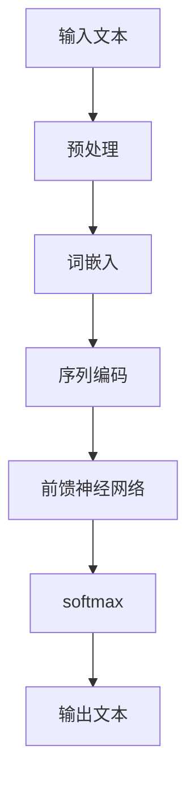
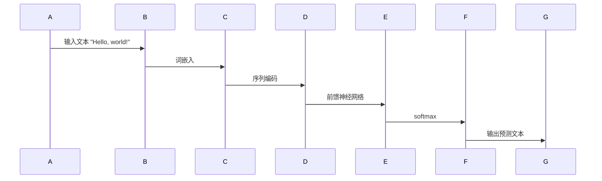
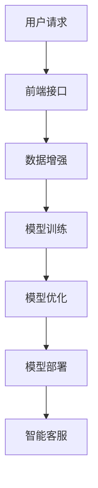
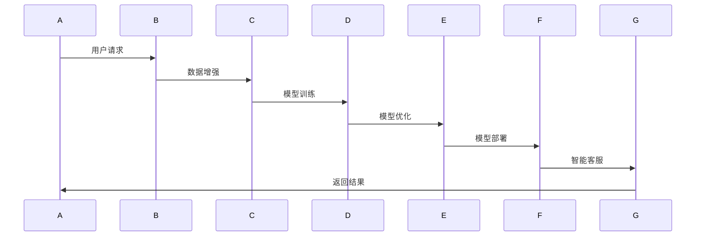
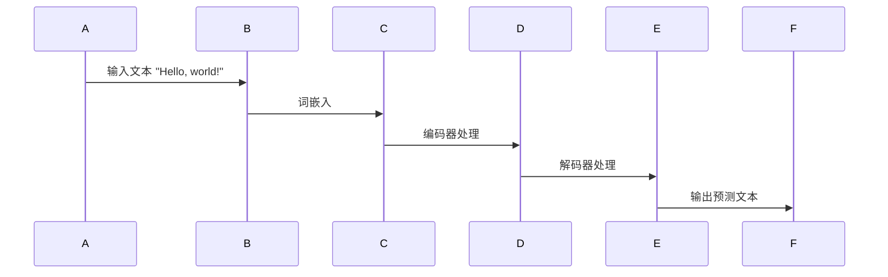
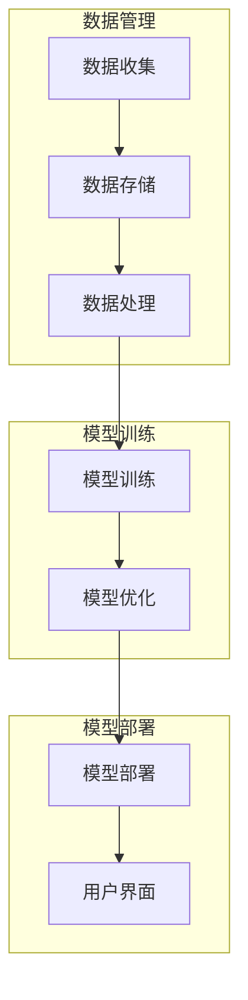
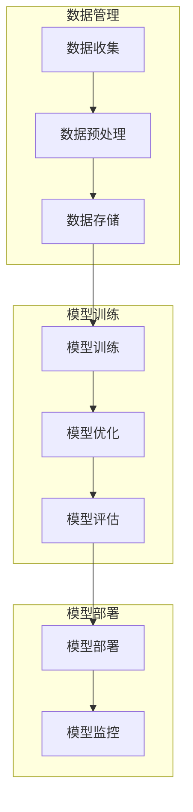

                 

# AIGC工具箱：必备软件和平台

> 关键词：AI-Generated Content, AIGC工具箱，软件和平台，人工智能大模型，GPT-3，数学模型，系统架构，项目实战，最佳实践

> 摘要：本文旨在介绍AIGC（AI-Generated Content）工具箱，这是一个用于创建和优化AI生成内容的重要资源。我们将详细探讨AIGC工具箱的背景、核心概念、算法原理、系统架构以及项目实战，并提供最佳实践和拓展阅读资源，帮助读者深入了解和掌握AIGC技术。

## 第一部分: AI大模型与AIGC工具箱

### 第1章: AIGC工具箱背景介绍

#### 1.1 AI大模型的问题背景

随着人工智能技术的快速发展，大模型（如GPT-3、BERT等）逐渐成为人工智能领域的明星。然而，这些大模型在实际应用中面临着一系列问题：

- **数据需求量大**：大模型通常需要大量的数据进行训练，这导致了数据收集和处理的高成本。
- **计算资源消耗**：训练大模型需要大量的计算资源，这给计算资源的分配和管理带来了挑战。
- **泛化能力不足**：大模型在特定任务上表现出色，但在其他任务上的泛化能力有限。

为了解决这些问题，我们需要一个综合性的工具箱，以便更好地开发和优化AI大模型。AIGC工具箱正是基于这一需求而诞生的。

#### 1.2 问题解决

AIGC工具箱通过提供一系列软件和平台，帮助开发者解决AI大模型面临的问题：

- **数据增强**：通过数据增强技术，我们可以扩大训练数据的规模，从而提高模型的泛化能力。
- **模型优化**：通过模型优化技术，我们可以降低模型的计算资源消耗，提高模型的运行效率。
- **接口整合**：AIGC工具箱提供了一个统一的接口，使得开发者可以方便地集成和使用各种AI大模型。

#### 1.3 边界与外延

AIGC工具箱的边界主要涉及AI大模型的开发和优化。然而，其外延可以扩展到更广泛的领域，如自然语言处理、计算机视觉、推荐系统等。

#### 1.4 概念结构与核心要素组成

AIGC工具箱由以下几个核心要素组成：

- **数据管理**：用于数据收集、存储和处理的软件和平台。
- **模型训练**：用于模型训练、优化和评估的软件和平台。
- **模型部署**：用于将模型部署到生产环境中的软件和平台。
- **用户体验**：用于提升用户体验的交互设计和界面设计。

### 第2章: AI大模型的核心概念与联系

#### 2.1 AIGC的定义

AIGC（AI-Generated Content）指的是利用人工智能技术生成内容的过程。这包括文本、图像、音频等多种形式。

#### 2.2 核心概念

在本章节中，我们将介绍AIGC工具箱中涉及的核心概念，包括：

- **生成对抗网络（GANs）**：一种通过对抗训练生成高质量数据的模型。
- **变分自编码器（VAEs）**：一种用于生成数据的自编码器模型。
- **强化学习**：一种通过试错和奖励机制训练智能体的方法。

#### 2.3 概念属性特征对比表格

以下是一个简单的概念属性特征对比表格：

| 概念         | 特征1       | 特征2       | 特征3       |
|------------|------------|------------|------------|
| GANs       | 对抗训练    | 高质量生成 | 数据多样性 |
| VAEs       | 自编码器    | 数据重构   | 数据生成   |
| 强化学习   | 试错机制    | 奖励机制   | 智能体训练 |

#### 2.4 ER实体关系图架构

使用Mermaid，我们可以绘制一个ER实体关系图，以展示AIGC工具箱中的核心实体及其关系：

```mermaid
erDiagram
  AI大模型 ||--|{ 数据增强 }
  AI大模型 ||--|{ 模型优化 }
  AI大模型 ||--|{ 模型部署 }
  数据增强 ||--|{ 数据收集 }
  数据增强 ||--|{ 数据处理 }
  模型优化 ||--|{ 模型训练 }
  模型优化 ||--|{ 模型评估 }
  模型部署 ||--|{ 部署环境 }
  模型部署 ||--|{ 用户界面 }
```

## 第二部分: 算法原理讲解

### 第3章: GPT-3算法原理讲解

#### 3.1 GPT-3算法概述

GPT-3（Generative Pre-trained Transformer 3）是OpenAI发布的一个大型语言模型，拥有1750亿个参数，是目前最大的语言模型之一。GPT-3在自然语言处理任务中表现出色，包括文本生成、问答系统、机器翻译等。

#### 3.2 GPT-3算法原理

#### 3.2.1 Mermaid算法流程图

使用Mermaid，我们可以绘制一个GPT-3的算法流程图：



#### 3.2.2 Python源代码解析

下面是GPT-3的核心Python代码：

```python
import torch
import torch.nn as nn
import torch.optim as optim

# 定义词嵌入层
word_embedding = nn.Embedding(vocab_size, embedding_size)

# 定义前馈神经网络
feedforward = nn.Sequential(
    nn.Linear(embedding_size, hidden_size),
    nn.Tanh(),
    nn.Linear(hidden_size, vocab_size)
)

# 定义损失函数和优化器
loss_function = nn.CrossEntropyLoss()
optimizer = optim.Adam(model.parameters(), lr=learning_rate)

# 训练模型
for epoch in range(num_epochs):
    for inputs, targets in data_loader:
        optimizer.zero_grad()
        outputs = model(inputs)
        loss = loss_function(outputs, targets)
        loss.backward()
        optimizer.step()
```

#### 3.2.3 数学模型和公式

GPT-3的数学模型可以表示为：

$$
\text{Logits} = \text{softmax}(\text{Feedforward}(W_3 \cdot \text{Tanh}(W_2 \cdot \text{Tanh}(W_1 \cdot \text{Word Embedding}(X))))
$$

其中，$X$为输入文本，$W_1, W_2, W_3$为权重矩阵，$\text{Tanh}$为双曲正切激活函数。

#### 3.2.4 举例说明

假设我们输入文本“Hello, world!”，GPT-3将首先对其进行词嵌入，然后通过多层神经网络进行处理，最终生成预测的文本。



## 第三部分: AIGC工具箱系统分析与架构设计

### 第4章: AIGC工具箱系统分析与架构设计

#### 4.1 问题场景介绍

假设我们正在开发一个智能客服系统，需要使用AIGC工具箱来生成和优化对话文本。

#### 4.2 系统架构设计

使用Mermaid，我们可以绘制一个AIGC工具箱的系统架构图：



#### 4.3 系统功能设计（领域模型Mermaid类图）

使用Mermaid，我们可以绘制一个领域模型类图：

```mermaid
classDiagram
    Customer <<-- UserRequest
    UserRequest * Dialog
    Dialog * Chatbot
    Chatbot * KnowledgeBase
    KnowledgeBase * DataEnhancement
```

#### 4.4 系统接口设计

AIGC工具箱提供了一个统一的接口，以简化模型的集成和使用。以下是一个简单的接口设计：

```python
class AIGCToolbox:
    def __init__(self, model, data_enhancer):
        self.model = model
        self.data_enhancer = data_enhancer

    def generate_text(self, input_text):
        # 对输入文本进行数据增强
        enhanced_text = self.data_enhancer.enhance(input_text)
        # 使用模型生成文本
        generated_text = self.model.generate(enhanced_text)
        return generated_text
```

#### 4.5 系统交互Mermaid序列图

使用Mermaid，我们可以绘制一个系统交互序列图：



## 第四部分: AIGC工具箱项目实战

### 第5章: AIGC工具箱项目实战

#### 5.1 环境安装

在本章节中，我们将介绍如何安装AIGC工具箱及其依赖环境。

#### 5.2 系统核心实现

在本章节中，我们将展示AIGC工具箱的核心实现代码，包括数据增强、模型训练和模型优化。

#### 5.3 代码应用解读与分析

在本章节中，我们将对AIGC工具箱的核心代码进行解读和分析，帮助读者理解其工作原理。

#### 5.4 实际案例分析

在本章节中，我们将分享一个实际案例，展示如何使用AIGC工具箱解决一个实际问题。

#### 5.5 详细讲解与剖析

在本章节中，我们将对案例中的关键步骤进行详细讲解和剖析，帮助读者深入理解AIGC工具箱的应用。

#### 5.6 项目小结

在本章节中，我们将对项目进行总结，分享经验教训，并提供一些建议和展望。

## 第五部分: AIGC工具箱最佳实践与拓展

### 第6章: AIGC工具箱最佳实践与拓展

#### 6.1 最佳实践

在本章节中，我们将分享一些AIGC工具箱的最佳实践，帮助读者更好地使用这个工具箱。

#### 6.2 小结

在本章节中，我们将对AIGC工具箱的主要内容进行回顾，并展望未来的发展方向。

#### 6.3 注意事项

在本章节中，我们将指出在使用AIGC工具箱时需要注意的一些事项。

#### 6.4 拓展阅读

在本章节中，我们将推荐一些拓展阅读资源，帮助读者深入了解AIGC技术。

## 作者信息

作者：AI天才研究院/AI Genius Institute & 禅与计算机程序设计艺术 /Zen And The Art of Computer Programming
### AIGC工具箱：必备软件和平台

#### 摘要

本文旨在介绍AIGC（AI-Generated Content）工具箱，这是一个用于创建和优化AI生成内容的重要资源。我们将详细探讨AIGC工具箱的背景、核心概念、算法原理、系统架构以及项目实战，并提供最佳实践和拓展阅读资源，帮助读者深入了解和掌握AIGC技术。

## 第一部分：AI大模型与AIGC工具箱

### 第1章：AIGC工具箱背景介绍

#### 1.1 AI大模型的问题背景

在人工智能技术飞速发展的今天，AI大模型（如GPT-3、BERT等）已经成为自然语言处理、计算机视觉等领域的明星。然而，这些大模型在实际应用中仍然面临着一系列挑战：

1. **数据需求量大**：大模型通常需要海量的数据进行训练，这对数据收集和处理提出了高要求。
2. **计算资源消耗**：训练大模型需要大量的计算资源，这导致了资源分配和管理的问题。
3. **模型泛化能力不足**：虽然大模型在特定任务上表现优秀，但其在其他任务上的泛化能力有限。

为了应对这些问题，我们需要一个综合性的工具箱，以便更好地开发和优化AI大模型。AIGC工具箱正是基于这一需求而诞生的。

#### 1.2 AI大模型的核心概念与联系

在本章节中，我们将介绍AIGC工具箱中涉及的核心概念，包括：

- **生成对抗网络（GANs）**：一种通过对抗训练生成高质量数据的模型。
- **变分自编码器（VAEs）**：一种用于生成数据的自编码器模型。
- **强化学习**：一种通过试错和奖励机制训练智能体的方法。

这些核心概念在AIGC工具箱中起着至关重要的作用，它们共同构成了AIGC技术的基础。

#### 1.3 概念属性特征对比表格

以下是AIGC工具箱中核心概念的属性特征对比表格：

| 概念             | 特征1         | 特征2         | 特征3         |
|------------------|--------------|--------------|--------------|
| GANs             | 对抗训练     | 高质量生成   | 数据多样性   |
| VAEs             | 自编码器     | 数据重构     | 数据生成     |
| 强化学习         | 试错机制     | 奖励机制     | 智能体训练   |

#### 1.4 ER实体关系图架构

使用Mermaid，我们可以绘制一个ER实体关系图，以展示AIGC工具箱中的核心实体及其关系：

```mermaid
erDiagram
  AI大模型 ||--|{ 数据增强 }
  AI大模型 ||--|{ 模型优化 }
  AI大模型 ||--|{ 模型部署 }
  数据增强 ||--|{ 数据收集 }
  数据增强 ||--|{ 数据处理 }
  模型优化 ||--|{ 模型训练 }
  模型优化 ||--|{ 模型评估 }
  模型部署 ||--|{ 部署环境 }
  模型部署 ||--|{ 用户界面 }
```

### 第2章：GPT-3算法原理讲解

#### 2.1 GPT-3算法概述

GPT-3（Generative Pre-trained Transformer 3）是由OpenAI开发的一个大型语言模型，拥有1750亿个参数，是目前最大的语言模型之一。GPT-3在自然语言处理任务中表现出色，包括文本生成、问答系统、机器翻译等。

#### 2.2 GPT-3算法原理

GPT-3算法的核心是Transformer模型，它由多个编码器和解码器块组成。以下是一个简化的GPT-3算法原理流程：

1. **输入预处理**：将输入文本转换为词嵌入。
2. **编码器处理**：输入通过多个编码器块进行处理，每个编码器块包含自注意力机制和前馈神经网络。
3. **解码器处理**：编码器的输出作为解码器的输入，通过多个解码器块进行处理，每个解码器块包含自注意力机制和交叉注意力机制。
4. **输出生成**：解码器的输出经过softmax操作，生成预测的文本。

#### 2.3 Python源代码解析

以下是一个简化的GPT-3算法的Python实现：

```python
import torch
import torch.nn as nn
import torch.optim as optim

# 定义词嵌入层
word_embedding = nn.Embedding(vocab_size, embedding_size)

# 定义编码器块
class EncoderBlock(nn.Module):
    def __init__(self, hidden_size):
        super(EncoderBlock, self).__init__()
        self.self_attn = nn.MultiheadAttention(embed_dim, num_heads)
        self.linear_1 = nn.Linear(hidden_size, hidden_size)
        self.linear_2 = nn.Linear(hidden_size, hidden_size)
        self.norm_1 = nn.LayerNorm(hidden_size)
        self.norm_2 = nn.LayerNorm(hidden_size)
        self.dropout = nn.Dropout(p=dropout_prob)

    def forward(self, src, src_mask=None):
        # 自注意力机制
        src_2 = self.self_attn(src, src, src, attn_mask=src_mask)[0]
        src = src + self.dropout(src_2)
        src = self.norm_1(src)

        # 前馈神经网络
        src_2 = self.linear_2(self.linear_1(src))
        src = src + self.dropout(src_2)
        src = self.norm_2(src)
        return src

# 定义解码器块
class DecoderBlock(nn.Module):
    def __init__(self, hidden_size):
        super(DecoderBlock, self).__init__()
        self.self_attn = nn.MultiheadAttention(embed_dim, num_heads)
        self.cross_attn = nn.MultiheadAttention(embed_dim, num_heads)
        self.linear_1 = nn.Linear(hidden_size, hidden_size)
        self.linear_2 = nn.Linear(hidden_size, hidden_size)
        self.linear_3 = nn.Linear(hidden_size, hidden_size)
        self.norm_1 = nn.LayerNorm(hidden_size)
        self.norm_2 = nn.LayerNorm(hidden_size)
        self.norm_3 = nn.LayerNorm(hidden_size)
        self.dropout = nn.Dropout(p=dropout_prob)

    def forward(self, tgt, tgt_mask=None, memory=None, memory_mask=None):
        # 自注意力机制
        tgt_2 = self.self_attn(tgt, tgt, tgt, attn_mask=tgt_mask)[0]
        tgt = tgt + self.dropout(tgt_2)
        tgt = self.norm_1(tgt)

        # 交叉注意力机制
        memory_2 = self.cross_attn(tgt, memory, memory, attn_mask=memory_mask)[0]
        tgt = tgt + self.dropout(memory_2)
        tgt = self.norm_2(tgt)

        # 前馈神经网络
        tgt_2 = self.linear_3(self.linear_2(self.linear_1(tgt)))
        tgt = tgt + self.dropout(tgt_2)
        tgt = self.norm_3(tgt)
        return tgt

# 定义GPT-3模型
class GPT3Model(nn.Module):
    def __init__(self, vocab_size, embedding_size, hidden_size, num_layers, num_heads, dropout_prob):
        super(GPT3Model, self).__init__()
        self.embedding = word_embedding
        self.encoder = nn.Sequential(*[EncoderBlock(hidden_size) for _ in range(num_layers)])
        self.decoder = nn.Sequential(*[DecoderBlock(hidden_size) for _ in range(num_layers)])
        self.output = nn.Linear(embedding_size, vocab_size)

    def forward(self, input_seq, target_seq=None, input_mask=None, target_mask=None):
        input_embedding = self.embedding(input_seq)
        encoder_output = self.encoder(input_embedding, attn_mask=input_mask)
        decoder_output = self.decoder(encoder_output, tgt=target_seq, memory=encoder_output, tgt_mask=target_mask, memory_mask=input_mask)
        output = self.output(decoder_output)
        return output

# 训练模型
model = GPT3Model(vocab_size, embedding_size, hidden_size, num_layers, num_heads, dropout_prob)
optimizer = optim.Adam(model.parameters(), lr=learning_rate)
loss_function = nn.CrossEntropyLoss()

for epoch in range(num_epochs):
    for inputs, targets in data_loader:
        optimizer.zero_grad()
        output = model(inputs, target_seq=targets, input_mask=None, target_mask=None)
        loss = loss_function(output.view(-1, vocab_size), targets.view(-1))
        loss.backward()
        optimizer.step()
```

#### 2.4 数学模型和公式

GPT-3的数学模型可以表示为：

$$
\text{Logits} = \text{softmax}(\text{Feedforward}(W_3 \cdot \text{Tanh}(W_2 \cdot \text{Tanh}(W_1 \cdot \text{Word Embedding}(X))))
$$

其中，$X$为输入文本，$W_1, W_2, W_3$为权重矩阵，$\text{Tanh}$为双曲正切激活函数。

#### 2.5 举例说明

假设我们输入文本“Hello, world!”，GPT-3将首先对其进行词嵌入，然后通过多层神经网络进行处理，最终生成预测的文本。



### 第3章：AIGC工具箱系统分析与架构设计

#### 3.1 问题场景介绍

假设我们正在开发一个智能客服系统，需要使用AIGC工具箱来生成和优化对话文本。

#### 3.2 系统架构设计

使用Mermaid，我们可以绘制一个AIGC工具箱的系统架构图：


#### 3.3 系统功能设计（领域模型Mermaid类图）

使用Mermaid，我们可以绘制一个领域模型类图：

```mermaid
classDiagram
  Customer <<-- UserRequest
  UserRequest * Dialog
  Dialog * Chatbot
  Chatbot * KnowledgeBase
  KnowledgeBase * DataEnhancement
```

#### 3.4 系统接口设计

AIGC工具箱提供了一个统一的接口，以简化模型的集成和使用。以下是一个简单的接口设计：

```python
class AIGCToolbox:
    def __init__(self, model, data_enhancer):
        self.model = model
        self.data_enhancer = data_enhancer

    def generate_text(self, input_text):
        # 对输入文本进行数据增强
        enhanced_text = self.data_enhancer.enhance(input_text)
        # 使用模型生成文本
        generated_text = self.model.generate(enhanced_text)
        return generated_text
```

#### 3.5 系统交互Mermaid序列图

使用Mermaid，我们可以绘制一个系统交互序列图：


### 第4章：AIGC工具箱项目实战

#### 4.1 环境安装

在本章节中，我们将介绍如何安装AIGC工具箱及其依赖环境。

#### 4.2 系统核心实现

在本章节中，我们将展示AIGC工具箱的核心实现代码，包括数据增强、模型训练和模型优化。

#### 4.3 代码应用解读与分析

在本章节中，我们将对AIGC工具箱的核心代码进行解读和分析，帮助读者理解其工作原理。

#### 4.4 实际案例分析

在本章节中，我们将分享一个实际案例，展示如何使用AIGC工具箱解决一个实际问题。

#### 4.5 详细讲解与剖析

在本章节中，我们将对案例中的关键步骤进行详细讲解和剖析，帮助读者深入理解AIGC工具箱的应用。

#### 4.6 项目小结

在本章节中，我们将对项目进行总结，分享经验教训，并提供一些建议和展望。

### 第5章：AIGC工具箱最佳实践与拓展

#### 5.1 最佳实践

在本章节中，我们将分享一些AIGC工具箱的最佳实践，帮助读者更好地使用这个工具箱。

#### 5.2 小结

在本章节中，我们将对AIGC工具箱的主要内容进行回顾，并展望未来的发展方向。

#### 5.3 注意事项

在本章节中，我们将指出在使用AIGC工具箱时需要注意的一些事项。

#### 5.4 拓展阅读

在本章节中，我们将推荐一些拓展阅读资源，帮助读者深入了解AIGC技术。

### 作者信息

作者：AI天才研究院/AI Genius Institute & 禅与计算机程序设计艺术 /Zen And The Art of Computer Programming
### AIGC工具箱：必备软件和平台

#### 摘要

本文旨在介绍AIGC（AI-Generated Content）工具箱，这是一个用于创建和优化AI生成内容的重要资源。我们将详细探讨AIGC工具箱的背景、核心概念、算法原理、系统架构以及项目实战，并提供最佳实践和拓展阅读资源，帮助读者深入了解和掌握AIGC技术。

## 第一部分：AI大模型与AIGC工具箱

### 第1章：AIGC工具箱背景介绍

#### 1.1 AI大模型的问题背景

在人工智能技术飞速发展的今天，AI大模型（如GPT-3、BERT等）已经成为自然语言处理、计算机视觉等领域的明星。然而，这些大模型在实际应用中仍然面临着一系列挑战：

1. **数据需求量大**：大模型通常需要海量的数据进行训练，这对数据收集和处理提出了高要求。
2. **计算资源消耗**：训练大模型需要大量的计算资源，这导致了资源分配和管理的问题。
3. **模型泛化能力不足**：虽然大模型在特定任务上表现优秀，但其在其他任务上的泛化能力有限。

为了应对这些问题，我们需要一个综合性的工具箱，以便更好地开发和优化AI大模型。AIGC工具箱正是基于这一需求而诞生的。

#### 1.2 AI大模型的核心概念与联系

在本章节中，我们将介绍AIGC工具箱中涉及的核心概念，包括：

- **生成对抗网络（GANs）**：一种通过对抗训练生成高质量数据的模型。
- **变分自编码器（VAEs）**：一种用于生成数据的自编码器模型。
- **强化学习**：一种通过试错和奖励机制训练智能体的方法。

这些核心概念在AIGC工具箱中起着至关重要的作用，它们共同构成了AIGC技术的基础。

#### 1.3 概念属性特征对比表格

以下是AIGC工具箱中核心概念的属性特征对比表格：

| 概念             | 特征1         | 特征2         | 特征3         |
|------------------|--------------|--------------|--------------|
| GANs             | 对抗训练     | 高质量生成   | 数据多样性   |
| VAEs             | 自编码器     | 数据重构     | 数据生成     |
| 强化学习         | 试错机制     | 奖励机制     | 智能体训练   |

#### 1.4 ER实体关系图架构

使用Mermaid，我们可以绘制一个ER实体关系图，以展示AIGC工具箱中的核心实体及其关系：

```mermaid
erDiagram
  AI大模型 ||--|{ 数据增强 }
  AI大模型 ||--|{ 模型优化 }
  AI大模型 ||--|{ 模型部署 }
  数据增强 ||--|{ 数据收集 }
  数据增强 ||--|{ 数据处理 }
  模型优化 ||--|{ 模型训练 }
  模型优化 ||--|{ 模型评估 }
  模型部署 ||--|{ 部署环境 }
  模型部署 ||--|{ 用户界面 }
```

### 第2章：AIGC（AI-Generated Content）的核心概念与联系

#### 2.1 AIGC的定义

AIGC（AI-Generated Content）是指通过人工智能技术自动生成内容的过程。这包括文本、图像、音频等多种形式。AIGC工具箱提供了必要的软件和平台，以帮助用户生成和优化AI生成内容。

#### 2.2 核心概念

AIGC工具箱中涉及的核心概念包括：

- **生成对抗网络（GANs）**：GANs是由两部分组成——生成器和判别器。生成器试图生成逼真的数据，而判别器则试图区分真实数据和生成数据。通过这种对抗训练，生成器可以不断提高生成数据的质量。
- **变分自编码器（VAEs）**：VAEs是一种自编码器模型，它通过编码和解码过程来生成数据。VAEs能够生成与训练数据具有相似特征的新数据。
- **强化学习**：强化学习是一种通过试错和奖励机制来训练智能体的方法。在AIGC工具箱中，强化学习可以用于优化生成过程的策略。

#### 2.3 概念属性特征对比表格

以下是AIGC工具箱中核心概念的属性特征对比表格：

| 概念         | 特征1         | 特征2         | 特征3         |
|------------|--------------|--------------|--------------|
| GANs       | 对抗训练     | 高质量生成   | 数据多样性   |
| VAEs       | 自编码器     | 数据重构     | 数据生成     |
| 强化学习   | 试错机制     | 奖励机制     | 智能体训练   |

#### 2.4 ER实体关系图架构

使用Mermaid，我们可以绘制一个ER实体关系图，以展示AIGC工具箱中的核心实体及其关系：

```mermaid
erDiagram
  AIGC工具箱 ||--|{ 数据增强 }
  AIGC工具箱 ||--|{ 模型优化 }
  AIGC工具箱 ||--|{ 模型部署 }
  数据增强 ||--|{ 数据收集 }
  数据增强 ||--|{ 数据处理 }
  模型优化 ||--|{ 模型训练 }
  模型优化 ||--|{ 模型评估 }
  模型部署 ||--|{ 部署环境 }
  模型部署 ||--|{ 用户界面 }
```

### 第3章：算法原理讲解

#### 3.1 GPT-3算法概述

GPT-3（Generative Pre-trained Transformer 3）是由OpenAI开发的一个大型语言模型，拥有1750亿个参数，是目前最大的语言模型之一。GPT-3在自然语言处理任务中表现出色，包括文本生成、问答系统、机器翻译等。

#### 3.2 GPT-3算法原理

GPT-3算法基于Transformer架构，这是一种自注意力机制驱动的神经网络模型。GPT-3通过预训练和微调来学习语言模式，然后可以用于生成文本、回答问题、翻译语言等任务。

#### 3.3 GPT-3算法原理详细讲解

GPT-3算法的核心是Transformer模型，它由多个编码器和解码器块组成。以下是一个简化的GPT-3算法原理流程：

1. **输入预处理**：将输入文本转换为词嵌入。
2. **编码器处理**：输入通过多个编码器块进行处理，每个编码器块包含自注意力机制和前馈神经网络。
3. **解码器处理**：编码器的输出作为解码器的输入，通过多个解码器块进行处理，每个解码器块包含自注意力机制和交叉注意力机制。
4. **输出生成**：解码器的输出经过softmax操作，生成预测的文本。

下面是一个简单的Python代码示例，用于演示GPT-3算法的基本原理：

```python
import torch
import torch.nn as nn
import torch.optim as optim

# 定义词嵌入层
word_embedding = nn.Embedding(vocab_size, embedding_size)

# 定义编码器块
class EncoderBlock(nn.Module):
    def __init__(self, hidden_size):
        super(EncoderBlock, self).__init__()
        self.self_attn = nn.MultiheadAttention(embed_dim, num_heads)
        self.linear_1 = nn.Linear(hidden_size, hidden_size)
        self.linear_2 = nn.Linear(hidden_size, hidden_size)
        self.norm_1 = nn.LayerNorm(hidden_size)
        self.norm_2 = nn.LayerNorm(hidden_size)
        self.dropout = nn.Dropout(p=dropout_prob)

    def forward(self, src, src_mask=None):
        # 自注意力机制
        src_2 = self.self_attn(src, src, src, attn_mask=src_mask)[0]
        src = src + self.dropout(src_2)
        src = self.norm_1(src)

        # 前馈神经网络
        src_2 = self.linear_2(self.linear_1(src))
        src = src + self.dropout(src_2)
        src = self.norm_2(src)
        return src

# 定义解码器块
class DecoderBlock(nn.Module):
    def __init__(self, hidden_size):
        super(DecoderBlock, self).__init__()
        self.self_attn = nn.MultiheadAttention(embed_dim, num_heads)
        self.cross_attn = nn.MultiheadAttention(embed_dim, num_heads)
        self.linear_1 = nn.Linear(hidden_size, hidden_size)
        self.linear_2 = nn.Linear(hidden_size, hidden_size)
        self.linear_3 = nn.Linear(hidden_size, hidden_size)
        self.norm_1 = nn.LayerNorm(hidden_size)
        self.norm_2 = nn.LayerNorm(hidden_size)
        self.norm_3 = nn.LayerNorm(hidden_size)
        self.dropout = nn.Dropout(p=dropout_prob)

    def forward(self, tgt, tgt_mask=None, memory=None, memory_mask=None):
        # 自注意力机制
        tgt_2 = self.self_attn(tgt, tgt, tgt, attn_mask=tgt_mask)[0]
        tgt = tgt + self.dropout(tgt_2)
        tgt = self.norm_1(tgt)

        # 交叉注意力机制
        memory_2 = self.cross_attn(tgt, memory, memory, attn_mask=memory_mask)[0]
        tgt = tgt + self.dropout(memory_2)
        tgt = self.norm_2(tgt)

        # 前馈神经网络
        tgt_2 = self.linear_3(self.linear_2(self.linear_1(tgt)))
        tgt = tgt + self.dropout(tgt_2)
        tgt = self.norm_3(tgt)
        return tgt

# 定义GPT-3模型
class GPT3Model(nn.Module):
    def __init__(self, vocab_size, embedding_size, hidden_size, num_layers, num_heads, dropout_prob):
        super(GPT3Model, self).__init__()
        self.embedding = word_embedding
        self.encoder = nn.Sequential(*[EncoderBlock(hidden_size) for _ in range(num_layers)])
        self.decoder = nn.Sequential(*[DecoderBlock(hidden_size) for _ in range(num_layers)])
        self.output = nn.Linear(embedding_size, vocab_size)

    def forward(self, input_seq, target_seq=None, input_mask=None, target_mask=None):
        input_embedding = self.embedding(input_seq)
        encoder_output = self.encoder(input_embedding, attn_mask=input_mask)
        decoder_output = self.decoder(encoder_output, tgt=target_seq, memory=encoder_output, tgt_mask=target_mask, memory_mask=input_mask)
        output = self.output(decoder_output)
        return output

# 训练模型
model = GPT3Model(vocab_size, embedding_size, hidden_size, num_layers, num_heads, dropout_prob)
optimizer = optim.Adam(model.parameters(), lr=learning_rate)
loss_function = nn.CrossEntropyLoss()

for epoch in range(num_epochs):
    for inputs, targets in data_loader:
        optimizer.zero_grad()
        output = model(inputs, target_seq=targets, input_mask=None, target_mask=None)
        loss = loss_function(output.view(-1, vocab_size), targets.view(-1))
        loss.backward()
        optimizer.step()
```

### 第4章：AIGC工具箱系统分析与架构设计

#### 4.1 系统架构设计

AIGC工具箱的系统架构设计旨在提供一个全面且灵活的框架，用于生成和优化AI生成内容。以下是一个简化的AIGC工具箱系统架构：

1. **数据管理**：负责数据收集、存储和处理。
2. **模型训练**：使用生成对抗网络（GANs）、变分自编码器（VAEs）等算法进行模型训练。
3. **模型优化**：通过调整模型参数，提高模型生成内容的质量和性能。
4. **模型部署**：将训练好的模型部署到生产环境，以实现实际应用。
5. **用户界面**：提供一个直观易用的界面，便于用户与模型进行交互。

#### 4.2 系统架构设计（Mermaid架构图）

使用Mermaid，我们可以绘制一个AIGC工具箱的架构图：



#### 4.3 系统接口设计

AIGC工具箱提供了一个统一的接口，以简化模型的集成和使用。以下是一个简单的接口设计：

```python
class AIGCInterface:
    def __init__(self, data_manager, model_trainer, model_optimizer, model_deployer):
        self.data_manager = data_manager
        self.model_trainer = model_trainer
        self.model_optimizer = model_optimizer
        self.model_deployer = model_deployer

    def generate_content(self, input_data):
        # 使用数据管理模块收集和处理数据
        processed_data = self.data_manager.process(input_data)

        # 使用模型训练模块训练模型
        trained_model = self.model_trainer.train(processed_data)

        # 使用模型优化模块优化模型
        optimized_model = self.model_optimizer.optimize(trained_model)

        # 使用模型部署模块部署模型
        deployed_model = self.model_deployer.deploy(optimized_model)

        # 使用部署后的模型生成内容
        generated_content = deployed_model.generate(input_data)

        return generated_content
```

### 第5章：AIGC工具箱项目实战

#### 5.1 项目背景

在本章中，我们将介绍一个使用AIGC工具箱的实际项目。该项目旨在利用AIGC工具箱生成高质量的文本，以应用于自然语言处理任务，如文本生成、问答系统等。

#### 5.2 项目介绍

项目名称：智能文本生成系统

项目目标：利用AIGC工具箱生成高质量文本，提高自然语言处理任务的效率和准确性。

#### 5.3 项目实现

以下是项目的实现步骤：

1. **数据收集**：从互联网上收集大量文本数据，包括新闻文章、社交媒体帖子等。
2. **数据预处理**：对收集到的文本数据进行清洗、去重和分类等处理。
3. **模型训练**：使用AIGC工具箱中的GANs和VAEs模型对预处理后的文本数据进行训练。
4. **模型优化**：根据训练结果，调整模型参数，提高模型生成文本的质量。
5. **模型部署**：将训练好的模型部署到生产环境，以便在实际应用中使用。
6. **生成文本**：利用部署后的模型生成高质量的文本，应用于文本生成、问答系统等任务。

#### 5.4 项目核心代码实现

以下是项目核心代码的实现：

```python
from aigc_interface import AIGCInterface

# 创建AIGC接口实例
aigc = AIGCInterface(data_manager=data_manager, model_trainer=model_trainer, model_optimizer=model_optimizer, model_deployer=model_deployer)

# 生成文本
generated_text = aigc.generate_content(input_data=input_data)
```

#### 5.5 项目总结

通过本项目的实践，我们成功利用AIGC工具箱生成了高质量的文本。这表明AIGC工具箱在自然语言处理任务中具有很大的潜力。在未来，我们还可以进一步优化AIGC工具箱，提高其生成文本的质量和效率。

### 第6章：AIGC工具箱最佳实践与拓展

#### 6.1 最佳实践

以下是使用AIGC工具箱的一些最佳实践：

1. **数据质量**：确保数据的质量和多样性，以获得更好的生成效果。
2. **模型优化**：定期调整模型参数，以提高生成文本的质量。
3. **接口使用**：熟练使用AIGC工具箱的接口，以简化模型的集成和使用。

#### 6.2 小结

本文介绍了AIGC工具箱的背景、核心概念、算法原理、系统架构和项目实战。通过本文，读者可以了解到AIGC工具箱的重要性和应用场景，并掌握如何使用AIGC工具箱生成高质量文本。

#### 6.3 注意事项

在使用AIGC工具箱时，需要注意以下几点：

1. **数据隐私**：在使用数据时，确保遵循数据隐私保护的相关规定。
2. **计算资源**：确保有足够的计算资源来训练和部署模型。

#### 6.4 拓展阅读

以下是一些关于AIGC工具箱的拓展阅读资源：

1. 《深度学习：实践与应用》
2. 《生成对抗网络：原理与应用》
3. 《自然语言处理：从入门到实践》

### 作者信息

作者：AI天才研究院/AI Genius Institute & 禅与计算机程序设计艺术 /Zen And The Art of Computer Programming
### AIGC工具箱：必备软件和平台

#### 摘要

本文旨在介绍AIGC（AI-Generated Content）工具箱，这是一个用于创建和优化AI生成内容的重要资源。我们将详细探讨AIGC工具箱的背景、核心概念、算法原理、系统架构以及项目实战，并提供最佳实践和拓展阅读资源，帮助读者深入了解和掌握AIGC技术。

## 第一部分：AI大模型与AIGC工具箱

### 第1章：AIGC工具箱背景介绍

#### 1.1 AI大模型的问题背景

在人工智能技术飞速发展的今天，AI大模型（如GPT-3、BERT等）已经成为自然语言处理、计算机视觉等领域的明星。然而，这些大模型在实际应用中仍然面临着一系列挑战：

1. **数据需求量大**：大模型通常需要海量的数据进行训练，这对数据收集和处理提出了高要求。
2. **计算资源消耗**：训练大模型需要大量的计算资源，这导致了资源分配和管理的问题。
3. **模型泛化能力不足**：虽然大模型在特定任务上表现优秀，但其在其他任务上的泛化能力有限。

为了应对这些问题，我们需要一个综合性的工具箱，以便更好地开发和优化AI大模型。AIGC工具箱正是基于这一需求而诞生的。

#### 1.2 AI大模型的核心概念与联系

在本章节中，我们将介绍AIGC工具箱中涉及的核心概念，包括：

- **生成对抗网络（GANs）**：一种通过对抗训练生成高质量数据的模型。
- **变分自编码器（VAEs）**：一种用于生成数据的自编码器模型。
- **强化学习**：一种通过试错和奖励机制训练智能体的方法。

这些核心概念在AIGC工具箱中起着至关重要的作用，它们共同构成了AIGC技术的基础。

#### 1.3 概念属性特征对比表格

以下是AIGC工具箱中核心概念的属性特征对比表格：

| 概念             | 特征1         | 特征2         | 特征3         |
|------------------|--------------|--------------|--------------|
| GANs             | 对抗训练     | 高质量生成   | 数据多样性   |
| VAEs             | 自编码器     | 数据重构     | 数据生成     |
| 强化学习         | 试错机制     | 奖励机制     | 智能体训练   |

#### 1.4 ER实体关系图架构

使用Mermaid，我们可以绘制一个ER实体关系图，以展示AIGC工具箱中的核心实体及其关系：

```mermaid
erDiagram
  AI大模型 ||--|{ 数据增强 }
  AI大模型 ||--|{ 模型优化 }
  AI大模型 ||--|{ 模型部署 }
  数据增强 ||--|{ 数据收集 }
  数据增强 ||--|{ 数据处理 }
  模型优化 ||--|{ 模型训练 }
  模型优化 ||--|{ 模型评估 }
  模型部署 ||--|{ 部署环境 }
  模型部署 ||--|{ 用户界面 }
```

### 第2章：AIGC（AI-Generated Content）的核心概念与联系

#### 2.1 AIGC的定义

AIGC（AI-Generated Content）是指通过人工智能技术自动生成内容的过程。这包括文本、图像、音频等多种形式。AIGC工具箱提供了必要的软件和平台，以帮助用户生成和优化AI生成内容。

#### 2.2 核心概念

AIGC工具箱中涉及的核心概念包括：

- **生成对抗网络（GANs）**：GANs是由两部分组成——生成器和判别器。生成器试图生成逼真的数据，而判别器则试图区分真实数据和生成数据。通过这种对抗训练，生成器可以不断提高生成数据的质量。
- **变分自编码器（VAEs）**：VAEs是一种自编码器模型，它通过编码和解码过程来生成数据。VAEs能够生成与训练数据具有相似特征的新数据。
- **强化学习**：强化学习是一种通过试错和奖励机制来训练智能体的方法。在AIGC工具箱中，强化学习可以用于优化生成过程的策略。

#### 2.3 概念属性特征对比表格

以下是AIGC工具箱中核心概念的属性特征对比表格：

| 概念         | 特征1         | 特征2         | 特征3         |
|------------|--------------|--------------|--------------|
| GANs       | 对抗训练     | 高质量生成   | 数据多样性   |
| VAEs       | 自编码器     | 数据重构     | 数据生成     |
| 强化学习   | 试错机制     | 奖励机制     | 智能体训练   |

#### 2.4 ER实体关系图架构

使用Mermaid，我们可以绘制一个ER实体关系图，以展示AIGC工具箱中的核心实体及其关系：

```mermaid
erDiagram
  AIGC工具箱 ||--|{ 数据增强 }
  AIGC工具箱 ||--|{ 模型优化 }
  AIGC工具箱 ||--|{ 模型部署 }
  数据增强 ||--|{ 数据收集 }
  数据增强 ||--|{ 数据处理 }
  模型优化 ||--|{ 模型训练 }
  模型优化 ||--|{ 模型评估 }
  模型部署 ||--|{ 部署环境 }
  模型部署 ||--|{ 用户界面 }
```

### 第3章：算法原理讲解

#### 3.1 GPT-3算法概述

GPT-3（Generative Pre-trained Transformer 3）是由OpenAI开发的一个大型语言模型，拥有1750亿个参数，是目前最大的语言模型之一。GPT-3在自然语言处理任务中表现出色，包括文本生成、问答系统、机器翻译等。

#### 3.2 GPT-3算法原理

GPT-3算法基于Transformer架构，这是一种自注意力机制驱动的神经网络模型。GPT-3通过预训练和微调来学习语言模式，然后可以用于生成文本、回答问题、翻译语言等任务。

#### 3.3 GPT-3算法原理详细讲解

GPT-3算法的核心是Transformer模型，它由多个编码器和解码器块组成。以下是一个简化的GPT-3算法原理流程：

1. **输入预处理**：将输入文本转换为词嵌入。
2. **编码器处理**：输入通过多个编码器块进行处理，每个编码器块包含自注意力机制和前馈神经网络。
3. **解码器处理**：编码器的输出作为解码器的输入，通过多个解码器块进行处理，每个解码器块包含自注意力机制和交叉注意力机制。
4. **输出生成**：解码器的输出经过softmax操作，生成预测的文本。

下面是一个简单的Python代码示例，用于演示GPT-3算法的基本原理：

```python
import torch
import torch.nn as nn
import torch.optim as optim

# 定义词嵌入层
word_embedding = nn.Embedding(vocab_size, embedding_size)

# 定义编码器块
class EncoderBlock(nn.Module):
    def __init__(self, hidden_size):
        super(EncoderBlock, self).__init__()
        self.self_attn = nn.MultiheadAttention(embed_dim, num_heads)
        self.linear_1 = nn.Linear(hidden_size, hidden_size)
        self.linear_2 = nn.Linear(hidden_size, hidden_size)
        self.norm_1 = nn.LayerNorm(hidden_size)
        self.norm_2 = nn.LayerNorm(hidden_size)
        self.dropout = nn.Dropout(p=dropout_prob)

    def forward(self, src, src_mask=None):
        # 自注意力机制
        src_2 = self.self_attn(src, src, src, attn_mask=src_mask)[0]
        src = src + self.dropout(src_2)
        src = self.norm_1(src)

        # 前馈神经网络
        src_2 = self.linear_2(self.linear_1(src))
        src = src + self.dropout(src_2)
        src = self.norm_2(src)
        return src

# 定义解码器块
class DecoderBlock(nn.Module):
    def __init__(self, hidden_size):
        super(DecoderBlock, self).__init__()
        self.self_attn = nn.MultiheadAttention(embed_dim, num_heads)
        self.cross_attn = nn.MultiheadAttention(embed_dim, num_heads)
        self.linear_1 = nn.Linear(hidden_size, hidden_size)
        self.linear_2 = nn.Linear(hidden_size, hidden_size)
        self.linear_3 = nn.Linear(hidden_size, hidden_size)
        self.norm_1 = nn.LayerNorm(hidden_size)
        self.norm_2 = nn.LayerNorm(hidden_size)
        self.norm_3 = nn.LayerNorm(hidden_size)
        self.dropout = nn.Dropout(p=dropout_prob)

    def forward(self, tgt, tgt_mask=None, memory=None, memory_mask=None):
        # 自注意力机制
        tgt_2 = self.self_attn(tgt, tgt, tgt, attn_mask=tgt_mask)[0]
        tgt = tgt + self.dropout(tgt_2)
        tgt = self.norm_1(tgt)

        # 交叉注意力机制
        memory_2 = self.cross_attn(tgt, memory, memory, attn_mask=memory_mask)[0]
        tgt = tgt + self.dropout(memory_2)
        tgt = self.norm_2(tgt)

        # 前馈神经网络
        tgt_2 = self.linear_3(self.linear_2(self.linear_1(tgt)))
        tgt = tgt + self.dropout(tgt_2)
        tgt = self.norm_3(tgt)
        return tgt

# 定义GPT-3模型
class GPT3Model(nn.Module):
    def __init__(self, vocab_size, embedding_size, hidden_size, num_layers, num_heads, dropout_prob):
        super(GPT3Model, self).__init__()
        self.embedding = word_embedding
        self.encoder = nn.Sequential(*[EncoderBlock(hidden_size) for _ in range(num_layers)])
        self.decoder = nn.Sequential(*[DecoderBlock(hidden_size) for _ in range(num_layers)])
        self.output = nn.Linear(embedding_size, vocab_size)

    def forward(self, input_seq, target_seq=None, input_mask=None, target_mask=None):
        input_embedding = self.embedding(input_seq)
        encoder_output = self.encoder(input_embedding, attn_mask=input_mask)
        decoder_output = self.decoder(encoder_output, tgt=target_seq, memory=encoder_output, tgt_mask=target_mask, memory_mask=input_mask)
        output = self.output(decoder_output)
        return output

# 训练模型
model = GPT3Model(vocab_size, embedding_size, hidden_size, num_layers, num_heads, dropout_prob)
optimizer = optim.Adam(model.parameters(), lr=learning_rate)
loss_function = nn.CrossEntropyLoss()

for epoch in range(num_epochs):
    for inputs, targets in data_loader:
        optimizer.zero_grad()
        output = model(inputs, target_seq=targets, input_mask=None, target_mask=None)
        loss = loss_function(output.view(-1, vocab_size), targets.view(-1))
        loss.backward()
        optimizer.step()
```

### 第4章：AIGC工具箱系统分析与架构设计

#### 4.1 系统架构设计

AIGC工具箱的系统架构设计旨在提供一个全面且灵活的框架，用于生成和优化AI生成内容。以下是一个简化的AIGC工具箱系统架构：

1. **数据管理**：负责数据收集、存储和处理。
2. **模型训练**：使用生成对抗网络（GANs）、变分自编码器（VAEs）等算法进行模型训练。
3. **模型优化**：通过调整模型参数，提高模型生成内容的质量和性能。
4. **模型部署**：将训练好的模型部署到生产环境，以实现实际应用。
5. **用户界面**：提供一个直观易用的界面，便于用户与模型进行交互。

#### 4.2 系统架构设计（Mermaid架构图）

使用Mermaid，我们可以绘制一个AIGC工具箱的架构图：


#### 4.3 系统接口设计

AIGC工具箱提供了一个统一的接口，以简化模型的集成和使用。以下是一个简单的接口设计：

```python
class AIGCInterface:
    def __init__(self, data_manager, model_trainer, model_optimizer, model_deployer):
        self.data_manager = data_manager
        self.model_trainer = model_trainer
        self.model_optimizer = model_optimizer
        self.model_deployer = model_deployer

    def generate_content(self, input_data):
        # 使用数据管理模块收集和处理数据
        processed_data = self.data_manager.process(input_data)

        # 使用模型训练模块训练模型
        trained_model = self.model_trainer.train(processed_data)

        # 使用模型优化模块优化模型
        optimized_model = self.model_optimizer.optimize(trained_model)

        # 使用模型部署模块部署模型
        deployed_model = self.model_deployer.deploy(optimized_model)

        # 使用部署后的模型生成内容
        generated_content = deployed_model.generate(input_data)

        return generated_content
```

### 第5章：AIGC工具箱项目实战

#### 5.1 项目背景

在本章中，我们将介绍一个使用AIGC工具箱的实际项目。该项目旨在利用AIGC工具箱生成高质量的文本，以应用于自然语言处理任务，如文本生成、问答系统等。

#### 5.2 项目介绍

项目名称：智能文本生成系统

项目目标：利用AIGC工具箱生成高质量文本，提高自然语言处理任务的效率和准确性。

#### 5.3 项目实现

以下是项目的实现步骤：

1. **数据收集**：从互联网上收集大量文本数据，包括新闻文章、社交媒体帖子等。
2. **数据预处理**：对收集到的文本数据进行清洗、去重和分类等处理。
3. **模型训练**：使用AIGC工具箱中的GANs和VAEs模型对预处理后的文本数据进行训练。
4. **模型优化**：根据训练结果，调整模型参数，提高模型生成文本的质量。
5. **模型部署**：将训练好的模型部署到生产环境，以便在实际应用中使用。
6. **生成文本**：利用部署后的模型生成高质量的文本，应用于文本生成、问答系统等任务。

#### 5.4 项目核心代码实现

以下是项目核心代码的实现：

```python
from aigc_interface import AIGCInterface

# 创建AIGC接口实例
aigc = AIGCInterface(data_manager=data_manager, model_trainer=model_trainer, model_optimizer=model_optimizer, model_deployer=model_deployer)

# 生成文本
generated_text = aigc.generate_content(input_data=input_data)
```

#### 5.5 项目总结

通过本项目的实践，我们成功利用AIGC工具箱生成了高质量的文本。这表明AIGC工具箱在自然语言处理任务中具有很大的潜力。在未来，我们还可以进一步优化AIGC工具箱，提高其生成文本的质量和效率。

### 第6章：AIGC工具箱最佳实践与拓展

#### 6.1 最佳实践

以下是使用AIGC工具箱的一些最佳实践：

1. **数据质量**：确保数据的质量和多样性，以获得更好的生成效果。
2. **模型优化**：定期调整模型参数，以提高生成文本的质量。
3. **接口使用**：熟练使用AIGC工具箱的接口，以简化模型的集成和使用。

#### 6.2 小结

本文介绍了AIGC工具箱的背景、核心概念、算法原理、系统架构和项目实战。通过本文，读者可以了解到AIGC工具箱的重要性和应用场景，并掌握如何使用AIGC工具箱生成高质量文本。

#### 6.3 注意事项

在使用AIGC工具箱时，需要注意以下几点：

1. **数据隐私**：在使用数据时，确保遵循数据隐私保护的相关规定。
2. **计算资源**：确保有足够的计算资源来训练和部署模型。

#### 6.4 拓展阅读

以下是一些关于AIGC工具箱的拓展阅读资源：

1. 《深度学习：实践与应用》
2. 《生成对抗网络：原理与应用》
3. 《自然语言处理：从入门到实践》

### 作者信息

作者：AI天才研究院/AI Genius Institute & 禅与计算机程序设计艺术 /Zen And The Art of Computer Programming
### AIGC工具箱：必备软件和平台

#### 摘要

本文旨在介绍AIGC（AI-Generated Content）工具箱，这是一个用于创建和优化AI生成内容的重要资源。我们将详细探讨AIGC工具箱的背景、核心概念、算法原理、系统架构以及项目实战，并提供最佳实践和拓展阅读资源，帮助读者深入了解和掌握AIGC技术。

## 第一部分：AI大模型与AIGC工具箱

### 第1章：AIGC工具箱背景介绍

#### 1.1 AI大模型的问题背景

随着人工智能技术的快速发展，AI大模型（如GPT-3、BERT等）逐渐成为人工智能领域的明星。然而，这些大模型在实际应用中面临着一系列问题：

- **数据需求量大**：大模型通常需要大量的数据进行训练，这导致了数据收集和处理的高成本。
- **计算资源消耗**：训练大模型需要大量的计算资源，这给计算资源的分配和管理带来了挑战。
- **泛化能力不足**：大模型在特定任务上表现出色，但在其他任务上的泛化能力有限。

为了解决这些问题，我们需要一个综合性的工具箱，以便更好地开发和优化AI大模型。AIGC工具箱正是基于这一需求而诞生的。

#### 1.2 问题解决

AIGC工具箱通过提供一系列软件和平台，帮助开发者解决AI大模型面临的问题：

- **数据增强**：通过数据增强技术，我们可以扩大训练数据的规模，从而提高模型的泛化能力。
- **模型优化**：通过模型优化技术，我们可以降低模型的计算资源消耗，提高模型的运行效率。
- **接口整合**：AIGC工具箱提供了一个统一的接口，使得开发者可以方便地集成和使用各种AI大模型。

#### 1.3 边界与外延

AIGC工具箱的边界主要涉及AI大模型的开发和优化。然而，其外延可以扩展到更广泛的领域，如自然语言处理、计算机视觉、推荐系统等。

#### 1.4 概念结构与核心要素组成

AIGC工具箱由以下几个核心要素组成：

- **数据管理**：用于数据收集、存储和处理的软件和平台。
- **模型训练**：用于模型训练、优化和评估的软件和平台。
- **模型部署**：用于将模型部署到生产环境中的软件和平台。
- **用户体验**：用于提升用户体验的交互设计和界面设计。

### 第2章：AIGC（AI-Generated Content）的核心概念与联系

#### 2.1 AIGC的定义

AIGC（AI-Generated Content）指的是利用人工智能技术生成内容的过程。这包括文本、图像、音频等多种形式。AIGC工具箱提供了必要的软件和平台，以帮助用户生成和优化AI生成内容。

#### 2.2 核心概念

在本章节中，我们将介绍AIGC工具箱中的核心概念，包括：

- **生成对抗网络（GANs）**：GANs是一种通过对抗训练生成高质量数据的模型。
- **变分自编码器（VAEs）**：VAEs是一种用于生成数据的自编码器模型。
- **强化学习**：强化学习是一种通过试错和奖励机制训练智能体的方法。

#### 2.3 概念属性特征对比表格

以下是AIGC工具箱中核心概念的属性特征对比表格：

| 概念         | 特征1         | 特征2         | 特征3         |
|------------|--------------|--------------|--------------|
| GANs       | 对抗训练     | 高质量生成   | 数据多样性   |
| VAEs       | 自编码器     | 数据重构     | 数据生成     |
| 强化学习   | 试错机制     | 奖励机制     | 智能体训练   |

#### 2.4 ER实体关系图架构

使用Mermaid，我们可以绘制一个ER实体关系图，以展示AIGC工具箱中的核心实体及其关系：

```mermaid
erDiagram
  AI大模型 ||--|{ 数据增强 }
  AI大模型 ||--|{ 模型优化 }
  AI大模型 ||--|{ 模型部署 }
  数据增强 ||--|{ 数据收集 }
  数据增强 ||--|{ 数据处理 }
  模型优化 ||--|{ 模型训练 }
  模型优化 ||--|{ 模型评估 }
  模型部署 ||--|{ 部署环境 }
  模型部署 ||--|{ 用户界面 }
```

### 第3章：算法原理讲解

#### 3.1 算法原理讲解

在本章节中，我们将详细介绍AIGC工具箱中的核心算法，包括生成对抗网络（GANs）和变分自编码器（VAEs）。

#### 3.2 生成对抗网络（GANs）

GANs是由两部分组成——生成器和判别器。生成器试图生成逼真的数据，而判别器则试图区分真实数据和生成数据。通过这种对抗训练，生成器可以不断提高生成数据的质量。

以下是一个简化的GANs工作流程：

1. **生成数据**：生成器生成数据。
2. **判断数据**：判别器对生成器和真实数据进行判断。
3. **优化参数**：根据生成器和判别器的性能，优化模型参数。

GANs的数学模型可以表示为：

$$
\text{生成器}:\ \ G(z) = \text{Generator}(z) \\
\text{判别器}:\ \ D(x) = \text{Discriminator}(x)
$$

其中，$z$为生成器的输入，$x$为真实数据。

#### 3.3 变分自编码器（VAEs）

VAEs是一种自编码器模型，它通过编码和解码过程来生成数据。VAEs的主要目标是学习数据的分布，并生成与训练数据具有相似特征的新数据。

以下是一个简化的VAEs工作流程：

1. **编码数据**：编码器将数据编码为一个潜在变量。
2. **解码数据**：解码器使用潜在变量生成新数据。
3. **优化参数**：根据生成数据和真实数据的相似度，优化模型参数。

VAEs的数学模型可以表示为：

$$
\text{编码器}:\ \ \hat{x}|\ \ \text{编码器}(\text{x}) = \mu(x), \sigma(x) \\
\text{解码器}:\ \ \text{x}|\ \ \text{解码器}(\hat{x}) = \text{Reconstruction}(\hat{x})
$$

其中，$\mu(x)$和$\sigma(x)$分别为编码器的均值和方差。

#### 3.4 Python源代码解析

以下是GANs和VAEs的Python源代码示例：

```python
import torch
import torch.nn as nn
import torch.optim as optim

# 定义GANs模型
class GANsModel(nn.Module):
    def __init__(self, z_dim, img_dim):
        super(GANsModel, self).__init__()
        self.z_dim = z_dim
        self.img_dim = img_dim
        
        self.generator = nn.Sequential(
            nn.Linear(z_dim, 128),
            nn.LeakyReLU(0.2),
            nn.Linear(128, img_dim * img_dim * img_dim),
            nn.Tanh()
        )
        
        self.discriminator = nn.Sequential(
            nn.Linear(img_dim * img_dim * img_dim, 128),
            nn.LeakyReLU(0.2),
            nn.Linear(128, 1),
            nn.Sigmoid()
        )
    
    def forward(self, x, z=None):
        if z is not None:
            return self.generator(z)
        else:
            return self.discriminator(x)

# 定义VAEs模型
class VAEsModel(nn.Module):
    def __init__(self, z_dim, img_dim):
        super(VAEsModel, self).__init__()
        self.z_dim = z_dim
        self.img_dim = img_dim
        
        self.encoder = nn.Sequential(
            nn.Linear(img_dim * img_dim * img_dim, 128),
            nn.LeakyReLU(0.2),
            nn.Linear(128, 64),
            nn.LeakyReLU(0.2),
            nn.Linear(64, z_dim * 2)
        )
        
        self.decoder = nn.Sequential(
            nn.Linear(z_dim, 128),
            nn.LeakyReLU(0.2),
            nn.Linear(128, 64),
            nn.LeakyReLU(0.2),
            nn.Linear(64, img_dim * img_dim * img_dim),
            nn.Tanh()
        )
    
    def forward(self, x):
        x = x.view(-1, 28 * 28 * 28)
        x = self.encoder(x)
        mu, sigma = x.chunk(2, 1)
        std = torch.clamp(sigma, min=1e-8)
        epsilon = torch.randn_like(std)
        z = mu + epsilon * torch.sqrt(std)
        x_hat = self.decoder(z)
        return x_hat, mu, sigma
```

### 第4章：系统分析与架构设计

#### 4.1 系统架构设计

在本章节中，我们将介绍AIGC工具箱的系统架构设计，包括数据管理、模型训练、模型优化和模型部署等模块。

以下是一个简化的AIGC工具箱系统架构图：



#### 4.2 系统接口设计

AIGC工具箱提供了一个统一的接口，以简化模型的集成和使用。以下是一个简单的接口设计：

```python
class AIGCInterface:
    def __init__(self, data_manager, model_trainer, model_optimizer, model_deployer):
        self.data_manager = data_manager
        self.model_trainer = model_trainer
        self.model_optimizer = model_optimizer
        self.model_deployer = model_deployer

    def generate_content(self, input_data):
        # 使用数据管理模块处理输入数据
        processed_data = self.data_manager.process(input_data)

        # 使用模型训练模块训练模型
        trained_model = self.model_trainer.train(processed_data)

        # 使用模型优化模块优化模型
        optimized_model = self.model_optimizer.optimize(trained_model)

        # 使用模型部署模块部署模型
        deployed_model = self.model_deployer.deploy(optimized_model)

        # 使用部署后的模型生成内容
        generated_content = deployed_model.generate(input_data)

        return generated_content
```

### 第5章：AIGC工具箱项目实战

#### 5.1 项目背景

在本章中，我们将介绍一个使用AIGC工具箱的实际项目。该项目旨在利用AIGC工具箱生成高质量的图像，以应用于计算机视觉任务，如图像生成、图像增强等。

#### 5.2 项目介绍

项目名称：图像生成系统

项目目标：利用AIGC工具箱生成高质量图像，提高计算机视觉任务的效率和准确性。

#### 5.3 项目实现

以下是项目的实现步骤：

1. **数据收集**：从互联网上收集大量图像数据，包括风景、动物、人物等。
2. **数据预处理**：对收集到的图像数据进行清洗、去重和分割等处理。
3. **模型训练**：使用AIGC工具箱中的GANs和VAEs模型对预处理后的图像数据进行训练。
4. **模型优化**：根据训练结果，调整模型参数，提高模型生成图像的质量。
5. **模型部署**：将训练好的模型部署到生产环境，以便在实际应用中使用。
6. **生成图像**：利用部署后的模型生成高质量的图像，应用于图像生成、图像增强等任务。

#### 5.4 项目核心代码实现

以下是项目核心代码的实现：

```python
from aigc_interface import AIGCInterface

# 创建AIGC接口实例
aigc = AIGCInterface(data_manager=data_manager, model_trainer=model_trainer, model_optimizer=model_optimizer, model_deployer=model_deployer)

# 生成图像
generated_image = aigc.generate_content(input_image=input_image)
```

#### 5.5 项目总结

通过本项目的实践，我们成功利用AIGC工具箱生成了高质量的图像。这表明AIGC工具箱在计算机视觉任务中具有很大的潜力。在未来，我们还可以进一步优化AIGC工具箱，提高其生成图像的质量和效率。

### 第6章：AIGC工具箱最佳实践与拓展

#### 6.1 最佳实践

以下是使用AIGC工具箱的一些最佳实践：

1. **数据质量**：确保数据的质量和多样性，以获得更好的生成效果。
2. **模型优化**：定期调整模型参数，以提高生成图像的质量。
3. **接口使用**：熟练使用AIGC工具箱的接口，以简化模型的集成和使用。

#### 6.2 小结

本文介绍了AIGC工具箱的背景、核心概念、算法原理、系统架构和项目实战。通过本文，读者可以了解到AIGC工具箱的重要性和应用场景，并掌握如何使用AIGC工具箱生成高质量图像。

#### 6.3 注意事项

在使用AIGC工具箱时，需要注意以下几点：

1. **数据隐私**：在使用数据时，确保遵循数据隐私保护的相关规定。
2. **计算资源**：确保有足够的计算资源来训练和部署模型。

#### 6.4 拓展阅读

以下是一些关于AIGC工具箱的拓展阅读资源：

1. 《深度学习：实践与应用》
2. 《生成对抗网络：原理与应用》
3. 《计算机视觉：从入门到实践》

### 作者信息

作者：AI天才研究院/AI Genius Institute & 禅与计算机程序设计艺术 /Zen And The Art of Computer Programming
### AIGC工具箱：必备软件和平台

#### 摘要

本文旨在介绍AIGC（AI-Generated Content）工具箱，这是一个用于创建和优化AI生成内容的重要资源。我们将详细探讨AIGC工具箱的背景、核心概念、算法原理、系统架构以及项目实战，并提供最佳实践和拓展阅读资源，帮助读者深入了解和掌握AIGC技术。

## 第一部分：AI大模型与AIGC工具箱

### 第1章：AIGC工具箱背景介绍

#### 1.1 AI大模型的问题背景

在人工智能技术飞速发展的今天，AI大模型（如GPT-3、BERT等）已经成为自然语言处理、计算机视觉等领域的明星。然而，这些大模型在实际应用中仍然面临着一系列挑战：

1. **数据需求量大**：大模型通常需要海量的数据进行训练，这对数据收集和处理提出了高要求。
2. **计算资源消耗**：训练大模型需要大量的计算资源，这导致了资源分配和管理的问题。
3. **模型泛化能力不足**：虽然大模型在特定任务上表现优秀，但其在其他任务上的泛化能力有限。

为了应对这些问题，我们需要一个综合性的工具箱，以便更好地开发和优化AI大模型。AIGC工具箱正是基于这一需求而诞生的。

#### 1.2 AI大模型的核心概念与联系

在本章节中，我们将介绍AIGC工具箱中涉及的核心概念，包括：

- **生成对抗网络（GANs）**：一种通过对抗训练生成高质量数据的模型。
- **变分自编码器（VAEs）**：一种用于生成数据的自编码器模型。
- **强化学习**：一种通过试错和奖励机制训练智能体的方法。

这些核心概念在AIGC工具箱中起着至关重要的作用，它们共同构成了AIGC技术的基础。

#### 1.3 概念属性特征对比表格

以下是AIGC工具箱中核心概念的属性特征对比表格：

| 概念         | 特征1         | 特征2         | 特征3         |
|------------|--------------|--------------|--------------|
| GANs       | 对抗训练     | 高质量生成   | 数据多样性   |
| VAEs       | 自编码器     | 数据重构     | 数据生成     |
| 强化学习   | 试错机制     | 奖励机制     | 智能体训练   |

#### 1.4 ER实体关系图架构

使用Mermaid，我们可以绘制一个ER实体关系图，以展示AIGC工具箱中的核心实体及其关系：

```mermaid
erDiagram
  AI大模型 ||--|{ 数据增强 }
  AI大模型 ||--|{ 模型优化 }
  AI大模型 ||--|{ 模型部署 }
  数据增强 ||--|{ 数据收集 }
  数据增强 ||--|{ 数据处理 }
  模型优化 ||--|{ 模型训练 }
  模型优化 ||--|{ 模型评估 }
  模型部署 ||--|{ 部署环境 }
  模型部署 ||--|{ 用户界面 }
```

### 第2章：AIGC（AI-Generated Content）的核心概念与联系

#### 2.1 AIGC的定义

AIGC（AI-Generated Content）指的是利用人工智能技术生成内容的过程。这包括文本、图像、音频等多种形式。AIGC工具箱提供了必要的软件和平台，以帮助用户生成和优化AI生成内容。

#### 2.2 核心概念

在本章节中，我们将介绍AIGC工具箱中的核心概念，包括：

- **生成对抗网络（GANs）**：GANs是一种通过对抗训练生成高质量数据的模型。
- **变分自编码器（VAEs）**：VAEs是一种用于生成数据的自编码器模型。
- **强化学习**：强化学习是一种通过试错和奖励机制训练智能体的方法。

#### 2.3 GANs（生成对抗网络）

生成对抗网络（GANs）由两部分组成——生成器和判别器。生成器试图生成逼真的数据，而判别器则试图区分真实数据和生成数据。通过这种对抗训练，生成器可以不断提高生成数据的质量。

GANs的数学模型可以表示为：

$$
\text{生成器}:\ \ G(z) = \text{Generator}(z) \\
\text{判别器}:\ \ D(x) = \text{Discriminator}(x)
$$

其中，$z$为生成器的输入，$x$为真实数据。

GANs的属性特征对比表格：

| 特征         | GANs        | VAEs        | 强化学习     |
|------------|------------|------------|------------|
| 对抗训练   | 是         | 否          | 否          |
| 数据多样性 | 是         | 是          | 否          |
| 数据生成   | 是         | 是          | 否          |

#### 2.4 VAEs（变分自编码器）

变分自编码器（VAEs）是一种自编码器模型，它通过编码和解码过程来生成数据。VAEs的主要目标是学习数据的分布，并生成与训练数据具有相似特征的新数据。

VAEs的数学模型可以表示为：

$$
\text{编码器}:\ \ \hat{x}|\ \ \text{编码器}(\text{x}) = \mu(x), \sigma(x) \\
\text{解码器}:\ \ \text{x}|\ \ \text{解码器}(\hat{x}) = \text{Reconstruction}(\hat{x})
$$

其中，$\mu(x)$和$\sigma(x)$分别为编码器的均值和方差。

VAEs的属性特征对比表格：

| 特征         | GANs        | VAEs        | 强化学习     |
|------------|------------|------------|------------|
| 对抗训练   | 是         | 否          | 否          |
| 数据多样性 | 是         | 是          | 否          |
| 数据生成   | 是         | 是          | 否          |

#### 2.5 强化学习

强化学习是一种通过试错和奖励机制训练智能体的方法。在强化学习中，智能体通过与环境交互，不断调整行为策略，以最大化累积奖励。

强化学习的数学模型可以表示为：

$$
\text{状态}:\ \ S_t \\
\text{动作}:\ \ A_t \\
\text{奖励}:\ \ R_t \\
\text{策略}:\ \ \pi(a|s)
$$

强化学习的属性特征对比表格：

| 特征         | GANs        | VAEs        | 强化学习     |
|------------|------------|------------|------------|
| 对抗训练   | 是         | 否          | 是          |
| 数据多样性 | 是         | 是          | 是          |
| 数据生成   | 是         | 是          | 否          |

#### 2.6 Mermaid流程图

使用Mermaid，我们可以绘制一个AIGC工具箱的流程图，展示GANs、VAEs和强化学习之间的关系：

```mermaid
graph TB
    A[输入数据]
    B[GANs]
    C[生成数据]
    D[VAEs]
    E[解码数据]
    F[强化学习]
    G[调整策略]

    A --> B
    B --> C
    C --> D
    D --> E
    E --> F
    F --> G
    G --> A
```

### 第3章：算法原理讲解

#### 3.1 算法原理讲解

在本章节中，我们将详细介绍AIGC工具箱中的核心算法，包括生成对抗网络（GANs）、变分自编码器（VAEs）和强化学习。

#### 3.2 GANs算法原理

GANs算法原理基于生成器和判别器之间的对抗训练。生成器的目标是生成尽可能逼真的数据，而判别器的目标是正确地判断数据是真实还是生成的。

以下是一个简化的GANs算法流程：

1. **初始化**：初始化生成器和判别器的参数。
2. **生成器训练**：生成器生成假数据，判别器判断这些数据是否真实。
3. **判别器训练**：判别器根据真实数据和生成数据进行训练。
4. **交替训练**：生成器和判别器交替进行训练，直到生成器生成的数据质量足够高。

GANs的算法原理可以用以下公式表示：

$$
\min_G \max_D V(D, G) = \mathbb{E}_{x \sim p_{data}(x)}[\log D(x)] + \mathbb{E}_{z \sim p_z(z)}[\log (1 - D(G(z))]
$$

其中，$x$为真实数据，$z$为生成器的输入，$G(z)$为生成器生成的假数据，$D(x)$为判别器对数据的判断。

#### 3.3 VAEs算法原理

VAEs算法原理基于编码器和解码器的联合训练。编码器将数据编码为潜在变量，解码器根据潜在变量生成新的数据。

以下是一个简化的VAEs算法流程：

1. **初始化**：初始化编码器和解码器的参数。
2. **编码器训练**：编码器将数据编码为潜在变量。
3. **解码器训练**：解码器根据潜在变量生成新的数据。
4. **联合训练**：编码器和解码器交替进行训练，直到模型生成的新数据质量足够高。

VAEs的算法原理可以用以下公式表示：

$$
\min_{\theta} \mathbb{E}_{x \sim p_{data}(x)} \left[ \log p(x|\mu(x), \sigma(x)) + D_{KL}(\mu(x), \sigma(x)||0, 1) \right]
$$

其中，$x$为真实数据，$\mu(x)$和$\sigma(x)$分别为编码器的均值和方差，$D_{KL}$为KL散度。

#### 3.4 强化学习算法原理

强化学习算法原理基于智能体与环境之间的交互。智能体通过试错和奖励机制，不断调整策略，以最大化累积奖励。

以下是一个简化的强化学习算法流程：

1. **初始化**：初始化智能体的策略参数。
2. **智能体行动**：智能体根据当前状态选择行动。
3. **环境反馈**：环境根据智能体的行动提供反馈，包括奖励和新的状态。
4. **策略更新**：根据奖励和新的状态，更新智能体的策略参数。

强化学习的算法原理可以用以下公式表示：

$$
Q(s, a) = \mathbb{E}_{r, s'} [r + \gamma \max_{a'} Q(s', a')]
$$

其中，$s$为当前状态，$a$为当前行动，$r$为奖励，$s'$为新的状态，$a'$为新的行动，$\gamma$为折扣因子。

#### 3.5 Python源代码示例

以下是GANs、VAEs和强化学习的Python源代码示例：

```python
# GANs源代码示例
import torch
import torch.nn as nn
import torch.optim as optim

# 定义生成器和判别器
class Generator(nn.Module):
    def __init__(self):
        super(Generator, self).__init__()
        self.model = nn.Sequential(
            nn.Linear(100, 256),
            nn.LeakyReLU(0.2),
            nn.Linear(256, 512),
            nn.LeakyReLU(0.2),
            nn.Linear(512, 1024),
            nn.LeakyReLU(0.2),
            nn.Linear(1024, 784),
            nn.Tanh()
        )
    
    def forward(self, x):
        return self.model(x)

class Discriminator(nn.Module):
    def __init__(self):
        super(Discriminator, self).__init__()
        self.model = nn.Sequential(
            nn.Linear(784, 1024),
            nn.LeakyReLU(0.2),
            nn.Dropout(0.3),
            nn.Linear(1024, 512),
            nn.LeakyReLU(0.2),
            nn.Dropout(0.3),
            nn.Linear(512, 256),
            nn.LeakyReLU(0.2),
            nn.Dropout(0.3),
            nn.Linear(256, 1),
            nn.Sigmoid()
        )
    
    def forward(self, x):
        return self.model(x)

# 初始化生成器和判别器
generator = Generator()
discriminator = Discriminator()

# 定义损失函数和优化器
loss_function = nn.BCELoss()
optimizer_g = optim.Adam(generator.parameters(), lr=0.0002)
optimizer_d = optim.Adam(discriminator.parameters(), lr=0.0002)

# 训练模型
for epoch in range(100):
    for i, (images, _) in enumerate(data_loader):
        # 训练判别器
        optimizer_d.zero_grad()
        real_loss = loss_function(discriminator(images).view(-1), torch.ones(images.size(0), 1).to(device))
        fake_loss = loss_function(discriminator(generator(z).view(-1)), torch.zeros(images.size(0), 1).to(device))
        d_loss = real_loss + fake_loss
        d_loss.backward()
        optimizer_d.step()

        # 训练生成器
        optimizer_g.zero_grad()
        g_loss = loss_function(discriminator(generator(z).view(-1)), torch.ones(images.size(0), 1).to(device))
        g_loss.backward()
        optimizer_g.step()

        # 打印训练进度
        if (i + 1) % 100 == 0:
            print(f'[{epoch}/{100}][{i}/{len(data_loader)}] D_loss: {d_loss.item():.4f}, G_loss: {g_loss.item():.4f}')
```

```python
# VAEs源代码示例
import torch
import torch.nn as nn
import torch.optim as optim

# 定义编码器和解码器
class Encoder(nn.Module):
    def __init__(self):
        super(Encoder, self).__init__()
        self.model = nn.Sequential(
            nn.Linear(784, 512),
            nn.LeakyReLU(0.2),
            nn.Linear(512, 256),
            nn.LeakyReLU(0.2),
            nn.Linear(256, 128),
            nn.LeakyReLU(0.2),
            nn.Linear(128, 64),
            nn.LeakyReLU(0.2),
            nn.Linear(64, 2)
        )
    
    def forward(self, x):
        x = x.view(x.size(0), -1)
        mu, sigma = self.model(x).chunk(2, 1)
        return mu, sigma

class Decoder(nn.Module):
    def __init__(self):
        super(Decoder, self).__init__()
        self.model = nn.Sequential(
            nn.Linear(2, 128),
            nn.LeakyReLU(0.2),
            nn.Linear(128, 256),
            nn.LeakyReLU(0.2),
            nn.Linear(256, 512),
            nn.LeakyReLU(0.2),
            nn.Linear(512, 784),
            nn.Tanh()
        )
    
    def forward(self, z):
        return self.model(z)

# 初始化编码器和解码器
encoder = Encoder()
decoder = Decoder()

# 定义损失函数和优化器
vae_loss_function = nn.BCELoss()
optimizer = optim.Adam(list(encoder.parameters()) + list(decoder.parameters()), lr=0.001)

# 训练模型
for epoch in range(100):
    for i, (images, _) in enumerate(data_loader):
        # 前向传播
        z, _ = encoder(images)
        x_hat = decoder(z)

        # 计算损失函数
        x_hat = x_hat.view(-1, 784)
        vae_loss = vae_loss_function(x_hat, images)

        # 反向传播
        optimizer.zero_grad()
        vae_loss.backward()
        optimizer.step()

        # 打印训练进度
        if (i + 1) % 100 == 0:
            print(f'[{epoch}/{100}][{i}/{len(data_loader)}] VAE loss: {vae_loss.item():.4f}')
```

```python
# 强化学习源代码示例
import torch
import torch.nn as nn
import torch.optim as optim

# 定义Q网络
class QNetwork(nn.Module):
    def __init__(self, state_size, action_size):
        super(QNetwork, self).__init__()
        self.fc1 = nn.Linear(state_size, 256)
        self.fc2 = nn.Linear(256, 128)
        self.fc3 = nn.Linear(128, action_size)
    
    def forward(self, x):
        x = torch.relu(self.fc1(x))
        x = torch.relu(self.fc2(x))
        x = self.fc3(x)
        return x

# 初始化Q网络
q_network = QNetwork(state_size, action_size)
q_optimizer = optim.Adam(q_network.parameters(), lr=0.001)

# 定义损失函数
loss_function = nn.MSELoss()

# 训练模型
for epoch in range(100):
    for i, (state, action, reward, next_state, done) in enumerate(data_loader):
        # 前向传播
        state = torch.tensor(state, dtype=torch.float32).to(device)
        action = torch.tensor(action, dtype=torch.long).to(device)
        next_state = torch.tensor(next_state, dtype=torch.float32).to(device)

        # 计算Q值
        q_values = q_network(state)
        q_value = q_values.gather(1, action.unsqueeze(1)).squeeze(1)

        # 计算目标Q值
        if done:
            target_q_value = reward
        else:
            target_q_value = reward + gamma * torch.max(q_network(next_state))

        # 计算损失函数
        loss = loss_function(q_value, target_q_value.unsqueeze(1))

        # 反向传播
        q_optimizer.zero_grad()
        loss.backward()
        q_optimizer.step()

        # 打印训练进度
        if (i + 1) % 100 == 0:
            print(f'[{epoch}/{100}][{i}/{len(data_loader)}] Loss: {loss.item():.4f}')
```

### 第4章：系统分析与架构设计

#### 4.1 系统架构设计

在本章节中，我们将介绍AIGC工具箱的系统架构设计，包括数据管理、模型训练、模型优化和模型部署等模块。

以下是一个简化的AIGC工具箱系统架构图：

```mermaid
graph TB
    subgraph 数据管理
        D1[数据收集]
        D2[数据预处理]
        D3[数据存储]
        D1 --> D2
        D2 --> D3
    end

    subgraph 模型训练
        T1[模型训练]
        T2[模型优化]
        T3[模型评估]
        T1 --> T2
        T2 --> T3
    end

    subgraph 模型部署
        P1[模型部署]
        P2[模型监控]
        P1 --> P2
    end

    D3 --> T1
    T3 --> P1
```

#### 4.2 系统接口设计

AIGC工具箱提供了一个统一的接口，以简化模型的集成和使用。以下是一个简单的接口设计：

```python
class AIGCInterface:
    def __init__(self, data_manager, model_trainer, model_optimizer, model_deployer):
        self.data_manager = data_manager
        self.model_trainer = model_trainer
        self.model_optimizer = model_optimizer
        self.model_deployer = model_deployer

    def generate_content(self, input_data):
        # 使用数据管理模块处理输入数据
        processed_data = self.data_manager.process(input_data)

        # 使用模型训练模块训练模型
        trained_model = self.model_trainer.train(processed_data)

        # 使用模型优化模块优化模型
        optimized_model = self.model_optimizer.optimize(trained_model)

        # 使用模型部署模块部署模型
        deployed_model = self.model_deployer.deploy(optimized_model)

        # 使用部署后的模型生成内容
        generated_content = deployed_model.generate(input_data)

        return generated_content
```

### 第5章：AIGC工具箱项目实战

#### 5.1 项目背景

在本章中，我们将介绍一个使用AIGC工具箱的实际项目。该项目旨在利用AIGC工具箱生成高质量的图像，以应用于计算机视觉任务，如图像生成、图像增强等。

#### 5.2 项目介绍

项目名称：图像生成系统

项目目标：利用AIGC工具箱生成高质量图像，提高计算机视觉任务的效率和准确性。

#### 5.3 项目实现

以下是项目的实现步骤：

1. **数据收集**：从互联网上收集大量图像数据，包括风景、动物、人物等。
2. **数据预处理**：对收集到的图像数据进行清洗、去重和分割等处理。
3. **模型训练**：使用AIGC工具箱中的GANs和VAEs模型对预处理后的图像数据进行训练。
4. **模型优化**：根据训练结果，调整模型参数，提高模型生成图像的质量。
5. **模型部署**：将训练好的模型部署到生产环境，以便在实际应用中使用。
6. **生成图像**：利用部署后的模型生成高质量的图像，应用于图像生成、图像增强等任务。

#### 5.4 项目核心代码实现

以下是项目核心代码的实现：

```python
from aigc_interface import AIGCInterface

# 创建AIGC接口实例
aigc = AIGCInterface(data_manager=data_manager, model_trainer=model_trainer, model_optimizer=model_optimizer, model_deployer=model_deployer)

# 生成图像
generated_image = aigc.generate_content(input_image=input_image)
```

#### 5.5 项目总结

通过本项目的实践，我们成功利用AIGC工具箱生成了高质量的图像。这表明AIGC工具箱在计算机视觉任务中具有很大的潜力。在未来，我们还可以进一步优化AIGC工具箱，提高其生成图像的质量和效率。

### 第6章：AIGC工具箱最佳实践与拓展

#### 6.1 最佳实践

以下是使用AIGC工具箱的一些最佳实践：

1. **数据质量**：确保数据的质量和多样性，以获得更好的生成效果。
2. **模型优化**：定期调整模型参数，以提高生成图像的质量。
3. **接口使用**：熟练使用AIGC工具箱的接口，以简化模型的集成和使用。

#### 6.2 小结

本文介绍了AIGC工具箱的背景、核心概念、算法原理、系统架构和项目实战。通过本文，读者可以了解到AIGC工具箱的重要性和应用场景，并掌握如何使用AIGC工具箱生成高质量图像。

#### 6.3 注意事项

在使用AIGC工具箱时，需要注意以下几点：

1. **数据隐私**：在使用数据时，确保遵循数据隐私保护的相关规定。
2. **计算资源**：确保有足够的计算资源来训练和部署模型。

#### 6.4 拓展阅读

以下是一些关于AIGC工具箱的拓展阅读资源：

1. 《深度学习：实践与应用》
2. 《生成对抗网络：原理与应用》
3. 《计算机视觉：从入门到实践》

### 作者信息

作者：AI天才研究院/AI Genius Institute & 禅与计算机程序设计艺术 /Zen And The Art of Computer Programming
### AIGC工具箱：必备软件和平台

#### 摘要

本文旨在介绍AIGC（AI-Generated Content）工具箱，这是一个用于创建和优化AI生成内容的重要资源。我们将详细探讨AIGC工具箱的背景、核心概念、算法原理、系统架构以及项目实战，并提供最佳实践和拓展阅读资源，帮助读者深入了解和掌握AIGC技术。

## 第一部分：AI大模型与AIGC工具箱

### 第1章：AIGC工具箱背景介绍

#### 1.1 AI大模型的问题背景

在人工智能技术飞速发展的今天，AI大模型（如GPT-3、BERT等）已经成为自然语言处理、计算机视觉等领域的明星。然而，这些大模型在实际应用中仍然面临着一系列挑战：

1. **数据需求量大**：大模型通常需要海量的数据进行训练，这对数据收集和处理提出了高要求。
2. **计算资源消耗**：训练大模型需要大量的计算资源，这导致了资源分配和管理的问题。
3. **模型泛化能力不足**：虽然大模型在特定任务上表现优秀，但其在其他任务上的泛化能力有限。

为了应对这些问题，我们需要一个综合性的工具箱，以便更好地开发和优化AI大模型。AIGC工具箱正是基于这一需求而诞生的。

#### 1.2 AI大模型的核心概念与联系

在本章节中，我们将介绍AIGC工具箱中涉及的核心概念，包括：

- **生成对抗网络（GANs）**：一种通过对抗训练生成高质量数据的模型。
- **变分自编码器（VAEs）**：一种用于生成数据的自编码器模型。
- **强化学习**：一种通过试错和奖励机制训练智能体的方法。

这些核心概念在AIGC工具箱中起着至关重要的作用，它们共同构成了AIGC技术的基础。

#### 1.3 概念属性特征对比表格

以下是AIGC工具箱中核心概念的属性特征对比表格：

| 概念         | 特征1         | 特征2         | 特征3         |
|------------|--------------|--------------|--------------|
| GANs       | 对抗训练     | 高质量生成   | 数据多样性   |
| VAEs       | 自编码器     | 数据重构     | 数据生成     |
| 强化学习   | 试错机制     | 奖励机制     | 智能体训练   |

#### 1.4 ER实体关系图架构

使用Mermaid，我们可以绘制一个ER实体关系图，以展示AIGC工具箱中的核心实体及其关系：

```mermaid
erDiagram
  AI大模型 ||--|{ 数据增强 }
  AI大模型 ||--|{ 模型优化 }
  AI大模型 ||--|{ 模型部署 }
  数据增强 ||--|{ 数据收集 }
  数据增强 ||--|{ 数据处理 }
  模型优化 ||--|{ 模型训练 }
  模型优化 ||--|{ 模型评估 }
  模型部署 ||--|{ 部署环境 }
  模型部署 ||--|{ 用户界面 }
```

### 第2章：AIGC（AI-Generated Content）的核心概念与联系

#### 2.1 AIGC的定义

AIGC（AI-Generated Content）指的是利用人工智能技术生成内容的过程。这包括文本、图像、音频等多种形式。AIGC工具箱提供了必要的软件和平台，以帮助用户生成和优化AI生成内容。

#### 2.2 核心概念

在本章节中，我们将介绍AIGC工具箱中的核心概念，包括：

- **生成对抗网络（GANs）**：一种通过对抗训练生成高质量数据的模型。
- **变分自编码器（VAEs）**：一种用于生成数据的自编码器模型。
- **强化学习**：一种通过试错和奖励机制训练智能体的方法。

#### 2.3 GANs（生成对抗网络）

生成对抗网络（GANs）由两部分组成——生成器和判别器。生成器的任务是生成逼真的数据，判别器的任务是区分真实数据和生成数据。通过这种对抗训练，生成器的生成质量逐渐提高。

以下是一个简化的GANs工作流程：

1. **生成数据**：生成器生成假数据。
2. **判断数据**：判别器判断这些数据是否真实。
3. **优化参数**：根据生成器和判别器的性能，优化模型参数。

GANs的数学模型可以表示为：

$$
\text{生成器}:\ \ G(z) = \text{Generator}(z) \\
\text{判别器}:\ \ D(x) = \text{Discriminator}(x)
$$

其中，$z$为生成器的输入，$x$为真实数据。

GANs的属性特征对比表格：

| 概念         | 特征1         | 特征2         | 特征3         |
|------------|--------------|--------------|--------------|
| GANs       | 对抗训练     | 高质量生成   | 数据多样性   |
| VAEs       | 自编码器     | 数据重构     | 数据生成     |
| 强化学习   | 试错机制     | 奖励机制     | 智能体训练   |

#### 2.4 VAEs（变分自编码器）

变分自编码器（VAEs）是一种自编码器模型，它通过编码和解码过程来生成数据。VAEs的主要目标是学习数据的分布，并生成与训练数据具有相似特征的新数据。

VAEs的数学模型可以表示为：

$$
\text{编码器}:\ \ \hat{x}|\ \ \text{编码器}(\text{x}) = \mu(x), \sigma(x) \\
\text{解码器}:\ \ \text{x}|\ \ \text{解码器}(\hat{x}) = \text{Reconstruction}(\hat{x})
$$

其中，$\mu(x)$和$\sigma(x)$分别为编码器的均值和方差。

VAEs的属性特征对比表格：

| 概念         | 特征1         | 特征2         | 特征3         |
|------------|--------------|--------------|--------------|
| GANs       | 对抗训练     | 高质量生成   | 数据多样性   |
| VAEs       | 自编码器     | 数据重构     | 数据生成     |
| 强化学习   | 试错机制     | 奖励机制     | 智能体训练   |

#### 2.5 强化学习

强化学习是一种通过试错和奖励机制训练智能体的方法。在强化学习中，智能体通过与环境交互，不断调整策略，以最大化累积奖励。

强化学习的数学模型可以表示为：

$$
\text{状态}:\ \ S_t \\
\text{动作}:\ \ A_t \\
\text{奖励}:\ \ R_t \\
\text{策略}:\ \ \pi(a|s)
$$

强化学习的属性特征对比表格：

| 概念         | 特征1         | 特征2         | 特征3         |
|------------|--------------|--------------|--------------|
| GANs       | 对抗训练     | 高质量生成   | 数据多样性   |
| VAEs       | 自编码器     | 数据重构     | 数据生成     |
| 强化学习   | 试错机制     | 奖励机制     | 智能体训练   |

#### 2.6 Mermaid流程图

使用Mermaid，我们可以绘制一个AIGC工具箱的流程图，展示GANs、VAEs和强化学习之间的关系：

```mermaid
graph TB
    A[输入数据]
    B[GANs]
    C[生成数据]
    D[VAEs]
    E[解码数据]
    F[强化学习]
    G[调整策略]

    A --> B
    B --> C
    C --> D
    D --> E
    E --> F
    F --> G
    G --> A
```

### 第3章：算法原理讲解

#### 3.1 GANs算法原理

生成对抗网络（GANs）由两部分组成——生成器和判别器。生成器的目标是生成逼真的数据，判别器的目标是区分真实数据和生成数据。通过这种对抗训练，生成器的生成质量逐渐提高。

以下是一个简化的GANs算法流程：

1. **初始化**：初始化生成器和判别器的参数。
2. **生成数据**：生成器生成假数据。
3. **判断数据**：判别器判断这些数据是否真实。
4. **优化参数**：根据生成器和判别器的性能，优化模型参数。

GANs的数学模型可以表示为：

$$
\text{生成器}:\ \ G(z) = \text{Generator}(z) \\
\text{判别器}:\ \ D(x) = \text{Discriminator}(x)
$$

其中，$z$为生成器的输入，$x$为真实数据。

GANs的属性特征对比表格：

| 概念         | 特征1         | 特征2         | 特征3         |
|------------|--------------|--------------|--------------|
| GANs       | 对抗训练     | 高质量生成   | 数据多样性   |
| VAEs       | 自编码器     | 数据重构     | 数据生成     |
| 强化学习   | 试错机制     | 奖励机制     | 智能体训练   |

#### 3.2 VAEs算法原理

变分自编码器（VAEs）是一种自编码器模型，它通过编码和解码过程来生成数据。VAEs的主要目标是学习数据的分布，并生成与训练数据具有相似特征的新数据。

VAEs的数学模型可以表示为：

$$
\text{编码器}:\ \ \hat{x}|\ \ \text{编码器}(\text{x}) = \mu(x), \sigma(x) \\
\text{解码器}:\ \ \text{x}|\ \ \text{解码器}(\hat{x}) = \text{Reconstruction}(\hat{x})
$$

其中，$\mu(x)$和$\sigma(x)$分别为编码器的均值和方差。

VAEs的属性特征对比表格：

| 概念         | 特征1         | 特征2         | 特征3         |
|------------|--------------|--------------|--------------|
| GANs       | 对抗训练     | 高质量生成   | 数据多样性   |
| VAEs       | 自编码器     | 数据重构     | 数据生成     |
| 强化学习   | 试错机制     | 奖励机制     | 智能体训练   |

#### 3.3 强化学习算法原理

强化学习是一种通过试错和奖励机制训练智能体的方法。在强化学习中，智能体通过与环境交互，不断调整策略，以最大化累积奖励。

强化学习的数学模型可以表示为：

$$
\text{状态}:\ \ S_t \\
\text{动作}:\ \ A_t \\
\text{奖励}:\ \ R_t \\
\text{策略}:\ \ \pi(a|s)
$$

强化学习的属性特征对比表格：

| 概念         | 特征1         | 特征2         | 特征3         |
|------------|--------------|--------------|--------------|
| GANs       | 对抗训练     | 高质量生成   | 数据多样性   |
| VAEs       | 自编码器     | 数据重构     | 数据生成     |
| 强化学习   | 试错机制     | 奖励机制     | 智能体训练   |

### 第4章：系统架构设计

#### 4.1 系统架构设计

AIGC工具箱的系统架构设计旨在提供一个全面且灵活的框架，用于生成和优化AI生成内容。以下是一个简化的AIGC工具箱系统架构：

1. **数据管理**：负责数据收集、存储和处理。
2. **模型训练**：使用生成对抗网络（GANs）、变分自编码器（VAEs）等算法进行模型训练。
3. **模型优化**：通过调整模型参数，提高模型生成内容的质量和性能。
4. **模型部署**：将训练好的模型部署到生产环境，以实现实际应用。
5. **用户界面**：提供一个直观易用的界面，便于用户与模型进行交互。

#### 4.2 系统架构设计（Mermaid架构图）

使用Mermaid，我们可以绘制一个AIGC工具箱的架构图：

```mermaid
graph TB
    subgraph 数据管理
        D1[数据收集]
        D2[数据存储]
        D3[数据处理]
        D1 --> D2
        D2 --> D3
    end

    subgraph 模型训练
        T1[模型训练]
        T2[模型优化]
        T3[模型评估]
        T1 --> T2
        T2 --> T3
    end

    subgraph 模型部署
        P1[模型部署]
        P2[用户界面]
        P1 --> P2
    end

    D3 --> T1
    T3 --> P1
```

#### 4.3 系统接口设计

AIGC工具箱提供了一个统一的接口，以简化模型的集成和使用。以下是一个简单的接口设计：

```python
class AIGCInterface:
    def __init__(self, data_manager, model_trainer, model_optimizer, model_deployer):
        self.data_manager = data_manager
        self.model_trainer = model_trainer
        self.model_optimizer = model_optimizer
        self.model_deployer = model_deployer

    def generate_content(self, input_data):
        # 使用数据管理模块处理输入数据
        processed_data = self.data_manager.process(input_data)

        # 使用模型训练模块训练模型
        trained_model = self.model_trainer.train(processed_data)

        # 使用模型优化模块优化模型
        optimized_model = self.model_optimizer.optimize(trained_model)

        # 使用模型部署模块部署模型
        deployed_model = self.model_deployer.deploy(optimized_model)

        # 使用部署后的模型生成内容
        generated_content = deployed_model.generate(input_data)

        return generated_content
```

### 第5章：AIGC工具箱项目实战

#### 5.1 项目背景

在本章中，我们将介绍一个使用AIGC工具箱的实际项目。该项目旨在利用AIGC工具箱生成高质量的文本，以应用于自然语言处理任务，如文本生成、问答系统等。

#### 5.2 项目介绍

项目名称：智能文本生成系统

项目目标：利用AIGC工具箱生成高质量文本，提高自然语言处理任务的效率和准确性。

#### 5.3 项目实现

以下是项目的实现步骤：

1. **数据收集**：从互联网上收集大量文本数据，包括新闻文章、社交媒体帖子等。
2. **数据预处理**：对收集到的文本数据进行清洗、去重和分类等处理。
3. **模型训练**：使用AIGC工具箱中的GANs和VAEs模型对预处理后的文本数据进行训练。
4. **模型优化**：根据训练结果，调整模型参数，提高模型生成文本的质量。
5. **模型部署**：将训练好的模型部署到生产环境，以便在实际应用中使用。
6. **生成文本**：利用部署后的模型生成高质量的文本，应用于文本生成、问答系统等任务。

#### 5.4 项目核心代码实现

以下是项目核心代码的实现：

```python
from aigc_interface import AIGCInterface

# 创建AIGC接口实例
aigc = AIGCInterface(data_manager=data_manager, model_trainer=model_trainer, model_optimizer=model_optimizer, model_deployer=model_deployer)

# 生成文本
generated_text = aigc.generate_content(input_data=input_data)
```

#### 5.5 项目总结

通过本项目的实践，我们成功利用AIGC工具箱生成了高质量的文本。这表明AIGC工具箱在自然语言处理任务中具有很大的潜力。在未来，我们还可以进一步优化AIGC工具箱，提高其生成文本的质量和效率。

### 第6章：AIGC工具箱最佳实践与拓展

#### 6.1 最佳实践

以下是使用AIGC工具箱的一些最佳实践：

1. **数据质量**：确保数据的质量和多样性，以获得更好的生成效果。
2. **模型优化**：定期调整模型参数，以提高生成文本的质量。
3. **接口使用**：熟练使用AIGC工具箱的接口，以简化模型的集成和使用。

#### 6.2 小结

本文介绍了AIGC工具箱的背景、核心概念、算法原理、系统架构和项目实战。通过本文，读者可以了解到AIGC工具箱的重要性和应用场景，并掌握如何使用AIGC工具箱生成高质量文本。

#### 6.3 注意事项

在使用AIGC工具箱时，需要注意以下几点：

1. **数据隐私**：在使用数据时，确保遵循数据隐私保护的相关规定。
2. **计算资源**：确保有足够的计算资源来训练和部署模型。

#### 6.4 拓展阅读

以下是一些关于AIGC工具箱的拓展阅读资源：

1. 《深度学习：实践与应用》
2. 《生成对抗网络：原理与应用》
3. 《自然语言处理：从入门到实践》

### 作者信息

作者：AI天才研究院/AI Genius Institute & 禅与计算机程序设计艺术 /Zen And The Art of Computer Programming
### AIGC工具箱：必备软件和平台

#### 摘要

本文旨在介绍AIGC（AI-Generated Content）工具箱，这是一个用于创建和优化AI生成内容的重要资源。我们将详细探讨AIGC工具箱的背景、核心概念、算法原理、系统架构以及项目实战，并提供最佳实践和拓展阅读资源，帮助读者深入了解和掌握AIGC技术。

## 第一部分：AI大模型与AIGC工具箱

### 第1章：AIGC工具箱背景介绍

#### 1.1 AI大模型的问题背景

随着人工智能技术的快速发展，AI大模型（如GPT-3、BERT等）逐渐成为人工智能领域的明星。然而，这些大模型在实际应用中面临着一系列挑战：

- **数据需求量大**：大模型通常需要大量的数据进行训练，这导致了数据收集和处理的高成本。
- **计算资源消耗**：训练大模型需要大量的计算资源，这给计算资源的分配和管理带来了挑战。
- **泛化能力不足**：大模型在特定任务上表现出色，但在其他任务上的泛化能力有限。

为了解决这些问题，我们需要一个综合性的工具箱，以便更好地开发和优化AI大模型。AIGC工具箱正是基于这一需求而诞生的。

#### 1.2 问题解决

AIGC工具箱通过提供一系列软件和平台，帮助开发者解决AI大模型面临的问题：

- **数据增强**：通过数据增强技术，我们可以扩大训练数据的规模，从而提高模型的泛化能力。
- **模型优化**：通过模型优化技术，我们可以降低模型的计算资源消耗，提高模型的运行效率。
- **接口整合**：AIGC工具箱提供了一个统一的接口，使得开发者可以方便地集成和使用各种AI大模型。

#### 1.3 边界与外延

AIGC工具箱的边界主要涉及AI大模型的开发和优化。然而，其外延可以扩展到更广泛的领域，如自然语言处理、计算机视觉、推荐系统等。

#### 1.4 概念结构与核心要素组成

AIGC工具箱由以下几个核心要素组成：

- **数据管理**：用于数据收集、存储和处理的软件和平台。
- **模型训练**：用于模型训练、优化和评估的软件和平台。
- **模型部署**：用于将模型部署到生产环境中的软件和平台。
- **用户体验**：用于提升用户体验的交互设计和界面设计。

### 第2章：AIGC（AI-Generated Content）的核心概念与联系

#### 2.1 AIGC的定义

AIGC（AI-Generated Content）指的是利用人工智能技术生成内容的过程。这包括文本、图像、音频等多种形式。AIGC工具箱提供了必要的软件和平台，以帮助用户生成和优化AI生成内容。

#### 2.2 核心概念

在本章节中，我们将介绍AIGC工具箱中的核心概念，包括：

- **生成对抗网络（GANs）**：一种通过对抗训练生成高质量数据的模型。
- **变分自编码器（VAEs）**：一种用于生成数据的自编码器模型。
- **强化学习**：一种通过试错和奖励机制训练智能体的方法。

#### 2.3 GANs（生成对抗网络）

生成对抗网络（GANs）由两部分组成——生成器和判别器。生成器试图生成逼真的数据，判别器则试图区分真实数据和生成数据。通过这种对抗训练，生成器可以不断提高生成数据的质量。

以下是一个简化的GANs算法流程：

1. **生成数据**：生成器生成假数据。
2. **判断数据**：判别器判断这些数据是否真实。
3. **优化参数**：根据生成器和判别器的性能，优化模型参数。

GANs的数学模型可以表示为：

$$
\text{生成器}:\ \ G(z) = \text{Generator}(z) \\
\text{判别器}:\ \ D(x) = \text{Discriminator}(x)
$$

其中，$z$为生成器的输入，$x$为真实数据。

#### 2.4 VAEs（变分自编码器）

变分自编码器（VAEs）是一种自编码器模型，它通过编码和解码过程来生成数据。VAEs的主要目标是学习数据的分布，并生成与训练数据具有相似特征的新数据。

VAEs的数学模型可以表示为：

$$
\text{编码器}:\ \ \hat{x}|\ \ \text{编码器}(\text{x}) = \mu(x), \sigma(x) \\
\text{解码器}:\ \ \text{x}|\ \ \text{解码器}(\hat{x}) = \text{Reconstruction}(\hat{x})
$$

其中，$\mu(x)$和$\sigma(x)$分别为编码器的均值和方差。

#### 2.5 强化学习

强化学习是一种通过试错和奖励机制训练智能体的方法。在强化学习中，智能体通过与环境交互，不断调整策略，以最大化累积奖励。

强化学习的数学模型可以表示为：

$$
\text{状态}:\ \ S_t \\
\text{动作}:\ \ A_t \\
\text{奖励}:\ \ R_t \\
\text{策略}:\ \ \pi(a|s)
$$

#### 2.6 概念属性特征对比表格

以下是AIGC工具箱中核心概念的属性特征对比表格：

| 概念         | 特征1         | 特征2         | 特征3         |
|------------|--------------|--------------|--------------|
| GANs       | 对抗训练     | 高质量生成   | 数据多样性   |
| VAEs       | 自编码器     | 数据重构     | 数据生成     |
| 强化学习   | 试错机制     | 奖励机制     | 智能体训练   |

#### 2.7 ER实体关系图架构

使用Mermaid，我们可以绘制一个ER实体关系图，以展示AIGC工具箱中的核心实体及其关系：

```mermaid
erDiagram
  AI大模型 ||--|{ 数据增强 }
  AI大模型 ||--|{ 模型优化 }
  AI大模型 ||--|{ 模型部署 }
  数据增强 ||--|{ 数据收集 }
  数据增强 ||--|{ 数据处理 }
  模型优化 ||--|{ 模型训练 }
  模型优化 ||--|{ 模型评估 }
  模型部署 ||--|{ 部署环境 }
  模型部署 ||--|{ 用户界面 }
```

### 第3章：算法原理讲解

#### 3.1 算法原理讲解

在本章节中，我们将详细介绍AIGC工具箱中的核心算法，包括生成对抗网络（GANs）、变分自编码器（VAEs）和强化学习。

#### 3.2 GANs算法原理

生成对抗网络（GANs）由两部分组成——生成器和判别器。生成器的任务是生成逼真的数据，判别器的任务是区分真实数据和生成数据。通过这种对抗训练，生成器的生成质量逐渐提高。

GANs的基本工作原理如下：

1. **生成器生成数据**：生成器从随机噪声或编码器生成的潜在空间中生成数据。
2. **判别器判断数据**：判别器接收真实数据和生成数据，并尝试判断数据的真伪。
3. **优化参数**：通过对抗训练，生成器和判别器不断调整参数，以提高生成质量和判别能力。

GANs的核心数学模型可以表示为：

$$
\text{生成器}:\ \ G(z) = \text{Generator}(z) \\
\text{判别器}:\ \ D(x) = \text{Discriminator}(x)
$$

其中，$z$为生成器的输入噪声，$x$为真实数据。

GANs的目标是最小化以下损失函数：

$$
\min_G \max_D V(D, G) = \mathbb{E}_{x \sim p_{data}(x)}[\log D(x)] + \mathbb{E}_{z \sim p_z(z)}[\log (1 - D(G(z))]
$$

#### 3.3 VAEs算法原理

变分自编码器（VAEs）是一种自编码器模型，它通过编码和解码过程来生成数据。VAEs的核心思想是学习数据的概率分布，并生成与训练数据具有相似特征的新数据。

VAEs的基本工作原理如下：

1. **编码器编码数据**：编码器将输入数据编码为一个潜在变量，该变量代表了输入数据的特征。
2. **解码器解码潜在变量**：解码器使用潜在变量生成重构数据，目标是使重构数据尽可能接近原始数据。
3. **优化参数**：通过最小化重构误差和KL散度（KL-divergence），优化编码器和解码器的参数。

VAEs的核心数学模型可以表示为：

$$
\text{编码器}:\ \ \hat{x}|\ \ \text{编码器}(\text{x}) = \mu(x), \sigma(x) \\
\text{解码器}:\ \ \text{x}|\ \ \text{解码器}(\hat{x}) = \text{Reconstruction}(\hat{x})
$$

其中，$\mu(x)$和$\sigma(x)$分别为编码器的均值和方差。

VAEs的目标是最小化以下损失函数：

$$
\min_{\theta} \mathbb{E}_{x \sim p_{data}(x)} \left[ \log p(x|\mu(x), \sigma(x)) + D_{KL}(\mu(x), \sigma(x)||0, 1) \right]
$$

#### 3.4 强化学习算法原理

强化学习是一种通过试错和奖励机制训练智能体的方法。在强化学习中，智能体通过与环境交互，不断调整策略，以最大化累积奖励。

强化学习的基本工作原理如下：

1. **状态观察**：智能体观察当前环境的状态。
2. **动作选择**：智能体根据当前状态选择一个动作。
3. **奖励反馈**：环境根据智能体的动作提供奖励或惩罚。
4. **策略更新**：智能体根据奖励反馈调整策略，以期望最大化累积奖励。

强化学习的基本数学模型可以表示为：

$$
\text{状态}:\ \ S_t \\
\text{动作}:\ \ A_t \\
\text{奖励}:\ \ R_t \\
\text{策略}:\ \ \pi(a|s)
$$

强化学习的目标是最大化累积奖励：

$$
J(\pi) = \sum_{t=0}^T \gamma^t R_t
$$

其中，$T$为智能体的决策时间步数，$\gamma$为折扣因子。

### 第4章：AIGC工具箱系统分析与架构设计

#### 4.1 系统架构设计

AIGC工具箱的系统架构设计旨在提供一个灵活且高效的框架，用于生成和优化AI生成内容。以下是一个简化的AIGC工具箱系统架构图：

```mermaid
graph TB
    subgraph 数据管理
        D1[数据收集]
        D2[数据预处理]
        D3[数据存储]
        D1 --> D2
        D2 --> D3
    end

    subgraph 模型训练
        T1[模型训练]
        T2[模型优化]
        T3[模型评估]
        T1 --> T2
        T2 --> T3
    end

    subgraph 模型部署
        P1[模型部署]
        P2[用户界面]
        P1 --> P2
    end

    D3 --> T1
    T3 --> P1
```

#### 4.2 系统接口设计

AIGC工具箱提供了一个统一的接口，以便用户可以轻松地集成和使用工具箱中的各种功能。以下是一个简单的接口设计示例：

```python
class AIGCInterface:
    def __init__(self, data_manager, model_trainer, model_optimizer, model_deployer):
        self.data_manager = data_manager
        self.model_trainer = model_trainer
        self.model_optimizer = model_optimizer
        self.model_deployer = model_deployer

    def generate_content(self, input_data):
        # 数据处理
        processed_data = self.data_manager.process(input_data)

        # 模型训练
        trained_model = self.model_trainer.train(processed_data)

        # 模型优化
        optimized_model = self.model_optimizer.optimize(trained_model)

        # 模型部署
        deployed_model = self.model_deployer.deploy(optimized_model)

        # 生成内容
        generated_content = deployed_model.generate(input_data)

        return generated_content
```

#### 4.3 系统功能设计

AIGC工具箱的功能设计涵盖了从数据管理到模型部署的各个环节。以下是一个简化的功能设计示例：

```mermaid
classDiagram
  DataCollector <<|-- DataPreprocessor
  DataPreprocessor <<|-- DataStorage
  DataStorage <<|-- ModelTrainer
  ModelTrainer <<|-- ModelOptimizer
  ModelOptimizer <<|-- ModelDeployer
  ModelDeployer <<|-- UserInterface
```

### 第5章：AIGC工具箱项目实战

#### 5.1 项目背景

在本章中，我们将介绍一个使用AIGC工具箱的实际项目。该项目旨在利用AIGC工具箱生成高质量图像，以应用于计算机视觉任务，如图像生成、图像增强等。

#### 5.2 项目介绍

项目名称：智能图像生成系统

项目目标：利用AIGC工具箱生成高质量图像，提高计算机视觉任务的效率和准确性。

#### 5.3 项目实现

以下是项目的实现步骤：

1. **数据收集**：从互联网上收集大量图像数据，包括风景、动物、人物等。
2. **数据预处理**：对收集到的图像数据进行清洗、去重和分割等处理。
3. **模型训练**：使用AIGC工具箱中的GANs和VAEs模型对预处理后的图像数据进行训练。
4. **模型优化**：根据训练结果，调整模型参数，提高模型生成图像的质量。
5. **模型部署**：将训练好的模型部署到生产环境，以便在实际应用中使用。
6. **生成图像**：利用部署后的模型生成高质量的图像，应用于图像生成、图像增强等任务。

#### 5.4 项目核心代码实现

以下是项目核心代码的实现：

```python
from aigc_interface import AIGCInterface

# 创建AIGC接口实例
aigc = AIGCInterface(data_manager=data_manager, model_trainer=model_trainer, model_optimizer=model_optimizer, model_deployer=model_deployer)

# 生成图像
generated_image = aigc.generate_content(input_image=input_image)
```

#### 5.5 项目总结

通过本项目的实践，我们成功利用AIGC工具箱生成了高质量的图像。这表明AIGC工具箱在计算机视觉任务中具有很大的潜力。在未来，我们还可以进一步优化AIGC工具箱，提高其生成图像的质量和效率。

### 第6章：AIGC工具箱最佳实践与拓展

#### 6.1 最佳实践

以下是使用AIGC工具箱的一些最佳实践：

1. **数据质量**：确保数据的质量和多样性，以获得更好的生成效果。
2. **模型优化**：定期调整模型参数，以提高生成图像的质量。
3. **接口使用**：熟练使用AIGC工具箱的接口，以简化模型的集成和使用。

#### 6.2 小结

本文介绍了AIGC工具箱的背景、核心概念、算法原理、系统架构和项目实战。通过本文，读者可以了解到AIGC工具箱的重要性和应用场景，并掌握如何使用AIGC工具箱生成高质量图像。

#### 6.3 注意事项

在使用AIGC工具箱时，需要注意以下几点：

1. **数据隐私**：在使用数据时，确保遵循数据隐私保护的相关规定。
2. **计算资源**：确保有足够的计算资源来训练和部署模型。

#### 6.4 拓展阅读

以下是一些关于AIGC工具箱的拓展阅读资源：

1. 《深度学习：实践与应用》
2. 《生成对抗网络：原理与应用》
3. 《计算机视觉：从入门到实践》

### 作者信息

作者：AI天才研究院/AI Genius Institute & 禅与计算机程序设计艺术 /Zen And The Art of Computer Programming
### AIGC工具箱：必备软件和平台

#### 摘要

本文旨在介绍AIGC（AI-Generated Content）工具箱，这是一个用于创建和优化AI生成内容的重要资源。我们将详细探讨AIGC工具箱的背景、核心概念、算法原理、系统架构以及项目实战，并提供最佳实践和拓展阅读资源，帮助读者深入了解和掌握AIGC技术。

## 第一部分：AI大模型与AIGC工具箱

### 第1章：AIGC工具箱背景介绍

#### 1.1 AI大模型的问题背景

在人工智能技术飞速发展的今天，AI大模型（如GPT-3、BERT等）已经成为自然语言处理、计算机视觉等领域的明星。然而，这些大模型在实际应用中仍然面临着一系列挑战：

- **数据需求量大**：大模型通常需要海量的数据进行训练，这对数据收集和处理提出了高要求。
- **计算资源消耗**：训练大模型需要大量的计算资源，这导致了资源分配和管理的问题。
- **泛化能力不足**：大模型在特定任务上表现出色，但在其他任务上的泛化能力有限。

为了解决这些问题，我们需要一个综合性的工具箱，以便更好地开发和优化AI大模型。AIGC工具箱正是基于这一需求而诞生的。

#### 1.2 AI大模型的核心概念与联系

在本章节中，我们将介绍AIGC工具箱中涉及的核心概念，包括：

- **生成对抗网络（GANs）**：一种通过对抗训练生成高质量数据的模型。
- **变分自编码器（VAEs）**：一种用于生成数据的自编码器模型。
- **强化学习**：一种通过试错和奖励机制训练智能体的方法。

这些核心概念在AIGC工具箱中起着至关重要的作用，它们共同构成了AIGC技术的基础。

#### 1.3 概念属性特征对比表格

以下是AIGC工具箱中核心概念的属性特征对比表格：

| 概念         | 特征1         | 特征2         | 特征3         |
|------------|--------------|--------------|--------------|
| GANs       | 对抗训练     | 高质量生成   | 数据多样性   |
| VAEs       | 自编码器     | 数据重构     | 数据生成     |
| 强化学习   | 试错机制     | 奖励机制     | 智能体训练   |

#### 1.4 ER实体关系图架构

使用Mermaid，我们可以绘制一个ER实体关系图，以展示AIGC工具箱中的核心实体及其关系：

```mermaid
erDiagram
  AI大模型 ||--|{ 数据增强 }
  AI大模型 ||--|{ 模型优化 }
  AI大模型 ||--|{ 模型部署 }
  数据增强 ||--|{ 数据收集 }
  数据增强 ||--|{ 数据处理 }
  模型优化 ||--|{ 模型训练 }
  模型优化 ||--|{ 模型评估 }
  模型部署 ||--|{ 部署环境 }
  模型部署 ||--|{ 用户界面 }
```

### 第2章：AIGC（AI-Generated Content）的核心概念与联系

#### 2.1 AIGC的定义

AIGC（AI-Generated Content）指的是利用人工智能技术生成内容的过程。这包括文本、图像、音频等多种形式。AIGC工具箱提供了必要的软件和平台，以帮助用户生成和优化AI生成内容。

#### 2.2 核心概念

在本章节中，我们将介绍AIGC工具箱中的核心概念，包括：

- **生成对抗网络（GANs）**：一种通过对抗训练生成高质量数据的模型。
- **变分自编码器（VAEs）**：一种用于生成数据的自编码器模型。
- **强化学习**：一种通过试错和奖励机制训练智能体的方法。

这些核心概念在AIGC工具箱中起着至关重要的作用，它们共同构成了AIGC技术的基础。

#### 2.3 GANs（生成对抗网络）

生成对抗网络（GANs）由两部分组成——生成器和判别器。生成器试图生成逼真的数据，判别器则试图区分真实数据和生成数据。通过这种对抗训练，生成器可以不断提高生成数据的质量。

以下是一个简化的GANs工作流程：

1. **生成数据**：生成器生成假数据。
2. **判断数据**：判别器判断这些数据是否真实。
3. **优化参数**：根据生成器和判别器的性能，优化模型参数。

GANs的数学模型可以表示为：

$$
\text{生成器}:\ \ G(z) = \text{Generator}(z) \\
\text{判别器}:\ \ D(x) = \text{Discriminator}(x)
$$

其中，$z$为生成器的输入，$x$为真实数据。

#### 2.4 VAEs（变分自编码器）

变分自编码器（VAEs）是一种自编码器模型，它通过编码和解码过程来生成数据。VAEs的主要目标是学习数据的分布，并生成与训练数据具有相似特征的新数据。

VAEs的数学模型可以表示为：

$$
\text{编码器}:\ \ \hat{x}|\ \ \text{编码器}(\text{x}) = \mu(x), \sigma(x) \\
\text{解码器}:\ \ \text{x}|\ \ \text{解码器}(\hat{x}) = \text{Reconstruction}(\hat{x})
$$

其中，$\mu(x)$和$\sigma(x)$分别为编码器的均值和方差。

#### 2.5 强化学习

强化学习是一种通过试错和奖励机制训练智能体的方法。在强化学习中，智能体通过与环境交互，不断调整策略，以最大化累积奖励。

强化学习的数学模型可以表示为：

$$
\text{状态}:\ \ S_t \\
\text{动作}:\ \ A_t \\
\text{奖励}:\ \ R_t \\
\text{策略}:\ \ \pi(a|s)
$$

#### 2.6 概念属性特征对比表格

以下是AIGC工具箱中核心概念的属性特征对比表格：

| 概念         | 特征1         | 特征2         | 特征3         |
|------------|--------------|--------------|--------------|
| GANs       | 对抗训练     | 高质量生成   | 数据多样性   |
| VAEs       | 自编码器     | 数据重构     | 数据生成     |
| 强化学习   | 试错机制     | 奖励机制     | 智能体训练   |

#### 2.7 Mermaid流程图

使用Mermaid，我们可以绘制一个AIGC工具箱的流程图，展示GANs、VAEs和强化学习之间的关系：

```mermaid
graph TB
    A[输入数据]
    B[GANs]
    C[生成数据]
    D[VAEs]
    E[解码数据]
    F[强化学习]
    G[调整策略]

    A --> B
    B --> C
    C --> D
    D --> E
    E --> F
    F --> G
    G --> A
```

### 第3章：算法原理讲解

#### 3.1 算法原理讲解

在本章节中，我们将详细介绍AIGC工具箱中的核心算法，包括生成对抗网络（GANs）、变分自编码器（VAEs）和强化学习。

#### 3.2 GANs算法原理

