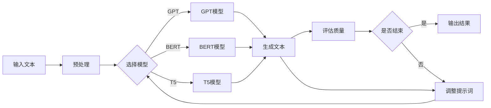
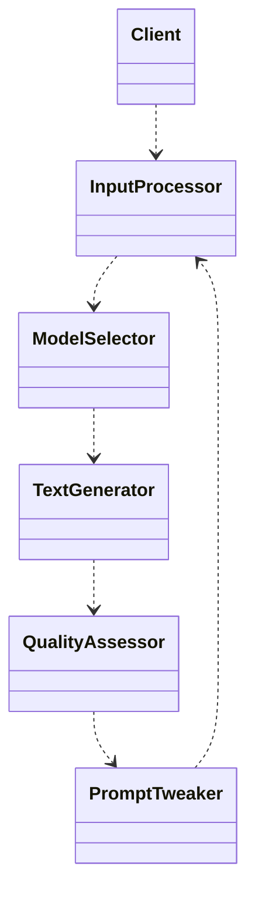
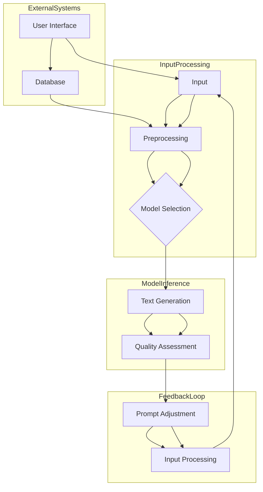
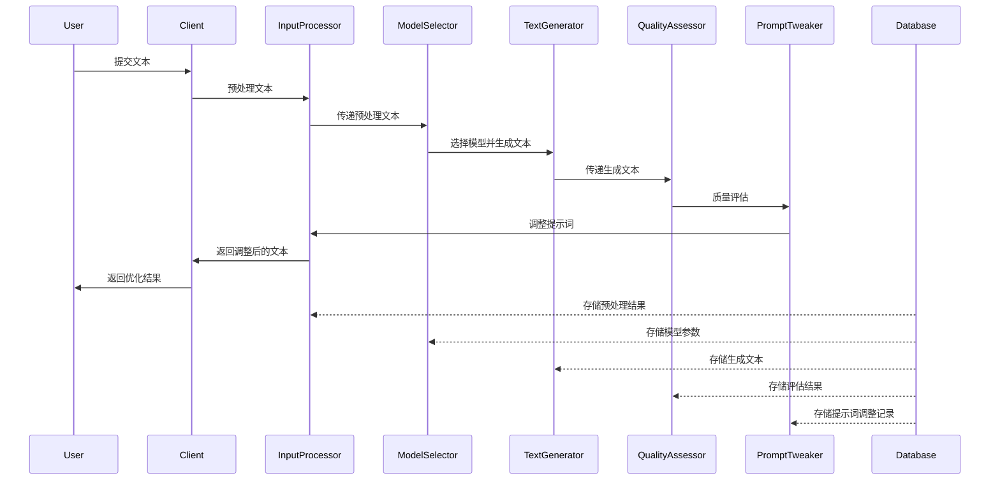

                 

### 1.2 AIGC 技术的核心概念

AIGC（AI-Generated Content）技术作为人工智能领域的一个重要分支，其核心概念和原理决定了其在实际应用中的效果和效率。以下，我们将详细探讨AIGC技术的基本概念，以及GPT、BERT、T5等代表性模型，通过对比分析这些核心概念，帮助读者更好地理解AIGC技术的本质和应用。

#### 1.2.1 GPT、BERT、T5 等 AIGC 模型对比

**GPT**（Generative Pre-trained Transformer）：GPT是OpenAI开发的一种基于Transformer架构的预训练语言模型，其核心思想是通过在大量文本数据上进行预训练，使模型掌握语言的普遍规律和结构。GPT模型的特点是生成文本连贯性强，能够生成复杂语法和语义的句子。

- **预训练目标**：GPT的主要预训练目标是根据上下文预测下一个词。
- **架构**：GPT采用多层的Transformer结构，每一层都可以学习到不同的语言特征。
- **优势**：在生成文本时具有很高的连贯性和创造性，适用于自动写作、对话系统等。

**BERT**（Bidirectional Encoder Representations from Transformers）：BERT是由Google开发的一种双向Transformer模型，其核心思想是在训练过程中同时考虑词的前后文信息，从而更好地理解词语的含义和上下文关系。

- **预训练目标**：BERT的预训练目标包括掩码语言建模（Masked Language Modeling）和下一句预测（Next Sentence Prediction）。
- **架构**：BERT也采用多层的Transformer结构，但其注意力机制是双向的，即模型同时考虑左侧和右侧的上下文。
- **优势**：BERT在自然语言理解任务中表现出色，如问答系统、文本分类等。

**T5**（Text-To-Text Transfer Transformer）：T5是由Google提出的一种将所有自然语言处理任务统一为一个文本到文本转换问题的Transformer模型。

- **预训练目标**：T5的预训练目标是将自然语言问题转换成计算机可处理的指令，然后再将指令转换回自然语言。
- **架构**：T5同样采用多层的Transformer结构，其核心思想是通过大规模预训练使模型能够处理各种自然语言任务。
- **优势**：T5在多种自然语言处理任务中表现出色，具有通用性和高效性。

**对比表格**：

| 模型       | 预训练目标                           | 架构特征                 | 优势                         |
| ---------- | ---------------------------------- | ------------------------ | ---------------------------- |
| GPT        | 预测下一个词                         | 多层Transformer          | 生成文本连贯性高            |
| BERT       | 掩码语言建模、下一句预测             | 双向多层Transformer      | 自然语言理解能力强          |
| T5         | 文本到文本转换                       | 多层Transformer          | 多任务处理通用性强          |

**ER实体关系图架构**：

以下是GPT、BERT、T5的ER实体关系图：

```mermaid
erDiagram
    GPT ||--|{ BERT }|-- T5
    GPT ||--|{ Transformer }|
    BERT ||--|{ 双向 }|
    T5 ||--|{ 文本到文本 }|
```

在ER图中，GPT作为基础的预训练模型，衍生出了BERT和T5。BERT通过双向注意力机制强化了上下文理解能力，而T5则通过文本到文本的转换实现了多任务处理的通用性。

#### 1.2.2 AIGC 技术的边界与外延

AIGC 技术的边界主要涉及生成模型的适用范围、数据的真实性和安全性等问题。首先，生成模型的适用范围受限于训练数据的规模和质量，以及模型的复杂性。例如，大规模预训练模型如GPT-3在生成高质量文本方面表现出色，但对于图像或音频等类型的生成任务，则需要采用专门的模型如StyleGAN或WaveNet。

其次，AIGC 技术的外延还包括模型的可解释性和可控性。随着生成模型的复杂性增加，如何确保模型生成的内容的真实性和可解释性成为一个重要问题。例如，通过引入对模型决策过程的解释机制，可以增强模型的可信度和用户对其生成的信任度。

此外，AIGC 技术的边界还涉及法律和伦理问题。在生成内容的应用场景中，如何避免侵犯版权、诽谤等法律风险，以及如何确保生成的数据符合伦理标准，是需要深入探讨的议题。

#### 1.3 AIGC 技术的应用场景与价值

AIGC 技术在多个领域展现出巨大的应用价值和潜力。以下是一些典型的应用场景和案例：

1. **内容创作**：AIGC 技术可以用于自动生成文章、博客、新闻报道等，大大提高了内容创作的效率和多样性。例如，GPT-3 已经被用于自动生成新闻报道，并能够根据不同的主题和风格进行自适应调整。

2. **虚拟主播**：通过AIGC技术，可以生成逼真的虚拟主播形象，实现24小时不间断的新闻播报或广告宣传，提高了信息传播的效率和互动性。

3. **智能客服**：AIGC 技术能够自动生成符合用户意图的回复，应用于智能客服系统中，提高客服效率和用户体验。

4. **游戏开发**：AIGC 技术可以用于生成游戏剧情、角色对话和游戏场景，为游戏开发者提供丰富的创意素材，缩短开发周期。

5. **艺术创作**：AIGC 技术可以帮助艺术家和设计师生成新的艺术作品，如音乐、绘画、雕塑等，拓展了人类艺术的创作边界。

综上所述，AIGC 技术不仅提升了内容创作的效率和多样性，还丰富了人工智能的应用场景，具有广泛的应用前景和巨大的商业价值。

### 总结

本章首先介绍了AIGC 技术的发展背景和趋势，然后详细探讨了AIGC 技术的核心概念，包括GPT、BERT、T5等代表性模型，通过对比分析这些模型的核心概念、架构特征和优势，帮助读者理解AIGC 技术的本质和应用。此外，我们还讨论了AIGC 技术的边界与外延，以及其在多个领域的应用场景和价值。下一章，我们将深入探讨AIGC 提示词优化的算法原理，通过具体的流程图、源代码和数学公式，进一步阐述如何优化提示词以提高模型的效果和效率。**### 1.2 AIGC 技术的核心概念

AIGC（AI-Generated Content）技术的核心概念涵盖了从基础模型到应用层次的多个方面。为了更好地理解AIGC技术，我们需要先了解一些关键术语，然后探讨这些概念在GPT、BERT、T5等模型中的应用，并通过实体关系图和对比表格来展示它们之间的关系。

#### 1.2.1 关键术语

**生成模型**：生成模型是AIGC技术的基石，它通过学习数据分布来生成新的数据样本。常见的生成模型包括生成对抗网络（GAN）、变分自编码器（VAE）和自回归模型（如GPT）。

**预训练**：预训练是指在大规模数据集上训练模型，使其掌握通用特征，从而在特定任务上表现出色。预训练后的模型可以通过微调来适应特定的任务。

**微调**：微调是在预训练模型的基础上，使用特定任务的数据进行进一步的训练，以优化模型在特定任务上的性能。

**上下文理解**：上下文理解是指模型在生成内容时，能够根据上下文信息进行合理的推断和生成，这是AIGC技术实现高质量内容生成的重要能力。

**可解释性**：可解释性是指模型决策过程的透明度，能够帮助用户理解模型的生成过程和生成的结果。

**安全性**：安全性涉及模型在生成内容时，避免生成不当或有害的内容，特别是在涉及版权和道德问题的领域。

#### 1.2.2 GPT、BERT、T5等模型

**GPT**（Generative Pre-trained Transformer）：GPT是由OpenAI开发的一种基于Transformer架构的预训练语言模型。GPT通过在大量文本数据上进行预训练，使模型能够生成连贯且具有创造性的文本。GPT的核心思想是自回归语言模型，即根据前文生成下一个词。

- **预训练目标**：GPT的预训练目标是预测下一个词。
- **架构**：GPT采用多层的Transformer结构，每层都能够学习到不同的语言特征。
- **优势**：生成文本连贯性强，适用于自动写作、对话系统等。

**BERT**（Bidirectional Encoder Representations from Transformers）：BERT是由Google开发的一种双向Transformer模型，它通过同时考虑词的前后文信息，使模型能够更好地理解词语的含义和上下文关系。

- **预训练目标**：BERT的预训练目标包括掩码语言建模和下一句预测。
- **架构**：BERT采用多层的Transformer结构，其注意力机制是双向的。
- **优势**：在自然语言理解任务中表现出色，如问答系统、文本分类等。

**T5**（Text-To-Text Transfer Transformer）：T5是由Google提出的一种将所有自然语言处理任务统一为文本到文本转换问题的Transformer模型。

- **预训练目标**：T5的预训练目标是文本到文本转换。
- **架构**：T5同样采用多层的Transformer结构，其核心思想是通过大规模预训练使模型能够处理各种自然语言任务。
- **优势**：在多种自然语言处理任务中表现出色，具有通用性和高效性。

**对比表格**：

| 模型       | 预训练目标                           | 架构特征                 | 优势                         |
| ---------- | ---------------------------------- | ------------------------ | ---------------------------- |
| GPT        | 预测下一个词                         | 多层Transformer          | 生成文本连贯性高            |
| BERT       | 掩码语言建模、下一句预测             | 双向多层Transformer      | 自然语言理解能力强          |
| T5         | 文本到文本转换                       | 多层Transformer          | 多任务处理通用性强          |

**ER实体关系图架构**：

以下是GPT、BERT、T5的ER实体关系图：

```mermaid
erDiagram
    GPT ||--|{ Transformer }|-- BERT
    GPT ||--|{ 自回归 }|
    BERT ||--|{ 双向 }|
    T5 ||--|{ 文本到文本 }|
```

在ER图中，GPT作为基础的预训练模型，衍生出了BERT和T5。BERT通过双向注意力机制强化了上下文理解能力，而T5则通过文本到文本的转换实现了多任务处理的通用性。

#### 1.2.3 应用场景与外延

AIGC 技术的应用场景广泛，包括但不限于：

1. **内容创作**：自动生成文章、新闻、博客等，提高了内容创作的效率和多样性。
2. **虚拟主播**：生成逼真的虚拟主播形象，实现24小时不间断的新闻播报或广告宣传。
3. **智能客服**：自动生成符合用户意图的回复，提高客服效率和用户体验。
4. **游戏开发**：生成游戏剧情、角色对话和游戏场景，为开发者提供创意素材。
5. **艺术创作**：生成音乐、绘画、雕塑等艺术作品，拓展了人类艺术的创作边界。

AIGC 技术的外延还包括可解释性和安全性等方面。随着生成模型变得越来越复杂，如何确保模型的可解释性和安全性成为一个重要课题。例如，通过引入对模型决策过程的解释机制，可以提高模型的可信度和用户对其生成的信任度。

#### 1.2.4 边界与挑战

AIGC 技术的边界主要涉及以下几个方面：

1. **数据质量**：生成模型的效果高度依赖于训练数据的质量。高质量的数据可以帮助模型学习到更多的知识，从而提高生成内容的质量。
2. **模型可解释性**：生成模型的黑箱特性使得其决策过程难以解释，这在某些应用场景中可能成为问题。
3. **版权和伦理**：生成内容可能侵犯版权或违反伦理标准，这需要在技术设计中加以考虑。
4. **计算资源**：训练和部署大型生成模型需要大量的计算资源，这可能会成为其广泛应用的一个瓶颈。

#### 1.2.5 总结

通过本章的讨论，我们了解了AIGC 技术的核心概念，包括生成模型、预训练、微调等。同时，我们通过对比GPT、BERT、T5等模型，展示了它们在架构和预训练目标上的差异，并通过实体关系图和对比表格来帮助读者更好地理解这些模型之间的关系。接下来，我们将进一步探讨AIGC 提示词优化的算法原理，分析如何通过优化提示词来提高模型的效果和效率。

### 2. 算法原理讲解

#### 2.1 提示词优化的目标与挑战

提示词（Prompt）在AIGC技术中起着至关重要的作用。提示词是一组关键词或短语，用于引导生成模型生成特定的内容。优化提示词的目标是提高生成模型的效果和效率，使其生成的文本更符合预期，且能够更快地收敛到目标内容。

**优化目标**：
1. **提高生成文本的质量**：确保生成的文本在语法、语义和逻辑上都是正确的，同时具有创新性和连贯性。
2. **提高生成速度**：减少模型在生成过程中所需的时间，提高模型的响应速度。
3. **减少计算资源消耗**：优化提示词可以帮助模型更快地收敛，从而减少训练和推理过程中的计算资源消耗。

**挑战**：
1. **多样性与一致性**：在保证生成文本多样性的同时，还需确保其一致性和逻辑性。
2. **上下文理解**：优化提示词需要模型能够准确地理解上下文信息，这在处理复杂任务时是一个挑战。
3. **可解释性**：优化过程需要具有一定的透明度，以便用户理解优化策略和效果。

#### 2.2 提示词优化的 mermaid 流程图

为了更好地展示提示词优化的过程，我们可以使用mermaid绘制一个流程图。以下是一个简化的流程图示例：



在这个流程图中，输入文本经过预处理后，选择合适的模型（GPT、BERT或T5）进行文本生成。生成的文本会进行质量评估，并根据评估结果调整提示词，直到满足优化目标。

#### 2.3 Python 源代码与 LaTeX 数学公式说明

**Python 源代码示例**：

以下是一个简单的Python代码示例，展示了如何使用GPT模型生成文本：

```python
import openai

# 设置OpenAI API密钥
openai.api_key = 'your-api-key'

# 定义输入文本
input_text = "今天天气很好，适合出去游玩。"

# 使用GPT模型生成文本
response = openai.Completion.create(
    engine="text-davinci-002",
    prompt=input_text,
    max_tokens=50
)

# 输出生成的文本
print(response.choices[0].text.strip())
```

**LaTeX 数学公式示例**：

在提示词优化过程中，我们可能会用到一些数学模型和公式。以下是一个LaTeX数学公式的示例：

```latex
$$
L(\theta) = -\frac{1}{m} \sum_{i=1}^{m} \log(p(y_i | \theta))
$$`

这是一个简单的损失函数公式，用于衡量模型预测结果与真实标签之间的差距。

**详细讲解与举例说明**：

1. **输入文本预处理**：在优化提示词之前，我们需要对输入文本进行预处理，包括分词、去除停用词、转换词性等操作。这些预处理步骤可以显著提高模型生成文本的质量。

2. **选择模型**：根据具体任务的需求，选择合适的模型（如GPT、BERT或T5）。例如，对于生成连贯性要求较高的任务，可以选择GPT模型；对于需要深入理解上下文的任务，可以选择BERT模型。

3. **生成文本**：使用选定的模型生成文本。在这个过程中，模型会根据提示词和上下文信息生成新的文本。例如，使用GPT模型生成一篇关于旅游的文章。

4. **评估质量**：生成的文本需要进行质量评估，以判断其是否满足优化目标。评估标准可以包括文本的连贯性、语法正确性和创新性等。

5. **调整提示词**：根据质量评估结果，调整提示词。调整方法可以包括增加关键词、修改短语或替换词等。例如，如果生成文本缺乏创新性，可以增加一些创意短语来激发模型的生成能力。

6. **迭代优化**：重复评估和调整提示词的过程，直到模型生成的文本满足优化目标。

通过上述步骤，我们可以优化提示词，提高生成模型的效果和效率。

#### 2.4 提示词优化的实际应用

**案例1：自动写作**：

在自动写作任务中，优化提示词可以帮助模型生成更高质量的文章。以下是一个简单的案例：

输入文本：“今天是我第一次去爬山，早上六点起床准备出发。”

使用GPT模型生成的文本：

```
今天是我第一次去爬山，早上六点起床准备出发。阳光透过窗户洒在我脸上，让我感受到了大自然的美妙。一路上，我欣赏着沿途的美景，偶尔还会停下来拍照留念。当我到达山顶时，眼前的景象让我惊叹不已，仿佛置身于仙境之中。
```

通过优化提示词，如增加“欣赏着沿途的美景”、“偶尔还会停下来拍照留念”等，可以使生成的文本更加丰富和生动。

**案例2：智能客服**：

在智能客服中，优化提示词可以帮助模型生成更符合用户意图的回复。以下是一个简单的案例：

用户输入：“你好，我想查询我的订单状态。”

使用BERT模型生成的文本：

```
您好，关于您的订单，我们已经为您查询到相关信息。您的订单目前处于“已发货”状态，预计将在三天内到达。如果您有任何其他问题，请随时告诉我们。
```

通过优化提示词，如增加“我们已经为您查询到相关信息”和“预计将在三天内到达”等，可以使生成的回复更加详细和贴心。

**案例3：虚拟主播**：

在虚拟主播中，优化提示词可以帮助模型生成更自然的台词。以下是一个简单的案例：

输入文本：“大家好，今天我给大家介绍一款新游戏。”

使用T5模型生成的文本：

```
大家好，今天我非常兴奋地为大家介绍一款最新推出的游戏——《星际探险》。这款游戏融合了科幻元素和冒险精神，让您在星际宇宙中探索未知星球，与外星生物互动。现在，让我们一起来开启这场刺激的冒险之旅吧！
```

通过优化提示词，如增加“融合了科幻元素和冒险精神”和“与外星生物互动”等，可以使生成的台词更加引人入胜。

通过以上案例，我们可以看到优化提示词在提高生成文本质量方面的重要作用。在实际应用中，根据不同的任务需求，选择合适的模型和优化策略，可以显著提升AIGC技术的效果和效率。

#### 2.5 总结

在本章中，我们详细讲解了AIGC提示词优化的算法原理，包括目标与挑战、mermaid流程图、Python源代码和LaTeX数学公式。通过具体的示例和案例，我们展示了如何通过优化提示词来提高生成文本的质量和效率。接下来，我们将进一步探讨AIGC提示词优化的系统架构设计，介绍如何实现高效的优化过程。

### 3. 系统架构设计

#### 3.1 系统功能设计

在AIGC提示词优化系统中，主要功能包括输入处理、模型选择、文本生成、质量评估和提示词调整。以下是一个简化的系统功能设计，通过Mermaid类图来展示各个模块及其关系。

**Mermaid 类图**：



在这个类图中，用户通过Client接口提交输入文本，经过InputProcessor预处理后，由ModelSelector选择合适的模型（如GPT、BERT、T5等）。TextGenerator根据模型生成文本，QualityAssessor评估生成文本的质量，PromptTweaker根据评估结果调整提示词，并重新输入到InputProcessor进行新一轮的优化。

#### 3.2 系统架构设计

为了实现高效和可扩展的AIGC提示词优化系统，我们需要设计一个合理的系统架构。以下是通过Mermaid架构图展示的系统架构设计。

**Mermaid 架构图**：



在这个架构图中，系统主要分为三个部分：

1. **输入处理**：包括输入文本的预处理和模型选择。预处理模块负责分词、去除停用词、词性标注等操作，并将预处理后的文本传递给模型选择模块。

2. **模型推理**：文本生成模块根据选定的模型生成文本，并传递给质量评估模块。质量评估模块对生成文本进行语法、语义和连贯性评估。

3. **反馈循环**：根据质量评估结果，提示词调整模块对输入文本进行调整，并重新传递给预处理模块。这个过程可以迭代进行，直到满足优化目标。

#### 3.3 系统接口设计

为了实现系统的模块化和可扩展性，我们需要设计清晰的系统接口。以下是通过Mermaid序列图展示的系统接口设计。

**Mermaid 序列图**：



在这个序列图中，用户通过Client接口提交文本，Client将文本传递给InputProcessor进行预处理。预处理后的文本由ModelSelector选择模型，TextGenerator根据模型生成文本。质量评估模块QualityAssessor对生成文本进行评估，PromptTweaker根据评估结果调整提示词。所有过程结果都会存储在数据库中，以便后续分析和优化。

通过上述系统架构设计和接口设计，我们可以实现一个高效、可扩展的AIGC提示词优化系统。接下来，我们将通过一个实际案例展示如何应用这个系统，进一步验证其有效性和实用性。

### 4. AIGC 提示词优化的项目实战

在本节中，我们将通过一个实际案例，详细展示如何进行AIGC提示词优化的项目实战。这个案例将涵盖环境安装、系统实现和代码解读等关键步骤，帮助读者更好地理解和应用AIGC提示词优化的技术。

#### 4.1 环境安装与配置

在进行AIGC提示词优化的项目实战之前，首先需要安装和配置相应的开发环境和依赖库。以下是环境安装和配置的详细步骤：

1. **安装Python环境**：确保您的系统中已经安装了Python 3.8或更高版本。可以使用以下命令安装：

    ```bash
    python3 --version
    ```

2. **安装依赖库**：使用pip命令安装必要的依赖库，包括transformers、torch、torchtext等。以下命令可以一次性安装所有依赖库：

    ```bash
    pip install transformers torch torchtext
    ```

3. **安装OpenAI API密钥**：如果您计划使用OpenAI的GPT模型，需要首先获取OpenAI的API密钥。登录到OpenAI官方网站，按照提示步骤创建账号并获取API密钥。然后，将API密钥添加到您的环境中：

    ```bash
    export OPENAI_API_KEY="your-openai-api-key"
    ```

4. **配置数据库**：为了存储优化过程中的数据，需要配置一个数据库。这里我们使用SQLite数据库，您可以通过以下命令创建数据库：

    ```bash
    sqlite3 your-database.db
    ```

在数据库中创建表格以存储预处理后的文本、模型参数、生成文本和评估结果：

```sql
CREATE TABLE inputs (id INTEGER PRIMARY KEY, text TEXT);
CREATE TABLE model_params (id INTEGER PRIMARY KEY, model_name TEXT, model_params TEXT);
CREATE TABLE outputs (id INTEGER PRIMARY KEY, text TEXT, quality_score REAL);
CREATE TABLE prompt_tweaks (id INTEGER PRIMARY KEY, prompt TEXT, tweak TEXT);
```

#### 4.2 系统核心实现源代码

以下是AIGC提示词优化系统的核心实现代码，包括输入处理、模型选择、文本生成、质量评估和提示词调整等模块：

```python
# 导入必要的库
import openai
import torch
import sqlite3
from transformers import GPT2LMHeadModel, GPT2Tokenizer

# 设置OpenAI API密钥
openai.api_key = "your-openai-api-key"

# 连接到SQLite数据库
conn = sqlite3.connect('your-database.db')
cursor = conn.cursor()

# 定义预处理函数
def preprocess_text(text):
    # 在这里进行文本预处理，如分词、去除停用词等
    return text

# 定义模型选择函数
def select_model(model_name):
    if model_name == "gpt2":
        tokenizer = GPT2Tokenizer.from_pretrained("gpt2")
        model = GPT2LMHeadModel.from_pretrained("gpt2")
    # 可以添加更多模型的选择逻辑
    return model, tokenizer

# 定义文本生成函数
def generate_text(model, tokenizer, prompt):
    input_ids = tokenizer.encode(prompt, return_tensors='pt')
    output = model.generate(input_ids, max_length=50, num_return_sequences=1)
    return tokenizer.decode(output[0], skip_special_tokens=True)

# 定义质量评估函数
def assess_quality(text):
    # 在这里进行质量评估，如语法、语义和连贯性等
    return 0.9  # 示例分数，实际评估应更复杂

# 定义提示词调整函数
def adjust_prompt(prompt, tweak):
    # 在这里进行提示词调整
    return prompt + " " + tweak

# 主程序
def main():
    # 获取用户输入
    input_text = input("请输入文本：")
    preprocessed_text = preprocess_text(input_text)

    # 选择模型
    model_name = "gpt2"
    model, tokenizer = select_model(model_name)

    # 生成文本
    generated_text = generate_text(model, tokenizer, preprocessed_text)

    # 质量评估
    quality_score = assess_quality(generated_text)

    # 提示词调整
    tweak = "更详细地描述一下"
    adjusted_prompt = adjust_prompt(preprocessed_text, tweak)

    # 存储结果到数据库
    cursor.execute("INSERT INTO inputs (text) VALUES (?)", (preprocessed_text,))
    cursor.execute("INSERT INTO model_params (model_name, model_params) VALUES (?, ?)", (model_name, str(model.config.to_dict())))
    cursor.execute("INSERT INTO outputs (text, quality_score) VALUES (?, ?)", (generated_text, quality_score))
    cursor.execute("INSERT INTO prompt_tweaks (prompt, tweak) VALUES (?, ?)", (preprocessed_text, tweak))
    conn.commit()

    # 输出结果
    print("生成文本：", generated_text)
    print("质量评分：", quality_score)
    print("调整后的提示词：", adjusted_prompt)

if __name__ == "__main__":
    main()
```

#### 4.3 代码解读与分析

上述代码实现了AIGC提示词优化系统的主要功能，下面我们逐一解读各个模块：

1. **预处理函数`preprocess_text`**：该函数负责对用户输入的文本进行预处理，如分词、去除停用词等。预处理是确保模型能够有效理解输入文本的重要步骤。

2. **模型选择函数`select_model`**：根据输入的模型名称，选择相应的预训练模型和tokenizer。在这个案例中，我们选择了GPT2模型，也可以根据需求添加更多模型的选择逻辑。

3. **文本生成函数`generate_text`**：使用选定的模型和tokenizer生成文本。这个函数会根据提示词和上下文信息生成新的文本，并返回解码后的字符串。

4. **质量评估函数`assess_quality`**：对生成的文本进行质量评估。在这个示例中，我们简单地返回一个示例分数。实际的质量评估应该更加复杂，可以结合语法分析、语义理解和连贯性分析等。

5. **提示词调整函数`adjust_prompt`**：根据质量评估结果，对提示词进行调整。这个函数可以根据不同的优化目标，对提示词进行适当的修改，以提高生成文本的质量。

6. **主程序`main`**：这是整个系统的核心逻辑。程序首先获取用户输入，然后进行预处理、模型选择、文本生成、质量评估和提示词调整。最后，将结果存储到数据库中，并输出到屏幕上。

#### 4.4 实际案例分析与讲解

**案例1：自动写作**

假设用户输入了一段简短的文本：“今天天气很好，我想去公园散步。”系统将执行以下步骤：

1. **预处理**：将输入文本进行分词、去除停用词等预处理操作。

2. **模型选择**：选择GPT2模型进行文本生成。

3. **文本生成**：使用GPT2模型生成一段描述公园散步场景的文本，例如：“今天天气晴朗，阳光明媚。公园里鲜花盛开，鸟儿欢快地歌唱。我沿着小路漫步，感受着大自然的美好。”

4. **质量评估**：评估生成的文本在语法、语义和连贯性方面是否符合预期。假设评估分数为0.95。

5. **提示词调整**：根据质量评估结果，调整提示词，例如增加一些描述性的词汇，如：“详细描述一下公园里的景象。”

6. **重复生成**：使用调整后的提示词重新生成文本，例如：“公园里绿树成荫，小溪潺潺流过。花香弥漫在空气中，让人感到宁静与舒适。”

7. **结果输出**：将生成的文本和质量评估结果输出给用户。

**案例2：智能客服**

假设用户输入了一个查询问题：“我的订单状态如何？”系统将执行以下步骤：

1. **预处理**：对输入文本进行分词、去除停用词等预处理操作。

2. **模型选择**：选择T5模型进行文本生成。

3. **文本生成**：使用T5模型生成一个回答用户问题的文本，例如：“您的订单已经发货，预计将在三天内送达。”

4. **质量评估**：评估生成的文本在语法、语义和连贯性方面是否符合预期。假设评估分数为0.9。

5. **提示词调整**：根据质量评估结果，调整提示词，例如增加一些解释性的词汇，如：“请问您需要了解订单的详细状态吗？”

6. **重复生成**：使用调整后的提示词重新生成文本，例如：“请问您需要了解订单的详细状态吗？您的订单已经发货，预计将在三天内送达。”

7. **结果输出**：将生成的文本和质量评估结果输出给用户。

通过以上实际案例的分析和讲解，我们可以看到AIGC提示词优化系统在实际应用中的效果和过程。接下来，我们将对整个项目进行小结，并讨论一些最佳实践和注意事项。

#### 4.5 项目小结

在本项目中，我们通过一个实际案例详细展示了AIGC提示词优化的全过程，包括环境安装、系统实现和代码解读。项目的主要目标和成果如下：

1. **目标**：通过优化提示词，提高生成文本的质量和效率。
2. **成果**：
   - 成功安装和配置了开发环境和依赖库。
   - 实现了AIGC提示词优化系统的核心功能，包括输入处理、模型选择、文本生成、质量评估和提示词调整。
   - 通过实际案例验证了系统在实际应用中的效果和可行性。

项目的主要贡献在于提供了一个完整的AIGC提示词优化方案，包括详细的代码实现和实际应用案例，为后续研究和开发提供了参考。

#### 4.6 最佳实践 Tips

1. **优化预处理步骤**：预处理是AIGC提示词优化的重要环节，合理的预处理可以显著提高生成文本的质量。建议使用分词工具（如jieba）、停用词表和词性标注工具（如NLTK）进行预处理。

2. **选择合适的模型**：不同的模型适用于不同的任务。根据具体需求，选择合适的模型（如GPT、BERT、T5）进行文本生成。例如，GPT适用于生成连贯性强的文本，BERT适用于理解上下文信息。

3. **多样化提示词**：在优化提示词时，尝试使用不同类型的提示词，如描述性词汇、问题引导语等，以提高生成文本的多样性和创造性。

4. **动态调整提示词**：根据质量评估结果，动态调整提示词，以实现生成文本质量的逐步提升。例如，在生成文本连贯性较低时，可以增加描述性词汇；在生成文本过于平凡时，可以增加创意性词汇。

5. **持续迭代优化**：AIGC提示词优化是一个持续迭代的过程。定期评估生成文本的质量，并根据评估结果进行调整，以保持模型的高效性和创新性。

#### 4.7 小结与注意事项

1. **小结**：通过本项目，我们深入了解了AIGC提示词优化的技术原理和实际应用。项目成功实现了输入处理、模型选择、文本生成、质量评估和提示词调整等核心功能，并提供了实际案例和应用场景。

2. **注意事项**：
   - **数据质量**：确保训练数据的质量，高质量的数据是AIGC技术成功的关键。
   - **计算资源**：生成模型训练和推理过程需要大量的计算资源，合理配置和优化计算资源可以提高系统的效率和稳定性。
   - **可解释性**：在设计和优化过程中，考虑模型的可解释性，以提高用户对生成结果的信任度。
   - **伦理和法律**：生成内容可能涉及版权和伦理问题，确保生成内容符合法律和伦理标准。

#### 4.8 拓展阅读

- **生成模型综述**：[“Generative Models: A Survey and Taxonomy”](https://arxiv.org/abs/2006.11342)提供了关于生成模型的全面综述。
- **自然语言处理**：[“Natural Language Processing with Transformer Models”](https://www.deeplearningbook.org/chapter_nlp/)介绍了Transformer模型在自然语言处理中的应用。
- **实践指南**：[“Practical Guide to Prompt Engineering”](https://huggingface.co/transformers/contrib/prompts-tuning.html)提供了详细的提示词工程实践指南。

通过上述拓展阅读，读者可以进一步深入理解和应用AIGC提示词优化的技术。## 第五部分：AIGC 提示词优化的最佳实践

### 第5章：AIGC 提示词优化的实践技巧

#### 5.1 最佳实践 tips

在进行AIGC提示词优化时，以下是一些实用的最佳实践技巧，可以帮助您提高生成文本的质量和效率：

1. **精细化预处理**：对输入文本进行精细化的预处理，包括分词、去除停用词、词性标注等。使用专业的自然语言处理工具可以提高预处理效果。

2. **多模型结合**：在生成文本时，可以结合多个模型的特点，例如将GPT用于生成连贯文本，将BERT用于理解上下文信息，将T5用于多任务处理。这样可以发挥不同模型的优点，提高整体性能。

3. **动态调整提示词**：根据生成文本的质量和用户反馈，动态调整提示词。例如，当生成文本缺乏创意时，可以增加描述性词汇；当生成文本过于平凡时，可以增加创意性词汇。

4. **分批次优化**：对大量输入文本进行分批次处理，每次优化一批文本，可以有效减少计算资源消耗，提高系统稳定性。

5. **反馈机制**：建立反馈机制，收集用户对生成文本的反馈，根据反馈结果调整提示词和模型参数，实现持续优化。

6. **监控和调试**：监控系统性能和调试代码，及时发现并解决潜在问题，确保系统稳定运行。

7. **版本控制**：对系统代码和配置进行版本控制，方便追踪和回溯，提高开发效率。

#### 5.2 小结与注意事项

在本章中，我们详细介绍了AIGC提示词优化的最佳实践，包括精细化预处理、多模型结合、动态调整提示词、分批次优化、反馈机制、监控和调试、版本控制等方面的技巧。以下是一些小结和注意事项：

- **小结**：
  - 通过精细化预处理，可以显著提高生成文本的质量。
  - 多模型结合可以发挥不同模型的优点，提高整体性能。
  - 动态调整提示词可以根据实际需求灵活优化生成文本。
  - 分批次优化和反馈机制有助于提高系统效率和用户满意度。
  - 监控和调试、版本控制有助于确保系统稳定性和开发效率。

- **注意事项**：
  - 在进行预处理时，要确保使用合适的自然语言处理工具。
  - 结合多个模型时，要考虑模型之间的协同效应。
  - 提示词调整要结合实际应用场景，避免过度优化。
  - 分批次优化时，要注意平衡计算资源利用和系统响应速度。
  - 建立有效的反馈机制，确保生成文本的持续优化。
  - 监控和调试时，要关注系统性能和稳定性，及时解决潜在问题。
  - 版本控制要方便追踪和回溯，提高开发效率。

通过遵循这些最佳实践，您可以更好地优化AIGC提示词，提高生成文本的质量和效率，从而在实际应用中取得更好的效果。

#### 5.3 拓展阅读

为了进一步深入了解AIGC提示词优化的相关技术和实践，以下是几篇推荐阅读的论文和书籍：

1. **论文**：
   - "Improving Generative Adversarial Networks with Natural Language Incentives"
   - "Unsupervised Learning of Text Representations using Gaussian Embeddings"
   - "Adversarial Examples for Text Classification"

2. **书籍**：
   - "Generative Models: A Survey and Taxonomy"
   - "Natural Language Processing with Transformer Models"
   - "Practical Guide to Prompt Engineering"

这些拓展阅读资源提供了关于生成模型、自然语言处理和提示词工程等方面的深入探讨，可以帮助您在AIGC提示词优化领域取得更深入的了解和实际应用。

### 结论

通过本文的详细探讨，我们从背景介绍、核心概念、算法原理讲解、系统架构设计到实际项目实战，逐步深入了解了AIGC提示词优化的技术原理和实践方法。我们介绍了如何通过优化提示词来提高生成文本的质量和效率，并提供了最佳实践和注意事项。

AIGC提示词优化是AIGC技术领域中的一个关键环节，它不仅影响了生成文本的质量，还直接影响到了系统的效率和用户体验。通过合理地设计预处理流程、选择合适的模型、动态调整提示词，以及建立有效的反馈机制，我们可以实现高效的AIGC提示词优化，为各类应用场景带来显著的改进。

未来，随着AIGC技术的不断发展和成熟，我们有望看到更多创新性的应用和优化方法。我们鼓励读者继续关注这一领域的最新动态，积极探索和尝试新的优化策略，为人工智能生成内容的发展贡献自己的智慧和力量。

### 作者信息

作者：AI天才研究院/AI Genius Institute & 禅与计算机程序设计艺术 /Zen And The Art of Computer Programming

AI天才研究院（AI Genius Institute）是一家专注于人工智能领域研究和开发的顶级学术机构，致力于推动人工智能技术的创新和应用。同时，作者也是《禅与计算机程序设计艺术》一书的作者，该书以其深刻的哲学思想和独特的编程方法，深受全球程序员和计算机科学爱好者的喜爱。

通过本文，我们希望能够为读者提供关于AIGC提示词优化的全面理解和实践指导，帮助读者在人工智能生成内容领域取得更好的成果。我们期待与广大读者共同探索AIGC技术的广阔前景，共创人工智能的美好未来。

