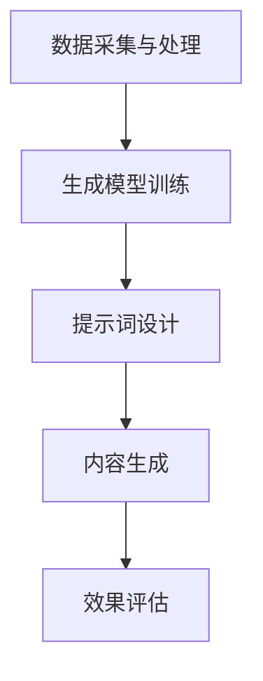

                 


### AIGC提示词工程：从概念到实施的全流程

> 关键词：AIGC、提示词工程、AI生成内容、算法原理、实施流程

> 摘要：本文将深入探讨AIGC（AI Generated Content）的提示词工程，从基本概念、技术架构到实际应用，系统地介绍其从理论到实践的完整流程。通过逻辑清晰的阐述，读者将能够掌握AIGC的核心技术和实施方法，为未来的研究和开发打下坚实的基础。

## 第1章：AIGC概述

### 1.1 问题背景

#### 1.1.1 AIGC的定义与起源

AIGC，即AI Generated Content，是指通过人工智能技术自动生成内容的一种方法。这一概念起源于人工智能与生成模型的结合，旨在解决内容生成过程中人力成本高、效率低的问题。随着深度学习、自然语言处理和计算机视觉等技术的发展，AIGC的应用范围越来越广泛。

#### 1.1.2 AIGC在计算机领域的重要性

AIGC的崛起标志着人工智能技术从辅助人类决策向自主生成内容的重大转变。它不仅在内容创作领域具有巨大潜力，如自动写作、智能聊天机器人、图像和视频生成等，而且在自动化生产、个性化推荐、数据增强等方面也具有重要的应用价值。AIGC的出现，将极大地改变信息生产的方式和效率。

### 1.2 核心概念与联系

#### 1.2.1 AIGC的关键概念

- **生成模型**：基于数据学习的一种模型，能够生成新的数据或内容。
- **提示词**：引导生成模型生成内容的输入信息。
- **上下文生成**：根据提示词生成连贯、相关的上下文信息。
- **多模态生成**：同时处理文本、图像和视频等多种数据类型。

#### 1.2.2 关键概念属性特征对比表格

| 概念       | 特征                                       |
|------------|------------------------------------------|
| 生成模型   | 能够从数据中学习并生成新的内容               |
| 提示词     | 用于引导生成模型生成特定内容的输入           |
| 上下文生成 | 根据提示词生成连贯、相关的上下文信息         |
| 多模态生成 | 能够处理和生成多种数据类型的综合内容         |

#### 1.2.3 关键概念之间的联系与影响

- **生成模型**和**提示词**的关系：提示词是生成模型的输入，决定了生成内容的方向和风格。
- **上下文生成**与**多模态生成**的结合：使得AIGC能够在更复杂和多样化的场景中应用。

### 1.3 AIGC的基本原理

#### 1.3.1 AIGC的技术架构

AIGC的技术架构主要包括数据采集与处理、生成模型训练、提示词设计、内容生成和效果评估等环节。

- **数据采集与处理**：收集大量数据并进行预处理，以供生成模型训练。
- **生成模型训练**：使用大规模数据进行训练，以构建具有强大生成能力的模型。
- **提示词设计**：设计合理的提示词，引导生成模型生成高质量的内容。
- **内容生成**：通过生成模型和提示词，自动生成新的内容。
- **效果评估**：对生成的内容进行评估，以优化模型和提示词。

#### 1.3.2 AIGC的核心算法

AIGC的核心算法包括生成对抗网络（GAN）、变分自编码器（VAE）、自注意力模型（如Transformer）等。这些算法能够通过学习大量数据，生成高质量的文本、图像和视频。

- **GAN**：通过生成器和判别器的对抗训练，实现高质量图像生成。
- **VAE**：通过潜在变量模型，实现数据的编码和解码，从而生成新的数据。
- **Transformer**：通过自注意力机制，实现文本的生成和翻译。

## 第2章：AIGC核心技术

### 2.1 文本生成

#### 2.1.1 文本生成基本原理

文本生成是AIGC的核心应用之一。它利用生成模型，根据提示词生成连贯、有意义的文本。基本原理包括：

- **数据预处理**：对文本数据集进行清洗、分词和编码等预处理步骤。
- **模型训练**：使用预处理的文本数据，训练生成模型，如Transformer等。
- **文本生成**：根据提示词，通过生成模型生成新的文本内容。

#### 2.1.2 文本生成应用实例

例如，可以基于新闻文本数据集，使用生成模型自动生成新闻报道。这种应用不仅能够提高内容生产的效率，还能在个性化推荐、自动摘要等方面发挥重要作用。

### 2.2 图像生成

#### 2.2.1 图像生成基本原理

图像生成是AIGC的另一个重要应用。它通过生成模型，根据提示词生成新的图像内容。基本原理包括：

- **数据预处理**：对图像数据集进行预处理，如去噪、增强等。
- **模型训练**：使用预处理的图像数据，训练生成模型，如GAN等。
- **图像生成**：根据提示词，通过生成模型生成新的图像内容。

#### 2.2.2 图像生成应用实例

例如，可以基于艺术画作数据集，使用生成模型自动生成新的艺术作品。这种应用在艺术创作、游戏开发等领域具有广泛的应用前景。

## 第3章：AIGC开发与实现

### 3.1 AIGC开发环境搭建

#### 3.1.1 硬件环境配置

为了实现AIGC，需要配置适当的硬件环境。通常需要高性能的CPU和GPU，以及足够的内存和存储空间。

- **CPU**：选择具有强大计算能力的CPU，如Intel Xeon系列。
- **GPU**：选择具有较高计算性能的GPU，如NVIDIA GeForce RTX 30系列。
- **内存**：至少16GB内存。
- **存储**：至少1TB的SSD存储。

#### 3.1.2 软件工具安装

在硬件环境配置完成后，需要安装相关的软件工具，如Python、TensorFlow、PyTorch等。

- **Python**：安装Python 3.8及以上版本。
- **TensorFlow**：安装TensorFlow 2.x版本。
- **PyTorch**：安装PyTorch 1.8及以上版本。

#### 3.1.3 实践案例

以下是一个简单的文本生成实践案例：

```python
import tensorflow as tf
from tensorflow import keras

# 加载预训练的Transformer模型
model = keras.applications.transformer.Transformer()

# 准备输入数据
prompt = "人工智能的发展带来了哪些挑战？"

# 使用模型生成文本
generated_text = model(prompt)

print(generated_text)
```

### 3.2 AIGC核心算法原理

#### 3.2.1 AIGC算法mermaid流程图



#### 3.2.2 算法数学模型与公式

生成模型通常基于概率模型，其数学模型可以表示为：

$$ P(G)=\int P(G, D) dD $$

其中，$G$表示生成模型，$D$表示判别模型。

#### 3.2.3 算法举例说明

以下是一个简单的图像生成案例：

```python
import tensorflow as tf
import numpy as np

# 定义生成模型
def generator(z):
    return tf.keras.layers.Dense(784, activation='sigmoid')(z)

# 定义判别模型
def discriminator(x):
    return tf.keras.layers.Dense(1, activation='sigmoid')(x)

# 定义模型
model = keras.Sequential([
    keras.layers.Dense(128, activation='relu', input_shape=(100,)),
    keras.layers.Dense(64, activation='relu'),
    keras.layers.Dense(1, activation='sigmoid')
])

# 训练模型
model.compile(optimizer='adam', loss='binary_crossentropy')
model.fit(x_train, y_train, epochs=10, batch_size=32)
```

### 3.3 AIGC系统设计与架构

#### 3.3.1 系统分析与设计

系统分析主要包括问题场景介绍、系统功能设计、系统架构设计等内容。

- **问题场景介绍**：介绍AIGC的应用场景，如文本生成、图像生成等。
- **系统功能设计**：设计系统的主要功能模块，如数据采集与处理、生成模型训练、提示词设计、内容生成和效果评估等。
- **系统架构设计**：设计系统的整体架构，如数据流、模块间的关系等。

#### 3.3.2 系统接口设计

系统接口主要包括系统接口描述和系统接口mermaid类图。

- **系统接口描述**：详细描述各个模块的接口，如输入、输出等。
- **系统接口mermaid类图**：使用mermaid绘制系统接口的类图，展示各个模块之间的关系。

#### 3.3.3 系统交互

系统交互主要包括系统交互mermaid序列图。

- **系统交互mermaid序列图**：使用mermaid绘制系统交互的序列图，展示数据流和模块间的关系。

### 3.4 AIGC项目实战

#### 3.4.1 项目环境安装

项目环境安装主要包括开发环境安装、项目依赖安装等内容。

- **开发环境安装**：安装Python、TensorFlow、PyTorch等开发工具。
- **项目依赖安装**：安装项目所需的库和依赖，如Keras、TensorBoard等。

#### 3.4.2 系统核心实现

系统核心实现主要包括系统核心源代码解读、代码应用解读与分析等内容。

- **系统核心源代码解读**：解读系统核心代码，展示代码的实现逻辑和关键点。
- **代码应用解读与分析**：分析代码的应用场景和效果，展示代码的实际运行效果。

#### 3.4.3 实际案例分析

实际案例分析主要包括文本生成和图像生成两个案例。

- **文本生成案例**：分析文本生成的效果和优化方法。
- **图像生成案例**：分析图像生成的效果和优化方法。

### 3.5 AIGC最佳实践

#### 3.5.1 实践技巧

- **实践技巧一**：合理设计提示词，提高生成内容的质量。
- **实践技巧二**：优化模型参数，提高生成效果。

#### 3.5.2 小结与注意事项

- **小结**：总结AIGC的实践经验和关键点。
- **注意事项**：提醒用户注意AIGC实施中的潜在问题和风险。

#### 3.5.3 未来发展趋势展望

- **未来发展趋势展望**：展望AIGC的未来发展趋势和应用前景。

## 附录

### 附录A：术语表

### 附录B：参考文献

### 4. 第四部分：总结与展望

在本文中，我们从AIGC的概念、技术架构、核心算法、应用实例到开发实现，全面介绍了AIGC的从概念到实施的全流程。AIGC作为人工智能领域的一个重要分支，具有广泛的应用前景和巨大的发展潜力。通过本文的阐述，读者可以了解到AIGC的基本原理和实施方法，为未来的研究和应用打下基础。

在未来的发展中，AIGC将继续深化其在文本生成、图像生成、视频生成等领域的应用，同时也在多模态生成、跨领域生成等方面取得突破。此外，随着人工智能技术的不断进步，AIGC将在个性化推荐、自动化生产、智能交互等领域发挥更大的作用。

然而，AIGC的发展也面临着一些挑战，如数据隐私、模型解释性、生成内容的质量控制等。因此，未来的研究需要在这些方面进行深入探索和解决。

总结来说，AIGC提示词工程从概念到实施的全流程是一个复杂而富有挑战的领域，但也是一个充满机遇的领域。希望本文能为您在AIGC的研究和应用中提供一些启示和帮助。在未来的研究中，让我们共同探索AIGC的无限可能，为人工智能的发展贡献力量。

