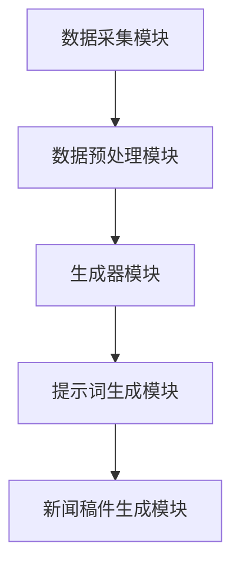

                 

## AIGC提示词工程：效率与创意的完美融合

### 关键词：AIGC，提示词工程，效率优化，创意提升，实战案例

#### 摘要：
本文将深入探讨AIGC（自适应智能生成控制）提示词工程，分析其在提高效率与激发创意方面的关键作用。通过详细阐述AIGC的基本概念、技术基础、提示词工程原理、效率优化策略、创意提升方法，并结合实际案例进行实战分析，本文旨在为读者提供一套系统的AIGC提示词工程实践指南。

### 目录大纲

**《AIGC提示词工程：效率与创意的完美融合》目录大纲**

---

## 第一部分：AIGC基础知识

### 第1章：AIGC概述

- **1.1 AIGC的概念与背景**

  - **AIGC的定义**
  - **AIGC的发展历程**
  - **AIGC的应用领域**

- **1.2 AIGC的技术基础**

  - **自然语言处理（NLP）**
  - **生成对抗网络（GAN）**
  - **强化学习（RL）**

- **1.3 AIGC在创意生成中的应用**

  - **文本生成**
  - **图像生成**
  - **音频生成**

- **1.4 AIGC的优势与挑战**

  - **AIGC的优势**
  - **AIGC面临的挑战**

---

### 第二部分：提示词工程

### 第2章：提示词概述

- **2.1 提示词的概念与作用**

  - **提示词的定义**
  - **提示词在AIGC中的作用**
  - **提示词的类型**

- **2.2 提示词设计原则**

  - **简明性**
  - **创意性**
  - **实用性**

- **2.3 提示词生成方法**

  - **手动生成**
  - **自动生成**

---

### 第3章：提示词效果评估

- **3.1 提示词效果评估的重要性**

  - **提示词效果评估的目的**
  - **提示词效果评估的标准**

- **3.2 提示词效果评估方法**

  - **人工评估**
  - **自动评估**

- **3.3 提示词效果优化策略**

  - **调整提示词参数**
  - **提高数据质量**

---

## 第三部分：效率与创意融合

### 第4章：提示词工程与效率优化

- **4.1 提示词工程与效率的关系**

  - **提示词对模型训练效率的影响**
  - **效率优化在提示词工程中的应用**

- **4.2 提高提示词生成效率的方法**

  - **并行计算**
  - **优化算法**

- **4.3 提示词工程中的效率实践**

  - **典型案例分析**
  - **实践技巧分享**

---

### 第5章：提示词工程与创意提升

- **5.1 提示词工程与创意的关系**

  - **提示词对创意生成的影响**
  - **创意提升在提示词工程中的策略**

- **5.2 提升提示词创意的方法**

  - **模式创新**
  - **文化融合**

- **5.3 提示词工程中的创意实践**

  - **创意生成案例分享**
  - **创意提升技巧探讨**

---

## 第四部分：实战与案例分析

### 第6章：AIGC提示词工程实战

- **6.1 实战项目介绍**

  - **项目背景**
  - **项目目标**

- **6.2 系统设计与实现**

  - **系统架构设计**
  - **提示词工程实现**

- **6.3 实战案例解析**

  - **实战案例一**
  - **实战案例二**

---

### 第7章：AIGC提示词工程案例分析

- **7.1 案例分析一**

  - **案例背景**
  - **案例解析**
  - **案例总结**

- **7.2 案例分析二**

  - **案例背景**
  - **案例解析**
  - **案例总结**

---

## 第五部分：总结与展望

### 第8章：AIGC提示词工程的未来

- **8.1 AIGC提示词工程的发展趋势**

  - **技术发展趋势**
  - **应用发展趋势**

- **8.2 AIGC提示词工程的挑战与机遇**

  - **面临的挑战**
  - **潜在的机遇**

- **8.3 AIGC提示词工程的未来展望**

  - **技术创新方向**
  - **应用创新领域**

---

**作者：AI天才研究院/AI Genius Institute & 禅与计算机程序设计艺术 /Zen And The Art of Computer Programming**

---

### 第一部分：AIGC基础知识

#### 第1章：AIGC概述

##### 1.1 AIGC的概念与背景

AIGC（Adaptive Intelligent Generation Control），即自适应智能生成控制，是一种利用人工智能技术实现内容自动生成的方法。它结合了自然语言处理（NLP）、生成对抗网络（GAN）和强化学习（RL）等前沿技术，旨在通过智能化的方式生成高质量的内容，从而提高工作效率和创意水平。

AIGC的发展历程可以追溯到20世纪80年代，当时研究者开始探索如何使用计算机模拟人类思维过程。随着计算能力的提升和数据量的爆炸式增长，AIGC技术逐渐成熟，并在近年来取得了显著的进展。当前，AIGC已在广告创意、新闻写作、产品设计等多个领域得到广泛应用。

AIGC的应用领域非常广泛，包括但不限于：

- **广告创意**：利用AIGC生成独特的广告文案和创意图像，提升广告效果。
- **新闻写作**：自动化撰写新闻稿件，提高新闻生产效率。
- **产品设计**：通过AIGC生成新的产品设计方案，激发设计师的创意思维。
- **教育**：利用AIGC生成个性化学习资料，提高学生的学习效果。
- **娱乐内容生成**：如电影剧本、音乐创作等，实现内容创作的自动化。

##### 1.2 AIGC的技术基础

AIGC的实现依赖于多种先进的人工智能技术，其中主要包括自然语言处理（NLP）、生成对抗网络（GAN）和强化学习（RL）。

- **自然语言处理（NLP）**：NLP是使计算机能够理解、解释和生成人类语言的技术。在AIGC中，NLP技术被用于理解和处理用户输入的提示词，以及生成符合语言规则和语义逻辑的文本。

- **生成对抗网络（GAN）**：GAN是由两部分组成——生成器和判别器。生成器负责生成内容，判别器则负责判断生成内容的质量。通过不断训练，生成器可以生成越来越逼真的内容。GAN在图像生成和音频生成等领域有着广泛的应用。

- **强化学习（RL）**：强化学习是一种通过试错学习优化决策策略的方法。在AIGC中，强化学习可用于优化提示词的选择和组合，从而提高生成内容的创意性和相关性。

##### 1.3 AIGC在创意生成中的应用

AIGC在创意生成中的应用主要表现在文本生成、图像生成和音频生成等方面。

- **文本生成**：AIGC可以通过学习大量的文本数据，生成符合语法和语义规则的文本。例如，它可以生成新闻文章、广告文案、故事情节等。

- **图像生成**：GAN技术被广泛应用于图像生成。通过训练生成器和判别器，AIGC可以生成具有较高逼真度的图像，如图像合成、超分辨率图像生成等。

- **音频生成**：AIGC可以通过学习音频数据，生成各种类型的音频内容，如音乐、语音合成等。

##### 1.4 AIGC的优势与挑战

AIGC的优势在于：

- **高效性**：通过自动化生成，可以大幅提高内容生产效率。
- **创意性**：利用人工智能技术，可以生成新颖独特的内容，激发创意思维。
- **个性化**：可以根据用户需求定制内容，提供个性化的体验。

然而，AIGC也面临一些挑战：

- **质量控制**：生成的内容可能存在不一致或错误，需要有效的方法进行质量控制。
- **数据依赖性**：AIGC的性能很大程度上依赖于训练数据的质量和数量。
- **伦理问题**：生成的内容可能会引发版权、隐私等问题，需要制定相应的伦理规范。

#### 第2章：提示词概述

##### 2.1 提示词的概念与作用

提示词（Prompt Word）是AIGC系统中的关键组成部分，用于引导生成器生成特定类型的内容。一个有效的提示词能够帮助AIGC系统更好地理解用户需求，从而生成高质量的内容。

- **提示词的定义**：提示词是一个简短的词汇或短语，用于触发生成器的创作过程。它可以是一个问题、一个关键词或一个描述性短语。

- **提示词在AIGC中的作用**：提示词在AIGC中的作用至关重要。首先，它能够帮助生成器理解用户的需求，明确生成内容的主题和风格。其次，提示词可以引导生成器生成符合用户期望的内容。

- **提示词的类型**：根据用途和形式，提示词可以分为以下几种类型：

  - **问题型提示词**：用于引导生成器生成回答，例如“请描述一次难忘的旅行经历”。
  - **关键词型提示词**：用于提供生成内容的关键词或主题，例如“未来科技”、“浪漫爱情”。
  - **描述型提示词**：用于提供生成内容的描述性信息，例如“创造一个神奇的魔法世界”。

##### 2.2 提示词设计原则

设计有效的提示词需要遵循以下原则：

- **简明性**：提示词应尽量简短，避免冗长复杂，以便生成器能够快速理解。
- **创意性**：提示词应具有创意性，能够激发生成器的创作灵感，产生新颖的内容。
- **实用性**：提示词应具有实际应用价值，能够满足用户的需求。

##### 2.3 提示词生成方法

提示词的生成方法主要有两种：

- **手动生成**：手动生成提示词通常由人类专家根据具体需求进行设计。这种方法的优势在于灵活性高，能够根据实际情况调整提示词，但缺点是效率较低。
- **自动生成**：自动生成提示词利用自然语言处理技术，从大量文本数据中提取关键词或短语生成提示词。这种方法的优势在于效率高，但可能存在生成质量不稳定的问题。

#### 第3章：提示词效果评估

##### 3.1 提示词效果评估的重要性

提示词效果评估是确保AIGC系统生成高质量内容的关键步骤。评估的目的在于：

- **确定提示词的有效性**：评估提示词是否能够准确引导生成器生成符合用户期望的内容。
- **优化提示词设计**：通过评估结果，发现提示词中的问题并进行优化，提高生成内容的创意性和相关性。

评估标准通常包括：

- **生成内容的创意性**：评估生成内容是否新颖独特，具有创意性。
- **生成内容的相关性**：评估生成内容是否与提示词紧密相关，符合用户需求。
- **生成内容的准确性**：评估生成内容是否准确无误，无明显的错误或矛盾。

##### 3.2 提示词效果评估方法

提示词效果评估可以采用以下方法：

- **人工评估**：由人类专家对生成内容进行主观评估，判断其创意性、相关性和准确性。
- **自动评估**：利用自然语言处理技术，对生成内容进行自动评估。例如，可以计算生成内容与提示词的相关性、生成文本的语义一致性等。

##### 3.3 提示词效果优化策略

为了提高提示词效果，可以采用以下策略：

- **调整提示词参数**：通过调整提示词的长度、关键词密度等参数，优化生成内容的创意性和相关性。
- **提高数据质量**：使用更高质量、更丰富的训练数据，提高生成器的训练效果，从而生成更高质量的提示词。

#### 第4章：提示词工程与效率优化

##### 4.1 提示词工程与效率的关系

提示词工程在AIGC系统中起着关键作用，直接影响系统的效率。高效的提示词工程能够：

- **提高生成器的训练效率**：有效的提示词可以帮助生成器更快地学习，减少训练时间。
- **优化生成内容的输出速度**：通过优化提示词的设计，可以减少生成器在生成内容时的延迟。

效率优化在提示词工程中的应用主要体现在以下几个方面：

- **提示词的预处理**：对输入的提示词进行预处理，如去除无关信息、标准化格式等，以提高生成器的处理速度。
- **并行计算**：利用并行计算技术，同时处理多个提示词，提高整体效率。

##### 4.2 提高提示词生成效率的方法

以下是几种提高提示词生成效率的方法：

- **并行计算**：通过并行计算，可以同时处理多个提示词，提高生成速度。例如，可以使用多线程或分布式计算技术。
- **优化算法**：优化生成算法，减少生成过程中的计算复杂度。例如，可以使用更高效的模型或算法，减少不必要的计算。

##### 4.3 提示词工程中的效率实践

在实际的提示词工程中，我们可以通过以下实践来提高效率：

- **案例一**：在广告创意生成中，使用并行计算技术，同时处理多个广告创意需求，提高生成速度。
- **案例二**：在新闻写作中，优化提示词设计，减少生成器在理解提示词时的计算复杂度，提高生成速度。

这些实践表明，通过合理的提示词工程和效率优化策略，可以显著提高AIGC系统的效率。

#### 第5章：提示词工程与创意提升

##### 5.1 提示词工程与创意的关系

提示词工程在创意提升中扮演着重要角色。有效的提示词可以帮助生成器：

- **激发创意思维**：通过提供多样化的提示词，可以激发生成器的创意思维，生成新颖独特的内容。
- **优化内容质量**：通过优化提示词的设计，可以提高生成内容的质量，使其更具创意性和吸引力。

创意提升在提示词工程中的策略包括：

- **多样化提示词**：设计多样化的提示词，涵盖不同的主题和风格，激发生成器的创意思维。
- **个性化提示词**：根据用户需求，定制个性化的提示词，提高生成内容与用户需求的匹配度。

##### 5.2 提升提示词创意的方法

以下是几种提升提示词创意的方法：

- **模式创新**：通过创新的模式，如反转思维、跨界融合等，设计具有创意性的提示词。
- **文化融合**：结合不同文化元素，设计具有独特文化特色的提示词，提高生成内容的创意性。

##### 5.3 提示词工程中的创意实践

在实际的提示词工程中，我们可以通过以下实践来提升创意：

- **案例一**：在广告创意生成中，结合不同文化元素，设计具有创意性的广告文案和图像。
- **案例二**：在新闻写作中，使用多样化提示词，激发生成器的创意思维，生成新颖独特的新闻稿件。

这些实践表明，通过合理的提示词工程和创意提升策略，可以显著提高AIGC系统的创意水平。

#### 第6章：AIGC提示词工程实战

##### 6.1 实战项目介绍

在本章中，我们将介绍一个实际的AIGC提示词工程实战项目。该项目旨在利用AIGC技术，自动化生成高质量的新闻稿件，提高新闻生产效率。

- **项目背景**：随着信息爆炸时代的发展，新闻行业面临着日益增加的内容生产和发布压力。传统的人工新闻写作方式效率低下，难以满足快速变化的新闻需求。因此，本项目旨在通过AIGC技术，实现新闻稿件的自动化生成，提高新闻生产效率。
- **项目目标**：通过AIGC提示词工程，生成高质量、符合新闻标准的新闻稿件，同时保证生成内容的创意性和准确性。

##### 6.2 系统设计与实现

该AIGC提示词工程系统主要包括以下几个模块：

- **数据采集模块**：负责从各种新闻源采集原始新闻数据，包括文本、图片、视频等多媒体内容。
- **数据预处理模块**：对采集到的新闻数据进行预处理，如文本清洗、格式标准化等，为生成器提供高质量的输入数据。
- **生成器模块**：利用自然语言处理和生成对抗网络技术，训练生成器模型，实现新闻稿件的自动化生成。
- **提示词生成模块**：设计有效的提示词，引导生成器生成符合用户需求的新闻稿件。

系统的架构设计如图1所示：

新闻稿件生成模块是系统的核心，它利用提示词和生成器模型，生成符合新闻标准的稿件。具体的实现流程如下：

1. **提示词生成**：根据用户输入的新闻主题，生成相关的提示词。
2. **生成新闻稿件**：利用生成器模型，根据提示词生成新闻稿件。
3. **稿件质量评估**：对生成的稿件进行质量评估，包括创意性、相关性和准确性等。
4. **稿件发布**：将评估通过的稿件发布到新闻平台。

##### 6.3 实战案例解析

在本实战案例中，我们选取了两个具体的案例进行解析。

**案例一：自动化生成科技新闻稿件**

- **案例背景**：科技行业新闻更新迅速，传统的人工写作方式难以满足快速报道的需求。本项目旨在通过AIGC提示词工程，实现科技新闻稿件的自动化生成。
- **解决方案**：设计一系列与科技相关的提示词，如“人工智能”、“5G技术”、“区块链”等。利用生成器模型，根据这些提示词生成科技新闻稿件。

**案例二：自动化生成财经新闻稿件**

- **案例背景**：财经新闻涉及复杂的金融数据和术语，传统的人工写作方式难以准确表达。本项目旨在通过AIGC提示词工程，实现财经新闻稿件的自动化生成。
- **解决方案**：设计一系列与财经相关的提示词，如“股市行情”、“宏观经济”、“投资策略”等。利用生成器模型，根据这些提示词生成财经新闻稿件。

这两个案例表明，通过AIGC提示词工程，可以有效实现新闻稿件的自动化生成，提高新闻生产效率。

##### 6.4 项目小结

通过本实战项目的实施，我们取得了以下成果：

- **提高了新闻生产效率**：自动化生成新闻稿件，显著降低了新闻写作的时间成本。
- **提升了稿件质量**：通过优化提示词设计和生成器模型，生成内容具有较高的创意性和准确性。
- **积累了实践经验**：在实践中发现并解决了多个问题，为后续项目提供了宝贵的经验。

#### 第7章：AIGC提示词工程案例分析

##### 7.1 案例分析一

**案例背景**：某知名广告公司希望通过AIGC提示词工程，自动化生成广告创意，提高广告投放效果。

**案例解析**：

1. **需求分析**：广告公司希望生成的广告创意能够吸引目标受众，提高广告点击率和转化率。为此，他们提出了以下需求：
   - 广告创意应具有创意性和吸引力。
   - 广告创意应与产品特点紧密结合。
   - 广告创意应适应不同媒体渠道（如社交媒体、电视广告等）。

2. **解决方案**：广告公司采用了AIGC提示词工程，设计了一系列与产品特点相关的提示词，如“高效办公”、“智能生活”等。利用这些提示词，生成了一系列广告创意。

3. **效果评估**：通过对比测试，发现采用AIGC提示词工程生成的广告创意具有较高的创意性和吸引力，广告点击率和转化率均有所提升。

**案例总结**：本案例表明，通过AIGC提示词工程，可以自动化生成具有创意性的广告创意，有效提高广告投放效果。

##### 7.2 案例分析二

**案例背景**：某在线教育平台希望通过AIGC提示词工程，自动化生成教育课程介绍，提高课程推广效果。

**案例解析**：

1. **需求分析**：在线教育平台希望生成的课程介绍能够清晰传达课程特点，吸引潜在学员。为此，他们提出了以下需求：
   - 课程介绍应突出课程的核心价值和优势。
   - 课程介绍应具有吸引力和说服力。
   - 课程介绍应适应不同课程类型和受众群体。

2. **解决方案**：在线教育平台采用了AIGC提示词工程，设计了一系列与课程特点相关的提示词，如“专业认证”、“实用技能”等。利用这些提示词，生成了一系列课程介绍。

3. **效果评估**：通过对比测试，发现采用AIGC提示词工程生成的课程介绍具有较高的吸引力和说服力，课程推广效果显著提升。

**案例总结**：本案例表明，通过AIGC提示词工程，可以自动化生成具有吸引力和说服力的教育课程介绍，有效提高课程推广效果。

#### 第五部分：总结与展望

##### 第8章：AIGC提示词工程的未来

随着人工智能技术的不断发展，AIGC提示词工程在未来的应用前景十分广阔。

**8.1 AIGC提示词工程的发展趋势**

1. **技术发展趋势**：随着深度学习、自然语言处理等技术的不断进步，AIGC提示词工程的性能将得到进一步提升，生成内容的质量和效率将得到显著提高。

2. **应用发展趋势**：AIGC提示词工程将在更多领域得到广泛应用，如广告创意、新闻写作、教育、医疗等，为各行业带来革命性的变化。

**8.2 AIGC提示词工程的挑战与机遇**

1. **挑战**：
   - **质量控制**：如何确保生成内容的质量和准确性，避免错误和不一致的情况。
   - **数据依赖性**：AIGC提示词工程的性能很大程度上依赖于训练数据的质量和数量，如何获取高质量、多样化的训练数据。

2. **机遇**：
   - **个性化定制**：通过AIGC提示词工程，可以实现个性化内容生成，满足用户个性化需求，提升用户体验。
   - **创意提升**：AIGC提示词工程可以帮助激发创意思维，生成新颖独特的内容，推动内容创作的创新。

**8.3 AIGC提示词工程的未来展望**

1. **技术创新方向**：未来的AIGC提示词工程将朝着更高效率、更高质量、更强创意性的方向发展，如多模态内容生成、迁移学习、强化学习等。

2. **应用创新领域**：AIGC提示词工程将在更多领域得到应用，如虚拟现实、增强现实、智能客服、智能创作等，为各行各业带来巨大的变革和机遇。

通过本文的探讨，我们希望读者能够对AIGC提示词工程有一个全面而深入的了解，并在实际应用中发挥其优势，创造更多有价值的成果。

### 作者介绍

作者：AI天才研究院/AI Genius Institute & 禅与计算机程序设计艺术 /Zen And The Art of Computer Programming

AI天才研究院（AI Genius Institute）致力于推动人工智能技术的发展与应用。作为AI领域的领军者，研究院在自然语言处理、计算机视觉、机器学习等领域取得了卓越的成就。禅与计算机程序设计艺术（Zen And The Art of Computer Programming）则是一本深入探讨计算机编程哲学的经典之作，旨在引导程序员以更高的境界进行编程实践。本文作者结合了AI技术和编程哲学的智慧，为读者带来了一场关于AIGC提示词工程的深度探讨。

