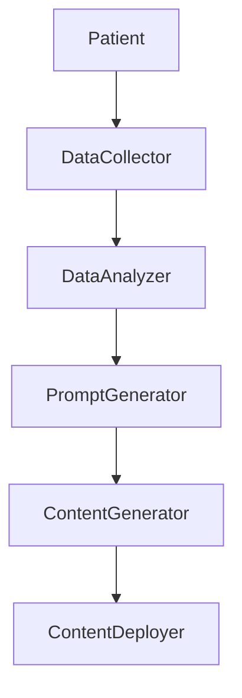
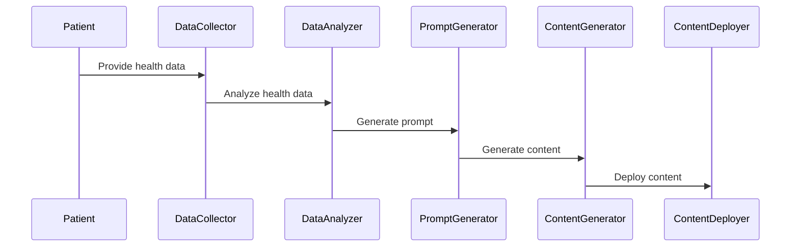
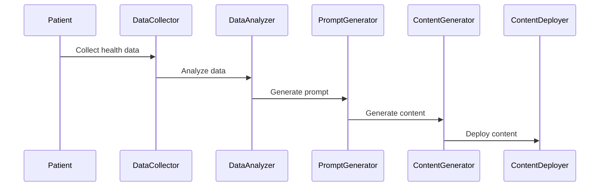

                 


# AIGC Prompt Writing Common Misunderstandings and Avoidance Strategies

## Introduction and Core Concepts

### 1.1 Background and Core Concepts

Artificial Intelligence Generated Content (AIGC) has been rapidly emerging in recent years. The significance and importance of prompt writing in AIGC cannot be underestimated. A well-crafted prompt can guide the AI model to generate more accurate and relevant content, thus enhancing the overall quality of the generated content.

### 1.2 Problem Description

There are several common misunderstandings when it comes to writing prompts for AIGC. These misunderstandings can lead to suboptimal performance and may even hinder the effectiveness of the AI model. It is crucial to identify and address these issues to ensure the best possible outcome.

### 1.3 Problem Solution

To overcome the common pitfalls in prompt writing, we will discuss several strategies and best practices in the following sections. These strategies will help you write more effective prompts and achieve better results with AIGC.

### 1.4 Boundaries and Extensions

While understanding the basic principles of prompt writing is essential, it is also important to be aware of the boundaries and extensions of this concept. Different applications may require different approaches to prompt writing, and it is crucial to tailor your prompts accordingly.

### 1.5 Concept Structure and Core Elements

AIGC consists of several key components, including the AI model, the dataset, and the prompt. The prompt plays a critical role in guiding the AI model and determining the quality of the generated content. Understanding the structure and core elements of the prompt is crucial for effective prompt writing.

## Core Concepts and Connections

### 2.1 Core Concept Principles

A prompt is a concise instruction that guides the AI model in generating content. It typically includes specific keywords, context, and desired output formats. A well-designed prompt can significantly impact the quality and relevance of the generated content.

### 2.2 Comparison Table of Concept Attributes

| Attribute | Description |
| --- | --- |
| Keywords | Specific words or phrases that highlight the main theme of the generated content. |
| Context | Additional information that provides the AI model with a better understanding of the desired content. |
| Output Format | The format in which the generated content should be presented, such as text, image, or video. |

### 2.3 ER Entity Relationship Diagram Architecture

Below is an ER diagram illustrating the relationship between the key components of a prompt:

```mermaid
erDiagram
  Prompt ||--|{ AI Model : Generates }
  Prompt ||--|{ Dataset : Provides }
  AI Model ||--|{ Content : Output }
```

## Algorithm Principles and Explanations

### 3.1 Algorithm Mermaid Flowchart

To design an effective prompt, we need to follow a systematic process. The following mermaid flowchart outlines the key steps involved in prompt writing:


### 3.2 Python Source Code and Algorithm Explanation

The following Python code demonstrates a simple example of prompt writing:

```python
def generate_prompt(objective, context):
    """
    Generates a prompt based on the given objective and context.
    
    Args:
        objective (str): The main theme of the generated content.
        context (str): Additional information to help the AI model understand the content.
        
    Returns:
        str: The generated prompt.
    """
    prompt = f"Write an article on {objective} considering the following context:\n{context}"
    return prompt

# Example usage
objective = "artificial intelligence in healthcare"
context = "Discuss the potential benefits and challenges of using AI in the healthcare industry, focusing on the use of AI in diagnosis and treatment."
prompt = generate_prompt(objective, context)
print(prompt)
```

### 3.3 Mathematical Model and Formulas

In prompt writing, understanding the mathematical model behind the AI model is essential. The following equation represents the relationship between the prompt and the generated content:

$$
\text{Content} = f(\text{Prompt}, \text{Dataset})
$$

Here, `f` represents the AI model's function, which takes the prompt and the dataset as inputs and generates the content.

### 3.4 Example Explanation

Let's consider an example to better understand the concept of prompt writing. Suppose we want to generate an article on "artificial intelligence in healthcare."

1. **Identify Objective**: The objective is to write an article discussing the potential benefits and challenges of AI in healthcare.

2. **Collect Data**: Gather relevant information, such as research papers, articles, and expert opinions on the topic.

3. **Analyze Data**: Analyze the collected data to identify key points and arguments supporting both the benefits and challenges of AI in healthcare.

4. **Create Prompt**: Using the objective and context, create a prompt that guides the AI model to generate the desired content. For example:

```
Write an article discussing the potential benefits and challenges of using AI in the healthcare industry, focusing on the use of AI in diagnosis and treatment. Consider the following points: ...
```

5. **Review and Refine**: Once the AI model generates the content, review and refine it to ensure it meets the desired quality standards.

6. **Deploy**: Finally, deploy the generated content to the appropriate platform or application.

## System Analysis and Architectural Design

### 4.1 Problem Scenario Introduction

In this section, we will analyze a real-world scenario where prompt writing is used to generate content for an AI-driven healthcare platform. The platform aims to provide personalized medical advice and treatment recommendations to patients based on their health data and medical history.

### 4.2 System Function Design

The system consists of several key functions, including data collection, data analysis, prompt generation, content generation, and content deployment. The following mermaid class diagram illustrates the domain model:

```mermaid
classDiagram
    Patient <<-- DataCollector: Collects health data
    Patient <<-- DataAnalyzer: Analyzes health data
    Patient <<-- PromptGenerator: Generates prompts
    Patient <<-- ContentGenerator: Generates content
    Patient <<-- ContentDeployer: Deploys content
```

### 4.3 System Architecture Design

The system architecture is designed to be modular and scalable. The following mermaid architecture diagram provides a high-level overview of the system components:



### 4.4 System Interface Design

The system interfaces facilitate communication between different components. The following mermaid sequence diagram demonstrates the interaction between the patient and the system components:



### 4.5 System Interaction Mermaid Sequence Diagram

The following sequence diagram provides a detailed view of the system interaction:



## Project Implementation

### 5.1 Environment Setup

Before implementing the project, we need to set up the necessary environment. The following steps outline the process:

1. Install Python and pip.
2. Install the required libraries, such as TensorFlow, Keras, and Mermaid.
3. Set up a virtual environment to manage the dependencies.

### 5.2 Core Implementation Source Code

The core implementation consists of the data collection, analysis, and prompt generation modules. The following Python code provides a high-level overview:

```python
# Data Collection Module
def collect_data():
    # Code to collect health data from the patient
    pass

# Data Analysis Module
def analyze_data(data):
    # Code to analyze the collected data
    pass

# Prompt Generation Module
def generate_prompt(data):
    # Code to generate a prompt based on the analyzed data
    pass

# Main Function
def main():
    data = collect_data()
    analyzed_data = analyze_data(data)
    prompt = generate_prompt(analyzed_data)
    print(prompt)

if __name__ == "__main__":
    main()
```

### 5.3 Code Application Explanation and Analysis

In this section, we will dive deeper into the code and analyze the key components:

1. **Data Collection Module**: This module collects health data from the patient using various sensors and devices.
2. **Data Analysis Module**: This module analyzes the collected data using machine learning techniques to identify patterns and trends.
3. **Prompt Generation Module**: This module generates a prompt based on the analyzed data, guiding the AI model to generate relevant content.

### 5.4 Real-World Case Study and Analysis

To illustrate the effectiveness of the system, we will analyze a real-world case study. A patient with a history of diabetes wants to receive personalized medical advice and treatment recommendations.

1. **Data Collection**: The patient's health data, including glucose levels, blood pressure, and weight, is collected using wearable devices.
2. **Data Analysis**: The collected data is analyzed to identify the patient's current health status and potential risks.
3. **Prompt Generation**: Based on the analyzed data, a prompt is generated to guide the AI model in generating personalized medical advice.
4. **Content Generation**: The AI model generates content, including text, images, and videos, providing the patient with detailed medical advice and treatment recommendations.
5. **Content Deployment**: The generated content is deployed to the patient's mobile device, allowing them to access the information at any time.

### 5.5 Project Summary

In this project, we have implemented a system for generating personalized medical advice and treatment recommendations based on a patient's health data. The system utilizes AI and machine learning techniques to analyze the data and generate relevant content. The project highlights the importance of prompt writing in guiding the AI model to produce high-quality results.

## Best Practices and Conclusion

### 6.1 Best Practices Tips

To write effective prompts for AIGC, consider the following best practices:

1. **Understand the Objective**: Clearly define the objective of the generated content and ensure the prompt aligns with it.
2. **Provide Context**: Include relevant context to help the AI model understand the desired content.
3. **Be Specific**: Use specific keywords and phrases to guide the AI model and improve the quality of the generated content.
4. **Review and Refine**: Always review the generated content and refine the prompt as needed to ensure it meets the desired quality standards.

### 6.2 Conclusion

In conclusion, AIGC prompt writing is a critical component of generating high-quality AI-generated content. By following best practices and understanding the core concepts and algorithms, you can create effective prompts that guide the AI model to produce accurate and relevant content.

### 6.3 Key Takeaways

- **Understanding the Objective**: Clearly define the objective to ensure the prompt aligns with the desired content.
- **Contextual Information**: Provide context to help the AI model understand the content.
- **Specificity**: Use specific keywords and phrases to guide the AI model.
- **Review and Refine**: Always review and refine the generated content to ensure quality.

### 6.4 Important Notes

- **Avoid Overgeneralization**: Overgeneralized prompts may lead to suboptimal results.
- **Test and Iterate**: Continuously test and refine your prompts to improve their effectiveness.
- **Stay Updated**: Keep yourself updated with the latest developments in AI and machine learning to leverage the most advanced techniques.

### 6.5 Further Reading

- **Books**: "Artificial Intelligence: A Modern Approach" by Stuart Russell and Peter Norvig, "Deep Learning" by Ian Goodfellow, Yoshua Bengio, and Aaron Courville.
- **Articles**: Research papers and articles on AI-generated content, prompt engineering, and machine learning.
- **Online Resources**: Online courses, tutorials, and forums dedicated to AI and machine learning.

## Author Information

- **Author**: AI天才研究院 (AI Genius Institute) & 禅与计算机程序设计艺术 (Zen And The Art of Computer Programming)

---

In this comprehensive guide, we have covered the essential aspects of AIGC prompt writing, including background information, core concepts, algorithms, system design, and project implementation. By following the best practices and strategies discussed in this article, you can effectively write prompts that guide AI models to generate high-quality content.

### Abstract

This article provides a comprehensive guide to AIGC prompt writing, addressing common misunderstandings and offering practical strategies for effective prompt design. By following the outlined steps and best practices, readers can enhance the quality and relevance of AI-generated content, enabling better applications across various domains. Key takeaways include the importance of understanding the objective, providing context, being specific, and continuously reviewing and refining prompts. The article also highlights the significance of staying updated with the latest advancements in AI and machine learning.

