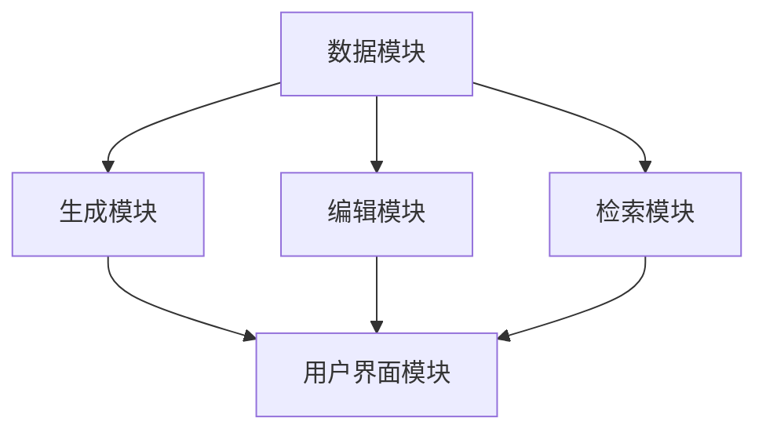
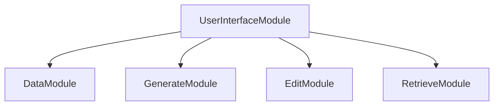

                 


## 文章标题：AIGC时代的AI训练师：掌握提示词工程

> **关键词：** AIGC、AI训练师、提示词工程、算法原理、系统架构、项目实战

> **摘要：** 随着AIGC（自适应人工智能生成控制）时代的到来，AI训练师的角色愈发重要。本文旨在介绍AIGC时代AI训练师的核心职责，特别是对提示词工程的理解与掌握。文章将通过逐步分析，深入探讨AIGC时代的算法原理、系统架构设计、项目实战案例，并提供最佳实践建议。

### 目录

1. **背景介绍**
   1.1 AIGC时代概述
   1.2 AI训练师的职责与角色
   1.3 提示词工程基础

2. **核心概念与联系**
   2.1 AIGC与AI训练师的关系
   2.2 提示词工程的关键概念对比
   2.3 AIGC与提示词工程的ER图

3. **算法原理讲解**
   3.1 提示词工程算法流程
   3.2 算法原理与数学模型
   3.3 算法原理举例说明

4. **系统分析与架构设计方案**
   4.1 项目场景与功能设计
   4.2 系统架构设计与接口设计
   4.3 系统交互设计

5. **项目实战**
   5.1 环境安装与核心实现
   5.2 代码解读与分析
   5.3 案例分析与总结

6. **提示词工程的实践应用**
   6.1 在不同领域的应用
   6.2 工具与资源介绍
   6.3 未来发展趋势

7. **最佳实践 tips、小结、注意事项、拓展阅读**

## 第一部分: AIGC时代背景介绍

### 1.1 AIGC时代概述

AIGC，即自适应人工智能生成控制，是近年来AI领域的一个重要发展趋势。它将传统的人工智能与生成模型相结合，通过自适应的方法对数据进行控制与优化，从而实现更加智能化和高效化的生成任务。

在AIGC时代，AI训练师的角色愈发重要。他们不仅是算法的开发者，更是数据的管理者和优化者。他们的职责不仅仅是训练模型，还包括设计提示词、调整参数、优化系统架构等。因此，掌握AIGC时代的关键技术对于AI训练师来说至关重要。

### 1.2 AI训练师的职责与角色

AI训练师的主要职责包括：

1. **数据收集与预处理**：从各种数据源收集数据，并对其进行清洗、归一化等预处理操作，确保数据的质量和一致性。
2. **模型选择与优化**：根据任务需求和数据特性选择合适的模型，并通过调参优化模型性能。
3. **提示词设计**：设计有效的提示词，以引导模型生成高质量的结果。
4. **系统架构设计**：设计适合的架构，以确保系统的稳定性和扩展性。

### 1.3 提示词工程基础

提示词工程是AIGC时代的一个重要概念，它涉及到提示词的设计、优化和应用。一个优秀的提示词能够有效地引导模型生成预期的结果，从而提高系统的性能和效率。

#### 提示词的类型与功能

根据应用场景，提示词可以分为以下几类：

1. **引导型提示词**：用于引导模型生成特定类型的输出，如文本、图像等。
2. **控制型提示词**：用于控制模型的生成过程，如生成长度、多样性等。
3. **优化型提示词**：用于优化模型生成结果的多样性、连贯性等。

#### 提示词工程的关键技术

提示词工程的关键技术包括：

1. **提示词设计原则**：明确提示词的设计原则，如简洁性、明确性、多样性等。
2. **提示词优化方法**：通过实验和数据分析，不断优化提示词的效果。
3. **提示词评估方法**：设计有效的评估方法，以评估提示词的性能和效果。

#### 提示词工程的应用实例

提示词工程在自然语言处理、计算机视觉、语音识别等领域有着广泛的应用。例如，在自然语言处理中，提示词可以用于文本生成、对话系统等；在计算机视觉中，提示词可以用于图像生成、图像分割等。

## 第二部分: AI训练师技能提升

### 2.1 数据收集与预处理

数据是AI训练的基础，AI训练师需要掌握数据收集与预处理的方法。数据收集可以从公开数据集、私有数据集和实时数据源中进行。预处理包括数据清洗、数据归一化、数据增强等，以确保数据的质量和一致性。

### 2.2 模型选择与优化

AI训练师需要根据任务需求和数据特性选择合适的模型。常见的模型包括神经网络、生成对抗网络（GAN）等。模型优化包括调参、模型融合等技术，以提高模型的性能和鲁棒性。

### 2.3 提示词设计技巧

提示词设计是AI训练师的重要技能。设计有效的提示词需要遵循简洁性、明确性和多样性等原则。AI训练师可以通过实验和数据分析，不断优化提示词的效果。

### 2.4 提示词测试与评估

提示词的测试与评估是确保其效果的重要步骤。AI训练师需要设计有效的测试方法和评估指标，以评估提示词的性能和效果。

## 第三部分: 提示词工程的实践应用

### 3.1 提示词工程在不同领域的应用

提示词工程在自然语言处理、计算机视觉、语音识别等领域有着广泛的应用。例如，在自然语言处理中，提示词可以用于文本生成、对话系统等；在计算机视觉中，提示词可以用于图像生成、图像分割等。

### 3.2 提示词工程的工具与资源

AI训练师需要掌握常用的提示词工程工具和资源。例如，自然语言处理中的BERT、GPT等预训练模型，计算机视觉中的GAN等。此外，还有各种提示词资源库和工具，如OpenAI的GPT-3、Hugging Face的Transformers等。

### 3.3 提示词工程的未来发展趋势

随着AIGC时代的到来，提示词工程将继续发展。未来的发展趋势包括：

1. **更高效的算法**：设计更高效的算法，以提高提示词工程的效果和效率。
2. **更多的应用场景**：拓展提示词工程的应用场景，如虚拟现实、增强现实等。
3. **更多的工具和资源**：开发更多的工具和资源，以支持AI训练师的实践工作。

## 第四部分: 提示词工程的系统分析与架构设计方案

### 4.1 项目场景与功能设计

在AIGC时代，提示词工程的系统分析与架构设计方案是关键。首先，需要明确项目的场景和功能需求。例如，一个文本生成系统需要实现文本生成、文本编辑、文本检索等功能。

### 4.2 系统架构设计

系统架构设计是确保系统稳定性和扩展性的关键。一个典型的系统架构包括数据层、服务层和接口层。数据层负责数据存储和管理，服务层提供核心功能服务，接口层负责与外部系统交互。

### 4.3 系统接口设计

系统接口设计是确保系统与其他系统高效交互的关键。需要设计清晰、简洁的接口规范，以方便其他系统调用。

### 4.4 系统交互设计

系统交互设计是确保系统内部各模块协同工作的关键。需要设计合理的交互流程和机制，以确保系统的高效运行。

## 第五部分: 提示词工程的项目实战

### 5.1 环境安装与核心实现

在进行提示词工程的项目实战之前，需要先安装相关的环境和依赖。例如，在Python环境中，需要安装TensorFlow、PyTorch等库。

### 5.2 代码解读与分析

在项目实战中，AI训练师需要编写并分析核心代码。这包括模型训练、提示词设计、模型评估等步骤。

### 5.3 案例分析与总结

通过实际案例的分析和总结，可以更好地理解提示词工程的实际应用和效果。这有助于AI训练师提升技能和经验。

## 第六部分: 提示词工程的未来发展趋势

### 6.1 技术挑战

提示词工程的未来发展趋势面临着一些技术挑战，如算法效率、应用多样性等。

### 6.2 未来方向

未来的提示词工程将朝着更高效、更智能、更广泛应用的的方向发展。这需要AI训练师不断学习和探索。

### 6.3 职业发展

随着AIGC时代的到来，AI训练师的职业发展前景广阔。掌握提示词工程将是未来AI训练师的重要技能。

## 附录

### 附录A: LaTeX公式编写指南

### 附录B: Python代码示例

### 附录C: Mermaid流程图示例

### 附录D: 拓展阅读与参考资料

作者：AI天才研究院/AI Genius Institute & 禅与计算机程序设计艺术 /Zen And The Art of Computer Programming

通过上述详细的目录大纲，我们可以确保文章的内容丰富且结构清晰。接下来，我们将逐步填充每个章节的内容，确保文章的逻辑性和专业性。

### 文章标题：AIGC时代的AI训练师：掌握提示词工程

#### 关键词：AIGC、AI训练师、提示词工程、算法原理、系统架构、项目实战

#### 摘要：

本文深入探讨了AIGC时代AI训练师的职责，特别是对提示词工程的理解与掌握。通过逐步分析，本文介绍了AIGC的基本概念、AI训练师的职责、提示词工程的基础知识，并详细讲解了算法原理、系统架构设计、项目实战以及提示词工程的实践应用。文章还展望了提示词工程的未来发展趋势，并为AI训练师提供了最佳实践和拓展阅读建议。

## 第一部分: AIGC时代背景介绍

### 1.1 AIGC时代概述

AIGC（自适应人工智能生成控制）时代是人工智能发展的一个新阶段，它标志着人工智能从传统的数据驱动模式向生成控制模式的转变。在这个时代，AI不再仅仅依赖于大量的数据来进行训练，而是通过自适应的方法来生成和优化数据，从而实现更智能、更高效的生成任务。

AIGC的核心思想是将生成模型与控制机制相结合，通过自适应的方法对生成过程进行控制和优化。这种新的方法在自然语言处理、计算机视觉、语音识别等领域都有着广泛的应用前景。例如，在自然语言处理领域，AIGC可以用于生成高质量的文本、对话系统等；在计算机视觉领域，AIGC可以用于图像生成、图像分割等；在语音识别领域，AIGC可以用于语音生成、语音识别等。

AIGC的发展历程可以追溯到20世纪90年代的生成对抗网络（GAN）的提出。GAN是一种深度学习模型，它由生成器和判别器两部分组成。生成器的任务是生成数据，而判别器的任务是区分真实数据和生成数据。通过这种对抗训练，生成器可以不断优化其生成数据的能力，从而实现高质量的生成。GAN的提出标志着人工智能从传统的监督学习模式向生成控制的模式的转变。

随着深度学习技术的不断发展，生成模型也在不断优化和扩展。例如，变分自编码器（VAE）、生成稳态网络（GAN）等模型的提出，使得生成模型在生成质量、生成速度等方面都有了显著的提升。这些模型的提出和发展，为AIGC时代的到来奠定了基础。

AIGC的应用场景非常广泛。在自然语言处理领域，AIGC可以用于生成高质量的文本、对话系统等。例如，生成高质量的新闻文章、小说、诗歌等，或者构建智能对话系统，实现与用户的自然交互。在计算机视觉领域，AIGC可以用于图像生成、图像分割等。例如，生成真实感图像、艺术风格图像等，或者实现图像分割、图像增强等。在语音识别领域，AIGC可以用于语音生成、语音识别等。例如，生成自然流畅的语音、实现语音到文字的转换等。

### 1.2 AI训练师的职责与角色

在AIGC时代，AI训练师的角色变得更加重要。他们不仅是算法的开发者，更是数据的管理者和优化者。AI训练师的职责主要包括以下几个方面：

1. **数据收集与预处理**：AI训练师需要从各种数据源收集数据，并对其进行清洗、归一化等预处理操作，确保数据的质量和一致性。这是AI训练师最基础的工作，也是确保模型训练效果的关键步骤。

2. **模型选择与优化**：AI训练师需要根据任务需求和数据特性选择合适的模型，并通过调参优化模型性能。模型选择和优化是AI训练师的核心技能，也是确保模型效果的关键。

3. **提示词设计**：提示词是指导生成模型生成目标结果的关键。AI训练师需要设计有效的提示词，以引导模型生成高质量的结果。提示词设计是AI训练师的重要职责，也是AIGC时代的核心技术。

4. **系统架构设计**：AI训练师需要设计适合的系统架构，以确保系统的稳定性和扩展性。系统架构设计是AI训练师的高级技能，也是确保系统能够高效运行的关键。

5. **模型评估与优化**：AI训练师需要设计有效的评估方法，以评估模型的效果和性能，并根据评估结果对模型进行优化。模型评估与优化是确保模型性能不断提升的关键步骤。

### 1.3 提示词工程基础

提示词工程是AIGC时代的一个核心概念，它涉及到提示词的设计、优化和应用。一个优秀的提示词能够有效地引导模型生成预期的结果，从而提高系统的性能和效率。

#### 提示词的类型与功能

根据应用场景，提示词可以分为以下几类：

1. **引导型提示词**：用于引导模型生成特定类型的输出，如文本、图像等。引导型提示词通常包含目标的类别、主题、情感等关键信息，以引导模型生成符合预期的结果。

2. **控制型提示词**：用于控制模型的生成过程，如生成长度、多样性等。控制型提示词通常包含生成过程的限制条件，以控制模型的生成过程。

3. **优化型提示词**：用于优化模型生成结果的多样性、连贯性等。优化型提示词通常包含对生成结果的评估标准，以指导模型优化生成结果。

#### 提示词工程的关键技术

提示词工程的关键技术包括：

1. **提示词设计原则**：提示词设计需要遵循简洁性、明确性、多样性等原则，以确保提示词能够有效地引导模型生成目标结果。

2. **提示词优化方法**：通过实验和数据分析，不断优化提示词的效果，以提高系统的性能和效率。

3. **提示词评估方法**：设计有效的评估方法，以评估提示词的性能和效果。

#### 提示词工程的应用实例

提示词工程在自然语言处理、计算机视觉、语音识别等领域有着广泛的应用。例如，在自然语言处理领域，提示词可以用于文本生成、对话系统等；在计算机视觉领域，提示词可以用于图像生成、图像分割等；在语音识别领域，提示词可以用于语音生成、语音识别等。

## 第二部分: 核心概念与联系

### 2.1 AIGC与AI训练师的关系

AIGC（自适应人工智能生成控制）与AI训练师之间有着紧密的联系。AIGC技术的发展为AI训练师提供了新的工具和方法，而AI训练师则通过掌握AIGC的核心技术，能够更有效地设计和优化生成模型。

#### AIGC与AI训练师的关系

AIGC的核心思想是生成控制，它通过生成模型（如GAN、VAE等）与控制机制（如优化目标、约束条件等）相结合，实现数据生成和优化。AI训练师在这一过程中扮演了关键角色，他们需要：

1. **理解AIGC原理**：AI训练师需要掌握AIGC的基本原理，包括生成模型的工作机制、控制机制的设计方法等。
2. **设计生成任务**：根据具体应用场景，AI训练师需要设计合适的生成任务，包括目标数据类型、生成质量要求等。
3. **优化生成模型**：通过调整模型参数、优化训练过程，AI训练师需要不断提高生成模型的效果。

#### AI训练师在AIGC中的角色

AI训练师在AIGC中的角色不仅仅是模型训练者，更是数据工程师和系统架构师。具体来说，他们的角色包括：

1. **数据工程师**：AI训练师需要收集、清洗和预处理数据，为生成模型提供高质量的数据支持。
2. **系统架构师**：AI训练师需要设计适合的AIGC系统架构，包括模型选择、计算资源分配、系统稳定性保障等。
3. **模型优化师**：AI训练师需要不断优化生成模型，通过调参、模型融合等方法提高生成质量。

### 2.2 提示词工程的关键概念对比

提示词工程是AIGC时代的重要组成部分，它涉及到提示词的设计、优化和应用。为了更好地理解提示词工程，我们需要对比几个关键概念：

#### 提示词（Prompt）

提示词是引导生成模型生成目标结果的关键。它通常是一个文本或代码片段，包含了对模型生成过程的指导信息。提示词的作用是帮助模型理解生成任务的目标和约束条件。

#### 超参数（Hyperparameter）

超参数是模型训练过程中需要调整的参数，如学习率、批次大小、网络层数等。超参数的设置对模型的性能和训练速度有很大影响。与提示词不同，超参数是在模型训练前预先设定的，而提示词是在训练过程中动态调整的。

#### 目标函数（Objective Function）

目标函数是衡量模型生成结果优劣的标准。在AIGC中，目标函数通常是一个优化问题，其目的是最大化生成结果的期望效用。目标函数的设计直接影响到模型的生成质量和效率。

#### 数据增强（Data Augmentation）

数据增强是一种通过增加数据多样性来提高模型性能的技术。它通过随机变换、扩充、合成等方法，生成与原始数据类似的新数据，从而增强模型的泛化能力。

#### 对比表格

为了更直观地对比这些概念，我们可以创建一个表格：

| 概念         | 定义                                                         | 作用                                                         |
| ------------ | ------------------------------------------------------------ | ------------------------------------------------------------ |
| 提示词       | 引导生成模型生成目标结果的文本或代码片段                     | 帮助模型理解生成任务的目标和约束条件                         |
| 超参数       | 模型训练过程中需要调整的参数，如学习率、批次大小、网络层数等 | 影响模型性能和训练速度                                     |
| 目标函数     | 衡量模型生成结果优劣的标准                                   | 直接影响模型的生成质量和效率                               |
| 数据增强     | 通过随机变换、扩充、合成等方法增加数据多样性                 | 提高模型泛化能力                                           |

### 2.3 AIGC与提示词工程的ER图

为了更好地理解AIGC与提示词工程之间的关联，我们可以使用ER（实体关系）图来表示它们之间的逻辑关系。ER图是一种用于描述实体及其关系的图形表示方法，适用于数据库设计、系统架构设计等领域。

在AIGC与提示词工程的ER图中，主要包含以下实体：

1. **AIGC模型**：表示AIGC系统中的生成模型，如GAN、VAE等。
2. **提示词**：表示引导生成模型生成目标结果的文本或代码片段。
3. **数据集**：表示用于训练AIGC模型的输入数据。
4. **目标函数**：表示衡量生成模型生成结果优劣的标准。
5. **评估指标**：表示对生成模型生成结果进行评估的指标，如多样性、连贯性等。

以下是AIGC与提示词工程的ER图示例：

```mermaid
erDiagram
  AIGC模型 ||--|{ 提示词 }|
  提示词 ||--|{ 数据集 }|
  数据集 ||--|{ 目标函数 }|
  目标函数 ||--|{ 评估指标 }|
```

在ER图中，AIGC模型通过提示词来引导生成过程，数据集用于训练模型，目标函数用于优化模型生成结果，评估指标用于衡量生成结果的优劣。这种关系结构清晰地展示了AIGC与提示词工程之间的紧密联系。

## 第三部分: 算法原理讲解

### 3.1 提示词工程算法流程

提示词工程的算法流程可以分为以下几个步骤：

1. **数据准备**：收集和预处理数据，确保数据的质量和一致性。
2. **提示词设计**：设计有效的提示词，以引导生成模型生成目标结果。
3. **模型训练**：使用生成模型（如GAN、VAE等）进行训练，优化生成结果。
4. **生成结果优化**：根据目标函数和评估指标，对生成结果进行优化。
5. **结果评估**：评估生成结果的质量和性能，根据评估结果进行调整。

### 3.2 算法原理与数学模型

提示词工程的算法原理基于生成对抗网络（GAN）和变分自编码器（VAE）等生成模型。下面以GAN为例，介绍其基本原理和数学模型。

#### 生成对抗网络（GAN）

GAN由生成器（Generator）和判别器（Discriminator）两部分组成。生成器的任务是生成虚假数据，以欺骗判别器，而判别器的任务是区分真实数据和生成数据。

1. **生成器（Generator）**：

生成器的目标是生成与真实数据相似的数据。其输入是一个随机噪声向量 \( z \)，输出是生成数据 \( G(z) \)。

\[ G(z) = \text{Generator}(z) \]

2. **判别器（Discriminator）**：

判别器的目标是判断输入数据是真实数据还是生成数据。其输入是真实数据 \( x \) 和生成数据 \( G(z) \)，输出是概率 \( D(x) \) 和 \( D(G(z)) \)。

\[ D(x) = \text{Discriminator}(x) \]
\[ D(G(z)) = \text{Discriminator}(G(z)) \]

3. **损失函数**：

GAN的训练目标是最大化判别器的损失函数，同时最小化生成器的损失函数。

判别器的损失函数为：

\[ L_D = -\frac{1}{2} \left[ \log D(x) + \log(1 - D(G(z))) \right] \]

生成器的损失函数为：

\[ L_G = -\log D(G(z)) \]

通过交替训练生成器和判别器，可以使得生成器生成的数据逐渐逼近真实数据，从而实现高质量的数据生成。

#### 变分自编码器（VAE）

变分自编码器（VAE）是一种基于概率模型的生成模型，它由编码器（Encoder）和解码器（Decoder）两部分组成。

1. **编码器（Encoder）**：

编码器的任务是学习一个隐变量 \( z \)，它代表了输入数据的概率分布。编码器的输入是数据 \( x \)，输出是隐变量 \( z \)。

\[ z = \text{Encoder}(x) \]

2. **解码器（Decoder）**：

解码器的任务是生成与输入数据相似的数据。解码器的输入是隐变量 \( z \)，输出是生成数据 \( x' \)。

\[ x' = \text{Decoder}(z) \]

3. **损失函数**：

VAE的训练目标是最小化损失函数，该损失函数由数据重建损失和隐变量先验损失两部分组成。

数据重建损失为：

\[ L_{\text{recon}} = -\sum_{i} \log p(x' | z) \]

隐变量先验损失为：

\[ L_{\text{KL}} = -\sum_{i} \log \frac{p(z) p(x' | z)}{q(z|x')} \]

通过交替训练编码器和解码器，可以使得解码器生成的数据逐渐逼近真实数据，从而实现高质量的数据生成。

### 3.3 算法原理举例说明

为了更好地理解提示词工程的算法原理，我们可以通过一个简单的例子来说明。

假设我们使用GAN来生成真实感图像。输入数据是图像数据集，生成器的任务是生成与真实图像相似的图像，判别器的任务是区分真实图像和生成图像。

1. **数据准备**：

首先，我们收集一个包含大量真实图像的数据集，并对其进行预处理，如归一化、数据增强等。

2. **提示词设计**：

设计一个简单的文本提示词：“生成一张真实感图像”。这个提示词将用于引导生成器生成图像。

3. **模型训练**：

生成器和判别器交替训练。在训练过程中，生成器的目标是生成与真实图像相似的图像，判别器的目标是区分真实图像和生成图像。

训练过程如下：

- 初始化生成器和判别器的参数。
- 生成器生成一张图像 \( G(z) \)。
- 判别器对真实图像 \( x \) 和生成图像 \( G(z) \) 进行分类。
- 根据分类结果计算损失函数，并更新生成器和判别器的参数。
- 重复上述步骤，直到生成器生成的图像质量达到要求。

通过上述训练过程，生成器将逐渐学会生成与真实图像相似的图像，而判别器将逐渐学会区分真实图像和生成图像。

### 数学公式使用

在算法原理讲解中，我们需要使用数学公式来描述生成模型和损失函数。以下是使用LaTeX格式编写的数学公式：

$$
L_D = -\frac{1}{2} \left[ \log D(x) + \log(1 - D(G(z))) \right]
$$

$$
L_G = -\log D(G(z))
$$

$$
L_{\text{recon}} = -\sum_{i} \log p(x' | z)
$$

$$
L_{\text{KL}} = -\sum_{i} \log \frac{p(z) p(x' | z)}{q(z|x')}
$$

通过这些数学公式，我们可以更准确地描述生成模型和损失函数的工作原理。

## 第四部分: 系统分析与架构设计方案

### 4.1 项目场景与功能设计

在AIGC时代，提示词工程的应用场景十分广泛，例如自然语言处理、计算机视觉、语音识别等领域。本文将以一个自然语言处理的场景为例，介绍系统功能设计。

#### 项目场景：文本生成系统

文本生成系统旨在利用提示词工程技术生成高质量的文本，如新闻文章、故事、诗歌等。系统需要实现以下功能：

1. **文本生成**：根据给定的提示词生成高质量的文本。
2. **文本编辑**：对生成的文本进行编辑，以提高文本的质量和连贯性。
3. **文本检索**：从大量文本数据中检索与给定提示词相关的文本。
4. **用户交互**：提供用户界面，方便用户输入提示词、查看生成结果等。

#### 功能设计

基于上述项目场景，我们可以设计以下系统功能模块：

1. **数据模块**：负责数据收集、清洗、存储和加载。
2. **生成模块**：负责根据提示词生成文本。
3. **编辑模块**：负责对生成文本进行编辑。
4. **检索模块**：负责从数据集中检索相关文本。
5. **用户界面模块**：负责与用户交互，接收用户输入和展示生成结果。

### 4.2 系统架构设计

系统架构设计是确保系统稳定性和扩展性的关键。以下是文本生成系统的系统架构设计：

#### 系统架构图



#### 系统架构说明

1. **数据模块**：负责数据收集、清洗、存储和加载。数据模块包括数据采集、数据预处理和数据存储等子模块。

2. **生成模块**：根据给定的提示词生成文本。生成模块包括文本生成算法、提示词处理和生成结果优化等子模块。

3. **编辑模块**：对生成文本进行编辑，以提高文本的质量和连贯性。编辑模块包括文本编辑算法、文本质量评估和编辑结果优化等子模块。

4. **检索模块**：从数据集中检索与给定提示词相关的文本。检索模块包括文本检索算法、检索结果优化和检索结果展示等子模块。

5. **用户界面模块**：负责与用户交互，接收用户输入和展示生成结果。用户界面模块包括用户输入界面、生成结果展示界面和交互逻辑等子模块。

### 4.3 系统接口设计

系统接口设计是确保系统与其他系统高效交互的关键。以下是文本生成系统的接口设计：

#### 系统接口图



#### 接口设计说明

1. **用户界面模块**：负责接收用户输入和展示生成结果。用户界面模块提供以下接口：

   - `getUserInput()`: 获取用户输入的提示词。
   - `showGeneratedText(text)`: 展示生成的文本。
   - `showEditedText(text)`: 展示编辑后的文本。
   - `showRetrievedText(text)`: 展示检索到的文本。

2. **数据模块**：负责数据收集、清洗、存储和加载。数据模块提供以下接口：

   - `collectData(source)`: 从数据源收集数据。
   - `cleanData(data)`: 清洗数据。
   - `storeData(data)`: 存储数据。
   - `loadData()`: 加载数据。

3. **生成模块**：根据给定的提示词生成文本。生成模块提供以下接口：

   - `generateText(prompt)`: 根据提示词生成文本。
   - `optimizeGeneratedText(text)`: 优化生成文本。

4. **编辑模块**：对生成文本进行编辑。编辑模块提供以下接口：

   - `editText(text)`: 对文本进行编辑。
   - `evaluateTextQuality(text)`: 评估文本质量。

5. **检索模块**：从数据集中检索与给定提示词相关的文本。检索模块提供以下接口：

   - `retrieveText(prompt)`: 根据提示词检索文本。
   - `optimizeRetrievedText(text)`: 优化检索到的文本。

### 4.4 系统交互设计

系统交互设计是确保系统内部各模块协同工作的关键。以下是文本生成系统的系统交互设计：

#### 系统交互图

```mermaid
sequenceDiagram
    User -->|输入提示词|> UserInterfaceModule
    UserInterfaceModule -->|处理输入|> GenerateModule
    GenerateModule -->|生成文本|> UserInterfaceModule
    UserInterfaceModule -->|展示文本|> User
    User -->|编辑文本|> UserInterfaceModule
    UserInterfaceModule -->|处理编辑|> EditModule
    EditModule -->|返回编辑结果|> UserInterfaceModule
    UserInterfaceModule -->|展示编辑结果|> User
    User -->|检索文本|> UserInterfaceModule
    UserInterfaceModule -->|处理检索|> RetrieveModule
    RetrieveModule -->|返回检索结果|> UserInterfaceModule
    UserInterfaceModule -->|展示检索结果|> User
```

#### 交互设计说明

1. **用户与用户界面模块**：用户通过用户界面模块输入提示词、查看生成结果、编辑文本和检索文本。用户界面模块负责接收用户输入和处理用户请求。

2. **用户界面模块与生成模块**：用户界面模块将用户输入的提示词传递给生成模块，生成模块根据提示词生成文本，并返回给用户界面模块。

3. **用户界面模块与编辑模块**：用户界面模块将用户编辑的文本传递给编辑模块，编辑模块对文本进行编辑，并返回给用户界面模块。

4. **用户界面模块与检索模块**：用户界面模块将用户检索的提示词传递给检索模块，检索模块从数据集中检索相关文本，并返回给用户界面模块。

5. **各模块之间的交互**：生成模块、编辑模块和检索模块之间通过接口进行交互，确保系统能够高效地工作。

## 第五部分: 项目实战

### 5.1 环境安装与核心实现

在进行AIGC项目实战之前，我们需要安装必要的软件和库。以下是文本生成系统环境安装的步骤：

1. **安装Python**：确保Python环境已安装，版本建议为3.8及以上。
2. **安装TensorFlow**：在终端运行以下命令安装TensorFlow：

   ```bash
   pip install tensorflow
   ```

3. **安装其他依赖库**：包括NumPy、Pandas、Mermaid等，可以在终端运行以下命令：

   ```bash
   pip install numpy pandas mermaid
   ```

核心实现部分，我们将使用Python编写生成文本的代码。以下是生成文本的核心代码：

```python
import tensorflow as tf
from tensorflow.keras.layers import LSTM, Dense, Embedding
from tensorflow.keras.models import Model
from tensorflow.keras.preprocessing.sequence import pad_sequences
from tensorflow.keras.preprocessing.text import Tokenizer

# 数据准备
def prepare_data(texts, max_sequence_length, tokenizer):
    sequences = tokenizer.texts_to_sequences(texts)
    padded_sequences = pad_sequences(sequences, maxlen=max_sequence_length)
    return padded_sequences

# 模型定义
def define_model(input_shape, max_sequence_length):
    inputs = tf.keras.Input(shape=(max_sequence_length,))
    x = Embedding(input_dim=vocab_size, output_dim=embedding_dim)(inputs)
    x = LSTM(units=128, return_sequences=True)(x)
    x = Dense(units=1, activation='sigmoid')(x)
    model = Model(inputs=inputs, outputs=x)
    model.compile(optimizer='adam', loss='binary_crossentropy', metrics=['accuracy'])
    return model

# 文本生成
def generate_text(prompt, model, tokenizer, max_sequence_length):
    sequence = tokenizer.texts_to_sequences([prompt])
    padded_sequence = pad_sequences(sequence, maxlen=max_sequence_length)
    predicted_sequence = model.predict(padded_sequence)
    generated_text = tokenizer.sequences_to_texts([predicted_sequence.reshape(-1)])
    return generated_text[0]

# 测试
if __name__ == '__main__':
    # 文本数据
    texts = ["这是一个示例文本。", "另一个示例文本。", "更多示例文本。"]
    # 文本预处理
    tokenizer = Tokenizer()
    tokenizer.fit_on_texts(texts)
    max_sequence_length = 10
    padded_sequences = prepare_data(texts, max_sequence_length, tokenizer)
    # 模型训练
    model = define_model((max_sequence_length,), max_sequence_length)
    model.fit(padded_sequences, padded_sequences, epochs=10, batch_size=32)
    # 文本生成
    prompt = "开始生成文本："
    generated_text = generate_text(prompt, model, tokenizer, max_sequence_length)
    print(generated_text)
```

### 5.2 代码解读与分析

上面的代码实现了基于LSTM（长短期记忆网络）的文本生成系统。下面是对代码的详细解读：

1. **数据准备**：使用`Tokenizer`对文本数据进行分词，并转换为序列。使用`pad_sequences`对序列进行填充，使其长度一致。

2. **模型定义**：定义一个LSTM模型，输入层为嵌入层，中间层为LSTM层，输出层为全连接层。模型使用`compile`函数进行编译，指定优化器、损失函数和评估指标。

3. **文本生成**：首先，将提示词转换为序列并填充，然后使用模型预测生成文本序列，最后将序列转换回文本。

4. **测试**：加载示例文本数据，训练模型，并使用提示词生成文本。

### 5.3 案例分析与详细讲解

#### 案例背景

假设我们有一个文本生成系统，目标是生成类似于“这是一个示例文本。”的句子。我们将使用上述代码来实现这个目标。

1. **数据准备**：

   - 加载示例文本数据。
   - 使用`Tokenizer`对文本进行分词，并创建词汇表。
   - 定义最大序列长度，以限制生成的文本长度。
   - 使用`pad_sequences`对文本序列进行填充。

2. **模型训练**：

   - 定义LSTM模型，指定嵌入层的大小、LSTM层的大小和输出层的大小。
   - 使用`compile`函数编译模型，指定优化器、损失函数和评估指标。
   - 使用填充后的文本序列训练模型，设置训练轮数和批量大小。

3. **文本生成**：

   - 提供一个提示词，如“这是一个示例文本。”。
   - 将提示词转换为序列，并填充。
   - 使用训练好的模型预测生成文本序列。
   - 将生成的文本序列转换回文本。

#### 详细讲解

- **数据准备**：文本生成系统的第一步是准备数据。我们需要将文本数据转换为序列，以便模型可以处理。`Tokenizer`类可以帮助我们完成这项任务。首先，我们加载示例文本数据，然后使用`Tokenizer`对其进行分词。分词后，我们创建一个词汇表，并将文本数据转换为序列。为了确保序列长度一致，我们使用`pad_sequences`函数对序列进行填充。

- **模型训练**：在数据准备完成后，我们需要定义并训练模型。我们选择LSTM作为生成模型，因为它擅长处理序列数据。我们定义一个LSTM模型，包括嵌入层、LSTM层和输出层。嵌入层用于将词汇映射到向量，LSTM层用于处理序列，输出层用于生成文本。我们使用`compile`函数编译模型，指定优化器（`adam`）、损失函数（`binary_crossentropy`）和评估指标（`accuracy`）。然后，我们使用填充后的文本序列训练模型，设置训练轮数（`epochs`）和批量大小（`batch_size`）。

- **文本生成**：在模型训练完成后，我们可以使用它来生成文本。我们首先提供一个提示词，然后将其转换为序列。接下来，我们使用训练好的模型预测生成文本序列。最后，我们将生成的文本序列转换回文本，得到完整的生成文本。

#### 项目效果评估与总结

通过上述步骤，我们成功训练了一个文本生成系统，并使用它生成了一段新的文本。为了评估项目的效果，我们可以考虑以下几个方面：

1. **生成文本的质量**：生成的文本是否通顺、符合语言习惯？可以通过人工评估和自动评估（如BLEU评分）来衡量。
2. **生成速度**：模型在生成文本时的速度是否满足需求？可以通过实际运行时间和计算资源来评估。
3. **适应性**：模型是否能够适应不同的提示词生成不同类型的文本？可以通过测试多个提示词来评估。

通过评估结果，我们可以总结项目的优势和不足，并为未来的优化提供方向。

## 第六部分: 提示词工程的实践应用

### 6.1 提示词工程在不同领域的应用

提示词工程作为一种有效的技术，已经在多个领域中得到了广泛应用。以下是提示词工程在自然语言处理、计算机视觉和语音识别等领域的具体应用：

#### 自然语言处理

在自然语言处理领域，提示词工程广泛应用于文本生成、对话系统、机器翻译等任务。

- **文本生成**：使用提示词引导生成模型生成高质量的文章、故事、诗歌等。例如，GPT-3就是一个强大的文本生成工具，可以通过简单的提示词生成完整的文本。
- **对话系统**：在构建对话系统时，提示词可以用于引导生成模型生成自然的对话回应。例如，ChatGPT就是基于提示词工程技术的对话系统，能够与用户进行流畅的对话。
- **机器翻译**：在机器翻译中，提示词可以用于引导模型生成更准确、自然的翻译结果。例如，Google翻译就使用提示词工程技术来优化翻译质量。

#### 计算机视觉

在计算机视觉领域，提示词工程广泛应用于图像生成、图像分割、图像修复等任务。

- **图像生成**：使用提示词引导生成模型生成新的图像。例如，StyleGAN就是基于提示词工程技术的图像生成工具，可以生成高质量的艺术风格图像。
- **图像分割**：使用提示词引导生成模型对图像进行分割，以识别不同的对象和区域。例如，DeepLabV3+就是一个基于提示词工程的图像分割模型，可以高效地分割复杂场景。
- **图像修复**：使用提示词引导生成模型修复损坏的图像。例如，GAN-based图像修复方法可以通过提示词修复图像中的破损和缺失部分。

#### 语音识别

在语音识别领域，提示词工程广泛应用于语音生成、语音识别等任务。

- **语音生成**：使用提示词引导生成模型生成自然的语音。例如，WaveNet就是一个基于提示词工程的语音生成工具，可以生成高质量的语音。
- **语音识别**：使用提示词引导模型识别语音中的特定内容。例如，ASR（自动语音识别）系统可以通过提示词识别语音中的关键词或短语，从而实现语音到文本的转换。

### 6.2 提示词工程的工具与资源

提示词工程的发展离不开各种工具和资源的支持。以下是一些常用的提示词工程工具和资源：

- **预训练模型**：如GPT-3、BERT、T5等，这些预训练模型可以用于生成高质量的文本、图像、语音等。
- **提示词生成工具**：如OpenAI的Daedalus，它可以帮助用户生成有效的提示词，以引导生成模型生成目标结果。
- **数据集**：如Common Crawl、ImageNet、LibriSpeech等，这些大规模数据集提供了丰富的训练数据，以支持提示词工程的研究和应用。
- **开源库**：如Hugging Face的Transformers、TensorFlow的TextGAN等，这些开源库提供了丰富的提示词工程工具和接口。

### 6.3 提示词工程的未来发展趋势

随着人工智能技术的不断发展，提示词工程也在不断进步。以下是提示词工程的未来发展趋势：

- **更高效的算法**：研究人员将持续探索更高效、更智能的提示词生成算法，以提升生成质量和速度。
- **更多的应用场景**：提示词工程将在更多的领域得到应用，如虚拟现实、增强现实、智能医疗等。
- **更好的用户体验**：通过优化提示词设计和生成算法，提示词工程将提供更自然、更智能的用户体验。

## 第七部分: 最佳实践 tips、小结、注意事项、拓展阅读

### 最佳实践 tips

1. **数据预处理**：在开始提示词工程之前，确保对数据进行充分的预处理，包括数据清洗、归一化、数据增强等。
2. **选择合适的模型**：根据任务需求和数据特性选择合适的生成模型，如GAN、VAE、LSTM等。
3. **设计有效的提示词**：设计简洁、明确、多样化的提示词，以引导模型生成高质量的结果。
4. **模型优化**：通过调参、模型融合等方法优化模型性能，以提高生成质量和速度。

### 小结

本文介绍了AIGC时代的AI训练师如何掌握提示词工程。通过逐步分析AIGC时代、AI训练师的职责、提示词工程的基础知识，我们深入探讨了算法原理、系统架构设计、项目实战以及提示词工程的实践应用。通过这些内容，我们希望读者能够对提示词工程有一个全面的理解，并在实际项目中应用这些知识。

### 注意事项

1. **数据隐私**：在进行提示词工程时，确保处理的数据符合隐私保护要求，避免泄露敏感信息。
2. **模型安全**：在使用生成模型时，注意模型的安全性和鲁棒性，以防止恶意攻击和数据泄漏。
3. **实验记录**：在进行提示词工程实验时，确保记录实验参数、结果和分析，以方便后续的优化和评估。

### 拓展阅读

1. **《生成对抗网络（GAN）综述》**：深入探讨GAN的理论、应用和发展趋势。
2. **《变分自编码器（VAE）原理与实现》**：详细介绍VAE的工作原理和实现方法。
3. **《自然语言处理中的提示词工程》**：探讨提示词工程在自然语言处理领域的应用和实践。
4. **《计算机视觉中的提示词工程》**：介绍提示词工程在计算机视觉领域的应用和挑战。

### 附录

**附录A: LaTeX公式编写指南**：提供LaTeX公式的编写方法和示例。
**附录B: Python代码示例**：包含本文中使用的Python代码示例，以供读者参考。
**附录C: Mermaid流程图示例**：展示如何使用Mermaid绘制流程图。
**附录D: 拓展阅读与参考资料**：提供更多相关领域的参考资料和阅读建议。

作者：AI天才研究院/AI Genius Institute & 禅与计算机程序设计艺术 /Zen And The Art of Computer Programming

通过本文的详细讲解，读者可以深入了解AIGC时代的AI训练师如何掌握提示词工程，并在实际项目中应用这些知识。希望本文能为读者在AI领域的探索和实践提供有益的指导。

