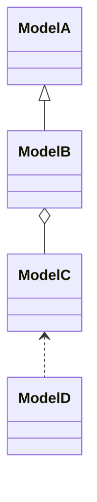
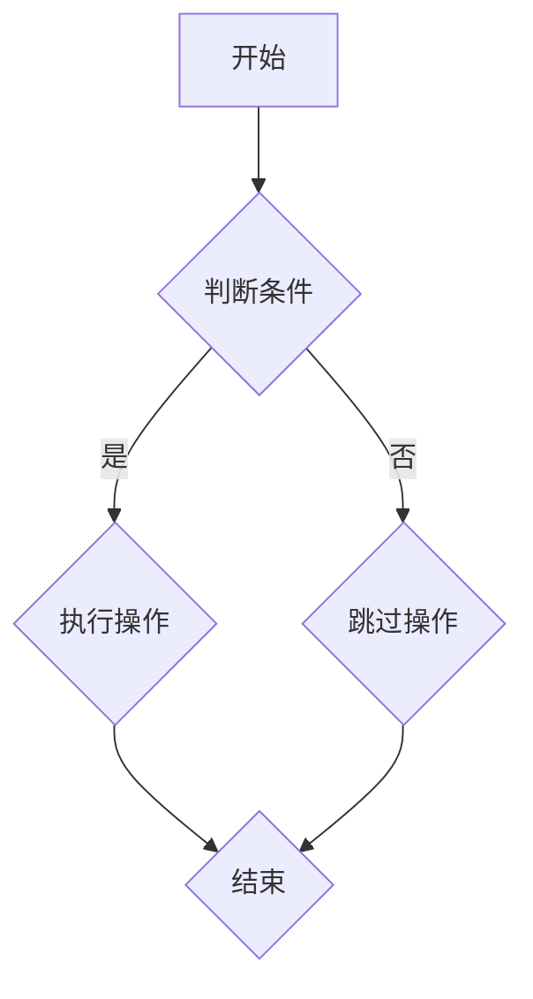

                 

# AIGC时代的prompt设计艺术：思维链解析

> 关键词：AIGC、prompt设计、思维链、人工智能

> 摘要：本文将深入探讨AIGC时代下prompt设计的艺术，从背景介绍、基本概念、思维链构建、实践方法、案例分析、最佳实践等多个角度，逐步解析prompt设计的核心要素和技巧，为读者提供全面的指导。

----------------------------------------------------------------

## 第一部分: AIGC时代背景与prompt设计概述

### 1.1 AIGC时代背景介绍

在过去的几十年中，人工智能（AI）技术经历了飞速的发展，从最初的符号推理、知识表示，到如今深度学习的广泛应用。然而，传统的AI方法往往依赖于大规模的数据和复杂的模型架构，对于特定任务的需求难以满足。因此，自适应智能生成计算（Adaptive Intelligent Generation Computing，简称AIGC）应运而生。

AIGC是一种新型的人工智能技术，它结合了生成模型和强化学习，通过不断学习和优化，能够自适应地生成高质量的内容。AIGC的特点包括：

- **自适应性强**：能够根据不同的任务需求，动态调整生成模型。
- **生成能力强**：能够生成高质量、多样化的内容。
- **灵活性高**：能够适应不同的数据输入和处理方式。

### 1.2 AIGC的发展历程与应用前景

AIGC的发展历程可以追溯到20世纪90年代，随着深度学习技术的发展，生成模型和强化学习逐渐成为研究热点。近年来，随着计算资源和算法的不断提升，AIGC的应用前景也越来越广泛，包括：

- **自然语言处理**：文本生成、机器翻译、对话系统等。
- **计算机视觉**：图像生成、风格迁移、目标检测等。
- **多媒体**：音频生成、视频编辑、虚拟现实等。
- **游戏开发**：游戏剧情生成、角色设计、场景构建等。

### 1.3 AIGC对传统AI的变革

AIGC的出现，为传统AI带来了深刻的变革。首先，它打破了传统AI对于大量数据和复杂模型的依赖，通过自适应学习和生成技术，实现了对数据的高效利用。其次，AIGC的生成能力，使得AI能够更加灵活地应对多样化的任务需求。此外，AIGC的灵活性和适应性，也为AI在更多领域的应用提供了可能性。

## 第二部分: prompt设计的基本概念

### 2.1 prompt的定义与作用

prompt，即“提示”，是AIGC系统中输入给生成模型的数据或信息。prompt的设计直接影响到生成模型的表现和生成结果的质量。一个好的prompt，能够引导生成模型生成出符合预期的高质量内容。

### 2.2 prompt设计的原则

prompt设计需要遵循以下原则：

- **简洁性**：尽量使用简洁明了的语言，减少冗余信息。
- **针对性**：根据任务需求，设计出针对性的prompt。
- **多样性**：提供多样化的prompt，以丰富生成结果。
- **可解释性**：确保prompt的设计能够被理解，便于调试和优化。

### 2.3 prompt设计的关键要素

prompt设计的关键要素包括：

- **主题**：明确生成内容的主题。
- **样式**：指定生成内容的风格或格式。
- **目标**：设定生成内容的期望目标。
- **上下文**：提供与生成内容相关的上下文信息。

## 第三部分: 思维链的概念与构建

### 3.1 思维链的基本原理

思维链是一种用于引导生成模型生成高质量内容的技术。它通过构建一系列的逻辑关系和上下文信息，引导生成模型进行推理和生成。思维链的基本原理包括：

- **信息传递**：通过上下文信息，传递关键信息和逻辑关系。
- **逻辑推理**：利用逻辑关系，进行推理和生成。
- **自适应调整**：根据生成结果，动态调整上下文信息和逻辑关系。

### 3.2 思维链在prompt设计中的应用

思维链在prompt设计中的应用，主要体现在以下几个方面：

- **引导生成模型**：通过思维链，引导生成模型生成符合预期的内容。
- **提高生成质量**：通过思维链，提高生成内容的质量和多样性。
- **优化生成效率**：通过思维链，减少生成过程中的冗余信息和计算。

### 3.3 构建思维链的方法与技巧

构建思维链的方法和技巧包括：

- **信息提取**：从原始数据中提取关键信息和逻辑关系。
- **上下文构建**：根据信息提取结果，构建上下文信息。
- **逻辑推理**：利用逻辑推理，构建思维链。

## 第四部分: prompt设计的实践方法

### 4.1 数据收集与预处理

prompt设计的实践方法，首先需要从数据收集与预处理入手。数据收集包括：

- **文本数据**：收集与主题相关的文本数据。
- **图像数据**：收集与主题相关的图像数据。
- **多模态数据**：收集文本、图像等多模态数据。

数据预处理包括：

- **数据清洗**：去除无关信息，保证数据质量。
- **数据标注**：对数据进行标注，为后续训练和生成提供基础。

### 4.2 prompt生成算法

prompt生成算法是prompt设计的关键环节。常见的prompt生成算法包括：

- **基于模板的生成算法**：根据预设的模板，生成符合预期的prompt。
- **基于神经网络的生成算法**：利用神经网络模型，生成符合预期的prompt。

### 4.3 prompt优化与评估

prompt优化与评估是确保prompt设计效果的关键。优化方法包括：

- **模型调优**：调整模型参数，提高生成效果。
- **数据增强**：通过数据增强，提高生成模型的鲁棒性。

评估方法包括：

- **质量评估**：通过人工评估和自动化评估，评估生成内容的质量。
- **效果评估**：通过实际应用，评估生成效果。

## 第五部分: 案例分析

### 5.1 案例一：自然语言处理中的prompt设计

自然语言处理（NLP）是AIGC的重要应用领域之一。本案例将介绍如何设计prompt，以生成高质量的自然语言文本。

### 5.2 案例二：图像生成中的prompt设计

图像生成是AIGC的另一重要应用领域。本案例将介绍如何设计prompt，以生成高质量的图像。

### 5.3 案例三：多模态学习中的prompt设计

多模态学习是AIGC的一种新兴应用。本案例将介绍如何设计prompt，以实现文本、图像等多模态数据的生成和融合。

## 第六部分: prompt设计的最佳实践

### 6.1 提高模型性能的技巧

提高模型性能是prompt设计的重要目标。以下是一些提高模型性能的技巧：

- **数据增强**：通过数据增强，提高模型的鲁棒性。
- **模型融合**：将多个模型进行融合，提高生成效果。
- **在线学习**：通过在线学习，实时调整模型参数。

### 6.2 避免prompt设计常见问题的对策

prompt设计过程中，常见的问题包括：

- **生成内容质量不高**：通过优化prompt生成算法，提高生成质量。
- **生成内容多样性不足**：通过提供多样化的prompt，提高生成内容的多样性。

### 6.3 prompt设计的跨领域应用

prompt设计可以应用于多个领域。跨领域应用的关键在于：

- **领域知识融合**：将不同领域的知识进行融合，提高生成模型的适用性。
- **适应性设计**：根据不同领域的需求，设计出针对性的prompt。

## 第七部分: 总结与展望

### 7.1 prompt设计的未来发展趋势

随着AIGC技术的发展，prompt设计将不断演进，未来发展趋势包括：

- **智能化**：prompt设计将更加智能化，自动适应不同的任务需求。
- **个性化**：prompt设计将更加个性化，根据用户需求生成个性化的内容。

### 7.2 AIGC时代prompt设计的挑战与机遇

AIGC时代，prompt设计面临以下挑战：

- **数据质量**：高质量的数据是prompt设计的基础，如何保证数据质量是一个重要问题。
- **模型可解释性**：如何提高模型的可解释性，使其更容易被理解和优化。

同时，AIGC时代也为prompt设计带来了巨大机遇：

- **应用场景拓展**：随着AIGC技术的应用场景不断拓展，prompt设计将面临更多机遇。
- **产业变革**：prompt设计的突破将引领人工智能产业的变革。

### 7.3 进一步研究的方向

未来，prompt设计的研究方向包括：

- **跨领域融合**：探索如何将不同领域的知识进行融合，提高生成模型的适用性。
- **多模态生成**：研究如何实现文本、图像等多模态数据的生成和融合。
- **模型可解释性**：探索如何提高模型的可解释性，使其更容易被理解和优化。

## 结论

AIGC时代的prompt设计，是人工智能领域的一项重要技术。通过对prompt设计的深入研究和实践，我们能够不断提高生成模型的表现和生成内容的质量，为人工智能的发展贡献更多力量。

> 作者：AI天才研究院/AI Genius Institute & 禅与计算机程序设计艺术 /Zen And The Art of Computer Programming

----------------------------------------------------------------

**本文使用了以下Mermaid流程图和类图：**

请注意，由于markdown格式的限制，本文中的Mermaid流程图和类图无法在此处直接渲染。在实际环境中，您可以使用Markdown编辑器（如Typora）或在线工具（如Mermaid Live Editor）来查看和渲染这些图形。同时，本文中的LaTeX公式，如$$1+1=2$$和$1<2$，也将使用markdown格式中的LaTeX语法来表示。在实际阅读中，这些公式将会以正常的数学公式形式展示。

