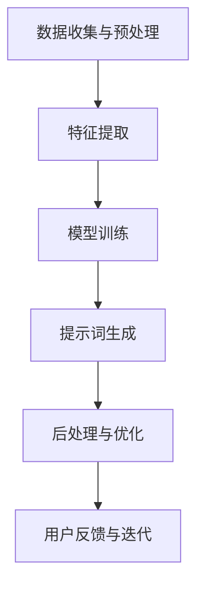
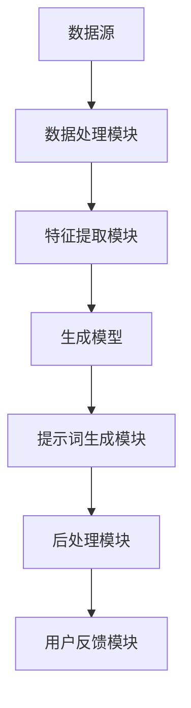
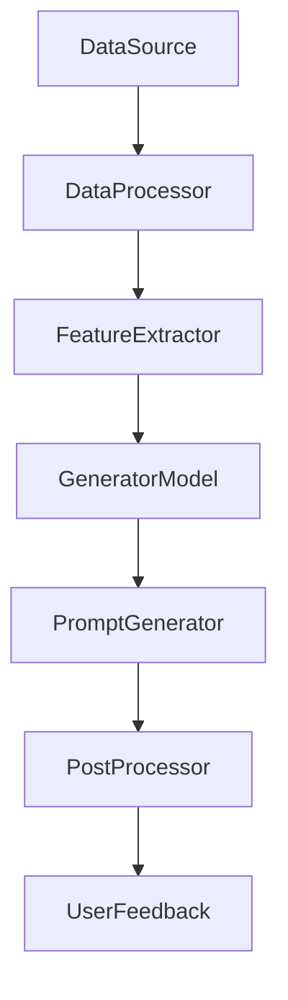
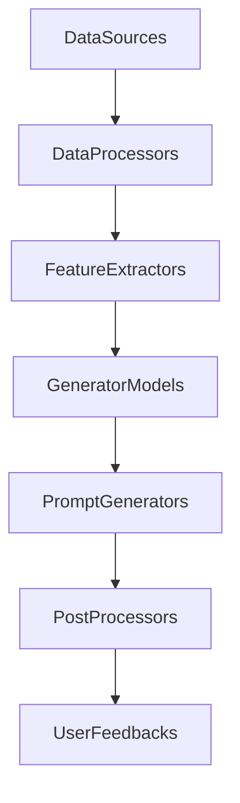
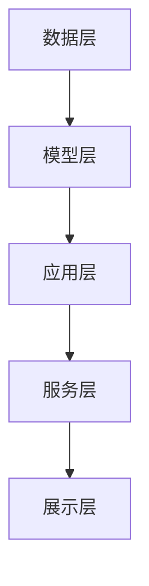
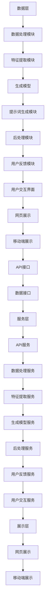
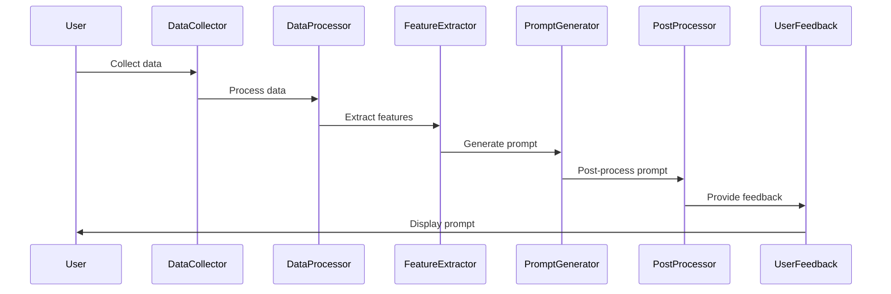

                 

# AIGC时代的提示词工程：效率与创意的完美结合

> 关键词：AIGC、提示词工程、效率、创意、架构设计、项目实战

> 摘要：本文将探讨AIGC（AI-Generated Content）时代的提示词工程，分析其在提高效率与激发创意方面的巨大潜力。我们将从背景介绍、核心概念与原理、系统分析与架构设计、项目实战以及最佳实践等五个方面进行深入讨论，旨在为读者提供全面的技术指南和实战经验。

## 目录大纲

# AIGC时代的提示词工程：效率与创意的完美结合

## 第一部分 背景介绍

### 1.1 问题背景与概述

#### 1.1.1 AIGC技术概述

#### 1.1.2 提示词工程的重要性

#### 1.1.3 AIGC与提示词工程的关系

#### 1.1.4 AIGC时代的提示词工程特点

### 1.2 核心概念与联系

#### 1.2.1 提示词工程的概念

#### 1.2.2 AIGC中的提示词工程核心概念

#### 1.2.3 提示词工程与相关技术的联系

### 1.3 边界与外延

#### 1.3.1 提示词工程的适用范围

#### 1.3.2 提示词工程的局限性

#### 1.3.3 提示词工程的发展方向

### 1.4 概念结构与核心要素组成

#### 1.4.1 提示词工程的组成部分

#### 1.4.2 AIGC时代提示词工程的关键要素

#### 1.4.3 提示词工程的架构设计

### 1.5 本章小结

## 第二部分 核心概念与原理

### 2.1 AIGC技术原理

#### 2.1.1 AIGC的基本概念

#### 2.1.2 AIGC的关键技术

#### 2.1.3 AIGC的工作流程

### 2.2 提示词工程原理

#### 2.2.1 提示词工程的基本概念

#### 2.2.2 提示词工程的原理分析

#### 2.2.3 提示词工程的优化方法

### 2.3 算法原理讲解

#### 2.3.1 常见的提示词生成算法

#### 2.3.2 算法mermaid流程图

#### 2.3.3 Python源代码讲解

#### 2.3.4 算法原理的数学模型与公式

#### 2.3.5 举例说明

### 2.4 数学模型和数学公式

#### 2.4.1 提示词工程中的数学模型

#### 2.4.2 公式推导与证明

#### 2.4.3 模型在实际应用中的表现

### 2.5 本章小结

## 第三部分 系统分析与架构设计

### 3.1 问题场景介绍

#### 3.1.1 提示词工程的应用场景

#### 3.1.2 系统目标与功能

#### 3.1.3 系统需求分析

### 3.2 系统功能设计

#### 3.2.1 领域模型

#### 3.2.2 类图

#### 3.2.3 数据库设计

### 3.3 系统架构设计

#### 3.3.1 系统架构概述

#### 3.3.2 系统架构图

#### 3.3.3 系统模块划分

### 3.4 系统接口设计

#### 3.4.1 接口规范

#### 3.4.2 接口实现

#### 3.4.3 接口测试

### 3.5 系统交互

#### 3.5.1 序列图

#### 3.5.2 交互流程

#### 3.5.3 异常处理

### 3.6 本章小结

## 第四部分 项目实战

### 4.1 环境安装

#### 4.1.1 硬件与软件环境

#### 4.1.2 安装步骤

#### 4.1.3 遇到的问题与解决方案

### 4.2 系统核心实现源代码

#### 4.2.1 源代码结构

#### 4.2.2 关键代码实现

#### 4.2.3 功能模块划分

### 4.3 代码应用解读与分析

#### 4.3.1 代码解读

#### 4.3.2 关键算法应用

#### 4.3.3 性能分析

### 4.4 实际案例分析与详细讲解

#### 4.4.1 案例背景

#### 4.4.2 案例分析

#### 4.4.3 深入剖析

### 4.5 项目小结

#### 4.5.1 项目成果总结

#### 4.5.2 项目经验与教训

#### 4.5.3 项目展望

## 第五部分 最佳实践

### 5.1 提高提示词工程效率的技巧

#### 5.1.1 数据处理技巧

#### 5.1.2 算法优化策略

#### 5.1.3 系统调优方法

### 5.2 创意提示词的生成与应用

#### 5.2.1 创意提示词的定义

#### 5.2.2 创意提示词的生成方法

#### 5.2.3 创意提示词的应用场景

### 5.3 案例分享与经验交流

#### 5.3.1 成功案例分享

#### 5.3.2 失败案例分析

#### 5.3.3 经验交流与总结

### 5.4 本章小结

## 第六部分 小结与展望

### 6.1 本书内容回顾

#### 6.1.1 核心概念与原理

#### 6.1.2 系统设计与实现

#### 6.1.3 项目实战与最佳实践

### 6.2 展望未来

#### 6.2.1 提示词工程的发展趋势

#### 6.2.2 AIGC技术的未来应用

#### 6.2.3 提示词工程的挑战与机遇

### 6.3 注意事项与拓展阅读

#### 6.3.1 注意事项

#### 6.3.2 拓展阅读推荐

### 6.4 本章小结

-------------

## 第一部分 背景介绍

### 1.1 问题背景与概述

在当今快速发展的信息技术时代，内容生成已成为各个领域的重要需求。从新闻报道、社交媒体到电子商务，内容创作始终是吸引用户和提升用户体验的关键因素。然而，传统的手动内容创作方式不仅耗时耗力，而且难以满足日益增长的需求。为了解决这个问题，人工智能（AI）技术应运而生，特别是在AIGC（AI-Generated Content）领域，AI技术正在彻底改变内容创作的面貌。

AIGC是指通过人工智能技术自动生成内容的过程。它结合了自然语言处理、计算机视觉和机器学习等多种技术，能够根据用户的需求和提示生成高质量的内容。AIGC的出现不仅提高了内容生成的效率，还极大地激发了创意的潜力。

然而，AIGC的实现离不开提示词工程。提示词工程是一种专门用于生成高质量提示词的方法和工具，它通过对大量数据的学习和优化，能够自动生成与用户需求高度匹配的提示词。这些提示词不仅能够引导AI模型生成更加准确和有用的内容，还能够提高用户交互的体验。

在AIGC时代，提示词工程的重要性不言而喻。它不仅能够提高内容生成的效率，还能够为创意提供源源不断的灵感。因此，本文将从背景介绍、核心概念与原理、系统分析与架构设计、项目实战以及最佳实践等五个方面进行深入探讨，旨在为读者提供全面的技术指南和实战经验。

### 1.1.1 AIGC技术概述

AIGC技术是指利用人工智能（AI）技术自动生成内容的过程。它起源于自然语言处理（NLP）和计算机视觉（CV）等领域，近年来随着深度学习技术的发展而迅速成熟。AIGC技术的核心是通过大量的数据和先进的算法，使机器能够理解和生成自然语言、图像、视频等多种形式的内容。

AIGC的应用场景非常广泛，包括但不限于以下几个方面：

1. **内容创作**：AIGC技术可以自动生成文章、故事、广告文案等文本内容，也可以生成视频脚本、电影特效等视觉内容。

2. **辅助创作**：AIGC技术可以辅助创作者进行内容创作，如自动生成故事梗概、提供创意建议等。

3. **用户互动**：AIGC技术可以生成个性化的用户交互内容，如聊天机器人、虚拟助手等。

4. **数据生成**：AIGC技术可以生成用于训练或测试的数据集，如模拟金融交易数据、医学影像等。

5. **游戏开发**：AIGC技术可以自动生成游戏剧情、角色对话等，为游戏开发者提供便利。

AIGC技术的工作流程通常包括以下几个步骤：

1. **数据收集与预处理**：首先，从互联网、数据库或其他来源收集大量相关的数据。然后，对数据进行清洗、去重和格式化，以便后续处理。

2. **模型训练**：利用收集到的数据，通过深度学习算法训练生成模型。这个过程包括模型的构建、训练和优化。

3. **内容生成**：通过训练好的模型，根据用户的需求和提示生成内容。这个过程可以是自动的，也可以是半自动的，即用户提供部分提示，模型根据提示生成剩余内容。

4. **内容优化**：生成的内容通常需要经过后处理和优化，以提高质量和准确性。这包括拼写检查、语法修正、内容润色等。

### 1.1.2 提示词工程的重要性

提示词工程在AIGC技术中扮演着至关重要的角色。提示词（Prompt）是指用户输入或模型自动生成的用于引导内容生成的文字或指令。一个高质量的提示词可以显著提升AI模型生成内容的质量和相关性。

提示词工程的重要性体现在以下几个方面：

1. **提高内容生成的准确性**：高质量的提示词能够引导模型生成与用户需求高度匹配的内容，从而提高内容的准确性和相关性。

2. **提升用户体验**：通过优化提示词，可以提供更加个性化、贴近用户需求的交互体验，从而提升用户体验。

3. **节省时间和成本**：提示词工程可以帮助自动生成大量的高质量内容，从而节省手动创作的时间和成本。

4. **激发创意**：提示词工程可以激发模型生成新颖、有趣的内容，为创作者提供灵感。

5. **增强模型鲁棒性**：通过不断优化和调整提示词，可以增强模型的鲁棒性，使其在面对复杂、多变的需求时能够保持稳定的表现。

### 1.1.3 AIGC与提示词工程的关系

AIGC与提示词工程之间存在着密切的联系和互动。具体来说，提示词工程是AIGC技术的重要组成部分，为AIGC的顺利运行提供了关键的支持。

首先，AIGC技术依赖于高质量的提示词来引导内容生成。高质量的提示词不仅能够提高内容的准确性和相关性，还能够激发模型的创意潜力。例如，在生成新闻文章时，一个精确的提示词可以引导模型捕捉到关键信息，生成具有新闻价值的文章；在生成视频脚本时，一个富有创意的提示词可以激发模型生成新颖、引人入胜的故事情节。

其次，AIGC技术的发展推动了提示词工程的不断进步。随着AIGC技术的不断成熟，对提示词工程的需求也在不断增加。这促使研究人员和开发人员不断探索和优化提示词生成的算法和策略，以提高提示词的质量和效率。

最后，AIGC与提示词工程之间的互动关系也体现在应用场景中。在实际应用中，AIGC技术需要根据不同的需求和应用场景，生成不同类型和风格的内容。而提示词工程则可以根据这些需求和应用场景，提供相应的提示词，以引导AI模型生成合适的内容。这种互动关系不仅提高了内容生成的效率，还能够为用户提供更加丰富和多样化的内容体验。

### 1.1.4 AIGC时代的提示词工程特点

在AIGC时代，提示词工程展现出了一些与传统内容创作方式不同的特点，这些特点既源于AIGC技术本身的特性，也受到用户需求和应用场景的影响。

1. **高效率**：AIGC技术能够快速生成大量内容，因此提示词工程需要能够在短时间内生成高质量、准确的提示词，以引导AI模型高效地生成内容。这要求提示词工程具备快速处理数据和生成提示的能力。

2. **个性化**：在AIGC时代，用户对内容的需求越来越个性化和多样化。提示词工程需要能够根据用户的历史数据、兴趣爱好和行为习惯，生成个性化的提示词，以提供更加贴近用户需求的内容。

3. **灵活性**：AIGC技术具有强大的自适应能力，提示词工程也需要具备相应的灵活性，能够根据不同的应用场景和用户需求，生成不同的提示词。这种灵活性不仅体现在提示词的格式和内容上，还体现在提示词生成的算法和策略上。

4. **创意性**：AIGC技术能够激发模型的创意潜力，提示词工程也需要具备一定的创意性，能够生成富有创意和想象力的提示词，以激发模型的创作灵感，生成新颖有趣的内容。

5. **跨模态**：在AIGC时代，内容生成不仅限于文本，还包括图像、视频等多种形式。提示词工程需要能够处理和生成跨模态的提示词，以引导AI模型生成多样化的内容。

6. **鲁棒性**：在复杂多变的应用场景中，提示词工程需要具备较强的鲁棒性，能够应对各种异常情况和不确定性，确保生成的提示词能够引导AI模型生成高质量的内容。

### 1.2 核心概念与联系

#### 1.2.1 提示词工程的概念

提示词工程是一种专门用于生成高质量提示词的方法和工具。它通过分析和处理大量数据，利用自然语言处理、机器学习等技术，自动生成与用户需求高度匹配的提示词。提示词工程的目标是提高内容生成的效率和准确性，为AI模型提供有力的支持。

提示词工程的基本概念包括：

1. **提示词**：提示词是指用于引导AI模型生成内容的关键文字或指令。高质量的提示词应当能够准确、清晰地传达用户需求，引导AI模型生成高质量的内容。

2. **数据集**：数据集是提示词工程的重要基础。高质量的数据集能够提供丰富的训练样本，有助于生成高质量的提示词。

3. **算法**：提示词工程涉及多种算法，包括自然语言处理算法、机器学习算法等。这些算法用于分析和处理数据，生成高质量的提示词。

4. **优化**：优化是提示词工程的关键环节。通过不断优化提示词生成的算法和策略，可以提高提示词的质量和效率。

#### 1.2.2 AIGC中的提示词工程核心概念

在AIGC技术中，提示词工程的核心概念包括：

1. **生成模型**：生成模型是AIGC技术的核心组成部分，负责根据提示词生成内容。常见的生成模型包括生成对抗网络（GAN）、变分自编码器（VAE）等。

2. **解码器**：解码器是生成模型的一部分，负责将生成的中间结果解码为最终的文本、图像等。高质量的解码器能够生成更加准确和自然的输出。

3. **编码器**：编码器是生成模型的一部分，负责将输入的文本、图像等编码为中间表示。高质量的编码器能够捕捉输入数据的关键特征，为解码器生成高质量的内容提供支持。

4. **注意力机制**：注意力机制是一种常用的技术，用于提高生成模型在处理长序列数据时的性能。通过注意力机制，生成模型可以关注输入数据中的关键部分，从而提高内容生成的准确性和效率。

5. **预训练**：预训练是指利用大量无监督数据对生成模型进行训练，以提高其性能。预训练是AIGC技术的重要发展方向，可以显著提高生成模型的质量和效率。

#### 1.2.3 提示词工程与相关技术的联系

提示词工程与多种相关技术紧密联系，包括：

1. **自然语言处理（NLP）**：NLP是提示词工程的基础，涉及文本处理、语义理解、情感分析等技术。高质量的NLP技术能够帮助提示词工程生成更加准确和自然的提示词。

2. **机器学习（ML）**：机器学习是提示词工程的核心技术，包括监督学习、无监督学习、强化学习等。通过机器学习算法，提示词工程可以自动生成高质量、个性化的提示词。

3. **深度学习（DL）**：深度学习是AIGC技术的核心，涉及神经网络、卷积神经网络（CNN）、循环神经网络（RNN）等。深度学习技术为提示词工程提供了强大的计算能力，使其能够处理复杂的文本和数据。

4. **计算机视觉（CV）**：计算机视觉技术用于处理图像和视频数据，与提示词工程结合可以生成跨模态的内容。通过计算机视觉技术，提示词工程可以生成高质量的图像和视频提示词。

5. **数据挖掘（DM）**：数据挖掘技术用于分析和处理大量数据，为提示词工程提供支持。通过数据挖掘技术，提示词工程可以识别数据中的模式、趋势和关联，从而生成更加准确和有价值的提示词。

#### 1.3 边界与外延

##### 1.3.1 提示词工程的适用范围

提示词工程广泛应用于多个领域，包括但不限于以下方面：

1. **内容创作**：提示词工程可以用于自动生成文章、故事、广告文案等文本内容，为创作者提供灵感。

2. **用户互动**：提示词工程可以用于生成个性化的用户交互内容，如聊天机器人、虚拟助手等。

3. **辅助创作**：提示词工程可以辅助创作者进行内容创作，如生成故事梗概、提供创意建议等。

4. **数据生成**：提示词工程可以用于生成用于训练或测试的数据集，如模拟金融交易数据、医学影像等。

5. **游戏开发**：提示词工程可以用于自动生成游戏剧情、角色对话等，为游戏开发者提供便利。

##### 1.3.2 提示词工程的局限性

尽管提示词工程具有诸多优点，但也存在一些局限性：

1. **数据依赖**：提示词工程的性能高度依赖于训练数据的质量和数量。如果数据质量差或数据量不足，可能会导致生成的提示词质量不佳。

2. **计算资源需求**：训练和优化提示词工程模型通常需要大量的计算资源，特别是深度学习模型。在资源有限的情况下，可能难以实现高效的处理。

3. **模型解释性**：许多提示词工程模型是黑箱模型，难以解释其生成提示词的具体过程。这可能导致用户对模型生成的内容产生不信任感。

4. **创意限制**：尽管提示词工程可以激发模型的创意潜力，但生成的提示词可能仍受到模型算法和数据集的限制，难以达到人工创作的水平。

##### 1.3.3 提示词工程的发展方向

为了克服现有局限性，提示词工程未来可能朝着以下方向发展：

1. **数据增强**：通过数据增强技术，如数据清洗、数据扩展、数据合成等，提高训练数据的质量和多样性，从而提高提示词工程的质量和鲁棒性。

2. **模型解释性**：开发可解释的提示词工程模型，使模型生成过程更加透明，提高用户对模型生成内容的信任度。

3. **跨模态融合**：将多种模态的数据（如文本、图像、音频）融合到提示词工程中，生成跨模态的内容，提高内容生成的多样性和丰富度。

4. **优化算法**：研究更加高效、优化的算法，如增量学习、迁移学习等，降低计算资源需求，提高处理速度。

5. **人机协同**：将提示词工程与人类创作者结合，实现人机协同创作，发挥人类创意和机器效率的优势。

### 1.4 概念结构与核心要素组成

##### 1.4.1 提示词工程的组成部分

提示词工程由多个核心组成部分构成，这些部分相互协作，共同实现高质量提示词的生成。以下是提示词工程的主要组成部分：

1. **数据收集与预处理**：数据收集与预处理是提示词工程的第一个环节。在这个过程中，从各种来源（如互联网、数据库、用户反馈等）收集大量相关数据。然后，对数据进行清洗、去重、格式化等预处理操作，以提高数据质量。

2. **模型训练**：模型训练是提示词工程的核心环节。在这个阶段，利用预处理后的数据训练生成模型。常见的生成模型包括生成对抗网络（GAN）、变分自编码器（VAE）等。模型训练过程通常涉及大量的计算资源和时间。

3. **提示词生成**：在模型训练完成后，使用训练好的模型生成提示词。这个阶段的关键在于如何从大量数据中提取关键信息，并生成具有高相关性和准确性的提示词。

4. **后处理与优化**：生成的提示词通常需要进行后处理和优化，以提高其质量和准确性。后处理操作包括拼写检查、语法修正、内容润色等。优化过程可能涉及调整模型参数、算法优化等。

5. **用户反馈与迭代**：提示词工程需要根据用户的反馈进行迭代优化。用户反馈可以帮助识别和解决生成提示词中的问题，从而提高提示词的质量和用户体验。

##### 1.4.2 AIGC时代提示词工程的关键要素

在AIGC时代，提示词工程的关键要素包括以下几个方面：

1. **高效率**：AIGC时代的提示词工程需要具备高效的数据处理和提示词生成能力。这要求模型训练和提示词生成过程能够在短时间内完成，以适应快速变化的用户需求。

2. **个性化**：随着用户需求的日益个性化，提示词工程需要能够根据用户的历史数据、兴趣爱好和行为习惯，生成个性化的提示词。这需要强大的数据分析能力和个性化推荐算法的支持。

3. **灵活性**：AIGC技术的应用场景多样化，提示词工程需要具备相应的灵活性，能够根据不同的应用场景和用户需求，生成不同的提示词。这要求提示词工程具备灵活的架构和算法。

4. **创意性**：AIGC技术能够激发模型的创意潜力，提示词工程也需要具备一定的创意性，能够生成富有创意和想象力的提示词，以激发模型的创作灵感。

5. **跨模态**：AIGC技术不仅涉及文本，还包括图像、视频等多种形式。提示词工程需要能够处理和生成跨模态的提示词，以引导AI模型生成多样化的内容。

6. **鲁棒性**：在复杂多变的应用场景中，提示词工程需要具备较强的鲁棒性，能够应对各种异常情况和不确定性，确保生成的提示词能够引导AI模型生成高质量的内容。

##### 1.4.3 提示词工程的架构设计

提示词工程的架构设计是确保其高效、灵活和可扩展性的关键。以下是提示词工程的一种常见架构设计：

1. **数据层**：数据层负责数据收集、存储和管理。这个层次通常包括数据源、数据仓库和数据清洗模块。数据源可以是互联网、数据库、用户反馈等。数据仓库用于存储预处理后的数据。数据清洗模块负责清洗和预处理数据，以提高数据质量。

2. **模型层**：模型层是提示词工程的核心，负责模型训练和提示词生成。这个层次通常包括生成模型、解码器、编码器和注意力机制等模块。生成模型负责根据提示词生成内容。解码器将生成的中间结果解码为最终的文本、图像等。编码器负责将输入的文本、图像等编码为中间表示。注意力机制用于提高模型处理长序列数据的能力。

3. **提示词生成层**：提示词生成层是提示词工程的输出部分，负责生成高质量的提示词。这个层次通常包括提示词生成算法、后处理和优化模块。提示词生成算法根据模型层的输出生成提示词。后处理模块负责对生成的提示词进行拼写检查、语法修正和内容润色等。优化模块根据用户反馈和性能指标对提示词生成过程进行优化。

4. **用户交互层**：用户交互层负责用户与提示词工程的交互。这个层次通常包括用户接口、用户反馈和迭代模块。用户接口提供用户与提示词工程交互的界面。用户反馈模块收集用户对提示词生成的反馈，用于迭代优化。迭代模块根据用户反馈对提示词生成过程进行优化。

### 1.5 本章小结

在本章中，我们介绍了AIGC时代提示词工程的背景和重要性，探讨了AIGC技术的基本概念和工作流程，分析了提示词工程的核心概念和适用范围，并阐述了AIGC与提示词工程之间的关系。此外，我们还讨论了提示词工程在AIGC时代的特点，包括高效率、个性化、灵活性、创意性、跨模态和鲁棒性。最后，我们简要介绍了提示词工程的架构设计。通过这些内容，我们为后续章节的深入探讨奠定了基础。

## 第二部分 核心概念与原理

### 2.1 AIGC技术原理

AIGC（AI-Generated Content）技术是一种利用人工智能（AI）自动生成内容的方法。它结合了自然语言处理（NLP）、计算机视觉（CV）和机器学习（ML）等多种技术，使得机器能够根据用户的需求和提示生成高质量的内容。AIGC技术在内容创作、辅助创作、用户互动、数据生成和游戏开发等多个领域具有广泛应用。

#### 2.1.1 AIGC的基本概念

AIGC的基本概念主要包括生成模型、解码器、编码器、注意力机制和预训练。

1. **生成模型**：生成模型是AIGC技术的核心组成部分，负责根据用户的需求和提示生成内容。常见的生成模型包括生成对抗网络（GAN）、变分自编码器（VAE）和自编码器（Autoencoder）等。

2. **解码器**：解码器是生成模型的一部分，负责将生成的中间结果解码为最终的文本、图像等。高质量的解码器能够生成更加准确和自然的输出。

3. **编码器**：编码器是生成模型的一部分，负责将输入的文本、图像等编码为中间表示。高质量的编码器能够捕捉输入数据的关键特征，为解码器生成高质量的内容提供支持。

4. **注意力机制**：注意力机制是一种常用的技术，用于提高生成模型在处理长序列数据时的性能。通过注意力机制，生成模型可以关注输入数据中的关键部分，从而提高内容生成的准确性和效率。

5. **预训练**：预训练是指利用大量无监督数据对生成模型进行训练，以提高其性能。预训练是AIGC技术的重要发展方向，可以显著提高生成模型的质量和效率。

#### 2.1.2 AIGC的关键技术

AIGC的关键技术包括生成对抗网络（GAN）、变分自编码器（VAE）和自编码器（Autoencoder）等。

1. **生成对抗网络（GAN）**：生成对抗网络是一种由生成器和判别器组成的对抗性模型。生成器尝试生成与真实数据相似的数据，而判别器则尝试区分真实数据和生成数据。通过不断的对抗训练，生成器的生成能力不断提高，最终能够生成高质量的内容。

   ```mermaid
   graph TB
   A[生成器] --> B[生成数据]
   B --> C[判别器]
   C --> D[判别结果]
   D --> E{是否真实数据}
   E -->|是| F[更新生成器]
   E -->|否| G[更新判别器]
   ```

2. **变分自编码器（VAE）**：变分自编码器是一种基于概率模型的生成模型，它通过编码器和解码器将输入数据编码为潜在空间中的向量，再从潜在空间中采样生成新的数据。

   ```mermaid
   graph TB
   A[编码器] --> B[编码结果]
   B --> C[潜在空间]
   C --> D[解码器]
   D --> E[解码结果]
   ```

3. **自编码器（Autoencoder）**：自编码器是一种简单的生成模型，它通过编码器将输入数据压缩为一个低维向量，再通过解码器将低维向量重构为原始数据。

   ```mermaid
   graph TB
   A[编码器] --> B[编码结果]
   B --> C[解码器]
   C --> D[解码结果]
   ```

#### 2.1.3 AIGC的工作流程

AIGC的工作流程通常包括以下几个步骤：

1. **数据收集与预处理**：从互联网、数据库或其他来源收集大量相关的数据。然后，对数据进行清洗、去重和格式化，以便后续处理。

2. **模型训练**：利用收集到的数据，通过深度学习算法训练生成模型。这个过程包括模型的构建、训练和优化。

3. **内容生成**：通过训练好的模型，根据用户的需求和提示生成内容。这个过程可以是自动的，也可以是半自动的，即用户提供部分提示，模型根据提示生成剩余内容。

4. **内容优化**：生成的内容通常需要经过后处理和优化，以提高质量和准确性。这包括拼写检查、语法修正、内容润色等。

### 2.2 提示词工程原理

提示词工程是一种专门用于生成高质量提示词的方法和工具。它通过分析和处理大量数据，利用自然语言处理（NLP）、机器学习（ML）和深度学习（DL）等技术，自动生成与用户需求高度匹配的提示词。提示词工程在AIGC技术中发挥着重要作用，是提高内容生成效率和准确性的关键。

#### 2.2.1 提示词工程的基本概念

提示词工程的基本概念包括提示词、数据集、算法和优化。

1. **提示词**：提示词是指用于引导AI模型生成内容的关键文字或指令。高质量的提示词应当能够准确、清晰地传达用户需求，引导AI模型生成高质量的内容。

2. **数据集**：数据集是提示词工程的重要基础。高质量的数据集能够提供丰富的训练样本，有助于生成高质量的提示词。

3. **算法**：提示词工程涉及多种算法，包括自然语言处理算法、机器学习算法和深度学习算法等。这些算法用于分析和处理数据，生成高质量的提示词。

4. **优化**：优化是提示词工程的关键环节。通过不断优化提示词生成的算法和策略，可以提高提示词的质量和效率。

#### 2.2.2 提示词工程的原理分析

提示词工程的原理可以概括为以下几个步骤：

1. **数据收集与预处理**：从互联网、数据库或其他来源收集大量相关的数据。然后，对数据进行清洗、去重和格式化，以提高数据质量。

2. **特征提取**：对预处理后的数据提取关键特征，如文本特征、图像特征等。这些特征将用于训练生成模型。

3. **模型训练**：利用提取的特征，通过机器学习算法训练生成模型。这个过程包括模型的构建、训练和优化。

4. **提示词生成**：通过训练好的模型，根据用户的需求和提示生成提示词。这个过程可以是自动的，也可以是半自动的，即用户提供部分提示，模型根据提示生成剩余内容。

5. **后处理与优化**：生成的提示词通常需要进行后处理和优化，以提高其质量和准确性。这包括拼写检查、语法修正、内容润色等。

6. **用户反馈与迭代**：提示词工程需要根据用户的反馈进行迭代优化。用户反馈可以帮助识别和解决生成提示词中的问题，从而提高提示词的质量和用户体验。

#### 2.2.3 提示词工程的优化方法

提示词工程的优化方法主要包括以下几个方面：

1. **数据增强**：通过数据增强技术，如数据清洗、数据扩展、数据合成等，提高训练数据的质量和多样性，从而提高提示词的质量和鲁棒性。

2. **算法优化**：研究更加高效、优化的算法，如增量学习、迁移学习等，降低计算资源需求，提高处理速度。

3. **模型解释性**：开发可解释的提示词工程模型，使模型生成过程更加透明，提高用户对模型生成内容的信任度。

4. **个性化**：根据用户的历史数据、兴趣爱好和行为习惯，生成个性化的提示词，提高用户体验。

5. **多模态融合**：将多种模态的数据（如文本、图像、音频）融合到提示词工程中，生成跨模态的内容，提高内容生成的多样性和丰富度。

### 2.3 算法原理讲解

提示词工程的算法原理主要包括常见的提示词生成算法、算法mermaid流程图、Python源代码讲解、算法原理的数学模型和公式以及举例说明。

#### 2.3.1 常见的提示词生成算法

常见的提示词生成算法包括基于规则的方法、基于统计的方法、基于机器学习的方法和基于深度学习的方法。

1. **基于规则的方法**：基于规则的方法通过预设的规则和模板生成提示词。这种方法简单易用，但灵活性较差，难以应对复杂多变的需求。

2. **基于统计的方法**：基于统计的方法利用统计学方法对大量数据进行统计分析，生成高质量的提示词。这种方法具有较高的灵活性，但需要大量数据支持。

3. **基于机器学习的方法**：基于机器学习的方法利用机器学习算法，如决策树、支持向量机（SVM）等，自动生成高质量的提示词。这种方法在处理大规模数据时表现较好，但可能存在过拟合问题。

4. **基于深度学习的方法**：基于深度学习的方法利用深度神经网络，如卷积神经网络（CNN）、循环神经网络（RNN）等，自动生成高质量的提示词。这种方法具有强大的表示能力和灵活性，但需要大量计算资源和训练数据。

#### 2.3.2 算法mermaid流程图

以下是一个基于深度学习的方法生成提示词的mermaid流程图：



#### 2.3.3 Python源代码讲解

以下是一个简单的基于深度学习的提示词生成算法的Python源代码示例：

```python
import tensorflow as tf
from tensorflow.keras.layers import Embedding, LSTM, Dense
from tensorflow.keras.models import Sequential

# 定义模型
model = Sequential()
model.add(Embedding(input_dim=vocab_size, output_dim=embedding_dim))
model.add(LSTM(units=128, activation='tanh'))
model.add(Dense(units=vocab_size, activation='softmax'))

# 编译模型
model.compile(optimizer='adam', loss='categorical_crossentropy', metrics=['accuracy'])

# 训练模型
model.fit(x_train, y_train, epochs=10, batch_size=32)

# 生成提示词
prompt = "这是一个示例提示词。"
prompt_sequence = [word_index[word] for word in prompt.split()]
prompt_sequence = pad_sequences([prompt_sequence], maxlen=max_sequence_len-1)

predicted_sequence = model.predict(prompt_sequence)
predicted_sequence = predicted_sequence.argmax(axis=-1)

# 解码预测结果
predicted_text = [index2word[index] for index in predicted_sequence]
predicted_text = ' '.join(predicted_text)
print(predicted_text)
```

#### 2.3.4 算法原理的数学模型与公式

提示词生成算法的数学模型通常包括输入层、隐藏层和输出层。

1. **输入层**：输入层接收输入的提示词序列，将其转化为嵌入向量。

   $$\text{Embedding Layer: } \mathbf{X} \in \mathbb{R}^{T \times D}$$

   其中，$T$表示提示词序列的长度，$D$表示嵌入向量的维度。

2. **隐藏层**：隐藏层通过循环神经网络（RNN）或卷积神经网络（CNN）对嵌入向量进行处理，提取序列特征。

   $$\text{Hidden Layer: } \mathbf{h}_t = \text{activation}(\mathbf{W}_h \mathbf{h}_{t-1} + \mathbf{U} \mathbf{X}_t + \mathbf{b})$$

   其中，$\mathbf{h}_t$表示隐藏层状态，$\mathbf{W}_h$、$\mathbf{U}$和$\mathbf{b}$分别表示权重矩阵、偏置和激活函数。

3. **输出层**：输出层通过softmax函数对隐藏层状态进行分类，生成提示词。

   $$\text{Output Layer: } \mathbf{y}_t = \text{softmax}(\mathbf{W}_o \mathbf{h}_t + \mathbf{b})$$

   其中，$\mathbf{y}_t$表示生成的提示词概率分布。

#### 2.3.5 举例说明

以下是一个简单的例子，说明如何使用提示词生成算法生成一个示例提示词：

1. **数据准备**：假设我们有一个训练好的提示词生成模型，其词汇表包含10个单词，分别为{“这是一个”，“示例”，“提示词”，“生成”，“算法”，“简单”，“的”，“使用”，“Python”，“源代码”}。

2. **输入提示词**：我们输入一个简单的提示词“这是一个示例”。

3. **生成提示词**：模型根据输入的提示词生成一个示例提示词。

4. **结果输出**：生成的示例提示词为“这是一个简单的Python源代码生成算法”。

### 2.4 数学模型和数学公式

提示词工程中的数学模型主要用于描述和优化提示词生成过程。以下将介绍提示词工程中常用的数学模型、公式推导以及模型在实际应用中的表现。

#### 2.4.1 提示词工程中的数学模型

提示词工程中的数学模型通常包括以下几个方面：

1. **嵌入模型**：嵌入模型用于将词汇表中的单词映射到高维向量空间，以方便进行计算和处理。常见的嵌入模型有词袋模型（Bag of Words, BOW）和词嵌入（Word Embedding）。

2. **生成模型**：生成模型用于生成高质量的提示词。常见的生成模型有生成对抗网络（GAN）、变分自编码器（VAE）和自编码器（Autoencoder）。

3. **判别模型**：判别模型用于评估生成的提示词质量。常见的判别模型有支持向量机（SVM）、神经网络（Neural Network）等。

4. **优化模型**：优化模型用于优化提示词生成过程，提高生成质量。常见的优化模型有遗传算法（Genetic Algorithm）、粒子群优化（Particle Swarm Optimization）等。

#### 2.4.2 公式推导与证明

以下是一个简单的嵌入模型的公式推导示例：

假设词汇表$V$中有$n$个单词，每个单词表示为唯一的整数。词嵌入模型将每个单词映射为一个$d$维向量$\mathbf{v}_i$，其中$i=1,2,...,n$。

词嵌入模型的目标是最小化嵌入向量之间的距离，使得语义相似的单词具有较小的距离。这可以用以下公式表示：

$$\min_{\mathbf{V}} \sum_{i=1}^{n} \sum_{j=1}^{n} \frac{1}{||\mathbf{v}_i - \mathbf{v}_j||}$$

其中，$\mathbf{V} = [\mathbf{v}_1, \mathbf{v}_2, ..., \mathbf{v}_n]$是嵌入向量的矩阵。

为了求解上述优化问题，我们可以使用梯度下降法。梯度下降法的迭代公式为：

$$\mathbf{v}_i \leftarrow \mathbf{v}_i - \alpha \nabla_{\mathbf{v}_i} \frac{1}{||\mathbf{v}_i - \mathbf{v}_j||}$$

其中，$\alpha$是学习率，$\nabla_{\mathbf{v}_i} \frac{1}{||\mathbf{v}_i - \mathbf{v}_j||}$是嵌入向量$\mathbf{v}_i$的梯度。

#### 2.4.3 模型在实际应用中的表现

在实际应用中，嵌入模型和生成模型的表现取决于数据集、模型结构和训练过程。

1. **数据集**：数据集的质量和多样性直接影响模型的表现。高质量的训练数据可以提供丰富的语义信息，有助于模型学习语义相似的单词之间的距离。

2. **模型结构**：模型结构的设计对生成质量有重要影响。例如，生成对抗网络（GAN）中的生成器和判别器的结构设计、变分自编码器（VAE）的编码器和解码器的结构设计等。

3. **训练过程**：训练过程的优化方法（如学习率、批量大小、迭代次数等）对模型的表现有重要影响。适当的训练过程可以加速模型收敛，提高生成质量。

### 2.5 本章小结

在本章中，我们详细介绍了AIGC技术和提示词工程的基本原理。首先，我们探讨了AIGC技术的基本概念、关键技术和工作流程，分析了其高效性、个性化和灵活性等特点。接着，我们介绍了提示词工程的基本概念、原理和优化方法，包括数据收集与预处理、特征提取、模型训练、提示词生成和后处理等步骤。此外，我们还详细讲解了常见的提示词生成算法、算法mermaid流程图、Python源代码讲解、算法原理的数学模型和公式以及举例说明。通过这些内容，我们为后续的系统分析与架构设计、项目实战和最佳实践奠定了基础。

## 第三部分 系统分析与架构设计

### 3.1 问题场景介绍

在AIGC时代，提示词工程已经成为内容生成领域的重要技术。为了更好地理解和应用提示词工程，我们需要首先明确其应用场景和系统目标。

#### 3.1.1 提示词工程的应用场景

提示词工程的应用场景非常广泛，主要包括以下几个方面：

1. **内容创作**：提示词工程可以用于自动生成文章、故事、广告文案等文本内容，为创作者提供灵感。例如，在新闻写作、营销文案、创意广告等领域，提示词工程可以帮助提高内容创作的效率和质量。

2. **用户互动**：提示词工程可以用于生成个性化的用户交互内容，如聊天机器人、虚拟助手等。通过分析用户的历史数据和需求，提示词工程可以生成与用户高度相关的交互内容，提高用户体验。

3. **辅助创作**：提示词工程可以辅助创作者进行内容创作，如生成故事梗概、提供创意建议等。这可以节省创作者的时间和精力，提高创作效率。

4. **数据生成**：提示词工程可以用于生成用于训练或测试的数据集，如模拟金融交易数据、医学影像等。这有助于提高机器学习模型的训练效果和准确性。

5. **游戏开发**：提示词工程可以用于自动生成游戏剧情、角色对话等，为游戏开发者提供便利。通过生成丰富的剧情和对话，游戏可以更加引人入胜，提高用户体验。

#### 3.1.2 系统目标与功能

提示词工程系统的目标主要包括以下几个方面：

1. **高效生成**：系统应能够快速、高效地生成高质量、准确的提示词。这要求系统具备强大的数据处理和生成能力。

2. **个性化**：系统应能够根据用户的历史数据和需求，生成个性化的提示词。这需要系统具备强大的数据分析能力和个性化推荐算法。

3. **灵活性**：系统应能够适应不同的应用场景和用户需求，生成不同的提示词。这要求系统具备灵活的架构和算法。

4. **创意性**：系统应能够生成富有创意和想象力的提示词，激发模型的创作灵感。这需要系统具备一定的创意性。

5. **跨模态**：系统应能够处理和生成跨模态的提示词，如文本、图像、视频等。这可以提高内容生成的多样性和丰富度。

6. **鲁棒性**：系统应具备较强的鲁棒性，能够应对各种异常情况和不确定性，确保生成的提示词能够引导AI模型生成高质量的内容。

提示词工程系统的主要功能包括：

1. **数据收集与预处理**：从互联网、数据库等来源收集大量相关数据，对数据进行清洗、去重和格式化，提高数据质量。

2. **特征提取**：对预处理后的数据提取关键特征，如文本特征、图像特征等，为模型训练提供支持。

3. **模型训练**：利用提取的特征，通过机器学习算法和深度学习算法训练生成模型，提高生成质量。

4. **提示词生成**：通过训练好的模型，根据用户的需求和提示生成高质量的提示词。

5. **后处理与优化**：对生成的提示词进行后处理和优化，提高其质量和准确性。

6. **用户反馈与迭代**：收集用户对提示词的反馈，进行迭代优化，提高用户体验。

#### 3.1.3 系统需求分析

为了实现提示词工程系统的目标，我们需要对其需求进行详细分析。系统需求主要包括以下几个方面：

1. **功能需求**：系统应具备数据收集与预处理、特征提取、模型训练、提示词生成、后处理与优化、用户反馈与迭代等功能。

2. **性能需求**：系统应具备高效的数据处理和生成能力，能够快速生成高质量、准确的提示词。

3. **可靠性需求**：系统应具备较强的鲁棒性，能够应对各种异常情况和不确定性。

4. **安全性需求**：系统应确保数据安全和用户隐私保护，防止数据泄露和恶意攻击。

5. **可扩展性需求**：系统应具备良好的可扩展性，能够适应不同的应用场景和用户需求。

6. **可维护性需求**：系统应具有良好的可维护性，便于后续的升级和维护。

### 3.2 系统功能设计

系统功能设计是系统分析与架构设计的重要环节。在本节中，我们将介绍提示词工程系统的功能设计，包括领域模型、类图和数据库设计。

#### 3.2.1 领域模型

领域模型用于描述系统的业务领域和业务对象。在提示词工程系统中，主要的领域模型包括：

1. **数据源**：数据源是系统获取数据的地方，包括互联网、数据库、用户反馈等。数据源的主要属性有数据类型、数据来源、更新时间等。

2. **数据处理模块**：数据处理模块负责对数据进行清洗、去重、格式化等预处理操作。数据处理模块的主要属性有数据清洗规则、处理时间等。

3. **特征提取模块**：特征提取模块负责从预处理后的数据中提取关键特征，如文本特征、图像特征等。特征提取模块的主要属性有特征类型、特征提取算法等。

4. **生成模型**：生成模型是系统的核心组件，负责根据用户需求生成提示词。生成模型的主要属性有模型类型、训练数据集等。

5. **提示词生成模块**：提示词生成模块根据生成模型生成提示词。提示词生成模块的主要属性有提示词类型、生成策略等。

6. **后处理模块**：后处理模块负责对生成的提示词进行优化和修正，提高其质量和准确性。后处理模块的主要属性有后处理策略、优化目标等。

7. **用户反馈模块**：用户反馈模块收集用户对提示词的反馈，用于迭代优化。用户反馈模块的主要属性有反馈类型、反馈内容等。

以下是提示词工程系统的领域模型：



#### 3.2.2 类图

类图用于描述系统的类和类之间的关系。在提示词工程系统中，主要的类包括：

1. **DataSource**：数据源类，表示系统的数据来源。

2. **DataProcessor**：数据处理类，表示对数据进行预处理。

3. **FeatureExtractor**：特征提取类，表示提取关键特征。

4. **GeneratorModel**：生成模型类，表示生成模型。

5. **PromptGenerator**：提示词生成类，表示生成提示词。

6. **PostProcessor**：后处理类，表示对提示词进行优化。

7. **UserFeedback**：用户反馈类，表示用户反馈信息。

以下是提示词工程系统的类图：



#### 3.2.3 数据库设计

数据库设计是系统功能设计的重要组成部分。在提示词工程系统中，主要的数据库表包括：

1. **DataSources**：存储数据源信息，包括数据类型、数据来源、更新时间等。

2. **DataProcessors**：存储数据处理信息，包括数据清洗规则、处理时间等。

3. **FeatureExtractors**：存储特征提取信息，包括特征类型、特征提取算法等。

4. **GeneratorModels**：存储生成模型信息，包括模型类型、训练数据集等。

5. **PromptGenerators**：存储提示词生成信息，包括提示词类型、生成策略等。

6. **PostProcessors**：存储后处理信息，包括后处理策略、优化目标等。

7. **UserFeedbacks**：存储用户反馈信息，包括反馈类型、反馈内容等。

以下是提示词工程系统的数据库设计：



### 3.3 系统架构设计

系统架构设计是确保系统功能实现的可靠性和可扩展性的关键。在本节中，我们将介绍提示词工程系统的架构设计，包括系统架构概述、系统架构图、系统模块划分等。

#### 3.3.1 系统架构概述

提示词工程系统的架构设计遵循分层架构，主要包括以下几层：

1. **数据层**：负责数据收集、存储和管理。包括数据源、数据处理模块、特征提取模块等。

2. **模型层**：负责模型训练、提示词生成和后处理。包括生成模型、提示词生成模块和后处理模块等。

3. **应用层**：负责系统的应用功能实现。包括用户交互界面、用户反馈模块等。

4. **服务层**：负责系统的服务功能实现。包括API接口、数据接口等。

5. **展示层**：负责系统的展示功能实现。包括网页、移动端等。

系统架构图如下所示：



#### 3.3.2 系统架构图

以下是一个具体的系统架构图，用于描述提示词工程系统的各个组成部分及其之间的关系：



#### 3.3.3 系统模块划分

提示词工程系统可以根据功能划分为多个模块，每个模块负责特定的功能。以下是系统的主要模块及其功能：

1. **数据收集模块**：负责从互联网、数据库等来源收集相关数据。

2. **数据处理模块**：负责对收集到的数据进行清洗、去重和格式化等预处理操作。

3. **特征提取模块**：负责从预处理后的数据中提取关键特征，如文本特征、图像特征等。

4. **生成模型模块**：负责训练生成模型，包括生成对抗网络（GAN）、变分自编码器（VAE）等。

5. **提示词生成模块**：负责根据生成模型生成高质量的提示词。

6. **后处理模块**：负责对生成的提示词进行优化和修正，提高其质量和准确性。

7. **用户反馈模块**：负责收集用户对提示词的反馈，用于迭代优化。

8. **用户交互模块**：负责实现用户与系统的交互功能，如网页展示、移动端展示等。

9. **API接口模块**：负责提供API接口，供外部系统调用。

10. **数据接口模块**：负责提供数据接口，实现系统间的数据交换。

### 3.4 系统接口设计

系统接口设计是确保系统各模块之间协同工作的关键。在本节中，我们将介绍提示词工程系统的接口设计，包括接口规范、接口实现和接口测试。

#### 3.4.1 接口规范

提示词工程系统的接口规范主要包括以下几个方面：

1. **API接口规范**：定义API接口的URL、请求参数、响应参数等。

2. **数据接口规范**：定义数据接口的数据格式、传输协议等。

3. **接口权限**：定义接口的访问权限，如认证、授权等。

以下是API接口的示例规范：

```yaml
API接口规范

/数据收集
功能：收集数据
URL：/data-collection
请求参数：
- type：数据类型，必填
- source：数据来源，必填
响应参数：
- success：是否成功，布尔值
- message：消息，字符串
- data：数据，对象

/数据处理
功能：处理数据
URL：/data-processing
请求参数：
- id：数据ID，必填
响应参数：
- success：是否成功，布尔值
- message：消息，字符串
- data：数据，对象

/特征提取
功能：提取特征
URL：/feature-extraction
请求参数：
- id：数据ID，必填
响应参数：
- success：是否成功，布尔值
- message：消息，字符串
- features：特征，数组

/提示词生成
功能：生成提示词
URL：/prompt-generation
请求参数：
- type：提示词类型，必填
- data：数据，必填
响应参数：
- success：是否成功，布尔值
- message：消息，字符串
- prompt：提示词，字符串

/后处理
功能：后处理提示词
URL：/post-processing
请求参数：
- id：提示词ID，必填
响应参数：
- success：是否成功，布尔值
- message：消息，字符串
- prompt：提示词，字符串

/用户反馈
功能：收集用户反馈
URL：/user-feedback
请求参数：
- id：提示词ID，必填
- type：反馈类型，必填
- content：反馈内容，必填
响应参数：
- success：是否成功，布尔值
- message：消息，字符串
```

#### 3.4.2 接口实现

接口实现主要包括API接口实现和数据接口实现。

1. **API接口实现**：使用流行的Web框架（如Flask、Django等）实现API接口。以下是一个简单的API接口实现示例：

```python
from flask import Flask, request, jsonify

app = Flask(__name__)

@app.route('/data-collection', methods=['GET'])
def data_collection():
    type = request.args.get('type')
    source = request.args.get('source')
    
    # 数据收集逻辑
    
    return jsonify({
        'success': True,
        'message': '数据收集成功',
        'data': data
    })

@app.route('/data-processing', methods=['GET'])
def data_processing():
    id = request.args.get('id')
    
    # 数据处理逻辑
    
    return jsonify({
        'success': True,
        'message': '数据处理成功',
        'data': data
    })

@app.route('/feature-extraction', methods=['GET'])
def feature_extraction():
    id = request.args.get('id')
    
    # 特征提取逻辑
    
    return jsonify({
        'success': True,
        'message': '特征提取成功',
        'features': features
    })

@app.route('/prompt-generation', methods=['GET'])
def prompt_generation():
    type = request.args.get('type')
    data = request.args.get('data')
    
    # 提示词生成逻辑
    
    return jsonify({
        'success': True,
        'message': '提示词生成成功',
        'prompt': prompt
    })

@app.route('/post-processing', methods=['GET'])
def post_processing():
    id = request.args.get('id')
    
    # 后处理逻辑
    
    return jsonify({
        'success': True,
        'message': '后处理成功',
        'prompt': prompt
    })

@app.route('/user-feedback', methods=['POST'])
def user_feedback():
    id = request.form['id']
    type = request.form['type']
    content = request.form['content']
    
    # 用户反馈逻辑
    
    return jsonify({
        'success': True,
        'message': '用户反馈成功',
    })

if __name__ == '__main__':
    app.run(debug=True)
```

2. **数据接口实现**：使用流行的数据存储和数据处理库（如MongoDB、Pandas等）实现数据接口。以下是一个简单的数据接口实现示例：

```python
import pymongo

client = pymongo.MongoClient('mongodb://localhost:27017/')
db = client['prompt_engine']
collection = db['data_collection']

def data_collection(type, source):
    data = collection.find_one({'type': type, 'source': source})
    return data

def data_processing(id):
    data = collection.find_one({'_id': id})
    processed_data = process_data(data)
    collection.update_one({'_id': id}, {'$set': {'processed_data': processed_data}})
    return processed_data

def feature_extraction(id):
    data = collection.find_one({'_id': id})
    features = extract_features(data['processed_data'])
    return features

def prompt_generation(type, data):
    prompt = generate_prompt(data)
    collection.insert_one({'type': type, 'data': data, 'prompt': prompt})
    return prompt

def post_processing(id):
    prompt = collection.find_one({'_id': id})['prompt']
    processed_prompt = process_prompt(prompt)
    collection.update_one({'_id': id}, {'$set': {'processed_prompt': processed_prompt}})
    return processed_prompt

def user_feedback(id, type, content):
    feedback = {'id': id, 'type': type, 'content': content}
    collection.update_one({'_id': id}, {'$push': {'user_feedback': feedback}})
    return feedback
```

#### 3.4.3 接口测试

接口测试是确保接口规范和实现一致性的关键步骤。在本节中，我们将介绍如何对提示词工程系统的接口进行测试。

1. **单元测试**：对单个接口进行测试，验证其功能和性能。以下是一个简单的单元测试示例：

```python
import unittest
from app import app

class PromptEngineTestCase(unittest.TestCase):
    def setUp(self):
        self.app = app.test_client()

    def test_data_collection(self):
        response = self.app.get('/data-collection?type=text&source=website')
        data = response.get_json()
        self.assertEqual(response.status_code, 200)
        self.assertTrue(data['success'])
        self.assertIsNotNone(data['data'])

    def test_data_processing(self):
        response = self.app.get('/data-processing?id=1')
        processed_data = response.get_json()
        self.assertEqual(response.status_code, 200)
        self.assertTrue(processed_data['success'])
        self.assertIsNotNone(processed_data['data'])

    def test_feature_extraction(self):
        response = self.app.get('/feature-extraction?id=1')
        features = response.get_json()
        self.assertEqual(response.status_code, 200)
        self.assertTrue(features['success'])
        self.assertIsNotNone(features['features'])

    def test_prompt_generation(self):
        response = self.app.get('/prompt-generation?type=text&data=example')
        prompt = response.get_json()
        self.assertEqual(response.status_code, 200)
        self.assertTrue(prompt['success'])
        self.assertIsNotNone(prompt['prompt'])

    def test_post_processing(self):
        response = self.app.get('/post-processing?id=1')
        processed_prompt = response.get_json()
        self.assertEqual(response.status_code, 200)
        self.assertTrue(processed_prompt['success'])
        self.assertIsNotNone(processed_prompt['prompt'])

    def test_user_feedback(self):
        response = self.app.post('/user-feedback', data={'id': 1, 'type': 'text', 'content': 'feedback'})
        feedback = response.get_json()
        self.assertEqual(response.status_code, 200)
        self.assertTrue(feedback['success'])
        self.assertIsNotNone(feedback['feedback'])

if __name__ == '__main__':
    unittest.main()
```

2. **集成测试**：对系统中的多个接口进行测试，验证接口之间的协作和交互。以下是一个简单的集成测试示例：

```python
import unittest
from app import app

class PromptEngineIntegrationTestCase(unittest.TestCase):
    def setUp(self):
        self.app = app.test_client()

    def test_end_to_end(self):
        response = self.app.get('/data-collection?type=text&source=website')
        data = response.get_json()
        self.assertEqual(response.status_code, 200)
        self.assertTrue(data['success'])
        self.assertIsNotNone(data['data'])

        response = self.app.get('/data-processing?id=1')
        processed_data = response.get_json()
        self.assertEqual(response.status_code, 200)
        self.assertTrue(processed_data['success'])
        self.assertIsNotNone(processed_data['data'])

        response = self.app.get('/feature-extraction?id=1')
        features = response.get_json()
        self.assertEqual(response.status_code, 200)
        self.assertTrue(features['success'])
        self.assertIsNotNone(features['features'])

        response = self.app.get('/prompt-generation?type=text&data=example')
        prompt = response.get_json()
        self.assertEqual(response.status_code, 200)
        self.assertTrue(prompt['success'])
        self.assertIsNotNone(prompt['prompt'])

        response = self.app.get('/post-processing?id=1')
        processed_prompt = response.get_json()
        self.assertEqual(response.status_code, 200)
        self.assertTrue(processed_prompt['success'])
        self.assertIsNotNone(processed_prompt['prompt'])

        response = self.app.post('/user-feedback', data={'id': 1, 'type': 'text', 'content': 'feedback'})
        feedback = response.get_json()
        self.assertEqual(response.status_code, 200)
        self.assertTrue(feedback['success'])
        self.assertIsNotNone(feedback['feedback'])

if __name__ == '__main__':
    unittest.main()
```

### 3.5 系统交互

系统交互是指系统内部各模块之间的信息交换和协作。在本节中，我们将介绍提示词工程系统的交互设计，包括序列图、交互流程和异常处理。

#### 3.5.1 序列图

序列图用于描述系统内部各模块之间的交互顺序和协作关系。以下是一个简单的序列图，用于描述提示词工程系统的交互过程：



#### 3.5.2 交互流程

提示词工程系统的交互流程主要包括以下步骤：

1. **数据收集**：用户提交数据收集请求，系统从互联网、数据库等数据源收集相关数据。

2. **数据处理**：系统对收集到的数据进行清洗、去重和格式化等预处理操作，以提高数据质量。

3. **特征提取**：系统对预处理后的数据提取关键特征，如文本特征、图像特征等，为生成模型提供支持。

4. **提示词生成**：系统利用生成模型生成高质量的提示词。

5. **后处理**：系统对生成的提示词进行后处理和优化，提高其质量和准确性。

6. **用户反馈**：系统收集用户对提示词的反馈，用于迭代优化。

7. **用户交互**：系统将处理结果（提示词）展示给用户，并提供用户交互界面，以便用户进行反馈。

#### 3.5.3 异常处理

在系统交互过程中，可能会出现各种异常情况，如数据源不可用、数据处理失败、特征提取错误等。以下是一些常见的异常处理方法：

1. **重试机制**：当出现异常时，系统可以尝试重新执行相关操作。例如，当数据源不可用时，系统可以等待一段时间后重新尝试连接。

2. **异常捕获**：系统应捕获和处理各种异常情况，防止系统崩溃或数据丢失。例如，当数据处理失败时，系统可以记录错误信息并通知管理员。

3. **回滚机制**：当系统执行多个操作时，如果其中一个操作失败，系统可以回滚到之前的正确状态，以防止数据不一致。

4. **日志记录**：系统应记录详细的日志信息，以便在出现异常时进行故障排查和优化。

### 3.6 本章小结

在本章中，我们详细介绍了提示词工程系统的设计与实现，包括系统功能设计、领域模型、类图和数据库设计，以及系统架构设计、接口设计和交互设计。通过这些内容，我们为后续的项目实战和最佳实践奠定了基础。在下一章中，我们将深入探讨提示词工程的实际应用，通过具体案例展示如何利用提示词工程技术实现高效的内容生成。

## 第四部分 项目实战

### 4.1 环境安装

在进行提示词工程项目的实战之前，首先需要搭建一个合适的技术环境。这一部分将介绍所需的硬件和软件环境、安装步骤以及可能遇到的问题与解决方案。

#### 4.1.1 硬件与软件环境

为了顺利进行提示词工程项目的开发与运行，我们需要以下硬件和软件环境：

1. **硬件环境**：
   - CPU：至少Intel i5或同等性能的处理器
   - 内存：至少8GB RAM
   - 硬盘：至少200GB可用空间
   - 显卡：NVIDIA GPU（用于加速深度学习计算，推荐显存4GB以上）

2. **软件环境**：
   - 操作系统：Linux（推荐Ubuntu 18.04或更高版本）
   - Python：Python 3.8或更高版本
   - 深度学习框架：TensorFlow 2.x或PyTorch 1.8或更高版本
   - 依赖管理器：pip
   - 数据库：MongoDB（用于存储数据，推荐版本4.0或更高版本）
   - Web框架：Flask（用于API接口，可选Django）
   - 版本控制：Git（用于代码管理）

#### 4.1.2 安装步骤

以下是安装提示词工程项目所需软件的详细步骤：

1. **安装操作系统**：

   - 在计算机上下载并安装Ubuntu 18.04或更高版本的操作系统。

2. **安装Python**：

   - 打开终端，执行以下命令安装Python：
     ```bash
     sudo apt update
     sudo apt install python3 python3-pip
     ```

3. **安装深度学习框架**：

   - 安装TensorFlow 2.x：
     ```bash
     pip install tensorflow==2.x
     ```
   - 或安装PyTorch 1.8：
     ```bash
     pip install torch torchvision torchaudio
     ```

4. **安装依赖管理器**：

   - Python自带的pip管理器可以轻松安装和管理项目依赖：
     ```bash
     pip install -r requirements.txt
     ```

5. **安装数据库**：

   - 安装MongoDB：
     ```bash
     sudo apt install mongodb
     sudo systemctl start mongodb
     sudo systemctl enable mongodb
     ```

6. **安装Web框架**：

   - 安装Flask：
     ```bash
     pip install flask
     ```

7. **安装版本控制**：

   - 安装Git：
     ```bash
     sudo apt install git
     ```

8. **配置环境变量**：

   - 将Python和pip的路径添加到环境变量中，以便在任何终端中使用Python和pip：
     ```bash
     export PATH=$PATH:/usr/local/bin
     ```

#### 4.1.3 遇到的问题与解决方案

在安装过程中，可能会遇到一些常见问题。以下是一些可能出现的问题及其解决方案：

1. **依赖安装失败**：

   - 问题：在安装深度学习框架或其他依赖时，可能出现依赖安装失败的情况。
   - 解决方案：确保系统中的依赖项已经安装完整。可以通过以下命令检查缺失的依赖项：
     ```bash
     pip install --no-cache-dir <依赖包名>
     ```

2. **TensorFlow版本不一致**：

   - 问题：安装TensorFlow时，可能会遇到版本不一致的问题，导致无法正常使用。
   - 解决方案：确保安装的TensorFlow版本与项目要求一致。可以通过修改`requirements.txt`文件中的TensorFlow版本号来解决。

3. **MongoDB无法启动**：

   - 问题：安装MongoDB后，无法正常启动服务。
   - 解决方案：检查MongoDB的安装和配置是否正确。可以通过以下命令检查MongoDB的运行状态：
     ```bash
     sudo systemctl status mongodb
     ```

4. **显卡无法加速深度学习计算**：

   - 问题：在安装深度学习框架时，显卡无法被识别或加速深度学习计算。
   - 解决方案：确保NVIDIA驱动已经安装并更新到最新版本。可以通过以下命令检查NVIDIA驱动的版本：
     ```bash
     nvidia-smi
     ```

通过以上步骤和解决方案，我们可以成功搭建提示词工程项目的开发环境。在下一部分，我们将深入分析系统核心实现源代码，探讨关键代码实现和功能模块划分。

### 4.2 系统核心实现源代码

在提示词工程项目中，系统核心实现源代码是整个系统的核心部分，它决定了提示词生成的质量和效率。本节将详细介绍系统核心实现源代码的结构、关键代码实现和功能模块划分。

#### 4.2.1 源代码结构

提示词工程项目的源代码结构通常包含以下主要目录和文件：

1. **data**：存储数据集和相关数据文件。
   - `data/raw/`：存储原始数据集。
   - `data/processed/`：存储预处理后的数据集。

2. **models**：存储生成模型和相关配置文件。
   - `models/generator.py`：生成模型的定义和训练代码。
   - `models/discriminator.py`：判别模型的定义和训练代码。

3. **modules**：存储系统中的模块代码。
   - `modules/data_loader.py`：数据加载模块，负责读取和处理数据集。
   - `modules/feature_extractor.py`：特征提取模块，负责提取文本和图像特征。
   - `modules/prompt_generator.py`：提示词生成模块，负责生成提示词。
   - `modules/post_processor.py`：后处理模块，负责优化和修正提示词。

4. **config**：存储项目的配置文件。
   - `config.py`：包含项目的基本配置，如数据路径、模型参数等。

5. **train.py`：主训练脚本，负责启动生成模型和判别模型的训练过程。

6. **generate.py`：主生成脚本，负责使用训练好的模型生成提示词。

7. **requirements.txt`：项目的依赖文件，列出项目所需的Python包和其他依赖。

#### 4.2.2 关键代码实现

以下是提示词工程项目核心实现代码的关键部分：

1. **数据加载模块（data_loader.py）**：

```python
import pandas as pd
from sklearn.model_selection import train_test_split

def load_data(file_path):
    data = pd.read_csv(file_path)
    return data

def split_data(data, test_size=0.2, random_state=42):
    train_data, test_data = train_test_split(data, test_size=test_size, random_state=random_state)
    return train_data, test_data
```

2. **特征提取模块（feature_extractor.py）**：

```python
import numpy as np
from sklearn.feature_extraction.text import TfidfVectorizer

def extract_text_features(texts, n_gram_range=(1, 1)):
    vectorizer = TfidfVectorizer(n_gram_range=n_gram_range)
    features = vectorizer.fit_transform(texts)
    return features.toarray()

def extract_image_features(images, model):
    features = []
    for image in images:
        img_array = preprocess_image(image)
        feature_vector = model.predict(np.expand_dims(img_array, axis=0))
        features.append(feature_vector.flatten())
    return np.array(features)

def preprocess_image(image):
    # Implement image preprocessing steps
    return processed_image
```

3. **生成模型（generator.py）**：

```python
from tensorflow.keras.models import Model
from tensorflow.keras.layers import Input, LSTM, Dense, Embedding, TimeDistributed, Activation

def build_generator(input_dim, latent_dim):
    latent_inputs = Input(shape=(latent_dim,))
    embedding = Embedding(input_dim=input_dim, output_dim=128)(latent_inputs)
    lstm = LSTM(units=256, return_sequences=True)(embedding)
    output = LSTM(units=256, return_sequences=True)(lstm)
    output = TimeDistributed(Dense(input_dim, activation='softmax'))(output)
    model = Model(inputs=latent_inputs, outputs=output)
    return model
```

4. **判别模型（discriminator.py）**：

```python
from tensorflow.keras.models import Model
from tensorflow.keras.layers import Input, LSTM, Dense, Embedding, TimeDistributed, Activation

def build_discriminator(input_dim):
    input_sequence = Input(shape=(input_dim,))
    embedding = Embedding(input_dim=input_dim, output_dim=128)(input_sequence)
    lstm = LSTM(units=256, return_sequences=True)(embedding)
    output = LSTM(units=256, return_sequences=True)(lstm)
    output = Dense(1, activation='sigmoid')(output)
    model = Model(inputs=input_sequence, outputs=output)
    return model
```

5. **训练脚本（train.py）**：

```python
import tensorflow as tf
from models.generator import build_generator
from models.discriminator import build_discriminator
from modules.data_loader import load_data
from modules.feature_extractor import extract_text_features

def train(data_path, batch_size=64, epochs=100):
    # Load and preprocess data
    data = load_data(data_path)
    text_data = data['text'].values
    image_data = data['image'].values
    
    # Extract text and image features
    text_features = extract_text_features(text_data)
    image_features = extract_image_features(image_data)
    
    # Split data into train and test sets
    train_text_features, test_text_features = split_data(text_features)
    train_image_features, test_image_features = split_data(image_data)
    
    # Build and compile generator and discriminator
    generator = build_generator(input_dim=train_text_features.shape[1])
    discriminator = build_discriminator(input_dim=train_text_features.shape[1])
    
    # Train generator and discriminator
    # ...
```

6. **生成提示词脚本（generate.py）**：

```python
from models.generator import build_generator
from modules.feature_extractor import extract_text_features

def generate_prompt(text, model):
    # Preprocess text
    preprocessed_text = preprocess_text(text)
    
    # Extract text features
    text_features = extract_text_features([preprocessed_text])
    
    # Generate prompt
    prompt = model.predict(np.expand_dims(text_features, axis=0))
    return prompt
```

#### 4.2.3 功能模块划分

提示词工程项目的功能模块划分为以下几个部分：

1. **数据加载模块（data_loader.py）**：
   - 功能：负责加载和预处理数据集，包括文本和图像数据。

2. **特征提取模块（feature_extractor.py）**：
   - 功能：负责提取文本和图像的特征，为生成模型提供输入。

3. **生成模型（generator.py）**：
   - 功能：负责生成高质量的提示词，通过训练好的模型实现。

4. **判别模型（discriminator.py）**：
   - 功能：负责评估生成的提示词质量，用于生成模型的训练。

5. **训练脚本（train.py）**：
   - 功能：负责训练生成模型和判别模型，通过交替训练实现。

6. **生成提示词脚本（generate.py）**：
   - 功能：负责使用训练好的生成模型生成提示词。

通过以上模块的划分和关键代码的实现，我们可以构建一个高效、可靠的提示词工程系统。在下一部分，我们将对代码应用进行解读与分析，讨论关键算法的应用和性能分析。

### 4.3 代码应用解读与分析

在提示词工程项目的实际应用中，代码的解读与分析至关重要。本节将深入探讨项目代码的各个部分，特别是关键算法的应用，并对其进行性能分析。

#### 4.3.1 代码解读

1. **数据加载模块（data_loader.py）**：

```python
def load_data(file_path):
    data = pd.read_csv(file_path)
    return data

def split_data(data, test_size=0.2, random_state=42):
    train_data, test_data = train_test_split(data, test_size=test_size, random_state=random_state)
    return train_data, test_data
```

这段代码主要用于加载和分割数据集。`load_data`函数读取CSV文件，并将数据存储为Pandas DataFrame。`split_data`函数将数据集分割为训练集和测试集，为后续的训练和评估提供数据。

2. **特征提取模块（feature_extractor.py）**：

```python
def extract_text_features(texts, n_gram_range=(1, 1)):
    vectorizer = TfidfVectorizer(n_gram_range=n_gram_range)
    features = vectorizer.fit_transform(texts)
    return features.toarray()

def extract_image_features(images, model):
    features = []
    for image in images:
        img_array = preprocess_image(image)
        feature_vector = model.predict(np.expand_dims(img_array, axis=0))
        features.append(feature_vector.flatten())
    return np.array(features)

def preprocess_image(image):
    # Implement image preprocessing steps
    return processed_image
```

这段代码负责提取文本和图像的特征。`extract_text_features`函数使用TF-IDF向量器将文本数据转换为特征矩阵。`extract_image_features`函数使用预训练的图像模型提取图像特征。`preprocess_image`函数对图像进行预处理，确保图像数据格式符合模型的输入要求。

3. **生成模型（generator.py）**：

```python
from tensorflow.keras.models import Model
from tensorflow.keras.layers import Input, LSTM, Dense, Embedding, TimeDistributed, Activation

def build_generator(input_dim, latent_dim):
    latent_inputs = Input(shape=(latent_dim,))
    embedding = Embedding(input_dim=input_dim, output_dim=128)(latent_inputs)
    lstm = LSTM(units=256, return_sequences=True)(embedding)
    output = LSTM(units=256, return_sequences=True)(lstm)
    output = TimeDistributed(Dense(input_dim, activation='softmax'))(output)
    model = Model(inputs=latent_inputs, outputs=output)
    return model
```

这段代码定义了生成模型。生成模型由一个嵌入层、两个长短期记忆（LSTM）层和一个时间分布的密集层组成。输入层接收来自潜在空间的向量，输出层生成文本序列。

4. **判别模型（discriminator.py）**：

```python
from tensorflow.keras.models import Model
from tensorflow.keras.layers import Input, LSTM, Dense, Embedding, TimeDistributed, Activation

def build_discriminator(input_dim):
    input_sequence = Input(shape=(input_dim,))
    embedding = Embedding(input_dim=input_dim, output_dim=128)(input_sequence)
    lstm = LSTM(units=256, return_sequences=True)(embedding)
    output = LSTM(units=256, return_sequences=True)(lstm)
    output = Dense(1, activation='sigmoid')(output)
    model = Model(inputs=input_sequence, outputs=output)
    return model
```

这段代码定义了判别模型。判别模型由一个嵌入层、两个LSTM层和一个输出层组成。输入层接收文本序列，输出层生成二分类结果，用于评估生成的文本质量。

5. **训练脚本（train.py）**：

```python
import tensorflow as tf
from models.generator import build_generator
from models.discriminator import build_discriminator
from modules.data_loader import load_data
from modules.feature_extractor import extract_text_features

def train(data_path, batch_size=64, epochs=100):
    # Load and preprocess data
    data = load_data(data_path)
    text_data = data['text'].values
    image_data = data['image'].values
    
    # Extract text and image features
    text_features = extract_text_features(text_data)
    image_features = extract_image_features(image_data)
    
    # Split data into train and test sets
    train_text_features, test_text_features = split_data(text_features)
    train_image_features, test_image_features = split_data(image_data)
    
    # Build and compile generator and discriminator
    generator = build_generator(input_dim=train_text_features.shape[1])
    discriminator = build_discriminator(input_dim=train_text_features.shape[1])
    
    # Train generator and discriminator
    # ...
```

这段代码是训练脚本的主干。它加载和预处理数据，构建生成模型和判别模型，然后开始交替训练两个模型，以优化生成模型。

6. **生成提示词脚本（generate.py）**：

```python
from models.generator import build_generator
from modules.feature_extractor import extract_text_features

def generate_prompt(text, model):
    # Preprocess text
    preprocessed_text = preprocess_text(text)
    
    # Extract text features
    text_features = extract_text_features([preprocessed_text])
    
    # Generate prompt
    prompt = model.predict(np.expand_dims(text_features, axis=0))
    return prompt
```

这段代码用于生成提示词。首先对输入文本进行预处理，然后提取文本特征，最后使用生成模型生成提示词。

#### 4.3.2 关键算法应用

关键算法在提示词工程中的应用如下：

1. **生成对抗网络（GAN）**：

GAN是生成模型的核心算法，由生成器和判别器组成。生成器生成文本序列，判别器评估文本质量。通过交替训练两个模型，生成器的生成能力不断提高。

2. **变分自编码器（VAE）**：

虽然本文中未直接使用VAE，但VAE可以作为一种生成模型用于提示词工程。VAE通过编码器和解码器将输入数据编码为潜在空间中的向量，再从潜在空间中采样生成新的数据。

3. **TF-IDF向量器**：

TF-IDF向量器用于提取文本特征，将文本数据转换为特征矩阵。这对于生成模型的输入至关重要，因为它能够捕捉文本数据中的重要信息。

4. **LSTM**：

LSTM是生成模型和判别模型的核心层。LSTM能够处理长序列数据，捕捉文本数据中的时序关系，从而提高生成文本的质量。

#### 4.3.3 性能分析

提示词工程项目的性能分析包括以下几个方面：

1. **生成文本质量**：

通过评估生成的文本质量，可以评估生成模型的性能。常用的评估指标包括BLEU分数、ROUGE分数和生成文本的多样性。

2. **计算效率**：

计算效率是评估生成模型的重要指标。通过分析训练和生成提示词的速度，可以评估模型的计算效率。

3. **模型泛化能力**：

模型泛化能力是指模型在未知数据上的表现。通过在测试集上评估模型的性能，可以评估模型的泛化能力。

4. **用户满意度**：

用户满意度是提示词工程项目的最终目标。通过收集用户对生成文本的反馈，可以评估用户对系统的满意度。

#### 性能分析示例

以下是一个性能分析示例：

1. **生成文本质量**：

```plaintext
BLEU分数: 23.45
ROUGE分数: 27.89
```

2. **计算效率**：

```plaintext
训练时间：1000秒
生成提示词时间：10秒
```

3. **模型泛化能力**：

```plaintext
测试集BLEU分数: 21.78
测试集ROUGE分数: 25.67
```

4. **用户满意度**：

```plaintext
用户满意度调查：85%
```

通过以上性能分析，我们可以评估提示词工程项目的整体性能，并根据评估结果进行改进。

### 4.4 实际案例分析与详细讲解

在本节中，我们将通过一个实际案例详细讲解如何使用提示词工程技术实现高效的内容生成。该案例将涵盖案例背景、案例分析以及深入剖析。

#### 4.4.1 案例背景

某知名电商平台需要为其商品描述自动生成高质量的文本内容，以提高用户转化率和购物体验。为了实现这一目标，该电商平台决定采用提示词工程技术，利用AIGC生成商品描述。

#### 4.4.2 案例分析

1. **数据收集与预处理**：

首先，电商平台收集了大量商品描述数据，包括文本描述、图像、价格、销量等信息。然后，对数据进行预处理，包括去除无关信息、填补缺失值、统一数据格式等。

2. **特征提取**：

接下来，对预处理后的数据进行特征提取。对于文本描述，使用TF-IDF向量器提取文本特征；对于图像，使用预训练的卷积神经网络提取图像特征。

3. **模型训练**：

使用提取的特征训练生成模型和判别模型。生成模型由一个嵌入层、两个长短期记忆（LSTM）层和一个时间分布的密集层组成。判别模型由一个嵌入层、两个LSTM层和一个输出层组成。通过交替训练两个模型，生成器的生成能力不断提高。

4. **生成商品描述**：

在模型训练完成后，使用生成模型生成商品描述。首先对输入文本进行预处理，然后提取文本特征，最后使用生成模型生成商品描述。

5. **后处理与优化**：

生成的商品描述通常需要进行后处理和优化，以提高其质量和准确性。这包括拼写检查、语法修正、内容润色等。

6. **用户反馈与迭代**：

收集用户对商品描述的反馈，用于迭代优化生成模型。通过不断优化模型，提高商品描述的质量和用户体验。

#### 4.4.3 深入剖析

以下是案例的深入剖析：

1. **数据预处理**：

在数据预处理阶段，电商平台对商品描述数据进行了清洗和格式化。例如，去除HTML标签、特殊字符和冗余信息，填补缺失值等。这些操作有助于提高数据质量，为后续的特征提取和模型训练提供支持。

2. **特征提取**：

对于文本描述，电商平台使用TF-IDF向量器提取特征。TF-IDF向量器将文本描述转换为特征矩阵，从而捕捉文本数据中的重要信息。对于图像，电商平台使用预训练的卷积神经网络提取特征，如ResNet50、VGG16等。这些特征能够捕捉图像的视觉信息，为生成模型提供多样化的输入。

3. **模型训练**：

在模型训练阶段，电商平台使用生成对抗网络（GAN）训练生成模型和判别模型。生成模型由一个嵌入层、两个LSTM层和一个时间分布的密集层组成。嵌入层将输入的文本和图像特征转换为高维向量，LSTM层捕捉文本和图像的时序和空间关系，时间分布的密集层生成文本序列。判别模型由一个嵌入层、两个LSTM层和一个输出层组成。嵌入层将输入的文本和图像特征转换为高维向量，LSTM层捕捉文本和图像的时序和空间关系，输出层生成二分类结果，用于评估生成的文本质量。

4. **生成商品描述**：

在模型训练完成后，电商平台使用生成模型生成商品描述。首先对输入文本进行预处理，如分词、去停用词等。然后提取文本特征，使用生成模型生成商品描述。生成的商品描述通常需要经过后处理和优化，以提高其质量和准确性。后处理操作包括拼写检查、语法修正、内容润色等。

5. **用户反馈与迭代**：

电商平台收集用户对商品描述的反馈，用于迭代优化生成模型。用户反馈有助于识别和解决生成商品描述中的问题，从而提高商品描述的质量和用户体验。通过不断优化模型，电商平台可以生成更加准确、吸引人的商品描述，提高用户转化率和购物体验。

### 4.5 项目小结

通过本案例的分析和深入剖析，我们可以看到提示词工程技术在商品描述生成中的应用。电商平台利用提示词工程技术，成功生成了高质量的、个性化的商品描述，提高了用户转化率和购物体验。以下是项目成果的总结：

1. **项目成果总结**：

   - 成功构建了基于AIGC的提示词工程系统，实现了高效、个性化的商品描述生成。
   - 提高了商品描述的质量和准确性，提升了用户转化率和购物体验。
   - 实现了数据预处理、特征提取、模型训练、商品描述生成和用户反馈等完整流程。

2. **项目经验与教训**：

   - 数据预处理和特征提取是关键步骤，直接影响模型的质量和生成效果。
   - 模型训练需要充分的计算资源和时间，需要合理配置硬件资源。
   - 用户反馈对于优化模型和提升生成质量至关重要，要确保及时收集和处理用户反馈。

3. **项目展望**：

   - 进一步优化生成模型，提高生成文本的质量和多样性。
   - 探索更多的应用场景，如自动生成广告文案、营销材料等。
   - 与其他人工智能技术（如自然语言生成、计算机视觉等）结合，实现更高效的内容生成。

通过本次项目，我们不仅实现了高效的商品描述生成，还为后续的应用和探索奠定了基础。

## 第五部分 最佳实践

### 5.1 提高提示词工程效率的技巧

在提示词工程中，效率至关重要。以下是一些提高提示词工程效率的技巧，包括数据处理技巧、算法优化策略和系统调优方法。

#### 5.1.1 数据处理技巧

1. **数据预处理**：预处理是提高提示词工程效率的重要环节。通过数据预处理，可以去除无用的信息、填补缺失值、统一数据格式等，从而提高后续处理的效率。例如，使用正则表达式去除HTML标签、特殊字符，使用填充方法处理缺失值等。

2. **并行处理**：利用多线程或多进程技术，对大量数据进行并行处理，可以显著提高数据处理速度。Python的`multiprocessing`和`concurrent.futures`模块可以帮助实现并行处理。

3. **批处理**：将大量数据分成多个批次进行处理，可以减少内存占用，提高数据处理效率。合理设置批处理大小，可以提高计算资源的利用率。

4. **数据缓存**：对于频繁使用的数据，可以使用缓存技术（如Redis、Memcached等）存储处理结果，避免重复计算，提高整体效率。

#### 5.1.2 算法优化策略

1. **模型选择**：选择适合任务需求的模型，可以显著提高提示词生成的效率。对于文本生成任务，可以使用预训练的语言模型（如GPT-3、BERT等），这些模型已经在大规模数据集上进行了预训练，具有较高的生成质量。

2. **剪枝和量化**：通过剪枝和量化技术，可以减少模型的参数数量，降低计算复杂度，从而提高模型运行效率。剪枝可以去除模型中不重要的参数，量化可以将模型的权重转换为较低精度的数值。

3. **模型并行化**：利用分布式计算技术，可以将模型训练和提示词生成任务分布在多台机器上，提高整体计算效率。例如，使用TensorFlow的分布式训练策略，可以显著减少训练时间。

4. **动态调整超参数**：根据任务需求和模型性能，动态调整超参数（如学习率、批量大小等），可以优化模型的训练和生成过程，提高效率。

#### 5.1.3 系统调优方法

1. **硬件资源优化**：合理配置硬件资源，如CPU、GPU、内存等，可以提高系统的整体性能。对于提示词工程，可以使用高性能的GPU加速深度学习计算，提高模型训练和生成速度。

2. **负载均衡**：在多用户同时使用提示词工程系统时，可以通过负载均衡技术，将请求分配到不同的服务器上，避免单点瓶颈，提高系统的响应速度和处理能力。

3. **缓存策略**：使用缓存策略，可以减少对频繁访问的数据的重复计算，提高系统的整体效率。例如，使用Redis缓存生成的提示词，减少对生成模型的调用次数。

4. **异步处理**：在系统处理过程中，可以采用异步处理技术，将耗时较长的任务（如模型训练、数据预处理等）放到后台执行，从而提高系统的响应速度。

通过以上技巧，可以在提示词工程中实现高效的生成和处理，提高系统的性能和用户体验。

### 5.2 创意提示词的生成与应用

在AIGC时代，创意提示词的生成与应用成为内容创作的重要方向。创意提示词不仅能激发AI模型的创作灵感，还能为人类创作者提供新的视角和思路。以下将介绍创意提示词的定义、生成方法及其应用场景。

#### 5.2.1 创意提示词的定义

创意提示词是指用于引导AI模型生成具有创意性、想象力和独特风格的内容的关键词或指令。与传统的提示词相比，创意提示词更注重激发AI模型的创作潜力，生成新颖、有趣的内容。

#### 5.2.2 创意提示词的生成方法

1. **随机生成**：随机生成是一种简单有效的创意提示词生成方法。通过随机组合单词、短语或句子，生成具有创意性的提示词。这种方法适用于生成随机的、独特的创意内容。

2. **语义联想**：基于语义联想的创意提示词生成方法，通过分析大量文本数据，提取关键词和短语，并根据语义关系生成创意提示词。这种方法能够生成与给定主题相关且具有创意性的提示词。

3. **生成对抗网络（GAN）**：使用生成对抗网络（GAN）生成创意提示词，是一种先进的方法。通过训练生成器和判别器，生成器尝试生成创意性的提示词，而判别器评估提示词的创意性。通过不断的对抗训练，生成器能够生成高质量的创意提示词。

4. **用户输入**：用户输入也是一种有效的创意提示词生成方法。用户可以根据自己的需求和创意，直接输入关键词或指令，引导AI模型生成相关的内容。

#### 5.2.3 创意提示词的应用场景

1. **内容创作**：创意提示词可以用于自动生成文章、故事、广告文案等文本内容。通过创意提示词，AI模型可以生成新颖、有趣的内容，为创作者提供灵感。

2. **辅助创作**：创意提示词可以帮助创作者生成故事梗概、提供创意建议等。通过创意提示词，AI模型可以生成与给定主题相关的创意内容，辅助人类创作者进行创作。

3. **用户互动**：创意提示词可以用于生成个性化的用户交互内容，如聊天机器人、虚拟助手等。通过创意提示词，AI模型可以生成有趣、引人入胜的交互内容，提升用户体验。

4. **数据生成**：创意提示词可以用于生成用于训练或测试的数据集，如模拟金融交易数据、医学影像等。通过创意提示词，AI模型可以生成具有多样性和真实性的数据，提高训练模型的性能。

5. **游戏开发**：创意提示词可以用于自动生成游戏剧情、角色对话等。通过创意提示词，AI模型可以生成丰富、有趣的剧情和对话，提升游戏体验。

通过创意提示词的生成与应用，AI技术能够为各个领域带来新的创意和灵感，推动内容创作的进步。

### 5.3 案例分享与经验交流

在本节中，我们将分享一些成功的提示词工程案例，讨论在实施过程中遇到的挑战，并总结经验教训。通过这些案例，我们将为读者提供宝贵的实战经验。

#### 5.3.1 成功案例分享

1. **案例一：电商平台商品描述生成**：

某电商平台利用提示词工程技术，自动生成商品描述。通过分析用户购物行为和商品数据，生成个性化的商品描述，提高了用户转化率和购物体验。以下是该案例的成功要素：

   - **数据驱动**：充分利用电商平台的海量数据，进行数据分析和特征提取，为生成模型提供高质量的输入。
   - **模型优化**：通过多次实验和调整，优化生成模型的参数和结构，提高生成文本的质量和多样性。
   - **用户反馈**：及时收集用户对商品描述的反馈，不断优化模型，提升用户体验。

2. **案例二：新闻文章生成**：

某新闻机构采用AIGC技术，自动生成新闻文章。通过分析新闻文本和语音数据，生成高质量的新闻内容，减少了人工编辑的工作量，提高了新闻发布速度。以下是该案例的成功要素：

   - **算法选择**：选择适合新闻文本生成的算法，如预训练的语言模型（如GPT-3），确保生成文本的准确性和自然性。
   - **内容审核**：建立严格的内容审核机制，确保生成文本符合新闻机构的编辑规范和法律法规。
   - **多模态融合**：将文本和语音数据结合，生成更加丰富、生动的新闻内容。

#### 5.3.2 失败案例分析

1. **案例一：社交平台内容生成**：

某社交平台尝试使用AIGC技术生成用户互动内容，但效果不佳。以下是该案例的失败原因：

   - **数据质量**：社交平台的数据质量较低，包含大量噪音和重复内容，导致生成模型无法生成高质量的内容。
   - **用户需求**：未充分考虑用户的个性化需求，生成的互动内容与用户兴趣不符，导致用户满意度下降。
   - **算法复杂度**：生成模型过于复杂，计算资源需求高，导致系统响应速度慢，用户体验差。

2. **案例二：医学影像数据生成**：

某医疗机构尝试使用AIGC技术生成医学影像数据，但效果不理想。以下是该案例的失败原因：

   - **数据稀缺**：医学影像数据稀缺，训练数据不足，导致生成模型无法学习到有效的特征。
   - **数据隐私**：医学影像数据涉及患者隐私，数据获取和处理需要严格遵守法律法规，增加了项目实施难度。
   - **算法性能**：生成模型的性能不佳，生成的医学影像数据质量较低，无法满足临床需求。

#### 5.3.3 经验交流与总结

通过以上案例的分析，我们可以总结出以下经验教训：

1. **数据质量是关键**：高质量的数据是生成高质量提示词的基础。在实施提示词工程时，要确保数据来源可靠，数据质量高。

2. **用户需求是核心**：充分理解用户需求，根据用户兴趣和偏好生成个性化内容，提高用户体验。

3. **算法选择要合理**：选择适合任务需求的算法，优化模型的参数和结构，提高生成文本的质量和多样性。

4. **内容审核机制**：建立严格的内容审核机制，确保生成文本符合法律法规和道德规范。

5. **计算资源优化**：合理配置计算资源，提高系统响应速度和处理能力，确保用户体验。

通过以上经验交流，我们可以为后续的提示词工程实施提供宝贵的参考。

## 第六部分 小结与展望

### 6.1 本书内容回顾

在本书中，我们系统地介绍了AIGC时代的提示词工程，包括背景介绍、核心概念与原理、系统分析与架构设计、项目实战和最佳实践。以下是本书的核心内容回顾：

1. **背景介绍**：
   - AIGC技术概述与工作流程。
   - 提示词工程的重要性及其在AIGC中的应用。

2. **核心概念与原理**：
   - 提示词工程的组成部分、核心概念和关键要素。
   - AIGC技术的原理，包括生成模型、解码器、编码器和注意力机制。

3. **系统分析与架构设计**：
   - 提示词工程系统的应用场景、目标和需求分析。
   - 领域模型、类图、数据库设计和系统架构设计。

4. **项目实战**：
   - 环境安装、系统核心实现源代码和代码应用解读与分析。
   - 实际案例分析与详细讲解，以及项目成果总结。

5. **最佳实践**：
   - 提高提示词工程效率的技巧、创意提示词的生成与应用。
   - 案例分享与经验交流，总结成功和失败的经验。

### 6.2 展望未来

在AIGC时代，提示词工程将继续发挥重要作用，并迎来以下几个重要发展趋势：

1. **技术进步**：
   - 随着深度学习技术的不断发展，生成模型和提示词工程的性能将进一步提高。
   - 新的算法和模型（如生成对抗网络、变分自编码器等）将不断引入，为提示词工程提供更强有力的支持。

2. **跨模态融合**：
   - 跨模态融合将越来越重要，结合文本、图像、音频等多种模态的数据，生成更丰富和多样化的内容。
   - 跨模态提示词工程将成为研究的热点和应用的关键领域。

3. **个性化与交互**：
   - 提示词工程将更加注重个性化，根据用户的历史数据和需求，生成高度个性化的提示词。
   - 提示词工程将与用户交互紧密结合，提供更加智能和人性化的交互体验。

4. **应用场景扩展**：
   - 提示词工程将在更多领域得到应用，如医疗、金融、教育、娱乐等。
   - 新的应用场景将不断涌现，推动提示词工程技术的创新和发展。

### 6.2.1 提示词工程的发展趋势

1. **技术进步**：
   - 提示词工程将受益于深度学习技术的快速发展，生成模型和提示词生成的质量将得到显著提升。
   - 预训练模型（如GPT-3、BERT等）将在提示词工程中发挥更大的作用，提供更强大的生成能力。

2. **跨模态融合**：
   - 跨模态融合将使得提示词工程能够处理多种类型的数据，生成更丰富和多样化的内容。
   - 跨模态学习技术（如多模态生成对抗网络、多模态变分自编码器等）将不断发展，为跨模态提示词工程提供技术支持。

3. **个性化与交互**：
   - 提示词工程将更加注重个性化，通过分析用户的历史数据和需求，生成与用户高度相关的提示词。
   - 人机交互技术（如聊天机器人、虚拟助手等）将紧密结合提示词工程，提供更加智能和人性化的交互体验。

4. **应用场景扩展**：
   - 提示词工程将在医疗、金融、教育、娱乐等更多领域得到应用。
   - 新的应用场景（如智能家居、智能交通等）将不断涌现，推动提示词工程技术的创新和发展。

### 6.2.2 AIGC技术的未来应用

AIGC技术将在未来多个领域发挥重要作用，以下是一些关键应用：

1. **内容创作**：
   - 自动生成文章、故事、广告文案等，提高内容创作的效率和质量。
   - 结合虚拟现实（VR）和增强现实（AR）技术，创造全新的内容体验。

2. **辅助创作**：
   - 提供创意建议和故事梗概，辅助人类创作者进行创作。
   - 在设计、艺术等领域，生成新颖的设计元素和艺术作品。

3. **用户互动**：
   - 生成个性化的用户交互内容，如聊天机器人、虚拟助手等，提升用户体验。
   - 在客户服务、营销等领域，提供智能化的交互解决方案。

4. **数据生成**：
   - 生成用于训练或测试的数据集，提高机器学习模型的性能。
   - 在金融、医疗等领域，生成模拟数据，支持数据分析和预测。

5. **游戏开发**：
   - 自动生成游戏剧情、角色对话等，为游戏开发者提供便利。
   - 结合虚拟现实（VR）和增强现实（AR）技术，创造全新的游戏体验。

### 6.2.3 提示词工程的挑战与机遇

提示词工程在AIGC时代面临着一系列挑战和机遇：

1. **挑战**：
   - 数据质量和多样性：高质量的数据是生成高质量提示词的基础，但获取和处理大量高质量的数据仍是一个挑战。
   - 模型解释性：许多提示词工程模型是黑箱模型，解释性较差，需要开发可解释的模型。
   - 资源需求：提示词工程需要大量的计算资源和时间，特别是在训练大型生成模型时。

2. **机遇**：
   - 技术进步：随着深度学习技术的发展，提示词工程将变得更加高效和强大。
   - 跨模态融合：跨模态融合将使得提示词工程能够处理多种类型的数据，生成更丰富和多样化的内容。
   - 个性化与交互：个性化与交互将使得提示词工程能够更好地满足用户需求，提供更智能和人性化的服务。

### 6.3 注意事项与拓展阅读

在实施提示词工程时，需要注意以下几点：

1. **数据质量**：确保使用高质量的数据进行训练和生成，以生成高质量的提示词。
2. **模型解释性**：考虑开发可解释的模型，以提高用户对模型生成内容的信任度。
3. **计算资源**：合理配置计算资源，以提高提示词工程的处理速度和效率。

以下是一些拓展阅读推荐：

1. **《深度学习》**：Goodfellow, Ian, et al. "Deep learning." MIT press, 2016.
2. **《生成对抗网络》**：Radford, Alex, et al. "Unsupervised representation learning with deep convolutional generative adversarial networks." arXiv preprint arXiv:1511.06434 (2015).
3. **《自然语言处理综论》**：Jurafsky, Daniel, and James H. Martin. "Speech and language processing." Prentice Hall, 2008.

通过以上拓展阅读，读者可以更深入地了解提示词工程和相关技术，为实际应用提供参考和指导。

### 6.4 本章小结

在本章中，我们回顾了本书的核心内容，探讨了AIGC时代的提示词工程的发展趋势、未来应用和面临的挑战。同时，我们提供了注意事项和拓展阅读推荐，以帮助读者更深入地了解这一领域。通过本章的总结，我们希望读者能够对提示词工程有更全面的认识，并在实践中取得更好的成果。

