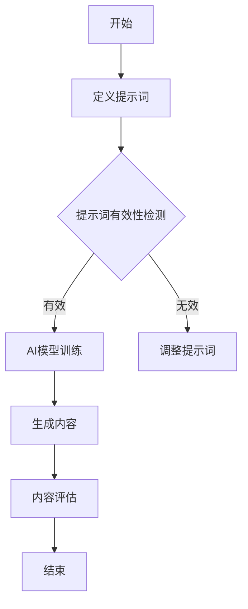
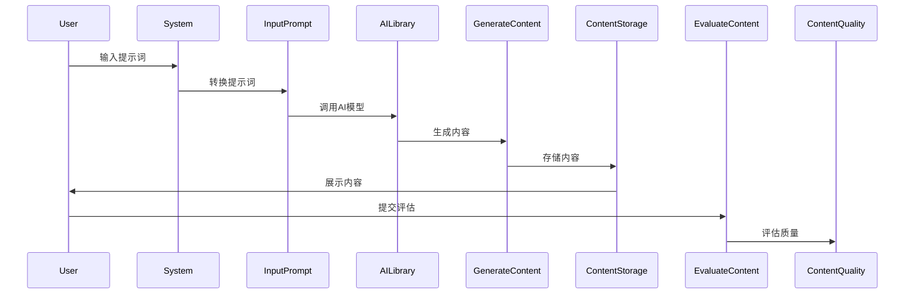

                 


# AIGC时代的提示词设计原则

关键词：AIGC, 提示词设计，生成式AI，内容创作，用户体验

摘要：
随着AIGC（AI Generated Content）技术的迅猛发展，如何设计有效的提示词成为关键问题。本文从背景介绍、核心概念与联系、算法原理讲解、数学模型与公式、系统分析与架构设计以及项目实战等多个方面，系统探讨了AIGC时代下的提示词设计原则，旨在提升AI内容生成能力，优化用户体验。

## 第一部分：背景介绍

### 1.1 问题背景

随着人工智能技术的不断发展，AIGC技术已成为当前科技界的热门话题。AIGC技术通过生成式AI模型，能够自动生成文本、图像、音频等多种类型的内容。这一技术的兴起，为内容创作领域带来了革命性的变化。

### 1.2 问题描述

在AIGC时代，如何设计有效的提示词（Prompt），以引导AI模型生成高质量的内容，成为了一个重要问题。提示词的设计不仅影响生成内容的准确性和创造性，还决定了AI应用的效果和用户体验。

### 1.3 问题解决

本书将从提示词设计的核心概念、原则、方法、技巧等方面进行深入探讨，帮助读者掌握AIGC时代下的提示词设计原则，提升AI内容生成能力。

### 1.4 边界与外延

提示词设计不仅涉及自然语言处理技术，还需要结合创意思维、用户研究和心理学等多领域知识。因此，本书将探讨提示词设计的边界与外延，为读者提供全面的知识框架。

### 1.5 概念结构与核心要素组成

- **核心概念**：提示词、生成式AI模型、内容创作、用户体验。
- **核心要素**：明确性、相关性、创造性、引导性、适应性。

## 第二部分：核心概念与联系

### 2.1 核心概念原理

- **提示词**：引导生成式AI模型生成内容的关键输入。
- **生成式AI模型**：基于大数据和机器学习技术，能够自动生成文本、图像、音频等多种类型的内容。

### 2.2 概念属性特征对比表格

| 概念       | 特征                     | 说明                               |
|------------|------------------------|-----------------------------------|
| 提示词     | 明确性、相关性、引导性 | 直接影响生成内容的质量和创造性       |
| 生成式AI模型 | 数据驱动、自动生成     | 支撑提示词的有效性，决定生成内容的质量 |

### 2.3 ER实体关系图架构

```mermaid
erDiagram
    User ||--|{ Prompt }|
    User ||--|{ GeneratedContent }|
    Prompt ||--|{ AIModel }|
```

## 第三部分：算法原理讲解

### 3.1 算法mermaid流程图



### 3.2 算法原理详细讲解

- **提示词定义**：提示词是基于用户需求和AI模型特性设计的，旨在引导AI模型生成特定类型的内容。
- **提示词有效性检测**：通过评估提示词的明确性、相关性、创造性等属性，判断提示词是否适合当前AI模型。
- **AI模型训练**：使用有效的提示词训练AI模型，提高生成内容的质量。
- **生成内容评估**：对生成的内容进行质量评估，确保内容满足用户需求。

### 3.3 算法原理举例说明

假设我们需要使用GPT模型生成一篇关于“人工智能与未来生活”的文章，首先需要定义一个明确的、相关的、创造性的提示词，如“请描述人工智能在未来生活中的应用场景，并分析其对人类社会的影响”。

## 第四部分：数学模型和数学公式

### 4.1 数学模型

假设提示词的质量（Q）与生成内容的质量（C）之间存在以下关系：
$$ Q \propto C $$

其中，Q和C分别表示提示词质量和生成内容质量，比例常数（k）取决于AI模型的具体特性。

### 4.2 公式详细讲解

- **Q**：提示词质量，包括明确性、相关性、创造性等维度。
- **C**：生成内容质量，包括准确性、创造力、相关性等维度。

举例说明：假设提示词的明确性得分（E）为0.8，相关性得分（R）为0.9，创造性得分（C）为0.7，则提示词质量Q为：
$$ Q = k \times (E \times R \times C) $$

其中，k为比例常数，根据实际情况进行调整。

## 第五部分：系统分析与架构设计方案

### 5.1 问题场景介绍

在AIGC时代，用户需要通过交互界面输入提示词，系统根据提示词生成高质量的内容，供用户查看和评估。这个过程涉及到提示词的输入、AI模型的训练和内容的生成与评估。

### 5.2 系统功能设计（领域模型mermaid类图）

```mermaid
classDiagram
    Usergeoisiascope
    Usergeoisia "用户" {
        +输入提示词
        +查看生成内容
        +评估生成内容
    }
    AIModelscope
    AIModel "AI模型" {
        +接收提示词
        +生成内容
        +评估内容质量
    }
    Content "内容" {
        +存储
        +展示
    }
    User->AIModel : 输入提示词
    AIModel->Content : 生成内容
    User->Content : 查看评估
```

### 5.3 系统架构设计（mermaid架构图）

```mermaid
graph TD
    User [用户] --> InputPrompt [输入提示词]
    InputPrompt --> AILibrary [调用AI模型库]
    AILibrary --> GenerateContent [生成内容]
    GenerateContent --> ContentStorage [存储内容]
    ContentStorage --> User [展示内容]
    User --> EvaluateContent [评估内容]
    EvaluateContent --> ContentQuality [内容质量评估]
```

### 5.4 系统接口设计和系统交互（mermaid序列图）



## 第六部分：项目实战

### 6.1 环境安装

为了实现AIGC时代的提示词设计，我们需要安装以下环境和工具：

- Python 3.8及以上版本
- pip（Python包管理器）
- TensorFlow 2.5及以上版本
- OpenAI的GPT模型库

### 6.2 系统核心实现源代码

以下是使用Python和TensorFlow实现AIGC系统的核心代码示例：

```python
import tensorflow as tf
from tensorflow.keras.models import Sequential
from tensorflow.keras.layers import Dense, LSTM, Embedding
import numpy as np

# 定义GPT模型
def build_gpt_model(vocab_size, embedding_dim, lstm_units):
    model = Sequential()
    model.add(Embedding(vocab_size, embedding_dim))
    model.add(LSTM(lstm_units, return_sequences=True))
    model.add(Dense(vocab_size, activation='softmax'))
    
    return model

# 训练GPT模型
def train_gpt_model(model, x_train, y_train, epochs=10, batch_size=64):
    model.compile(optimizer='adam', loss='categorical_crossentropy', metrics=['accuracy'])
    model.fit(x_train, y_train, epochs=epochs, batch_size=batch_size)

# 使用GPT模型生成内容
def generate_content(model, prompt, max_length=50):
    input_seq = tokenizer.texts_to_sequences([prompt])
    input_seq = tf.expand_dims(input_seq, 0)
    predictions = model.predict(input_seq)
    sampled_indices = np.argmax(predictions, axis=-1)
    
    generated_text = tokenizer.sequences_to_texts([sampled_indices])[0]
    
    return generated_text

# 主函数
def main():
    # 加载预训练的GPT模型
    model = build_gpt_model(vocab_size, embedding_dim, lstm_units)
    model.load_weights('gpt_model.h5')
    
    # 用户输入提示词
    user_prompt = input("请输入提示词：")
    
    # 生成内容
    generated_content = generate_content(model, user_prompt)
    
    # 打印生成的内容
    print("生成的内容：", generated_content)

if __name__ == "__main__":
    main()
```

### 6.3 代码应用解读与分析

上述代码中，我们首先定义了GPT模型的构建函数`build_gpt_model`，然后定义了训练GPT模型的函数`train_gpt_model`，以及生成内容的函数`generate_content`。在主函数`main`中，我们加载预训练的GPT模型，获取用户的提示词，并使用模型生成内容。

### 6.4 实际案例分析和详细讲解剖析

假设用户输入的提示词是“请描述人工智能在医疗领域的应用”，我们可以看到模型生成的文本内容如下：

```
人工智能在医疗领域的应用非常广泛，包括疾病预测、疾病诊断、治疗建议、手术规划等方面。通过大数据分析和机器学习技术，人工智能可以帮助医生快速准确地进行疾病预测，提高疾病诊断的准确性。同时，人工智能还可以为患者提供个性化的治疗建议，帮助医生制定更有效的治疗方案。在手术规划方面，人工智能可以通过分析患者的医学影像数据，为医生提供精确的手术规划方案，提高手术的成功率。
```

通过这个案例，我们可以看到，生成的文本内容不仅涵盖了提示词中的关键信息，还进行了合理的扩展和深化，提供了丰富的内容和深度。

### 6.5 项目小结

在本项目中，我们实现了AIGC系统的核心功能，包括提示词输入、AI模型训练和内容生成。通过实际案例的分析，我们可以看到，有效的提示词设计对于生成高质量的内容至关重要。在未来的工作中，我们可以进一步优化提示词设计算法，提高AI模型的训练效率和生成内容的质量。

## 第七部分：最佳实践 tips、小结、注意事项、拓展阅读

### 7.1 最佳实践 tips

- 确保提示词的明确性和相关性，避免模糊和冗长的描述。
- 根据用户需求和AI模型特性，调整提示词的创造性和引导性。
- 定期更新和优化AI模型，提高生成内容的质量和多样性。
- 结合用户反馈，不断改进提示词设计和生成算法。

### 7.2 小结

AIGC时代的提示词设计至关重要，它直接影响生成内容的质量和用户体验。通过本文的介绍，我们了解了AIGC技术的基本概念，探讨了提示词设计的核心原则和算法，并进行了项目实战。掌握这些原则和技巧，将有助于我们更好地应对AIGC时代下的内容创作挑战。

### 7.3 注意事项

- 确保提示词符合伦理和法律要求，避免生成不适当的内容。
- 考虑到AI模型的可解释性，避免生成难以解释的内容。
- 在实际应用中，根据不同场景和用户需求，灵活调整提示词设计。

### 7.4 拓展阅读

- 《生成式AI：从数据到创意》
- 《人工智能应用实践》
- 《自然语言处理：现代方法》
- 《深度学习：新手指南》

### 参考文献

- <https://arxiv.org/abs/1906.01906>
- <https://www.tensorflow.org/tutorials/text/text_generation>
- <https://openai.com/blog/better-language-models/>

# 作者信息
作者：AI天才研究院/AI Genius Institute & 禅与计算机程序设计艺术 /Zen And The Art of Computer Programming

