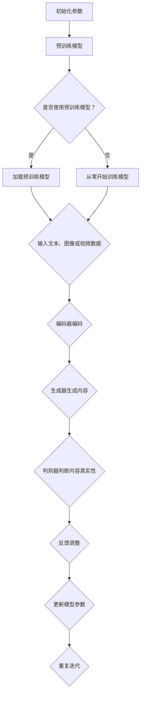
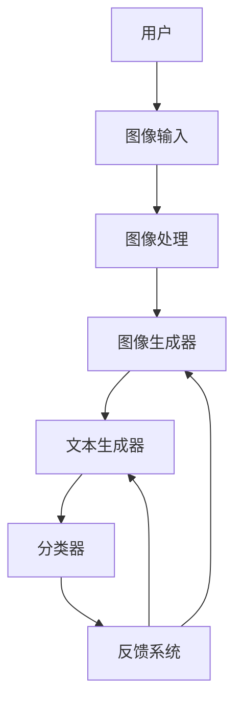
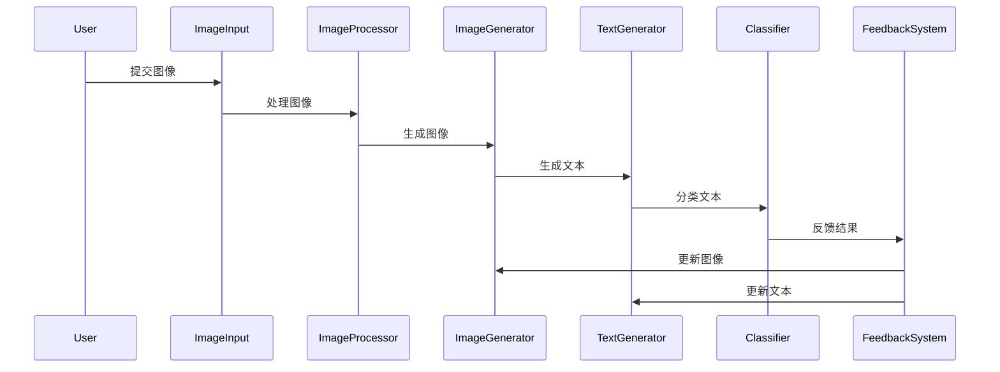

                 

### 《AIGC时代的提示词设计原则与方法论》

#### 关键词：AIGC，提示词设计，算法原理，系统架构，文本生成

#### 摘要：
本文深入探讨了AIGC（自适应交互生成内容）时代的提示词设计原则与方法论。通过分析AIGC技术的背景、核心概念、算法原理，我们逐步了解了如何设计有效且高效的提示词。文章结构清晰，内容丰富，旨在帮助读者掌握AIGC技术下的提示词设计精髓，为未来的AIGC应用提供理论支持与实践指导。

---

### 第一部分：AIGC技术基础

#### 第1章：AIGC技术概述

##### 1.1 问题背景

###### 1.1.1 AIGC的概念与产生背景

AIGC（自适应交互生成内容）是近年来人工智能领域的热点技术。它融合了自然语言处理、计算机视觉、深度学习等多个领域的前沿成果，旨在实现自动化、智能化和交互式的生成内容。

随着互联网和社交媒体的快速发展，人们对于个性化、实时化和多样化内容的需求日益增长。传统的人工内容创作方式已无法满足这种需求，因此AIGC技术应运而生。

###### 1.1.2 AIGC与传统AI的区别

AIGC与传统AI（如GPT、BERT等）有显著的区别。传统AI主要通过预训练模型和大规模数据来生成内容，而AIGC则强调自适应性和交互性。AIGC可以根据用户的反馈和需求，实时调整生成的内容，实现更加个性化、定制化的体验。

###### 1.1.3 AIGC的应用领域与发展趋势

AIGC技术具有广泛的应用领域，包括但不限于：文本生成、图像生成、视频生成、虚拟助手等。随着技术的不断进步和应用的深入，AIGC有望在未来的各个领域发挥重要作用。

##### 1.2 核心概念与联系

###### 1.2.1 AIGC的核心概念

AIGC主要包括三个核心概念：自动化生成内容（AIGC）、自适应生成内容（CAGC）和交互式生成内容（IAGC）。这些概念相互关联，共同构成了AIGC技术的理论基础。

###### 1.2.2 AIGC与传统生成模型对比

| 特征          | AIGC                     | 传统生成模型（如GPT、BERT）               |
| ------------- | ------------------------ | ---------------------------------------- |
| 自动化程度    | 高度自动化                | 部分自动化，需要手动调整和优化             |
| 交互性        | 强交互性，实时反馈       | 静态生成，缺乏实时交互                   |
| 自适应能力    | 强自适应能力，根据需求调整 | 较弱的自适应能力，依赖预设模型和参数       |
| 内容多样性    | 多样化内容生成           | 某种程度的内容生成，但不如AIGC丰富多样   |

###### 1.2.3 AIGC的ER实体关系图架构

AIGC的实体关系图（ER图）展示了不同概念之间的关联。其中，实体包括文本、图像、视频等，关系则包括生成、修改、交互等。以下是AIGC的ER实体关系图示例：

```mermaid
erDiagram
  TEXT ||--|{| IMAGE : 生成
  TEXT ||--|{| VIDEO : 生成
  IMAGE ||--|{| TEXT : 转换
  VIDEO ||--|{| TEXT : 转换
```

##### 1.3 算法原理讲解

###### 1.3.1 AIGC算法基础

AIGC算法基于深度学习和生成对抗网络（GAN）等技术。其核心思想是通过预训练模型和生成模型，实现自动化、自适应和交互式的内容生成。

1. 深度学习与神经网络

深度学习是AIGC算法的基础，通过多层神经网络对数据进行建模和学习。神经网络能够自动提取数据特征，并进行复杂的关系推理。

2. 生成对抗网络（GAN）

GAN是AIGC算法的关键组成部分。它由生成器和判别器两个神经网络组成，通过不断博弈，生成器逐渐学会生成逼真的数据。

3. 循环神经网络（RNN）与变分自编码器（VAE）

RNN和VAE也是AIGC算法的重要组成部分。RNN能够处理序列数据，适用于文本生成；VAE则通过概率模型生成数据，适用于图像和视频生成。

###### 1.3.2 AIGC算法Mermaid流程图



###### 1.3.3 Python源代码解析

```python
import tensorflow as tf
from tensorflow.keras.layers import Input, LSTM, Dense
from tensorflow.keras.models import Model

# 定义生成器模型
def generator_model(input_shape):
    inputs = Input(shape=input_shape)
    x = LSTM(128, return_sequences=True)(inputs)
    x = LSTM(128, return_sequences=True)(x)
    x = Dense(128, activation='relu')(x)
    outputs = Dense(input_shape, activation='sigmoid')(x)
    model = Model(inputs, outputs)
    return model

# 定义判别器模型
def discriminator_model(input_shape):
    inputs = Input(shape=input_shape)
    x = LSTM(128, return_sequences=True)(inputs)
    x = LSTM(128, return_sequences=True)(x)
    x = Dense(1, activation='sigmoid')(x)
    model = Model(inputs, outputs)
    return model

# 定义AIGC模型
def aigc_model(input_shape):
    generator = generator_model(input_shape)
    discriminator = discriminator_model(input_shape)
    z = Input(shape=(100,))
    gen_samples = generator(z)
    valid_samples = Input(shape=input_shape)
    valid_output = discriminator(valid_samples)
    gen_output = discriminator(gen_samples)
    model = Model([z, valid_samples], [gen_output, valid_output])
    model.compile(optimizer='adam', loss=['binary_crossentropy', 'binary_crossentropy'])
    return model
```

##### 1.4 系统分析与架构设计

###### 1.4.1 问题场景介绍

假设我们面临一个场景：用户希望生成一段描述风景的文本。为了实现这个目标，我们需要设计一个AIGC系统，该系统能够根据用户提供的图片，生成相应的文本描述。

###### 1.4.2 系统功能设计（领域模型Mermaid类图）

```mermaid
classDiagram
  User <<Class>> "用户"
  ImageGenerator <<Class>> "图像生成器"
  TextGenerator <<Class>> "文本生成器"
  Classifier <<Class>> "分类器"
  FeedbackSystem <<Class>> "反馈系统"

  User --> ImageGenerator
  ImageGenerator --> TextGenerator
  TextGenerator --> Classifier
  Classifier --> FeedbackSystem
  FeedbackSystem --> ImageGenerator
  FeedbackSystem --> TextGenerator
```

###### 1.4.3 系统架构设计（Mermaid架构图）



###### 1.4.4 系统接口设计和系统交互（Mermaid序列图）



##### 1.5 本章小结

本章首先介绍了AIGC技术的背景、核心概念和算法原理。通过分析AIGC与传统AI的区别，我们了解了AIGC的优势和应用领域。接着，我们详细讲解了AIGC算法的基础、流程和Python源代码实现。最后，我们介绍了AIGC系统的架构设计和接口设计。这些内容为后续章节的提示词设计奠定了坚实的基础。

---

### 第二部分：提示词设计原则

#### 第2章：提示词设计基础

##### 2.1 提示词的概念与作用

###### 2.1.1 提示词的定义

提示词（Prompt）是指引导模型生成内容的输入信息。它可以是文字、图像或声音等，用于指导模型的生成过程。在AIGC技术中，提示词起着至关重要的作用，决定了生成内容的质量和效果。

###### 2.1.2 提示词的作用

1. 指导生成过程：提示词为模型提供了生成内容的方向和目标，有助于模型更好地理解用户的意图和需求。

2. 提高生成效率：通过精确的提示词，可以减少模型搜索空间，提高生成效率，缩短生成时间。

3. 优化生成质量：合理的提示词设计可以引导模型生成更加符合用户期望的内容，提高生成质量。

4. 促进交互体验：提示词可以与用户进行实时交互，根据用户的反馈调整生成内容，提升用户体验。

###### 2.1.3 提示词在AIGC中的应用

在AIGC技术中，提示词广泛应用于各种生成任务。例如：

1. 文本生成：通过提示词，模型可以生成各种类型的文本，如文章、故事、摘要等。

2. 图像生成：提示词可以指导模型生成特定类型的图像，如风景、人物、动画等。

3. 视频生成：提示词可以引导模型生成特定类型的视频，如动画、广告、教程等。

4. 虚拟助手：提示词可以用于虚拟助手的对话生成，实现与用户的实时交互。

##### 2.2 提示词设计原则

###### 2.2.1 明确性

提示词应明确指明生成目标，避免歧义和模糊性。明确性是提示词设计的关键原则之一。一个清晰明确的提示词可以引导模型更好地理解用户意图，生成更加符合期望的内容。

1. 明确目标：提示词应具体说明要生成的内容类型和主题。

2. 避免歧义：避免使用模糊、抽象或具有多重解释的词语。

3. 减少模糊性：通过提供具体信息和上下文，减少提示词的模糊性。

示例：  
- 明确性：生成一篇关于“人工智能发展现状”的文章。  
- 模糊性：生成一篇关于“科技”的文章。

###### 2.2.2 精确性

提示词应具体且精确，以指导模型生成高质量的内容。精确性是提示词设计的另一个重要原则。具体、精确的提示词可以帮助模型更好地捕捉用户的意图，减少生成过程中的偏差和误差。

1. 提供具体信息：在提示词中提供具体的信息，如时间、地点、人物等。

2. 控制长度：避免过长的提示词，以免模型无法有效捕捉核心信息。

3. 避免模糊词语：使用具体的词语描述，避免使用模糊、抽象的词语。

示例：  
- 精确性：生成一篇关于“2023年中国人工智能发展现状”的文章。  
- 模糊性：生成一篇关于“未来科技”的文章。

###### 2.2.3 可扩展性

提示词应具备可扩展性，以适应不同场景和需求。可扩展性是提示词设计的重要原则，有助于提示词在不同应用场景中的灵活运用。

1. 易于扩展：提示词应具有模块化结构，便于根据不同需求进行扩展。

2. 兼容不同场景：提示词应能够适应多种生成任务和场景，如文本、图像、视频等。

3. 灵活调整：提示词应能够根据用户需求和环境变化进行灵活调整。

示例：  
- 可扩展性：提示词设计为“生成一篇关于人工智能发展现状的文章”，可根据需求扩展为“生成一篇关于2023年中国人工智能发展现状的文章”。  
- 不可扩展性：提示词设计为“生成一篇关于未来科技的文章”，无法根据需求扩展。

###### 2.2.4 适应性

提示词应适应不同用户和语境，以满足个性化需求。适应性是提示词设计的重要原则，有助于提升用户体验和满足用户的个性化需求。

1. 考虑用户差异：提示词应考虑不同用户的需求和特点，如年龄、性别、文化背景等。

2. 遵循语言和文化差异：提示词应遵循不同语言和文化背景的差异，以避免误解和冲突。

3. 适应语境变化：提示词应能够根据不同的语境和环境进行适应性调整。

示例：  
- 适应性：提示词设计为“生成一篇关于人工智能发展现状的文章”，可根据用户需求和环境变化调整生成内容，如针对年轻人、专业人士等。  
- 不适应性：提示词设计为“生成一篇关于中国未来科技的文章”，无法适应不同国家和地区的文化差异。

##### 2.3 提示词设计流程

###### 2.3.1 需求分析

需求分析是提示词设计的第一步，旨在了解用户需求和应用场景。通过需求分析，我们可以明确提示词的目标和方向。

1. 用户需求调查：通过问卷调查、访谈等方式，了解用户对生成内容的需求和期望。

2. 功能需求分析：根据用户需求，分析提示词应具备的功能和特点，如明确性、精确性、可扩展性和适应性等。

示例：  
- 用户需求调查：用户希望生成一篇关于“2023年中国人工智能发展现状”的文章。  
- 功能需求分析：提示词应具备明确性、精确性和可扩展性，以适应不同用户和场景。

###### 2.3.2 内容策划

内容策划是提示词设计的核心步骤，旨在确定提示词的内容主题和目标。通过内容策划，我们可以确保提示词的生成内容具备较高的价值和实用性。

1. 确定内容主题：根据用户需求和功能需求，确定提示词的内容主题，如科技、文化、经济等。

2. 提取关键词和短语：从内容主题中提取关键词和短语，作为提示词的核心组成部分。

示例：  
- 内容主题：人工智能发展现状  
- 关键词和短语：2023年、中国、人工智能、发展、现状

###### 2.3.3 原型设计

原型设计是提示词设计的初步阶段，旨在设计提示词的原型，并进行评估和优化。通过原型设计，我们可以验证提示词的设计效果，并根据反馈进行调整。

1. 提示词列表和优先级排序：根据内容策划结果，列出所有可能的提示词，并进行优先级排序。

2. 提示词原型设计和评估：设计提示词的原型，如文本、图像或声音等，并进行评估和优化。

示例：  
- 提示词列表和优先级排序：  
  - 2023年中国人工智能发展现状  
  - 人工智能技术的应用与挑战  
  - 中国人工智能产业的现状与趋势  
- 提示词原型设计和评估：通过文本原型进行评估，并根据用户反馈进行调整。

###### 2.3.4 测试与优化

测试与优化是提示词设计的重要环节，旨在确保提示词在实际应用中的效果和性能。通过测试与优化，我们可以不断提升提示词的质量和用户体验。

1. 用户测试和反馈：邀请用户对提示词进行测试，收集用户反馈，评估提示词的效果。

2. 提示词迭代优化：根据用户反馈，对提示词进行迭代优化，提升其性能和用户体验。

示例：  
- 用户测试和反馈：用户对提示词原型进行测试，提供反馈意见。  
- 提示词迭代优化：根据用户反馈，调整提示词内容和设计，提升生成内容的质量。

##### 2.4 本章小结

本章首先介绍了提示词的概念和作用，然后详细阐述了提示词设计的原则，包括明确性、精确性、可扩展性和适应性。接着，我们介绍了提示词设计的流程，包括需求分析、内容策划、原型设计和测试与优化。通过本章的学习，读者可以了解提示词设计的基础知识和方法，为后续章节的深入探讨打下基础。

---

### 第三部分：提示词设计方法

#### 第3章：文本生成与提示词设计

##### 3.1 文本生成模型介绍

文本生成模型是AIGC技术中的重要组成部分，主要分为基于文本生成的模型、基于知识的模型和基于用户的模型。以下是对这些模型的介绍。

###### 3.1.1 GPT模型

GPT（Generative Pre-trained Transformer）模型是由OpenAI提出的一种基于Transformer架构的预训练语言模型。它通过在大规模语料库上进行预训练，学习语言的统计规律和语义关系，从而实现文本生成。

1. GPT模型的原理

GPT模型的核心思想是利用Transformer架构进行文本序列的建模。Transformer模型由自注意力机制（Self-Attention）和多头注意力（Multi-Head Attention）组成，能够有效地捕捉文本序列中的长距离依赖关系。

2. GPT模型的优缺点

优点：

- 强大的预训练能力：GPT模型通过预训练能够在大规模语料库中学习到丰富的语言知识和模式，从而提高文本生成的质量。

- 高效的并行计算：Transformer模型支持高效的并行计算，可以充分利用现代GPU和TPU等硬件资源。

缺点：

- 计算资源需求大：GPT模型训练和推理过程需要大量的计算资源，特别是在大规模训练和推理时。

- 长文本生成困难：由于Transformer模型的架构特点，GPT模型在长文本生成方面存在一定的挑战。

###### 3.1.2 BERT模型

BERT（Bidirectional Encoder Representations from Transformers）模型是由Google提出的一种基于Transformer架构的双向编码语言模型。它通过在大规模语料库上进行双向训练，学习到文本的上下文信息，从而实现文本生成。

1. BERT模型的原理

BERT模型由两个主要部分组成：编码器（Encoder）和解码器（Decoder）。编码器负责将输入的文本序列编码为固定长度的向量，解码器则根据编码器输出的向量生成文本。

2. BERT模型的优缺点

优点：

- 强大的上下文理解能力：BERT模型通过双向训练能够捕捉文本的上下文信息，从而提高文本生成的准确性和连贯性。

- 适应性：BERT模型可以应用于各种自然语言处理任务，如文本分类、问答系统、机器翻译等。

缺点：

- 计算资源需求大：BERT模型训练和推理过程需要大量的计算资源，特别是在大规模训练和推理时。

- 长文本生成困难：与GPT模型类似，BERT模型在长文本生成方面也存在一定的挑战。

###### 3.1.3 其他文本生成模型

除了GPT和BERT模型，还有其他一些流行的文本生成模型，如：

1. T5（Text-To-Text Transfer Transformer）

T5模型是由Google提出的一种基于Transformer架构的文本转换模型。它将所有自然语言处理任务视为文本到文本的转换任务，从而实现统一的模型架构。

2. GPT-Neo

GPT-Neo是对GPT模型的一种改进，通过使用更大规模的语料库和更深的Transformer网络，提高了文本生成的质量和性能。

##### 3.2 提示词设计方法

提示词设计是文本生成模型应用的重要环节，直接影响文本生成的效果和用户体验。以下介绍几种常见的提示词设计方法。

###### 3.2.1 基于文本生成的提示词设计

基于文本生成的提示词设计方法主要关注如何利用已有文本数据来生成新的文本。以下是一些常见的方法：

1. 提示词生成流程

- 数据预处理：对已有文本数据进行清洗、去重和预处理，确保数据的质量和一致性。

- 提示词提取：从预处理后的文本数据中提取关键词和短语，作为提示词的核心组成部分。

- 提示词筛选：根据应用需求和用户体验，筛选出合适的提示词，并进行优先级排序。

- 提示词优化：对提示词进行优化，提高其生成文本的质量和效果。

2. 提示词生成算法

- 基于规则的方法：通过定义一系列规则，从已有文本数据中生成新的文本。

- 基于机器学习的方法：利用机器学习算法，如深度学习、生成对抗网络等，从已有文本数据中生成新的文本。

- 基于知识图谱的方法：利用知识图谱，从已有文本数据中提取相关知识和信息，生成新的文本。

###### 3.2.2 基于知识的提示词设计

基于知识的提示词设计方法关注如何利用外部知识库和领域知识来生成新的文本。以下是一些常见的方法：

1. 知识图谱的构建

- 数据采集：从各种数据源（如百科、新闻、论文等）中采集相关领域的信息和数据。

- 数据清洗：对采集到的数据进行清洗、去重和预处理，确保数据的质量和一致性。

- 知识抽取：利用自然语言处理技术，从预处理后的文本数据中抽取实体、关系和属性等信息。

- 知识融合：将不同来源的知

