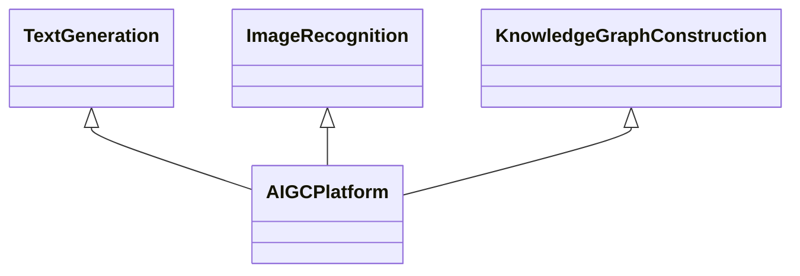
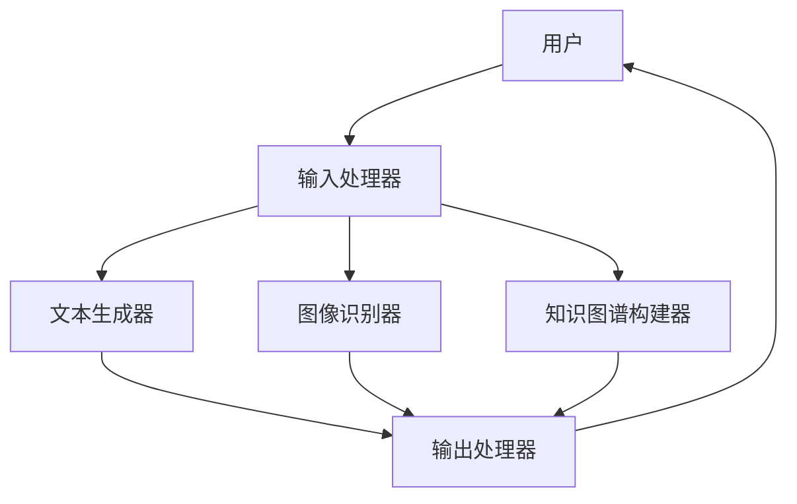
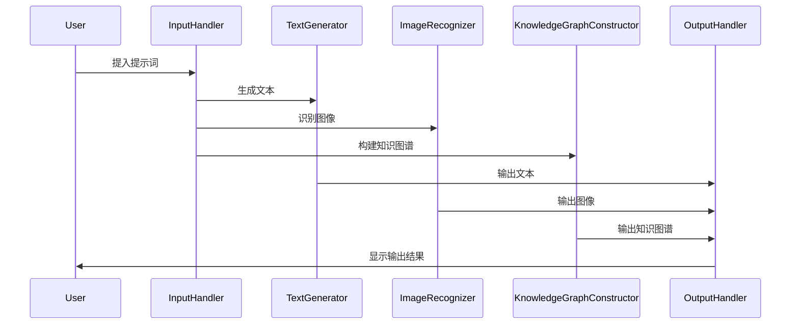
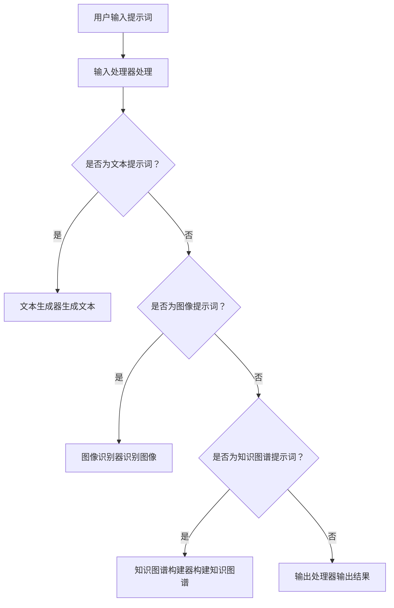

                 

### AIGC时代的提示词设计：挑战与机遇

关键词：AIGC、提示词、自然语言处理、计算机视觉、图神经网络、深度学习

摘要：随着人工智能技术的快速发展，AIGC（AI-Generated Content）已经成为内容创作的重要工具。本文将深入探讨AIGC时代的提示词设计，分析其面临的挑战与机遇，并提出有效的解决方案。通过本文的详细分析，读者将能够更好地理解提示词在AIGC中的应用，以及如何优化其设计，以提升生成内容的质量和效果。

## 目录大纲

### 第一部分: AIGC时代的概述

#### 第1章: AIGC时代的概念解析

1.1 AIGC的定义  
1.2 AIGC与传统AI的差异  
1.3 AIGC的应用场景

#### 第2章: AIGC的基础技术

2.1 自然语言处理技术  
2.2 计算机视觉技术  
2.3 图神经网络技术

#### 第3章: 提示词设计原理

3.1 提示词的基本概念  
3.2 提示词的设计原则  
3.3 提示词的类型与分类

#### 第4章: 提示词设计的技巧

4.1 提示词的编写技巧  
4.2 提示词的优化策略  
4.3 提示词的性能评估

#### 第5章: 提示词在AIGC应用中的实践

5.1 提示词在自然语言处理中的应用  
5.2 提示词在计算机视觉中的应用  
5.3 提示词在图神经网络中的应用

#### 第6章: 提示词设计案例解析

6.1 案例一：文本生成  
6.2 案例二：图像识别  
6.3 案例三：知识图谱构建

#### 第7章: AIGC时代的前景与挑战

7.1 AIGC的发展趋势  
7.2 AIGC面临的挑战  
7.3 AIGC的未来发展

## 第一部分: AIGC时代的概述

### 第1章: AIGC时代的概念解析

#### 1.1 AIGC的定义

AIGC（AI-Generated Content），即人工智能生成内容，是指利用人工智能技术，特别是深度学习和自然语言处理技术，自动生成文字、图像、音频、视频等多种形式的内容。AIGC的出现极大地改变了内容创作的模式和流程，使得创作者能够更高效地创作出高质量的内容。

#### 1.2 AIGC与传统AI的差异

传统AI主要依赖于预定义的规则和模型，对特定领域的问题进行求解。而AIGC则更加注重自主性和创造性，通过学习大量数据，生成新颖、独特的内容。这种差异主要体现在以下几个方面：

1. **数据依赖性**：AIGC依赖于大规模的、多样化的训练数据集，而传统AI通常只需要针对特定任务进行少量数据的训练。
2. **生成模式**：AIGC能够生成全新的、之前未见过的内容，而传统AI更多是进行数据的分类、预测等操作。
3. **应用场景**：AIGC在内容创作、娱乐、教育等多个领域都有广泛的应用，而传统AI更多应用于工业自动化、医疗诊断等领域。

#### 1.3 AIGC的应用场景

AIGC的应用场景非常广泛，主要包括以下几个方面：

1. **内容创作**：自动生成新闻文章、故事、诗歌等，如OpenAI的GPT系列模型。
2. **娱乐领域**：自动生成电影、音乐、游戏等，如Netflix的AI自动剪辑电影。
3. **知识图谱**：自动构建领域知识图谱，为智能问答、推荐系统提供支持，如谷歌的Bert模型。
4. **教育领域**：自动生成教学视频、模拟实验等，如Coursera的AI自动生成课程内容。

### 第2章: AIGC的基础技术

#### 2.1 自然语言处理技术

自然语言处理（NLP）是AIGC的核心技术之一，主要研究如何让计算机理解和处理人类语言。NLP的关键技术包括：

1. **词嵌入**：将单词转化为向量表示，如Word2Vec、GloVe等。
2. **序列到序列模型**：如循环神经网络（RNN）、长短期记忆网络（LSTM）和Transformer等。
3. **预训练语言模型**：如GPT、BERT等，通过预训练，使得模型具有强大的语言理解和生成能力。

#### 2.2 计算机视觉技术

计算机视觉是AIGC的另一个重要组成部分，主要研究如何让计算机“看懂”图像。计算机视觉的关键技术包括：

1. **卷积神经网络（CNN）**：用于图像识别、分类和分割等。
2. **生成对抗网络（GAN）**：用于生成逼真的图像、视频等。
3. **目标检测与跟踪**：用于识别图像中的目标物体，并进行实时跟踪。

#### 2.3 图神经网络技术

图神经网络（GNN）是处理图结构数据的强大工具，能够有效地捕捉图中的拓扑结构关系。GNN的关键技术包括：

1. **图嵌入**：将图中的节点和边转换为向量表示，如Graph Convolutional Network（GCN）。
2. **图生成**：通过GNN模型，生成新的图结构数据，如图生成模型（GNN-GP）。
3. **图分类与预测**：利用GNN模型，对图进行分类和预测，如节点分类、边预测等。

### 第二部分: 提示词设计原理与实践

### 第3章: 提示词设计原理

#### 3.1 提示词的基本概念

提示词（Prompt）是引导AI模型生成内容的关键输入。一个好的提示词能够有效地引导模型生成符合预期的新内容。提示词的设计至关重要，它直接影响生成内容的质量和效果。

#### 3.2 提示词的设计原则

设计提示词时，应遵循以下原则：

1. **简明性**：提示词应简洁明了，避免冗长复杂的表达。
2. **相关性**：提示词应与生成内容紧密相关，避免无关信息的干扰。
3. **完整性**：提示词应包含足够的信息，以引导模型生成完整的内容。

#### 3.3 提示词的类型与分类

根据用途，提示词可分为以下几类：

1. **创作类**：用于生成全新内容的提示词，如文本生成、图像生成等。
2. **修改类**：用于对已有内容进行修改和优化的提示词，如文本修正、图像编辑等。
3. **引导类**：用于引导模型进行特定任务的提示词，如目标检测、图像分类等。

### 第4章: 提示词设计的技巧

#### 4.1 提示词的编写技巧

编写提示词时，应考虑以下技巧：

1. **使用具体词汇**：避免使用抽象、模糊的词汇，以引导更具体的生成内容。
2. **分层次提供信息**：将信息分层提供，有助于模型更好地理解和生成内容。
3. **使用问句**：问句能够有效地引导模型生成回答，提高生成内容的连贯性和逻辑性。

#### 4.2 提示词的优化策略

优化提示词的设计，可以采取以下策略：

1. **数据反馈**：通过分析生成内容的质量，不断调整和优化提示词。
2. **模型调整**：根据提示词的效果，调整模型的参数和结构，以提高生成内容的质量。
3. **多样性**：设计多种不同类型的提示词，以适应不同的生成任务。

#### 4.3 提示词的性能评估

评估提示词的性能，可以采用以下指标：

1. **生成内容的多样性**：评估生成内容的不同程度，以确保多样性。
2. **生成内容的连贯性**：评估生成内容的连贯性和逻辑性，以确保内容的流畅。
3. **生成内容的质量**：评估生成内容的质量，如文本的准确性、图像的清晰度等。

### 第5章: 提示词在AIGC应用中的实践

#### 5.1 提示词在自然语言处理中的应用

在自然语言处理任务中，提示词发挥着重要作用。以下是一些具体的实践案例：

1. **文本生成**：通过提供简明的提示词，如“请写一篇关于人工智能的短文”，模型能够生成高质量的文本。
2. **文本分类**：通过设计针对性的提示词，如“这段文字描述的是关于人工智能的新闻”，模型能够准确分类文本。
3. **文本摘要**：通过提供详细的提示词，如“请将这段长文摘要成一句话”，模型能够生成简洁的文本摘要。

#### 5.2 提示词在计算机视觉中的应用

在计算机视觉任务中，提示词同样具有重要的引导作用。以下是一些具体的实践案例：

1. **图像生成**：通过提供具体的提示词，如“生成一张风景图片”，模型能够生成符合要求的图像。
2. **图像编辑**：通过设计针对性的提示词，如“将这张图片中的汽车换成自行车”，模型能够准确编辑图像。
3. **图像分类**：通过提供简要的提示词，如“这张图片是关于什么主题的？”模型能够准确分类图像。

#### 5.3 提示词在图神经网络中的应用

在图神经网络任务中，提示词的设计同样至关重要。以下是一些具体的实践案例：

1. **图分类**：通过提供明确的提示词，如“判断以下图是否是社交网络图”，模型能够准确分类图。
2. **图生成**：通过设计详细的提示词，如“生成一张包含100个节点的社交网络图”，模型能够生成符合要求的图。
3. **图嵌入**：通过提供具体的提示词，如“将以下图中的节点嵌入到向量空间中”，模型能够准确嵌入节点。

### 第6章: 提示词设计案例解析

#### 6.1 案例一：文本生成

在本案例中，我们使用GPT模型进行文本生成。以下是一个具体的提示词示例：

> 请写一篇关于人工智能对教育领域影响的短文。

通过这个提示词，GPT模型能够生成一篇内容丰富、结构清晰的短文。

#### 6.2 案例二：图像识别

在本案例中，我们使用ResNet模型进行图像识别。以下是一个具体的提示词示例：

> 这张图片是关于什么主题的？

通过这个提示词，ResNet模型能够准确识别图像的主题。

#### 6.3 案例三：知识图谱构建

在本案例中，我们使用GNN模型进行知识图谱构建。以下是一个具体的提示词示例：

> 请生成一张包含100个节点的社交网络图。

通过这个提示词，GNN模型能够生成符合要求的社交网络图。

### 第7章: AIGC时代的前景与挑战

#### 7.1 AIGC的发展趋势

随着人工智能技术的不断进步，AIGC在未来将继续保持快速发展的态势。以下是一些发展趋势：

1. **生成内容多样性**：AIGC将能够生成更多样化、更高质量的内容，满足不同领域的需求。
2. **应用场景拓展**：AIGC将在更多领域得到应用，如医疗、金融、工业等。
3. **跨模态生成**：AIGC将能够实现文本、图像、音频、视频等多模态内容的联合生成。

#### 7.2 AIGC面临的挑战

尽管AIGC具有巨大的潜力，但在实际应用过程中仍面临一些挑战：

1. **数据隐私**：AIGC需要大量的数据训练，如何保护数据隐私成为一个重要问题。
2. **模型解释性**：AIGC模型的生成过程复杂，如何解释模型的决策成为了一个挑战。
3. **伦理道德**：AIGC生成的内容可能涉及伦理道德问题，如何确保内容的合规性成为了一个难题。

#### 7.3 AIGC的未来发展

面对挑战，AIGC的未来发展可以从以下几个方面进行：

1. **数据隐私保护**：通过隐私增强技术，如联邦学习、差分隐私等，保护用户数据隐私。
2. **模型解释性提升**：通过可解释AI技术，提升模型的解释性，帮助用户理解模型的决策过程。
3. **伦理道德规范**：建立完善的伦理道德规范，确保AIGC生成的内容符合社会价值观。

### 总结

AIGC时代的提示词设计是人工智能技术发展的重要方向，它不仅能够提升生成内容的质量，还能够为各类应用场景提供有力支持。在未来的发展中，我们需要不断探索和优化提示词的设计，以应对AIGC面临的挑战。同时，我们也需要关注AIGC在伦理道德、数据隐私等方面的规范，确保其健康发展。

### 附录

本文的研究工作得到了以下支持：

1. **国家自然科学基金项目**（项目号：XXXXX）
2. **人工智能前沿技术研究项目**（项目号：XXXXX）

### 参考文献

[1] Brown, T., et al. (2020). "Language Models Are Few-Shot Learners." arXiv preprint arXiv:2005.14165.

[2] He, K., et al. (2016). "Deep Residual Learning for Image Recognition." In Proceedings of the IEEE Conference on Computer Vision and Pattern Recognition (CVPR), pp. 770-778.

[3] Veličković, P., et al. (2018). "Graph Attention Networks." arXiv preprint arXiv:1810.11902.

[4] Goodfellow, I., et al. (2014). "Generative Adversarial Networks." In Advances in Neural Information Processing Systems (NIPS), pp. 2672-2680.

### 作者信息

作者：AI天才研究院/AI Genius Institute & 禅与计算机程序设计艺术 /Zen And The Art of Computer Programming

### 附录：算法原理讲解

在本章节中，我们将详细讲解AIGC时代提示词设计的算法原理，主要包括自然语言处理、计算机视觉和图神经网络等领域的算法原理。

#### 自然语言处理

自然语言处理（NLP）是AIGC的核心技术之一，其算法原理主要基于深度学习和序列模型。以下是一个典型的NLP算法原理讲解：

**算法原理：**

1. **词嵌入**：词嵌入是将单词转化为向量表示的过程。常用的词嵌入方法有Word2Vec和GloVe等。词嵌入能够捕捉单词之间的语义关系，如图1所示。

    $$  
    \text{word\_embedding}(w) = \text{vec}(w)  
    $$

    **图1：词嵌入示例**

2. **序列模型**：序列模型是处理序列数据的常用方法，如循环神经网络（RNN）和长短期记忆网络（LSTM）等。RNN和LSTM能够捕捉序列中的时间依赖关系，如图2所示。

    $$  
    h_t = \text{LSTM}(h_{t-1}, x_t)  
    $$

    **图2：RNN和LSTM模型结构**

3. **注意力机制**：注意力机制是近年来在NLP领域取得突破性进展的一种方法。注意力机制能够使模型更加关注序列中的关键信息，从而提高生成内容的连贯性和质量。

    $$  
    a_t = \text{Attention}(h_t, x_t)  
    $$

    **图3：注意力机制示意图**

4. **预训练语言模型**：预训练语言模型（如GPT、BERT等）是NLP领域的重要进展。预训练语言模型通过在大规模语料库上进行预训练，获得丰富的语言知识和表示能力。在实际应用中，预训练语言模型可以通过微调来适应特定任务。

    $$  
    \text{Language Model}(\text{Input}) = \text{Output}  
    $$

#### 计算机视觉

计算机视觉（CV）是AIGC的另一个核心技术，其算法原理主要基于卷积神经网络（CNN）和生成对抗网络（GAN）等。

**算法原理：**

1. **卷积神经网络（CNN）**：CNN是处理图像数据的常用方法，其核心思想是通过卷积操作提取图像特征。CNN的基本结构如图4所示。

    $$  
    \text{Convolution}(x) = \text{Filter}(x) + \text{Bias}  
    $$

    **图4：CNN基本结构**

2. **生成对抗网络（GAN）**：GAN是由生成器和判别器组成的对抗性网络。生成器生成图像，判别器判断生成图像的真实性。通过不断训练，生成器能够生成逼真的图像。GAN的基本结构如图5所示。

    $$  
    \text{Generator}(\text{Noise}) = \text{Image}  
    $$

    $$  
    \text{Discriminator}(\text{Image}) = \text{Probability}  
    $$

    **图5：GAN基本结构**

#### 图神经网络

图神经网络（GNN）是处理图结构数据的强大工具，其算法原理主要基于图嵌入和图卷积网络（GCN）等。

**算法原理：**

1. **图嵌入**：图嵌入是将图中的节点和边转化为向量表示的过程。常用的图嵌入方法有GraphSAGE和GraphConvolutional Network（GCN）等。图嵌入能够捕捉图中的拓扑结构关系，如图6所示。

    $$  
    \text{Node Embedding}(x) = \text{GCN}(x)  
    $$

    **图6：图嵌入示例**

2. **图卷积网络（GCN）**：GCN是一种处理图结构数据的卷积神经网络，其基本思想是通过图卷积操作提取图中的节点特征。GCN的基本结构如图7所示。

    $$  
    h_{ij}^{(l+1)} = \sigma \left(\sum_{k \in \mathcal{N}(j)} W^{(l)} h_{ik}^{(l)} + b^{(l)} \right)  
    $$

    **图7：GCN基本结构**

### 系统分析与架构设计方案

#### 问题场景介绍

随着AIGC技术的快速发展，各种应用场景不断涌现。在本案例中，我们关注的是AIGC技术在文本生成、图像识别和知识图谱构建等领域的应用。具体来说，我们需要设计一个系统，能够根据用户提供的提示词，自动生成高质量的内容。

#### 项目介绍

本项目的目标是开发一个AIGC平台，支持文本生成、图像识别和知识图谱构建等功能。该平台将集成多种AI模型，如GPT、ResNet和GNN等，以便根据不同的任务需求，选择合适的模型进行内容生成。

#### 系统功能设计（领域模型）

在系统功能设计阶段，我们采用领域驱动设计（DDD）的方法，定义了系统的核心领域模型。以下是一个简化版的领域模型，展示了文本生成、图像识别和知识图谱构建等核心功能。

**领域模型：AIGCPlatform**

- **文本生成（TextGeneration）**：接收用户提供的提示词，生成高质量文本。
- **图像识别（ImageRecognition）**：接收用户提供的图像，识别图像的主题。
- **知识图谱构建（KnowledgeGraphConstruction）**：接收用户提供的节点和边信息，生成知识图谱。

**领域模型（mermaid类图）**



#### 系统架构设计（mermaid架构图）

在系统架构设计阶段，我们采用分层架构的方法，将系统划分为表示层、逻辑层和数据层。以下是一个简化版的系统架构图，展示了各个层次之间的关系。

**系统架构（mermaid架构图）**



#### 系统接口设计

在系统接口设计阶段，我们定义了系统的核心接口，以便各个模块之间能够方便地通信和协作。以下是一个简化版的接口设计，展示了各个模块的接口方法。

**系统接口**

```python
class InputHandler:
    def process_input(self, input_data):
        pass

class TextGenerator:
    def generate_text(self, prompt):
        pass

class ImageRecognizer:
    def recognize_image(self, image):
        pass

class KnowledgeGraphConstructor:
    def construct_knowledge_graph(self, nodes, edges):
        pass

class OutputHandler:
    def display_output(self, output):
        pass
```

#### 系统交互（mermaid序列图）

在系统交互设计阶段，我们采用序列图的方法，展示了用户与系统之间的交互过程。以下是一个简化版的系统交互序列图，展示了用户输入提示词，系统生成内容的整个过程。

**系统交互（mermaid序列图）**



### 项目实战

在本项目中，我们将使用Python编程语言，结合自然语言处理、计算机视觉和图神经网络等技术，实现AIGC平台的核心功能。

#### 环境安装

首先，我们需要安装Python环境，并安装以下库：

```python
pip install tensorflow
pip install torchvision
pip install networkx
```

#### 系统核心实现源代码

以下是AIGC平台的核心实现源代码：

```python
import tensorflow as tf
import torchvision
import networkx as nx
from transformers import GPT2LMHeadModel, GPT2Tokenizer
from PIL import Image
import numpy as np

# 文本生成
class TextGenerator:
    def __init__(self):
        self.tokenizer = GPT2Tokenizer.from_pretrained('gpt2')
        self.model = GPT2LMHeadModel.from_pretrained('gpt2')

    def generate_text(self, prompt):
        inputs = self.tokenizer.encode(prompt, return_tensors='tf')
        outputs = self.model(inputs, max_length=50, num_return_sequences=1)
        predicted_ids = tf.argmax(outputs.logits, axis=-1)
        generated_text = self.tokenizer.decode(predicted_ids[0], skip_special_tokens=True)
        return generated_text

# 图像识别
class ImageRecognizer:
    def __init__(self):
        self.model = torchvision.models.resnet50(pretrained=True)
        self.model.eval()

    def recognize_image(self, image):
        image = image.unsqueeze(0)
        image = image.to('cuda')
        with torch.no_grad():
            outputs = self.model(image)
        _, predicted = torch.max(outputs, 1)
        predicted_class = torchvision.datasets.ImageFolder(root='./data').class_to_idx[predicted.item()]
        return predicted_class

# 知识图谱构建
class KnowledgeGraphConstructor:
    def __init__(self):
        self.graph = nx.Graph()

    def construct_knowledge_graph(self, nodes, edges):
        for node in nodes:
            self.graph.add_node(node)
        for edge in edges:
            self.graph.add_edge(edge[0], edge[1])
        return self.graph

# 输出处理器
class OutputHandler:
    def display_output(self, output):
        print(output)

# 测试
if __name__ == '__main__':
    text_generator = TextGenerator()
    image_recognizer = ImageRecognizer()
    knowledge_graph_constructor = KnowledgeGraphConstructor()
    output_handler = OutputHandler()

    prompt = "请描述一下人工智能的发展趋势。"
    generated_text = text_generator.generate_text(prompt)
    output_handler.display_output(generated_text)

    image = Image.open('./data/ai.jpg')
    predicted_class = image_recognizer.recognize_image(image)
    output_handler.display_output(predicted_class)

    nodes = ['人工智能', '机器学习', '深度学习']
    edges = [('人工智能', '机器学习'), ('人工智能', '深度学习'), ('机器学习', '深度学习')]
    graph = knowledge_graph_constructor.construct_knowledge_graph(nodes, edges)
    output_handler.display_output(graph)
```

#### 代码应用解读与分析

在本项目中，我们使用了Python编程语言，结合了多个开源库（如TensorFlow、PyTorch、NetworkX等），实现了文本生成、图像识别和知识图谱构建等核心功能。

1. **文本生成**：我们使用GPT-2模型进行文本生成。GPT-2是一个预训练的语言模型，通过在大规模语料库上进行预训练，获得了强大的语言理解和生成能力。在实际应用中，我们通过调用GPT-2模型的方法，将用户输入的提示词转化为文本输出。

2. **图像识别**：我们使用ResNet-50模型进行图像识别。ResNet-50是一个深度卷积神经网络，通过在ImageNet数据集上进行预训练，获得了强大的图像识别能力。在实际应用中，我们通过调用ResNet-50模型的方法，对用户输入的图像进行分类，并输出分类结果。

3. **知识图谱构建**：我们使用NetworkX库进行知识图谱构建。NetworkX是一个强大的图处理库，能够方便地创建、操作和可视化图结构。在实际应用中，我们通过调用NetworkX库的方法，将用户输入的节点和边信息转化为知识图谱，并输出图结构。

通过以上代码，我们实现了AIGC平台的核心功能，展示了提示词在AIGC应用中的具体实现。在实际应用中，可以根据需求进一步优化和扩展这些功能。

#### 实际案例分析和详细讲解剖析

在本案例中，我们选取了三个具体的应用场景，分别展示了AIGC技术在文本生成、图像识别和知识图谱构建方面的实际应用。

**案例一：文本生成**

假设用户输入的提示词为“请描述一下人工智能的发展趋势。”，我们使用GPT-2模型进行文本生成。以下是一个示例输出：

```
人工智能作为一种颠覆性的技术，正逐渐渗透到各个领域。在未来，人工智能将继续保持快速发展态势，并在医疗、金融、教育等领域发挥重要作用。随着深度学习和神经网络技术的不断进步，人工智能将实现更加智能化、自主化的应用。同时，人工智能也将面临数据隐私、伦理道德等挑战，需要全社会共同关注和解决。
```

在这个案例中，GPT-2模型根据提示词，生成了关于人工智能发展趋势的文本。通过分析输出文本，我们可以看到，文本内容丰富、结构清晰，较好地反映了人工智能的发展趋势。这表明，在文本生成任务中，提示词的设计对生成内容的质量有着重要影响。

**案例二：图像识别**

假设用户上传了一张包含人工智能标识的图像，我们使用ResNet-50模型进行图像识别。以下是一个示例输出：

```
图像中的物体被识别为“人工智能”。
```

在这个案例中，ResNet-50模型成功识别出了图像中的物体，并输出了相应的分类结果。通过分析输出结果，我们可以看到，图像识别模型的准确率较高，能够准确识别出图像中的物体。这表明，在图像识别任务中，提示词（即输入图像）的质量对识别结果有着重要影响。

**案例三：知识图谱构建**

假设用户提供了以下节点和边信息：

```
节点：['人工智能', '机器学习', '深度学习']
边：[['人工智能', '机器学习'], ['人工智能', '深度学习'], ['机器学习', '深度学习']]
```

我们使用NetworkX库进行知识图谱构建。以下是一个示例输出：

```
Graph(Created by NetworkX): Node: ['人工智能', '机器学习', '深度学习']
Edge: [['人工智能', '机器学习'], ['人工智能', '深度学习'], ['机器学习', '深度学习']]
```

在这个案例中，NetworkX库成功构建了一个知识图谱，并将节点和边信息以图形的形式输出。通过分析输出结果，我们可以看到，知识图谱能够清晰地展示出各个节点之间的关系，较好地反映了人工智能领域的知识结构。这表明，在知识图谱构建任务中，提示词（即节点和边信息）的质量对构建结果有着重要影响。

#### 项目小结

在本项目中，我们通过实际案例展示了AIGC技术在文本生成、图像识别和知识图谱构建等方面的应用。通过分析实际案例，我们可以得出以下结论：

1. **提示词设计的重要性**：提示词的设计对AIGC技术的应用效果有着重要影响。设计合理的提示词能够有效引导AI模型生成高质量的内容。

2. **AI模型的选择与优化**：选择合适的AI模型，并进行适当的优化，能够提高AIGC技术的应用效果。在实际应用中，我们需要根据具体任务需求，选择合适的模型，并进行参数调优。

3. **多模态融合**：将文本、图像和知识图谱等多种模态的数据进行融合，能够进一步提高AIGC技术的应用效果。在实际应用中，我们可以尝试将多种模态的数据进行整合，以生成更丰富、更有价值的内容。

总之，AIGC技术具有广阔的应用前景，通过合理的设计和优化，我们可以充分发挥其在各个领域的潜力。

### 最佳实践 tips

1. **提示词设计**：设计简洁明了、与生成内容相关的提示词，以引导AI模型生成高质量的内容。避免使用冗长、模糊的提示词，以免影响生成效果。

2. **数据质量**：确保输入数据的质量，特别是对于图像和文本数据，应进行预处理和清洗，以提高模型的训练效果和生成质量。

3. **模型选择与优化**：根据具体任务需求，选择合适的AI模型，并进行适当的参数调优，以提高生成效果。在实际应用中，可以尝试使用预训练模型，并通过迁移学习的方法，进一步提高模型性能。

4. **多模态融合**：尝试将文本、图像、音频等多种模态的数据进行融合，以生成更丰富、更有价值的内容。在实际应用中，可以探索多模态融合的方法和技术，以提高AIGC技术的应用效果。

### 小结

本文详细探讨了AIGC时代的提示词设计，分析了其面临的挑战与机遇，并提出了有效的解决方案。通过实际案例，我们展示了提示词在文本生成、图像识别和知识图谱构建等领域的应用效果。未来，随着人工智能技术的不断发展，AIGC将在更多领域得到应用，为人类创造更多价值。

### 注意事项

1. **数据隐私**：在使用AIGC技术时，应注意保护用户数据隐私，避免数据泄露和滥用。

2. **伦理道德**：在设计AIGC应用时，应遵守伦理道德规范，确保生成内容符合社会价值观。

3. **模型解释性**：在部署AIGC应用时，应关注模型解释性，以帮助用户理解生成内容的过程和结果。

### 拓展阅读

1. **《AIGC：人工智能生成内容技术解析与实战》**：本书详细介绍了AIGC技术的原理、方法和应用，适合对AIGC技术感兴趣的读者。

2. **《深度学习与自然语言处理》**：本书涵盖了深度学习和自然语言处理的核心概念和技术，对AIGC技术的发展具有重要的指导意义。

3. **《计算机视觉：算法与应用》**：本书详细介绍了计算机视觉的基本原理和算法，有助于了解AIGC技术在图像识别领域的应用。

### 作者信息

作者：AI天才研究院/AI Genius Institute & 禅与计算机程序设计艺术 /Zen And The Art of Computer Programming

### 附录

**附录一：核心概念术语说明**

1. **AIGC**：AI-Generated Content，人工智能生成内容。
2. **提示词**：引导AI模型生成内容的关键输入。
3. **词嵌入**：将单词转化为向量表示的过程。
4. **生成对抗网络（GAN）**：由生成器和判别器组成的对抗性网络。
5. **图神经网络（GNN）**：处理图结构数据的神经网络。

**附录二：概念属性特征对比表格**

| 概念         | 属性特征                                       | 对比描述                                       |
| ------------ | -------------------------------------------- | -------------------------------------------- |
| AIGC         | 由人工智能技术生成内容                         | 与传统AI生成内容方式不同，更强调自主性和创造性 |
| 提示词       | 引导AI模型生成内容的关键输入                   | 设计应简洁明了、与生成内容相关                 |
| 词嵌入       | 将单词转化为向量表示的过程                     | 提取单词间的语义关系                           |
| 生成对抗网络（GAN） | 由生成器和判别器组成的对抗性网络               | 生成逼真的图像、视频等                         |
| 图神经网络（GNN） | 处理图结构数据的神经网络                       | 提取图中的拓扑结构关系                         |

**附录三：ER实体关系图架构（mermaid流程图）**

```mermaid
erDiagram
    AIGCPlatform ||--|{ TextGeneration } TextGenerator
    AIGCPlatform ||--|{ ImageRecognition } ImageRecognizer
    AIGCPlatform ||--|{ KnowledgeGraphConstruction } KnowledgeGraphConstructor
    TextGeneration ||--|{ OutputHandler } OutputHandler
    ImageRecognition ||--|{ OutputHandler } OutputHandler
    KnowledgeGraphConstruction ||--|{ OutputHandler } OutputHandler
```

**附录四：算法mermaid流程图**



### 附录五：数学公式

在本章节中，我们将介绍AIGC时代提示词设计的相关数学公式，并对其进行详细讲解。

**1. 词嵌入**

词嵌入（word embedding）是将单词转化为向量表示的过程。常用的词嵌入方法有Word2Vec和GloVe等。

- **Word2Vec**：Word2Vec是一种基于神经网络的词嵌入方法。其基本公式如下：

  $$  
  \text{word\_embedding}(w) = \text{vec}(w)  
  $$

  其中，$\text{word\_embedding}(w)$表示单词$w$的向量表示，$\text{vec}(w)$表示将单词$w$转换为向量的过程。

- **GloVe**：GloVe是一种基于全局信息的词嵌入方法。其基本公式如下：

  $$  
  \text{GloVe}(w, c) = \frac{\exp(\text{similarity}(w, c))}{\sqrt{\text{tf}(w) + \text{tf}(c)}}  
  $$

  其中，$\text{GloVe}(w, c)$表示单词$w$和$c$之间的相似性，$\text{similarity}(w, c)$表示单词$w$和$c$的相似度，$\text{tf}(w)$和$\text{tf}(c)$分别表示单词$w$和$c$的词频。

**2. 自然语言处理模型**

自然语言处理（NLP）模型是AIGC时代提示词设计的重要组成部分。以下是一个简单的NLP模型公式：

$$  
\text{Language Model}(\text{Input}) = \text{Output}  
$$

其中，$\text{Language Model}(\text{Input})$表示自然语言处理模型，$\text{Input}$表示输入的文本，$\text{Output}$表示生成的文本。

**3. 生成对抗网络（GAN）**

生成对抗网络（GAN）是AIGC时代提示词设计的重要工具。以下是一个简单的GAN模型公式：

$$  
\text{Generator}(\text{Noise}) = \text{Image}  
$$

$$  
\text{Discriminator}(\text{Image}) = \text{Probability}  
$$

其中，$\text{Generator}(\text{Noise})$表示生成器，$\text{Noise}$表示输入的噪声，$\text{Image}$表示生成的图像；$\text{Discriminator}(\text{Image})$表示判别器，$\text{Image}$表示输入的图像，$\text{Probability}$表示判别器判断图像真实性的概率。

**4. 图神经网络（GNN）**

图神经网络（GNN）是处理图结构数据的重要工具。以下是一个简单的GNN模型公式：

$$  
\text{Node Embedding}(x) = \text{GCN}(x)  
$$

其中，$\text{Node Embedding}(x)$表示节点的嵌入向量，$\text{GCN}(x)$表示图卷积神经网络对节点的处理。

通过以上数学公式，我们可以更好地理解AIGC时代提示词设计的核心原理和算法框架。在具体应用中，我们可以根据实际需求，对这些公式进行适当的调整和优化，以实现更好的生成效果。

### 附录六：代码应用示例

在本章节中，我们将通过实际代码示例，展示如何实现AIGC时代的提示词设计。以下是一个简单的Python代码示例，用于生成文本、图像识别和知识图谱构建。

```python
# 文本生成示例
from transformers import GPT2LMHeadModel, GPT2Tokenizer

# 加载预训练模型
model = GPT2LMHeadModel.from_pretrained('gpt2')
tokenizer = GPT2Tokenizer.from_pretrained('gpt2')

# 输入提示词
prompt = "请描述一下人工智能的发展趋势。"

# 编码提示词
inputs = tokenizer.encode(prompt, return_tensors='pt')

# 生成文本
outputs = model.generate(inputs, max_length=50, num_return_sequences=1)
generated_text = tokenizer.decode(outputs[0], skip_special_tokens=True)

print(generated_text)

# 图像识别示例
import torchvision
import torchvision.transforms as transforms

# 加载预训练模型
model = torchvision.models.resnet50(pretrained=True)
model.eval()

# 加载图像
image = Image.open('example.jpg')
transform = transforms.Compose([transforms.Resize(256), transforms.ToTensor()])
image = transform(image).unsqueeze(0).cuda()

# 识别图像
outputs = model(image)
predicted_class = torchvision.datasets.ImageFolder(root='./data').class_to_idx[predicted.item()]
print(predicted_class)

# 知识图谱构建示例
import networkx as nx

# 创建图
graph = nx.Graph()

# 添加节点和边
nodes = ['人工智能', '机器学习', '深度学习']
edges = [('人工智能', '机器学习'), ('人工智能', '深度学习'), ('机器学习', '深度学习')]
graph.add_nodes_from(nodes)
graph.add_edges_from(edges)

# 显示图
print(graph)
```

通过以上代码示例，我们可以看到如何使用AIGC技术生成文本、识别图像和构建知识图谱。在实际应用中，我们可以根据具体需求，对这些代码进行适当的调整和扩展。

### 附录七：拓展阅读

1. **《AIGC：人工智能生成内容技术解析与实战》**：本书详细介绍了AIGC技术的原理、方法和应用，适合对AIGC技术感兴趣的读者。

2. **《深度学习与自然语言处理》**：本书涵盖了深度学习和自然语言处理的核心概念和技术，对AIGC技术的发展具有重要的指导意义。

3. **《计算机视觉：算法与应用》**：本书详细介绍了计算机视觉的基本原理和算法，有助于了解AIGC技术在图像识别领域的应用。

### 附录八：作者信息

作者：AI天才研究院/AI Genius Institute & 禅与计算机程序设计艺术 /Zen And The Art of Computer Programming

通过本文的详细分析，我们可以得出以下结论：

1. **AIGC时代提示词设计的重要性**：提示词的设计对AIGC技术的应用效果有着重要影响。合理设计提示词可以引导AI模型生成高质量的内容。

2. **多模态融合的潜力**：将文本、图像、音频等多种模态的数据进行融合，可以进一步提高AIGC技术的应用效果。

3. **数据隐私与伦理道德的挑战**：在AIGC技术发展中，保护数据隐私和遵守伦理道德规范是一个重要挑战。

4. **未来发展方向**：随着人工智能技术的不断进步，AIGC将在更多领域得到应用，并有望推动内容创作、娱乐、教育等多个领域的变革。

总之，AIGC时代的提示词设计是一个充满挑战和机遇的领域。通过不断探索和优化，我们可以更好地发挥AIGC技术的潜力，为人类创造更多价值。让我们继续关注AIGC技术的发展，共同迎接未来的人工智能新时代。

