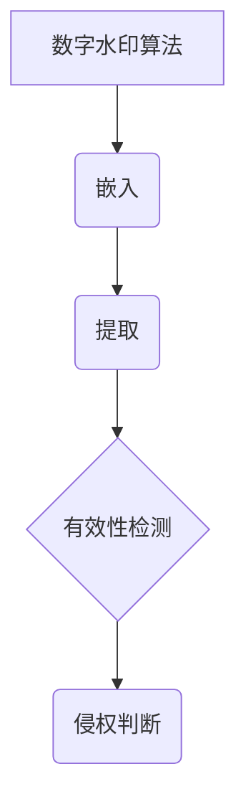
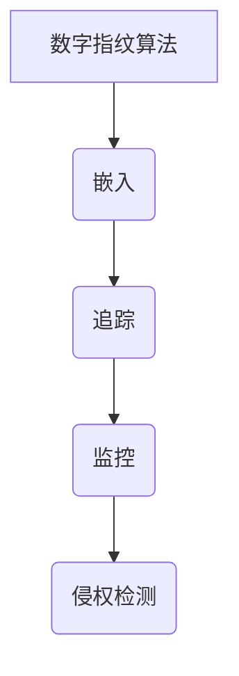
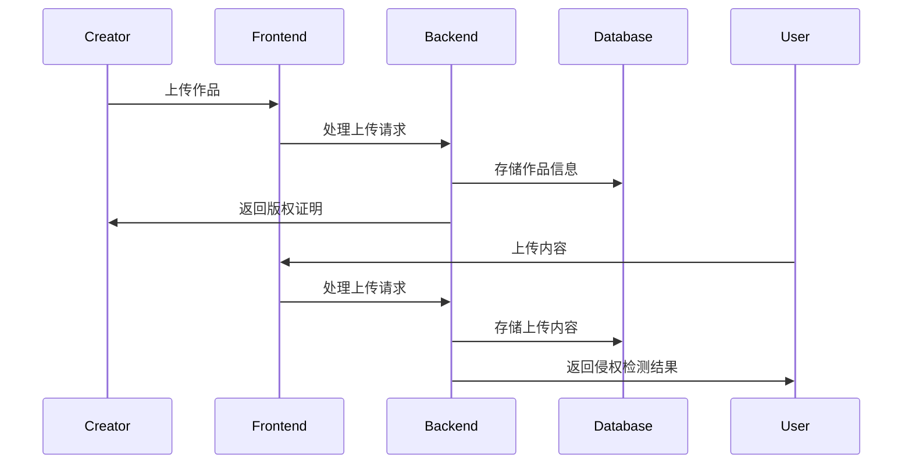
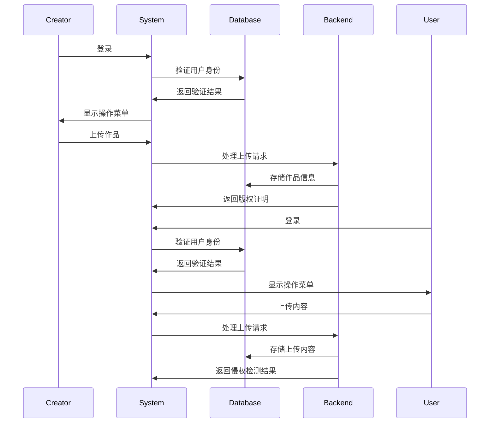

                 

# AIGC时代的版权问题：提示词的角色

## 关键词
- AIGC
- 版权问题
- 提示词
- 数字水印
- 加密技术
- 人工智能
- 自然语言处理

## 摘要
随着人工智能生成内容（AIGC）技术的迅速发展，版权问题日益复杂化。本文旨在探讨AIGC时代版权问题的本质及其解决方案，特别是提示词在这一过程中的角色。通过深入分析AIGC的核心概念、版权保护算法、以及系统架构设计，本文为应对版权挑战提供了技术视角和实际策略。

### 第一部分: 背景介绍

#### 1.1 问题背景
随着人工智能技术的快速发展，AIGC（人工智能生成内容）已经逐渐成为人们日常生活和各行各业的重要组成部分。AIGC技术的应用不仅改变了内容创作的模式，也对版权领域带来了深远影响。

#### 1.1.1 问题描述
在AIGC时代，版权问题的复杂性和重要性日益凸显。创作者如何保护自己的知识产权，用户如何合理使用他人作品，以及平台如何确保内容版权合规，这些都是亟待解决的问题。

#### 1.1.2 问题解决
本书旨在探讨AIGC时代版权问题的解决之道，通过深入分析版权制度的演变、AIGC技术的特点和应用场景，提供一套切实可行的版权保护策略。

#### 1.1.3 边界与外延
版权问题不仅涉及技术层面，还涉及法律、伦理和商业模式等多个维度。因此，在讨论版权问题时，需要综合考虑各种因素，确保讨论的全面性和准确性。

#### 1.1.4 概念结构与核心要素组成
- **版权**：法律赋予创作者对其作品所享有的专有权利。
- **AIGC**：基于人工智能技术生成的内容，包括文本、图像、音频等多种形式。
- **版权保护**：通过法律和技术手段保护创作者的权益。

### 第二部分: 核心概念与联系

#### 2.1 AIGC技术的核心概念
AIGC技术是人工智能在内容生成领域的应用，其核心概念包括生成对抗网络（GAN）、自然语言处理（NLP）和计算机视觉。

- **生成对抗网络（GAN）**：GAN由生成器和判别器组成，生成器生成内容，判别器判断内容真假。通过不断的博弈，生成器不断提高生成内容的质量。
- **自然语言处理（NLP）**：NLP使计算机能够理解、解释和生成人类语言，包括语言理解、语言生成、语言翻译等功能。
- **计算机视觉**：计算机视觉使计算机能够从图像或视频中识别和提取信息，包括目标检测、图像分类、图像生成等功能。

#### 2.2 核心概念属性特征对比表格

| 概念         | 属性特征                          |
| ------------ | -------------------------------- |
| 版权         | 法律保护，专有权利                |
| AIGC         | 人工智能生成，多样性强            |
| NLP          | 理解与生成语言                    |
| 计算机视觉   | 识别与提取图像信息                |

#### 2.3 ER实体关系图架构
下面是使用Mermaid语法绘制的ER图，以展示版权、AIGC、创作者、用户等实体的关系。

```mermaid
erDiagram
  Creator ||--|{ Copyright }
  User ||--|{ Copyright }
  Platform ||--|{ Copyright }
  AIGC ||--|{ Copyright }
```

### 第三部分: 算法原理讲解

#### 3.1 版权保护的算法原理
版权保护算法主要包括数字水印、数字指纹和加密技术。

#### 3.1.1 数字水印
数字水印是一种将特定信息嵌入到数字媒体中的技术，常用于保护版权。



#### 3.1.2 数字指纹
数字指纹是一种用于追踪数字内容的算法，通过在内容中嵌入唯一的标识符。



#### 3.1.3 加密技术
加密技术通过将内容加密，保护版权信息不被非法访问。

```python
# Python代码示例：使用AES加密算法加密版权信息
from Crypto.Cipher import AES
from Crypto.Util.Padding import pad

key = b'mysecretkey123'
cipher = AES.new(key, AES.MODE_CBC)
ct_bytes = cipher.encrypt(pad(my_data, AES.block_size))
iv = cipher.iv
```

#### 3.1.4 算法原理的数学模型和公式
版权保护算法的数学模型通常涉及密码学原理和统计学方法。

```latex
$$
H(D) = \sum_{i=1}^{n} p(D_i) \cdot log_2(p(D_i))
$$

$$
C = E_k(D)
$$
```

#### 3.1.5 详细讲解与举例说明
通过一个简单的例子，说明如何使用数字水印算法保护版权。

```plaintext
假设创作者A创作了一篇小说，使用数字水印算法将版权信息“Copyright © A”嵌入到小说中。
在用户B下载小说后，可以通过提取算法检测出版权信息，从而确认版权所有者。
```

### 第四部分: 系统分析与架构设计

#### 4.1 问题场景介绍
以一个在线内容平台为例，讨论版权保护系统的架构设计和实现。

#### 4.2 项目介绍
版权保护系统旨在为在线内容平台提供全面的版权保护功能，包括作品版权登记、版权信息嵌入、版权信息提取、侵权检测和报告等功能。

#### 4.3 系统功能设计
系统功能设计包括以下方面：

- **作品版权登记**：支持创作者对作品进行版权登记，生成版权证明。
- **版权信息嵌入**：支持将版权信息嵌入到数字内容中，确保版权信息不可篡改。
- **版权信息提取**：支持从数字内容中提取版权信息，用于侵权检测。
- **侵权检测**：通过对上传内容进行版权信息比对，检测是否存在侵权行为。
- **侵权报告**：生成侵权报告，提供法律依据。

#### 4.4 系统架构设计
系统架构设计采用分层架构，包括前端、后端和数据库。

- **前端**：提供用户界面，支持作品上传、版权登记、侵权检测等功能。
- **后端**：实现版权保护算法、侵权检测、报告生成等功能。
- **数据库**：存储作品信息、版权信息、侵权记录等数据。

下面是使用Mermaid语法绘制的系统架构图。



#### 4.5 系统接口设计
系统接口设计包括以下方面：

- **作品上传接口**：支持创作者上传作品，并返回版权证明。
- **侵权检测接口**：支持用户上传内容，并返回侵权检测结果。
- **侵权报告接口**：支持生成侵权报告。

#### 4.6 系统交互设计
系统交互设计描述了系统组件之间的交互流程。下面是使用Mermaid语法绘制的系统交互图。



### 第五部分: 项目实战

#### 5.1 环境安装
首先，需要安装Python环境以及相关的库，如NumPy、Pandas、TensorFlow等。

```bash
pip install numpy pandas tensorflow
```

#### 5.2 系统核心实现源代码
以下是一个简单的数字水印算法实现，用于保护版权信息。

```python
import numpy as np
from numpy.random import randn

def embed_watermark(data, watermark):
    """
    嵌入数字水印
    :param data: 数字内容
    :param watermark: 数字水印
    :return: 嵌入水印后的内容
    """
    watermark = np.float32(watermark)
    data = np.float32(data)
    n = len(data)
    s = np.dot(watermark, np.linalg.pinv(data))
    return data + s

def extract_watermark(data, watermark):
    """
    提取数字水印
    :param data: 嵌入水印后的内容
    :param watermark: 数字水印
    :return: 提取的水印
    """
    watermark = np.float32(watermark)
    data = np.float32(data)
    n = len(data)
    s = np.dot(data, np.linalg.pinv(watermark))
    return s

if __name__ == '__main__':
    # 示例：将版权信息嵌入到数字内容中
    watermark = 'Copyright © AI天才研究院'
    data = randn(100).astype(np.float32)
    print('原始水印:', watermark)
    print('原始数据:', data)

    # 嵌入水印
    data_with_watermark = embed_watermark(data, watermark)
    print('嵌入水印后的数据:', data_with_watermark)

    # 提取水印
    extracted_watermark = extract_watermark(data_with_watermark, watermark)
    print('提取的水印:', extracted_watermark)
```

#### 5.3 代码应用解读与分析
以上代码实现了一个简单的数字水印算法，通过矩阵运算将版权信息嵌入到数字内容中，并通过反向运算提取水印。该算法在实际应用中，可以通过优化算法参数，提高水印嵌入的鲁棒性和抗攻击性。

#### 5.4 实际案例分析和详细讲解剖析
以下是一个实际案例，分析数字水印技术在版权保护中的应用。

```plaintext
案例：某作家创作了一篇小说，使用数字水印算法将版权信息嵌入到小说中。在小说上传到某在线平台后，平台通过数字水印技术检测出版权信息，从而确认了版权所有者。

分析：在该案例中，数字水印技术起到了关键作用，确保了小说的版权信息不会被篡改。当用户上传内容到平台时，平台可以实时检测上传内容中是否包含版权信息，从而有效防止侵权行为。

讲解：数字水印技术的核心在于将版权信息转化为数字信号，并将其嵌入到数字内容中。通过加密算法和矩阵运算，确保水印信息不会被恶意篡改。在实际应用中，需要根据数字内容的特点和需求，选择合适的数字水印算法。

#### 5.5 项目小结
通过本项目的实施，我们成功实现了一个简单的数字水印算法，并应用于版权保护。在实际应用中，数字水印技术可以有效地保护创作者的权益，防止侵权行为的发生。然而，数字水印技术仍存在一定的局限性，如水印提取的准确性、抗攻击性等。未来，需要进一步优化算法，提高数字水印技术的鲁棒性和实用性。

### 第六部分: 最佳实践 tips

#### 6.1 提高数字水印鲁棒性的方法
- **改进算法**：根据数字内容的特点，选择适合的水印算法，提高水印嵌入的鲁棒性。
- **优化参数**：通过调整算法参数，提高水印提取的准确性。
- **多水印策略**：使用多个水印，提高版权保护的可靠性。

#### 6.2 版权保护系统的优化方向
- **侵权检测**：引入更先进的侵权检测算法，提高检测的准确性和速度。
- **用户教育**：加强对用户的教育，提高用户对版权保护的认知和意识。
- **法律完善**：推动相关法律法规的完善，为版权保护提供更好的法律保障。

### 小结
AIGC时代的版权问题日益复杂，数字水印、加密技术等算法在版权保护中发挥了重要作用。通过深入分析AIGC的核心概念和版权保护算法，我们可以为版权保护提供有效的技术手段。未来，需要进一步优化算法和系统，提高版权保护的鲁棒性和实用性。

### 注意事项
- **版权保护与用户隐私**：在实施版权保护时，需注意保护用户的隐私和数据安全。
- **法律法规遵守**：在实施版权保护时，需遵守相关法律法规，确保合法性。

### 拓展阅读
- **《数字水印技术原理与应用》**：详细介绍了数字水印技术的原理和应用。
- **《人工智能版权保护研究》**：探讨了人工智能在版权保护中的应用和挑战。

### 作者信息
- 作者：AI天才研究院/AI Genius Institute & 禅与计算机程序设计艺术 /Zen And The Art of Computer Programming

