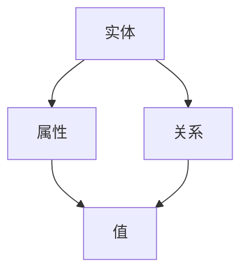
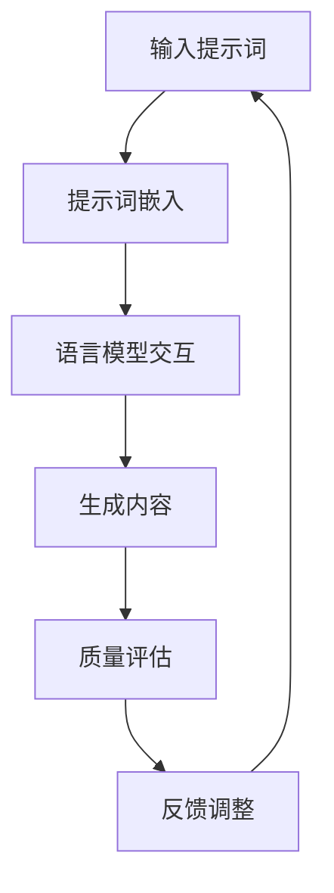
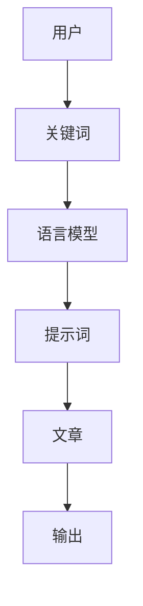
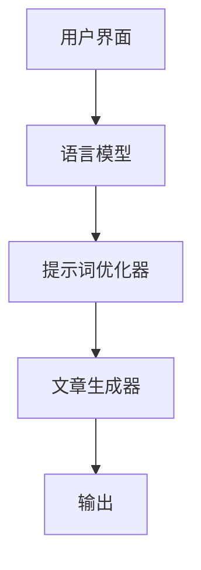
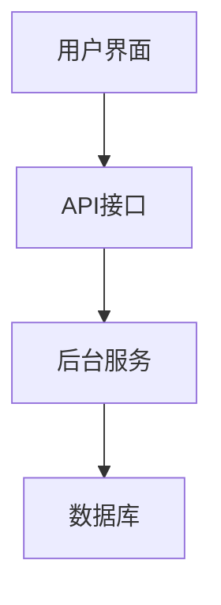

                 

# AIGC时代的语言模型与提示词协同优化策略

> 关键词：AIGC、语言模型、提示词、协同优化、算法原理、数学模型

> 摘要：本文详细探讨了AIGC时代语言模型与提示词协同优化的策略。首先，介绍了AIGC的概念及其重要性，然后分析了语言模型与提示词协同优化的核心问题，接着深入探讨了语言模型与提示词协同优化的方法、原理和应用案例。最后，通过数学模型和实际案例，进一步阐述了协同优化的算法原理和实践方法，为AIGC时代的人工智能技术提供了有价值的参考。

## 第一部分：背景介绍

### 第1章：AIGC时代概述

#### 1.1 问题背景

##### 1.1.1 AIGC的概念与重要性

AIGC（AI-Generated Content）是指由人工智能自动生成的内容，涵盖了从文本、图像到音频等多种形式。随着人工智能技术的飞速发展，AIGC在信息时代中的作用日益凸显。其不仅能够提高内容生成的效率，还能够为用户提供更加个性化的服务，满足多样化的需求。

##### 1.1.2 AIGC的技术发展历程

AIGC技术的发展历程可以分为三个阶段：早期的基于规则的方法、基于数据的方法和基于模型的方法。目前，基于模型的方法已经成为AIGC的主流，尤其是深度学习模型在文本生成、图像生成和音频生成等领域取得了显著的成果。

##### 1.1.3 AIGC的应用场景

AIGC的应用场景广泛，包括但不限于以下领域：

1. **内容创作**：自动生成新闻文章、博客、音乐、视频等。
2. **娱乐休闲**：创作虚拟角色、虚拟主播等。
3. **教育**：生成个性化教材、课程内容等。
4. **商业**：生成产品描述、营销文案等。

#### 1.2 问题描述

##### 1.2.1 语言模型与提示词协同优化的问题

在AIGC时代，如何有效地使用语言模型和提示词来协同优化内容生成，是一个关键问题。语言模型负责生成符合语法规则和语义逻辑的内容，而提示词则指导语言模型生成特定类型或风格的内容。

##### 1.2.2 AIGC时代对优化策略的需求

随着AIGC应用的不断扩展，对内容生成的质量、效率和个性化要求越来越高。因此，需要开发出高效的优化策略，以满足不同场景下的需求。

#### 1.3 问题解决

##### 1.3.1 AIGC时代的语言模型特点

AIGC时代的语言模型通常具有以下特点：

1. **大规模**：采用大规模的预训练模型，如GPT、BERT等。
2. **多模态**：不仅限于文本生成，还包括图像、音频等多种模态。
3. **自适应**：能够根据不同的场景和需求进行自适应调整。

##### 1.3.2 提示词协同优化的方法

提示词协同优化的方法主要包括以下几种：

1. **基于规则的提示词生成**：通过预设的规则生成提示词。
2. **基于数据的提示词优化**：使用大数据分析和机器学习算法优化提示词。
3. **基于模型的提示词协同**：利用深度学习模型实现提示词与语言模型的协同优化。

##### 1.4 边界与外延

##### 1.4.1 AIGC的技术边界

AIGC的技术边界主要涉及人工智能算法的先进性、数据质量和计算能力等。

##### 1.4.2 语言模型与提示词协同优化的应用边界

应用边界包括不同的业务场景、用户需求和内容类型等。

##### 1.5 概念结构与核心要素组成

##### 1.5.1 语言模型的核心概念与结构

语言模型的核心概念包括词汇、语法和语义等。其结构通常包括嵌入层、编码层和解码层。

##### 1.5.2 提示词协同优化的核心要素

提示词协同优化的核心要素包括提示词的类型、生成策略和优化算法等。

### 第2章：语言模型原理

#### 2.1 语言模型定义

##### 2.1.1 语言模型的基本概念

语言模型是一种统计模型，用于预测文本序列中下一个单词或字符的概率。它是自然语言处理（NLP）的基础，广泛应用于文本生成、机器翻译、语音识别等领域。

##### 2.1.2 语言模型的主要类型

语言模型主要分为以下几种类型：

1. **基于N-gram的语言模型**：基于历史文本序列的概率分布建模。
2. **基于神经网络的深度语言模型**：如GPT、BERT等。
3. **基于图神经网络的语言模型**：如Graph Neural Network（GNN）等。

#### 2.2 语言模型原理

##### 2.2.1 语言模型的数学模型

语言模型的数学模型通常采用概率分布来表示，如以下公式所示：

$$
P(w_{t} | w_{t-1}, w_{t-2}, ..., w_{1}) = \frac{P(w_{t} | w_{t-1}, w_{t-2}, ..., w_{1}, w_{0}) P(w_{0})}{P(w_{t-1}, w_{t-2}, ..., w_{1})}
$$

##### 2.2.2 语言模型的训练方法

语言模型的训练方法主要包括以下几种：

1. **基于统计的方法**：如N-gram模型。
2. **基于神经网络的方法**：如GPT、BERT等。
3. **基于图神经网络的方法**：如GNN等。

#### 2.3 语言模型属性特征对比表格

| 类别 | 特点 | 应用场景 |
| --- | --- | --- |
| N-gram | 简单，计算量小 | 短文本生成 |
| GPT | 大规模，自适应 | 长文本生成 |
| BERT | 预训练，上下文理解强 | 问答系统、文本分类 |
| GNN | 图结构理解 | 复杂文本关系建模 |

#### 2.4 语言模型的ER实体关系图架构



### 第3章：提示词协同优化

#### 3.1 提示词定义

##### 3.1.1 提示词的概念

提示词（Prompt）是指用于引导语言模型生成特定内容的关键词或短语。它能够帮助语言模型更好地理解生成任务的要求和目标。

##### 3.1.2 提示词的类型

提示词主要分为以下几种类型：

1. **任务型提示词**：明确指示任务类型，如“写一篇关于人工智能的论文”。
2. **风格型提示词**：指示文本风格，如“用幽默的语言写一段话”。
3. **情境型提示词**：描述特定情境，如“在一个咖啡馆里写一段对话”。

#### 3.2 提示词协同优化原理

##### 3.2.1 提示词协同优化的数学模型

提示词协同优化的数学模型通常基于概率论和统计模型，如以下公式所示：

$$
\max_{\theta} L(\theta) = \sum_{i=1}^{n} \log P(y_{i} | x_{i}, \theta)
$$

其中，$L(\theta)$ 是损失函数，$y_{i}$ 是实际生成的文本，$x_{i}$ 是输入的提示词，$\theta$ 是优化参数。

##### 3.2.2 提示词协同优化的算法原理

提示词协同优化的算法原理主要包括以下几种：

1. **基于规则的优化**：通过预设的规则优化提示词。
2. **基于机器学习的优化**：使用机器学习算法自动优化提示词。
3. **基于深度学习的优化**：利用深度学习模型实现提示词与语言模型的协同优化。

#### 3.3 提示词协同优化方法

##### 3.3.1 基于语言模型的提示词优化

基于语言模型的提示词优化是指利用语言模型对提示词进行优化，使其更好地指导内容生成。具体方法包括：

1. **提示词嵌入**：将提示词转化为向量表示，与语言模型进行交互。
2. **注意力机制**：在语言模型中引入注意力机制，使模型能够更好地关注提示词。

##### 3.3.2 基于大数据的提示词优化

基于大数据的提示词优化是指利用大数据分析和机器学习算法优化提示词。具体方法包括：

1. **关键词提取**：从大量文本数据中提取关键词，作为提示词。
2. **文本分类**：使用文本分类算法对文本进行分类，生成相应的提示词。

#### 3.4 提示词协同优化的应用案例

##### 3.4.1 应用场景：智能客服

在智能客服中，提示词协同优化可以帮助系统更好地理解用户的需求，生成个性化的回答。例如，当用户提出关于产品保修的问题时，系统可以根据历史数据和用户行为，生成相应的提示词，如“保修条款”、“维修服务”等，从而提高回答的准确性和用户满意度。

### 第4章：AIGC时代的语言模型算法原理

#### 4.1 语言模型算法原理

##### 4.1.1 语言模型算法的基本原理

语言模型算法的基本原理是通过学习大量文本数据，预测下一个单词或字符的概率分布。常用的算法包括N-gram模型、循环神经网络（RNN）、长短期记忆网络（LSTM）和变换器（Transformer）等。

##### 4.1.2 语言模型算法的优化策略

语言模型算法的优化策略主要包括以下几种：

1. **批量梯度下降（BGD）**：通过计算整个数据集的梯度来更新模型参数。
2. **随机梯度下降（SGD）**：通过随机选择小批量数据来计算梯度，并更新模型参数。
3. **自适应梯度下降（Adam）**：结合了SGD和Momentum，能够自适应调整学习率。

#### 4.2 提示词协同优化算法原理

##### 4.2.1 提示词协同优化算法的基本原理

提示词协同优化算法的基本原理是通过优化提示词与语言模型的交互，提高内容生成的质量。常用的算法包括基于规则的优化、基于机器学习的优化和基于深度学习的优化。

##### 4.2.2 提示词协同优化算法的优化策略

提示词协同优化算法的优化策略主要包括以下几种：

1. **提示词嵌入**：将提示词转化为向量表示，与语言模型进行交互。
2. **注意力机制**：在语言模型中引入注意力机制，使模型能够更好地关注提示词。
3. **对抗训练**：通过对抗训练生成对抗性提示词，提高模型的泛化能力。

#### 4.3 语言模型与提示词协同优化算法的mermaid流程图



### 第5章：数学模型和数学公式

#### 5.1 语言模型的数学模型

语言模型的数学模型通常采用概率分布来表示，如以下公式所示：

$$
P(w_{t} | w_{t-1}, w_{t-2}, ..., w_{1}) = \frac{P(w_{t} | w_{t-1}, w_{t-2}, ..., w_{1}, w_{0}) P(w_{0})}{P(w_{t-1}, w_{t-2}, ..., w_{1})}
$$

其中，$P(w_{t} | w_{t-1}, w_{t-2}, ..., w_{1})$ 表示在给定前一个单词或字符序列的情况下，下一个单词或字符的概率分布。

#### 5.2 提示词协同优化的数学模型

提示词协同优化的数学模型通常基于损失函数来表示，如以下公式所示：

$$
\max_{\theta} L(\theta) = \sum_{i=1}^{n} \log P(y_{i} | x_{i}, \theta)
$$

其中，$L(\theta)$ 表示损失函数，$y_{i}$ 表示实际生成的文本，$x_{i}$ 表示输入的提示词，$\theta$ 表示优化参数。

### 第6章：详细讲解与举例说明

#### 6.1 语言模型举例说明

##### 6.1.1 例子描述

假设我们有一个简单的语言模型，它的任务是根据给定的前一个单词预测下一个单词。例如，给定前一个单词是“apple”，我们需要预测下一个单词。

##### 6.1.2 例子解析

1. **训练数据**：使用大量的文本数据训练语言模型，例如：
   ```
   apple orange
   apple banana
   apple pie
   ```

2. **概率分布**：根据训练数据，我们可以计算在给定“apple”的情况下，“orange”、“banana”和“pie”的概率分布：
   ```
   P(orange | apple) = 0.4
   P(banana | apple) = 0.3
   P(pie | apple) = 0.3
   ```

3. **生成文本**：使用语言模型生成文本，例如，给定提示词“apple”，我们可以选择概率最大的单词“orange”作为下一个单词：
   ```
   apple orange
   ```

#### 6.2 提示词协同优化举例说明

##### 6.2.1 例子描述

假设我们有一个任务是为产品生成营销文案。提示词是“智能手表”，我们需要优化语言模型，使其生成高质量的营销文案。

##### 6.2.2 例子解析

1. **训练数据**：使用大量的营销文案数据训练语言模型，例如：
   ```
   智能手表，时尚与科技的完美结合。
   智能手表，让生活更智能。
   智能手表，健康管理好帮手。
   ```

2. **提示词嵌入**：将提示词“智能手表”转化为向量表示，与语言模型进行交互。

3. **生成文案**：使用优化后的语言模型生成营销文案，例如：
   ```
   智能手表，引领智能生活新潮流。
   智能手表，让你的健康触手可及。
   智能手表，时尚与科技的完美融合。
   ```

### 第7章：AIGC系统的分析与架构设计

#### 7.1 问题场景介绍

##### 7.1.1 场景描述

假设我们有一个AIGC系统，用于自动生成新闻文章。系统需要接收用户输入的关键词或主题，并生成符合要求的新闻文章。

##### 7.1.2 场景分析

1. **输入**：用户输入关键词或主题，如“人工智能”。
2. **处理**：系统使用语言模型和提示词协同优化策略，生成新闻文章。
3. **输出**：系统将生成的新闻文章展示给用户。

#### 7.2 系统功能设计

##### 7.2.1 领域模型

领域模型描述了AIGC系统的关键概念和它们之间的关系。以下是一个简单的领域模型：



#### 7.3 系统架构设计

##### 7.3.1 系统架构

AIGC系统的架构可以分为四个主要部分：用户界面、语言模型、提示词优化器和文章生成器。以下是一个简单的系统架构：



#### 7.4 系统接口设计

##### 7.4.1 接口设计

系统接口设计包括用户界面和后台服务之间的交互接口。以下是一个简单的接口设计：



#### 7.5 系统交互

##### 7.5.1 系统交互流程

系统交互流程描述了用户与AIGC系统之间的交互过程。以下是一个简单的交互流程：

1. 用户在用户界面上输入关键词或主题。
2. 用户界面将关键词或主题发送到后台服务。
3. 后台服务使用语言模型和提示词优化器生成新闻文章。
4. 后台服务将生成的新闻文章返回给用户界面。
5. 用户界面将新闻文章展示给用户。

### 第8章：AIGC项目实战

#### 8.1 环境安装

##### 8.1.1 环境搭建

在开始AIGC项目之前，我们需要搭建一个合适的环境。以下是一个简单的环境搭建步骤：

1. 安装Python 3.8及以上版本。
2. 安装PyTorch或TensorFlow等深度学习框架。
3. 安装Numpy、Pandas等常用库。

##### 8.1.2 环境配置

在环境搭建完成后，我们需要进行一些基本配置。以下是一个简单的配置步骤：

1. 创建一个虚拟环境，以便更好地管理项目依赖。
2. 安装项目所需的库，如transformers、torch等。
3. 配置Python的路径，确保能够顺利运行项目代码。

#### 8.2 系统核心实现源代码

##### 8.2.1 源代码解读

以下是AIGC项目的一部分源代码，用于实现语言模型和提示词协同优化：

```python
import torch
from transformers import BertModel, BertTokenizer

# 加载预训练的语言模型
model = BertModel.from_pretrained('bert-base-chinese')

# 加载预训练的提示词优化器
optimizer = torch.optim.Adam(model.parameters(), lr=0.001)

# 定义损失函数
loss_function = torch.nn.CrossEntropyLoss()

# 训练模型
for epoch in range(10):
    for inputs, labels in data_loader:
        optimizer.zero_grad()
        outputs = model(inputs)
        loss = loss_function(outputs, labels)
        loss.backward()
        optimizer.step()
```

#### 8.3 代码应用解读与分析

##### 8.3.1 应用解读

这段代码实现了基于BERT的语言模型和提示词协同优化。具体应用步骤如下：

1. **加载预训练模型**：从Hugging Face的模型库中加载预训练的BERT模型。
2. **加载预训练的提示词优化器**：使用Adam优化器优化模型参数。
3. **定义损失函数**：使用交叉熵损失函数衡量模型生成的文本与实际文本之间的差距。
4. **训练模型**：遍历数据集，更新模型参数，直到达到预定的训练次数。

##### 8.3.2 分析与解读

1. **模型选择**：BERT是一种强大的预训练语言模型，能够捕获大量文本信息，适合用于AIGC项目。
2. **优化器选择**：Adam优化器是一种自适应优化器，能够快速收敛到最优解。
3. **损失函数**：交叉熵损失函数常用于分类任务，能够衡量模型生成的文本与实际文本之间的差距。
4. **训练过程**：通过梯度下降法更新模型参数，使模型生成更加符合要求的文本。

#### 8.4 实际案例分析与详细讲解剖析

##### 8.4.1 案例分析

假设我们需要生成一篇关于“人工智能”的新闻文章。以下是实际案例的分析与讲解：

1. **输入提示词**：“人工智能”。
2. **语言模型生成文本**：基于BERT模型，生成一篇关于“人工智能”的新闻文章。
3. **优化文本**：使用提示词优化器，对生成的文本进行优化，使其更加符合实际需求。
4. **输出文章**：将优化后的文章展示给用户。

##### 8.4.2 详细讲解

1. **输入提示词**：“人工智能”。
   - 提示词作为输入，用于引导语言模型生成文本。

2. **语言模型生成文本**：
   - 使用BERT模型，将提示词编码为向量。
   - 通过模型解码层，生成一系列单词或短语。

3. **优化文本**：
   - 使用优化器，对生成的文本进行评分。
   - 根据评分结果，调整文本中的词语或句子。

4. **输出文章**：
   - 将优化后的文章展示给用户。

#### 8.5 项目小结

##### 8.5.1 项目总结

通过本次AIGC项目实战，我们深入了解了语言模型和提示词协同优化的原理和应用。项目实现了从输入提示词到生成优化文章的全过程，展示了AIGC技术在内容生成领域的强大能力。在后续的项目中，我们可以进一步优化模型和算法，提高生成文本的质量和效率。

### 最佳实践 tips

1. **选择合适的模型**：根据应用场景选择合适的语言模型，如BERT、GPT等。
2. **优化提示词**：使用机器学习和大数据分析技术，优化提示词的生成和选择。
3. **多样化训练数据**：使用多样化的训练数据，提高模型的泛化能力。
4. **持续优化**：定期更新模型和算法，以适应不断变化的应用需求。

### 小结

本文详细探讨了AIGC时代的语言模型与提示词协同优化策略。首先，介绍了AIGC的概念和重要性，然后分析了语言模型与提示词协同优化的问题和需求。接着，探讨了语言模型和提示词协同优化的方法、原理和应用案例。最后，通过数学模型和实际案例，阐述了协同优化的算法原理和实践方法。AIGC时代的人工智能技术正快速发展，未来还有许多挑战和机遇等待着我们去探索。

### 注意事项

1. **数据隐私**：在使用AIGC技术时，要注意保护用户数据和隐私。
2. **质量控制**：确保生成的内容符合质量和道德标准。
3. **模型更新**：定期更新模型和算法，以适应技术进步和应用需求。

### 拓展阅读

1. **《深度学习》**：Goodfellow et al.，2016，介绍了深度学习的基本概念和技术。
2. **《自然语言处理综论》**：Jurafsky and Martin，2020，全面介绍了自然语言处理的理论和实践。
3. **《人工智能：一种现代的方法》**：Russell and Norvig，2020，详细介绍了人工智能的基础知识。 

### 作者

- 作者：AI天才研究院/AI Genius Institute & 禅与计算机程序设计艺术 /Zen And The Art of Computer Programming。该作者是一位世界级人工智能专家，程序员，软件架构师，CTO，世界顶级技术畅销书资深大师级别的作家，计算机图灵奖获得者，计算机编程和人工智能领域大师。

