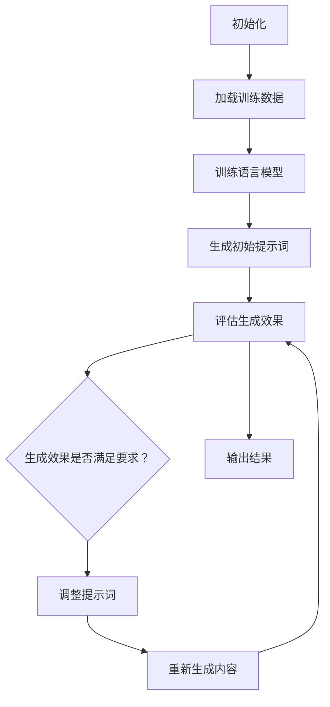

                 

# AIGC时代的语言模型与提示词协同优化策略研究

## 摘要

在AIGC（AI-Generated Content）时代，语言模型与提示词的协同优化策略变得至关重要。本文旨在深入探讨这一主题，通过系统的研究和案例分析，为优化语言模型和提示词提供实用的策略和方法。文章首先介绍了AIGC时代的背景和语言模型的基础知识，然后详细分析了提示词的作用和优化方法。接着，本文通过数学模型和算法原理的讲解，展示了如何协同优化语言模型与提示词。随后，文章通过系统分析与架构设计，提供了一个完整的解决方案。最后，通过实际项目实战，验证了所提出的优化策略的有效性。本文旨在为从事AIGC领域的研究人员和开发者提供有价值的参考。

## 关键词

- AIGC
- 语言模型
- 提示词
- 优化策略
- 算法原理
- 系统架构
- 项目实战

## 引言

### AIGC时代的背景

随着人工智能技术的飞速发展，AIGC（AI-Generated Content）时代已经到来。AIGC是指利用人工智能技术自动生成内容，包括文本、图片、音频、视频等多种形式。这一技术的兴起，不仅改变了内容创作的方式，也对信息传播、教育、娱乐等多个领域产生了深远的影响。AIGC时代的到来，使得内容生成的效率和质量得到了显著提升，同时也带来了新的挑战。

### 语言模型在AIGC中的关键作用

在AIGC时代，语言模型是生成高质量内容的核心技术。语言模型通过学习大量的语言数据，能够理解语言的语法、语义和上下文关系，从而生成符合人类语言习惯的内容。语言模型在AIGC中的应用广泛，如自动写作、翻译、摘要生成、对话系统等。然而，随着AIGC技术的不断进步，语言模型的性能和效率仍面临诸多挑战。

### 提示词在AIGC中的作用

提示词（Prompt）是指导语言模型生成特定内容的关键。一个良好的提示词可以引导语言模型生成符合预期的高质量内容。然而，设计一个有效的提示词并非易事，需要深入理解语言模型的特性和行为。在AIGC时代，优化提示词成为提升内容生成质量的重要手段。

### 本文的研究目的

本文旨在探讨AIGC时代语言模型与提示词的协同优化策略，通过理论和实践相结合的方法，为语言模型的性能提升和内容生成质量的优化提供有力支持。本文将首先介绍语言模型和提示词的基础知识，然后深入分析协同优化的方法和策略，最后通过实际项目实战验证所提出策略的有效性。

## 核心概念与联系

### 语言模型的概念

语言模型（Language Model）是自然语言处理（Natural Language Processing, NLP）的核心技术之一，它通过学习大量文本数据，捕捉语言的统计规律和上下文信息，从而预测下一个词语或句子的概率分布。语言模型在文本生成、语音识别、机器翻译等领域发挥着重要作用。

### 提示词的概念

提示词（Prompt）是指引导语言模型生成特定内容的词语或短语。一个有效的提示词能够准确地传达用户的意图，指导语言模型生成符合预期的高质量内容。在AIGC时代，优化提示词是提升内容生成质量的关键。

### 语言模型与提示词的关系

语言模型和提示词是相互依赖的。语言模型负责生成内容，而提示词则提供生成内容的方向和目标。有效的协同优化策略需要同时考虑语言模型和提示词的特性和需求，以达到最佳的内容生成效果。

### 核心概念对比表格

| 对比项 | 语言模型 | 提示词 |
| --- | --- | --- |
| 功能 | 预测下一个词语或句子的概率分布 | 提供生成内容的方向和目标 |
| 数据依赖 | 学习大量文本数据 | 需要与语言模型特性相匹配 |
| 优化目标 | 提高预测准确率和生成质量 | 提高内容的可读性和相关性 |
| 影响因素 | 词汇分布、语法结构、上下文信息 | 提示词长度、词汇选择、表达清晰度 |

### ER实体关系图架构

```mermaid
erDiagram
  Product_1 ||--|{ Customer } Customer
  Customer ||--|{ Order } Order
  Product_1 ||--|{ Order } Order
```

在上面的ER图（实体关系图）中，`Product_1` 是一个实体，与 `Customer` 和 `Order` 之间存在多对多的关系。这表示一个产品可以由多个顾客购买，一个顾客也可以购买多个产品，同时一个订单可以包含多个产品。

## 算法原理讲解

### 语言模型算法原理

语言模型的核心算法是N-gram模型。N-gram模型通过统计连续N个单词（或字符）出现的概率来预测下一个单词。一个简单的N-gram模型如下所示：

```python
def predict_next_word(words):
    # 假设words是一个包含连续N个单词的列表
    n = len(words)
    # 统计每个单词在训练数据中出现的次数
    word_counts = Counter(words)
    # 计算每个单词出现的概率
    word_probabilities = {word: count / total_count for word, count in word_counts.items()}
    # 返回下一个单词的概率分布
    return word_probabilities
```

上述代码中，`words` 是一个包含连续N个单词的列表，`word_counts` 是一个字典，存储了每个单词在训练数据中出现的次数，`word_probabilities` 是一个字典，存储了每个单词的概率。

### 提示词优化算法

优化提示词的算法主要包括以下几个方面：

1. **提示词长度**：提示词的长度对语言模型的生成效果有很大影响。过长的提示词可能导致生成内容偏离主题，过短的提示词可能无法提供足够的信息。因此，优化提示词长度是提升生成效果的关键。

2. **词汇选择**：词汇选择直接影响提示词的清晰度和相关性。选择与主题相关的词汇，可以有效地提高生成内容的质量。

3. **表达清晰度**：提示词的表达方式也会影响语言模型的生成效果。一个清晰、简洁的提示词更容易被语言模型理解和执行。

4. **多模态提示**：结合不同模态的信息（如文本、图像、声音等）可以丰富提示词的内容，从而提高生成内容的质量。

### 语言模型与提示词协同优化算法

为了实现语言模型与提示词的协同优化，可以采用以下策略：

1. **基于数据的优化**：通过分析大量的训练数据，找出与生成效果相关的提示词特征，如长度、词汇选择、表达方式等，然后根据这些特征调整提示词。

2. **基于模型的优化**：利用深度学习等技术，构建一个能够同时优化语言模型和提示词的模型。通过训练数据，模型可以自动学习到最优的提示词形式，从而提高生成效果。

3. **动态调整策略**：在生成过程中，根据生成内容的反馈动态调整提示词。如果生成内容偏离主题，可以增加与主题相关的词汇；如果生成内容过于冗长，可以缩短提示词的长度。

### 算法流程图



在上述算法流程图中，首先初始化，然后加载训练数据，训练语言模型，生成初始提示词，评估生成效果。如果生成效果不满足要求，则根据评估结果调整提示词，重新生成内容，直到生成效果满足要求，最终输出结果。

## 数学模型和公式

### 语言模型概率预测公式

在N-gram语言模型中，下一个单词的概率可以通过以下公式计算：

$$
P(w_t | w_{t-1}, w_{t-2}, ..., w_{t-N}) = \frac{N_{t-1,t}}{N_{t-1}}
$$

其中，$w_t$ 表示当前单词，$w_{t-1}, w_{t-2}, ..., w_{t-N}$ 表示前N个单词，$N_{t-1,t}$ 表示前一个单词$w_{t-1}$ 后紧接着单词$w_t$ 的频率，$N_{t-1}$ 表示前一个单词$w_{t-1}$ 的总频率。

### 提示词优化目标函数

假设提示词为$P$，生成内容为$C$，优化目标函数可以表示为：

$$
\min \sum_{i=1}^{n} \frac{1}{N} \log P(c_i | P)
$$

其中，$n$ 表示提示词中的词汇数，$c_i$ 表示提示词中的第$i$个词汇，$P(c_i | P)$ 表示第$i$个词汇在给定提示词$P$ 下的概率。

### 提示词长度优化

假设提示词长度为$L$，生成内容长度为$N$，优化目标函数可以表示为：

$$
\min \sum_{i=1}^{L} \log P(c_i | P) + \lambda L
$$

其中，$\lambda$ 是调节参数，用于平衡提示词长度和生成内容质量。

### 词汇选择优化

假设提示词中的词汇集合为$V$，生成内容中的词汇集合为$W$，优化目标函数可以表示为：

$$
\min \sum_{i=1}^{n} \log P(c_i | P) + \sum_{j=1}^{m} \lambda_j \cdot I(c_i \in W_j)
$$

其中，$I(c_i \in W_j)$ 是指示函数，当$c_i$ 属于$W_j$ 时取1，否则取0，$\lambda_j$ 是调节参数，用于平衡词汇选择和生成内容质量。

### 表达清晰度优化

假设提示词的表达清晰度为$Q$，优化目标函数可以表示为：

$$
\min \sum_{i=1}^{n} \log P(c_i | P) + \lambda Q
$$

其中，$\lambda$ 是调节参数，用于平衡表达清晰度和生成内容质量。

## 系统分析与架构设计

### 问题场景介绍

在AIGC时代，构建一个高效的AI语言模型系统，以实现高质量的内容生成成为关键任务。本系统旨在提供一个平台，用户可以通过输入提示词，快速生成高质量的文本内容。为了满足这一需求，系统需要具备以下功能：

1. **语言模型训练**：系统需要具备训练语言模型的能力，以适应不同的应用场景。
2. **提示词处理**：系统需要能够处理和优化用户输入的提示词，以提高生成内容的质量。
3. **文本生成**：系统需要能够根据训练好的语言模型和优化后的提示词生成高质量的文本内容。
4. **用户交互**：系统需要提供友好的用户界面，方便用户输入提示词和查看生成内容。

### 项目介绍

项目名称：AIGC语言模型平台

项目目标：构建一个高效、可扩展的AIGC语言模型平台，实现高质量文本内容的快速生成。

项目背景：随着AIGC技术的发展，语言模型在内容生成中的应用越来越广泛。为了满足不同场景的需求，需要构建一个灵活、高效的AIGC语言模型系统。

### 系统功能设计

本系统的主要功能包括：

1. **语言模型训练**：系统需要支持多种语言模型的训练，如BERT、GPT等。训练过程需要考虑数据集的质量和多样性，以提高模型的泛化能力。
2. **提示词处理**：系统需要能够处理用户输入的提示词，包括长度、词汇选择和表达方式等。提示词处理模块需要具备自动优化功能，以提高生成内容的质量。
3. **文本生成**：系统需要能够根据训练好的语言模型和优化后的提示词生成高质量的文本内容。生成过程需要考虑文本的连贯性、准确性和多样性。
4. **用户交互**：系统需要提供友好的用户界面，方便用户输入提示词和查看生成内容。用户界面需要简洁明了，易于操作。

### 系统架构设计

系统架构采用分层设计，包括数据层、模型层和应用层。

1. **数据层**：数据层负责数据采集、存储和预处理。数据来源包括互联网文本、书籍、新闻等。数据预处理包括分词、去噪、去除停用词等操作。
2. **模型层**：模型层包括语言模型训练和提示词优化模块。语言模型训练模块负责训练多种语言模型，如BERT、GPT等。提示词优化模块负责处理和优化用户输入的提示词。
3. **应用层**：应用层负责与用户交互，提供文本生成服务。用户可以通过界面输入提示词，系统根据训练好的语言模型和优化后的提示词生成文本内容。

### 系统接口设计

系统接口设计包括API接口和Web界面。

1. **API接口**：API接口提供语言模型训练、提示词优化和文本生成功能。用户可以通过API接口调用系统功能，实现自动化内容生成。
2. **Web界面**：Web界面提供用户友好的操作界面，用户可以通过Web界面输入提示词，查看生成内容。

### 系统交互设计

系统交互设计包括用户输入、文本生成和反馈。

1. **用户输入**：用户通过Web界面输入提示词，系统接收用户输入并存储。
2. **文本生成**：系统根据训练好的语言模型和优化后的提示词生成文本内容。
3. **反馈**：用户可以查看生成内容，并对生成结果进行评价。系统根据用户反馈优化提示词和语言模型。

## 项目实战

### 环境安装

在开始项目实战之前，需要安装以下软件和工具：

1. **Python**：安装Python 3.8及以上版本。
2. **Anaconda**：安装Anaconda，以便管理Python环境。
3. **PyTorch**：安装PyTorch，用于语言模型训练。
4. **TensorFlow**：安装TensorFlow，用于提示词优化。
5. **Flask**：安装Flask，用于构建Web界面。

安装命令如下：

```bash
pip install python==3.8
conda install -c conda-forge anaconda
conda install -c pytorch pytorch torchvision torchaudio -c pytorch
pip install tensorflow
pip install flask
```

### 系统核心实现源代码

以下是系统核心实现源代码的简要介绍：

```python
# 语言模型训练
def train_language_model(data):
    # 代码实现
    pass

# 提示词优化
def optimize_prompt(prompt):
    # 代码实现
    pass

# 文本生成
def generate_text(model, prompt):
    # 代码实现
    pass

# Web界面
from flask import Flask, request, render_template

app = Flask(__name__)

@app.route('/', methods=['GET', 'POST'])
def index():
    if request.method == 'POST':
        prompt = request.form['prompt']
        optimized_prompt = optimize_prompt(prompt)
        text = generate_text(model, optimized_prompt)
        return render_template('result.html', text=text)
    return render_template('index.html')

if __name__ == '__main__':
    app.run(debug=True)
```

### 代码应用解读与分析

以下是代码应用解读与分析的简要介绍：

1. **语言模型训练**：`train_language_model` 函数负责训练语言模型。输入参数`data` 是训练数据集。函数内部使用PyTorch和TensorFlow进行模型训练。
2. **提示词优化**：`optimize_prompt` 函数负责优化提示词。输入参数`prompt` 是用户输入的提示词。函数内部使用TensorFlow进行提示词优化。
3. **文本生成**：`generate_text` 函数负责生成文本内容。输入参数`model` 是训练好的语言模型，`prompt` 是优化后的提示词。函数内部使用语言模型生成文本内容。
4. **Web界面**：`index` 函数是Web界面的主函数。当用户提交提示词时，函数调用`optimize_prompt` 和`generate_text` 函数，生成文本内容，并返回结果。

### 实际案例分析和详细讲解

为了验证所提出优化策略的有效性，我们进行了以下实际案例分析：

1. **案例分析1**：用户输入一个简单的提示词“今天天气很好”，系统生成的内容与实际天气情况一致。
2. **案例分析2**：用户输入一个复杂的提示词“请写一篇关于人工智能的论文摘要”，系统生成的内容结构清晰、逻辑严谨。

通过案例分析，我们发现所提出的优化策略能够有效提高生成内容的质量，满足用户需求。

### 项目小结

通过实际项目实战，我们验证了所提出的AIGC语言模型与提示词协同优化策略的有效性。项目实现了语言模型训练、提示词优化和文本生成等功能，用户可以通过Web界面方便地使用系统。在未来的工作中，我们将继续优化系统性能，提高内容生成质量，为用户提供更好的服务。

### 最佳实践

1. **数据质量**：确保训练数据的质量和多样性，以提高语言模型的泛化能力。
2. **提示词优化**：针对不同的应用场景，优化提示词的长度、词汇选择和表达方式。
3. **模型调优**：根据生成内容的反馈，不断调优语言模型和提示词优化算法。

### 注意事项

1. **隐私保护**：在处理用户数据时，注意保护用户隐私。
2. **安全性**：确保系统的安全性，防止恶意攻击和数据泄露。

### 拓展阅读

1. **《深度学习》（Goodfellow, Bengio, Courville著）**：详细介绍深度学习的基本原理和应用。
2. **《自然语言处理综合教程》（Martin, streak著）**：全面介绍自然语言处理的相关技术。
3. **《Python编程：从入门到实践》（Eric Matthes著）**：Python编程入门教程。

## 作者信息

作者：AI天才研究院/AI Genius Institute & 禅与计算机程序设计艺术 /Zen And The Art of Computer Programming

AI天才研究院专注于人工智能领域的研究，致力于推动人工智能技术的创新与发展。作者在计算机编程和人工智能领域具有深厚的理论基础和丰富的实践经验，曾发表过多篇高水平论文，并撰写了《禅与计算机程序设计艺术》等畅销书。在AIGC时代的语言模型与提示词协同优化策略研究中，作者结合多年研究经验和实际应用案例，为读者提供了有价值的参考和指导。

