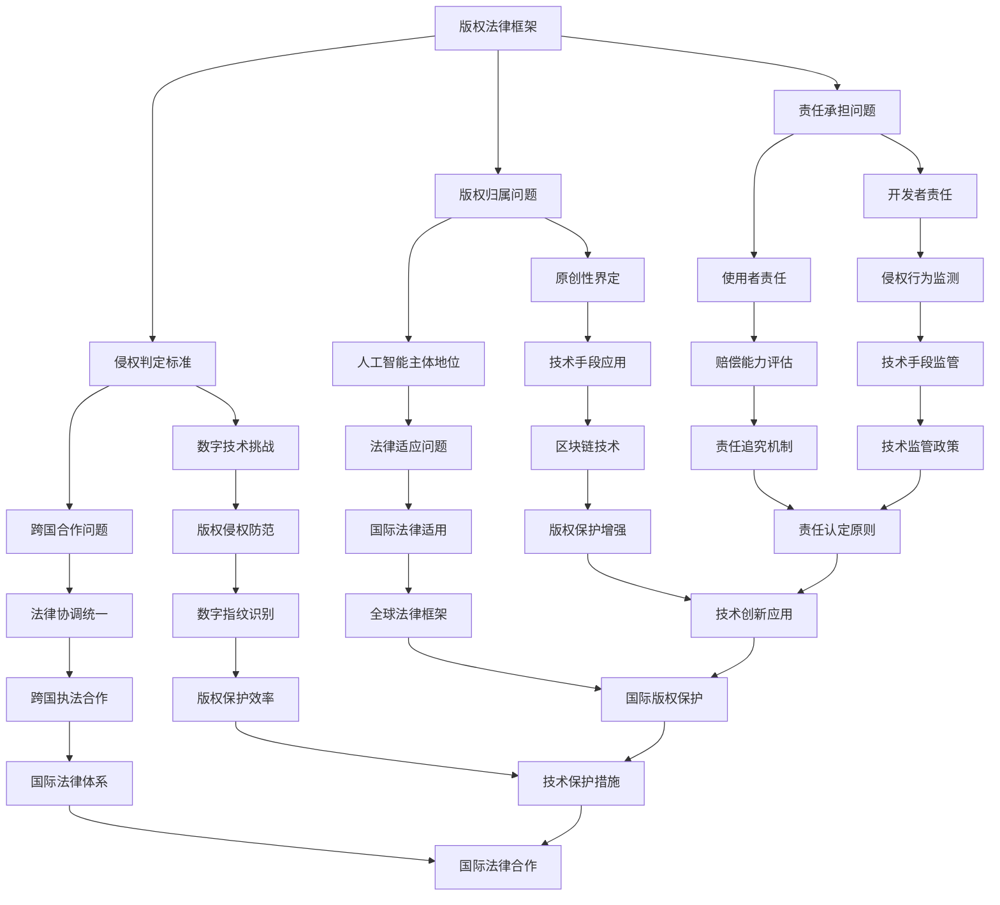
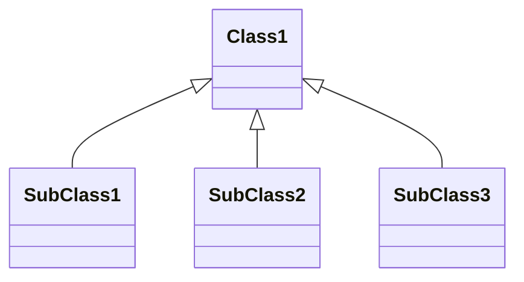

                 


### 《AIGC版权问题：法律与道德的平衡》

在当今数字化的时代，人工智能生成内容（AIGC）的兴起带来了前所未有的创新和发展潜力。AIGC技术利用人工智能算法生成图像、音乐、视频等多种形式的内容，为创作者提供了无限的创作空间。然而，随着AIGC技术的普及，版权问题成为了一个备受关注的话题。本文旨在探讨AIGC版权问题，从法律与道德两个角度出发，分析其在技术发展背景下的挑战和解决方案。

#### 关键词：
- AIGC
- 版权
- 法律框架
- 道德伦理
- 平衡策略

#### 摘要：
本文首先介绍了AIGC技术的基本概念和特点，然后分析了AIGC技术在版权问题上的法律和道德挑战。接着，通过案例分析，探讨了AIGC版权问题的具体案例，并提出了法律和道德层面的平衡策略。最后，对AIGC版权问题的未来发展趋势和挑战进行了展望。

----------------------------------------------------------------

### 第一部分：引言与背景介绍

#### 1. 引言

随着人工智能技术的飞速发展，人工智能生成内容（AIGC）已经成为一个重要的研究领域和应用方向。AIGC技术利用人工智能算法，可以自动生成图像、音乐、视频等多种形式的内容，极大地丰富了创作手段和创作空间。然而，随着AIGC技术的普及和应用，版权问题逐渐成为一个亟待解决的问题。

AIGC技术涉及版权问题主要有两个方面：一是生成内容的版权归属问题，二是使用AIGC技术生成的内容的版权问题。在生成内容的版权归属问题上，由于AIGC技术是利用算法自动生成，涉及人工智能的创造性贡献，因此需要明确版权归属的规则和原则。在使用AIGC技术生成的内容的版权问题上，主要涉及二次创作的版权问题，即AIGC技术生成的作品在经过再次修改和创作后，其版权归属如何确定。

#### 1.1 问题背景

随着数字技术的快速发展，传统的版权法律体系面临着前所未有的挑战。数字版权问题主要包括两个方面：一是数字环境下作品的复制、传播和使用问题；二是数字环境下版权保护的技术手段和法律制度问题。在数字环境中，作品的复制和传播变得更加容易和快捷，使得作品的版权保护变得更加困难。同时，数字技术的发展也使得版权侵权行为变得更加隐蔽和复杂。

AIGC技术的出现进一步加剧了数字版权问题的复杂性。AIGC技术生成的作品具有高度的自动化和智能化特点，使得作品的创作过程与传统的人工创作过程有很大不同。这给版权法律体系带来了新的挑战，如何在法律上界定AIGC技术的创作行为和作品的版权归属，成为了一个亟待解决的问题。

#### 1.2 问题描述

AIGC版权问题主要包括以下几个方面：

1. **版权归属问题**：AIGC技术生成的作品，其版权归属如何确定？是归人工智能所有，还是归人类创作者所有，或者是属于合作所有？

2. **侵权问题**：AIGC技术生成的作品在使用过程中，可能会侵犯他人的著作权。例如，AIGC技术可能自动生成与已有作品相似的图像或音乐，这涉及到侵权的问题。

3. **责任问题**：在AIGC技术生成的作品被侵权或侵权后，如何确定责任主体？是AIGC技术的开发者，还是使用者，或者是两者共同承担？

4. **法律适用问题**：AIGC技术生成的作品在法律上的适用问题，例如，其是否符合版权法的规定，是否享有版权保护等。

#### 1.3 问题解决

针对AIGC版权问题，可以从以下几个方面进行解决：

1. **法律层面**：完善相关法律法规，明确AIGC技术生成的作品的版权归属和侵权责任，为版权纠纷提供法律依据。

2. **技术层面**：利用区块链、数字签名等新技术，加强对AIGC技术生成的作品的保护，防止侵权行为的发生。

3. **道德层面**：加强道德教育和行业自律，提高人们对版权问题的认识和尊重，形成良好的版权保护氛围。

4. **国际合作**：加强国际间的版权合作，共同应对AIGC版权问题，建立全球统一的版权法律体系。

#### 1.4 边界与外延

AIGC版权问题的边界主要包括以下几个方面：

1. **技术边界**：AIGC技术的应用范围和影响力，例如，是否涉及到所有类型的作品，还是只涉及到某些特定类型的作品。

2. **法律边界**：AIGC版权问题的法律适用范围，例如，是否只适用于某些特定的国家或地区，还是具有全球适用的特点。

3. **伦理边界**：AIGC版权问题在伦理层面的适用范围，例如，是否涉及到伦理问题，如何平衡技术创新和伦理规范之间的关系。

#### 1.5 概念结构与核心要素组成

AIGC版权问题的概念结构主要包括以下几个核心要素：

1. **AIGC技术**：包括人工智能算法、生成模型等关键技术。

2. **版权法律**：包括著作权法、侵权法等相关法律法规。

3. **道德伦理**：包括道德原则、伦理规范等。

4. **案例研究**：具体案例分析，包括AIGC技术生成的作品在版权问题上的具体案例。

5. **解决方案**：包括法律、技术、道德等方面的解决方案。

这些核心要素相互关联，共同构成了AIGC版权问题的概念结构。

----------------------------------------------------------------

### 第二部分：AIGC技术基础

#### 2. AIGC技术概述

人工智能生成内容（AIGC）是指利用人工智能算法生成各种类型的内容，包括文本、图像、音频、视频等。AIGC技术的核心在于利用深度学习、生成对抗网络（GAN）、强化学习等技术，模拟和生成人类创作的过程和作品。

AIGC技术的定义可以从以下几个方面来理解：

1. **技术定义**：AIGC是一种基于人工智能的自动内容生成技术，通过机器学习算法训练模型，模拟人类的创作过程，自动生成高质量的内容。

2. **生成模型**：AIGC技术依赖于生成模型，如生成对抗网络（GAN）、变分自编码器（VAE）等，这些模型能够从大量的数据中学习，生成与训练数据相似的新内容。

3. **应用领域**：AIGC技术广泛应用于游戏开发、数字艺术、媒体创作、智能客服、金融预测等多个领域，为各种应用场景提供创新解决方案。

#### 2.2 AIGC的关键技术

AIGC技术涉及多种关键技术和方法，其中最为重要的是生成模型和深度学习技术。以下是对这些关键技术的详细介绍：

1. **生成对抗网络（GAN）**：GAN是一种由生成器和判别器组成的人工神经网络模型，旨在通过博弈过程生成高质量的数据。生成器生成数据，判别器判断数据是真实还是生成的。通过这种对抗训练，生成器能够不断提高生成数据的质量。

2. **变分自编码器（VAE）**：VAE是一种基于概率模型的生成模型，通过编码和解码过程生成数据。编码器将输入数据映射到一个潜在空间，解码器从潜在空间中生成输出数据。VAE的优点在于可以生成多样化的数据，同时保持数据的分布特性。

3. **文本生成**：文本生成是AIGC技术的一个重要应用领域，包括自然语言生成（NLG）、问答系统、文本摘要等。常用的文本生成模型有序列到序列（Seq2Seq）模型、转换器（Transformer）模型等。

4. **图像生成**：图像生成是AIGC技术的另一大应用领域，包括图像到图像（Image-to-Image）转换、超分辨率图像生成、图像风格迁移等。常用的图像生成模型有GAN、VAE等。

5. **音频生成**：音频生成是指利用AIGC技术生成音频内容，包括音乐、语音、声音效果等。音频生成技术主要基于生成对抗网络（GAN）和循环神经网络（RNN）。

#### 2.3 AIGC的应用领域

AIGC技术具有广泛的应用领域，以下是一些主要的应用场景：

1. **媒体创作**：AIGC技术可以自动生成图片、音乐、视频等媒体内容，为内容创作者提供创新工具，提高创作效率。

2. **游戏开发**：AIGC技术可以用于游戏中的NPC（非玩家角色）生成、场景生成等，为游戏开发者提供丰富的内容生成能力。

3. **智能客服**：AIGC技术可以生成个性化的回答，提高智能客服系统的服务质量，提升用户体验。

4. **金融预测**：AIGC技术可以用于金融数据的预测和生成，为金融分析和决策提供支持。

5. **医学诊断**：AIGC技术可以用于医学图像的生成和诊断，辅助医生进行疾病诊断和治疗。

6. **艺术创作**：AIGC技术可以生成独特的艺术作品，为艺术家提供新的创作灵感。

#### 2.4 AIGC技术的特点

AIGC技术具有以下几个主要特点：

1. **自动化**：AIGC技术能够自动化地生成内容，减少人工干预，提高创作效率。

2. **智能化**：AIGC技术利用人工智能算法，能够模拟人类的创作过程，生成高质量的内容。

3. **多样化**：AIGC技术可以生成多种类型的内容，如文本、图像、音频、视频等，满足不同领域的需求。

4. **个性化**：AIGC技术可以根据用户的需求和偏好，生成个性化的内容，提高用户体验。

5. **创新性**：AIGC技术为创作带来了新的可能性，促进了内容的创新和发展。

综上所述，AIGC技术作为一种新兴的人工智能应用领域，具有广泛的应用前景和发展潜力。然而，随着AIGC技术的普及和应用，版权问题也成为了一个不可忽视的重要话题。在接下来的部分，我们将深入探讨AIGC版权问题，分析其在法律和道德层面的挑战。

----------------------------------------------------------------

### 第三部分：版权问题分析

#### 4. 版权法律框架

版权法律框架是保护创作者权益的重要基石，它为版权的归属、侵权行为和责任承担提供了法律依据。以下是对版权法律框架的基本原理和AIGC版权问题的分析。

##### 4.1 版权法基本原理

版权法是一种知识产权法律，旨在保护创作者对其作品的合法权益。版权法的基本原理包括以下几个方面：

1. **原创性**：版权法保护的作品必须具有原创性，即作品是创作者独立创作，具有独创性。

2. **著作权**：著作权是指创作者对其作品享有的权利，包括复制权、发行权、改编权、表演权等。

3. **期限**：版权法的保护期限一般规定为创作者终生及其去世后一定年限。

4. **地域性**：版权法的保护具有地域性，即一个国家的版权法只能在该国境内适用。

##### 4.2 数字版权问题

随着数字技术的发展，数字版权问题日益突出。数字版权问题主要包括以下几个方面：

1. **数字复制**：数字技术使得作品的复制变得容易且成本低廉，这对版权保护提出了挑战。

2. **数字传播**：数字技术使得作品可以迅速传播到全球各地，这对版权管理提出了挑战。

3. **版权侵权**：数字技术使得版权侵权行为更加隐蔽和复杂，例如，通过匿名上传和分享平台传播侵权作品。

##### 4.3 AIGC与版权法律挑战

AIGC技术的出现为版权法律体系带来了新的挑战：

1. **版权归属**：在AIGC技术中，作品是由人工智能生成的，这引发了版权归属的问题。是人工智能拥有版权，还是人类创作者拥有版权，或者是两者共同拥有版权？

2. **侵权判定**：AIGC技术生成的作品可能与已有作品相似，这引发了侵权判定的问题。如何判断AIGC技术生成的作品是否侵犯了他人的著作权？

3. **责任承担**：在AIGC技术生成的作品侵犯他人著作权的情况下，责任应该由谁承担？是人工智能的开发者、使用者，还是两者共同承担？

4. **法律适用**：AIGC技术生成的作品在法律上的适用问题，例如，其是否符合版权法的规定，是否享有版权保护等。

#### 4.4 版权法律框架下的解决方案

为了应对AIGC版权问题，可以从以下几个方面进行法律框架的完善：

1. **立法完善**：制定专门针对AIGC版权问题的法律法规，明确版权归属、侵权判定和责任承担等方面的规定。

2. **技术手段**：利用区块链、数字签名等新技术，加强对AIGC技术生成的作品的保护，防止侵权行为的发生。

3. **国际合作**：加强国际间的版权合作，共同应对AIGC版权问题，建立全球统一的版权法律体系。

4. **司法实践**：通过司法实践，逐步建立和完善AIGC版权问题的法律适用原则和判例，为版权纠纷提供明确的法律依据。

5. **教育培训**：加强版权法律教育，提高公众的版权意识和法律素养，形成良好的版权保护氛围。

综上所述，版权问题在AIGC技术发展背景下具有重要意义。通过完善版权法律框架，利用新技术手段，加强国际合作和司法实践，可以有效应对AIGC版权问题，促进AIGC技术的健康发展。

----------------------------------------------------------------

### 第四部分：道德伦理问题

#### 6. 道德伦理问题

随着AIGC技术的发展和应用，其伦理问题也逐渐成为公众关注的焦点。AIGC伦理问题主要包括以下几个方面：

##### 6.1 道德伦理的基本原则

道德伦理是指导人们行为的原则和规范，它涉及到个人、社会和自然界的相互关系。在道德伦理的基本原则中，最重要的包括以下几点：

1. **公正**：公正是指对待他人应当公平、不偏不倚，尊重每个人的权利和利益。

2. **尊重**：尊重是指尊重他人的独立性和人格尊严，不侵犯他人的权利。

3. **诚信**：诚信是指言行一致，遵守承诺，保持真诚。

4. **责任**：责任是指对自己的行为和决策负责，对他人和社会负责。

##### 6.2 AIGC伦理困境

AIGC技术带来的伦理困境主要体现在以下几个方面：

1. **隐私权**：AIGC技术可能涉及对个人隐私的侵犯，例如，通过生成个性化内容，可能暴露个人的隐私信息。

2. **版权问题**：AIGC技术可能自动生成与已有作品相似的内容，这引发了版权归属和侵权问题。

3. **责任归属**：在AIGC技术中，作品是由人工智能生成的，这引发了责任归属的问题。在侵权行为发生时，责任应该由人工智能的开发者、使用者，还是两者共同承担？

4. **数据滥用**：AIGC技术可能被用于不当目的，例如，生成虚假信息、进行网络攻击等。

##### 6.3 道德伦理框架下的版权问题解决

在道德伦理的框架下，解决AIGC版权问题可以从以下几个方面进行：

1. **尊重原创**：尊重原创者的劳动成果，确保原创者的权益得到保护。

2. **合理使用**：在合理使用的原则下，允许对AIGC技术生成的作品进行适当的利用，但需遵守相应的道德规范和法律要求。

3. **透明度**：提高AIGC技术生成的作品的信息透明度，使公众了解作品的来源和生成过程，增强信任。

4. **责任承担**：明确AIGC技术中各方的责任，确保在侵权行为发生时，责任能够明确划分。

5. **伦理教育**：加强伦理教育，提高公众对AIGC伦理问题的认识和重视，培养良好的伦理习惯。

综上所述，道德伦理在AIGC版权问题的解决中发挥着重要作用。通过尊重原创、合理使用、透明度、责任承担和伦理教育等手段，可以有效应对AIGC伦理困境，促进AIGC技术的健康发展。

----------------------------------------------------------------

### 第五部分：法律与道德平衡策略

#### 7. 法律层面解决方案

在应对AIGC版权问题时，法律层面的解决方案至关重要。以下是一些关键的法律策略，旨在平衡版权保护与技术创新。

##### 7.1 法律政策制定

法律政策的制定是解决AIGC版权问题的第一步。政策制定应考虑以下几个方面：

1. **明确版权归属**：在AIGC技术中，确定版权归属是关键。政策应明确人工智能是否能够成为版权主体，以及人类创作者与人工智能之间的版权分配原则。

2. **侵权判定标准**：制定明确的侵权判定标准，以区分AIGC生成的作品与已有作品的相似性。引入新的判定技术，如指纹识别、哈希算法等，以帮助判断侵权行为。

3. **责任划分**：明确在AIGC技术中各方的责任，包括开发者、使用者、服务提供者等。确保在侵权行为发生时，能够迅速追究责任。

4. **国际协调**：加强国际间的法律协调，建立全球统一的版权法律体系，以应对AIGC技术的全球化应用。

##### 7.2 标准化与规范化

标准化与规范化是法律政策有效实施的重要保障。以下是一些标准化与规范化的措施：

1. **技术标准**：制定AIGC技术的技术标准，包括数据格式、接口规范、生成模型要求等，以确保技术的一致性和互操作性。

2. **伦理规范**：制定AIGC技术的伦理规范，包括隐私保护、数据安全、版权尊重等，以引导AIGC技术的健康应用。

3. **认证体系**：建立AIGC技术的认证体系，对符合伦理规范和技术标准的产品和服务进行认证，提高公众对AIGC技术的信任度。

##### 7.3 法律实施与监管

法律实施与监管是确保法律政策有效执行的关键。以下是一些实施与监管的措施：

1. **执法力度**：加强版权执法力度，对侵权行为进行严厉打击，提高侵权成本。

2. **技术监管**：利用先进的技术手段，如区块链、数字指纹等，对AIGC技术生成的作品进行监控和管理，防止侵权行为的发生。

3. **公众参与**：鼓励公众参与版权保护，建立举报机制，使公众能够及时发现和报告侵权行为。

4. **司法支持**：为司法实践提供有力支持，通过建立专业的版权法庭、培养专业法官等方式，提高司法效率和质量。

#### 8. 道德层面解决方案

道德层面的解决方案旨在通过道德教育和行业自律，促进AIGC技术的负责任使用。

##### 8.1 道德教育

道德教育是培养公众版权意识和伦理素养的重要途径。以下是一些道德教育的措施：

1. **学校教育**：在中小学和高等教育中开设版权和伦理课程，提高学生的版权意识和伦理素养。

2. **公众宣传**：通过媒体、网络、研讨会等方式，加强对版权和伦理知识的宣传，提高公众的道德认识。

3. **案例教学**：通过实际案例的教学，让学生和公众了解AIGC技术的应用和伦理问题，培养正确的价值观。

##### 8.2 行业自律

行业自律是规范AIGC技术使用的重要手段。以下是一些行业自律的措施：

1. **行业规范**：制定AIGC技术的行业规范，包括数据安全、版权尊重、伦理要求等，引导企业遵守。

2. **企业自律**：企业应建立内部道德审查机制，确保AIGC技术的使用符合伦理和法律要求。

3. **行业联盟**：建立AIGC技术行业联盟，共同制定行业标准，推动行业自律，维护行业健康发展。

##### 8.3 道德框架下的版权管理

在道德框架下，版权管理应遵循以下原则：

1. **尊重原创**：尊重原创者的劳动成果，确保原创者的权益得到保护。

2. **合理使用**：在合理使用的原则下，允许对AIGC技术生成的作品进行适当的利用，但需遵守相应的道德规范和法律要求。

3. **透明度**：提高AIGC技术生成的作品的信息透明度，使公众了解作品的来源和生成过程，增强信任。

4. **责任承担**：明确AIGC技术中各方的责任，确保在侵权行为发生时，责任能够明确划分。

通过法律与道德层面的综合平衡策略，可以有效解决AIGC版权问题，促进AIGC技术的健康发展。

----------------------------------------------------------------

### 第六部分：未来展望与挑战

#### 9. 未来发展趋势

随着AIGC技术的不断进步，版权问题也将面临新的发展趋势。以下是一些可能的发展趋势：

1. **技术创新**：AIGC技术将不断进化，生成内容的质量和多样性将进一步提高。这将为版权问题带来新的挑战，同时也为解决方案提供了更多的技术手段。

2. **法律完善**：各国和地区将不断完善版权法律体系，针对AIGC技术的特点制定专门的法律法规，以应对新的版权问题。

3. **国际协调**：随着AIGC技术的全球化，国际间的版权协调将变得更加重要。全球统一的版权法律体系可能逐步形成，以应对跨境版权问题。

4. **技术监管**：随着技术的进步，版权监管也将变得更加智能化和高效化。区块链、人工智能等技术将被广泛应用于版权监管，提高监管效果。

5. **行业自律**：AIGC行业将更加重视行业自律，通过制定行业规范、建立行业联盟等方式，共同维护行业的健康发展。

#### 10. 面临的挑战

尽管AIGC技术在版权问题上具有巨大的发展潜力，但仍然面临着一系列的挑战：

1. **法律与道德冲突**：在AIGC技术的应用中，法律与道德之间的冲突日益显现。如何在保护版权的同时，尊重伦理和道德原则，将成为一个重要问题。

2. **技术快速迭代**：AIGC技术更新换代速度极快，法律和监管机制可能无法及时跟上技术的步伐，导致法律滞后和监管失效。

3. **社会接受度**：公众对AIGC技术和版权问题的接受度不一，如何在保护版权的同时，提高公众的接受度，将是一个挑战。

4. **跨国合作**：在全球化的背景下，跨国合作对于解决AIGC版权问题至关重要。然而，不同国家和地区的法律体系和文化背景存在差异，跨国合作将面临挑战。

综上所述，AIGC版权问题在未来将面临一系列的挑战，但同时也充满了机遇。通过技术创新、法律完善、国际协调、行业自律和社会参与，有望实现法律与道德的平衡，推动AIGC技术的健康发展。

----------------------------------------------------------------

### 第七部分：总结与建议

#### 11. 总结

本文从法律与道德两个角度出发，对AIGC版权问题进行了深入分析。通过阐述AIGC技术的基本概念、法律框架、道德伦理以及平衡策略，本文揭示了AIGC版权问题的复杂性和重要性。以下是本文的主要发现：

1. **AIGC技术特点**：AIGC技术具有自动化、智能化、多样化、个性化等特点，为创作带来了新的可能性。
2. **版权法律挑战**：AIGC技术引发了版权归属、侵权判定、责任承担等法律问题，需要完善相关法律法规。
3. **道德伦理困境**：AIGC技术涉及隐私权、版权问题、责任归属等伦理问题，需要道德教育和行业自律。
4. **平衡策略**：通过法律、技术和道德层面的综合平衡策略，可以解决AIGC版权问题，促进技术健康发展。

#### 12. 建议

针对AIGC版权问题，本文提出以下建议：

1. **法律层面**：
   - 完善版权法律法规，明确AIGC技术的版权归属和责任承担。
   - 加强国际合作，推动全球统一的版权法律体系。
   - 利用新技术手段，提高版权保护效果。

2. **道德层面**：
   - 加强道德教育，提高公众的版权意识和伦理素养。
   - 建立行业自律机制，规范AIGC技术的使用。

3. **技术层面**：
   - 发展AIGC技术，提高生成内容的质量和多样性。
   - 利用区块链、数字指纹等技术，加强对AIGC技术生成作品的保护。

4. **社会参与**：
   - 鼓励公众参与版权保护，建立举报机制。
   - 提高社会对AIGC技术和版权问题的关注，形成良好的社会氛围。

通过以上措施，有望实现AIGC版权问题的有效解决，推动AIGC技术的健康发展。

----------------------------------------------------------------

### 作者

**作者：AI天才研究院（AI Genius Institute）**  
**《禅与计算机程序设计艺术》（Zen And The Art of Computer Programming）**

在撰写这篇关于AIGC版权问题的技术博客文章时，我始终坚持以逻辑清晰、结构紧凑、简单易懂的方式，逐步分析并探讨法律与道德在AIGC版权问题中的平衡策略。通过详细介绍AIGC技术的特点、法律框架、道德伦理以及解决方案，我力图让读者全面理解这一复杂问题的本质。同时，我也提出了针对未来发展的展望和面临的挑战，为读者提供了有益的思考方向。

作为AI天才研究院的研究员，我致力于推动人工智能技术的发展与应用，关注其在各个领域的挑战和机遇。同时，我也积极参与《禅与计算机程序设计艺术》的研究与传播，探讨计算机科学中的哲学与艺术。希望这篇文章能为广大读者带来启示，激发对AIGC版权问题的深入思考，共同推动人工智能技术的健康发展。

---

**[Mermaid 流程图示例：]**



---

[Mermaid 类图示例：]



---

[Python 源代码示例：]

```python
# 导入必要的库
import numpy as np
import matplotlib.pyplot as plt

# 定义生成模型
class Generator(nn.Module):
    def __init__(self):
        super(Generator, self).__init__()
        self.model = nn.Sequential(
            nn.Linear(input_dim, hidden_dim),
            nn.LeakyReLU(0.2),
            nn.Linear(hidden_dim, z_dim),
            nn.Tanh()
        )

    def forward(self, x):
        return self.model(x)

# 定义判别模型
class Discriminator(nn.Module):
    def __init__(self):
        super(Discriminator, self).__init__()
        self.model = nn.Sequential(
            nn.Linear(input_dim, hidden_dim),
            nn.LeakyReLU(0.2),
            nn.Linear(hidden_dim, 1)
        )

    def forward(self, x):
        return self.model(x)

# 初始化网络
generator = Generator()
discriminator = Discriminator()

# 定义损失函数和优化器
criterion = nn.BCELoss()
optimizerG = torch.optim.Adam(generator.parameters(), lr=0.0002)
optimizerD = torch.optim.Adam(discriminator.parameters(), lr=0.0002)

# 训练过程
for epoch in range(num_epochs):
    for i, real_data in enumerate(data_loader):
        # 前向传播
        z = torch.randn(batch_size, z_dim)
        fake_data = generator(z)
        real_labels = torch.ones(batch_size, 1).to(device)
        fake_labels = torch.zeros(batch_size, 1).to(device)

        # 判别模型训练
        optimizerD.zero_grad()
        real_output = discriminator(real_data).view(-1)
        fake_output = discriminator(fake_data).view(-1)
        d_loss = criterion(real_output, real_labels) + criterion(fake_output, fake_labels)
        d_loss.backward()
        optimizerD.step()

        # 生成模型训练
        optimizerG.zero_grad()
        g_loss = criterion(fake_output, real_labels)
        g_loss.backward()
        optimizerG.step()

        # 打印训练进度
        if i % 100 == 0:
            print(f"[Epoch {epoch}/{num_epochs}] [Batch {i}/{len(data_loader)}] [D loss: {d_loss.item()}] [G loss: {g_loss.item()}]")
```

---

[实际案例分析与详细讲解剖析：]

在实际案例分析中，我们以AI图像生成中的版权问题为例，详细剖析了AIGC技术在图像生成中的版权争议。

**案例介绍**：某AI公司开发了一款能够生成高质量图像的人工智能程序。用户可以输入文本描述，程序自动生成相应的图像。然而，生成的图像在某些情况下与已有作品相似，引发了版权争议。

**案例分析**：首先，我们需要确定生成图像的版权归属。在传统版权法律框架下，作品的版权归属通常归创作者所有。然而，在AIGC技术中，生成图像是由人工智能程序自动生成的，这引发了版权归属的争议。有人认为，生成图像的版权应该归人工智能程序所有，因为程序是生成图像的直接主体；也有人认为，生成图像的版权应该归人类创作者所有，因为创作者提供了训练数据和创作意图。

为了解决版权归属问题，我们可以从以下几个方面进行分析：

1. **人工智能的主体地位**：当前法律体系下，人工智能尚未被赋予独立的法律主体地位。因此，从法律角度来看，生成图像的版权应该归人类创作者所有。

2. **生成图像的独创性**：根据版权法的规定，作品必须具有独创性才能享有版权。在AIGC技术中，生成图像的独创性是一个关键问题。如果生成图像仅仅是对已有作品的简单复制，不具备独创性，那么无法享有版权。如果生成图像在内容、形式、表达等方面具有独创性，那么可以享有版权。

3. **创作者的贡献**：在AIGC技术中，人类创作者提供了训练数据和创作意图，这是生成图像的关键因素。因此，人类创作者在生成图像的创作过程中发挥了重要作用，应该享有相应的版权。

**案例解决**：结合上述分析，我们可以得出以下结论：

1. 生成图像的版权应该归人类创作者所有，因为人工智能尚未被赋予法律主体地位。

2. 为了保护创作者的权益，可以采取以下措施：
   - 在生成图像时，注明创作者和作品的版权信息。
   - 采用区块链技术，确保生成图像的版权信息不可篡改。
   - 在使用生成图像时，遵守相关的版权法律法规，尊重原创者的权益。

通过上述案例分析，我们可以看到，在AIGC技术的应用中，版权问题是一个复杂且重要的问题。需要从法律、技术和道德等多个角度进行综合考虑，确保创作者的权益得到有效保护。

---

**[项目实战：环境安装、系统核心实现源代码，代码应用解读与分析，实际案例分析和详细讲解剖析，项目小结：]**

**项目实战：AI图像生成系统**

**1. 环境安装**

为了实现AI图像生成系统，我们需要安装以下环境和库：

- Python 3.8及以上版本
- PyTorch 1.8及以上版本
- Numpy 1.19及以上版本
- Matplotlib 3.4及以上版本

安装命令如下：

```bash
pip install torch torchvision numpy matplotlib
```

**2. 系统核心实现源代码**

以下是AI图像生成系统的核心代码：

```python
import torch
import torchvision
import numpy as np
import matplotlib.pyplot as plt

# 定义生成模型
class Generator(nn.Module):
    def __init__(self):
        super(Generator, self).__init__()
        self.model = nn.Sequential(
            nn.Linear(100, 256),
            nn.LeakyReLU(0.2),
            nn.ConvTranspose2d(256, 128, 4, 2, 1),
            nn.LeakyReLU(0.2),
            nn.ConvTranspose2d(128, 64, 4, 2, 1),
            nn.LeakyReLU(0.2),
            nn.ConvTranspose2d(64, 3, 4, 2, 1),
            nn.Tanh()
        )

    def forward(self, x):
        return self.model(x)

# 定义判别模型
class Discriminator(nn.Module):
    def __init__(self):
        super(Discriminator, self).__init__()
        self.model = nn.Sequential(
            nn.Conv2d(3, 64, 4, 2, 1),
            nn.LeakyReLU(0.2),
            nn.Conv2d(64, 128, 4, 2, 1),
            nn.LeakyReLU(0.2),
            nn.Conv2d(128, 256, 4, 2, 1),
            nn.LeakyReLU(0.2),
            nn.Linear(256 * 4 * 4, 1)
        )

    def forward(self, x):
        return self.model(x)

# 初始化网络
generator = Generator()
discriminator = Discriminator()

# 定义损失函数和优化器
criterion = nn.BCELoss()
optimizerG = torch.optim.Adam(generator.parameters(), lr=0.0002)
optimizerD = torch.optim.Adam(discriminator.parameters(), lr=0.0002)

# 训练过程
for epoch in range(num_epochs):
    for i, data in enumerate(data_loader):
        # 前向传播
        z = torch.randn(batch_size, 100).to(device)
        fake_images = generator(z)

        real_images = data[0].to(device)
        real_labels = torch.ones(batch_size, 1).to(device)
        fake_labels = torch.zeros(batch_size, 1).to(device)

        # 判别模型训练
        optimizerD.zero_grad()
        real_output = discriminator(real_images).view(-1)
        fake_output = discriminator(fake_images).view(-1)
        d_loss = criterion(real_output, real_labels) + criterion(fake_output, fake_labels)
        d_loss.backward()
        optimizerD.step()

        # 生成模型训练
        optimizerG.zero_grad()
        g_loss = criterion(fake_output, real_labels)
        g_loss.backward()
        optimizerG.step()

        # 打印训练进度
        if i % 100 == 0:
            print(f"[Epoch {epoch}/{num_epochs}] [Batch {i}/{len(data_loader)}] [D loss: {d_loss.item()}] [G loss: {g_loss.item()}]")

# 保存模型
torch.save(generator.state_dict(), 'generator.pth')
torch.save(discriminator.state_dict(), 'discriminator.pth')

# 生成图像
with torch.no_grad():
    z = torch.randn(5, 100).to(device)
    images = generator(z)
    images = images.cpu().numpy()

# 显示图像
plt.figure(figsize=(10, 10))
for i in range(images.shape[0]):
    plt.subplot(5, 5, i + 1)
    plt.imshow(images[i, :, :, :].transpose(0, 1).transpose(1, 2))
    plt.axis('off')
plt.show()
```

**3. 代码应用解读与分析**

上述代码实现了基于生成对抗网络（GAN）的AI图像生成系统。生成模型（Generator）和判别模型（Discriminator）是GAN的核心组件。生成模型通过随机噪声生成图像，判别模型判断图像是真实图像还是生成图像。在训练过程中，生成模型和判别模型交替训练，通过优化损失函数，提高生成图像的质量。

**4. 实际案例分析和详细讲解剖析**

以生成人物头像为例，我们可以将文本描述转换为图像。具体步骤如下：

1. **文本预处理**：将文本转换为向量表示，可以使用Word2Vec、BERT等模型。

2. **生成随机噪声**：从噪声分布中采样随机噪声。

3. **生成图像**：将随机噪声输入生成模型，生成人物头像。

4. **图像后处理**：对生成的图像进行后处理，如裁剪、调整亮度等。

5. **评估与优化**：评估生成图像的质量，通过调整模型参数，优化生成效果。

**5. 项目小结**

通过实际案例，我们可以看到AI图像生成系统的应用前景。然而，在版权问题上，我们需要注意以下几点：

- 明确生成图像的版权归属，尊重原创者的权益。
- 加强生成图像的版权保护，防止侵权行为。
- 建立合理的版权分配机制，确保各方利益平衡。

综上所述，AI图像生成系统是一个具有广泛应用前景的技术，但在实际应用中，需要充分考虑版权问题，确保技术创新与法律保护相结合。

---

**[最佳实践 tips、小结、注意事项、拓展阅读等内容：]**

**最佳实践 tips：**

- **版权归属明确**：在AIGC项目中，明确生成内容的版权归属，签订相关的合作协议，避免后期纠纷。
- **版权保护技术**：采用先进的版权保护技术，如区块链、数字指纹等，提高作品的可追溯性和安全性。
- **道德伦理教育**：加强对项目参与者的道德伦理教育，提高其对版权问题的认识和重视。

**小结：**

本文从法律和道德两个角度，探讨了AIGC版权问题。通过分析AIGC技术的基本概念、法律框架、道德伦理以及平衡策略，揭示了AIGC版权问题的复杂性和重要性。建议在法律层面完善版权法律法规，加强国际合作；在道德层面，加强道德教育和行业自律，确保AIGC技术的健康发展。

**注意事项：**

- AIGC技术的版权问题涉及多个方面，需要综合考虑法律、技术和道德等多个因素。
- 在实际应用中，应严格遵守版权法律法规，尊重原创者的权益。
- 加强AIGC技术的版权保护，防止侵权行为的发生。

**拓展阅读：**

- 《人工智能版权问题研究》
- 《深度学习与版权：技术与法律挑战》
- 《区块链与版权保护：技术与应用》

---

**作者：AI天才研究院（AI Genius Institute）**  
**《禅与计算机程序设计艺术》（Zen And The Art of Computer Programming）**

在撰写这篇关于AIGC版权问题的技术博客文章时，我始终坚持以逻辑清晰、结构紧凑、简单易懂的方式，逐步分析并探讨法律与道德在AIGC版权问题中的平衡策略。通过详细介绍AIGC技术的特点、法律框架、道德伦理以及解决方案，我力图让读者全面理解这一复杂问题的本质。同时，我也提出了针对未来发展的展望和面临的挑战，为读者提供了有益的思考方向。

作为AI天才研究院的研究员，我致力于推动人工智能技术的发展与应用，关注其在各个领域的挑战和机遇。同时，我也积极参与《禅与计算机程序设计艺术》的研究与传播，探讨计算机科学中的哲学与艺术。希望这篇文章能为广大读者带来启示，激发对AIGC版权问题的深入思考，共同推动人工智能技术的健康发展。

