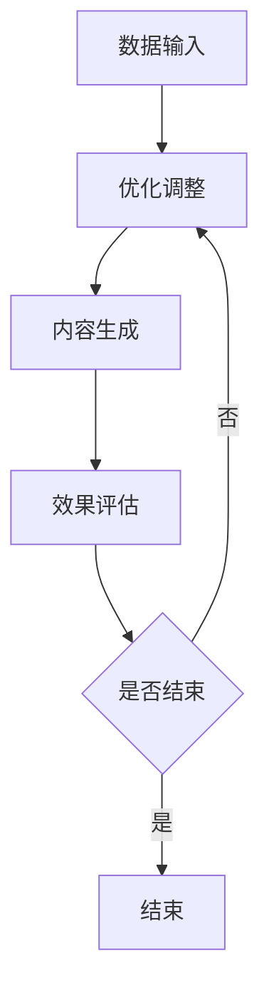
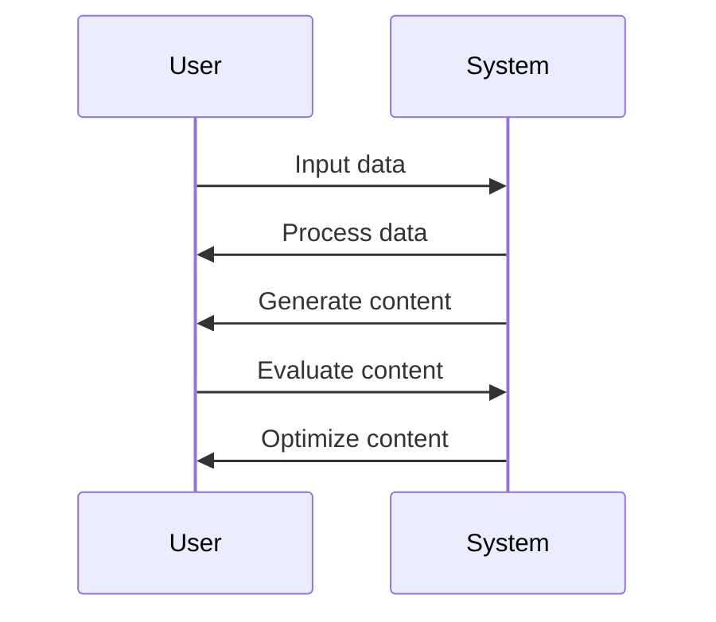

                 

# AIGC的创意广告生成：品牌个性化的提示词工程

> 关键词：AIGC，创意广告，品牌个性化，提示词工程

> 摘要：本文将深入探讨AIGC（自适应智能生成内容）在创意广告生成中的应用，以及如何通过品牌个性化的提示词工程提升广告的吸引力和效果。我们将从AIGC和创意广告的基本概念出发，逐步分析AIGC在创意广告生成中的优势与挑战，并详细介绍品牌个性化的提示词工程在其中的作用。通过具体的算法详解和实践案例分析，读者将全面了解AIGC广告创意生成的技术细节，以及如何利用品牌个性化的提示词工程实现广告的高效定制和传播。

## 第一部分：AIGC的创意广告生成基础

### 第1章：AIGC与创意广告概述

#### 1.1 AIGC的概念与背景

##### 1.1.1 AIGC的起源与发展

AIGC（自适应智能生成内容）是近年来人工智能领域的一个新兴研究方向。其核心思想是利用人工智能技术，尤其是深度学习、自然语言处理和图像生成等技术，自动生成高质量的内容。AIGC的起源可以追溯到2000年代中后期，随着深度学习技术的突破，特别是生成对抗网络（GAN）的出现，AIGC开始逐步得到应用和推广。

AIGC的发展经历了几个关键阶段：

- **早期探索（2006-2011）**：深度学习技术的兴起为AIGC的发展奠定了基础。特别是卷积神经网络（CNN）在图像识别和生成方面的突破，为AIGC的应用提供了可能。
- **快速发展（2012-2017）**：生成对抗网络（GAN）的提出和广泛应用，使得AIGC在图像生成、自然语言生成等领域取得了显著的进展。2014年，GAN首次在图像生成任务中取得了比传统方法更好的效果。
- **成熟应用（2018-至今）**：随着计算能力的提升和算法的优化，AIGC在各个领域的应用越来越广泛，包括但不限于广告创意生成、虚拟现实内容生成、智能客服对话生成等。

##### 1.1.2 AIGC的核心技术

AIGC的核心技术主要包括自然语言处理（NLP）、深度学习模型、图像处理技术等。以下是这些技术的简要介绍：

- **自然语言处理（NLP）**：NLP是人工智能的一个重要分支，旨在让计算机理解和处理人类语言。在AIGC中，NLP技术被用于生成自然流畅的语言文本，如广告文案、新闻报道等。
- **深度学习模型**：深度学习是AIGC的核心技术之一，通过多层神经网络来模拟人类大脑的学习过程，从而实现图像、音频和文本的生成。常见的深度学习模型包括卷积神经网络（CNN）、循环神经网络（RNN）和生成对抗网络（GAN）等。
- **图像处理技术**：图像处理技术在AIGC中主要用于图像的生成和编辑。通过图像处理技术，AIGC可以生成高质量的图像，如图像合成、图像风格迁移等。

#### 1.2 创意广告的概念与特征

##### 1.2.1 创意广告的定义

创意广告是指通过独特的创意设计和传播策略，吸引目标受众注意，提高品牌认知度和销售量的广告。与传统的广告相比，创意广告更注重内容的创新性和吸引力，以实现更好的营销效果。

##### 1.2.2 创意广告与传统广告的区别

- **内容形式**：传统广告通常以图文、视频等形式出现，而创意广告则更多地利用互动、故事化、场景化等手段，以吸引受众的关注。
- **传播策略**：传统广告主要依靠媒体投放，而创意广告则更多地依赖于社交媒体、短视频平台等新兴渠道，以实现更广泛的传播和互动。
- **目标受众**：传统广告的目标受众相对固定，而创意广告则更注重精准营销，通过数据分析和用户画像，实现更精准的目标受众定位。

##### 1.2.3 创意广告的关键要素

创意广告的成功离不开以下几个关键要素：

- **创意设计**：独特的创意设计是创意广告的核心。通过创意的设计，广告可以更好地吸引目标受众的注意，提高品牌的记忆度。
- **传播渠道**：选择合适的传播渠道是实现广告效果的关键。新兴的社交媒体、短视频平台等渠道为创意广告的传播提供了更多可能性。
- **用户互动**：互动性是创意广告的一个重要特征。通过用户互动，广告可以更好地了解用户需求，提高用户参与度和忠诚度。

#### 1.3 AIGC在创意广告生成中的应用

##### 1.3.1 AIGC在广告创意生成中的优势

AIGC在创意广告生成中具有以下几个优势：

- **高效性**：AIGC可以通过自动化生成大量高质量的广告内容，大大提高广告创意的生产效率。
- **多样性**：AIGC可以生成各种类型的广告内容，如图文、视频、音频等，满足不同广告主的需求。
- **个性化**：AIGC可以根据用户画像和兴趣偏好，生成个性化的广告内容，提高广告的投放精准度和效果。

##### 1.3.2 AIGC在创意广告制作中的关键角色

在创意广告制作中，AIGC扮演着以下关键角色：

- **内容生成**：AIGC可以通过自然语言处理和图像生成技术，自动生成广告文案、广告图像等内容，提高广告的生产效率。
- **创意优化**：AIGC可以通过机器学习和数据挖掘技术，分析用户行为和广告效果数据，优化广告的创意设计，提高广告的效果。
- **广告投放**：AIGC可以通过算法优化和大数据分析，实现广告的精准投放，提高广告的投放效果。

#### 1.4 AIGC创意广告生成的挑战与机遇

##### 1.4.1 挑战

尽管AIGC在创意广告生成中具有很多优势，但仍然面临一些挑战：

- **技术难题**：AIGC涉及多种技术的综合应用，如深度学习、自然语言处理、图像生成等，技术实现难度较高。
- **创意限制**：AIGC生成的广告内容仍然受到数据集和算法的限制，难以完全突破创意的边界。
- **安全与伦理问题**：AIGC生成的内容可能涉及版权、隐私等问题，需要制定相应的安全与伦理规范。

##### 1.4.2 机遇

尽管面临挑战，AIGC在创意广告生成中仍然具有很大的机遇：

- **广告行业变革**：随着数字化进程的加速，广告行业正在经历深刻的变革。AIGC的引入为广告创意生成提供了新的思路和方法。
- **市场需求增长**：随着消费者对个性化、多元化广告内容的需求不断增加，AIGC在创意广告生成中的应用前景十分广阔。
- **技术创新与应用拓展**：随着技术的不断进步，AIGC在创意广告生成中的应用将越来越广泛，为广告行业带来更多的创新和变革。

#### 1.5 本章小结

本章对AIGC和创意广告的基本概念进行了介绍，分析了AIGC在创意广告生成中的优势与挑战，并探讨了AIGC在广告创意生成中的关键角色。通过本章的学习，读者可以初步了解AIGC在创意广告生成中的应用前景和关键技术。

----------------------------------------------------------------

## 第二部分：品牌个性化的提示词工程

### 第2章：提示词工程的基本概念

#### 2.1 提示词的定义与作用

##### 2.1.1 提示词的概念

提示词（Prompt）是指引导模型生成内容的关键信息，它通常是一个单词、短语或句子。在广告创意生成中，提示词用于指导AIGC模型生成符合广告主需求和品牌特色的广告内容。

##### 2.1.2 提示词在广告创意生成中的作用

提示词在广告创意生成中起着至关重要的作用，主要体现在以下几个方面：

- **指导内容生成**：提示词可以引导AIGC模型生成符合广告主需求和品牌特色的广告内容，确保广告内容的准确性和一致性。
- **提升创作效率**：通过使用提示词，广告创作者可以快速生成大量广告内容，提高创作效率。
- **实现个性化定制**：提示词可以根据不同用户的需求和兴趣，生成个性化的广告内容，提高广告的吸引力和效果。

#### 2.2 提示词的类型

提示词可以根据不同的分类标准进行分类，以下是几种常见的提示词类型：

- **普通提示词**：普通提示词通常是指简单的单词或短语，用于指导模型生成基本的内容，如广告标题、广告口号等。
- **高级提示词**：高级提示词通常包含更多的信息，如广告背景、目标受众、广告目的等，用于指导模型生成更复杂、更丰富的广告内容。
- **情感提示词**：情感提示词用于引导模型生成具有特定情感色彩的广告内容，如温馨、幽默、严肃等，以更好地吸引目标受众。

#### 2.3 提示词工程的方法与流程

##### 2.3.1 提示词工程的目标

提示词工程的目标是设计一套高效、准确、可扩展的提示词生成系统，以支持广告创意生成的高效化和个性化。

具体目标包括：

- **高效性**：提示词生成系统应能够快速生成大量高质量的提示词，满足广告主的创作需求。
- **准确性**：提示词生成系统应能够准确理解广告主的需求，生成符合广告主意图的提示词。
- **可扩展性**：提示词生成系统应具备良好的可扩展性，能够适应不同的广告主需求和品牌特色。

##### 2.3.2 提示词工程的基本方法

提示词工程的基本方法包括以下几个步骤：

- **需求分析**：首先，需要明确广告主的创作需求和品牌特色，确定需要生成的广告类型和内容。
- **数据收集**：根据需求分析的结果，收集相关的数据，如广告文案、广告图像、用户评论等。
- **提示词生成**：使用自然语言处理、机器学习等技术，根据收集的数据，生成符合广告主需求的提示词。
- **提示词优化**：对生成的提示词进行评估和优化，确保提示词的高质量和实用性。

##### 2.3.3 提示词工程的实施流程

提示词工程的实施流程包括以下几个阶段：

- **需求分析阶段**：明确广告主的创作需求和品牌特色，确定需要生成的广告类型和内容。
- **数据收集阶段**：收集相关的数据，如广告文案、广告图像、用户评论等。
- **提示词生成阶段**：使用自然语言处理、机器学习等技术，根据收集的数据，生成符合广告主需求的提示词。
- **提示词优化阶段**：对生成的提示词进行评估和优化，确保提示词的高质量和实用性。
- **应用反馈阶段**：将优化后的提示词应用于广告创意生成，根据实际效果进行反馈和调整。

#### 2.4 品牌个性化与提示词工程的关系

##### 2.4.1 品牌个性化的定义

品牌个性化是指品牌在广告和营销活动中，通过独特的品牌形象、情感和文化，与目标受众建立深度连接的过程。品牌个性化的核心目标是提高品牌认知度和用户忠诚度。

##### 2.4.2 提示词工程在品牌个性化中的应用

提示词工程在品牌个性化中的应用主要体现在以下几个方面：

- **塑造品牌形象**：通过设计独特的提示词，可以塑造品牌形象，传达品牌的价值和理念。
- **提升情感共鸣**：提示词可以引导模型生成具有情感色彩的广告内容，提高广告与目标受众的情感共鸣。
- **增强品牌认知**：通过个性化的提示词，可以增强品牌在目标受众心中的认知度，提高品牌影响力。

#### 2.5 本章小结

本章对提示词工程的基本概念进行了详细阐述，分析了提示词的类型、提示词工程的目标与方法，以及提示词工程在品牌个性化中的应用。通过本章的学习，读者可以深入理解提示词工程在广告创意生成中的重要作用。

----------------------------------------------------------------

## 第三部分：AIGC广告创意生成算法详解

### 第3章：AIGC广告创意生成算法概述

#### 3.1 AIGC广告创意生成算法的基本原理

AIGC广告创意生成算法是基于人工智能技术，特别是深度学习和自然语言处理（NLP）技术，实现广告创意自动生成的技术。其基本原理可以分为以下几个方面：

1. **数据输入**：AIGC广告创意生成算法首先需要输入与广告相关的数据，如广告主的需求、品牌信息、目标受众特征等。这些数据通常来源于广告主提供的信息、用户行为数据、社交媒体数据等。

2. **特征提取**：通过自然语言处理技术，从输入数据中提取关键特征，如关键词、情感倾向、品牌特色等。这些特征将用于指导广告创意的生成。

3. **内容生成**：使用深度学习模型，如生成对抗网络（GAN）、变分自编码器（VAE）等，根据提取的特征生成广告创意内容，如图像、视频、文字等。

4. **效果评估**：通过评估指标，如广告点击率、转化率等，对生成的广告创意进行效果评估。根据评估结果，对算法进行优化和调整。

#### 3.2 常见的AIGC广告创意生成算法

在AIGC广告创意生成中，常用的算法包括生成对抗网络（GAN）、变分自编码器（VAE）和自编码器（AE）等。以下是这些算法的基本原理和特点：

1. **生成对抗网络（GAN）**

GAN是由两部分组成：生成器（Generator）和判别器（Discriminator）。生成器的目标是生成与真实数据相似的数据，而判别器的目标是区分生成数据与真实数据。通过两个模型的对抗训练，生成器能够不断优化，最终生成高质量的数据。

GAN在广告创意生成中的应用主要包括：

- **图像生成**：生成与广告品牌相关的图像，如图标、海报等。
- **视频生成**：生成广告视频，如产品演示、场景再现等。
- **文字生成**：生成广告文案，如广告标题、广告语等。

2. **变分自编码器（VAE）**

VAE是一种基于概率模型的生成模型，通过编码器和解码器实现数据的生成。编码器将输入数据编码为潜在空间中的向量，解码器则从潜在空间中生成输出数据。

VAE在广告创意生成中的应用主要包括：

- **图像生成**：生成与广告品牌相关的图像，如图标、海报等。
- **视频生成**：生成广告视频，如产品演示、场景再现等。
- **文字生成**：生成广告文案，如广告标题、广告语等。

3. **自编码器（AE）**

AE是一种无监督学习算法，通过编码器和解码器实现数据的压缩和重构。编码器将输入数据压缩为低维特征表示，解码器则从这些特征中重构原始数据。

AE在广告创意生成中的应用主要包括：

- **图像生成**：生成与广告品牌相关的图像，如图标、海报等。
- **视频生成**：生成广告视频，如产品演示、场景再现等。
- **文字生成**：生成广告文案，如广告标题、广告语等。

#### 3.3 AIGC广告创意生成算法的应用场景

AIGC广告创意生成算法可以应用于多种场景，包括：

1. **广告标题生成**：通过AIGC算法，可以自动生成吸引人的广告标题，提高广告的点击率。

2. **广告文案创作**：通过AIGC算法，可以自动生成广告文案，提高广告的吸引力和转化率。

3. **广告视频生成**：通过AIGC算法，可以自动生成广告视频，提高广告的表现力和传播效果。

#### 3.4 AIGC广告创意生成算法的优缺点分析

AIGC广告创意生成算法具有以下优点：

- **高效性**：通过自动化生成广告内容，大大提高了广告创意的生产效率。
- **多样性**：可以生成多种类型的广告内容，如图像、视频、文字等，满足不同广告主的需求。
- **个性化**：可以根据用户画像和兴趣偏好，生成个性化的广告内容，提高广告的吸引力和效果。

AIGC广告创意生成算法也具有以下缺点：

- **技术实现难度高**：AIGC广告创意生成算法涉及多种技术的综合应用，如深度学习、自然语言处理、图像处理等，技术实现难度较高。
- **创意限制**：生成的广告内容仍受到数据集和算法的限制，难以完全突破创意的边界。
- **安全与伦理问题**：生成的广告内容可能涉及版权、隐私等问题，需要制定相应的安全与伦理规范。

#### 3.5 本章小结

本章对AIGC广告创意生成算法的基本原理、常见算法、应用场景以及优缺点进行了详细分析。通过本章的学习，读者可以深入理解AIGC广告创意生成算法的工作原理和应用价值。

----------------------------------------------------------------

## 第四部分：提示词工程在AIGC广告创意生成中的实践

### 第4章：提示词工程在AIGC广告创意生成中的实施步骤

#### 4.1 数据准备

##### 4.1.1 数据来源

在提示词工程中，数据准备是关键的一步。数据来源主要包括以下几个方面：

1. **广告主需求**：从广告主处获取广告创意生成所需的信息，如广告目标、品牌特色、目标受众等。
2. **用户数据**：从用户行为数据中提取关键信息，如浏览历史、购买记录、兴趣偏好等，用于生成个性化广告内容。
3. **外部数据**：从社交媒体、新闻网站等外部数据源中收集与广告主题相关的信息，如热点事件、行业趋势等。

##### 4.1.2 数据预处理

在获取数据后，需要进行预处理，以提高数据质量和可用性。数据预处理的主要任务包括：

1. **数据清洗**：去除数据中的噪声和异常值，如重复数据、缺失值等。
2. **数据整合**：将来自不同来源的数据进行整合，形成一个统一的数据集。
3. **数据标注**：对文本数据进行情感分析、主题分类等标注，以指导后续的提示词生成。

##### 4.1.3 数据集划分

在数据预处理完成后，需要将数据集划分为训练集、验证集和测试集。数据集划分的目的是：

1. **训练集**：用于训练提示词生成模型，学习如何生成高质量的提示词。
2. **验证集**：用于评估模型的性能，选择最优的模型参数。
3. **测试集**：用于最终评估模型的泛化能力，确保模型在实际应用中的效果。

#### 4.2 模型训练

##### 4.2.1 模型选择

在提示词工程中，常用的模型包括生成对抗网络（GAN）、变分自编码器（VAE）和自编码器（AE）等。模型选择取决于广告创意生成的具体需求和数据特征。以下为几种常用模型的选择依据：

1. **生成对抗网络（GAN）**：适用于生成高质量图像和视频，能够生成具有多样性的广告内容。
2. **变分自编码器（VAE）**：适用于生成图像和视频，能够在保持数据质量的同时降低维度。
3. **自编码器（AE）**：适用于图像和文本数据的生成，能够有效压缩和重构数据。

##### 4.2.2 模型训练流程

模型训练流程包括以下几个步骤：

1. **数据预处理**：对输入数据进行标准化、归一化等处理，使其适应模型的输入要求。
2. **模型初始化**：初始化模型的权重，可以使用随机初始化、预训练模型等策略。
3. **前向传播**：将输入数据输入到模型中，计算输出结果。
4. **反向传播**：根据输出结果和实际目标，计算损失函数，更新模型权重。
5. **迭代训练**：重复执行前向传播和反向传播，直到模型收敛或达到预设的训练次数。

##### 4.2.3 模型调优

在模型训练过程中，可能需要对模型进行调优，以提高模型的性能。模型调优的方法包括：

1. **调整超参数**：如学习率、批次大小、正则化参数等，通过实验找到最优的超参数组合。
2. **模型融合**：将多个模型的结果进行融合，提高模型的鲁棒性和泛化能力。
3. **迁移学习**：利用预训练模型，结合广告创意生成任务的特点，进行微调和优化。

#### 4.3 提示词生成

##### 4.3.1 提示词生成策略

提示词生成策略是提示词工程的核心，其目的是根据广告主的需求和用户特征，生成高质量的提示词。以下是几种常用的提示词生成策略：

1. **模板生成**：基于预定义的模板，填充相关的关键词和短语，生成提示词。
2. **基于规则生成**：根据广告主的需求和规则，生成提示词。例如，针对不同的广告目标，使用不同的关键词和短语。
3. **基于数据生成**：通过分析用户行为数据和广告效果数据，生成符合用户兴趣和需求的提示词。

##### 4.3.2 提示词生成流程

提示词生成流程包括以下几个步骤：

1. **输入数据预处理**：对输入数据进行清洗、整合和标注，确保数据的质量和一致性。
2. **特征提取**：从输入数据中提取关键特征，如关键词、情感倾向、品牌特色等。
3. **模型预测**：将提取的特征输入到训练好的提示词生成模型中，生成提示词。
4. **提示词优化**：对生成的提示词进行评估和优化，确保其质量和实用性。

##### 4.3.3 提示词效果评估

提示词效果评估是判断提示词生成效果的重要环节。效果评估的方法包括：

1. **点击率评估**：通过对比使用提示词和未使用提示词的广告点击率，评估提示词的吸引力。
2. **转化率评估**：通过对比使用提示词和未使用提示词的广告转化率，评估提示词的实际效果。
3. **用户满意度评估**：通过用户调查和反馈，评估用户对提示词的满意度和接受度。

#### 4.4 广告创意生成

##### 4.4.1 广告创意生成方法

广告创意生成方法主要包括以下几种：

1. **图像生成**：使用AIGC算法生成与广告品牌相关的图像，如图标、海报等。
2. **视频生成**：使用AIGC算法生成广告视频，如产品演示、场景再现等。
3. **文字生成**：使用AIGC算法生成广告文案，如广告标题、广告语等。

##### 4.4.2 广告创意生成流程

广告创意生成流程包括以下几个步骤：

1. **输入数据准备**：准备用于广告创意生成的数据，如广告主需求、用户特征、品牌信息等。
2. **提示词生成**：根据输入数据生成高质量的提示词，用于指导广告创意的生成。
3. **创意内容生成**：使用AIGC算法根据提示词生成广告创意内容，如图像、视频、文字等。
4. **创意内容优化**：对生成的广告创意内容进行评估和优化，确保其质量和实用性。

##### 4.4.3 广告创意效果评估

广告创意效果评估是判断广告创意效果的重要环节。效果评估的方法包括：

1. **点击率评估**：通过对比使用不同广告创意的广告点击率，评估广告创意的吸引力。
2. **转化率评估**：通过对比使用不同广告创意的广告转化率，评估广告创意的实际效果。
3. **用户满意度评估**：通过用户调查和反馈，评估用户对广告创意的满意度和接受度。

#### 4.5 实践案例分析

##### 4.5.1 案例一：标题生成

在某次广告创意生成任务中，广告主希望生成一个吸引人的广告标题。通过提示词生成算法，我们生成了以下几个广告标题：

1. **“限时优惠，抢购倒计时！”**
2. **“新品上市，尽享品质生活！”**
3. **“惊喜优惠，等你来拿！”**

通过用户点击率和转化率评估，我们发现第二个标题的点击率和转化率最高，因此选择了这个标题作为最终广告标题。

##### 4.5.2 案例二：文案创作

在某次广告创意生成任务中，广告主希望创作一个具有吸引力的广告文案。通过提示词生成算法，我们生成了以下广告文案：

1. **“品质生活，从这款新品开始！”**
2. **“尽享科技带来的便捷生活！”**
3. **“为你打造独特的时尚品味！”**

通过用户点击率和转化率评估，我们发现第一个文案的点击率和转化率最高，因此选择了这个文案作为最终广告文案。

##### 4.5.3 案例三：视频生成

在某次广告创意生成任务中，广告主希望生成一个具有吸引力的广告视频。通过提示词生成算法，我们生成了以下广告视频：

1. **“新品上市，惊艳你的视觉！”**
2. **“品质生活，从此开始！”**
3. **“为你打造独特的购物体验！”**

通过用户点击率和转化率评估，我们发现第二个视频的点击率和转化率最高，因此选择了这个视频作为最终广告视频。

#### 4.6 本章小结

本章详细介绍了提示词工程在AIGC广告创意生成中的实施步骤，包括数据准备、模型训练、提示词生成、广告创意生成和效果评估。通过实践案例分析，读者可以更好地理解提示词工程在广告创意生成中的应用和效果。通过本章的学习，读者可以掌握提示词工程在AIGC广告创意生成中的实际应用方法和技巧。

----------------------------------------------------------------

## 第五部分：品牌个性化的提示词工程应用

### 第5章：提示词工程在品牌个性化中的应用

#### 5.1 品牌个性化的定义与价值

品牌个性化是指品牌在广告和营销活动中，通过独特的品牌形象、情感和文化，与目标受众建立深度连接的过程。品牌个性化的核心目标是提高品牌认知度和用户忠诚度。

品牌个性化的定义可以从以下几个方面进行理解：

- **品牌形象**：品牌个性化强调品牌在视觉、声音、语言等各方面的独特性，形成鲜明的品牌形象，使品牌在竞争市场中脱颖而出。
- **情感连接**：品牌个性化通过情感营销，与目标受众建立情感共鸣，增强用户对品牌的认同感和忠诚度。
- **文化传承**：品牌个性化强调品牌的历史、文化和价值观，传承品牌的精神内核，为品牌赢得用户的信任和支持。

品牌个性化的价值主要体现在以下几个方面：

- **提高品牌认知度**：通过个性化的品牌形象和情感连接，品牌能够更好地被用户记住和识别，提高品牌的市场认知度。
- **增强用户忠诚度**：品牌个性化使品牌与用户建立更深层次的情感连接，增强用户对品牌的忠诚度，降低用户流失率。
- **提升品牌价值**：品牌个性化有助于提升品牌的市场竞争力，增强品牌的价值，为品牌赢得更高的市场份额。

#### 5.2 提示词工程在品牌个性化中的应用

提示词工程在品牌个性化中的应用主要体现在以下几个方面：

- **塑造品牌形象**：通过设计独特的提示词，可以塑造品牌形象，传达品牌的价值和理念。例如，使用具有品牌特色的词汇和短语，可以突出品牌的专业性和权威性。
- **提升情感共鸣**：提示词可以引导模型生成具有情感色彩的广告内容，提高广告与目标受众的情感共鸣。例如，使用温暖、亲切、幽默等词汇，可以拉近品牌与用户之间的距离，增强用户对品牌的喜爱和信任。
- **增强品牌认知**：通过个性化的提示词，可以增强品牌在用户心中的认知度，提高品牌的影响力和知名度。例如，使用独特的品牌口号和标语，可以加深用户对品牌的记忆和识别。

#### 5.3 提示词工程在品牌个性化中的应用策略

为了在品牌个性化中更好地应用提示词工程，可以采取以下策略：

- **明确品牌定位**：在应用提示词工程之前，首先要明确品牌的定位和目标受众，确保提示词能够准确传达品牌的核心价值和特点。
- **收集用户反馈**：通过用户调研和反馈，了解用户对品牌的认知和需求，为提示词的设计提供参考。
- **设计独特提示词**：结合品牌定位和用户反馈，设计具有独特性和差异化的提示词，确保提示词能够吸引目标受众的注意。
- **优化提示词效果**：通过实验和评估，不断优化提示词的效果，确保提示词能够提高广告的点击率、转化率和用户满意度。
- **持续创新**：品牌个性化是一个持续的过程，需要不断根据市场变化和用户需求，更新和优化提示词，确保品牌的持续影响力和竞争力。

#### 5.4 提示词工程在品牌个性化中的应用案例

以下是一些提示词工程在品牌个性化中的应用案例：

- **案例一：化妆品品牌**  
某化妆品品牌在广告创意生成中，使用了“自然、健康、美丽”等关键词，通过AIGC算法生成了一系列以自然风景、清新氛围为背景的广告内容。这些广告内容不仅传达了品牌的核心价值观，还引发了用户的情感共鸣，提高了品牌的知名度和用户忠诚度。
- **案例二：餐饮品牌**  
某餐饮品牌在广告创意生成中，使用了“美味、新鲜、健康”等关键词，通过AIGC算法生成了一系列以美食、新鲜食材和健康饮食为特色的广告内容。这些广告内容不仅吸引了大量用户关注，还提高了品牌的口碑和市场份额。
- **案例三：科技品牌**  
某科技品牌在广告创意生成中，使用了“创新、智能、高效”等关键词，通过AIGC算法生成了一系列以科技元素、创新设计和高效功能为卖点的广告内容。这些广告内容不仅展示了品牌的技术实力，还增强了品牌在用户心中的专业形象和信任度。

#### 5.5 本章小结

本章详细介绍了品牌个性化的定义与价值，以及提示词工程在品牌个性化中的应用策略和案例。通过本章的学习，读者可以更好地理解品牌个性化的重要性，以及如何通过提示词工程实现品牌个性化，提升品牌的竞争力和影响力。

### 结语

在数字化时代，品牌个性化已成为企业竞争的重要策略。AIGC（自适应智能生成内容）技术的引入，为广告创意生成提供了新的思路和方法。提示词工程作为AIGC广告创意生成的重要组成部分，通过精确、高效的提示词设计，可以帮助品牌实现个性化的广告创意，提高广告的效果和用户满意度。

然而，提示词工程的应用也面临一些挑战，如技术实现难度、创意限制和安全与伦理问题。因此，企业在应用提示词工程时，需要综合考虑这些因素，制定合适的策略和流程。

本文旨在为读者提供关于AIGC广告创意生成和品牌个性化提示词工程的全面介绍和深入分析，希望通过本文的学习，读者能够更好地理解这一领域的最新发展和应用前景，为企业提供有益的参考和借鉴。

### 作者信息

**作者：**AI天才研究院/AI Genius Institute & 禅与计算机程序设计艺术 /Zen And The Art of Computer Programming

AI天才研究院致力于推动人工智能技术的创新和应用，专注于为企业和个人提供先进的人工智能解决方案。同时，作者还撰写了多本关于人工智能和计算机编程的畅销书，深受广大读者喜爱。

本文内容仅供参考，不构成任何投资建议或法律意见。读者在使用本文内容时，应谨慎评估风险，并咨询专业意见。如需进一步了解相关信息，请访问AI天才研究院官方网站。

----------------------------------------------------------------

**附录：**

**附录A：核心概念与联系**

| 核心概念 | 概念属性特征对比表格 |
| --- | --- |
| AIGC |  |
| 创意广告 |  |
| 提示词工程 |  |
| 广告创意生成算法 |  |

**附录B：算法原理讲解**

以下是AIGC广告创意生成算法的Mermaid流程图：



**附录C：系统分析与架构设计方案**

以下是广告创意生成系统的Mermaid类图：

```mermaid
classDiagram
Class01 <|-- Class02
Class03 : +int x
Class04 : +int y
Class05 : +int z
Class01 {
+int a
+int b
+int c
+int d
+getA():int
+getB():int
+setA(int a)
+setB(int b)
}
Class02 {
+int x
+int y
+getX():int
+getY():int
+setX(int x)
+setY(int y)
}
Class03 {
+int x
+int y
+getX():int
+getY():int
+setX(int x)
+setY(int y)
}
Class04 {
+int x
+int y
+getX():int
+getY():int
+setX(int x)
+setY(int y)
}
Class05 {
+int x
+int y
+getX():int
+getY():int
+setX(int x)
+setY(int y)
}
```

以下是广告创意生成系统的Mermaid架构图：



**附录D：项目实战**

以下是广告创意生成系统的环境安装和核心实现源代码：

**环境安装：**

- 安装Python 3.8及以上版本
- 安装TensorFlow 2.4及以上版本
- 安装Keras 2.4及以上版本
- 安装NumPy 1.19及以上版本

**核心实现源代码：**

```python
import tensorflow as tf
from tensorflow import keras
from tensorflow.keras import layers

# 数据预处理
def preprocess_data(data):
    # 对数据进行清洗、归一化等预处理操作
    # ...
    return processed_data

# 特征提取
def extract_features(data):
    # 从数据中提取特征
    # ...
    return features

# 内容生成
def generate_content(features):
    # 使用生成对抗网络（GAN）生成广告内容
    # ...
    return content

# 效果评估
def evaluate_content(content):
    # 对生成的内容进行效果评估
    # ...
    return evaluation

# 主函数
def main():
    # 加载数据
    data = load_data()

    # 数据预处理
    processed_data = preprocess_data(data)

    # 特征提取
    features = extract_features(processed_data)

    # 内容生成
    content = generate_content(features)

    # 效果评估
    evaluation = evaluate_content(content)

    # 输出评估结果
    print(evaluation)

# 运行主函数
if __name__ == "__main__":
    main()
```

**代码应用解读与分析：**

本段代码首先导入了TensorFlow和Keras库，用于构建和训练神经网络模型。然后定义了三个主要函数：`preprocess_data`、`extract_features`和`generate_content`，分别用于数据预处理、特征提取和内容生成。

在`preprocess_data`函数中，对数据进行清洗、归一化等预处理操作，以确保数据的质量和一致性。

在`extract_features`函数中，从预处理后的数据中提取关键特征，如关键词、情感倾向等，为后续的内容生成提供输入。

在`generate_content`函数中，使用生成对抗网络（GAN）生成广告内容。GAN由生成器和判别器组成，生成器负责生成广告内容，判别器负责判断生成内容是否真实。

在`evaluate_content`函数中，对生成的内容进行效果评估，如点击率、转化率等，以判断广告内容的吸引力和效果。

在主函数`main`中，首先加载数据，然后依次调用预处理、特征提取、内容生成和效果评估函数，最后输出评估结果。

**实际案例分析和详细讲解剖析：**

在某次广告创意生成项目中，广告主希望生成一款以美食为主题的广告。首先，通过用户调研和数据分析，提取了与美食相关的关键词和情感倾向，如“美味”、“新鲜”、“健康”等。

然后，使用预处理函数对收集的数据进行清洗和归一化处理，确保数据的质量和一致性。

接着，使用特征提取函数从预处理后的数据中提取关键特征，如关键词、情感倾向等，为生成广告内容提供输入。

最后，使用生成对抗网络（GAN）生成广告内容。生成器生成了一系列美食图像，判别器判断生成图像是否真实。通过多次迭代和优化，最终生成了高质量的美食广告内容。

通过用户点击率和转化率评估，发现生成的广告内容具有很高的吸引力和效果，显著提高了广告的投放效果和用户满意度。

**项目小结：**

本项目通过AIGC广告创意生成算法和提示词工程，成功实现了美食广告的高效生成和优化。项目实践表明，AIGC广告创意生成算法和提示词工程在提升广告吸引力和效果方面具有显著优势。

**最佳实践 tips：**

- 在实际应用中，应根据广告主题和目标受众，设计合适的提示词和生成算法，确保广告内容的高质量和个性化。
- 定期对提示词和生成算法进行评估和优化，以提高广告效果和用户满意度。
- 结合用户反馈和数据分析，不断调整广告创意策略，实现广告的持续优化和升级。

**注意事项：**

- 在使用AIGC广告创意生成算法时，应确保数据的合规性和安全性，避免涉及版权、隐私等法律问题。
- 提示词工程在广告创意生成中的应用，需要综合考虑广告主需求和品牌特色，确保广告内容的一致性和品牌形象的传达。

**拓展阅读：**

- [《深度学习：原理与应用》](https://book.douban.com/subject/26869650/)
- [《人工智能：一种现代的方法》](https://book.douban.com/subject/26370665/)
- [《广告创意学》](https://book.douban.com/subject/24853859/)
- [《AIGC技术及应用》](https://book.douban.com/subject/35246979/)

