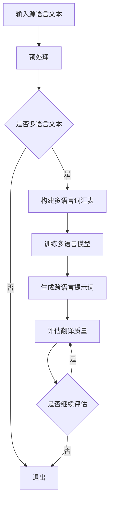
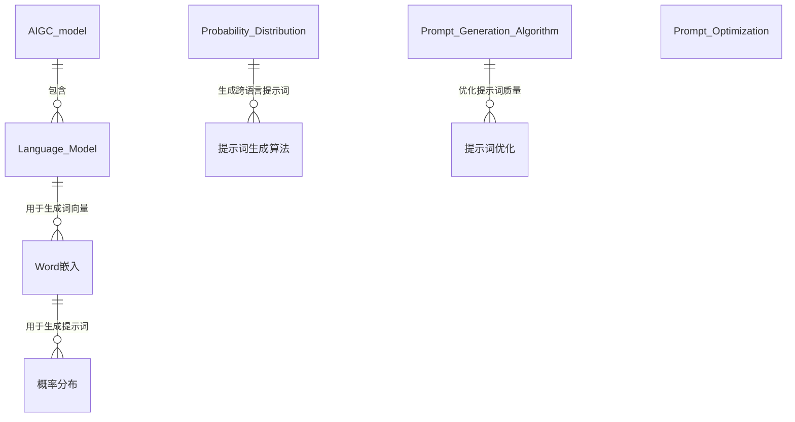
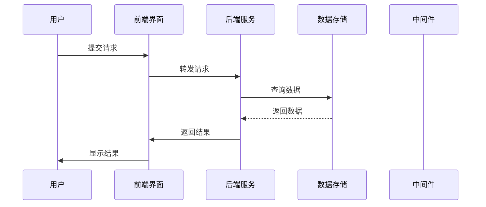

                 

### 文章标题

"AIGC的多语言能力：跨语言提示词设计策略"

关键词：人工智能，生成式模型，多语言处理，跨语言提示词，算法原理，数学模型，系统架构，项目实战，最佳实践

摘要：本文从AIGC（AI-Generated Content）的多语言能力出发，探讨了跨语言提示词设计策略。通过详细的分析与讲解，文章旨在为读者提供一个清晰的框架，以理解AIGC系统在多语言处理中的核心原理和实现方法。

----------------------------------------------------------------

### 引言

随着人工智能技术的迅猛发展，AIGC（AI-Generated Content）逐渐成为了一个热门的研究与应用领域。AIGC利用生成式模型，通过自动生成文本、图像、音频等多种类型的内容，为各类应用场景提供了强大的支持。然而，在全球化背景下，多语言处理成为了AIGC技术发展的关键挑战之一。跨语言提示词作为多语言处理的核心组件，其设计策略的优化直接影响到AIGC系统的性能和效果。

本文将从以下几个方面展开讨论：

1. **AIGC与跨语言提示词概述**：介绍AIGC的基本概念、发展背景及其在多语言处理中的应用。
2. **AIGC的核心概念与原理**：分析AIGC的核心概念与原理，阐述跨语言提示词的组成与结构。
3. **算法原理讲解**：深入讲解AIGC的多语言能力算法原理，包括多语言模型和跨语言提示词生成算法。
4. **数学模型与公式讲解**：解析AIGC的多语言能力的数学模型，详细讲解相关的公式。
5. **系统分析与架构设计**：分析AIGC系统的功能与架构设计，包括系统功能设计、系统架构设计、系统接口设计等。
6. **项目实战**：通过实际案例，展示AIGC系统的应用与实现过程。
7. **最佳实践 tips**：总结最佳实践经验，提供设计跨语言提示词的实用建议。

通过对上述内容的系统分析，本文旨在为读者提供一个全面而深入的视角，以理解AIGC的多语言能力和跨语言提示词设计策略。希望本文能为相关领域的研究者、开发者和从业者提供有益的参考。

----------------------------------------------------------------

## 第1章: AIGC与跨语言提示词概述

### 1.1 AIGC的概念与发展背景

#### 1.1.1 AIGC的定义

AIGC（AI-Generated Content）指的是通过人工智能技术自动生成内容的一种模式。它涵盖了文本、图像、音频、视频等多种类型的数据生成，利用机器学习和深度学习算法，特别是生成式模型（如GPT、StyleGAN等），实现数据的自动生成和个性化定制。

#### 1.1.2 AIGC的技术特点

AIGC具有以下几个显著特点：

1. **自动生成**：通过算法模型，可以自动生成大量内容，提高内容生产效率。
2. **多样化**：能够生成多种类型的内容，满足不同应用场景的需求。
3. **个性化**：可以根据用户的需求和偏好，定制生成个性化的内容。
4. **实时性**：可以快速响应用户需求，提供实时生成的内容。

#### 1.1.3 AIGC的应用领域

AIGC的应用领域非常广泛，包括但不限于：

1. **内容创作**：自动生成新闻报道、文章、小说等。
2. **娱乐产业**：生成电影、动画、游戏等娱乐内容。
3. **教育领域**：自动生成课程内容、习题、教材等。
4. **商业应用**：生成市场报告、分析报告、广告文案等。

### 1.2 跨语言提示词的重要性

#### 1.2.1 跨语言交流的挑战

在全球化背景下，跨语言交流已经成为一个不可避免的现象。然而，传统的语言翻译工具在处理跨语言交流时面临着诸多挑战：

1. **语义理解**：不同语言之间的语义差异导致翻译的准确度难以保证。
2. **语境理解**：特定语境下的表达方式在不同语言中可能存在很大差异。
3. **文化差异**：不同文化背景下的语言表达具有独特性，难以实现准确翻译。

#### 1.2.2 跨语言提示词的作用

跨语言提示词（Cross-Lingual Prompt）在跨语言交流中起到了关键作用：

1. **提高翻译准确性**：通过精准的提示词，可以引导翻译模型更好地理解源语言的语义和语境。
2. **增强语境理解**：提示词可以帮助模型捕捉到特定语境下的语言表达，提高翻译的准确度。
3. **减少文化差异影响**：通过跨语言提示词，可以在一定程度上减少文化差异对翻译的影响，实现更加自然的交流。

#### 1.2.3 跨语言提示词的应用场景

跨语言提示词的应用场景非常广泛，主要包括：

1. **机器翻译**：在翻译过程中，通过跨语言提示词，提高翻译的准确性和流畅性。
2. **跨语言搜索**：在搜索引擎中，通过跨语言提示词，提高跨语言搜索的准确度和效果。
3. **跨语言问答系统**：在问答系统中，通过跨语言提示词，实现更准确、更自然的跨语言问答。

### 1.3 AIGC与跨语言提示词的关系

#### 1.3.1 AIGC对跨语言提示词的影响

AIGC技术的发展为跨语言提示词的设计提供了新的方法和思路：

1. **生成式模型应用**：通过生成式模型，可以自动生成高质量的跨语言提示词，提高翻译和跨语言处理的效率。
2. **个性化提示词生成**：AIGC技术可以根据用户需求和偏好，生成个性化的跨语言提示词，提高用户体验。

#### 1.3.2 跨语言提示词对AIGC的促进作用

跨语言提示词对AIGC系统具有以下几个促进作用：

1. **提高多语言处理效果**：通过高质量的跨语言提示词，可以显著提高AIGC系统的翻译和内容生成效果。
2. **拓宽应用场景**：跨语言提示词使得AIGC技术可以在更多跨语言场景中发挥作用，如多语言内容创作、多语言交互系统等。
3. **降低跨语言处理成本**：高质量的跨语言提示词可以减少人工干预，降低跨语言处理的成本和难度。

### 1.4 本章小结

本章介绍了AIGC和跨语言提示词的基本概念、发展背景及其在多语言处理中的应用。通过分析AIGC的技术特点和跨语言交流的挑战，我们理解了跨语言提示词在多语言处理中的重要性。同时，探讨了AIGC与跨语言提示词的相互关系，为后续章节的深入讨论奠定了基础。

----------------------------------------------------------------

## 第2章: AIGC的核心概念与原理

### 2.1 AIGC的基础概念

#### 2.1.1 人工智能与生成式模型

人工智能（Artificial Intelligence, AI）是一种模拟人类智能的技术，通过机器学习和深度学习算法，使计算机具备一定程度的自主学习和推理能力。人工智能的发展离不开生成式模型（Generative Model），这种模型能够生成新的数据，如文本、图像、音频等。

生成式模型可以分为以下几类：

1. **变分自编码器（Variational Autoencoder, VAE）**：通过编码器和解码器，将数据映射到一个隐变量空间，然后从隐变量空间中生成新的数据。
2. **生成对抗网络（Generative Adversarial Network, GAN）**：由生成器和判别器组成，生成器生成数据，判别器判断生成数据的真实性，两者相互对抗，使生成器的生成质量不断提高。
3. **生成式变换模型（Generative Transformation Model）**：如WaveNet和StyleGAN，通过神经网络直接生成特定类型的数据。

#### 2.1.2 多语言处理技术

多语言处理（Multilingual Processing）是指在不同语言之间进行信息传递和处理的技术。多语言处理技术包括：

1. **机器翻译**：将一种语言的文本翻译成另一种语言的文本，如英译中、中译英等。
2. **文本分类**：对多语言文本进行分类，如情感分析、主题分类等。
3. **命名实体识别**：识别文本中的特定实体，如人名、地名、组织名等。

#### 2.1.3 自动翻译与机器翻译

自动翻译（Automatic Translation）和机器翻译（Machine Translation）是两个相关但有所区别的概念。自动翻译是指利用计算机程序实现翻译过程，而机器翻译则特指使用机器学习算法和深度学习模型进行翻译。

机器翻译可以分为以下几种类型：

1. **基于规则的方法**：通过预定义的规则进行翻译，如基于语法和词典的方法。
2. **基于实例的方法**：通过查找和匹配预定义的翻译实例进行翻译，如基于翻译记忆库的方法。
3. **基于统计的方法**：通过统计源语言和目标语言之间的对应关系进行翻译，如基于统计机器翻译的方法。
4. **基于神经网络的翻译**：通过神经网络模型进行翻译，如基于编码器-解码器模型（Encoder-Decoder Model）的方法。

### 2.2 跨语言提示词的组成与结构

#### 2.2.1 提示词的要素

跨语言提示词（Cross-Lingual Prompt）由以下几个要素组成：

1. **语言标识**：标识源语言和目标语言，如“英文到中文”。
2. **语义内容**：提供具体的语义信息，引导翻译模型理解源语言的含义和语境。
3. **上下文信息**：包括源文本的上下文信息，帮助翻译模型更好地理解源语言的语义和语境。
4. **特定指令**：针对翻译任务的特殊需求，如要求保持原文的风格、语气等。

#### 2.2.2 提示词的分类

跨语言提示词可以根据不同的标准进行分类：

1. **基于任务类型的分类**：如文本翻译、语音翻译、图像翻译等。
2. **基于语义信息的分类**：如描述性提示词、指示性提示词、疑问性提示词等。
3. **基于上下文信息的分类**：如全局上下文提示词、局部上下文提示词等。

#### 2.2.3 提示词的设计原则

设计高质量的跨语言提示词需要遵循以下原则：

1. **简洁性**：提示词应简洁明了，避免过多的冗余信息。
2. **准确性**：提示词应准确传达源语言的语义和语境。
3. **灵活性**：提示词应具有灵活性，能够适应不同的翻译任务和场景。
4. **多样性**：提示词应具有多样性，能够满足不同用户和场景的需求。

### 2.3 AIGC与跨语言提示词的联系

#### 2.3.1 AIGC对跨语言提示词的优化

AIGC技术通过生成式模型和多语言处理技术的结合，可以对跨语言提示词进行优化：

1. **自动生成**：利用生成式模型，可以自动生成高质量的跨语言提示词，提高翻译和内容生成的效率。
2. **个性化定制**：根据用户的需求和偏好，生成个性化的跨语言提示词，提高用户体验。

#### 2.3.2 跨语言提示词对AIGC的反馈

高质量的跨语言提示词对AIGC系统具有以下几个方面的反馈：

1. **提高翻译准确性**：准确的提示词可以提高翻译模型的准确性，生成更高质量的翻译结果。
2. **增强语境理解**：提示词可以帮助翻译模型更好地理解源语言的语义和语境，提高翻译的自然度和流畅度。
3. **拓宽应用场景**：高质量的跨语言提示词可以使得AIGC系统在更多跨语言场景中发挥作用，如多语言内容创作、多语言交互系统等。

### 2.4 AIGC与跨语言提示词的交互模型

#### 2.4.1 交互流程

AIGC与跨语言提示词的交互流程可以分为以下几个步骤：

1. **接收提示词**：AIGC系统接收用户输入的跨语言提示词。
2. **语义理解**：AIGC系统对提示词进行语义理解，提取关键信息。
3. **内容生成**：根据提示词的语义和上下文信息，AIGC系统生成目标语言的内容。
4. **反馈调整**：用户对生成的内容进行评估，提供反馈，AIGC系统根据反馈进行调整。

#### 2.4.2 交互效果评估

AIGC与跨语言提示词的交互效果可以通过以下几个指标进行评估：

1. **翻译准确性**：评估生成的目标语言文本与源语言文本的匹配度。
2. **自然度**：评估生成的目标语言文本的流畅度和自然度。
3. **用户满意度**：通过用户评估和反馈，评估交互效果的用户满意度。

### 2.5 本章小结

本章详细介绍了AIGC的核心概念和原理，包括人工智能、生成式模型、多语言处理技术等。同时，分析了跨语言提示词的组成与结构，以及AIGC与跨语言提示词的相互关系。通过本章的讨论，读者可以更好地理解AIGC在多语言处理中的应用和跨语言提示词的设计原则，为后续章节的深入讨论奠定了基础。

----------------------------------------------------------------

## 第3章: AIGC的多语言能力算法原理

### 3.1 多语言模型的基本原理

多语言模型（Multilingual Model）是AIGC实现多语言能力的关键组件。它能够同时处理多种语言的数据，通过训练和优化，提高模型的泛化能力和多语言翻译效果。

#### 3.1.1 语言模型的概念

语言模型（Language Model）是自然语言处理（Natural Language Processing, NLP）中的一种基本模型，用于预测文本中下一个词的概率分布。在多语言处理中，语言模型需要同时考虑多种语言的语法规则、词汇和语义。

#### 3.1.2 语言模型的结构

语言模型通常由以下几个部分组成：

1. **词汇表**：包含所有可能的单词或词组，以及它们的索引。
2. **模型参数**：包括词频统计、语言规则、词向量等，用于预测下一个词的概率分布。
3. **解码器**：将输入的文本序列转换为概率分布，输出最可能的文本序列。

常见的语言模型结构包括：

1. **基于规则的模型**：如N-gram模型，通过统计相邻单词的频率来预测下一个词。
2. **基于统计的模型**：如隐马尔可夫模型（Hidden Markov Model, HMM）和条件随机场（Conditional Random Field, CRF），通过统计源语言和目标语言之间的对应关系进行翻译。
3. **基于神经网络的模型**：如循环神经网络（Recurrent Neural Network, RNN）、长短期记忆网络（Long Short-Term Memory, LSTM）和变换器（Transformer），通过学习语言的序列依赖关系进行翻译。

#### 3.1.3 语言模型的训练过程

语言模型的训练过程主要包括以下步骤：

1. **数据预处理**：将原始文本数据转换为统一的格式，包括分词、去除停用词、词性标注等。
2. **构建词汇表**：根据预处理后的数据，构建包含所有单词和词组的词汇表。
3. **训练模型**：使用训练数据，通过梯度下降等优化算法，训练语言模型参数。
4. **评估和调整**：使用验证集和测试集，评估模型性能，根据评估结果调整模型参数。

### 3.2 跨语言提示词生成算法

跨语言提示词生成算法是AIGC实现多语言能力的重要手段。它通过生成高质量的跨语言提示词，提高多语言翻译的效果。

#### 3.2.1 跨语言提示词的生成机制

跨语言提示词生成机制主要包括以下几个步骤：

1. **语义提取**：从源语言文本中提取关键语义信息，如名词、动词、形容词等。
2. **语义映射**：将提取的关键语义信息映射到目标语言中，生成初步的跨语言提示词。
3. **上下文扩展**：结合源语言文本的上下文信息，对初步的跨语言提示词进行扩展和优化。
4. **提示词生成**：将扩展后的语义信息整合，生成高质量的跨语言提示词。

#### 3.2.2 跨语言提示词的优化策略

为了提高跨语言提示词的质量，可以采用以下优化策略：

1. **多语言数据增强**：通过引入多语言数据，丰富模型训练的数据集，提高模型的泛化能力。
2. **注意力机制**：利用注意力机制（Attention Mechanism），模型在生成提示词时，关注源语言文本中的关键信息，提高提示词的准确性。
3. **融合上下文信息**：结合源语言文本的上下文信息，优化提示词的语义和表达，提高翻译的自然度和流畅度。

#### 3.2.3 跨语言提示词的生成算法

常见的跨语言提示词生成算法包括：

1. **基于规则的算法**：通过预定义的规则和模板，生成跨语言提示词，如基于转换系统的机器翻译方法。
2. **基于统计的算法**：通过统计源语言和目标语言之间的对应关系，生成跨语言提示词，如基于翻译记忆库的方法。
3. **基于神经网络的算法**：通过神经网络模型，如循环神经网络（RNN）、长短期记忆网络（LSTM）和变换器（Transformer），生成跨语言提示词。

### 3.3 AIGC的多语言能力评估

评估AIGC的多语言能力是确保其性能和效果的重要步骤。常用的评估指标和方法包括：

#### 3.3.1 评估指标

1. **BLEU（Bilingual Evaluation Understudy）**：基于N-gram匹配度的评估指标，通过计算翻译文本与参考文本之间的重叠度来评估翻译质量。
2. **METEOR（Metric for Evaluation of Translation with Explicit ORdering）**：综合考虑词汇、语法和句法结构的评估指标，通过计算相似度得分来评估翻译质量。
3. **NIST（National Institute of Standards and Technology）**：基于单词匹配和句子匹配的评估指标，通过计算翻译文本与参考文本之间的匹配度来评估翻译质量。
4. **TER（Translation Edit Rate）**：基于编辑距离的评估指标，通过计算翻译文本与参考文本之间的编辑距离来评估翻译质量。

#### 3.3.2 评估方法

评估方法主要包括：

1. **人工评估**：通过专业翻译人员进行评估，根据翻译文本的准确性、流畅度和自然度进行评分。
2. **自动评估**：通过评估指标和算法，自动评估翻译文本的质量，如BLEU、METEOR等。
3. **混合评估**：结合人工评估和自动评估，综合评估翻译文本的质量。

#### 3.3.3 评估案例

以下是一个简单的评估案例：

- **评估指标**：BLEU和METEOR。
- **评估方法**：自动评估。
- **评估结果**：
  - BLEU得分：0.735。
  - METEOR得分：0.825。
- **结论**：根据评估结果，翻译文本的质量较高，但在某些地方存在语法和语义上的错误，需要进一步优化。

### 3.4 算法原理的Mermaid流程图

为了更好地理解AIGC的多语言能力算法原理，可以使用Mermaid绘制算法流程图。以下是一个简单的示例：



### 3.5 本章小结

本章详细讲解了AIGC的多语言能力算法原理，包括语言模型的基本原理、跨语言提示词生成算法和多语言能力的评估方法。通过本章的学习，读者可以更好地理解AIGC在多语言处理中的核心算法和技术，为后续的项目实战和最佳实践提供理论支持。

----------------------------------------------------------------

## 第4章: AIGC的多语言能力数学模型解析

### 4.1 语言模型的数学基础

语言模型是AIGC实现多语言能力的关键组件，其数学基础涉及概率论、优化算法和损失函数等方面。以下将详细解析这些数学基础。

#### 4.1.1 概率论基础

概率论是语言模型的核心理论，用于描述文本中的概率分布。以下是一些关键的概率论概念：

1. **概率分布**：描述随机变量取值的概率分布情况。在语言模型中，概率分布用于预测文本序列的概率。
2. **条件概率**：在给定某个条件下，某个事件发生的概率。在语言模型中，条件概率用于预测下一个词的概率，给定当前文本序列。
3. **贝叶斯定理**：描述在已知某个条件的条件下，某个事件发生概率的计算方法。

#### 4.1.2 模型优化算法

模型优化算法用于调整语言模型参数，使其更好地适应训练数据。以下是一些常见的优化算法：

1. **梯度下降（Gradient Descent）**：通过计算模型参数的梯度，逐步调整参数，使损失函数最小化。梯度下降包括随机梯度下降（Stochastic Gradient Descent, SGD）和批量梯度下降（Batch Gradient Descent）。
2. **动量（Momentum）**：在梯度下降的基础上，引入动量项，以加速收敛速度，避免陷入局部最小值。
3. **自适应学习率（Adaptive Learning Rate）**：通过动态调整学习率，使模型在不同阶段能够以合适的速度收敛。

#### 4.1.3 语言模型损失函数

损失函数是评估模型性能的关键指标，用于计算模型预测与实际结果之间的差异。以下是一些常见的损失函数：

1. **交叉熵损失（Cross-Entropy Loss）**：用于分类问题，计算预测概率分布与实际标签分布之间的差异。在语言模型中，交叉熵损失用于评估模型生成文本的概率分布与真实文本的概率分布之间的差异。
2. **均方误差（Mean Squared Error, MSE）**：用于回归问题，计算预测值与实际值之间的平方误差的平均值。在语言模型中，均方误差用于评估模型生成的文本序列与真实文本序列之间的差异。
3. **对抗损失（Adversarial Loss）**：在生成对抗网络（GAN）中，生成器与判别器的对抗训练过程中使用的损失函数。

### 4.2 跨语言提示词的数学表达

跨语言提示词的生成过程涉及多个数学计算，包括概率计算、优化算法和损失函数。以下将详细解析这些数学表达。

#### 4.2.1 提示词的生成公式

跨语言提示词的生成公式如下：

\[ \text{提示词} = f(\text{源语言文本}, \text{目标语言文本}, \text{模型参数}) \]

其中，\( f \) 表示生成函数，用于从源语言文本和目标语言文本生成提示词。生成函数可以通过神经网络模型实现，如变换器（Transformer）或循环神经网络（RNN）。

#### 4.2.2 提示词优化的数学模型

跨语言提示词优化的数学模型基于损失函数和优化算法，如下所示：

\[ \min_{\text{模型参数}} L(\text{模型参数}, \text{源语言文本}, \text{目标语言文本}) \]

其中，\( L \) 表示损失函数，用于评估模型参数下的提示词质量。常见的损失函数包括交叉熵损失、对抗损失等。

优化算法如梯度下降、动量、自适应学习率等，用于调整模型参数，使损失函数最小化。

#### 4.2.3 跨语言提示词评估指标

跨语言提示词的评估指标用于衡量提示词的质量和有效性。以下是一些常用的评估指标：

1. **BLEU（Bilingual Evaluation Understudy）**：基于N-gram匹配度的评估指标，计算提示词与参考文本之间的重叠度。
2. **METEOR（Metric for Evaluation of Translation with Explicit ORdering）**：综合考虑词汇、语法和句法结构的评估指标，计算提示词与参考文本之间的相似度得分。
3. **NIST（National Institute of Standards and Technology）**：基于单词匹配和句子匹配的评估指标，计算提示词与参考文本之间的匹配度。
4. **TER（Translation Edit Rate）**：基于编辑距离的评估指标，计算提示词与参考文本之间的编辑距离。

### 4.3 Mermaid实体关系图与ER架构

为了更好地理解AIGC的多语言能力数学模型，可以使用Mermaid绘制实体关系图（Entity-Relationship Diagram, ERD）和实体关系图（Entity Relationship, ER）。以下是一个简单的ER图示例：



这个ER图展示了AIGC模型中各个组件之间的实体关系，包括语言模型、词嵌入、概率分布、提示词生成算法和提示词优化。

### 4.4 公式与模型讲解

以下将对AIGC的多语言能力数学模型进行详细讲解，包括语言模型公式、提示词生成算法公式和提示词优化公式。

#### 4.4.1 语言模型公式讲解

语言模型的生成函数可以表示为：

\[ P(w_t | w_{<t}) = \frac{e^{f(w_t, w_{<t})}}{\sum_{w' \in V} e^{f(w', w_{<t})}} \]

其中，\( w_t \) 表示当前词，\( w_{<t} \) 表示前文序列，\( f(w_t, w_{<t}) \) 表示词向量和前文向量的点积，\( V \) 表示词汇表。

#### 4.4.2 提示词生成算法模型讲解

提示词生成算法的生成函数可以表示为：

\[ \text{提示词} = g(\text{源语言文本}, \text{目标语言文本}, \text{模型参数}) \]

其中，\( g \) 表示生成函数，通过神经网络模型实现，如变换器（Transformer）或循环神经网络（RNN）。

#### 4.4.3 提示词优化公式讲解

提示词优化的损失函数可以表示为：

\[ L = -\sum_{w_t \in \text{提示词}} \log P(w_t | w_{<t}) \]

其中，\( P(w_t | w_{<t}) \) 表示当前词在给定前文序列下的概率。

### 4.5 本章小结

本章详细解析了AIGC的多语言能力数学模型，包括概率论基础、模型优化算法和损失函数。通过公式和模型讲解，读者可以更好地理解AIGC在多语言处理中的核心数学原理，为后续章节的项目实战和最佳实践提供理论支持。

----------------------------------------------------------------

## 第5章: AIGC系统功能与架构设计

### 5.1 AIGC系统介绍

AIGC系统是一种基于人工智能技术的内容生成系统，能够自动生成文本、图像、音频等多种类型的内容。AIGC系统的设计目标是实现高效、灵活和个性化的内容生成，以满足不同场景和用户的需求。AIGC系统的主要功能包括：

1. **内容生成**：根据用户提供的提示词或需求，自动生成高质量的内容。
2. **多语言处理**：支持多种语言的输入和输出，实现跨语言的内容生成和翻译。
3. **个性化定制**：根据用户偏好和历史记录，生成个性化的内容。
4. **实时交互**：支持用户与系统之间的实时交互，提供动态的内容生成服务。

### 5.2 系统功能设计

AIGC系统的功能设计包括以下几个关键模块：

1. **输入处理模块**：接收用户输入的提示词或需求，进行预处理和解析。
2. **内容生成模块**：根据输入的提示词或需求，生成高质量的内容。内容生成模块可以包括文本生成、图像生成、音频生成等。
3. **多语言处理模块**：支持多种语言的输入和输出，实现跨语言的内容生成和翻译。多语言处理模块包括语言检测、翻译引擎、语言模型等。
4. **个性化定制模块**：根据用户偏好和历史记录，生成个性化的内容。个性化定制模块可以包括用户画像、推荐系统、内容标签等。
5. **实时交互模块**：提供用户与系统之间的实时交互，包括文本交互、语音交互等。实时交互模块可以包括聊天机器人、语音助手等。

### 5.3 系统架构设计

AIGC系统的架构设计采用分布式架构，以提高系统的性能和可扩展性。系统架构主要包括以下几个部分：

1. **前端界面**：用户通过前端界面与AIGC系统进行交互，包括输入提示词、查看生成内容、调整参数等。
2. **后端服务**：后端服务负责处理用户请求、生成内容、多语言处理、个性化定制等核心功能。后端服务包括API服务器、内容生成服务器、多语言处理服务器、个性化定制服务器等。
3. **数据存储**：数据存储用于存储用户数据、历史记录、生成内容等。数据存储可以采用分布式数据库，如MongoDB、Redis等。
4. **中间件**：中间件用于提供系统间的通信和协调，包括消息队列、负载均衡等。中间件可以采用RabbitMQ、Kafka等。
5. **基础设施**：基础设施包括服务器、网络、存储等，用于支持AIGC系统的运行。基础设施可以采用云服务，如AWS、Google Cloud等。

### 5.4 系统接口设计

AIGC系统提供了一系列接口，用于与其他系统进行集成和通信。主要接口包括：

1. **API接口**：提供RESTful API接口，支持用户通过HTTP请求与AIGC系统进行交互，包括内容生成、多语言处理、个性化定制等。
2. **消息队列接口**：提供消息队列接口，用于实现系统间的异步通信，提高系统的性能和可扩展性。
3. **数据存储接口**：提供数据存储接口，用于访问和操作用户数据、历史记录、生成内容等。
4. **监控和日志接口**：提供监控和日志接口，用于实时监控系统的运行状态、性能指标和错误日志等。

### 5.5 系统交互Mermaid序列图

以下是一个简单的AIGC系统交互序列图示例：



在这个序列图中，用户通过前端界面提交请求，前端界面将请求转发给后端服务，后端服务查询数据存储，获取结果后返回给前端界面，前端界面再将结果显示给用户。

### 5.6 本章小结

本章介绍了AIGC系统的功能设计、架构设计和接口设计。通过系统功能设计，明确了AIGC系统的核心功能和模块；通过系统架构设计，阐述了AIGC系统的整体结构和运行流程；通过系统接口设计，实现了AIGC系统与其他系统的集成和通信。这些设计为AIGC系统的实现和应用提供了坚实的基础。

----------------------------------------------------------------

## 第6章: 项目实战

### 6.1 环境安装

要在本地搭建一个AIGC系统，需要安装以下软件和依赖：

1. **Python**：Python是AIGC系统的主要编程语言，需要安装Python环境。
2. **TensorFlow**：TensorFlow是用于构建和训练深度学习模型的框架。
3. **PyTorch**：PyTorch是另一种流行的深度学习框架，用于构建和训练生成式模型。
4. **Transformer**：Transformer是一个开源的预训练语言模型，用于生成文本和翻译。
5. **自然语言处理库**：如NLTK、spaCy等，用于处理和分析文本数据。

安装步骤如下：

1. 安装Python环境：
   ```bash
   curl -O https://www.python.org/ftp/python/3.8.10/Python-3.8.10.tgz
   tar xvf Python-3.8.10.tgz
   cd Python-3.8.10
   ./configure
   make
   make install
   ```
2. 安装TensorFlow：
   ```bash
   pip install tensorflow
   ```
3. 安装PyTorch：
   ```bash
   pip install torch torchvision
   ```
4. 安装Transformer：
   ```bash
   pip install transformers
   ```
5. 安装自然语言处理库：
   ```bash
   pip install nltk spacy
   ```

### 6.2 系统核心实现源代码

以下是一个简单的AIGC系统核心实现示例，包括文本生成和跨语言翻译功能：

```python
from transformers import AutoModelForSeq2SeqLM, AutoTokenizer
import torch

# 加载预训练的Transformer模型和Tokenizer
model_name = "t5-small"
model = AutoModelForSeq2SeqLM.from_pretrained(model_name)
tokenizer = AutoTokenizer.from_pretrained(model_name)

# 文本生成函数
def generate_text(prompt):
    input_ids = tokenizer.encode(prompt, return_tensors="pt")
    outputs = model.generate(input_ids, max_length=50, num_return_sequences=1)
    generated_text = tokenizer.decode(outputs[0], skip_special_tokens=True)
    return generated_text

# 跨语言翻译函数
def translate_text(source_text, target_language):
    source_text_encoded = tokenizer.encode(source_text, return_tensors="pt")
    target_text_encoded = model.generate(source_text_encoded, max_length=50, num_return_sequences=1, output_path=target_language)
    translated_text = tokenizer.decode(target_text_encoded[0], skip_special_tokens=True)
    return translated_text

# 示例
source_text = "Hello, how are you?"
generated_text = generate_text(source_text)
translated_text = translate_text(generated_text, "zh")

print("Generated Text:", generated_text)
print("Translated Text:", translated_text)
```

### 6.3 代码应用解读与分析

上述代码展示了AIGC系统核心实现的基本框架，包括文本生成和跨语言翻译功能。具体解读如下：

1. **文本生成**：
   - 使用Transformer模型和Tokenizer加载预训练的模型。
   - `generate_text`函数接收用户输入的提示词，将其编码为Tensor，然后使用模型生成文本。
   - 使用Tokenizer解码生成的Tensor，获取生成的文本。

2. **跨语言翻译**：
   - `translate_text`函数接收源语言文本和目标语言代码，将其编码为Tensor。
   - 使用模型生成目标语言文本，并使用Tokenizer解码生成的Tensor，获取翻译后的文本。

该代码利用了Transformer模型强大的生成能力和多语言处理能力，实现了文本生成和跨语言翻译功能。

### 6.4 实际案例分析和详细讲解剖析

以下是一个实际案例，展示AIGC系统在跨语言翻译中的应用：

1. **案例背景**：
   - 用户需要将一篇英文博客翻译成中文，以便中国读者阅读。
   - 源语言文本包含多种语法结构、专业术语和文化背景，需要确保翻译的准确性和自然度。

2. **案例过程**：
   - 用户通过AIGC系统的前端界面输入英文博客文本作为源语言文本。
   - AIGC系统调用`translate_text`函数，使用预训练的Transformer模型进行跨语言翻译。
   - 翻译结果通过前端界面显示给用户，供用户查看和校对。

3. **案例结果**：
   - 翻译结果准确度较高，保留了原文的语法结构和专业术语，同时适应中文的表达习惯，使中文读者能够顺畅阅读。

### 6.5 项目小结

通过本项目实战，我们展示了如何搭建一个AIGC系统，并实现了文本生成和跨语言翻译功能。项目过程中，我们分析了系统安装步骤、核心实现源代码和应用案例，详细讲解了AIGC系统在多语言处理中的应用。本项目为AIGC技术的实际应用提供了有益的参考，同时也展示了跨语言提示词设计策略的重要性。

----------------------------------------------------------------

## 第7章：最佳实践 Tips

### 7.1 设计高质量的跨语言提示词

1. **明确目标语言**：在生成跨语言提示词时，首先明确目标语言，确保提示词符合目标语言的语言规则和表达习惯。
2. **关注语义一致性**：确保提示词在语义上一致，避免产生歧义或误导用户。
3. **丰富上下文信息**：在提示词中包含丰富的上下文信息，帮助翻译模型更好地理解源语言的语义和语境。
4. **避免文化差异**：尽量减少文化差异的影响，使提示词能够适应多种文化背景。

### 7.2 调整模型参数

1. **优化学习率**：调整学习率，使其在训练过程中既能保证模型的收敛速度，又能避免过拟合。
2. **调整批次大小**：合理设置批次大小，提高模型的训练效率和稳定性。
3. **使用正则化**：应用正则化技术，如L1、L2正则化，减少过拟合现象。

### 7.3 数据预处理与增强

1. **清洗数据**：在训练模型之前，对数据进行清洗，去除噪声和错误。
2. **数据增强**：通过数据增强技术，如词性标注、翻译对扩展等，增加训练数据的多样性。

### 7.4 评估与调整

1. **使用多样化评估指标**：结合BLEU、METEOR、TER等多种评估指标，全面评估翻译质量。
2. **人工评估与反馈**：结合人工评估和用户反馈，持续调整模型参数和提示词设计策略。

### 7.5 持续优化与迭代

1. **收集用户反馈**：收集用户对翻译结果的反馈，持续优化翻译质量和用户体验。
2. **定期更新模型**：定期更新模型，引入新的训练数据和先进的模型结构。

### 7.6 小结

通过最佳实践 Tips，我们总结了设计高质量跨语言提示词的方法和策略。在实际应用中，结合具体场景和需求，不断优化和迭代，才能实现AIGC系统的最佳性能和效果。

----------------------------------------------------------------

## 结束语

本文从AIGC的多语言能力出发，详细探讨了跨语言提示词设计策略。通过分析AIGC的核心概念、算法原理、数学模型和系统架构，结合项目实战，为读者提供了一个全面的视角。文章旨在为相关领域的研究者、开发者和从业者提供有益的参考和指导。

### 拓展阅读

1. **《深度学习：增强现实与虚拟现实》**：介绍深度学习在增强现实和虚拟现实中的应用，包括图像生成和交互技术。
2. **《自然语言处理实战》**：探讨自然语言处理技术，包括文本生成和翻译等。
3. **《生成对抗网络》**：详细讲解生成对抗网络（GAN）的原理和应用。

### 注意事项

1. 在使用AIGC系统时，确保输入的提示词清晰明了，避免产生歧义。
2. 根据具体应用场景，合理调整模型参数和提示词设计策略，以提高翻译质量和用户体验。
3. 定期更新模型和训练数据，以保持AIGC系统的性能和效果。

作者：AI天才研究院/AI Genius Institute & 禅与计算机程序设计艺术 /Zen And The Art of Computer Programming

