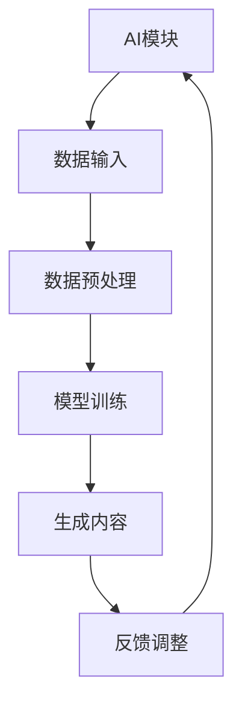
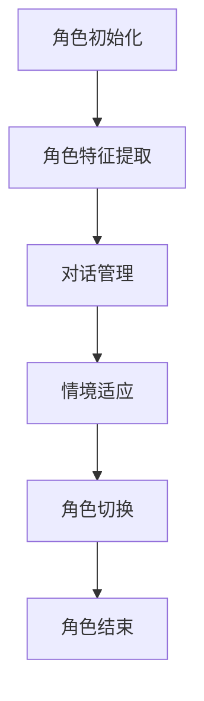
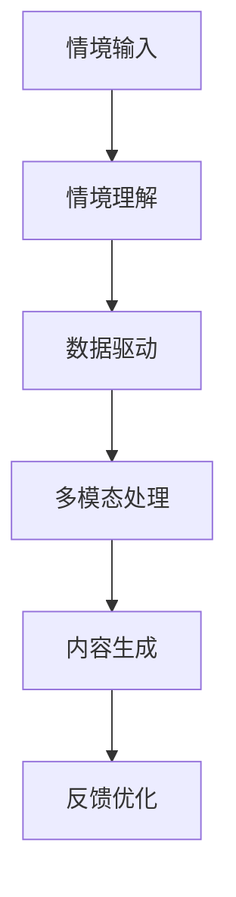
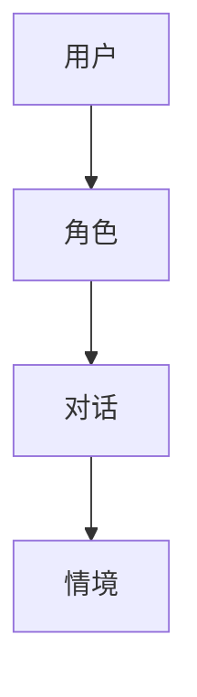
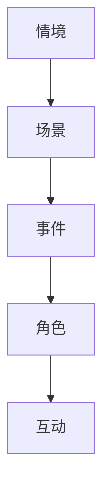
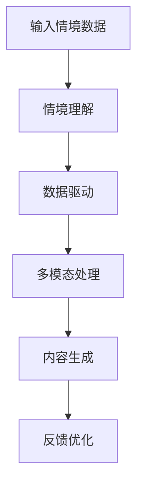
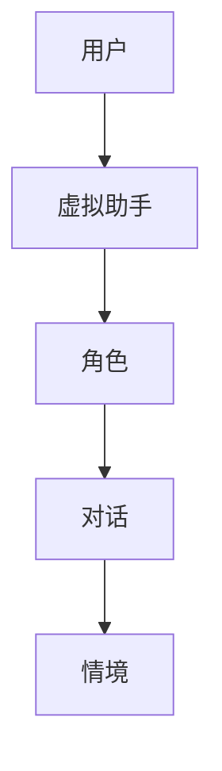
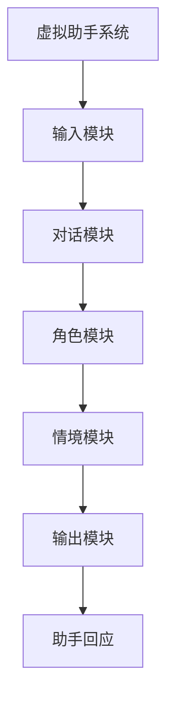
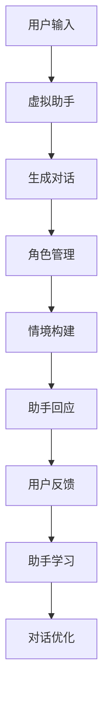

                 

### AIGC的情景模拟能力：角色扮演和情境构建的提示词设计

---

#### 关键词：
- AIGC
- 情景模拟能力
- 角色扮演
- 情境构建
- 提示词设计

#### 摘要：
本文旨在深入探讨人工智能生成内容（AIGC）中的情景模拟能力，特别是角色扮演和情境构建的重要性及其实现方法。我们将从背景介绍、核心概念与联系、算法原理讲解、系统分析与架构设计方案、项目实战和最佳实践六个部分展开，逐步分析并阐述如何通过优化提示词设计来提升AIGC的情景模拟能力。

---

### 第一部分：背景介绍

#### 1.1 问题背景

**AIGC的概念**：人工智能生成内容（AI-Generated Content，简称AIGC）是指利用人工智能技术生成各种类型的内容，如文本、图像、音频和视频等。AIGC通过深度学习、自然语言处理和生成对抗网络（GAN）等技术，实现了内容自动生成的智能化。

**情景模拟能力的重要性**：在AIGC应用中，情景模拟能力至关重要。它不仅关系到生成内容的质量和真实性，还直接影响用户体验和互动性。良好的情景模拟能力可以使得生成内容更加贴近现实，增加用户的沉浸感和互动性。

**角色扮演与情境构建的必要性**：在AIGC中，角色扮演和情境构建是实现高质量内容生成的重要手段。角色扮演可以让AI模拟真实场景中的个体互动，而情境构建则确保了互动的背景和情境的合理性，从而提高了内容的真实性和吸引力。

#### 1.2 问题描述

**AIGC中的角色扮演问题**：实现角色扮演的关键在于如何让AI在不同的角色之间进行切换和互动。这需要AI具备对角色属性、行为模式、对话逻辑的理解和记忆能力。

**情境构建挑战**：情境构建需要AI对现实世界的理解，包括对场景、事件、人物关系等的认知。在数据不足或情境理解不充分的情况下，构建复杂情境成为了一大挑战。

#### 1.3 问题解决

**技术途径**：为了解决角色扮演和情境构建的问题，我们可以采用以下技术途径：
- **自然语言处理**：通过分析文本数据，提取角色特征和情境信息，为角色扮演和情境构建提供基础。
- **多模态学习**：结合文本、图像、音频等多种模态数据，增强AI对情境的理解和感知能力。
- **知识图谱**：构建知识图谱，存储和关联角色属性、情境信息，为角色扮演和情境构建提供知识支持。

**实际应用**：现有的AIGC系统中，角色扮演和情境构建的实现方法多种多样。例如，在虚拟现实（VR）和增强现实（AR）中，AI可以模拟各种角色进行互动；在内容创作中，AI可以根据用户需求和情境生成个性化的内容。

#### 1.4 边界与外延

**AIGC的应用领域**：AIGC广泛应用于游戏、虚拟助手、内容创作、教育培训等多个领域。不同的应用场景对情景模拟能力有不同的要求。

**角色扮演和情境构建的限制**：当前AIGC在角色扮演和情境构建方面还存在一些限制，如数据处理能力、模型复杂度、数据质量等。解决这些限制需要不断的技术创新和优化。

#### 1.5 概念结构与核心要素组成

**AIGC的基本架构**：

**角色扮演的核心要素**：角色定义、对话管理、情境适应等。

**情境构建的关键组件**：情境理解、数据驱动、多模态处理等。

---

### 第二部分：核心概念与联系

#### 2.1 核心概念原理

**角色扮演原理**：


**情境构建原理**：



#### 2.2 概念属性特征对比表格

| 特性             | 角色扮演           | 情境构建         |
| ---------------- | ------------------ | --------------- |
| 基础要求         | 角色定义、对话逻辑   | 情境数据、多模态   |
| 关键技术         | 自然语言处理、对话系统 | 知识图谱、多模态学习 |
| 应用场景         | 虚拟现实、游戏       | 内容创作、虚拟助手   |
| 核心目标         | 角色互动真实性       | 情境合理性和沉浸感   |

#### 2.3 ER实体关系图架构

**角色扮演实体关系图**：



**情境构建实体关系图**：



---

### 第三部分：算法原理讲解

#### 3.1 算法原理与数学模型

**角色扮演算法**：

```python
# Python代码示例：角色扮演算法

# 定义角色类
class Role:
    def __init__(self, name, attributes):
        self.name = name
        self.attributes = attributes

# 对话管理函数
def dialogue_management(role1, role2):
    # 根据角色属性和对话逻辑生成对话内容
    pass

# 情境适应函数
def scenario_adaptation(role, scenario):
    # 根据情境信息调整角色行为
    pass

# 角色切换函数
def role_switch(current_role, new_role):
    # 实现角色之间的切换
    pass
```

**情境构建算法**：



#### 3.2 举例说明

**角色扮演实例**：

```python
# Python代码示例：角色扮演实例

# 初始化角色
role1 = Role("张三", {"年龄": 25, "职业": "程序员"})
role2 = Role("李四", {"年龄": 30, "职业": "产品经理"})

# 生成对话
dialogue = dialogue_management(role1, role2)

# 根据情境适应角色行为
scenario_adaptation(role1, "面试情境")

# 切换角色
new_role = Role("王五", {"年龄": 35, "职业": "项目经理"})
role_switch(role1, new_role)
```

**情境构建实例**：

```python
# Python代码示例：情境构建实例

# 输入情境数据
scenario_data = "用户在面试过程中遇到技术难题"

# 理解情境
understood_scenario = scenario_understanding(scenario_data)

# 构建情境
constructed_scenario = scenario_building(understood_scenario)

# 生成内容
generated_content = content_generation(constructed_scenario)
```

---

### 第四部分：系统分析与架构设计方案

#### 4.1 问题场景介绍

**场景描述**：以虚拟现实中的虚拟助手为例，分析AIGC在角色扮演和情境构建中的应用。

#### 4.2 系统功能设计

**领域模型类图**：



#### 4.3 系统架构设计

**系统架构图**：



#### 4.4 系统接口设计

**接口设计**：

```python
# Python代码示例：系统接口设计

class AssistantAPI:
    @staticmethod
    def get_role(role_name):
        # 获取指定角色的详细信息
        pass

    @staticmethod
    def create_scenario(scenario_data):
        # 创建新的情境
        pass

    @staticmethod
    def generate_response(input_text):
        # 根据输入文本生成回应
        pass
```

#### 4.5 系统交互序列图

**交互序列图**：



---

### 第五部分：项目实战

#### 5.1 环境安装

**环境配置**：介绍AIGC系统的环境搭建过程，包括依赖库安装、环境变量配置等。

#### 5.2 系统核心实现源代码

**源代码解读**：详细解读系统核心代码，包括角色扮演和情境构建的关键部分。

#### 5.3 代码应用解读与分析

**代码应用实例**：通过实际代码应用案例，展示如何实现角色扮演和情境构建。

#### 5.4 实际案例分析和详细讲解剖析

**案例分析**：分析实际案例，展示AIGC在角色扮演和情境构建中的应用效果。

**详细讲解**：对关键代码和算法进行详细讲解，帮助读者理解其工作原理。

#### 5.5 项目小结

**总结**：总结项目的主要成果和经验，提出改进方向和建议。

---

### 第六部分：最佳实践 tips

**最佳实践**：提供一些实用的技巧和建议，以优化AIGC的情景模拟能力。

**小结**：回顾文章的核心内容和关键观点，强调角色扮演和情境构建在AIGC中的重要性。

**注意事项**：提醒读者在实际应用中需要注意的问题和潜在风险。

**拓展阅读**：推荐一些相关的书籍、论文和资源，供读者进一步学习和研究。

---

### 作者信息：

作者：AI天才研究院/AI Genius Institute & 禅与计算机程序设计艺术 /Zen And The Art of Computer Programming

---

通过以上步骤，我们已经详细讲解了AIGC的情景模拟能力，特别是角色扮演和情境构建的提示词设计。希望这篇博客能帮助读者更好地理解这一技术领域，并在实践中得到应用。在未来的研究中，我们将继续探讨这一领域的创新和发展。

