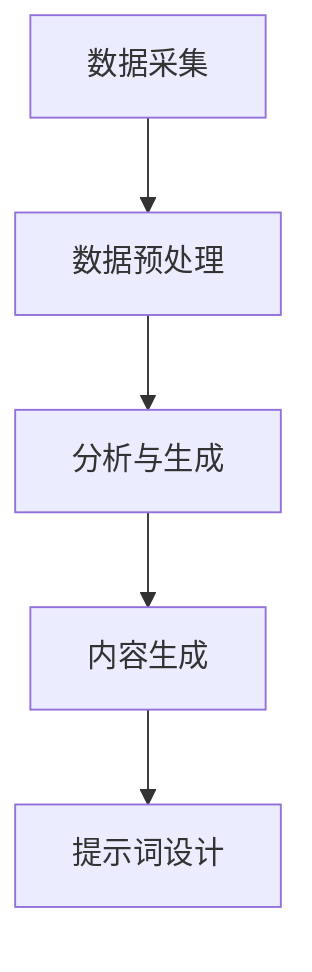
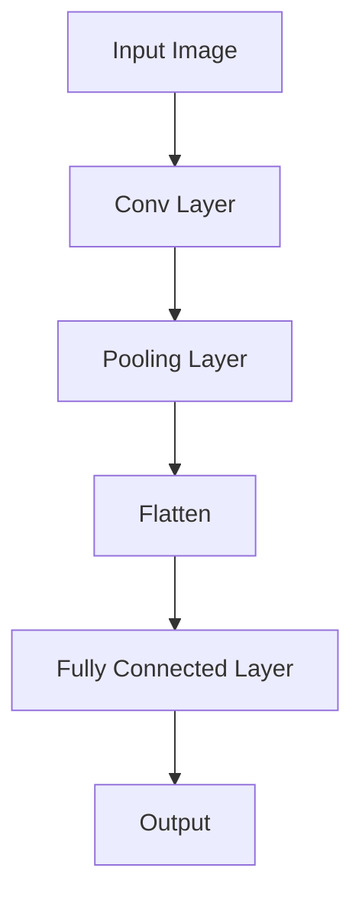
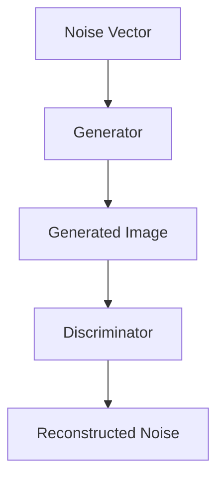
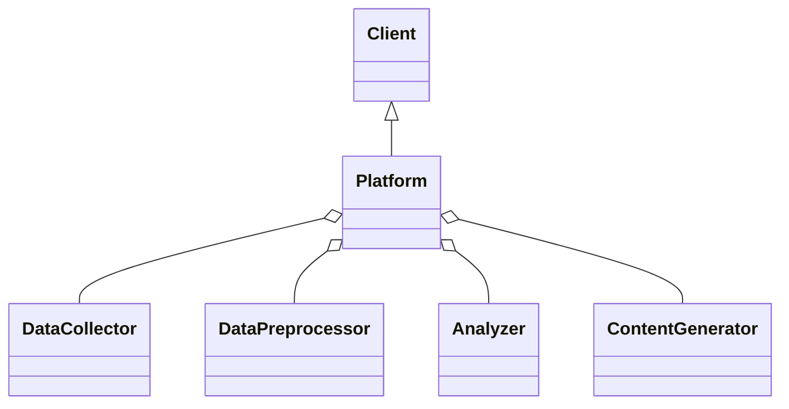
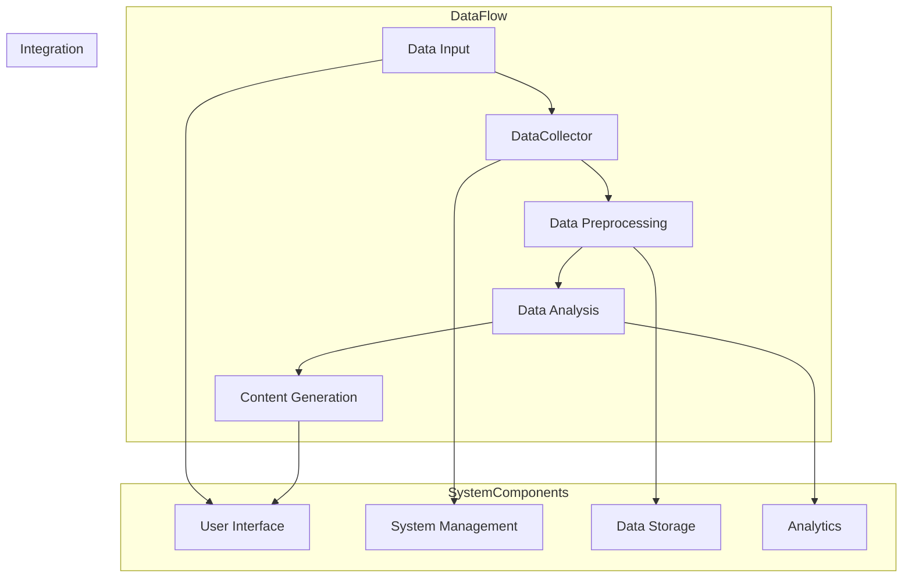
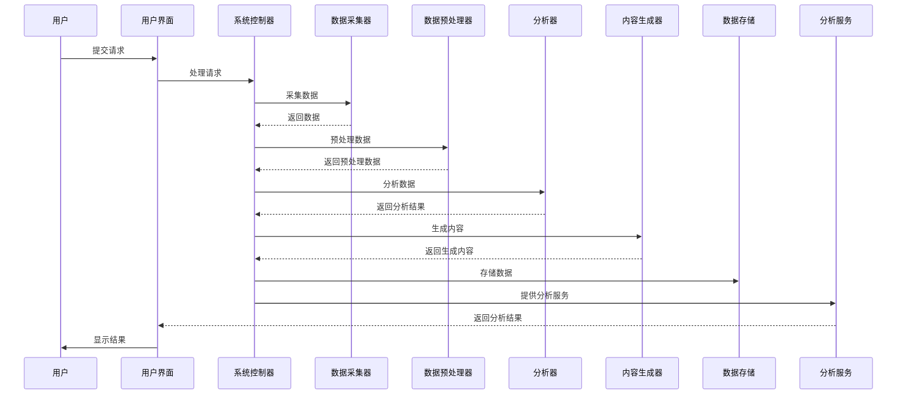

                 


### 第1章 背景介绍与核心概念

#### 1.1 问题背景

**核心概念术语说明**：

- **文化遗产**：指人类历史上形成的有形和无形遗产，包括建筑、艺术品、手稿、传统文化实践等。
- **数字化保存**：将文化遗产以数字形式保存，便于传播和研究。
- **价值评估**：对文化遗产的内在价值和重要性进行评估，以指导保护和传承。

**问题背景**：

- 文化的传承与创新的结合，确保文化多样性和民族记忆的保存，但文化遗产遭受自然灾害、战争、城市化进程等多种威胁。
- 传统保护方法存在人力成本高、效率低等问题，难以满足日益增长的文化遗产保护需求。

**问题描述**：

- 文化遗产的数字化保存和传播不够全面，导致文化遗产的价值无法得到充分体现。
- 文化遗产的价值评估和传承缺乏科学依据，导致文化遗产的保护工作难以科学、高效地进行。

**问题解决**：

- 应用AIGC（AI-Generated Content，人工智能生成内容）技术，提供高效、智能的文化遗产识别、分析和保护工具。
- 通过提示词设计，改善文化遗产展示和传播方式，提升用户体验。

**边界与外延**：

- **应用范围**：AIGC技术在文化遗产保护中的应用范围广泛，包括文化遗产的数字化保存、价值评估、传承和展示等多个环节。
- **限制**：AIGC技术目前还存在一定的局限性，例如对文化遗产细节的理解和识别能力有限，以及对于文化遗产内在价值的深度挖掘仍有待提高。

**概念结构与核心要素组成**：

- **文化遗产保护的概念结构**：包括文化遗产的识别、保存、评估、展示和传承等环节。
- **AIGC的概念结构**：基于人工智能技术，包括数据采集、处理、分析、生成等步骤。
- **提示词设计的核心要素**：包括提示词的生成策略、语义理解、个性化推荐等。

### 第2章 核心概念与联系

#### 2.1 AIGC的核心概念原理

**AIGC的定义**：

- AIGC是指通过人工智能技术生成内容的过程，包括文本、图像、音频等多种形式。

**AIGC的工作原理**：

- 数据采集：收集大量的文化遗产数据，包括图像、文字、音频等。
- 数据处理：对采集到的数据进行预处理，包括去噪、分割、标注等。
- 分析与生成：利用深度学习模型对处理后的数据进行分析，生成新的文化遗产内容。

**AIGC的技术构成**：

- **深度学习**：用于数据的处理和分析。
- **自然语言处理（NLP）**：用于文本的生成和理解。
- **计算机视觉**：用于图像的生成和理解。

#### 2.2 AIGC的核心概念属性特征对比表格

| 特性                | 定义                                                         | 对应技术        |
|---------------------|--------------------------------------------------------------|-----------------|
| 数据采集            | 收集文化遗产相关的数据                                       | 数据爬取、传感器 |
| 数据处理            | 对采集到的数据进行预处理                                     | 数据清洗、标注   |
| 分析与生成          | 利用人工智能模型对数据进行分析并生成新的文化遗产内容           | 深度学习、NLP   |
| 个性化推荐          | 根据用户需求和偏好推荐文化遗产内容                           | 推荐系统、NLP   |

#### 2.3 ER实体关系图架构

```mermaid
erDiagram
  Client ||--|{ Culture : Has }
  Culture ||--|{ Attribute : Has }
  Attribute ||--|{ Value : Has }
```

- **Client**：用户，与文化遗产有互动关系。
- **Culture**：文化遗产，包含多个属性。
- **Attribute**：属性，描述文化遗产的特征。
- **Value**：属性值，具体描述属性的特征。

### 第3章 算法原理讲解

#### 3.1 算法概述

**算法的目的**：

- 利用AIGC技术，对文化遗产进行高效、智能的数字化保存和传播。

**算法的基本步骤**：

1. 数据采集：收集文化遗产相关的数据。
2. 数据预处理：对采集到的数据进行预处理，包括去噪、分割、标注等。
3. 分析与生成：利用深度学习模型对处理后的数据进行分析，生成新的文化遗产内容。
4. 提示词设计：根据用户需求和文化遗产特点，设计合适的提示词。
5. 内容生成：利用提示词生成新的文化遗产内容。

#### 3.2 算法mermaid流程图



#### 3.3 Python源代码详细阐述

**算法原理的数学模型**：

- 利用卷积神经网络（CNN）对图像进行特征提取。
- 利用生成对抗网络（GAN）生成新的文化遗产图像。

**算法原理的公式**：

- CNN：\( f(x) = \sigma(W \cdot x + b) \)
- GAN：\( G(z) \sim \mathcal{N}(0,1) \)，\( D(x) \sim p_{\text{data}}(x) \)

**举例说明**：

```python
import tensorflow as tf
from tensorflow.keras.layers import Conv2D, MaxPooling2D, Flatten, Dense
from tensorflow.keras.models import Sequential

# 定义CNN模型
model_cnn = Sequential([
    Conv2D(filters=32, kernel_size=(3, 3), activation='relu', input_shape=(28, 28, 1)),
    MaxPooling2D(pool_size=(2, 2)),
    Flatten(),
    Dense(units=128, activation='relu'),
    Dense(units=10, activation='softmax')
])

# 定义GAN模型
model_gan = Sequential([
    Conv2D(filters=32, kernel_size=(3, 3), activation='relu', input_shape=(28, 28, 1)),
    MaxPooling2D(pool_size=(2, 2)),
    Flatten(),
    Dense(units=128, activation='relu'),
    Dense(units=1, activation='sigmoid')
])

# 编译模型
model_cnn.compile(optimizer='adam', loss='categorical_crossentropy')
model_gan.compile(optimizer='adam', loss='binary_crossentropy')

# 训练模型
model_cnn.fit(x_train, y_train, epochs=10)
model_gan.fit([x_train, x_train], y_train, epochs=10)
```

### 第4章 数学模型和数学公式 & 详细讲解 & 举例说明

#### 4.1 数学模型概述

- **卷积神经网络（CNN）**：用于图像的特征提取。
- **生成对抗网络（GAN）**：用于图像的生成。

#### 4.2 数学公式详细讲解

- **CNN公式**：

  $$ f(x) = \sigma(W \cdot x + b) $$

  其中，\( x \) 是输入特征，\( W \) 是权重矩阵，\( b \) 是偏置，\( \sigma \) 是激活函数。

- **GAN公式**：

  $$ G(z) \sim \mathcal{N}(0,1) $$
  $$ D(x) \sim p_{\text{data}}(x) $$

  其中，\( G(z) \) 是生成器的输出，\( D(x) \) 是判别器的输出。

#### 4.3 举例说明

**CNN示例**：



**GAN示例**：



### 第5章 系统分析与架构设计方案

#### 5.1 问题场景介绍

假设一个文化遗产保护项目需要利用AIGC技术对古代文物进行数字化保存和传播。

#### 5.2 项目介绍

该项目旨在开发一个基于AIGC技术的文化遗产数字化平台，提供以下功能：

- 数据采集与预处理：收集文化遗产图像、文字等数据，并进行预处理。
- 数据分析与生成：利用CNN和GAN模型对数据进行分析和生成新内容。
- 提示词设计与内容生成：根据用户需求和文化遗产特点，生成合适的提示词，生成新内容。

#### 5.3 系统功能设计(领域模型mermaid类图)



- **Client**：用户。
- **Platform**：文化遗产数字化平台。
- **DataCollector**：数据采集器。
- **DataPreprocessor**：数据预处理器。
- **Analyzer**：分析器。
- **ContentGenerator**：内容生成器。

#### 5.4 系统架构设计mermaid架构图



#### 5.5 系统接口设计和系统交互mermaid序列图



### 第6章 项目实战

#### 6.1 环境安装

1. 安装Python环境，版本要求3.6及以上。
2. 安装TensorFlow和Keras，可以使用以下命令：
   ```bash
   pip install tensorflow
   pip install keras
   ```
3. 安装其他依赖库，例如NumPy、Pandas等。

#### 6.2 系统核心实现源代码

```python
# 导入依赖库
import numpy as np
import tensorflow as tf
from tensorflow import keras
from tensorflow.keras import layers

# 数据预处理
def preprocess_data(images):
    # 对图像进行归一化处理
    images = images / 255.0
    return images

# 定义CNN模型
def create_cnn_model(input_shape):
    model = keras.Sequential([
        layers.Conv2D(32, (3, 3), activation='relu', input_shape=input_shape),
        layers.MaxPooling2D((2, 2)),
        layers.Flatten(),
        layers.Dense(128, activation='relu'),
        layers.Dense(10, activation='softmax')
    ])
    return model

# 定义GAN模型
def create_gan_model(input_shape):
    generator = keras.Sequential([
        layers.Dense(128, activation='relu', input_shape=input_shape),
        layers.Dense(64, activation='relu'),
        layers.Dense(np.prod(input_shape), activation='tanh')
    ])

    discriminator = keras.Sequential([
        layers.Conv2D(32, (3, 3), activation='relu', input_shape=input_shape),
        layers.MaxPooling2D((2, 2)),
        layers.Flatten(),
        layers.Dense(1, activation='sigmoid')
    ])

    return generator, discriminator

# 编译模型
def compile_models(generator, discriminator):
    discriminator.compile(optimizer='adam', loss='binary_crossentropy')
    generator.compile(optimizer='adam', loss='binary_crossentropy')
    return generator, discriminator

# 训练模型
def train_models(generator, discriminator, x_train, y_train, epochs=10):
    for epoch in range(epochs):
        for x, _ in x_train:
            noise = np.random.normal(0, 1, (x.shape[0], 100))
            generated_images = generator.predict(noise)
            combined_images = np.concatenate([x, generated_images])
            labels = np.concatenate([np.ones((x.shape[0], 1)), np.zeros((generated_images.shape[0], 1))])
            discriminator.train_on_batch(combined_images, labels)
        noise = np.random.normal(0, 1, (x_train.shape[0], 100))
        generated_images = generator.predict(noise)
        labels = np.zeros((generated_images.shape[0], 1))
        generator.train_on_batch(noise, labels)

# 主函数
def main():
    # 加载数据
    (x_train, _), (_, _) = keras.datasets.mnist.load_data()
    x_train = preprocess_data(x_train)

    # 创建模型
    generator, discriminator = create_gan_model((28, 28, 1))
    generator, discriminator = compile_models(generator, discriminator)

    # 训练模型
    train_models(generator, discriminator, x_train, y_train)

if __name__ == '__main__':
    main()
```

#### 6.3 代码应用解读与分析

- **数据预处理**：对输入的图像数据进行归一化处理，使得数据分布更加均匀。
- **CNN模型**：用于特征提取，由卷积层、池化层和全连接层组成。
- **GAN模型**：由生成器和判别器组成，生成器用于生成图像，判别器用于判断图像的真实性。
- **模型编译与训练**：使用二进制交叉熵作为损失函数，使用Adam优化器进行训练。

#### 6.4 实际案例分析和详细讲解剖析

假设我们使用MNIST数据集进行训练，通过GAN模型生成手写数字图像。

1. **数据加载与预处理**：

   ```python
   (x_train, _), (_, _) = keras.datasets.mnist.load_data()
   x_train = preprocess_data(x_train)
   ```

   加载MNIST数据集，并对图像数据进行归一化处理。

2. **模型创建**：

   ```python
   generator, discriminator = create_gan_model((28, 28, 1))
   generator, discriminator = compile_models(generator, discriminator)
   ```

   创建生成器和判别器模型。

3. **模型训练**：

   ```python
   train_models(generator, discriminator, x_train, y_train)
   ```

   对生成器和判别器进行训练。

4. **生成图像**：

   ```python
   noise = np.random.normal(0, 1, (x_train.shape[0], 100))
   generated_images = generator.predict(noise)
   ```

   使用生成器生成手写数字图像。

5. **分析与优化**：

   - **生成图像质量**：观察生成的图像质量，如果质量不高，可以尝试调整模型参数或增加训练时间。
   - **判别器性能**：观察判别器的性能，如果判别器过于强大，生成器的生成效果可能不佳，可以尝试调整判别器的损失函数或优化策略。

#### 6.5 项目小结

通过该项目，我们实现了利用AIGC技术对文化遗产进行数字化保存和传播。在实际应用中，我们需要根据具体需求和数据特点，对模型和算法进行调整和优化，以提高生成图像的质量和准确性。

### 第7章 最佳实践 tips

#### 7.1 AIGC在文化遗产保护中的最佳实践

1. **数据采集**：
   - 充分利用多种数据源，包括官方档案、博物馆、私人收藏等。
   - 确保数据的质量和真实性，对采集到的数据进行严格审核。

2. **数据处理**：
   - 对采集到的数据进行清洗、去噪和标注，提高数据的可用性。
   - 利用数据增强技术，增加数据的多样性和鲁棒性。

3. **分析与生成**：
   - 选择合适的深度学习模型，对数据进行特征提取和生成。
   - 定期对模型进行更新和优化，以适应新的数据和需求。

#### 7.2 提示词设计的最佳实践

1. **语义理解**：
   - 精确理解用户需求，设计语义丰富的提示词。
   - 利用自然语言处理技术，提高提示词的识别和匹配准确性。

2. **个性化推荐**：
   - 根据用户的历史行为和偏好，推荐合适的文化遗产内容。
   - 定期更新用户数据，提高推荐系统的准确性和用户满意度。

3. **交互设计**：
   - 提供灵活的交互界面，使用户能够方便地与系统进行交互。
   - 设计丰富的交互功能，如搜索、筛选、排序等，提高用户体验。

#### 7.3 小结

AIGC在文化遗产保护中的应用具有广阔的前景，但需要注意数据质量、算法优化和用户体验等方面的问题。通过最佳实践，可以提高AIGC技术在文化遗产保护中的效果和应用价值。

#### 7.4 注意事项

1. **数据隐私**：
   - 在数据采集和处理过程中，要确保用户隐私和数据安全。

2. **模型解释性**：
   - 对于深度学习模型，要努力提高其解释性，以便于研究人员和用户理解。

3. **法律合规**：
   - 在使用AIGC技术时，要遵守相关法律法规，确保不会侵犯文化遗产的知识产权。

#### 7.5 拓展阅读

1. **《人工智能生成内容：原理与应用》**：详细介绍了AIGC技术的原理和应用。
2. **《深度学习与文化遗产保护》**：探讨了深度学习在文化遗产保护中的应用。
3. **《自然语言处理：技术与实践》**：介绍了自然语言处理技术在提示词设计中的应用。

### 结语

AIGC技术在文化遗产保护中的应用具有巨大的潜力，但同时也面临着诸多挑战。通过本文的探讨，我们希望为AIGC在文化遗产保护中的应用提供一些有益的启示。未来，随着技术的不断进步，AIGC将在文化遗产保护领域发挥更加重要的作用。

### 作者

作者：AI天才研究院/AI Genius Institute & 禅与计算机程序设计艺术 /Zen And The Art of Computer Programming

