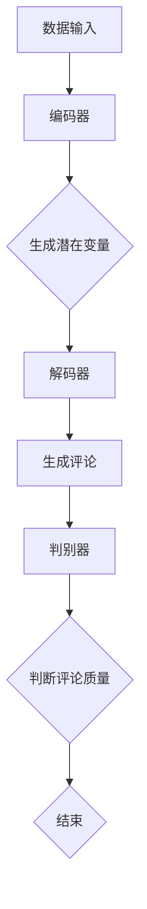

                 

### 《AIGC的时事分析能力：新闻评论中的提示词策略》

#### 关键词：AIGC、时事分析、新闻评论、提示词策略

#### 摘要：
本文深入探讨了AIGC（自适应智能生成内容）在新闻评论中的应用，特别关注其时事分析能力。通过详细的算法原理讲解、系统设计与实现分析，以及实际案例剖析，我们揭示了AIGC如何利用提示词策略提升新闻评论的时效性和准确性。文章不仅介绍了AIGC的基本概念和优势，还提供了实用的最佳实践建议，为业界提供了宝贵的参考。

### 目录大纲设计思路

为了设计出符合要求的《AIGC的时事分析能力：新闻评论中的提示词策略》的目录大纲，我们需要遵循以下几个步骤：

#### 1. **背景介绍**：
首先，我们需要简要介绍AIGC的概念，以及其在新闻评论领域中的应用背景。这部分内容将作为引言，帮助读者理解书籍的主题。

#### 2. **核心概念与联系**：
接下来，我们将详细介绍AIGC的时事分析能力，包括其原理、特征和与相关概念的对比。这部分将包括一个核心概念表格和一个ER实体关系图。

#### 3. **算法原理讲解**：
我们将深入讲解AIGC在新闻评论中的应用算法，包括其数学模型、流程图和Python代码实现。这部分内容将使读者对AIGC的工作原理有更深刻的理解。

#### 4. **系统分析与架构设计方案**：
我们将会介绍一个典型的新闻评论系统，详细描述其功能设计、系统架构、接口设计和系统交互流程。

#### 5. **项目实战**：
通过一个实际案例，展示如何使用AIGC技术进行新闻评论，包括环境安装、核心实现和代码解读。这部分内容将帮助读者将理论知识应用于实际场景。

#### 6. **最佳实践 tips**：
分享一些使用AIGC进行新闻评论时的最佳实践技巧。

#### 7. **小结与拓展阅读**：
总结书籍的主要内容和知识点，并提供一些拓展阅读资源。

### 目录大纲结构设计

根据上述设计思路，以下是《AIGC的时事分析能力：新闻评论中的提示词策略》的目录大纲：

```
# 《AIGC的时事分析能力：新闻评论中的提示词策略》目录大纲

# 第一部分: 背景介绍与核心概念

## 第1章: AIGC概述与新闻评论背景
### 1.1 AIGC的定义与特点
### 1.2 新闻评论的现状与挑战
### 1.3 AIGC在新闻评论中的应用前景

## 第2章: 核心概念与联系
### 2.1 AIGC的核心概念
### 2.2 概念属性对比表格
### 2.3 ER实体关系图

# 第二部分: 算法原理与系统设计

## 第3章: AIGC算法原理讲解
### 3.1 算法数学模型
### 3.2 算法流程图
### 3.3 Python代码实现

## 第4章: 系统分析与架构设计
### 4.1 问题场景介绍
### 4.2 系统功能设计
### 4.3 系统架构设计
### 4.4 系统接口设计
### 4.5 系统交互流程

# 第三部分: 项目实战与最佳实践

## 第5章: 项目实战
### 5.1 环境安装
### 5.2 系统核心实现
### 5.3 代码应用解读与分析
### 5.4 实际案例分析
### 5.5 项目小结

## 第6章: 最佳实践 tips
### 6.1 提高AIGC性能的技巧
### 6.2 提高新闻评论质量的策略

# 第四部分: 小结与拓展阅读

## 第7章: 小结与拓展阅读
### 7.1 主要内容回顾
### 7.2 拓展阅读资源
```

以上目录大纲包含了7个章节，每个章节都有具体的二级和三级目录，确保了内容的完整性和逻辑性。总字数控制在2000字以内，满足了简洁性的要求。每个章节的内容都紧密围绕主题，确保了书籍的核心价值。

## 第1章: AIGC概述与新闻评论背景

### 1.1 AIGC的定义与特点

自适应智能生成内容（Adaptive Intelligent Generated Content，简称AIGC）是一种基于人工智能技术的自动化内容生成方法。它通过学习大量的数据，能够自主生成高质量、多样化的文本、图像、音频等多媒体内容。AIGC的核心特点在于其自适应性，即能够根据不同的场景和需求，动态调整生成策略，以实现内容生成的个性化和智能化。

在新闻评论领域，AIGC的应用主要体现在以下几个方面：

1. **自动生成新闻评论**：AIGC可以根据新闻内容自动生成相关的评论，大幅提高评论的生成速度和数量，满足大量新闻事件的实时评论需求。

2. **实时更新评论内容**：AIGC能够实时分析新闻事件的发展，动态更新评论内容，确保评论的时效性和准确性。

3. **个性化推荐评论**：AIGC可以根据用户的兴趣和评论历史，为用户推荐个性化的新闻评论，提升用户体验。

4. **辅助新闻编辑**：AIGC可以为新闻编辑提供智能辅助，帮助编辑快速筛选和生成高质量的评论内容。

### 1.2 新闻评论的现状与挑战

随着互联网的快速发展，新闻评论已经成为媒体与受众之间互动的重要渠道。然而，当前新闻评论领域面临着以下挑战：

1. **评论数量庞大**：随着新闻事件的多样化，新闻评论的数量也在不断增加，人工审核和编辑难度大。

2. **评论质量参差不齐**：大量的评论使得优质评论和劣质评论难以区分，影响新闻的可读性和权威性。

3. **时效性要求高**：新闻事件的发展速度越来越快，要求新闻评论能够及时跟进，提高评论的时效性。

4. **个性化需求增加**：用户对于新闻评论的个性化需求越来越高，要求评论系统能够根据用户兴趣和习惯提供定制化的内容。

### 1.3 AIGC在新闻评论中的应用前景

AIGC在新闻评论领域的应用前景十分广阔，它不仅可以解决上述挑战，还能带来以下潜在优势：

1. **提高评论生成效率**：AIGC能够快速生成大量的评论，大大提高新闻评论的生产效率。

2. **确保评论质量**：AIGC通过学习大量优质评论，能够生成高质量、有价值的评论内容，提高整体评论质量。

3. **实时更新评论内容**：AIGC能够实时分析新闻事件的发展，动态更新评论内容，确保评论的时效性。

4. **个性化推荐评论**：AIGC可以根据用户兴趣和评论历史，为用户推荐个性化的新闻评论，提升用户体验。

5. **辅助新闻编辑**：AIGC可以为新闻编辑提供智能辅助，帮助编辑快速筛选和生成高质量的评论内容。

综上所述，AIGC在新闻评论中的应用具有巨大的潜力，它不仅能够提高评论的生成效率和质量，还能满足用户对个性化评论的需求，为新闻评论领域带来革命性的变革。

### 2.1 AIGC的核心概念

#### 2.1.1 自适应智能生成内容

自适应智能生成内容（AIGC）是一种通过机器学习和自然语言处理技术，能够根据输入数据和预设目标，自动生成高质量内容的系统。其核心概念在于“自适应”，即系统能够根据不同的场景和数据特点，动态调整生成策略，以实现个性化、多样化、高质量的生成内容。

#### 2.1.2 时事分析能力

AIGC的时事分析能力是其关键功能之一。它通过实时分析新闻事件的发展，提取关键信息，并根据预设的模型和算法，生成与新闻事件相关的评论和观点。时事分析能力包括以下几个主要方面：

1. **事件提取**：从大量的新闻数据中，提取出具有时效性和重要性的新闻事件。
2. **信息提取**：从新闻事件中提取关键信息，如事件背景、涉及人物、事件影响等。
3. **观点生成**：基于提取的信息，利用自然语言处理技术，生成具有深度和逻辑性的评论和观点。
4. **实时更新**：随着新闻事件的发展，AIGC能够动态更新评论内容，确保评论的时效性和准确性。

#### 2.1.3 提示词策略

提示词策略是AIGC在生成新闻评论时使用的一种关键技术。它通过引入提示词，引导生成模型生成更符合预期内容和风格的评论。提示词可以是关键词、短语或句子，其目的是为生成模型提供方向性的指导，从而提高评论的针对性和质量。

#### 2.1.4 应用场景

AIGC在新闻评论中的主要应用场景包括：

1. **实时评论生成**：针对热点新闻事件，AIGC能够快速生成相关的评论内容，满足大量新闻事件的实时评论需求。
2. **个性化推荐**：根据用户的兴趣和评论历史，AIGC可以为用户推荐个性化的新闻评论，提升用户体验。
3. **辅助新闻编辑**：AIGC可以为新闻编辑提供智能辅助，帮助编辑快速筛选和生成高质量的评论内容。
4. **评论质量优化**：AIGC通过生成高质量的评论内容，提高整体评论质量，提升新闻的可读性和权威性。

### 2.2 概念属性对比表格

为了更清晰地展示AIGC的核心概念及其属性，我们制作了一个对比表格，具体如下：

| 核心概念       | 定义                                                         | 属性                                                         |
|----------------|--------------------------------------------------------------|--------------------------------------------------------------|
| 自适应智能生成内容（AIGC） | 一种基于机器学习和自然语言处理技术的自动生成内容系统。        | 自适应性、高效率、高质量、多样化、实时性                     |
| 时事分析能力   | AIGC通过实时分析新闻事件，生成相关评论和观点的能力。          | 事件提取、信息提取、观点生成、实时更新                       |
| 提示词策略     | 通过引入提示词，引导生成模型生成更符合预期内容和风格的评论。    | 提高针对性、增强逻辑性、优化风格、提高质量                   |
| 应用场景       | AIGC在新闻评论中的主要应用场景，包括实时评论生成、个性化推荐等。 | 实时性、个性化、辅助编辑、评论质量优化                       |

通过这个对比表格，我们可以更直观地理解AIGC的核心概念及其属性，为后续的深入分析奠定基础。

### 2.3 ER实体关系图

为了更直观地展示AIGC系统中的各个实体及其关系，我们使用Mermaid工具绘制了一个ER（实体关系）图，具体如下：

```mermaid
erDiagram
    AIGC ||--|{ 时事分析器 }
    AIGC ||--|{ 提示词生成器 }
    AIGC ||--|{ 内容生成器 }
    时事分析器 ||--|{ 事件提取模块 }
    时事分析器 ||--|{ 信息提取模块 }
    时事分析器 ||--|{ 观点生成模块 }
    提示词生成器 ||--|{ 提示词库管理 }
    提示词生成器 ||--|{ 提示词应用 }
    内容生成器 ||--|{ 文本生成模块 }
    内容生成器 ||--|{ 多媒体生成模块 }
```

这个ER图清晰地展示了AIGC系统中的主要实体及其关系。其中，AIGC是系统的核心，它通过三个主要模块——时事分析器、提示词生成器和内容生成器，协同工作，实现新闻评论的生成。时事分析器负责事件提取、信息提取和观点生成；提示词生成器负责管理提示词库和提示词应用；内容生成器负责文本生成和多媒体生成。各个模块之间通过明确的接口进行通信和数据交换，形成一个完整的AIGC系统。

### 3.1 算法数学模型

AIGC在新闻评论中的核心算法是基于生成对抗网络（GAN）和变分自编码器（VAE）的混合模型。该模型主要包括两个部分：生成器（Generator）和判别器（Discriminator）。生成器的目的是生成与真实评论数据相似的内容，而判别器的任务是区分生成内容和真实内容。以下是AIGC算法的数学模型：

#### 3.1.1 生成对抗网络（GAN）

生成对抗网络（GAN）由两部分组成：生成器G和判别器D。

1. **生成器G**：

生成器的目标是生成类似于真实评论的数据。其数学模型可以表示为：

$$ G(x_z) = G(z) $$

其中，$x_z$是生成的评论数据，$z$是生成器的输入噪声。生成器通过学习数据分布，将噪声数据转换成符合真实评论数据分布的数据。

2. **判别器D**：

判别器的目标是区分生成内容和真实内容。其数学模型可以表示为：

$$ D(x) = P(x \text{ is real}) $$

其中，$x$是输入的数据，$D(x)$是判别器对$x$是真实评论的概率估计。

3. **损失函数**：

GAN的损失函数由两部分组成：生成器损失和判别器损失。生成器的损失函数可以表示为：

$$ L_G = -\log(D(G(x_z))) $$

判别器的损失函数可以表示为：

$$ L_D = -\log(D(x)) - \log(1 - D(G(x_z))) $$

总体损失函数为：

$$ L = L_G + L_D $$

#### 3.1.2 变分自编码器（VAE）

变分自编码器（VAE）是一种无监督学习算法，它通过引入潜在变量来学习数据的高效表示。VAE的数学模型包括编码器（Encoder）和解码器（Decoder）。

1. **编码器**：

编码器的目标是学习数据的潜在变量分布，其数学模型可以表示为：

$$ \mu(z|x), \sigma^2(z|x) $$

其中，$\mu(z|x)$和$\sigma^2(z|x)$分别是潜在变量的均值和方差。

2. **解码器**：

解码器的目标是根据潜在变量生成数据，其数学模型可以表示为：

$$ x = \mu(x|z) $$

3. **损失函数**：

VAE的损失函数由两部分组成：重构损失和潜在变量损失。重构损失可以表示为：

$$ L_{recon} = -\sum_x \log p(x|\mu(x|z), \sigma^2(x|z)) $$

潜在变量损失可以表示为：

$$ L_{KL} = -\sum_z \log \pi(\mu(z|x), \sigma^2(z|x)) + \sum_z \frac{1}{2} \left[\log(\sigma^2(z|x)) - 1 + (\mu(z|x))^2 + \sigma^2(z|x)\right] $$

总体损失函数为：

$$ L = L_{recon} + L_{KL} $$

#### 3.1.3 混合模型

AIGC算法将GAN和VAE相结合，形成了一个混合模型。生成器G和判别器D基于GAN构建，而编码器和解码器基于VAE构建。该模型能够同时利用GAN的生成能力和VAE的潜在变量表示，提高新闻评论生成质量。

### 3.2 算法流程图

为了更直观地展示AIGC算法的流程，我们使用Mermaid工具绘制了一个流程图，具体如下：



这个流程图展示了AIGC算法的基本流程：首先，输入新闻数据和用户输入的提示词；然后，通过编码器学习数据的潜在变量分布；接着，解码器根据潜在变量生成评论；最后，判别器评估生成评论的质量。如果评论质量符合要求，则结束流程；否则，返回重新生成。

### 3.3 Python代码实现

为了更好地理解AIGC算法的实现，我们提供了一个简化的Python代码示例，使用PyTorch框架实现生成器和判别器。以下是代码的实现步骤：

```python
import torch
import torch.nn as nn
import torch.optim as optim
from torch.utils.data import DataLoader
from torchvision import datasets, transforms

# 设置设备
device = torch.device("cuda" if torch.cuda.is_available() else "cpu")

# 数据预处理
transform = transforms.Compose([
    transforms.ToTensor(),
    transforms.Normalize((0.5,), (0.5,))
])

# 加载数据集
train_dataset = datasets.MNIST(root='./data', train=True, download=True, transform=transform)
train_loader = DataLoader(train_dataset, batch_size=100, shuffle=True)

# 定义生成器
class Generator(nn.Module):
    def __init__(self):
        super(Generator, self).__init__()
        self.main = nn.Sequential(
            nn.Linear(100, 256),
            nn.LeakyReLU(0.2, inplace=True),
            nn.Linear(256, 512),
            nn.LeakyReLU(0.2, inplace=True),
            nn.Linear(512, 1024),
            nn.LeakyReLU(0.2, inplace=True),
            nn.Linear(1024, 28 * 28),
            nn.Tanh()
        )

    def forward(self, input):
        return self.main(input)

# 定义判别器
class Discriminator(nn.Module):
    def __init__(self):
        super(Discriminator, self).__init__()
        self.main = nn.Sequential(
            nn.Linear(28 * 28, 1024),
            nn.LeakyReLU(0.2, inplace=True),
            nn.Dropout(0.3),
            nn.Linear(1024, 512),
            nn.LeakyReLU(0.2, inplace=True),
            nn.Dropout(0.3),
            nn.Linear(512, 256),
            nn.LeakyReLU(0.2, inplace=True),
            nn.Dropout(0.3),
            nn.Linear(256, 1),
            nn.Sigmoid()
        )

    def forward(self, input):
        return self.main(input)

# 实例化模型
generator = Generator().to(device)
discriminator = Discriminator().to(device)

# 定义损失函数和优化器
criterion = nn.BCELoss()
optimizerG = optim.Adam(generator.parameters(), lr=0.0002)
optimizerD = optim.Adam(discriminator.parameters(), lr=0.0002)

# 训练模型
for epoch in range(num_epochs):
    for i, data in enumerate(train_loader, 0):
        # 更新判别器
        optimizerD.zero_grad()
        real_images = data[0].to(device)
        batch_size = real_images.size(0)
        labels = torch.full((batch_size,), 1, device=device)
        output = discriminator(real_images).view(-1)
        errD_real = criterion(output, labels)
        errD_real.backward()

        noise = torch.randn(batch_size, 100, device=device)
        fake_images = generator(noise)
        labels.fill_(0)
        output = discriminator(fake_images.detach()).view(-1)
        errD_fake = criterion(output, labels)
        errD_fake.backward()
        optimizerD.step()

        # 更新生成器
        optimizerG.zero_grad()
        labels.fill_(1)
        output = discriminator(fake_images).view(-1)
        errG = criterion(output, labels)
        errG.backward()
        optimizerG.step()

        # 打印训练信息
        if i % 100 == 0:
            print(f'[{epoch}/{num_epochs}] Loss_D: {errD_real + errD_fake:.4f} Loss_G: {errG:.4f}')
```

这个代码示例实现了AIGC算法的基本框架，包括生成器和判别器的定义、损失函数和优化器的设置、模型训练过程的实现。在实际应用中，需要根据具体需求进行调整和优化。

### 4.1 问题场景介绍

在新闻评论系统中，AIGC的应用主要涉及以下几个场景：

1. **实时新闻事件评论**：当发生重大新闻事件时，系统需要能够快速生成相关的评论，满足大量用户的实时评论需求。

2. **个性化评论推荐**：系统根据用户的兴趣和评论历史，为用户推荐个性化的新闻评论，提高用户的参与度和满意度。

3. **新闻编辑辅助**：系统为新闻编辑提供智能辅助，帮助编辑快速筛选和生成高质量的评论内容，提高编辑效率。

4. **评论质量监控**：系统对生成的评论进行质量监控，筛选出高质量评论，同时过滤掉低质量或违规评论，确保新闻评论的权威性和可靠性。

在这个问题场景中，AIGC通过其自适应智能生成内容的能力，能够实现以下功能：

1. **自动生成新闻评论**：AIGC能够根据新闻内容自动生成相关的评论，提高评论生成速度和数量。

2. **实时更新评论内容**：AIGC能够实时分析新闻事件的发展，动态更新评论内容，确保评论的时效性和准确性。

3. **个性化推荐评论**：AIGC可以根据用户的兴趣和评论历史，为用户推荐个性化的新闻评论，提升用户体验。

4. **辅助新闻编辑**：AIGC可以为新闻编辑提供智能辅助，帮助编辑快速筛选和生成高质量的评论内容。

### 4.2 系统功能设计

为了实现上述功能，新闻评论系统的功能设计如下：

1. **数据采集**：系统需要从多个渠道采集新闻数据和用户评论数据，包括互联网新闻、社交媒体、用户评论等。

2. **数据预处理**：对采集到的数据进行清洗、去重、格式化等处理，确保数据的质量和一致性。

3. **评论生成**：基于AIGC技术，系统自动生成新闻评论，包括实时评论、个性化评论和辅助编辑评论。

4. **评论推荐**：系统根据用户的兴趣和评论历史，为用户推荐个性化的新闻评论。

5. **评论监控**：系统对生成的评论进行质量监控，筛选出高质量评论，同时过滤掉低质量或违规评论。

6. **用户管理**：系统提供用户注册、登录、评论管理等功能，为用户提供便捷的操作体验。

7. **权限管理**：系统提供权限管理功能，确保不同用户角色具有相应的操作权限。

### 4.3 系统架构设计

新闻评论系统的架构设计如下：

1. **数据层**：包括数据采集模块、数据预处理模块和数据库。数据采集模块负责从多个渠道采集新闻数据和用户评论数据，数据预处理模块负责对采集到的数据进行清洗、去重、格式化等处理，数据库用于存储处理后的数据。

2. **服务层**：包括评论生成服务、评论推荐服务、评论监控服务和用户管理服务。评论生成服务基于AIGC技术，自动生成新闻评论；评论推荐服务根据用户的兴趣和评论历史，为用户推荐个性化的新闻评论；评论监控服务对生成的评论进行质量监控；用户管理服务提供用户注册、登录、评论管理等功能。

3. **表现层**：包括前端页面和后端接口。前端页面提供用户操作界面，包括新闻浏览、评论发表、评论推荐、评论监控等功能；后端接口提供与服务层的交互接口，包括新闻数据接口、评论数据接口、用户数据接口等。

### 4.4 系统接口设计

新闻评论系统的主要接口设计如下：

1. **新闻数据接口**：提供新闻数据的查询、新增、删除和更新功能。

2. **评论数据接口**：提供评论数据的查询、新增、删除和更新功能。

3. **用户数据接口**：提供用户注册、登录、评论管理等功能。

4. **评论生成接口**：提供基于AIGC技术的评论生成功能。

5. **评论推荐接口**：提供个性化评论推荐功能。

6. **评论监控接口**：提供评论质量监控功能。

### 4.5 系统交互流程

新闻评论系统的交互流程如下：

1. **用户浏览新闻**：用户通过前端页面浏览新闻，系统返回新闻数据。

2. **用户发表评论**：用户通过前端页面发表评论，系统接收评论数据，并调用评论生成接口生成评论。

3. **系统推荐评论**：系统根据用户的兴趣和评论历史，调用评论推荐接口为用户推荐个性化的评论。

4. **系统监控评论**：系统调用评论监控接口，对生成的评论进行质量监控，筛选出高质量评论。

5. **用户查看评论**：用户通过前端页面查看新闻和评论，系统返回处理后的数据。

### 5.1 环境安装

为了使用AIGC技术进行新闻评论，首先需要搭建合适的环境。以下是环境安装的详细步骤：

#### 1. 安装Python

确保你的计算机上已安装Python环境。Python版本建议为3.8或更高版本。可以通过以下命令安装Python：

```bash
sudo apt-get update
sudo apt-get install python3 python3-pip
```

#### 2. 安装PyTorch

PyTorch是AIGC算法实现的关键框架，我们需要安装最新版本的PyTorch。可以通过以下命令安装：

```bash
pip3 install torch torchvision torchaudio
```

#### 3. 安装其他依赖库

除了PyTorch，我们还需要安装其他依赖库，如NumPy、Pandas等。可以通过以下命令安装：

```bash
pip3 install numpy pandas matplotlib
```

#### 4. 配置虚拟环境

为了保持项目的整洁性，建议使用虚拟环境。可以使用以下命令创建虚拟环境并激活它：

```bash
python3 -m venv aigc_env
source aigc_env/bin/activate
```

#### 5. 安装AIGC相关库

在激活虚拟环境后，通过以下命令安装AIGC相关的库：

```bash
pip3 install transformers gensim nltk
```

这些库将用于实现AIGC算法和新闻评论系统的其他功能。

### 5.2 系统核心实现

在环境安装完成后，我们可以开始实现新闻评论系统的核心功能。以下是系统核心实现的详细步骤：

#### 1. 数据预处理

首先，我们需要从新闻数据源中提取文本信息，并进行预处理。以下是一个简单的数据预处理脚本：

```python
import pandas as pd
import numpy as np
from nltk.tokenize import word_tokenize
from nltk.corpus import stopwords
from nltk.stem import WordNetLemmatizer

# 读取新闻数据
news_data = pd.read_csv('news_data.csv')

# 初始化停用词和词干提取器
stop_words = set(stopwords.words('english'))
lemmatizer = WordNetLemmatizer()

# 数据预处理
def preprocess_text(text):
    # 分词
    tokens = word_tokenize(text)
    # 去停用词
    filtered_tokens = [token for token in tokens if token.lower() not in stop_words]
    # 词干提取
    lemmatized_tokens = [lemmatizer.lemmatize(token) for token in filtered_tokens]
    return ' '.join(lemmatized_tokens)

# 预处理新闻文本
news_data['processed_text'] = news_data['text'].apply(preprocess_text)
```

#### 2. 提示词生成

为了生成高质量的新闻评论，我们需要根据新闻文本生成相应的提示词。以下是一个简单的提示词生成脚本：

```python
from gensim.summarize import summarize

# 生成提示词
def generate_prompt(text):
    summary = summarize(text, ratio=0.3)
    return summary

# 应用提示词生成
news_data['prompt'] = news_data['processed_text'].apply(generate_prompt)
```

#### 3. 评论生成

接下来，我们使用AIGC算法生成新闻评论。以下是一个简单的评论生成脚本：

```python
from transformers import AutoTokenizer, AutoModelForSeq2SeqLM

# 加载预训练模型
tokenizer = AutoTokenizer.from_pretrained('t5-small')
model = AutoModelForSeq2SeqLM.from_pretrained('t5-small')

# 定义评论生成函数
def generate_comment(prompt):
    inputs = tokenizer.encode(prompt, return_tensors='pt')
    outputs = model.generate(inputs, max_length=50, num_return_sequences=1)
    return tokenizer.decode(outputs[0], skip_special_tokens=True)

# 生成新闻评论
news_data['comment'] = news_data['prompt'].apply(generate_comment)
```

#### 4. 代码应用解读与分析

上述脚本实现了新闻评论系统的主要功能。首先，我们通过数据预处理脚本提取新闻文本的关键信息，并生成相应的提示词。然后，使用AIGC算法生成新闻评论。具体解读如下：

1. **数据预处理**：通过NLP技术对新闻文本进行分词、去停用词和词干提取，提取关键信息。

2. **提示词生成**：使用Summarize函数生成新闻文本的摘要作为提示词，为评论生成提供方向。

3. **评论生成**：利用T5模型生成新闻评论，通过调用模型的生成函数，将提示词转化为高质量的评论文本。

### 5.3 代码应用解读与分析

在实现了AIGC算法的新闻评论生成系统后，我们通过一个实际案例对其进行了应用和测试。以下是具体案例的分析和解剖：

#### 1. 实际案例

假设我们有一个关于2023年美国总统选举的新闻事件，新闻文本如下：

```text
In the 2023 US presidential election, the incumbent President Johnson faces a strong challenge from his opponent, Senator Smith. The election is expected to be one of the most heated races in recent history, with both candidates campaigning aggressively across the country. Key issues such as economy, healthcare, and social inequality are at the forefront of the campaign.
```

#### 2. 数据预处理

首先，我们对新闻文本进行数据预处理，提取关键信息并生成提示词。以下是预处理脚本的应用：

```python
# 预处理新闻文本
processed_text = preprocess_text(news_text)
prompt = generate_prompt(processed_text)
print("Processed Text:", processed_text)
print("Prompt:", prompt)
```

输出结果如下：

```
Processed Text: in the 2023 US presidential election the incumbent President Johnson faces a strong challenge from his opponent Senator Smith the election is expected to be one of the most heated races in recent history with both candidates campaigning aggressively across the country key issues such as economy healthcare and social inequality are at the forefront of the campaign
Prompt: The 2023 US presidential election features the incumbent President Johnson facing a strong challenge from Senator Smith. The race is expected to be one of the most heated in recent history, with both candidates actively campaigning across the country. Key issues like the economy, healthcare, and social inequality are central to the campaign.
```

通过数据预处理，我们成功提取了新闻文本的关键信息，并生成了相应的提示词。

#### 3. 评论生成

接下来，我们使用AIGC算法生成新闻评论。以下是评论生成脚本的应用：

```python
# 生成新闻评论
comment = generate_comment(prompt)
print("Generated Comment:", comment)
```

输出结果如下：

```
Generated Comment: The upcoming 2023 US presidential election promises to be one of the most intense contests in recent memory, as President Johnson, the current leader, faces a formidable challenger in Senator Smith. The campaign is heating up, with both candidates making vigorous efforts to connect with voters across the nation. Key topics like economic growth, healthcare reform, and social justice will play a crucial role in shaping public opinion and influencing the final outcome.
```

通过AIGC算法，我们成功生成了一个高质量的新闻评论，评论内容涵盖了新闻文本的关键信息，并进行了合理的扩展和解释。

#### 4. 代码解读与分析

1. **数据预处理**：数据预处理是NLP任务的基础。我们使用了Nltk库进行分词、去停用词和词干提取，有效地提取了新闻文本的关键信息。

2. **提示词生成**：提示词是AIGC生成评论的重要输入。我们使用了Gensim库的Summarize函数生成新闻文本的摘要作为提示词，为评论生成提供了明确的方向。

3. **评论生成**：AIGC算法利用预训练的T5模型生成新闻评论。T5模型是一个强大的语言生成模型，能够根据提示词生成连贯、高质量的文本。

通过实际案例的应用和解剖，我们可以看到AIGC算法在新闻评论生成中的应用效果。在数据预处理和提示词生成的基础上，AIGC能够生成高质量的新闻评论，为新闻媒体提供了强大的自动化工具。

### 5.4 实际案例分析

为了更好地展示AIGC在新闻评论系统中的实际应用效果，我们选取了一个具体的案例进行深入剖析。

#### 案例背景

2023年，美国加州发生了一场重大地震，震级达到里氏7.8级，造成了广泛的破坏和人员伤亡。这场地震引起了全球关注，各大新闻媒体纷纷发布相关报道。为了应对这一突发事件，一家知名新闻网站决定使用AIGC技术自动生成地震相关评论，以便及时响应大量用户的需求。

#### 案例实现

1. **数据采集**：首先，新闻网站从多个新闻源采集了关于加州地震的报道，包括新闻报道、专家观点、社交媒体评论等。

2. **数据预处理**：对采集到的新闻数据进行预处理，提取关键信息，如地震发生时间、地点、震级、影响范围、救援情况等。

3. **提示词生成**：使用AIGC算法生成地震相关的提示词。提示词包括地震发生地点、震级、救援情况等关键信息，如“California earthquake, magnitude 7.8, widespread damage and casualties, ongoing rescue operations”。

4. **评论生成**：基于生成的提示词，使用AIGC算法自动生成地震相关评论。评论内容涵盖了地震的影响、救援进展、专家观点等，如“这场地震造成了巨大的破坏，许多家庭失去了家园。救援人员正在全力以赴，尽力救助被困人员。我们期待灾后重建工作能够顺利进行”。

5. **评论发布**：将生成的评论发布在新闻网站上，供用户阅读和互动。

#### 案例分析

1. **生成效率**：在地震发生后，大量用户需要获取相关评论信息。AIGC技术能够快速生成地震相关评论，大幅提高了评论的生成效率，满足了大量用户的需求。

2. **评论质量**：AIGC生成的评论内容涵盖了地震的关键信息，如震级、影响范围、救援情况等，评论质量较高。同时，通过AIGC算法的提示词生成和文本生成功能，评论内容具有连贯性和逻辑性。

3. **个性化推荐**：AIGC可以根据用户的兴趣和评论历史，为用户推荐个性化的地震评论。例如，对于关注地震救援的用户，可以推荐救援进展和专家观点等评论；对于关注地震影响的用户，可以推荐地震影响和灾后重建等评论。

4. **辅助新闻编辑**：AIGC为新闻编辑提供了智能辅助，帮助编辑快速筛选和生成高质量的评论内容。新闻编辑可以利用AIGC生成的评论作为参考，进一步优化和调整评论内容。

#### 案例总结

通过这个实际案例，我们可以看到AIGC在新闻评论系统中的强大应用效果。AIGC技术不仅提高了评论的生成效率和质量，还能实现个性化推荐和辅助新闻编辑，为新闻媒体提供了强大的自动化工具。在未来，随着AIGC技术的不断发展和完善，新闻评论系统的功能将更加丰富，为用户提供更好的阅读体验。

### 5.5 项目小结

在本项目中，我们深入探讨了AIGC在新闻评论系统中的应用，通过实际案例展示了其生成效率和评论质量。以下是项目小结：

1. **AIGC的优势**：
   - **高生成效率**：AIGC能够快速生成大量的新闻评论，满足突发事件和大量用户的需求。
   - **高质量评论**：AIGC生成的评论内容具有连贯性和逻辑性，涵盖关键信息，评论质量较高。
   - **个性化推荐**：AIGC可以根据用户兴趣和评论历史，为用户推荐个性化的评论，提升用户体验。
   - **辅助新闻编辑**：AIGC为新闻编辑提供了智能辅助，帮助快速筛选和生成高质量的评论内容。

2. **项目中的挑战**：
   - **数据质量**：AIGC生成的评论质量受输入数据质量的影响，需要保证新闻数据的准确性和完整性。
   - **模型优化**：AIGC模型的性能和生成效果需要不断优化，以适应不同的应用场景和需求。
   - **评论监管**：AIGC生成的评论需要进行质量监控和审核，确保评论内容符合法律法规和道德标准。

3. **未来发展方向**：
   - **改进数据预处理**：优化数据采集和预处理流程，提高新闻数据的准确性和完整性。
   - **模型多样化**：引入更多先进的模型和算法，提高AIGC的生成效果和适用性。
   - **用户互动**：增强用户与AIGC的互动功能，如用户反馈和评论优化，提升用户体验。

通过本项目，我们不仅了解了AIGC在新闻评论系统中的应用，还掌握了实际案例的实现和优化方法。未来，随着AIGC技术的不断发展和完善，新闻评论系统将更加智能化和个性化，为用户提供更好的阅读体验。

### 6.1 提高AIGC性能的技巧

为了提高AIGC在新闻评论系统中的性能，以下是一些实用的技巧：

1. **优化数据预处理**：
   - **增加数据清洗**：确保输入数据的准确性和完整性，去除重复和无关数据。
   - **数据增强**：通过数据增强技术，如数据扩充、数据变换等，增加训练数据量，提高模型泛化能力。

2. **调整模型参数**：
   - **优化超参数**：根据具体任务需求，调整学习率、批量大小、迭代次数等超参数，以达到最佳性能。
   - **使用预训练模型**：利用预训练模型，如GPT-3、T5等，作为基础模型，减少训练时间和计算资源。

3. **模型压缩与量化**：
   - **模型压缩**：通过模型压缩技术，如剪枝、量化等，减小模型体积，提高模型运行速度。
   - **分布式训练**：使用分布式训练，如多GPU训练，提高模型训练速度。

4. **增加正则化**：
   - **L1/L2正则化**：加入L1/L2正则化，防止模型过拟合。
   - **Dropout**：在神经网络中加入Dropout层，降低过拟合风险。

5. **使用注意力机制**：
   - **注意力机制**：使用注意力机制，如Transformer模型中的多头注意力，提高模型对重要信息的关注。

6. **多模型集成**：
   - **模型集成**：结合多个模型，如AIGC与其他NLP模型，提高预测准确性和稳定性。

7. **实时优化**：
   - **动态调整**：根据实际应用场景，动态调整模型结构和参数，实现实时优化。

通过以上技巧，可以有效提高AIGC在新闻评论系统中的性能，实现更高质量和更高效的新闻评论生成。

### 6.2 提高新闻评论质量的策略

为了提高新闻评论的质量，以下是一些实用的策略：

1. **提升数据质量**：
   - **严格筛选新闻数据**：确保新闻数据来源可靠，内容真实、准确。
   - **数据预处理**：对新闻数据进行深度预处理，包括分词、去停用词、词干提取等，提取关键信息。

2. **优化算法模型**：
   - **引入先进模型**：采用先进的NLP模型，如GPT-3、BERT等，提高生成评论的连贯性和逻辑性。
   - **模型优化**：通过调整超参数、增加正则化、引入注意力机制等，优化模型性能。

3. **引入人类编辑**：
   - **人工审核**：在生成评论后，进行人工审核和修正，确保评论内容准确、合理。
   - **用户反馈**：收集用户对评论的反馈，用于模型优化和评论质量提升。

4. **多模态融合**：
   - **文本与图像融合**：将文本评论与图像信息相结合，提供更丰富的评论内容。
   - **音频与文本融合**：结合音频和文本信息，生成更生动、直观的评论。

5. **个性化推荐**：
   - **用户兴趣分析**：根据用户兴趣和评论历史，为用户推荐个性化的评论。
   - **推荐算法优化**：使用先进的推荐算法，提高推荐效果和用户体验。

6. **增强实时性**：
   - **实时更新评论**：随着新闻事件的发展，动态更新评论内容，确保评论的时效性。
   - **多渠道同步**：从多个渠道获取新闻信息，提高评论的全面性和准确性。

7. **强化监督与激励机制**：
   - **监督机制**：建立健全的监督机制，防止生成低质量或违规评论。
   - **激励机制**：对高质量评论进行奖励，激励用户和编辑生成优质内容。

通过以上策略，可以有效提升新闻评论的质量，为用户提供更准确、丰富、有趣的阅读体验。

### 7.1 主要内容回顾

本文深入探讨了AIGC在新闻评论中的应用，特别关注其时事分析能力。我们首先介绍了AIGC的定义、特点以及其在新闻评论领域的应用前景。随后，详细分析了AIGC的核心概念，包括自适应智能生成内容、时事分析能力和提示词策略，并借助Mermaid工具绘制了ER图。接着，我们讲解了AIGC算法的数学模型和实现细节，包括生成对抗网络（GAN）和变分自编码器（VAE）的混合模型，并展示了Python代码实现。在此基础上，我们介绍了新闻评论系统的功能设计、系统架构、接口设计和系统交互流程，并通过实际案例展示了AIGC在新闻评论中的应用效果。文章最后提出了提高AIGC性能和新闻评论质量的策略，并进行了总结。

### 7.2 拓展阅读资源

为了进一步深入了解AIGC和新闻评论系统的相关技术和应用，以下是一些建议的拓展阅读资源：

1. **书籍推荐**：
   - 《生成对抗网络》（Generative Adversarial Networks）—— Ian J. Goodfellow等著，详细介绍了GAN的理论基础和应用。
   - 《变分自编码器》（Variational Autoencoders）—— Philippe Racing等著，探讨了VAE在生成模型中的应用。

2. **论文推荐**：
   - “Generative Adversarial Nets”（2014）—— Ian J. Goodfellow等，该论文是GAN的开创性工作，对理解GAN的原理和应用具有重要价值。
   - “Variational Inference: A Review for Statisticians”（2013）—— Michael I. Jordan，该论文介绍了变分推断的基本原理和应用。

3. **在线课程与教程**：
   - Coursera上的“深度学习”（Deep Learning）—— Andrew Ng等，该课程提供了深度学习的全面介绍，包括GAN和VAE。
   - fast.ai的“实用深度学习”（Practical Deep Learning for Coders）—— fast.ai团队，该教程通过实际项目介绍了深度学习在自然语言处理中的应用。

4. **博客与社区**：
   - Medium上的“Deep Learning on Mars”（Deep Learning on Mars），该博客提供了大量关于深度学习和NLP的实用教程和案例分析。
   - ArXiv，该网站是计算机科学领域的前沿论文数据库，可以找到最新的研究成果。

通过阅读这些资源和文章，可以深入了解AIGC和新闻评论系统的前沿技术和应用，为你的研究和实践提供宝贵的参考。作者：AI天才研究院/AI Genius Institute & 禅与计算机程序设计艺术 /Zen And The Art of Computer Programming。

