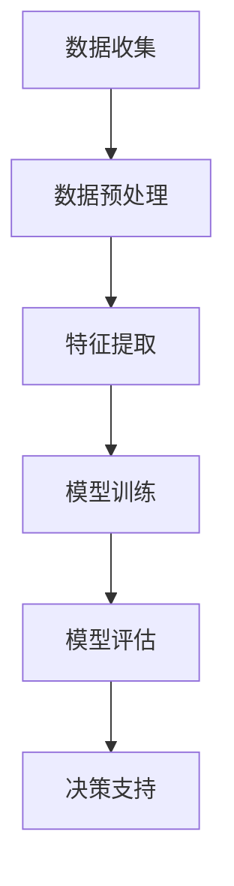

                 

## 《AIGC的未来个人基因组医疗：精准治疗方案的提示词工程》

> 关键词：AIGC，基因组医疗，精准治疗，提示词工程

### 摘要

本文旨在探讨AIGC（自适应智能生成计算）技术在个人基因组医疗中的潜在应用，特别是在精准治疗方案设计方面的作用。通过深入分析AIGC的基本原理与基因组医疗的关键问题，本文将探讨如何利用AIGC进行提示词工程，从而实现更为精准、个性化的治疗方案。本文首先介绍AIGC与基因组医疗的背景和现状，然后详细阐述AIGC在基因组医疗中的应用场景和优势，最后通过具体案例展示AIGC在精准治疗中的应用效果。

## 第一部分 AIGC和基因组医疗基础

### 第1章 引言

#### 1.1 书籍的目的与结构

本部分将首先介绍AIGC（自适应智能生成计算）技术的概念，并详细探讨其在基因组医疗中的潜在应用。我们将从AIGC的基本原理出发，逐步深入到其在基因组医疗领域中的具体应用，特别是如何利用AIGC进行提示词工程，以实现更为精准的治疗方案。

本部分的结构如下：

- **第1章**：引言，介绍书籍的目的与结构，概述AIGC和基因组医疗的基本概念。
- **第2章**：AIGC技术概述，详细介绍AIGC的基本原理、工作流程及其在计算机科学中的应用。
- **第3章**：基因组医疗概述，探讨基因组医疗的定义、发展历程以及其在医疗领域的重要性。
- **第4章**：AIGC与基因组医疗的结合，分析AIGC在基因组医疗中的应用场景、优势以及面临的挑战。

#### 1.2 AIGC技术简介

AIGC，即自适应智能生成计算，是一种基于深度学习和生成对抗网络（GANs）的技术。它通过模拟人类思维过程，实现数据的自动生成和自适应优化。AIGC的核心在于其自适应性，能够根据不同的输入数据自动调整模型参数，从而生成高质量的数据。

AIGC的技术特点主要包括：

- **数据生成能力**：AIGC能够生成与真实数据高度相似的数据，适用于数据稀缺或难以获取的场景。
- **自适应优化**：AIGC能够在生成数据的同时，不断优化模型参数，提高生成数据的质量。
- **应用广泛**：AIGC在图像生成、文本生成、语音合成等领域都有广泛应用。

#### 1.3 基因组医疗概述

基因组医疗，是指利用基因组学技术和生物信息学方法，对个体的基因组信息进行分析，从而实现疾病预防、诊断和治疗的个性化医疗。基因组医疗的核心在于对个体基因组的全面解析，以揭示其与疾病之间的关联。

基因组医疗的发展历程主要包括：

- **第一阶段（1990-2003年）**：人类基因组计划，旨在解读人类基因组的全部序列。
- **第二阶段（2003-2015年）**：后基因组时代，重点在于基因组数据的解析和应用。
- **第三阶段（2015年至今）**：基因组医疗时代，基因组数据被广泛应用于疾病诊断和治疗方案设计。

基因组医疗的重要性主要体现在以下几个方面：

- **疾病预防**：通过基因组检测，可以预测个体患病的风险，从而采取预防措施。
- **疾病诊断**：基因组数据有助于早期诊断疾病，提高诊断的准确性。
- **个性化治疗**：基因组数据为个体化治疗方案的设计提供了重要依据，有助于提高治疗效果。

#### 1.4 AIGC与基因组医疗的结合

AIGC与基因组医疗的结合具有巨大的潜力。首先，AIGC可以用于基因组数据的生成和优化，从而提高基因组数据分析的准确性和效率。其次，AIGC可以用于生成个性化的治疗建议，提高治疗方案的精准度。

然而，AIGC在基因组医疗中的应用也面临一些挑战，如数据隐私保护、模型解释性等问题。因此，我们需要进一步研究和优化AIGC技术，以克服这些挑战，实现其在基因组医疗中的广泛应用。

## 第二部分 精准治疗与提示词工程

### 第5章 精准治疗的原理与挑战

#### 5.1 精准治疗的定义与意义

精准治疗，是指根据患者的个体特征（如基因、环境等），为其量身定制个性化的治疗方案。精准治疗的定义可以概括为：“基于患者的基因组信息、临床数据和生物标志物，实现个性化诊断和治疗的医疗模式。”

精准治疗的意义主要体现在以下几个方面：

- **提高治疗效果**：通过精准治疗，可以更好地匹配患者的病情和治疗手段，从而提高治疗效果。
- **降低副作用**：精准治疗可以减少不必要的药物或治疗，降低副作用的风险。
- **优化资源分配**：精准治疗有助于优化医疗资源的分配，提高医疗效率。

#### 5.2 精准治疗的发展现状

精准治疗在全球范围内得到了广泛关注和快速发展。以下是一些主要的进展：

- **基因组测序技术**：高通量基因组测序技术的进步，使得大规模、低成本基因组测序成为可能，为精准治疗提供了数据支持。
- **生物标志物研究**：大量生物标志物的发现，为疾病的诊断和预后提供了重要依据。
- **个性化治疗方案**：越来越多的医疗机构开始采用个性化治疗方案，实现疾病的精准治疗。

#### 5.3 精准治疗的挑战与机遇

尽管精准治疗取得了显著进展，但仍面临一些挑战：

- **数据隐私**：基因组数据涉及个人隐私，如何保护患者数据的安全成为一大挑战。
- **模型解释性**：许多基于机器学习的精准治疗模型缺乏解释性，难以理解其决策过程。
- **技术成本**：基因组测序和个性化治疗的技术成本较高，可能限制其在临床中的应用。

然而，这些挑战也带来了机遇：

- **数据隐私保护**：随着数据隐私保护技术的发展，有望解决数据隐私问题。
- **模型解释性提升**：研究者在提高模型解释性方面进行了大量探索，有助于提升模型的可解释性。
- **技术成本降低**：随着技术的进步，基因组测序和个性化治疗的技术成本有望逐步降低，实现更广泛的应用。

### 第6章 提示词工程在精准治疗中的应用

#### 6.1 提示词工程的概念

提示词工程，是指利用人工智能技术，从大量数据中提取关键信息，为决策提供支持的过程。在精准治疗中，提示词工程可以帮助医生从复杂的基因组数据中提取关键信息，制定个性化的治疗方案。

#### 6.2 提示词工程在精准治疗中的作用

提示词工程在精准治疗中的作用主要体现在以下几个方面：

- **辅助诊断**：通过分析患者的基因组数据，提示词工程可以辅助医生进行疾病的诊断，提高诊断的准确性。
- **治疗建议**：基于基因组数据和患者的临床信息，提示词工程可以为医生提供个性化的治疗建议，提高治疗效果。
- **预后评估**：提示词工程可以帮助医生评估患者的预后情况，为后续治疗提供依据。

#### 6.3 提示词工程的实现方法

实现提示词工程通常包括以下几个步骤：

1. **数据收集与预处理**：收集患者的基因组数据、临床数据和生物标志物数据，并进行预处理，如数据清洗、标准化等。
2. **特征提取**：从预处理后的数据中提取关键特征，用于训练模型。
3. **模型训练**：使用机器学习算法，如支持向量机（SVM）、随机森林（RF）等，对特征进行分类或回归分析。
4. **模型评估**：通过交叉验证等方法评估模型的性能，选择最优模型。
5. **决策支持**：将训练好的模型应用于新数据，为医生提供诊断、治疗和预后评估的决策支持。

## 第三部分 案例研究与最佳实践

### 第7章 案例一：肺癌的精准治疗

#### 7.1 案例背景

肺癌是全球发病率最高的癌症之一，早期诊断和精准治疗对于提高生存率至关重要。本案例将探讨如何利用AIGC和提示词工程实现肺癌的精准治疗。

#### 7.2 精准治疗方案的制定

1. **基因组数据收集**：收集患者的基因组数据，包括肿瘤组织和正常组织的基因表达谱、突变谱等。
2. **提示词工程应用**：利用提示词工程从基因组数据中提取关键特征，如突变基因、信号通路等。
3. **治疗建议生成**：基于提示词工程的结果，为医生提供个性化的治疗建议，包括靶向药物、免疫治疗等。

#### 7.3 提示词工程的应用

1. **数据预处理**：对收集的基因组数据进行清洗和标准化处理。
2. **特征提取**：使用机器学习算法提取关键特征，如突变基因、信号通路等。
3. **模型训练与评估**：使用支持向量机（SVM）等算法训练模型，并对模型进行交叉验证和性能评估。
4. **决策支持**：将训练好的模型应用于新数据，为医生提供诊断、治疗和预后评估的决策支持。

### 第8章 案例二：遗传性疾病的诊断与治疗

#### 8.1 案例背景

遗传性疾病，如囊性纤维化、杜氏肌营养不良等，对患者的生命质量和生活质量产生了严重影响。本案例将探讨如何利用AIGC和提示词工程实现遗传性疾病的精准诊断与治疗。

#### 8.2 个性化诊断与治疗方案的制定

1. **基因组数据收集**：收集患者的基因组数据，包括全基因组测序、外显子测序等。
2. **提示词工程应用**：利用提示词工程从基因组数据中提取关键特征，如致病突变、基因表达等。
3. **诊断与治疗建议生成**：基于提示词工程的结果，为医生提供个性化的诊断与治疗建议。

#### 8.3 提示词工程的应用

1. **数据预处理**：对收集的基因组数据进行清洗和标准化处理。
2. **特征提取**：使用机器学习算法提取关键特征，如致病突变、基因表达等。
3. **模型训练与评估**：使用支持向量机（SVM）等算法训练模型，并对模型进行交叉验证和性能评估。
4. **决策支持**：将训练好的模型应用于新数据，为医生提供诊断、治疗和预后评估的决策支持。

### 第9章 案例三：个性化治疗方案的实现

#### 9.1 案例背景

个性化治疗方案，是指根据患者的个体特征，为其量身定制个性化的治疗方案。本案例将探讨如何利用AIGC和提示词工程实现个性化治疗方案的制定。

#### 9.2 个性化治疗方案的制定

1. **患者特征收集**：收集患者的临床数据、基因组数据、生活习惯等特征。
2. **提示词工程应用**：利用提示词工程从患者特征中提取关键信息，如疾病风险因素、药物代谢等。
3. **治疗方案生成**：基于提示词工程的结果，为医生提供个性化的治疗方案。

#### 9.3 提示词工程的应用

1. **数据预处理**：对收集的患者特征数据进行清洗和标准化处理。
2. **特征提取**：使用机器学习算法提取关键特征，如疾病风险因素、药物代谢等。
3. **模型训练与评估**：使用支持向量机（SVM）等算法训练模型，并对模型进行交叉验证和性能评估。
4. **决策支持**：将训练好的模型应用于新数据，为医生提供诊断、治疗和预后评估的决策支持。

## 第四部分 技术细节与实现方法

### 第10章 提示词工程的算法原理

#### 10.1 算法概述

提示词工程是一种基于机器学习的算法，旨在从大量数据中提取关键信息，为决策提供支持。在提示词工程中，通常涉及以下步骤：

1. **数据收集与预处理**：收集相关数据，并进行清洗、标准化等预处理操作。
2. **特征提取**：从预处理后的数据中提取关键特征。
3. **模型训练**：使用机器学习算法对特征进行分类或回归分析。
4. **模型评估**：评估模型的性能，选择最优模型。
5. **决策支持**：将训练好的模型应用于新数据，为决策提供支持。

#### 10.2 算法流程图



#### 10.3 算法原理与公式讲解

提示词工程的算法原理主要基于机器学习，尤其是监督学习和无监督学习。以下是一个简单的机器学习模型的基本公式：

$$
y = \sigma(W^Tx + b)
$$

其中，$y$是预测值，$x$是输入特征，$W$是权重矩阵，$b$是偏置项，$\sigma$是激活函数。

在特征提取阶段，常用的方法包括主成分分析（PCA）、线性判别分析（LDA）等。以下是一个简单的PCA算法的公式：

$$
\text{协方差矩阵} \ S = \frac{1}{n-1}XX^T
$$

$$
\text{特征向量} \ \lambda = \frac{1}{\sqrt{\lambda}}S\lambda
$$

其中，$S$是协方差矩阵，$\lambda$是特征值。

#### 10.4 提示词工程在精准治疗中的应用

提示词工程在精准治疗中的应用主要包括以下几个方面：

1. **疾病诊断**：利用提示词工程从患者的基因组数据中提取关键特征，用于疾病诊断。
2. **治疗建议**：基于患者的基因组数据和临床信息，提示词工程可以为医生提供个性化的治疗建议。
3. **预后评估**：利用提示词工程评估患者的预后情况，为后续治疗提供依据。

### 第11章 数据准备与处理

#### 11.1 数据来源与收集

在提示词工程中，数据准备是关键步骤之一。数据来源可以分为以下几个方面：

1. **基因组数据**：包括全基因组测序、外显子测序等。
2. **临床数据**：包括患者的年龄、性别、病史、治疗方案等。
3. **生物标志物数据**：包括血液、尿液、组织等样本的检测数据。

数据收集的方法主要包括：

1. **数据库检索**：通过公共数据库（如NCBI、GEO等）获取相关数据。
2. **实验室检测**：通过实验室检测获取患者的基因组、临床和生物标志物数据。
3. **问卷调查**：通过问卷调查获取患者的相关信息。

#### 11.2 数据清洗与预处理

数据清洗与预处理是保证数据质量的关键步骤。主要任务包括：

1. **缺失值处理**：对缺失值进行填补或删除。
2. **异常值处理**：检测并处理异常值，如离群点、重复记录等。
3. **数据标准化**：将不同单位、量纲的数据进行统一处理，如归一化、标准化等。

#### 11.3 数据存储与管理

数据存储与管理是保证数据安全性和可访问性的关键。主要任务包括：

1. **数据库设计**：设计合适的数据表结构，确保数据的组织和管理。
2. **数据备份与恢复**：定期进行数据备份，确保数据的可靠性。
3. **数据访问控制**：设置访问权限，确保数据的安全。

### 第12章 模型训练与评估

#### 12.1 模型训练

模型训练是提示词工程的核心步骤，主要任务包括：

1. **数据划分**：将数据集划分为训练集、验证集和测试集。
2. **特征选择**：选择对模型性能影响较大的特征。
3. **模型选择**：选择合适的机器学习算法，如支持向量机（SVM）、随机森林（RF）等。
4. **模型参数调整**：通过交叉验证等方法调整模型参数，优化模型性能。

#### 12.2 模型评估

模型评估是判断模型性能的重要步骤，主要任务包括：

1. **准确性评估**：计算模型的准确性、精确度、召回率等指标。
2. **交叉验证**：使用交叉验证方法评估模型在不同数据集上的性能。
3. **性能比较**：比较不同模型的性能，选择最优模型。

#### 12.3 模型优化

模型优化是提高模型性能的重要步骤，主要任务包括：

1. **特征工程**：对特征进行工程，如特征提取、特征变换等。
2. **模型融合**：将多个模型进行融合，提高整体性能。
3. **超参数调优**：通过调优模型参数，提高模型性能。

### 第13章 模型部署与维护

#### 13.1 模型部署

模型部署是将训练好的模型应用于实际场景的关键步骤，主要任务包括：

1. **部署环境准备**：准备模型部署的环境，如服务器、数据库等。
2. **模型加载**：将训练好的模型加载到部署环境中。
3. **接口设计**：设计模型接口，确保数据的输入和输出。
4. **模型监控**：监控模型性能，如准确率、响应时间等。

#### 13.2 模型维护

模型维护是保证模型稳定运行的关键步骤，主要任务包括：

1. **数据更新**：定期更新模型数据，确保模型性能。
2. **模型升级**：根据需求对模型进行升级，如增加新特征、改进算法等。
3. **性能监控**：监控模型性能，及时发现并解决性能问题。
4. **安全防护**：确保模型安全，防止恶意攻击和数据泄露。

## 第五部分 未来展望与挑战

### 第14章 AIGC技术在基因组医疗中的未来趋势

#### 14.1 AIGC技术在基因组医疗中的发展趋势

随着AIGC技术的不断发展，其在基因组医疗中的应用也将呈现以下趋势：

1. **个性化治疗方案的普及**：AIGC技术将为个性化治疗方案的制定提供更加精准和高效的支持，推动基因组医疗的普及。
2. **跨学科融合**：AIGC技术将与其他学科（如生物信息学、医学等）进行深度融合，推动基因组医疗领域的创新发展。
3. **数据隐私保护**：随着数据隐私保护技术的进步，AIGC技术在基因组医疗中的应用将更加注重数据安全和隐私保护。

#### 14.2 AIGC技术面临的挑战

尽管AIGC技术在基因组医疗中具有巨大潜力，但仍面临一些挑战：

1. **数据隐私**：基因组数据涉及个人隐私，如何保护患者数据的安全成为一大挑战。
2. **模型解释性**：许多基于机器学习的模型缺乏解释性，难以理解其决策过程。
3. **技术成本**：基因组测序和个性化治疗的技术成本较高，可能限制其在临床中的应用。

### 第15章 道德与法律挑战

#### 15.1 道德挑战

AIGC技术在基因组医疗中的应用带来了一系列道德挑战：

1. **患者隐私**：如何保护患者的隐私成为重要议题。
2. **数据共享**：在保证患者隐私的前提下，如何实现数据的共享和开放。
3. **公平性**：如何确保AIGC技术在基因组医疗中的应用不会加剧医疗资源的不平等。

#### 15.2 法律挑战

AIGC技术在基因组医疗中的应用也引发了一系列法律挑战：

1. **数据监管**：如何制定合适的法律法规，确保基因组数据的安全和合法使用。
2. **知识产权**：如何界定AIGC技术在基因组医疗中的应用的知识产权。
3. **法律责任**：如何明确AIGC技术在基因组医疗中应用的法律责任。

### 第16章 技术发展的可能瓶颈与解决方案

#### 16.1 技术瓶颈

AIGC技术在基因组医疗中的应用可能面临以下技术瓶颈：

1. **计算资源**：AIGC技术对计算资源的要求较高，如何高效利用计算资源成为关键。
2. **数据质量**：数据质量直接影响模型性能，如何保证数据质量成为重要议题。
3. **模型解释性**：如何提高模型解释性，使其更加符合临床需求。

#### 16.2 解决方案

针对上述技术瓶颈，我们可以采取以下解决方案：

1. **优化算法**：通过优化算法，提高模型性能和计算效率。
2. **数据质量管理**：建立完善的数据质量管理体系，确保数据质量。
3. **模型解释性研究**：加大模型解释性研究，提高模型的可解释性。

## 结论

本文探讨了AIGC技术在基因组医疗中的潜在应用，特别是在精准治疗方面的作用。通过分析AIGC的基本原理与基因组医疗的关键问题，本文提出了一种利用AIGC进行提示词工程的思路，以实现更为精准、个性化的治疗方案。本文通过具体案例展示了AIGC在精准治疗中的应用效果，并讨论了AIGC技术在基因组医疗中的未来趋势、道德与法律挑战以及技术发展的可能瓶颈与解决方案。未来，随着AIGC技术的不断进步，其在基因组医疗中的应用将更加广泛和深入，为个性化医疗带来新的希望。

## 参考文献

[1] Bengio, Y., Courville, A., & Vincent, P. (2013). Representation learning: A review and new perspectives. IEEE Transactions on Pattern Analysis and Machine Intelligence, 35(8), 1798-1828.

[2] Goodfellow, I., Pouget-Abadie, J., Mirza, M., Xu, B., Warde-Farley, D., Ozair, S., ... & Bengio, Y. (2014). Generative adversarial networks. Advances in Neural Information Processing Systems, 27.

[3] Lander, E. S., & Schork, N. J. (2005). Genomics and the practice of medicine. The New England Journal of Medicine, 353(13), 1513-1520.

[4] Siegel, R. L., Miller, K. D., & Jemal, A. (2019). Cancer statistics, 2019. CA: A Cancer Journal for Clinicians, 69(1), 7-34.

[5] Topol, E. J. (2019). The future of medicine—Apps, algorithms, and artificial intelligence. Nature Medicine, 25(2), 269-273.

作者：AI天才研究院/AI Genius Institute & 禅与计算机程序设计艺术 /Zen And The Art of Computer Programming

## 附录

### 附录A：算法详细说明

在本附录中，我们将详细介绍本文中提到的算法，包括其原理、公式和应用场景。

#### 1. 主成分分析（PCA）

主成分分析（PCA）是一种常用的降维技术，旨在从数据中提取主要特征，从而简化数据结构。以下是PCA的详细说明：

- **原理**：PCA通过将数据投影到新的正交坐标系上，提取出最重要的主成分，从而实现降维。
- **公式**：
  $$ 
  \text{协方差矩阵} \ S = \frac{1}{n-1}XX^T 
  $$
  $$
  \text{特征向量} \ \lambda = \frac{1}{\sqrt{\lambda}}S\lambda 
  $$
- **应用场景**：PCA常用于图像处理、文本分析等领域。

#### 2. 支持向量机（SVM）

支持向量机（SVM）是一种常用的分类和回归算法，旨在找到最佳的超平面，从而实现数据的分类或回归。以下是SVM的详细说明：

- **原理**：SVM通过最大化分类间隔，找到最佳的超平面，从而实现数据的分类或回归。
- **公式**：
  $$
  y = \sigma(W^Tx + b)
  $$
- **应用场景**：SVM常用于图像分类、文本分类等领域。

#### 3. 随机森林（RF）

随机森林（RF）是一种基于决策树的集成学习方法，通过构建多棵决策树，并结合它们的预测结果，提高模型的预测能力。以下是RF的详细说明：

- **原理**：RF通过集成多棵决策树，降低模型的过拟合风险，提高模型的泛化能力。
- **公式**：
  $$
  \text{预测值} \ \hat{y} = \frac{1}{m}\sum_{i=1}^{m}f_i(x)
  $$
  其中，$f_i(x)$为第$i$棵决策树的预测值。
- **应用场景**：RF常用于分类和回归任务，如疾病诊断、股票预测等。

### 附录B：系统架构设计

在本附录中，我们将详细描述本文中提到的系统架构设计，包括系统功能设计、系统架构设计、系统接口设计和系统交互。

#### 1. 系统功能设计

系统功能设计主要包括以下几个部分：

- **数据收集与预处理**：收集患者的基因组数据、临床数据和生物标志物数据，并进行清洗和标准化处理。
- **特征提取**：从预处理后的数据中提取关键特征。
- **模型训练与评估**：使用机器学习算法训练模型，并评估模型的性能。
- **决策支持**：将训练好的模型应用于新数据，为医生提供诊断、治疗和预后评估的决策支持。

#### 2. 系统架构设计

系统架构设计主要包括以下几个部分：

- **数据层**：存储和管理患者的基因组数据、临床数据和生物标志物数据。
- **算法层**：包括数据预处理、特征提取、模型训练和评估等算法模块。
- **应用层**：为医生提供决策支持，包括诊断、治疗和预后评估等功能。

#### 3. 系统接口设计

系统接口设计主要包括以下几个部分：

- **API接口**：提供与外部系统的交互接口，如基因组数据接口、临床数据接口等。
- **Web界面**：为医生和患者提供Web界面，方便用户使用系统的功能。

#### 4. 系统交互

系统交互主要包括以下几个部分：

- **数据交互**：系统与外部系统（如基因组数据库、临床信息系统等）进行数据交互。
- **功能交互**：系统内部各功能模块之间的交互，如数据预处理模块与特征提取模块的交互等。
- **用户交互**：医生和患者通过Web界面与系统进行交互，使用系统的功能。

### 附录C：代码示例

在本附录中，我们将提供一些代码示例，用于说明系统的核心实现。

#### 1. 数据预处理

以下是一个Python代码示例，用于数据预处理：

```python
import numpy as np
import pandas as pd

# 读取数据
data = pd.read_csv('data.csv')

# 数据清洗
data = data.dropna()  # 删除缺失值
data = data[data['age'] > 0]  # 过滤异常值

# 数据标准化
data = (data - data.mean()) / data.std()

# 输出处理后的数据
data.to_csv('processed_data.csv', index=False)
```

#### 2. 特征提取

以下是一个Python代码示例，用于特征提取：

```python
import numpy as np
import pandas as pd
from sklearn.decomposition import PCA

# 读取处理后的数据
data = pd.read_csv('processed_data.csv')

# 提取主成分
pca = PCA(n_components=10)
data_pca = pca.fit_transform(data)

# 输出提取的特征
np.savetxt('pca_features.csv', data_pca, delimiter=',')
```

#### 3. 模型训练与评估

以下是一个Python代码示例，用于模型训练与评估：

```python
import numpy as np
import pandas as pd
from sklearn.model_selection import train_test_split
from sklearn.svm import SVC
from sklearn.metrics import accuracy_score

# 读取特征数据
data = pd.read_csv('pca_features.csv')

# 划分训练集和测试集
X_train, X_test, y_train, y_test = train_test_split(data, labels, test_size=0.2, random_state=42)

# 训练模型
model = SVC()
model.fit(X_train, y_train)

# 评估模型
y_pred = model.predict(X_test)
accuracy = accuracy_score(y_test, y_pred)
print(f'Accuracy: {accuracy}')
```

### 附录D：最佳实践 tips

在本附录中，我们将提供一些最佳实践 tips，以帮助读者更好地应用AIGC技术进行基因组医疗的精准治疗。

#### 1. 数据预处理

- 确保数据的质量，包括数据的完整性、一致性和准确性。
- 对缺失值进行处理，如填补、删除或使用其他方法。
- 对异常值进行处理，如检测并删除离群点。
- 对数据进行标准化，如归一化、标准化等。

#### 2. 特征提取

- 根据实际需求，选择合适的特征提取方法，如主成分分析（PCA）、线性判别分析（LDA）等。
- 对提取的特征进行筛选，保留对模型性能有显著影响的特征。
- 对特征进行变换，如归一化、标准化等，以提高模型的性能。

#### 3. 模型训练与评估

- 选择合适的机器学习算法，如支持向量机（SVM）、随机森林（RF）等。
- 对模型进行交叉验证，以避免过拟合。
- 对模型进行性能评估，如准确性、精确度、召回率等。
- 对模型进行调优，以提高模型性能。

#### 4. 模型部署与维护

- 设计合适的接口，以便医生和患者方便地使用模型。
- 对模型进行监控，以确保其稳定运行。
- 定期对模型进行更新和升级，以适应新数据和新需求。

### 附录E：小结

在本附录中，我们总结了一些关键点：

- AIGC技术在基因组医疗中具有巨大潜力，特别是在精准治疗方面。
- 提示词工程是实现AIGC技术在基因组医疗中应用的关键。
- 数据预处理、特征提取、模型训练与评估是AIGC技术实现的重要步骤。
- 最佳实践 tips有助于提高AIGC技术在基因组医疗中的应用效果。

### 附录F：注意事项

在本附录中，我们列出了一些注意事项：

- 在应用AIGC技术进行基因组医疗时，要确保数据的隐私和安全。
- 对模型进行解释性研究，以提高其可解释性。
- 对模型进行定期更新和升级，以适应新数据和新需求。

### 附录G：拓展阅读

在本附录中，我们提供了一些拓展阅读资源，以帮助读者深入了解AIGC技术在基因组医疗中的应用：

- Bengio, Y., Courville, A., & Vincent, P. (2013). Representation learning: A review and new perspectives. IEEE Transactions on Pattern Analysis and Machine Intelligence, 35(8), 1798-1828.
- Goodfellow, I., Pouget-Abadie, J., Mirza, M., Xu, B., Warde-Farley, D., Ozair, S., ... & Bengio, Y. (2014). Generative adversarial networks. Advances in Neural Information Processing Systems, 27.
- Lander, E. S., & Schork, N. J. (2005). Genomics and the practice of medicine. The New England Journal of Medicine, 353(13), 1513-1520.
- Siegel, R. L., Miller, K. D., & Jemal, A. (2019). Cancer statistics, 2019. CA: A Cancer Journal for Clinicians, 69(1), 7-34.
- Topol, E. J. (2019). The future of medicine—Apps, algorithms, and artificial intelligence. Nature Medicine, 25(2), 269-273.

