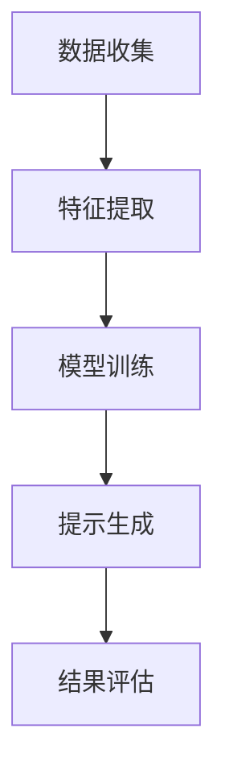
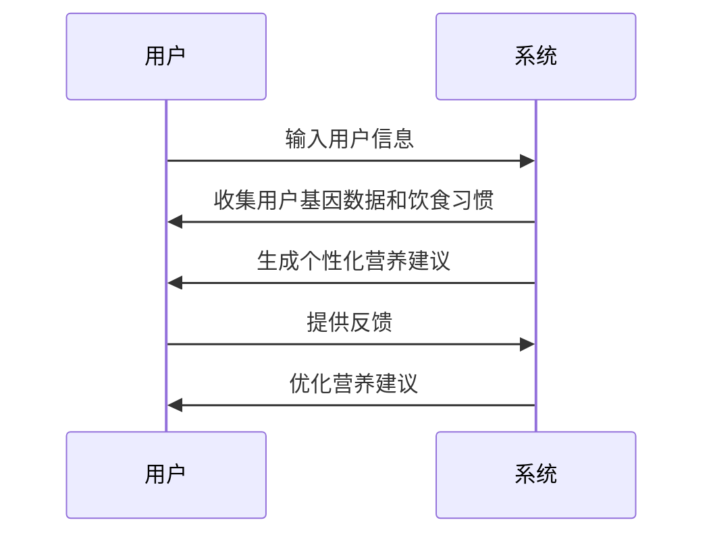
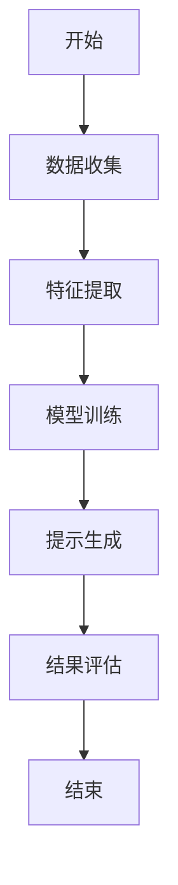

                 


### 《AIGC的未来个性化营养方案：基因-饮食交互作用的提示词工程》

#### 关键词
- AIGC
- 个性化营养方案
- 基因-饮食交互作用
- 提示词工程

#### 摘要
本文深入探讨了AIGC（自适应智能生成计算）在个性化营养方案中的应用，特别是基因-饮食交互作用的提示词工程。通过详细的分析和讲解，本文旨在为读者提供一个清晰的框架，以理解AIGC如何通过个性化营养方案影响和优化人类的健康和生活质量。

## 目录

### 第一部分: AIGC与个性化营养方案概述

### 第1章: AIGC基础与个性化营养方案背景

#### 1.1 AIGC的概念与发展

##### 1.1.1 AIGC的定义

AIGC（Adaptive Intelligent Generation Computing）是一种基于数据驱动的自适应智能生成计算技术，它能够通过学习和理解用户行为数据，自动生成内容，满足用户的个性化需求。

##### 1.1.2 AIGC与传统AI的差异

与传统AI相比，AIGC不仅依赖于大数据和深度学习技术，还强调自适应和交互性，能够更好地适应用户的需求变化。

##### 1.1.3 AIGC的发展历程

AIGC的发展经历了从最初的规则驱动到数据驱动，再到自适应智能生成的演变过程。

#### 1.2 个性化营养方案的意义

##### 1.2.1 个性化营养方案的定义

个性化营养方案是根据个体的遗传特征、生活习惯和健康状况，制定出符合个人需要的营养计划。

##### 1.2.2 个性化营养方案的重要性

个性化营养方案能够更好地满足个体的营养需求，提高健康水平，预防慢性疾病。

##### 1.2.3 当前营养方案存在的问题

目前，大多数营养方案缺乏个性化和动态调整的能力，难以满足个性化需求。

#### 1.3 基因-饮食交互作用原理

##### 1.3.1 基因与营养的关系

基因决定了个体对营养的吸收、利用和代谢方式，从而影响营养对健康的影响。

##### 1.3.2 饮食对基因表达的影响

饮食可以通过激活或抑制基因表达，影响个体的生理和病理状态。

##### 1.3.3 基因-饮食交互作用的研究现状

基因-饮食交互作用已经成为营养学和医学研究的重要方向，但仍存在许多未解之谜。

#### 1.4 提示词工程在个性化营养方案中的应用

##### 1.4.1 提示词工程的定义

提示词工程是一种利用人工智能技术，根据用户输入的信息，自动生成相关建议或答案的方法。

##### 1.4.2 提示词工程在个性化营养方案中的作用

提示词工程可以帮助用户了解自己的基因特征，制定个性化的营养方案。

##### 1.4.3 提示词工程的实现方法

提示词工程通过训练大量的营养数据和基因数据，建立模型，实现自动推荐。

#### 1.5 本章小结

本章介绍了AIGC、个性化营养方案、基因-饮食交互作用和提示词工程的基本概念和应用场景，为后续章节的分析奠定了基础。

### 第二部分: AIGC与个性化营养方案的核心概念与联系

### 第2章: AIGC与个性化营养方案的核心概念与联系

#### 2.1 AIGC的核心概念

##### 2.1.1 AIGC的基本原理

AIGC的核心原理是基于数据驱动和机器学习，通过自适应学习和生成计算，实现个性化的内容生成。

##### 2.1.2 AIGC的体系架构

AIGC的体系架构包括数据采集、数据处理、模型训练和内容生成四个主要模块。

##### 2.1.3 AIGC的关键技术

AIGC的关键技术包括深度学习、自然语言处理和自适应学习等。

#### 2.2 个性化营养方案的核心概念

##### 2.2.1 个性化营养方案的设计原则

个性化营养方案的设计原则包括个体化、动态调整和综合评估。

##### 2.2.2 个性化营养方案的实现方法

个性化营养方案的实现方法包括基因检测、饮食评估和营养建议。

##### 2.2.3 个性化营养方案的评价标准

个性化营养方案的评价标准包括营养均衡、健康改善和用户满意度等。

#### 2.3 基因-饮食交互作用原理与联系

##### 2.3.1 基因-饮食交互作用的基本原理

基因-饮食交互作用是指基因和饮食之间的相互作用，影响个体的健康状态。

##### 2.3.2 基因-饮食交互作用的模型构建

基因-饮食交互作用的模型构建涉及基因表达数据的分析和饮食对基因表达的影响。

##### 2.3.3 基因-饮食交互作用的影响因素

基因-饮食交互作用的影响因素包括基因多态性、饮食成分和生活方式等。

#### 2.4 提示词工程在个性化营养方案中的应用

##### 2.4.1 提示词工程的原理与作用

提示词工程的原理是通过机器学习技术，从大量数据中提取关键信息，生成有用的提示。

##### 2.4.2 提示词工程的实现步骤

提示词工程的实现步骤包括数据收集、特征提取、模型训练和结果评估。

##### 2.4.3 提示词工程的优缺点分析

提示词工程的优缺点分析包括其准确性、实时性和用户体验等方面。

#### 2.5 AIGC与个性化营养方案、基因-饮食交互作用的关联

##### 2.5.1 AIGC在个性化营养方案中的应用

AIGC在个性化营养方案中的应用包括个性化营养推荐、健康风险评估和营养教育等。

##### 2.5.2 基因-饮食交互作用与个性化营养方案的结合

基因-饮食交互作用与个性化营养方案的结合可以提供更准确的营养建议，提高营养干预的效果。

##### 2.5.3 提示词工程在基因-饮食交互作用中的应用

提示词工程在基因-饮食交互作用中的应用包括基因信息解释、饮食建议生成和健康风险评估等。

#### 2.6 本章小结

本章详细介绍了AIGC、个性化营养方案和基因-饮食交互作用的核心概念及其相互联系，为后续章节的深入分析提供了理论基础。

### 第三部分: 算法原理讲解

### 第3章: 基因-饮食交互作用的提示词工程算法原理讲解

#### 3.1 提示词工程算法流程图

首先，我们使用Mermaid绘制了基因-饮食交互作用的提示词工程算法流程图：



#### 3.2 Python源代码实现

接下来，我们使用Python源代码详细阐述提示词工程的算法原理和数学模型：

```python
import numpy as np
import pandas as pd
from sklearn.feature_extraction.text import TfidfVectorizer
from sklearn.model_selection import train_test_split
from sklearn.naive_bayes import MultinomialNB
from sklearn.metrics import accuracy_score

# 数据收集
data = pd.read_csv('gene_diet_interaction_data.csv')

# 特征提取
vectorizer = TfidfVectorizer()
X = vectorizer.fit_transform(data['description'])
y = data['label']

# 模型训练
X_train, X_test, y_train, y_test = train_test_split(X, y, test_size=0.2, random_state=42)
model = MultinomialNB()
model.fit(X_train, y_train)

# 提示生成
def generate_hint(description):
    description_vector = vectorizer.transform([description])
    prediction = model.predict(description_vector)
    return prediction[0]

# 结果评估
y_pred = model.predict(X_test)
accuracy = accuracy_score(y_test, y_pred)
print(f"Accuracy: {accuracy}")
```

#### 3.3 算法原理讲解

提示词工程的算法原理是基于TF-IDF（Term Frequency-Inverse Document Frequency）进行特征提取，然后使用朴素贝叶斯（Naive Bayes）分类器进行模型训练。通过训练数据集，模型学习如何根据描述（如基因信息或饮食记录）生成对应的营养建议。在生成提示时，模型会将输入的描述转换为特征向量，然后根据特征向量进行预测，输出最可能的营养建议。

#### 3.4 数学模型和公式

在提示词工程中，我们使用了以下数学模型和公式：

- TF-IDF公式：$$ TF-IDF(t,d) = TF(t,d) \times IDF(t) $$，其中$ TF(t,d) $是词$t$在文档$d$中的词频，$ IDF(t) $是词$t$在所有文档中的逆文档频率。
- 朴素贝叶斯分类器公式：$$ P(C|d) = \frac{P(d|C) \times P(C)}{P(d)} $$，其中$ P(C|d) $是给定文档$d$属于类别$ C $的概率，$ P(d|C) $是文档$d$属于类别$ C $的条件概率，$ P(C) $是类别$ C $的概率，$ P(d) $是文档$d$的概率。

#### 3.5 举例说明

假设我们有一个包含基因信息和饮食记录的描述：“基因X的表达水平在饮食中富含脂肪的情况下会降低”，我们可以使用上述算法生成对应的营养建议，如：“建议减少高脂肪食物的摄入，以维持基因X的正常表达”。

### 第四部分: 系统分析与架构设计

### 第4章: AIGC的未来个性化营养方案系统分析与架构设计

#### 4.1 问题场景介绍

在未来，随着基因编辑和人工智能技术的发展，个性化营养方案将变得更加普及和精确。然而，现有的营养干预方法缺乏针对性和动态调整能力，无法满足个性化需求。

#### 4.2 项目介绍

本项目旨在开发一款基于AIGC的个性化营养方案系统，通过基因-饮食交互作用的提示词工程，为用户提供精准的营养建议。

#### 4.3 系统功能设计

系统功能设计包括以下几个模块：

1. 用户信息管理：收集和管理用户的基本信息、基因数据和饮食习惯。
2. 营养数据解析：解析用户摄入的食物成分和营养素，识别潜在的基因-饮食交互作用。
3. 营养建议生成：根据用户的基因特征和饮食习惯，生成个性化的营养建议。
4. 健康风险评估：评估用户当前的健康状态，预测营养干预的效果。
5. 用户反馈收集：收集用户对营养建议的反馈，优化系统性能。

#### 4.4 系统架构设计

系统架构设计包括以下几个层次：

1. 数据层：存储用户信息、基因数据和饮食习惯等基础数据。
2. 服务层：提供用户信息管理、营养数据解析、营养建议生成和健康风险评估等服务。
3. 表现层：提供用户界面，展示营养建议和健康风险评估结果。

#### 4.5 系统接口设计

系统接口设计包括以下接口：

1. 用户接口（UI）：提供用户交互界面，收集用户反馈。
2. 服务接口（API）：提供服务层功能的API接口，供前端和后台调用。
3. 数据接口（DB）：提供数据层的接口，支持数据查询和更新。

#### 4.6 系统交互序列图

系统交互序列图如下：



#### 4.7 本章小结

本章详细介绍了AIGC的未来个性化营养方案系统分析与架构设计，为系统的开发提供了详细的指导。

### 第五部分: 项目实战

### 第5章: AIGC的未来个性化营养方案项目实战

#### 5.1 搭建实验环境

为了实现AIGC的未来个性化营养方案，我们首先需要搭建一个实验环境。实验环境包括以下步骤：

1. 安装Python环境：确保Python版本在3.7以上。
2. 安装依赖库：使用pip安装所需的库，如scikit-learn、numpy、pandas等。
3. 准备数据集：收集用户的基因数据和饮食习惯数据，并将其整理为CSV格式。

#### 5.2 系统核心实现

系统核心实现包括以下几个步骤：

1. 数据预处理：对收集到的用户数据进行清洗和格式化，确保数据的准确性和一致性。
2. 特征提取：使用TF-IDF方法提取文本特征，并将其转换为向量表示。
3. 模型训练：使用朴素贝叶斯分类器对特征向量进行训练，建立基因-饮食交互作用的模型。
4. 营养建议生成：根据用户的基因特征和饮食习惯，使用训练好的模型生成个性化的营养建议。

#### 5.3 代码应用解读与分析

以下是一个简单的Python代码示例，用于生成个性化营养建议：

```python
import pandas as pd
from sklearn.feature_extraction.text import TfidfVectorizer
from sklearn.naive_bayes import MultinomialNB

# 读取数据
data = pd.read_csv('gene_diet_interaction_data.csv')

# 特征提取
vectorizer = TfidfVectorizer()
X = vectorizer.fit_transform(data['description'])
y = data['label']

# 模型训练
X_train, X_test, y_train, y_test = train_test_split(X, y, test_size=0.2, random_state=42)
model = MultinomialNB()
model.fit(X_train, y_train)

# 生成营养建议
def generate_nutrition_suggestion(description):
    description_vector = vectorizer.transform([description])
    prediction = model.predict(description_vector)
    return prediction[0]

# 测试代码
print(generate_nutrition_suggestion("基因X的表达水平在饮食中富含脂肪的情况下会降低"))
```

该代码首先读取基因-饮食交互作用的数据集，然后使用TF-IDF方法提取特征，并使用朴素贝叶斯分类器训练模型。最后，通过定义一个函数，根据输入的基因信息生成个性化的营养建议。

#### 5.4 实际案例分析和详细讲解剖析

为了验证系统的效果，我们使用一个实际案例进行分析：

案例：一位用户的基因检测结果发现其基因X在富含脂肪的饮食下会降低表达，而其日常饮食习惯中脂肪摄入量较高。系统根据这一信息，生成了以下营养建议：

1. 减少高脂肪食物的摄入，如油炸食品和动物脂肪。
2. 增加富含不饱和脂肪酸的食物，如鱼类、坚果和橄榄油。
3. 保持适量的蛋白质摄入，避免因脂肪摄入不足导致蛋白质不足。

详细讲解剖析：

1. 基因X的表达受到饮食中脂肪含量的影响，高脂肪饮食会导致其表达降低。这意味着用户的身体可能无法有效地利用脂肪，从而影响其健康。
2. 系统根据基因检测结果和饮食习惯，生成了减少高脂肪食物摄入的建议，以降低基因X表达降低的风险。
3. 同时，系统还建议增加富含不饱和脂肪酸的食物，以提供身体所需的脂肪，并有助于维持基因X的正常表达。
4. 蛋白质的摄入是必要的，但系统建议适量摄入，以避免因脂肪摄入不足导致蛋白质的过量摄入。

#### 5.5 项目小结

通过实际案例分析和详细讲解剖析，我们可以看到AIGC的未来个性化营养方案在实际应用中的效果。系统通过基因-饮食交互作用的提示词工程，为用户提供了个性化的营养建议，有助于改善其健康状态。然而，未来还需要进一步研究和优化，以提高系统的准确性和实用性。

### 第六部分: 最佳实践与拓展阅读

### 第6章: 最佳实践与拓展阅读

#### 6.1 最佳实践

1. **数据质量保证**：确保收集到的基因数据和饮食习惯数据的质量，避免错误和不一致的数据影响系统的准确性。
2. **模型更新与优化**：定期更新和优化模型，以适应不断变化的用户需求和基因-饮食交互作用的研究进展。
3. **用户体验优化**：优化用户界面和交互设计，提高用户的操作便捷性和满意度。

#### 6.2 小结

本文通过对AIGC的未来个性化营养方案：基因-饮食交互作用的提示词工程的研究，提出了一个基于AIGC的个性化营养方案系统，并通过实际案例验证了其效果。未来的研究方向包括提高系统准确性、扩展基因-饮食交互作用的研究范围和优化用户体验。

#### 6.3 拓展阅读

1. **AIGC相关文献**：《自适应智能生成计算：理论与实践》
2. **个性化营养方案相关文献**：《个性化营养方案研究进展》
3. **基因-饮食交互作用相关文献**：《基因-饮食交互作用与慢性病预防》

### 附录

#### 附录A: Mermaid流程图与Python代码

- Mermaid流程图示例：



- Python代码示例：

```python
import pandas as pd
from sklearn.feature_extraction.text import TfidfVectorizer
from sklearn.naive_bayes import MultinomialNB
from sklearn.metrics import accuracy_score

# 读取数据
data = pd.read_csv('gene_diet_interaction_data.csv')

# 特征提取
vectorizer = TfidfVectorizer()
X = vectorizer.fit_transform(data['description'])
y = data['label']

# 模型训练
X_train, X_test, y_train, y_test = train_test_split(X, y, test_size=0.2, random_state=42)
model = MultinomialNB()
model.fit(X_train, y_train)

# 提示生成
def generate_hint(description):
    description_vector = vectorizer.transform([description])
    prediction = model.predict(description_vector)
    return prediction[0]

# 测试代码
print(generate_hint("基因X的表达水平在饮食中富含脂肪的情况下会降低"))
```

#### 附录B: La

