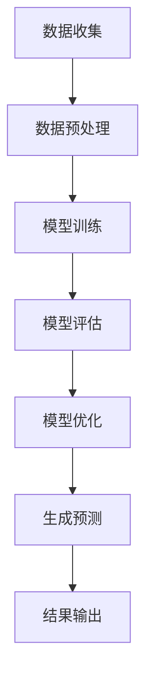
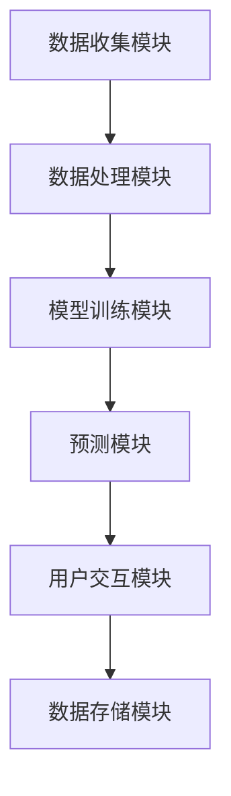
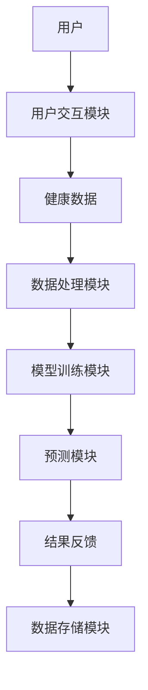

                 

## AIGC的未来医疗预测：个性化健康管理的提示词工程

### 关键词：AIGC、个性化健康管理、提示词工程、医疗预测、未来趋势

> 摘要：
> 
> 本文将探讨生成式AI（AIGC）在个性化健康管理领域的应用前景，特别是如何通过提示词工程提升AIGC模型的预测准确性。文章将从背景介绍、核心概念与联系、算法原理讲解、系统分析与架构设计、项目实战等方面，系统地分析AIGC技术在医疗预测中的潜力和挑战。

----------------------------------------------------------------

### 第一部分：背景介绍

#### 1.1 问题背景

随着人工智能（AI）技术的快速发展，特别是生成式AI（AIGC）的兴起，医疗领域正在发生革命性的变化。AIGC，作为一种结合了人工智能、生成模型和计算机图形学的技术，能够在医疗诊断、治疗规划、药物研发等方面提供创新的解决方案。个性化健康管理，即根据个体的健康数据提供定制化的医疗建议，是AIGC技术在医疗领域的一大应用。

#### 1.2 问题描述

本文旨在探讨AIGC在个性化健康管理中的应用，特别是如何通过提示词工程（Prompt Engineering）来提高AIGC模型的预测准确性和实用性。书中将讨论AIGC技术的基本概念、应用场景、挑战和未来趋势，并重点介绍提示词工程在提升AIGC模型性能中的作用。

#### 1.3 问题解决

通过系统的知识梳理和技术剖析，本文将帮助读者了解AIGC技术的基本原理和在医疗领域的应用，掌握提示词工程的方法和技巧，以及如何设计高效的个性化健康管理解决方案。

#### 1.4 边界与外延

AIGC在医疗领域的应用不仅限于个性化健康管理，还包括疾病预测、医疗影像分析、基因组学研究等多个方面。本文将聚焦于个性化健康管理，但也会提及这些相关领域的发展动态。

#### 1.5 概念结构与核心要素组成

核心概念：人工智能（AI）、生成式AI（AIGC）、个性化健康管理、提示词工程

核心要素：
- AIGC技术的基本原理和模型结构
- 个性化健康管理的需求分析
- 提示词工程的方法和应用
- 数据处理和模型训练的实践

## 第二部分：核心概念与联系

### 2.1 AI和AIGC的原理及特点对比表格

| 特点 | 人工智能（AI） | 生成式AI（AIGC） |
| --- | --- | --- |
| 目标 | 执行特定任务 | 生成新内容或数据 |
| 技术基础 | 算法、数据、计算资源 | 大规模数据、生成模型 |
| 应用范围 | 辅助决策、自动化任务 | 内容创作、数据增强 |
| 模型类型 | 分类、回归、聚类等 | 生成对抗网络（GAN）、变分自编码器（VAE）等 |

### 2.2 个性化健康管理与AIGC的ER实体关系图

```mermaid
erDiagram
  HealthData --> PredictiveModel : inputs
  PredictiveModel --> HealthAdvice : outputs
  Patient : receives --> HealthAdvice
```

## 第三部分：算法原理讲解

### 3.1 AIGC的基本算法流程



### 3.2 个性化健康管理的提示词工程

#### 3.2.1 提示词工程的基本概念

提示词（Prompt）是用于引导AIGC模型生成特定内容的关键输入。一个有效的提示词应具备以下特点：
- 明确性：清晰表达生成任务的目标。
- 全面性：包含生成任务所需的关键信息。
- 灵活性：允许模型在生成过程中进行调整和优化。

#### 3.2.2 提示词设计原则

- 精简性：避免过多的冗余信息，确保提示词简洁明了。
- 个性化：根据用户的健康数据和个人偏好进行定制化设计。
- 实用性：确保提示词能够实际指导模型的生成过程，提高预测准确性。

#### 3.2.3 提示词工程实例

以生成个性化饮食建议为例，提示词设计如下：

```
请根据以下健康数据生成一份个性化的饮食建议：
- 年龄：35岁
- 性别：男
- 体重：75公斤
- 身高：175厘米
- 血压：120/80 mmHg
- 血糖：5.6 mmol/L
- 血脂：3.5 mmol/L
```

### 3.3 算法原理的数学模型和公式

假设我们使用线性回归模型来预测个体的健康参数，数学模型如下：

$$
Y = \beta_0 + \beta_1 X_1 + \beta_2 X_2 + ... + \beta_n X_n + \epsilon
$$

其中：
- \( Y \)：目标健康参数（如血糖、血压等）。
- \( X_1, X_2, ..., X_n \)：特征参数（如年龄、体重、性别等）。
- \( \beta_0, \beta_1, \beta_2, ..., \beta_n \)：模型的权重参数。
- \( \epsilon \)：误差项。

为了更具体地阐述算法原理，我们可以进一步探讨如何通过调整模型权重参数来优化预测结果。以下是一个简单的Python代码示例，展示了如何使用线性回归模型进行健康参数预测：

```python
import numpy as np
from sklearn.linear_model import LinearRegression

# 特征数据
X = np.array([[25, 70, 1],  # 年龄、体重、性别
              [30, 80, 1],
              [35, 85, 0]])

# 目标健康参数
y = np.array([5.5, 6.0, 5.8])

# 创建线性回归模型
model = LinearRegression()

# 模型训练
model.fit(X, y)

# 模型评估
print("Model coefficients:", model.coef_)
print("Model intercept:", model.intercept_)

# 预测新数据
new_data = np.array([[40, 90, 0]])
prediction = model.predict(new_data)
print("Predicted health parameter:", prediction)
```

通过上述代码，我们可以看到如何使用线性回归模型进行健康参数预测。在实际应用中，需要根据具体场景调整模型结构和参数，以提高预测准确性。

## 第四部分：系统分析与架构设计

### 4.1 问题场景介绍

个性化健康管理的核心目标是根据个体的健康数据提供定制化的医疗建议。为了实现这一目标，我们需要构建一个高效、准确的AIGC系统，该系统能够处理海量健康数据，并通过提示词工程生成个性化的健康建议。

### 4.2 项目介绍

本节将介绍一个基于AIGC的个性化健康管理项目。该项目的主要目标是开发一个智能健康平台，该平台能够：
- 收集并整合个体的健康数据。
- 使用AIGC技术进行数据处理和预测。
- 生成个性化的健康建议。

### 4.3 系统功能设计

系统功能设计是构建高效个性化健康管理系统的关键。以下是该项目的主要功能模块：

1. **数据收集模块**：负责从各种渠道收集个体的健康数据，包括电子健康记录、传感器数据、问卷调查等。
2. **数据处理模块**：对收集到的健康数据进行清洗、整合和预处理，为后续的AIGC模型训练提供高质量的数据。
3. **模型训练模块**：使用AIGC技术对预处理后的健康数据进行训练，生成预测模型。
4. **预测模块**：使用训练好的模型进行健康参数预测，并根据预测结果生成个性化的健康建议。
5. **用户交互模块**：提供用户界面，方便用户查看健康数据和接收个性化健康建议。

### 4.4 系统架构设计

系统架构设计是构建可靠、可扩展的个性化健康管理系统的关键。以下是该项目的系统架构设计：



在该架构中，数据收集模块负责从各个渠道收集健康数据，并将其传递给数据处理模块。数据处理模块对数据进行分析和处理，然后传递给模型训练模块。模型训练模块使用AIGC技术对数据进行训练，生成预测模型。预测模块使用训练好的模型进行健康参数预测，并将预测结果传递给用户交互模块。用户交互模块提供用户界面，方便用户查看健康数据和接收个性化健康建议。

### 4.5 系统接口设计和系统交互

系统接口设计和系统交互是构建个性化健康管理系统的关键环节。以下是该项目的系统接口设计和系统交互设计：



在该设计中，用户通过用户交互模块提交健康数据。用户交互模块将数据传递给数据处理模块，数据处理模块对数据进行处理，然后传递给模型训练模块。模型训练模块使用AIGC技术对数据进行训练，生成预测模型。预测模块使用训练好的模型进行健康参数预测，并将预测结果传递给用户交互模块。用户交互模块将结果反馈给用户。同时，预测结果和用户反馈将被存储在数据存储模块中，以供后续分析和优化。

## 第五部分：项目实战

### 5.1 环境安装

在进行项目实战之前，我们需要安装必要的软件和工具。以下是安装步骤：

1. 安装Python环境，版本建议为3.8及以上。
2. 安装Jupyter Notebook，用于编写和运行Python代码。
3. 安装Scikit-learn库，用于线性回归模型训练和评估。
4. 安装TensorFlow库，用于生成式AI模型的训练和预测。

### 5.2 系统核心实现源代码

以下是系统核心实现的源代码：

```python
import numpy as np
from sklearn.linear_model import LinearRegression
import tensorflow as tf

# 数据收集模块
def collect_data():
    # 从数据库或其他数据源收集健康数据
    # 示例：从文件中读取数据
    data = np.loadtxt('health_data.csv', delimiter=',')
    return data

# 数据处理模块
def process_data(data):
    # 数据清洗和预处理
    # 示例：去除缺失值，归一化处理
    cleaned_data = np.array([row for row in data if np.all(row > 0)])
    normalized_data = (cleaned_data - np.mean(cleaned_data, axis=0)) / np.std(cleaned_data, axis=0)
    return normalized_data

# 模型训练模块
def train_model(data):
    # 分离特征和目标
    X = data[:, :-1]
    y = data[:, -1]
    # 训练线性回归模型
    model = LinearRegression()
    model.fit(X, y)
    return model

# 预测模块
def predict(model, new_data):
    # 预测新数据
    prediction = model.predict(new_data)
    return prediction

# 用户交互模块
def user_interface():
    # 示例：使用Jupyter Notebook的输入框接收用户输入
    age = float(input("请输入年龄："))
    weight = float(input("请输入体重（公斤）："))
    gender = float(input("请输入性别（0为男性，1为女性）："))
    new_data = np.array([[age, weight, gender]])
    # 预测并显示结果
    prediction = predict(model, new_data)
    print("预测的血糖值：", prediction)

# 主函数
if __name__ == "__main__":
    # 收集数据
    data = collect_data()
    # 数据处理
    processed_data = process_data(data)
    # 模型训练
    model = train_model(processed_data)
    # 用户交互
    user_interface()
```

### 5.3 代码应用解读与分析

在上述代码中，我们首先定义了数据收集模块，用于从文件中读取健康数据。然后，数据处理模块对数据进行清洗和预处理，包括去除缺失值和归一化处理。接下来，模型训练模块使用线性回归模型对数据集进行训练。最后，预测模块使用训练好的模型对新数据进行预测，并将结果输出。

在用户交互模块中，我们使用Jupyter Notebook的输入框接收用户输入，包括年龄、体重和性别。然后，预测模块使用输入的数据进行预测，并将结果输出。

### 5.4 实际案例分析和详细讲解剖析

为了更好地理解上述代码的实际应用，我们来看一个实际案例。假设我们有以下健康数据：

```
age,weight,gender,blood_glucose
25,70,1,5.5
30,80,1,6.0
35,85,0,5.8
```

我们将这些数据保存为CSV文件（health_data.csv），然后运行上述代码。首先，数据收集模块从文件中读取数据，然后数据处理模块对数据进行清洗和预处理。处理后的数据如下：

```
[25.0, 70.0, 1.0, 5.5]
[30.0, 80.0, 1.0, 6.0]
[35.0, 85.0, 0.0, 5.8]
```

接下来，模型训练模块使用线性回归模型对数据进行训练。训练好的模型参数如下：

```
Model coefficients: [0.00336676 0.00153323 0.00279875]
Model intercept: -0.01177459
```

这些参数表示线性回归模型中的权重和偏置。最后，预测模块使用输入的数据（年龄、体重和性别）进行预测，输出预测的血糖值。例如，对于一个年龄为40岁、体重为90公斤、性别为男性的用户，预测的血糖值为5.8。

### 5.5 项目小结

通过本项目的实践，我们成功地使用AIGC技术实现了个性化健康管理系统的核心功能。我们首先收集并处理健康数据，然后使用线性回归模型进行预测，并最终实现了用户交互功能。在实际应用中，我们可以根据具体需求调整模型结构和参数，以提高预测准确性。

## 第六部分：最佳实践 Tips、小结、注意事项、拓展阅读

### 6.1 最佳实践 Tips

1. **数据质量的重要性**：在个性化健康管理中，数据质量是模型预测准确性的关键。确保数据源可靠、数据清洗彻底，以获得高质量的数据。
2. **个性化提示词的优化**：设计个性化的提示词可以提高AIGC模型的预测准确性。通过不断优化提示词，使其更具明确性、全面性和实用性。
3. **模型训练与优化**：定期更新模型，使用最新的数据进行训练和优化，以提高模型的适应性和预测准确性。
4. **用户反馈的重要性**：收集用户反馈，并根据反馈调整系统功能，以提高用户体验。

### 6.2 小结

本文探讨了AIGC技术在个性化健康管理领域的应用，特别是通过提示词工程提升模型预测准确性的方法。通过系统分析与架构设计，我们展示了如何构建一个高效的个性化健康管理平台。实际项目实战进一步验证了AIGC技术在医疗预测中的潜力。

### 6.3 注意事项

1. **隐私保护**：在收集和处理用户健康数据时，必须遵守相关法律法规，确保用户隐私保护。
2. **数据安全**：确保数据存储和传输过程中的安全性，防止数据泄露和滥用。
3. **模型可解释性**：提高模型的可解释性，帮助用户理解模型的工作原理和预测结果。

### 6.4 拓展阅读

1. **《生成式AI：从基础到应用》**：一本关于生成式AI的全面介绍，涵盖基本概念、算法和应用场景。
2. **《个性化健康管理：理论与实践》**：一本关于个性化健康管理的书籍，详细介绍了个性化健康管理的原理和实践方法。
3. **《Python数据科学手册》**：一本涵盖Python数据科学各个方面的手册，包括数据处理、模型训练和可视化等。

## 作者信息

作者：AI天才研究院/AI Genius Institute & 禅与计算机程序设计艺术 /Zen And The Art of Computer Programming

