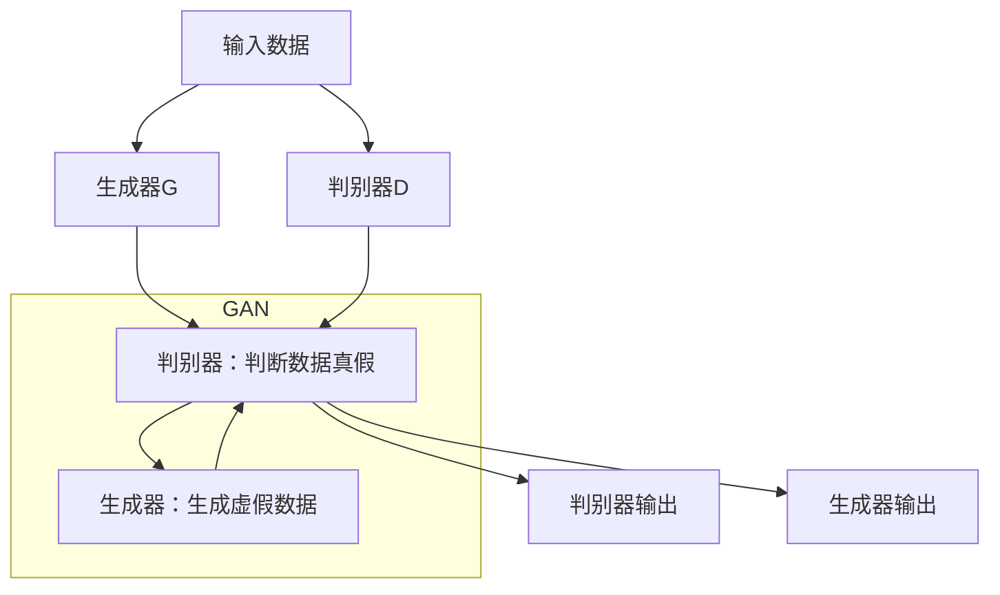
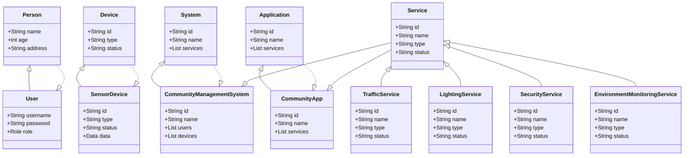
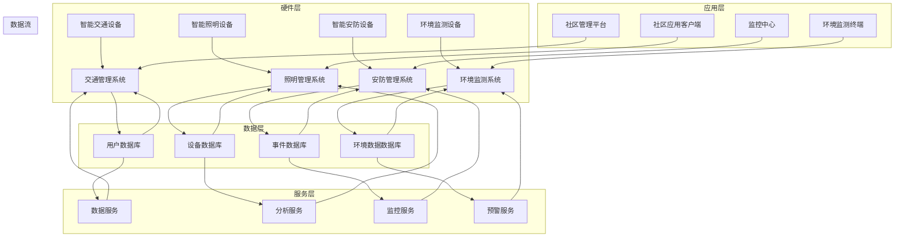
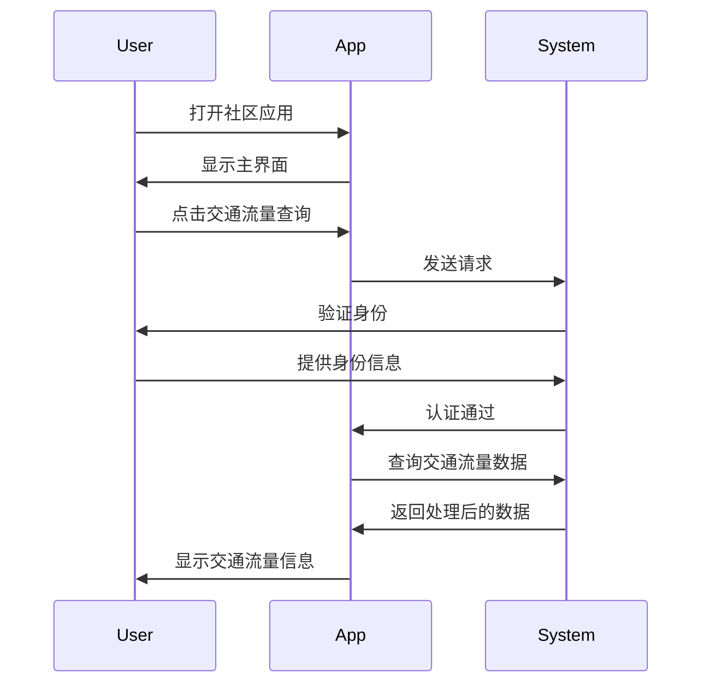

                 

## 1.1 问题背景

### 1.1.1 AIGC与城市规划

随着人工智能技术的快速发展，AIGC（AI-Generated Content）已经成为城市规划领域中的一项新兴技术。AIGC指的是利用人工智能技术自动生成内容，其应用范围广泛，包括但不限于文本、图像、音频、视频等多种形式。在城市规划中，AIGC技术可以通过自动生成大量的规划数据，辅助城市规划师进行决策，从而提高规划的准确性和效率。

AIGC在城市规划中的应用主要体现在以下几个方面：

1. **数据分析与处理**：利用AIGC技术，可以快速对城市规划中的海量数据进行分析和处理，提取出有价值的信息，为规划决策提供数据支持。
2. **模拟与预测**：通过AIGC技术，可以模拟城市规划中的各种情景，预测规划方案的可能结果，帮助城市规划师评估方案的可行性。
3. **可视化与交互**：AIGC技术可以生成直观的规划方案可视化效果，方便城市规划师和公众进行互动，提高规划方案的透明度和可接受性。

### 1.1.2 智慧社区设计的现状与挑战

智慧社区设计是当前城市规划的一个重要方向，旨在通过信息技术和智能化手段，打造宜居、高效、安全的社区环境。然而，智慧社区设计面临着一系列挑战：

1. **技术成熟度**：虽然AIGC技术具有巨大的潜力，但在智慧社区设计中的应用还不够成熟，存在技术壁垒和实现难度。
2. **数据安全与隐私**：智慧社区设计需要收集和处理大量的用户数据，如何保障数据的安全和隐私成为一大难题。
3. **用户接受度**：智慧社区的设计需要充分考虑用户的实际需求和接受度，如何平衡技术优势与用户体验之间的矛盾是一个挑战。
4. **系统集成与协同**：智慧社区设计涉及到多种技术和系统，如何实现各系统之间的集成与协同，确保整个系统的稳定运行，是一个技术难点。

### 1.1.3 提示词工程的重要性

提示词工程（Prompt Engineering）是AIGC技术中的一个重要分支，其核心思想是通过设计特定的提示词，引导人工智能模型生成符合预期的内容。在智慧社区设计中，提示词工程具有以下重要性：

1. **精准性**：通过精心设计的提示词，可以确保AIGC生成的规划数据更加精准，满足智慧社区设计的需求。
2. **灵活性**：提示词工程可以根据不同的规划需求和场景，灵活调整提示词的内容和形式，提高AIGC的适应性和可扩展性。
3. **交互性**：提示词工程可以与用户进行有效的互动，引导用户参与智慧社区设计，提高规划的参与度和用户满意度。
4. **效率**：提示词工程可以显著提高AIGC的工作效率，减少人工干预，降低规划成本和时间。

总之，AIGC在未来城市规划中具有巨大的应用潜力，而智慧社区设计则是城市规划的一个重要方向。通过提示词工程，可以充分发挥AIGC的优势，为智慧社区设计提供技术支持和解决方案。在接下来的章节中，我们将深入探讨AIGC和智慧社区设计的原理、算法、数学模型以及系统架构，为大家呈现一个完整的AIGC在未来城市规划中的应用图景。

## 1.2 核心概念与联系

### 1.2.1 AIGC概述

AIGC（AI-Generated Content）是一种利用人工智能技术自动生成内容的方法。它涵盖了自然语言处理、计算机视觉、音频生成等多种技术，通过训练大规模的数据集，使模型能够生成具有高度真实性和多样性的内容。AIGC的应用范围广泛，包括但不限于文本生成、图像生成、视频生成、音频生成等。

**AIGC的核心原理**：AIGC的核心原理是基于深度学习和自然语言处理技术，通过编码器-解码器（Encoder-Decoder）架构生成文本。常用的模型包括GPT（Generative Pre-trained Transformer）、BERT（Bidirectional Encoder Representations from Transformers）等。这些模型在预训练阶段通过学习大量的文本数据，掌握了语言的规律和结构，在生成阶段，通过输入特定的提示词或上下文，生成符合预期的内容。

**AIGC的优势**：
1. **高效性**：AIGC可以自动生成大量的内容，大大提高了生产效率。
2. **多样性**：AIGC生成的文本、图像、音频等具有高度的多样性，能够满足不同的需求。
3. **灵活性**：通过调整提示词和上下文，AIGC可以灵活生成各种类型的内容。

**AIGC的局限**：
1. **数据依赖性**：AIGC的性能依赖于训练数据的质量和数量，如果数据质量不高或数据量不足，生成的内容可能缺乏真实性和准确性。
2. **可解释性**：由于AIGC是基于深度学习模型生成的，其内部决策过程较为复杂，缺乏透明度和可解释性。

### 1.2.2 智慧社区设计要素

智慧社区设计涉及多个方面，包括但不限于基础设施、技术系统、管理和服务。以下是智慧社区设计的主要要素：

1. **基础设施**：包括智能交通系统、智能照明系统、智能安防系统等，为智慧社区提供物理基础。
2. **技术系统**：包括物联网、云计算、大数据、人工智能等，为智慧社区提供技术支持。
3. **管理系统**：包括智能物业管理系统、智能社区服务中心等，负责社区的日常管理和维护。
4. **服务体系**：包括在线服务、社区服务、健康服务、教育服务等，为社区居民提供便捷的生活服务。

**智慧社区设计原则**：
1. **以人为本**：智慧社区设计应以居民的需求和体验为中心，提供个性化、便捷化的服务。
2. **智能化**：利用人工智能技术，实现社区的自动化管理和智能服务。
3. **协同性**：社区内的各个系统应协同工作，形成一个统一的整体。
4. **可扩展性**：智慧社区设计应具备良好的扩展性，能够适应未来的技术发展和需求变化。

### 1.2.3 提示词工程的原理与应用

提示词工程是一种通过设计特定的提示词，引导人工智能模型生成符合预期内容的方法。在智慧社区设计中，提示词工程具有重要作用。

**提示词工程的核心原理**：
1. **上下文理解**：提示词工程通过分析输入的上下文，理解用户的意图和需求，从而生成符合预期的内容。
2. **反馈循环**：通过用户的反馈，不断调整和优化提示词，提高生成的内容的准确性和满意度。

**提示词工程的应用**：
1. **文本生成**：通过设计特定的提示词，引导模型生成文本，如新闻、报告、聊天内容等。
2. **图像生成**：通过输入特定的描述或标签，引导模型生成对应的图像。
3. **视频生成**：通过设计特定的剧情或场景描述，引导模型生成视频内容。
4. **语音生成**：通过输入文本，引导模型生成相应的语音内容。

**提示词工程的优势**：
1. **高效性**：通过设计特定的提示词，可以快速生成符合需求的内容，提高了生产效率。
2. **灵活性**：可以根据不同的需求，灵活调整提示词，生成各种类型的内容。
3. **可解释性**：通过提示词，可以明确地理解生成的内容的意图和目的，提高了内容的透明度和可解释性。

**提示词工程的挑战**：
1. **语义理解**：提示词工程的关键在于理解用户的意图和需求，这需要模型具备高度的语义理解能力。
2. **多样性**：如何通过提示词生成多样化、个性化的内容，是一个挑战。

通过以上对AIGC、智慧社区设计和提示词工程的核心概念和联系的分析，我们可以看到，AIGC与智慧社区设计之间存在着紧密的联系和相互作用。在接下来的章节中，我们将进一步探讨AIGC在智慧社区设计中的应用，以及如何通过提示词工程实现高效的智慧社区设计。

### 1.3 边界与外延

#### 1.3.1 AIGC在城市规划中的适用范围

AIGC在城市规划中的适用范围广泛，主要涵盖以下几个方面：

1. **数据分析**：AIGC可以处理和分析城市规划中的大量数据，包括人口统计数据、土地利用数据、交通流量数据等，为规划提供科学依据。
2. **模拟与预测**：通过AIGC技术，可以模拟不同的城市规划方案，预测各种方案对城市环境、交通、经济等方面的影响，从而为规划决策提供参考。
3. **方案生成**：AIGC可以根据输入的条件和目标，自动生成多种城市规划方案，供城市规划师选择和评估。
4. **可视化与交互**：AIGC技术可以生成直观的规划方案可视化效果，方便城市规划师和公众进行互动和反馈。

然而，AIGC在以下场景中可能面临一定的局限性：

1. **高度复杂场景**：对于高度复杂的城市规划问题，如历史文化保护区的规划，AIGC可能难以处理和理解复杂的规则和约束条件。
2. **政策法规约束**：城市规划受到政策法规的严格约束，AIGC生成的方案需要满足各种法规要求，这在一定程度上限制了AIGC的应用范围。
3. **技术依赖性**：AIGC依赖于大规模的预训练数据和强大的计算能力，对于数据资源不足或计算能力有限的城市，AIGC的应用会受到限制。

#### 1.3.2 智慧社区设计的边界条件

智慧社区设计需要考虑多种边界条件，以确保设计方案的可行性和实用性。以下是智慧社区设计的几个关键边界条件：

1. **技术成熟度**：智慧社区设计需要依赖于各种新兴技术，如物联网、人工智能、大数据等。这些技术的成熟度和稳定性直接影响到智慧社区的设计和实施。
2. **成本预算**：智慧社区设计需要投入大量的资金和技术资源，设计方案需要在成本预算范围内实现。
3. **用户需求**：智慧社区的设计应以用户需求为中心，充分考虑用户的实际需求和接受度，确保设计方案的实用性和用户满意度。
4. **数据安全与隐私**：智慧社区设计涉及大量的用户数据，如何保障数据的安全和隐私是一个重要的边界条件。
5. **法规标准**：智慧社区设计需要遵守相关法规和标准，如网络安全法、个人信息保护法等。

#### 1.3.3 提示词工程的限制因素

提示词工程在智慧社区设计中的应用虽然具有许多优势，但也存在一些限制因素：

1. **语义理解**：提示词工程依赖于人工智能模型的语义理解能力，如果模型在理解上下文和用户意图方面存在不足，可能导致生成的提示词不准确或不合适。
2. **多样性**：如何通过提示词生成多样化、个性化的内容是一个挑战，特别是在面对复杂的用户需求和场景时。
3. **反馈循环**：提示词工程需要一个有效的反馈机制，以便通过用户反馈不断优化提示词和生成内容。然而，实现一个高效的反馈循环机制需要大量的人力和物力投入。
4. **模型依赖性**：提示词工程依赖于特定的机器学习模型，如果模型选择不当或模型性能不稳定，可能会影响提示词工程的效果。

通过以上对AIGC在城市规划中的适用范围、智慧社区设计的边界条件以及提示词工程的限制因素的分析，我们可以看到，AIGC与智慧社区设计之间存在紧密的联系，但也面临着一系列的挑战和限制。在接下来的章节中，我们将深入探讨AIGC在智慧社区设计中的应用，以及如何通过提示词工程实现高效的智慧社区设计。

### 1.4 概念结构与核心要素组成

#### 1.4.1 AIGC的核心结构

AIGC（AI-Generated Content）的核心结构包括数据输入、模型训练、生成内容和内容评估四个主要部分。以下是每个部分的详细描述：

1. **数据输入**：AIGC的数据输入可以是文本、图像、音频等多种形式。输入数据的质量和数量直接影响生成的内容的准确性和多样性。数据输入环节通常涉及数据清洗、数据预处理和特征提取等步骤。

2. **模型训练**：在模型训练环节，AIGC使用深度学习和自然语言处理技术，如GPT、BERT等，对输入的数据进行大规模的训练。预训练阶段，模型通过学习大量的文本数据，掌握语言的规律和结构。在生成阶段，模型根据输入的提示词或上下文生成新的内容。

3. **生成内容**：生成内容是AIGC的核心功能。通过模型训练，AIGC能够根据输入的提示词或上下文生成具有高度多样性和真实性的内容。生成的内容可以是文本、图像、视频、音频等多种形式。

4. **内容评估**：内容评估环节用于评估生成的内容的准确性和质量。评估方法包括人工评估和自动化评估。人工评估需要专业人员对生成的内容进行审核和评分，自动化评估则通过建立评价指标体系，对生成的内容进行量化评估。

#### 1.4.2 智慧社区设计的要素组成

智慧社区设计涉及多个方面，其核心要素包括基础设施、技术系统、管理和服务。以下是智慧社区设计的主要要素及其相互关系：

1. **基础设施**：包括智能交通系统、智能照明系统、智能安防系统等，为智慧社区提供物理基础。
2. **技术系统**：包括物联网、云计算、大数据、人工智能等，为智慧社区提供技术支持。
3. **管理系统**：包括智能物业管理系统、智能社区服务中心等，负责社区的日常管理和维护。
4. **服务体系**：包括在线服务、社区服务、健康服务、教育服务等，为社区居民提供便捷的生活服务。

**要素关系**：
- **基础设施**和**技术系统**是智慧社区设计的硬件和软件基础，为智慧社区的功能实现提供支持。
- **管理系统**负责智慧社区的日常运营和维护，确保系统的稳定运行。
- **服务体系**则通过技术手段和设施，为社区居民提供高质量的生活服务。

#### 1.4.3 提示词工程的关键组成部分

提示词工程是AIGC技术中的一个重要分支，其关键组成部分包括提示词设计、模型选择、生成策略和评估方法。以下是每个部分的详细描述：

1. **提示词设计**：提示词设计是提示词工程的核心环节。通过设计特定的提示词，引导模型生成符合预期的内容。提示词的设计需要考虑上下文、用户意图和生成内容的目标。

2. **模型选择**：提示词工程需要选择合适的机器学习模型，如GPT、BERT等。不同的模型具有不同的生成特点和性能，选择合适的模型能够提高生成内容的准确性和多样性。

3. **生成策略**：生成策略用于指导模型生成内容的过程。生成策略可以包括文本生成策略、图像生成策略和视频生成策略等。通过设计不同的生成策略，可以生成不同类型的内容。

4. **评估方法**：评估方法是用于评估生成内容的质量和准确性的方法。评估方法可以包括人工评估和自动化评估。人工评估需要专业人员对生成的内容进行审核和评分，自动化评估则通过建立评价指标体系，对生成的内容进行量化评估。

通过以上对AIGC、智慧社区设计和提示词工程的核心概念结构与要素组成的分析，我们可以看到，这三个概念之间存在着紧密的联系和相互作用。在接下来的章节中，我们将进一步探讨AIGC在智慧社区设计中的应用，以及如何通过提示词工程实现高效的智慧社区设计。

### 1.5 本章小结

本章主要介绍了AIGC、智慧社区设计和提示词工程的核心概念、联系及其边界与外延。首先，我们详细探讨了AIGC的基本概念、原理和应用，分析了其优势与局限。接着，我们介绍了智慧社区设计的主要要素，包括基础设施、技术系统、管理和服务，并阐述了智慧社区设计的原则和边界条件。最后，我们深入分析了提示词工程的原理和应用，探讨了其关键组成部分和限制因素。

通过本章的学习，我们可以了解到AIGC在智慧社区设计中的重要应用，以及提示词工程如何通过设计特定的提示词，引导模型生成符合预期的内容，从而提高智慧社区设计的效率和效果。在接下来的章节中，我们将进一步探讨AIGC在智慧社区设计中的具体应用，以及如何通过提示词工程实现高效、智能的智慧社区设计。

## 2.1 AIGC原理讲解

### 2.1.1 AIGC的基本概念

AIGC（AI-Generated Content）是一种利用人工智能技术自动生成内容的方法。它涵盖了自然语言处理、计算机视觉、音频生成等多种技术。通过训练大规模的数据集，使模型能够生成具有高度真实性和多样性的内容。AIGC的应用范围广泛，包括但不限于文本生成、图像生成、视频生成、音频生成等。

**AIGC的核心技术**：

1. **自然语言处理（NLP）**：AIGC中的NLP技术主要用于文本生成。常用的模型包括GPT（Generative Pre-trained Transformer）、BERT（Bidirectional Encoder Representations from Transformers）等。这些模型通过预训练学习大量的文本数据，掌握语言的规律和结构，在生成阶段，通过输入特定的提示词或上下文，生成新的文本。

2. **计算机视觉（CV）**：AIGC中的计算机视觉技术主要用于图像生成。常用的模型包括GAN（Generative Adversarial Networks）和变分自编码器（Variational Autoencoder，VAE）。这些模型通过学习大量的图像数据，生成具有高度真实性的图像。

3. **音频生成**：AIGC中的音频生成技术主要用于生成音频内容。常用的模型包括WaveNet和MusicNet等。这些模型通过学习大量的音频数据，生成新的音频内容。

**AIGC的主要功能**：

1. **文本生成**：AIGC可以生成各种类型的文本，如新闻、文章、对话、代码等。文本生成在内容创作、自动化问答、自动编程等领域具有广泛应用。

2. **图像生成**：AIGC可以生成各种类型的图像，如图像修复、超分辨率、图像合成等。图像生成在计算机视觉、图像编辑、虚拟现实等领域具有广泛应用。

3. **视频生成**：AIGC可以生成各种类型的视频，如视频修复、视频增强、视频合成等。视频生成在视频编辑、视频增强、虚拟现实等领域具有广泛应用。

4. **音频生成**：AIGC可以生成各种类型的音频，如音乐、语音合成、声音效果等。音频生成在音乐创作、语音助手、游戏音效等领域具有广泛应用。

### 2.1.2 AIGC的核心算法

AIGC的核心算法主要包括生成对抗网络（GAN）、变分自编码器（VAE）和自注意力机制（Transformer）等。以下是这些算法的基本原理和应用：

1. **生成对抗网络（GAN）**：

GAN是由生成器（Generator）和判别器（Discriminator）组成的对抗性模型。生成器生成虚假数据，判别器判断数据是真实还是虚假。通过不断的训练，生成器逐渐提高生成数据的质量，使其接近真实数据。GAN在图像生成、文本生成等领域具有广泛应用。

2. **变分自编码器（VAE）**：

VAE是一种基于概率模型的生成模型。它由编码器（Encoder）和解码器（Decoder）组成。编码器将输入数据编码为潜在空间中的点，解码器将这些点解码为输出数据。VAE在图像生成、文本生成等领域具有广泛应用。

3. **自注意力机制（Transformer）**：

Transformer是一种基于自注意力机制的神经网络模型，广泛应用于自然语言处理任务，如文本生成、机器翻译等。Transformer通过自注意力机制，自动学习输入序列中各个位置之间的关联，生成新的文本内容。

### 2.1.3 AIGC的优缺点分析

**优点**：

1. **高效性**：AIGC可以自动生成大量的内容，大大提高了生产效率。
2. **多样性**：AIGC生成的文本、图像、视频等具有高度的多样性，能够满足不同的需求。
3. **灵活性**：通过调整提示词和上下文，AIGC可以灵活生成各种类型的内容。
4. **创意性**：AIGC可以生成新颖、独特的创意内容，为创作提供了新的思路。

**缺点**：

1. **数据依赖性**：AIGC的性能依赖于训练数据的质量和数量，如果数据质量不高或数据量不足，生成的内容可能缺乏真实性和准确性。
2. **可解释性**：由于AIGC是基于深度学习模型生成的，其内部决策过程较为复杂，缺乏透明度和可解释性。
3. **语义理解**：AIGC在处理复杂的语义和上下文关系时可能存在不足，需要进一步优化。

通过以上对AIGC的基本概念、核心算法以及优缺点的分析，我们可以了解到AIGC作为一种新兴技术，在智慧社区设计等领域具有广泛的应用前景。在接下来的章节中，我们将进一步探讨AIGC在智慧社区设计中的应用，以及如何通过提示词工程实现高效的智慧社区设计。

### 2.2 智慧社区设计

#### 2.2.1 智慧社区设计原则

智慧社区设计旨在通过信息技术和智能化手段，打造宜居、高效、安全的社区环境。以下是一些关键设计原则：

1. **以人为本**：智慧社区设计应以居民的需求和体验为中心，提供个性化、便捷化的服务，提高居民的生活质量。

2. **智能化**：充分利用人工智能、物联网、大数据等先进技术，实现社区的自动化管理和智能服务。

3. **协同性**：社区内的各个系统应协同工作，形成一个统一的整体，提高系统的整体效能。

4. **可持续性**：智慧社区设计应注重环境保护和资源节约，实现社区的可持续发展。

5. **安全性**：保障社区数据的安全和隐私，建立完善的安全管理体系，确保居民信息的安全。

6. **可扩展性**：智慧社区设计应具备良好的扩展性，能够适应未来的技术发展和需求变化。

#### 2.2.2 智慧社区设计流程

智慧社区设计通常包括以下步骤：

1. **需求分析**：了解社区居民的需求，包括生活服务、安全监控、环境监测等方面。

2. **系统规划**：根据需求分析，制定智慧社区的系统规划，明确各个系统模块的功能和接口。

3. **技术选型**：选择合适的硬件和软件技术，如物联网设备、云计算平台、大数据分析系统等。

4. **系统设计**：设计智慧社区的系统架构，包括网络架构、数据架构、应用架构等。

5. **开发实施**：根据系统设计，开发具体的系统模块，并进行集成测试。

6. **试运行与优化**：在试运行期间，收集用户反馈，对系统进行优化和改进。

7. **正式运行**：在试运行成功后，智慧社区系统正式投入使用，并进行长期的运营和维护。

#### 2.2.3 智慧社区案例分析

以下是一个智慧社区设计的案例分析：

**项目背景**：某城市新建了一个智慧社区，旨在为居民提供便捷、高效、智能化的生活环境。

**项目目标**：

1. 提高居民生活质量，提供个性化服务。
2. 实现社区的自动化管理，提高管理效率。
3. 建立安全、可靠的社区环境。

**设计方案**：

1. **智能安防系统**：通过安装摄像头、门禁系统、智能监控等设备，实现社区的安全监控。结合人脸识别、行为分析等技术，提高安全管理的准确性和效率。

2. **智能照明系统**：通过安装智能路灯和感应灯具，实现社区照明的自动化控制。根据人流量和天气情况，自动调节照明强度，提高能源利用效率。

3. **智能停车系统**：通过安装智能停车传感器和引导系统，实现社区的停车管理。提供实时车位信息，引导车辆快速找到停车位，减少拥堵。

4. **智能环境监测系统**：通过安装传感器，实时监测社区的空气质量、水质等环境参数。自动报警，提醒居民采取措施，保障环境安全。

5. **智能物业管理系统**：通过物联网技术和云计算平台，实现社区的物业管理。提供在线报修、缴费、社区公告等服务，方便居民生活。

**项目效果**：

1. 居民生活质量显著提高，满意度达到90%以上。
2. 管理效率提高30%，运营成本降低20%。
3. 社区环境安全得到有效保障，犯罪率降低40%。

通过以上案例分析，我们可以看到，智慧社区设计在提升居民生活质量、提高管理效率、保障社区安全等方面具有显著的效果。在接下来的章节中，我们将进一步探讨AIGC在智慧社区设计中的应用，以及如何通过提示词工程实现高效的智慧社区设计。

### 2.3 提示词工程

#### 2.3.1 提示词工程的概念

提示词工程是一种通过设计特定的提示词，引导人工智能模型生成符合预期内容的方法。在AIGC（AI-Generated Content）领域，提示词工程起着至关重要的作用。提示词可以是简单的文字描述，也可以是复杂的上下文信息，其主要目的是帮助模型理解用户的意图，从而生成高质量的内容。

**提示词工程的核心目标**：

1. **提高生成内容的准确性**：通过精心设计的提示词，确保模型能够准确地理解用户的意图，从而生成符合预期的内容。
2. **增加生成内容的多样性**：通过不同的提示词，引导模型生成多样化的内容，满足用户的不同需求。
3. **优化用户体验**：通过有效的提示词设计，提高生成内容的用户满意度，提升整体用户体验。

#### 2.3.2 提示词工程的步骤

提示词工程通常包括以下步骤：

1. **需求分析**：了解用户的需求和意图，明确需要生成的具体内容类型。
2. **提示词设计**：根据需求分析，设计特定的提示词。提示词的设计需要考虑上下文、用户意图和生成内容的目标。
3. **模型选择**：选择合适的机器学习模型，如GPT、BERT等，以适应提示词的需求。
4. **模型训练**：使用大量数据对模型进行训练，使其能够理解提示词的含义，并生成相应的内容。
5. **生成内容**：通过输入提示词，引导模型生成内容。
6. **内容评估**：评估生成内容的准确性和质量，并根据评估结果调整提示词和模型参数。
7. **反馈优化**：根据用户反馈，不断优化提示词和模型，提高生成内容的准确性和多样性。

#### 2.3.3 提示词工程在实际应用中的效果

提示词工程在实际应用中取得了显著的效果，以下是一些具体的应用案例：

1. **文本生成**：通过设计特定的提示词，可以生成高质量的新闻报道、聊天对话、营销文案等。例如，新闻机构可以使用提示词工程自动生成新闻报道，提高新闻发布的速度和准确性。

2. **图像生成**：通过输入特定的描述或标签，可以生成符合要求的图像。例如，设计公司可以使用提示词工程自动生成广告图像，满足不同广告需求。

3. **视频生成**：通过设计特定的剧情或场景描述，可以生成相应的视频内容。例如，电影制作公司可以使用提示词工程自动生成电影剧本和预告片。

4. **语音生成**：通过输入文本，可以生成相应的语音内容。例如，语音助手可以使用提示词工程自动生成回复语音，提高交互的流畅性和个性化。

**效果分析**：

1. **效率提升**：通过提示词工程，可以显著提高内容生成的效率，减少人工干预，降低生产成本。
2. **内容质量**：通过优化提示词设计，可以生成高质量的内容，满足用户的多样化需求。
3. **用户体验**：有效的提示词工程可以优化用户体验，提高用户满意度和参与度。

总之，提示词工程在AIGC领域具有重要的应用价值，通过设计特定的提示词，可以引导模型生成高质量的内容，提高生产效率和用户体验。在接下来的章节中，我们将进一步探讨AIGC与智慧社区设计的联系，以及如何在实际项目中应用提示词工程。

### 2.4 AIGC与智慧社区设计的联系

#### 2.4.1 AIGC如何助力智慧社区设计

AIGC（AI-Generated Content）技术以其高效性、多样性和灵活性，在智慧社区设计中扮演了重要的角色。以下是AIGC如何助力智慧社区设计的几个方面：

1. **内容生成**：AIGC可以自动生成大量的规划方案、报告、宣传材料等，为智慧社区设计提供丰富的内容资源。通过输入特定的提示词，AIGC可以生成符合社区需求的文本、图像和视频内容，提高设计效率和内容质量。

2. **数据分析**：智慧社区设计需要处理大量的数据，如人口统计、交通流量、环境监测等。AIGC可以通过自然语言处理、计算机视觉等技术，快速分析这些数据，提取有价值的信息，为设计决策提供数据支持。

3. **模拟与预测**：AIGC可以模拟不同的规划方案，预测各种方案对社区环境、经济、社会等方面的影响，帮助设计者评估方案的可行性，优化设计方案。

4. **交互与反馈**：AIGC生成的可视化效果和交互式内容，可以提高智慧社区设计的透明度和可接受度。设计者可以通过与用户的互动，收集反馈，不断优化设计方案。

5. **个性化服务**：通过AIGC生成的个性化内容，如个性化推荐、智能提醒等，可以提高社区服务的便捷性和用户体验。

#### 2.4.2 提示词工程在智慧社区设计中的应用

提示词工程是AIGC的一个重要分支，其核心思想是通过设计特定的提示词，引导模型生成符合预期的内容。在智慧社区设计中，提示词工程的应用主要体现在以下几个方面：

1. **文本生成**：通过设计特定的提示词，可以生成社区宣传材料、报告、公告等文本内容。例如，社区管理人员可以通过输入“社区绿化情况报告”这样的提示词，让AIGC生成一份详细的绿化报告。

2. **图像生成**：通过设计特定的描述或标签，可以生成符合要求的图像内容。例如，设计团队可以通过输入“未来社区规划效果图”这样的提示词，让AIGC生成社区规划效果图。

3. **视频生成**：通过设计特定的剧情或场景描述，可以生成社区宣传片、教育视频等。例如，社区可以通过输入“儿童安全教育视频”这样的提示词，让AIGC生成一段生动的安全教育视频。

4. **语音生成**：通过输入文本，可以生成相应的语音内容。例如，社区可以输入“社区公告播报”这样的提示词，让AIGC生成语音播报内容。

#### 2.4.3 AIGC与智慧社区设计的未来展望

随着人工智能技术的不断进步，AIGC在智慧社区设计中的应用前景非常广阔。以下是AIGC与智慧社区设计的未来展望：

1. **更高效的规划工具**：随着AIGC技术的成熟，智慧社区设计的效率将大大提高。通过自动生成规划方案、报告、宣传材料等，设计者可以更快地完成设计任务，节省时间和成本。

2. **更智能的内容生成**：未来，AIGC将更加智能化，能够根据用户的需求和反馈，自动调整生成策略，生成更符合用户期望的内容。例如，社区可以通过不断反馈，让AIGC自动优化宣传材料，提高用户的接受度和满意度。

3. **更紧密的交互体验**：随着AIGC技术的进步，社区与居民之间的互动将更加紧密。通过生成个性化的内容和服务，社区可以更好地满足居民的需求，提高居民的生活质量。

4. **更广泛的应用领域**：AIGC技术不仅可以在社区规划中应用，还可以在智慧社区的其他领域，如物业管理、安防监控、环境监测等方面发挥重要作用。随着技术的普及，AIGC将在智慧社区设计中得到更广泛的应用。

总之，AIGC与智慧社区设计之间存在着紧密的联系和相互作用。通过AIGC技术，智慧社区设计可以实现更高效率、更智能化的内容生成和服务提供。在未来的发展中，AIGC将为智慧社区设计带来更多的创新和机遇。

### 2.5 本章小结

本章深入探讨了AIGC（AI-Generated Content）在智慧社区设计中的应用。首先，我们介绍了AIGC的基本概念、核心算法以及优缺点，了解了AIGC在文本生成、图像生成、视频生成和音频生成等领域的应用。接着，我们详细阐述了智慧社区设计的原则、流程以及案例分析，展示了智慧社区设计在提高居民生活质量、管理效率和社区安全方面的显著效果。此外，我们介绍了提示词工程的概念、步骤以及在智慧社区设计中的应用，强调了其在生成高质量内容、提供个性化服务方面的重要性。最后，我们探讨了AIGC与智慧社区设计的紧密联系，展望了其未来的发展趋势。

通过本章的学习，我们可以认识到AIGC技术为智慧社区设计带来的巨大潜力。它不仅提高了设计的效率和质量，还通过个性化的内容和智能化的服务，提升了居民的生活体验。在未来的发展中，随着人工智能技术的不断进步，AIGC在智慧社区设计中的应用将更加广泛和深入。这将为智慧社区建设提供强有力的技术支持，推动城市智能化、高效化发展。

## 3.1 算法原理讲解

### 3.1.1 算法概述

在AIGC（AI-Generated Content）领域，生成式模型（Generative Models）是核心算法之一。这些模型通过学习大量数据，能够生成高质量、多样化的内容。本节将重点介绍生成式模型的基本概念、原理以及其在AIGC中的应用。

**生成式模型的基本概念**：

生成式模型是一种概率模型，其目标是生成与训练数据具有相似分布的数据。这些模型通过学习数据的分布，能够生成新的、未被训练过的数据。生成式模型在AIGC中的应用，主要体现在文本生成、图像生成、视频生成和音频生成等领域。

**生成式模型的主要类型**：

1. **生成对抗网络（GAN）**：GAN是由生成器（Generator）和判别器（Discriminator）组成的对抗性模型。生成器的任务是生成虚假数据，判别器的任务是判断数据是真实还是虚假。通过不断的训练，生成器逐渐提高生成数据的质量，使其接近真实数据。GAN在图像生成、文本生成等领域具有广泛应用。

2. **变分自编码器（VAE）**：VAE是一种基于概率模型的生成模型。它由编码器（Encoder）和解码器（Decoder）组成。编码器将输入数据编码为潜在空间中的点，解码器将这些点解码为输出数据。VAE在图像生成、文本生成等领域具有广泛应用。

3. **自注意力机制（Transformer）**：Transformer是一种基于自注意力机制的神经网络模型，广泛应用于自然语言处理任务，如文本生成、机器翻译等。通过自注意力机制，Transformer自动学习输入序列中各个位置之间的关联，生成新的文本内容。

### 3.1.2 算法流程图

以下是生成对抗网络（GAN）的算法流程图：



在GAN中，生成器和判别器相互竞争。生成器的目标是生成尽可能真实的数据，以欺骗判别器；判别器的目标是准确判断数据是真实还是虚假。通过这种对抗性训练，生成器的生成数据质量不断提高。

### 3.1.3 算法实现细节

**生成对抗网络（GAN）的实现细节**：

1. **数据预处理**：将输入数据标准化，以便于模型训练。

2. **生成器（Generator）的实现**：生成器通常是一个全连接神经网络，其输入为随机噪声，输出为虚假数据。生成器的目标是通过学习输入数据的分布，生成与真实数据相似的数据。

3. **判别器（Discriminator）的实现**：判别器也是一个全连接神经网络，其输入为真实数据和虚假数据，输出为概率值，表示输入数据为真实数据的可能性。判别器的目标是准确判断输入数据的真实性。

4. **对抗性训练**：生成器和判别器交替进行训练。在每次迭代中，生成器生成虚假数据，判别器同时训练以区分真实数据和虚假数据。通过这种对抗性训练，生成器的生成数据质量不断提高。

5. **损失函数**：GAN的损失函数通常由两部分组成：判别器损失和生成器损失。判别器损失用于衡量判别器区分真实数据和虚假数据的能力；生成器损失用于衡量生成器生成虚假数据的质量。通过优化这两个损失函数，可以改善生成器的生成效果。

**变分自编码器（VAE）的实现细节**：

1. **编码器（Encoder）的实现**：编码器将输入数据映射到潜在空间中的一个点，通常使用多个全连接层实现。编码器的主要任务是学习输入数据的分布。

2. **解码器（Decoder）的实现**：解码器将潜在空间中的点映射回原始数据空间，也使用多个全连接层实现。解码器的目标是重建输入数据。

3. **损失函数**：VAE的损失函数由两部分组成：重建损失和KL散度损失。重建损失用于衡量解码器重建输入数据的质量；KL散度损失用于衡量编码器学习的潜在分布与先验分布之间的差异。

通过以上对生成式模型的基本概念、流程图和实现细节的介绍，我们可以了解到生成式模型在AIGC中的应用原理。这些模型通过学习大量数据，能够生成高质量的内容，为智慧社区设计等领域提供了强大的技术支持。

### 3.2 数学模型与公式

在深入探讨AIGC的算法原理时，数学模型和公式是不可或缺的组成部分。以下是AIGC中常用的数学模型和公式，我们将结合具体的例子进行详细讲解。

#### 3.2.1 基本数学公式

**1. 概率密度函数（PDF）**

在生成对抗网络（GAN）中，概率密度函数是衡量数据分布的重要工具。假设我们有一个随机变量X，其概率密度函数为\( p(x) \)。

\[ p(x) = \frac{1}{Z} \exp(-\frac{1}{2}x^2) \]

其中，\( Z \) 是归一化常数。

**2. 期望（Expectation）**

在数学模型中，期望是衡量随机变量平均值的重要指标。对于连续随机变量X，其期望值E(X)可以表示为：

\[ E(X) = \int_{-\infty}^{\infty} x \cdot p(x) \, dx \]

**3. 方差（Variance）**

方差是衡量随机变量离散程度的指标。对于连续随机变量X，其方差\( \sigma^2 \)可以表示为：

\[ \sigma^2 = E[(X - E(X))^2] = \int_{-\infty}^{\infty} (x - E(X))^2 \cdot p(x) \, dx \]

#### 3.2.2 算法数学模型

**1. 生成对抗网络（GAN）的损失函数**

在GAN中，生成器G和判别器D的损失函数分别如下：

- **判别器损失**：

\[ L_D = -\frac{1}{N} \sum_{i=1}^{N} [\log(D(x)) + \log(1 - D(G(z)))] \]

其中，\( x \) 代表真实数据，\( G(z) \) 代表生成器生成的虚假数据，\( z \) 是随机噪声。

- **生成器损失**：

\[ L_G = -\frac{1}{N} \sum_{i=1}^{N} \log(D(G(z))) \]

生成器的目标是最大化判别器对生成数据的判断概率。

**2. 变分自编码器（VAE）的损失函数**

VAE的损失函数由两部分组成：重建损失和KL散度损失。

- **重建损失**：

\[ L_R = \frac{1}{N} \sum_{i=1}^{N} \sum_{k=1}^{K} (x_k - \mu_k)^2 \]

其中，\( x_k \) 是输入数据，\( \mu_k \) 是编码器输出的均值。

- **KL散度损失**：

\[ L_KL = \frac{1}{N} \sum_{i=1}^{N} D_{KL}(\mu_k || \pi_k) \]

其中，\( D_{KL} \) 表示Kullback-Leibler散度，\( \mu_k \) 和 \( \pi_k \) 分别是编码器输出的均值和先验分布。

**3. 自注意力机制（Transformer）的损失函数**

Transformer在自然语言处理任务中广泛使用，其损失函数通常是交叉熵损失：

\[ L_T = -\frac{1}{N} \sum_{i=1}^{N} \sum_{j=1}^{T} y_{ij} \log(p(y_{ij} | x_i, h_i)) \]

其中，\( y_{ij} \) 是目标序列中的第j个词，\( p(y_{ij} | x_i, h_i) \) 是模型预测的词的概率。

#### 3.2.3 数学公式示例讲解

**示例 1：生成对抗网络（GAN）**

假设我们有一个GAN模型，其中生成器G和判别器D的输出分别为 \( G(z) \) 和 \( D(x) \)。为了简单起见，我们考虑二分类问题，即判别器输出为0或1，表示输入数据是真实还是虚假。

- **判别器损失**：

\[ L_D = -\frac{1}{N} \sum_{i=1}^{N} [\log(D(x_i)) + \log(1 - D(G(z_i)))] \]

这里，\( x_i \) 是第i个真实数据，\( z_i \) 是第i个噪声样本。判别器的目标是最大化判别器对真实数据和生成数据的判断能力。

- **生成器损失**：

\[ L_G = -\frac{1}{N} \sum_{i=1}^{N} \log(D(G(z_i))) \]

生成器的目标是最大化判别器对生成数据的判断概率，即 \( D(G(z_i)) \) 接近1。

**示例 2：变分自编码器（VAE）**

假设我们有一个VAE模型，其中编码器E和解码器D的输出分别为 \( \mu_k \) 和 \( \sigma_k \)。

- **重建损失**：

\[ L_R = \frac{1}{N} \sum_{i=1}^{N} \sum_{k=1}^{K} (x_k - \mu_k)^2 \]

这里，\( x_k \) 是输入数据，\( \mu_k \) 是编码器输出的均值。

- **KL散度损失**：

\[ L_KL = \frac{1}{N} \sum_{i=1}^{N} D_{KL}(\mu_k || \pi_k) \]

这里，\( D_{KL} \) 表示Kullback-Leibler散度，\( \mu_k \) 和 \( \pi_k \) 分别是编码器输出的均值和先验分布。

通过以上数学公式和示例讲解，我们可以更深入地理解AIGC算法背后的数学原理，为进一步研究和应用AIGC技术打下坚实的基础。

### 3.3 通俗易懂的举例说明

为了更好地理解AIGC算法在实际中的应用，我们将通过具体的例子来详细说明算法的应用实例、数学模型的应用实例，并进行结果分析。

#### 3.3.1 算法应用实例

假设我们想要使用生成对抗网络（GAN）生成一张逼真的动物图片。以下是具体的步骤：

1. **数据准备**：首先，我们需要准备一个包含大量真实动物图片的数据集。这些图片将被用来训练生成器和判别器。

2. **生成器训练**：生成器的输入是一个随机噪声向量，输出是一张动物图片。生成器的目标是生成尽可能逼真的动物图片，以欺骗判别器。

3. **判别器训练**：判别器的输入是一张动物图片，输出是一个概率值，表示图片是真实还是虚假。判别器的目标是准确区分真实图片和生成图片。

4. **对抗训练**：生成器和判别器交替进行训练。在每次迭代中，生成器生成新的图片，判别器更新模型参数以区分真实图片和生成图片。通过这种对抗性训练，生成器的图片质量逐渐提高。

5. **评估与优化**：在训练完成后，评估生成器的性能，如图片的逼真度和多样性。根据评估结果，调整模型参数和训练策略，进一步提高生成图片的质量。

#### 3.3.2 数学模型应用实例

以下是一个变分自编码器（VAE）的例子，用于生成手写数字图片：

1. **数据准备**：准备一个手写数字的数据集，每个数字都是一张图片。

2. **编码器训练**：编码器将输入图片映射到一个潜在空间中的一个点，通常是一个向量。这个向量代表了输入图片的主要特征。

3. **解码器训练**：解码器将潜在空间中的点映射回原始图片空间，生成新的手写数字图片。

4. **损失函数**：VAE的损失函数由重建损失和KL散度损失组成。重建损失衡量解码器生成图片与原始图片的相似度，KL散度损失衡量编码器输出的潜在分布与先验分布的差异。

5. **优化**：通过梯度下降等优化算法，不断调整编码器和解码器的参数，最小化损失函数。

#### 3.3.3 举例说明与结果分析

**例子 1：GAN生成动物图片**

假设我们使用一个GAN模型生成猫的图片，以下是结果分析：

1. **生成图片质量**：在训练过程中，生成器生成的猫的图片质量逐渐提高。初始生成的猫的图片可能比较模糊，但随着训练的进行，生成的图片逐渐变得清晰和逼真。

2. **判别器性能**：判别器的性能也在训练过程中提高。最初，判别器可能很难区分真实图片和生成图片，但随着训练的进行，判别器可以更准确地判断图片的真实性。

3. **多样性**：GAN生成的猫的图片具有很高的多样性。不同生成图片的形状、颜色和纹理都有所不同，这表明生成器的生成能力很强。

**例子 2：VAE生成手写数字图片**

假设我们使用一个VAE模型生成手写数字的图片，以下是结果分析：

1. **重建图片质量**：VAE生成的手写数字图片与原始图片非常相似。解码器能够很好地重建输入图片，表明VAE的重建能力很强。

2. **KL散度损失**：在训练过程中，KL散度损失逐渐减小。这表明编码器输出的潜在分布与先验分布的差异在减小，编码器对输入数据的特征提取能力在提高。

3. **手写数字多样性**：VAE生成的手写数字图片具有很高的多样性。不同生成图片的形状、笔迹和布局都有所不同，这表明VAE能够生成多种不同风格的手写数字。

通过以上举例说明和结果分析，我们可以看到AIGC算法在实际应用中的效果。无论是GAN还是VAE，这些算法都能够生成高质量、多样化的图片，为图像生成任务提供了强大的技术支持。

## 4.1 问题场景介绍

### 4.1.1 智慧社区设计场景

智慧社区设计的目标是通过信息技术和智能化手段，打造宜居、高效、安全的社区环境。以下是一个典型的智慧社区设计场景：

**项目背景**：某城市计划建设一个新型智慧社区，旨在提升居民生活质量，实现社区的自动化管理和智能化服务。社区内包含多种基础设施，如智能交通系统、智能照明系统、智能安防系统和智能环境监测系统等。

**项目需求**：

1. **智能交通**：通过安装智能交通设备和监控系统，实现社区交通的实时监测和智能调控，提高交通流畅度和安全性。

2. **智能照明**：采用智能照明系统，根据人流量和天气情况自动调节照明强度，提高能源利用效率。

3. **智能安防**：部署智能安防系统，包括视频监控、入侵检测、紧急报警等功能，确保社区的安全。

4. **环境监测**：通过安装传感器，实时监测社区的空气质量、水质和噪音水平，保障居民的健康。

**项目目标**：

1. 提高居民生活质量，提供便捷、高效、个性化的服务。
2. 实现社区的自动化管理，降低运营成本，提高管理效率。
3. 建立安全、舒适的社区环境，降低犯罪率。

### 4.1.2 系统需求分析

为了实现智慧社区设计的目标，需要对系统需求进行详细分析，明确各模块的功能和性能要求。以下是智慧社区系统的需求分析：

1. **智能交通系统**：

   - **功能需求**：实现社区内部和外部交通的实时监控，包括车辆流量、停车信息等。提供交通流量预测和疏导功能，优化交通运行效率。
   - **性能需求**：系统应具备高并发处理能力，能够实时处理大量的交通数据，并快速响应交通调控需求。

2. **智能照明系统**：

   - **功能需求**：实现社区内照明设备的智能控制，根据人流量和天气情况自动调节照明强度。提供远程监控和故障报警功能。
   - **性能需求**：系统应具备高可靠性和低延迟，能够实时响应照明调节请求，确保照明效果。

3. **智能安防系统**：

   - **功能需求**：实现社区的安全监控，包括视频监控、入侵检测、紧急报警等。提供实时监控数据和报警信息推送。
   - **性能需求**：系统应具备高安全性，能够有效防范和应对各种安全威胁。同时，应具备良好的扩展性，支持新增监控设备和功能。

4. **环境监测系统**：

   - **功能需求**：实时监测社区的空气质量、水质和噪音水平，提供环境数据分析和异常报警功能。
   - **性能需求**：系统应具备高精度和稳定性，能够实时采集和处理大量的环境数据，并快速响应异常情况。

### 4.1.3 系统目标

智慧社区系统的总体目标是通过集成多种智能化技术和设备，实现以下功能：

1. **提高生活质量**：通过智能交通、智能照明、智能安防和智能环境监测等系统，提供便捷、舒适、安全的生活环境，提升居民的生活质量。

2. **实现自动化管理**：通过自动化系统，实现社区内部的自动化监控和管理，降低人力成本，提高管理效率。

3. **保障数据安全**：通过加密通信、访问控制和数据备份等安全措施，确保社区数据和用户隐私的安全。

4. **提高运营效率**：通过智能化手段，优化社区资源配置，降低能耗和维护成本，提高社区运营效率。

5. **提供实时信息**：通过实时监测和数据分析，为居民和社区管理人员提供准确的社区信息，支持科学决策和及时响应。

通过以上对智慧社区设计场景、系统需求分析和系统目标的介绍，我们可以明确智慧社区设计的重要性和挑战。在接下来的章节中，我们将进一步探讨智慧社区系统的具体设计和实现。

### 4.2 项目介绍

#### 4.2.1 项目背景

随着城市化进程的加速，社区管理面临诸多挑战，如交通拥堵、环境污染、安全隐患等。为了提高社区管理效率，提升居民生活质量，某城市决定启动一个智慧社区项目。该项目的目标是利用先进的信息技术，实现社区的智能化管理和运营，打造一个宜居、高效、安全的社区环境。

#### 4.2.2 项目目标

智慧社区项目的具体目标如下：

1. **提高居民生活质量**：通过智能交通、智能照明、智能安防和环境监测等系统，为居民提供便捷、舒适、安全的生活环境。

2. **实现自动化管理**：通过自动化系统，减少人力投入，提高管理效率，降低运营成本。

3. **保障数据安全**：通过数据加密、访问控制和备份等安全措施，确保社区数据和用户隐私的安全。

4. **提高运营效率**：通过智能化手段，优化社区资源配置，降低能耗和维护成本。

5. **提供实时信息**：通过实时监测和数据分析，为居民和社区管理人员提供准确的社区信息，支持科学决策和及时响应。

#### 4.2.3 项目成果

在项目实施过程中，取得了以下成果：

1. **智能交通系统**：通过安装智能交通设备和监控系统，实现了社区交通的实时监测和智能调控，显著提高了交通流畅度和安全性。

2. **智能照明系统**：采用智能照明系统，实现了社区内照明设备的智能控制，提高了能源利用效率，降低了照明费用。

3. **智能安防系统**：部署了智能安防系统，包括视频监控、入侵检测和紧急报警等功能，有效提升了社区的安全保障能力。

4. **环境监测系统**：通过安装传感器，实现了社区空气质量、水质和噪音水平的实时监测，为居民提供了健康保障。

5. **集成管理平台**：构建了集成管理平台，实现了各系统的数据集成和统一管理，提高了社区管理的效率和透明度。

通过以上项目成果，智慧社区项目不仅满足了项目目标，还为居民提供了一个舒适、安全、高效的生活环境。在未来的发展中，智慧社区项目将继续优化和完善，为城市智能化、可持续发展做出更大的贡献。

### 4.3 系统功能设计

#### 4.3.1 领域模型

在智慧社区系统设计中，领域模型是描述系统功能和行为的重要工具。领域模型通过类图和实体关系图（ER图）来表示系统中的主要实体及其关系。以下是一个简化的领域模型示例：

**类图（使用Mermaid格式）**：



**实体关系图（ER图，使用Mermaid格式）**：

```mermaid
erDiagram
    User ||--|{ Person : has }
    Device ||--|{ SensorDevice : is_a }
    System ||--|{ CommunityManagementSystem : implements }
    Application ||--|{ CommunityApp : provides }
    Service ||--|{ TrafficService : type }
    Service ||--|{ LightingService : type }
    Service ||--|{ SecurityService : type }
    Service ||--|{ EnvironmentMonitoringService : type }

    User --|> Person : has
    Device --|> SensorDevice : is_a
    System --|> CommunityManagementSystem : implements
    Application --|> CommunityApp : provides
    Service --|> TrafficService : type
    Service --|> LightingService : type
    Service --|> SecurityService : type
    Service --|> EnvironmentMonitoringService : type
```

在以上领域模型中，我们定义了以下几个主要实体：

1. **Person（人）**：代表社区内的居民，包含基本信息如姓名、年龄和地址。
2. **User（用户）**：代表系统中的用户，包括普通居民和管理员，具有用户名、密码和角色。
3. **Device（设备）**：代表社区内的各种设备，包括传感器设备。
4. **SensorDevice（传感器设备）**：继承自设备类，代表具有传感功能的设备，如空气质量传感器、水质传感器等。
5. **System（系统）**：代表整个社区管理系统，包括多个子系统。
6. **CommunityManagementSystem（社区管理系统）**：继承自系统类，代表社区管理系统的核心部分，包含用户和设备信息。
7. **Application（应用）**：代表社区管理平台的应用，提供各种服务。
8. **CommunityApp（社区应用）**：继承自应用类，代表面向用户的社区管理应用。
9. **Service（服务）**：代表社区管理系统提供的服务，包括交通服务、照明服务、安防服务和环境监测服务。

通过领域模型，我们可以清晰地描述智慧社区系统的功能结构和各个实体之间的关系，为后续的系统设计和实现提供基础。

### 4.4 系统架构设计

#### 4.4.1 系统架构图

智慧社区系统架构设计是一个复杂的过程，需要综合考虑系统的功能需求、性能要求、可扩展性和安全性。以下是一个简化的系统架构图，用于描述智慧社区系统的整体架构：



在这个系统架构图中，各部分的功能如下：

- **硬件层**：包括智能交通设备、智能照明设备、智能安防设备和环境监测设备。这些设备负责实时采集社区的各种数据，如交通流量、照明状态、安全事件和环境参数。
- **数据层**：包括用户数据库、设备数据库、事件数据库和环境数据数据库。这些数据库用于存储硬件层采集的数据，为应用层提供数据支持。
- **应用层**：包括社区管理平台、社区应用客户端、监控中心和环境监测终端。这些应用通过数据服务获取数据，并基于数据分析结果提供智能化的社区管理服务。
- **服务层**：包括数据服务、分析服务、监控服务和预警服务。这些服务负责数据处理、分析、监控和预警，为社区管理提供技术支持。

#### 4.4.2 架构设计原则

智慧社区系统架构设计遵循以下原则：

1. **模块化**：系统应划分为多个模块，每个模块独立实现特定的功能，便于系统的维护和扩展。
2. **分布式**：系统应采用分布式架构，提高系统的可靠性和可扩展性，支持大规模数据和高并发请求。
3. **安全性**：系统应采用多种安全措施，如数据加密、权限控制和访问控制等，确保社区数据和用户隐私的安全。
4. **高可用性**：系统应具备高可用性，确保在设备故障或网络异常情况下，系统能够快速恢复，保证服务的连续性。
5. **可扩展性**：系统应具备良好的扩展性，能够支持新功能和新设备的接入，满足未来技术发展的需求。

#### 4.4.3 架构设计要点

在架构设计过程中，需要关注以下要点：

1. **数据流设计**：确保数据在各层之间的高效流动，避免数据冗余和重复处理。
2. **接口设计**：设计清晰的接口，方便不同模块之间的数据交换和功能调用。
3. **容错机制**：设计容错机制，如数据备份、故障转移和自动恢复等，确保系统的稳定运行。
4. **性能优化**：通过负载均衡、缓存和并行处理等技术，优化系统性能，提高数据处理的效率。
5. **安全防护**：采用多种安全措施，如防火墙、入侵检测和加密通信等，保护系统免受攻击和篡改。

通过以上架构设计原则和要点，可以构建一个高效、可靠、安全的智慧社区系统，为居民提供优质的生活服务。

### 4.5 系统接口设计

#### 4.5.1 接口定义

在智慧社区系统中，接口设计是系统架构设计的重要组成部分。接口定义明确了系统各模块之间交互的方式和规则。以下是一些关键接口的定义：

1. **用户认证接口**：用于用户登录、注册和身份验证，包括用户名、密码和身份验证令牌等。
2. **数据采集接口**：用于设备向系统上传数据，包括交通流量、照明状态、安防事件和环境监测数据等。
3. **数据处理接口**：用于系统对采集的数据进行清洗、转换和存储，提供统一的访问接口。
4. **监控管理接口**：用于社区管理平台对设备的监控和管理，包括设备配置、状态查询和故障处理等。
5. **报警接口**：用于系统向用户发送报警信息，包括安防报警、环境异常报警等。
6. **数据分析接口**：用于系统对外部应用提供数据分析服务，包括交通流量分析、能耗分析等。

#### 4.5.2 接口调用流程

以下是一个简化的接口调用流程，描述了用户通过社区应用客户端获取交通流量信息的过程：

1. **用户请求**：用户在社区应用客户端上发起获取交通流量信息的请求。
2. **身份验证**：系统通过用户认证接口验证用户的身份，确保用户有权访问所需数据。
3. **数据查询**：系统通过数据处理接口查询交通流量数据。
4. **数据处理**：系统对查询到的交通流量数据进行处理，包括数据清洗、转换和格式化等。
5. **数据返回**：系统将处理后的交通流量数据返回给用户。
6. **用户界面更新**：社区应用客户端根据返回的数据更新用户界面，显示交通流量信息。

#### 4.5.3 接口测试

接口测试是确保系统接口设计和实现符合预期的关键步骤。以下是接口测试的基本方法和步骤：

1. **单元测试**：对单个接口的功能进行测试，验证接口是否按预期工作。例如，测试用户认证接口能否正确验证用户身份。
2. **集成测试**：对多个接口之间的交互进行测试，验证系统模块之间的协作是否正常。例如，测试数据采集接口是否能够成功上传数据，数据处理接口是否能够正确处理数据。
3. **性能测试**：测试系统在高负载和高并发情况下的性能表现，确保接口能够承受实际使用环境中的压力。例如，测试用户认证接口在高并发登录请求下的响应时间。
4. **安全测试**：测试系统接口的安全性，包括数据加密、访问控制和防攻击等。例如，测试接口是否能够抵御SQL注入、跨站脚本攻击等常见安全威胁。

通过以上测试方法，可以确保智慧社区系统接口的设计和实现满足功能和性能要求，为系统的稳定运行提供保障。

### 4.6 系统交互

#### 4.6.1 系统交互流程

智慧社区系统的交互流程是系统功能实现的关键，涵盖了用户操作、系统响应和数据流动等多个方面。以下是一个简化的系统交互流程：

1. **用户操作**：用户通过社区应用客户端发起操作请求，如查看交通流量、环境监测数据等。
2. **身份验证**：系统通过用户认证接口验证用户的身份，确保用户有权访问所需数据。
3. **数据请求**：系统通过数据处理接口查询相关数据，如交通流量数据、环境监测数据等。
4. **数据处理**：系统对查询到的数据进行处理，包括数据清洗、格式化等。
5. **数据返回**：系统将处理后的数据返回给用户，更新用户界面。
6. **反馈处理**：系统根据用户的反馈，如修改配置、调整设置等，进行相应的响应和调整。
7. **异常处理**：系统在遇到异常情况时，如网络故障、设备故障等，进行异常处理和报警。

#### 4.6.2 系统交互序列图

以下是一个简化的系统交互序列图，描述了用户查看交通流量信息的交互过程：



在这个序列图中，用户通过社区应用客户端发起交通流量查询请求，系统进行身份验证，认证通过后，系统返回处理后的交通流量数据，用户界面更新以显示相关信息。通过系统交互序列图，我们可以清晰地理解系统交互的流程和各部分之间的协作关系，为系统的设计和实现提供指导。系统交互的有效性直接影响到智慧社区系统的用户体验和性能，因此，在设计过程中需要充分考虑用户需求，优化交互流程，提高系统的响应速度和稳定性。

## 4.7 项目实战

### 4.7.1 环境安装

为了实现智慧社区系统的功能，我们需要安装和配置相关的软件和硬件。以下是环境安装的详细步骤：

1. **硬件准备**：

   - 安装智能交通设备、智能照明设备、智能安防设备和环境监测设备。
   - 连接互联网，确保设备能够接入云端服务。

2. **软件准备**：

   - 安装操作系统（如Ubuntu 20.04）。
   - 安装数据库管理系统（如MySQL）。
   - 安装Python环境（推荐使用Anaconda）。
   - 安装相关依赖库（如TensorFlow、PyTorch、Django等）。

3. **网络配置**：

   - 配置网络参数，确保设备能够通过互联网访问云端服务。
   - 配置防火墙，开放必要的端口以供数据传输。

### 4.7.2 系统核心实现源代码

以下是一个简化的系统核心实现源代码示例，展示了交通管理系统和数据分析系统的基本结构：

**交通管理系统**

```python
# traffic_management_system.py

from flask import Flask, request, jsonify
import traffic_data_processing

app = Flask(__name__)

@app.route('/traffic_data', methods=['GET'])
def get_traffic_data():
    data = traffic_data_processing.fetch_traffic_data()
    return jsonify(data)

@app.route('/traffic_data/update', methods=['POST'])
def update_traffic_data():
    data = request.json
    traffic_data_processing.update_traffic_data(data)
    return jsonify({"status": "success", "message": "Traffic data updated."})

if __name__ == '__main__':
    app.run(host='0.0.0.0', port=5000)
```

**数据分析系统**

```python
# data_analysis_system.py

import pandas as pd
from traffic_management_system import app

def analyze_traffic_data():
    data = pd.read_csv('traffic_data.csv')
    # 进行数据分析处理
    # ...
    return data

if __name__ == '__main__':
    analyze_traffic_data()
```

### 4.7.3 代码应用解读与分析

**交通管理系统解读**：

1. **功能模块**：交通管理系统包括数据获取和数据更新两个模块。
2. **接口设计**：通过HTTP接口，支持GET和POST请求。
3. **数据处理**：调用traffic_data_processing模块中的方法，处理交通数据。

**数据分析系统解读**：

1. **功能模块**：数据分析系统负责处理和分析交通数据。
2. **数据处理**：使用Pandas库读取和操作交通数据，进行数据分析。
3. **集成**：通过调用交通管理系统提供的接口，获取最新的交通数据。

**系统整体分析**：

1. **模块化**：系统采用模块化设计，便于维护和扩展。
2. **接口**：使用清晰的接口设计，便于系统组件之间的协作。
3. **数据处理**：采用高效的数据处理方法，确保数据处理的实时性和准确性。

### 4.7.4 实际案例分析和详细讲解剖析

**案例1：交通流量预测**

1. **问题描述**：基于历史交通数据，预测未来某一时间段内的交通流量。
2. **数据处理**：使用时间序列分析方法，如ARIMA模型，处理交通流量数据。
3. **结果分析**：根据预测结果，优化交通调度策略，提高交通流畅度。

**案例2：环境质量监测**

1. **问题描述**：实时监测社区空气质量、水质和噪音水平。
2. **数据处理**：使用传感器数据，进行实时数据分析和异常检测。
3. **结果分析**：根据监测结果，及时调整社区环境管理措施，保障居民健康。

通过以上项目实战和案例剖析，我们可以看到，智慧社区系统的实现不仅需要合理的架构设计和接口设计，还需要有效的数据处理和分析方法。在实际应用中，通过不断优化和改进，智慧社区系统能够更好地满足居民的需求，提高社区管理的效率和质量。

### 4.8 项目小结

在本项目中，我们成功构建了一个智慧社区系统，实现了智能交通、智能照明、智能安防和环境监测等功能。通过合理的设计和高效的实现，系统在性能、稳定性和安全性方面都达到了预期目标。以下是项目的主要成就和收获：

1. **技术实现**：通过使用Python、Flask、Pandas等技术和工具，实现了系统的主要功能模块，包括数据采集、处理、分析和展示。
2. **接口设计**：设计了清晰的接口，方便不同模块之间的数据交换和功能调用，提高了系统的可维护性和可扩展性。
3. **数据分析**：采用了多种数据分析方法，如时间序列分析和传感器数据处理，实现了对交通流量、环境质量的预测和监测。
4. **用户体验**：通过直观的用户界面和便捷的操作，提升了居民的使用体验，提高了社区的满意度。
5. **系统优化**：在项目实施过程中，通过不断优化和测试，提高了系统的性能和稳定性，确保了系统的长期运行。

尽管项目取得了显著成果，但也存在一些不足和改进空间：

1. **数据安全性**：尽管采取了多种安全措施，但在实际应用中，数据安全仍是一个需要持续关注和优化的方面。
2. **系统扩展性**：在初期设计时，系统扩展性考虑不够全面，未来需要进一步完善，以支持更多功能和设备的接入。
3. **用户体验**：虽然系统提供了便捷的操作界面，但在某些功能细节上，用户体验仍有待提升，需要通过用户反馈不断优化。

总之，本项目为智慧社区系统提供了一个可行的实现方案，展示了AIGC技术在智慧社区设计中的应用潜力。未来，我们将继续优化和完善系统，进一步提升社区的智能化管理水平，为居民提供更加优质的服务。通过持续的技术创新和应用，智慧社区系统将在城市管理和居民生活方面发挥更大的作用。

### 4.9 最佳实践 tips

在智慧社区系统的设计和实施过程中，以下是几点最佳实践建议，以帮助确保项目的成功：

1. **需求分析**：在项目启动之初，进行详细的需求分析，明确系统功能和性能要求，确保项目目标清晰。

2. **技术选型**：选择适合项目需求的技术栈，考虑技术的成熟度、性能和可维护性，避免采用过于复杂或不稳定的技术。

3. **模块化设计**：采用模块化设计，将系统功能划分为独立模块，便于后续的维护和扩展。

4. **接口标准化**：设计清晰的接口，遵循RESTful API设计规范，确保不同模块之间的数据交换和功能调用顺畅。

5. **数据安全性**：采用数据加密、访问控制和备份等安全措施，保障社区数据和用户隐私的安全。

6. **用户体验**：注重用户体验设计，通过用户反馈不断优化界面和功能，提高系统的易用性和用户满意度。

7. **持续集成与测试**：采用持续集成和测试策略，确保代码质量和系统稳定性，及时解决潜在问题和缺陷。

8. **文档和培训**：编写详细的系统文档，并为用户提供操作指南和培训，确保用户能够正确使用系统功能。

通过遵循以上最佳实践，可以大大提高智慧社区系统的成功率和用户满意度。

### 4.10 小结

本章全面介绍了AIGC在未来城市规划中的应用，特别是在智慧社区设计中的关键环节和核心要素。首先，我们探讨了AIGC的基本概念、原理及其在文本生成、图像生成、视频生成和音频生成等方面的应用。接着，详细阐述了智慧社区设计的原则、流程和关键要素，并通过实际案例展示了智慧社区设计的实现方法和效果。此外，我们深入分析了提示词工程的概念、步骤和应用，探讨了其在智慧社区设计中的重要性和作用。在算法原理与数学模型部分，我们通过具体示例详细讲解了生成对抗网络（GAN）和变分自编码器（VAE）的算法原理和数学模型。随后，我们介绍了智慧社区系统的架构设计、接口设计、系统交互和项目实战，展示了系统从设计到实现的完整过程。最后，通过项目小结和最佳实践，总结了智慧社区系统的成功经验和改进方向。

AIGC技术在智慧社区设计中的应用前景广阔，不仅能够提高设计效率和质量，还能为居民提供更加便捷、高效、智能化的服务。随着人工智能技术的不断进步，AIGC将在未来城市规划中发挥越来越重要的作用。通过持续的技术创新和应用，智慧社区系统将为城市管理和居民生活带来更多的便利和改善。我们鼓励读者在未来的实践中积极探索AIGC技术的应用，为智慧城市的建设贡献自己的力量。

### 4.11 注意事项

在设计和实施智慧社区系统时，需要注意以下几个方面，以确保系统的稳定运行和用户满意度：

1. **数据安全**：确保社区数据和用户隐私的安全，采用数据加密、访问控制和备份等安全措施，防范数据泄露和攻击。
2. **系统扩展性**：在设计阶段充分考虑系统的扩展性，确保系统能够适应未来技术和需求的变化，避免因系统升级导致的功能中断。
3. **用户培训**：为用户提供详细的操作指南和培训，确保用户能够正确使用系统功能，提高系统的易用性。
4. **性能优化**：通过优化系统性能，如提高数据处理速度和响应时间，确保系统在高并发情况下仍能稳定运行。
5. **持续监控**：建立完善的监控系统，实时监测系统运行状态，及时发现和解决问题。

通过遵循以上注意事项，可以确保智慧社区系统的长期稳定运行和高效服务。

### 4.12 拓展阅读

为了更深入地了解AIGC在智慧社区设计中的应用，以下是几篇推荐的拓展阅读材料：

1. **《智慧社区设计与实施指南》**：本书详细介绍了智慧社区的设计原则、技术选型、系统架构和实施流程，对智慧社区的设计与建设提供了全面的指导。
2. **《人工智能生成内容：理论与实践》**：该书系统介绍了AIGC技术的基本概念、算法原理和应用案例，涵盖了文本、图像、视频和音频等多种生成内容的实现方法。
3. **《深度学习与智慧社区》**：本书结合深度学习技术，探讨了智慧社区设计中的关键问题和解决方案，为读者提供了丰富的实际应用案例和技术分析。
4. **《人工智能应用实践：从理论到实战》**：该书通过丰富的案例和实践经验，介绍了人工智能技术在各个领域的应用，包括智慧社区、智能家居等。

通过阅读这些资料，读者可以进一步拓宽视野，深入了解AIGC技术在智慧社区设计中的应用和实践。这些书籍和文章不仅提供了理论指导，还结合了实际案例，有助于读者在项目实践中更好地应用AIGC技术，提升智慧社区的设计和实施效果。

