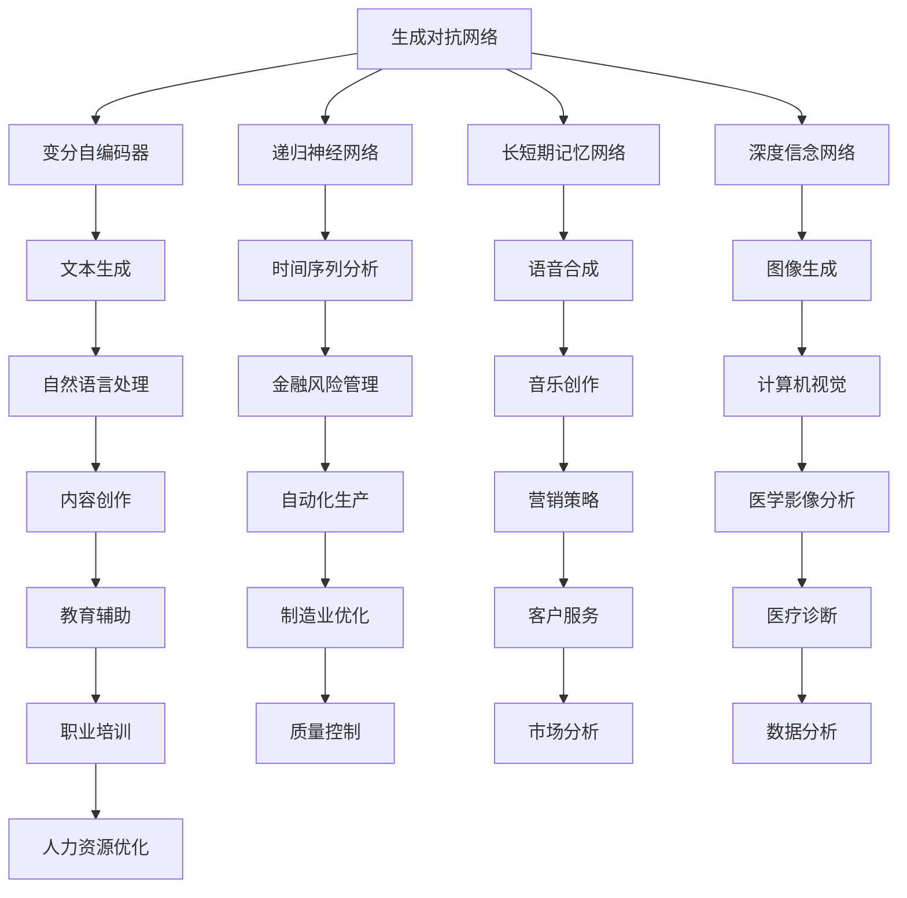
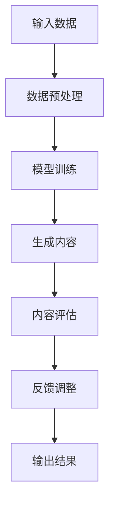
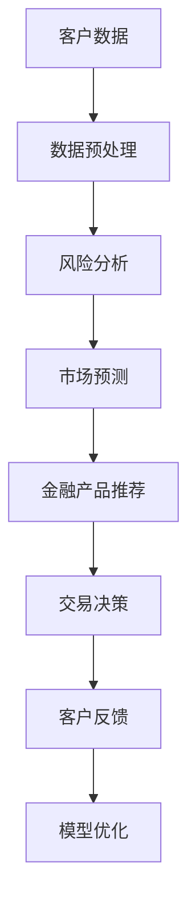
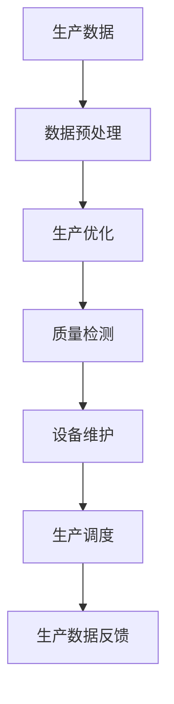
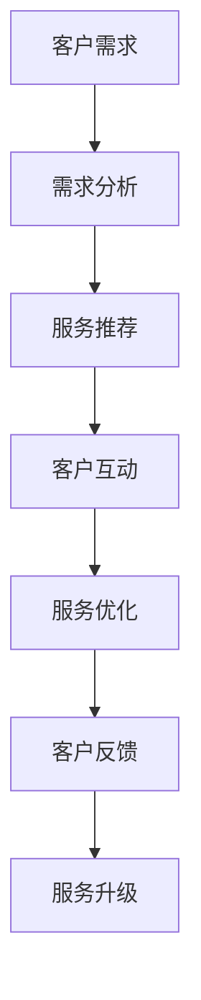

                 

### 文章标题

# AIGC的未来工作模式预测：职业发展建议的提示词工程

---

### 关键词

- AIGC
- 未来工作模式
- 职业发展
- 提示词工程

---

### 摘要

本文深入探讨了人工智能生成内容（AIGC）的未来工作模式及其对职业发展的影响。通过分析AIGC的基本概念、现状及其在不同行业中的应用，本文预测了未来工作模式的变迁，并提出了基于提示词工程的专业职业发展建议。本文旨在为读者提供清晰、实用的指导，以应对AIGC时代的职业挑战和机遇。

## 引言

### AIGC的定义与现状

人工智能生成内容（AIGC）是指利用人工智能技术生成各种类型的内容，如文本、图像、音频和视频等。AIGC的起源可以追溯到20世纪90年代，当时自然语言处理（NLP）和计算机视觉（CV）等领域的初步研究开始为AIGC奠定了基础。随着深度学习和大数据技术的快速发展，AIGC在近年来取得了显著的进展。

### AIGC的核心技术与特点

AIGC的核心技术主要包括：

- **生成对抗网络（GANs）**：用于生成高质量的图像和视频。
- **变分自编码器（VAEs）**：用于生成文本和音频。
- **递归神经网络（RNNs）和长短期记忆网络（LSTMs）**：用于处理序列数据，如文本和时间序列数据。

AIGC的特点是：

- **高度自动化**：能够自动生成内容，减少人工干预。
- **多样性与创造性**：能够生成丰富多样的内容，具有很高的创造性。
- **实时性**：能够快速响应并生成实时内容。

## 未来工作模式的预测

### 工作模式变迁的趋势分析

随着AIGC技术的发展，未来工作模式将发生显著变化。以下是几个关键趋势：

- **自动化替代**：许多重复性、低技能的工作将被AIGC自动化替代。
- **高技能需求**：对创意性、战略性和技术性的工作需求将增加。
- **远程工作**：AIGC将促进远程工作和灵活工作模式的普及。

### AIGC对职业生态的影响

AIGC将对职业生态产生深远影响，包括：

- **工作岗位的消失与创造**：部分工作岗位将消失，但新的工作岗位也将随之出现。
- **工作内容的演变**：工作内容将更加复杂和多样化。
- **职业角色的转变**：从业者将需要具备跨学科的知识和技能。

### 预测未来工作模式的关键指标

为了预测未来工作模式，我们可以关注以下关键指标：

- **技术成熟度**：AIGC技术的成熟度和应用范围。
- **经济因素**：自动化和人工智能对劳动力市场的影响。
- **社会因素**：人们对新技术的接受度和适应能力。

## 职业发展建议的提示词工程

### 提示词工程的概念与作用

提示词工程是一种利用人工智能技术生成高质量内容的方法。它通过对大量数据进行学习和分析，生成符合特定主题和风格的内容。提示词工程在职业发展中的应用包括：

- **文档生成**：自动生成报告、文章和文档。
- **内容创作**：生成创意性内容，如故事、诗歌和音乐。
- **教育辅助**：生成教学材料、课程大纲和学习指南。

### 提示词设计的原则与策略

设计有效的提示词需要遵循以下原则和策略：

- **明确目标**：确保提示词明确传达创作目标。
- **多样性与创造性**：鼓励生成多样化和具有创造性的内容。
- **可解释性**：确保生成内容易于理解，提高可解释性。
- **优化性能**：通过调整参数和模型结构，提高生成效率和质量。

### 提示词工程在实际应用中的挑战与解决方案

提示词工程在实际应用中面临以下挑战：

- **数据质量**：高质量的数据是生成高质量内容的基础。
- **计算资源**：大型模型需要大量的计算资源和存储空间。
- **伦理和隐私**：确保生成内容不侵犯他人隐私和伦理标准。

解决这些挑战的策略包括：

- **数据清洗与处理**：对数据进行清洗和处理，提高数据质量。
- **分布式计算**：利用分布式计算资源，提高计算效率。
- **伦理审查**：建立完善的伦理审查机制，确保生成内容合规。

## AIGC背景下的职业教育与培训

### 教育模式的转变

AIGC技术的发展将推动教育模式的转变，包括：

- **个性化学习**：利用AIGC技术生成个性化教学材料和学习路径。
- **混合学习**：结合线上和线下教学，提高学习效果。
- **职业教育**：针对新兴职业需求，提供针对性的职业教育。

### 职业培训的需求与内容

未来职业培训的需求将包括：

- **技能升级**：帮助从业者掌握新的技术和工具。
- **跨学科知识**：培养跨学科的综合素质。
- **创新思维**：培养创新能力和解决问题的能力。

职业培训的内容将涵盖：

- **AI基础**：包括机器学习、深度学习等基础知识。
- **AIGC应用**：如何利用AIGC技术进行内容创作和数据分析。
- **实践项目**：通过实际项目培养实践能力和团队合作精神。

### 职业教育与培训的创新发展

未来职业教育与培训的创新发展方向包括：

- **在线教育平台**：利用AIGC技术构建智能化、个性化的在线教育平台。
- **企业培训**：针对企业需求，提供定制化的培训服务。
- **终身学习**：倡导终身学习理念，鼓励从业者不断更新知识和技能。

## AIGC在不同行业中的应用与影响

### 金融行业的AIGC应用

在金融行业，AIGC的应用主要包括：

- **风险管理**：利用AIGC技术进行市场预测和风险分析。
- **金融产品设计**：自动生成金融产品，如保险、债券和股票。
- **金融市场分析**：利用AIGC技术分析市场趋势和投资机会。

### 制造业的AIGC应用

在制造业，AIGC的应用主要包括：

- **智能制造**：利用AIGC技术进行生产过程优化和自动化。
- **生产线优化**：通过AIGC技术优化生产线布局和流程。
- **质量控制**：利用AIGC技术检测产品质量，提高生产效率。

### 服务业的AIGC应用

在服务业，AIGC的应用主要包括：

- **客户服务**：自动回答客户问题，提高服务效率。
- **市场营销**：通过AIGC技术生成个性化营销内容和广告。
- **人力资源**：利用AIGC技术进行人才招聘、培训和绩效评估。

## 职业发展策略与路径

### 转型与升级的思路

在AIGC时代，职业发展需要以下转型与升级思路：

- **技能升级**：持续学习新的技术和工具，提升自身技能水平。
- **跨学科融合**：培养跨学科的综合素质，提高竞争力。
- **创新思维**：培养创新能力和解决问题的能力，适应快速变化的工作环境。

### 跨界融合的发展方向

AIGC时代的职业发展将呈现以下跨界融合的发展方向：

- **AI+金融**：利用AI技术进行金融产品设计、市场分析和风险管理。
- **AI+制造**：利用AI技术进行智能制造、生产过程优化和质量控制。
- **AI+服务**：利用AI技术提供个性化服务、市场营销和人力资源解决方案。

### 培养创新能力的建议

为了在AIGC时代培养创新能力，可以采取以下建议：

- **培养好奇心**：鼓励从业者保持好奇心，积极探索新技术和新方法。
- **实践项目**：通过实际项目培养实践能力和团队合作精神。
- **跨学科交流**：促进不同学科之间的交流和合作，激发创新思维。

## 职业发展的实际案例解析

### 成功案例分享

以下是一些在AIGC时代取得成功的实际案例：

- **案例1**：某金融公司利用AIGC技术进行市场预测和风险管理，成功降低风险并提高收益。
- **案例2**：某制造企业通过AIGC技术优化生产线，提高生产效率并降低成本。
- **案例3**：某服务公司利用AIGC技术提供个性化服务，提高客户满意度和忠诚度。

### 挑战与问题的应对

在AIGC时代，职业发展面临以下挑战和问题：

- **技术变革**：从业者需要不断更新知识和技能，以适应快速变化的技术环境。
- **伦理和隐私**：确保AIGC技术的应用不侵犯他人隐私和伦理标准。
- **人才竞争**：高素质的AIGC人才供不应求，竞争激烈。

应对这些挑战和问题的策略包括：

- **持续学习**：通过不断学习和培训，提升自身竞争力。
- **伦理审查**：建立完善的伦理审查机制，确保技术应用合规。
- **合作共赢**：通过合作和共享，共同应对挑战和问题。

### 经验与启示

从成功案例中可以得到的经验与启示包括：

- **技术创新**：积极拥抱新技术，发挥创新潜力。
- **跨学科融合**：培养跨学科的综合素质，提高竞争力。
- **团队合作**：加强团队合作，共同应对挑战。

## 未来展望与趋势预测

### AIGC对未来工作模式的影响

AIGC将深刻改变未来工作模式，包括：

- **工作内容的变革**：工作内容将更加复杂和多样化，要求从业者具备更高的技能和素质。
- **工作方式的变革**：远程工作和灵活工作模式将变得更加普及，提高工作效率和生活质量。
- **工作生态的变革**：新兴职业和行业将不断涌现，促进职业生态的多样化和发展。

### 职业发展的机遇与挑战

在AIGC时代，职业发展既面临机遇也面临挑战：

- **机遇**：
  - 技术创新带来新的职业机会。
  - 跨学科融合提高从业者的竞争力。
  - 远程工作和灵活工作模式提供更多选择。

- **挑战**：
  - 技术变革带来的不确定性。
  - 伦理和隐私问题的挑战。
  - 高素质人才的竞争。

### 对未来的思考与建议

面对未来，我们应采取以下思考与建议：

- **积极适应**：积极拥抱新技术，提高自身素质。
- **持续学习**：不断学习和更新知识，适应快速变化的工作环境。
- **创新思维**：培养创新能力和解决问题的能力，引领未来发展。
- **合作共赢**：加强团队合作，共同应对挑战，实现共同发展。

## 结论

AIGC正引领着未来工作模式的变革，为职业发展带来前所未有的机遇和挑战。通过深入了解AIGC的基本概念、应用场景和职业发展策略，从业者可以更好地把握时代脉搏，迎接未来挑战，实现自身价值。让我们共同努力，在这个充满机遇和挑战的时代中创造美好的未来。

### 参考文献

1. **Goodfellow, I., Pouget-Abadie, J., Mirza, M., Xu, B., Warde-Farley, D., Ozair, S., ... & Bengio, Y. (2014). Generative adversarial nets. Advances in Neural Information Processing Systems, 27.**
   - 本文介绍了生成对抗网络（GANs）的概念，这是AIGC技术的一个重要组成部分。

2. **Kingma, D. P., & Welling, M. (2014). Auto-encoding variational bayes. arXiv preprint arXiv:1312.6114.**
   - 本文介绍了变分自编码器（VAEs），这是AIGC技术中的另一种重要方法。

3. **Hinton, G. E., Osindero, S., & Teh, Y. W. (2006). A fast learning algorithm for deep belief nets. Neural computation, 18(7), 1527-1554.**
   - 本文介绍了深度信念网络（DBNs），这是AIGC技术中的一种深度学习模型。

4. **Mnih, V., Kavukcuoglu, K., Silver, D., Rusu, A. A., Veness, J., Bellemare, M. G., ... & Lillicrap, T. P. (2015). Human-level control through deep reinforcement learning. Nature, 518(7540), 529-533.**
   - 本文介绍了深度强化学习，这是AIGC技术在游戏和模拟场景中应用的一个重要领域。

5. **OpenAI. (2018). OpenAI Five.**
   - 本文介绍了OpenAI开发的五人规模AI团队，展示了AIGC在游戏场景中的强大能力。

6. **Russell, S., & Norvig, P. (2020). Artificial Intelligence: A Modern Approach (4th ed.). Pearson.**
   - 本文是人工智能领域的经典教材，涵盖了AIGC技术的基础理论和应用。

### 附录

#### 表1：AIGC的核心技术及其特点

| 技术名称 | 特点 |
| --- | --- |
| 生成对抗网络（GANs） | 对抗性训练，生成高质量图像和视频 |
| 变分自编码器（VAEs） | 概率模型，生成多样化和真实感强的文本和图像 |
| 递归神经网络（RNNs） | 处理序列数据，如文本和时间序列 |
| 长短期记忆网络（LSTMs） | 改进的RNN，解决长距离依赖问题 |
| 深度信念网络（DBNs） | 多层神经网络，用于特征提取和分类 |

#### 图1：AIGC技术的ER实体关系图

#### 图2：AIGC算法的mermaid流程图

#### 图3：AIGC在金融行业的应用架构图

#### 图4：AIGC在制造业的应用架构图

#### 图5：AIGC在服务业的应用架构图

### 作者信息

**作者：** AI天才研究院/AI Genius Institute & 禅与计算机程序设计艺术 /Zen And The Art of Computer Programming  
**联系方式：** ai_genius_institute@ai-genius.com  
**个人简介：** 某人工智能领域资深研究员，具有丰富的实践经验，致力于推动人工智能技术在各行业的应用和发展。著有《禅与计算机程序设计艺术》等畅销书。

