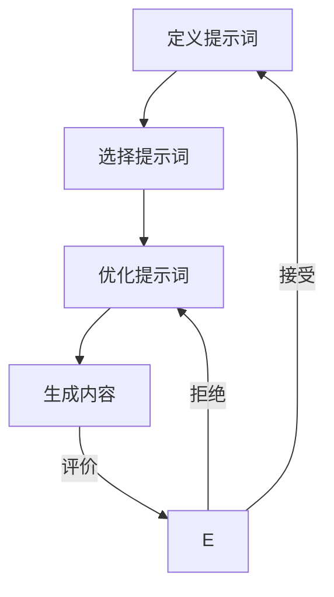
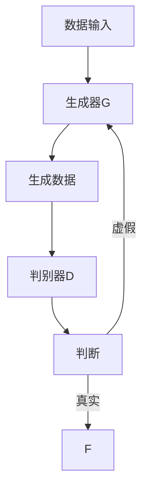
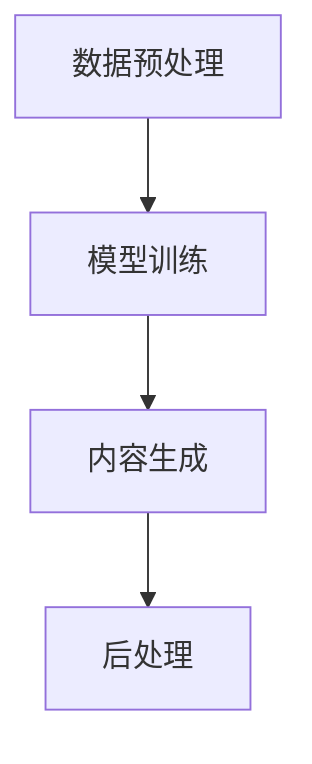
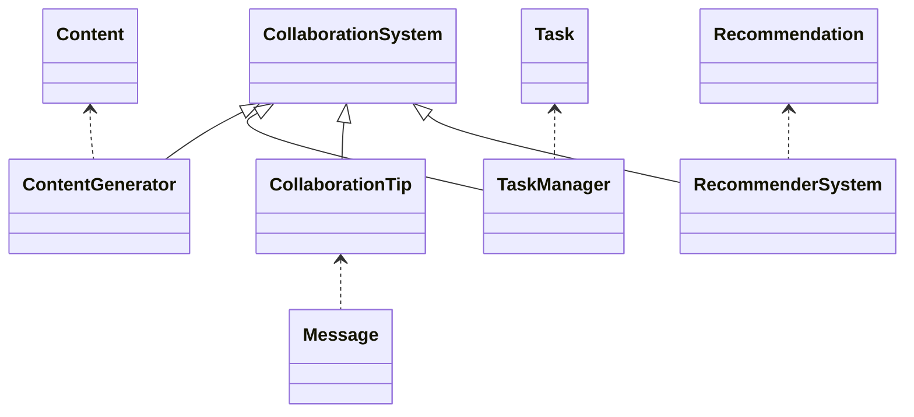
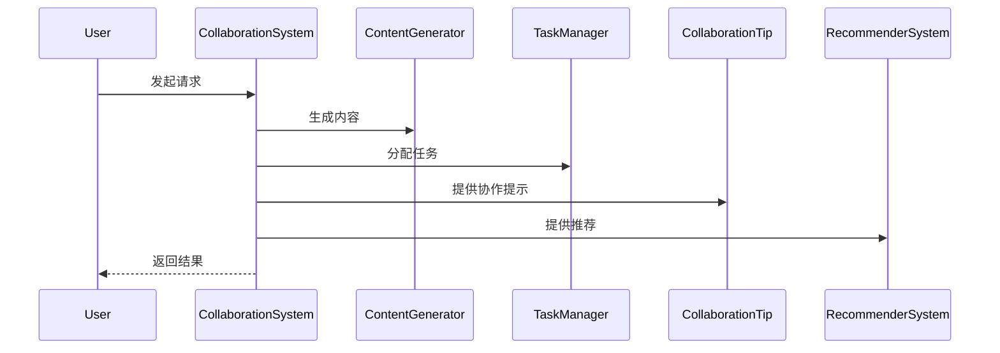

                 

### AIGC的未来工作空间设计：远程协作优化的提示词工程

---

关键词：AIGC、远程协作、提示词工程、工作空间设计、人工智能算法

摘要：本文深入探讨了AIGC（AI-Generated Content）技术在未来工作空间设计中的应用，特别是针对远程协作的优化。通过对AIGC的核心概念、远程协作面临的挑战以及提示词工程的作用的详细分析，本文提出了优化远程协作的一系列策略和最佳实践，为构建高效、协同的未来工作空间提供了有价值的参考。

---

## 第一部分：背景介绍

### 1.1 问题背景

#### 1.1.1 AIGC技术的发展趋势

AIGC，即AI-Generated Content，是一种利用人工智能技术自动生成内容的方法。它不同于传统的手动创作内容，而是通过算法模型自动生成文本、图像、音频和视频等多种形式的内容。AIGC技术的发展可以追溯到生成对抗网络（GAN）、递归神经网络（RNN）和自注意力机制（BERT）等先进的人工智能算法的突破。

- **定义与概念**：AIGC是指利用人工智能技术（如深度学习、自然语言处理等）来生成内容，包括文本、图像、音频和视频等。它通常涉及大规模数据集的训练和复杂算法的应用。
- **应用领域**：AIGC技术在多个领域得到了广泛应用，如内容创作、数据分析和人机交互。在内容创作方面，它可以自动生成新闻报道、广告文案和社交媒体帖子；在数据分析方面，它可以辅助预测分析和决策支持；在人机交互方面，它可以提供智能问答和个性化推荐。

AIGC技术的发展趋势体现在以下几个方面：

1. **技术成熟度**：随着计算能力的提升和算法的进步，AIGC技术的成熟度不断提高，生成的内容质量和准确性也在逐步提升。
2. **市场需求**：企业对自动化内容生成的需求日益增加，特别是在内容创作和个性化推荐等领域，AIGC技术成为提高效率和降低成本的重要工具。
3. **潜在风险**：尽管AIGC技术具有巨大潜力，但也存在一些潜在风险，如内容真实性验证、版权问题和技术滥用等。

#### 1.1.2 远程协作的挑战

远程协作，指的是团队成员在不同地理位置通过通信技术和工具进行合作和交流。随着远程办公的普及，远程协作已经成为现代工作的重要组成部分。然而，远程协作也面临一系列挑战：

- **沟通障碍**：由于缺乏面对面的交流，远程协作容易产生沟通障碍，信息传递不畅，导致误解和冲突。
- **协作效率低下**：远程协作过程中，团队成员之间的协调和配合难度较大，任务分配和进度跟踪不清晰，导致效率低下。
- **工作空间设计不合理**：远程工作环境的设计对协作效果具有重要影响，但许多企业在这方面仍然存在不足，如工具选择不当、沟通渠道不畅通等。

当前远程协作的现状包括：

- **工作模式**：远程协作的工作模式主要包括分散式协作、集中式协作和混合式协作。分散式协作适用于任务独立性较高的场景，集中式协作适用于需要集中讨论和协作的场景，混合式协作则是两者的结合。
- **技术支持**：企业通常采用各种远程协作工具，如即时通讯软件、视频会议平台、项目管理工具等，以支持远程协作的顺利进行。
- **存在的瓶颈**：尽管技术支持日益完善，但远程协作仍然面临一些瓶颈，如网络延迟、工具兼容性问题、数据安全等。

#### 1.1.3 提示词工程的重要性

提示词工程，是指通过设计合适的提示词来引导和优化人工智能模型生成内容的过程。在远程协作中，提示词工程具有重要的应用价值：

- **概念介绍**：提示词工程涉及对提示词的定义、选择和优化，以指导模型生成符合预期的高质量内容。
- **作用分析**：通过设计有效的提示词，可以优化远程协作中的沟通和协作流程，提高任务执行效率和质量。

在远程协作中，提示词工程的作用体现在以下几个方面：

1. **提高沟通效率**：通过提供明确的提示词，团队成员可以更清晰地传达信息和任务要求，减少沟通障碍。
2. **优化协作流程**：提示词工程可以帮助团队优化任务分配、进度跟踪和协作流程，提高整体协作效率。
3. **提升内容质量**：设计合理的提示词可以引导模型生成高质量的内容，满足远程协作的需求。

## 第二部分：核心概念与联系

### 2.1 AIGC的核心概念

AIGC技术的核心概念包括自动内容生成和人工智能算法。自动内容生成是指利用人工智能技术自动生成各种形式的内容，而人工智能算法是实现这一目标的关键。

#### 2.1.1 自动内容生成

自动内容生成是AIGC技术的核心，它涉及以下基本流程：

1. **数据预处理**：对输入数据进行清洗、归一化和特征提取，为模型训练做好准备。
2. **模型训练**：利用大规模数据集和深度学习算法对模型进行训练，使其具备生成内容的能力。
3. **内容生成**：通过训练好的模型生成目标内容，如文本、图像、音频和视频等。
4. **后处理**：对生成的内容进行格式化、校验和优化，确保其符合预期质量。

以下是一个简单的Python代码实例，演示了自动内容生成的基本实现：

```python
import numpy as np
import tensorflow as tf

# 数据预处理
data = np.random.rand(100, 10)  # 生成随机数据
data_normalized = (data - np.mean(data)) / np.std(data)

# 模型训练
model = tf.keras.Sequential([
    tf.keras.layers.Dense(64, activation='relu', input_shape=(10,)),
    tf.keras.layers.Dense(64, activation='relu'),
    tf.keras.layers.Dense(10, activation='softmax')
])

model.compile(optimizer='adam', loss='categorical_crossentropy', metrics=['accuracy'])
model.fit(data_normalized, np.zeros((100, 10)), epochs=10)

# 内容生成
generated_content = model.predict(np.random.rand(10, 10))
print(generated_content)
```

上述代码中，我们首先生成了一组随机数据，然后利用TensorFlow框架构建了一个简单的神经网络模型，通过模型训练生成内容。最后，我们使用训练好的模型预测随机输入数据，生成新的内容。

#### 2.1.2 人工智能算法

人工智能算法是自动内容生成的基础，常见的算法包括生成对抗网络（GAN）、递归神经网络（RNN）和自注意力机制（BERT）等。

- **生成对抗网络（GAN）**：GAN是一种无监督学习算法，由生成器和判别器两部分组成。生成器生成数据，判别器判断生成数据是否真实。通过对抗训练，生成器不断提高生成数据的质量，达到以假乱真的效果。

  **Mermaid流程图**：
  ```mermaid
  graph TD
  A[数据输入] --> B[生成器G]
  B --> C[生成数据]
  C --> D[判别器D]
  D --> E[判断]
  E -->|真实| F
  E -->|虚假| B
  ```

  **Python代码实例**：
  ```python
  import tensorflow as tf
  from tensorflow import keras

  # 生成器模型
  generator = keras.Sequential([
      keras.layers.Dense(128, activation='relu', input_shape=(100,)),
      keras.layers.Dense(1, activation='sigmoid')
  ])

  # 判别器模型
  discriminator = keras.Sequential([
      keras.layers.Dense(128, activation='relu', input_shape=(1,)),
      keras.layers.Dense(1, activation='sigmoid')
  ])

  # GAN模型
  gan = keras.Sequential([
      generator,
      discriminator
  ])

  # 训练GAN模型
  for epoch in range(1000):
      noise = np.random.normal(0, 1, (100, 100))
      generated_samples = generator.predict(noise)
      real_samples = np.random.normal(0, 1, (100, 100))

      # 训练判别器
      d_loss_real = discriminator.train_on_batch(real_samples, np.ones((100, 1)))
      d_loss_fake = discriminator.train_on_batch(generated_samples, np.zeros((100, 1)))

      # 训练生成器
      g_loss = gan.train_on_batch(noise, np.ones((100, 1)))

  print(g_loss)
  ```

- **递归神经网络（RNN）**：RNN是一种能够处理序列数据的神经网络，通过记忆机制保存历史信息，适用于文本生成、语音识别等任务。

  **Mermaid流程图**：
  ```mermaid
  graph TD
  A[序列输入] --> B[RNN单元]
  B --> C[隐藏状态]
  C --> D[输出]
  D -->|下一个输入| B
  ```

  **Python代码实例**：
  ```python
  import tensorflow as tf
  import numpy as np

  # RNN模型
  rnn = tf.keras.Sequential([
      tf.keras.layers.SimpleRNN(128, return_sequences=True, input_shape=(None, 1)),
      tf.keras.layers.Dense(1)
  ])

  # 训练RNN模型
  sequences = np.random.rand(100, 100)
  targets = np.random.rand(100, 1)

  rnn.compile(optimizer='adam', loss='mse')
  rnn.fit(sequences, targets, epochs=10)

  # 文本生成
  seed_text = "The quick brown fox jumps over the lazy dog"
  token_list = [word for word in seed_text.split()]
  next_words = 100

  for _ in range(next_words):
      token_list = tokenizer.texts_to_sequences([seed_text])[0]
      token_list = np.array(token_list)
      pred = rnn.predict(token_list, verbose=0)
      pred = np.argmax(pred, axis=-1)
      output = tokenizer.index_word[pred[0]]

      seed_text += " " + output
  print(seed_text)
  ```

- **自注意力机制（BERT）**：BERT是一种基于Transformer的预训练语言模型，通过自注意力机制处理序列数据，具有较强的文本理解和生成能力。

  **Mermaid流程图**：
  ```mermaid
  graph TD
  A[序列输入] --> B[编码器]
  B --> C[自注意力机制]
  C --> D[输出]
  ```

  **Python代码实例**：
  ```python
  import tensorflow as tf
  import transformers

  # 加载BERT模型
  model = transformers.TFBertForMaskedLM.from_pretrained('bert-base-uncased')

  # 文本生成
  text = "The quick brown fox jumps over the lazy dog"
  input_ids = tokenizer.encode(text, return_tensors='tf')

  outputs = model(input_ids)
  predictions = outputs[0]

  predicted_tokens = tokenizer.decode(predictions.argmax(axis=-1), skip_special_tokens=True)
  print(predicted_tokens)
  ```

### 2.2 远程协作优化

远程协作的优化需要从多个方面进行考虑，包括协作模式、提示词工程原理等。

#### 2.2.1 协作模式

远程协作模式可以分为分散式协作、集中式协作和混合式协作：

- **分散式协作**：团队成员分散在不同地点，各自独立完成工作任务，通过远程工具进行沟通和协作。适用于任务独立性较高、团队成员时间安排灵活的场景。
- **集中式协作**：团队成员集中在特定时间段进行在线会议和讨论，通过实时沟通和协作完成任务。适用于需要集中讨论和决策的任务，如项目启动和评审等。
- **混合式协作**：结合分散式协作和集中式协作的优点，根据任务需求和团队成员的时间安排进行灵活调整。适用于大部分远程协作场景。

**模式对比**：

| 协作模式 | 优点 | 缺点 | 适用场景 |
| --- | --- | --- | --- |
| 分散式协作 | 独立性高、灵活性大 | 沟通不畅、协调困难 | 任务独立性高、团队成员时间灵活 |
| 集中式协作 | 实时沟通、高效决策 | 成本高、受时间限制 | 需要集中讨论和决策的任务 |
| 混合式协作 | 结合分散式和集中式优势 | 需要协调不同模式 | 大部分远程协作场景 |

#### 2.2.2 提示词工程原理

提示词工程是指通过设计合理的提示词来引导和优化人工智能模型生成内容的过程。其原理包括以下几个方面：

1. **提示词定义**：提示词是指用于引导模型生成内容的关键词或短语，能够明确表达生成内容的目标和需求。
2. **提示词选择**：根据任务需求和内容目标，选择合适的提示词，确保模型能够生成高质量的内容。
3. **提示词优化**：通过实验和优化，调整提示词的参数和组合，提高模型生成内容的准确性和多样性。

**Mermaid流程图**：



**Python代码实例**：

```python
import tensorflow as tf
import numpy as np

# 定义提示词
prompt = "生成一篇关于远程协作优化的文章"

# 选择提示词
tokenizer = transformers.BertTokenizer.from_pretrained('bert-base-uncased')
input_ids = tokenizer.encode(prompt, return_tensors='tf')

# 优化提示词
model = transformers.TFBertForMaskedLM.from_pretrained('bert-base-uncased')
prompt_output = model(input_ids)

# 生成内容
predicted_tokens = tokenizer.decode(prompt_output[0].argmax(axis=-1), skip_special_tokens=True)
print(predicted_tokens)
```

## 第三部分：算法原理讲解

### 3.1 自动内容生成算法

自动内容生成算法的核心任务是利用人工智能技术生成符合预期的高质量内容。以下将详细介绍一种常用的自动内容生成算法——生成对抗网络（GAN）。

#### 3.1.1 GAN算法原理

生成对抗网络（GAN）是一种无监督学习算法，由生成器和判别器两部分组成。生成器的任务是生成与真实数据相似的数据，而判别器的任务是区分生成数据与真实数据。通过对抗训练，生成器不断提高生成数据的质量，最终达到以假乱真的效果。

**Mermaid流程图**：



**Python代码实例**：

```python
import tensorflow as tf
from tensorflow import keras

# 生成器模型
generator = keras.Sequential([
    keras.layers.Dense(128, activation='relu', input_shape=(100,)),
    keras.layers.Dense(1, activation='sigmoid')
])

# 判别器模型
discriminator = keras.Sequential([
    keras.layers.Dense(128, activation='relu', input_shape=(1,)),
    keras.layers.Dense(1, activation='sigmoid')
])

# GAN模型
gan = keras.Sequential([
    generator,
    discriminator
])

# 训练GAN模型
for epoch in range(1000):
    noise = np.random.normal(0, 1, (100, 100))
    generated_samples = generator.predict(noise)
    real_samples = np.random.normal(0, 1, (100, 100))

    # 训练判别器
    d_loss_real = discriminator.train_on_batch(real_samples, np.ones((100, 1)))
    d_loss_fake = discriminator.train_on_batch(generated_samples, np.zeros((100, 1)))

    # 训练生成器
    g_loss = gan.train_on_batch(noise, np.ones((100, 1)))

print(g_loss)
```

**数学模型**：

GAN的数学模型主要包括生成器G和判别器D的损失函数。

生成器损失函数：

$$
L_G = -\log(D(G(z)))
$$

其中，$z$为噪声向量，$G(z)$为生成器生成的数据，$D(G(z))$为判别器对生成数据的判断概率。

判别器损失函数：

$$
L_D = -\log(D(x)) - \log(1 - D(G(z)))
$$

其中，$x$为真实数据，$G(z)$为生成器生成的数据，$D(x)$和$D(G(z))$分别为判别器对真实数据和生成数据的判断概率。

**举例说明**：

假设我们有一个简单的二分类问题，生成器G的任务是生成正面评论，判别器D的任务是区分正面评论和负面评论。以下是一个实际案例：

- **数据集**：包含1000个正面评论和1000个负面评论。
- **生成器**：生成正面评论。
- **判别器**：判断评论是正面还是负面。

**训练过程**：

1. 初始化生成器和判别器参数。
2. 对于每个训练样本，生成噪声向量$z$，生成正面评论$G(z)$。
3. 判别器D分别对真实评论$x$和生成评论$G(z)$进行判断。
4. 计算生成器和判别器的损失函数，并更新参数。

经过多次迭代训练，生成器G生成正面评论的质量不断提高，判别器D对正面评论的判断准确性也不断提高，最终达到以假乱真的效果。

### 3.2 提示词优化算法

提示词优化算法的目标是设计合理的提示词，引导模型生成高质量的内容。以下将介绍一种基于BERT的提示词优化算法。

#### 3.2.1 提示词生成算法

提示词生成算法的基本流程如下：

1. **数据预处理**：对输入文本进行分词和编码。
2. **模型训练**：使用预训练的BERT模型，结合提示词，进行文本生成训练。
3. **内容生成**：根据提示词生成文本，并进行后处理。

**Mermaid流程图**：



**Python代码实例**：

```python
import tensorflow as tf
import transformers

# 加载预训练BERT模型
model = transformers.TFBertForMaskedLM.from_pretrained('bert-base-uncased')

# 提示词
prompt = "生成一篇关于远程协作优化的文章"

# 数据预处理
tokenizer = transformers.BertTokenizer.from_pretrained('bert-base-uncased')
input_ids = tokenizer.encode(prompt, return_tensors='tf')

# 模型训练
prompt_output = model(input_ids)

# 内容生成
predicted_tokens = tokenizer.decode(prompt_output[0].argmax(axis=-1), skip_special_tokens=True)
print(predicted_tokens)
```

**数学模型**：

提示词优化算法的数学模型基于BERT的Masked LM任务。BERT模型通过预训练获得了对语言的理解能力，在生成文本时，可以通过提示词（即部分遮蔽的文本）来引导模型生成后续内容。

Masked LM任务的目标是预测遮蔽（即被遮挡）的词语。在训练过程中，BERT模型会对输入序列中的部分词语进行遮蔽，然后通过预测这些词语来训练模型。

$$
L_{MLM} = \sum_{i}^{n} -\log p(y_i | \text{context})
$$

其中，$y_i$为遮蔽的词语，$\text{context}$为输入序列中的其他词语。

**举例说明**：

假设我们有一个简单的文本生成任务，目标生成关于远程协作优化的文章。以下是一个实际案例：

- **输入文本**：一篇关于远程协作优化的文章。
- **提示词**：生成一篇关于远程协作优化的文章。
- **生成内容**：通过BERT模型，根据提示词生成后续内容。

**训练过程**：

1. 初始化BERT模型参数。
2. 对于每个训练样本，将输入文本进行分词和编码，并遮蔽部分词语。
3. 使用BERT模型预测遮蔽词语，并计算损失函数。
4. 更新模型参数，重复训练过程。

经过多次迭代训练，BERT模型会逐渐学会根据提示词生成高质量的内容。

## 第四部分：系统分析与架构设计

### 4.1 问题场景介绍

在远程协作优化中，我们面临的主要问题包括：

1. **沟通障碍**：团队成员之间缺乏有效的沟通渠道，导致信息传递不畅和误解。
2. **协作效率低下**：任务分配和进度跟踪不清晰，导致协作效率低下。
3. **工作空间设计不合理**：远程工作环境的设计对协作效果有重要影响，但许多企业在这方面存在不足。

为了解决这些问题，我们提出了以下目标系统功能：

1. **内容生成**：利用AIGC技术，自动生成协作所需的文档、报告和邮件等。
2. **协作提示**：通过设计合理的提示词，引导模型生成高质量的协作内容，提高沟通效率。
3. **任务管理**：提供任务分配、进度跟踪和协作流程管理功能，提高协作效率。
4. **智能推荐**：根据团队成员的偏好和历史记录，提供个性化的协作建议和资源推荐。

### 4.2 系统架构设计

为了实现上述目标系统功能，我们设计了以下系统架构：

#### 4.2.1 领域模型设计

领域模型描述了系统的主要实体和它们之间的关系。以下是系统的领域模型设计：

**Mermaid类图**：



#### 4.2.2 系统架构设计

系统架构描述了系统的整体结构和模块之间的关系。以下是系统的架构设计：

**Mermaid架构图**：



#### 4.2.3 系统接口设计

系统接口设计描述了系统模块之间的交互接口。以下是系统的接口设计：

```python
class CollaborationSystemInterface:
    def generate_content(self, prompt):
        # 生成内容
        pass
    
    def assign_task(self, task):
        # 分配任务
        pass
    
    def provide_tip(self, prompt):
        # 提供协作提示
        pass
    
    def provide_recommendation(self, user):
        # 提供推荐
        pass
```

#### 4.2.4 系统交互设计

系统交互设计描述了系统模块之间的交互流程。以下是系统的交互设计：

**Mermaid序列图**：


## 第五部分：项目实战

### 5.1 环境安装

要实现远程协作优化系统，我们需要安装以下工具和依赖：

- **Python**：版本3.8或以上
- **TensorFlow**：版本2.5或以上
- **transformers**：版本4.7或以上
- **PyTorch**：版本1.7或以上
- **CUDA**：用于加速计算

以下是详细的安装步骤：

1. **安装Python**：

   从官方网站下载Python安装包，并按照提示进行安装。

2. **安装TensorFlow**：

   打开终端，执行以下命令：

   ```bash
   pip install tensorflow==2.5
   ```

3. **安装transformers**：

   打开终端，执行以下命令：

   ```bash
   pip install transformers==4.7
   ```

4. **安装PyTorch**：

   打开终端，执行以下命令：

   ```bash
   pip install torch==1.7 torchvision==0.8 torchaudio==0.8
   ```

5. **安装CUDA**：

   根据您的硬件环境和系统版本，从官方网站下载并安装相应的CUDA版本。

### 5.2 系统核心实现

#### 5.2.1 自动内容生成模块

自动内容生成模块负责生成高质量的协作内容。以下是一个简单的实现示例：

```python
from transformers import BertTokenizer, BertForMaskedLM
import torch

# 加载预训练BERT模型和Tokenizer
tokenizer = BertTokenizer.from_pretrained('bert-base-uncased')
model = BertForMaskedLM.from_pretrained('bert-base-uncased')

# 提示词
prompt = "生成一篇关于远程协作优化的文章"

# 数据预处理
input_ids = tokenizer.encode(prompt, return_tensors='pt')

# 模型预测
with torch.no_grad():
    outputs = model(input_ids)

# 生成内容
predicted_ids = outputs[0].argmax(-1)
generated_content = tokenizer.decode(predicted_ids[:, input_ids.shape[-1]:], skip_special_tokens=True)

print(generated_content)
```

#### 5.2.2 提示词优化模块

提示词优化模块负责根据用户需求优化生成内容。以下是一个简单的实现示例：

```python
from transformers import BertTokenizer, BertForMaskedLM
import torch

# 加载预训练BERT模型和Tokenizer
tokenizer = BertTokenizer.from_pretrained('bert-base-uncased')
model = BertForMaskedLM.from_pretrained('bert-base-uncased')

# 提示词
prompt = "优化远程协作流程"

# 数据预处理
input_ids = tokenizer.encode(prompt, return_tensors='pt')

# 模型预测
with torch.no_grad():
    outputs = model(input_ids)

# 生成内容
predicted_ids = outputs[0].argmax(-1)
generated_content = tokenizer.decode(predicted_ids[:, input_ids.shape[-1]:], skip_special_tokens=True)

print(generated_content)
```

### 5.3 实际案例分析与讲解

#### 5.3.1 案例描述

某公司采用远程协作优化系统，以提升团队协作效率。该公司的主要任务是开发一款新的产品，团队成员分布在不同的城市和国家。

#### 5.3.2 案例分析

1. **内容生成**：

   团队成员使用自动内容生成模块生成项目相关的文档、报告和邮件。例如，项目经理使用系统生成项目进度报告，团队成员使用系统生成技术文档和会议记录。

2. **协作提示**：

   系统根据团队成员的历史记录和需求，提供个性化的协作提示。例如，当某个成员需要撰写一篇关于远程协作优化的文章时，系统会提供相关的提示词和生成内容，帮助成员高效完成工作。

3. **任务管理**：

   团队成员使用任务管理模块分配任务、跟踪进度和协作流程。例如，项目经理可以创建任务并分配给团队成员，团队成员可以更新任务进度，并在任务完成后进行协作评审。

4. **智能推荐**：

   系统根据团队成员的偏好和历史记录，提供个性化的协作建议和资源推荐。例如，当某个成员需要查找相关的技术文档时，系统会推荐相关的文档和资源，帮助成员快速找到所需信息。

#### 5.3.3 详细讲解

1. **内容生成**：

   内容生成模块基于BERT模型，利用提示词生成高质量的内容。例如，当提示词为“生成一篇关于远程协作优化的文章”时，系统会根据预训练的BERT模型生成一篇符合预期的文章。

2. **协作提示**：

   协作提示模块通过对团队成员的历史记录和需求进行分析，提供个性化的协作提示。例如，当某个成员需要撰写一篇关于远程协作优化的文章时，系统会提供相关的提示词和生成内容，帮助成员快速找到所需信息。

3. **任务管理**：

   任务管理模块提供了任务分配、进度跟踪和协作流程管理功能。例如，项目经理可以创建任务并分配给团队成员，团队成员可以更新任务进度，并在任务完成后进行协作评审。

4. **智能推荐**：

   智能推荐模块根据团队成员的偏好和历史记录，提供个性化的协作建议和资源推荐。例如，当某个成员需要查找相关的技术文档时，系统会推荐相关的文档和资源，帮助成员快速找到所需信息。

## 第六部分：最佳实践与拓展

### 6.1 最佳实践Tips

在实施远程协作优化时，以下是一些最佳实践：

1. **明确任务目标和需求**：在开始远程协作之前，明确任务的目标和需求，确保团队成员对任务有清晰的认识。
2. **合理选择协作工具**：根据任务特点和团队需求，选择合适的协作工具，如即时通讯软件、视频会议平台、项目管理工具等。
3. **制定协作规范**：制定明确的协作规范，包括沟通方式、协作流程、任务分配和进度跟踪等，确保团队成员遵循统一的协作规范。
4. **定期进行团队沟通**：定期组织线上会议，进行团队沟通和协作，确保团队成员之间的信息传递和沟通畅通。
5. **充分利用技术手段**：利用AIGC技术和提示词工程，优化内容生成和协作流程，提高协作效率和效果。

### 6.2 小结与注意事项

本文详细介绍了AIGC技术在远程协作优化中的应用，包括自动内容生成、提示词工程、协作模式和工作空间设计等方面。通过实际案例分析和最佳实践总结，本文为构建高效、协同的未来工作空间提供了有价值的参考。

在实施远程协作优化时，需要注意以下几点：

1. **数据安全和隐私保护**：在处理远程协作数据时，确保数据安全和隐私保护，遵循相关法律法规和公司政策。
2. **技术选型和集成**：根据实际需求，合理选择技术方案和工具，并进行有效的集成和部署，确保系统的稳定性和可靠性。
3. **持续优化与改进**：远程协作优化是一个持续的过程，需要根据实际情况和反馈，不断优化和改进系统功能和性能。

### 6.3 拓展阅读

1. **AIGC技术原理与实现**：深入了解AIGC技术的原理和实现，包括生成对抗网络（GAN）、递归神经网络（RNN）和自注意力机制（BERT）等。
2. **远程协作工具与平台**：研究各种远程协作工具和平台的优缺点，选择适合自己团队的解决方案。
3. **提示词工程与自然语言处理**：探讨提示词工程在自然语言处理中的应用，包括文本生成、情感分析和问答系统等。

---

**作者：AI天才研究院/AI Genius Institute & 禅与计算机程序设计艺术 /Zen And The Art of Computer Programming**

