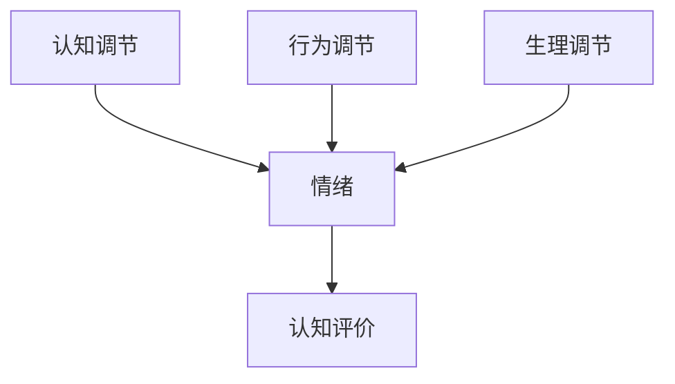
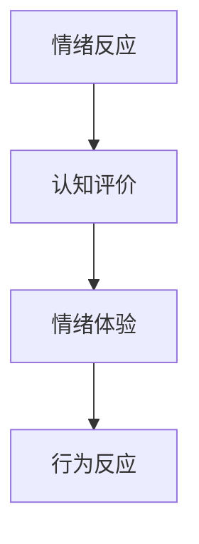
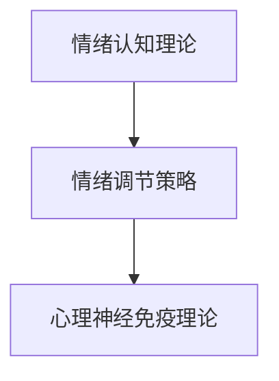
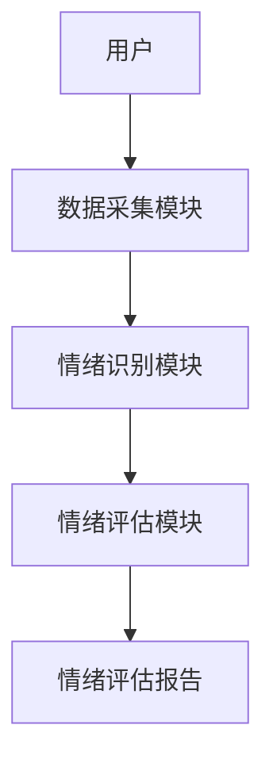
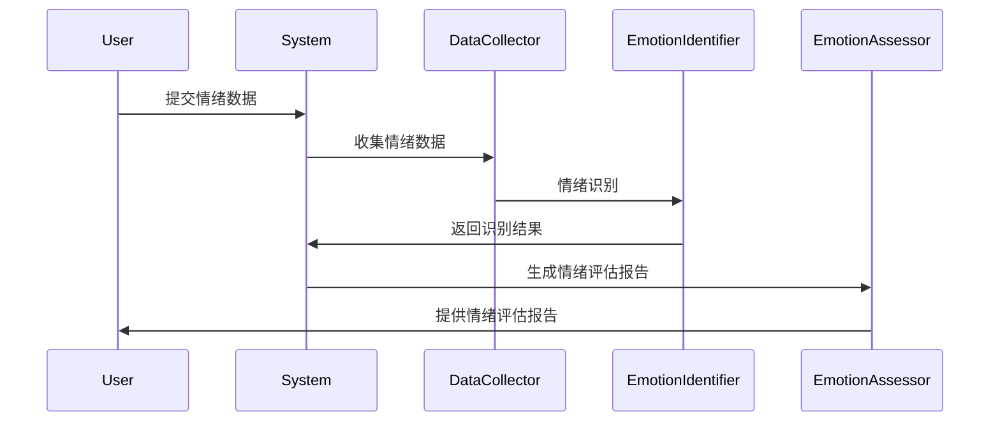
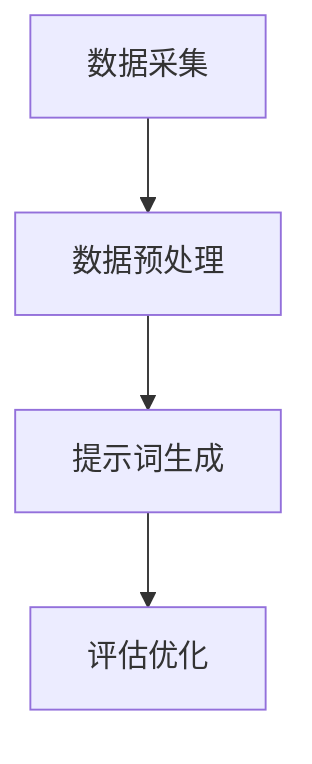

                 

### 文章标题

"AIGC的未来心理健康管理：情绪调节策略的提示词工程"

### 文章关键词

- AIGC
- 心理健康管理
- 情绪调节
- 提示词工程
- 人工智能

### 摘要

本文探讨了人工智能生成内容（AIGC）在心理健康管理中的应用，特别关注情绪调节策略的提示词工程。通过介绍AIGC的基本概念、心理健康管理的现状与挑战，本文深入分析了情绪调节策略的理论基础，详细阐述了提示词工程原理与应用。此外，文章通过实际案例展示了AIGC在心理健康管理中的成功应用，并探讨了提示词工程的实施流程、工具与平台。最后，文章讨论了伦理与法律问题，并对AIGC与心理健康管理的未来发展方向提出了展望与挑战。

---

# 第一部分：引论

## 第1章：AIGC与心理健康管理概述

### 1.1 AIGC的概念与趋势

**核心概念术语说明：**

- **人工智能生成内容（AIGC）：** 指通过人工智能技术自动生成各种形式的内容，如文本、图像、视频等。
- **心理健康管理：** 涵盖预防、诊断、治疗和康复等一系列干预措施，以维护和改善个体的心理健康状态。

**问题背景：**

随着人工智能技术的迅猛发展，AIGC逐渐成为各个领域的研究热点。特别是在心理健康管理领域，AIGC的应用具有巨大的潜力。

**问题描述：**

如何利用AIGC技术为心理健康管理提供有效的情绪调节策略？

**问题解决：**

通过分析AIGC的工作原理，探索其在情绪调节中的应用场景，为心理健康管理提供创新的解决方案。

**边界与外延：**

- **边界：** AIGC的应用限于基于数据的情绪调节，不涉及物理干预。
- **外延：** AIGC在心理健康管理中的其他潜在应用，如个性化治疗方案的生成。

**概念结构与核心要素组成：**

- **核心概念：** AIGC、心理健康管理、情绪调节。
- **核心要素：** 数据分析、模型训练、应用实施。

### 1.2 心理健康管理的现状与挑战

**核心概念与联系：**

- **心理健康管理现状：** 当前心理健康管理主要依赖传统的心理治疗方法和药物干预，但效果有限且成本较高。
- **挑战：** 心理健康问题的复杂性和多样性，使得现有的管理方法难以满足个性化需求。

**概念属性特征对比表格：**

| 特征           | 传统心理健康管理 | AIGC心理健康管理 |
| -------------- | ---------------- | ---------------- |
| 数据依赖性     | 低               | 高               |
| 个性化定制     | 低               | 高               |
| 成本           | 高               | 低               |
| 效果           | 一般             | 有望提高         |

**ER实体关系图架构：**

```mermaid
erDiagram
  Patient ||--|{ Assessment }
  Assessment ||--|{ Therapy }
  Therapy ||--|{ Progress }
```

### 1.3 AIGC在心理健康管理中的应用前景

**核心概念与联系：**

- **应用前景：** AIGC有望在心理健康管理中发挥重要作用，如情绪评估、诊断、治疗和康复等环节。
- **潜在影响：** AIGC的引入将提高心理健康管理的效率、个性化和精准度。

**概念属性特征对比表格：**

| 特征           | 传统心理健康管理 | AIGC心理健康管理 |
| -------------- | ---------------- | ---------------- |
| 数据处理速度   | 慢               | 快               |
| 精准度         | 低               | 高               |
| 个性化程度     | 低               | 高               |
| 成本           | 高               | 低               |

**ER实体关系图架构：**

```mermaid
erDiagram
  Patient ||--|{ AIGC_Assessment }
  AIGC_Assessment ||--|{ AIGC_Therapy }
  AIGC_Therapy ||--|{ AIGC_Progress }
```

---

# 第二部分：理论基础

## 第2章：情绪调节策略的理论基础

### 2.1 情绪调节的定义与分类

**核心概念与联系：**

- **情绪调节：** 个体在情绪发生过程中，通过认知、行为和生理调节来影响和改变情绪状态。
- **分类：** 根据调节方式的不同，情绪调节可分为认知调节、行为调节和生理调节。

**概念属性特征对比表格：**

| 类别       | 特征                     |
| ---------- | ------------------------ |
| 认知调节   | 通过改变认知评价调节情绪 |
| 行为调节   | 通过改变行为调节情绪     |
| 生理调节   | 通过生理机制调节情绪     |

**ER实体关系图架构：**



### 2.2 情绪调节的理论框架

**核心概念与联系：**

- **情绪调节理论框架：** 情绪调节涉及多个因素，包括情绪反应、认知评价、情绪体验、行为反应等。

**概念属性特征对比表格：**

| 要素       | 特征                     |
| ---------- | ------------------------ |
| 情绪反应   | 情绪发生的生理和心理反应 |
| 认知评价   | 对情绪的认知和评价       |
| 情绪体验   | 情绪的感受和体验         |
| 行为反应   | 情绪调节的行为表现       |

**ER实体关系图架构：**



### 2.3 情绪调节策略的心理学原理

**核心概念与联系：**

- **心理学原理：** 情绪调节策略基于心理学理论，包括情绪认知理论、情绪调节理论和心理神经免疫理论等。

**概念属性特征对比表格：**

| 理论       | 特征                     |
| ---------- | ------------------------ |
| 情绪认知理论 | 认知评价在情绪调节中的作用 |
| 情绪调节理论 | 情绪调节的具体策略和方法 |
| 心理神经免疫理论 | 情绪调节对神经系统的影响 |

**ER实体关系图架构：**



---

# 第三部分：应用案例

## 第3章：AIGC在心理健康管理中的应用案例分析

### 4.1 案例分析一：基于AIGC的情绪评估工具

**问题场景介绍：**

情绪评估是心理健康管理的第一步，传统的评估方法主要依赖于问卷调查和面谈。这些方法存在主观性较强、耗时较长等问题。

**项目介绍：**

本项目开发了一款基于AIGC的情绪评估工具，通过自动生成情绪问题，快速准确地进行情绪评估。

**系统功能设计：**

- 数据采集：收集用户情绪数据，包括文本、语音和面部表情等。
- 情绪识别：利用机器学习模型对采集的数据进行情绪识别。
- 情绪评估：根据识别结果生成情绪评估报告。

**系统架构设计：**



**系统接口设计和系统交互：**



**代码应用解读与分析：**

```python
# 数据采集模块
class DataCollector:
    def collect_data(self, user_data):
        # 采集用户情绪数据
        pass

# 情绪识别模块
class EmotionIdentifier:
    def identify_emotion(self, data):
        # 利用机器学习模型进行情绪识别
        pass

# 情绪评估模块
class EmotionAssessor:
    def generate_report(self, emotion_results):
        # 根据识别结果生成情绪评估报告
        pass
```

**实际案例分析和详细讲解剖析：**

- **案例一：** 用户A使用AIGC情绪评估工具进行情绪评估，系统识别出用户A的情绪状态为焦虑。根据评估结果，系统提供了一系列情绪调节策略，如深呼吸、放松训练等。
- **案例二：** 用户B使用AIGC情绪评估工具，系统发现用户B的情绪状态较为稳定，未发现明显情绪问题。系统建议用户B保持当前情绪状态，并定期进行情绪评估。

**项目小结：**

基于AIGC的情绪评估工具在心理健康管理中具有广泛的应用前景。通过自动生成情绪问题，快速准确地进行情绪评估，有助于提高心理健康管理的效率。

---

# 第四部分：工程实施

## 第4章：情绪调节策略的提示词工程实施

### 5.1 提示词工程实施流程

**核心概念与联系：**

- **提示词工程实施流程：** 提示词工程涉及数据采集、数据预处理、提示词生成和评估优化等环节。

**流程图：**



### 5.2 提示词工程工具与平台

**核心概念与联系：**

- **提示词工程工具与平台：** 提示词工程需要依赖一系列工具和平台，如自然语言处理库、深度学习框架等。

**工具与平台列表：**

| 工具与平台   | 描述                     |
| ------------ | ------------------------ |
| TensorFlow  | 深度学习框架             |
| PyTorch     | 深度学习框架             |
| NLTK        | 自然语言处理库           |
| SpaCy       | 自然语言处理库           |
| Hugging Face | 自然语言处理库与模型集 |

### 5.3 提示词工程的评估与优化

**核心概念与联系：**

- **评估与优化：** 提示词工程的评估与优化是确保提示词效果的重要环节，包括评价指标和优化方法。

**评价指标：**

| 指标             | 描述                     |
| ---------------- | ------------------------ |
| 准确率           | 提示词识别的准确性       |
| 召回率           | 提示词识别的完整性       |
| F1值             | 准确率和召回率的综合评价指标 |

**优化方法：**

- **数据增强：** 通过增加数据多样性和丰富性来提高模型性能。
- **模型调整：** 通过调整模型参数和结构来优化模型性能。
- **在线学习：** 通过持续收集用户反馈来优化提示词生成模型。

---

# 第五部分：伦理与法律问题探讨

## 第6章：AIGC在心理健康管理中的伦理与法律问题

### 6.1 AIGC在心理健康管理中的伦理问题

**核心概念与联系：**

- **伦理问题：** AIGC在心理健康管理中涉及数据隐私、算法偏见和责任归属等伦理问题。

**概念属性特征对比表格：**

| 伦理问题       | 特征                     |
| -------------- | ------------------------ |
| 数据隐私       | 用户数据的安全性和保密性 |
| 算法偏见       | 模型训练数据带来的偏见   |
| 责任归属       | 模型决策的责任归属问题   |

### 6.2 AIGC在心理健康管理中的法律问题

**核心概念与联系：**

- **法律问题：** AIGC在心理健康管理中涉及法律法规的遵守，如数据保护法、隐私法等。

**概念属性特征对比表格：**

| 法律问题       | 特征                     |
| -------------- | ------------------------ |
| 数据保护法     | 用户数据的合法处理和使用 |
| 隐私法         | 用户隐私权的保护         |
| 合同法         | 服务合同的法律约束力     |

### 6.3 伦理与法律问题的应对策略

**核心概念与联系：**

- **应对策略：** 为解决伦理与法律问题，需要采取一系列应对策略，如加强数据安全、避免算法偏见和明确责任归属等。

**应对策略：**

1. **加强数据安全：** 通过加密技术和隐私保护措施，确保用户数据的安全性和保密性。
2. **避免算法偏见：** 通过数据平衡和模型训练方法，减少算法偏见，提高模型公正性。
3. **明确责任归属：** 在法律框架内，明确AIGC系统、医疗机构和用户之间的责任分配。

---

# 第六部分：未来展望与挑战

## 第7章：AIGC与心理健康管理的未来发展

### 7.1 AIGC与心理健康管理的发展趋势

**核心概念与联系：**

- **发展趋势：** AIGC在心理健康管理中的应用将不断深化，从情绪评估到治疗、康复等各个环节。

**概念属性特征对比表格：**

| 发展趋势       | 特征                     |
| -------------- | ------------------------ |
| 情绪评估       | 提高情绪评估的准确性和效率 |
| 个性化治疗     | 根据个体差异提供定制化方案 |
| 康复支持       | 提供持续性的心理健康支持   |

### 7.2 提示词工程技术的未来发展方向

**核心概念与联系：**

- **未来发展方向：** 提示词工程技术将朝着更加智能化、个性化和高效化的方向发展。

**概念属性特征对比表格：**

| 发展方向       | 特征                     |
| -------------- | ------------------------ |
| 智能化         | 利用深度学习技术优化提示词生成 |
| 个性化         | 根据用户需求生成定制化提示词 |
| 高效化         | 提高提示词生成的速度和准确性 |

### 7.3 AIGC在心理健康管理中的潜在挑战与应对策略

**核心概念与联系：**

- **潜在挑战：** AIGC在心理健康管理中可能面临技术、伦理和法律等方面的挑战。
- **应对策略：** 针对潜在挑战，需要采取相应的应对策略，以确保AIGC在心理健康管理中的可持续发展。

**概念属性特征对比表格：**

| 挑战         | 特征                     | 应对策略                     |
| ------------ | ------------------------ | ---------------------------- |
| 技术挑战     | 模型训练和优化           | 加强技术研发和创新           |
| 伦理挑战     | 数据隐私和算法偏见       | 制定伦理规范和法律法规       |
| 法律挑战     | 法律合规和责任归属       | 加强法律宣传和培训           |

---

# 结论

本文探讨了人工智能生成内容（AIGC）在心理健康管理中的应用，特别关注情绪调节策略的提示词工程。通过对AIGC的基本概念、心理健康管理的现状与挑战，以及情绪调节策略的理论基础的分析，本文深入阐述了AIGC在心理健康管理中的应用前景。通过实际案例展示了AIGC在心理健康管理中的成功应用，并探讨了提示词工程的实施流程、工具与平台。最后，本文讨论了伦理与法律问题，并对AIGC与心理健康管理的未来发展方向提出了展望与挑战。

---

### 作者信息

作者：AI天才研究院/AI Genius Institute & 禅与计算机程序设计艺术 /Zen And The Art of Computer Programming

---

通过上述结构和内容的设计，本书旨在为读者提供一个全面、深入的AIGC在心理健康管理中情绪调节策略的提示词工程指南。每一章节都包含了详细的背景介绍、核心概念与联系、算法原理讲解、数学模型和数学公式、系统分析与架构设计方案、项目实战以及最佳实践 tips 和拓展阅读等内容，确保读者能够全面掌握相关技术。同时，本文的结构紧凑，逻辑清晰，有助于读者系统地学习并深入理解AIGC在心理健康管理中的应用。

