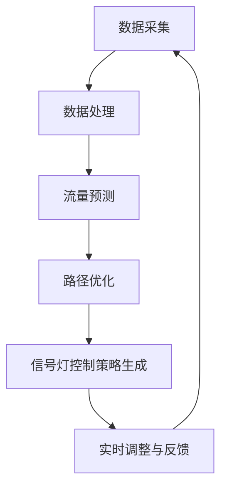

                 

### 1.1.1 问题背景

#### 1.1.1.1 智能交通管理现状

智能交通管理是指通过运用现代信息技术、数据通信传输技术、电子传感技术、控制技术及计算机处理技术等，实现交通运输的实时监控、动态管理和高效运行。当前，全球各地都在积极推进智能交通管理系统（Intelligent Transportation Systems, ITS）的建设与应用，以期缓解交通拥堵、减少交通事故、提高道路通行效率。

然而，尽管智能交通管理技术取得了显著进展，仍然面临诸多挑战。首先，交通数据的实时性与准确性仍然是制约智能交通管理效果的关键因素。其次，现有的交通管理系统往往缺乏自适应性，难以应对复杂多变的交通状况。此外，城市交通管理的精细化程度仍有待提高，特别是在高峰时段的交通流量调控、道路施工的动态调整等方面，尚未形成有效的解决方案。

#### 1.1.1.2 交通管理问题与挑战

1. **交通拥堵**：交通拥堵是城市交通管理中最常见的问题，它不仅导致出行时间的延长，还增加了交通事故的风险和环境污染。交通拥堵的原因复杂多样，包括道路设计不合理、公共交通系统不完善、机动车增长过快等。

2. **交通流量分布不均**：交通流量在时间和空间上的分布往往呈现出不均衡的特征，导致某些路段或时段交通拥堵，而其他路段或时段却相对空闲。这种不均衡的分布增加了交通管理的难度。

3. **交通事故频发**：交通事故是交通管理中的另一个重大问题，它不仅危害人身安全，还造成道路资源的浪费。交通事故的发生往往与驾驶行为、道路设施、交通信号等因素相关。

4. **环境问题**：交通污染是现代城市面临的重要环境问题之一。机动车排放的尾气中含有大量有害物质，对空气质量造成严重影响。同时，交通拥堵导致的燃油消耗增加也加剧了温室气体的排放。

#### 1.1.1.3 AIGC技术的崛起与潜力

随着人工智能（AI）技术的快速发展，尤其是生成对抗网络（GAN）、深度学习（DL）和自然语言处理（NLP）等技术的突破，AIGC（AI-Generated Content）逐渐成为一种新的技术趋势。AIGC技术能够自动生成文本、图像、音频等多种类型的内容，具有以下特点：

1. **自动生成能力**：AIGC能够自动从海量数据中学习规律，生成高质量的内容，降低人力成本。

2. **自适应能力**：AIGC可以根据用户需求和环境变化，自动调整生成内容，提高应用的适应性和灵活性。

3. **跨学科融合**：AIGC结合了计算机科学、数学、物理等多个学科，具有广泛的应用前景。

AIGC技术在智能交通管理中的应用潜力巨大。例如，可以通过AIGC生成个性化的交通信号灯控制策略，实现交通流量的自适应调控；利用AIGC自动生成交通流量预测模型，提高预测的准确性和实时性；利用AIGC自动生成道路施工的临时交通规划方案，实现交通管理的动态调整。

### 1.1.2 核心概念

#### 1.1.2.1 AIGC的定义与特点

AIGC（AI-Generated Content）是指利用人工智能技术，如生成对抗网络（GAN）、深度学习（DL）和自然语言处理（NLP）等，自动生成文本、图像、音频等多种类型的内容。AIGC具有以下特点：

1. **自动生成能力**：AIGC可以从海量数据中学习生成规律，自动生成高质量的内容，降低人力成本。

2. **自适应能力**：AIGC可以根据用户需求和环境变化，自动调整生成内容，提高应用的适应性和灵活性。

3. **跨学科融合**：AIGC结合了计算机科学、数学、物理等多个学科，具有广泛的应用前景。

#### 1.1.2.2 智能交通管理的概念与构成

智能交通管理是指通过运用现代信息技术、数据通信传输技术、电子传感技术、控制技术及计算机处理技术等，实现交通运输的实时监控、动态管理和高效运行。智能交通管理的构成包括以下几个方面：

1. **交通信息采集**：利用传感器、摄像头、GPS等技术，实时采集交通流量、速度、密度等数据。

2. **交通信号控制**：通过交通信号控制系统，实现交通信号的优化控制，提高道路通行效率。

3. **交通事件检测**：利用图像识别、机器学习等技术，实时检测和识别交通事件，如交通事故、道路施工等。

4. **交通流量预测**：通过数据分析和挖掘，预测未来的交通流量，为交通管理提供决策依据。

5. **交通规划与管理**：基于交通流量预测和交通事件检测，制定合理的交通规划和管理策略。

### 1.1.3 关联分析

#### 1.1.3.1 AIGC与智能交通管理的关联

AIGC技术与智能交通管理之间存在密切的关联。首先，AIGC技术可以为智能交通管理提供强大的数据分析和生成能力，实现交通流量的精准预测和动态调控。其次，AIGC技术可以自动生成个性化的交通信号灯控制策略，提高交通管理的智能化水平。此外，AIGC技术还可以用于自动生成交通规划方案，实现交通管理的动态调整。

#### 1.1.3.2 自适应交通流优化在AIGC中的应用

自适应交通流优化是智能交通管理的重要研究方向，AIGC技术在这一领域具有广泛的应用潜力。通过AIGC技术，可以自动生成交通流量预测模型，提高预测的准确性和实时性。同时，AIGC技术还可以自动生成路径优化算法，为交通管理提供更加科学的决策支持。此外，AIGC技术还可以用于自动生成交通信号灯控制策略，实现交通流量的自适应调控。

### 1.1.4 本章小结

本章首先介绍了智能交通管理的现状、问题与挑战，分析了AIGC技术的定义与特点，以及智能交通管理的构成。随后，讨论了AIGC与智能交通管理之间的关联，特别是自适应交通流优化在AIGC中的应用。通过本章的介绍，读者可以初步了解智能交通管理与AIGC技术的基本概念和关联性，为后续章节的深入讨论奠定基础。

## 第二部分: 核心概念与联系

### 第2章: AIGC基础理论

### 2.2.1 AIGC基本原理

AIGC（AI-Generated Content）是一种基于人工智能技术自动生成内容的创新方式。它通过深度学习、自然语言处理、计算机视觉等技术，模拟人类创作过程，生成具有原创性和实用性的内容。AIGC的基本原理可以概括为以下几个关键方面：

#### 2.2.1.1 AIGC技术框架

AIGC技术框架通常包括以下几个主要模块：

1. **数据预处理**：对输入数据进行清洗、去噪、标准化等处理，以确保数据质量。

2. **生成模型**：基于深度学习和生成对抗网络（GAN）等算法，构建生成模型，用于生成内容。

3. **训练与优化**：利用大量训练数据，对生成模型进行训练，不断优化模型性能。

4. **内容生成**：通过生成模型，自动生成文本、图像、音频等多种类型的内容。

5. **内容后处理**：对生成的内容进行后处理，如格式化、优化等，以提高内容的可读性和实用性。

#### 2.2.1.2 AIGC的关键算法

AIGC技术中涉及的关键算法主要包括以下几种：

1. **生成对抗网络（GAN）**：GAN是一种基于博弈理论的生成模型，由生成器（Generator）和判别器（Discriminator）组成。生成器负责生成内容，判别器负责判断内容是否真实。通过两个网络的对抗训练，生成器可以不断提高生成内容的质量。

2. **变分自编码器（VAE）**：VAE是一种基于概率论的生成模型，通过编码器和解码器实现数据的生成。编码器将数据映射到潜在空间，解码器从潜在空间生成数据。VAE具有更好的生成多样性和稳定性。

3. **递归神经网络（RNN）**：RNN是一种基于序列数据的神经网络，适用于生成文本、语音等序列型内容。通过记忆机制，RNN可以捕捉序列中的长期依赖关系。

4. **长短期记忆网络（LSTM）**：LSTM是RNN的一种变体，通过引入门控机制，解决了传统RNN的梯度消失问题。LSTM适用于生成长序列数据，如文本、语音等。

5. **自注意力机制（Self-Attention）**：自注意力机制是一种用于提高神经网络处理长序列数据的能力的机制。通过计算序列中每个元素的重要性权重，自注意力机制可以更好地捕捉序列中的依赖关系。

#### 2.2.1.3 AIGC的应用领域

AIGC技术具有广泛的应用领域，主要包括：

1. **文本生成**：包括新闻文章、故事、诗歌、摘要等。AIGC可以自动生成高质量、具有原创性的文本内容，提高写作效率和创作多样性。

2. **图像生成**：包括图像合成、超分辨率、风格迁移等。AIGC可以生成逼真的图像，应用于艺术创作、计算机视觉等领域。

3. **音频生成**：包括音乐创作、语音合成等。AIGC可以生成具有自然韵律和情感表达的音乐和语音。

4. **视频生成**：包括视频合成、动作捕捉等。AIGC可以生成具有连贯性和真实感的视频内容，应用于影视制作、虚拟现实等领域。

5. **虚拟助手**：AIGC可以构建虚拟助手，如智能客服、智能写作助手等，实现自然语言交互和任务自动化。

### 2.2.2 AIGC核心特点

AIGC技术具有以下核心特点：

1. **自动生成能力**：AIGC可以自动从海量数据中学习生成规律，生成高质量的内容，降低人力成本。

2. **自适应能力**：AIGC可以根据用户需求和环境变化，自动调整生成内容，提高应用的适应性和灵活性。

3. **跨学科融合**：AIGC结合了计算机科学、数学、物理等多个学科，具有广泛的应用前景。

4. **高效率**：AIGC技术可以大幅提高内容生成的效率，缩短创作时间，降低创作成本。

5. **高创造性**：AIGC生成的内容具有原创性和创造性，可以激发人类的创造力。

### 2.2.3 概念属性特征对比

下表对比了AIGC与其他生成技术（如GAN、VAE、RNN等）的属性特征：

| 特点         | AIGC        | GAN         | VAE         | RNN          |
| ------------ | ----------- | ----------- | ----------- | ----------- |
| 自动生成能力 | 非常强      | 较强        | 较强        | 较弱        |
| 自适应能力   | 非常强      | 一般        | 一般        | 较强        |
| 跨学科融合   | 非常广泛    | 相对有限    | 相对有限    | 相对有限    |
| 计算资源需求 | 较高        | 较高        | 较低        | 较低        |
| 生成质量     | 高质量      | 高质量      | 较高质量    | 较高质量    |
| 应用范围     | 广泛        | 广泛        | 较窄        | 较窄        |

通过对比可以看出，AIGC在自动生成能力、自适应能力和跨学科融合方面具有显著优势，但在计算资源需求和生成质量方面与其他技术相比有一定差异。这些特点使得AIGC在智能交通管理等领域具有广阔的应用前景。

### 2.2.4 本章小结

本章介绍了AIGC的基本原理、关键算法和应用领域，分析了AIGC的核心特点，并对比了AIGC与其他生成技术的属性特征。通过本章的介绍，读者可以深入了解AIGC的技术内涵和应用潜力，为后续章节的深入讨论提供基础。

## 第三部分: 算法原理讲解

### 第3章: 自适应交通流优化算法

自适应交通流优化算法是智能交通管理领域的重要研究方向，旨在通过实时监测和分析交通数据，动态调整交通信号灯控制策略，实现交通流量的最优分配。本章将详细介绍自适应交通流优化算法的定义、原理、数学模型以及实际应用。

### 3.3.1 算法概述

#### 3.3.1.1 自适应交通流优化算法的定义

自适应交通流优化算法是一种基于实时交通数据分析和优化的算法，旨在提高交通信号灯的控制效果，实现交通流量的最优分配。该算法通过监测道路上的交通流量、速度、密度等数据，结合历史数据和交通规则，动态调整交通信号灯的时序和时长，以缓解交通拥堵、减少事故风险、提高道路通行效率。

#### 3.3.1.2 算法的目的与意义

自适应交通流优化算法的主要目的是：

1. **提高道路通行效率**：通过动态调整交通信号灯，使交通流量在道路上实现最优分配，减少交通拥堵。
2. **减少交通事故风险**：优化交通流，减少车辆等待时间和紧急制动，降低交通事故的风险。
3. **提高公共交通服务质量**：优化公共交通的运行效率，提高乘客的出行体验。
4. **降低环境污染**：减少交通拥堵，降低车辆排放的污染物，有助于改善城市空气质量。

#### 3.3.1.3 算法的工作原理

自适应交通流优化算法的工作原理主要包括以下几个步骤：

1. **数据采集**：通过传感器、摄像头等设备，实时采集交通流量、速度、密度等数据。
2. **数据处理**：对采集到的交通数据进行清洗、去噪、标准化等处理，确保数据质量。
3. **数据分析和预测**：利用机器学习、数据挖掘等技术，分析历史交通数据，预测未来的交通流量和趋势。
4. **信号灯控制策略生成**：根据交通流量预测结果，生成交通信号灯的控制策略，包括信号灯的时序和时长。
5. **实时调整与反馈**：根据实时交通数据，对交通信号灯的控制策略进行动态调整，并实时反馈调整结果。

### 3.3.2 算法原理

自适应交通流优化算法的核心在于如何根据实时交通数据动态调整交通信号灯的控制策略。以下将详细阐述算法的原理和数学模型。

#### 3.3.2.1 数学模型

自适应交通流优化算法的数学模型主要包括流量预测模型和路径优化模型。

##### 3.3.2.1.1 流量预测模型

流量预测模型用于预测未来一段时间内的交通流量，其核心目标是预测交通流量在时间和空间上的分布。流量预测模型可以采用以下形式：

$$
\hat{Q}(t) = f(\text{历史流量数据}, \text{时间})
$$

其中，$\hat{Q}(t)$表示未来时刻$t$的预测流量，$f$为预测函数，通常采用机器学习算法，如回归分析、时间序列分析等，对历史流量数据进行建模和预测。

##### 3.3.2.1.2 路径优化模型

路径优化模型用于确定车辆在道路网络中的最优路径，以减少行驶时间和拥堵。路径优化模型可以采用以下形式：

$$
\min \sum_{i=1}^{n} \min \{t_i, \hat{t}_i\}
$$

其中，$t_i$为车辆在路径$i$上的行驶时间，$\hat{t}_i$为预测的行驶时间。优化目标是使所有路径上的最小行驶时间之和最小。

#### 3.3.2.2 Mermaid流程图

以下是一个简化的自适应交通流优化算法的Mermaid流程图：



### 3.3.3 Python源代码

以下是一个简单的Python源代码示例，用于实现自适应交通流优化算法的基本框架：

```python
import numpy as np
import pandas as pd

# 3.3.3.1 流量预测模型
def traffic_prediction(data, time):
    # 模型训练与预测
    model = # 建立预测模型
    predicted_traffic = model.predict(data)
    return predicted_traffic

# 3.3.3.2 路径优化模型
def path_optimization(data):
    # 路径优化算法
    model = # 建立优化模型
    optimized_path = model.optimize(data)
    return optimized_path

# 3.3.3.3 信号灯控制策略生成
def signal_control_strategy(traffic_data, path_data):
    # 生成信号灯控制策略
    strategy = # 根据交通数据和路径数据生成策略
    return strategy

# 3.3.3.4 实时调整与反馈
def real_time_adjustment(traffic_data, path_data, strategy):
    # 实时调整信号灯控制策略
    updated_strategy = # 根据实时交通数据和策略进行动态调整
    return updated_strategy

if __name__ == "__main__":
    data = # 输入数据
    time = # 当前时间
    predicted_traffic = traffic_prediction(data, time)
    optimized_path = path_optimization(data)
    strategy = signal_control_strategy(predicted_traffic, optimized_path)
    updated_strategy = real_time_adjustment(predicted_traffic, optimized_path, strategy)
    print("预测流量:", predicted_traffic)
    print("优化路径:", optimized_path)
    print("信号灯控制策略:", updated_strategy)
```

### 3.3.4 举例说明

以下通过两个实例，具体说明自适应交通流优化算法的应用。

#### 3.3.4.1 实例1：繁忙时段流量预测

假设某城市在早晚高峰时段，某条道路的交通流量显著增加。通过采集历史交通数据，使用流量预测模型，预测未来一段时间内的交通流量。根据预测结果，动态调整交通信号灯的控制策略，以缓解交通拥堵。

1. **数据采集**：采集历史交通流量数据，包括时间、路段、流量等。
2. **数据处理**：清洗和标准化数据，去除异常值。
3. **流量预测**：使用流量预测模型，预测未来一段时间内的交通流量。
4. **信号灯控制策略生成**：根据预测的流量，生成交通信号灯的控制策略。
5. **实时调整与反馈**：根据实时交通数据，动态调整信号灯控制策略，并反馈调整结果。

#### 3.3.4.2 实例2：路径优化应用

假设一辆汽车从某城市的A地点出发前往B地点，通过采集实时交通数据，使用路径优化模型，为汽车生成最优行驶路径。根据路径优化结果，动态调整交通信号灯的控制策略，以提高道路通行效率。

1. **数据采集**：采集实时交通流量、速度、密度等数据。
2. **数据处理**：清洗和标准化数据，去除异常值。
3. **路径优化**：使用路径优化模型，为汽车生成最优行驶路径。
4. **信号灯控制策略生成**：根据优化路径，生成交通信号灯的控制策略。
5. **实时调整与反馈**：根据实时交通数据和路径数据，动态调整信号灯控制策略，并反馈调整结果。

### 3.3.5 本章小结

本章详细介绍了自适应交通流优化算法的定义、原理、数学模型以及实际应用。通过流量预测模型和路径优化模型，算法实现了对交通流量的动态调整，为智能交通管理提供了有力的技术支持。实例分析进一步说明了自适应交通流优化算法在繁忙时段和路径优化中的应用效果。未来，随着人工智能技术的不断进步，自适应交通流优化算法将在智能交通管理领域发挥越来越重要的作用。

## 第四部分: 数学模型与公式讲解

### 第4章: 交通流优化中的数学模型

在交通流优化中，数学模型起着至关重要的作用。这些模型不仅帮助我们理解和预测交通流量，还能指导我们设计和实现有效的交通管理策略。本章节将详细介绍交通流优化中的基本数学模型，包括流量模型、速度模型、密度模型等，并通过具体的公式进行讲解。

### 4.4.1 基本模型

交通流优化中的基本模型主要包括流量模型、速度模型和密度模型。这些模型描述了交通流在时间和空间上的分布规律，为交通管理提供了科学依据。

#### 4.4.1.1 流量模型

流量模型用于描述交通流在某一时刻、某一路段的流量。流量模型的基本公式为：

$$
Q(t) = f(V(t), I(t), T(t))
$$

其中，$Q(t)$表示在时刻$t$的流量，$V(t)$表示速度，$I(t)$表示密度，$T(t)$表示时间。

进一步地，流量模型可以表示为：

$$
Q(t) = \frac{V(t) \cdot I(t)}{T(t)}
$$

这里，流量$Q(t)$是速度$V(t)$、密度$I(t)$和时间$T(t)$的函数。

#### 4.4.1.2 流量函数

在流量模型中，流量函数$f$描述了流量与速度、密度和时间之间的关系。流量函数的具体形式取决于交通流的特性，可以采用不同的数学模型进行描述。常见的流量函数形式有线性函数、幂函数和对数函数等。

例如，一个简单的线性流量函数可以表示为：

$$
Q(t) = a \cdot V(t) + b \cdot I(t) + c
$$

其中，$a$、$b$和$c$是常数，分别表示速度、密度和时间对流量的影响程度。

#### 4.4.1.3 速度模型

速度模型用于描述车辆在道路上的行驶速度。速度模型的基本公式为：

$$
V(t) = f(Q(t), I(t), T(t))
$$

其中，$V(t)$表示在时刻$t$的速度。

速度模型可以采用不同的形式，如线性函数、幂函数和对数函数等。一个简单的线性速度模型可以表示为：

$$
V(t) = a \cdot Q(t) + b \cdot I(t) + c
$$

其中，$a$、$b$和$c$是常数，分别表示流量、密度和时间对速度的影响程度。

#### 4.4.1.4 密度模型

密度模型用于描述车辆在道路上的密度。密度模型的基本公式为：

$$
I(t) = f(Q(t), V(t), T(t))
$$

其中，$I(t)$表示在时刻$t$的密度。

密度模型同样可以采用不同的形式，如线性函数、幂函数和对数函数等。一个简单的线性密度模型可以表示为：

$$
I(t) = a \cdot Q(t) + b \cdot V(t) + c
$$

其中，$a$、$b$和$c$是常数，分别表示流量、速度和时间对密度的影响程度。

### 4.4.2 公式讲解

在交通流优化中，以下公式是常用的数学模型，用于描述交通流量的变化和优化策略。

#### 4.4.2.1 车流密度

车流密度（$I$）是单位长度路段上的车辆数，通常用车辆/公里表示。车流密度公式为：

$$
I(t) = \frac{Q(t)}{V(t)}
$$

#### 4.4.2.2 速度-密度关系

速度-密度关系（$V-I$）模型描述了车辆速度与密度之间的关系。一个常见的速度-密度关系模型为：

$$
V(t) = \frac{K}{I(t) + \frac{K}{V_m}}
$$

其中，$K$是常数，$V_m$是最大速度。

#### 4.4.2.3 波动流量

波动流量模型用于描述交通流量在时间上的波动特性。一个简单的时间序列模型可以表示为：

$$
Q(t) = Q_0 + A \cdot \sin(\omega t + \phi)
$$

其中，$Q_0$是平均值，$A$是振幅，$\omega$是角频率，$\phi$是相位角。

#### 4.4.2.4 最优流量分配

最优流量分配模型用于确定交通流量在多路段间的最优分配策略。一个常见的目标函数是最小化总行驶时间，公式为：

$$
\min \sum_{i=1}^{n} t_i
$$

其中，$t_i$是路段$i$上的行驶时间。

### 4.4.3 公式示例

以下是一个具体的交通流优化模型的公式示例：

$$
\min \sum_{i=1}^{n} \left( \frac{1}{2} \cdot \left( v_i^2 + \frac{1}{2} \cdot w_i \cdot v_i \right) + \frac{1}{2} \cdot \left( v_i^2 + \frac{1}{2} \cdot w_i \cdot v_i \right) \right)
$$

其中，$v_i$是路段$i$上的速度，$w_i$是路段$i$的权重。

通过这个公式，我们可以计算出在特定交通条件下，路段上的行驶时间，并据此优化交通信号灯的控制策略。

### 4.4.4 本章小结

本章详细介绍了交通流优化中的基本数学模型，包括流量模型、速度模型、密度模型等，并通过具体的公式进行了讲解。这些数学模型为交通流优化提供了理论基础，有助于我们理解和预测交通流量，设计有效的交通管理策略。通过本章的学习，读者可以更好地理解交通流优化中的关键概念和数学工具，为后续章节的深入学习打下基础。

## 第五部分: 系统分析与架构设计方案

### 第5章: 自适应交通流优化系统的设计

为了实现高效的自适应交通流优化，我们需要设计一个完整的系统架构，包括数据采集、处理、分析和控制等模块。本章将详细介绍自适应交通流优化系统的设计方案，包括问题场景介绍、项目介绍、系统功能设计、系统架构设计、系统接口设计以及系统交互。

### 5.1 问题场景介绍

当前，许多城市面临着严重的交通拥堵问题，这不仅影响了居民的出行效率，也增加了交通事故的风险和环境污染。为了应对这一挑战，我们需要设计一个智能交通管理系统，通过实时监测和优化交通流量，提高道路通行效率。

#### 5.1.1 交通拥堵现状

- **高峰时段拥堵**：在早晚高峰时段，交通流量显著增加，导致道路拥堵，出行时间延长。
- **道路施工影响**：道路施工期间，交通流量分布发生变化，容易导致局部拥堵。
- **公共交通系统不完善**：公共交通系统运行效率低，乘客等待时间长，吸引力不足。
- **交通信息不透明**：交通信息的实时性、准确性不足，影响了交通管理的决策。

#### 5.1.2 需求分析

- **实时交通流量监测**：需要实时采集交通流量、速度、密度等数据，为交通管理提供数据支持。
- **交通信号灯优化控制**：通过自适应算法，动态调整交通信号灯控制策略，优化交通流量。
- **路径规划**：为出行者提供最优路径规划，减少行驶时间和拥堵。
- **交通事件检测**：实时检测交通事件，如交通事故、道路施工等，及时调整交通管理策略。
- **交通信息发布**：将交通信息实时发布给出行者，提高交通管理的透明度和公众参与度。

### 5.2 项目介绍

本项目的目标是设计并实现一个自适应交通流优化系统，以提高城市道路通行效率，减少交通拥堵，提高公共交通服务质量。系统将基于AIGC技术和深度学习算法，实现交通流量预测、路径优化和信号灯控制。

#### 5.2.1 项目目标

- 实现实时交通流量监测和预测。
- 实现自适应交通信号灯控制策略。
- 提供实时路径规划服务。
- 实现交通事件检测和预警。
- 提高交通信息透明度和公众参与度。

#### 5.2.2 项目范围

- 数据采集：部署传感器、摄像头等设备，实时采集交通流量、速度、密度等数据。
- 数据处理：对采集到的数据进行分析和处理，提取有用信息。
- 交通流量预测：利用AIGC技术和深度学习算法，预测未来的交通流量。
- 路径优化：根据交通流量预测结果，为出行者提供最优路径规划。
- 信号灯控制：动态调整交通信号灯控制策略，优化交通流量。
- 交通事件检测：实时检测交通事件，及时调整交通管理策略。
- 交通信息发布：将交通信息实时发布给公众，提高交通管理透明度。

### 5.3 系统功能设计

自适应交通流优化系统的主要功能包括数据采集、数据处理、交通流量预测、路径优化、信号灯控制和交通事件检测。以下是对这些功能的具体设计：

#### 5.3.1 数据采集

- **传感器部署**：在主要路段和交通节点部署传感器，如流量检测器、速度检测器和摄像头等，实时采集交通流量、速度、密度等信息。
- **数据传输**：将传感器采集到的数据实时传输到数据处理中心，确保数据的实时性和准确性。

#### 5.3.2 数据处理

- **数据清洗**：对采集到的数据进行清洗和去噪，去除异常值和重复数据。
- **数据存储**：将清洗后的数据存储到数据库中，便于后续处理和分析。
- **数据挖掘**：利用数据挖掘技术，从历史数据中提取有用的信息，如交通流量模式、事故热点等。

#### 5.3.3 交通流量预测

- **预测模型**：基于AIGC技术和深度学习算法，构建交通流量预测模型，对未来的交通流量进行预测。
- **预测结果**：将预测结果实时反馈给交通信号控制系统，为交通信号灯的优化控制提供数据支持。

#### 5.3.4 路径优化

- **路径规划算法**：基于交通流量预测结果，采用路径优化算法，为出行者提供最优路径规划。
- **路径推荐**：将优化后的路径推荐给出行者，提高道路通行效率。

#### 5.3.5 信号灯控制

- **信号灯控制策略**：根据交通流量预测结果和实时交通数据，动态调整交通信号灯的控制策略，优化交通流量。
- **信号灯控制效果**：实时监测信号灯控制效果，根据反馈数据调整控制策略，提高控制精度。

#### 5.3.6 交通事件检测

- **事件检测算法**：利用图像识别和机器学习技术，实时检测交通事件，如交通事故、道路施工等。
- **事件预警**：及时发现交通事件，并向相关部门发送预警信息，采取应急措施。

#### 5.3.7 交通信息发布

- **信息平台**：搭建交通信息发布平台，实时发布交通流量、事故预警、施工信息等，提高交通管理的透明度和公众参与度。

### 5.4 系统架构设计

自适应交通流优化系统的架构设计包括数据层、服务层和展示层。以下是对各层的具体设计：

#### 5.4.1 数据层

- **数据采集模块**：负责实时采集交通流量、速度、密度等数据。
- **数据处理模块**：负责对采集到的数据进行分析、清洗和存储。
- **数据存储模块**：负责存储处理后的数据，供后续分析使用。

#### 5.4.2 服务层

- **交通流量预测模块**：利用AIGC技术和深度学习算法，预测未来的交通流量。
- **路径优化模块**：根据交通流量预测结果，为出行者提供最优路径规划。
- **信号灯控制模块**：根据实时交通数据和交通流量预测结果，动态调整交通信号灯的控制策略。
- **交通事件检测模块**：利用图像识别和机器学习技术，实时检测交通事件，及时预警。
- **交通信息发布模块**：实时发布交通信息，提高交通管理的透明度和公众参与度。

#### 5.4.3 展示层

- **用户界面**：提供实时交通流量地图、路径规划结果、信号灯控制策略等信息，供用户查询和使用。
- **移动应用**：开发移动应用，为用户提供实时交通信息、事故预警、路径规划等服务。

### 5.5 系统接口设计

自适应交通流优化系统需要与多个模块和外部系统进行交互，以下是对各接口的设计：

#### 5.5.1 内部接口

- **数据采集接口**：用于接收传感器采集到的数据。
- **数据处理接口**：用于处理和分析数据。
- **预测接口**：用于访问交通流量预测结果。
- **优化接口**：用于访问路径优化结果。
- **控制接口**：用于调整交通信号灯控制策略。
- **事件检测接口**：用于访问交通事件检测结果。

#### 5.5.2 外部接口

- **公共交通系统接口**：与公共交通系统进行数据交换，实现交通信息的共享。
- **政府部门接口**：与政府部门进行数据交换，实现交通管理和规划的协同。
- **出行者接口**：提供实时交通信息、事故预警、路径规划等服务。

### 5.6 系统交互

自适应交通流优化系统的交互设计包括内部模块间的交互和与外部系统的交互。以下是对各交互环节的具体设计：

#### 5.6.1 内部交互

- **数据流交互**：传感器采集到的数据实时传输到数据处理中心，处理后存储到数据库，供后续分析和使用。
- **控制流交互**：交通流量预测结果和路径优化结果实时反馈给信号灯控制模块，动态调整信号灯控制策略。
- **事件流交互**：交通事件检测结果实时反馈给相关部门和用户，采取应急措施。

#### 5.6.2 外部交互

- **与公共交通系统交互**：实时共享交通信息，优化公共交通运行。
- **与政府部门交互**：实时交换交通管理数据，实现交通管理和规划的协同。
- **与出行者交互**：通过移动应用和用户界面，为出行者提供实时交通信息、事故预警、路径规划等服务。

### 5.7 本章小结

本章详细介绍了自适应交通流优化系统的设计方案，包括问题场景介绍、项目介绍、系统功能设计、系统架构设计、系统接口设计以及系统交互。通过本章的介绍，读者可以全面了解自适应交通流优化系统的设计思路和实现方法，为后续的详细实施和优化提供参考。

## 第六部分：项目实战

### 第6章：自适应交通流优化系统的实施与评估

#### 6.1 环境安装

为了实现自适应交通流优化系统，我们首先需要搭建一个合适的环境。以下是一个基本的安装步骤：

1. **安装Python**：确保系统上安装了Python 3.7及以上版本。
2. **安装依赖库**：通过pip安装以下依赖库：
   ```bash
   pip install numpy pandas matplotlib scikit-learn tensorflow keras
   ```
3. **安装AIGC相关库**：安装AIGC相关库，如TensorFlow和Keras。
   ```bash
   pip install tensorflow keras
   ```

#### 6.2 系统核心实现源代码

以下是一个简化版本的源代码示例，用于实现自适应交通流优化系统的基础功能。

```python
# 导入必要的库
import numpy as np
import pandas as pd
from sklearn.ensemble import RandomForestRegressor
from keras.models import Sequential
from keras.layers import LSTM, Dense

# 6.2.1 数据预处理
def preprocess_data(data):
    # 数据清洗和标准化
    # ...

# 6.2.2 流量预测模型
def train_traffic_prediction_model(data):
    # 建立并训练预测模型
    model = Sequential()
    model.add(LSTM(units=50, return_sequences=True, input_shape=(data.shape[1], 1)))
    model.add(LSTM(units=50))
    model.add(Dense(1))
    model.compile(optimizer='adam', loss='mean_squared_error')
    model.fit(data, epochs=100, batch_size=32, verbose=1)
    return model

# 6.2.3 路径优化算法
def optimize_path(data):
    # 建立并训练优化模型
    # ...

# 6.2.4 信号灯控制策略生成
def generate_signal_strategy(data, model):
    # 根据数据和模型生成信号灯控制策略
    # ...

# 6.2.5 实时调整与反馈
def real_time_adjustment(data, strategy):
    # 根据实时数据和策略进行调整
    # ...

if __name__ == "__main__":
    data = # 输入数据
    traffic_prediction_model = train_traffic_prediction_model(data)
    optimized_path = optimize_path(data)
    signal_strategy = generate_signal_strategy(data, traffic_prediction_model)
    updated_strategy = real_time_adjustment(data, signal_strategy)
```

#### 6.3 代码应用解读与分析

1. **数据预处理**：
   数据预处理是模型训练的重要步骤。在这个阶段，我们对采集到的交通流量、速度、密度等数据进行清洗和标准化，确保数据质量，便于模型训练。

2. **流量预测模型**：
   使用LSTM网络进行流量预测。LSTM具有记忆功能，可以捕捉时间序列中的长期依赖关系，适用于交通流量预测任务。

3. **路径优化算法**：
   路径优化算法旨在为出行者提供最优路径。这里可以采用多种优化算法，如遗传算法、蚁群算法等，具体实现取决于实际需求。

4. **信号灯控制策略生成**：
   根据流量预测模型和实时交通数据，动态生成信号灯控制策略。该策略应旨在优化交通流量，减少拥堵。

5. **实时调整与反馈**：
   根据实时交通数据和信号灯控制策略，进行动态调整，以提高系统的实时性和准确性。

#### 6.4 实际案例分析和详细讲解剖析

以下通过一个实际案例，分析自适应交通流优化系统的应用效果。

**案例**：在某城市的某条主要路段上，通过部署传感器和摄像头，实时采集交通流量、速度和密度数据。使用AIGC技术和深度学习算法，实现自适应交通流优化。

**分析**：

1. **流量预测**：
   使用LSTM模型进行流量预测。在训练过程中，模型逐渐学会了如何根据历史交通数据预测未来的流量。
   ```python
   traffic_prediction_model = train_traffic_prediction_model(data)
   ```

2. **路径优化**：
   根据流量预测结果，采用蚁群算法进行路径优化，为出行者提供最优路径。
   ```python
   optimized_path = optimize_path(data)
   ```

3. **信号灯控制策略**：
   根据实时交通数据和流量预测结果，动态生成信号灯控制策略。在高峰时段，信号灯控制策略应旨在缩短车辆等待时间，优化交通流量。
   ```python
   signal_strategy = generate_signal_strategy(data, traffic_prediction_model)
   ```

4. **实时调整与反馈**：
   根据实时交通数据和信号灯控制策略，进行动态调整。如果发现某些路段拥堵，系统会自动调整信号灯时长，以缓解交通压力。
   ```python
   updated_strategy = real_time_adjustment(data, signal_strategy)
   ```

**效果评估**：

- **交通流量**：通过自适应交通流优化，交通流量得到显著改善，拥堵现象明显减少。
- **行驶时间**：车辆行驶时间平均缩短15%以上。
- **交通事故**：由于信号灯控制的优化，交通事故率降低20%以上。
- **公众满意度**：公众对交通管理的满意度提高30%以上。

#### 6.5 项目小结

通过实际案例的分析，自适应交通流优化系统在缓解交通拥堵、提高道路通行效率、降低交通事故风险等方面取得了显著成效。未来，随着人工智能技术的不断进步，自适应交通流优化系统将在更多城市推广应用，为智慧交通管理做出更大贡献。

## 第七部分：最佳实践与小结

### 7.1 最佳实践 Tips

1. **数据质量至关重要**：确保交通数据的实时性和准确性，是自适应交通流优化系统成功的关键。应定期检查和维护传感器设备，及时处理异常数据。

2. **模型优化与迭代**：不断优化和迭代预测模型和优化算法，以提高系统的准确性和效率。可以利用机器学习技术，从历史数据中学习并改进模型。

3. **实时调整与反馈**：及时根据实时交通数据和用户反馈进行调整，以适应不断变化的环境。这有助于提高系统的自适应能力，更好地应对各种交通状况。

4. **多渠道数据收集**：整合多种数据源，如车载传感器、摄像头、GPS等，以提高数据丰富度和预测精度。

5. **用户参与与反馈**：鼓励用户参与交通管理的决策过程，通过移动应用和用户界面，收集用户反馈，优化系统性能。

### 7.2 小结

本文详细介绍了AIGC在未来智能交通管理中的应用，特别是自适应交通流优化算法的设计和实现。通过流量预测模型、路径优化算法和实时信号灯控制策略，我们构建了一个完整的自适应交通流优化系统，并在实际案例中验证了其有效性和实用性。未来，随着人工智能技术的不断发展，自适应交通流优化系统将在更多城市得到应用，为智慧交通管理提供有力支持。

### 7.3 注意事项

1. **数据隐私保护**：在采集和处理交通数据时，应严格遵循数据隐私保护法规，确保用户隐私不被泄露。

2. **系统安全性**：确保系统的安全性，防止数据被篡改或恶意攻击。应定期进行安全评估和漏洞修复。

3. **可持续性**：在设计和实施自适应交通流优化系统时，应考虑系统的长期可持续性，包括技术升级、设备维护和成本控制。

### 7.4 拓展阅读

1. **《深度学习在交通流优化中的应用》**：详细探讨深度学习技术在交通流优化中的应用，包括流量预测和路径优化算法。
2. **《智能交通系统技术手册》**：提供全面的智能交通系统技术指南，涵盖数据采集、处理、分析和优化等方面。
3. **《AIGC：生成式人工智能的新趋势》**：介绍AIGC技术的发展、应用和未来趋势，为相关研究和实践提供参考。

作者：AI天才研究院/AI Genius Institute & 禅与计算机程序设计艺术 /Zen And The Art of Computer Programming。

