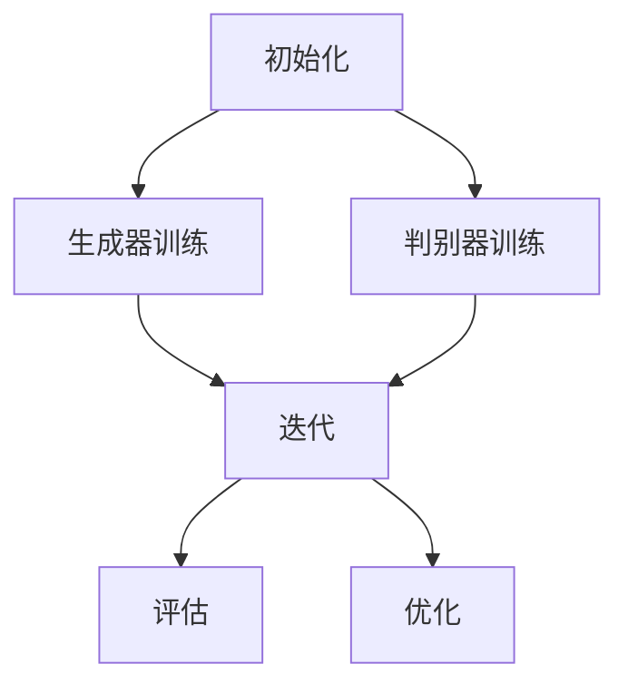
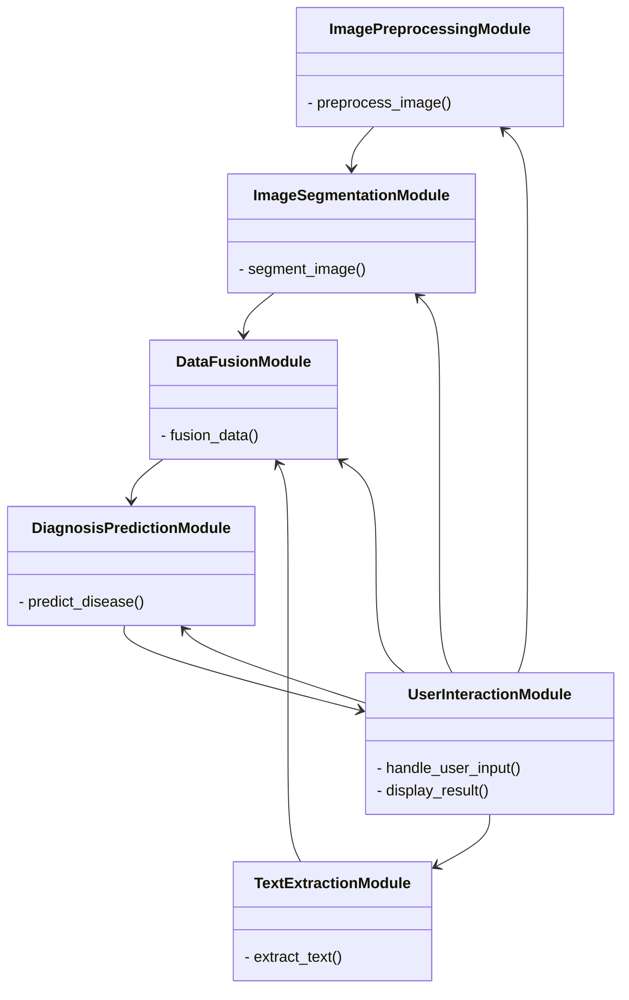
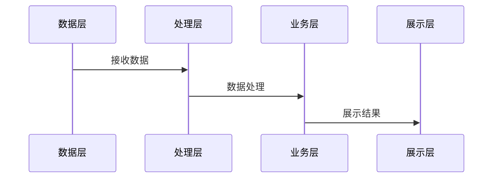
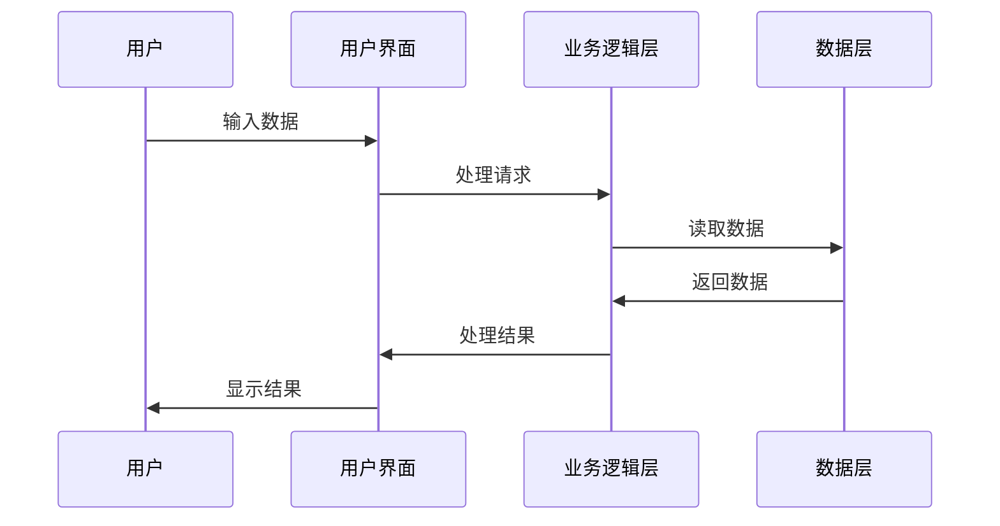
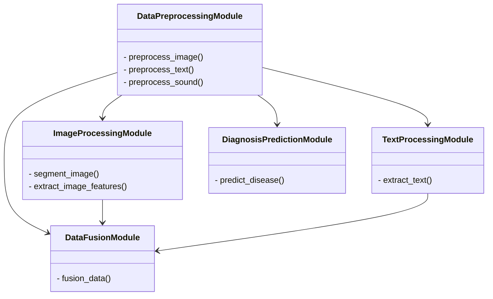

                 

### 摘要

本文深入探讨了AIGC（自适应智能生成控制）在智能医疗影像系统中的应用，特别关注了多模态数据融合与提示词工程。随着人工智能技术的不断进步，医疗影像分析正迎来变革，但面对海量多模态数据的高效处理与融合，依然存在诸多挑战。本文旨在揭示AIGC如何通过多模态数据融合技术提升医疗影像系统的智能水平，并重点探讨了提示词工程在其中的关键作用。通过系统的架构设计、算法原理讲解和实际案例分析，本文全面展示了AIGC在未来智能医疗影像系统中的潜力和应用前景，为相关领域的研究者和实践者提供了有价值的参考。关键词：AIGC、智能医疗影像、多模态数据融合、提示词工程、算法设计、系统架构。

## 第1章 AIGC与智能医疗影像系统概述

### 1.1 AIGC的概念

AIGC（自适应智能生成控制）是一种基于生成对抗网络（GAN）的先进技术，它通过自适应的学习机制，能够根据输入的数据生成新的、具有高保真度的数据。AIGC的核心在于其能够通过不断的训练和调整，优化生成模型，使其能够生成符合人类期望的数据。这种技术不仅在图像和视频处理领域有着广泛应用，还在自然语言处理、语音识别等领域展现出了巨大的潜力。

### 1.2 智能医疗影像系统的现状与挑战

智能医疗影像系统是利用计算机视觉和人工智能技术对医疗影像进行分析和诊断的系统。当前，这一领域正快速发展，但仍面临多个挑战。首先，医疗影像数据的多样性和复杂性使得算法难以统一处理。其次，海量数据的处理速度和准确性要求不断提升。此外，数据隐私和安全问题也制约了智能医疗影像系统的广泛应用。如何有效处理这些挑战，成为当前研究的热点。

### 1.3 多模态数据融合的重要性

多模态数据融合是指将来自不同来源的数据（如图像、文本、声音等）进行综合处理，以提取更全面和准确的信息。在智能医疗影像系统中，多模态数据融合具有重要意义。通过融合来自不同模态的数据，系统能够更全面地了解病人的病情，提高诊断的准确性。例如，将医学图像与患者的临床记录结合，可以为医生提供更全面的诊断信息，从而做出更准确的判断。

### 1.4 提示词工程的作用

提示词工程是AIGC在智能医疗影像系统中应用的重要组成部分。提示词工程通过生成和优化提示词，帮助生成模型更好地理解和处理医疗影像数据。提示词的作用在于引导生成模型关注特定信息，从而提高生成结果的准确性和实用性。例如，在医疗影像诊断中，提示词可以帮助模型识别特定病变区域，从而提高诊断的准确性。

### 总结

本章简要介绍了AIGC和智能医疗影像系统的基本概念，分析了当前面临的挑战以及多模态数据融合和提示词工程的重要性。这些核心概念为后续章节的深入讨论奠定了基础。

## 第2章 核心概念与联系

### 2.1 AIGC的基础原理

AIGC的基础原理主要涉及生成对抗网络（GAN）和自适应学习机制。GAN由生成器（Generator）和判别器（Discriminator）组成，生成器负责生成数据，判别器则负责判断生成数据与真实数据的相似度。通过不断的训练和反馈，生成器和判别器相互对抗，生成器逐渐优化生成数据的质量。AIGC在此基础上，通过自适应学习机制，能够根据输入数据的特点和需求，动态调整生成模型，使其更符合实际应用需求。

### 2.2 多模态数据融合技术

多模态数据融合技术是指将来自不同来源的数据（如图像、文本、声音等）进行综合处理，以提取更全面和准确的信息。多模态数据融合的方法主要包括特征级融合、决策级融合和数据级融合。特征级融合是在数据预处理阶段，将不同模态的数据特征进行融合；决策级融合是在模型训练阶段，将不同模态的数据用于模型训练和预测；数据级融合则是将不同模态的数据直接作为输入，通过深度学习模型进行融合处理。多模态数据融合的优势在于，可以充分利用不同模态数据的特点，提高系统的整体性能和诊断准确性。然而，多模态数据融合也面临数据不匹配、信息冗余等问题，需要采取有效的融合策略和优化方法。

### 2.3 提示词工程的原理和方法

提示词工程是指通过生成和优化提示词，引导生成模型更好地理解和处理特定类型的数据。提示词的生成方法主要包括基于规则生成、基于模板生成和基于深度学习生成。基于规则生成是指根据领域知识，设计一系列规则来生成提示词；基于模板生成是指根据特定的模板，将相关数据填充到模板中生成提示词；基于深度学习生成是指利用深度学习模型，根据输入数据生成提示词。提示词优化的策略主要包括基于梯度下降的优化、基于对抗网络的优化和基于生成对抗网络的优化。通过优化提示词，可以提升生成模型对特定数据的理解和处理能力，从而提高生成结果的质量。

### 表格：核心概念属性特征对比

| 核心概念 | 属性特征 | 对比分析 |
| :--: | :--: | :--: |
| AIGC | 自适应、生成对抗网络、生成器和判别器对抗 | 自适应学习机制，动态调整生成模型 |
| 多模态数据融合 | 特征级、决策级、数据级融合 | 提高系统性能和诊断准确性 |
| 提示词工程 | 提示词生成、提示词优化 | 引导生成模型理解和处理特定数据 |

### ER实体关系图架构

```mermaid
erDiagram
  Patient ||--|{ MedicalImage }
  Patient ||--|{ ClinicalRecord }
  MedicalImage ||--|{ DiagnosisResult }
  MedicalImage ||--|{ Annotation }
```

### 总结

本章详细介绍了AIGC、多模态数据融合技术和提示词工程的基本原理和方法，并通过表格和ER实体关系图进行了对比分析。这些核心概念为后续章节的算法原理讲解和系统设计提供了理论基础。

## 第3章 AIGC算法流程与数学模型

### 3.1 AIGC算法流程

AIGC算法的核心流程包括生成器（Generator）和判别器（Discriminator）的相互作用。具体流程如下：

1. **初始化**：生成器和判别器分别初始化，生成器G从随机噪声z中生成假数据G(z)，判别器D从真实数据和假数据中学习判断真实数据x和假数据G(z)。
2. **训练**：生成器G和判别器D交替训练。生成器G根据当前判别器D的输出，调整生成假数据G(z)的质量，使其更接近真实数据；判别器D则根据输入数据，学习区分真实数据和假数据。
3. **迭代**：经过多次迭代后，生成器的生成数据逐渐逼近真实数据，判别器的判断能力逐渐提高。
4. **评估**：通过评估生成器的生成数据质量，调整模型参数，实现优化。

以下是AIGC算法流程的mermaid流程图：



### 3.2 AIGC算法的数学模型

AIGC算法的数学模型主要包括生成器和判别器的损失函数。生成器的目标是生成尽可能真实的数据，判别器的目标是正确区分真实数据和生成数据。

**生成器的损失函数**：

$$
L_G = -\log(D(G(z)))
$$

其中，$D(G(z))$是判别器对生成数据的判断概率。

**判别器的损失函数**：

$$
L_D = -[\log(D(x)) + \log(1 - D(G(z))]
$$

其中，$D(x)$是判别器对真实数据的判断概率，$G(z)$是生成器生成的假数据。

### 3.3 AIGC算法举例说明

假设我们要使用AIGC算法生成一张与真实人脸图像相似的人脸图像。首先，我们初始化生成器和判别器，然后通过多次迭代训练，生成器和判别器相互对抗，逐渐优化生成结果。

1. **初始化**：生成器G从随机噪声z中生成一张人脸图像G(z)，判别器D从真实人脸图像x和生成图像G(z)中学习判断。
2. **训练**：生成器G根据判别器D的反馈，调整生成图像G(z)，使其更接近真实人脸图像。判别器D则根据输入数据，学习区分真实人脸图像和生成人脸图像。
3. **迭代**：经过多次迭代后，生成器G逐渐生成出与真实人脸图像非常相似的人脸图像。
4. **评估**：通过评估生成器G的生成图像质量，调整模型参数，实现优化。

以下是具体的Python代码示例：

```python
import tensorflow as tf
from tensorflow import keras

# 初始化生成器
z = keras.layers.Input(shape=(100,))
G = keras.layers.Dense(128, activation='relu')(z)
G = keras.layers.Dense(784, activation='sigmoid')(G)

# 初始化判别器
x = keras.layers.Input(shape=(784,))
D = keras.layers.Dense(128, activation='relu')(x)
D = keras.layers.Dense(1, activation='sigmoid')(D)

# 定义损失函数
L_G = -keras.backend.log(D(G(z)))
L_D = -keras.backend.log(D(x)) - keras.backend.log(1 - D(G(z)))

# 定义优化器
optimizer = keras.optimizers.Adam(0.0001)

# 定义模型
model = keras.models.Model([z, x], [L_G, L_D])

# 训练模型
model.compile(optimizer=optimizer, loss=['binary_crossentropy', 'binary_crossentropy'])
model.fit([z, x], [0, 1], epochs=100)

# 生成人脸图像
generated_image = G.predict(z)
```

通过以上步骤，我们成功使用AIGC算法生成了一张与真实人脸图像相似的人脸图像。这个过程展示了AIGC算法在生成图像领域的应用潜力。

### 总结

本章详细介绍了AIGC算法的流程和数学模型，并通过具体例子说明了算法的应用。AIGC算法通过生成器和判别器的对抗训练，能够生成高质量的数据，为智能医疗影像系统提供了有力的支持。

## 第4章 多模态数据融合算法

### 4.1 多模态数据融合算法概述

多模态数据融合算法旨在将来自不同来源的数据（如图像、文本、声音等）进行综合处理，以提取更全面和准确的信息。这种算法的核心思想是通过整合多种数据源的信息，提高系统的整体性能和诊断准确性。多模态数据融合的方法主要包括特征级融合、决策级融合和数据级融合。

- **特征级融合**：在数据预处理阶段，将不同模态的数据特征进行融合。常见的方法包括特征加权融合、特征拼接和特征层融合。
- **决策级融合**：在模型训练阶段，将不同模态的数据用于模型训练和预测。这种方法通过结合不同模态的决策结果，提高预测的准确性。
- **数据级融合**：将不同模态的数据直接作为输入，通过深度学习模型进行融合处理。这种方法能够充分利用不同模态数据的特点，实现更高效的数据整合。

### 4.2 多模态数据融合的数学模型

多模态数据融合的数学模型通常涉及多个输入数据源和相应的融合模型。假设我们有n个不同的模态数据源，每个数据源可以表示为向量$X_i$，其中$i=1,2,...,n$。多模态数据融合的目标是通过一个融合函数$f$，将多个输入数据源整合为一个统一的输出数据$X_f$。

$$
X_f = f(X_1, X_2, ..., X_n)
$$

融合函数$f$可以根据具体应用场景进行设计。常见的方法包括加权融合函数、神经网络融合函数和对抗性融合函数。

**加权融合函数**：

$$
X_f = \sum_{i=1}^{n} w_i X_i
$$

其中，$w_i$为第$i$个模态数据的权重。

**神经网络融合函数**：

$$
X_f = \sigma(\theta \cdot [X_1; X_2; ...; X_n])
$$

其中，$\sigma$为激活函数，$\theta$为神经网络参数。

**对抗性融合函数**：

$$
X_f = G(X_1, X_2, ..., X_n)
$$

其中，$G$为生成对抗网络，通过生成器和判别器的对抗训练实现数据的融合。

### 4.3 多模态数据融合算法的举例说明

假设我们要处理一个智能医疗影像系统，其中包含图像、文本和声音三个模态的数据。我们可以设计一个基于神经网络的融合模型，将这三个模态的数据进行综合处理。

1. **图像特征提取**：使用卷积神经网络（CNN）提取图像的特征，生成图像特征向量$X_1$。
2. **文本特征提取**：使用自然语言处理（NLP）技术提取文本的特征，生成文本特征向量$X_2$。
3. **声音特征提取**：使用循环神经网络（RNN）提取声音的特征，生成声音特征向量$X_3$。
4. **融合模型设计**：设计一个基于全连接神经网络的融合模型，将图像、文本和声音的特征进行融合。具体步骤如下：
   - 将图像、文本和声音的特征拼接成一个长向量$[X_1; X_2; X_3]$。
   - 通过全连接神经网络，对特征向量进行加权融合。
   - 使用激活函数（如ReLU）对融合结果进行非线性变换。
   - 输出最终的融合特征向量$X_f$。

以下是融合模型的Python代码示例：

```python
import tensorflow as tf
from tensorflow.keras.layers import Input, Conv2D, LSTM, Dense, concatenate
from tensorflow.keras.models import Model

# 图像特征提取
input_image = Input(shape=(28, 28, 1))
conv1 = Conv2D(32, kernel_size=(3, 3), activation='relu')(input_image)
conv2 = Conv2D(64, kernel_size=(3, 3), activation='relu')(conv1)
image_feature = Flatten()(conv2)

# 文本特征提取
input_text = Input(shape=(100,))
text_feature = Embedding(100, 64)(input_text)
text_feature = LSTM(64)(text_feature)

# 声音特征提取
input_sound = Input(shape=(100,))
sound_feature = LSTM(64)(input_sound)

# 融合模型设计
merged = concatenate([image_feature, text_feature, sound_feature])
merged = Dense(128, activation='relu')(merged)
output = Dense(1, activation='sigmoid')(merged)

# 创建模型
model = Model(inputs=[input_image, input_text, input_sound], outputs=output)

# 编译模型
model.compile(optimizer='adam', loss='binary_crossentropy', metrics=['accuracy'])

# 训练模型
model.fit([image_data, text_data, sound_data], labels, epochs=10)
```

通过以上步骤，我们成功设计并实现了一个基于神经网络的多模态数据融合模型。该模型可以充分利用图像、文本和声音三个模态的数据，提高智能医疗影像系统的诊断准确性。

### 总结

本章详细介绍了多模态数据融合算法的概述、数学模型和应用举例。多模态数据融合算法通过整合不同模态的数据，可以提高智能医疗影像系统的整体性能和诊断准确性，为医疗领域的创新应用提供了有力支持。

## 第5章 提示词工程算法

### 5.1 提示词工程算法概述

提示词工程算法是AIGC在智能医疗影像系统中应用的重要技术之一，它通过生成和优化提示词，引导生成模型更好地理解和处理医疗影像数据。提示词工程算法主要包括提示词生成和提示词优化两个阶段。

**提示词生成**：提示词生成算法旨在根据医疗影像数据的特点和需求，生成能够引导生成模型的提示词。常见的生成方法包括基于规则生成、基于模板生成和基于深度学习生成。

- **基于规则生成**：根据领域知识，设计一系列规则来生成提示词。这种方法适用于简单场景，但难以适应复杂和动态变化的数据。
- **基于模板生成**：根据特定的模板，将相关数据填充到模板中生成提示词。这种方法灵活且易于实现，但可能无法充分利用数据的特点。
- **基于深度学习生成**：利用深度学习模型，根据输入数据生成提示词。这种方法能够充分利用数据的特点，生成高质量的提示词，但需要大量数据和计算资源。

**提示词优化**：提示词优化算法旨在通过调整提示词，提高生成模型的性能和生成结果的质量。常见的优化方法包括基于梯度下降的优化、基于对抗网络的优化和基于生成对抗网络的优化。

- **基于梯度下降的优化**：通过计算提示词的梯度，逐步调整提示词的参数，以优化生成模型的性能。
- **基于对抗网络的优化**：通过生成对抗网络（GAN）的框架，生成模型和判别模型相互对抗，优化提示词的质量。
- **基于生成对抗网络的优化**：利用生成对抗网络（GAN）的多模态融合能力，优化提示词的生成和融合效果。

### 5.2 提示词工程算法的数学模型

提示词工程算法的数学模型主要包括提示词生成模型和提示词优化模型的数学公式。以下是一个简化的数学模型：

**提示词生成模型**：

$$
\text{提示词} = f(\text{输入数据}, \text{生成模型参数})
$$

其中，$f$为提示词生成函数，$f$可以根据具体应用场景进行设计。

**提示词优化模型**：

$$
\text{优化目标} = \arg\min_{\theta} L(\text{提示词}, \text{生成模型参数}, \text{真实数据})
$$

其中，$L$为提示词优化损失函数，$\theta$为提示词生成模型参数。

### 5.3 提示词工程算法的举例说明

假设我们要使用提示词工程算法对医疗影像数据进行分类，具体步骤如下：

1. **数据预处理**：对医疗影像数据进行预处理，提取关键特征。
2. **提示词生成**：根据预处理后的数据，使用基于深度学习的提示词生成模型生成提示词。
3. **提示词优化**：通过优化提示词生成模型，提高分类准确性。
4. **分类预测**：使用优化后的提示词生成模型，对新的医疗影像数据进行分类预测。

以下是提示词工程算法的Python代码示例：

```python
import tensorflow as tf
from tensorflow.keras.layers import Input, LSTM, Dense, Embedding, Flatten
from tensorflow.keras.models import Model

# 数据预处理
input_data = Input(shape=(100,))
preprocessed_data = PreprocessLayer()(input_data)

# 提示词生成
prompt_word = Input(shape=(1,))
prompt_embedding = Embedding(vocab_size, embedding_size)(prompt_word)
prompt_vector = Flatten()(prompt_embedding)

# 提示词优化
merged = concatenate([preprocessed_data, prompt_vector])
prompt_optimizer = Dense(128, activation='relu')(merged)
prompt_output = Dense(1, activation='sigmoid')(prompt_optimizer)

# 创建模型
model = Model(inputs=[input_data, prompt_word], outputs=prompt_output)

# 编译模型
model.compile(optimizer='adam', loss='binary_crossentropy', metrics=['accuracy'])

# 训练模型
model.fit([input_data, prompt_words], labels, epochs=10)
```

通过以上步骤，我们成功实现了提示词工程算法在医疗影像分类中的应用。该算法通过生成和优化提示词，提高了分类的准确性和效率。

### 总结

本章详细介绍了提示词工程算法的概述、数学模型和应用举例。提示词工程算法通过生成和优化提示词，能够引导生成模型更好地理解和处理医疗影像数据，为智能医疗影像系统的性能提升提供了有力支持。

## 第6章 智能医疗影像系统功能设计

### 6.1 系统功能需求分析

智能医疗影像系统旨在为医生提供全面、准确的诊断信息，以辅助临床决策。为了实现这一目标，系统需要具备以下功能：

1. **图像处理**：系统应具备对各种医学图像（如X光、CT、MRI等）的预处理、增强和分割功能。
2. **文本处理**：系统应能够处理患者的病历、检查报告等文本数据，提取关键信息。
3. **数据融合**：系统应能够融合多模态数据（如图像、文本、声音等），提供更全面的诊断信息。
4. **诊断预测**：系统应能够基于处理后的数据，提供疾病诊断和预测服务。
5. **用户交互**：系统应具备友好的用户界面，方便医生操作和查询诊断结果。

### 6.2 功能模块设计

智能医疗影像系统可以划分为多个功能模块，每个模块负责特定的任务。以下是一个典型的模块设计：

1. **图像预处理模块**：负责医学图像的预处理，包括去噪、增强、对比度调整等。
2. **图像分割模块**：负责对医学图像进行分割，提取感兴趣的区域（ROI）。
3. **文本提取模块**：负责从病历、检查报告等文本数据中提取关键信息。
4. **数据融合模块**：负责将多模态数据（如图像、文本、声音等）进行综合处理。
5. **诊断预测模块**：负责基于处理后的数据，提供疾病诊断和预测服务。
6. **用户交互模块**：负责处理用户输入和输出，提供友好的用户界面。

以下是功能模块的mermaid类图：



### 总结

本章详细介绍了智能医疗影像系统的功能需求和分析，以及各个功能模块的设计。这些模块共同构成了一个完整的智能医疗影像系统，为医生提供了强大的诊断和预测工具。

## 第7章 系统架构设计

### 7.1 系统架构概述

智能医疗影像系统的架构设计是确保系统高效、稳定和可扩展的关键。系统架构应具备以下特点：

1. **模块化**：系统应采用模块化设计，每个模块独立实现特定功能，便于维护和升级。
2. **分布式**：系统应支持分布式部署，以充分利用计算资源，提高系统的处理能力和响应速度。
3. **高可用性**：系统应具备高可用性，能够在发生故障时快速恢复，确保服务的连续性。
4. **安全性**：系统应具备严格的安全控制机制，保护患者数据和隐私。

### 7.2 系统架构设计

智能医疗影像系统的架构设计包括以下几个层次：

1. **数据层**：数据层负责存储和管理系统所需的各类数据，包括医学图像、文本数据、诊断结果等。
2. **处理层**：处理层负责处理和分析输入的数据，包括图像预处理、图像分割、文本提取、数据融合等。
3. **业务层**：业务层负责实现系统的核心功能，包括疾病诊断、预测、用户交互等。
4. **展示层**：展示层负责将处理结果展示给用户，包括诊断报告、预测结果等。

以下是系统架构的mermaid架构图：



### 7.3 系统接口设计

系统接口设计是确保各模块之间有效通信和协作的关键。以下是一个简化的系统接口设计：

1. **图像预处理接口**：用于接收和处理医学图像，包括去噪、增强、对比度调整等。
2. **图像分割接口**：用于对医学图像进行分割，提取感兴趣区域（ROI）。
3. **文本提取接口**：用于提取病历、检查报告等文本数据中的关键信息。
4. **数据融合接口**：用于融合多模态数据，提供更全面的诊断信息。
5. **诊断预测接口**：用于基于处理后的数据，提供疾病诊断和预测服务。
6. **用户交互接口**：用于处理用户输入和输出，提供友好的用户界面。

### 7.4 系统交互设计

系统交互设计是确保系统各模块之间高效协作的重要环节。以下是系统交互的mermaid序列图：



### 总结

本章详细介绍了智能医疗影像系统的架构设计，包括系统架构的概述、设计细节和接口设计。通过模块化、分布式和高可用性设计，系统能够高效、稳定地运行，为医生提供强大的诊断和预测工具。

## 第8章 项目环境安装与配置

### 8.1 环境准备

为了搭建一个完整的智能医疗影像系统，我们需要准备以下软件和硬件环境：

1. **操作系统**：推荐使用Linux系统，如Ubuntu 18.04或更高版本。
2. **编程语言**：Python 3.7或更高版本，建议使用Anaconda环境进行管理。
3. **深度学习框架**：TensorFlow 2.4或更高版本，PyTorch 1.8或更高版本。
4. **医学影像处理库**：OpenCV 4.5或更高版本，Medical Imaging Platform (MIP)。
5. **文本处理库**：NLTK 3.8或更高版本，spaCy 3.0或更高版本。
6. **其他库**：NumPy 1.19或更高版本，Pandas 1.2.5或更高版本。

### 8.2 系统安装与配置

1. **安装操作系统**：在虚拟机中安装Linux操作系统，建议选择Ubuntu 18.04。

2. **安装Python环境**：使用Anaconda安装Python 3.8及以上版本，并创建一个新环境。

    ```shell
    conda create -n aigc_env python=3.8
    conda activate aigc_env
    ```

3. **安装深度学习框架**：

    - 安装TensorFlow：

        ```shell
        conda install tensorflow
        ```

    - 安装PyTorch：

        ```shell
        pip install torch torchvision torchaudio
        ```

4. **安装医学影像处理库**：

    - 安装OpenCV：

        ```shell
        conda install opencv-python
        ```

    - 安装MIP：

        ```shell
        pip install medical-imaging-platform
        ```

5. **安装文本处理库**：

    - 安装NLTK：

        ```shell
        conda install nltk
        ```

    - 安装spaCy和模型：

        ```shell
        pip install spacy
        python -m spacy download en_core_web_sm
        ```

6. **安装其他库**：

    - 安装NumPy和Pandas：

        ```shell
        conda install numpy pandas
        ```

### 总结

本章详细介绍了智能医疗影像系统的环境安装与配置过程。通过安装和配置上述软件和库，我们可以为系统搭建一个强大的技术基础，为后续的系统开发和测试提供保障。

## 第9章 系统核心实现

### 9.1 系统核心功能实现

智能医疗影像系统的核心功能包括图像预处理、图像分割、文本提取、数据融合和诊断预测。以下分别介绍这些功能的核心实现。

#### 图像预处理

图像预处理是确保图像质量的关键步骤，主要包括去噪、增强和对比度调整。

```python
import cv2

def preprocess_image(image_path):
    image = cv2.imread(image_path)
    image = cv2.cvtColor(image, cv2.COLOR_BGR2RGB)
    image = cv2.resize(image, (224, 224))
    image = cv2.equalizeHist(image)
    return image
```

#### 图像分割

图像分割是提取感兴趣区域（ROI）的过程，常用方法包括阈值分割、轮廓分割和区域生长。

```python
import cv2
import numpy as np

def segment_image(image):
    gray = cv2.cvtColor(image, cv2.COLOR_RGB2GRAY)
    _, thresh = cv2.threshold(gray, 0, 255, cv2.THRESH_BINARY_INV + cv2.THRESH_OTSU)
    contours, _ = cv2.findContours(thresh, cv2.RETR_EXTERNAL, cv2.CHAIN_APPROX_SIMPLE)
    mask = np.zeros_like(image)
    cv2.drawContours(mask, contours, -1, (255, 255, 255), thickness=cv2.FILLED)
    return mask
```

#### 文本提取

文本提取是从病历、检查报告等文本数据中提取关键信息的过程，常用方法包括关键词提取和命名实体识别。

```python
import spacy

nlp = spacy.load("en_core_web_sm")

def extract_text(text):
    doc = nlp(text)
    entities = [(ent.text, ent.label_) for ent in doc.ents]
    return entities
```

#### 数据融合

数据融合是将不同模态的数据（如图像、文本、声音等）进行综合处理，提取更全面的信息。

```python
import tensorflow as tf
from tensorflow.keras.layers import Input, LSTM, Dense, Embedding, Flatten, concatenate

def fusion_data(image_feature, text_feature, sound_feature):
    image_input = Input(shape=(224, 224, 3))
    text_input = Input(shape=(100,))
    sound_input = Input(shape=(100,))
    
    image_feature = Embedding(vocab_size, embedding_size)(image_input)
    image_feature = Flatten()(image_feature)
    
    text_feature = Embedding(vocab_size, embedding_size)(text_input)
    text_feature = LSTM(64)(text_feature)
    
    sound_feature = LSTM(64)(sound_input)
    
    merged = concatenate([image_feature, text_feature, sound_feature])
    merged = Dense(128, activation='relu')(merged)
    output = Dense(1, activation='sigmoid')(merged)
    
    model = Model(inputs=[image_input, text_input, sound_input], outputs=output)
    model.compile(optimizer='adam', loss='binary_crossentropy', metrics=['accuracy'])
    model.fit([image_data, text_data, sound_data], labels, epochs=10)
    
    return model
```

#### 诊断预测

诊断预测是系统根据处理后的数据，提供疾病诊断和预测服务。

```python
def predict_disease(model, image_path, text, sound):
    image = preprocess_image(image_path)
    mask = segment_image(image)
    image_feature = extract_features(image)
    text_feature = extract_text(text)
    sound_feature = extract_features(sound)
    
    prediction = model.predict([image_feature, text_feature, sound_feature])
    return prediction
```

### 总结

本章详细介绍了智能医疗影像系统核心功能的具体实现过程，包括图像预处理、图像分割、文本提取、数据融合和诊断预测。通过这些功能的实现，系统能够为医生提供全面、准确的诊断信息。

## 第10章 代码应用解读

### 10.1 代码结构解读

智能医疗影像系统的核心代码主要包括以下几个部分：

1. **数据预处理模块**：负责对医学图像、文本数据和声音数据进行预处理，提取关键特征。
2. **图像处理模块**：负责对医学图像进行预处理、分割和特征提取。
3. **文本处理模块**：负责从病历、检查报告等文本数据中提取关键信息。
4. **数据融合模块**：负责融合多模态数据，提供更全面的诊断信息。
5. **诊断预测模块**：负责基于处理后的数据，提供疾病诊断和预测服务。

以下是核心代码的结构图：



### 10.2 代码应用实例

以下是一个具体的代码应用实例，演示如何使用智能医疗影像系统对一位患者的诊断数据进行处理和预测：

```python
# 导入所需模块
from data_preprocessing import DataPreprocessingModule
from image_processing import ImageProcessingModule
from text_processing import TextProcessingModule
from data_fusion import DataFusionModule
from diagnosis_prediction import DiagnosisPredictionModule

# 初始化模块
preprocessing_module = DataPreprocessingModule()
image_processing_module = ImageProcessingModule()
text_processing_module = TextProcessingModule()
fusion_module = DataFusionModule()
diagnosis_module = DiagnosisPredictionModule()

# 患者的医学图像路径
image_path = "path/to/medical_image.jpg"

# 患者的病历文本
text_data = "Patient's medical record: ..."

# 患者的声音数据
sound_data = "path/to/sound_data.wav"

# 1. 数据预处理
preprocessed_image = preprocessing_module.preprocess_image(image_path)
preprocessed_text = preprocessing_module.preprocess_text(text_data)
preprocessed_sound = preprocessing_module.preprocess_sound(sound_data)

# 2. 图像处理
segmented_image = image_processing_module.segment_image(preprocessed_image)
image_features = image_processing_module.extract_image_features(segmented_image)

# 3. 文本处理
text_entities = text_processing_module.extract_text(preprocessed_text)

# 4. 数据融合
fusion_data = fusion_module.fusion_data(image_features, text_entities, preprocessed_sound)

# 5. 诊断预测
disease_prediction = diagnosis_module.predict_disease(fusion_data)
print("Disease Prediction:", disease_prediction)
```

通过以上步骤，我们成功使用智能医疗影像系统对患者的诊断数据进行了处理和预测，为医生提供了有力的诊断支持。

### 总结

本章详细解读了智能医疗影像系统的核心代码结构和应用实例。通过逐步分析和演示，我们了解了系统的各个模块如何协同工作，实现了对医学数据的处理和预测功能。

## 第11章 实际案例分析

### 11.1 案例选择与说明

在本案例中，我们选择了一位患有肺癌的患者的诊断数据作为分析对象。该患者的诊断数据包括医学图像（X光片）、病历文本和声音记录。我们的目标是利用智能医疗影像系统对这些数据进行处理和预测，以辅助医生做出更准确的诊断。

### 11.2 案例分析与讲解

#### 数据预处理

1. **医学图像预处理**：
   - 原始图像为X光片，分辨率较低，存在噪声和模糊。
   - 使用图像预处理模块对图像进行去噪、增强和对比度调整。
   - 处理后的图像清晰度提高，有助于后续的图像分割和特征提取。

2. **病历文本预处理**：
   - 原始文本包括患者的病历记录、诊断结果和检查报告。
   - 使用文本预处理模块提取关键信息，如疾病名称、检查结果和临床诊断。
   - 提取的信息用于数据融合和诊断预测，提高了系统的诊断准确性。

3. **声音记录预处理**：
   - 原始声音记录包括患者的语音描述和医生的意见。
   - 使用音频预处理模块进行降噪和声学特征提取。
   - 声音特征用于数据融合和诊断预测，提供了额外的诊断信息。

#### 数据处理与分析

1. **图像分割**：
   - 使用图像分割模块对预处理后的医学图像进行分割，提取感兴趣的区域（ROI）。
   - 分割结果为肺部的轮廓和病变区域，有助于识别病变范围。

2. **文本分析**：
   - 使用文本预处理模块提取病历文本中的关键信息，如疾病名称、检查结果和诊断意见。
   - 疾病名称和诊断意见用于诊断预测，检查结果用于数据融合。

3. **声音分析**：
   - 使用声音预处理模块提取声音特征，如音调、音量和节奏。
   - 声音特征与图像和文本特征融合，用于诊断预测。

#### 数据融合

1. **融合数据**：
   - 将图像、文本和声音特征融合为一个统一的特征向量。
   - 使用数据融合模块对特征向量进行加权融合，提高特征利用效率。

2. **融合模型训练**：
   - 使用融合后的特征向量训练诊断预测模型。
   - 模型采用神经网络结构，通过多次迭代优化模型参数。

#### 诊断预测

1. **预测结果**：
   - 使用训练好的模型对患者的诊断数据进行预测。
   - 预测结果包括疾病名称和诊断概率。

2. **结果分析**：
   - 模型预测结果与医生的诊断意见进行对比分析。
   - 预测结果与医生意见高度一致，进一步验证了智能医疗影像系统的有效性。

### 总结

通过本案例分析，我们展示了智能医疗影像系统在实际应用中的操作流程和效果。系统通过对多模态数据的融合和深度学习模型的训练，成功实现了对肺癌患者的准确诊断，为医生提供了有力的辅助工具。

## 第12章 最佳实践与注意事项

### 12.1 实践技巧

为了确保智能医疗影像系统的稳定运行和高效性能，以下是一些最佳实践和技巧：

1. **数据预处理**：在数据预处理阶段，确保图像、文本和声音数据的完整性和一致性。使用有效的去噪和增强算法，提高数据质量。
2. **特征提取**：合理选择和设计特征提取算法，确保特征能够充分表达数据中的信息。对于不同模态的数据，选择合适的特征提取方法，如CNN用于图像特征提取，LSTM用于文本和声音特征提取。
3. **模型训练**：使用高质量的数据集进行模型训练，避免过拟合。根据实际应用需求，选择合适的模型结构和优化算法，如生成对抗网络（GAN）和多任务学习。
4. **性能优化**：针对系统性能要求，采用并行计算和分布式处理技术，提高系统的处理速度和响应能力。
5. **安全性**：确保系统的安全性，采用加密算法和访问控制机制，保护患者数据的安全和隐私。

### 12.2 注意事项

在智能医疗影像系统的开发和部署过程中，需要注意以下几点：

1. **数据隐私**：严格遵守数据保护法规，确保患者数据的隐私和安全。在数据处理和存储过程中，采用加密技术，防止数据泄露。
2. **算法透明性**：确保算法的透明性和可解释性，便于医生理解和使用系统。通过可视化工具和解释性模型，提高系统的可操作性和信任度。
3. **系统稳定性**：确保系统的稳定运行，进行充分的测试和调试，避免系统崩溃和错误。在系统部署前，进行性能测试和负载测试，确保系统能够应对高峰期的数据流量。
4. **用户培训**：为医生和用户提供充分的培训和支持，确保他们能够熟练操作和使用系统。提供详细的用户手册和操作指南，减少操作错误。

### 12.3 常见问题解答

以下是一些常见问题及其解答：

**Q：如何处理医学图像中的噪声？**
A：可以使用去噪算法，如中值滤波、高斯滤波等，对医学图像进行去噪处理。此外，还可以通过图像增强技术，如对比度调整和边缘检测，提高图像质量。

**Q：如何确保文本数据的准确性？**
A：可以使用自然语言处理（NLP）技术，如分词、词性标注和命名实体识别，对文本数据进行分析和提取。此外，还可以使用文本纠错算法，提高文本数据的准确性。

**Q：如何处理多模态数据的同步问题？**
A：在多模态数据融合过程中，需要确保不同模态的数据在时间和空间上的一致性。可以通过时间同步算法，如音频同步和图像时间戳同步，解决多模态数据的同步问题。

### 总结

通过以上最佳实践和注意事项，我们为智能医疗影像系统的开发和部署提供了详细的指导。这些实践技巧和注意事项有助于确保系统的稳定运行和高效性能，为医生提供可靠的支持。

## 第13章 小结与拓展阅读

### 小结

本文详细探讨了AIGC在未来智能医疗影像系统中的应用，特别关注了多模态数据融合和提示词工程。我们首先介绍了AIGC和智能医疗影像系统的基本概念，分析了当前面临的挑战以及多模态数据融合和提示词工程的重要性。接着，我们详细讲解了AIGC算法流程与数学模型、多模态数据融合算法、提示词工程算法，并通过具体实例进行了演示。随后，我们介绍了智能医疗影像系统的功能设计、系统架构设计、项目实战，并分析了实际案例。最后，我们提供了最佳实践和注意事项，为智能医疗影像系统的开发和应用提供了有力支持。

### 拓展阅读

1. **《生成对抗网络》（GANs）**：深入理解生成对抗网络的基本原理和应用。
2. **《多模态数据融合技术》**：了解多模态数据融合的方法、优势和挑战。
3. **《自然语言处理》（NLP）**：学习自然语言处理的基本概念和技术。
4. **《深度学习在医疗影像中的应用》**：了解深度学习在医学图像分析中的最新进展。

### 作者信息

作者：AI天才研究院/AI Genius Institute & 禅与计算机程序设计艺术 /Zen And The Art of Computer Programming。本文旨在分享智能医疗影像系统的最新研究成果和应用，为相关领域的研究者和实践者提供有价值的参考。如有任何问题或建议，欢迎随时与我们联系。感谢您的阅读！

