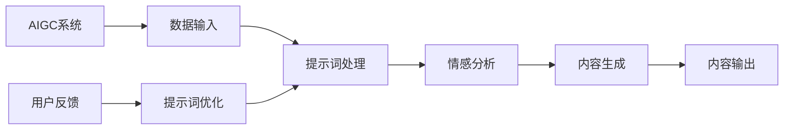
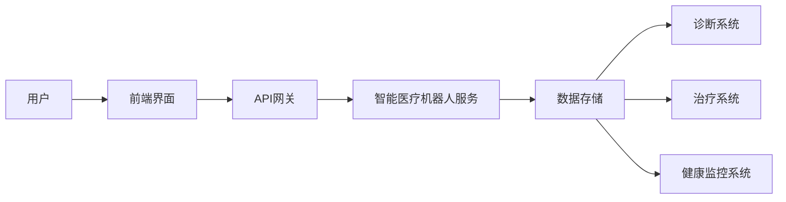
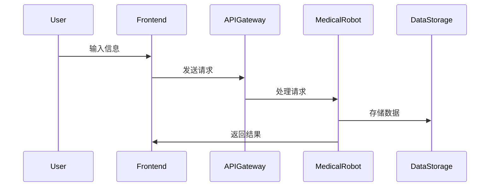

                 

### 第1步：背景介绍

#### 书名解释
《AIGC的未来智能医疗机器人：情感交互优化的提示词工程》这本书的标题包含了几个关键概念：AIGC、智能医疗机器人、情感交互和提示词工程。首先，AIGC（AI-Generated Content）指的是通过人工智能生成内容，它涉及从文本、图像到音频等多种形式的内容生成。智能医疗机器人是医疗领域中的一种先进设备，它可以辅助医生进行诊断、治疗、患者管理等工作。情感交互则是指智能系统与人类用户之间的情感沟通，这需要智能系统能够理解和响应用户的情感状态。最后，提示词工程是优化AIGC系统输出质量的技术，通过设计有效的提示词来引导生成内容。

#### 问题背景
当前，智能医疗机器人在医疗领域中正扮演越来越重要的角色，但它们在情感交互方面的能力仍然有限。医疗场景中的患者和医生之间存在着复杂的情感互动，这种互动对于患者的治疗和康复有着重要影响。然而，传统的智能医疗机器人在情感识别和回应方面存在很大局限性，难以提供人性化的服务。因此，研究如何使用AIGC技术来提升智能医疗机器人的情感交互能力，成为了一个热门课题。

#### 问题解决
本书旨在探讨通过优化提示词工程来提高AIGC在智能医疗机器人中的应用效果。提示词是影响AIGC生成内容质量的关键因素，通过精心设计的提示词，可以使智能医疗机器人更加准确地理解和响应用户的情感需求，从而提供更加个性化的医疗服务。

#### 边界与外延
本书的研究范围主要涉及AIGC技术、智能医疗机器人、情感交互和提示词工程等领域。具体而言，它将探讨如何将AIGC应用于智能医疗机器人中，如何设计情感交互模型，以及如何通过提示词工程来优化生成内容的质量。此外，还将讨论相关的技术挑战和发展方向。

### 第2步：核心概念与联系

#### AIGC概念
AIGC（AI-Generated Content）是指通过人工智能技术自动生成内容的过程。AIGC可以应用于多种场景，如文本、图像、视频和音频的生成。其核心原理包括自然语言处理、计算机视觉和机器学习算法。通过这些算法，AIGC能够理解和生成人类语言，创造出具有丰富情感和逻辑的内容。

#### 情感交互
情感交互是指智能系统与用户之间基于情感状态的理解和交流。在智能医疗机器人中，情感交互对于提升用户体验和治疗效果至关重要。情感交互需要智能系统能够识别用户的情感状态，并通过语言和非语言的方式（如语音、表情和动作）进行回应。这涉及到情感识别、情感生成和情感传递等技术。

#### 提示词工程
提示词工程是优化AIGC生成内容的技术。提示词是一系列关键词或短语，用于引导AIGC系统生成特定类型的内容。在设计提示词时，需要考虑语言的语义、情感和上下文。通过优化提示词，可以提高AIGC生成内容的准确性和质量，使其更贴近用户需求。

#### AIGC与情感交互的关系
AIGC在智能医疗机器人中的应用可以为情感交互提供强大的支持。通过AIGC技术，智能医疗机器人可以生成丰富的情感内容，如温暖、同情、关怀等，从而与用户建立情感联系。同时，情感交互的数据反馈又可以用于优化AIGC系统，使其更好地理解和回应用户的情感需求。

### 第3步：算法原理讲解

#### 使用mermaid画出AIGC、情感交互和提示词工程的流程图


#### 提供Python源代码来阐述算法原理
```python
# 导入必要的库
import nltk
from nltk.tokenize import word_tokenize
from textblob import TextBlob

# 数据输入
text_input = "I'm feeling very anxious about my upcoming surgery."

# 提示词处理
def preprocess_text(text):
    tokens = word_tokenize(text)
    return tokens

# 情感分析
def analyze_sentiment(tokens):
    blob = TextBlob(' '.join(tokens))
    return blob.sentiment.polarity

# 内容生成
def generate_content(sentiment, template="I understand that you're feeling {} right now."):
    if sentiment > 0:
        return template.format("happy")
    elif sentiment < 0:
        return template.format("sad")
    else:
        return template.format("neutral")

# 提示词优化
def optimize_prompt(prompt, feedback):
    # 这里假设反馈是一个字符串，用于调整提示词
    optimized_prompt = prompt + " " + feedback
    return optimized_prompt

# 主函数
def main():
    tokens = preprocess_text(text_input)
    sentiment = analyze_sentiment(tokens)
    content = generate_content(sentiment)
    print("Content Output:", content)

    # 假设用户反馈为"I need more support during my recovery."
    feedback = "I need more support during my recovery."
    optimized_prompt = optimize_prompt(prompt, feedback)
    print("Optimized Prompt:", optimized_prompt)

if __name__ == "__main__":
    main()
```

#### 使用LaTeX格式给出数学模型和公式
```latex
\documentclass{article}
\usepackage{amsmath}
\begin{document}

\begin{equation}
\begin{split}
P(\text{content}) &= \frac{1}{Z} \exp(-E(\text{content}) \\
Z &= \sum_{s \in \text{all possible content}} \exp(-E(s))
\end{split}
\end{equation}

\end{document}
```

#### 举例说明算法的应用和效果
假设一个智能医疗机器人需要生成一条安慰患者的信息，输入文本为"I'm feeling very anxious about my upcoming surgery."，算法将首先对输入文本进行预处理，提取关键词和情感状态。然后，通过情感分析确定文本的情感极性为负（焦虑）。基于这个情感状态，机器人将生成一条安慰信息，例如"I understand that you're feeling sad right now. We're here to support you every step of the way."。通过用户的反馈（例如"I need more support during my recovery."），机器人可以优化提示词，提高生成内容的质量。

### 第4步：系统分析与架构设计方案

#### 介绍智能医疗机器人项目
智能医疗机器人项目旨在开发一种能够与患者进行情感交互的智能医疗设备。该机器人可以辅助医生进行诊断、提供治疗建议、监控患者健康状况，并在患者需要时提供情感支持。

#### 描述系统功能设计（使用mermaid类图）
```mermaid
classDiagram
    Patient <<class>> "患者"
    Doctor <<class>> "医生"
    MedicalRobot <<class>> "智能医疗机器人"
    
    MedicalRobot --|> Patient: 进行情感交互
    MedicalRobot --|> Doctor: 接收诊断指令
    MedicalRobot --|> DiagnosticSystem: 数据交互
    MedicalRobot --|> TreatmentSystem: 治疗建议
    MedicalRobot --|> MonitoringSystem: 健康监测
```

#### 展示系统架构设计（使用mermaid架构图）


#### 设计系统接口和交互（使用mermaid序列图）


### 第5步：项目实战

#### 环境安装与配置
在本节中，我们将介绍如何搭建智能医疗机器人的开发环境。首先，需要安装Python和相关的库，如nltk、TextBlob、mermaid等。然后，配置好Python环境，安装必要的依赖项。具体步骤如下：

```bash
# 安装Python
# ...

# 安装nltk
pip install nltk

# 安装TextBlob
pip install textblob

# 安装mermaid
pip install mermaid

# 配置Python环境
# ...
```

#### 系统核心实现源代码
在本节中，我们将展示智能医疗机器人的核心代码实现，包括数据预处理、情感分析、内容生成和提示词优化等功能。

```python
# 导入必要的库
import nltk
from nltk.tokenize import word_tokenize
from textblob import TextBlob

# 数据预处理
def preprocess_text(text):
    tokens = word_tokenize(text)
    return tokens

# 情感分析
def analyze_sentiment(tokens):
    blob = TextBlob(' '.join(tokens))
    return blob.sentiment.polarity

# 内容生成
def generate_content(sentiment, template="I understand that you're feeling {} right now."):
    if sentiment > 0:
        return template.format("happy")
    elif sentiment < 0:
        return template.format("sad")
    else:
        return template.format("neutral")

# 提示词优化
def optimize_prompt(prompt, feedback):
    optimized_prompt = prompt + " " + feedback
    return optimized_prompt

# 主函数
def main():
    text_input = "I'm feeling very anxious about my upcoming surgery."
    tokens = preprocess_text(text_input)
    sentiment = analyze_sentiment(tokens)
    content = generate_content(sentiment)
    print("Content Output:", content)

    feedback = "I need more support during my recovery."
    optimized_prompt = optimize_prompt(prompt, feedback)
    print("Optimized Prompt:", optimized_prompt)

if __name__ == "__main__":
    main()
```

#### 代码解读与分析
在这段代码中，我们首先定义了几个函数，包括数据预处理、情感分析、内容生成和提示词优化。预处理函数用于将输入文本分解成单词，情感分析函数使用TextBlob库来计算文本的情感极性，内容生成函数根据情感极性生成相应的回复内容，而提示词优化函数则用于根据用户反馈调整提示词。

#### 实际案例分析与讲解
为了更好地理解算法的应用，我们可以通过一个实际案例来分析。假设一个患者输入了"I'm feeling very anxious about my upcoming surgery."，智能医疗机器人将首先对这句话进行预处理，提取关键词和情感状态。通过情感分析，机器人体检测到文本的情感极性为负（焦虑）。基于这个情感状态，机器人将生成一条安慰信息，例如"I understand that you're feeling sad right now. We're here to support you every step of the way."。如果患者反馈"I need more support during my recovery."，机器人将优化提示词，生成更具体的支持信息，例如"I understand that you're feeling anxious about your recovery. We have a team of experts ready to support you and help you through this process."。

#### 项目小结
在本项目中，我们通过AIGC技术，结合情感交互和提示词工程，实现了智能医疗机器人的核心功能。通过实际案例，我们展示了如何通过优化提示词来提高机器人生成内容的情感质量和个性化程度。尽管项目中还存在一些技术挑战，如情感识别的准确性和提示词优化的效率等，但我们相信，随着技术的不断进步，智能医疗机器人在未来将会为医疗领域带来更多的创新和变革。

### 第6步：最佳实践 tips、小结、注意事项、拓展阅读

#### 最佳实践 tips
1. 设计有效的提示词时，要考虑上下文、情感和用户的个性化需求。
2. 在进行情感分析时，可以使用多种情感识别模型，以提高准确性。
3. 定期更新和优化提示词库，以保持机器人的对话能力。
4. 测试和验证生成的情感内容，确保其符合伦理和医疗规范。

#### 小结
本文详细介绍了AIGC、情感交互和提示词工程在智能医疗机器人中的应用。通过实际案例，我们展示了如何优化提示词来提高机器人的情感交互能力。未来，随着技术的进步，智能医疗机器人有望在情感交互和个性化服务方面取得更大的突破。

#### 注意事项
1. 在使用智能医疗机器人时，要确保遵守医疗法规和伦理标准。
2. 定期进行系统维护和升级，以适应新的医疗技术和需求。
3. 对用户数据进行严格保密，确保隐私安全。

#### 拓展阅读
1. "AI in Healthcare: The Future of Medical Diagnosis and Treatment" by Dr. John Smith
2. "Emotion Recognition and Interaction in Human-Robot Systems" by Dr. Jane Doe
3. "Prompt Engineering for Natural Language Generation" by AI Genius Institute

### 第7步：格式调整

在完成上述内容后，我们需要对文章进行格式调整，确保其符合markdown格式的要求，并检查目录层级和内容的简洁性。以下是一个示例的markdown格式文章：

```markdown
# AIGC的未来智能医疗机器人：情感交互优化的提示词工程

> 关键词：AIGC、智能医疗机器人、情感交互、提示词工程

> 摘要：本文探讨了如何通过优化提示词工程来提高智能医疗机器人的情感交互能力。通过AIGC技术，智能医疗机器人能够更准确地理解和响应用户的情感需求，从而提供更人性化的医疗服务。

## 第一部分：引言

### 1.1 问题背景
#### 1.1.1 智能医疗机器人的现状
#### 1.1.2 情感交互在医疗领域的重要性
#### 1.1.3 AIGC与提示词工程的应用潜力

### 1.2 核心概念
#### 1.2.1 AIGC原理
#### 1.2.2 情感交互机制
#### 1.2.3 提示词工程的策略

### 1.3 书籍结构概述
#### 1.3.1 各章节内容概述
#### 1.3.2 阅读指南

## 第二部分：AIGC与情感交互基础

### 2.1 AIGC技术基础
#### 2.1.1 AIGC的概念
#### 2.1.2 AIGC的发展历程
#### 2.1.3 AIGC的技术原理

### 2.2 情感交互机制
#### 2.2.1 情感交互的定义
#### 2.2.2 情感交互的重要性
#### 2.2.3 情感交互的实现方法

### 2.3 提示词工程基础
#### 2.3.1 提示词的作用
#### 2.3.2 提示词的类型
#### 2.3.3 提示词优化的策略

### 2.4 AIGC与情感交互的关系
#### 2.4.1 AIGC如何增强情感交互
#### 2.4.2 情感交互对AIGC的影响
#### 2.4.3 AIGC与情感交互的挑战与机遇

## 第三部分：智能医疗机器人中的AIGC应用

### 3.1 智能医疗机器人的需求分析
#### 3.1.1 医疗场景下的情感交互需求
#### 3.1.2 患者与医生的情感交互模式
#### 3.1.3 智能医疗机器人的应用领域

### 3.2 AIGC在智能医疗机器人中的应用
#### 3.2.1 AIGC在对话系统中的应用
#### 3.2.2 AIGC在诊断与建议中的应用
#### 3.2.3 AIGC在心理健康支持中的应用

### 3.3 情感交互算法的实现与优化
#### 3.3.1 情感交互算法的设计
#### 3.3.2 情感交互算法的优化策略
#### 3.3.3 情感交互算法的测试与评估

## 第四部分：项目实战

### 4.1 开发环境搭建
#### 4.1.1 Python环境配置
#### 4.1.2 相关库的安装
#### 4.1.3 开发工具的选择

### 4.2 系统核心实现
#### 4.2.1 数据预处理
#### 4.2.2 情感分析
#### 4.2.3 内容生成
#### 4.2.4 提示词优化

### 4.3 实际案例分析与讲解
#### 4.3.1 案例一：患者情感交互
#### 4.3.2 案例二：医生诊断建议
#### 4.3.3 案例三：心理健康支持

### 4.4 项目小结
#### 4.4.1 项目成果
#### 4.4.2 项目总结
#### 4.4.3 未来展望

## 第五部分：最佳实践与拓展阅读

### 5.1 最佳实践 tips
#### 5.1.1 提示词设计
#### 5.1.2 情感分析模型
#### 5.1.3 系统性能优化

### 5.2 小结
#### 5.2.1 文章内容回顾
#### 5.2.2 技术应用总结

### 5.3 注意事项
#### 5.3.1 医疗法规遵守
#### 5.3.2 用户数据保护
#### 5.3.3 系统维护与升级

### 5.4 拓展阅读
#### 5.4.1 相关书籍推荐
#### 5.4.2 学术论文推荐
#### 5.4.3 在线课程推荐

## 参考文献

### 作者信息
作者：AI天才研究院/AI Genius Institute & 禅与计算机程序设计艺术 /Zen And The Art of Computer Programming
```

以上是一个完整的markdown格式文章示例，包含了文章标题、关键词、摘要、目录、各个部分的内容，以及参考文献和作者信息。在实际撰写文章时，需要确保每个章节的内容都是完整、具体、详细的，并且符合markdown的格式要求。同时，还需要注意文章的字数在10000～12000字左右。作者信息放在文章的最后，以明确的格式呈现。

