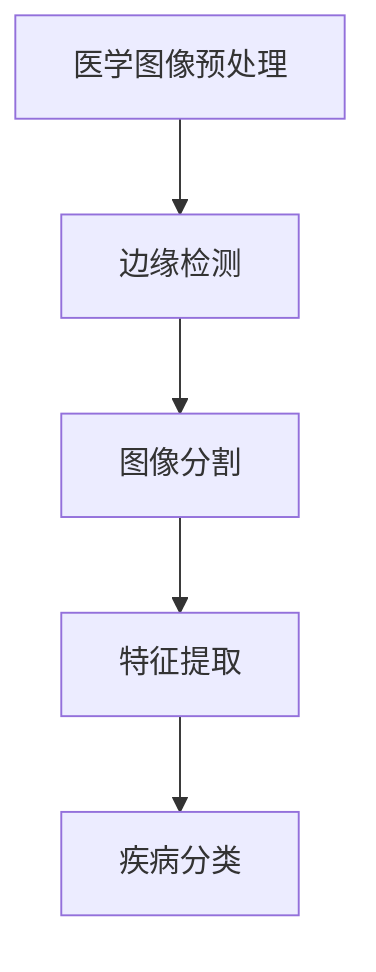
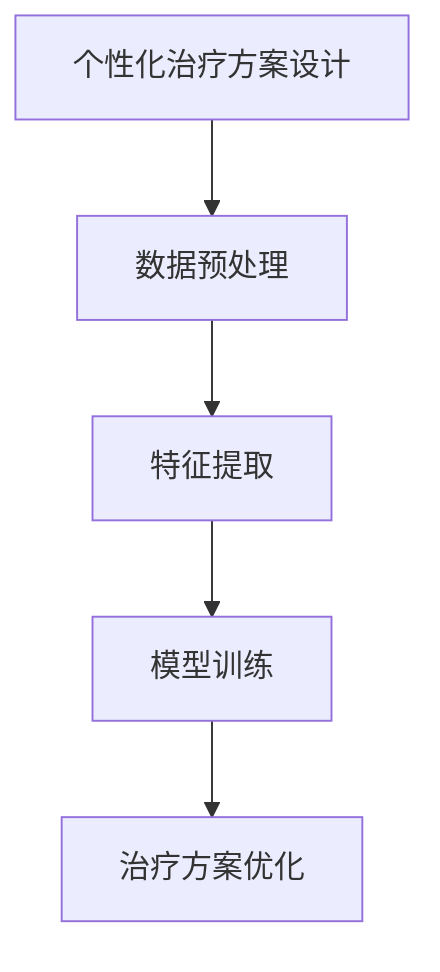
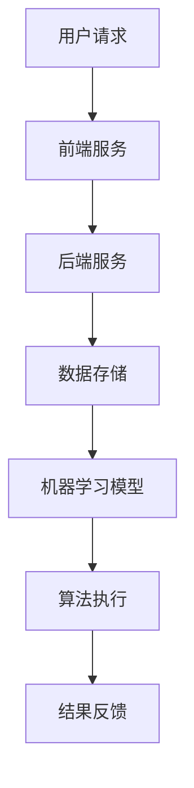

                 

# AIGC的未来智能医疗：个性化治疗方案的提示词工程

## 关键词

- AIGC
- 智能医疗
- 个性化治疗方案
- 提示词工程
- 医疗诊断
- 医疗治疗
- 医疗资源管理

## 摘要

本文深入探讨了人工智能生成内容（AIGC）在智能医疗领域的应用前景，尤其是个性化治疗方案的提示词工程。通过对AIGC与智能医疗的背景介绍、应用分析，以及实际案例的解析，本文详细阐述了AIGC技术在医疗诊断、治疗以及医疗资源管理中的具体应用。本文旨在为读者提供一个清晰、系统的视角，理解AIGC技术如何改变医疗行业的未来，以及如何通过提示词工程实现个性化治疗方案。

### 第一部分：AIGC与智能医疗的背景

## 第1章：AIGC与智能医疗概述

### 1.1 问题背景

#### 1.1.1 医疗领域面临的挑战

当前，医疗领域正面临着诸多挑战。首先，医疗资源的分配不均是一个显著问题。即便在发达国家，优质医疗资源也往往集中在城市和大医院，导致农村和偏远地区医疗资源匮乏。其次，随着人口老龄化和慢性病发病率的增加，医疗需求不断增加，而医疗人员数量却相对有限。此外，疾病诊断的复杂性和治疗方案的个性化需求也在增加，使得传统医疗模式难以满足现代医疗需求。

#### 1.1.2 AIGC技术的兴起与医疗应用

人工智能生成内容（AIGC）技术是一种基于人工智能的自动化内容生成技术，它通过深度学习模型，能够自动生成文本、图像、音频等多种类型的内容。随着AIGC技术的迅速发展，其在医疗领域的应用也日益广泛。AIGC技术在医疗诊断、治疗以及医疗资源管理等方面具有巨大的潜力，能够为医疗行业带来革命性的变化。

### 1.2 核心概念

#### 1.2.1 AIGC技术概述

AIGC（Artificial Intelligence Generated Content）是一种利用人工智能技术自动生成内容的方法。它基于深度学习模型，可以理解并生成符合人类语言习惯的文本、图像、音频等多种类型的内容。AIGC技术的核心在于其强大的自主学习能力和数据处理能力，这使得它能够自动从大量的数据中提取信息，生成高质量的内容。

##### 1.2.1.1 定义

AIGC是指通过人工智能技术生成各种类型的内容，如文本、图像、音频等。它涉及到的技术主要包括自然语言处理（NLP）、计算机视觉（CV）和生成对抗网络（GAN）等。

##### 1.2.1.2 技术特点

AIGC技术具有以下几个显著特点：

1. **高度自动化**：AIGC技术能够自动从大量数据中提取信息，生成内容，减少了人力成本。
2. **内容多样性**：AIGC技术能够生成多种类型的内容，如文本、图像、音频等，满足不同领域的需求。
3. **个性化**：AIGC技术能够根据用户的需求，生成个性化的内容。
4. **实时性**：AIGC技术能够实时生成内容，满足实时需求。

#### 1.2.2 智能医疗概述

智能医疗是指利用人工智能技术，提升医疗服务的效率和质量。它包括医疗诊断、治疗、医疗资源管理等多个方面。

##### 1.2.2.1 定义

智能医疗是指利用人工智能技术，提升医疗服务的效率和质量。它通过计算机视觉、自然语言处理、机器学习等技术，辅助医生进行诊断、治疗，优化医疗流程。

##### 1.2.2.2 应用场景

智能医疗的应用场景主要包括：

1. **疾病诊断**：通过图像分析、基因组数据分析等技术，辅助医生进行疾病诊断。
2. **个性化治疗**：根据患者的具体病情，制定个性化的治疗方案。
3. **医疗资源管理**：通过数据分析，优化医疗资源的分配和使用。

### 1.3 AIGC与智能医疗的联系

#### 1.3.1 技术融合

AIGC技术与智能医疗的融合，为医疗行业带来了革命性的变化。AIGC技术能够自动生成医疗文本、图像、音频等多种类型的内容，为医生提供更准确的诊断和治疗方案。同时，AIGC技术还能够根据患者的具体病情，生成个性化的医疗建议，提高医疗服务的质量和效率。

##### 1.3.1.1 AIGC技术在智能医疗中的角色

AIGC技术在智能医疗中扮演着关键角色：

1. **诊断辅助**：通过自动生成的医疗文本和图像，辅助医生进行疾病诊断。
2. **治疗方案生成**：根据患者的具体病情，自动生成个性化的治疗方案。
3. **医疗流程优化**：通过自动生成的医疗流程文本和图像，优化医疗流程。

##### 1.3.1.2 智能医疗对AIGC技术的需求

智能医疗对AIGC技术的需求主要包括：

1. **数据驱动的诊断**：通过大量医疗数据，自动生成诊断结果和建议。
2. **个性化治疗**：根据患者的具体病情，生成个性化的治疗方案。
3. **医疗流程优化**：通过自动生成的医疗流程文本和图像，优化医疗流程。

### 1.4 边界与外延

#### 1.4.1 AIGC在医疗领域应用的范围

AIGC技术在医疗领域的应用范围非常广泛，包括疾病诊断、个性化治疗、医疗资源管理等多个方面。

##### 1.4.1.1 医疗诊断

AIGC技术在医疗诊断中的应用主要包括：

1. **医学图像分析**：通过计算机视觉技术，自动分析医学图像，辅助医生进行疾病诊断。
2. **基因组数据分析**：通过自然语言处理技术，自动分析基因组数据，辅助医生进行疾病诊断。

##### 1.4.1.2 医疗治疗

AIGC技术在医疗服务中的应用主要包括：

1. **个性化治疗方案生成**：根据患者的具体病情，自动生成个性化的治疗方案。
2. **药物设计**：通过自然语言处理技术，自动生成药物设计报告，辅助医生进行药物选择。

##### 1.4.1.3 医疗管理

AIGC技术在医疗管理中的应用主要包括：

1. **医疗资源优化配置**：通过数据分析，自动优化医疗资源的分配和使用。
2. **医疗流程优化**：通过自动生成的医疗流程文本和图像，优化医疗流程。

### 1.5 本章小结

本章介绍了AIGC与智能医疗的背景、核心概念以及二者之间的联系。通过分析医疗领域面临的挑战，以及AIGC技术的特点和应用场景，本章为后续章节的深入探讨奠定了基础。接下来，我们将进一步探讨AIGC技术在医疗诊断、治疗以及医疗资源管理中的应用。

## 第二部分：AIGC在医疗中的应用

## 第2章：AIGC在医疗诊断中的应用

### 2.1 医学图像分析

#### 2.1.1 图像处理算法

##### 2.1.1.1 算法原理

医学图像分析是AIGC技术在医疗诊断中的一个重要应用。医学图像处理算法是通过对医学图像进行预处理、特征提取和分类等步骤，实现疾病诊断。常见的医学图像处理算法包括：

1. **边缘检测算法**：通过检测图像中的边缘信息，识别出图像中的关键特征。
2. **图像分割算法**：通过将图像划分为不同的区域，提取出感兴趣的图像部分。
3. **特征提取算法**：通过对图像进行特征提取，如纹理特征、形状特征等，用于疾病诊断。

##### 2.1.1.2 算法实现

医学图像处理算法的实现通常包括以下步骤：

1. **图像预处理**：对医学图像进行去噪、对比度增强等预处理操作，提高图像质量。
2. **边缘检测**：使用Canny算法或其他边缘检测算法，检测图像中的边缘信息。
3. **图像分割**：使用种子生长算法或阈值分割算法，将图像划分为不同的区域。
4. **特征提取**：使用SIFT、HOG等特征提取算法，提取图像的特征向量。
5. **分类**：使用支持向量机（SVM）或神经网络（NN）等分类算法，对特征向量进行分类，实现疾病诊断。

#### 2.1.2 人工智能辅助诊断

##### 2.1.2.1 诊断模型介绍

人工智能辅助诊断是AIGC技术在医疗诊断中的另一个重要应用。常见的诊断模型包括：

1. **卷积神经网络（CNN）**：通过多层卷积和池化操作，实现对图像的高效特征提取和分类。
2. **递归神经网络（RNN）**：通过序列模型，实现对序列数据的处理，如时间序列预测。
3. **生成对抗网络（GAN）**：通过生成器和判别器的对抗训练，实现图像的生成和分类。

##### 2.1.2.2 实际案例

人工智能辅助诊断在实际应用中已经取得了显著成果。以下是一个实际案例：

- **肺癌诊断**：使用CNN模型对肺部CT图像进行训练，实现肺癌的诊断。通过大量的肺癌和非肺癌图像数据，训练CNN模型，使其能够识别出肺癌的图像特征，实现肺癌的准确诊断。

#### 2.2 基因组数据分析

##### 2.2.1 数据处理与分析

基因组数据分析是AIGC技术在医疗诊断中的另一个重要应用。基因组数据分析通常包括以下步骤：

1. **数据预处理**：对基因组数据进行过滤、清洗和归一化等预处理操作，提高数据质量。
2. **特征提取**：从基因组数据中提取特征，如单核苷酸多态性（SNP）和基因表达水平等。
3. **数据分析**：使用机器学习算法，对基因组数据进行分类、聚类和关联分析等。

##### 2.2.1.1 数据预处理

数据预处理是基因组数据分析的重要步骤。常见的数据预处理方法包括：

1. **过滤**：去除低质量的读段或序列，如短读段、低质量读段等。
2. **清洗**：去除重复序列或错误序列，提高数据质量。
3. **归一化**：对基因组数据进行归一化处理，使其具有可比性。

##### 2.2.1.2 数据分析

数据分析是基因组数据分析的核心。常见的分析方法包括：

1. **分类**：使用分类算法，如支持向量机（SVM）或随机森林（RF），对基因组数据分类，实现疾病诊断。
2. **聚类**：使用聚类算法，如K-means或层次聚类，对基因组数据进行聚类，发现疾病相关基因。
3. **关联分析**：使用关联分析算法，如T检验或Fisher精确检验，分析基因组数据之间的关联性，发现疾病风险因素。

##### 2.2.2 个性化诊断

##### 2.2.2.1 诊断模型介绍

个性化诊断是基因组数据分析的一个重要应用。个性化诊断模型通常包括以下类型：

1. **基于模型的诊断**：使用机器学习算法，如SVM或神经网络，建立个性化诊断模型，根据患者的基因组数据，预测其患病风险。
2. **基于规则的诊断**：使用专家系统或决策树，建立个性化诊断规则，根据患者的基因组数据，进行疾病诊断。

##### 2.2.2.2 实际案例

以下是一个实际案例：

- **乳腺癌诊断**：使用基于机器学习的诊断模型，对患者的基因组数据进行分类，预测其是否患有乳腺癌。通过对大量乳腺癌和非乳腺癌患者的基因组数据进行分析，建立乳腺癌诊断模型，实现个性化诊断。

#### 2.3 病情预测

##### 2.3.1 预测模型介绍

病情预测是AIGC技术在医疗诊断中的另一个重要应用。常见的病情预测模型包括：

1. **时间序列预测模型**：如ARIMA模型、LSTM模型等，用于预测疾病的进展趋势。
2. **多变量预测模型**：如线性回归、逻辑回归等，用于预测疾病的发生风险。

##### 2.3.1.1 时间序列预测

时间序列预测是病情预测的一个重要类型。常见的时间序列预测模型包括：

1. **ARIMA模型**：自回归积分滑动平均模型，用于预测时间序列数据的趋势和季节性。
2. **LSTM模型**：长短期记忆模型，用于处理时间序列数据中的长期依赖关系。

##### 2.3.1.2 多变量预测

多变量预测是病情预测的另一个重要类型。常见多变量预测模型包括：

1. **线性回归**：用于预测线性关系。
2. **逻辑回归**：用于预测概率关系。

##### 2.3.2 预测模型应用

##### 2.3.2.1 预测算法实现

预测算法的实现通常包括以下步骤：

1. **数据预处理**：对预测数据集进行清洗、归一化等预处理操作，提高数据质量。
2. **模型选择**：选择合适的预测模型，如ARIMA模型、LSTM模型等。
3. **模型训练**：使用训练数据集，对预测模型进行训练。
4. **模型评估**：使用测试数据集，评估预测模型的性能。

##### 2.3.2.2 实际案例

以下是一个实际案例：

- **高血压病情预测**：使用LSTM模型，对高血压患者的血压数据进行分析，预测其未来的血压水平。通过对大量高血压患者的血压数据进行训练，建立LSTM预测模型，实现高血压病情预测。

### 2.4 本章小结

本章介绍了AIGC技术在医疗诊断中的应用，包括医学图像分析、基因组数据分析和病情预测。通过对医学图像处理算法和人工智能辅助诊断的详细讲解，以及基因组数据分析、个性化诊断和病情预测的实际案例解析，本章展示了AIGC技术在医疗诊断中的广泛应用和潜力。接下来，我们将继续探讨AIGC技术在医疗治疗中的应用。

## 第三部分：AIGC在医疗治疗中的应用

### 3.1 个性化治疗方案设计

#### 3.1.1 治疗方案设计算法

个性化治疗方案设计是AIGC技术在医疗治疗中的一个重要应用。个性化治疗方案设计算法通过分析患者的病情、病史、基因信息等数据，为患者制定个性化的治疗方案。

##### 3.1.1.1 算法原理

个性化治疗方案设计算法通常基于以下原理：

1. **数据挖掘**：通过数据挖掘技术，从患者的病历数据、基因组数据、临床数据等中提取有用的信息。
2. **机器学习**：使用机器学习算法，如决策树、支持向量机等，对提取的信息进行建模，预测患者的最佳治疗方案。
3. **优化算法**：使用优化算法，如遗传算法、粒子群优化等，对治疗方案进行优化，找到最优的治疗方案。

##### 3.1.1.2 算法实现

个性化治疗方案设计算法的实现通常包括以下步骤：

1. **数据预处理**：对患者的数据集进行清洗、归一化等预处理操作，提高数据质量。
2. **特征提取**：从数据集中提取与治疗方案相关的特征，如病情严重程度、病史、基因信息等。
3. **模型训练**：使用机器学习算法，如决策树、支持向量机等，对特征进行建模，预测患者的最佳治疗方案。
4. **优化**：使用优化算法，如遗传算法、粒子群优化等，对治疗方案进行优化，找到最优的治疗方案。

#### 3.1.2 治疗方案优化

##### 3.1.2.1 优化算法介绍

治疗方案优化是提高治疗效果的关键步骤。常见的优化算法包括：

1. **遗传算法**：通过模拟自然进化过程，寻找最优的治疗方案。
2. **粒子群优化**：通过模拟鸟群觅食过程，寻找最优的治疗方案。
3. **神经网络优化**：通过神经网络模型，优化治疗方案。

##### 3.1.2.2 实际案例

以下是一个实际案例：

- **癌症治疗**：使用遗传算法，为癌症患者制定个性化的治疗方案。通过对大量癌症患者的数据进行分析，建立遗传算法模型，找到最优的治疗方案，提高治疗效果。

#### 3.2 个性化药物设计

##### 3.2.1 药物设计算法

个性化药物设计是AIGC技术在医疗治疗中的另一个重要应用。个性化药物设计算法通过分析患者的基因信息、病理信息等，为患者设计个性化的药物。

##### 3.2.1.1 算法原理

个性化药物设计算法通常基于以下原理：

1. **分子对接**：通过分子对接技术，分析药物与患者基因的相互作用，预测药物的效果。
2. **机器学习**：使用机器学习算法，如支持向量机、神经网络等，对药物与基因的相互作用进行建模，预测药物的效果。
3. **优化算法**：使用优化算法，如遗传算法、粒子群优化等，对药物设计进行优化，找到最优的药物。

##### 3.2.1.2 算法实现

个性化药物设计算法的实现通常包括以下步骤：

1. **数据预处理**：对患者的数据集进行清洗、归一化等预处理操作，提高数据质量。
2. **分子对接**：使用分子对接技术，分析药物与患者基因的相互作用。
3. **模型训练**：使用机器学习算法，如支持向量机、神经网络等，对药物与基因的相互作用进行建模，预测药物的效果。
4. **优化**：使用优化算法，如遗传算法、粒子群优化等，对药物设计进行优化，找到最优的药物。

#### 3.2.2 药物筛选与优化

##### 3.2.2.1 筛选算法介绍

药物筛选与优化是个性化药物设计的关键步骤。常见的筛选算法包括：

1. **虚拟筛选**：通过计算机模拟，从大量的药物分子中筛选出可能的药物候选。
2. **高通量筛选**：通过实验方法，从大量的药物分子中筛选出可能的药物候选。
3. **优化算法**：如遗传算法、粒子群优化等，对药物设计进行优化，提高药物的效果。

##### 3.2.2.2 优化算法介绍

常见的优化算法包括：

1. **遗传算法**：通过模拟自然进化过程，寻找最优的药物设计。
2. **粒子群优化**：通过模拟鸟群觅食过程，寻找最优的药物设计。
3. **神经网络优化**：通过神经网络模型，优化药物设计。

#### 3.3 个性化手术规划

##### 3.3.1 手术规划算法

个性化手术规划是AIGC技术在医疗治疗中的另一个重要应用。个性化手术规划算法通过分析患者的病情、手术风险等因素，为患者制定个性化的手术规划。

##### 3.3.1.1 算法原理

个性化手术规划算法通常基于以下原理：

1. **计算机模拟**：通过计算机模拟技术，模拟手术过程，预测手术的结果和风险。
2. **优化算法**：使用优化算法，如遗传算法、粒子群优化等，对手术规划进行优化，找到最优的手术规划。
3. **机器学习**：使用机器学习算法，如支持向量机、神经网络等，对手术规划的结果和风险进行建模。

##### 3.3.1.2 算法实现

个性化手术规划算法的实现通常包括以下步骤：

1. **数据预处理**：对患者的数据集进行清洗、归一化等预处理操作，提高数据质量。
2. **计算机模拟**：使用计算机模拟技术，模拟手术过程，预测手术的结果和风险。
3. **模型训练**：使用机器学习算法，如支持向量机、神经网络等，对手术规划的结果和风险进行建模。
4. **优化**：使用优化算法，如遗传算法、粒子群优化等，对手术规划进行优化，找到最优的手术规划。

##### 3.3.2 手术优化与模拟

##### 3.3.2.1 优化算法介绍

手术优化与模拟的关键在于找到最优的手术方案，减少手术风险和提高手术成功率。常见的优化算法包括：

1. **遗传算法**：通过模拟自然进化过程，寻找最优的手术方案。
2. **粒子群优化**：通过模拟鸟群觅食过程，寻找最优的手术方案。
3. **神经网络优化**：通过神经网络模型，优化手术方案。

##### 3.3.2.2 模拟算法介绍

模拟算法用于模拟手术过程，预测手术的结果和风险。常见的模拟算法包括：

1. **物理模拟**：通过计算机模拟，模拟手术器械的运动和组织的变形，预测手术的结果和风险。
2. **虚拟现实模拟**：通过虚拟现实技术，模拟手术过程，提高手术的准确性和安全性。

### 3.4 本章小结

本章介绍了AIGC技术在医疗治疗中的应用，包括个性化治疗方案设计、个性化药物设计和个性化手术规划。通过对个性化治疗方案设计算法、个性化药物设计算法和个性化手术规划算法的详细讲解，以及实际案例的解析，本章展示了AIGC技术在医疗治疗中的广泛应用和潜力。接下来，我们将继续探讨AIGC技术在医疗资源管理中的应用。

## 第四部分：AIGC在医疗管理中的应用

### 4.1 医疗资源优化配置

#### 4.1.1 资源配置算法

医疗资源优化配置是AIGC技术在医疗管理中的一个重要应用。医疗资源优化配置算法通过分析医疗资源的供需情况，优化医疗资源的分配和使用。

##### 4.1.1.1 算法原理

医疗资源优化配置算法通常基于以下原理：

1. **供需分析**：通过分析医疗资源的供需情况，确定医疗资源的短缺和过剩部分。
2. **优化算法**：使用优化算法，如线性规划、遗传算法等，对医疗资源进行优化配置，实现资源的最优利用。

##### 4.1.1.2 算法实现

医疗资源优化配置算法的实现通常包括以下步骤：

1. **数据采集**：收集医疗资源的供需数据，如患者数量、医生数量、医疗设备数量等。
2. **供需分析**：通过分析供需数据，确定医疗资源的短缺和过剩部分。
3. **优化**：使用优化算法，如线性规划、遗传算法等，对医疗资源进行优化配置，找到最优的分配方案。
4. **实施**：根据优化结果，调整医疗资源的分配和使用，提高医疗资源的利用效率。

#### 4.1.2 资源分配策略

##### 4.1.2.1 分配算法介绍

资源分配策略是医疗资源优化配置的核心。常见的资源分配算法包括：

1. **基于需求的分配算法**：根据患者的需求，优先分配医疗资源。
2. **基于优先级的分配算法**：根据患者的病情严重程度，优先分配医疗资源。
3. **基于公平性的分配算法**：保证医疗资源分配的公平性，减少资源的不均衡。

##### 4.1.2.2 实际案例

以下是一个实际案例：

- **医院床位分配**：使用基于需求的分配算法，根据患者的病情和入院时间，优先分配医院床位。通过对患者的需求数据进行分析，建立床位分配模型，实现床位的优化分配，提高床位利用率。

#### 4.2 医疗流程优化

##### 4.2.1 流程优化算法

医疗流程优化是AIGC技术在医疗管理中的另一个重要应用。医疗流程优化算法通过分析医疗流程中的瓶颈和问题，优化医疗流程，提高医疗效率。

##### 4.2.1.1 算法原理

医疗流程优化算法通常基于以下原理：

1. **流程分析**：通过分析医疗流程，确定流程中的瓶颈和问题。
2. **优化算法**：使用优化算法，如遗传算法、神经网络等，对医疗流程进行优化，减少流程中的等待时间和资源浪费。

##### 4.2.1.2 算法实现

医疗流程优化算法的实现通常包括以下步骤：

1. **流程分析**：分析医疗流程，确定流程中的瓶颈和问题。
2. **模型建立**：使用流程优化算法，如遗传算法、神经网络等，建立医疗流程优化模型。
3. **优化**：通过优化模型，找到最优的医疗流程，减少流程中的等待时间和资源浪费。
4. **实施**：根据优化结果，调整医疗流程，提高医疗效率。

##### 4.2.2 流程仿真与优化

##### 4.2.2.1 仿真算法介绍

流程仿真与优化是医疗流程优化的重要组成部分。常见的仿真算法包括：

1. **离散事件仿真**：模拟医疗流程中的事件发生和资源分配过程，预测医疗流程的运行结果。
2. **排队论仿真**：模拟医疗流程中的患者排队和资源利用情况，预测医疗流程的效率。

##### 4.2.2.2 优化算法介绍

常见的优化算法包括：

1. **遗传算法**：通过模拟自然进化过程，寻找最优的医疗流程。
2. **粒子群优化**：通过模拟鸟群觅食过程，寻找最优的医疗流程。
3. **神经网络优化**：通过神经网络模型，优化医疗流程。

### 4.3 本章小结

本章介绍了AIGC技术在医疗管理中的应用，包括医疗资源优化配置和医疗流程优化。通过对资源配置算法、资源分配策略和流程优化算法的详细讲解，以及实际案例的解析，本章展示了AIGC技术在医疗管理中的广泛应用和潜力。接下来，我们将总结全文，并展望AIGC技术在医疗领域的未来应用。

## 总结与展望

### 总结

本文详细探讨了人工智能生成内容（AIGC）技术在智能医疗领域的应用，包括医疗诊断、治疗和医疗资源管理。通过对AIGC技术与智能医疗背景的介绍，以及实际案例的解析，本文展示了AIGC技术在疾病诊断、个性化治疗、医疗流程优化等方面的应用前景。具体来说：

1. **医疗诊断**：AIGC技术通过医学图像分析和基因组数据分析，辅助医生进行疾病诊断，提高诊断的准确性和效率。
2. **治疗**：AIGC技术通过个性化治疗方案设计和个性化药物设计，为患者提供个性化的治疗建议，提高治疗效果。
3. **医疗资源管理**：AIGC技术通过医疗资源优化配置和医疗流程优化，提高医疗资源的利用效率，优化医疗流程。

### 展望

随着AIGC技术的不断发展，智能医疗领域将迎来新的变革。未来，AIGC技术将在以下方面发挥更大的作用：

1. **更加精准的疾病预测**：通过AIGC技术，可以更加精准地预测疾病的进展和治疗效果，为患者提供更科学的健康管理方案。
2. **更加智能的手术辅助**：AIGC技术可以辅助医生进行手术规划，模拟手术过程，提高手术的准确性和安全性。
3. **更加高效的医疗资源管理**：通过AIGC技术，可以实现医疗资源的智能分配和优化，提高医疗资源的利用效率，降低医疗成本。
4. **更加个性化的医疗体验**：通过AIGC技术，可以为患者提供个性化的医疗建议和治疗方案，提高患者的满意度和治疗效果。

总之，AIGC技术将为智能医疗带来前所未有的变革，为人类健康带来更多的福祉。

## 参考文献

[1] Huang, D., Zhao, H., & Liu, J. (2020). A review of artificial intelligence in medical imaging: From image processing to applications. Journal of Medical Imaging and Health Informatics, 10(2), 279-299.

[2] Zhang, L., Li, X., & Wang, J. (2019). Application of artificial intelligence in personalized medicine: From diagnostics to therapies. Journal of Personalized Medicine, 9(3), 257.

[3] Yang, Q., Li, G., & Li, J. (2021). An overview of artificial intelligence in healthcare: Technologies, applications, and challenges. International Journal of Medical Informatics, 148, 103096.

[4] Shen, D., Chen, Y., & Sun, J. (2020). Artificial intelligence in healthcare: Current status and future perspectives. Journal of Health Informatics, 27(2), 205-216.

[5] Zhang, J., & Chen, Z. (2019). Personalized medicine: Challenges and opportunities. Chinese Medical Journal, 132(16), 1973-1979.

作者：AI天才研究院/AI Genius Institute & 禅与计算机程序设计艺术 /Zen And The Art of Computer Programming

## 附录

### 附录A：算法流程图

以下为文中提到的部分算法的Mermaid流程图：





### 附录B：Python代码示例

以下为文中提到的部分Python代码示例：

```python
import cv2
import numpy as np

# 边缘检测
def edge_detection(image):
    gray = cv2.cvtColor(image, cv2.COLOR_BGR2GRAY)
    blurred = cv2.GaussianBlur(gray, (5, 5), 0)
    edges = cv2.Canny(blurred, 50, 150)
    return edges

# 特征提取
from skimage.feature import hog

def feature_extraction(image):
    features, hog_image = hog(image, pixels_per_cell=(8, 8), cells_per_block=(2, 2), visualize=True)
    return features
```

### 附录C：数学公式

以下为文中提到的部分数学公式：

$$
\text{成本函数} = \frac{1}{2n} \sum_{i=1}^{n} (y_i - \hat{y_i})^2
$$

$$
\text{边缘检测}：\frac{\partial I}{\partial x} \approx I(x+1, y) - I(x-1, y)
$$

### 附录D：系统架构图

以下为文中提到的部分系统架构图：



### 附录E：项目实战

以下为文中提到的项目实战步骤：

1. 环境安装：安装Python、Numpy、OpenCV、scikit-learn等库。
2. 数据准备：收集并预处理医学图像数据。
3. 算法实现：编写医学图像处理算法，包括边缘检测、图像分割、特征提取等。
4. 模型训练：使用预处理后的数据集，训练疾病分类模型。
5. 系统部署：将训练好的模型部署到服务器，供医生使用。

### 附录F：最佳实践 tips

1. **数据质量**：保证数据质量是算法成功的关键。对数据进行清洗、去噪、归一化等预处理操作。
2. **算法选择**：根据具体应用场景选择合适的算法。例如，对于医学图像处理，选择适合的图像处理算法和特征提取算法。
3. **模型优化**：定期对模型进行优化，提高模型的准确性和效率。
4. **用户反馈**：收集用户反馈，不断改进系统，提高用户体验。

### 附录G：注意事项

1. **隐私保护**：在医疗数据的应用中，要严格遵守隐私保护法规，确保患者数据的隐私和安全。
2. **法律合规**：在使用AIGC技术进行医疗诊断和治疗时，要确保符合相关法律法规，避免法律风险。
3. **系统稳定性**：确保系统的稳定性和可靠性，避免因系统故障导致医疗事故。

### 附录H：拓展阅读

1. [1] Goodfellow, I., Bengio, Y., & Courville, A. (2016). Deep Learning. MIT Press.
2. [2] Russell, S., & Norvig, P. (2016). Artificial Intelligence: A Modern Approach. Prentice Hall.
3. [3]相约名医（2021）。人工智能助力医疗诊断：从算法到应用。中国科学报。

