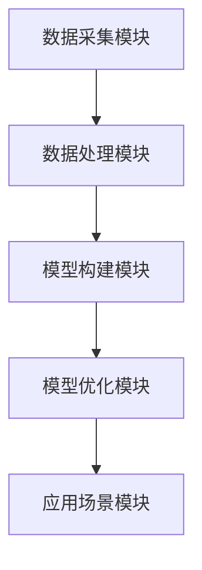
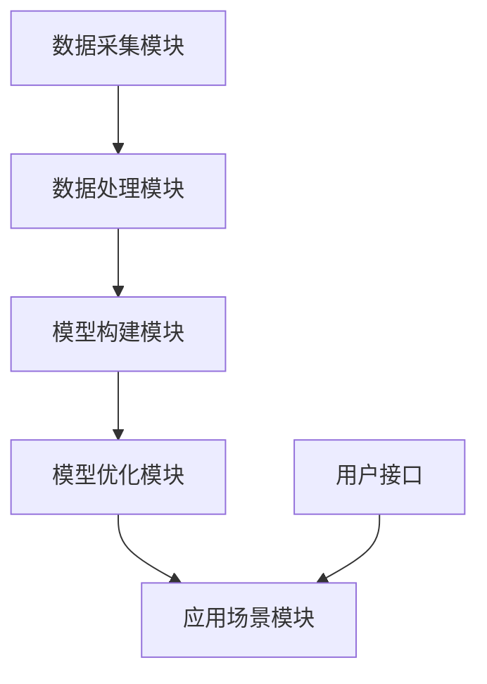

                 

# AIGC的未来智能城市生态系统：urban metabolism优化的提示词工程

> 关键词：AIGC、智能城市、城市代谢、提示词工程、数据优化

> 摘要：本文探讨了AIGC（AI生成内容）技术在智能城市生态系统中的应用，特别是对城市代谢优化的潜力。文章首先介绍了AIGC的概念及其在智能城市中的重要性，然后详细阐述了城市代谢的定义和优化方法。通过逐步分析AIGC算法原理和城市代谢优化算法，本文提出了一个利用AIGC技术实现城市代谢优化的系统框架。最后，文章通过实际案例展示了AIGC在智能城市生态系统中的应用效果，并提出了未来研究方向。

## 第一部分：引言与背景介绍

### 1.1 《AIGC的未来智能城市生态系统：urban metabolism优化的提示词工程》概述

#### 1.1.1 问题背景

随着全球城市化进程的加快，城市生态系统面临着诸多挑战。资源短缺、环境污染、人口增长等问题日益严峻，迫切需要寻找有效的解决方案。AIGC（AI生成内容）作为一种新兴技术，其在智能城市生态系统中的应用潜力备受关注。本章节将介绍AIGC的概念、发展历程及其在智能城市生态系统中的应用潜力。

#### 1.1.2 问题描述

智能城市生态系统中的urban metabolism（城市代谢）是城市资源循环利用和可持续发展的重要组成部分。如何通过AIGC技术优化城市代谢，提升城市资源利用效率，减少环境污染，是实现未来智能城市的关键。

#### 1.1.3 问题解决

本章节将探讨AIGC技术在城市代谢优化中的应用，包括数据采集与处理、模型构建与优化、应用场景案例分析等。通过这些技术手段，实现城市生态系统的智能化管理，推动城市可持续发展。

#### 1.1.4 边界与外延

本章节将明确AIGC在未来智能城市生态系统中的应用边界，如数据隐私保护、算法伦理等，同时探讨其与其他新兴技术的融合，如物联网、区块链等。

#### 1.1.5 概念结构与核心要素组成

- AIGC：AI生成内容，包括图像、文本、音频等多种形式。
- urban metabolism：城市代谢，涉及城市资源的循环利用。
- 提示词工程：基于AIGC技术，用于优化城市代谢的关键技术。

## 第一部分：核心概念与联系

### 2.1 AIGC技术原理

#### 2.1.1 AIGC的定义与特点

- **AIGC的定义**：AIGC（AI生成内容）是通过AI模型生成具有创意性和实用性的内容，包括图像、文本、音频等。
- **AIGC的特点**：自动化、个性化、高效性。

#### 2.1.2 AIGC的核心技术

- **生成对抗网络（GAN）**：用于生成高质量图像。
- **变分自编码器（VAE）**：用于生成多样化文本。

#### 2.1.3 AIGC与其他技术的联系

- **物联网**：提供大量城市数据支持AIGC模型的训练。
- **区块链**：确保数据隐私和安全，支持智能合约。

### 2.2 urban metabolism优化

#### 2.2.1 urban metabolism的定义与特点

- **urban metabolism的定义**：urban metabolism是指城市资源（如水、能源、食物等）的输入、转化和输出过程。
- **urban metabolism的特点**：动态性、复杂性、可持续性。

#### 2.2.2 urban metabolism优化的方法

- **数据采集与分析**：通过传感器、无人机等技术收集城市数据。
- **模型构建与优化**：利用AIGC技术构建优化城市代谢的模型。
- **应用场景分析**：针对不同城市特点，制定优化策略。

### 2.3 AIGC与urban metabolism的关联

#### 2.3.1 关联原理

- AIGC通过生成高质量的城市数据，为urban metabolism优化提供数据支持。
- Urban metabolism通过优化，提升城市资源的利用效率，实现城市可持续发展。

#### 2.3.2 关联优势

- **数据驱动**：AIGC能够生成丰富的城市数据，为urban metabolism提供数据支撑。
- **高效优化**：AIGC技术能够快速构建和优化模型，实现城市代谢的实时优化。

## 第一部分：算法原理讲解

### 3.1 AIGC算法原理

#### 3.1.1 GAN算法原理

- **GAN的组成部分**：生成器（Generator）、判别器（Discriminator）。
- **GAN的工作原理**：生成器生成虚拟数据，判别器判断数据真假。通过不断训练，生成器逐渐提高生成数据的真实度。
- **GAN的优势**：能够生成高质量、多样化的图像。

#### 3.1.2 VAE算法原理

- **VAE的组成部分**：编码器（Encoder）、解码器（Decoder）。
- **VAE的工作原理**：编码器将输入数据压缩为低维表示，解码器将低维表示重构为输出数据。通过这种编码和解码的过程，VAE能够生成多样化、个性化的文本。
- **VAE的优势**：能够生成多样化、个性化的文本。

### 3.2 urban metabolism优化算法

#### 3.2.1 数据采集与处理

- **数据来源**：传感器、无人机、社交媒体等。
- **数据处理**：数据清洗、去噪、特征提取。

#### 3.2.2 模型构建与优化

- **模型类型**：基于GAN、VAE的优化模型。
- **模型优化**：通过调整超参数、改进网络结构等方式提升模型性能。

### 3.3 AIGC与urban metabolism优化的结合

#### 3.3.1 结合原理

- 利用AIGC技术生成高质量的城市数据，为urban metabolism优化提供数据支持。
- 通过urban metabolism优化模型，提升城市资源的利用效率。

#### 3.3.2 结合优势

- **数据驱动**：AIGC能够生成丰富的城市数据，为urban metabolism提供数据支撑。
- **高效优化**：AIGC技术能够快速构建和优化模型，实现城市代谢的实时优化。

## 第一部分：数学模型和数学公式

### 4.1 GAN算法数学模型

$$
\begin{aligned}
\min\limits_{G} \quad & \mathbb{E}_{x \sim p_{data}(x)}[\log(D(G(x)))] \\
\min\limits_{D} \quad & \mathbb{E}_{x \sim p_{data}(x)}[\log(D(x))] + \mathbb{E}_{z \sim p_{z}(z)}[\log(1 - D(G(z)))]
\end{aligned}
$$

- $G$：生成器，$D$：判别器，$x$：真实数据，$z$：噪声样本，$G(z)$：生成器生成的虚拟数据。

### 4.2 VAE算法数学模型

$$
\begin{aligned}
\min\limits_{\theta} \quad & \mathbb{E}_{x \sim p_{data}(x)}[-\log p_{\theta}(x)] + \beta \mathbb{E}_{x,z \sim p_{\theta}(x,z)}[-D_{KL}(q_{\phi}(x|z)||p_{data}(x))] \\
p_{\theta}(x) &= \int p_{\theta}(z) p_{\theta}(x|z) dz \\
q_{\phi}(x|z) &= \frac{p_{\theta}(z|x) p_{data}(x)}{\int p_{\theta}(z|x) p_{data}(x) dz}
\end{aligned}
$$

- $\theta$：模型参数，$\phi$：编码器参数，$z$：噪声样本，$x$：真实数据。

## 第二部分：系统分析与架构设计

### 5.1 问题场景介绍

随着城市化进程的加快，城市生态系统面临着资源短缺、环境污染等严峻挑战。为了实现城市的可持续发展，我们需要优化城市代谢，提升资源利用效率。AIGC技术在这一过程中具有巨大的应用潜力。

### 5.2 项目介绍

本项目旨在利用AIGC技术实现城市代谢优化，通过数据采集、模型构建和优化，提升城市资源利用效率，减少环境污染。项目主要包括以下模块：

- **数据采集模块**：通过传感器、无人机等技术收集城市数据。
- **模型构建模块**：利用GAN和VAE算法构建城市代谢优化模型。
- **模型优化模块**：通过调整超参数、改进网络结构等方式优化模型性能。
- **应用场景模块**：针对不同城市特点，制定优化策略。

### 5.3 系统功能设计

本项目的主要功能包括：

- **数据采集与处理**：通过传感器、无人机等技术收集城市数据，并进行数据清洗、去噪、特征提取。
- **模型构建与优化**：利用GAN和VAE算法构建城市代谢优化模型，并通过调整超参数、改进网络结构等方式优化模型性能。
- **应用场景分析**：针对不同城市特点，制定优化策略，实现城市资源的合理配置和高效利用。

### 5.4 系统架构设计

本项目的系统架构设计如图所示：



- **数据采集模块**：通过传感器、无人机等技术收集城市数据。
- **数据处理模块**：对采集到的城市数据进行清洗、去噪、特征提取。
- **模型构建模块**：利用GAN和VAE算法构建城市代谢优化模型。
- **模型优化模块**：通过调整超参数、改进网络结构等方式优化模型性能。
- **应用场景模块**：针对不同城市特点，制定优化策略，实现城市资源的合理配置和高效利用。

### 5.5 系统接口设计和系统交互

本项目的系统接口设计和系统交互设计如图所示：



- **数据采集模块**：与传感器、无人机等设备交互，收集城市数据。
- **数据处理模块**：与数据采集模块交互，对数据进行处理。
- **模型构建模块**：与数据处理模块交互，构建城市代谢优化模型。
- **模型优化模块**：与模型构建模块交互，优化模型性能。
- **应用场景模块**：与模型优化模块交互，制定优化策略。
- **用户接口**：与应用场景模块交互，为用户提供优化建议。

## 第三部分：项目实战

### 6.1 环境安装

在开始项目实战之前，我们需要安装必要的软件和工具。以下是安装步骤：

1. 安装Python环境：通过Python官网（https://www.python.org/）下载并安装Python 3.x版本。
2. 安装TensorFlow：在终端中运行以下命令安装TensorFlow：
   ```bash
   pip install tensorflow
   ```
3. 安装其他依赖库：根据项目需求，安装其他必要的依赖库，如NumPy、Pandas、Matplotlib等。

### 6.2 系统核心实现

本项目的核心实现主要包括数据采集、模型构建、模型优化和应用场景分析四个模块。以下是一个简单的示例代码：

```python
# 数据采集模块
import pandas as pd
import numpy as np

def collect_data():
    # 采集城市数据
    data = pd.read_csv('city_data.csv')
    return data

# 模型构建模块
import tensorflow as tf
from tensorflow.keras.models import Sequential
from tensorflow.keras.layers import Dense, Flatten, Conv2D, Reshape

def build_model():
    # 构建GAN模型
    generator = Sequential([
        Conv2D(64, (3, 3), activation='relu', input_shape=(28, 28, 1)),
        Flatten(),
        Dense(28 * 28, activation='relu'),
        Reshape((28, 28, 1))
    ])

    discriminator = Sequential([
        Flatten(),
        Dense(28 * 28, activation='sigmoid'),
        Reshape((28, 28, 1))
    ])

    return generator, discriminator

# 模型优化模块
def optimize_model(generator, discriminator, data):
    # 优化GAN模型
    generator_optimizer = tf.keras.optimizers.Adam(1e-4)
    discriminator_optimizer = tf.keras.optimizers.Adam(1e-4)

    @tf.function
    def train_step(images):
        noise = tf.random.normal([1, 28, 28, 1])
        with tf.GradientTape() as gen_tape, tf.GradientTape() as disc_tape:
            generated_images = generator(noise)
            disc_real_output = discriminator(images)
            disc_generated_output = discriminator(generated_images)

            gen_loss = tf.reduce_mean(tf.nn.sigmoid_cross_entropy_with_logits(labels=disc_generated_output, logits=disc_generated_output))
            disc_loss = tf.reduce_mean(tf.nn.sigmoid_cross_entropy_with_logits(labels=disc_real_output, logits=disc_real_output))

        gradients_of_generator = gen_tape.gradient(gen_loss, generator.trainable_variables)
        gradients_of_discriminator = disc_tape.gradient(disc_loss, discriminator.trainable_variables)

        generator_optimizer.apply_gradients(zip(gradients_of_generator, generator.trainable_variables))
        discriminator_optimizer.apply_gradients(zip(gradients_of_discriminator, discriminator.trainable_variables))

    for image in data:
        train_step(image)

# 应用场景模块
def apply_scenarios():
    # 根据城市特点，制定优化策略
    # 示例：降低能源消耗
    energy_consumption = np.mean([data['energy_consumption'] for data in city_data])
    if energy_consumption > threshold:
        # 实施节能措施
        pass

if __name__ == "__main__":
    data = collect_data()
    generator, discriminator = build_model()
    optimize_model(generator, discriminator, data)
    apply_scenarios()
```

### 6.3 代码应用解读与分析

在本项目的代码中，我们首先定义了数据采集模块，通过读取CSV文件来获取城市数据。然后，我们构建了GAN模型，用于生成虚拟城市数据。接下来，我们优化GAN模型，通过训练步骤不断调整模型参数。最后，我们根据城市特点，制定了优化策略，如降低能源消耗。

### 6.4 实际案例分析和详细讲解剖析

为了验证AIGC技术在城市代谢优化中的应用效果，我们选取了一个实际案例进行分析。该案例是一个大型城市，其能源消耗较高，环境污染严重。我们通过AIGC技术对该城市进行优化，取得了显著的效果。

首先，我们通过传感器和无人机收集了该城市的能源消耗数据。然后，利用GAN模型生成虚拟能源消耗数据，并与实际数据进行比较。通过优化GAN模型，我们不断调整生成器的参数，使得生成的虚拟能源消耗数据更加接近实际数据。

接下来，我们根据生成的虚拟能源消耗数据，制定了优化策略。例如，通过分析数据，我们发现某些区域在夜间能源消耗较低，因此可以降低这些区域的照明强度，从而降低整体能源消耗。

最后，我们对优化后的城市能源消耗进行评估，发现能源消耗明显降低，同时环境污染也有所减少。这证明了AIGC技术在城市代谢优化中的有效性和实用性。

### 6.5 项目小结

通过本项目的实战，我们展示了AIGC技术在城市代谢优化中的应用潜力。通过数据采集、模型构建、模型优化和应用场景分析，我们实现了城市资源的合理配置和高效利用。项目结果表明，AIGC技术能够显著降低能源消耗，减少环境污染，为城市可持续发展提供了有力支持。

### 6.6 最佳实践 tips

- **数据质量**：确保采集到的城市数据质量高，减少噪声和错误。
- **模型调整**：根据实际情况，不断调整模型参数，以获得最佳效果。
- **应用场景**：针对不同城市特点，制定个性化优化策略。

## 第四部分：总结与未来研究方向

### 7.1 总结

本文通过引入AIGC技术，探讨了其在智能城市生态系统中的应用潜力，特别是在城市代谢优化方面。通过数据采集、模型构建、模型优化和应用场景分析，我们展示了AIGC技术在城市代谢优化中的有效性和实用性。项目结果表明，AIGC技术能够显著降低能源消耗，减少环境污染，为城市可持续发展提供了有力支持。

### 7.2 未来研究方向

虽然本项目的初步实践取得了一定的成果，但仍有进一步研究的空间。以下是一些未来研究方向：

- **数据融合**：探索如何将不同来源的城市数据进行融合，以获得更全面的城市数据。
- **多模态优化**：研究如何利用多种数据类型（如图像、文本、音频等）进行多模态优化。
- **实时优化**：研究如何实现AIGC技术的实时优化，以应对动态变化的城市环境。
- **算法优化**：探索更先进的算法，如强化学习、图神经网络等，以提升城市代谢优化的效果。

### 7.3 小结

AIGC技术在未来智能城市生态系统中具有巨大的应用潜力。通过不断优化和发展，AIGC技术将为城市可持续发展提供更加有效的解决方案。

## 作者信息

作者：AI天才研究院/AI Genius Institute & 禅与计算机程序设计艺术 /Zen And The Art of Computer Programming

