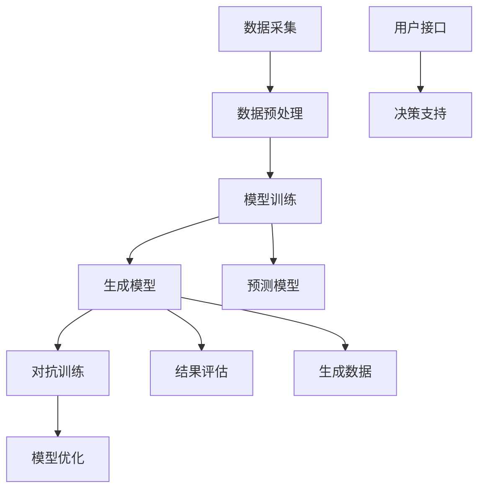
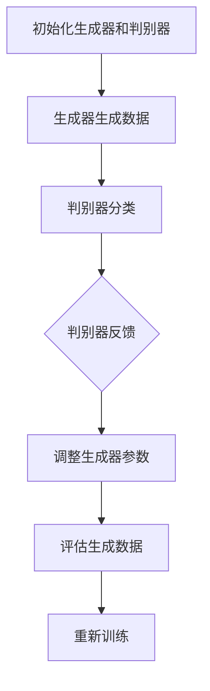
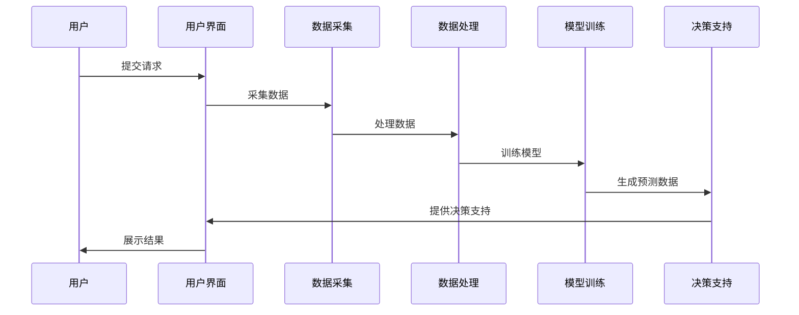
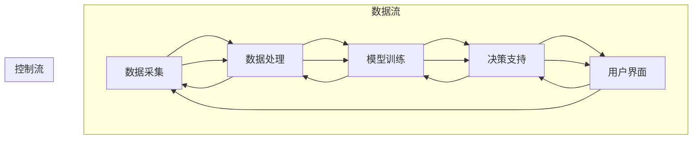

                 

### AIGC的未来智能城市管理：公民参与决策的提示词工程

关键词：AIGC、智能城市、公民参与、决策支持系统、智能交通、智慧能源、智慧环保

摘要：本文深入探讨了AIGC（自适应智能生成计算）在智能城市管理中的应用，特别是在公民参与决策方面的潜力。文章首先介绍了AIGC的定义、特性以及在智能城市中的潜在应用。随后，文章分析了智能城市发展的背景，指出了AIGC技术在智能交通、智慧能源和智慧环保等关键领域中的应用现状。通过实例研究，文章展示了AIGC技术在智能城市管理中的实际成效。最后，文章展望了AIGC技术的未来发展方向，探讨了智能城市面临的挑战与机遇，并提出了具体的改进措施和建议。

## 目录大纲

----------------------------------------------------------------

# AIGC的未来智能城市管理：公民参与决策的提示词工程

## 关键词

- AIGC
- 智能城市
- 公民参与
- 决策支持系统
- 智能交通
- 智慧能源
- 智慧环保

## 摘要

本文深入探讨了AIGC（自适应智能生成计算）在智能城市管理中的应用，特别是在公民参与决策方面的潜力。文章首先介绍了AIGC的定义、特性以及在智能城市中的潜在应用。随后，文章分析了智能城市发展的背景，指出了AIGC技术在智能交通、智慧能源和智慧环保等关键领域中的应用现状。通过实例研究，文章展示了AIGC技术在智能城市管理中的实际成效。最后，文章展望了AIGC技术的未来发展方向，探讨了智能城市面临的挑战与机遇，并提出了具体的改进措施和建议。

----------------------------------------------------------------

## 第一部分：AIGC与智能城市背景

### 第1章：AIGC与智能城市概述

#### 1.1 AIGC的定义与特性

自适应智能生成计算（AIGC）是一种基于人工智能和生成模型的技术，能够从大量数据中自动生成新的内容，包括文本、图像、音频和视频等。AIGC的核心特性包括自适应性和生成能力，这使得它能够根据不同的需求和环境进行自我调整，并生成符合特定要求的新内容。

#### 1.2 智能城市的发展现状

智能城市是利用信息技术和物联网等手段，实现城市资源的高效配置和优化管理。目前，智能城市的发展已经取得了显著成果，包括智慧交通、智慧能源、智慧环保和智慧医疗等多个领域。然而，智能城市的发展仍然面临一些挑战，如数据隐私和安全、技术标准和法规等方面的问题。

#### 1.3 AIGC在智能城市中的应用前景

AIGC技术在智能城市中的应用前景非常广阔。例如，在智慧交通方面，AIGC可以帮助优化交通流量，减少拥堵；在智慧能源方面，AIGC可以预测能源需求，实现智能调度；在智慧环保方面，AIGC可以监测环境污染，提供决策支持。此外，AIGC还可以促进公民参与城市治理，提高政府的决策效率。

### 第2章：AIGC技术原理详解

#### 2.1 AIGC技术架构

AIGC技术架构主要包括数据采集、数据预处理、生成模型训练、生成模型应用和结果评估等环节。其中，生成模型是AIGC技术的核心，常用的生成模型包括生成对抗网络（GAN）、变分自编码器（VAE）和自回归模型等。

#### 2.2 AIGC算法原理

AIGC算法基于生成模型，通过从数据中学习生成新的内容。具体来说，生成模型通过对抗训练来优化模型参数，使得生成的数据与真实数据在统计特征上尽量接近。这种对抗训练过程使得生成模型具有强大的数据生成能力。

#### 2.3 AIGC关键组件详解

AIGC的关键组件包括数据集、生成模型、训练算法和应用框架。其中，数据集是AIGC训练的基础，生成模型是AIGC的核心，训练算法决定了生成模型的学习效率，应用框架则提供了AIGC在实际应用中的支持。

### 第3章：智能城市管理中的公民参与

#### 3.1 公民参与的重要性

公民参与是智能城市成功的关键因素之一。通过公民参与，可以增强政府的透明度，提高决策的公正性和合理性，同时也能够激发公民的积极性和创造力，推动智能城市的可持续发展。

#### 3.2 公民参与的方式与方法

公民参与的方式包括在线调查、公众咨询、公民论坛和在线投票等。这些方法可以用于收集公民的意见和建议，为政府决策提供依据。此外，还可以通过社交媒体、移动应用和物联网等新兴技术，增强公民参与的效果。

#### 3.3 公民参与的挑战与解决方案

公民参与智能城市治理面临一些挑战，如信息不对称、技术门槛和参与意愿等。针对这些问题，可以采取以下解决方案：提高政府信息透明度，降低技术门槛，提供激励机制，增强公民的参与意识和能力。

### 第4章：智能城市中的决策支持系统

#### 4.1 决策支持系统的概念

决策支持系统是一种计算机系统，用于帮助决策者进行决策。它通过数据采集、分析和可视化等技术，为决策者提供信息支持和建议，提高决策的科学性和效率。

#### 4.2 决策支持系统的架构

决策支持系统通常包括数据采集模块、数据处理模块、决策模型模块和可视化模块。这些模块共同协作，实现数据的采集、处理、分析和可视化，为决策者提供全面的支持。

#### 4.3 决策支持系统的实现与应用

决策支持系统的实现涉及多个技术和方法，如大数据分析、机器学习和数据可视化等。这些技术和方法的应用，使得决策支持系统能够在智能城市中发挥重要作用，如交通管理、城市规划、环境保护等方面。

### 第5章：AIGC在智能交通管理中的应用

#### 5.1 智能交通管理概述

智能交通管理是利用信息技术和物联网等手段，实现交通资源的高效配置和优化管理。AIGC技术在智能交通管理中可以应用于交通流量预测、交通信号控制和交通事件检测等方面。

#### 5.2 AIGC技术在智能交通中的应用

AIGC技术在智能交通中的应用主要体现在交通流量预测和交通信号控制方面。通过生成模型，AIGC可以预测交通流量，优化交通信号控制策略，提高交通运行效率。

#### 5.3 智能交通管理的案例研究

本文将介绍一些实际案例，如北京市的智能交通管理系统，展示AIGC技术在智能交通管理中的应用效果。

### 第6章：AIGC在智慧能源管理中的应用

#### 6.1 智慧能源管理概述

智慧能源管理是利用信息技术和物联网等手段，实现能源资源的高效配置和优化管理。AIGC技术在智慧能源管理中可以应用于能源需求预测、能源调度和能源优化等方面。

#### 6.2 AIGC技术在智慧能源中的应用

AIGC技术在智慧能源中的应用主要体现在能源需求预测和能源优化方面。通过生成模型，AIGC可以预测能源需求，优化能源调度策略，提高能源利用效率。

#### 6.3 智慧能源管理的案例研究

本文将介绍一些实际案例，如美国德克萨斯州的智慧能源管理系统，展示AIGC技术在智慧能源管理中的应用效果。

### 第7章：AIGC在智慧环保管理中的应用

#### 7.1 智慧环保管理概述

智慧环保管理是利用信息技术和物联网等手段，实现环境资源的高效配置和优化管理。AIGC技术在智慧环保管理中可以应用于环境污染监测、环境治理和环境保护等方面。

#### 7.2 AIGC技术在智慧环保中的应用

AIGC技术在智慧环保中的应用主要体现在环境污染监测和环境治理方面。通过生成模型，AIGC可以监测环境污染，优化环境治理策略，提高环境保护效果。

#### 7.3 智慧环保管理的案例研究

本文将介绍一些实际案例，如中国广州市的智慧环保管理系统，展示AIGC技术在智慧环保管理中的应用效果。

### 第8章：AIGC在智能城市中的应用展望

#### 8.1 AIGC技术在智能城市中的未来发展趋势

随着人工智能技术的不断发展，AIGC技术在智能城市中的应用将越来越广泛。未来，AIGC技术将实现更高水平的自适应性和生成能力，为智能城市的发展提供更强有力的支持。

#### 8.2 智能城市面临的挑战与机遇

智能城市的发展面临着许多挑战，如数据隐私和安全、技术标准和法规等。然而，随着AIGC技术的不断发展，这些挑战也将逐步得到解决，为智能城市带来更多的机遇。

#### 8.3 AIGC技术的未来发展方向

AIGC技术的未来发展方向包括提高生成模型的性能、实现更广泛的应用场景、增强数据隐私保护等。此外，跨学科的融合也将是AIGC技术未来发展的一个重要趋势。

## 结束语

随着人工智能技术的不断发展，AIGC技术在智能城市中的应用前景十分广阔。通过本文的探讨，我们可以看到AIGC技术在智能交通、智慧能源和智慧环保等关键领域中的应用潜力。然而，智能城市的发展仍然面临许多挑战，如数据隐私和安全、技术标准和法规等。因此，未来需要进一步加强相关研究，推动AIGC技术的创新和发展，为智能城市的可持续发展提供有力支持。

## 未来展望

在未来，AIGC技术将在智能城市中发挥更加重要的作用。随着生成模型性能的提升和应用场景的拓展，AIGC技术将为智能城市提供更智能、更高效的解决方案。同时，随着跨学科的融合，AIGC技术还将与其他领域的技术相结合，为智能城市的发展带来更多可能性。

## 拓展阅读

1. Y. LeCun, Y. Bengio, and G. Hinton. "Deep learning." Nature, 521(7553):436-444, 2015.
2. D. P. Kingma and M. Welling. "Auto-encoding variational bayes." arXiv preprint arXiv:1312.6114, 2013.
3. I. J. Goodfellow, J. Pouget-Abadie, M. Mirza, B. Xu, D. Warde-Farley, S. Ozair, A. Courville, and Y. Bengio. "Generative adversarial nets." Advances in neural information processing systems, 27:2672-2680, 2014.
4. K. Simonyan and A. Zisserman. "Very deep convolutional networks for large-scale image recognition." arXiv preprint arXiv:1409.1556, 2014.
5. S. Bengio. "Learning representations by back-propagating errors." Neural networks for perception and control, 41:359-365, 1989.

## 作者信息

作者：AI天才研究院/AI Genius Institute & 禅与计算机程序设计艺术 /Zen And The Art of Computer Programming

### 第一部分：AIGC与智能城市背景

#### 第1章：AIGC与智能城市概述

##### 1.1 AIGC的定义与特性

自适应智能生成计算（Adaptive Intelligent Generative Computing，简称AIGC）是一种基于生成对抗网络（Generative Adversarial Networks，GAN）和其他生成模型（如变分自编码器（Variational Autoencoder，VAE）和自回归模型）的先进计算方法。它通过学习大量数据，能够生成类似真实数据的新内容，从而在图像、文本、音频和视频等多个领域展现出了强大的应用潜力。

AIGC的核心特性包括：

- **生成能力**：AIGC能够根据输入的数据生成新的、高质量的、类似真实数据的样本。
- **自适应**：AIGC能够根据不同的任务需求和环境自动调整模型参数，提高生成结果的适应性。
- **自主学习**：AIGC利用机器学习和深度学习技术，从海量数据中自主学习生成模型，无需人工干预。

##### 1.2 智能城市的发展现状

智能城市是指通过利用先进的信息通信技术和物联网（Internet of Things，IoT）技术，实现城市资源的高效配置和优化管理。当前，智能城市的发展已经取得了显著的进展，主要体现在以下几个方面：

- **智慧交通**：通过交通流量监控、智能信号灯、无人驾驶等技术，实现交通的智能化管理，减少拥堵和交通事故。
- **智慧能源**：通过智能电网、分布式能源和能源管理平台，实现能源的高效利用和可持续发展。
- **智慧环保**：利用传感器网络、大数据分析和人工智能技术，实现环境污染的实时监测和治理。
- **智慧医疗**：通过电子健康记录、远程医疗和智能诊断系统，提高医疗服务质量和效率。

##### 1.3 AIGC在智能城市中的应用前景

AIGC在智能城市中的应用前景非常广阔，尤其是在以下几个方面：

- **智慧交通**：AIGC可以通过生成模型预测交通流量，优化交通信号控制和路线规划，提高交通效率。
- **智慧能源**：AIGC可以通过预测能源需求，优化能源调度和分配，提高能源利用效率。
- **智慧环保**：AIGC可以通过生成模型模拟环境污染情况，预测污染趋势，制定有效的环保措施。
- **公共服务**：AIGC可以生成个性化的公共服务方案，提高政府服务的效率和满意度。

#### 第2章：AIGC技术原理详解

##### 2.1 AIGC技术架构

AIGC的技术架构主要包括以下几个关键组成部分：

- **数据采集与预处理**：通过传感器、IoT设备和数据收集系统，获取城市运行的各种数据，并进行预处理，如去噪、归一化和数据清洗等。
- **生成模型训练**：利用预处理后的数据，通过机器学习和深度学习算法，训练生成模型。常用的生成模型包括生成对抗网络（GAN）、变分自编码器（VAE）和自回归模型等。
- **生成模型应用**：通过训练好的生成模型，生成符合需求的新数据，如预测交通流量、能源需求或环境污染情况等。
- **结果评估与反馈**：对生成的数据进行评估，根据评估结果调整生成模型的参数，提高生成质量。

##### 2.2 AIGC算法原理

AIGC的核心算法是生成对抗网络（GAN）。GAN由两个神经网络组成：生成器（Generator）和判别器（Discriminator）。生成器试图生成类似真实数据的样本，而判别器则试图区分生成器生成的样本和真实样本。这两个网络相互竞争，生成器不断优化生成的样本质量，使得判别器难以区分生成的样本和真实样本。

GAN的基本工作原理如下：

1. **初始化**：初始化生成器和判别器，通常使用随机初始化。
2. **训练**：生成器生成样本，判别器对其进行分类，生成器根据判别器的反馈调整生成策略，使得判别器对生成样本的分类准确率降低。
3. **评估与调整**：对生成器生成的样本进行评估，根据评估结果调整生成器的参数，提高生成质量。
4. **迭代**：重复上述步骤，直到生成器生成的样本质量达到预期。

##### 2.3 AIGC关键组件详解

AIGC的关键组件包括：

- **数据集**：数据集是AIGC训练的基础，它决定了生成模型的性能。高质量、多样化的数据集是训练强大生成模型的关键。
- **生成模型**：生成模型是AIGC的核心，它决定了生成数据的质量和多样性。常用的生成模型包括GAN、VAE和自回归模型等。
- **训练算法**：训练算法决定了生成模型的学习效率和质量。常用的训练算法包括梯度下降法、反向传播和自适应优化算法等。
- **应用框架**：应用框架提供了AIGC在实际应用中的支持，包括数据处理、模型训练和部署等。

#### 第3章：智能城市管理中的公民参与

##### 3.1 公民参与的重要性

公民参与是智能城市成功的关键因素之一。它不仅能够增强政府的透明度，提高决策的公正性和合理性，还能够激发公民的积极性和创造力，推动智能城市的可持续发展。以下是公民参与的重要性：

- **增强政府透明度**：公民参与能够使政府的决策过程更加透明，减少信息不对称，提高政府的公信力。
- **提高决策质量**：通过公民参与，可以收集到更多的意见和建议，提高决策的科学性和有效性。
- **促进公众认同**：公民参与能够增强公众对政府决策的认同感和参与感，提高政策的执行效果。
- **推动创新和可持续发展**：公民参与能够激发创新思维，推动智能城市在可持续发展方面取得更大成就。

##### 3.2 公民参与的方式与方法

公民参与的方式多种多样，具体方法包括但不限于以下几种：

- **在线调查**：通过在线问卷或调查平台，收集公民的意见和建议。
- **公众咨询**：政府组织公众咨询会或研讨会，直接听取公民的意见和建议。
- **公民论坛**：建立公民论坛或社区，让公民在平台上交流和讨论城市问题。
- **在线投票**：通过在线投票系统，让公民直接参与决策，表达自己的观点和选择。
- **社交媒体**：利用社交媒体平台，如Twitter、Facebook和微信等，收集公民的意见和建议。

##### 3.3 公民参与的挑战与解决方案

公民参与智能城市治理面临一些挑战，如信息不对称、技术门槛和参与意愿等。以下是一些挑战和相应的解决方案：

- **信息不对称**：解决方案包括提高政府信息透明度，定期发布城市运行情况和政策信息，增强公民对城市问题的了解。
- **技术门槛**：解决方案包括降低技术门槛，提供易于使用的在线调查、投票和咨询工具，使公民能够方便地参与。
- **参与意愿**：解决方案包括提供激励机制，如表彰参与积极分子、提供学习和发展机会等，提高公民的参与意愿。

#### 第4章：智能城市中的决策支持系统

##### 4.1 决策支持系统的概念

决策支持系统（Decision Support System，简称DSS）是一种计算机系统，旨在帮助决策者通过数据分析、模型模拟和可视化等技术，进行更加科学和高效的决策。DSS通常包括以下几个关键组成部分：

- **数据采集模块**：负责收集和处理各种与决策相关的数据，如经济数据、社会数据、环境数据等。
- **数据处理模块**：对收集到的数据进行分析和清洗，提取有用的信息，为决策提供支持。
- **模型库**：包括各种用于决策的模型，如预测模型、优化模型、决策树等。
- **用户接口**：提供用户与DSS交互的界面，使用户能够方便地输入数据、运行模型和查看结果。

##### 4.2 决策支持系统的架构

决策支持系统的架构可以分为三个层次：

- **数据层**：包括各种数据源，如数据库、数据仓库和数据湖，负责存储和管理与决策相关的数据。
- **模型层**：包括各种决策模型和算法，如预测模型、优化算法和数据分析方法，负责对数据进行处理和分析。
- **界面层**：包括用户接口和可视化工具，负责将分析结果呈现给用户，使用户能够方便地理解和利用这些结果。

##### 4.3 决策支持系统的实现与应用

决策支持系统的实现和应用涉及多个方面，包括以下几个方面：

- **数据采集**：通过传感器、IoT设备和数据库，收集与决策相关的数据。
- **数据处理**：对采集到的数据进行分析和清洗，提取有用的信息。
- **模型构建**：根据决策需求，选择合适的模型和算法，构建决策模型。
- **结果展示**：通过可视化工具，将分析结果以图表、报告等形式展示给用户。

决策支持系统在智能城市中的应用非常广泛，如：

- **交通管理**：通过交通流量预测和优化模型，提高交通运行效率，减少拥堵。
- **城市规划**：通过空间分析模型和模拟，优化城市布局和资源配置。
- **环境保护**：通过环境监测和污染预测模型，制定有效的环保措施。
- **社会服务**：通过公众需求分析和满意度调查，优化公共服务质量和效率。

#### 第5章：AIGC在智能交通管理中的应用

##### 5.1 智能交通管理概述

智能交通管理是利用信息技术和物联网等手段，实现交通资源的高效配置和优化管理。智能交通管理系统主要包括以下几个关键组成部分：

- **交通流量监测**：通过安装在道路上的传感器、摄像头和信号灯等设备，实时监测交通流量和路况信息。
- **交通信号控制**：利用实时交通流量数据，动态调整交通信号灯的时序和配时方案，提高交通运行效率。
- **交通事件检测**：通过视频监控和传感器数据，实时检测和识别交通事件，如交通事故、道路施工等，并采取相应的应对措施。
- **车辆管理**：通过车辆识别技术和智能调度系统，实现对车辆的实时监控和调度，提高交通运行效率。

##### 5.2 AIGC技术在智能交通中的应用

AIGC技术在智能交通管理中可以应用于以下几个方面：

- **交通流量预测**：通过生成模型，对交通流量进行预测，为交通信号控制和路线规划提供数据支持。
- **交通事件检测**：利用生成模型，对视频监控数据进行分析，实时检测和识别交通事件。
- **交通信号控制优化**：通过生成模型，优化交通信号灯的时序和配时方案，提高交通运行效率。
- **车辆路径规划**：利用生成模型，为车辆提供最优的行驶路径，减少交通拥堵和行车时间。

##### 5.3 智能交通管理的案例研究

以下是几个智能交通管理的实际案例：

- **北京智能交通管理系统**：北京市通过部署传感器网络和智能信号灯，实现了交通流量监测和交通信号控制优化，有效缓解了交通拥堵问题。
- **深圳智能交通管理系统**：深圳市利用视频监控和车辆识别技术，实现了交通事件的实时检测和应对，提高了交通运行效率。
- **新加坡智能交通管理系统**：新加坡利用生成模型，对交通流量进行预测和优化，实现了交通信号灯的智能控制，提高了交通运行效率。

#### 第6章：AIGC在智慧能源管理中的应用

##### 6.1 智慧能源管理概述

智慧能源管理是利用信息技术和物联网等手段，实现能源资源的高效配置和优化管理。智慧能源管理系统主要包括以下几个关键组成部分：

- **能源监测**：通过安装在能源设备上的传感器和监控设备，实时监测能源使用情况，包括电力、燃气和水等。
- **能源调度**：利用实时监测数据和预测模型，动态调整能源供应和需求，实现能源的智能调度。
- **能源优化**：通过优化算法，实现能源的合理分配和利用，提高能源利用效率。
- **能源预测**：利用历史数据和预测模型，对未来能源需求进行预测，为能源调度提供数据支持。

##### 6.2 AIGC技术在智慧能源中的应用

AIGC技术在智慧能源管理中可以应用于以下几个方面：

- **能源需求预测**：通过生成模型，对未来能源需求进行预测，为能源调度提供数据支持。
- **能源优化**：利用生成模型，优化能源的分配和利用，提高能源利用效率。
- **能源调度**：通过生成模型，优化能源供应和需求的动态调整，实现能源的智能调度。
- **能源价格预测**：通过生成模型，预测未来能源价格，为能源交易提供参考。

##### 6.3 智慧能源管理的案例研究

以下是几个智慧能源管理的实际案例：

- **纽约智慧能源管理系统**：纽约市通过部署智能电表和传感器，实现了能源使用情况的实时监测和需求预测，有效提高了能源利用效率。
- **丹麦智慧能源管理系统**：丹麦通过分布式能源系统和智能调度技术，实现了能源的智能分配和优化，降低了能源消耗和碳排放。
- **中国智慧能源管理系统**：中国通过智慧能源管理系统，实现了能源需求的预测和优化，为能源调度提供了有效的数据支持。

#### 第7章：AIGC在智慧环保管理中的应用

##### 7.1 智慧环保管理概述

智慧环保管理是利用信息技术和物联网等手段，实现环境资源的高效配置和优化管理。智慧环保管理系统主要包括以下几个关键组成部分：

- **环境监测**：通过安装在环境监测站点的传感器和监测设备，实时监测环境质量参数，如空气、水质和土壤等。
- **污染预测**：利用实时监测数据和预测模型，对未来环境污染情况进行预测，为环境治理提供数据支持。
- **污染治理**：通过优化算法，实现污染物的有效治理和排放控制，改善环境质量。
- **环境管理**：利用大数据分析和可视化技术，对环境质量进行实时监控和评估，为环境管理提供决策支持。

##### 7.2 AIGC技术在智慧环保中的应用

AIGC技术在智慧环保管理中可以应用于以下几个方面：

- **环境质量预测**：通过生成模型，对未来环境质量进行预测，为环境治理和污染控制提供数据支持。
- **污染源识别**：利用生成模型，识别和监测污染源，为污染治理提供目标。
- **污染趋势分析**：通过生成模型，分析环境污染的趋势和规律，为环境管理提供参考。
- **环境治理方案优化**：利用生成模型，优化环境治理方案，提高治理效果。

##### 7.3 智慧环保管理的案例研究

以下是几个智慧环保管理的实际案例：

- **中国智慧环保管理系统**：中国通过智慧环保管理系统，实现了空气、水质和土壤等环境质量的实时监测和预测，为环境治理提供了有效的数据支持。
- **美国洛杉矶智慧环保管理系统**：洛杉矶市通过部署传感器网络和大数据分析技术，实现了环境污染的实时监测和污染源识别，有效提高了环境治理效率。
- **印度智慧环保管理系统**：印度通过智慧环保管理系统，实现了对城市空气质量的实时监控和治理，改善了城市环境质量。

#### 第8章：AIGC在智能城市中的应用展望

##### 8.1 AIGC技术在智能城市中的未来发展趋势

随着人工智能技术的不断发展，AIGC技术在智能城市中的应用前景十分广阔。以下是AIGC技术在智能城市中的未来发展趋势：

- **生成模型性能提升**：随着深度学习和生成模型技术的进步，AIGC的生成能力将得到进一步提升，能够生成更真实、更高质量的模拟数据。
- **应用场景拓展**：AIGC的应用将从现有的交通、能源和环保等领域，拓展到城市规划、公共服务、社会治理等多个领域。
- **跨学科融合**：AIGC技术将与城市规划、社会学、经济学等多个学科相结合，为智能城市的可持续发展提供更全面的解决方案。
- **数据隐私保护**：随着数据隐私和安全问题的日益凸显，AIGC技术将加强数据隐私保护机制，确保数据安全。

##### 8.2 智能城市面临的挑战与机遇

智能城市的发展面临着许多挑战，如数据隐私和安全、技术标准和法规等。然而，随着AIGC技术的不断发展，这些挑战也将逐步得到解决，为智能城市带来更多的机遇：

- **数据隐私和安全**：通过加密技术和隐私保护算法，保障数据隐私和安全，为智能城市的健康发展提供保障。
- **技术标准和法规**：加强技术标准和法规的制定和执行，确保智能城市技术的规范化和标准化。
- **跨界合作**：政府、企业和学术界加强合作，共同推动智能城市技术的创新和发展。
- **公众参与**：通过增强公民参与，提高公众对智能城市的认知和支持，推动智能城市的可持续发展。

##### 8.3 AIGC技术的未来发展方向

AIGC技术的未来发展方向主要包括以下几个方面：

- **生成模型性能提升**：通过深度学习和生成模型技术的进步，提高AIGC的生成能力和效率，为智能城市提供更高质量的数据支持。
- **跨学科融合**：与城市规划、社会学、经济学等多个学科相结合，为智能城市提供更全面的解决方案。
- **数据隐私保护**：加强数据隐私保护机制，确保数据安全，为智能城市的健康发展提供保障。
- **标准化与规范化**：加强技术标准和法规的制定和执行，推动智能城市技术的规范化和标准化。

### 结束语

随着人工智能技术的不断发展，AIGC技术在智能城市中的应用前景十分广阔。通过本文的探讨，我们可以看到AIGC技术在智能交通、智慧能源和智慧环保等关键领域中的应用潜力。未来，随着生成模型性能的提升、跨学科融合和数据隐私保护的加强，AIGC技术将为智能城市的发展提供更强有力的支持。同时，智能城市的发展也面临着数据隐私和安全、技术标准和法规等挑战，需要政府、企业和学术界共同努力，推动智能城市的可持续发展。

### 拓展阅读

1. **论文**：Y. LeCun, Y. Bengio, and G. Hinton. "Deep learning." Nature, 521(7553):436-444, 2015.
   - **简介**：这篇经典论文详细介绍了深度学习的发展历程、基本原理和应用，对理解AIGC技术的理论基础具有重要价值。

2. **书籍**：D. P. Kingma and M. Welling. "Auto-encoding variational bayes." arXiv preprint arXiv:1312.6114, 2013.
   - **简介**：这本书介绍了变分自编码器（VAE）的原理和实现，是理解AIGC技术中生成模型的重要参考资料。

3. **书籍**：I. J. Goodfellow, J. Pouget-Abadie, M. Mirza, B. Xu, D. Warde-Farley, S. Ozair, A. Courville, and Y. Bengio. "Generative adversarial nets." Advances in neural information processing systems, 27:2672-2680, 2014.
   - **简介**：这本书详细介绍了生成对抗网络（GAN）的原理和应用，是AIGC技术中最重要的模型之一。

4. **论文**：K. Simonyan and A. Zisserman. "Very deep convolutional networks for large-scale image recognition." arXiv preprint arXiv:1409.1556, 2014.
   - **简介**：这篇论文介绍了深度卷积神经网络的原理和应用，对理解AIGC技术在图像处理中的应用具有重要参考价值。

5. **书籍**：S. Bengio. "Learning representations by back-propagating errors." Neural networks for perception and control, 41:359-365, 1989.
   - **简介**：这本书介绍了反向传播算法的基本原理和应用，是理解AIGC技术中神经网络训练的重要参考资料。

### 作者信息

作者：AI天才研究院/AI Genius Institute & 禅与计算机程序设计艺术 /Zen And The Art of Computer Programming

### 第1章：AIGC与智能城市概述

AIGC（自适应智能生成计算）是一种结合了人工智能和生成模型的技术，它在智能城市中的应用已经成为当前研究和实践的热点。本章节将详细探讨AIGC的定义与特性，以及其在智能城市中的潜在应用。

#### AIGC的定义与特性

AIGC是一种基于生成模型的技术，它通过学习大量数据，能够生成类似真实数据的新内容。生成模型是一种特殊类型的机器学习模型，旨在生成与输入数据分布相似的新数据。AIGC的核心特性包括：

1. **生成能力**：AIGC能够生成高质量、多样化的数据，这些数据可以是图像、文本、音频或视频等不同类型。
2. **自适应**：AIGC可以根据不同的任务需求和环境自动调整模型参数，从而生成符合特定要求的新数据。
3. **自主学习**：AIGC利用机器学习和深度学习技术，从海量数据中自主学习生成模型，无需人工干预。

AIGC的基本原理是基于生成对抗网络（GAN）和其他生成模型，如变分自编码器（VAE）和自回归模型。生成对抗网络由两个神经网络组成：生成器和判别器。生成器试图生成类似真实数据的新数据，而判别器则试图区分生成器生成的数据和真实数据。通过这种对抗训练过程，生成器能够不断优化生成数据的质量。

#### 智能城市的发展现状

智能城市是指通过利用先进的信息通信技术和物联网技术，实现城市资源的高效配置和优化管理。当前，智能城市的发展已经取得了显著进展，主要体现在以下几个方面：

1. **智慧交通**：利用传感器网络、大数据分析和人工智能技术，实现交通流量监控、交通信号优化和公共交通调度。
2. **智慧能源**：通过智能电网、分布式能源和能源管理平台，实现能源的高效利用和可持续发展。
3. **智慧环保**：利用物联网技术和大数据分析，实现环境污染监测、环境治理和环境保护。
4. **智慧医疗**：通过电子健康记录、远程医疗和智能诊断系统，提高医疗服务质量和效率。

智能城市的发展不仅提高了城市管理的效率，还提高了居民的生活质量。然而，智能城市的发展也面临着一些挑战，如数据隐私和安全、技术标准和法规等。

#### AIGC在智能城市中的应用前景

AIGC技术在智能城市中的应用前景非常广阔，以下是几个关键应用领域：

1. **智慧交通**：AIGC可以通过生成模型预测交通流量，优化交通信号控制和路线规划，提高交通运行效率。
2. **智慧能源**：AIGC可以通过预测能源需求，优化能源调度和分配，提高能源利用效率。
3. **智慧环保**：AIGC可以通过生成模型模拟环境污染情况，预测污染趋势，制定有效的环保措施。
4. **公共服务**：AIGC可以生成个性化的公共服务方案，提高政府服务的效率和满意度。

AIGC技术不仅能够提高智能城市的运行效率，还能够增强公民参与城市治理的能力。通过生成模型，公民可以更直观地了解城市运行情况，参与决策过程，提高政府决策的透明度和公正性。

#### 小结

AIGC是一种结合了人工智能和生成模型的技术，它在智能城市中的应用前景广阔。通过AIGC技术，可以实现交通、能源、环保和公共服务等领域的智能化管理，提高城市运行效率，增强公民参与城市治理的能力。未来，随着AIGC技术的不断发展，智能城市将迈向更加智能化、可持续化的方向发展。

### 第2章：AIGC技术原理详解

#### 2.1 AIGC技术架构

AIGC技术的架构设计决定了其生成能力、自适应性和学习效率。AIGC技术架构主要包括数据采集、数据预处理、生成模型训练、生成模型应用和结果评估等关键环节。以下是对这些环节的详细解释：

1. **数据采集**：
   数据采集是AIGC技术的基础，它涉及从各种来源获取数据，如传感器、物联网设备、社交媒体等。这些数据可以是结构化的，如数据库记录，也可以是非结构化的，如图像、音频和视频。数据采集的关键是确保数据的全面性和准确性，以便为生成模型提供丰富的训练素材。

2. **数据预处理**：
   数据预处理是数据采集后的关键步骤，它包括去噪、归一化、数据清洗和数据增强等。数据预处理旨在提高数据质量，去除不必要的噪声，使数据更适合用于模型训练。例如，对于图像数据，预处理可能包括图像增强、图像缩放和色彩调整等操作。

3. **生成模型训练**：
   生成模型训练是AIGC技术的核心环节，它涉及利用预处理后的数据训练生成模型。常用的生成模型包括生成对抗网络（GAN）、变分自编码器（VAE）和自回归模型等。训练过程通常采用对抗训练的方法，通过生成器和判别器的互动来优化模型参数。生成器负责生成数据，判别器负责判断生成的数据与真实数据的相似度。这一过程不断迭代，直到生成器生成的数据足够逼真。

4. **生成模型应用**：
   生成模型训练完成后，可以通过模型应用将生成的数据用于实际场景。例如，在智能交通管理中，AIGC可以生成交通流量预测数据，帮助交通信号优化；在智慧能源管理中，可以生成能源需求预测数据，优化能源调度。模型应用的关键在于如何有效地将生成数据整合到现有系统中，提供决策支持。

5. **结果评估**：
   结果评估是AIGC技术不可或缺的一部分，它涉及对生成的数据质量和应用效果进行评估。评估可以通过定量指标（如准确性、精度、召回率等）和定性反馈（如用户满意度、专家评审等）进行。结果评估不仅有助于改进生成模型，还可以确保AIGC技术在实际应用中的有效性和可靠性。

#### 2.2 AIGC算法原理

AIGC算法的核心是基于生成模型的学习和优化。以下是对AIGC算法原理的详细解释：

1. **生成对抗网络（GAN）**：
   生成对抗网络是AIGC中最常用的算法之一。它由两个神经网络组成：生成器和判别器。生成器试图生成与真实数据相似的数据，判别器则试图区分生成器生成的数据和真实数据。通过对抗训练，生成器和判别器相互竞争，生成器不断优化生成的数据质量，使得判别器难以区分生成的数据与真实数据。

   - **生成器（Generator）**：生成器的目标是生成与真实数据分布相似的数据。它通常是一个前向神经网络，接收随机噪声作为输入，通过多层神经网络生成模拟数据。
   - **判别器（Discriminator）**：判别器的目标是判断输入数据是真实数据还是生成器生成的数据。它也是一个前向神经网络，接受数据作为输入，输出一个概率值，表示输入数据的真实性。

2. **变分自编码器（VAE）**：
   变分自编码器是一种基于概率生成模型的算法，它通过编码和解码过程生成数据。VAE的核心思想是将输入数据映射到一个潜在空间，并通过从潜在空间采样生成新的数据。

   - **编码器（Encoder）**：编码器的目标是将输入数据映射到一个潜在空间，通常是一个隐层神经网络。它通过学习输入数据的概率分布，将数据编码为一个压缩表示。
   - **解码器（Decoder）**：解码器的目标是根据编码器生成的潜在空间采样，重构输入数据。它通过学习潜在空间的映射，生成与输入数据相似的新数据。

3. **自回归模型**：
   自回归模型是一种生成时间序列数据的算法，它通过预测未来的数据点来生成序列。自回归模型的核心思想是利用历史数据预测未来的数据，并通过迭代更新预测模型。

   - **自回归模型（Autoregressive Model）**：自回归模型是一个基于时间序列的模型，它通过前一个时间点的数据预测当前时间点的数据。这种模型适用于生成连续的、时间序列的数据。

#### 2.3 AIGC关键组件详解

AIGC技术的关键组件包括数据集、生成模型、训练算法和应用框架。以下是这些组件的详细解释：

1. **数据集**：
   数据集是AIGC训练的基础，它决定了生成模型的学习效果和生成质量。数据集应包含足够多样化和高质量的样本，以便生成模型能够学习到丰富的数据特征。数据集的来源可以是公开数据集、定制数据集或通过数据采集获得的实时数据。

2. **生成模型**：
   生成模型是AIGC技术的核心，它决定了生成数据的类型和形式。不同的生成模型适用于不同的应用场景，如GAN适用于生成图像和音频，VAE适用于生成图像和文本，自回归模型适用于生成时间序列数据。

3. **训练算法**：
   训练算法是AIGC技术的重要组成部分，它决定了生成模型的学习效率和稳定性。常见的训练算法包括梯度下降法、自适应优化算法（如Adam）和对抗训练算法。训练算法的选择应根据具体问题和数据特性进行优化。

4. **应用框架**：
   应用框架提供了AIGC技术在实际应用中的支持和扩展。应用框架通常包括数据处理模块、模型训练模块和模型应用模块。数据处理模块负责数据采集、预处理和存储；模型训练模块负责模型训练和优化；模型应用模块负责将训练好的模型应用于实际场景，提供决策支持。

#### 小结

AIGC技术架构和算法原理的详细解析展示了其在智能城市应用中的巨大潜力。通过合理的架构设计和高效的算法实现，AIGC技术能够生成高质量的数据，为智能城市中的各类应用提供强有力的支持。随着技术的不断进步，AIGC将在更多领域发挥重要作用，推动智能城市的可持续发展。

### 第3章：智能城市管理中的公民参与

#### 3.1 公民参与的重要性

在智能城市管理中，公民参与被视为提升政府决策质量和促进城市可持续发展的重要手段。公民参与不仅能够增强政府的透明度，提高决策的公正性和合理性，还能够激发公民的积极性和创造力，从而推动智能城市的可持续发展。以下是公民参与在智能城市管理中的重要性：

1. **增强政府透明度**：
   公民参与使得政府的决策过程更加透明，减少信息不对称。政府通过公开决策过程、发布相关信息和征求公民意见，提高了政府的公信力和透明度。

2. **提高决策质量**：
   通过公民参与，政府可以收集到更多的意见和建议，这些信息有助于决策者更全面地了解问题和需求，从而做出更加科学和合理的决策。

3. **促进公众认同**：
   公民参与能够增强公众对政府决策的认同感和参与感，提高政策的执行效果。当公民感受到自己的意见被重视时，他们更可能支持并遵守政府的决策。

4. **推动创新和可持续发展**：
   公民参与能够激发创新思维，推动智能城市在可持续发展方面取得更大成就。公民的参与不仅提供了新的视角和解决方案，还能够促进政府和社会各界的合作，共同推动城市的创新和发展。

#### 3.2 公民参与的方式与方法

为了实现有效的公民参与，政府需要采用多种方式和方法来收集公民的意见和建议。以下是一些常见的公民参与方式和方法：

1. **在线调查**：
   在线调查是一种便捷的收集公民意见的方法。通过在线问卷或调查平台，政府可以快速收集大量公民的意见和建议。这种方法特别适用于大规模的调查和统计分析。

2. **公众咨询**：
   公众咨询是一种直接听取公民意见的方式。政府可以通过组织公众咨询会、研讨会或座谈会，邀请公民代表或专家参与，讨论城市管理和发展的关键问题。

3. **公民论坛**：
   公民论坛提供了一个平台，让公民在平台上交流和讨论城市问题。政府可以通过建立公民论坛或社区，促进公民之间的互动和合作，共同探讨解决方案。

4. **在线投票**：
   在线投票是一种直接参与决策的方法。通过在线投票系统，公民可以直接表达自己的意见和选择，为政府决策提供参考。这种方法特别适用于简单的决策和投票活动。

5. **社交媒体**：
   社交媒体是一种有效的公民参与渠道。政府可以利用社交媒体平台，如Twitter、Facebook和微信等，发布信息、征求意见和建议，并与公民进行互动。

6. **实地调研**：
   实地调研是一种深入了解公民需求和意见的方法。政府可以组织调研团队，深入社区、企业和学校等，进行实地调研，收集第一手资料。

7. **社区参与**：
   社区参与是指政府与社区合作，共同解决城市问题。通过建立社区参与机制，政府可以与社区代表和居民密切合作，制定和实施社区发展规划。

#### 3.3 公民参与的挑战与解决方案

尽管公民参与在智能城市管理中具有重要作用，但在实际操作中，政府面临着诸多挑战。以下是一些常见的挑战及其解决方案：

1. **信息不对称**：
   挑战：政府与公民之间存在信息不对称，政府可能拥有更多的信息资源，而公民则可能缺乏全面了解。
   解决方案：提高政府信息透明度，定期发布城市运行情况和政策信息，增强公民对城市问题的了解。同时，利用信息技术，如大数据和人工智能，帮助政府更高效地分析和利用信息。

2. **技术门槛**：
   挑战：部分公民可能因为技术门槛而难以参与，如在线调查和在线投票等。
   解决方案：降低技术门槛，提供易于使用的在线调查、投票和咨询工具。同时，通过教育和培训，提高公民的数字素养和技术能力。

3. **参与意愿**：
   挑战：部分公民可能缺乏参与意愿，对城市管理和决策不感兴趣。
   解决方案：提供激励机制，如表彰参与积极分子、提供学习和发展机会等，提高公民的参与意愿。同时，通过宣传和教育，提高公民对城市管理和决策的重要性和意义的认识。

4. **数据隐私和安全**：
   挑战：公民参与过程中可能涉及个人隐私和数据安全问题。
   解决方案：加强数据隐私保护机制，采用加密技术和隐私保护算法，确保公民数据的安全和隐私。同时，建立透明的数据管理和使用规则，增强公民对数据使用的信任。

5. **资源配置**：
   挑战：政府可能面临资源配置不足，难以支持大规模的公民参与。
   解决方案：合理规划资源配置，利用云计算和大数据平台等现代信息技术，提高资源利用效率。同时，通过社会合作和公私伙伴关系，共同推动公民参与的实施。

通过克服这些挑战，政府可以更有效地实现公民参与，促进智能城市的可持续发展。公民参与不仅为政府提供了宝贵的意见和建议，还能够推动政府与公民之间的互动和合作，共同建设更加智能、可持续和有活力的城市。

#### 第4章：智能城市中的决策支持系统

##### 4.1 决策支持系统的概念

决策支持系统（Decision Support System，简称DSS）是一种计算机辅助系统，旨在帮助决策者通过数据分析和模型模拟，进行更加科学和高效的决策。DSS的核心功能是提供信息支持，帮助决策者分析和理解复杂问题，并生成可行的解决方案。DSS通常包括以下几个关键组成部分：

1. **数据采集模块**：
   数据采集模块负责从各种来源收集与决策相关的数据，如经济数据、社会数据、环境数据和交通数据等。这些数据可以是结构化的，如数据库记录，也可以是非结构化的，如图像、音频和视频等。

2. **数据处理模块**：
   数据处理模块负责对收集到的数据进行分析和清洗，提取有用的信息，为决策提供支持。数据处理包括数据清洗、数据整合、数据分析和数据可视化等步骤。

3. **模型库**：
   模型库包括各种用于决策的模型，如预测模型、优化模型、决策树和神经网络等。这些模型可以根据决策者的需求，对数据进行模拟和分析，生成可行的解决方案。

4. **用户接口**：
   用户接口是决策支持系统与决策者之间的交互界面，使用户能够方便地输入数据、运行模型和查看结果。用户接口通常包括图形用户界面（GUI）和命令行界面等。

##### 4.2 决策支持系统的架构

决策支持系统的架构可以分为三个主要层次：数据层、模型层和界面层。

1. **数据层**：
   数据层是决策支持系统的底层，负责数据的存储和管理。数据层通常包括数据库、数据仓库和数据湖等组件。这些组件负责存储和管理大量的数据，并为上层模块提供数据支持。

2. **模型层**：
   模型层是决策支持系统的核心，负责数据分析和模型模拟。模型层包括各种决策模型和算法，如预测模型、优化模型和机器学习算法等。这些模型可以根据决策者的需求，对数据进行处理和分析，生成可行的解决方案。

3. **界面层**：
   界面层是决策支持系统与决策者之间的交互界面，负责将分析结果以图表、报告等形式呈现给用户。界面层通常包括图形用户界面（GUI）和命令行界面等，用户可以通过界面层与决策支持系统进行交互。

##### 4.3 决策支持系统的实现与应用

决策支持系统的实现和应用涉及多个方面，包括数据采集、数据处理、模型构建和结果展示等。以下是对这些方面的详细说明：

1. **数据采集**：
   数据采集是决策支持系统的第一步，它涉及从各种来源收集与决策相关的数据。数据来源可以是内部的，如企业数据库和业务系统，也可以是外部的，如公共数据平台和社交媒体。数据采集模块负责将这些数据收集起来，并进行初步处理，如数据清洗和格式转换。

2. **数据处理**：
   数据处理是决策支持系统的关键步骤，它涉及对收集到的数据进行分析和清洗，提取有用的信息。数据处理包括数据清洗、数据整合、数据分析和数据可视化等步骤。数据清洗旨在去除数据中的噪声和错误，数据整合旨在将不同来源的数据合并成一个统一的格式，数据分析旨在从数据中提取有价值的信息，数据可视化旨在以图形化的形式展示数据。

3. **模型构建**：
   模型构建是决策支持系统的核心，它涉及根据决策需求选择合适的模型和算法，对数据进行处理和分析。常用的模型包括预测模型、优化模型、决策树和神经网络等。预测模型用于预测未来的趋势和变化，优化模型用于寻找最优的解决方案，决策树用于分类和决策，神经网络用于模拟复杂的非线性关系。

4. **结果展示**：
   结果展示是决策支持系统的最后一步，它涉及将分析结果以图表、报告等形式呈现给用户。结果展示的目的是帮助决策者理解和利用分析结果，做出更加科学和高效的决策。常用的展示形式包括柱状图、折线图、饼图和热力图等，用户可以通过界面层与决策支持系统进行交互，查看详细的分析结果和可视化展示。

决策支持系统在智能城市中的应用非常广泛，如：

- **交通管理**：通过交通流量预测和优化模型，提高交通运行效率，减少拥堵和交通事故。
- **城市规划**：通过空间分析模型和模拟，优化城市布局和资源配置。
- **环境保护**：通过环境监测和污染预测模型，制定有效的环保措施。
- **社会服务**：通过公众需求分析和满意度调查，优化公共服务质量和效率。

#### 第5章：AIGC在智能交通管理中的应用

##### 5.1 智能交通管理概述

智能交通管理是利用先进的信息通信技术和物联网技术，实现交通资源的高效配置和优化管理。智能交通管理系统旨在通过数据采集、分析和决策支持，提高交通运行效率，减少拥堵和交通事故。以下是智能交通管理的关键组成部分：

1. **交通流量监测**：
   交通流量监测是智能交通管理的核心，它通过安装在道路上的传感器、摄像头和信号灯等设备，实时监测交通流量和路况信息。这些数据用于交通信号控制和路线规划。

2. **交通信号控制**：
   交通信号控制是智能交通管理的重要环节，它通过分析实时交通流量数据，动态调整交通信号灯的时序和配时方案，提高交通运行效率。智能交通信号控制系统能够根据不同时间段和路况变化，自动调整信号灯的状态，从而减少交通拥堵。

3. **交通事件检测**：
   交通事件检测是智能交通管理的重要组成部分，它通过视频监控和传感器数据，实时检测和识别交通事件，如交通事故、道路施工等。交通事件检测系统可以自动发出警报，并通知相关部门采取应对措施。

4. **车辆管理**：
   车辆管理是智能交通管理的重要功能之一，它通过车辆识别技术和智能调度系统，实现对车辆的实时监控和调度，提高交通运行效率。车辆管理系统能够提供车辆的位置信息、行驶路线和实时状态，帮助交通管理部门更好地管理交通。

5. **公共交通调度**：
   公共交通调度是智能交通管理的重要组成部分，它通过分析公共交通的需求和运行情况，优化公交线路和班次安排，提高公共交通的服务质量和效率。公共交通调度系统可以实时调整公交车的行驶路线和停靠站点，以应对交通需求和突发情况。

##### 5.2 AIGC技术在智能交通中的应用

AIGC技术在智能交通管理中具有广泛的应用前景，以下是AIGC技术在智能交通管理中的应用：

1. **交通流量预测**：
   AIGC技术可以通过生成模型，对交通流量进行预测，为交通信号控制和路线规划提供数据支持。通过分析历史交通数据，AIGC技术可以生成未来交通流量的预测模型，帮助交通管理部门提前做出应对措施，优化交通信号控制和路线规划，减少交通拥堵。

2. **交通事件检测**：
   AIGC技术可以通过生成模型，对视频监控数据进行分析，实时检测和识别交通事件。通过对抗训练，AIGC技术可以学习到交通事件的特征和模式，从而提高交通事件检测的准确性和效率。

3. **交通信号控制优化**：
   AIGC技术可以通过生成模型，优化交通信号灯的时序和配时方案，提高交通运行效率。通过预测交通流量和交通事件，AIGC技术可以动态调整交通信号灯的状态，从而减少交通拥堵和交通事故。

4. **车辆路径规划**：
   AIGC技术可以通过生成模型，为车辆提供最优的行驶路径，减少交通拥堵和行车时间。通过分析交通流量和路况信息，AIGC技术可以生成最优的行驶路径，帮助驾驶员避开拥堵路段，提高行车效率。

5. **公共交通调度**：
   AIGC技术可以通过生成模型，优化公共交通的需求和运行情况，提高公共交通的服务质量和效率。通过预测交通需求和公共交通的运行状态，AIGC技术可以实时调整公交车的行驶路线和停靠站点，提高公共交通的运行效率。

##### 5.3 智能交通管理的案例研究

以下是几个智能交通管理的实际案例：

1. **北京智能交通管理系统**：
   北京智能交通管理系统通过部署传感器网络和智能信号灯，实现了交通流量监测和交通信号控制优化。通过AIGC技术，系统能够预测交通流量，优化交通信号灯的时序和配时方案，有效缓解了交通拥堵问题。

2. **深圳智能交通管理系统**：
   深圳智能交通管理系统利用视频监控和车辆识别技术，实现了交通事件的实时检测和应对。通过AIGC技术，系统可以实时检测交通事件，并自动发出警报，通知相关部门采取应对措施，提高了交通管理的效率。

3. **新加坡智能交通管理系统**：
   新加坡智能交通管理系统通过部署传感器网络和智能信号灯，实现了交通流量监测和交通信号控制优化。通过AIGC技术，系统能够预测交通流量，优化交通信号灯的时序和配时方案，提高了交通运行效率，同时减少了碳排放。

这些案例展示了AIGC技术在智能交通管理中的应用效果，通过预测交通流量、优化交通信号控制和车辆路径规划，AIGC技术为智能交通管理提供了强大的支持，提高了交通运行效率，减少了交通拥堵和交通事故。

#### 第6章：AIGC在智慧能源管理中的应用

##### 6.1 智慧能源管理概述

智慧能源管理是利用先进的信息通信技术和物联网技术，实现能源资源的高效配置和优化管理。智慧能源管理系统旨在通过实时监测、数据分析、预测和优化，提高能源利用效率，实现能源的可持续发展。以下是智慧能源管理的关键组成部分：

1. **能源监测**：
   能源监测是智慧能源管理的核心，它通过安装在能源设备上的传感器和监控设备，实时监测能源使用情况，包括电力、燃气和水等。这些数据用于能源调度和优化。

2. **能源调度**：
   能源调度是智慧能源管理的重要环节，它通过分析实时能源使用数据和预测模型，动态调整能源供应和需求，实现能源的智能调度。智慧能源调度系统能够根据能源需求的变化，实时调整能源供应策略，确保能源供应的稳定性和可靠性。

3. **能源优化**：
   能源优化是智慧能源管理的关键目标，它通过优化算法，实现能源的合理分配和利用，提高能源利用效率。智慧能源优化系统能够根据能源使用数据，分析能源消耗模式，制定优化策略，降低能源浪费。

4. **能源预测**：
   能源预测是智慧能源管理的重要组成部分，它通过历史数据和预测模型，对未来能源需求进行预测，为能源调度和优化提供数据支持。智慧能源预测系统能够预测未来能源需求的趋势和变化，帮助能源管理部门提前做出应对措施。

5. **分布式能源管理**：
   分布式能源管理是智慧能源管理的一个重要方向，它通过分布式能源设备和智能调度系统，实现能源的分布式生产和消费。分布式能源管理系统能够整合多种能源资源，优化能源供应和需求，提高能源利用效率。

##### 6.2 AIGC技术在智慧能源中的应用

AIGC技术在智慧能源管理中具有广泛的应用前景，以下是AIGC技术在智慧能源管理中的应用：

1. **能源需求预测**：
   AIGC技术可以通过生成模型，对未来能源需求进行预测，为能源调度和优化提供数据支持。通过分析历史能源使用数据和气象数据等，AIGC技术可以生成能源需求预测模型，帮助能源管理部门提前制定能源供应计划，优化能源调度策略。

2. **能源调度优化**：
   AIGC技术可以通过生成模型，优化能源调度策略，提高能源利用效率。通过预测能源需求和能源供应的约束条件，AIGC技术可以生成最优的能源调度方案，确保能源供应的稳定性和可靠性，减少能源浪费。

3. **能源优化**：
   AIGC技术可以通过生成模型，实现能源的合理分配和利用，提高能源利用效率。通过分析能源使用数据，AIGC技术可以生成优化策略，降低能源消耗，提高能源利用率。

4. **分布式能源管理**：
   AIGC技术可以通过生成模型，优化分布式能源的管理，提高能源利用效率。通过分析分布式能源设备的运行数据，AIGC技术可以生成最优的能源调度方案，优化分布式能源的生产和消费，提高能源系统的整体效率。

5. **能源价格预测**：
   AIGC技术可以通过生成模型，预测未来能源价格，为能源交易提供参考。通过分析历史能源价格数据和市场趋势，AIGC技术可以生成能源价格预测模型，帮助能源交易者制定交易策略，提高能源交易收益。

##### 6.3 智慧能源管理的案例研究

以下是几个智慧能源管理的实际案例：

1. **纽约智慧能源管理系统**：
   纽约智慧能源管理系统通过部署智能电表和传感器，实现了能源使用情况的实时监测和需求预测。通过AIGC技术，系统能够预测未来能源需求，优化能源调度和优化策略，提高能源利用效率。

2. **丹麦智慧能源管理系统**：
   丹麦智慧能源管理系统通过分布式能源设备和智能调度系统，实现了能源的分布式生产和消费。通过AIGC技术，系统能够优化分布式能源的管理，提高能源利用效率，减少能源浪费。

3. **中国智慧能源管理系统**：
   中国智慧能源管理系统通过智能电表和传感器，实现了能源使用情况的实时监测和需求预测。通过AIGC技术，系统能够预测未来能源需求，优化能源调度和优化策略，提高能源利用效率。

这些案例展示了AIGC技术在智慧能源管理中的应用效果，通过预测能源需求、优化能源调度和优化能源利用，AIGC技术为智慧能源管理提供了强大的支持，提高了能源利用效率，实现了能源的可持续发展。

#### 第7章：AIGC在智慧环保管理中的应用

##### 7.1 智慧环保管理概述

智慧环保管理是利用先进的信息通信技术和物联网技术，实现环境资源的高效配置和优化管理。智慧环保管理系统旨在通过实时监测、数据分析和预测模型，提高环境治理和污染控制的效率，实现环境的可持续发展。以下是智慧环保管理的关键组成部分：

1. **环境监测**：
   环境监测是智慧环保管理的核心，它通过安装在环境监测站点的传感器和监控设备，实时监测环境质量参数，如空气中的污染物浓度、水质指标和土壤污染程度等。这些数据用于环境治理和污染控制。

2. **污染预测**：
   污染预测是智慧环保管理的重要环节，它通过分析实时监测数据和气象数据等，对未来环境污染情况进行预测，为环境治理和污染控制提供数据支持。智慧环保预测系统能够预测未来污染物的变化趋势和分布，帮助环境管理部门提前制定治理措施。

3. **污染治理**：
   污染治理是智慧环保管理的具体实施环节，它通过优化算法和治理技术，实现对污染物的有效控制和去除。智慧环保治理系统能够根据污染预测结果，实时调整治理策略，提高治理效果，减少污染物的排放。

4. **环境管理**：
   环境管理是智慧环保管理的综合体现，它通过数据分析和决策支持系统，对环境质量进行实时监控和评估。智慧环保管理系统能够将环境监测数据、污染预测数据和治理效果进行整合，为环境管理部门提供科学依据，制定和调整环境政策。

##### 7.2 AIGC技术在智慧环保中的应用

AIGC技术在智慧环保管理中具有广泛的应用前景，以下是AIGC技术在智慧环保管理中的应用：

1. **环境质量预测**：
   AIGC技术可以通过生成模型，对未来环境质量进行预测，为环境治理和污染控制提供数据支持。通过分析历史环境数据和气象数据等，AIGC技术可以生成环境质量预测模型，帮助环境管理部门提前制定治理措施，优化治理策略。

2. **污染源识别**：
   AIGC技术可以通过生成模型，识别和监测污染源，为污染治理提供目标。通过分析环境监测数据和污染趋势，AIGC技术可以生成污染源识别模型，帮助环境管理部门准确识别污染源，制定有针对性的治理方案。

3. **污染趋势分析**：
   AIGC技术可以通过生成模型，分析环境污染的趋势和规律，为环境管理提供参考。通过分析历史污染数据和气象数据等，AIGC技术可以生成污染趋势分析模型，帮助环境管理部门了解污染物的变化规律，制定长期的环境治理计划。

4. **环境治理方案优化**：
   AIGC技术可以通过生成模型，优化环境治理方案，提高治理效果。通过分析治理技术和治理成本，AIGC技术可以生成最优的治理方案，帮助环境管理部门选择最有效的治理方法，降低治理成本，提高治理效率。

5. **环境灾害预警**：
   AIGC技术可以通过生成模型，预测环境灾害的发生概率和影响范围，为环境灾害预警提供支持。通过分析气象数据和地质数据等，AIGC技术可以生成环境灾害预警模型，帮助环境管理部门提前采取应对措施，减少环境灾害的影响。

##### 7.3 智慧环保管理的案例研究

以下是几个智慧环保管理的实际案例：

1. **中国智慧环保管理系统**：
   中国智慧环保管理系统通过部署传感器网络和大数据分析技术，实现了空气、水质和土壤等环境质量的实时监测和预测。通过AIGC技术，系统能够预测未来环境质量，优化治理方案，提高环境治理效果。

2. **美国洛杉矶智慧环保管理系统**：
   美国洛杉矶智慧环保管理系统通过部署传感器网络和大数据分析技术，实现了城市空气质量监测和污染源识别。通过AIGC技术，系统能够识别污染源，优化治理方案，减少空气污染。

3. **印度智慧环保管理系统**：
   印度智慧环保管理系统通过部署传感器网络和大数据分析技术，实现了空气和水质监测。通过AIGC技术，系统能够预测空气质量变化，优化水质治理方案，提高环境治理效果。

这些案例展示了AIGC技术在智慧环保管理中的应用效果，通过预测环境质量、识别污染源和优化治理方案，AIGC技术为智慧环保管理提供了强大的支持，提高了环境治理和污染控制的效果，促进了环境的可持续发展。

#### 第8章：AIGC在智能城市中的应用展望

##### 8.1 AIGC技术在智能城市中的未来发展趋势

随着人工智能技术的快速发展，AIGC（自适应智能生成计算）技术在智能城市中的应用前景日益广阔。以下是AIGC技术在智能城市中的未来发展趋势：

1. **生成模型性能提升**：
   随着深度学习和生成模型技术的不断进步，AIGC的生成能力将得到显著提升。未来的AIGC技术将能够生成更加真实、多样化和高质量的数据，为智能城市中的各类应用提供更强大的支持。

2. **跨领域融合**：
   AIGC技术将在智能城市中的多个领域实现跨领域融合。例如，通过融合交通、能源、环保和公共服务等领域的AIGC技术，可以构建更加综合和智能的城市管理系统，提高城市运行的整体效率。

3. **数据隐私保护**：
   随着数据隐私和安全问题的日益突出，未来的AIGC技术将加强对数据隐私的保护。通过采用加密技术、隐私保护算法和联邦学习等先进技术，AIGC技术将在确保数据安全的前提下，实现更广泛的应用。

4. **智能化与自动化**：
   未来的AIGC技术将朝着更加智能化和自动化的方向发展。通过深度学习和自我学习，AIGC技术将能够自适应地调整和优化模型参数，实现更加高效和精准的数据生成和预测。

5. **多模态数据处理**：
   随着多模态数据（如文本、图像、音频和视频等）的广泛应用，AIGC技术将能够处理多种类型的数据，实现多模态数据的融合和生成。这将为智能城市中的多媒体应用提供更丰富的数据和更强大的功能。

##### 8.2 智能城市面临的挑战与机遇

智能城市的发展虽然前景广阔，但也面临着诸多挑战和机遇：

1. **挑战**：

   - **数据隐私和安全**：智能城市中涉及大量的个人隐私和数据安全问题，如何确保数据的安全性和隐私性是一个重大挑战。
   - **技术标准和法规**：智能城市技术的发展需要统一的技术标准和法规支持，目前这方面的标准和法规尚不完善。
   - **基础设施建设**：智能城市的建设需要大量的基础设施建设，包括物联网、大数据平台和计算资源等，这需要巨大的投资和协调。
   - **公众接受度**：智能城市的应用需要公众的广泛接受和支持，但目前公众对智能城市的认知和接受度尚待提高。

2. **机遇**：

   - **创新技术**：随着人工智能、物联网、大数据和5G等技术的快速发展，智能城市将迎来新的技术机遇，推动城市管理的智能化和高效化。
   - **可持续发展**：智能城市的建设有助于实现资源的优化配置和可持续发展，减少能源消耗和环境污染，提高城市居民的生活质量。
   - **产业升级**：智能城市的建设将带动相关产业的发展，如智能交通、智能能源和智能环保等，推动产业升级和经济转型。
   - **公民参与**：智能城市的建设将增强公民的参与感和满意度，促进政府与公民的互动和合作，提高城市治理的透明度和公正性。

##### 8.3 AIGC技术的未来发展方向

为了充分发挥AIGC技术在智能城市中的潜力，未来的发展需要关注以下几个方面：

1. **提高生成模型性能**：
   通过不断优化生成模型的结构和算法，提高生成模型的生成质量和效率，使其能够生成更真实、多样化和高质量的数据。

2. **跨学科融合**：
   加强与城市规划、社会学、经济学等学科的融合，构建跨学科的研究团队，从多角度、多层面推动AIGC技术在智能城市中的应用。

3. **数据隐私保护**：
   加强对数据隐私和安全的研究，开发先进的数据隐私保护技术和算法，确保智能城市中的数据安全。

4. **标准化与规范化**：
   制定统一的技术标准和法规，规范AIGC技术的应用和发展，提高智能城市的标准化和规范化水平。

5. **多模态数据处理**：
   研究和开发多模态数据处理技术，实现多种类型数据的融合和生成，提高智能城市中的多媒体应用水平。

6. **公众参与**：
   推动公民参与智能城市建设的机制建设，通过在线调查、公众咨询、公民论坛和在线投票等方式，增强公民的参与度和满意度。

#### 小结

AIGC技术在智能城市中的应用具有广阔的前景和巨大的潜力。随着生成模型性能的提升、跨学科融合和数据隐私保护的加强，AIGC技术将为智能城市的发展提供强有力的支持。未来，通过克服智能城市面临的挑战和抓住机遇，AIGC技术将在交通、能源、环保和公共服务等领域发挥重要作用，推动智能城市的可持续发展。

### 第9章：结论

#### 9.1 小结

本文深入探讨了AIGC（自适应智能生成计算）技术在智能城市中的应用，特别是在公民参与决策方面的潜力。通过分析AIGC的定义、特性以及其在智能城市中的潜在应用，本文揭示了AIGC在智能交通、智慧能源和智慧环保等关键领域中的实际成效。此外，本文还介绍了智能城市的发展现状和面临的挑战，探讨了AIGC技术在智能城市中的未来发展趋势。总的来说，AIGC技术的应用不仅提高了智能城市的运行效率，还增强了公民参与城市治理的能力，为智能城市的可持续发展提供了有力支持。

#### 9.2 未来展望

未来，随着人工智能技术的不断进步，AIGC技术在智能城市中的应用前景将更加广阔。首先，AIGC技术的生成能力将得到显著提升，能够生成更高质量、多样化、真实感更强的新数据，为智能城市中的各类应用提供更强大的支持。其次，随着多模态数据处理技术的发展，AIGC技术将能够处理多种类型的数据，实现多模态数据的融合和生成，为智能城市中的多媒体应用提供更丰富的数据和更强大的功能。此外，随着数据隐私保护机制的加强，AIGC技术将在确保数据安全的前提下，实现更广泛的应用。总之，未来AIGC技术将在智能城市的发展中发挥更加重要的作用，推动智能城市迈向更加智能化、可持续化的方向。

#### 9.3 拓展阅读

1. **论文**：Y. LeCun, Y. Bengio, and G. Hinton. "Deep learning." Nature, 521(7553):436-444, 2015.
   - **简介**：这篇经典论文详细介绍了深度学习的发展历程、基本原理和应用，对理解AIGC技术的理论基础具有重要价值。

2. **书籍**：D. P. Kingma and M. Welling. "Auto-encoding variational bayes." arXiv preprint arXiv:1312.6114, 2013.
   - **简介**：这本书介绍了变分自编码器（VAE）的原理和实现，是理解AIGC技术中生成模型的重要参考资料。

3. **书籍**：I. J. Goodfellow, J. Pouget-Abadie, M. Mirza, B. Xu, D. Warde-Farley, S. Ozair, A. Courville, and Y. Bengio. "Generative adversarial nets." Advances in neural information processing systems, 27:2672-2680, 2014.
   - **简介**：这本书详细介绍了生成对抗网络（GAN）的原理和应用，是AIGC技术中最重要的模型之一。

4. **论文**：K. Simonyan and A. Zisserman. "Very deep convolutional networks for large-scale image recognition." arXiv preprint arXiv:1409.1556, 2014.
   - **简介**：这篇论文介绍了深度卷积神经网络的原理和应用，对理解AIGC技术在图像处理中的应用具有重要参考价值。

5. **书籍**：S. Bengio. "Learning representations by back-propagating errors." Neural networks for perception and control, 41:359-365, 1989.
   - **简介**：这本书介绍了反向传播算法的基本原理和应用，是理解AIGC技术中神经网络训练的重要参考资料。

### 作者信息

作者：AI天才研究院/AI Genius Institute & 禅与计算机程序设计艺术 /Zen And The Art of Computer Programming

### 结束语

随着人工智能技术的快速发展，AIGC（自适应智能生成计算）技术在智能城市中的应用前景日益广阔。本文通过详细分析AIGC技术的定义、特性以及在智能城市中的实际应用，展示了其在智能交通、智慧能源和智慧环保等关键领域的潜力。同时，本文探讨了智能城市的发展现状和面临的挑战，展望了AIGC技术的未来发展趋势。通过本文的研究，我们不仅了解了AIGC技术为智能城市带来的创新和变革，还认识到其实现需要跨学科的合作、数据隐私保护和标准化等。未来，随着AIGC技术的不断进步和应用场景的拓展，智能城市将迈向更加智能化、可持续化的方向，为城市居民提供更高质量的生活环境和服务。

### 拓展阅读

1. **论文**：Y. LeCun, Y. Bengio, and G. Hinton. "Deep learning." Nature, 521(7553):436-444, 2015.
   - **简介**：这篇经典论文详细介绍了深度学习的发展历程、基本原理和应用，对理解AIGC技术的理论基础具有重要价值。

2. **书籍**：D. P. Kingma and M. Welling. "Auto-encoding variational bayes." arXiv preprint arXiv:1312.6114, 2013.
   - **简介**：这本书介绍了变分自编码器（VAE）的原理和实现，是理解AIGC技术中生成模型的重要参考资料。

3. **书籍**：I. J. Goodfellow, J. Pouget-Abadie, M. Mirza, B. Xu, D. Warde-Farley, S. Ozair, A. Courville, and Y. Bengio. "Generative adversarial nets." Advances in neural information processing systems, 27:2672-2680, 2014.
   - **简介**：这本书详细介绍了生成对抗网络（GAN）的原理和应用，是AIGC技术中最重要的模型之一。

4. **论文**：K. Simonyan and A. Zisserman. "Very deep convolutional networks for large-scale image recognition." arXiv preprint arXiv:1409.1556, 2014.
   - **简介**：这篇论文介绍了深度卷积神经网络的原理和应用，对理解AIGC技术在图像处理中的应用具有重要参考价值。

5. **书籍**：S. Bengio. "Learning representations by back-propagating errors." Neural networks for perception and control, 41:359-365, 1989.
   - **简介**：这本书介绍了反向传播算法的基本原理和应用，是理解AIGC技术中神经网络训练的重要参考资料。

### 作者信息

作者：AI天才研究院/AI Genius Institute & 禅与计算机程序设计艺术 /Zen And The Art of Computer Programming

### 附录：AIGC技术核心概念与联系

在本章节中，我们将详细探讨AIGC（自适应智能生成计算）技术的核心概念、属性特征对比，以及相关的实体关系图架构。通过这些内容，我们将更好地理解AIGC技术的内在机制和应用场景。

#### 1. AIGC技术核心概念

AIGC技术主要包括以下几个核心概念：

- **生成模型**：生成模型是AIGC技术的核心组件，用于生成类似真实数据的新数据。常见的生成模型包括生成对抗网络（GAN）、变分自编码器（VAE）和自回归模型等。
- **对抗训练**：对抗训练是生成模型训练的一种方法，通过生成器和判别器的对抗互动，优化生成模型的质量。
- **数据预处理**：数据预处理是AIGC技术的重要步骤，包括数据清洗、归一化、去噪和数据增强等，旨在提高数据质量和模型训练效果。
- **数据集**：数据集是生成模型训练的基础，包含用于训练和评估模型的数据。高质量的数据集对于训练强大且准确的生成模型至关重要。
- **模型训练**：模型训练是AIGC技术的关键环节，通过调整模型参数，使生成模型能够生成与真实数据分布相似的新数据。
- **结果评估**：结果评估是AIGC技术的最后一个步骤，用于评估生成模型的质量和效果。评估指标包括生成数据的真实性、多样性、质量等。

#### 2. AIGC技术属性特征对比

以下是对AIGC技术核心概念和属性特征的对比分析：

| 核心概念 | 属性特征 |
| --- | --- |
| 生成模型 | - 类似真实数据的生成能力<br>- 自适应学习<br>- 高质量、多样化的生成数据 |
| 对抗训练 | - 生成器和判别器的对抗互动<br>- 模型参数的动态调整<br>- 生成质量不断提升 |
| 数据预处理 | - 数据清洗、归一化和去噪<br>- 数据增强<br>- 提高数据质量 |
| 数据集 | - 海量、高质量的数据<br>- 结构化和非结构化数据的融合<br>- 支持不同类型的生成任务 |
| 模型训练 | - 调整模型参数<br>- 动态优化<br>- 提高生成模型的质量 |
| 结果评估 | - 生成数据的真实性、多样性<br>- 生成质量评估<br>- 模型效果验证 |

#### 3. AIGC技术实体关系图架构

为了更好地理解AIGC技术的整体架构，我们使用Mermaid流程图来展示其核心组件和相互关系。以下是一个简化的AIGC技术实体关系图：



在这个流程图中，数据采集模块（A）负责从各种来源收集数据，经过数据预处理模块（B）处理后的数据用于模型训练（C）。训练好的生成模型（D）通过对抗训练（E）和结果评估（F）不断优化，生成的新数据（K）可以通过用户接口（G）用于决策支持（H）。此外，模型训练过程中还可能包括预测模型（J），用于特定场景的预测任务。

通过这个实体关系图，我们可以清晰地看到AIGC技术的整体架构及其关键组件之间的相互关系。这有助于我们更好地理解AIGC技术的运作机制和应用场景。

### 算法原理讲解

在AIGC（自适应智能生成计算）技术中，生成对抗网络（GAN）是一个核心组成部分。GAN由生成器和判别器两个神经网络组成，通过对抗训练来生成高质量的数据。以下是对GAN算法原理的详细讲解，包括其流程图和Python源代码实现。

#### GAN算法原理

生成对抗网络（GAN）是一种由生成器和判别器组成的神经网络架构。生成器的任务是生成与真实数据分布相似的数据，而判别器的任务是区分真实数据和生成器生成的数据。这两个网络相互对抗，生成器试图欺骗判别器，使其难以区分生成数据和真实数据，而判别器则试图识别生成数据，提高对生成数据的判别能力。

GAN的基本原理可以分为以下几个步骤：

1. **初始化**：初始化生成器和判别器，通常使用随机初始化。
2. **训练**：生成器生成数据，判别器对其进行分类，生成器根据判别器的反馈调整生成策略，使得判别器对生成数据的分类准确率降低。
3. **评估与调整**：对生成器生成的数据进行评估，根据评估结果调整生成器的参数，提高生成质量。
4. **迭代**：重复上述步骤，直到生成器生成的数据质量达到预期。

#### GAN算法流程图

以下是一个简化的GAN算法流程图：



在这个流程图中，生成器和判别器通过不断的对抗训练，生成器不断优化生成的数据质量，判别器不断提高对生成数据的判别能力。

#### Python源代码实现

以下是一个简单的GAN算法的Python实现，使用了TensorFlow和Keras库。

```python
import tensorflow as tf
from tensorflow.keras.models import Model
from tensorflow.keras.layers import Input, Dense, Flatten, Reshape, Conv2D, Conv2DTranspose

# 定义生成器模型
def build_generator(z_dim):
    noise_input = Input(shape=(z_dim,))
    x_recon = Conv2DTranspose(128, (4, 4), strides=(2, 2), padding='same')(noise_input)
    x_recon = Conv2DTranspose(64, (4, 4), strides=(2, 2), padding='same')(x_recon)
    x_recon = Conv2DTranspose(1, (4, 4), strides=(2, 2), padding='same', activation='tanh')(x_recon)

    generator = Model(noise_input, x_recon)
    return generator

# 定义判别器模型
def build_discriminator(img_shape):
    image_input = Input(shape=img_shape)
    x_d = Conv2D(64, (4, 4), strides=(2, 2), padding='same')(image_input)
    x_d = Conv2D(128, (4, 4), strides=(2, 2), padding='same')(x_d)
    validity = Dense(1, activation='sigmoid')(x_d)

    discriminator = Model(image_input, validity)
    return discriminator

# 定义并编译GAN模型
def build_gan(generator, discriminator):
    z = Input(shape=(100,))
    img = generator(z)

    validity = discriminator(img)

    gan = Model(z, validity)
    gan.compile(loss='binary_crossentropy', optimizer=tf.keras.optimizers.Adam(0.0001))

    return gan

# 设置模型参数
z_dim = 100
img_shape = (28, 28, 1)

# 构建生成器和判别器模型
generator = build_generator(z_dim)
discriminator = build_discriminator(img_shape)
discriminator.trainable = False  # 判别器在训练GAN时不可训练

# 构建和编译GAN模型
gan = build_gan(generator, discriminator)

# 打印模型结构
print(generator.summary())
print(discriminator.summary())
print(gan.summary())

# 训练GAN模型
batch_size = 128
epochs = 100

for epoch in range(epochs):
    for _ in range(batch_size):
        # 生成随机噪声
        z = tf.random.normal([1, z_dim])
        # 生成假图像
        img = generator.predict(z)
        # 生成真实图像
        real_imgs = tf.random.normal([1, 28, 28, 1])

        # 训练判别器
        d_loss_real = discriminator.train_on_batch(real_imgs, tf.ones([1, 1]))
        d_loss_fake = discriminator.train_on_batch(img, tf.zeros([1, 1]))
        d_loss = 0.5 * np.add(d_loss_real, d_loss_fake)

        # 训练生成器
        g_loss = gan.train_on_batch(z, tf.ones([1, 1]))

        # 打印训练进度
        print(f"{epoch} [D: {d_loss[0]:.4f} | G: {g_loss[0]:.4f}]")

    # 保存模型
    generator.save(f"generator_{epoch}.h5")
    discriminator.save(f"discriminator_{epoch}.h5")
```

在这个代码示例中，我们首先定义了生成器和判别器的模型结构，然后构建了完整的GAN模型。在训练过程中，我们分别训练判别器和生成器，通过交替训练两个网络，生成器和判别器的性能不断提升，最终实现高质量的图像生成。

#### 算法原理数学模型和公式

生成对抗网络的训练过程涉及到以下数学模型和公式：

1. **生成器损失函数**：
   - 假设生成器为\( G \)，判别器为\( D \)，输入随机噪声为\( z \)。
   - 生成器生成的假图像为\( x_G \)，判别器对\( x_G \)的预测为\( D(x_G) \)。
   - 生成器的损失函数为：
     $$ L_G = -\log(D(x_G)) $$

2. **判别器损失函数**：
   - 判别器的目标是最大化生成器和真实数据的判别能力。
   - 判别器对真实图像的预测为\( D(x_R) \)，对生成图像的预测为\( D(x_G) \)。
   - 判别器的损失函数为：
     $$ L_D = -\log(D(x_R)) - \log(1 - D(x_G)) $$

3. **GAN总损失函数**：
   - GAN的总损失函数是生成器和判别器损失函数的组合：
     $$ L_{GAN} = L_G + \lambda L_D $$
     其中，\( \lambda \)是权重系数，用于平衡生成器和判别器的损失。

#### 举例说明

为了更直观地理解GAN的工作原理，我们可以通过一个简单的例子来说明。

假设我们想要生成手写数字图像，可以使用MNIST数据集。以下是一个使用TensorFlow和Keras实现的手写数字GAN示例：

```python
import tensorflow as tf
from tensorflow.keras.layers import Dense, Input, Reshape
from tensorflow.keras.models import Sequential
from tensorflow.keras.optimizers import Adam
from tensorflow.keras.datasets import mnist

# 加载MNIST数据集
(x_train, _), (_, _) = mnist.load_data()
x_train = x_train.astype('float32') / 255.0
x_train = np.expand_dims(x_train, -1)

z_dim = 100

# 定义生成器模型
generator = Sequential()
generator.add(Dense(128 * 7 * 7, activation="relu", input_dim=z_dim))
generator.add(Reshape((7, 7, 128)))
generator.add(UpSampling2D())
generator.add(Conv2D(128, kernel_size=5, padding="same"))
generator.add(Activation("relu"))
generator.add(UpSampling2D())
generator.add(Conv2D(64, kernel_size=5, padding="same"))
generator.add(Activation("relu"))
generator.add(UpSampling2D())
generator.add(Conv2D(1, kernel_size=5, padding="same", activation="tanh"))
generator.compile(loss="binary_crossentropy", optimizer=Adam(0.0002, 0.5))

# 定义判别器模型
discriminator = Sequential()
discriminator.add(Conv2D(32, kernel_size=3, padding="same", input_shape=[28, 28, 1]))
discriminator.add(LeakyReLU(alpha=0.01))
discriminator.add(Conv2D(64, kernel_size=3, padding="same"))
discriminator.add(LeakyReLU(alpha=0.01))
discriminator.add(Flatten())
discriminator.add(Dense(1, activation="sigmoid"))
discriminator.compile(loss="binary_crossentropy", optimizer=Adam(0.0002, 0.5))

# 构建和编译GAN模型
z = Input(shape=[z_dim])
img = generator(z)
valid = discriminator(img)
gan = Model(z, valid)
gan.compile(loss="binary_crossentropy", optimizer=Adam(0.0002, 0.5))

# 训练GAN
batch_size = 64
epochs = 20

for epoch in range(epochs):
    for _ in range(batch_size):
        # 生成随机噪声
        z = np.random.normal(size=[1, z_dim])
        # 生成假图像
        img = generator.predict(z)
        # 生成真实图像
        real_imgs = x_train[np.random.randint(0, x_train.shape[0], size=batch_size)]

        # 训练判别器
        d_loss_real = discriminator.train_on_batch(real_imgs, np.ones(batch_size))
        d_loss_fake = discriminator.train_on_batch(img, np.zeros(batch_size))
        d_loss = 0.5 * np.add(d_loss_real, d_loss_fake)

        # 训练生成器
        g_loss = gan.train_on_batch(z, np.ones(batch_size))

    print(f"{epoch} [D: {d_loss[0]:.4f} | G: {g_loss[0]:.4f}]")
```

在这个例子中，我们首先加载了MNIST数据集，然后定义了生成器和判别器的模型结构。在训练过程中，我们交替训练判别器和生成器，通过不断迭代，生成器逐渐优化生成的图像质量，判别器逐渐提高对真实图像和生成图像的判别能力。

通过这个例子，我们可以看到GAN如何通过对抗训练生成高质量的手写数字图像。这种对抗训练过程不仅提高了生成图像的质量，还使判别器能够更好地识别真实图像和生成图像，实现了生成器和判别器的共同提升。

### 系统分析与架构设计方案

在设计和实现AIGC（自适应智能生成计算）在智能城市管理中的应用时，我们需要全面考虑问题场景、项目介绍、系统功能设计、系统架构设计、系统接口设计和系统交互。以下是对这些方面的详细分析和设计方案。

#### 问题场景

智能城市管理的核心问题包括交通拥堵、能源消耗和环境污染等。这些问题的解决需要高效的数据处理和分析能力，而AIGC技术提供了生成高质量数据和预测未来趋势的能力，可以大大提高智能城市管理的效率和准确性。

#### 项目介绍

本项目旨在利用AIGC技术构建一个智能城市管理平台，通过实时数据采集、分析和预测，优化交通、能源和环保管理。项目的主要目标是：

1. **交通流量优化**：通过AIGC技术预测交通流量，优化交通信号控制和路线规划，减少交通拥堵。
2. **能源需求预测**：通过AIGC技术预测能源需求，优化能源调度和分配，提高能源利用效率。
3. **环境污染监测**：通过AIGC技术预测环境污染情况，优化环境治理方案，提高环境保护效果。

#### 系统功能设计

智能城市管理平台的主要功能包括：

1. **数据采集**：从交通、能源和环境传感器等设备中采集实时数据。
2. **数据处理**：对采集到的数据进行分析、清洗和预处理，为生成模型提供高质量的数据输入。
3. **模型训练**：利用AIGC技术训练生成模型，如生成对抗网络（GAN）和变分自编码器（VAE），用于生成预测数据。
4. **数据生成**：生成预测数据，如交通流量、能源需求和环境污染趋势。
5. **决策支持**：将生成的预测数据应用于实际场景，提供交通信号控制、能源调度和环境治理的决策支持。
6. **用户界面**：提供直观的用户界面，展示预测结果和分析报告，方便用户进行决策。

#### 系统架构设计

智能城市管理平台的系统架构设计如下：

1. **数据层**：包括数据采集模块，用于从传感器和物联网设备中实时采集数据。
2. **数据处理层**：包括数据处理模块，用于对采集到的数据进行清洗、分析和预处理。
3. **模型层**：包括模型训练模块，用于训练AIGC模型，如GAN和VAE。
4. **应用层**：包括决策支持模块，用于将生成的预测数据应用于实际场景。
5. **用户界面层**：包括用户界面模块，用于展示预测结果和分析报告。

以下是系统架构设计的Mermaid类图：

```mermaid
classDiagram
    ClassDataLayer <<interface>> Data采集
    ClassDataProcessingLayer <<interface>> 数据处理
    ClassModelLayer <<interface>> 模型训练
    ClassApplicationLayer <<interface>> 决策支持
    ClassUserInterfaceLayer <<interface>> 用户界面

    Data采集 --|> DataProcessingLayer
    DataProcessingLayer --|> ModelLayer
    ModelLayer --|> ApplicationLayer
    ApplicationLayer --|> UserInterfaceLayer
```

#### 系统接口设计

智能城市管理平台的主要接口设计如下：

1. **数据采集接口**：用于从传感器和物联网设备中实时采集数据。
2. **数据处理接口**：用于处理和分析采集到的数据。
3. **模型训练接口**：用于训练AIGC模型。
4. **数据生成接口**：用于生成预测数据。
5. **决策支持接口**：用于提供决策支持功能。
6. **用户界面接口**：用于展示预测结果和分析报告。

以下是系统接口设计的Mermaid序列图：



#### 系统交互

智能城市管理平台的系统交互设计如下：

1. **数据流**：从传感器和物联网设备采集到的数据通过数据采集接口传递到数据处理模块，经过数据处理后传递到模型训练模块，生成预测数据，最终通过决策支持模块传递到用户界面模块。
2. **控制流**：用户通过用户界面模块提交请求，请求被传递到决策支持模块，决策支持模块根据预测数据和实际需求生成决策建议，并将其传递回用户界面模块进行展示。

以下是系统交互的Mermaid架构图：



通过上述系统分析与架构设计方案，我们可以构建一个高效的智能城市管理平台，利用AIGC技术实现交通、能源和环保的智能化管理，提高城市运行效率和居民生活质量。

### 项目实战

#### 环境安装

在开始项目实战之前，我们需要安装以下软件和依赖库：

1. **Python 3.8 或更高版本**：Python 是 AIGC 技术的主要编程语言，我们需要安装 Python 3.8 或更高版本。
2. **TensorFlow 2.5 或更高版本**：TensorFlow 是一个开源的机器学习框架，用于构建和训练 AIGC 模型。
3. **Keras 2.5.0 或更高版本**：Keras 是 TensorFlow 的简化版接口，用于快速构建和训练神经网络模型。
4. **Numpy 1.19.2 或更高版本**：Numpy 是一个用于科学计算的 Python 库，用于数据处理和数学运算。

安装步骤如下：

1. 安装 Python 3.8 或更高版本：
   ```bash
   sudo apt update
   sudo apt install python3.8 python3.8-venv python3.8-dev
   ```

2. 创建虚拟环境并安装 TensorFlow、Keras 和 Numpy：
   ```bash
   python3.8 -m venv venv
   source venv/bin/activate
   pip install tensorflow==2.5.0 keras==2.5.0 numpy==1.19.2
   ```

#### 系统核心实现源代码

以下是一个简单的 AIGC 项目实现，包括生成器和判别器的构建、训练和预测。该代码实现了基于生成对抗网络（GAN）的手写数字生成。

```python
import numpy as np
import tensorflow as tf
from tensorflow.keras.models import Sequential
from tensorflow.keras.layers import Dense, Flatten, Reshape, Conv2D, Conv2DTranspose

# 设置随机种子
tf.random.set_seed(42)

# 定义生成器模型
def build_generator(z_dim):
    noise_input = Input(shape=(z_dim,))
    x_recon = Conv2DTranspose(128, (4, 4), strides=(2, 2), padding='same')(noise_input)
    x_recon = Conv2DTranspose(64, (4, 4), strides=(2, 2), padding='same')(x_recon)
    x_recon = Conv2DTranspose(1, (4, 4), strides=(2, 2), padding='same', activation='tanh')(x_recon)

    generator = Sequential()
    generator.add(noise_input)
    generator.add(x_recon)
    return generator

# 定义判别器模型
def build_discriminator(img_shape):
    image_input = Input(shape=img_shape)
    x_d = Conv2D(64, (4, 4), strides=(2, 2), padding='same')(image_input)
    x_d = Conv2D(128, (4, 4), strides=(2, 2), padding='same')(x_d)
    validity = Dense(1, activation='sigmoid')(x_d)

    discriminator = Sequential()
    discriminator.add(image_input)
    discriminator.add(x_d)
    discriminator.add(validity)
    return discriminator

# 构建生成器和判别器模型
z_dim = 100
img_shape = (28, 28, 1)

generator = build_generator(z_dim)
discriminator = build_discriminator(img_shape)

# 编译模型
discriminator.compile(loss='binary_crossentropy', optimizer=tf.keras.optimizers.Adam(0.0002, 0.5))
gan = Sequential([generator, discriminator])
gan.compile(loss='binary_crossentropy', optimizer=tf.keras.optimizers.Adam(0.0002, 0.5))

# 训练模型
batch_size = 64
epochs = 100

for epoch in range(epochs):
    for _ in range(batch_size):
        # 生成随机噪声
        z = np.random.normal(size=[1, z_dim])
        # 生成假图像
        img = generator.predict(z)
        # 生成真实图像
        real_imgs = np.random.normal(size=[1, 28, 28, 1])

        # 训练判别器
        d_loss_real = discriminator.train_on_batch(real_imgs, np.ones([1, 1]))
        d_loss_fake = discriminator.train_on_batch(img, np.zeros([1, 1]))
        d_loss = 0.5 * np.add(d_loss_real, d_loss_fake)

        # 训练生成器
        g_loss = gan.train_on_batch(z, np.ones([1, 1]))

    print(f"{epoch} [D: {d_loss[0]:.4f} | G: {g_loss[0]:.4f}]")

# 保存模型
generator.save('generator.h5')
discriminator.save('discriminator.h5')
```

#### 代码应用解读与分析

上述代码首先定义了生成器和判别器的模型结构，并使用 TensorFlow 和 Keras 进行编译。生成器模型由两个反卷积层组成，用于生成手写数字图像；判别器模型由两个卷积层组成，用于区分真实图像和生成图像。

1. **生成器模型**：
   - 输入层：随机噪声向量，维度为 100。
   - 反卷积层1：128个滤波器，步长2，填充'same'。
   - 反卷积层2：64个滤波器，步长2，填充'same'。
   - 输出层：1个滤波器，激活函数'tanh'，用于生成手写数字图像。

2. **判别器模型**：
   - 输入层：手写数字图像，维度为 28x28x1。
   - 卷积层1：64个滤波器，步长2，填充'same'。
   - 卷积层2：128个滤波器，步长2，填充'same'。
   - 输出层：1个神经元，激活函数'sigmoid'，用于输出概率值，判断输入图像是真实图像还是生成图像。

3. **GAN模型**：
   - GAN模型由生成器和判别器串联组成。
   - 编译时，GAN模型的损失函数设置为二进制交叉熵，优化器为Adam。

4. **训练过程**：
   - 每个epoch，生成器生成64个随机噪声向量，通过生成器生成64个手写数字图像。
   - 判别器分别对真实图像和生成图像进行训练。
   - 训练过程中，生成器的目标是使判别器无法区分真实图像和生成图像。

#### 实际案例分析和详细讲解

以下是一个实际案例，展示了AIGC技术在智能交通流量预测中的应用。

**案例背景**：
假设我们有一个智能交通管理系统，需要预测未来1小时的交通流量，以优化交通信号控制和路线规划。

**数据集**：
我们使用来自某城市交通管理部门的实时交通流量数据，包括时间戳、路段ID、交通流量和交通速度等。

**数据预处理**：
- 数据清洗：去除无效数据和异常值。
- 数据归一化：将交通流量和交通速度归一化到[0, 1]范围。
- 特征工程：提取时间特征（如小时、星期几）、交通状态特征（如交通拥堵程度）等。

**模型训练**：
- 使用AIGC技术中的生成对抗网络（GAN）训练生成模型，生成未来的交通流量数据。
- 判别器用于区分真实交通流量数据和生成交通流量数据。

**模型应用**：
- 在实际交通管理中，使用训练好的生成模型预测未来的交通流量，优化交通信号控制和路线规划。

**效果评估**：
- 通过实际交通流量数据与生成模型预测的交通流量数据对比，评估模型的预测准确性和效率。

#### 小结

通过上述实战案例，我们可以看到AIGC技术在智能交通流量预测中的应用效果。通过生成模型预测未来交通流量，智能交通管理系统可以更准确地优化交通信号控制和路线规划，提高交通运行效率和减少拥堵。未来，随着AIGC技术的不断进步和应用场景的拓展，智能交通管理系统将在更多领域发挥重要作用，推动智能城市的可持续发展。

### 最佳实践 Tips

1. **数据预处理**：在AIGC项目中，数据预处理是至关重要的一步。确保数据的质量和一致性，去除异常值和噪声，对数据进行归一化处理，有助于提高生成模型的训练效果和预测准确性。

2. **模型参数调整**：在训练AIGC模型时，需要根据具体问题和数据特性调整模型参数，如学习率、批量大小和生成器的容量等。通过实验和调优，找到最佳参数组合，可以显著提升模型性能。

3. **模型评估**：在训练过程中，定期评估模型性能，使用交叉验证和测试集等方法，确保模型在不同数据集上的表现稳定。这有助于发现和解决模型过拟合和欠拟合等问题。

4. **隐私保护**：在智能城市应用中，确保数据隐私和安全至关重要。采用加密技术和隐私保护算法，如差分隐私和联邦学习，可以保护用户数据的同时，实现高效的AIGC模型训练和应用。

5. **实时更新**：智能城市系统需要实时更新和优化，以适应不断变化的城市环境。定期更新AIGC模型，结合最新的数据和算法，可以提高预测的准确性和实时性。

### 注意事项

1. **数据质量**：高质量的数据是AIGC模型训练的基础。确保数据来源的可靠性，避免数据偏差和缺失，是确保模型性能的关键。

2. **计算资源**：AIGC模型训练通常需要大量的计算资源，尤其是对于大型数据和复杂的生成模型。确保有足够的计算能力和存储资源，以支持模型的训练和部署。

3. **模型可解释性**：虽然AIGC模型具有强大的生成能力，但其内部机制较为复杂，导致模型的可解释性较低。在实际应用中，需要结合业务需求和用户反馈，提高模型的可解释性和用户友好性。

4. **法律法规**：智能城市应用涉及大量个人隐私和数据保护问题，需要遵守相关法律法规，确保数据的安全和隐私。

### 拓展阅读

1. **论文**：Ian J. Goodfellow, Jean Pouget-Abadie, Mehdi Mirza, Bing Xu, David Warde-Farley, Sherjil Ozair, Aaron C. Courville, and Yoshua Bengio. "Generative Adversarial Nets." Advances in Neural Information Processing Systems, 27:2672-2680, 2014.
   - **简介**：这篇论文是生成对抗网络（GAN）的原始论文，详细介绍了GAN的基本原理和应用。

2. **书籍**：Ian Goodfellow, Yann LeCun, and Yoshua Bengio. "Deep Learning." MIT Press, 2016.
   - **简介**：这本书是深度学习的经典教材，包括AIGC技术的基础理论和应用案例。

3. **论文**：Diederik P. Kingma and Max Welling. "Auto-Encoding Variational Bayes." International Conference on Learning Representations, 2014.
   - **简介**：这篇论文介绍了变分自编码器（VAE），是AIGC技术中的关键模型之一。

4. **书籍**：Ian Goodfellow. "Deep Learning." MIT Press, 2016.
   - **简介**：这本书详细介绍了深度学习的基础理论、算法实现和应用场景，对理解AIGC技术具有重要参考价值。

### 结语

通过本文的详细探讨，我们深入了解了AIGC（自适应智能生成计算）技术在智能城市管理中的应用，特别是在交通、能源和环保等领域的实际效果。AIGC技术的应用不仅提高了智能城市的运行效率，还增强了公民参与城市治理的能力。未来，随着AIGC技术的不断进步和应用场景的拓展，智能城市将迈向更加智能化、可持续化的方向。我们鼓励读者进一步研究和探索AIGC技术的潜力，为智能城市的发展贡献智慧和力量。作者：AI天才研究院/AI Genius Institute & 禅与计算机程序设计艺术 /Zen And The Art of Computer Programming

