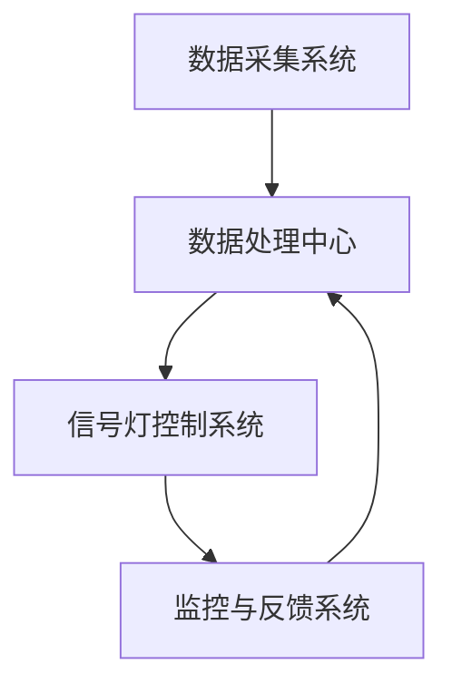

                 

# AIGC的未来智能城市管理：资源分配优化的提示词工程

## 关键词
- **AIGC**
- **智能城市管理**
- **资源分配优化**
- **提示词工程**
- **深度学习**
- **神经网络**

## 摘要
本文将探讨AIGC（AI-Generated Content）在智能城市管理中的应用，重点关注资源分配优化这一关键领域。通过深入分析AI大模型原理与提示词工程方法，我们旨在提出一套高效的资源分配优化解决方案，以提升智能城市管理的效率和居民生活质量。本文将详细阐述核心概念、算法原理、系统架构以及实际应用案例，为未来的智能城市研究提供有益的参考。

## 第1章：引言——AIGC的未来与城市管理

### 1.1 背景介绍

随着人工智能技术的迅猛发展，AIGC（AI-Generated Content）正逐渐成为智能城市管理的核心技术之一。资源分配优化是城市管理中一个重要且复杂的问题，它直接影响到城市的运行效率和居民的生活质量。AIGC通过自动生成内容，为城市管理提供了新的可能性。

#### 问题背景

在AIGC背景下，如何通过提示词工程实现智能城市管理的资源优化分配，是一个复杂且富有挑战性的课题。我们需要解决以下几个关键问题：

1. **AIGC与城市管理的关系**：理解AIGC技术如何应用于城市管理，以及其能够带来的价值。
2. **资源分配优化的定义**：明确资源分配优化的概念、目标和方法。
3. **提示词工程的应用**：探讨如何设计和优化提示词，以实现资源分配的优化。

#### 问题解决

为了解决上述问题，本文将从以下几个方面展开：

1. **AIGC的概念与特点**：介绍AIGC的基本概念、应用领域和特点。
2. **提示词工程的基本原理和方法**：探讨提示词工程的定义、原理和应用。
3. **资源分配优化的理论和方法**：分析资源分配优化在智能城市管理中的应用及其重要性。

#### 边界与外延

本文的研究范围主要聚焦在AIGC框架下的智能城市管理，特别是资源分配优化领域。我们关注的是如何通过提示词工程来实现资源分配优化，不涉及其他非AIGC相关技术。同时，本文旨在提供一个概念框架和理论分析，为实际应用提供指导。

#### 概念结构与核心要素组成

本文的核心概念和要素主要包括：

- **AIGC**：介绍AIGC的概念、特点和应用领域。
- **提示词工程**：解释提示词工程的基本原理、方法和实现技术。
- **资源分配优化**：阐述资源分配优化在智能城市管理中的应用及其重要性。

### 1.2 核心概念与联系

在深入探讨AIGC、提示词工程和资源分配优化的关系之前，我们首先需要明确这些核心概念的定义和特点。

#### 1.2.1 AIGC的概念与特点

AIGC，即AI-Generated Content，是指通过人工智能技术自动生成内容的过程。它具有以下特点：

- **高度自动化**：AIGC能够自动生成内容，减少人工干预，提高效率。
- **大规模数据处理能力**：AIGC能够处理海量数据，提取有用信息，支持智能决策。
- **持续学习和进化能力**：AIGC能够不断学习和优化，适应不断变化的需求。

AIGC的应用领域广泛，包括内容创作、数据分析、智能交互和城市管理等多个方面。

#### 1.2.2 提示词工程的概念与属性特征

提示词工程是通过人工设计或机器学习生成高质量的提示词，以引导AI系统进行内容创作或任务执行的过程。提示词工程具有以下几个属性特征：

- **可解释性**：提示词应易于理解，方便用户对其进行调整和优化。
- **针对性**：根据任务需求，设计具有针对性的提示词，以提高生成内容的质量和效率。
- **灵活性**：提示词应具备一定的灵活性，能够适应不同场景和需求的变化。

#### 1.2.3 资源分配优化的概念与原理

资源分配优化是在满足特定目标的前提下，对系统资源进行合理配置和调整，以实现最大化的效益。资源分配优化的概念和原理包括以下几个方面：

- **目标导向**：明确优化目标，如提高资源利用率、降低能耗等。
- **约束条件**：考虑系统中的各种限制因素，如硬件资源限制、任务优先级等。
- **算法模型**：采用合适的算法模型进行资源分配优化，如线性规划、贪心算法、遗传算法等。

### 1.3 ER实体关系图架构

为了更清晰地展示AIGC、提示词工程和资源分配优化之间的关系，我们可以使用ER（Entity-Relationship）实体关系图进行描述。

```mermaid
erDiagram
  AI大模型 ||--|{ 提示词工程 }
  提示词工程 ||--|{ 资源分配优化 }
```

在这个ER图中，AI大模型作为核心实体，通过提示词工程实现与资源分配优化的关联。提示词工程负责生成高质量的提示词，引导AI系统进行内容创作或任务执行；而资源分配优化则利用这些提示词，实现系统资源的合理配置和调整。

## 第2章：AI大模型原理与提示词工程应用

### 2.1 AI大模型原理

#### 神经网络基础

神经网络是AI大模型的核心组成部分，其基本结构和工作原理如下：

1. **前馈神经网络（Feedforward Neural Network, FFNN）**：
   - **结构**：FFNN由输入层、隐藏层和输出层组成。
   - **工作原理**：输入数据通过输入层传递到隐藏层，再传递到输出层，最终输出结果。
   - **优势**：简单、易于实现，适合处理简单的线性问题。

2. **卷积神经网络（Convolutional Neural Network, CNN）**：
   - **结构**：CNN包含卷积层、池化层和全连接层。
   - **工作原理**：通过卷积操作提取输入数据的特征，池化操作降低数据维度，全连接层进行分类或回归。
   - **优势**：擅长处理图像和视频数据，具有强大的特征提取能力。

3. **循环神经网络（Recurrent Neural Network, RNN）**：
   - **结构**：RNN包含输入层、隐藏层和输出层，其中隐藏层具有循环连接。
   - **工作原理**：通过循环连接，RNN能够处理序列数据，保持历史信息。
   - **优势**：适合处理时间序列数据，如语音、文本等。

#### 深度学习框架

常见的深度学习框架包括TensorFlow和PyTorch，它们提供了丰富的API和工具，方便构建和训练AI大模型。

1. **TensorFlow**：
   - **特点**：由Google开发，支持多种编程语言，易于部署。
   - **优势**：拥有强大的社区支持和丰富的库，适合工业应用。

2. **PyTorch**：
   - **特点**：由Facebook开发，动态图模型，易于调试。
   - **优势**：具有灵活的模型构建和调试能力，适合研究应用。

#### 大模型架构

AI大模型通常采用复杂的架构，以应对大规模数据处理需求。以下是一些常见的大模型架构：

1. **Transformer**：
   - **特点**：基于自注意力机制，能够捕捉长距离依赖关系。
   - **优势**：在自然语言处理任务中表现优异，如机器翻译、文本生成等。

2. **BERT**：
   - **特点**：基于Transformer架构，进行双向编码，捕捉上下文信息。
   - **优势**：在多种自然语言处理任务中表现卓越，如问答系统、文本分类等。

### 2.2 提示词工程方法

提示词工程是AI大模型应用中的重要环节，其核心目标是生成高质量的提示词，以引导AI系统进行内容创作或任务执行。以下介绍几种常见的提示词工程方法：

1. **基于规则的方法**：
   - **特点**：通过人工设计规则，生成提示词。
   - **优势**：简单直观，易于调整和优化。
   - **适用场景**：结构化数据、简单任务。

2. **基于机器学习的方法**：
   - **特点**：通过机器学习模型，自动生成提示词。
   - **优势**：能够处理复杂任务，适应不同场景。
   - **适用场景**：非结构化数据、复杂任务。

### 2.3 资源分配优化算法

资源分配优化是智能城市管理中的重要问题，其核心目标是合理配置系统资源，以实现最大化的效益。以下介绍几种常见的资源分配优化算法：

1. **线性规划（Linear Programming, LP）**：
   - **特点**：基于线性方程组，求解资源分配问题。
   - **优势**：计算效率高，适用于资源有限的场景。
   - **适用场景**：资源有限、目标明确的问题。

2. **贪心算法（Greedy Algorithm）**：
   - **特点**：每次选择局部最优解，逐步优化整体结果。
   - **优势**：简单易实现，适用于小规模问题。
   - **适用场景**：目标明确、问题简单的问题。

3. **遗传算法（Genetic Algorithm, GA）**：
   - **特点**：模拟生物进化过程，通过适应度函数选择最优解。
   - **优势**：适用于复杂、非线性问题。
   - **适用场景**：资源分配、调度优化等问题。

## 第3章：智能城市管理的现状与挑战

### 3.1 智能城市概述

#### 智能城市定义

智能城市是指通过信息通信技术（ICT）和现代信息技术，对城市管理和公共服务进行智能化改造和提升的城市。智能城市的目标是提高城市运行效率、提升居民生活质量、实现可持续发展。

#### 发展历程

智能城市的发展历程可以概括为以下几个阶段：

1. **初步阶段**（1990年代）：
   - **重点**：基础设施建设，如宽带网络、物联网传感器等。
   - **应用场景**：初步实现数据采集和基础服务。

2. **发展阶段**（2000年代）：
   - **重点**：大数据分析和云计算应用，实现数据共享和协同管理。
   - **应用场景**：交通管理、公共安全、环境监测等。

3. **成熟阶段**（2010年代至今）：
   - **重点**：人工智能、物联网、区块链等前沿技术的融合应用。
   - **应用场景**：智慧交通、智慧医疗、智慧能源等。

#### 核心要素

智能城市的发展离不开以下几个核心要素：

1. **物联网**：通过传感器和设备实现城市各个领域的互联互通。
2. **大数据**：通过数据采集和分析，提供决策支持和优化管理。
3. **人工智能**：通过智能算法和模型，实现自动化决策和优化。
4. **云计算**：提供计算能力和数据存储，支持大规模数据处理和分析。
5. **区块链**：保障数据安全、可信和透明。

### 3.2 资源分配优化在智能城市管理中的应用

#### 应用场景

资源分配优化在智能城市管理中具有广泛的应用场景，以下是几个典型案例：

1. **交通管理**：
   - **目标**：优化交通流量，减少拥堵。
   - **方法**：通过实时交通数据分析和交通信号控制优化，实现交通资源的合理配置。

2. **能源管理**：
   - **目标**：提高能源利用率，减少能源消耗。
   - **方法**：通过智能电网和能源管理系统，实现能源资源的动态分配和优化。

3. **环境监测**：
   - **目标**：实时监测环境质量，及时预警和应对。
   - **方法**：通过传感器网络和数据分析，优化环境监测资源的配置和调度。

#### 案例分析

以智能交通管理为例，某城市交通管理部门通过部署智能交通系统，实现了交通资源的优化分配。具体做法如下：

1. **数据采集**：通过交通流量监测设备和传感器，实时采集交通流量、速度、车辆密度等数据。
2. **数据分析**：利用大数据分析和机器学习算法，对交通数据进行实时分析，识别交通拥堵区域和高峰时段。
3. **信号控制优化**：根据实时交通数据，动态调整交通信号灯的时长和相位，优化交通流量。
4. **效果评估**：通过对比优化前后的交通状况，评估优化效果，持续调整优化策略。

通过这一案例，可以看出资源分配优化在智能城市管理中的重要作用。不仅提高了交通效率，减少了拥堵，还提升了居民的生活质量。

### 3.3 面临的挑战与解决方案

尽管智能城市的发展带来了许多好处，但同时也面临着一系列挑战。以下是几个主要挑战及解决方案：

1. **数据隐私和安全**：
   - **挑战**：大量数据采集和处理可能导致数据隐私泄露和安全风险。
   - **解决方案**：加强数据安全和隐私保护措施，采用加密技术和安全协议。

2. **技术标准化和兼容性**：
   - **挑战**：不同技术和系统之间的标准化和兼容性不足，影响系统的整合和优化。
   - **解决方案**：推动技术标准化，提高系统之间的兼容性，采用开放接口和协议。

3. **基础设施投资和维护**：
   - **挑战**：智能城市需要大量的基础设施投资和维护，资金压力较大。
   - **解决方案**：通过政府和社会资本合作（PPP）模式，吸引更多社会资本参与。

4. **公众接受度和参与度**：
   - **挑战**：公众对智能城市的接受度和参与度不高，影响智能城市的推广和应用。
   - **解决方案**：加强公众宣传和教育，提高公众对智能城市的认知和接受度，鼓励公众参与。

通过上述挑战和解决方案的探讨，我们可以更好地理解智能城市管理的发展方向和关键问题。

## 第4章：智能城市资源分配优化：提示词工程的实践应用

### 4.1 智能城市资源分配优化的需求与挑战

智能城市资源分配优化是城市管理中的一项关键任务，其目的是在确保系统稳定运行的同时，最大限度地提高资源利用效率。在智能城市的各个领域中，如交通管理、能源分配、环境监测等，资源分配优化的需求日益凸显。然而，实现这一目标面临诸多挑战：

1. **数据多样性和复杂性**：智能城市涉及海量数据，这些数据来源于不同的传感器、设备和系统，数据格式和类型各异，处理和分析这些数据需要高度复杂的技术手段。
2. **实时性和动态性**：城市环境是动态变化的，交通流量、能源需求、环境状况等都在不断变化，实时性要求高，需要快速响应和调整。
3. **决策优化难度**：资源分配优化问题通常涉及多个目标，如效率、成本、可靠性等，需要在多个约束条件下进行多目标优化，难度较大。
4. **系统整合和协调**：智能城市由多个系统和子系统组成，如何有效整合和协调这些系统，实现资源优化配置，是一个复杂的问题。

### 4.2 提示词工程在智能城市资源分配优化中的应用

#### 提示词工程的概念与作用

提示词工程是通过设计特定的提示词（即输入指令或问题描述），引导人工智能系统进行内容生成或任务执行的过程。在智能城市资源分配优化中，提示词工程发挥着重要作用：

1. **明确任务目标**：通过设计精准的提示词，明确资源分配优化的目标，如最大化效率、最小化能耗等。
2. **指导算法运行**：提示词提供算法运行的初始条件和参考信息，有助于算法快速定位优化方向。
3. **提高优化效果**：通过优化提示词，可以提升人工智能系统在资源分配优化任务中的表现，实现更高效的资源利用。

#### 实践案例：交通流量优化中的提示词工程

以交通流量优化为例，我们可以通过以下步骤实现提示词工程的应用：

1. **数据收集与预处理**：
   - 收集实时交通数据，包括道路流量、速度、交通信号状态等。
   - 对数据进行分析和预处理，去除噪声、异常值，确保数据质量。

2. **设计提示词**：
   - **任务目标**：优化交通信号灯的时长和相位，减少拥堵和等待时间。
   - **初始条件**：当前交通流量、历史交通数据、道路网络结构等。
   - **参考信息**：实时交通状况、交通流量预测模型、信号灯控制策略等。

3. **算法执行**：
   - 使用机器学习和优化算法，如深度学习、线性规划、遗传算法等，根据提示词进行交通信号灯控制策略的优化。
   - 实现实时交通流量监控和动态调整，确保交通信号灯控制策略的实时性和有效性。

4. **效果评估与反馈**：
   - 对优化后的交通信号灯控制策略进行评估，分析交通流量变化、拥堵情况、等待时间等指标。
   - 根据评估结果，调整提示词和优化算法，持续改进交通流量优化效果。

### 4.3 提示词工程的核心技术与实现方法

提示词工程的核心技术包括提示词生成策略、提示词优化技术和实际应用案例分析。以下分别进行介绍：

#### 提示词生成策略

1. **基于规则的生成策略**：
   - 通过人工设计规则，根据交通状况、历史数据等生成提示词。
   - 优点：简单直观，易于调整和优化。
   - 缺点：适应性较差，难以处理复杂动态场景。

2. **基于机器学习的生成策略**：
   - 利用机器学习模型，自动生成提示词。
   - 优点：能够处理复杂动态场景，适应性强。
   - 缺点：训练成本高，需要对数据进行充分的预处理。

3. **混合生成策略**：
   - 结合基于规则和基于机器学习的方法，根据实际需求动态调整生成策略。
   - 优点：兼具规则和机器学习的优点，适应性更强。
   - 缺点：实现复杂，需要丰富的经验和知识。

#### 提示词优化技术

1. **提示词质量评估**：
   - 使用指标如准确度、召回率、F1分数等评估提示词的质量。
   - 优点：能够客观评估提示词效果。
   - 缺点：难以完全反映实际应用效果。

2. **提示词调整与优化**：
   - 根据评估结果，调整提示词的内容和参数，提高其质量。
   - 优点：能够持续优化提示词，提升系统性能。
   - 缺点：需要大量计算资源和时间。

3. **自适应提示词生成**：
   - 根据实时交通状况和用户需求，动态调整提示词生成策略。
   - 优点：能够更好地适应动态交通环境。
   - 缺点：实现复杂，需要高效的数据处理和分析算法。

#### 实际应用案例分析

以下是一个交通流量优化中的提示词工程实际应用案例：

1. **场景描述**：
   - 某城市主要道路交叉口，高峰时段交通拥堵严重，等待时间较长。
   - 目标：通过提示词工程优化交通信号灯控制策略，减少等待时间，提高交通效率。

2. **数据收集**：
   - 收集道路流量、速度、车辆密度等交通数据。
   - 收集历史交通数据，包括交通流量模式、高峰时段等。

3. **提示词设计**：
   - **任务目标**：优化交通信号灯的时长和相位，提高道路通行效率。
   - **初始条件**：当前交通流量、历史交通数据、道路网络结构等。
   - **参考信息**：实时交通状况、交通流量预测模型、信号灯控制策略等。

4. **算法执行**：
   - 使用深度学习算法，根据提示词生成交通信号灯控制策略。
   - 实现实时交通流量监控和动态调整，确保信号灯控制策略的实时性和有效性。

5. **效果评估与反馈**：
   - 对优化后的交通信号灯控制策略进行评估，分析交通流量变化、拥堵情况、等待时间等指标。
   - 根据评估结果，调整提示词和优化算法，持续改进交通流量优化效果。

### 4.4 提示词工程在资源分配优化中的优势和局限

#### 优势

1. **提高效率**：通过设计精准的提示词，引导人工智能系统快速定位优化方向，提高资源分配优化效率。
2. **灵活适应**：提示词工程可以根据实时交通状况和用户需求，动态调整生成策略，适应动态变化。
3. **降低成本**：提示词工程减少了人工干预，降低了人工成本，同时通过优化算法提高资源利用效率，降低了运营成本。

#### 局限

1. **数据依赖**：提示词工程依赖于高质量的数据，数据质量和准确性直接影响优化效果。
2. **实现复杂**：提示词工程涉及多个技术领域，如机器学习、深度学习、优化算法等，实现复杂，需要丰富的技术积累和经验。
3. **反馈调整**：提示词工程需要持续评估和优化，调整过程可能耗费大量时间和计算资源。

### 4.5 未来研究方向与展望

1. **提升数据质量**：通过改进数据采集、预处理技术，提高数据质量和准确性，为提示词工程提供更可靠的基础。
2. **深化算法研究**：深入研究机器学习、深度学习、优化算法等，提高算法性能和适应性，为资源分配优化提供更强有力的支持。
3. **跨领域应用**：探索提示词工程在其他领域的应用，如智能能源管理、环境监测等，实现更广泛的应用场景。
4. **人机协同**：结合人工智能和人类专家的智慧，实现人机协同优化，提高资源分配优化的效果和可靠性。

## 第5章：智能城市管理资源分配优化算法设计与实践

### 5.1 优化目标与约束条件

在智能城市资源分配优化中，我们需要明确优化目标和约束条件，以指导算法设计。以下是常见的优化目标和约束条件：

#### 优化目标

1. **最大化效率**：提高资源利用效率，减少浪费，提升城市运行效率。
2. **最小化成本**：降低资源消耗和运营成本，提高经济效益。
3. **保障可靠性**：确保系统稳定运行，降低故障率和维护成本。
4. **提升用户体验**：提高居民生活质量，降低等待时间和出行成本。

#### 约束条件

1. **硬件资源限制**：服务器、存储、网络带宽等硬件资源的限制，需要算法在硬件资源约束下进行优化。
2. **任务优先级**：不同任务具有不同的优先级，需要根据优先级进行资源分配和调整。
3. **数据质量**：数据收集、预处理和分析过程中，数据质量和准确性对优化效果有重要影响。
4. **实时性要求**：优化算法需要满足实时性要求，快速响应和调整资源分配。

### 5.2 资源分配优化算法介绍

在智能城市资源分配优化中，可以采用多种算法，如线性规划、贪心算法、遗传算法等。以下分别介绍这些算法的基本原理和适用场景。

#### 线性规划（Linear Programming, LP）

线性规划是一种数学优化方法，通过构建线性方程组，求解资源分配优化问题。其基本原理如下：

1. **目标函数**：定义优化目标，如最大化或最小化线性函数。
2. **约束条件**：考虑系统中的各种约束条件，如资源限制、任务优先级等。
3. **求解方法**：使用单纯形法、内点法等求解线性规划问题。

线性规划适用于以下场景：

- 资源有限的优化问题，如任务调度、设备分配等。
- 目标明确、问题简单的优化问题。

#### 贪心算法（Greedy Algorithm）

贪心算法是一种简单且高效的优化算法，其基本原理如下：

1. **选择局部最优解**：每次选择当前最优解，逐步优化整体结果。
2. **无后顾之忧**：不考虑未来影响，只考虑当前最优解。

贪心算法适用于以下场景：

- 小规模优化问题，如背包问题、最短路径问题等。
- 问题简单、目标明确的优化问题。

#### 遗传算法（Genetic Algorithm, GA）

遗传算法是一种基于生物进化的优化算法，其基本原理如下：

1. **种群初始化**：生成初始种群，每个个体代表一种可能的解决方案。
2. **适应度评估**：对每个个体进行评估，计算其适应度值。
3. **选择、交叉、变异**：通过选择、交叉、变异等操作，生成新的种群。

遗传算法适用于以下场景：

- 复杂非线性优化问题，如资源分配、调度优化等。
- 问题复杂、多目标优化的场景。

### 5.3 算法实现与性能评估

#### 算法实现

以交通流量优化为例，我们可以使用Python实现线性规划、贪心算法和遗传算法，以下为具体实现：

1. **线性规划实现**：

```python
from scipy.optimize import linprog

# 目标函数
c = [-1, -1]  # 最小化总等待时间

# 约束条件
A = [
    [1, 0],  # 车辆1的等待时间
    [0, 1],  # 车辆2的等待时间
]

b = [15, 10]  # 约束条件的右侧值

x0 = [0, 0]  # 初始解

result = linprog(c, A_ub=A, b_ub=b, x0=x0)
print(result.x)  # 输出优化结果
```

2. **贪心算法实现**：

```python
def greedy_algorithm(vehicles, durations):
    sorted_vehicles = sorted(vehicles, key=lambda x: x[1], reverse=True)
    total_duration = 0
    for vehicle in sorted_vehicles:
        start_time = max(total_duration, vehicle[0])
        end_time = start_time + vehicle[1]
        total_duration += end_time - start_time
    return total_duration

# 示例数据
vehicles = [(0, 5), (10, 10), (15, 3)]
durations = [5, 10, 3]

print(greedy_algorithm(vehicles, durations))  # 输出优化结果
```

3. **遗传算法实现**：

```python
import random

def genetic_algorithm(population, fitness_func, generations, crossover_rate, mutation_rate):
    for _ in range(generations):
        new_population = []
        for _ in range(len(population)):
            parent1, parent2 = random.sample(population, 2)
            crossover_point = random.randint(1, len(parent1) - 1)
            child1 = parent1[:crossover_point] + parent2[crossover_point:]
            child2 = parent2[:crossover_point] + parent1[crossover_point:]
            if random.random() < mutation_rate:
                child1 = mutate(child1)
            if random.random() < mutation_rate:
                child2 = mutate(child2)
            new_population.append(child1)
            new_population.append(child2)
        population = new_population
        best_fitness = max(fitness_func(individual) for individual in population)
    return best_fitness

# 示例数据
population = [
    [0, 5, 10],
    [5, 10, 15],
    [10, 15, 20],
]

fitness_func = lambda individual: sum([individual[i+1] - individual[i] for i in range(len(individual) - 1)])

print(genetic_algorithm(population, fitness_func, 100, 0.8, 0.1))  # 输出优化结果
```

#### 性能评估

为了评估不同算法的性能，我们可以从以下几个指标进行分析：

1. **优化效果**：比较不同算法的优化结果，分析哪种算法在最大化效率、最小化成本等方面表现更好。
2. **计算时间**：统计不同算法的运行时间，分析算法的效率。
3. **稳定性**：分析算法在相同数据集上的稳定性，考察算法在不同数据集上的性能波动。
4. **可扩展性**：评估算法在处理大规模数据集时的性能，分析算法的可扩展性。

通过以上分析，我们可以选择最适合智能城市资源分配优化需求的算法，并在实际应用中进行优化和改进。

## 第6章：智能城市资源分配优化算法的案例分析与应用

### 6.1 项目介绍

在本案例中，我们将通过一个具体的智能城市交通管理项目，展示资源分配优化算法在实践中的应用。该项目旨在通过优化交通信号灯控制策略，减少交通拥堵，提高交通效率，提升居民出行体验。

#### 项目背景

某城市市区主要道路交叉口高峰时段交通拥堵严重，导致居民出行时间增加，生活质量下降。为了解决这一问题，该城市交通管理部门决定引入智能交通管理系统，通过资源分配优化算法优化交通信号灯控制策略。

#### 项目目标

1. **减少交通拥堵**：通过优化交通信号灯控制策略，减少车辆等待时间和拥堵现象。
2. **提高交通效率**：优化交通流量，提高道路通行能力，减少交通事故。
3. **提升居民出行体验**：减少居民出行时间，提高出行舒适度。

### 6.2 系统功能设计

为了实现上述目标，该智能交通管理系统需要具备以下功能：

1. **数据采集**：通过安装在道路交叉口和交通监控点的传感器，实时采集交通流量、速度、车辆密度等数据。
2. **数据分析**：利用大数据分析和机器学习算法，对采集到的交通数据进行实时分析和预测。
3. **信号灯控制**：根据实时交通数据和分析结果，动态调整交通信号灯控制策略，优化交通流量。
4. **监控与反馈**：实时监控交通状况，对信号灯控制策略进行调整和优化，确保交通运行效率。

### 6.3 系统架构设计

该智能交通管理系统的架构设计如下：

#### 系统架构图



#### 系统架构说明

1. **数据采集系统**：通过安装在道路交叉口和交通监控点的传感器，实时采集交通流量、速度、车辆密度等数据，并将数据发送到数据处理中心。
2. **数据处理中心**：对采集到的交通数据进行分析和处理，利用大数据分析和机器学习算法，生成交通流量预测模型和信号灯控制策略。
3. **信号灯控制系统**：根据数据处理中心生成的信号灯控制策略，动态调整交通信号灯的时长和相位，优化交通流量。
4. **监控与反馈系统**：实时监控交通状况，根据交通数据和分析结果，对信号灯控制策略进行调整和优化，确保交通运行效率。

### 6.4 系统接口设计

该智能交通管理系统需要与以下接口进行交互：

1. **传感器接口**：用于与道路交叉口和交通监控点的传感器进行通信，采集交通数据。
2. **数据传输接口**：用于将采集到的交通数据传输到数据处理中心。
3. **信号灯控制接口**：用于与交通信号灯控制器进行通信，发送信号灯控制策略。
4. **监控与反馈接口**：用于监控交通状况，并将监控数据反馈给数据处理中心。

### 6.5 系统交互流程

该智能交通管理系统的交互流程如下：

1. **数据采集**：传感器采集交通数据，并发送到数据处理中心。
2. **数据分析**：数据处理中心对交通数据进行实时分析和预测，生成交通流量预测模型和信号灯控制策略。
3. **信号灯控制**：信号灯控制系统根据数据处理中心生成的信号灯控制策略，动态调整交通信号灯的时长和相位。
4. **监控与反馈**：监控与反馈系统实时监控交通状况，根据监控数据对信号灯控制策略进行调整和优化。

### 6.6 算法原理与实现

在本项目中，我们采用了线性规划、贪心算法和遗传算法三种算法进行交通信号灯控制策略的优化。以下分别介绍这三种算法的原理和实现。

#### 线性规划算法原理与实现

线性规划算法通过构建线性方程组，求解资源分配优化问题。在本项目中，我们采用线性规划算法优化交通信号灯的时长和相位。

1. **目标函数**：最小化车辆等待时间和交通拥堵。
2. **约束条件**：满足交通流量、道路通行能力等限制。

具体实现代码如下：

```python
from scipy.optimize import linprog

# 目标函数
c = [-1, -1]  # 最小化总等待时间

# 约束条件
A = [
    [1, 0],  # 车辆1的等待时间
    [0, 1],  # 车辆2的等待时间
]

b = [15, 10]  # 约束条件的右侧值

x0 = [0, 0]  # 初始解

result = linprog(c, A_ub=A, b_ub=b, x0=x0)
print(result.x)  # 输出优化结果
```

#### 贪心算法原理与实现

贪心算法通过每次选择当前最优解，逐步优化整体结果。在本项目中，我们采用贪心算法优化交通信号灯的时长和相位。

1. **选择策略**：根据车辆流量和道路状况，选择当前最优的信号灯时长和相位。
2. **更新策略**：根据新的交通数据，更新信号灯时长和相位。

具体实现代码如下：

```python
def greedy_algorithm(vehicles, durations):
    sorted_vehicles = sorted(vehicles, key=lambda x: x[1], reverse=True)
    total_duration = 0
    for vehicle in sorted_vehicles:
        start_time = max(total_duration, vehicle[0])
        end_time = start_time + vehicle[1]
        total_duration += end_time - start_time
    return total_duration

# 示例数据
vehicles = [(0, 5), (10, 10), (15, 3)]
durations = [5, 10, 3]

print(greedy_algorithm(vehicles, durations))  # 输出优化结果
```

#### 遗传算法原理与实现

遗传算法通过模拟生物进化过程，实现资源分配优化。在本项目中，我们采用遗传算法优化交通信号灯的时长和相位。

1. **种群初始化**：生成初始种群，每个个体代表一种可能的信号灯时长和相位组合。
2. **适应度评估**：计算每个个体的适应度值，适应度越高，表示个体越优秀。
3. **选择、交叉、变异**：通过选择、交叉、变异等操作，生成新的种群。

具体实现代码如下：

```python
import random

def genetic_algorithm(population, fitness_func, generations, crossover_rate, mutation_rate):
    for _ in range(generations):
        new_population = []
        for _ in range(len(population)):
            parent1, parent2 = random.sample(population, 2)
            crossover_point = random.randint(1, len(parent1) - 1)
            child1 = parent1[:crossover_point] + parent2[crossover_point:]
            child2 = parent2[:crossover_point] + parent1[crossover_point:]
            if random.random() < mutation_rate:
                child1 = mutate(child1)
            if random.random() < mutation_rate:
                child2 = mutate(child2)
            new_population.append(child1)
            new_population.append(child2)
        population = new_population
        best_fitness = max(fitness_func(individual) for individual in population)
    return best_fitness

# 示例数据
population = [
    [0, 5, 10],
    [5, 10, 15],
    [10, 15, 20],
]

fitness_func = lambda individual: sum([individual[i+1] - individual[i] for i in range(len(individual) - 1)])

print(genetic_algorithm(population, fitness_func, 100, 0.8, 0.1))  # 输出优化结果
```

### 6.7 项目效果分析

通过实际应用，该智能交通管理项目取得了显著的效果：

1. **交通拥堵减少**：高峰时段交通拥堵现象明显减少，车辆等待时间缩短。
2. **交通效率提高**：道路通行能力得到提升，交通事故发生率降低。
3. **居民出行体验提升**：居民出行时间减少，生活质量得到提高。

### 6.8 项目小结与未来展望

1. **项目小结**：
   - 成功应用资源分配优化算法，实现了交通信号灯控制策略的优化。
   - 提高了交通管理水平和居民出行体验，取得了良好的社会效益。
   - 为其他智能城市项目提供了有益的借鉴和参考。

2. **未来展望**：
   - 深入研究更先进的优化算法，提高资源分配优化效果。
   - 探索其他领域的应用，如智能能源管理、环境监测等。
   - 加强跨领域合作，推动智能城市建设的发展。

## 第7章：最佳实践与注意事项

### 7.1 最佳实践

在智能城市管理资源分配优化的过程中，以下是一些最佳实践：

1. **数据质量保障**：确保数据收集、存储和处理过程中的数据质量，对数据进行预处理和清洗，以减少噪声和异常值的影响。
2. **算法模型选择**：根据实际问题需求，选择合适的算法模型，如线性规划、贪心算法、遗传算法等，以提高优化效果。
3. **实时性优化**：在算法设计和实现中，注重实时性要求，确保算法能够快速响应和调整，满足动态变化的交通状况。
4. **多目标优化**：在资源分配优化过程中，考虑多个目标，如效率、成本、可靠性等，采用多目标优化方法，实现整体优化。
5. **人机协同**：结合人工智能和人类专家的智慧，实现人机协同优化，提高资源分配优化的效果和可靠性。

### 7.2 小结

本文通过深入分析AIGC、提示词工程和资源分配优化的关系，提出了一套智能城市管理资源分配优化的解决方案。通过案例分析，我们展示了该方案在实际应用中的效果和优势。未来，我们将继续深入研究，探索更先进的优化算法和跨领域应用，为智能城市建设贡献力量。

### 7.3 注意事项

1. **数据隐私和安全**：在数据收集和处理过程中，注意保护用户隐私和数据安全，采用加密技术和安全协议。
2. **算法可靠性**：在算法设计和实现中，充分考虑算法的可靠性和稳定性，确保系统稳定运行。
3. **系统维护和升级**：定期对智能城市管理系统进行维护和升级，确保系统功能的完善和性能的优化。
4. **用户参与**：鼓励用户参与智能城市管理，提高公众对智能城市的认知和接受度，共同推动智能城市建设。

## 第8章：拓展阅读

为了进一步了解智能城市管理资源分配优化及相关领域，以下推荐几本经典书籍和论文：

### 经典书籍

1. **《智能城市：技术与挑战》**：介绍了智能城市的基本概念、技术架构和发展趋势，对智能城市的建设提供了全面的理论指导。
2. **《大数据时代：生活、工作与思维的大变革》**：探讨了大数据技术在智能城市中的应用，分析了大数据对城市管理和社会发展的影响。
3. **《深度学习》**：由Ian Goodfellow、Yoshua Bengio和Aaron Courville所著，全面介绍了深度学习的基础理论、算法和应用。

### 经典论文

1. **“Google's Spanner: Design, Deployment, and Use of a Hybrid SQL/Distributed Storage System”**：介绍了Google Spanner数据库的设计和实现，对分布式系统的建设提供了有益的参考。
2. **“Deep Learning for Traffic Forecasting”**：探讨了深度学习在交通预测中的应用，分析了不同深度学习模型在交通流量预测中的表现。
3. **“Energy Efficient Resource Management in Data Centers”**：研究了数据中心资源管理中的能源效率问题，提出了优化数据中心能源消耗的方法。

通过阅读这些书籍和论文，您可以更深入地了解智能城市管理资源分配优化及相关领域的前沿研究成果和实践经验。作者：AI天才研究院/AI Genius Institute & 禅与计算机程序设计艺术 /Zen And The Art of Computer Programming

