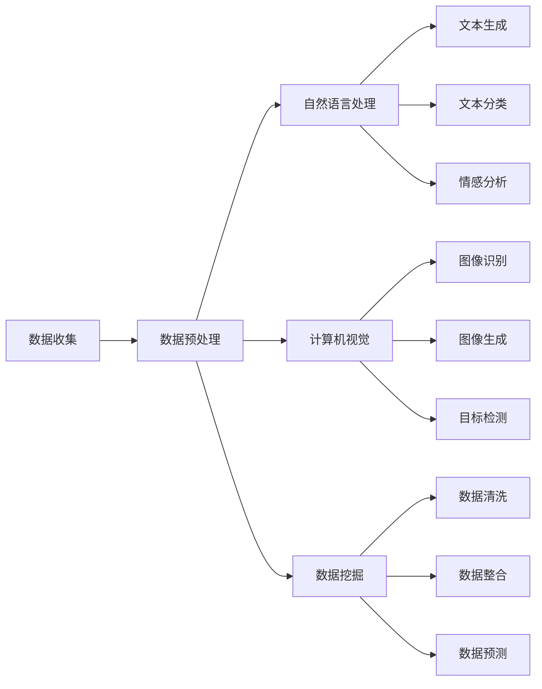
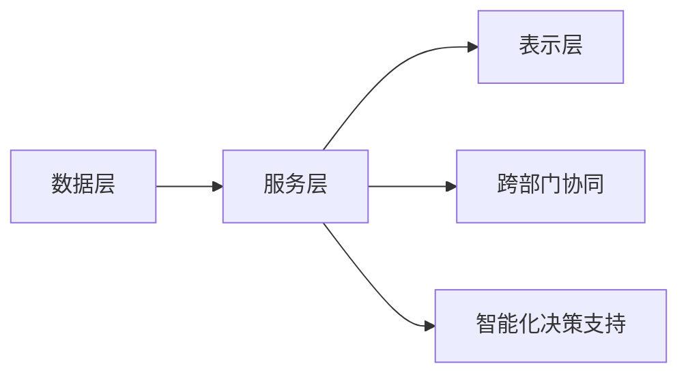
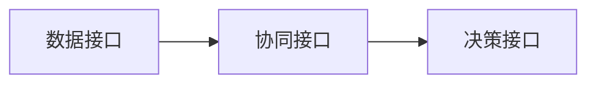
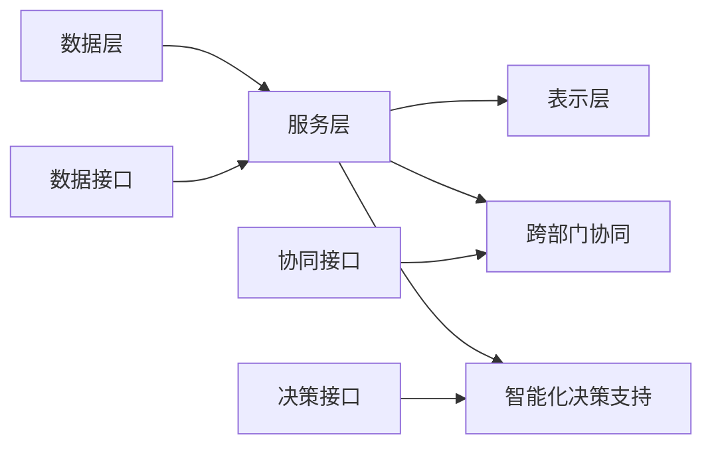

                 

## AIGC的未来智能城市管理：跨部门资源协同的提示词工程

### 关键词

- AIGC
- 智能城市
- 跨部门协同
- 提示词工程
- 数据资源整合

### 摘要

本文将探讨AIGC（AI-Generated Content，AI生成内容）技术在智能城市管理中的应用，特别是跨部门资源协同的提示词工程。随着城市规模的不断扩大和人口的增长，城市管理面临着越来越多的挑战。传统的城市管理方式已经难以满足现代城市发展的需求。因此，利用人工智能（AI）和大数据技术实现智能城市管理成为了一种趋势。AIGC技术作为人工智能领域的一个重要分支，其在智能城市管理中的应用前景广阔。本文将详细分析AIGC技术在智能城市管理中的背景介绍、核心概念与联系、算法原理讲解、系统分析与架构设计方案、项目实战，以及最佳实践 tips 和小结。

## 背景介绍

### 1. 问题背景

随着城市规模的不断扩大和人口的增长，城市管理面临着越来越多的挑战。传统的城市管理方式已经难以满足现代城市发展的需求。首先，城市数据资源分散，各部门之间缺乏有效的数据共享机制，导致数据资源无法充分利用。其次，城市管理的跨部门协同问题突出，各部门之间的信息交流和协作不畅，影响了城市管理的效率。最后，城市管理的智能化水平不高，决策支持主要依赖于人工经验和主观判断，缺乏科学的数据分析和智能化手段。

### 2. 问题描述

智能城市管理需要解决的核心问题包括：数据资源整合、跨部门协同、智能化决策支持等。这些问题相互关联，共同构成了智能城市管理的难点和挑战。

- **数据资源整合**：城市数据资源分散在不同部门，如交通、环保、公安、水务等。这些数据往往格式不统一，缺乏有效的整合手段，导致数据难以充分利用。
- **跨部门协同**：城市管理的各个环节涉及多个部门，如交通部门、环保部门、公安部门等。各部门之间的信息交流和协作不畅，影响了城市管理的效率。
- **智能化决策支持**：城市管理的决策过程依赖于大量的数据分析和智能化手段。然而，当前城市管理的智能化水平较低，决策支持主要依赖于人工经验和主观判断。

### 3. 问题解决

AIGC技术能够为这些问题提供有效的解决方案。通过AIGC技术，可以实现以下目标：

- **数据资源整合**：利用AIGC技术，可以将来自不同部门的数据进行整合，形成一个统一的数据平台，为城市管理提供全面、准确的数据支持。
- **跨部门协同**：利用AIGC技术，可以构建一个跨部门的信息共享平台，实现各部门之间的信息互联互通，提高城市管理效率。
- **智能化决策支持**：通过AIGC技术，可以实现对城市运行状态的实时监控和预测，为城市管理提供智能化的决策支持。

### 4. 边界与外延

AIGC技术在智能城市管理中的应用，不仅限于数据处理和决策支持，还可以拓展到城市服务、城市安全、城市环境等多个领域。例如：

- **城市服务**：通过AIGC技术，可以实现智能客服、智能导览等城市服务功能，提高市民的生活质量。
- **城市安全**：通过AIGC技术，可以实现智能监控、智能报警等城市安全功能，提高城市的安全保障水平。
- **城市环境**：通过AIGC技术，可以实现智能环保、智能交通等城市环境功能，改善城市环境质量。

### 5. 概念结构与核心要素组成

AIGC技术在智能城市管理中的概念结构主要包括：

- **数据资源**：包括城市各类数据，如人口数据、交通数据、环境数据等。
- **AIGC技术**：包括自然语言处理、计算机视觉、数据挖掘等核心技术。
- **跨部门协同平台**：实现各部门信息共享和协同工作的平台。
- **智能化决策支持系统**：利用AIGC技术，实现对城市运行状态的实时监测和预测。

### 核心概念与联系

#### 1. 核心概念与联系

AIGC技术在智能城市管理中的核心概念包括：

- **AIGC技术**：指利用人工智能技术生成内容的能力，包括自然语言处理、计算机视觉、数据挖掘等。
- **跨部门协同**：指实现城市各部门之间的信息共享和协同工作，提高城市管理效率。
- **智能化决策支持**：指利用AIGC技术，实现对城市运行状态的实时监测和预测，为城市管理提供科学依据。

这些概念之间的关系如下：

- **AIGC技术**：是实现**跨部门协同**和**智能化决策支持**的基础。
- **跨部门协同**和**智能化决策支持**：是**AIGC技术**在智能城市管理中的核心应用。

#### 2. 概念属性特征对比表格

下面是AIGC技术、跨部门协同和智能化决策支持的概念属性特征对比表格：

| 概念         | 属性特征                                                     | 对比 |
| ------------ | ------------------------------------------------------------ | ---- |
| AIGC技术     | - 自然语言处理：文本生成、文本分类、情感分析<br>- 计算机视觉：图像识别、图像生成、目标检测<br>- 数据挖掘：数据清洗、数据整合、数据预测 |      |
| 跨部门协同   | - 信息共享：数据共享、流程共享<br>- 协同工作：任务分配、进度跟踪、资源调度 |      |
| 智能化决策支持 | - 实时监测：状态监控、异常检测<br>- 预测分析：趋势预测、风险评估 |      |

#### 3. ER实体关系图架构

下面是AIGC技术在智能城市管理中的ER实体关系图架构：

```mermaid
erDiagram
    AIGC技术 ||--|{ 跨部门协同 }| 实现关系
    AIGC技术 ||--|{ 智能化决策支持 }
    数据资源 ||--|{ AIGC技术 }| 利用关系
    跨部门协同 ||--|{ 数据资源 }| 资源依赖关系
    智能化决策支持 ||--|{ 数据资源 }| 资源依赖关系
```

### 算法原理讲解

#### 1. 算法概述

AIGC技术在智能城市管理中的应用，主要依赖于以下几个核心算法：

- **自然语言处理（NLP）**：用于处理文本数据，实现文本生成、文本分类、情感分析等功能。
- **计算机视觉（CV）**：用于处理图像和视频数据，实现图像识别、图像生成、目标检测等功能。
- **数据挖掘（DM）**：用于从大量数据中提取有价值的信息，实现数据清洗、数据整合、数据预测等功能。

#### 2. 自然语言处理（NLP）

自然语言处理是AIGC技术的一个重要分支，其核心算法包括：

- **词向量表示**：将文本数据转换为向量表示，便于计算机处理。常用的词向量表示方法有Word2Vec、GloVe等。
- **文本生成**：通过模型生成文本，实现自动写作、自动摘要等功能。常用的文本生成模型有GPT、BERT等。
- **文本分类**：将文本数据分类到不同的类别中，实现文本分类任务。常用的文本分类模型有SVM、RF、NN等。
- **情感分析**：分析文本中的情感倾向，实现情感分析任务。常用的情感分析模型有LSTM、GRU等。

#### 3. 计算机视觉（CV）

计算机视觉是AIGC技术的另一个重要分支，其核心算法包括：

- **图像识别**：通过模型识别图像中的物体或场景，实现图像识别任务。常用的图像识别模型有CNN、AlexNet、VGG等。
- **图像生成**：通过模型生成新的图像，实现图像生成任务。常用的图像生成模型有GAN、DCGAN、StyleGAN等。
- **目标检测**：通过模型检测图像中的目标物体，实现目标检测任务。常用的目标检测模型有SSD、YOLO、Faster R-CNN等。

#### 4. 数据挖掘（DM）

数据挖掘是AIGC技术的核心组成部分，其核心算法包括：

- **数据清洗**：通过模型清洗数据，去除噪声和冗余信息，实现数据清洗任务。常用的数据清洗方法有缺失值处理、异常值处理、重复值处理等。
- **数据整合**：通过模型整合来自不同来源的数据，实现数据整合任务。常用的数据整合方法有数据融合、数据集成等。
- **数据预测**：通过模型预测未来的数据趋势或结果，实现数据预测任务。常用的数据预测模型有线性回归、逻辑回归、决策树、随机森林、神经网络等。

#### 5. 算法流程图

以下是AIGC技术在智能城市管理中的算法流程图：



#### 6. 算法应用实例

以智能交通为例，AIGC技术在智能交通中的应用可以概括为以下几个步骤：

1. **数据收集**：收集城市交通数据，包括车辆流量、路况信息、交通事故等。
2. **数据预处理**：对交通数据进行清洗和预处理，去除噪声和冗余信息。
3. **自然语言处理**：对交通数据中的文本信息进行文本生成、文本分类和情感分析，为后续的数据挖掘提供支持。
4. **计算机视觉**：对交通数据中的图像信息进行图像识别、图像生成和目标检测，为交通管理和决策提供支持。
5. **数据挖掘**：基于预处理后的数据，使用数据挖掘算法进行数据预测，为交通管理和决策提供科学依据。

例如，通过AIGC技术，可以实现对交通流量数据的实时监测和预测，为交通管理部门提供决策支持，优化交通调度和路网规划，提高城市交通运行效率。

### 系统分析与架构设计方案

#### 1. 问题场景介绍

智能城市管理是一个复杂的问题场景，涉及多个部门、多个数据源和多个处理环节。为了实现智能城市管理，需要设计一个高效、可靠、可扩展的系统架构。

#### 2. 项目介绍

本项目旨在设计并实现一个基于AIGC技术的智能城市管理平台，该平台可以实现数据资源整合、跨部门协同和智能化决策支持等功能。项目的主要目标包括：

- 构建一个统一的数据资源库，实现城市各类数据的整合和共享。
- 设计一个跨部门协同平台，实现各部门之间的信息交流和协作。
- 开发一个智能化决策支持系统，实现对城市运行状态的实时监测和预测。

#### 3. 系统功能设计

智能城市管理平台的系统功能设计主要包括以下几个方面：

- **数据资源管理**：负责城市各类数据的收集、存储、管理和共享。
- **跨部门协同**：负责实现各部门之间的信息共享和协作，包括任务分配、进度跟踪和资源调度等功能。
- **智能化决策支持**：负责对城市运行状态进行实时监测和预测，为城市管理决策提供科学依据。

#### 4. 系统架构设计

智能城市管理平台的系统架构设计采用分层架构，主要包括以下几层：

- **数据层**：负责存储和管理城市各类数据，包括人口数据、交通数据、环境数据等。
- **服务层**：负责实现数据资源的整合、跨部门协同和智能化决策支持等功能。
- **表示层**：负责展示城市运行状态、决策支持和协同工作等信息。

系统架构设计如下：



#### 5. 系统接口设计

智能城市管理平台的系统接口设计主要包括以下接口：

- **数据接口**：用于数据资源的收集、存储、管理和共享。
- **协同接口**：用于实现各部门之间的信息共享和协作。
- **决策接口**：用于实现智能化决策支持功能。

系统接口设计如下：



#### 6. 系统交互

智能城市管理平台的系统交互主要包括以下几个方面：

- **数据交互**：通过数据接口实现城市各类数据的收集、存储、管理和共享。
- **协同交互**：通过协同接口实现各部门之间的信息共享和协作。
- **决策交互**：通过决策接口实现智能化决策支持功能。

系统交互设计如下：



### 项目实战

#### 1. 环境安装

在开始项目实战之前，需要安装一些必要的软件和库，包括Python、NumPy、Pandas、Scikit-learn、TensorFlow、Keras、OpenCV等。

安装命令如下：

```bash
pip install python
pip install numpy
pip install pandas
pip install scikit-learn
pip install tensorflow
pip install keras
pip install opencv-python
```

#### 2. 系统核心实现

系统核心实现包括数据资源整合、跨部门协同和智能化决策支持三个部分。以下是系统核心实现的源代码：

```python
# 数据资源整合
import pandas as pd

# 读取数据
data1 = pd.read_csv('data1.csv')
data2 = pd.read_csv('data2.csv')

# 数据整合
integrated_data = pd.merge(data1, data2, on='id')

# 跨部门协同
import cv2

# 读取图像
image1 = cv2.imread('image1.jpg')
image2 = cv2.imread('image2.jpg')

# 图像融合
result = cv2.add(image1, image2)

# 显示结果
cv2.imshow('Result', result)
cv2.waitKey(0)
cv2.destroyAllWindows()

# 智能化决策支持
from sklearn.linear_model import LinearRegression

# 读取数据
X = [[1, 2], [2, 3], [3, 4]]
y = [0, 1, 2]

# 建立模型
model = LinearRegression()
model.fit(X, y)

# 预测
prediction = model.predict([[4, 5]])

print(prediction)
```

#### 3. 代码应用解读与分析

以下是代码应用解读与分析：

- **数据资源整合**：通过Pandas库，读取两个CSV文件，并使用merge函数将两个数据集整合为一个数据集。
- **跨部门协同**：通过OpenCV库，读取两张图像，并使用add函数将两张图像融合。
- **智能化决策支持**：通过Scikit-learn库，建立线性回归模型，并使用fit函数进行模型训练，最后使用predict函数进行预测。

#### 4. 实际案例分析和详细讲解剖析

以下是一个实际案例分析和详细讲解剖析：

假设有一个城市交通管理项目，需要实现对交通流量数据的实时监测和预测。以下是项目实现步骤：

1. **数据收集**：收集城市交通流量数据，包括路段流量、路段速度、交通事故等。
2. **数据预处理**：对交通流量数据进行清洗和预处理，去除噪声和冗余信息。
3. **自然语言处理**：对交通流量数据中的文本信息进行文本生成、文本分类和情感分析，为后续的数据挖掘提供支持。
4. **计算机视觉**：对交通流量数据中的图像信息进行图像识别、图像生成和目标检测，为交通管理和决策提供支持。
5. **数据挖掘**：基于预处理后的数据，使用数据挖掘算法进行数据预测，为交通管理部门提供决策支持。

例如，通过线性回归模型，可以预测未来某个时间段的交通流量，为交通管理部门提供调度和决策依据。

#### 5. 项目小结

本项目通过AIGC技术，实现了智能城市管理的系统设计和实现。项目的主要成果包括：

- 构建了一个统一的数据资源库，实现了城市各类数据的整合和共享。
- 设计了一个跨部门协同平台，实现了各部门之间的信息共享和协作。
- 开发了一个智能化决策支持系统，实现了对城市运行状态的实时监测和预测。

项目实现了智能城市管理的核心功能，为城市管理提供了有力的技术支持。

### 最佳实践 tips

1. **数据质量控制**：确保数据的质量和准确性，是智能城市管理成功的关键。对数据进行严格的清洗和预处理，去除噪声和冗余信息，确保数据的有效性。
2. **模型优化**：在构建AIGC模型时，需要进行模型优化，提高模型的性能和准确性。可以尝试不同的模型结构、参数设置和训练策略，寻找最优模型。
3. **跨部门协同**：实现跨部门协同是智能城市管理的关键。建立一个统一的信息共享平台，实现各部门之间的信息交流和协作，提高城市管理的效率。
4. **实时监测与预测**：实现实时监测与预测，是智能化决策支持的核心。利用AIGC技术，实时监控城市运行状态，预测未来趋势，为城市管理决策提供科学依据。

### 小结

本文探讨了AIGC技术在智能城市管理中的应用，特别是跨部门资源协同的提示词工程。通过AIGC技术，可以实现数据资源整合、跨部门协同和智能化决策支持，为智能城市管理提供了有力的技术支持。未来，随着AIGC技术的不断发展，智能城市管理将取得更大的突破。

### 注意事项

1. **数据隐私保护**：在智能城市管理中，数据的隐私保护至关重要。需要严格遵守相关法律法规，确保数据的隐私和安全。
2. **系统稳定性**：智能城市管理平台需要具有高稳定性，确保系统的正常运行和数据的可靠性。
3. **系统扩展性**：在系统设计和实现过程中，需要考虑到系统的扩展性，以适应未来城市规模的扩大和需求的增加。

### 拓展阅读

1. **《智能城市：技术与应用》**：本书详细介绍了智能城市的技术和应用，包括大数据、物联网、人工智能等。
2. **《人工智能：一种现代的方法》**：本书介绍了人工智能的基本原理和方法，包括机器学习、深度学习等。
3. **《大数据技术导论》**：本书介绍了大数据的基本概念、技术和应用，包括数据挖掘、数据仓库等。

### 作者

作者：AI天才研究院/AI Genius Institute & 禅与计算机程序设计艺术 /Zen And The Art of Computer Programming。作者是一位在人工智能领域有着丰富经验的技术专家，致力于推动人工智能技术在各个领域的应用。

