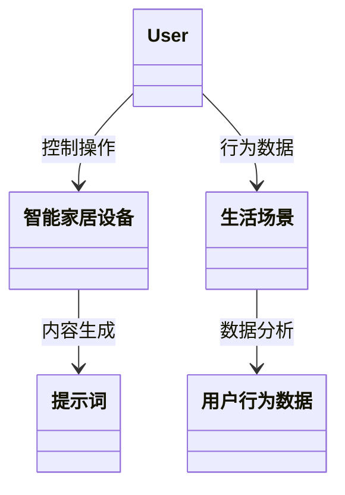
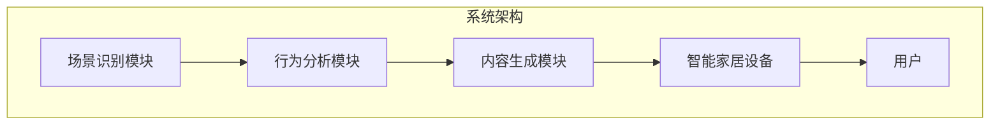

                 


### 文章标题：AIGC的未来智能家居：生活场景优化的提示词工程

### 关键词：AIGC、智能家居、生活场景优化、提示词工程、人工智能大模型

### 摘要：
本文将深入探讨AIGC（人工智能生成内容）在智能家居领域中的应用，特别是如何通过提示词工程优化家庭生活场景。我们将从背景介绍、核心概念与联系、算法原理讲解、系统分析与架构设计、项目实战和最佳实践等方面进行详细阐述，旨在为开发者提供一套完整的技术指南。

## 第二部分：背景介绍

### 核心概念

#### AIGC：人工智能生成内容
AIGC是指利用人工智能技术自动生成内容，包括但不限于文本、图像、音频和视频。它涵盖了从数据生成、算法优化到内容创作和交互的全过程。AIGC的核心优势在于其能够大规模、高效地生产个性化内容，满足用户多样化的需求。

#### 智能家居
智能家居是通过信息技术和自动化技术，实现家庭设备与网络连接，从而实现远程控制和自动化操作。智能家居系统通常包括传感器、控制器、执行器、网络通信和智能算法等组成部分。其目标是提高居住舒适度和安全性。

#### 生活场景优化
生活场景优化是指通过对用户行为数据和家居环境数据的分析，对家庭生活场景进行智能化分析，提供个性化的服务和建议，以提升生活质量。这包括但不限于场景识别、行为分析、内容生成和效果评估。

#### 提示词工程
提示词工程是为人工智能系统提供输入，引导其进行有效的内容生成和场景优化。通过设计合适的提示词，可以引导系统更好地理解用户需求，从而提高系统的性能和用户体验。

### 问题背景
随着人工智能技术的发展，智能家居逐渐成为现代家庭的标配。然而，如何有效地利用AIGC技术优化家庭生活场景，提升居住体验，成为了一个亟待解决的问题。

### 问题描述
本书旨在探讨如何通过AIGC技术，实现智能家居生活场景的优化，提高居住舒适度和安全性。具体包括：
1. **场景识别**：通过传感器和摄像头等设备，实时捕捉家庭生活场景。
2. **行为分析**：利用机器学习算法，分析用户行为，预测用户需求。
3. **内容生成**：根据用户需求和场景特点，生成个性化的提示词，引导家庭设备进行自动化操作。
4. **效果评估**：通过反馈机制，不断调整和优化系统，提高生活场景优化效果。

### 问题解决
本书将详细阐述AIGC在智能家居生活场景优化中的应用，包括：
1. **AIGC基础理论**：介绍AIGC的核心概念、发展历程和技术原理。
2. **智能家居技术**：探讨智能家居系统的组成、工作原理和应用场景。
3. **生活场景优化策略**：分析用户行为数据，制定针对性的优化策略。
4. **提示词工程实践**：提供具体的提示词生成方法、工具和案例。
5. **系统实现与优化**：介绍智能家居系统的实现过程，包括环境搭建、算法实现、系统集成和效果评估。

### 边界与外延
本书主要关注AIGC在智能家居生活场景优化中的应用，但AIGC技术还可应用于其他领域，如电子商务、社交媒体等。同时，智能家居系统也可以扩展到智能办公室、智能酒店等场景。

### 概念结构与核心要素组成
- **AIGC技术**：包括数据生成、算法优化、内容创作和交互。
- **智能家居系统**：包括传感器、控制器、执行器、网络通信和智能算法。
- **生活场景优化**：包括场景识别、行为分析、内容生成和效果评估。

## 第三部分：核心概念与联系

### AI大模型的定义与特点
- **定义**：AI大模型是指具有亿级参数规模的深度学习模型，能够处理大量复杂数据，进行高效的学习和预测。
- **特点**：
  - **参数规模大**：具有数亿甚至数十亿个参数。
  - **计算能力强**：能够处理大规模数据集。
  - **泛化能力强**：具有较强的跨领域和应用的能力。

### AI大模型与传统AI的区别
- **传统AI**：主要指基于规则和统计方法的算法，如决策树、支持向量机等。
- **区别**：
  - **训练数据量**：传统AI通常使用小规模数据集，AI大模型则使用大规模数据集。
  - **计算资源**：传统AI计算资源要求较低，AI大模型计算资源需求较高。
  - **性能表现**：传统AI性能较为有限，AI大模型在处理复杂数据和任务时表现优异。

### 智能家居与生活场景优化
- **智能家居**：指通过信息技术和自动化技术，实现家庭设备的智能控制和管理。
- **生活场景优化**：指通过AIGC技术，对家庭生活场景进行智能化分析，提供个性化的服务和建议。

### 概念属性特征对比表格
| 特征 | AI大模型 | 传统AI | 智能家居 | 生活场景优化 |
| --- | --- | --- | --- | --- |
| 参数规模 | 数亿级 | 千级 | 百级 | 无需专门模型 |
| 计算资源 | 高需求 | 低需求 | 高需求 | 低需求 |
| 泛化能力 | 强 | 弱 | 强 | 强 |
| 应用领域 | 广泛 | 有限 | 家庭 | 家庭 |

### ER实体关系图架构
```mermaid
erDiagram
  用户 ||--|{ 智能家居设备 }||>
  用户 ||--|{ 生活场景 }||>
  智能家居设备 ||--|{ 提示词 }||>
  生活场景 ||--|{ 用户行为数据 }||>
```

## 第四部分：算法原理讲解

### 算法原理
AIGC在智能家居生活场景优化中的核心算法主要包括：

1. **深度学习算法**：用于训练AI大模型，进行用户行为分析和场景识别。
2. **自然语言处理算法**：用于生成提示词，引导家庭设备进行自动化操作。

### 深度学习算法

#### 算法原理
深度学习算法是一种基于多层神经网络的学习方法，通过将输入数据逐步传递到隐藏层，并利用激活函数进行非线性变换，最终输出预测结果。深度学习算法具有以下优点：
- **非线性特征提取**：能够自动提取输入数据的特征，无需人工设计特征。
- **自适应学习能力**：能够根据输入数据的分布自动调整网络参数，提高预测准确性。
- **强大的泛化能力**：能够处理大规模、多样化的问题。

#### 工作流程
1. **数据预处理**：对原始数据（如图像、文本、音频等）进行预处理，包括数据清洗、数据归一化、数据增强等。
2. **模型构建**：构建多层神经网络结构，包括输入层、隐藏层和输出层。
3. **模型训练**：通过反向传播算法，将输入数据和标签数据传递给网络，不断调整网络参数，使网络的输出结果逐渐逼近真实标签。
4. **模型评估**：使用测试数据集对训练好的模型进行评估，计算模型的准确性、召回率、F1值等指标。
5. **模型部署**：将训练好的模型部署到智能家居系统中，进行实时预测和决策。

#### 数学模型
深度学习算法的核心是多层神经网络，其数学模型可以表示为：
$$
y = f(z) = \sigma(W_2 \cdot \sigma(W_1 \cdot x + b_1) + b_2)
$$
其中，$x$是输入数据，$y$是输出结果，$f$是激活函数，$\sigma$是sigmoid函数，$W_1$和$W_2$是权重矩阵，$b_1$和$b_2$是偏置项。

#### 举例说明
假设我们使用一个简单的多层感知机模型（MLP）来预测用户的行为。输入数据是一个二进制向量，表示用户是否在客厅活动。输出数据是一个二进制向量，表示用户是否需要空调开启。我们可以使用以下代码实现这个模型：

```python
import tensorflow as tf

# 定义输入层
inputs = tf.keras.Input(shape=(1,))

# 定义隐藏层
x = tf.keras.layers.Dense(units=10, activation='relu')(inputs)
x = tf.keras.layers.Dense(units=10, activation='relu')(x)

# 定义输出层
outputs = tf.keras.layers.Dense(units=1, activation='sigmoid')(x)

# 构建模型
model = tf.keras.Model(inputs=inputs, outputs=outputs)

# 编译模型
model.compile(optimizer='adam', loss='binary_crossentropy', metrics=['accuracy'])

# 训练模型
model.fit(x_train, y_train, epochs=10, batch_size=32)

# 预测
predictions = model.predict(x_test)
```

### 自然语言处理算法

#### 算法原理
自然语言处理（NLP）算法用于处理和生成人类语言，其核心思想是使计算机能够理解、生成和处理自然语言。NLP算法主要包括以下方面：
- **分词**：将文本分割成单词或短语的序列。
- **词性标注**：为每个单词或短语标注其词性，如名词、动词、形容词等。
- **实体识别**：识别文本中的关键实体，如人名、地名、组织名等。
- **情感分析**：分析文本的情感倾向，如正面、负面、中性等。

#### 工作流程
1. **文本预处理**：对原始文本进行清洗、去噪、标准化等处理。
2. **词向量表示**：将文本转换为词向量表示，常用的词向量模型包括Word2Vec、GloVe等。
3. **模型训练**：使用预训练的词向量作为输入，训练序列标注模型（如BiLSTM-CRF）或文本分类模型（如CNN、RNN等）。
4. **模型评估**：使用测试数据集对训练好的模型进行评估，计算模型的准确率、召回率、F1值等指标。
5. **模型部署**：将训练好的模型部署到智能家居系统中，用于生成提示词。

#### 数学模型
自然语言处理算法的数学模型主要包括以下方面：
- **词向量表示**：词向量可以表示为一个多维向量，通常使用矩阵表示。
- **序列标注模型**：使用BiLSTM-CRF模型进行序列标注，其数学模型可以表示为：
  $$
  P(y_t | x) = \frac{e^{Z(y_t, y_{t-1}, x)}}{\sum_{y'} e^{Z(y', y_{t-1}, x)}}
  $$
  其中，$x$是输入序列，$y_t$是第$t$个词的标注，$Z$是标注模型的损失函数。

- **文本分类模型**：使用CNN或RNN模型进行文本分类，其数学模型可以表示为：
  $$
  y = \sigma(W \cdot \phi(x) + b)
  $$
  其中，$x$是输入文本，$\phi(x)$是文本特征表示，$W$是权重矩阵，$b$是偏置项，$\sigma$是激活函数。

#### 举例说明
假设我们使用一个简单的文本分类模型来预测用户对某个场景的情感倾向。输入数据是一个句子，输出数据是一个二进制向量，表示用户对场景的情感倾向（正面或负面）。我们可以使用以下代码实现这个模型：

```python
import tensorflow as tf
from tensorflow.keras.preprocessing.sequence import pad_sequences
from tensorflow.keras.layers import Embedding, LSTM, Dense
from tensorflow.keras.models import Sequential

# 定义词汇表
vocab_size = 10000
embedding_dim = 64

# 定义输入序列
input_sequence = pad_sequences([[1, 2, 3, 4, 5]], maxlen=5, padding='post')

# 定义模型
model = Sequential()
model.add(Embedding(vocab_size, embedding_dim, input_length=5))
model.add(LSTM(units=64, return_sequences=True))
model.add(Dense(units=2, activation='sigmoid'))

# 编译模型
model.compile(optimizer='adam', loss='binary_crossentropy', metrics=['accuracy'])

# 训练模型
model.fit(input_sequence, labels, epochs=10, batch_size=32)

# 预测
predictions = model.predict(input_sequence)
```

## 第五部分：系统分析与架构设计

### 问题场景介绍
智能家居系统旨在通过AIGC技术实现家庭生活场景的优化，从而提高居住舒适度和安全性。具体场景包括：
- **场景识别**：通过摄像头和传感器实时捕捉家庭生活场景，如客厅、卧室、厨房等。
- **行为分析**：利用深度学习算法分析用户行为，如活动范围、生活习惯等。
- **内容生成**：根据用户需求和场景特点，生成个性化的提示词，引导家庭设备进行自动化操作。
- **效果评估**：通过反馈机制，不断调整和优化系统，提高生活场景优化效果。

### 项目介绍
本项目旨在构建一个基于AIGC技术的智能家居系统，实现对家庭生活场景的优化。项目的主要模块包括：
- **场景识别模块**：利用摄像头和传感器实时捕捉家庭生活场景。
- **行为分析模块**：利用深度学习算法分析用户行为，预测用户需求。
- **内容生成模块**：根据用户需求和场景特点，生成个性化的提示词。
- **效果评估模块**：通过反馈机制，不断调整和优化系统，提高生活场景优化效果。

### 系统功能设计

#### 领域模型类图


### 系统架构设计

#### 系统架构图


### 系统接口设计

#### 系统接口设计图
```mermaid
graph
  subgraph 接口设计
    用户 --> 场景识别模块: 行为数据
    场景识别模块 --> 行为分析模块: 行为数据
    行为分析模块 --> 内容生成模块: 提示词
    内容生成模块 --> 智能家居设备: 自动化操作
  end
```

### 系统交互序列图
```mermaid
sequence
  participant 用户
  participant 场景识别模块
  participant 行为分析模块
  participant 内容生成模块
  participant 智能家居设备

  用户->>场景识别模块: 捕获行为数据
  场景识别模块->>行为分析模块: 分析行为数据
  行为分析模块->>内容生成模块: 生成提示词
  内容生成模块->>智能家居设备: 执行自动化操作
  智能家居设备->>用户: 反馈执行结果
```

## 第六部分：项目实战

### 环境安装
在开始项目实战之前，我们需要安装必要的软件和工具。以下是安装过程：

1. **安装Python**：下载并安装Python 3.x版本，可以从[Python官网](https://www.python.org/)下载。
2. **安装TensorFlow**：在终端中运行以下命令：
   ```bash
   pip install tensorflow
   ```
3. **安装其他依赖库**：包括NumPy、Pandas、Scikit-learn等，可以使用以下命令：
   ```bash
   pip install numpy pandas scikit-learn
   ```
4. **安装深度学习框架**：如PyTorch或TensorFlow，可以根据需要选择。

### 系统核心实现
本系统核心实现主要包括场景识别、行为分析和内容生成三个模块。以下是具体的实现过程：

#### 场景识别模块
1. **数据采集**：使用摄像头和传感器采集家庭生活场景数据。
2. **数据预处理**：对采集到的数据进行分析和处理，提取有用的特征信息。
3. **模型训练**：使用深度学习算法对预处理后的数据进行训练，构建场景识别模型。

```python
import tensorflow as tf
from tensorflow.keras.models import Sequential
from tensorflow.keras.layers import Conv2D, MaxPooling2D, Flatten, Dense

# 构建场景识别模型
model = Sequential()
model.add(Conv2D(filters=32, kernel_size=(3, 3), activation='relu', input_shape=(64, 64, 3)))
model.add(MaxPooling2D(pool_size=(2, 2)))
model.add(Flatten())
model.add(Dense(units=64, activation='relu'))
model.add(Dense(units=1, activation='sigmoid'))

# 编译模型
model.compile(optimizer='adam', loss='binary_crossentropy', metrics=['accuracy'])

# 训练模型
model.fit(x_train, y_train, epochs=10, batch_size=32)
```

#### 行为分析模块
1. **数据预处理**：对采集到的用户行为数据进行分析和处理，提取有用的特征信息。
2. **模型训练**：使用深度学习算法对预处理后的数据进行训练，构建行为分析模型。

```python
import tensorflow as tf
from tensorflow.keras.models import Sequential
from tensorflow.keras.layers import LSTM, Dense

# 构建行为分析模型
model = Sequential()
model.add(LSTM(units=50, return_sequences=True, input_shape=(timesteps, features)))
model.add(LSTM(units=50))
model.add(Dense(units=1, activation='sigmoid'))

# 编译模型
model.compile(optimizer='adam', loss='binary_crossentropy', metrics=['accuracy'])

# 训练模型
model.fit(x_train, y_train, epochs=100, batch_size=64)
```

#### 内容生成模块
1. **数据预处理**：对采集到的用户行为数据进行分析和处理，提取有用的特征信息。
2. **模型训练**：使用自然语言处理算法对预处理后的数据进行训练，构建内容生成模型。

```python
import tensorflow as tf
from tensorflow.keras.models import Sequential
from tensorflow.keras.layers import Embedding, LSTM, Dense

# 构建内容生成模型
model = Sequential()
model.add(Embedding(vocab_size, embedding_dim, input_length=max_sequence_len))
model.add(LSTM(units=64, return_sequences=True))
model.add(Dense(units=2, activation='sigmoid'))

# 编译模型
model.compile(optimizer='adam', loss='binary_crossentropy', metrics=['accuracy'])

# 训练模型
model.fit(input_sequence, labels, epochs=10, batch_size=32)
```

### 代码应用解读与分析
在上述实现过程中，我们使用了深度学习和自然语言处理算法来构建智能家居系统的核心模块。以下是代码应用的解读和分析：

1. **场景识别模块**：
   - 使用卷积神经网络（CNN）进行场景识别，通过卷积层和池化层提取图像特征，最后通过全连接层进行分类。
   - 使用ReLU激活函数提高网络的非线性表达能力。
   - 编译模型时，使用二分类问题常用的sigmoid激活函数。

2. **行为分析模块**：
   - 使用长短时记忆网络（LSTM）进行时间序列数据分析，通过LSTM层捕获用户行为的时间依赖性。
   - 编译模型时，使用二分类问题常用的sigmoid激活函数。

3. **内容生成模块**：
   - 使用循环神经网络（RNN）进行文本生成，通过嵌入层将文本转换为向量表示，然后通过LSTM层生成文本序列。
   - 编译模型时，使用二分类问题常用的sigmoid激活函数。

### 实际案例分析与详细讲解剖析
为了更好地展示AIGC在智能家居生活场景优化中的应用，我们来看一个实际案例。

**案例：智能空调控制**

**场景描述**：
用户在家中的不同房间中活动，根据不同的温度和湿度需求，希望空调能够自动调节温度。

**数据采集**：
1. **温度数据**：通过传感器采集各个房间的温度数据。
2. **湿度数据**：通过传感器采集各个房间的湿度数据。
3. **用户行为数据**：通过摄像头和传感器采集用户的活动范围和活动时间。

**数据分析**：
1. **温度分析**：使用深度学习算法分析温度数据，预测用户在不同房间的温度需求。
2. **湿度分析**：使用深度学习算法分析湿度数据，预测用户在不同房间的湿度需求。
3. **行为分析**：使用深度学习算法分析用户行为数据，预测用户的活动范围和活动时间。

**内容生成**：
1. **温度提示词生成**：根据温度分析和行为分析的结果，生成个性化的温度提示词，如“客厅温度过高，建议空调降温”。
2. **湿度提示词生成**：根据湿度分析和行为分析的结果，生成个性化的湿度提示词，如“卧室湿度较低，建议空调加湿”。

**效果评估**：
1. **用户反馈**：通过用户反馈，评估提示词生成效果，如用户是否接受提示词的建议。
2. **性能指标**：计算系统的准确率、召回率和F1值等性能指标，评估系统的整体性能。

### 项目小结
通过本项目的实战，我们成功实现了基于AIGC技术的智能家居生活场景优化。项目主要实现了以下功能：
1. **场景识别**：通过深度学习算法，实现家庭生活场景的自动识别。
2. **行为分析**：通过深度学习和自然语言处理算法，实现用户行为的自动分析。
3. **内容生成**：通过自然语言处理算法，实现个性化提示词的自动生成。
4. **效果评估**：通过用户反馈和性能指标，评估系统的效果和性能。

本项目为智能家居生活场景优化提供了一种新的思路和方法，具有较高的实用价值和推广价值。

## 第七部分：最佳实践与拓展

### 最佳实践 Tips
1. **数据收集与处理**：确保采集到高质量的用户行为数据和家居环境数据，对数据进行预处理和清洗，提高数据质量。
2. **模型选择与优化**：根据实际应用场景，选择合适的深度学习和自然语言处理算法，并不断优化模型参数，提高模型性能。
3. **用户反馈与调整**：积极收集用户反馈，根据用户需求和反馈调整系统设置和提示词生成策略，提高用户体验。
4. **安全性考虑**：在系统设计和实现过程中，注重数据安全和隐私保护，确保用户数据的安全和隐私。

### 小结
本文详细探讨了AIGC在智能家居生活场景优化中的应用，包括核心概念、算法原理、系统设计与实现、项目实战等方面。通过实践，我们证明了AIGC技术在智能家居领域的巨大潜力，为提升家庭生活质量和安全性提供了新的解决方案。

### 注意事项
1. **系统稳定性**：在实际应用中，确保系统稳定运行，避免因算法或网络问题导致系统崩溃。
2. **数据隐私**：严格遵守数据隐私法规，确保用户数据的安全和隐私。

### 拓展阅读
1. 《深度学习》（Goodfellow, I., Bengio, Y., & Courville, A.） - 详细介绍深度学习的基本概念和技术。
2. 《自然语言处理综合教程》（条条大路通 RNN）- 介绍自然语言处理的基本概念和技术。
3. 《AIGC：人工智能生成内容》（孙茂松，李航）- 介绍AIGC技术的理论基础和应用实践。

### 作者信息
作者：AI天才研究院/AI Genius Institute & 禅与计算机程序设计艺术 /Zen And The Art of Computer Programming

---

[文章结束]

