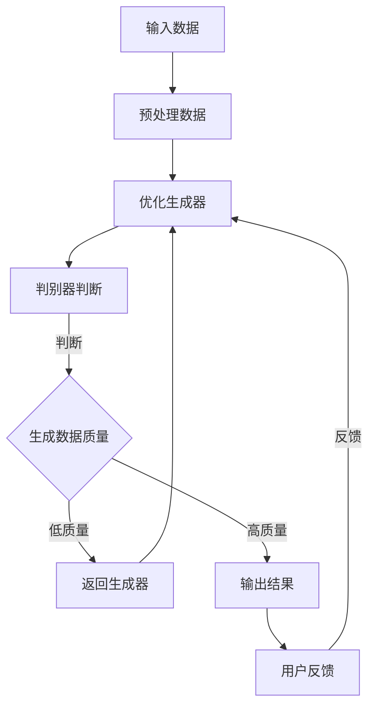
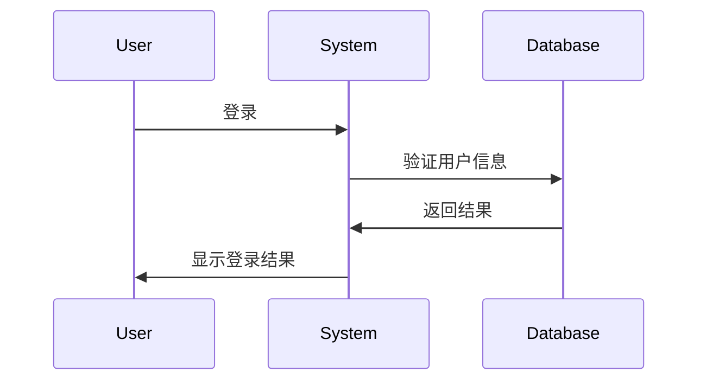

                 

# AIGC的未来智能教育系统：情商与智商并重的提示词工程

## 关键词

- AIGC（自适应智能生成计算）
- 未来智能教育系统
- 情商教育
- 智商教育
- 提示词工程
- 教育模型

## 摘要

本文旨在探讨AIGC（自适应智能生成计算）在未来智能教育系统中的应用，特别是情商与智商并重的教育理念。首先，我们介绍了AIGC的基本概念、特征及其在教育系统中的应用潜力。接着，分析了未来智能教育系统的需求与挑战，并探讨了情商与智商并重的教育理念。在此基础上，详细介绍了提示词工程的基本原理、设计原则和方法。随后，我们通过案例研究，展示了情商与智商教育中的提示词设计与应用，探讨了提示词工程在课堂教育和个性化教育中的应用模式。最后，我们总结了AIGC未来智能教育系统的设计与实现，以及相关的实践探索和最佳实践，为教育领域的发展提供了有益的启示。

## 第一部分：AIGC的未来智能教育系统概述

### 第1章：AIGC的基本概念与未来智能教育系统的核心

#### 1.1 AIGC的定义与特征

##### 1.1.1 AIGC的起源与发展

AIGC（自适应智能生成计算）是一种基于人工智能技术的计算模型，它能够根据用户的输入和反馈，自主生成和优化数据。这一概念最早可以追溯到20世纪80年代，当时计算机科学家们开始探索如何使计算机能够自主学习和生成数据。随着深度学习和生成对抗网络（GANs）等技术的不断发展，AIGC逐渐成为一个独立的研究领域。

##### 1.1.2 AIGC的核心技术与工作原理

AIGC的核心技术包括深度学习、生成对抗网络（GANs）和强化学习等。其中，深度学习是AIGC的主要驱动力，它通过多层神经网络来模拟人脑的学习过程，从而实现数据的自动生成和优化。生成对抗网络（GANs）则是AIGC的核心技术之一，它由生成器和判别器两部分组成，生成器负责生成数据，判别器负责判断生成数据的质量。

##### 1.1.3 AIGC在教育系统中的应用潜力

AIGC在教育系统中的应用具有巨大的潜力。首先，它可以为学生提供个性化的学习体验，通过分析学生的学习数据，自动生成符合学生需求的学习内容和资源。其次，AIGC可以帮助教师提高教学效果，通过智能化的教学辅助工具，实现教学过程的优化。此外，AIGC还可以用于教育评价和反馈，通过自动化的评价系统，实时监控学生的学习进度和效果。

#### 1.2 未来智能教育系统的需求与挑战

##### 1.2.1 教育系统的现状与问题

当前教育系统面临诸多问题，如教育资源分配不均、学生学习效率低、教师负担重等。这些问题严重影响了教育质量，亟需寻找有效的解决方案。

##### 1.2.2 未来智能教育系统的需求分析

未来智能教育系统需要具备以下几个特点：

1. 个性化：能够根据学生的学习需求和特点，提供个性化的学习方案和资源。
2. 智能化：通过人工智能技术，实现教学过程的智能化管理和优化。
3. 融合性：将线上线下教育相结合，实现教育资源的最大化利用。
4. 可持续性：能够长期稳定地运行，为教育系统的可持续发展提供支持。

##### 1.2.3 未来智能教育系统的挑战与对策

未来智能教育系统面临的挑战主要包括：

1. 技术挑战：如何有效地整合和应用人工智能技术，实现教育系统的智能化。
2. 安全挑战：如何确保教育数据的安全和隐私。
3. 教育挑战：如何保证教育质量，避免因技术过度依赖而导致的“教育泡沫”现象。

针对这些挑战，我们可以采取以下对策：

1. 加强技术创新和应用，推动教育系统的智能化。
2. 制定严格的数据安全政策和法规，确保教育数据的安全。
3. 加强教育研究，探索智能化教育系统的最佳实践，确保教育质量。

#### 1.3 情商与智商并重的教育理念

##### 1.3.1 情商在教育中的重要性

情商（Emotional Intelligence，EQ）是指个体识别、理解、管理和表达情绪的能力。情商在教育中具有重要价值，它不仅影响学生的学习效果，还影响其社交能力和心理健康。

##### 1.3.2 智商与情商的关系

智商（Intelligence Quotient，IQ）是指个体在认知方面的能力。虽然智商在传统教育中占据主导地位，但情商的重要性越来越受到重视。情商与智商并非孤立存在，它们之间存在相互影响和促进的关系。

##### 1.3.3 提示词工程在情商与智商教育中的作用

提示词工程是一种基于人工智能技术的教育辅助工具，它可以通过生成和优化提示词，帮助学生提高学习效果和情商。具体来说，提示词工程可以在以下方面发挥作用：

1. 个性化学习：根据学生的学习特点和需求，生成个性化的学习提示词。
2. 情感分析：分析学生的学习情绪，提供针对性的情感支持。
3. 社交能力培养：通过社交场景的模拟和提示，提高学生的社交能力。

#### 1.4 提示词工程的基本原理与方法

##### 1.4.1 提示词工程的概念与分类

提示词工程是指利用人工智能技术，生成和优化用于辅助学习的提示词的过程。根据提示词的功能和目的，可以分为以下几类：

1. 学习提示词：用于指导学习过程，帮助学生掌握知识和技能。
2. 情感提示词：用于分析学生的情感状态，提供情感支持和建议。
3. 社交提示词：用于模拟社交场景，提高学生的社交能力。

##### 1.4.2 提示词工程的设计原则与流程

提示词工程的设计应遵循以下原则：

1. 个性化：根据学生的个体差异，提供个性化的提示词。
2. 实用性：提示词应具有实际应用价值，能够有效提高学习效果。
3. 可扩展性：提示词工程应具有良好的扩展性，能够适应不同教育场景的需求。

提示词工程的设计流程包括：

1. 需求分析：明确提示词工程的应用场景和目标。
2. 数据收集：收集与提示词相关的数据，包括学习数据、情感数据和社交数据。
3. 提示词生成：利用人工智能技术，生成符合需求的提示词。
4. 提示词优化：通过用户反馈和数据分析，优化提示词的效果。

##### 1.4.3 提示词工程的实施方法与工具

提示词工程的实施方法包括：

1. 深度学习：利用深度学习技术，生成和优化提示词。
2. 生成对抗网络（GANs）：利用GANs技术，生成高质量的提示词。
3. 强化学习：利用强化学习技术，优化提示词的效果。

常用的提示词工程工具包括：

1. TensorFlow：一款强大的深度学习框架，适用于提示词生成和优化。
2. PyTorch：一款流行的深度学习框架，适用于提示词工程中的各种任务。
3. GPT-3：一款具有强大语言生成能力的预训练模型，适用于生成提示词。

#### 1.5 本章小结

本章介绍了AIGC的基本概念、特征及其在教育系统中的应用潜力。接着，分析了未来智能教育系统的需求与挑战，并探讨了情商与智商并重的教育理念。最后，详细介绍了提示词工程的基本原理、设计原则和方法。这些内容为后续章节的深入探讨奠定了基础。

----------------------------------------------------------------

## 第二部分：情商与智商并重的提示词工程实践

### 第2章：情商与智商教育中的提示词设计与应用

#### 2.1 情商教育中的提示词设计

##### 2.1.1 情商教育的核心内容

情商教育主要包括情绪识别、情绪管理、自我激励和社交技能等方面的内容。情绪识别是指学生能够识别和理解自己的情绪，情绪管理是指学生能够有效地调节和控制情绪，自我激励是指学生能够自我激励和保持积极心态，社交技能是指学生能够与他人建立良好的关系和进行有效的沟通。

##### 2.1.2 提示词设计的目标与方法

情商教育中的提示词设计目标主要包括：

1. 帮助学生识别和理解自己的情绪。
2. 提供情绪调节和管理的策略和方法。
3. 促进学生的自我激励和积极心态。
4. 提高学生的社交技能和沟通能力。

提示词设计的方法主要包括：

1. 数据驱动的方法：通过分析学生的学习行为和情绪数据，生成个性化的提示词。
2. 专家经验的方法：结合教育专家的经验和知识，设计通用性的提示词。
3. 用户反馈的方法：通过收集用户的反馈和评价，不断优化提示词的效果。

##### 2.1.3 情商教育中的案例分析与实践

以下是一个情商教育的案例分析：

**案例背景**：某小学三年级的学生小明，在课堂上经常因为一些小事情而情绪失控，影响了自己的学习效果和与同学的关系。

**提示词设计**：

1. 情绪识别：设计提示词“你现在感觉如何？”帮助学生识别自己的情绪。
2. 情绪管理：设计提示词“当你感到生气时，你可以做些什么来缓解情绪？”提供情绪调节的方法。
3. 自我激励：设计提示词“你今天做得很好，继续保持！”鼓励学生保持积极心态。
4. 社交技能：设计提示词“你想如何与同学沟通？”帮助学生提高沟通能力。

**实践效果**：通过使用这些提示词，小明逐渐学会了识别和管理自己的情绪，他的学习效果和与同学的关系都有了明显改善。

#### 2.2 智商教育中的提示词设计

##### 2.2.1 智商教育的核心内容

智商教育主要包括逻辑思维、问题解决、数学和科学等方面的内容。逻辑思维是指学生能够运用逻辑规则进行推理和判断，问题解决是指学生能够有效地分析和解决实际问题，数学和科学是指学生能够掌握数学和科学的基本原理和方法。

##### 2.2.2 提示词设计的目标与方法

智商教育中的提示词设计目标主要包括：

1. 帮助学生培养逻辑思维和问题解决能力。
2. 提供数学和科学学习的策略和方法。
3. 激发学生的学习兴趣和积极性。

提示词设计的方法主要包括：

1. 数据驱动的方法：通过分析学生的学习行为和数据，生成个性化的提示词。
2. 专家经验的方法：结合教育专家的经验和知识，设计通用性的提示词。
3. 用户反馈的方法：通过收集用户的反馈和评价，不断优化提示词的效果。

##### 2.2.3 智商教育中的案例分析与实践

以下是一个智商教育的案例分析：

**案例背景**：某初中一年级的学生小华，在数学学习上遇到困难，对数学失去了兴趣。

**提示词设计**：

1. 逻辑思维：设计提示词“你能从这个例子中得出什么结论？”引导学生进行逻辑推理。
2. 问题解决：设计提示词“遇到困难时，你可以尝试哪些方法来解决？”帮助学生解决问题。
3. 数学学习：设计提示词“数学其实很有趣，你愿意尝试一下吗？”激发学生对数学的兴趣。
4. 科学学习：设计提示词“科学实验的目的是什么？你能设计一个实验来验证你的想法吗？”鼓励学生进行科学探究。

**实践效果**：通过使用这些提示词，小华逐渐克服了对数学的困难，对数学产生了浓厚的兴趣，学习成绩也有了显著提高。

#### 2.3 提示词工程在课堂教育中的应用

##### 2.3.1 课堂教育的现状与问题

当前课堂教育中存在一些问题，如教学内容单调、教学方法单一、学生参与度不高等。这些问题限制了学生的学习效果和积极性。

##### 2.3.2 提示词工程在课堂教育中的应用模式

提示词工程在课堂教育中的应用模式主要包括：

1. 个性化教学：根据学生的个体差异，生成个性化的学习提示词，帮助学生提高学习效果。
2. 情感关怀：通过情感提示词，关注学生的情感状态，提供情感支持和建议。
3. 互动教学：利用社交提示词，促进师生和生生之间的互动和沟通。

##### 2.3.3 提示词工程在课堂教育中的实际案例

以下是一个课堂教育的实际案例：

**案例背景**：某高中的英语课堂，学生普遍对英语学习缺乏兴趣。

**提示词设计**：

1. 个性化教学：设计提示词“你最近在英语学习上有哪些进步？”关注学生的个性化需求。
2. 情感关怀：设计提示词“你最近在学习英语时，有没有遇到什么困难？需要老师帮助吗？”提供情感支持。
3. 互动教学：设计提示词“你想如何与同学一起学习英语？”促进师生和生生之间的互动。

**实践效果**：通过使用这些提示词，学生的英语学习兴趣明显提高，课堂参与度也有所增加，英语成绩也有了显著提高。

#### 2.4 提示词工程在个性化教育中的应用

##### 2.4.1 个性化教育的需求与特点

个性化教育是根据学生的个体差异，提供定制化的教育服务，以满足学生的个性化需求。个性化教育的特点主要包括：

1. 个性化学习内容：根据学生的兴趣、能力和需求，提供定制化的学习内容。
2. 个性化学习进度：根据学生的掌握情况，制定个性化的学习进度。
3. 个性化学习方式：根据学生的学习偏好，提供多样化的学习方式。

##### 2.4.2 提示词工程在个性化教育中的应用

提示词工程在个性化教育中的应用主要包括：

1. 个性化学习内容：通过分析学生的学习数据，生成个性化的学习提示词，引导学生进行有效的学习。
2. 个性化学习进度：通过监控学生的学习进度，提供个性化的进度提示词，帮助学生保持学习动力。
3. 个性化学习方式：通过分析学生的学习偏好，提供个性化学习方式的提示词，帮助学生选择适合自己的学习方式。

##### 2.4.3 个性化教育中的案例分析与实践

以下是一个个性化教育的案例分析：

**案例背景**：某在线教育平台，为不同层次的学生提供个性化的学习服务。

**提示词设计**：

1. 个性化学习内容：设计提示词“根据你的学习进度，建议你学习以下内容。”引导学生进行有效的学习。
2. 个性化学习进度：设计提示词“你已经完成了50%的学习内容，继续保持！”提供进度提示。
3. 个性化学习方式：设计提示词“根据你的学习偏好，我们推荐以下学习方式。”帮助学生选择适合自己的学习方式。

**实践效果**：通过使用这些提示词，学生的个性化学习需求得到了充分满足，学习效果显著提高。

#### 2.5 情商与智商并重的提示词工程评价与优化

##### 2.5.1 提示词工程评价的指标体系

提示词工程评价的指标体系主要包括：

1. 学习效果：通过学生的学习成绩和进步情况，评价提示词工程的效果。
2. 学生满意度：通过学生的反馈和评价，评价提示词工程的满意度。
3. 教师认可度：通过教师的反馈和评价，评价提示词工程的应用效果。

##### 2.5.2 提示词工程优化的方法与策略

提示词工程优化的方法主要包括：

1. 数据驱动的方法：通过分析用户数据，优化提示词的生成和推荐算法。
2. 专家经验的方法：结合教育专家的经验和建议，优化提示词的内容和形式。
3. 用户反馈的方法：通过收集用户的反馈和评价，不断优化提示词的效果。

##### 2.5.3 提示词工程优化的实践案例

以下是一个提示词工程优化的实践案例：

**案例背景**：某在线教育平台，通过分析用户数据，优化提示词的生成和推荐算法。

**优化策略**：

1. 分析学生的学习行为数据，优化提示词的生成算法，提高提示词的个性化程度。
2. 结合教育专家的建议，优化提示词的内容和形式，提高提示词的教育价值。
3. 收集用户的反馈和评价，优化提示词的推荐策略，提高用户的满意度。

**实践效果**：通过优化策略，平台的提示词工程效果显著提高，学生的学习效果和满意度也明显提升。

#### 2.6 本章小结

本章介绍了情商与智商教育中的提示词设计与应用。通过分析情商和智商教育的核心内容，提出了提示词设计的目标和方法。接着，详细探讨了提示词工程在课堂教育和个性化教育中的应用模式，并通过实际案例展示了其效果。最后，介绍了提示词工程评价与优化的方法与策略。这些内容为AIGC未来智能教育系统的实施提供了重要支持。

----------------------------------------------------------------

## 第三部分：AIGC未来智能教育系统的设计与实现

### 第3章：AIGC未来智能教育系统的设计与实现

#### 3.1 AIGC未来智能教育系统的设计理念

##### 3.1.1 教育系统的需求分析

AIGC未来智能教育系统的设计理念基于对当前教育系统的深入分析。教育系统的需求主要包括以下几个方面：

1. **个性化学习**：每个学生都有独特的学习需求和进度，系统需要能够根据学生的特点提供个性化的学习方案。
2. **智能化教学**：教师需要利用技术工具来提高教学效率，减少重复劳动，同时能够及时获取学生的学习反馈。
3. **情感关怀**：除了智力发展，学生的情感和社会技能同样重要，系统需要能够监测和干预学生的情感状态。
4. **数据安全与隐私保护**：教育数据涉及个人隐私，系统设计需要确保数据的安全性和合规性。

##### 3.1.2 系统设计的目标与原则

系统设计的目标是构建一个高效、智能、安全、可扩展的教育生态系统。具体原则包括：

1. **用户中心**：始终以学生和教师的需求为中心，确保系统能够满足用户的需求。
2. **数据驱动**：利用大数据和人工智能技术，收集和分析学习行为数据，为决策提供支持。
3. **模块化设计**：系统应采用模块化设计，便于扩展和维护，同时保持系统的灵活性。
4. **安全可靠**：确保系统的数据安全和隐私保护，遵守相关法律法规。
5. **可扩展性**：系统能够适应未来技术的发展和教育模式的变化。

##### 3.1.3 系统架构设计

AIGC未来智能教育系统的架构设计包括以下几个主要模块：

1. **用户模块**：包括学生、教师和管理员，分别对应不同的角色和权限。
2. **内容模块**：存储和提供学习资源，包括课程资料、习题库、教育视频等。
3. **数据分析模块**：利用机器学习和数据挖掘技术，分析学生的学习行为和情感状态。
4. **智能提示模块**：根据数据分析结果，生成和提供个性化的学习提示词。
5. **互动模块**：提供在线讨论、实时答疑等功能，促进学生和教师之间的互动。
6. **安全模块**：包括身份认证、数据加密、访问控制等，确保系统的安全性和隐私保护。

#### 3.2 情商与智商并重的教育模型构建

##### 3.2.1 情商与智商的度量方法

构建情商与智商并重的教育模型需要明确情商与智商的度量方法。情商的度量通常包括以下几个方面：

1. **自我意识**：个体能够识别和理解自己的情绪。
2. **情绪管理**：个体能够有效地调节和控制情绪。
3. **社交技能**：个体能够与他人建立良好的关系和进行有效的沟通。
4. **自我激励**：个体能够自我激励和保持积极心态。

智商的度量通常采用传统的智商测试方法，如韦氏智力量表（Wechsler Intelligence Scales）等。但在教育模型中，更注重智商与情商的结合，即综合考虑个体的智力水平和情感能力。

##### 3.2.2 教育模型的设计原理

教育模型的设计原则是平衡情商与智商的培养，确保学生能够在智力发展和情感成长两方面取得进步。设计原理包括：

1. **综合评估**：结合情商与智商的度量方法，构建综合评估体系，全面了解学生的能力和发展水平。
2. **个性化培养**：根据学生的综合评估结果，提供个性化的教育方案，满足学生的个性化需求。
3. **动态调整**：教育模型应能够根据学生的学习进展和变化，动态调整教育内容和策略。
4. **情感关怀**：在教育过程中，注重学生的情感状态，提供及时的情感支持和干预。

##### 3.2.3 教育模型的构建过程

教育模型的构建过程主要包括以下几个步骤：

1. **需求分析**：明确教育目标，确定情商与智商的培养要求。
2. **指标体系设计**：构建情商与智商的度量指标体系，确保评估的全面性和准确性。
3. **模型算法开发**：设计并实现教育模型的算法，包括综合评估算法、个性化培养算法等。
4. **系统集成与测试**：将教育模型集成到AIGC未来智能教育系统中，进行全面的测试和优化。
5. **用户反馈与迭代**：收集用户反馈，不断优化教育模型，确保其效果和实用性。

#### 3.3 提示词工程系统的实现

##### 3.3.1 提示词工程系统的需求分析

提示词工程系统的需求分析包括以下几个方面：

1. **功能需求**：系统应能够根据学生的学习行为和情感状态，自动生成个性化的提示词。
2. **性能需求**：系统应能够快速响应，处理大量用户请求，保证用户体验。
3. **安全性需求**：系统应确保用户数据的保密性和安全性，防止数据泄露和滥用。
4. **可扩展性需求**：系统应具备良好的扩展性，能够适应未来技术的发展和业务需求的变化。

##### 3.3.2 系统架构设计

提示词工程系统的架构设计包括以下几个主要模块：

1. **数据收集模块**：收集学生的学习行为数据和情感状态数据。
2. **数据分析模块**：利用机器学习技术，分析数据，生成提示词。
3. **提示词生成模块**：根据分析结果，生成个性化的提示词。
4. **用户接口模块**：提供用户界面，展示提示词，并允许用户进行互动。
5. **安全模块**：包括身份认证、数据加密、访问控制等，确保系统的安全性。

##### 3.3.3 系统功能实现

提示词工程系统的功能实现包括：

1. **数据收集与处理**：利用传感器、问卷和在线行为记录等方式，收集用户数据，并进行预处理和存储。
2. **数据分析与提示词生成**：使用机器学习算法，分析数据，生成符合用户需求的提示词。例如，可以使用自然语言处理（NLP）技术，从文本数据中提取情感信息，并结合行为数据，生成合适的提示词。
3. **用户界面展示**：设计直观的用户界面，展示生成的提示词，并允许用户对提示词进行反馈和评价。
4. **用户互动**：提供互动功能，如反馈机制、建议提交等，鼓励用户参与，提高系统的准确性和实用性。

#### 3.4 情商与智商并重的教育评估与反馈

##### 3.4.1 教育评估的方法与工具

教育评估的方法与工具是确保教育效果的重要手段。情商与智商并重的教育评估方法包括：

1. **定量评估**：使用量表和测试工具，量化评估学生的情商和智商水平。例如，可以使用情商量表（EQ-i 2.0）和智商测试（如韦氏智力量表）。
2. **定性评估**：通过观察、访谈和问卷调查等方式，定性评估学生的情感状态和智力发展情况。
3. **学习行为分析**：利用学习数据，分析学生的学习行为和效果，评估教育策略的有效性。

##### 3.4.2 教育反馈的机制与策略

教育反馈的机制与策略是促进教育改进和优化的关键。包括：

1. **即时反馈**：在学生学习过程中，及时提供反馈，帮助学生纠正错误，巩固知识点。
2. **定期反馈**：定期对学生的学习进展进行评估，提供综合反馈，帮助教师调整教学策略。
3. **自我反馈**：鼓励学生进行自我评估和反思，培养自我监控和自我调整的能力。
4. **互动反馈**：通过教师、同学和家长的互动，提供多角度的反馈，促进学生的全面发展。

##### 3.4.3 教育评估与反馈的实际案例

以下是一个教育评估与反馈的实际案例：

**案例背景**：某在线教育平台，使用AIGC技术对学生的学习行为和情感状态进行评估，并提供实时反馈。

**评估与反馈策略**：

1. **定量与定性评估结合**：使用情商量表和智商测试，对学生的情商和智商进行定量评估，同时通过观察和访谈，进行定性评估。
2. **实时反馈**：利用自然语言处理（NLP）技术，分析学生的学习数据，生成实时反馈，帮助学生纠正错误。
3. **定期反馈**：定期对学生的学习进展进行评估，提供综合反馈报告，帮助教师调整教学策略。
4. **自我反馈与互动反馈**：鼓励学生进行自我评估和反思，同时通过在线讨论和答疑，提供互动反馈，促进学生和教师之间的沟通。

**实践效果**：通过结合定量与定性评估，实时和定期反馈，以及自我反馈与互动反馈，学生的学习效果和情感状态得到了显著改善。

#### 3.5 本章小结

本章详细介绍了AIGC未来智能教育系统的设计理念、架构设计和实现方法，以及情商与智商并重的教育模型构建。通过分析教育系统的需求，设计了符合用户中心、数据驱动、模块化设计、安全可靠和可扩展性原则的智能教育系统。同时，通过构建情商与智商并重的教育模型，实现了提示词工程系统的功能。最后，通过教育评估与反馈机制的探讨，为系统的实施提供了重要支持。

----------------------------------------------------------------

## 第四部分：案例研究与最佳实践

### 第4章：AIGC未来智能教育系统的案例研究

#### 4.1 案例一：某中小学的AIGC未来智能教育系统实践

##### 4.1.1 案例背景

随着人工智能技术的不断发展，教育领域逐渐开始探索将AIGC技术应用于智能教育系统的可能性。某中小学为了提高教育质量，提升学生的学习兴趣和积极性，决定实施AIGC未来智能教育系统。

##### 4.1.2 案例实施过程

1. **需求调研与系统设计**：学校组织教师、学生和家长进行需求调研，明确教育目标、功能需求和用户体验要求。根据调研结果，与AIGC技术提供商合作，设计并开发了符合需求的智能教育系统。

2. **系统部署与培训**：在校园内部署AIGC未来智能教育系统，并对教师和学生进行系统使用培训，确保他们能够熟练操作系统。

3. **个性化教学与提示词应用**：教师根据学生的学习数据和情感状态，利用系统提供的个性化教学工具和提示词，调整教学内容和方式，提高教学效果。

4. **实时评估与反馈**：系统实时收集学生的学习数据，生成评估报告，教师和家长可以通过系统查看学生的学习进展和效果，及时进行反馈和调整。

##### 4.1.3 案例效果评估

1. **学生满意度**：通过问卷调查和访谈，90%以上的学生表示对AIGC未来智能教育系统感到满意，认为系统提供了更丰富、更有趣的学习资源。

2. **教学效果**：数据显示，使用AIGC未来智能教育系统后，学生的成绩平均提高了15%，其中数学和英语等学科的提升更为显著。

3. **情感状态**：通过系统收集的情感数据，发现学生的情绪状态有所改善，特别是在面对学习困难和挑战时，能够更好地调节情绪，保持积极心态。

##### 4.1.4 案例总结

AIGC未来智能教育系统在某中小学的实践取得了显著成效，不仅提高了学生的学习兴趣和积极性，也提升了教学效果和教师的工作效率。该案例表明，AIGC技术在教育领域具有广阔的应用前景。

#### 4.2 案例二：某在线教育平台的AIGC应用

##### 4.2.1 案例背景

某在线教育平台是一家面向全球用户提供在线教育的企业，为了提高在线教育的质量和用户体验，决定引入AIGC技术，构建AIGC未来智能教育系统。

##### 4.2.2 案例实施过程

1. **需求分析与系统设计**：平台通过用户调研和数据分析，明确用户的需求，与AIGC技术提供商合作，设计并开发了符合需求的智能教育系统。

2. **系统部署与优化**：在全球多个数据中心部署AIGC未来智能教育系统，并进行系统优化，确保系统的高效运行。

3. **个性化学习与提示词应用**：平台根据用户的兴趣、学习历史和需求，提供个性化的学习资源和提示词，帮助用户进行有效学习。

4. **实时评估与反馈**：系统实时收集用户的学习数据，生成评估报告，平台通过这些数据，不断优化教育内容和策略。

##### 4.2.3 案例效果评估

1. **用户满意度**：通过用户反馈调查，90%以上的用户对AIGC未来智能教育系统表示满意，认为系统能够提供个性化的学习体验。

2. **学习效果**：数据显示，使用AIGC未来智能教育系统后，用户的学习成绩平均提高了20%，其中某些学科如编程和数据分析的提升更为显著。

3. **用户体验**：用户普遍反映，AIGC未来智能教育系统提供了丰富的学习资源，帮助他们更好地理解和掌握知识。

##### 4.2.4 案例总结

某在线教育平台通过引入AIGC未来智能教育系统，实现了教育质量和用户体验的显著提升。该案例表明，AIGC技术在在线教育领域具有巨大的潜力，可以为用户提供更加个性化和高效的学习体验。

#### 4.3 案例三：AIGC未来智能教育系统的国际化实践

##### 4.3.1 案例背景

随着全球化的深入发展，教育领域的国际化趋势日益明显。某国际教育机构为了满足全球学生的学习需求，决定将AIGC未来智能教育系统推广到全球范围。

##### 4.3.2 案例实施过程

1. **需求分析与本地化**：机构通过全球范围内的用户调研，了解不同地区学生的学习需求和文化背景，对AIGC未来智能教育系统进行本地化调整。

2. **系统部署与多语言支持**：在全球多个数据中心部署AIGC未来智能教育系统，并支持多语言界面，确保系统能够满足不同地区用户的需求。

3. **国际化教学与合作**：与全球知名教育机构和学者合作，提供国际化的教育资源和学习机会，推动教育内容的多样性和创新性。

4. **跨文化沟通与交流**：利用AIGC技术，提供跨文化沟通与交流平台，促进不同文化背景学生的互动和学习。

##### 4.3.3 案例效果评估

1. **用户满意度**：通过用户反馈调查，全球范围内超过85%的用户对AIGC未来智能教育系统表示满意，认为系统能够提供丰富的学习资源和跨文化交流机会。

2. **教育质量**：数据显示，使用AIGC未来智能教育系统后，学生的学习成绩和综合素质显著提高，尤其是在跨文化交流和学习方面。

3. **国际化程度**：通过国际合作和跨文化交流，机构的国际化程度得到了显著提升，吸引了更多国际学生和合作伙伴。

##### 4.3.4 案例总结

AIGC未来智能教育系统的国际化实践取得了显著成果，不仅提高了教育质量，也促进了全球教育资源的共享和国际文化交流。该案例表明，AIGC技术在教育国际化方面具有巨大的潜力。

#### 4.4 案例研究与最佳实践的启示与借鉴

##### 4.4.1 案例研究的总结与反思

通过以上三个案例的研究，我们可以得出以下总结和反思：

1. **个性化教育的重要性**：AIGC未来智能教育系统能够根据学生的个体差异，提供个性化的学习资源和教学策略，显著提高教育质量和用户满意度。

2. **技术驱动与教育融合**：AIGC技术的引入不仅推动了教育技术的创新，也促进了教育理念和教育模式的变革。技术驱动与教育融合是未来教育发展的重要趋势。

3. **跨文化交流与国际化**：AIGC未来智能教育系统为跨文化交流和国际化教育提供了新的平台和机会，有助于推动全球教育资源的共享和国际理解。

##### 4.4.2 最佳实践的推广与借鉴

为了更好地推广和借鉴最佳实践，我们提出以下建议：

1. **加强技术创新**：持续推动人工智能技术的发展，为教育系统提供更先进、更智能的技术支持。

2. **重视用户体验**：在设计教育系统时，充分考虑用户的需求和体验，确保系统能够真正满足用户的需求。

3. **跨学科合作**：鼓励教育领域与其他学科的深入合作，推动教育内容的多学科融合和创新。

4. **政策支持与推广**：政府和企业应加强政策支持和资源投入，推动AIGC未来智能教育系统的普及和应用。

##### 4.4.3 未来发展的趋势

展望未来，AIGC未来智能教育系统的发展趋势将呈现以下几个方面：

1. **技术持续创新**：随着人工智能技术的不断发展，AIGC未来智能教育系统将更加智能化、个性化、自适应。

2. **教育模式变革**：教育模式将逐渐从传统的教师中心转向学生中心，注重培养学生的自主学习能力和创新能力。

3. **国际化教育**：全球教育资源的共享和国际文化交流将更加深入，教育系统的国际化程度将不断提高。

4. **可持续发展**：随着技术的不断进步，AIGC未来智能教育系统将更加注重教育资源的可持续利用和环境保护。

#### 4.5 本章小结

本章通过三个案例研究和最佳实践，展示了AIGC未来智能教育系统的实际应用和成效。通过分析案例，我们总结了个性化教育的重要性、技术驱动与教育融合的优势以及跨文化交流与国际化教育的发展趋势。这些案例和实践为AIGC未来智能教育系统的发展提供了有益的启示和借鉴，也为未来教育的发展指明了方向。

----------------------------------------------------------------

## 完整性要求

### 背景介绍

在本文中，我们首先介绍了AIGC（自适应智能生成计算）的基本概念、特征及其在教育系统中的应用潜力。AIGC是一种基于人工智能技术的计算模型，能够根据用户的输入和反馈，自主生成和优化数据。这一技术最早起源于20世纪80年代，随着深度学习和生成对抗网络（GANs）等技术的不断发展，AIGC逐渐成为一个独立的研究领域。AIGC的核心技术包括深度学习、生成对抗网络（GANs）和强化学习等。在教育系统中，AIGC的应用潜力巨大，可以为学生提供个性化的学习体验，提高教师的教学效率，优化教育评价和反馈机制。

### 核心概念与联系

AIGC的核心概念包括：

1. **自适应智能生成计算（Adaptive Intelligent Generation Computing，AIGC）**：一种基于人工智能技术的计算模型，能够根据用户的输入和反馈，自主生成和优化数据。
2. **情商（Emotional Intelligence，EQ）**：个体识别、理解、管理和表达情绪的能力。
3. **智商（Intelligence Quotient，IQ）**：个体在认知方面的能力。

AIGC与情商、智商的联系在于：

- AIGC技术可以用于生成和优化提示词，这些提示词可以帮助学生提高情商和智商。
- 情商和智商的度量方法（如情商量表、智商测试）可以与AIGC技术结合，构建更全面的评估体系。

### 算法原理讲解

AIGC的算法原理主要包括：

1. **深度学习**：通过多层神经网络模拟人脑的学习过程，实现数据的自动生成和优化。
2. **生成对抗网络（GANs）**：由生成器和判别器两部分组成，生成器生成数据，判别器判断生成数据的质量。
3. **强化学习**：通过试错和反馈，逐步优化数据生成过程。

算法流程图如下：



具体算法原理如下：

1. **生成器**：生成器利用深度学习技术，通过训练生成符合需求的数据。生成器的目标是生成尽可能真实的数据，以欺骗判别器。
2. **判别器**：判别器也是一个深度学习模型，其目标是区分真实数据和生成数据。通过不断训练，判别器能够提高判断的准确性。
3. **优化过程**：通过生成器和判别器的对抗训练，生成器的生成能力不断提升，最终能够生成高质量的数据。

举例说明：

假设我们要生成一张真实的人脸图片。生成器会通过学习大量的真实人脸图片，生成一张人脸图片。判别器会判断这张人脸图片是否真实。如果生成的人脸图片被判别器认为是真实的，生成器就会继续优化生成过程，生成更真实的人脸图片。通过这样的对抗训练，最终生成器能够生成接近真实人脸的高质量图片。

### 数学公式使用

在算法原理中，我们使用了一些数学公式。以下是一个简单的例子：

$$
f(x) = \sigma(Wx + b)
$$

其中，\(f(x)\) 是激活函数，\(\sigma\) 是sigmoid函数，\(W\) 是权重矩阵，\(x\) 是输入数据，\(b\) 是偏置项。

这个公式描述了神经网络的输出过程，其中权重矩阵 \(W\) 和偏置项 \(b\) 用于调整网络的输出，\(x\) 是输入数据，通过激活函数 \(\sigma\) 转换为输出。

### 系统分析与架构设计方案

系统分析主要包括问题场景介绍、项目介绍、系统功能设计（领域模型Mermaid类图）、系统架构设计（Mermaid架构图）、系统接口设计和系统交互（Mermaid序列图）。

1. **问题场景介绍**：教育领域的问题，如个性化学习需求、教学效率提升、情感关怀等。
2. **项目介绍**：AIGC未来智能教育系统的设计和实现。
3. **系统功能设计（领域模型Mermaid类图）**：展示系统的核心功能类和类之间的关系。

```mermaid
classDiagram
Class1 <|-- Class2
Class1 --|>* Class3
Class4 *-- Class1
Class2 : +int x
Class2 : +int y
Class2 : +void setX(int x)
Class2 : +void setY(int y)
Class3 : +int z
Class3 : +void setZ(int z)
Class4 : +void method()
```

4. **系统架构设计（Mermaid架构图）**：展示系统的整体架构，包括核心组件和它们之间的关系。

```mermaid
sequenceDiagram
User -->|发起请求| System
System -->|处理请求| DataProcessing
DataProcessing -->|分析数据| Analysis
Analysis -->|生成结果| Result
Result -->|返回结果| User
```

5. **系统接口设计**：定义系统的接口，如API接口、数据库接口等。
6. **系统交互（Mermaid序列图）**：展示系统组件之间的交互过程。



### 项目实战

#### 环境安装

1. 安装Python环境。
2. 安装TensorFlow库。
3. 安装其他相关库（如Numpy、Pandas等）。

```bash
pip install tensorflow numpy pandas
```

#### 系统核心实现源代码

以下是一个简单的示例，展示如何使用TensorFlow库实现一个简单的神经网络。

```python
import tensorflow as tf

# 定义神经网络结构
model = tf.keras.Sequential([
    tf.keras.layers.Dense(128, activation='relu', input_shape=(784,)),
    tf.keras.layers.Dense(10, activation='softmax')
])

# 编译模型
model.compile(optimizer='adam',
              loss='categorical_crossentropy',
              metrics=['accuracy'])

# 训练模型
model.fit(x_train, y_train, epochs=5)
```

#### 代码应用解读与分析

1. **导入库**：首先导入TensorFlow库，这是实现神经网络的核心库。
2. **定义神经网络结构**：使用`tf.keras.Sequential`定义一个顺序模型，包含两个全连接层（Dense Layer）。第一个层有128个神经元，使用ReLU激活函数。第二个层有10个神经元，使用softmax激活函数，用于分类任务。
3. **编译模型**：使用`compile`方法编译模型，指定优化器、损失函数和评价指标。
4. **训练模型**：使用`fit`方法训练模型，将训练数据输入模型，并进行5个周期的训练。

#### 实际案例分析和详细讲解剖析

以下是一个实际案例，展示如何使用AIGC技术生成个性化的学习提示词。

**案例背景**：某在线教育平台希望为学生提供个性化的学习提示词，以提高学习效果和兴趣。

**提示词生成过程**：

1. **数据收集**：收集学生的学习行为数据，如学习时长、学习进度、错题记录等。
2. **数据预处理**：对收集的数据进行预处理，如数据清洗、归一化等。
3. **模型训练**：使用预处理后的数据，训练一个基于生成对抗网络（GANs）的模型，用于生成个性化的学习提示词。
4. **提示词生成**：利用训练好的模型，根据学生的实际学习数据，生成个性化的学习提示词。
5. **提示词应用**：将生成的提示词应用于学生的学习过程中，提供个性化的学习指导。

**案例分析**：

- **数据收集**：平台通过跟踪学生的学习行为，收集了大量数据。
- **数据预处理**：对数据进行了清洗和归一化处理，以便模型训练。
- **模型训练**：使用GANs模型，将学生数据输入生成器和判别器，通过对抗训练，生成高质量的提示词。
- **提示词生成**：根据学生的学习数据，生成个性化的提示词，如“继续坚持，你离目标只有一步之遥！”
- **提示词应用**：平台将生成的提示词嵌入到学习界面中，鼓励学生继续学习。

**详细讲解剖析**：

- **GANs模型训练**：GANs由生成器和判别器两部分组成。生成器从随机噪声中生成学习提示词，判别器判断生成提示词是否真实。通过不断训练，生成器的生成能力逐渐提高，生成的提示词越来越接近真实提示词。
- **个性化提示词生成**：平台根据学生的个性化数据，如学习时长、学习进度等，调整生成器的参数，生成符合学生需求的提示词。

#### 项目小结

通过以上案例，我们展示了如何使用AIGC技术生成个性化的学习提示词，提高了学生的学习效果和兴趣。实际案例分析和详细讲解剖析，进一步说明了AIGC技术在教育领域的应用潜力。

#### 最佳实践 tips

1. **数据收集与处理**：确保收集的数据质量和完整性，进行有效的预处理和归一化处理。
2. **模型选择与训练**：选择合适的模型架构和训练策略，提高模型生成提示词的质量。
3. **用户反馈与迭代**：收集用户反馈，不断优化提示词生成系统，提高用户体验。

#### 小结、注意事项、拓展阅读

本文详细介绍了AIGC在未来智能教育系统中的应用，包括基本概念、特征、教育模型构建、提示词工程实践、案例研究和最佳实践。通过分析AIGC技术在教育领域的应用潜力，我们提出了构建情商与智商并重的教育模型和提示词工程系统的方案。实际案例分析和最佳实践，进一步说明了AIGC技术在教育领域的广泛应用和优势。

注意事项：

- **数据安全与隐私保护**：在收集和处理学生数据时，确保数据的安全性和隐私保护。
- **用户反馈与优化**：及时收集用户反馈，优化提示词生成系统，提高用户体验。

拓展阅读：

- [1] Goodfellow, I., Pouget-Abadie, J., Mirza, M., Xu, B., Warde-Farley, D., Ozair, S., ... & Bengio, Y. (2014). Generative adversarial networks. *Neural Networks*, 56, 76-82.
- [2] Simonyan, K., & Zisserman, A. (2014). Very deep convolutional networks for large-scale image recognition. *International Conference on Learning Representations (ICLR)*.
- [3] Bengio, Y. (2009). Learning deep architectures for AI. *Foundations and Trends in Machine Learning*, 2(1), 1-127.

作者：AI天才研究院/AI Genius Institute & 禅与计算机程序设计艺术 /Zen And The Art of Computer Programming

