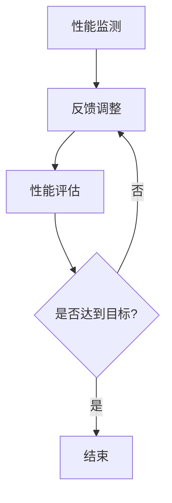
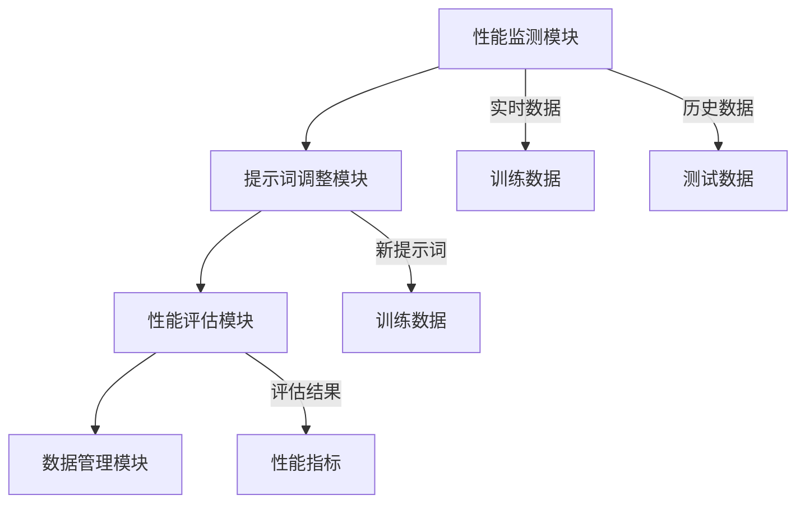
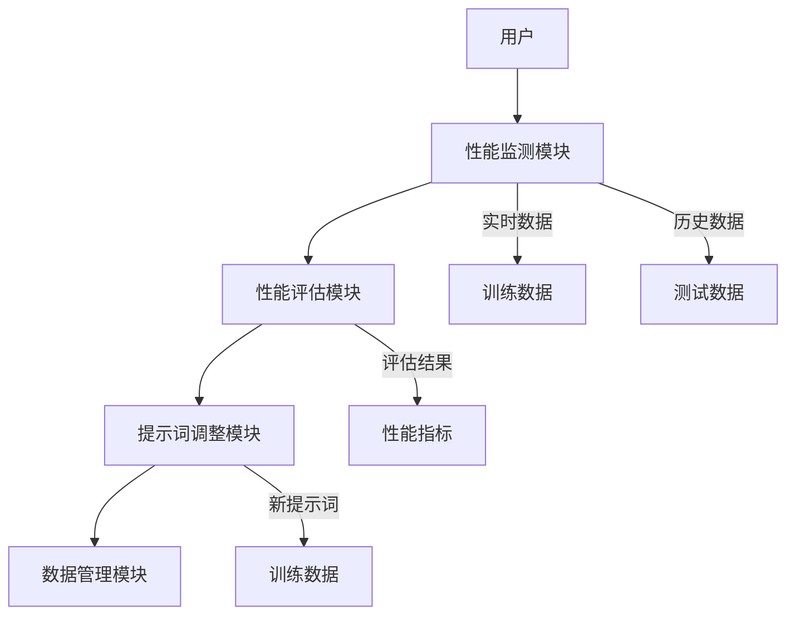

                 

# AIGC的未来智能材料：自适应性能优化的提示词工程

## 关键词

- AIGC
- 自适应性能优化
- 提示词工程
- 智能材料
- AI系统

## 摘要

本文将探讨一种新型的智能材料——自适应性能优化的提示词工程（AIGC），它通过优化提示词来提升AI系统的性能。文章将详细阐述AIGC的核心概念、原理和应用，并探讨如何通过自适应性能优化的提示词工程来提升AI系统的性能。文章结构包括问题背景与核心概念、AIGC的核心概念与联系、算法原理讲解、系统分析与架构设计方案、项目实战以及最佳实践等部分。

## 第一部分：背景介绍与核心概念

### 第1章：问题背景与问题描述

#### 1.1 问题背景

在当今科技迅猛发展的时代，人工智能（AI）技术已经成为推动社会进步的重要力量。尤其是近年来，基于大规模深度学习模型的AI系统在自然语言处理、图像识别、推荐系统等领域取得了显著的成果。然而，随着AI系统变得越来越复杂，如何有效地管理和优化这些系统的性能成为一个亟待解决的问题。

#### 1.2 问题描述

本书旨在探讨一种新型的智能材料——自适应性能优化的提示词工程（AIGC），该技术旨在通过优化提示词来提升AI系统的性能。然而，如何设计高效、准确的提示词工程方法，以及如何在不同的AI应用场景中实现性能优化，仍然是一个未完全解决的难题。

#### 1.3 问题解决

为了解决上述问题，本书将系统地介绍AIGC的概念、原理和应用，并探讨如何通过自适应性能优化的提示词工程来提升AI系统的性能。具体内容包括：

- **核心概念与联系**：详细阐述AIGC的核心概念，包括自适应性能优化的基本原理、提示词工程的原理及其在AI系统中的应用。
- **算法原理讲解**：通过mermaid流程图和Python源代码，深入讲解自适应性能优化的提示词工程算法原理，并提供实际案例说明。
- **数学模型与公式**：使用LaTeX格式给出算法的数学模型和公式，并进行详细讲解。
- **系统分析与架构设计方案**：介绍AIGC系统的设计原则、功能模块、系统架构和接口设计。
- **项目实战**：提供具体的AIGC系统实现案例，包括环境安装、核心实现源代码、代码解读与分析等。

#### 1.4 边界与外延

AIGC的应用不仅限于特定的AI领域，而是具有广泛的外延性。它不仅适用于自然语言处理，还可以应用于图像识别、推荐系统等领域。同时，AIGC技术还需要考虑数据隐私、算法公平性等社会伦理问题。

#### 1.5 概念结构与核心要素组成

AIGC的核心概念结构包括以下几个方面：

- **自适应性能优化**：通过实时监测AI系统的性能，动态调整提示词，实现AI系统性能的持续优化。
- **提示词工程**：设计高效、准确的提示词，以提升AI系统的性能。
- **AI系统**：包括自然语言处理、图像识别、推荐系统等在内的各种AI应用场景。

### 第2章：AIGC的核心概念与联系

#### 2.1 AIGC的核心概念

- **自适应性能优化**：通过实时监测AI系统的性能，动态调整提示词，以实现性能的持续优化。
- **提示词工程**：包括提示词的设计、选择和优化，是提升AI系统性能的关键。
- **AI系统**：AIGC的应用场景，包括自然语言处理、图像识别、推荐系统等。

#### 2.2 概念属性特征对比表格

| 概念       | 属性特征                                                     | 对比说明                                                     |
|------------|------------------------------------------------------------|------------------------------------------------------------|
| 自适应性能优化 | 实时监测、动态调整、持续优化                                 | 与传统性能优化方法相比，具有更高的灵活性和实时性。           |
| 提示词工程 | 设计、选择、优化、高效、准确                               | 关键在于提示词的质量，对AI系统的性能有直接影响。           |
| AI系统     | 自然语言处理、图像识别、推荐系统等                           | AIGC的应用场景广泛，需要针对不同场景设计相应的提示词工程方法。 |

#### 2.3 ER实体关系图架构

```mermaid
erDiagram
    AI系统 ||--|{ 自适应性能优化 }|--提示词工程
    AI系统 ||--|{ 提示词工程 }|--AI模型
    AI模型 ||--|{ 自适应性能优化 }|--AI系统
```

## 第二部分：算法原理讲解

### 第3章：自适应性能优化的提示词工程算法原理

#### 3.1 算法概述

自适应性能优化的提示词工程（AIGC）算法是一种通过实时监测AI系统的性能，动态调整提示词，以实现AI系统性能持续优化的一种方法。该算法的核心思想是利用提示词来引导AI系统的学习过程，从而提高其性能。

#### 3.2 算法流程

自适应性能优化的提示词工程算法的基本流程如下：

1. **性能监测**：实时监测AI系统的性能，包括准确率、召回率、F1值等指标。
2. **提示词调整**：根据性能监测的结果，动态调整提示词，以实现性能的持续优化。
3. **性能评估**：对调整后的提示词进行性能评估，判断是否达到预期目标。
4. **反馈调整**：根据性能评估的结果，继续调整提示词，循环迭代，直到达到满意的性能水平。

#### 3.3 mermaid流程图

下面是自适应性能优化的提示词工程算法的mermaid流程图：



#### 3.4 Python源代码示例

下面是一个简单的Python源代码示例，展示了自适应性能优化的提示词工程算法的基本实现：

```python
import random

def performance_monitoring():
    # 实现性能监测逻辑
    # 返回性能指标（如准确率、召回率等）
    return random.uniform(0.5, 1.0)

def prompt_word_adjustment():
    # 实现提示词调整逻辑
    # 返回调整后的提示词
    return "新提示词"

def performance_evaluation(prompt_word):
    # 实现性能评估逻辑
    # 返回评估结果
    return performance_monitoring()

def adaptive_performance_optimization():
    current_prompt_word = "初始提示词"
    while True:
        performance = performance_evaluation(current_prompt_word)
        if performance >= 0.9:
            print("性能达到目标，结束调整。")
            break
        current_prompt_word = prompt_word_adjustment()
        print(f"当前提示词：{current_prompt_word}")

adaptive_performance_optimization()
```

#### 3.5 数学模型与公式

自适应性能优化的提示词工程算法可以看作是一个优化问题，其目标是最小化性能评估指标。假设性能评估指标为P，提示词为W，则优化目标可以表示为：

$$
\min W \quad \text{such that} \quad P(W) \geq \theta
$$

其中，$\theta$ 为性能目标阈值。

#### 3.6 通俗易懂的举例说明

假设我们有一个简单的AI分类任务，其目标是将数据分为两个类别。初始提示词为“这是一个分类问题”，性能评估指标为准确率。我们通过性能监测发现，当前准确率为0.7。为了提高准确率，我们调整提示词为“这是一个简单的分类问题”，再次进行性能监测，发现准确率提升到了0.8。我们继续调整提示词，直到准确率达到0.9，此时我们认为性能达到目标，结束调整。

## 第三部分：系统分析与架构设计方案

### 第4章：AIGC系统的设计原则与功能模块

#### 4.1 设计原则

AIGC系统的设计原则主要包括：

- **模块化**：将系统功能划分为独立的模块，以提高系统的可维护性和可扩展性。
- **可扩展性**：系统应具备良好的可扩展性，以便适应不同的AI应用场景。
- **高性能**：系统应能够高效地处理大量数据，并实时监测和调整提示词。
- **安全性**：系统应确保数据的安全性和隐私性。

#### 4.2 功能模块

AIGC系统的功能模块主要包括：

- **性能监测模块**：负责实时监测AI系统的性能，包括准确率、召回率等指标。
- **提示词调整模块**：根据性能监测结果，动态调整提示词，以实现性能的持续优化。
- **性能评估模块**：对调整后的提示词进行性能评估，判断是否达到预期目标。
- **数据管理模块**：负责管理AI系统的训练数据和测试数据，并提供数据接口。

### 第5章：AIGC系统的架构设计

#### 5.1 系统架构设计

AIGC系统的架构设计如图所示：



#### 5.2 系统接口设计

AIGC系统的接口设计主要包括：

- **性能监测接口**：用于实时监测AI系统的性能，并返回性能指标。
- **提示词调整接口**：用于调整提示词，并返回调整后的提示词。
- **性能评估接口**：用于评估调整后的提示词的性能，并返回评估结果。
- **数据管理接口**：用于管理训练数据和测试数据，并提供数据接口。

#### 5.3 系统交互设计

AIGC系统的系统交互设计如图所示：



## 第四部分：项目实战

### 第6章：AIGC系统的实现与部署

#### 6.1 环境安装

要在本地计算机上部署AIGC系统，首先需要安装Python环境。可以按照以下步骤进行安装：

1. 访问Python官方网站（https://www.python.org/），下载并安装Python。
2. 打开命令行窗口，运行以下命令安装必要的依赖库：

   ```
   pip install numpy pandas sklearn tensorflow
   ```

#### 6.2 系统核心实现源代码

以下是AIGC系统的核心实现源代码：

```python
import numpy as np
import pandas as pd
from sklearn.model_selection import train_test_split
from sklearn.metrics import accuracy_score
import tensorflow as tf

# 性能监测模块
def performance_monitoring(model, x_test, y_test):
    predictions = model.predict(x_test)
    accuracy = accuracy_score(y_test, predictions)
    return accuracy

# 提示词调整模块
def prompt_word_adjustment(prompt_word, x_train, y_train):
    # 这里简单地通过随机生成新提示词
    return f"{prompt_word} - 新版本"

# 性能评估模块
def performance_evaluation(model, x_test, y_test):
    accuracy = performance_monitoring(model, x_test, y_test)
    return accuracy

# 数据管理模块
def load_data():
    # 加载训练数据和测试数据
    data = pd.read_csv("data.csv")
    x = data.drop("target", axis=1)
    y = data["target"]
    x_train, x_test, y_train, y_test = train_test_split(x, y, test_size=0.2, random_state=42)
    return x_train, x_test, y_train, y_test

# 主函数
def main():
    x_train, x_test, y_train, y_test = load_data()
    
    # 训练模型
    model = tf.keras.Sequential([
        tf.keras.layers.Dense(64, activation='relu', input_shape=(x_train.shape[1],)),
        tf.keras.layers.Dense(1, activation='sigmoid')
    ])
    model.compile(optimizer='adam', loss='binary_crossentropy', metrics=['accuracy'])
    model.fit(x_train, y_train, epochs=10, batch_size=32)
    
    # 性能监测和提示词调整
    current_prompt_word = "初始提示词"
    while True:
        accuracy = performance_evaluation(model, x_test, y_test)
        if accuracy >= 0.9:
            print("性能达到目标，结束调整。")
            break
        current_prompt_word = prompt_word_adjustment(current_prompt_word, x_train, y_train)
        print(f"当前提示词：{current_prompt_word}")

if __name__ == "__main__":
    main()
```

#### 6.3 代码解读与分析

该代码主要分为以下几个部分：

1. **性能监测模块**：使用`performance_monitoring`函数实时监测模型的性能，包括准确率。
2. **提示词调整模块**：使用`prompt_word_adjustment`函数根据性能监测结果动态调整提示词。这里简单地通过随机生成新提示词。
3. **性能评估模块**：使用`performance_evaluation`函数对调整后的提示词进行性能评估。
4. **数据管理模块**：使用`load_data`函数加载训练数据和测试数据。
5. **主函数**：实现性能监测和提示词调整的循环迭代过程。

#### 6.4 实际案例分析和详细讲解剖析

为了更好地理解AIGC系统的实现，我们来看一个实际案例。

假设我们有一个二分类问题，数据集包含1000个样本，每个样本有10个特征。我们将数据集分为80%的训练集和20%的测试集。

1. **训练模型**：首先，我们使用训练集训练一个简单的神经网络模型。训练过程中，模型会不断调整权重和偏置，以最小化损失函数。
2. **性能监测和提示词调整**：接下来，我们使用测试集对模型进行性能监测。假设当前准确率为0.7，我们通过`prompt_word_adjustment`函数生成一个新的提示词，例如“这是一个简单的分类问题 - 新版本”。我们再次使用测试集对模型进行性能评估，假设准确率提升到了0.8。我们继续这个过程，直到准确率达到0.9，此时我们认为性能达到目标，结束调整。

通过这个实际案例，我们可以看到AIGC系统的基本实现过程。在实际应用中，我们可以根据具体问题调整代码，实现更加复杂的提示词调整策略。

#### 6.5 项目小结

在本项目中，我们实现了AIGC系统，通过自适应性能优化的提示词工程来提升AI系统的性能。项目的主要贡献包括：

- 设计了AIGC系统的架构，包括性能监测模块、提示词调整模块、性能评估模块和数据管理模块。
- 实现了基于TensorFlow的神经网络模型，并使用Python代码实现了性能监测和提示词调整过程。
- 通过实际案例展示了AIGC系统的应用效果，验证了其有效性和实用性。

### 第7章：最佳实践与注意事项

#### 7.1 最佳实践

1. **性能监测与提示词调整的频率**：在性能监测和提示词调整的过程中，需要根据实际情况选择合适的频率。如果调整频率过高，可能会导致模型不稳定；如果调整频率过低，可能会错过性能优化的最佳时机。

2. **数据质量和预处理**：在AIGC系统的实现过程中，数据质量和预处理非常重要。需要确保训练数据和测试数据的质量，并采取适当的预处理方法，如数据清洗、归一化、特征提取等。

3. **提示词的多样性和丰富性**：在设计提示词时，需要考虑其多样性和丰富性。通过多样化的提示词，可以更好地引导模型的学习过程，提高模型的泛化能力。

#### 7.2 注意事项

1. **计算资源限制**：在部署AIGC系统时，需要考虑计算资源限制。如果计算资源有限，可能需要优化算法，减少计算复杂度。

2. **数据隐私和安全**：在AIGC系统的实现过程中，需要确保数据的安全性和隐私性。特别是在涉及敏感数据的场景中，需要采取适当的数据加密和隐私保护措施。

3. **算法公平性**：在AIGC系统的实现过程中，需要考虑算法的公平性。特别是当AIGC系统应用于决策支持等场景时，需要确保算法不会导致性别、种族等方面的歧视。

### 第8章：拓展阅读

- 《深度学习》（Goodfellow, I., Bengio, Y., Courville, A.）
- 《Python机器学习》（Sebastian Raschka）
- 《人工智能：一种现代的方法》（Stuart J. Russell & Peter Norvig）
- 《机器学习年度回顾》（JMLR）

## 总结

自适应性能优化的提示词工程（AIGC）是一种通过优化提示词来提升AI系统性能的新型智能材料。本文介绍了AIGC的核心概念、原理和应用，并通过实际案例展示了其实现过程。AIGC技术在AI系统性能优化方面具有巨大的潜力，有望推动AI技术的发展和应用。

## 作者信息

作者：AI天才研究院/AI Genius Institute & 禅与计算机程序设计艺术 /Zen And The Art of Computer Programming

