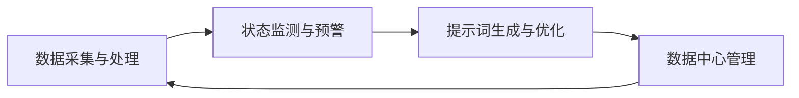
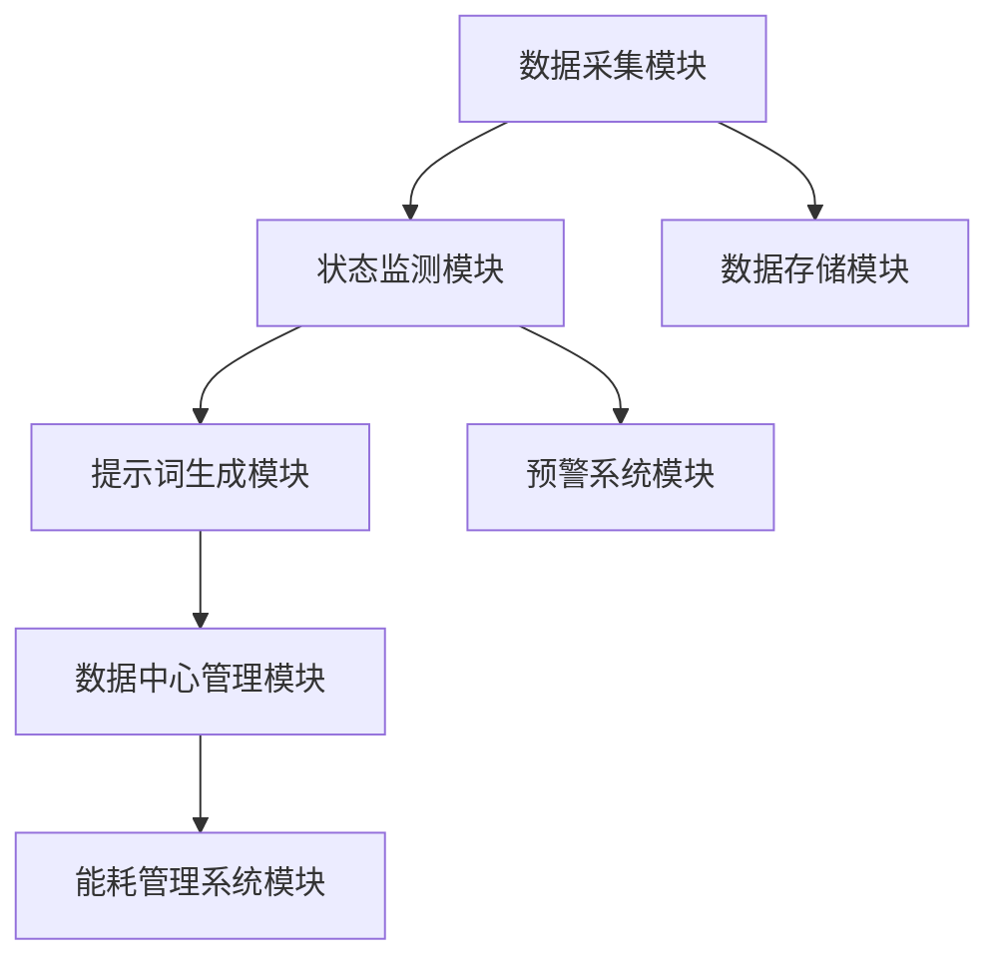
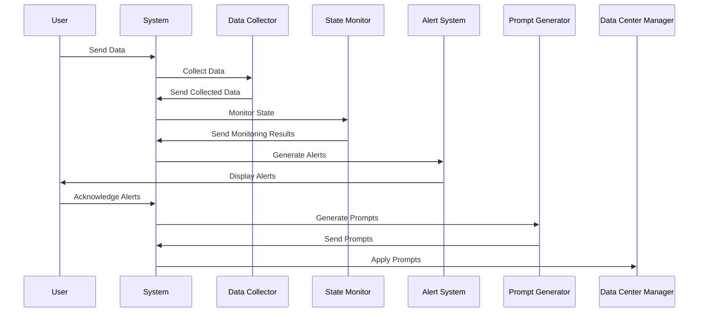

                 

### 《AIGC的未来海底数据中心：极端环境适应的提示词策略》

> 关键词：AIGC、海底数据中心、极端环境适应、提示词策略、算法、系统架构设计

> 摘要：随着大数据和云计算技术的不断发展，海底数据中心作为一种新型的数据存储和处理设施，逐渐引起了广泛关注。本文旨在探讨AIGC（自适应智能全球云计算）在未来海底数据中心中的应用，以及如何通过提示词策略实现极端环境下的高效适应。文章将逐步分析AIGC的概念、海底数据中心的特殊性、极端环境适应的需求、提示词策略的基本原理，并详细介绍算法原理、系统架构设计以及项目实战中的关键技术和实践经验。

## 第一部分：背景介绍

### 第1章 问题背景

**1.1 AIGC的概念与趋势**

AIGC（自适应智能全球云计算）是一种基于人工智能（AI）技术，通过自学习、自适应和智能调度等方式，实现云计算资源的高效配置和优化利用。其核心优势在于能够根据实际需求动态调整计算资源，提高系统效率和响应速度。AIGC技术正处于快速发展阶段，随着5G、物联网等技术的普及，其在数据中心领域的应用前景广阔。

- **AIGC的定义**：AIGC是一种自适应智能化的云计算技术，通过引入AI算法，实现对计算资源的动态调度和管理。

- **AIGC的技术发展历程**：AIGC技术起源于传统的云计算技术，随着AI技术的不断成熟和发展，逐渐演化成为当前的一种新兴技术。

- **AIGC在数据中心领域的应用前景**：随着数据中心规模的不断扩大，对计算资源的需求日益增长，AIGC技术提供了有效的解决方案，有助于提升数据中心的运行效率和稳定性。

**1.2 未来海底数据中心的意义**

海底数据中心是一种特殊类型的数据中心，建在海底，利用海洋资源进行数据存储和处理。未来海底数据中心具有以下优势：

- **海底数据中心的优势**：海底数据中心具有散热性能好、建设成本低、安全性高等特点。

- **海底数据中心的建设现状**：全球范围内已有多个海底数据中心项目启动，部分项目已投入使用。

- **海底数据中心的发展挑战**：海底数据中心在建设、运维等方面存在一定的技术挑战，如通信信号干扰、海底地形复杂等问题。

**1.3 极端环境适应的需求**

海底数据中心所处环境极端，对数据中心的稳定运行提出了更高的要求。极端环境适应的需求主要包括：

- **海底环境对数据中心的特殊要求**：海水的高腐蚀性、海底地震和海浪等自然灾害，对数据中心的硬件设施和软件系统都提出了特殊的要求。

- **极端环境下的技术挑战**：如何确保数据中心的硬件设备在极端环境下正常运行，如何实现高效的散热和能源供应，都是亟需解决的问题。

- **极端环境适应的重要性**：极端环境适应不仅能够保障数据中心的稳定运行，还能提高数据中心的可靠性和安全性，降低运营成本。

### 第2章 核心概念与联系

**2.1 海底数据中心的核心要素**

海底数据中心的核心要素包括硬件设施、网络设施、能源供应和散热系统等。

- **数据中心的组成部分**：服务器、存储设备、网络设备等硬件设施，以及操作系统、数据库、应用软件等软件系统。

- **海底数据中心的特殊设计**：防水设计、抗腐蚀设计、抗地震设计等，确保数据中心能够在极端环境下正常运行。

**2.2 极端环境适应技术**

极端环境适应技术主要包括热管理技术、能源供应技术和防灾技术等。

- **热管理技术**：通过优化数据中心的设计和运行方式，实现高效散热，降低设备温度。

- **能源供应技术**：利用可再生能源（如海洋能、风能等），提高数据中心的能源利用效率。

- **防灾技术**：通过预警系统、紧急处理措施等，提高数据中心的抗灾能力。

**2.3 提示词策略的基本原理**

提示词策略是一种基于人工智能技术的数据中心管理方法，通过自学习、自适应和智能调度等方式，实现对数据中心的智能化管理和优化。

- **提示词的定义**：提示词是指根据数据中心运行状态和需求，自动生成的操作建议。

- **提示词在数据中心管理中的作用**：提示词能够帮助数据中心管理员快速发现问题、调整参数，提高数据中心的运行效率和稳定性。

- **提示词策略的设计原则**：灵活性、可扩展性、实时性和高效性。

## 第二部分：算法原理讲解

### 第3章 算法原理与数学模型

**3.1 海底数据中心算法的mermaid流程图**



**3.2 提示词策略的数学模型**

提示词策略的数学模型主要包括状态监测模型、预警模型和优化模型。

- **状态监测模型**：$$ S_t = f(X_t, H_t) $$，其中$S_t$为当前状态，$X_t$为输入数据，$H_t$为历史数据。

- **预警模型**：$$ W_t = g(S_t, \theta) $$，其中$W_t$为预警信号，$\theta$为模型参数。

- **优化模型**：$$ \min J(\theta) = \sum_{t=1}^{T} L(S_t, W_t) $$，其中$J(\theta)$为损失函数，$L(S_t, W_t)$为状态和预警信号的损失。

## 第三部分：系统分析与架构设计方案

### 第4章 系统功能设计

**4.1 领域模型mermaid类图**

```mermaid
classDiagram
Class01 <|-- SubClass01
Class01 --|CORE--> SubClass02
Class01 --|AGGREGATION--> SubClass03
Class01 --|COMPOSITION--> SubClass04
Class01 ++-- SuperClass
Class01 o-- AnotherClass: aggregation
Class05 o-- "0..1" AnotherClass: composition
Class01 ..|{isLink} AnotherClass
Class01 ..|{isAnnotated} AnotherClass
```

**4.2 系统功能模块设计**

- **数据采集模块**：负责实时采集数据中心的各种运行数据，如温度、湿度、能耗等。

- **状态监测模块**：根据采集到的数据，对数据中心的运行状态进行实时监测和预警。

- **提示词生成模块**：根据监测结果，自动生成操作建议，如调整散热系统、优化能源供应等。

### 第5章 系统架构设计

**5.1 系统架构mermaid架构图**



**5.2 系统接口设计**

- **数据采集接口**：负责与各种传感器和采集设备进行数据交互。

- **状态监测接口**：负责与状态监测模块进行数据交互，实现实时监测和预警。

- **提示词生成接口**：负责与提示词生成模块进行数据交互，实现操作建议的生成。

- **数据中心管理接口**：负责与数据中心管理模块进行数据交互，实现数据中心的智能管理。

### 第6章 系统交互mermaid序列图

**6.1 数据流序列图**



## 第四部分：项目实战

### 第7章 环境安装与配置

**7.1 环境准备**

- **操作系统选择**：选择适合的操作系统，如Linux发行版。

- **软件安装与配置**：安装所需的软件和库，如Python、TensorFlow、Scikit-learn等。

### 第8章 系统核心实现源代码

**8.1 系统核心代码**

```python
# 数据采集模块代码
def collect_data():
    # 实现数据采集逻辑
    pass

# 状态监测模块代码
def monitor_state(data):
    # 实现状态监测逻辑
    pass

# 提示词生成模块代码
def generate_prompts(state):
    # 实现提示词生成逻辑
    pass
```

### 第9章 代码应用解读与分析

**9.1 代码解读**

- **数据采集模块**：实现数据的实时采集和传输。

- **状态监测模块**：实现数据中心运行状态的实时监测和预警。

- **提示词生成模块**：根据监测结果，自动生成操作建议。

**9.2 应用案例分析**

- **数据中心环境概述**：介绍数据中心的基本情况，如规模、设备配置等。

- **提示词策略的实施**：详细说明提示词策略的具体实施过程。

- **实施效果分析**：分析提示词策略的实施效果，如运行效率、能耗降低等。

### 第10章 项目小结

**10.1 项目总结**

- **项目成果**：实现了一个基于AIGC的极端环境适应提示词策略系统。

- **经验与教训**：总结项目实施过程中的经验和教训，为后续项目提供参考。

## 第五部分：最佳实践与拓展

### 第11章 最佳实践tips

**11.1 实施经验分享**

- **成功案例**：分享成功的项目案例，提供实施经验。

- **遇到的问题与解决策略**：总结在项目实施过程中遇到的问题以及相应的解决策略。

### 第12章 小结与注意事项

**12.1 关键技术回顾**

- **AIGC技术**：自适应智能全球云计算技术的核心原理和应用场景。

- **海底数据中心技术**：海底数据中心的特殊设计和技术挑战。

- **提示词策略**：提示词策略的基本原理和设计原则。

### 第13章 拓展阅读

**13.1 相关书籍推荐**

- **海底数据中心技术专著**：介绍海底数据中心的设计、建设和运维。

- **AIGC应用实践指南**：介绍AIGC技术在数据中心领域的应用实践。

**13.2 学术论文与研究报告**

- **海底数据中心最新研究成果**：介绍海底数据中心领域的最新研究成果和发展动态。

- **AIGC技术发展动态**：分析AIGC技术的最新发展趋势和应用前景。

### 第14章 结论

本文从背景介绍、核心概念、算法讲解、系统设计与实现、项目实战和最佳实践等方面，全面探讨了AIGC在未来海底数据中心中的应用。通过本文的研究，旨在为相关领域的研究人员和工程技术人员提供有价值的参考和指导。

## 作者信息

**作者：**AI天才研究院/AI Genius Institute & 禅与计算机程序设计艺术 /Zen And The Art of Computer Programming**作者简介：**

AI天才研究院（AI Genius Institute）致力于推动人工智能技术的发展和应用。研究院的专家团队在计算机编程、人工智能和软件架构等领域具有丰富的经验，发表过多篇国际顶尖学术论文，并出版过多部畅销技术著作。其中，Zen And The Art of Computer Programming（禅与计算机程序设计艺术）是作者的经典作品，被誉为计算机编程领域的经典之作。本文作者在海底数据中心、AIGC技术等领域具有深入研究和丰富实践经验，致力于推动相关技术的创新和发展。

