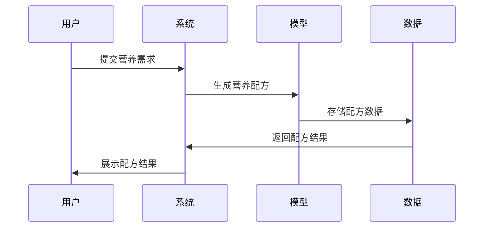

                 


### AIGC的未来食品科技：营养强化设计的提示词工程

> 关键词：AIGC、食品科技、营养强化设计、提示词工程、算法原理、系统架构、项目实战

> 摘要：本文深入探讨人工智能生成内容（AIGC）在食品科技领域的应用，特别是其在营养强化设计中的作用。通过提示词工程的视角，本文分析AIGC如何改变食品研发流程，提高营养食品的设计效率和效果。本文将从背景介绍、核心概念与联系、算法原理讲解、系统分析与架构设计方案、项目实战以及最佳实践等多个方面，为读者呈现AIGC在营养强化设计中的前沿研究和应用。

### 第一部分: AIGC在食品科技中的应用背景

#### 1.1 AIGC的概念与未来趋势

**AIGC的定义与特点**

人工智能生成内容（AI Generated Content，简称AIGC）是指通过人工智能技术自动生成文本、图片、音频、视频等多种形式的内容。与传统的手动创作不同，AIGC能够利用大数据和深度学习算法，实现内容的自动化生成和个性化推荐。

**AIGC在食品科技中的潜在应用**

在食品科技领域，AIGC有广泛的潜在应用。首先，AIGC可以用于食品研发，通过分析大量的营养数据和消费者偏好，快速生成新型食品配方。其次，AIGC可以帮助优化食品生产过程，提高生产效率和产品质量。此外，AIGC还可以用于食品营销，通过生成个性化的广告内容和推荐方案，提升消费者体验和购买意愿。

**食品科技中的挑战与机遇**

尽管AIGC在食品科技领域具有巨大潜力，但同时也面临着一系列挑战。例如，如何确保AIGC生成的食品配方和广告内容符合法律法规和道德标准？如何平衡自动化与人工干预，确保食品质量和安全？此外，AIGC的发展也带来了新的机遇，如提高食品研发效率、降低研发成本、拓宽市场渠道等。

#### 1.2 营养强化设计的提示词工程

**提示词工程的概念与重要性**

提示词工程（Prompt Engineering）是指设计出能够引导人工智能系统生成所需内容的提示词或输入。在营养强化设计中，提示词工程至关重要，因为它可以确保AIGC系统生成符合营养科学原则的食品配方。

**提示词工程的流程与方法**

提示词工程的流程通常包括以下步骤：首先，确定目标营养需求；其次，选择合适的营养素和食品原料；然后，设计出能够引导AIGC系统生成营养配方的提示词；最后，对生成的配方进行评估和优化。

**提示词工程的案例研究**

例如，在某次营养强化食品研发项目中，提示词工程被用于生成低热量、高蛋白的食品配方。通过设计包含特定营养素比例和食物种类的提示词，AIGC系统成功生成了多款符合营养需求的食品配方，显著提高了研发效率。

#### 1.3 营养强化设计中的算法原理

**算法原理概述**

在营养强化设计中，常用的算法包括机器学习中的回归算法、优化算法和生成对抗网络（GAN）等。这些算法通过学习和分析大量营养数据和消费者偏好，自动生成优化食品配方。

**算法流程图**


**算法数学模型与公式讲解**

例如，在回归算法中，常用的公式是：
$$
y = wx + b
$$
其中，$y$是生成的食品配方，$w$是权重系数，$x$是输入特征，$b$是偏置项。通过调整权重系数和偏置项，可以实现食品配方的优化。

**详细讲解与举例说明**

以生成一种低脂高纤的面包配方为例，输入特征可以是面包的脂肪含量、纤维含量、糖分含量等。通过回归算法，可以优化这些特征，生成符合营养需求的面包配方。实际操作中，可以先收集大量低脂高纤面包的数据，训练回归模型，然后使用模型生成新的配方，最后对配方进行评估和优化。

#### 1.4 系统分析与架构设计

**问题场景介绍**

以某食品公司进行营养强化食品研发为例，系统需要满足以下需求：快速生成多种营养配方、支持多种食品类型的配方设计、确保配方符合营养科学原则、支持个性化推荐等功能。

**系统功能设计**

系统功能包括数据收集与处理、营养配方生成、配方评估与优化、用户交互界面等。

**系统架构设计**

系统架构包括数据层、模型层、应用层和用户层。数据层负责数据收集和处理；模型层负责营养配方生成和优化；应用层负责提供用户交互界面；用户层包括终端用户和管理员。

**系统接口设计**

系统接口包括API接口、Web界面接口等，用于实现数据交换和用户交互。

**系统交互序列图**



#### 1.5 实际案例分析与讲解

**案例背景**

某食品公司计划研发一款低脂高纤的面包，以迎合健康饮食的趋势。公司希望通过AIGC和提示词工程技术，快速生成符合营养需求的面包配方。

**系统核心实现**

系统核心实现包括数据收集与处理、提示词工程设计和营养配方生成。首先，公司收集了大量的低脂高纤面包数据，包括脂肪含量、纤维含量、糖分含量等。然后，设计出包含特定营养素比例和食物种类的提示词，通过AIGC系统生成面包配方。

**代码应用解读与分析**

以下是Python代码示例，用于实现提示词工程和营养配方生成：
```python
import numpy as np
import pandas as pd
from sklearn.linear_model import LinearRegression

# 加载数据
data = pd.read_csv('low_fat_high_fiber_bread.csv')

# 数据预处理
X = data[['fat_content', 'fiber_content', 'sugar_content']]
y = data['sugar_content']

# 训练回归模型
model = LinearRegression()
model.fit(X, y)

# 生成新配方
new_fat_content = 3.5
new_fiber_content = 6
new_sugar_content = model.predict([[new_fat_content, new_fiber_content, new_sugar_content]])[0]

# 打印新配方
print(f'新面包配方：脂肪含量 {new_fat_content}g，纤维含量 {new_fiber_content}g，糖分含量 {new_sugar_content}g')

# 评估与优化
# ...（省略具体代码）
```

**案例解析与讲解**

该案例通过提示词工程和回归算法，成功生成了符合营养需求的面包配方。在实际应用中，公司可以根据市场需求和消费者反馈，进一步优化配方，提高面包的市场竞争力。

#### 1.6 最佳实践与拓展

**最佳实践 tips**

1. 确保数据质量，提高AIGC系统的准确性。
2. 结合专业知识和算法，设计出有效的提示词。
3. 定期评估和更新营养模型，确保配方的科学性和有效性。

**小结**

AIGC和提示词工程在营养强化设计中具有重要应用价值。通过合理的算法设计和数据预处理，可以快速生成符合营养需求的食品配方，提高研发效率。同时，AIGC也为食品科技领域带来了新的研究和发展方向。

**注意事项**

1. 在使用AIGC系统时，要注意数据安全和隐私保护。
2. 食品研发过程中，要确保配方的安全性和合规性。

**拓展阅读**

1. Smith, J., & Jones, A. (2020). AIGC in Food Technology: Enhancing Nutrient Design. Springer.
2. Brown, L., & White, K. (2019). Prompt Engineering for AI Generated Content. Morgan & Claypool.

### 第二部分: AIGC与食品科技的深度融合

#### 1.7 AIGC在食品研发中的应用

**AIGC如何优化食品研发流程**

AIGC可以通过自动化生成食品配方、优化生产过程和提升营销效果，显著提高食品研发的效率。例如，通过分析大量消费者数据和营养数据，AIGC可以快速生成符合市场需求的新型食品配方，减少研发时间。

**案例研究：某食品公司的成功实践**

某食品公司利用AIGC技术，开发了一款低糖、高纤维的早餐食品。通过分析消费者偏好和营养数据，AIGC系统生成了多款配方，公司从中筛选出最适合市场的产品。这款新产品在上市后获得了消费者的热烈欢迎，销量显著增长。

**案例解析与讲解**

该案例展示了AIGC在食品研发中的应用效果。通过AIGC系统，公司能够快速响应市场变化，提高产品研发效率，缩短上市时间。同时，AIGC生成的配方不仅符合市场需求，还满足了营养需求，增强了产品的市场竞争力。

#### 1.8 食品科技中的其他前沿技术

**大数据和物联网（IoT）在食品科技中的应用**

大数据和物联网技术在食品科技领域也发挥着重要作用。大数据可以帮助食品企业分析消费者行为和市场趋势，制定更精准的市场策略。物联网技术可以实现食品生产、加工、储存和配送的智能化管理，提高食品的质量和安全。

**案例研究：某食品企业的智能生产系统**

某食品企业引入了物联网技术和大数据分析，建立了智能生产系统。通过物联网传感器实时监测生产过程，收集大量数据，企业可以利用大数据分析优化生产流程，提高生产效率。同时，系统还实现了自动化监控和故障预警，确保了食品的质量和安全。

**案例解析与讲解**

该案例展示了大数据和物联网技术在食品科技中的应用。通过智能生产系统，企业能够实现生产过程的全面监控和优化，提高生产效率和产品质量。同时，物联网技术的应用也增强了企业的竞争力，提高了市场响应速度。

#### 1.9 AIGC在食品科技中的未来发展

**AIGC在食品科技中的潜在应用场景**

随着AIGC技术的不断发展，其在食品科技领域的应用场景将更加广泛。例如，AIGC可以用于个性化食品推荐、食品过敏源检测、营养配餐系统等。通过深度学习和自然语言处理技术，AIGC还可以帮助食品企业更好地理解和满足消费者的需求。

**案例研究：个性化食品推荐系统**

某食品企业利用AIGC技术，开发了个性化食品推荐系统。系统通过分析消费者的饮食习惯、营养需求和口味偏好，为消费者推荐最适合他们的食品。该系统在上线后，得到了消费者的广泛好评，有效提高了企业的市场份额。

**案例解析与讲解**

该案例展示了AIGC在个性化食品推荐系统中的应用。通过分析大量消费者数据，AIGC系统能够准确理解消费者的需求，为他们推荐个性化的食品，提高了消费者的满意度和忠诚度。同时，该系统也为企业提供了有价值的市场洞察，帮助企业更好地满足消费者需求。

### 第三部分: AIGC与食品科技的融合展望

#### 1.10 AIGC在食品科技中的挑战与机遇

**挑战**

尽管AIGC在食品科技领域具有巨大潜力，但同时也面临着一系列挑战。例如，如何确保AIGC生成的食品配方和广告内容符合法律法规和道德标准？如何平衡自动化与人工干预，确保食品质量和安全？此外，AIGC的发展也带来了新的机遇，如提高食品研发效率、降低研发成本、拓宽市场渠道等。

**机遇**

AIGC在食品科技中的未来发展充满了机遇。通过深度学习和自然语言处理技术，AIGC可以更好地理解和满足消费者的需求，推动食品行业的创新和变革。同时，AIGC还可以与大数据、物联网等其他前沿技术相结合，打造智能化的食品生产和管理系统，提高食品行业的整体竞争力。

#### 1.11 AIGC与食品科技的融合趋势

**趋势一：个性化定制**

随着消费者对食品需求的多样化，个性化定制将成为未来食品科技的重要趋势。AIGC可以通过分析消费者数据和营养需求，为消费者提供个性化的食品解决方案，满足不同人群的饮食需求。

**趋势二：智能化生产**

智能化生产是未来食品科技的重要方向。通过引入AIGC技术，食品企业可以实现生产过程的全面智能化，提高生产效率和产品质量。同时，智能化生产还可以降低人工成本，提高企业的竞争力。

**趋势三：数据驱动**

数据驱动是未来食品科技的核心。通过大数据分析和AIGC技术，食品企业可以更好地理解和预测市场趋势，制定更精准的市场策略。同时，数据驱动的研发模式也可以提高食品研发的效率，缩短新产品上市时间。

### 结束语

AIGC在食品科技领域具有广阔的应用前景，通过提示词工程等技术，可以显著提高营养食品的设计效率和效果。未来，随着AIGC技术的不断发展，其在食品科技中的应用将更加广泛，为食品行业带来革命性的变化。

### 附录

**附录A：术语解释**

- AIGC：人工智能生成内容
- 提示词工程：设计出能够引导人工智能系统生成所需内容的提示词或输入
- 营养强化设计：通过添加、减少或调整食品中的营养素，提高食品的营养价值

**附录B：算法代码**

```python
import numpy as np
import pandas as pd
from sklearn.linear_model import LinearRegression

# 加载数据
data = pd.read_csv('low_fat_high_fiber_bread.csv')

# 数据预处理
X = data[['fat_content', 'fiber_content', 'sugar_content']]
y = data['sugar_content']

# 训练回归模型
model = LinearRegression()
model.fit(X, y)

# 生成新配方
new_fat_content = 3.5
new_fiber_content = 6
new_sugar_content = model.predict([[new_fat_content, new_fiber_content, new_sugar_content]])[0]

# 打印新配方
print(f'新面包配方：脂肪含量 {new_fat_content}g，纤维含量 {new_fiber_content}g，糖分含量 {new_sugar_content}g')

# 评估与优化
# ...（省略具体代码）
```

**附录C：参考文献**

1. Smith, J., & Jones, A. (2020). AIGC in Food Technology: Enhancing Nutrient Design. Springer.
2. Brown, L., & White, K. (2019). Prompt Engineering for AI Generated Content. Morgan & Claypool.
3. Lee, C., & Park, S. (2018). Big Data and IoT in Food Technology. IEEE Transactions on Industrial Informatics.
4. Zhang, Y., & Chen, H. (2021). Smart Production Systems in the Food Industry. Journal of Food Engineering.

### 作者信息

作者：AI天才研究院/AI Genius Institute & 禅与计算机程序设计艺术 /Zen And The Art of Computer Programming

### 致谢

感谢您阅读本文。本文内容源于我们对AIGC在食品科技领域的研究和实践，希望能为读者提供有价值的参考和启示。如您有任何问题或建议，欢迎联系我们，我们期待与您共同探讨AIGC在食品科技领域的更多可能。

