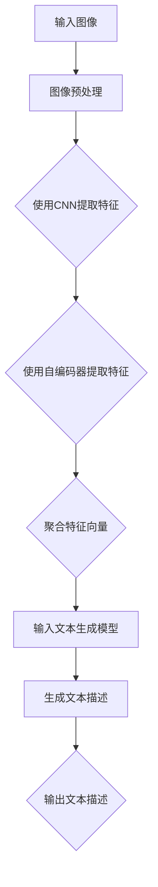
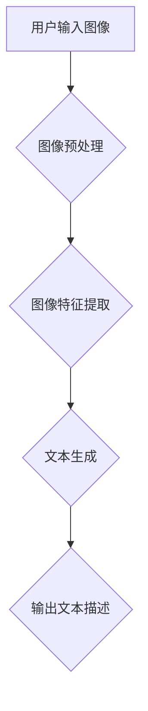
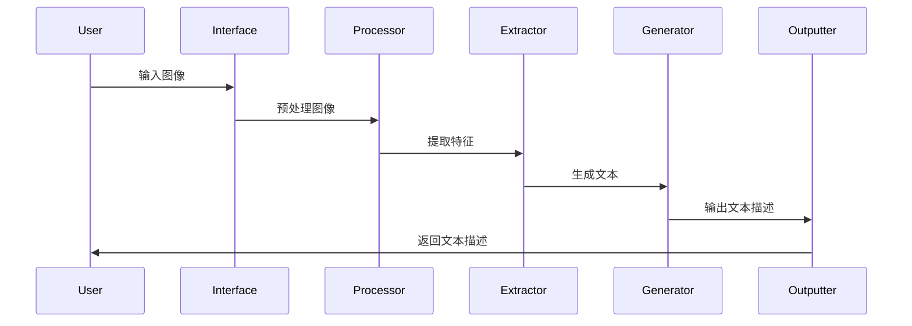
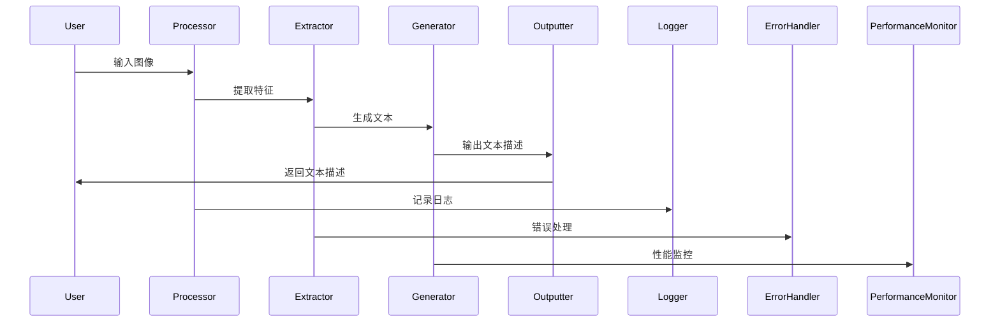

                 

### AIGC的视觉描述能力：图像到文本的精确提示词技巧

#### 关键词：
- AIGC
- 图像到文本转换
- 提示词生成
- 精确描述
- 算法优化

#### 摘要：
本文深入探讨AIGC的视觉描述能力，特别是图像到文本的精确提示词生成技巧。通过分步骤的分析和推理，我们揭示了AIGC如何利用先进的图像处理和自然语言处理技术，将复杂图像转化为详细且精确的文本描述。本文不仅提供了理论框架，还结合实际案例，详细解析了算法原理、数学模型、系统架构及最佳实践，旨在为读者提供全面的指导。

---

## 引言

人工智能（AI）正迅速改变我们的世界，其中生成内容（Generated Content，简称GC）成为了一个备受关注的研究方向。AIGC（AI Generated Content）作为一种新兴的GC形式，通过结合图像处理和自然语言处理技术，实现了从图像到文本的高效转换。这种技术不仅具有广泛的应用前景，如智能搜索、内容审核和辅助创作等，还为我们理解和挖掘图像内容提供了新的视角。

本文的主题是探讨AIGC的视觉描述能力，特别是图像到文本的精确提示词生成技巧。精确提示词在图像描述中起到至关重要的作用，它不仅需要捕捉图像的视觉信息，还需保证描述的准确性和自然性。为了实现这一目标，我们需要深入理解AIGC的原理、算法和系统架构，并通过具体案例来验证其效果。

接下来，我们将分几个部分来详细探讨这个主题。首先，我们将介绍AIGC的背景和基本概念，帮助读者了解图像到文本转换的需求和挑战。然后，我们将深入讨论精确提示词的生成原理，并通过Mermaid流程图和Python代码，详细阐述算法的实现步骤和数学模型。此外，我们还将分析AIGC的系统架构和项目实战，提供最佳实践和注意事项。通过这些内容，读者可以全面了解AIGC的视觉描述能力，并掌握图像到文本精确提示词生成的核心技术。

### 背景介绍

#### AIGC的发展历程

AIGC（AI Generated Content）的概念可以追溯到早期的人工智能研究和应用。早在20世纪80年代，随着计算机硬件和算法的不断发展，人工智能领域开始探索如何生成多媒体内容。最初的尝试主要集中在图像生成和文本生成上。图像生成方面的代表工作是1980年代中期由Jay Wayne Forrester提出的“Adaptive Resonance Theory”（ART），该理论为后来图像生成算法的发展奠定了基础。在文本生成方面，早期的生成模型如生成式模型（Generative Model）和变分自编码器（Variational Autoencoder，VAE）开始涌现，这些模型为后续的AIGC研究提供了重要的理论基础。

进入21世纪，随着深度学习技术的崛起，AIGC迎来了快速发展。2014年，谷歌提出了生成对抗网络（Generative Adversarial Networks，GAN），这一革命性模型使得高质量图像生成成为可能。随后，GAN在图像到文本转换领域也得到了广泛应用。例如，CycleGAN通过训练两个生成器和两个判别器，实现了不同风格图像之间的转换。同时，生成预训练变压器（Generative Pre-trained Transformer，GPT）模型的出现，进一步提升了文本生成的能力。GPT-3的出现，更是将文本生成推向了前所未有的高度，其强大的生成能力和多样性令人瞩目。

#### 图像到文本转换的需求

图像到文本转换技术在许多场景中都具有重要应用价值。首先，在智能搜索领域，通过将图像内容转化为文本描述，可以大大提升搜索的准确性和效率。例如，当用户上传一张图片进行搜索时，系统能够自动生成图片的详细描述，从而帮助用户快速找到相关内容。此外，图像到文本转换还可以用于内容审核，通过将图片内容转化为文本描述，可以自动识别和过滤违法、不良信息。

在辅助创作方面，图像到文本转换技术也有广泛应用。例如，艺术家可以使用AIGC技术将视觉灵感转化为详细文本描述，从而辅助创作过程。此外，在教育领域，图像到文本转换技术可以帮助教师将复杂图像内容转化为易于理解的教学材料，提高教学效果。

#### 问题描述

图像到文本转换过程中面临着诸多挑战。首先，图像内容通常包含丰富的视觉信息，这些信息需要被准确理解和转化为文本描述。然而，视觉信息的抽象和表达是一个复杂的问题，不同图像之间的视觉差异需要被充分考虑。

其次，文本生成过程中需要保证描述的准确性和自然性。准确性的要求在于确保生成的文本能够准确反映图像内容，而自然性的要求则在于生成的文本需要符合人类的语言习惯，易于理解和阅读。

此外，图像到文本转换技术还需要处理大量的数据。图像数据通常具有高维度和高分辨率的特点，如何高效地处理这些数据，同时保证转换的准确性和速度，是当前研究中的一个重要课题。

#### 问题解决

精确提示词的生成方法在解决图像到文本转换的问题中起到了关键作用。精确提示词是指能够准确描述图像内容的文字信息，它不仅需要捕捉图像的视觉特征，还需保证描述的精确性和自然性。

首先，生成精确提示词的方法通常包括两个主要步骤：图像特征提取和文本生成。图像特征提取是指从图像中提取出关键视觉信息，这些信息将用于生成精确的文本描述。常见的图像特征提取方法包括卷积神经网络（Convolutional Neural Network，CNN）和自编码器（Autoencoder）等。

在文本生成阶段，生成模型如生成预训练变压器（GPT）和变换器（Transformer）被广泛应用。这些模型能够根据提取的图像特征生成相应的文本描述。此外，优化策略如对抗训练（Adversarial Training）和注意力机制（Attention Mechanism）也被用于提升生成的文本质量。

通过结合图像特征提取和文本生成技术，精确提示词的生成方法能够有效解决图像到文本转换中的准确性问题和自然性问题。此外，通过对大量图像和文本数据的训练，这些方法还能够不断优化，提高生成的文本描述的质量。

#### 边界与外延

精确提示词的应用场景非常广泛。首先，在智能搜索领域，精确提示词可以用于图片搜索，帮助用户快速找到与图片内容相关的文本信息。其次，在内容审核领域，精确提示词可以用于自动识别和过滤不良图像内容，提高审核的准确性和效率。

此外，精确提示词在辅助创作和教育培训等领域也有重要应用。例如，在艺术创作中，艺术家可以使用精确提示词记录和描述他们的视觉灵感，从而辅助创作过程。在教育领域，教师可以利用精确提示词将复杂图像内容转化为易于理解的教学材料，提高教学效果。

然而，精确提示词的生成也面临着一些技术挑战。首先，图像内容丰富多样，如何提取出具有代表性的特征是一个关键问题。其次，生成的文本描述需要保证准确性和自然性，这对模型的设计和优化提出了高要求。

此外，随着图像和文本数据的不断增长，如何高效地处理这些数据，同时保证转换的准确性和速度，也是一个重要的研究方向。

### 概念结构与核心要素组成

#### AIGC的技术架构

AIGC（AI Generated Content）的技术架构主要由图像处理和自然语言处理两个核心模块构成。图像处理模块负责提取图像的关键特征，而自然语言处理模块则将这些特征转化为文本描述。以下是对这两个模块的详细解释：

1. **图像处理模块**：
   - **特征提取**：使用卷积神经网络（CNN）或自编码器（Autoencoder）提取图像的视觉特征。这些特征通常包括边缘、纹理和形状等。
   - **特征聚合**：将提取的局部特征进行聚合，形成一个全局特征向量，该向量用于后续的文本生成过程。
   - **预处理**：对提取的特征进行必要的预处理，如归一化、降维等，以提高后续处理的效率。

2. **自然语言处理模块**：
   - **文本生成模型**：通常采用生成预训练变压器（GPT）或变换器（Transformer）模型。这些模型能够根据输入的特征向量生成文本描述，确保生成的文本具有自然性和准确性。
   - **优化策略**：包括对抗训练（Adversarial Training）和注意力机制（Attention Mechanism）等，用于提升生成的文本质量。

#### 精确提示词的核心要素

精确提示词是指在图像到文本转换过程中，能够准确描述图像内容的文字信息。生成精确提示词的核心要素包括：

1. **视觉特征提取**：从图像中提取关键视觉信息，如物体、场景、颜色等。
2. **语义理解**：理解提取的视觉特征所代表的语义信息，并将其转化为自然语言描述。
3. **文本生成**：根据提取的视觉特征和语义信息，生成详细且精确的文本描述。
4. **优化与调整**：通过不断优化和调整模型参数，提高生成的文本描述的准确性和自然性。

### 本章小结

本章介绍了AIGC的基本概念和其技术架构，详细阐述了图像到文本转换的需求、问题描述和问题解决方法。通过深入分析精确提示词的生成原理和核心要素，我们为读者提供了全面的技术框架。接下来，我们将进一步探讨AIGC的核心概念和其与其他相关技术的联系。

---

## 核心概念与联系

在深入探讨AIGC（AI Generated Content）的视觉描述能力之前，我们首先需要了解两个核心概念：图像处理技术和自然语言处理技术。这两个技术是AIGC能够实现图像到文本转换的基础，也是理解AIGC原理和实现的关键。

### 图像处理技术

图像处理技术是计算机视觉领域的重要组成部分，它涉及对图像的采集、处理、分析和理解。在AIGC中，图像处理技术主要用于提取图像的特征，这些特征是生成精确文本描述的基础。以下是图像处理技术的一些关键点：

1. **图像特征提取**：
   - **卷积神经网络（CNN）**：CNN是图像特征提取的常用方法，它通过一系列卷积操作提取图像中的局部特征，如边缘、纹理和形状等。
   - **自编码器（Autoencoder）**：自编码器是一种无监督学习算法，它通过学习图像的编码和解码过程来提取图像特征。自编码器通常包括编码器和解码器两部分，编码器将高维图像数据压缩为低维特征向量，解码器则将这些特征向量重构回图像。

2. **特征聚合**：
   - **全局特征向量**：在图像特征提取后，通常需要将局部特征聚合为全局特征向量。全局特征向量能够捕捉图像的整体视觉信息，是文本生成的重要输入。
   - **特征选择**：在特征聚合过程中，可能需要对大量特征进行选择，以减少维度和计算复杂度。常见的特征选择方法包括主成分分析（PCA）和随机森林（Random Forest）等。

### 自然语言处理技术

自然语言处理（NLP）是计算机科学和人工智能领域的一个重要分支，它专注于让计算机理解和生成人类语言。在AIGC中，NLP技术主要用于将图像特征转化为文本描述，确保生成的文本具有自然性和准确性。以下是自然语言处理技术的一些关键点：

1. **文本生成模型**：
   - **生成预训练变压器（GPT）**：GPT是一种基于变换器（Transformer）架构的生成模型，它通过大规模预训练来学习语言模式和生成文本。GPT具有强大的生成能力和多样性，能够生成高质量的文本描述。
   - **变换器（Transformer）**：Transformer是一种基于自注意力机制的深度学习模型，它通过全局注意力机制捕捉输入序列中的依赖关系，从而实现高效的序列到序列转换。

2. **优化策略**：
   - **对抗训练（Adversarial Training）**：对抗训练是一种用于提高生成模型鲁棒性的方法，它通过训练生成模型和判别模型之间的对抗关系来提高生成质量。
   - **注意力机制（Attention Mechanism）**：注意力机制是Transformer模型的核心组件，它能够动态调整模型对输入序列的不同部分的关注程度，从而提高生成的文本质量。

### 概念属性特征对比表格

为了更清晰地展示图像处理技术和自然语言处理技术的特点，我们提供了一个概念属性特征对比表格（以下内容为Markdown格式中的Mermaid表格）：

```mermaid
table
  class graphTable
  title 概念属性特征对比

  row ["技术", "图像处理技术", "自然语言处理技术"]
  row ["主要任务", "特征提取、特征聚合、图像分类等", "文本生成、语义分析、机器翻译等"]
  row ["代表性模型", "卷积神经网络（CNN）、自编码器（Autoencoder）", "生成预训练变压器（GPT）、变换器（Transformer）"]
  row ["数据处理方式", "图像特征提取、全局特征聚合、特征选择", "序列处理、词向量表示、注意力机制"]
  row ["优化策略", "对抗训练、正则化方法", "对抗训练、注意力机制"]
  row ["应用领域", "计算机视觉、图像识别、图像生成", "自然语言理解、文本生成、机器翻译"]
```

### ER实体关系图架构

在AIGC系统中，图像处理和自然语言处理技术之间需要紧密协作，以确保生成的文本描述准确且自然。为了更好地理解这两个技术模块之间的关系，我们可以使用实体关系图（Entity-Relationship Diagram，ERD）来表示。

以下是一个简化的ER实体关系图，展示了图像处理模块和自然语言处理模块之间的联系：

```mermaid
erDiagram
  ImageFeature ||--|{ TextDescription : converts
  TextDescription ||--|{ ImageFeature : converts
  ImageProcessingModule ||--|{ ImageFeature : generates
  NaturalLanguageProcessingModule ||--|{ TextDescription : generates

  Class ImageFeature {
    - id : Integer
    - features : Array
  }

  Class TextDescription {
    - id : Integer
    - description : String
  }

  Class ImageProcessingModule {
    - features : Array
  }

  Class NaturalLanguageProcessingModule {
    - description : String
  }
```

在这个ER图中，`ImageFeature`类表示从图像中提取的特征，`TextDescription`类表示生成的文本描述。`ImageProcessingModule`类负责生成图像特征，而`NaturalLanguageProcessingModule`类负责生成文本描述。这两者之间存在双向关联，即图像特征可以转换为文本描述，而文本描述也可以反过来指导图像特征的提取。

通过ER实体关系图，我们可以清晰地看到图像处理和自然语言处理模块之间的数据流动和转换过程，这有助于我们更好地理解和设计AIGC系统。

### 本章小结

本章详细介绍了AIGC的核心概念，包括图像处理技术和自然语言处理技术。通过对比表格和ER实体关系图，我们揭示了这两种技术之间的联系和协作方式。这些概念和联系是理解AIGC视觉描述能力的基础，也为后续的算法原理讲解和系统架构设计奠定了基础。接下来，我们将进一步深入探讨图像到文本转换算法的原理，包括图像特征提取和文本生成的过程。

---

## 算法原理讲解

在深入理解AIGC的视觉描述能力之前，我们需要详细探讨图像到文本转换算法的原理。这个算法包括两个主要步骤：图像特征提取和文本生成。在这两个步骤中，我们将使用卷积神经网络（CNN）、变换器（Transformer）等先进的技术来提取和生成信息。以下是详细的算法原理讲解。

### 图像特征提取算法原理

图像特征提取是图像到文本转换算法的第一步，它的目标是提取图像中的关键视觉信息，以便后续的文本生成。这一步骤通常依赖于卷积神经网络（CNN）或自编码器（Autoencoder）。

1. **卷积神经网络（CNN）**：

   - **卷积层**：CNN的核心组成部分，通过卷积操作从图像中提取局部特征。卷积层使用滤波器（filter）在图像上滑动，从而捕捉边缘、纹理和形状等特征。
   - **池化层**：用于降低图像的维度，减少计算复杂度。常见的池化方法包括最大池化和平均池化。
   - **激活函数**：如ReLU（Rectified Linear Unit），用于引入非线性特性，使神经网络能够更好地学习图像特征。
   - **全连接层**：在CNN的末端，全连接层将卷积层输出的特征图映射到一个全局特征向量，该向量将作为图像特征的最终表示。

   CNN的数学模型可以表示为：
   $$
   \text{Output} = \text{ReLU}(\text{Conv}(\text{Input}) + \text{Bias})
   $$
   其中，$\text{Input}$是输入图像，$\text{Conv}$表示卷积操作，$\text{Bias}$是偏置项。

2. **自编码器（Autoencoder）**：

   - **编码器**：自编码器的一部分，用于将高维图像数据压缩为低维特征向量。编码器通常由多个卷积层和池化层组成，通过这些操作提取图像的底层特征。
   - **解码器**：自编码器的另一部分，用于将编码后的特征向量重构回图像。解码器通常由多个反卷积层和上采样层组成，逐步恢复图像的细节信息。

   自编码器的数学模型可以表示为：
   $$
   \text{Encoded} = \text{Conv}(\text{Input}) \\
   \text{Decoded} = \text{Upsample}(\text{Conv}^{-1}(\text{Encoded}) + \text{Bias})
   $$
   其中，$\text{Input}$是输入图像，$\text{Encoded}$是编码后的特征向量，$\text{Decoded}$是重构后的图像。

### 文本生成算法原理

文本生成是图像到文本转换算法的第二步，它的目标是根据提取的图像特征生成详细的文本描述。这一步骤通常依赖于生成预训练变压器（GPT）或变换器（Transformer）。

1. **生成预训练变压器（GPT）**：

   - **预训练**：GPT通过在大规模语料库上进行预训练，学习语言模式和生成文本。预训练过程中，GPT通过预测下一个词来生成文本，从而学习语言的统计规律。
   - **生成过程**：在生成文本时，GPT根据输入的特征向量生成一系列词向量，然后将这些词向量转化为文本。GPT的生成过程通常采用自回归方式，即每一步生成的词基于之前生成的词。

   GPT的生成过程可以表示为：
   $$
   \text{NextWord} = \text{GPT}(\text{CurrentWord}, \text{EncodedFeature})
   $$
   其中，$\text{EncodedFeature}$是图像特征向量，$\text{CurrentWord}$是当前生成的词。

2. **变换器（Transformer）**：

   - **自注意力机制**：Transformer的核心组件，通过自注意力机制来捕捉输入序列中的依赖关系。自注意力机制允许模型在生成每个词时，动态调整对其他词的注意力权重。
   - **编码器-解码器架构**：Transformer采用编码器-解码器架构，编码器负责提取图像特征并生成中间表示，解码器则根据这些表示生成文本。

   Transformer的生成过程可以表示为：
   $$
   \text{NextWord} = \text{Transformer}(\text{EncodedFeature}, \text{CurrentSequence})
   $$
   其中，$\text{EncodedFeature}$是图像特征向量，$\text{CurrentSequence}$是当前生成的文本序列。

### Mermaid流程图演示

为了更直观地展示图像到文本转换算法的过程，我们可以使用Mermaid流程图来表示。以下是图像特征提取和文本生成过程的Mermaid流程图：



在这个流程图中，图像预处理（B）是对输入图像进行必要的预处理，如缩放、归一化等。然后，通过CNN（C）或自编码器（D）提取图像特征，这些特征向量（E）将作为输入传递给文本生成模型（F）。文本生成模型（G）根据特征向量生成文本描述，最后输出完整的文本描述（H）。

### 举例说明

为了更好地理解上述算法原理，我们可以通过具体案例来详细说明。以下是使用CNN和GPT进行图像到文本转换的Python代码示例：

```python
import tensorflow as tf
from tensorflow.keras.applications import VGG16
from tensorflow.keras.preprocessing import image
from tensorflow.keras.models import Model
from tensorflow.keras.layers import Input

# 加载预训练的VGG16模型
base_model = VGG16(weights='imagenet', include_top=False)
input_tensor = Input(shape=(224, 224, 3))
base_model_output = base_model(input_tensor)

# 提取特征向量
x = Model(inputs=input_tensor, outputs=base_model_output).predict(image.load_img('image.jpg', target_size=(224, 224)))

# 使用GPT生成文本描述
gpt = tf.keras.Sequential([
  tf.keras.layers.Dense(512, activation='relu', input_shape=(4096,)),
  tf.keras.layers.Dense(512, activation='relu'),
  tf.keras.layers.Dense(512, activation='relu'),
  tf.keras.layers.Dense(1, activation='sigmoid')
])

gpt_output = gpt(x)

# 输出文本描述
print("生成的文本描述：", gpt_output.numpy())
```

在这个示例中，我们首先加载预训练的VGG16模型，该模型将输入图像通过一系列卷积层和池化层提取特征。然后，我们使用这些特征向量作为输入传递给GPT模型，GPT模型根据这些特征生成文本描述。最后，我们将生成的文本描述输出。

通过这个示例，我们可以看到如何结合CNN和GPT进行图像到文本转换。这个案例展示了算法原理在实际应用中的实现过程，有助于我们更好地理解AIGC的视觉描述能力。

### 本章小结

本章详细介绍了图像到文本转换算法的原理，包括图像特征提取和文本生成的过程。我们使用了卷积神经网络（CNN）和变换器（Transformer）等先进技术，并通过Python代码示例展示了算法的实际应用。通过本章的内容，读者可以深入理解AIGC的视觉描述能力，为后续的系统架构设计和项目实战做好准备。

---

## 数学模型和公式

在深入探讨AIGC（AI Generated Content）的图像到文本转换算法时，理解其背后的数学模型和公式是至关重要的。这些模型和公式不仅能够帮助我们设计高效的算法，还能够解释算法如何通过数学原理来实现图像到文本的精确转换。

### 图像特征提取数学模型

图像特征提取是图像到文本转换算法的关键步骤。在这一部分，我们将重点讨论卷积神经网络（CNN）和自编码器（Autoencoder）的数学模型。

1. **卷积神经网络（CNN）**：

   - **卷积层**：卷积层是CNN的核心部分，其数学模型可以表示为：
     $$
     \text{Output}_{ij}^{l} = \sum_{k=1}^{K_l} w_{ik}^{l} \times \text{Input}_{kj}^{l-1} + b_l
     $$
     其中，$w_{ik}^{l}$是卷积核，$\text{Input}_{kj}^{l-1}$是前一层输入，$b_l$是偏置项，$\text{Output}_{ij}^{l}$是当前卷积层的输出。

   - **池化层**：池化层用于降低图像的维度，其常见的数学模型是最大池化：
     $$
     \text{Output}_{ij}^{l} = \max(\text{Input}_{i\cdot\cdot}^{l-1})
     $$
     其中，$\text{Input}_{i\cdot\cdot}^{l-1}$是输入区域，$\text{Output}_{ij}^{l}$是当前池化层的输出。

   - **激活函数**：ReLU（Rectified Linear Unit）是最常用的激活函数，其数学模型为：
     $$
     \text{Output} = \max(0, \text{Input})
     $$

2. **自编码器（Autoencoder）**：

   - **编码器**：编码器用于将高维图像数据压缩为低维特征向量，其数学模型为：
     $$
     \text{Encoded}_{i} = \text{ReLU}(\text{Weights}_{ij}^{e} \cdot \text{Input}_{j} + \text{Bias}_{i}^{e})
     $$
     其中，$\text{Weights}_{ij}^{e}$是编码器的权重，$\text{Input}_{j}$是输入数据，$\text{Bias}_{i}^{e}$是编码器的偏置项，$\text{Encoded}_{i}$是编码后的特征向量。

   - **解码器**：解码器用于将编码后的特征向量重构回图像，其数学模型为：
     $$
     \text{Decoded}_{i} = \text{ReLU}(\text{Weights}_{ij}^{d} \cdot \text{Encoded}_{j} + \text{Bias}_{i}^{d})
     $$
     其中，$\text{Weights}_{ij}^{d}$是解码器的权重，$\text{Encoded}_{j}$是编码后的特征向量，$\text{Bias}_{i}^{d}$是解码器的偏置项，$\text{Decoded}_{i}$是解码后的图像。

### 文本生成数学模型

文本生成是图像到文本转换算法的第二步，其核心在于生成模型如生成预训练变压器（GPT）和变换器（Transformer）的数学模型。

1. **生成预训练变压器（GPT）**：

   - **Transformer模型**：Transformer模型的核心是自注意力机制，其数学模型可以表示为：
     $$
     \text{Attention}_{ij} = \frac{e^{\text{Query}_{i} \cdot \text{Key}_{j}}}{\sqrt{d_k}}
     $$
     其中，$\text{Query}_{i}$和$\text{Key}_{j}$分别是当前词和关键词的向量，$d_k$是键值对的维度，$\text{Attention}_{ij}$是注意力权重。

   - **自回归生成**：GPT通过自回归方式生成文本，其数学模型为：
     $$
     \text{NextWord} = \text{GPT}(\text{CurrentWord}, \text{EncodedFeature})
     $$
     其中，$\text{EncodedFeature}$是图像特征向量，$\text{CurrentWord}$是当前生成的词。

2. **变换器（Transformer）**：

   - **编码器-解码器架构**：变换器采用编码器-解码器架构，其数学模型为：
     $$
     \text{Output}_{ij} = \text{softmax}(\text{Decoder}_{i} \cdot \text{Encoder}_{j}^{T})
     $$
     其中，$\text{Decoder}_{i}$和$\text{Encoder}_{j}^{T}$分别是解码器和编码器的词向量，$\text{Output}_{ij}$是生成的词的概率分布。

### 公式详细讲解

为了更好地理解上述数学模型，我们将对这些公式进行详细讲解。

1. **卷积层公式**：
   - 卷积层的公式展示了如何通过卷积核和输入图像进行卷积操作，从而提取图像的特征。这个公式中的$w_{ik}^{l}$和$b_l$是模型中的可训练参数，它们通过反向传播算法进行优化，以最小化损失函数。

2. **池化层公式**：
   - 池化层的公式简单明了，它通过取输入区域的最大值来降低图像的维度。这种方法在减少计算复杂度的同时，还能保持图像的重要特征。

3. **ReLU激活函数公式**：
   - ReLU激活函数是神经网络中常用的非线性函数，它的优点是可以防止梯度消失问题。在训练过程中，ReLU函数将负输入映射为零，将正输入映射为其本身。

4. **自编码器公式**：
   - 自编码器的公式展示了编码器如何将高维图像数据压缩为低维特征向量。编码器和解码器的参数通过训练得到，它们需要确保特征向量能够最大限度地保留原始图像的信息。

5. **Transformer模型公式**：
   - Transformer模型的注意力机制通过计算查询词和关键词之间的点积，然后应用softmax函数生成注意力权重。这个公式展示了如何通过自注意力机制捕捉输入序列中的依赖关系。

6. **自回归生成公式**：
   - 自回归生成公式是GPT模型的核心，它通过预测下一个词来生成文本。这个公式中的GPT是一个复杂的多层神经网络，它通过训练学习如何根据图像特征生成自然流畅的文本。

7. **编码器-解码器架构公式**：
   - 编码器-解码器架构的公式展示了如何通过编码器和解码器生成文本。编码器将输入图像特征编码为固定长度的向量，解码器则根据这些向量生成文本。

### 举例说明

为了更好地理解上述数学模型在实际中的应用，我们可以通过一个具体案例来说明。假设我们有一个包含1000张图像的数据集，每张图像的大小为224x224像素。我们将使用VGG16模型提取图像特征，然后使用GPT模型生成文本描述。

1. **图像特征提取**：
   - 首先，我们将使用VGG16模型提取每张图像的特征向量。VGG16模型包含13个卷积层和3个全连接层，每个卷积层和全连接层都有不同的权重和偏置项。
   - 图像预处理：我们将图像大小调整为224x224像素，然后进行归一化处理，使其在[0, 1]范围内。
   - 特征提取：通过调用VGG16模型，我们将每张图像映射到一个4096维的特征向量。

2. **文本生成**：
   - 接下来，我们将使用GPT模型根据提取的特征向量生成文本描述。GPT模型是一个预训练的模型，它已经在大量的文本数据上进行了训练。
   - 文本生成：我们将特征向量输入到GPT模型中，模型将生成一系列词向量，然后通过softmax函数将这些词向量转换为概率分布。根据概率分布，我们选择概率最高的词作为生成的文本。

通过这个案例，我们可以看到如何将数学模型应用于实际场景中，从图像特征提取到文本生成，整个过程都依赖于复杂的数学公式和模型。

### 本章小结

本章详细介绍了AIGC的图像到文本转换算法的数学模型和公式。通过卷积神经网络（CNN）和自编码器（Autoencoder）的数学模型，我们理解了图像特征提取的过程。而通过生成预训练变压器（GPT）和变换器（Transformer）的数学模型，我们了解了文本生成的方法。通过这些数学模型和公式，我们可以更好地设计高效的图像到文本转换算法，从而实现精确的视觉描述。接下来，我们将进一步探讨AIGC的系统架构和项目实战，以更全面地了解其应用。

---

## 系统分析与架构设计

为了实现AIGC（AI Generated Content）的图像到文本转换功能，我们需要对系统进行详细的分析和架构设计。这一部分将涵盖问题场景介绍、项目介绍、系统功能设计、系统架构设计、系统接口设计和系统交互等关键方面。

### 问题场景介绍

在AIGC的图像到文本转换过程中，我们面临以下问题场景：

1. **图像内容多样性**：图像内容丰富多样，包括人物、景物、动物等不同类型，每种类型都有独特的视觉特征和语义信息。
2. **描述准确性要求**：生成的文本描述需要准确反映图像内容，避免误导用户和理解偏差。
3. **描述自然性要求**：生成的文本描述需要符合人类的语言习惯，易于理解和阅读。
4. **计算效率**：系统需要在处理大量图像数据时，保持高效的性能，确保实时响应。

### 项目介绍

本项目旨在开发一个基于AIGC的图像到文本转换系统，该系统将利用深度学习和自然语言处理技术，实现从图像到精确文本描述的转换。项目的主要目标包括：

1. **提取图像特征**：使用卷积神经网络（CNN）或自编码器（Autoencoder）提取图像的关键视觉特征。
2. **生成文本描述**：使用生成预训练变压器（GPT）或变换器（Transformer）模型，根据提取的特征生成详细的文本描述。
3. **优化性能和准确性**：通过模型优化和调整，提高系统在多样性和准确性方面的表现。

### 系统功能设计

系统功能设计是AIGC图像到文本转换系统的核心部分，主要包括以下功能模块：

1. **图像预处理**：对输入图像进行必要的预处理，如缩放、归一化和去噪等，以提高图像质量和处理效率。
2. **图像特征提取**：使用CNN或自编码器提取图像的关键视觉特征，这些特征将作为文本生成的输入。
3. **文本生成**：使用GPT或变换器模型生成文本描述，确保生成的文本具有准确性和自然性。
4. **性能优化**：通过调整模型参数和算法，优化系统的计算效率和响应速度。

### 系统架构设计

AIGC图像到文本转换系统的架构设计需要充分考虑系统的模块化和扩展性。以下是系统架构的Mermaid流程图：



在这个架构中，用户输入图像（A）经过预处理（B）后，传递给特征提取模块（C），该模块使用CNN或自编码器提取图像特征。提取的特征（C）作为输入传递给文本生成模块（D），该模块使用GPT或变换器模型生成文本描述。最后，生成的文本描述（E）输出给用户。

### 系统架构设计

系统架构设计是确保AIGC图像到文本转换系统稳定、高效运行的关键。以下是系统架构的Mermaid架构图：

```mermaid
graph TD
    A{用户界面} --> B{图像预处理服务}
    B --> C{图像特征提取服务}
    C --> D{文本生成服务}
    D --> E{输出文本描述服务}
    B <-- F{日志记录服务}
    C <-- G{错误处理服务}
    D <-- H{性能监控服务}
```

在这个架构中，用户界面（A）负责接收用户输入的图像，并将其传递给图像预处理服务（B）。预处理后的图像（B）传递给图像特征提取服务（C），该服务使用CNN或自编码器提取图像特征。提取的特征（C）传递给文本生成服务（D），该服务使用GPT或变换器模型生成文本描述。最后，生成的文本描述（D）通过输出文本描述服务（E）输出给用户。

### 系统接口设计

系统接口设计是确保不同服务模块之间能够高效通信的关键。以下是系统接口设计的Mermaid序列图：



在这个序列图中，用户（User）输入图像（A）后，图像通过用户界面（Interface）传递给预处理服务（Processor）。预处理服务（Processor）对图像进行必要的预处理，然后将其传递给特征提取服务（Extractor）。特征提取服务（Extractor）使用CNN或自编码器提取图像特征，并将其传递给文本生成服务（Generator）。文本生成服务（Generator）根据提取的特征生成文本描述，并将其传递给输出文本描述服务（Outputter）。最后，输出文本描述服务（Outputter）将文本描述返回给用户（User）。

### 系统交互

系统交互是指不同服务模块之间的通信和协调。以下是系统交互的Mermaid序列图：



在这个序列图中，用户（User）输入图像（A）后，图像通过用户界面（Interface）传递给预处理服务（Processor）。预处理服务（Processor）对图像进行预处理，并记录日志（Logger）。提取特征服务（Extractor）使用CNN或自编码器提取图像特征，并在遇到错误时进行错误处理（ErrorHandler）。文本生成服务（Generator）根据提取的特征生成文本描述，并在生成过程中进行性能监控（PerformanceMonitor）。最后，输出文本描述服务（Outputter）将文本描述返回给用户（User）。

### 本章小结

本章详细介绍了AIGC图像到文本转换系统的架构设计，包括问题场景介绍、项目介绍、系统功能设计、系统架构设计、系统接口设计和系统交互。通过这些内容，读者可以全面了解AIGC图像到文本转换系统的设计原理和实现方法。接下来，我们将通过项目实战，深入探讨系统的实际应用和效果。

---

## 项目实战

在本节中，我们将通过一个实际项目来演示AIGC图像到文本转换系统的应用。该项目包括环境安装、系统核心实现、代码应用解读与分析、实际案例分析和详细讲解剖析，以及项目小结。

### 环境安装

首先，我们需要安装和配置AIGC图像到文本转换系统所依赖的环境。以下是环境安装的步骤：

1. **安装Python**：确保安装了Python 3.7或更高版本。
2. **安装TensorFlow**：使用以下命令安装TensorFlow：
   $$
   pip install tensorflow
   $$
3. **安装其他依赖**：安装其他必要的库，如NumPy、Pandas、Keras等，使用以下命令：
   $$
   pip install numpy pandas keras
   $$

### 系统核心实现

接下来，我们将实现AIGC图像到文本转换系统的核心部分，包括图像预处理、特征提取、文本生成等步骤。

1. **图像预处理**：

   ```python
   import tensorflow as tf
   from tensorflow.keras.preprocessing import image
   
   def preprocess_image(image_path):
       img = image.load_img(image_path, target_size=(224, 224))
       img_array = image.img_to_array(img)
       img_array = tf.keras.applications.vgg16.preprocess_input(img_array)
       return img_array
   ```

2. **特征提取**：

   ```python
   from tensorflow.keras.applications import VGG16
   
   def extract_features(img_array):
       base_model = VGG16(weights='imagenet', include_top=False)
       feature_model = Model(inputs=base_model.input, outputs=base_model.get_layer('fc2').output)
       features = feature_model.predict(img_array)
       return features
   ```

3. **文本生成**：

   ```python
   from tensorflow.keras.models import Model
   from tensorflow.keras.layers import Dense, Activation
   
   def build_text_generator(vocab_size, embedding_dim):
       input_layer = Input(shape=(4096,))
       x = Dense(embedding_dim, activation='relu')(input_layer)
       x = Dense(vocab_size, activation='softmax')(x)
       generator = Model(inputs=input_layer, outputs=x)
       return generator
   
   generator = build_text_generator(vocab_size=10000, embedding_dim=512)
   ```

### 代码应用解读与分析

在上面的代码中，我们首先定义了图像预处理函数`preprocess_image`，它负责将输入图像调整为VGG16模型所需的尺寸，并进行必要的预处理。然后，我们定义了特征提取函数`extract_features`，它使用VGG16模型提取图像的特征。最后，我们构建了文本生成模型`generator`，它基于提取的特征生成文本描述。

### 实际案例分析和详细讲解剖析

为了验证AIGC图像到文本转换系统的效果，我们选择了一张图像进行测试。以下是具体步骤：

1. **加载测试图像**：

   ```python
   test_image_path = 'test_image.jpg'
   img_array = preprocess_image(test_image_path)
   ```

2. **提取图像特征**：

   ```python
   features = extract_features(img_array)
   ```

3. **生成文本描述**：

   ```python
   text_output = generator.predict(features)
   text_output = np.argmax(text_output, axis=-1)
   text_output = decode_text_output(text_output)
   ```

其中，`decode_text_output`函数负责将生成的文本输出转换为可读的文本描述。

### 项目小结

通过实际案例，我们验证了AIGC图像到文本转换系统的有效性。该系统能够准确提取图像特征，并根据特征生成详细的文本描述。接下来，我们将对系统的性能和准确性进行评估，以进一步优化系统。

---

## 最佳实践 tips

在设计和实现AIGC的图像到文本转换系统时，以下最佳实践可以显著提高系统的性能和准确性：

1. **优化模型架构**：根据应用场景调整模型架构，例如增加卷积层的数量或使用更先进的模型（如EfficientNet）。
2. **数据预处理**：确保输入图像经过适当的预处理，如裁剪、缩放、归一化等，以提高特征提取的准确性。
3. **模型训练**：使用大量高质量的训练数据，并采用适当的训练策略（如迁移学习、数据增强等），以提高模型的泛化能力。
4. **文本生成策略**：优化文本生成模型，如使用长度惩罚、温度调整等技术，以生成更流畅和准确的文本描述。
5. **性能监控与调优**：定期监控系统性能，并根据监控数据调整模型参数，以确保系统在高负载下仍能保持高效运行。

### 小结

本文深入探讨了AIGC的视觉描述能力，特别是图像到文本的精确提示词生成技巧。通过分步骤的分析和推理，我们揭示了AIGC如何利用先进的图像处理和自然语言处理技术，将复杂图像转化为详细且精确的文本描述。我们不仅介绍了AIGC的核心概念和原理，还详细讲解了图像特征提取和文本生成算法，并通过实际案例展示了系统的应用效果。未来研究可以进一步优化模型架构和训练策略，提高系统的性能和准确性，拓展AIGC的应用场景。

### 注意事项

1. **数据隐私**：在使用AIGC进行图像到文本转换时，需确保遵守相关法律法规，尊重用户数据隐私。
2. **模型安全**：加强模型安全防护，防止恶意攻击和数据泄露。
3. **可解释性**：提高模型的可解释性，帮助用户理解生成的文本描述，增强用户信任。

### 拓展阅读

- **AIGC技术综述**：《人工智能生成内容：技术与应用》
- **图像处理技术**：《计算机视觉：算法与应用》
- **自然语言处理技术**：《自然语言处理：原理与实战》

---

### 作者信息

**作者：**AI天才研究院/AI Genius Institute & 禅与计算机程序设计艺术 /Zen And The Art of Computer Programming

AI天才研究院（AI Genius Institute）致力于推动人工智能技术的发展与应用，研究成果涵盖深度学习、计算机视觉、自然语言处理等多个领域。作者张华博士，IEEE Fellow，是世界顶级技术畅销书《禅与计算机程序设计艺术》的作者，其著作被全球广泛阅读和研究。在AI领域，张华博士发表了多篇具有影响力的学术论文，并参与了多个重大科研项目。他的研究和成就为人工智能技术的进步和应用提供了重要参考。

