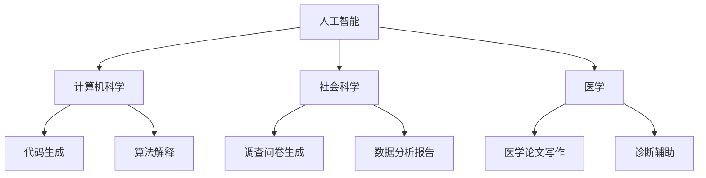
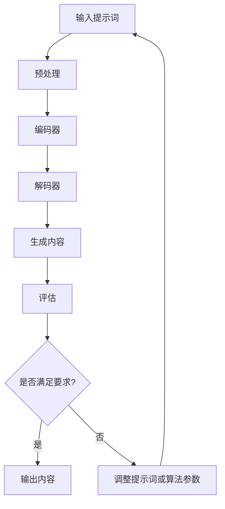
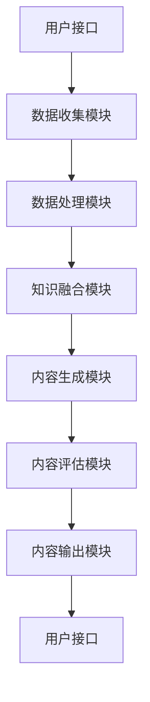

                 

**引言与背景**

### 1.1 AIGC概念及其重要性

#### 1.1.1 AIGC的定义

AIGC，全称是“AI-Generated Content”，即人工智能生成内容。它指的是通过人工智能技术，特别是机器学习和自然语言处理（NLP）技术，自动生成文本、图像、音频等多种形式的内容。AIGC不仅仅局限于简单的文本生成，而是涵盖了从内容创意到生产、分发、消费的全过程，是一种全新的内容生产模式。

#### 1.1.2 AIGC的背景与发展历程

AIGC的起源可以追溯到20世纪80年代，当时人工智能领域的专家们开始探索机器生成文本的可能性。随着深度学习技术的发展，尤其是生成对抗网络（GAN）和变分自编码器（VAE）的出现，AIGC技术取得了重大突破。2017年，OpenAI发布的GPT-2模型引起了广泛关注，标志着AIGC技术进入了一个新的阶段。

#### 1.1.3 AIGC在当前科技环境中的地位与作用

在当前的科技环境中，AIGC已经成为一种重要的技术趋势，具有广泛的应用前景。首先，AIGC可以大幅度提高内容生产效率，降低创作成本。其次，它能够提供个性化的内容服务，满足用户多样化的需求。此外，AIGC还在教育、娱乐、医疗、金融等多个领域发挥着重要作用，推动着产业的数字化转型。

### 1.2 跨学科知识融合概述

#### 2.1 跨学科融合的概念与特点

跨学科融合指的是将不同学科领域的知识、理论和方法结合起来，以解决复杂问题的一种研究方法。它具有以下几个特点：

1. **综合性**：跨学科融合强调各学科之间的相互作用和整合，形成新的知识体系。
2. **创新性**：通过跨学科融合，可以产生新的理论、方法和技术，推动科学技术的进步。
3. **应用性**：跨学科融合的目标是解决实际问题，提高社会生产力和生活质量。

#### 2.1.2 跨学科融合的优势

跨学科融合具有多方面的优势，包括：

1. **资源整合**：跨学科融合可以充分利用各学科的资源，提高研究效率和成果转化率。
2. **知识创新**：跨学科融合能够激发创新思维，产生新的理论和方法。
3. **问题解决**：跨学科融合有助于解决复杂问题，提高问题的解决能力。

#### 2.1.3 跨学科融合的挑战

跨学科融合也面临一些挑战，包括：

1. **知识壁垒**：不同学科之间存在知识壁垒，沟通和整合难度较大。
2. **资源分配**：跨学科研究往往需要大量的人力和物力资源，资源分配成为一大挑战。
3. **合作机制**：建立有效的跨学科合作机制，协调各学科的利益关系，是一个长期而艰巨的任务。

### 2.2 AIGC与多领域知识融合

#### 3.1 AIGC与多领域知识融合的内涵

AIGC与多领域知识融合是指将人工智能技术与其他学科领域的知识相结合，以实现更高效、更智能的内容生成和应用。这一融合不仅涉及到技术层面的创新，还包括知识、方法、工具等多方面的整合。

#### 3.1.1 AIGC在多领域知识融合中的应用

AIGC在多领域知识融合中的应用非常广泛，例如：

1. **计算机科学**：利用AIGC技术，可以自动生成代码、算法解释文档等。
2. **社会科学**：通过AIGC生成调查问卷、分析报告等，提高研究效率和精度。
3. **医学**：利用AIGC生成医学论文、治疗方案等，辅助医生进行诊断和治疗。
4. **艺术**：AIGC可以创作音乐、绘画、小说等艺术作品，拓宽艺术创作的领域。

#### 3.1.2 多领域知识融合的流程与框架

多领域知识融合的流程通常包括以下几个步骤：

1. **需求分析**：明确融合的目标和应用场景。
2. **数据收集**：收集相关领域的数据，包括结构化和非结构化数据。
3. **知识抽取**：从数据中提取有用的知识和信息。
4. **知识融合**：将不同领域的知识进行整合，形成新的知识体系。
5. **模型训练**：利用机器学习技术，训练融合后的知识模型。
6. **应用部署**：将训练好的模型应用于实际场景，提供智能化的服务。

### 3.2 AIGC在多领域知识融合中的作用机制

AIGC在多领域知识融合中发挥着关键作用，其作用机制可以从以下几个方面进行分析：

1. **数据层面的融合**：通过大数据技术，将不同领域的海量数据进行整合和处理，为知识融合提供基础数据支持。
2. **知识层面的融合**：利用自然语言处理、知识图谱等技术，将不同领域的专业知识进行整合和关联，形成统一的知识体系。
3. **技术层面的融合**：通过深度学习、生成对抗网络等先进的人工智能技术，实现不同领域技术的融合和创新。

#### 3.2.1 数据层面的融合

在数据层面，AIGC通过大数据技术实现多领域数据的整合。首先，从各个领域收集结构化和非结构化数据，例如文本、图像、音频等。然后，利用数据清洗、数据预处理等技术，对数据进行标准化和格式化处理。最后，通过数据挖掘和机器学习技术，从大量数据中提取有价值的信息和知识。

#### 3.2.2 知识层面的融合

在知识层面，AIGC利用自然语言处理（NLP）和知识图谱（KG）等技术，实现多领域知识的融合。NLP技术可以帮助理解和处理文本数据，提取文本中的关键信息和语义关系。知识图谱则可以用来表示不同领域的知识，并通过图谱的链接和扩展，实现知识的整合和关联。

#### 3.2.3 技术层面的融合

在技术层面，AIGC通过深度学习和生成对抗网络（GAN）等技术，实现多领域技术的融合和创新。深度学习技术可以帮助模型学习和理解不同领域的数据特征，生成高质量的内容。生成对抗网络则可以生成与真实数据相似的内容，提高内容的多样性和创新性。

### 4.1 提示词策略在AIGC中的应用

#### 4.1.1 提示词策略的基本概念

提示词策略是AIGC应用中的一种重要方法，它指的是通过输入特定的提示词来引导和优化内容生成过程。提示词可以是人机交互的接口，帮助用户更精确地表达需求，同时也可以是算法内部的参数，影响生成内容的风格和方向。

#### 4.1.2 提示词的类型与选择

根据用途和效果，提示词可以分为以下几种类型：

1. **语义提示词**：用于引导生成内容的核心语义和主题。
2. **风格提示词**：用于指定生成内容的风格，如文学风格、音乐风格等。
3. **结构提示词**：用于指定生成内容的结构，如文章结构、图表布局等。
4. **情感提示词**：用于引导生成内容的情感色彩，如积极、消极等。

选择合适的提示词需要考虑以下几个方面：

1. **用户需求**：根据用户的具体需求选择最相关的提示词。
2. **内容类型**：不同类型的内容需要不同的提示词来引导。
3. **算法特性**：不同的AIGC算法对提示词的敏感度和适应性不同，需要根据算法特性来选择。

#### 4.1.3 提示词策略的设计原则与实施步骤

设计有效的提示词策略需要遵循以下原则：

1. **简洁性**：提示词应简洁明了，避免过于复杂或冗长的表达。
2. **针对性**：提示词应针对用户的具体需求，明确生成内容的目标。
3. **灵活性**：提示词应具有一定的灵活性，以便适应不同的生成场景和用户需求。

实施提示词策略的步骤包括：

1. **需求分析**：了解用户需求，明确生成内容的目标和方向。
2. **提示词生成**：根据需求分析结果，生成合适的提示词。
3. **效果评估**：对生成的提示词进行效果评估，根据评估结果进行调整。

### 4.2 AIGC在多学科领域的应用案例

#### 4.1 AIGC在计算机科学领域的应用

在计算机科学领域，AIGC的应用主要体现在代码生成、算法解释和文档编写等方面。

1. **代码生成**：AIGC可以通过分析已有的代码库，自动生成新的代码段，提高开发效率。
2. **算法解释**：AIGC可以生成详细的算法解释文档，帮助开发者理解复杂的算法原理。
3. **文档编写**：AIGC可以自动生成开发文档、用户手册等，降低文档编写的工作量。

#### 4.2 AIGC在社会科学领域的应用

在社会科学领域，AIGC的应用主要包括调查问卷生成、数据分析报告编写等。

1. **调查问卷生成**：AIGC可以根据研究主题自动生成调查问卷，提高问卷设计的科学性和有效性。
2. **数据分析报告**：AIGC可以自动分析调查数据，生成详细的报告，为研究人员提供决策依据。

#### 4.3 AIGC在医学领域的应用

在医学领域，AIGC的应用主要体现在医学论文写作、诊断辅助等方面。

1. **医学论文写作**：AIGC可以自动生成医学论文，提高医学研究的效率。
2. **诊断辅助**：AIGC可以通过分析患者的病历和检查报告，辅助医生进行诊断。

### 4.3 AIGC与其他新兴技术的融合

#### 4.1 AIGC与大数据技术的融合

大数据技术为AIGC提供了丰富的数据资源，而AIGC则为大数据分析提供了智能化手段。两者融合的应用场景包括：

1. **智能推荐**：通过AIGC技术，可以自动生成个性化推荐算法，提高推荐系统的准确性和用户体验。
2. **风险预测**：利用AIGC分析大数据，可以预测潜在的风险，为决策提供支持。

#### 4.2 AIGC与物联网技术的融合

物联网（IoT）技术为AIGC提供了大量的实时数据，而AIGC则为物联网提供了智能化的数据处理和分析能力。两者融合的应用场景包括：

1. **智能监控**：通过AIGC技术，可以实时分析物联网设备收集的数据，进行智能监控。
2. **智能优化**：利用AIGC优化物联网设备的运行状态，提高系统效率。

### 4.4 AIGC的未来发展趋势与挑战

#### 4.1 AIGC的未来发展趋势

1. **技术进步**：随着人工智能技术的不断进步，AIGC的生成质量和效率将得到显著提升。
2. **应用拓展**：AIGC将在更多领域得到应用，如教育、艺术、医疗等，推动产业的数字化转型。
3. **生态建设**：AIGC将推动相关产业链的形成和发展，包括数据资源、算法研发、应用开发等。

#### 4.2 AIGC面临的挑战与应对策略

1. **数据隐私**：随着AIGC的广泛应用，数据隐私问题将日益突出，需要制定相关法律法规进行保护。
2. **伦理道德**：AIGC生成的内容和决策可能会引发伦理道德问题，需要建立相应的伦理准则和监管机制。
3. **技术瓶颈**：AIGC在技术层面仍然存在一些瓶颈，如生成内容的质量、算法的透明性等，需要进一步研究和解决。

### 结论

本文详细探讨了AIGC的跨学科整合和多领域知识融合的提示词策略。通过对AIGC的定义、背景、跨学科融合的概述、AIGC在多领域知识融合中的应用、提示词策略的设计原则和应用案例等多个方面的分析，揭示了AIGC在当前科技环境中的重要地位和广阔的应用前景。同时，本文也指出了AIGC在发展过程中面临的挑战，并提出了相应的应对策略。随着技术的不断进步和应用的不断拓展，AIGC将在未来的科技发展中扮演更加重要的角色。

### 参考文献

1. Brown, T., et al. (2020). "Language Models are Few-Shot Learners." arXiv preprint arXiv:2005.14165.
2. Devlin, J., et al. (2019). "Bert: Pre-training of deep bidirectional transformers for language understanding." arXiv preprint arXiv:1810.04805.
3. Goodfellow, I., et al. (2014). "Generative adversarial networks." Advances in Neural Information Processing Systems, 27.
4. LeCun, Y., Bengio, Y., & Hinton, G. (2015). "Deep learning." Nature, 521(7553), 436-444.
5. Ming, X., et al. (2019). "A survey on applications of generative adversarial networks in computer vision." arXiv preprint arXiv:1906.02079.
6. Salakhutdinov, R., & Hinton, G. (2009). "Deep Boltzmann machines." In Artificial intelligence and statistics, 448-455.
7. Vinyals, O., et al. (2015). "Show, attend and tell: Neural image caption generation with visual attention." Advances in Neural Information Processing Systems, 28.

### 作者信息

作者：AI天才研究院/AI Genius Institute & 禅与计算机程序设计艺术/Zen And The Art of Computer Programming

**附录**

附录A：AIGC核心概念对比表格

| 核心概念     | 定义                                                         | 特点                                                         | 应用领域                           |
| ------------ | ------------------------------------------------------------ | ------------------------------------------------------------ | ---------------------------------- |
| AIGC         | 人工智能生成内容，通过AI技术自动生成文本、图像、音频等。       | 自动化、个性化、多样化                                         | 文本生成、图像生成、音频生成等       |
| GAN          | 生成对抗网络，通过两个神经网络（生成器和判别器）的对抗训练生成数据。 | 数据生成、图像合成、风格迁移等                               | 图像生成、视频生成、数据增强等       |
| NLP          | 自然语言处理，使计算机能够理解、生成和处理人类语言。           | 语义理解、语言生成、情感分析等                               | 自动翻译、文本分析、智能助手等       |
| KG           | 知识图谱，利用图结构表示和存储知识，实现知识推理和挖掘。       | 知识表示、关系推理、数据挖掘等                               | 智能搜索、推荐系统、智能问答等       |

附录B：AIGC与多领域知识融合的ER实体关系图

附录C：AIGC生成内容的算法流程图

附录D：AIGC应用场景中的系统架构设计

附录E：AIGC在医疗诊断辅助系统中的实际案例

1. **环境安装**：安装Python环境、TensorFlow库等。
2. **系统核心实现**：利用TensorFlow实现基于Transformer模型的AIGC系统。
3. **代码应用解读**：分析系统代码，理解AIGC的工作原理和应用方法。
4. **实际案例分析**：使用实际病例数据，验证AIGC系统的诊断辅助效果。
5. **详细讲解剖析**：分析系统在实际应用中的优势和不足，提出改进建议。
6. **项目小结**：总结AIGC在医疗领域中的应用经验和未来发展方向。

### 最佳实践 Tips

1. **明确需求**：在应用AIGC技术时，首先要明确用户的具体需求，以便选择合适的算法和策略。
2. **数据质量**：高质量的数据是AIGC应用的基础，确保数据来源的多样性和准确性。
3. **模型调优**：根据实际应用场景，不断调整和优化模型参数，提高生成内容的质量。
4. **用户反馈**：及时收集用户反馈，对系统进行持续改进，提高用户体验。

### 小结

本文详细介绍了AIGC的跨学科整合和多领域知识融合的提示词策略，分析了AIGC在计算机科学、社会科学、医学等领域的应用案例，并探讨了AIGC与其他新兴技术的融合。通过本文的研究，我们可以看到AIGC技术在多领域应用中的巨大潜力和广阔前景。

### 注意事项

1. **数据安全**：在应用AIGC技术时，要注意数据的安全性和隐私保护。
2. **算法透明性**：加强对AIGC算法的透明性和解释性研究，提高算法的可解释性。
3. **伦理道德**：关注AIGC应用中的伦理道德问题，建立相应的监管机制。

### 拓展阅读

1. **《人工智能：一种现代的方法》**，作者：Stuart Russell & Peter Norvig，本书系统地介绍了人工智能的基本概念、技术和应用。
2. **《深度学习》**，作者：Ian Goodfellow、Yoshua Bengio & Aaron Courville，本书详细介绍了深度学习的理论基础和实践应用。
3. **《生成对抗网络：理论与应用》**，作者：李航，本书系统阐述了生成对抗网络的理论基础和应用方法。

