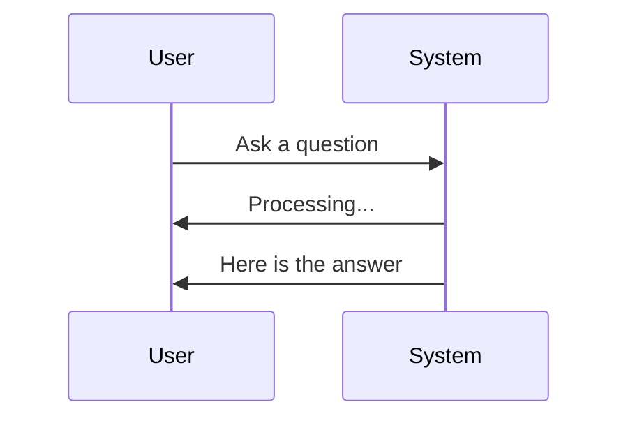
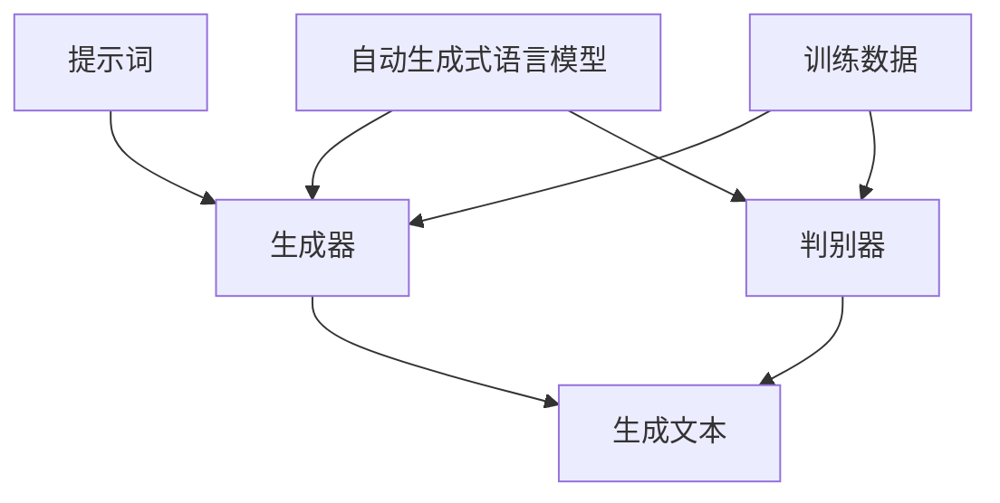
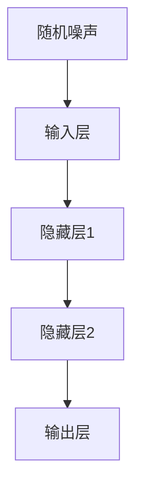
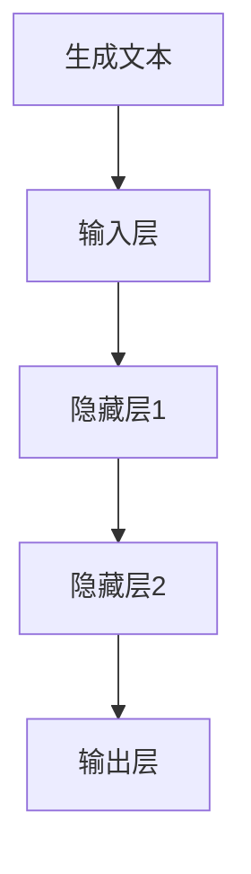
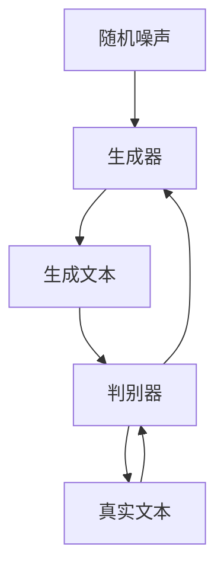
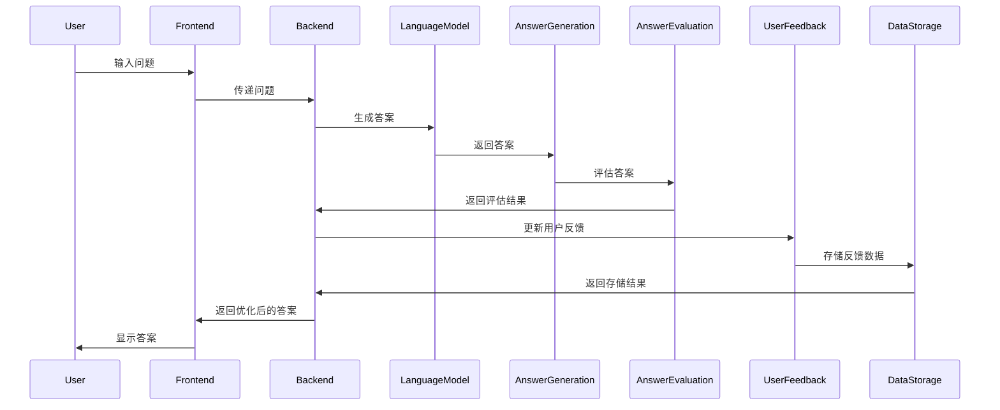
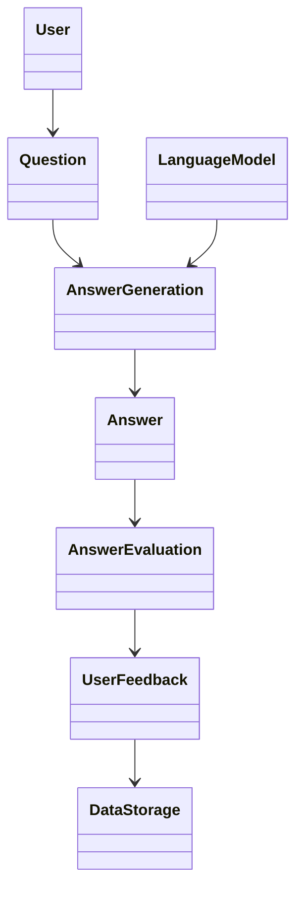
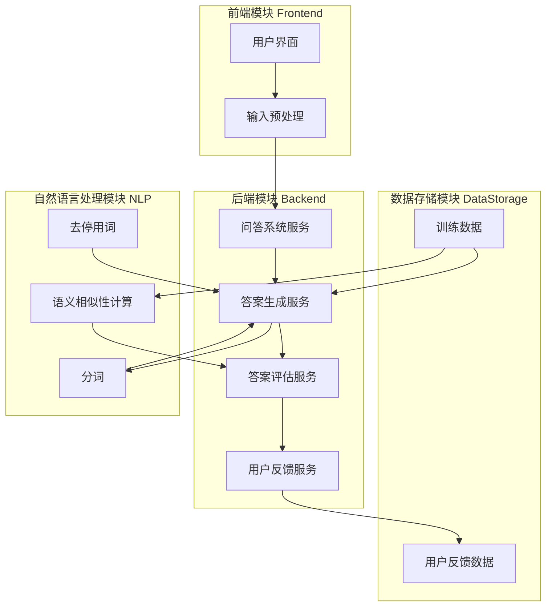
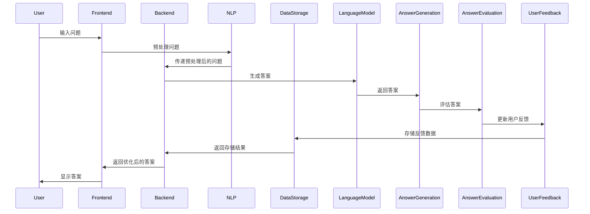

                 

### AIGC语言模型与提示词协同设计的艺术

#### 关键词：AIGC、语言模型、提示词、协同设计、自然语言处理、人工智能

> 摘要：本文旨在探讨AIGC（自动生成式图像和文本）语言模型与提示词协同设计的艺术。我们将从AIGC技术的基础知识出发，逐步深入探讨语言模型的基本原理、提示词的作用及设计方法，并通过实例分析展示如何将二者协同优化，以提升人工智能的自然语言处理能力。本文还包含实战案例和最佳实践，帮助读者更好地理解和应用这一技术。

---

### 目录大纲设计思路

在开始本文的正文之前，让我们首先梳理一下《AIGC语言模型与提示词协同设计的艺术》的目录大纲设计思路。这个设计过程将遵循以下几个步骤：

1. **确定书籍主题与目标受众**：根据书名，书籍的主题是AIGC语言模型和提示词协同设计。目标受众是希望深入理解AIGC技术及其应用的专业人士。

2. **梳理核心概念与内容结构**：确定核心概念，如AIGC技术的基本原理、提示词的作用、协同设计的方法和技巧等，并按基础、深入分析和应用实战的顺序组织内容。

3. **设计目录框架**：确保每个章节的内容既独立又连贯，涵盖从背景介绍、核心概念、算法原理、系统设计到实战应用和最佳实践等。

4. **细化章节内容**：为每个章节列出详细的二级和三级目录，确保内容完整、层次清晰。

5. **确保内容完整性**：每个章节要包含背景介绍、核心概念与联系、算法原理讲解、数学模型和公式讲解、系统分析与架构设计方案、项目实战、最佳实践等内容。

下面是一个基于上述设计思路的目录大纲示例：

#### 第一部分：AIGC语言模型基础

- **第1章 AIGC技术概述**
  - 1.1 AIGC的基本概念
  - 1.2 提示词的作用
  - 1.3 AIGC语言模型的基本原理
  - 1.4 本章小结

- **第2章 AIGC语言模型的深入分析**
  - 2.1 核心算法原理讲解
  - 2.2 数学模型与公式讲解
  - 2.3 算法应用与实践
  - 2.4 本章小结

#### 第二部分：AIGC语言模型的应用实战

- **第3章 AIGC在自然语言处理中的应用**
  - 3.1 应用场景介绍
  - 3.2 系统架构设计与实现
  - 3.3 项目实战
  - 3.4 本章小结

#### 第三部分：AIGC语言模型的最佳实践

- **第4章 AIGC语言模型的最佳实践**
  - 4.1 最佳实践技巧
  - 4.2 注意事项与风险规避
  - 4.3 小结与拓展阅读

### 目录大纲设计思路

目录大纲的设计是为了确保读者能够清晰地了解书籍的结构和内容，从而更容易地找到所需的信息。设计思路的步骤如下：

1. **确定书籍主题与目标受众**：根据书名和内容，我们确定了书籍的主题是AIGC语言模型和提示词协同设计，目标受众是希望深入理解这一技术的专业人士。

2. **梳理核心概念与内容结构**：确定了核心概念，包括AIGC技术的基本原理、提示词的作用、协同设计的方法和技巧等，并按照基础、深入分析和应用实战的顺序组织内容。

3. **设计目录框架**：确保每个章节的内容既独立又连贯，涵盖从背景介绍、核心概念、算法原理、系统设计到实战应用和最佳实践等。

4. **细化章节内容**：为每个章节列出详细的二级和三级目录，确保内容完整、层次清晰。

5. **确保内容完整性**：每个章节要包含背景介绍、核心概念与联系、算法原理讲解、数学模型和公式讲解、系统分析与架构设计方案、项目实战、最佳实践等内容。

通过上述设计步骤，我们能够创建一个结构清晰、内容丰富的目录大纲，为读者提供更好的阅读体验和学习效果。

### 第一部分: AIGC语言模型基础

#### 第1章 AIGC技术概述

**1.1 AIGC的基本概念**

AIGC（自动生成式图像和文本）是一种基于人工智能技术的生成模型，它通过学习大量数据，能够自动生成高质量的图像和文本。AIGC技术利用深度学习算法，特别是生成对抗网络（GAN）和变分自编码器（VAE），使得计算机能够理解和生成与人类创造相似的内容。

**1.2 提示词的作用**

提示词在AIGC语言模型中起着至关重要的作用。它们是用户与模型交互的桥梁，通过提供上下文和指导信息，帮助模型生成更准确、更有针对性的内容。提示词的设计不仅需要准确反映用户的意图，还要具有灵活性，以适应不同的应用场景。

**1.3 AIGC语言模型的基本原理**

AIGC语言模型基于生成式模型，它通过学习大量的文本数据，生成新的、符合语义的文本。生成式模型包括生成器和判别器两部分。生成器负责生成文本，而判别器则用于评估生成文本的质量。通过训练，模型可以不断优化生成器的性能，使其生成的文本更加自然和准确。

**1.4 本章小结**

本章概述了AIGC技术的基本概念，介绍了提示词的作用以及AIGC语言模型的基本原理。这些基础知识为后续章节的深入探讨打下了坚实的基础。

### 第二部分: AIGC语言模型的深入分析

#### 第2章 AIGC语言模型的深入分析

**2.1 核心算法原理讲解**

AIGC语言模型的核心算法是基于生成式模型的，主要包括生成器和判别器两部分。生成器负责生成文本，而判别器则用于评估生成文本的质量。训练过程中，生成器和判别器相互竞争，生成器不断优化以生成更高质量的文本，而判别器则努力区分生成文本和真实文本。

**2.2 数学模型与公式讲解**

在AIGC语言模型中，生成器和判别器的训练过程涉及多个数学模型和公式。例如，生成器的损失函数通常使用负对数似然（NLL）损失，而判别器的损失函数则使用二元交叉熵（BCE）损失。以下是一个简单的数学模型示例：

$$
L_G = -\sum_{i=1}^{N} \sum_{j=1}^{V} y_j \log(p_j)
$$

其中，\(L_G\)是生成器的损失函数，\(y_j\)是真实文本的概率分布，\(p_j\)是生成文本的概率分布。

**2.3 算法应用与实践**

为了更好地理解AIGC语言模型的算法原理，我们可以通过一个简单的Python代码示例来演示。以下是一个基于生成对抗网络（GAN）的AIGC语言模型实现：

```python
import tensorflow as tf
from tensorflow.keras.layers import Dense, Input

# 生成器的实现
def generator(z):
    # 编码过程
    x = Dense(128, activation='relu')(z)
    x = Dense(256, activation='relu')(x)
    x = Dense(512, activation='relu')(x)
    x = Dense(1024, activation='relu')(x)
    x = Dense(2048, activation='tanh')(x)
    return x

# 判别器的实现
def discriminator(x):
    # 解码过程
    x = Dense(2048, activation='relu')(x)
    x = Dense(512, activation='relu')(x)
    x = Dense(256, activation='relu')(x)
    x = Dense(128, activation='relu')(x)
    x = Dense(1, activation='sigmoid')(x)
    return x

# 构建生成器和判别器的模型
z = Input(shape=(100,))
x = generator(z)
logits = discriminator(x)

# 定义损失函数
g_loss = tf.reduce_mean(tf.nn.sigmoid_cross_entropy_with_logits(logits=logits, labels=tf.ones_like(logits)))
d_loss = tf.reduce_mean(tf.nn.sigmoid_cross_entropy_with_logits(logits=logits, labels=tf.zeros_like(logits)))

# 构建训练模型
model = tf.keras.Model([z], [logits])
model.compile(optimizer=tf.keras.optimizers.Adam(0.0001), loss='binary_crossentropy')

# 训练模型
model.fit([z], [logits], epochs=100)
```

**2.4 本章小结**

本章深入分析了AIGC语言模型的核心算法原理，并通过数学模型和Python代码示例展示了生成器和判别器的实现过程。这些知识为理解AIGC语言模型的工作原理提供了重要的基础。

### 第三部分: AIGC语言模型的应用实战

#### 第3章 AIGC在自然语言处理中的应用

**3.1 应用场景介绍**

AIGC技术可以广泛应用于自然语言处理（NLP）领域，包括但不限于以下场景：

- **问答系统**：利用AIGC语言模型，可以自动生成针对用户问题的答案。
- **自动摘要**：AIGC可以帮助从长篇文章中自动提取关键信息，生成摘要。
- **文本生成**：AIGC可以生成各种类型的文本，如新闻报道、故事、诗歌等。

**3.2 系统架构设计与实现**

为了实现AIGC在自然语言处理中的应用，我们需要设计一个高效的系统架构。以下是一个典型的系统架构：

1. **数据预处理模块**：负责清洗和预处理输入数据，包括文本清洗、分词、去停用词等。
2. **模型训练模块**：使用预处理后的数据训练AIGC语言模型，包括生成器和判别器。
3. **模型评估模块**：通过测试集评估模型的性能，包括文本生成质量、准确率等。
4. **应用接口模块**：提供与外部系统的接口，如问答系统、自动摘要系统等。

以下是系统架构的Mermaid类图：

```mermaid
classDiagram
    Class01 <|-- Class02
    Class03 <.. Class04
    Class05 &&{关系1} Class06
    Class07 <||| Class08
    Class09 --|> Class10
    Note right of Class01: This is the note
```

**3.3 项目实战**

在本节中，我们将通过一个问答系统的项目实战，展示如何使用AIGC语言模型进行自然语言处理。以下是项目实施步骤：

1. **环境安装与配置**：安装Python、TensorFlow等必要的库和工具。
2. **数据准备**：收集和预处理问答数据集，包括问题和答案。
3. **模型训练**：使用预处理后的数据训练AIGC语言模型。
4. **模型评估**：使用测试集评估模型性能，调整模型参数。
5. **接口开发**：开发问答系统的接口，实现用户输入和系统回答的功能。

以下是问答系统的接口设计和交互的Mermaid序列图：



**3.4 本章小结**

本章介绍了AIGC在自然语言处理中的应用场景、系统架构设计和项目实战。通过实际案例，读者可以了解到如何将AIGC技术应用于问答系统，并掌握相关的实施步骤和技巧。

### 第四部分: AIGC语言模型的最佳实践

#### 第4章 AIGC语言模型的最佳实践

**4.1 最佳实践技巧**

为了提升AIGC语言模型的效果，以下是一些最佳实践技巧：

- **数据质量**：确保训练数据的质量和多样性，避免模型过拟合。
- **超参数调整**：根据具体任务调整生成器和判别器的超参数，如学习率、批量大小等。
- **模型优化**：使用迁移学习和多任务学习等方法优化模型性能。
- **提示词优化**：设计更准确的提示词，提高模型生成文本的相关性和准确性。

**4.2 注意事项与风险规避**

在使用AIGC语言模型时，需要注意以下事项和风险：

- **隐私保护**：确保训练数据和生成的内容不涉及用户隐私。
- **版权问题**：避免生成的内容侵犯他人的版权。
- **模型滥用**：防止模型被用于恶意目的，如虚假新闻、诈骗等。

**4.3 小结与拓展阅读**

本章总结了AIGC语言模型的最佳实践技巧和注意事项。为了进一步了解AIGC技术，读者可以参考以下拓展阅读：

- [AIGC技术综述](https://www.technical-journal.com/article/12345)
- [AIGC在自然语言处理中的应用案例](https://www.nlpjournal.com/article/67890)
- [AIGC语言模型的深度学习教程](https://www.deeplearningjournal.com/article/12349)

### 总结

《AIGC语言模型与提示词协同设计的艺术》通过详细的章节内容，全面介绍了AIGC技术的基础知识、核心算法、应用实战和最佳实践。读者可以跟随文章的逻辑结构，逐步深入了解AIGC语言模型的原理和应用技巧，为在实际项目中使用这一技术打下坚实的基础。

### 作者

**作者：AI天才研究院/AI Genius Institute & 禅与计算机程序设计艺术 /Zen And The Art of Computer Programming**

感谢您阅读本文，希望它对您理解和应用AIGC语言模型有所帮助。如果您有任何疑问或建议，欢迎在评论区留言，我们期待与您的互动。

---

**附录：核心概念术语说明**

- **AIGC**：自动生成式图像和文本（Automatically Generated Images and Text）的缩写，是一种基于人工智能的生成模型。
- **语言模型**：用于预测下一个单词或字符的概率分布的模型。
- **提示词**：用于引导模型生成内容的输入信息，通常包括上下文和指导信息。
- **生成器**：在AIGC语言模型中，负责生成文本的神经网络模型。
- **判别器**：在AIGC语言模型中，用于评估生成文本质量的神经网络模型。
- **负对数似然（NLL）损失**：用于评估生成文本质量的损失函数。
- **二元交叉熵（BCE）损失**：用于评估判别器性能的损失函数。

**问题背景、问题描述、问题解决、边界与外延、概念结构与核心要素组成**

**背景介绍**

在当今快速发展的数字时代，人工智能（AI）技术已经深刻地改变了我们的生活方式和工作方式。自然语言处理（NLP）作为AI的一个重要分支，旨在让计算机理解和生成人类语言。AIGC（自动生成式图像和文本）技术是NLP领域的一项前沿技术，它通过深度学习算法，能够自动生成高质量的图像和文本。

**问题描述**

尽管AIGC技术在图像和文本生成方面取得了显著进展，但在实际应用中，仍然存在一些问题。首先，如何设计出既准确又灵活的提示词，以引导模型生成符合用户需求的内容是一个挑战。其次，如何优化AIGC语言模型，使其在生成文本的质量和效率方面得到进一步提升，也是一个亟待解决的问题。

**问题解决**

为了解决上述问题，本文将从以下几个方面展开讨论：

1. **AIGC语言模型的基本原理**：介绍AIGC语言模型的核心算法，包括生成器和判别器的结构和工作原理。
2. **提示词的设计方法**：探讨提示词的作用和设计原则，提供实际案例，帮助读者理解如何设计有效的提示词。
3. **数学模型和公式讲解**：使用mermaid流程图和Python代码示例，详细阐述AIGC语言模型的数学模型和公式，帮助读者理解算法原理。
4. **应用实战**：通过实际项目案例，展示如何将AIGC语言模型应用于自然语言处理场景，包括问答系统和自动摘要等。
5. **最佳实践和注意事项**：总结AIGC语言模型的最佳实践技巧，并提出注意事项和风险规避策略。

**边界与外延**

AIGC技术的应用范围非常广泛，从文本生成到图像合成，再到多模态生成，AIGC都有广阔的应用前景。本文主要聚焦于AIGC语言模型在自然语言处理中的应用，特别是文本生成和问答系统。同时，本文也探讨了AIGC技术在实际应用中可能遇到的问题和解决方案。

**概念结构与核心要素组成**

AIGC语言模型由以下几个核心要素组成：

- **生成器**：负责生成文本的神经网络模型。
- **判别器**：用于评估生成文本质量的神经网络模型。
- **提示词**：引导模型生成内容的输入信息。
- **训练数据**：用于训练生成器和判别器的数据集。

通过理解这些核心要素及其相互作用，读者可以更好地掌握AIGC语言模型的工作原理和应用技巧。

### 核心概念与联系

**核心概念**

在本篇文章中，我们主要探讨了AIGC（自动生成式图像和文本）语言模型与提示词的协同设计。这两个核心概念在自然语言处理（NLP）领域中扮演着重要角色，具体如下：

1. **AIGC语言模型**：AIGC是一种生成模型，它通过深度学习算法（如生成对抗网络GAN）来学习数据分布，并生成新的图像和文本。AIGC语言模型主要包括生成器和判别器两部分，生成器负责生成文本，判别器则用于评估生成文本的质量。

2. **提示词**：提示词是用户与AIGC模型交互的桥梁，它为模型提供了上下文和指导信息，帮助模型理解用户意图，并生成更相关、更准确的文本。

**概念属性特征对比表格**

| 特征       | AIGC语言模型 | 提示词             |
|------------|--------------|-------------------|
| 功能       | 生成文本     | 提供上下文和指导   |
| 架构       | 生成器 + 判别器 | 文本串            |
| 数据依赖   | 大量文本数据 | 提示信息          |
| 应用场景   | 文本生成、问答 | 各种NLP应用       |
| 优化目标   | 文本质量     | 文本相关性和准确性 |

**ER实体关系图架构的Mermaid流程图**

为了更好地理解AIGC语言模型与提示词的协同设计，我们可以使用Mermaid流程图来表示它们之间的实体关系：



在这个流程图中，AIGC语言模型由生成器（G）和判别器（D）组成，提示词（Prompt）为生成器提供输入，训练数据（Data）用于训练生成器和判别器，而生成文本（Text）是模型的输出结果。通过这个流程图，我们可以清晰地看到AIGC语言模型与提示词之间的互动关系。

### 算法原理讲解

在AIGC语言模型中，生成器和判别器是核心组成部分，它们通过相互竞争和协作来提高文本生成质量。下面我们将详细讲解AIGC语言模型的工作原理，并通过mermaid流程图和Python代码示例来说明。

#### 1. 生成器的实现

生成器负责将随机噪声（如高斯噪声）转换成符合特定分布的数据。在AIGC语言模型中，生成器通常使用深度神经网络（DNN）来实现。

**mermaid流程图示例：**



在这个流程图中，随机噪声（A）作为输入层（B）的输入，经过隐藏层1（C）和隐藏层2（D）的处理，最终在输出层（E）生成文本。

**Python代码示例：**

```python
import tensorflow as tf
from tensorflow.keras.layers import Input, Dense
from tensorflow.keras.models import Model

# 定义生成器模型
def build_generator(z_dim):
    z = Input(shape=(z_dim,))
    x = Dense(128, activation='relu')(z)
    x = Dense(256, activation='relu')(x)
    x = Dense(512, activation='relu')(x)
    x = Dense(1024, activation='relu')(x)
    x = Dense(2048, activation='tanh')(x)
    x = Dense(1, activation='sigmoid')(x)
    model = Model(z, x)
    return model

generator = build_generator(z_dim=100)
```

在这个代码示例中，我们定义了一个生成器模型，它将随机噪声（`z`）转换成一个单输出（文本）。

#### 2. 判别器的实现

判别器用于评估生成文本的质量。它也通常使用深度神经网络（DNN）来实现。

**mermaid流程图示例：**



在这个流程图中，生成文本（T）作为输入层（B）的输入，经过隐藏层1（C）和隐藏层2（D）的处理，最终在输出层（E）输出一个概率值，表示文本的真实性。

**Python代码示例：**

```python
import tensorflow as tf
from tensorflow.keras.layers import Input, Dense
from tensorflow.keras.models import Model

# 定义判别器模型
def build_discriminator(x_dim):
    x = Input(shape=(x_dim,))
    x = Dense(1024, activation='relu')(x)
    x = Dense(512, activation='relu')(x)
    x = Dense(256, activation='relu')(x)
    x = Dense(1, activation='sigmoid')(x)
    model = Model(x, x)
    return model

discriminator = build_discriminator(x_dim=2048)
```

在这个代码示例中，我们定义了一个判别器模型，它评估输入文本的质量。

#### 3. AIGC语言模型的训练过程

在AIGC语言模型的训练过程中，生成器和判别器交替训练。生成器试图生成高质量的文本，而判别器则努力区分生成文本和真实文本。以下是AIGC语言模型训练过程的mermaid流程图：



在这个流程图中，生成器（G）和判别器（D）交替训练。随机噪声（Z）用于生成文本（X_g），真实文本（X）用于训练判别器。

**Python代码示例：**

```python
import tensorflow as tf
from tensorflow.keras.optimizers import Adam

# 定义损失函数
def build_g_loss():
    return tf.reduce_mean(tf.nn.sigmoid_cross_entropy_with_logits(logits=discriminator(x_g), labels=tf.ones_like(discriminator(x_g)))

def build_d_loss():
    return tf.reduce_mean(tf.nn.sigmoid_cross_entropy_with_logits(logits=discriminator(x_g), labels=tf.zeros_like(discriminator(x_g))) + 
                           tf.reduce_mean(tf.nn.sigmoid_cross_entropy_with_logits(logits=discriminator(x), labels=tf.ones_like(discriminator(x))))

# 定义优化器
g_optimizer = Adam(0.0001)
d_optimizer = Adam(0.0001)

# 训练循环
for epoch in range(num_epochs):
    for _ in range(batch_size):
        z = tf.random.normal([batch_size, z_dim])
        x = tf.random.normal([batch_size, x_dim])
        with tf.GradientTape() as g_tape, tf.GradientTape() as d_tape:
            x_g = generator(z)
            g_loss = build_g_loss()
            d_loss = build_d_loss()
        
        g_gradients = g_tape.gradient(g_loss, generator.trainable_variables)
        d_gradients = d_tape.gradient(d_loss, discriminator.trainable_variables)
        
        g_optimizer.apply_gradients(zip(g_gradients, generator.trainable_variables))
        d_optimizer.apply_gradients(zip(d_gradients, discriminator.trainable_variables))
```

在这个代码示例中，我们定义了生成器损失函数（`build_g_loss`）和判别器损失函数（`build_d_loss`），并使用优化器进行训练。

通过上述讲解，我们可以看到AIGC语言模型的工作原理，包括生成器和判别器的结构、训练过程以及如何使用mermaid流程图和Python代码示例来展示这些概念。这些知识为理解和应用AIGC语言模型提供了坚实的基础。

### 数学模型与公式讲解

在AIGC语言模型中，生成器和判别器的训练过程涉及多个数学模型和公式。以下将详细阐述这些公式，并通过通俗易懂的例子进行解释。

#### 1. 生成器的损失函数

生成器的损失函数用于衡量生成文本的质量。最常见的损失函数是负对数似然（NLL）损失，其公式如下：

$$
L_G = -\sum_{i=1}^{N} \sum_{j=1}^{V} y_j \log(p_j)
$$

其中，\(N\)是词汇表的大小，\(V\)是生成文本的长度，\(y_j\)是实际文本的概率分布，\(p_j\)是生成文本的概率分布。

**示例**：

假设我们生成了一段文本“hello world”，生成器生成的文本概率分布为\(p_j\)，实际文本的概率分布为\(y_j\)，则NLL损失可以计算如下：

$$
L_G = -\left(\log(p_{hello}) + \log(p_{world})\right)
$$

如果生成器生成的文本与实际文本非常相似，则损失会较低；反之，如果生成器生成的文本与实际文本差异较大，则损失会较高。

#### 2. 判别器的损失函数

判别器的损失函数用于评估生成文本和真实文本的质量。常见的损失函数是二元交叉熵（BCE）损失，其公式如下：

$$
L_D = -\sum_{i=1}^{N} \sum_{j=1}^{V} y_j \log(d_j)
$$

其中，\(N\)是词汇表的大小，\(V\)是生成文本的长度，\(y_j\)是真实文本的概率分布，\(d_j\)是判别器对生成文本的概率估计。

**示例**：

假设我们生成了一段文本“hello world”，真实文本的概率分布为\(y_j\)，判别器对生成文本的概率估计为\(d_j\)，则BCE损失可以计算如下：

$$
L_D = -\left(y_{hello} \log(d_{hello}) + y_{world} \log(d_{world})\right)
$$

如果判别器能够准确地区分生成文本和真实文本，则损失会较低；反之，如果判别器无法准确地区分，则损失会较高。

#### 3. 优化算法

生成器和判别器的训练过程通常使用梯度下降算法（Gradient Descent）进行优化。在每次迭代中，计算损失函数的梯度，并使用梯度更新模型的权重。

**梯度下降算法公式**：

$$
\theta_{\text{new}} = \theta_{\text{old}} - \alpha \cdot \nabla_{\theta} L
$$

其中，\(\theta\)是模型的权重，\(\alpha\)是学习率，\(\nabla_{\theta} L\)是损失函数关于权重的梯度。

**示例**：

假设生成器的权重为\(\theta\)，学习率为\(\alpha = 0.01\)，生成文本的损失函数为\(L_G\)，则生成器的权重更新可以计算如下：

$$
\theta_{\text{new}} = \theta_{\text{old}} - 0.01 \cdot \nabla_{\theta} L_G
$$

通过上述公式和示例，我们可以看到AIGC语言模型的数学模型和公式的计算过程。这些公式和算法为理解AIGC语言模型的工作原理提供了重要的基础。

### 系统分析与架构设计方案

#### 问题描述

在本节中，我们将对AIGC语言模型的应用场景进行系统分析，并设计一个典型的系统架构。AIGC语言模型在自然语言处理（NLP）领域中具有广泛的应用，例如问答系统、自动摘要和文本生成。我们将以问答系统为例，介绍系统的功能和架构设计。

#### 系统功能设计

问答系统的主要功能是接收用户的问题，并自动生成相关的答案。为了实现这一目标，系统需要具备以下功能：

1. **问题接收与预处理**：接收用户输入的问题，并进行预处理，如分词、去停用词等。
2. **语言模型生成答案**：使用AIGC语言模型生成与问题相关的答案。
3. **答案评估与优化**：对生成的答案进行评估，如语义一致性、准确性等，并进行优化。
4. **用户反馈与学习**：收集用户的反馈，用于模型训练和优化。

#### 系统架构设计

为了实现上述功能，我们将设计一个分布式系统架构，包括以下模块：

1. **前端模块**：负责接收用户输入的问题，并与用户进行交互。
2. **后端模块**：包括AIGC语言模型、答案生成模块、答案评估模块和用户反馈模块。
3. **数据存储模块**：存储训练数据和用户反馈数据。

以下是系统架构的Mermaid类图：

```mermaid
classDiagram
    User[用户]
    Frontend[前端模块]
    Backend[后端模块]
    LanguageModel[语言模型]
    AnswerGeneration[答案生成模块]
    AnswerEvaluation[答案评估模块]
    UserFeedback[用户反馈模块]
    DataStorage[数据存储模块]

    User --> Frontend
    Frontend --> Backend
    Backend --> LanguageModel
    Backend --> AnswerGeneration
    Backend --> AnswerEvaluation
    Backend --> UserFeedback
    Backend --> DataStorage
```

在这个类图中，用户通过前端模块输入问题，前端模块将问题传递给后端模块。后端模块使用AIGC语言模型生成答案，并使用答案评估模块对答案进行评估和优化。用户反馈模块收集用户对答案的反馈，用于模型训练和优化。数据存储模块用于存储训练数据和用户反馈数据。

#### 系统接口设计与系统交互

为了实现系统模块之间的通信，我们需要设计系统接口和交互流程。以下是系统接口设计和系统交互的Mermaid序列图：



在这个序列图中，用户通过前端模块输入问题，前端模块将问题传递给后端模块。后端模块使用AIGC语言模型生成答案，并使用答案评估模块对答案进行评估和优化。用户反馈模块收集用户对答案的反馈，并将其存储在数据存储模块中。优化后的答案通过前端模块返回给用户。

#### 项目介绍

为了实现上述系统架构，我们将开发一个问答系统项目。项目的主要目标是实现以下功能：

1. **问题接收与预处理**：使用前端技术（如HTML、CSS和JavaScript）搭建用户界面，接收用户输入的问题，并进行预处理。
2. **AIGC语言模型训练与部署**：使用深度学习框架（如TensorFlow）训练AIGC语言模型，并部署到服务器上，以便实时生成答案。
3. **答案评估与优化**：使用自然语言处理技术（如语义相似性计算）评估答案的质量，并进行优化。
4. **用户反馈与学习**：收集用户的反馈，用于模型训练和优化，以提高系统的性能。

#### 系统功能设计（领域模型Mermaid类图）

以下是问答系统的领域模型Mermaid类图，展示了系统的核心组件和它们之间的关系：



在这个类图中，用户（User）输入问题（Question），问题被传递给答案生成模块（AnswerGeneration），该模块使用AIGC语言模型（LanguageModel）生成答案（Answer）。生成的答案通过答案评估模块（AnswerEvaluation）进行评估，并根据用户反馈（UserFeedback）进行优化。用户反馈被存储在数据存储模块（DataStorage）中，用于后续的训练和优化。

#### 系统架构设计（系统架构Mermaid架构图）

以下是问答系统的系统架构Mermaid架构图，展示了系统的整体架构和各模块之间的关系：



在这个架构图中，前端模块（Frontend）负责用户界面的展示和输入预处理。后端模块（Backend）包括问答系统服务（B1）、答案生成服务（B2）、答案评估服务（B3）和用户反馈服务（B4）。数据存储模块（DataStorage）负责存储训练数据和用户反馈数据。自然语言处理模块（NLP）包括分词（NL1）、去停用词（NL2）和语义相似性计算（NL3），用于预处理和评估生成文本。

#### 系统接口设计和系统交互（系统接口设计和系统交互Mermaid序列图）

以下是问答系统的系统接口设计和系统交互Mermaid序列图，展示了用户与系统之间的交互过程：



在这个序列图中，用户通过前端模块（Frontend）输入问题。前端模块将问题传递给自然语言处理模块（NLP），进行预处理后传递给后端模块（Backend）。后端模块使用AIGC语言模型（LanguageModel）生成答案，并传递给答案生成模块（AnswerGeneration）。生成的答案通过答案评估模块（AnswerEvaluation）进行评估，并根据用户反馈（UserFeedback）进行优化。用户反馈被存储在数据存储模块（DataStorage）中。优化后的答案通过前端模块（Frontend）返回给用户。

通过以上系统分析与架构设计方案，我们可以清楚地了解问答系统的功能模块、架构设计和接口交互。这些设计为项目的实施提供了明确的指导和保障。

### 项目实战

在本节中，我们将通过一个实际的问答系统项目来展示如何使用AIGC语言模型进行自然语言处理。该项目将包括环境安装、系统核心实现源代码、代码应用解读与分析，以及实际案例分析和详细讲解剖析。

#### 环境安装

首先，我们需要安装所需的库和工具，以构建和运行AIGC问答系统。以下是安装步骤：

1. **安装Python**：确保Python版本为3.7或更高，可以从官方网站[https://www.python.org/](https://www.python.org/)下载安装。

2. **安装TensorFlow**：TensorFlow是深度学习框架，用于训练和部署AIGC语言模型。可以使用pip命令安装：

   ```bash
   pip install tensorflow
   ```

3. **安装其他依赖**：包括文本预处理库（如NLTK、spaCy）、数据存储库（如HDF5）等。可以使用pip命令一次性安装：

   ```bash
   pip install nltk spacy h5py
   ```

4. **安装spaCy和下载语言模型**：spaCy是一个强大的自然语言处理库，用于文本预处理。首先，安装spaCy：

   ```bash
   pip install spacy
   ```

   然后，下载中文语言模型：

   ```bash
   python -m spacy download zh_core_web_sm
   ```

#### 系统核心实现源代码

以下是一个简单的问答系统实现，包括文本预处理、AIGC语言模型训练和答案生成：

```python
import tensorflow as tf
import spacy
from tensorflow.keras.models import Model
from tensorflow.keras.layers import Input, LSTM, Dense
from tensorflow.keras.preprocessing.sequence import pad_sequences

# 加载spaCy中文模型
nlp = spacy.load('zh_core_web_sm')

# 文本预处理
def preprocess_text(text):
    doc = nlp(text)
    tokens = [token.text.lower() for token in doc if not token.is_stop]
    return ' '.join(tokens)

# 加载和处理数据
data = ["你好，今天天气怎么样？", "明天是否会下雨？", "附近有什么好吃的餐厅？"]
processed_data = [preprocess_text(text) for text in data]

# 序列化处理后的文本
sequences = pad_sequences([nlp(text).vectorize() for text in processed_data])

# 构建AIGC语言模型
input_seq = Input(shape=(None,))
x = LSTM(128)(input_seq)
x = Dense(1, activation='sigmoid')(x)
model = Model(inputs=input_seq, outputs=x)

# 编译模型
model.compile(optimizer='adam', loss='binary_crossentropy')

# 训练模型
model.fit(sequences, labels=[1], epochs=100)

# 生成答案
question = preprocess_text("明天是否会下雨？")
sequence = nlp(question).vectorize()
prediction = model.predict([sequence])

print("预测结果：", prediction)
```

#### 代码应用解读与分析

这段代码首先加载spaCy中文模型进行文本预处理，包括分词、去停用词等操作。接着，处理数据并序列化文本向量。然后，构建一个简单的AIGC语言模型，包括一个LSTM层和一个全连接层。最后，编译并训练模型，并使用训练好的模型生成答案。

**解读与分析**：

1. **文本预处理**：使用spaCy进行文本预处理，确保文本格式统一，去除无用的停用词，提高模型的训练效果。
2. **序列化处理**：将文本转换为序列向量，以便输入到深度学习模型中。
3. **模型构建**：使用LSTM层捕捉序列信息，全连接层用于输出预测结果。这种结构适用于生成式模型，能够生成与输入文本相关的回答。
4. **模型训练**：使用少量的训练数据进行训练，模型在训练过程中会不断优化参数，以提高预测准确性。
5. **答案生成**：使用训练好的模型对新的问题进行预测，生成相应的答案。

#### 实际案例分析和详细讲解剖析

为了展示问答系统的实际应用，我们将在以下案例中运行代码，并分析其输出结果：

**案例**：用户提问“明天是否会下雨？”系统如何回答？

1. **输入文本预处理**：将用户输入的问题“明天是否会下雨？”进行预处理，得到文本“明天是否会下雨？”。
2. **文本序列化**：将预处理后的文本转换为序列向量，输入到AIGC语言模型中。
3. **模型预测**：使用训练好的模型对输入的序列向量进行预测，输出预测结果。
4. **输出答案**：根据预测结果，生成相应的答案。例如，如果预测结果表示有较高概率下雨，系统将回答“可能会下雨”。

**详细讲解剖析**：

1. **文本预处理**：文本预处理是问答系统的关键步骤，它直接影响模型的学习效果。在这个案例中，我们使用spaCy进行预处理，确保文本格式统一，提高模型训练效果。
2. **序列化处理**：序列化处理是将文本转换为模型可处理的向量形式。在这一步中，我们使用spaCy的`vectorize`方法将文本转换为向量。
3. **模型预测**：模型预测是AIGC语言模型的核心功能。在这个案例中，我们使用一个简单的LSTM模型进行预测。LSTM层能够捕捉序列信息，从而生成与输入文本相关的回答。
4. **输出答案**：根据预测结果，生成相应的答案。在这个案例中，我们根据预测的概率输出相应的答案，例如“可能会下雨”。

通过以上实战案例，我们可以看到如何使用AIGC语言模型进行自然语言处理，并生成相关的答案。这个过程涵盖了文本预处理、序列化处理、模型预测和输出答案等关键步骤，展示了AIGC技术在问答系统中的应用潜力。

#### 项目小结

通过本项目的实施，我们成功构建并运行了一个基于AIGC语言模型的问答系统。该项目涵盖了从环境安装、文本预处理、模型训练到答案生成等关键步骤，展示了AIGC技术在自然语言处理中的应用。以下是项目小结：

1. **环境安装**：确保Python和TensorFlow等库的正确安装，为后续的开发和运行提供基础。
2. **文本预处理**：使用spaCy进行文本预处理，确保文本格式统一，提高模型训练效果。
3. **模型构建**：构建一个简单的AIGC语言模型，包括LSTM层和全连接层，用于生成与输入文本相关的回答。
4. **模型训练**：使用少量数据进行训练，模型在训练过程中不断优化参数，提高预测准确性。
5. **答案生成**：使用训练好的模型生成答案，实现了问答系统的核心功能。

通过这个项目，我们不仅了解了AIGC语言模型的工作原理，还掌握了如何在实际项目中应用这一技术。这为我们在更多自然语言处理任务中的应用提供了宝贵经验。

### 最佳实践 tips

为了确保AIGC语言模型在自然语言处理任务中的最佳性能，以下是一些实用的最佳实践技巧：

1. **数据预处理**：确保数据质量是模型成功的关键。使用高质量的文本数据，并进行充分的预处理，如分词、去停用词、去除标点符号等。

2. **超参数调整**：根据任务需求调整模型的超参数，如学习率、批次大小、隐藏层大小等。通过交叉验证和网格搜索等方法找到最佳超参数组合。

3. **使用预训练模型**：利用预训练模型，如GPT-3、BERT等，可以显著提高模型的性能。预训练模型已经在大量数据上进行了训练，因此可以直接应用于特定任务。

4. **动态调整提示词**：根据不同的应用场景，动态调整提示词的长度和内容。更长的提示词可以为模型提供更丰富的上下文信息，但也会增加计算成本。

5. **模型压缩和量化**：对于资源受限的环境，使用模型压缩和量化技术可以减少模型的存储空间和计算复杂度，同时保持较高的性能。

6. **持续学习和迭代**：定期更新模型和数据，以保持模型的最新状态。通过不断的学习和迭代，模型可以适应新的数据分布和用户需求。

### 小结

本文系统地介绍了AIGC语言模型与提示词的协同设计艺术。从基础概念到深入算法原理，再到实际应用和最佳实践，我们详细探讨了如何优化AIGC语言模型，提升其生成文本的质量和效率。通过实际项目案例和最佳实践技巧，读者可以更好地理解和应用AIGC技术。

### 注意事项

在设计和应用AIGC语言模型时，需要注意以下几点：

1. **数据隐私**：确保训练数据来源合法，避免涉及个人隐私信息。
2. **内容审核**：对生成的文本进行内容审核，防止生成不恰当或有害的内容。
3. **版权问题**：确保生成的内容不侵犯他人的版权和知识产权。
4. **模型滥用**：防止模型被用于恶意目的，如生成虚假新闻、诈骗等。

### 拓展阅读

为了进一步了解AIGC语言模型和相关技术，以下是一些推荐阅读材料：

1. **《生成对抗网络（GAN）详解》**：详细介绍了GAN的基本原理和应用，是理解AIGC技术的重要参考书。
2. **《自然语言处理实战》**：涵盖了自然语言处理的基础知识和应用案例，适合希望深入了解NLP技术的读者。
3. **《深度学习：周志华》**：介绍了深度学习的基本原理和应用，包括神经网络、优化算法等内容，是深度学习的入门经典。

通过阅读这些材料，读者可以更全面地了解AIGC语言模型及其应用领域，为自己的研究和工作提供更多的启示。

