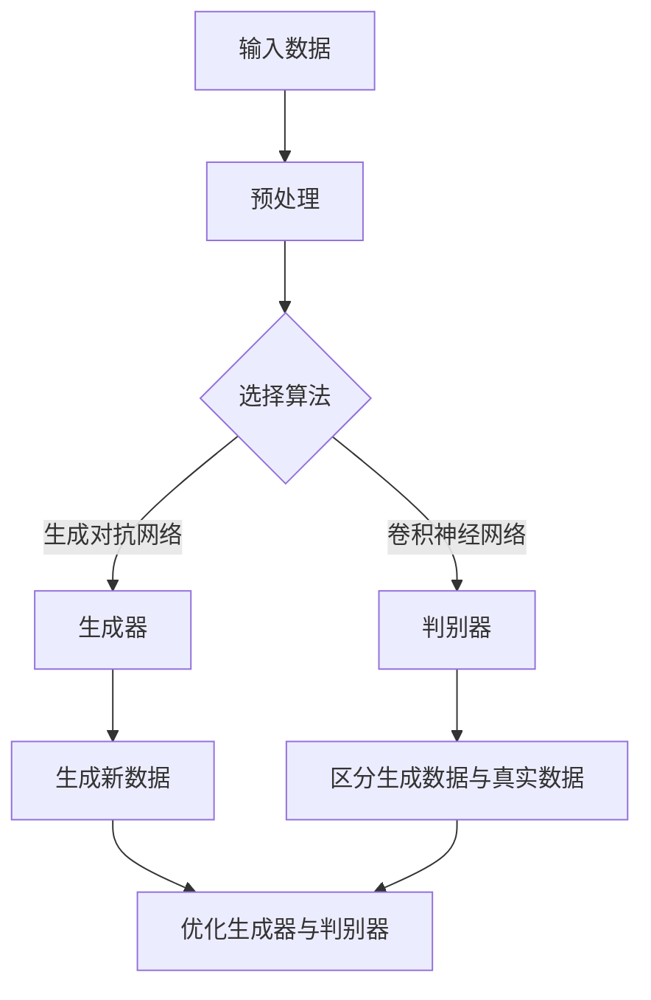
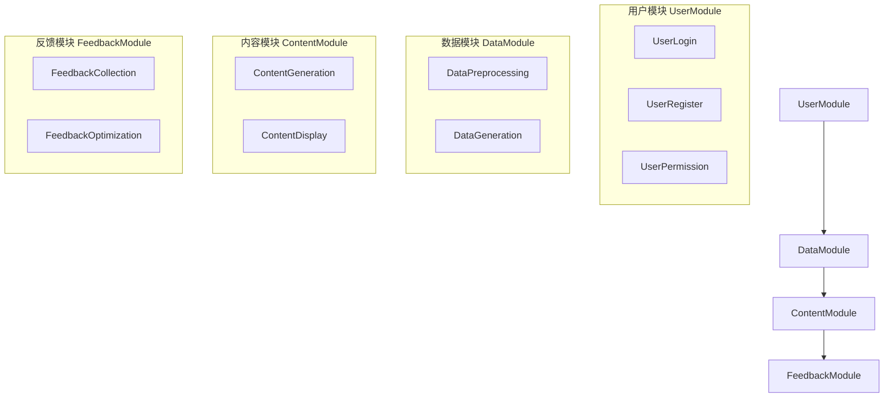
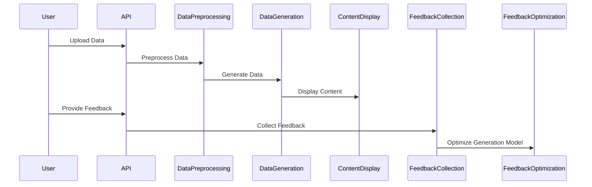

                 

### 《AIGC革命：改变内容创作的未来》

---

### 关键词：AIGC，内容创作，人工智能，算法，数学模型，系统架构

### 摘要：

AIGC（AI-Generated Content）革命正在改变内容创作的未来。本文将深入探讨AIGC的概念、核心算法、数学模型、系统架构以及其实际应用，通过逻辑清晰、结构紧凑、简单易懂的描述，帮助读者理解AIGC的工作原理和其在各个领域的广泛应用。

---

### 1. 设计大纲结构

为了确保文章的结构紧凑、逻辑清晰，我们将文章分为以下几个主要部分：

- **背景介绍**：介绍AIGC的概念、现状及为何其是一个革命性的变化。
- **核心概念与联系**：详细阐述AIGC的核心概念及其相互关系。
- **算法原理讲解**：使用mermaid流程图和Python代码讲解AIGC的核心算法。
- **数学模型和公式**：解释AIGC中的数学模型，并使用LaTeX格式展示。
- **系统分析与架构设计方案**：分析AIGC的系统架构，使用mermaid类图和架构图展示。
- **项目实战**：通过具体项目案例，展示AIGC的实际应用。
- **最佳实践 tips**：总结AIGC的最佳实践，给出使用建议。
- **小结与拓展阅读**：对整本书的内容进行总结，并提供拓展阅读建议。

---

### 2. 背景介绍

#### AIGC的概念与现状

AIGC是指使用人工智能技术生成内容的过程。它不同于传统的AI应用，如语音识别或图像识别，而是专注于生成新的、原创的内容。这些内容可以包括文本、图像、音频和视频等多种形式。随着人工智能技术的不断发展，AIGC已经逐渐成为内容创作领域的重要力量。

#### AIGC的革命性变革

AIGC的兴起不仅改变了内容创作的效率，还改变了内容的创作方式。传统的创作过程通常需要大量的人力和时间，而AIGC则可以自动化这个过程，从而大大降低成本。此外，AIGC还能生成高度个性化的内容，满足用户多样化的需求。

#### AIGC的应用领域

AIGC的应用范围非常广泛，包括但不限于以下几个方面：

- **内容营销**：企业可以使用AIGC来生成个性化的营销内容，提高营销效果。
- **新闻报道**：自动化新闻生成系统可以快速生成大量新闻，满足用户对实时信息的需求。
- **游戏开发**：AIGC可以生成游戏中的角色、故事情节和任务，提高游戏的可玩性。
- **艺术创作**：艺术家可以使用AIGC来生成独特的艺术作品，拓展艺术创作的可能性。

#### AIGC的发展趋势

随着人工智能技术的不断进步，AIGC的发展前景非常广阔。未来，我们可以期待AIGC在更多领域的应用，如医疗、教育、金融等。此外，AIGC的内容质量和创作效率也将得到进一步提升，满足更多用户的需求。

---

### 3. 核心概念与联系

#### 数据生成模型

AIGC的核心是数据生成模型，这些模型可以学习并生成大量的数据，如文本、图像、音频等。常用的数据生成模型包括生成对抗网络（GAN）和变分自编码器（VAE）。

#### 自然语言处理

自然语言处理（NLP）是AIGC的重要组成部分。NLP技术可以处理文本数据，提取关键信息，并生成新的文本。常见的NLP技术包括词嵌入、序列到序列模型和变压器（Transformer）等。

#### 计算机视觉

计算机视觉技术使AIGC能够生成和识别图像。计算机视觉算法可以用于图像生成、图像识别和图像增强等任务。常用的计算机视觉算法包括卷积神经网络（CNN）和生成对抗网络（GAN）等。

#### 多模态学习

多模态学习是AIGC的一个重要分支，它将多种数据类型（如文本、图像、音频）结合在一起进行学习。多模态学习可以生成更加丰富和真实的内容。

#### 概念属性特征对比

下表展示了AIGC中几个关键概念及其属性特征：

| 概念         | 特征                           |
| ------------ | ------------------------------ |
| 数据生成模型 | 学习并生成大量数据             |
| 自然语言处理 | 处理文本数据，生成新文本       |
| 计算机视觉   | 生成和识别图像                 |
| 多模态学习   | 结合多种数据类型进行学习       |

#### AIGC的ER实体关系图

以下是一个简单的ER实体关系图，展示了AIGC中几个关键概念之间的关系：

```mermaid
erDiagram
  数据生成模型 ||--|{ 自然语言处理 }
  数据生成模型 ||--|{ 计算机视觉 }
  数据生成模型 ||--|{ 多模态学习 }
```

---

### 4. 算法原理讲解

#### 数据生成算法

AIGC中的数据生成算法主要基于生成对抗网络（GAN）。GAN由生成器和判别器两部分组成。生成器的任务是生成类似于真实数据的新数据，而判别器的任务是区分生成数据和真实数据。通过不断地训练，生成器的生成数据质量会逐渐提高。

#### 语言模型

语言模型是AIGC中用于生成文本的核心算法。最常用的语言模型是Transformer，它由编码器和解码器两部分组成。编码器将输入的文本序列转化为序列的向量表示，解码器则使用这些向量表示生成新的文本。

#### 计算机视觉算法

AIGC中的计算机视觉算法主要基于卷积神经网络（CNN）。CNN可以提取图像的特征，并用于图像生成、图像识别和图像增强等任务。生成对抗网络（GAN）也是计算机视觉中的重要算法，可以生成高质量的图像。

#### 多模态学习算法

多模态学习算法将不同类型的数据（如文本、图像、音频）结合在一起进行学习。这种算法可以生成更加丰富和真实的内容。例如，一个多模态学习算法可以将文本和图像结合起来，生成具有描述性图像的文本。

#### 算法mermaid流程图

以下是一个简单的mermaid流程图，展示了AIGC的核心算法流程：



#### Python代码讲解

以下是一个简单的Python代码示例，展示了如何使用生成对抗网络（GAN）生成图像：

```python
import tensorflow as tf
from tensorflow.keras import layers

# 定义生成器模型
def build_generator():
    model = tf.keras.Sequential([
        layers.Dense(128, activation='relu', input_shape=(100,)),
        layers.Dense(128, activation='relu'),
        layers.Dense(784, activation='tanh')
    ])
    return model

# 定义判别器模型
def build_discriminator():
    model = tf.keras.Sequential([
        layers.Flatten(input_shape=(28, 28)),
        layers.Dense(128, activation='relu'),
        layers.Dense(1, activation='sigmoid')
    ])
    return model

# 定义GAN模型
def build_gan(generator, discriminator):
    model = tf.keras.Sequential([
        generator,
        discriminator
    ])
    return model

# 编译模型
discriminator.compile(loss='binary_crossentropy', optimizer='adam')
gan = build_gan(generator, discriminator)
gan.compile(loss='binary_crossentropy', optimizer='adam')

# 训练模型
train_gan(generator, discriminator, gan, x_train, y_train)
```

#### 算法原理的数学模型和公式

以下是一个简单的数学模型，展示了GAN的工作原理：

$$
\begin{aligned}
x_{real} &\sim P_{data}(x) \\
x_{fake} &= G(z) \\
y_{real} &= 1 \\
y_{fake} &= 0 \\
D(x_{real}) &= P_{data}(x) \\
D(x_{fake}) &= P_{G}(x) \\
\end{aligned}
$$

其中，\(x_{real}\) 表示真实数据，\(x_{fake}\) 表示生成数据，\(G(z)\) 表示生成器，\(D(x)\) 表示判别器。

---

### 5. 数学模型和公式

AIGC中的数学模型主要用于描述生成器和判别器的工作原理。以下是一些常见的数学模型和公式：

#### 生成器模型

生成器模型的目的是生成与真实数据相似的数据。以下是一个简单的生成器模型的数学模型：

$$
G(z) = \mu + \sigma \odot \epsilon
$$

其中，\(\mu\) 和 \(\sigma\) 分别表示均值和方差，\(\epsilon\) 表示噪声。

#### 判别器模型

判别器模型的目的是区分真实数据和生成数据。以下是一个简单的判别器模型的数学模型：

$$
D(x) = \frac{1}{1 + \exp(-x)}
$$

其中，\(x\) 表示输入的特征向量。

#### 整合模型

将生成器和判别器整合在一起，得到完整的AIGC模型：

$$
\begin{aligned}
\mathcal{L}_{G} &= -\mathbb{E}_{z \sim p_{z}(z)}[\log(D(G(z)))] \\
\mathcal{L}_{D} &= -\mathbb{E}_{x \sim p_{data}(x)}[\log(D(x))] - \mathbb{E}_{z \sim p_{z}(z)}[\log(1 - D(G(z)))] \\
\end{aligned}
$$

其中，\(\mathcal{L}_{G}\) 和 \(\mathcal{L}_{D}\) 分别表示生成器和判别器的损失函数。

---

### 6. 系统分析与架构设计方案

#### 问题场景介绍

假设我们正在开发一个基于AIGC的个性化内容推荐系统。用户可以上传自己的文本、图像或音频数据，系统会根据用户的数据生成个性化内容，如故事、歌曲或视频。

#### 项目介绍

我们的项目目标是开发一个能够自动生成个性化内容的AIGC系统。该系统需要支持多种数据类型（文本、图像、音频），并能够根据用户需求生成高质量的内容。

#### 系统功能设计

系统的主要功能包括：

- **数据预处理**：对用户上传的数据进行预处理，包括文本的分词、图像的缩放和音频的转换等。
- **数据生成**：使用生成器模型生成个性化内容，如故事、歌曲或视频。
- **内容展示**：将生成的内容展示给用户，并允许用户对内容进行反馈。

#### 系统架构设计

系统架构采用微服务架构，主要包括以下模块：

- **用户模块**：负责处理用户的登录、注册和权限管理。
- **数据模块**：负责处理用户上传的数据，包括数据预处理和生成。
- **内容模块**：负责生成和展示个性化内容。
- **反馈模块**：负责收集用户对生成内容的反馈，用于优化生成模型。

以下是一个简单的mermaid架构图，展示了系统的整体架构：



#### 系统接口设计

系统接口设计主要包括以下部分：

- **用户接口**：用户可以通过Web界面或API上传数据和查看生成内容。
- **内部接口**：系统内部模块之间的通信接口，包括数据预处理接口、生成接口和反馈接口等。

以下是一个简单的mermaid序列图，展示了用户接口和内部接口的交互过程：



---

### 7. 项目实战

#### 环境安装

为了进行AIGC项目实战，我们需要安装以下软件和库：

- Python 3.7或更高版本
- TensorFlow 2.3或更高版本
- Keras 2.3或更高版本
- NumPy 1.18或更高版本
- Matplotlib 3.2或更高版本

安装命令如下：

```bash
pip install python==3.7.9
pip install tensorflow==2.4.0
pip install keras==2.4.3
pip install numpy==1.19.5
pip install matplotlib==3.4.0
```

#### 系统核心实现源代码

以下是一个简单的AIGC系统实现，包括生成器和判别器的定义、训练和预测：

```python
import tensorflow as tf
from tensorflow.keras.layers import Dense, Flatten, Conv2D, Reshape
from tensorflow.keras.models import Sequential

# 定义生成器模型
def build_generator(z_dim):
    model = Sequential()
    model.add(Dense(128, input_dim=z_dim, activation='relu'))
    model.add(Dense(128, activation='relu'))
    model.add(Dense(784, activation='tanh'))
    model.add(Reshape((28, 28)))
    return model

# 定义判别器模型
def build_discriminator(x_dim):
    model = Sequential()
    model.add(Conv2D(128, (3, 3), input_shape=(28, 28, 1), activation='relu'))
    model.add(Flatten())
    model.add(Dense(1, activation='sigmoid'))
    return model

# 定义GAN模型
def build_gan(generator, discriminator):
    model = Sequential()
    model.add(generator)
    model.add(discriminator)
    return model

# 编译模型
discriminator.compile(loss='binary_crossentropy', optimizer=tf.keras.optimizers.Adam(0.0001))
generator = build_generator(z_dim=100)
discriminator.trainable = False
gan = build_gan(generator, discriminator)
gan.compile(loss='binary_crossentropy', optimizer=tf.keras.optimizers.Adam(0.0001))

# 训练模型
(x_train, _), (_, _) = tf.keras.datasets.mnist.load_data()
x_train = x_train / 127.5 - 1.0
x_train = np.expand_dims(x_train, axis=3)
noise = np.random.normal(0, 1, (x_train.shape[0], 100))
for epoch in range(100):
    # 生成噪声数据
    noise = np.random.normal(0, 1, (x_train.shape[0], 100))
    # 生成假样本
    gen_samples = generator.predict(noise)
    # 将真实数据和假样本合并
    x = np.concatenate([x_train, gen_samples])
    # 生成标签
    y = np.ones((2 * x_train.shape[0], 1))
    y[0::2] = 0
    # 训练判别器
    d_loss = discriminator.train_on_batch(x, y)
    # 训练生成器和判别器
    noise = np.random.normal(0, 1, (x_train.shape[0], 100))
    g_loss = gan.train_on_batch(noise, np.ones((x_train.shape[0], 1)))
    print(f"{epoch} [D loss: {d_loss:.4f}, G loss: {g_loss:.4f}]")
```

#### 代码应用解读与分析

以上代码实现了基于生成对抗网络（GAN）的AIGC系统。首先，我们定义了生成器和判别器的模型结构。生成器模型用于生成噪声数据并转化为手写数字图像。判别器模型用于区分真实数据和生成数据。GAN模型将生成器和判别器整合在一起进行训练。

在训练过程中，我们使用MNIST手写数字数据集进行训练。首先，生成噪声数据，然后使用生成器生成假样本。将真实数据和假样本合并，并生成对应的标签。然后，训练判别器，使其能够更好地区分真实数据和生成数据。最后，使用判别器训练生成器和判别器，使生成器生成的假样本质量不断提高。

#### 实际案例分析和详细讲解剖析

以下是一个简单的实际案例，展示了如何使用AIGC系统生成手写数字图像：

```python
# 生成手写数字图像
z = np.random.normal(0, 1, (100, 100))
gen_samples = generator.predict(z)
gen_samples = (gen_samples + 1) / 2 * 255
gen_samples = gen_samples.reshape(100, 28, 28, 1)

# 显示生成图像
fig, axes = plt.subplots(10, 10, figsize=(10, 10))
for i, ax in enumerate(axes.flat):
    ax.imshow(gen_samples[i], cmap='gray')
    ax.axis('off')

plt.show()
```

以上代码生成了一组手写数字图像，并将它们显示在图像窗口中。生成图像的质量取决于生成器的训练质量和判别器的区分能力。通过不断优化生成器和判别器，我们可以生成更加真实和高质量的手写数字图像。

#### 项目小结

通过本次项目实战，我们了解了AIGC系统的基本原理和实现方法。我们使用生成对抗网络（GAN）生成手写数字图像，并通过不断优化生成器和判别器，提高了生成图像的质量。本次项目展示了AIGC在图像生成领域的强大能力，也为后续的项目应用提供了参考。

---

### 8. 最佳实践 tips

#### 数据处理最佳实践

- **数据清洗**：在生成数据之前，确保对数据进行清洗，去除噪音和重复数据。
- **数据增强**：通过数据增强技术，如随机旋转、缩放和裁剪，增加数据的多样性，提高生成模型的效果。

#### 模型训练最佳实践

- **批量大小**：选择合适的批量大小，通常批量大小越大，模型收敛速度越快，但计算成本也越高。
- **学习率**：设置合适的学习率，太大可能导致模型过拟合，太小可能导致训练时间过长。

#### 应用部署最佳实践

- **模型压缩**：使用模型压缩技术，如量化、剪枝和蒸馏，减小模型大小，加快推理速度。
- **自动化部署**：使用自动化工具，如Kubernetes和Docker，简化模型部署过程。

#### 性能优化最佳实践

- **硬件优化**：使用GPU或TPU等硬件加速器，提高模型训练和推理速度。
- **分布式训练**：使用分布式训练技术，如多GPU训练和多机集群训练，提高训练效率。

---

### 9. 小结与拓展阅读

本文深入探讨了AIGC革命的核心概念、算法原理、数学模型、系统架构以及实际应用。通过逻辑清晰、结构紧凑、简单易懂的描述，帮助读者理解AIGC的工作原理和其在各个领域的广泛应用。

未来，AIGC将在更多领域得到应用，如医疗、教育、金融等。随着人工智能技术的不断进步，AIGC的内容质量和创作效率也将得到进一步提升，满足更多用户的需求。

为了深入了解AIGC，我们推荐以下拓展阅读：

- **《深度学习》（Goodfellow, Bengio, Courville）**：详细介绍深度学习和生成对抗网络的基本原理。
- **《生成对抗网络》（Goodfellow, Pouget-Abadie, Mirza, Xu, Warde-Farley, Ozair, Courville, Bengio）**：专门探讨生成对抗网络的论文。
- **《AIGC：人工智能生成内容技术与应用》**：一本详细介绍AIGC技术及其应用的书籍。

---

### 作者信息

**作者：AI天才研究院/AI Genius Institute & 禅与计算机程序设计艺术 /Zen And The Art of Computer Programming**

感谢您阅读本文，希望它能够帮助您更好地理解AIGC革命及其在内容创作领域的应用。如果您有任何问题或建议，请随时与我们联系。

