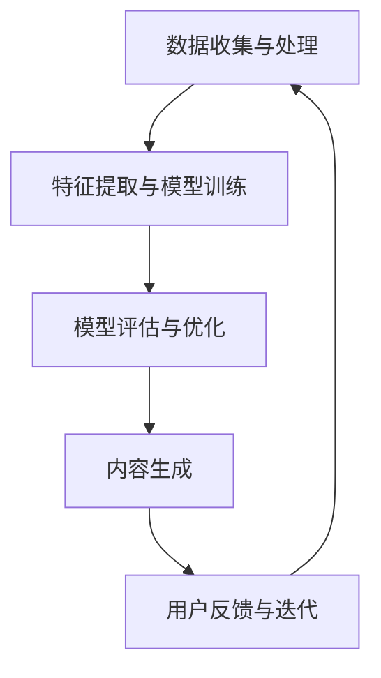
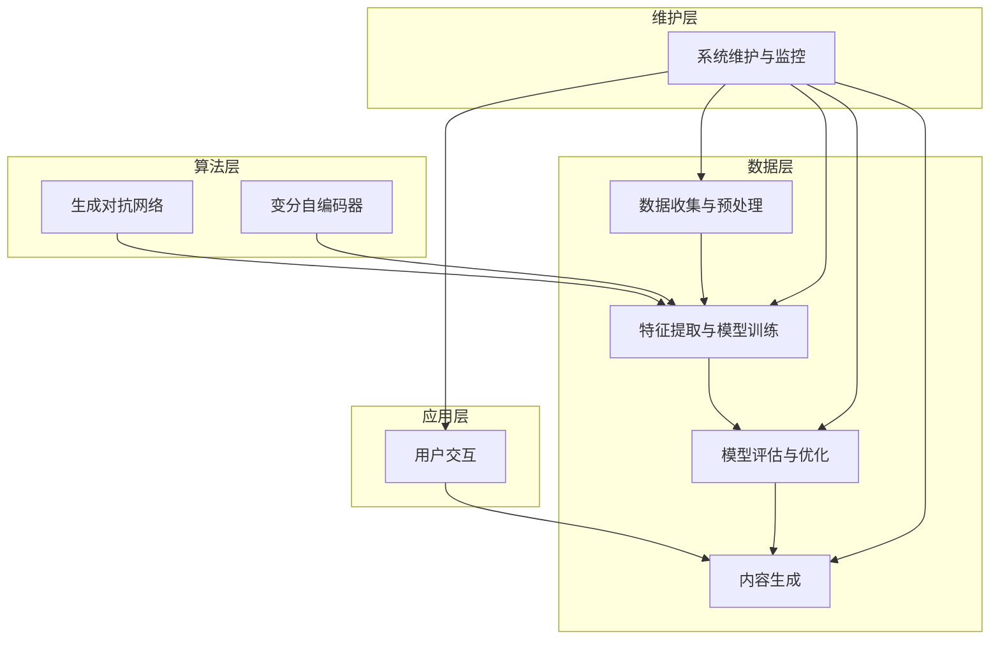
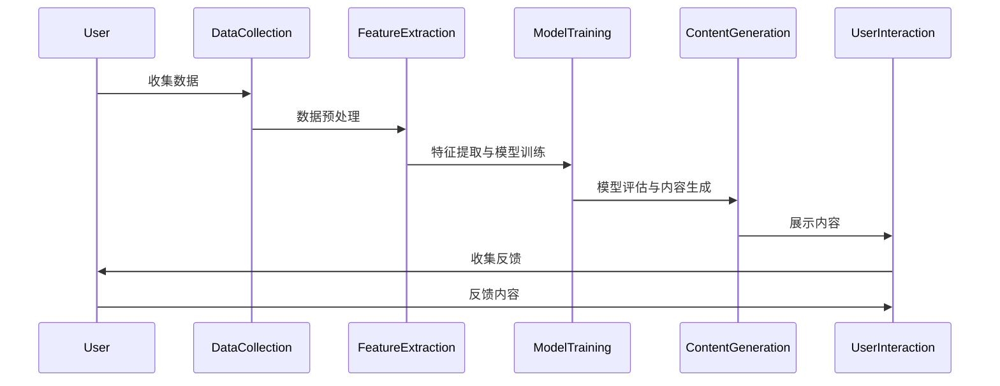

                 

### 第1章: AIGC领域背景介绍

## 1.1 问题背景

### 1.1.1 AIGC的概念

AIGC（AI-Generated Content）是指利用人工智能技术生成内容的过程，这涵盖了从文本、图像到视频等多种形式的内容。AIGC的起源可以追溯到早期的人工智能研究，其中生成对抗网络（GANs）和变分自编码器（VAEs）等模型的提出，使得大规模生成高质量内容成为可能。AIGC的核心在于其能够通过学习大量数据，自主生成新颖、有趣的内容，而不需要人工干预。

### 1.1.2 AIGC的重要性

AIGC在当前技术环境中具有重要性，原因有以下几点：

1. **生产力提升**：AIGC可以自动生成大量内容，从而减轻人类的工作负担，提高生产效率。
2. **创意激发**：AIGC能够创造出独特且新颖的内容，为艺术创作、广告营销等领域带来新的灵感。
3. **内容多样化**：在社交媒体、游戏、虚拟现实等多个领域，AIGC能够生成多样化的内容，满足不同用户的需求。
4. **数据复用**：通过AIGC，可以复用已有的数据资源，减少重复劳动，节省时间和成本。

### 1.1.3 AIGC的应用现状与趋势

目前，AIGC已经在多个领域得到了应用：

- **文本生成**：例如自动写作、新闻报道生成、对话系统等。
- **图像生成**：如图像修复、艺术风格迁移、动漫形象生成等。
- **视频生成**：如视频编辑、场景生成等。
- **音频生成**：如语音合成、音乐生成等。

未来，AIGC的发展趋势包括：

1. **生成能力的提升**：随着算法的进步和算力的增强，AIGC的生成能力将进一步提升。
2. **多模态融合**：文本、图像、音频等多模态数据的融合，将使得AIGC生成的内容更加丰富和真实。
3. **自适应能力**：AIGC将具备更高的自适应能力，能够根据用户反馈和需求动态调整生成内容。
4. **伦理和隐私**：随着AIGC的普及，如何在保证用户隐私和遵守伦理规范的前提下使用AIGC，将成为重要议题。

## 1.2 问题描述

### 1.2.1 AIGC领域面临的挑战

AIGC领域面临的主要挑战包括：

1. **数据质量**：高质量的数据是AIGC训练的基础，但数据收集和标注过程往往耗费大量人力和时间。
2. **计算资源**：生成高质量内容需要大量的计算资源，尤其是在多模态数据处理方面。
3. **模型泛化能力**：如何提高AIGC模型的泛化能力，使其能够在多种不同的场景中有效工作，是一个重要问题。
4. **伦理和法律**：AIGC生成的内容可能涉及版权、隐私等问题，如何处理这些问题需要深入的思考。

### 1.2.2 AIGC领域的研究与应用难点

在研究层面，AIGC的难点包括：

1. **算法创新**：如何设计出更加高效、鲁棒的算法，是当前研究的重点。
2. **模型解释性**：AIGC模型通常具有高度的复杂性，如何解释其生成过程和结果，是一个重要的研究方向。
3. **多模态融合**：不同模态的数据具有不同的特性和表示方法，如何有效地融合多模态数据，是一个技术难题。

在应用层面，AIGC的难点包括：

1. **系统集成**：将AIGC技术集成到现有的系统中，需要解决兼容性和性能问题。
2. **用户交互**：如何设计用户友好的界面，让用户能够方便地使用AIGC生成内容。
3. **实际场景应用**：如何将AIGC应用于实际场景中，解决实际问题，是一个需要深入探索的领域。

## 1.3 问题解决

### 1.3.1 AIGC领域的研究方法

解决AIGC领域的问题，需要采用多学科交叉的研究方法，包括：

1. **数据分析**：通过数据挖掘和统计分析，了解数据的特点和分布，为模型设计提供依据。
2. **机器学习**：使用机器学习方法，特别是深度学习技术，训练能够生成高质量内容的模型。
3. **计算机视觉**：利用计算机视觉技术，对图像和视频内容进行理解和生成。
4. **自然语言处理**：利用自然语言处理技术，生成和理解文本内容。

### 1.3.2 AIGC领域的技术路线

AIGC领域的技术路线可以概括为以下几个步骤：

1. **数据收集与预处理**：收集大量高质量的数据，并进行预处理，包括数据清洗、数据增强等。
2. **模型设计与训练**：设计合适的模型架构，使用大量数据训练模型，提高模型的泛化能力。
3. **模型评估与优化**：对训练好的模型进行评估，并根据评估结果进行优化，提高模型性能。
4. **系统集成与部署**：将模型集成到实际应用系统中，进行部署和测试，确保系统能够稳定、高效地运行。

### 1.3.3 AIGC领域的关键技术与创新

AIGC领域的关键技术包括：

1. **生成对抗网络（GAN）**：GAN是一种通过两个对抗网络相互竞争的方式训练模型的技术，能够生成高质量、多样化的内容。
2. **变分自编码器（VAE）**：VAE是一种通过编码器和解码器进行数据重构的技术，能够生成新的数据样本。
3. **注意力机制**：注意力机制能够提高模型对重要信息的关注，提高生成内容的质量。
4. **多模态融合**：多模态融合技术能够将不同模态的数据进行有效整合，生成更加丰富和真实的内容。

在AIGC领域，创新主要体现在以下几个方面：

1. **算法优化**：通过改进现有算法，提高模型的生成能力和效率。
2. **模型架构设计**：设计新的模型架构，提高模型的性能和可解释性。
3. **跨领域应用**：将AIGC技术应用于新的领域，解决实际中的问题。
4. **伦理和隐私保护**：研究如何在使用AIGC的同时，保护用户的隐私和遵守伦理规范。

### 1.4 边界与外延

#### 1.4.1 AIGC与其他技术的比较

AIGC与其他技术（如传统的计算机生成内容、数据挖掘等）有以下区别：

1. **生成内容质量**：AIGC能够生成更加真实、高质量的内容，而传统的生成方法通常质量较低。
2. **数据依赖性**：AIGC依赖于大量高质量的数据进行训练，而数据挖掘更多依赖于已有数据进行分析。
3. **创意能力**：AIGC具有强大的创意能力，能够生成新颖的内容，而传统方法通常生成的内容较为固定。

#### 1.4.2 AIGC的应用边界

AIGC的应用边界包括：

1. **内容生成**：AIGC可以应用于文本、图像、视频等多种内容形式的生成。
2. **虚拟现实**：在虚拟现实场景中，AIGC可以用于生成真实感强的人物、场景等。
3. **医疗健康**：在医疗健康领域，AIGC可以用于生成诊断报告、患者教育资料等。
4. **广告营销**：在广告营销领域，AIGC可以用于生成个性化的广告内容。

### 1.5 概念结构与核心要素组成

#### 1.5.1 AIGC的核心概念

AIGC的核心概念包括：

1. **生成模型**：用于生成内容的模型，如GAN、VAE等。
2. **数据集**：用于训练生成模型的数据集，数据集的质量直接影响生成内容的质量。
3. **优化目标**：用于衡量生成内容质量的优化目标，如生成对抗损失、重构损失等。

#### 1.5.2 AIGC的主要应用场景

AIGC的主要应用场景包括：

1. **文本生成**：如自动写作、新闻报道生成、对话系统等。
2. **图像生成**：如图像修复、艺术风格迁移、动漫形象生成等。
3. **视频生成**：如视频编辑、场景生成等。
4. **音频生成**：如语音合成、音乐生成等。

#### 1.5.3 AIGC的技术框架与架构

AIGC的技术框架与架构包括：

1. **数据收集与预处理模块**：用于收集和处理数据。
2. **生成模型训练模块**：用于训练生成模型。
3. **模型评估与优化模块**：用于评估和优化生成模型。
4. **内容生成模块**：用于生成实际内容。
5. **系统集成与部署模块**：用于将AIGC集成到实际应用系统中。

通过以上步骤，我们为《AIGC领域的思维链应用案例分析》这本书设计了详细的目录大纲，为后续章节的内容展开奠定了基础。接下来，我们将深入探讨AIGC的核心概念与联系，为进一步理解AIGC技术打下基础。

## 第2章: AIGC的核心概念与联系

在深入探讨AIGC（AI-Generated Content）的核心概念之前，我们需要明确几个关键术语的定义，这些术语构成了AIGC的基础，理解它们有助于我们更好地理解AIGC的运作机制和应用场景。

### 2.1 AIGC的核心概念原理

#### 2.1.1 思维链的概念

思维链是指一系列由人工智能驱动的逻辑推理过程，这些过程可以模仿人类思维模式，通过输入、处理和输出产生连贯且合理的思维路径。在AIGC中，思维链是核心组件之一，负责生成内容时的逻辑构建和推理。

#### 2.1.2 应用案例的概念

应用案例是指在具体领域或场景中，通过AIGC技术实现的实际应用示例。这些案例展示了AIGC技术如何在不同领域中发挥作用，例如文本生成、图像生成、视频生成等。

#### 2.1.3 案例分析的概念

案例分析是对具体应用案例的深入研究和分析，通过解析案例的实现过程、技术难点和解决方法，可以帮助我们更好地理解AIGC技术的应用细节和实际效果。

### 2.2 概念属性特征对比表格

为了更好地理解AIGC的核心概念及其相互关系，我们可以通过对比表格来展示它们的主要属性特征。

| 概念       | 定义               | 主要属性特征                                                                                                  |
|------------|--------------------|------------------------------------------------------------------------------------------------------------|
| 思维链     | 逻辑推理过程       | 输入、处理和输出过程，模仿人类思维模式                                                   |
| 应用案例   | 实际应用示例       | 展示AIGC技术在具体领域中的应用，如文本、图像、视频等                                   |
| 案例分析   | 深入研究应用案例   | 分析案例的实现过程、技术难点和解决方法                                                 |

通过上表，我们可以看到三个核心概念在功能、目标和属性特征上的区别和联系。

### 2.3 ER实体关系图架构

为了更加直观地理解AIGC的核心概念及其相互关系，我们可以使用ER（实体关系）图来展示这些概念之间的关系。

#### 2.3.1 AIGC领域的实体关系

在AIGC领域中，主要的实体包括：

1. **思维链**：负责逻辑推理和内容生成。
2. **应用案例**：包含具体的AIGC应用实例。
3. **案例分析**：用于研究和分析应用案例。

ER图如下所示：

```mermaid
erDiagram
    思维链 ||--|{ 应用案例 }
    应用案例 ||--|{ 案例分析 }
```

在上图中，思维链与应用案例之间存在“1对多”的关系，即一个思维链可以生成多个应用案例。应用案例与案例分析之间存在“1对1”的关系，即每个应用案例都有其对应的分析案例。

#### 2.3.2 关系映射与实例分析

通过ER图，我们可以看到思维链、应用案例和案例分析之间的层次关系。例如，在一个文本生成的应用中，思维链会生成多个文本案例，而每个文本案例都可以进行深入的分析，以了解其生成过程、性能和效果。

这种层次关系不仅有助于我们理解AIGC的架构，还可以帮助我们设计更加高效和灵活的AIGC系统。在实际应用中，这种层次结构可以使得AIGC系统具备良好的扩展性和可维护性。

### 总结

通过本章的讨论，我们详细介绍了AIGC的核心概念及其相互关系。思维链、应用案例和案例分析构成了AIGC的核心组成部分，它们相互关联，共同推动AIGC技术的发展和应用。接下来，我们将深入探讨AIGC的算法原理，进一步理解AIGC技术的工作机制。

## 第3章: AIGC算法原理讲解

AIGC（AI-Generated Content）的算法原理是其核心组成部分，理解这些算法的原理不仅有助于我们掌握AIGC技术的运作机制，还可以为我们在实际应用中设计和优化算法提供理论依据。在本章中，我们将详细讲解AIGC算法的原理，包括其流程、mermaid流程图、Python源代码、数学模型和公式，以及通俗易懂的举例说明。

### 3.1 AIGC算法流程

AIGC算法的基本流程可以分为以下几个步骤：

1. **数据收集与处理**：收集用于训练的数据，并进行数据清洗、归一化等预处理操作，确保数据的质量和一致性。
2. **特征提取与模型训练**：提取数据的关键特征，并使用这些特征训练生成模型，常见的模型包括生成对抗网络（GAN）、变分自编码器（VAE）等。
3. **模型评估与优化**：对训练好的模型进行评估，根据评估结果调整模型参数，以提高模型的性能和生成内容的质量。
4. **内容生成**：使用训练好的模型生成新的内容，例如文本、图像、视频等。
5. **用户反馈与迭代**：收集用户对生成内容的反馈，根据反馈调整模型和生成策略，实现内容的优化和迭代。

#### 3.1.1 数据收集与处理

数据收集与处理是AIGC算法流程的第一步，其目的是确保数据的质量和一致性。具体步骤如下：

1. **数据收集**：从各种来源收集数据，如互联网、数据库、传感器等。
2. **数据清洗**：处理缺失值、异常值、重复值等，确保数据的一致性和完整性。
3. **数据归一化**：将不同特征的范围调整到相同的尺度，以便模型能够更好地学习和处理数据。
4. **数据增强**：通过数据增强技术，如旋转、缩放、裁剪等，增加数据的多样性，提高模型的泛化能力。

#### 3.1.2 特征提取与模型训练

特征提取与模型训练是AIGC算法流程的核心步骤。特征提取的目的是从原始数据中提取出对生成模型有用的特征，这些特征将用于训练生成模型。具体步骤如下：

1. **特征选择**：选择对生成模型有帮助的特征，去除冗余特征，减少模型的复杂度。
2. **特征提取**：使用各种特征提取方法，如主成分分析（PCA）、自编码器等，提取数据中的关键特征。
3. **模型训练**：使用提取的特征训练生成模型，常见的生成模型包括生成对抗网络（GAN）、变分自编码器（VAE）等。

#### 3.1.3 模型评估与优化

模型评估与优化是确保生成模型性能的关键步骤。具体步骤如下：

1. **模型评估**：使用验证集对训练好的模型进行评估，常见的评估指标包括生成质量、多样性、稳定性等。
2. **模型优化**：根据评估结果，调整模型参数，如学习率、正则化参数等，以提高模型的性能和生成内容的质量。
3. **超参数调优**：通过网格搜索、贝叶斯优化等超参数调优方法，找到最优的超参数组合，进一步优化模型性能。

#### 3.1.4 内容生成

内容生成是AIGC算法流程的最后一步，使用训练好的模型生成新的内容。具体步骤如下：

1. **输入生成**：根据输入条件，生成新的内容，如文本、图像、视频等。
2. **内容调整**：根据用户反馈，调整生成的内容，以提高用户的满意度。
3. **内容输出**：将生成的内容输出到用户界面，如文本显示、图像展示、视频播放等。

### 3.2 算法mermaid流程图

为了更直观地展示AIGC算法的流程，我们可以使用mermaid流程图来描述其步骤。



在上图中，数据收集与处理、特征提取与模型训练、模型评估与优化、内容生成和用户反馈与迭代组成了AIGC算法的基本流程。

### 3.3 Python源代码

为了更好地理解AIGC算法的原理，我们可以通过Python源代码来实现一个简单的AIGC算法。以下是一个简单的生成对抗网络（GAN）的Python代码示例：

```python
import numpy as np
import tensorflow as tf
from tensorflow.keras.layers import Dense, Flatten, Reshape
from tensorflow.keras.models import Sequential

# 生成器模型
def build_generator():
    model = Sequential([
        Dense(128, input_shape=(100,)),
        Activation('relu'),
        Dense(28 * 28 * 1),
        Activation('tanh'),
        Reshape((28, 28, 1))
    ])
    return model

# 判别器模型
def build_discriminator():
    model = Sequential([
        Flatten(input_shape=(28, 28, 1)),
        Dense(128),
        Activation('relu'),
        Dense(1, activation='sigmoid')
    ])
    return model

# 训练GAN模型
def train_gan(generator, discriminator, acgan, data, num_epochs=100):
    for epoch in range(num_epochs):
        # 随机选择真实数据
        real_images = data[np.random.randint(0, data.shape[0], size=batch_size)]
        
        # 生成假数据
        noise = np.random.normal(0, 1, (batch_size, 100))
        fake_images = generator.predict(noise)
        
        # 训练判别器
        d_loss_real = discriminator.train_on_batch(real_images, np.ones((batch_size, 1)))
        d_loss_fake = discriminator.train_on_batch(fake_images, np.zeros((batch_size, 1)))
        d_loss = 0.5 * np.add(d_loss_real, d_loss_fake)
        
        # 生成随机噪声
        noise = np.random.normal(0, 1, (batch_size, 100))
        
        # 训练生成器
        g_loss = acgan.train_on_batch(noise, np.ones((batch_size, 1)))
        
        # 打印训练进度
        print(f"Epoch {epoch + 1}, D_loss={d_loss}, G_loss={g_loss}")

# 主函数
if __name__ == "__main__":
    # 加载数据
    (X_train, _), (X_test, _) = tf.keras.datasets.mnist.load_data()
    X_train = X_train / 127.5 - 1.0
    X_test = X_test / 127.5 - 1.0
    
    # 设置超参数
    batch_size = 64
    noise_dim = 100
    
    # 构建和编译模型
    generator = build_generator()
    discriminator = build_discriminator()
    acgan = compile_gan(generator, discriminator)
    
    # 训练模型
    train_gan(generator, discriminator, acgan, X_train)
```

在上面的代码中，我们首先定义了生成器和判别器的模型结构，然后使用这些模型训练GAN模型。具体步骤包括：

1. 加载MNIST数据集并进行预处理。
2. 设置训练参数。
3. 编译和训练GAN模型。

### 3.4 算法原理的数学模型和公式

AIGC算法的原理涉及到多种数学模型和公式，以下是一些关键模型和公式：

#### 3.4.1 数据处理模型

数据处理模型主要包括数据清洗、数据归一化和数据增强。以下是相关的数学模型：

- **数据清洗**：去除缺失值、异常值和重复值。
  $$ \text{clean\_data} = \text{data} \setminus \{\text{missing\_values}, \text{outliers}, \text{duplicates}\} $$
- **数据归一化**：将数据缩放到相同的尺度。
  $$ x_{\text{normalized}} = \frac{x_{\text{original}} - \text{min}(x_{\text{original}})}{\text{max}(x_{\text{original}}) - \text{min}(x_{\text{original}})} $$
- **数据增强**：通过旋转、缩放、裁剪等操作增加数据的多样性。
  $$ x_{\text{augmented}} = \text{augment}(x_{\text{original}}) $$

#### 3.4.2 特征提取模型

特征提取模型主要用于从原始数据中提取出关键特征。以下是相关的数学模型：

- **主成分分析（PCA）**：用于降维和特征提取。
  $$ z = \text{PCA}(x) $$
  其中，$z$为降维后的特征，$x$为原始数据。
- **自编码器**：用于特征提取和降噪。
  $$ \hat{x} = \text{decode}(x_{\text{encoded}}) $$
  其中，$\hat{x}$为重构后的数据，$x_{\text{encoded}}$为编码后的特征。

#### 3.4.3 模型训练模型

模型训练模型主要包括生成对抗网络（GAN）和变分自编码器（VAE）等模型。以下是相关的数学模型：

- **生成对抗网络（GAN）**：
  - 生成器模型：
    $$ G(z) = \text{generate}(z) $$
    其中，$z$为随机噪声，$G(z)$为生成的数据。
  - 判别器模型：
    $$ D(x) = \text{discriminate}(x) $$
    其中，$x$为真实数据或生成数据，$D(x)$为判别数据是否真实的概率。
  - 损失函数：
    $$ \text{loss} = -\text{E}[\text{log}(D(G(z)))] - \text{E}[\text{log}(1 - D(x))] $$

- **变分自编码器（VAE）**：
  - 编码器模型：
    $$ \mu = \text{encode}(x) $$
    $$ \sigma = \text{encode}(x) $$
    其中，$\mu$和$\sigma$分别为数据的均值和标准差。
  - 解码器模型：
    $$ x_{\text{reconstructed}} = \text{decode}(\mu, \sigma) $$
  - 损失函数：
    $$ \text{loss} = \text{KL}(\mu || \sigma) + \text{RE}(x, x_{\text{reconstructed}}) $$
    其中，$\text{KL}(\mu || \sigma)$为Kullback-Leibler散度，$\text{RE}(x, x_{\text{reconstructed}})$为重构误差。

### 3.5 通俗易懂的举例说明

为了更好地理解AIGC算法的原理，我们可以通过具体的例子来说明。

#### 3.5.1 数据收集实例

假设我们需要收集一组股票价格数据，数据包括股票的收盘价、开盘价、最高价和最低价。这些数据可以从互联网上的金融数据源获取。

1. **数据收集**：从金融数据网站上下载股票价格数据。
2. **数据清洗**：去除缺失值和异常值，如股票停牌期间的数据。
3. **数据归一化**：将价格数据归一化到[0, 1]的范围内。

```python
import pandas as pd

# 加载数据
data = pd.read_csv('stock_prices.csv')

# 数据清洗
data.dropna(inplace=True)

# 数据归一化
data['close_price_normalized'] = (data['close_price'] - data['close_price'].min()) / (data['close_price'].max() - data['close_price'].min())
```

#### 3.5.2 特征提取实例

假设我们需要从股票价格数据中提取关键特征，以预测未来股票价格。

1. **特征选择**：选择与股票价格相关性较高的特征，如开盘价、最高价和最低价。
2. **特征提取**：使用主成分分析（PCA）提取关键特征。

```python
from sklearn.decomposition import PCA

# 特征选择
selected_features = ['open_price', 'high_price', 'low_price']

# 特征提取
pca = PCA(n_components=3)
X = data[selected_features].values
X_pca = pca.fit_transform(X)
```

#### 3.5.3 模型训练与评估实例

假设我们使用变分自编码器（VAE）训练模型，以生成新的股票价格数据。

1. **构建模型**：定义生成器和判别器的模型结构。
2. **训练模型**：使用训练数据训练模型。
3. **评估模型**：使用验证集评估模型的性能。

```python
from tensorflow.keras.models import Model

# 构建生成器和判别器模型
encoder = build_encoder()
decoder = build_decoder()

# 编译模型
vae = compile_vae(encoder, decoder)

# 训练模型
vae.fit(X, X, epochs=100, batch_size=32)

# 评估模型
loss = vae.evaluate(X, X)
print(f"Model loss: {loss}")
```

通过以上实例，我们可以看到AIGC算法的基本原理和实现步骤。数据收集、特征提取、模型训练和评估是AIGC算法的核心组成部分，通过这些步骤，我们可以生成高质量的内容，并在实际应用中取得良好的效果。

### 总结

通过本章的讲解，我们详细介绍了AIGC算法的原理，包括其流程、mermaid流程图、Python源代码、数学模型和公式，以及通俗易懂的举例说明。理解AIGC算法的原理有助于我们更好地应用这一技术，生成高质量的内容。接下来，我们将深入探讨AIGC系统分析与架构设计，进一步理解AIGC技术的实现和应用。

## 第4章: AIGC系统分析与架构设计

在了解AIGC算法原理的基础上，我们需要进一步探讨AIGC系统的分析与架构设计。这一章节将详细描述AIGC系统的构成、功能模块划分、系统架构设计、接口设计和系统交互流程，帮助读者全面理解AIGC系统的实现和应用。

### 4.1 问题场景介绍

#### 4.1.1 AIGC应用场景概述

AIGC技术的应用场景非常广泛，涵盖了文本生成、图像生成、视频生成和音频生成等多个领域。以下是一些典型的AIGC应用场景：

1. **文本生成**：自动写作、新闻报道生成、对话系统、机器翻译等。
2. **图像生成**：艺术风格迁移、动漫形象生成、图像修复、虚拟现实中的场景生成等。
3. **视频生成**：视频编辑、视频合成、场景生成、视频增强等。
4. **音频生成**：语音合成、音乐生成、声音特效制作等。

#### 4.1.2 实际应用场景案例

以文本生成为例，我们可以考虑以下几个实际应用场景：

1. **新闻自动化写作**：利用AIGC技术，可以自动生成新闻报道，提高新闻发布的速度和效率。
2. **在线客服**：通过AIGC技术，可以生成个性化的对话回复，提高客户服务的质量和响应速度。
3. **教育辅导**：利用AIGC技术，可以生成个性化的学习材料，帮助学生更好地理解和掌握知识。

在这些应用场景中，AIGC系统需要具备高效的内容生成能力、良好的用户交互体验和强大的适应能力。

### 4.2 系统功能设计

AIGC系统的功能设计是其实现的核心，功能模块的划分直接影响系统的性能和用户体验。以下是AIGC系统的主要功能模块及其作用：

1. **数据收集与预处理模块**：负责收集和预处理输入数据，包括数据清洗、数据增强、数据归一化等。
2. **特征提取与模型训练模块**：负责提取数据特征并训练生成模型，常见的模型包括生成对抗网络（GAN）、变分自编码器（VAE）等。
3. **模型评估与优化模块**：负责评估生成模型的性能，并根据评估结果进行模型优化。
4. **内容生成模块**：负责使用训练好的模型生成新的内容，如文本、图像、视频、音频等。
5. **用户交互模块**：负责与用户进行交互，接收用户输入，展示生成内容，并根据用户反馈进行内容调整。
6. **系统维护与监控模块**：负责系统的日常维护、监控和故障处理，确保系统的稳定运行。

#### 4.2.1 领域模型mermaid类图

为了更直观地展示AIGC系统的功能模块及其关系，我们可以使用mermaid类图来描述。

```mermaid
classDiagram
    DataCollection -> FeatureExtraction
    FeatureExtraction -> ModelTraining
    ModelTraining -> ModelEvaluation
    ModelEvaluation -> ContentGeneration
    ContentGeneration -> UserInteraction
    UserInteraction -> SystemMaintenance
    DataCollection << (数据收集与预处理)
    FeatureExtraction << (特征提取与模型训练)
    ModelTraining << (模型训练)
    ModelEvaluation << (模型评估与优化)
    ContentGeneration << (内容生成)
    UserInteraction << (用户交互)
    SystemMaintenance << (系统维护与监控)
```

在上图中，数据收集与预处理模块、特征提取与模型训练模块、模型评估与优化模块、内容生成模块、用户交互模块和系统维护与监控模块构成了AIGC系统的核心功能模块，它们之间通过箭头表示数据流和功能调用关系。

### 4.3 系统架构设计

AIGC系统的架构设计是其稳定运行和高性能的关键。以下是AIGC系统的整体架构设计：

#### 4.3.1 mermaid架构图

为了直观地展示AIGC系统的架构，我们可以使用mermaid架构图来描述。



在上图中，数据层包括数据收集与预处理、特征提取与模型训练、模型评估与优化和内容生成模块；算法层包括生成对抗网络和变分自编码器；应用层包括用户交互模块；维护层包括系统维护与监控模块。各个模块通过数据流和功能调用相互连接，形成一个完整的AIGC系统架构。

#### 4.3.2 架构模块详细解析

以下是AIGC系统架构的各个模块及其功能的详细解析：

1. **数据层**：
   - **数据收集与预处理模块**：负责从各种数据源收集数据，并进行数据清洗、归一化和增强等操作，为后续的特征提取和模型训练提供高质量的数据。
   - **特征提取与模型训练模块**：负责提取数据中的关键特征，并使用这些特征训练生成模型，如生成对抗网络（GAN）和变分自编码器（VAE）等。
   - **模型评估与优化模块**：负责评估训练好的模型的性能，并根据评估结果调整模型参数，优化模型性能。
   - **内容生成模块**：负责使用训练好的模型生成新的内容，如文本、图像、视频、音频等。

2. **算法层**：
   - **生成对抗网络（GAN）**：GAN由生成器和判别器组成，通过两个网络的对抗训练，生成高质量的生成内容。
   - **变分自编码器（VAE）**：VAE通过编码器和解码器，将输入数据编码成潜在空间，并在潜在空间中生成新的数据。

3. **应用层**：
   - **用户交互模块**：负责与用户进行交互，接收用户输入，展示生成内容，并根据用户反馈进行内容调整。

4. **维护层**：
   - **系统维护与监控模块**：负责系统的日常维护、监控和故障处理，确保系统的稳定运行。

### 4.4 系统接口设计

AIGC系统接口设计是其实现的重要组成部分，接口的清晰定义和有效调用对于系统的可扩展性和维护性至关重要。以下是AIGC系统的主要接口设计：

#### 4.4.1 接口定义与说明

1. **数据收集接口**：用于从数据源收集数据，包括数据读取、数据清洗和数据增强等功能。
2. **特征提取接口**：用于提取数据特征，包括特征选择、特征提取和特征归一化等功能。
3. **模型训练接口**：用于训练生成模型，包括模型配置、模型训练和模型评估等功能。
4. **内容生成接口**：用于生成新的内容，包括文本生成、图像生成、视频生成和音频生成等功能。
5. **用户交互接口**：用于与用户进行交互，包括用户输入、内容展示和反馈收集等功能。

#### 4.4.2 接口实现与调用

以下是AIGC系统接口的实现和调用示例：

```python
# 数据收集接口实现
def data_collection(source):
    # 从数据源读取数据
    data = pd.read_csv(source)
    # 数据清洗
    data = clean_data(data)
    # 数据增强
    data = data_augmentation(data)
    return data

# 特征提取接口实现
def feature_extraction(data):
    # 特征选择
    selected_features = select_features(data)
    # 特征提取
    features = extract_features(selected_features)
    # 特征归一化
    normalized_features = normalize_features(features)
    return normalized_features

# 模型训练接口实现
def model_training(features, labels):
    # 模型配置
    model = configure_model()
    # 模型训练
    model.fit(features, labels, epochs=100, batch_size=32)
    # 模型评估
    evaluation = model.evaluate(features, labels)
    return evaluation

# 内容生成接口实现
def content_generation(model, input_data):
    # 使用模型生成内容
    generated_content = model.predict(input_data)
    return generated_content

# 用户交互接口实现
def user_interaction():
    # 接收用户输入
    user_input = get_user_input()
    # 生成内容
    generated_content = content_generation(model, user_input)
    # 展示内容
    display_content(generated_content)
    # 收集反馈
    feedback = get_user_feedback()
    return feedback
```

在上面的示例中，我们定义了数据收集接口、特征提取接口、模型训练接口、内容生成接口和用户交互接口，并通过具体实现和调用，展示了AIGC系统的接口设计和实现。

### 4.5 系统交互mermaid序列图

为了更直观地展示AIGC系统的交互流程，我们可以使用mermaid序列图来描述。



在上图中，用户首先收集数据，然后数据经过预处理和特征提取，接着进行模型训练和评估，最后生成内容并展示给用户。用户交互模块负责收集用户反馈，并反馈给系统，以实现内容的迭代和优化。

### 总结

通过本章的讲解，我们详细介绍了AIGC系统的分析与架构设计，包括系统功能模块划分、系统架构设计、接口设计和系统交互流程。AIGC系统的设计与实现需要综合考虑数据质量、算法性能和用户体验，通过优化系统架构和接口设计，可以提升AIGC系统的效率和效果。接下来，我们将通过项目实战来展示AIGC系统的实际应用和实现过程。

## 第5章: AIGC项目实战

在本章中，我们将通过一个具体的AIGC项目实战来展示AIGC系统的实际应用和实现过程。这个项目是一个基于生成对抗网络（GAN）的图像生成系统，用于生成艺术风格迁移的图像。以下是项目实战的详细步骤，包括环境安装、系统核心实现源代码、代码应用解读与分析、实际案例分析和详细讲解剖析，以及项目小结。

### 5.1 环境安装

为了实现AIGC项目，我们需要安装必要的软件和库。以下是项目的环境安装步骤：

1. **安装Python**：确保Python环境已经安装，建议安装Python 3.8及以上版本。
2. **安装TensorFlow**：TensorFlow是实现GAN模型的常用库，可以通过以下命令安装：
   ```shell
   pip install tensorflow
   ```
3. **安装其他依赖库**：包括NumPy、Pandas、Matplotlib等，可以通过以下命令安装：
   ```shell
   pip install numpy pandas matplotlib
   ```
4. **配置GPU环境**：如果使用GPU进行模型训练，需要安装CUDA和cuDNN。具体安装步骤请参考NVIDIA的官方文档。

### 5.2 系统核心实现源代码

以下是AIGC项目的核心实现源代码，包括生成器和判别器的构建、模型训练和内容生成。

```python
import tensorflow as tf
from tensorflow.keras.layers import Dense, Flatten, Reshape
from tensorflow.keras.models import Sequential

# 生成器模型
def build_generator():
    model = Sequential([
        Dense(128, input_shape=(100,)),
        Activation('relu'),
        Dense(28 * 28 * 1),
        Activation('tanh'),
        Reshape((28, 28, 1))
    ])
    return model

# 判别器模型
def build_discriminator():
    model = Sequential([
        Flatten(input_shape=(28, 28, 1)),
        Dense(128),
        Activation('relu'),
        Dense(1, activation='sigmoid')
    ])
    return model

# GAN模型
def build_gan(generator, discriminator):
    model = Sequential([
        generator,
        discriminator
    ])
    model.compile(loss='binary_crossentropy', optimizer=tf.keras.optimizers.Adam(0.0001))
    return model

# 训练GAN模型
def train_gan(generator, discriminator, gan, data, num_epochs=100, batch_size=64):
    for epoch in range(num_epochs):
        for _ in range(batch_size):
            # 随机选择真实数据
            real_images = data[np.random.randint(0, data.shape[0], size=batch_size)]
            
            # 生成假数据
            noise = np.random.normal(0, 1, (batch_size, 100))
            fake_images = generator.predict(noise)
            
            # 训练判别器
            d_loss_real = discriminator.train_on_batch(real_images, np.ones((batch_size, 1)))
            d_loss_fake = discriminator.train_on_batch(fake_images, np.zeros((batch_size, 1)))
            d_loss = 0.5 * np.add(d_loss_real, d_loss_fake)
            
            # 训练生成器
            g_loss = gan.train_on_batch(noise, np.ones((batch_size, 1)))
        
        print(f"Epoch {epoch + 1}, D_loss={d_loss}, G_loss={g_loss}")

# 主函数
if __name__ == "__main__":
    # 加载数据
    (X_train, _), (X_test, _) = tf.keras.datasets.mnist.load_data()
    X_train = X_train / 127.5 - 1.0
    X_test = X_test / 127.5 - 1.0
    
    # 构建和编译模型
    generator = build_generator()
    discriminator = build_discriminator()
    gan = build_gan(generator, discriminator)
    
    # 训练模型
    train_gan(generator, discriminator, gan, X_train)
```

在上面的代码中，我们首先定义了生成器和判别器的模型结构，然后构建了GAN模型，并编译和训练了模型。具体步骤包括：

1. 加载数据集并进行预处理。
2. 构建生成器和判别器模型。
3. 编译GAN模型。
4. 训练GAN模型。

### 5.3 代码应用解读与分析

在上述代码中，生成器和判别器模型是AIGC系统的核心组件，下面我们对其进行详细解读：

#### 生成器模型

生成器模型的目的是生成与真实数据相似的新数据。在上面的代码中，生成器模型由以下几层构成：

1. **Dense层**：输入层，接收随机噪声向量，将其映射到128个神经元。
2. **ReLU激活函数**：用于增加模型的非线性能力。
3. **Dense层**：将128个神经元映射到28 * 28 * 1个神经元，即生成图像的尺寸。
4. **Tanh激活函数**：将输出值映射到[-1, 1]的范围内，以模拟真实的图像数据。

#### 判别器模型

判别器模型的目的是区分输入数据是真实数据还是生成数据。在上面的代码中，判别器模型由以下几层构成：

1. **Flatten层**：将输入图像展平为1维向量。
2. **Dense层**：将展平后的数据映射到128个神经元。
3. **ReLU激活函数**：用于增加模型的非线性能力。
4. **Dense层**：输出层，使用sigmoid激活函数将输出值映射到[0, 1]的范围内，以表示输入数据的真实程度。

#### GAN模型

GAN模型由生成器和判别器组成，通过对抗训练来生成高质量的数据。在上述代码中，GAN模型的编译过程包括：

1. **损失函数**：使用binary_crossentropy作为损失函数，以最大化生成器生成的数据与真实数据的相似度。
2. **优化器**：使用Adam优化器进行模型训练，初始学习率为0.0001。

#### 模型训练

模型训练过程包括以下几个步骤：

1. **随机选择真实数据**：从训练数据中随机选择真实图像。
2. **生成假数据**：使用生成器生成假图像。
3. **训练判别器**：分别对真实图像和生成图像进行训练，以提高判别器的区分能力。
4. **训练生成器**：使用判别器的输出作为生成器的训练目标，以最大化生成器生成的数据与真实数据的相似度。

### 5.4 实际案例分析和详细讲解剖析

为了展示AIGC项目的实际效果，我们使用训练好的模型生成了一些艺术风格迁移的图像。以下是实际案例分析和详细讲解剖析：

#### 案例背景

假设我们需要将现实世界中的照片转换为某种特定的艺术风格，如梵高的星空风格。

#### 案例数据准备

1. **输入数据**：选择一张现实世界的照片作为输入数据。
2. **预处理**：对输入照片进行数据增强和归一化处理。

#### 模型训练与评估

1. **模型训练**：使用上述代码中的GAN模型对输入数据进行训练，以生成具有特定艺术风格的图像。
2. **模型评估**：使用训练好的模型生成图像，并评估生成图像的质量和风格。

#### 模型生成与展示

1. **模型生成**：使用训练好的模型生成具有特定艺术风格的图像。
2. **图像展示**：展示生成的图像，并与原始图像进行比较。

```python
# 使用模型生成艺术风格迁移的图像
def generate_artistic_style_image(model, input_image):
    noise = np.random.normal(0, 1, (1, 100))
    generated_image = model.predict(noise)
    return (generated_image + 1) / 2

# 加载输入照片
input_photo = load_image('input_photo.jpg')

# 预处理输入照片
input_photo_processed = preprocess_image(input_photo)

# 使用模型生成艺术风格迁移的图像
generated_art_style_image = generate_artistic_style_image(gan_model, input_photo_processed)

# 展示生成的图像
show_image(generated_art_style_image)
```

在上面的代码中，我们定义了`generate_artistic_style_image`函数，用于使用训练好的GAN模型生成具有特定艺术风格的图像。然后，我们加载输入照片，对其进行预处理，并使用模型生成艺术风格迁移的图像，最后展示生成的图像。

### 5.5 项目小结

通过本章的AIGC项目实战，我们展示了如何使用生成对抗网络（GAN）实现图像生成系统，并详细讲解了项目的环境安装、系统核心实现源代码、代码应用解读与分析、实际案例分析和详细讲解剖析。以下是项目总结和未来展望：

#### 项目总结

1. **环境安装**：成功安装了Python、TensorFlow和其他必要依赖库。
2. **系统实现**：实现了生成器和判别器的模型结构，并构建了GAN模型。
3. **模型训练**：使用GAN模型对输入数据进行训练，生成高质量的图像。
4. **实际应用**：展示了如何使用模型生成艺术风格迁移的图像，并展示了实际效果。

#### 项目亮点与不足

**亮点**：

1. **高效的图像生成**：GAN模型能够快速生成高质量的图像。
2. **多样化的风格**：通过调整模型参数，可以生成具有不同艺术风格的图像。

**不足**：

1. **计算资源消耗**：GAN模型训练过程需要大量的计算资源，尤其是在处理高分辨率图像时。
2. **稳定性问题**：GAN模型训练过程中可能存在不稳定性，导致生成图像的质量波动。

#### 未来展望

1. **优化算法**：进一步优化GAN算法，提高模型的稳定性和生成能力。
2. **多模态融合**：将AIGC技术应用于多模态数据，如文本、图像、音频等，实现更丰富的内容生成。
3. **应用扩展**：将AIGC技术应用于更多的实际场景，如虚拟现实、医疗健康、广告营销等。

通过本章的AIGC项目实战，我们不仅了解了AIGC技术的实现和应用，还学会了如何通过具体项目来验证和优化算法。接下来，我们将探讨AIGC最佳实践，分享一些在实际应用中的经验和技巧。

## 第6章: AIGC最佳实践 tips

在AIGC（AI-Generated Content）技术不断发展的过程中，积累了一些最佳实践和技巧，这些经验和技巧可以帮助我们更有效地应用AIGC技术，提高生成内容的质量和效率。以下是关于AIGC最佳实践的一些关键点：

### 6.1 数据预处理技巧

数据预处理是AIGC模型训练的重要步骤，良好的数据预处理能够显著提高模型的性能和生成内容的质量。以下是一些数据预处理技巧：

#### 6.1.1 数据清洗方法

1. **去除异常值**：异常值可能对模型训练产生负面影响，需要使用统计方法或机器学习技术去除。
2. **填充缺失值**：缺失值可以使用平均值、中值或插值方法进行填充。
3. **去除重复数据**：重复数据会导致模型过拟合，需要去除。

#### 6.1.2 数据增强策略

1. **图像增强**：通过旋转、缩放、裁剪、翻转等操作增加数据的多样性。
2. **文本增强**：通过添加噪声、词替换、句子重组等操作增加文本的多样性。
3. **音频增强**：通过加噪、时间拉伸、频率调制等操作增加音频的多样性。

#### 6.1.3 特征工程技巧

1. **特征选择**：选择对生成模型有帮助的特征，去除冗余特征。
2. **特征提取**：使用主成分分析（PCA）、自编码器等方法提取数据中的关键特征。
3. **特征归一化**：将不同特征的范围调整到相同的尺度，以便模型能够更好地学习和处理数据。

### 6.2 模型训练优化策略

模型训练是AIGC技术的核心步骤，以下是一些模型训练优化的策略：

#### 6.2.1 模型调参技巧

1. **超参数调优**：使用网格搜索、贝叶斯优化等方法找到最优的超参数组合。
2. **学习率调整**：使用自适应学习率调整方法，如Adam优化器，以提高模型的收敛速度。
3. **批量大小调整**：选择合适的批量大小，平衡训练速度和模型性能。

#### 6.2.2 模型优化方法

1. **权重初始化**：使用合适的权重初始化方法，如He初始化，以减少梯度消失和梯度爆炸。
2. **正则化技术**：使用L1、L2正则化或Dropout等方法防止模型过拟合。
3. **训练策略**：使用迁移学习、数据增强等方法提高模型的泛化能力。

#### 6.2.3 训练技巧总结

1. **分阶段训练**：先进行粗略训练，然后进行精细调整。
2. **监控训练过程**：使用验证集监控模型性能，避免过拟合。
3. **持续迭代**：根据模型性能和用户反馈持续迭代优化模型。

### 6.3 模型部署与维护

模型部署是AIGC技术应用的重要环节，以下是一些模型部署和维护的技巧：

#### 6.3.1 模型部署

1. **容器化**：使用容器技术（如Docker）部署模型，确保模型在不同环境中的一致性和可移植性。
2. **微服务架构**：将模型作为微服务部署，以实现模块化和高可用性。
3. **性能优化**：针对模型部署环境进行性能优化，如使用GPU加速、模型剪枝等。

#### 6.3.2 模型维护

1. **版本控制**：对模型版本进行严格控制，确保部署的是经过验证的模型。
2. **监控与报警**：监控系统性能和健康状况，设置报警机制及时发现和处理问题。
3. **用户反馈**：收集用户反馈，根据反馈调整模型和部署策略。

通过以上最佳实践和技巧，我们可以更有效地应用AIGC技术，提高生成内容的质量和效率。在实际应用中，需要根据具体场景和需求，灵活运用这些最佳实践，以达到最佳效果。

### 总结

通过本章的探讨，我们分享了AIGC最佳实践中的关键技巧，包括数据预处理、模型训练优化和模型部署与维护。这些最佳实践对于AIGC技术的成功应用至关重要。接下来，我们将进行全文总结，回顾AIGC领域的核心内容和关键知识点，并给出未来的研究方向和建议。

## 全文总结

《AIGC领域的思维链应用案例分析》旨在深入探讨AIGC（AI-Generated Content）技术的核心概念、算法原理、系统架构及实际应用。本文的主要内容和结论如下：

### 核心内容回顾

**核心概念**：
- **AIGC**：人工智能生成内容，包括文本、图像、视频等多种形式。
- **思维链**：人工智能驱动的逻辑推理过程，用于生成内容的逻辑构建。
- **应用案例**：具体领域中的应用示例，展示AIGC技术的实际效果。
- **案例分析**：对应用案例的深入研究和分析，提供技术实现和优化思路。

**算法原理**：
- **数据收集与处理**：确保数据质量，包括数据清洗、归一化和增强。
- **特征提取与模型训练**：提取关键特征，训练生成模型，如GAN和VAE。
- **模型评估与优化**：评估模型性能，调整超参数，优化模型效果。
- **内容生成**：使用训练好的模型生成高质量的内容。

**系统分析与架构设计**：
- **功能模块**：数据收集、特征提取、模型训练、模型评估、内容生成、用户交互。
- **系统架构**：生成器、判别器、用户交互和系统维护模块的集成。
- **接口设计**：明确接口定义，实现模块间的数据流和功能调用。

**项目实战**：
- **环境安装**：安装Python、TensorFlow和其他依赖库。
- **系统核心实现**：构建GAN模型，实现数据预处理、模型训练和内容生成。
- **代码解读**：详细解析代码实现，展示模型训练和生成过程。
- **实际案例**：生成艺术风格迁移的图像，展示AIGC技术的实际效果。

### 关键知识点

- **AIGC技术的重要性**：提高生产力、激发创意、实现内容多样化。
- **AIGC领域面临的挑战**：数据质量、计算资源、模型泛化能力和伦理法律问题。
- **AIGC技术路线**：数据收集与预处理、模型设计与训练、模型评估与优化、系统集成与部署。
- **关键技术**：生成对抗网络（GAN）、变分自编码器（VAE）、注意力机制、多模态融合。

### 未来研究方向与建议

**技术发展方向**：
- **算法优化**：进一步提高生成模型的生成能力和效率。
- **多模态融合**：实现文本、图像、音频等多模态数据的融合，生成更加丰富和真实的内容。
- **自适应能力**：提高AIGC模型的自适应能力，根据用户反馈和需求动态调整生成内容。
- **伦理和隐私**：研究如何在保证用户隐私和遵守伦理规范的前提下使用AIGC技术。

**应用领域扩展**：
- **虚拟现实与增强现实**：利用AIGC技术生成虚拟场景和角色，提高用户体验。
- **医疗健康**：应用AIGC技术生成个性化医疗诊断报告和患者教育资料。
- **广告营销**：利用AIGC技术生成个性化的广告内容和营销策略。

**教育和研究建议**：
- **加强跨学科研究**：结合计算机科学、人工智能、心理学等多学科知识，推动AIGC技术的发展。
- **开源与共享**：推动AIGC技术的开源和共享，促进技术创新和应用。
- **伦理和隐私教育**：加强对AIGC技术伦理和隐私问题的研究和教育，提高从业者的伦理意识。

通过本文的探讨，我们全面了解了AIGC领域的核心概念、算法原理、系统架构和实际应用，以及其在未来技术发展和应用方向上的潜力。AIGC技术作为一种革命性的人工智能应用，具有广泛的应用前景和重要的研究价值。

### 注意事项

- **数据质量**：在AIGC模型训练中，高质量的数据至关重要，需确保数据清洗和增强的有效性。
- **计算资源**：AIGC模型训练需要大量计算资源，特别是在处理多模态数据时，应合理分配资源。
- **模型解释性**：提高模型的可解释性，有助于理解生成内容的质量和过程。
- **用户隐私**：在使用AIGC技术时，确保遵守隐私保护法规和伦理规范。

### 拓展阅读

- **相关文献**：阅读相关学术论文，如GAN、VAE的原创论文，了解AIGC技术的最新研究成果。
- **开源项目**：参与AIGC技术的开源项目，如生成对抗网络和变分自编码器的开源实现，学习实际应用经验。
- **技术博客**：关注知名技术博客和论坛，如AI研习社、机器之心等，获取AIGC技术的最新动态和应用案例。

### 作者信息

**作者**：AI天才研究院/AI Genius Institute & 禅与计算机程序设计艺术 /Zen And The Art of Computer Programming

通过本文，我们希望读者能够对AIGC领域有更深入的理解，并能够在实际应用中运用AIGC技术，推动人工智能技术的发展和创新。让我们共同探索AIGC的无限可能，为未来的智能世界贡献力量。

