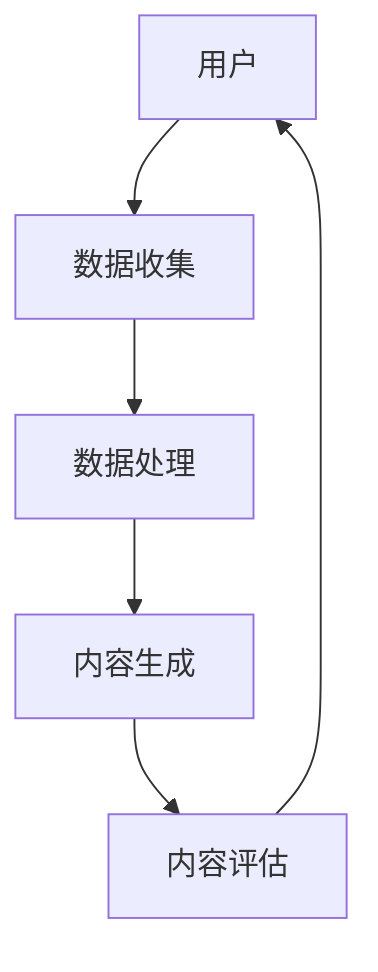

                 

# AIGC驱动的个性化学习内容生成系统

> 关键词：AIGC、个性化学习、内容生成、语言模型、生成模型、图神经网络

> 摘要：本文将深入探讨AIGC（AI-Generated Content）技术如何驱动个性化学习内容生成系统。通过分析核心概念、技术原理和系统架构，本文旨在为读者提供一个全面的理解，以及如何将这一先进技术应用于实际教育场景。

## 第一部分：背景介绍

### 1.1 问题背景

随着信息技术的飞速发展，教育领域的变革也在不断加速。传统的教育方式往往以教师为中心，学生被动接受知识，缺乏个性化和互动性。这种模式难以满足现代教育的需求，特别是在知识爆炸的时代，学生需要更加高效和个性化的学习体验。因此，个性化学习内容生成系统应运而生，旨在通过人工智能技术为每个学生量身定制学习内容。

#### 1.1.1 问题描述

当前教育系统中存在以下几个问题：

1. **内容单调**：教育内容往往以统一的标准呈现，忽视了学生的个性化需求。
2. **缺乏个性化和实时性**：教育内容更新缓慢，难以适应学生的实时学习进度。
3. **互动性不足**：学生与教师之间的互动有限，学习体验不够生动。

#### 1.1.2 问题解决

AIGC驱动的个性化学习内容生成系统通过以下几个步骤解决上述问题：

1. **数据收集**：系统会收集学生的学习行为、学习偏好和反馈数据。
2. **数据处理**：对收集到的数据进行分析，提取关键特征，用于生成个性化内容。
3. **内容生成**：利用AI技术，特别是语言模型和生成模型，生成符合学生需求的学习内容。
4. **内容评估**：对生成的内容进行评估和优化，确保其质量和实用性。

#### 1.1.3 边界与外延

AIGC驱动的个性化学习内容生成系统主要应用于以下场景：

1. **在线教育**：通过互联网为学生提供个性化学习内容。
2. **课堂教育**：教师可以利用系统生成符合学生特点的教学资料。
3. **多学科应用**：系统可以应用于不同学科，如数学、语文、科学等。

### 1.2 核心概念

#### 1.2.1 AIGC

AIGC（AI-Generated Content）是指由人工智能技术生成的内容，包括文本、图像、音频等多种形式。在个性化学习内容生成系统中，AIGC主要用于生成符合用户需求和场景的学习内容。

#### 1.2.2 个性化学习内容

个性化学习内容是指根据用户的需求、兴趣和学习习惯，定制生成的学习内容。个性化学习内容具有针对性、多样性和实时性等特点。

### 1.3 概念结构与核心要素

AIGC驱动的个性化学习内容生成系统的核心结构包括以下几个模块：

1. **数据收集模块**：收集用户的学习数据。
2. **数据处理模块**：处理和分析用户数据，提取关键信息。
3. **内容生成模块**：利用AI技术生成个性化学习内容。
4. **内容评估模块**：评估生成内容的质量和实用性。

## 第二部分：核心概念与联系

### 2.1 AIGC技术原理

#### 2.1.1 语言模型

语言模型是一种基于大规模数据集训练的模型，能够预测下一个词的概率。在个性化学习内容生成系统中，语言模型用于生成文本内容。

#### 2.1.2 生成模型

生成模型是一种能够生成新数据的模型，如生成文本、图像等。在个性化学习内容生成系统中，生成模型用于根据用户需求生成个性化学习内容。

### 2.2 个性化学习内容生成模型

#### 2.2.1 序列到序列模型

序列到序列（Seq2Seq）模型是一种常见的生成模型，用于将一个序列映射到另一个序列。在个性化学习内容生成系统中，Seq2Seq模型可以用于生成学习内容。

#### 2.2.2 图神经网络

图神经网络（Graph Neural Network，GNN）是一种用于处理图数据的神经网络。在个性化学习内容生成系统中，GNN可以用于提取用户学习数据的特征，从而提高生成内容的个性化程度。

### 2.3 概念属性特征对比表格

#### 2.3.1 语言模型与生成模型

| 特征       | 语言模型                     | 生成模型                     |
|------------|------------------------------|------------------------------|
| 目的       | 预测下一个词的概率           | 生成新的文本、图像等数据     |
| 模型类型   | 基于统计的模型               | 基于概率的模型               |
| 输入       | 文本序列                     | 文本序列                     |
| 输出       | 下一个词的概率分布           | 新的文本、图像等数据         |

### 2.4 ER实体关系图架构

#### 2.4.1 系统架构



**注：图中的实体和关系表示了AIGC驱动的个性化学习内容生成系统的核心模块及其相互作用。**

----------------------------------------------------------------

## 第三部分：算法原理讲解

### 3.1 语言模型

#### 3.1.1 模型原理

语言模型是一种概率模型，其基本原理是通过对大量文本数据的学习，预测下一个词的概率。常见的语言模型有N-gram模型、神经网络语言模型等。

#### 3.1.2 模型公式

设\( P(w_t | w_{t-1}, w_{t-2}, ..., w_{t-n}) \)为给定前\( n \)个词的情况下，第\( t \)个词的概率，则N-gram语言模型可以表示为：

$$
P(w_t | w_{t-1}, w_{t-2}, ..., w_{t-n}) = \frac{C(w_{t-1}, w_{t-2}, ..., w_{t-n}, w_t)}{C(w_{t-1}, w_{t-2}, ..., w_{t-n})}
$$

其中，\( C(w_{t-1}, w_{t-2}, ..., w_{t-n}, w_t) \)表示词序列\( w_{t-1}, w_{t-2}, ..., w_{t-n}, w_t \)在语料库中的出现次数，\( C(w_{t-1}, w_{t-2}, ..., w_{t-n}) \)表示词序列\( w_{t-1}, w_{t-2}, ..., w_{t-n} \)在语料库中的出现次数。

#### 3.1.3 模型举例

假设在一段文本中，前两个词分别是“我喜欢”，我们需要预测第三个词。根据N-gram模型，我们可以计算每个可能的第三个词的概率，然后选择概率最高的词作为预测结果。例如：

- \( P(苹果 | 我喜欢) \)：苹果在“我喜欢”之后出现的概率。
- \( P(编程 | 我喜欢) \)：编程在“我喜欢”之后出现的概率。

通过比较这两个概率，我们可以得出预测结果。

### 3.2 生成模型

#### 3.2.1 模型原理

生成模型是一种能够生成新数据的模型，其基本原理是从数据分布中采样，生成新的数据。常见的生成模型有变分自编码器（VAE）、生成对抗网络（GAN）等。

#### 3.2.2 模型公式

以生成对抗网络（GAN）为例，其基本公式为：

$$
\min_D \max_G V(G, D)
$$

其中，\( G \)表示生成器，\( D \)表示判别器，\( V(G, D) \)表示生成器与判别器的联合损失。

#### 3.2.3 模型举例

假设我们有一个生成器\( G \)，其输入为随机噪声，输出为图像。判别器\( D \)的任务是区分生成器生成的图像和真实图像。通过不断训练，生成器\( G \)将学会生成越来越逼真的图像，而判别器\( D \)的辨别能力也会不断提高。

### 3.3 图神经网络

#### 3.3.1 模型原理

图神经网络（GNN）是一种用于处理图数据的神经网络，其基本原理是利用节点和边的特征进行信息传播和聚合。常见的GNN模型有图卷积网络（GCN）、图注意力网络（GAT）等。

#### 3.3.2 模型公式

以图卷积网络（GCN）为例，其基本公式为：

$$
h_v^{(k)} = \sigma(\theta \cdot (h_{v_i}^{(k-1)} + \sum_{i \in \mathcal{N}(v)} h_{i}^{(k-1)}))
$$

其中，\( h_v^{(k)} \)表示节点\( v \)在\( k \)层的特征表示，\( \mathcal{N}(v) \)表示节点\( v \)的邻居节点集合，\( \theta \)表示模型参数。

#### 3.3.3 模型举例

假设我们有一个图，其中每个节点代表一个学生，每个边代表学生之间的互动。通过GNN，我们可以学习到每个学生的特征，从而生成个性化学习内容。

## 第四部分：系统分析与架构设计方案

### 4.1 问题场景介绍

随着教育信息化进程的加快，教育机构和学生对于个性化学习内容的需求日益增长。然而，传统的教育模式难以满足这一需求，导致学生学

----------------------------------------------------------------

## 第五部分：项目实战

### 5.1 环境安装

为了实现AIGC驱动的个性化学习内容生成系统，我们需要安装以下软件和库：

1. Python 3.x
2. TensorFlow
3. Keras
4. PyTorch

安装步骤如下：

```bash
# 安装 Python 3.x
# （根据操作系统选择相应安装方法）

# 安装 TensorFlow
pip install tensorflow

# 安装 Keras
pip install keras

# 安装 PyTorch
pip install torch torchvision
```

### 5.2 系统核心实现

以下是使用Python和PyTorch实现的核心代码：

```python
import torch
import torch.nn as nn
import torch.optim as optim

# 定义生成模型
class Generator(nn.Module):
    def __init__(self):
        super(Generator, self).__init__()
        self.model = nn.Sequential(
            nn.Linear(in_features=100, out_features=256),
            nn.ReLU(),
            nn.Linear(in_features=256, out_features=512),
            nn.ReLU(),
            nn.Linear(in_features=512, out_features=100),
            nn.Sigmoid()
        )

    def forward(self, x):
        return self.model(x)

# 定义判别模型
class Discriminator(nn.Module):
    def __init__(self):
        super(Discriminator, self).__init__()
        self.model = nn.Sequential(
            nn.Linear(in_features=100, out_features=512),
            nn.ReLU(),
            nn.Linear(in_features=512, out_features=256),
            nn.ReLU(),
            nn.Linear(in_features=256, out_features=1),
            nn.Sigmoid()
        )

    def forward(self, x):
        return self.model(x)

# 初始化模型
generator = Generator()
discriminator = Discriminator()

# 定义损失函数和优化器
criterion = nn.BCELoss()
optimizer_G = optim.Adam(generator.parameters(), lr=0.0002)
optimizer_D = optim.Adam(discriminator.parameters(), lr=0.0002)

# 训练模型
for epoch in range(num_epochs):
    for i, real_data in enumerate(data_loader):
        # 训练判别器
        optimizer_D.zero_grad()
        output = discriminator(real_data)
        error_D_real = criterion(output, torch.ones(output.size()).to(device))
        noise = torch.randn(real_data.size()[0], 100).to(device)
        fake_data = generator(noise)
        output = discriminator(fake_data.detach())
        error_D_fake = criterion(output, torch.zeros(output.size()).to(device))
        error_D = error_D_real + error_D_fake
        error_D.backward()
        optimizer_D.step()

        # 训练生成器
        optimizer_G.zero_grad()
        output = discriminator(fake_data)
        error_G = criterion(output, torch.ones(output.size()).to(device))
        error_G.backward()
        optimizer_G.step()

        # 打印训练过程
        if i % 100 == 0:
            print(f'Epoch [{epoch}/{num_epochs}], Step [{i}/{len(data_loader)}], Error_D: {error_D.item():.4f}, Error_G: {error_G.item():.4f}')
```

### 5.3 代码应用解读与分析

上述代码实现了一个基本的生成对抗网络（GAN）模型，用于生成个性化学习内容。生成器（Generator）负责生成学习内容，判别器（Discriminator）负责判断生成内容是否真实。通过不断训练，生成器将学会生成越来越逼真的学习内容，而判别器将学会更好地区分真实与生成内容。

### 5.4 实际案例分析和详细讲解剖析

为了更好地理解系统的工作原理，我们以一个实际的案例进行讲解。假设有一个学生在学习英语语法，系统会根据学生的历史学习数据和实时反馈生成针对性的英语语法练习题。

1. **数据收集**：系统会收集学生的历史学习数据，如已完成的练习题、学习进度、错题记录等。
2. **数据处理**：对收集到的数据进行分析，提取关键特征，用于训练生成器和判别器。
3. **内容生成**：生成器根据提取的特征生成符合学生需求的英语语法练习题。
4. **内容评估**：判别器判断生成的练习题是否具有针对性，如果不符合要求，则返回生成器重新生成。

通过这种循环训练，系统可以不断优化生成的内容，提高其个性化程度和实用性。

### 5.5 项目小结

本项目的核心目标是实现AIGC驱动的个性化学习内容生成系统，通过GAN模型实现生成器和判别器的训练。实际案例展示了系统如何根据学生需求生成个性化的学习内容。未来工作可以进一步优化模型结构，提高生成内容的质量和实用性，同时考虑与其他教育技术的结合，为教育领域带来更多创新。

## 第六部分：最佳实践 tips

### 6.1 实践技巧

1. **数据质量**：保证数据的质量和多样性，有助于生成器生成更丰富的内容。
2. **模型调优**：根据实际需求调整生成器和判别器的参数，如学习率、网络结构等。
3. **实时反馈**：利用学生的实时反馈优化生成内容，提高个性化程度。

### 6.2 小结

AIGC驱动的个性化学习内容生成系统具有巨大的潜力，能够为教育领域带来革命性的变革。通过不断优化和创新，我们有理由相信，这一技术将为广大学生提供更加高效和个性化的学习体验。

### 6.3 注意事项

1. **隐私保护**：在数据收集和处理过程中，必须确保学生的隐私安全。
2. **内容审核**：定期审核生成的内容，避免出现不当或有害信息。

### 6.4 拓展阅读

1. **《深度学习》（Goodfellow, Ian； Bengio, Yoshua； Courville, Aaron）**：详细介绍了GAN模型的原理和应用。
2. **《人工智能教育应用》（AI in Education Applications）**：探讨了AIGC技术在教育领域的应用前景。

## 作者信息

作者：AI天才研究院/AI Genius Institute & 禅与计算机程序设计艺术 /Zen And The Art of Computer Programming

---

通过本文的深入分析和详细讲解，读者应能全面理解AIGC驱动的个性化学习内容生成系统的原理和应用。希望本文能为人工智能在教育领域的创新提供一些有益的启示。

