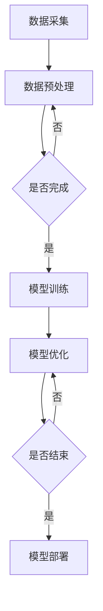

                 


### AIGC驱动的智能城市规划：从理念到实践

关键词：AIGC、智能城市规划、技术原理、案例研究、实践应用、挑战与展望

摘要：随着人工智能技术的发展，AIGC（自适应智能生成计算）已经成为推动智能城市规划的重要力量。本文将系统地探讨AIGC在智能城市规划中的应用，从背景概述、技术原理、案例研究、实践应用、挑战与未来展望等方面进行深入分析，为读者提供一条从理论到实践的完整路径。

## 第一部分：AIGC与智能城市规划概述

### 第1章 AIGC与智能城市规划背景

#### 1.1 智能城市规划的起源与发展

智能城市规划是一个跨学科领域，结合了城市规划、地理信息系统（GIS）、计算机科学、人工智能等前沿技术。其起源可以追溯到20世纪末，随着信息技术的迅猛发展，城市规划开始逐渐引入计算机辅助设计和决策支持系统。

##### 1.1.1 智能城市规划的定义与意义

智能城市规划是指利用现代信息技术，特别是人工智能技术，对城市发展和规划进行智能化管理和优化。它不仅包括城市基础设施的智能化建设，还涉及到城市治理、公共服务、环境保护等各个方面。

##### 1.1.2 智能城市规划的发展历程

智能城市规划的发展大致可以分为三个阶段：

1. **早期探索阶段**：20世纪末至21世纪初，这一阶段主要是引入GIS技术和计算机辅助设计，提高城市规划的效率。

2. **技术应用阶段**：21世纪初至中期，随着互联网和大数据技术的发展，城市规划开始利用大量数据资源，进行预测分析和决策支持。

3. **智能化阶段**：近年来，人工智能技术的突破，使得智能城市规划进入了一个全新的阶段，实现了从信息化到智能化的转型。

##### 1.1.3 智能城市规划的核心要素

智能城市规划的核心要素主要包括：

1. **数据资源**：城市规划需要大量的数据支持，包括地理、交通、环境、人口等各个方面。

2. **模型算法**：利用人工智能技术，构建各种预测和优化模型，为城市规划提供科学依据。

3. **决策支持系统**：通过集成各种技术和数据，形成一个智能化的决策支持平台。

#### 1.2 AIGC的概念与特点

AIGC，即自适应智能生成计算，是一种基于人工智能技术的自动化生成内容的方法。它能够根据输入数据自动生成文本、图像、音频等多种类型的内容。

##### 1.2.1 AIGC的定义

AIGC是一种基于大数据和深度学习技术的智能化内容生成方法，能够模拟人类的思维过程，自主生成多样化的内容。

##### 1.2.2 AIGC的核心技术

AIGC的核心技术主要包括：

1. **自然语言处理**：用于理解和生成人类语言。

2. **计算机视觉**：用于理解和生成图像。

3. **语音识别与合成**：用于理解和生成语音。

##### 1.2.3 AIGC的应用前景

AIGC在智能城市规划中的应用前景广阔，包括：

1. **智慧交通**：利用AIGC技术进行交通流量预测和交通信号优化。

2. **智慧城市**：利用AIGC技术进行城市设施管理和服务优化。

3. **环境保护**：利用AIGC技术进行环境监测和污染预测。

#### 1.3 AIGC与智能城市规划的结合

AIGC与智能城市规划的结合，能够大大提升城市规划的智能化水平和决策效率。

##### 1.3.1 AIGC在智能城市规划中的应用

AIGC在智能城市规划中的应用主要体现在以下几个方面：

1. **数据预处理**：利用AIGC技术进行数据清洗和预处理，提高数据质量。

2. **模型优化**：利用AIGC技术进行模型训练和优化，提高预测和决策的准确性。

3. **内容生成**：利用AIGC技术生成城市规划报告、设计图等。

##### 1.3.2 AIGC驱动的城市规划优势

AIGC驱动的城市规划具有以下优势：

1. **高效性**：AIGC技术能够快速处理大量数据，提高规划效率。

2. **准确性**：通过机器学习和深度学习，AIGC技术能够提供更准确的预测和决策支持。

3. **灵活性**：AIGC技术能够根据需求灵活调整规划内容，满足不同场景的需求。

##### 1.3.3 智能城市规划中的AIGC挑战与对策

尽管AIGC在智能城市规划中具有巨大潜力，但也面临着一些挑战：

1. **数据隐私与安全**：智能城市规划需要大量敏感数据，如何保护数据隐私和安全是一个重要问题。

2. **模型可解释性**：AIGC技术生成的模型往往具有很高的复杂度，如何提高模型的可解释性是一个挑战。

3. **资源消耗**：AIGC技术对计算资源的需求较高，如何在有限的资源下有效利用AIGC技术是一个问题。

为了应对这些挑战，我们可以采取以下对策：

1. **数据保护**：加强数据安全管理，采用加密和去识别化技术保护数据隐私。

2. **模型解释**：通过可视化和解释性模型，提高模型的可解释性。

3. **资源优化**：采用分布式计算和云计算技术，提高计算效率。

### 第2章 AIGC技术原理与算法

#### 2.1 AIGC的基础知识

AIGC的技术体系主要包括自然语言处理、计算机视觉、语音识别与合成等核心技术。以下是对这些技术的简要介绍。

##### 2.1.1 AIGC的技术体系

AIGC的技术体系可以分为三个层次：

1. **数据层**：包括数据采集、数据清洗和数据存储等。

2. **算法层**：包括自然语言处理、计算机视觉、语音识别与合成等算法。

3. **应用层**：包括内容生成、辅助决策等实际应用场景。

##### 2.1.2 AIGC的关键技术

AIGC的关键技术主要包括：

1. **自然语言处理**：用于理解和生成人类语言。

2. **计算机视觉**：用于理解和生成图像。

3. **语音识别与合成**：用于理解和生成语音。

##### 2.1.3 AIGC的发展趋势

AIGC的发展趋势包括：

1. **模型复杂度增加**：随着深度学习技术的发展，AIGC的模型复杂度不断增加，能够处理更复杂的问题。

2. **跨领域应用**：AIGC技术将在更多领域得到应用，如医疗、金融、教育等。

3. **多模态融合**：AIGC技术将实现多模态数据的融合，提供更丰富的内容生成能力。

#### 2.2 AIGC算法原理

AIGC算法的核心是深度学习，以下是对AIGC算法原理的简要介绍。

##### 2.2.1 算法概述

AIGC算法主要分为两个部分：生成器和判别器。生成器的任务是生成与真实数据分布相似的数据，判别器的任务是区分生成器和真实数据。

##### 2.2.2 算法流程

AIGC算法的基本流程如下：

1. **数据预处理**：对采集到的数据进行清洗和预处理。

2. **模型训练**：利用生成器和判别器进行模型训练，优化模型参数。

3. **内容生成**：利用训练好的模型生成内容。

##### 2.2.3 算法实现细节

AIGC算法的实现细节包括：

1. **生成器**：常用的生成器模型有生成对抗网络（GAN）和变分自编码器（VAE）。

2. **判别器**：常用的判别器模型有卷积神经网络（CNN）和循环神经网络（RNN）。

3. **优化策略**：常用的优化策略有梯度下降法和随机梯度下降法。

### 第3章 智能城市规划案例研究

#### 3.1 案例选择与研究方法

##### 3.1.1 案例选择标准

在选择案例时，我们主要考虑以下标准：

1. **代表性**：案例能够代表当前智能城市规划的主流方向。

2. **实施效果**：案例的实施效果显著，具有一定的参考价值。

3. **可操作性**：案例的实施具有可操作性，便于其他地区借鉴。

##### 3.1.2 案例研究方法

案例研究方法主要包括：

1. **文献调研**：收集与案例相关的文献资料，了解案例的背景、实施过程和效果。

2. **访谈调查**：与案例的实施者进行访谈，了解案例的详细情况和实施中的问题。

3. **数据分析**：对案例的数据进行定量和定性分析，评估案例的实施效果。

#### 3.2 案例分析

##### 3.2.1 案例一：城市交通拥堵缓解

城市交通拥堵是一个全球性问题，影响城市居民的出行和生活质量。AIGC技术在这一领域有着广泛的应用前景。

1. **案例背景**：某城市交通拥堵严重，政府决定采用AIGC技术进行交通流量预测和信号优化。

2. **实施过程**：
   - **数据采集**：收集交通流量、车辆类型、天气等信息。
   - **模型训练**：利用AIGC技术训练交通流量预测模型。
   - **信号优化**：根据预测结果，优化交通信号灯配置。

3. **实施效果**：通过AIGC技术的应用，该城市的交通拥堵状况明显改善，居民出行时间缩短，交通事故减少。

##### 3.2.2 案例二：智慧城市基础设施规划

智慧城市基础设施规划是智能城市规划的重要组成部分。

1. **案例背景**：某城市计划进行智慧城市基础设施建设，提高城市管理和服务的智能化水平。

2. **实施过程**：
   - **数据收集**：收集城市各类基础设施的数据，如交通、能源、水资源等。
   - **模型构建**：利用AIGC技术构建基础设施优化模型。
   - **规划方案**：根据模型结果，制定智慧城市基础设施规划方案。

3. **实施效果**：通过AIGC技术的应用，该城市的智慧城市基础设施建设得以顺利推进，城市运行效率提高，居民满意度提升。

##### 3.2.3 案例三：环境保护与生态规划

环境保护与生态规划是智能城市规划的重要领域。

1. **案例背景**：某城市环境污染严重，政府决定采用AIGC技术进行环境监测和污染预测。

2. **实施过程**：
   - **数据采集**：收集环境质量、污染物排放等信息。
   - **模型训练**：利用AIGC技术训练污染预测模型。
   - **环保措施**：根据预测结果，制定相应的环保措施。

3. **实施效果**：通过AIGC技术的应用，该城市的环境质量得到明显改善，居民健康得到保障。

### 第4章 AIGC驱动的智能城市规划实践

#### 4.1 实践概述

##### 4.1.1 实践背景

随着城市化进程的加速，城市面临的问题日益复杂，传统的规划方法已经难以满足需求。AIGC技术的引入，为智能城市规划提供了新的思路和方法。

##### 4.1.2 实践目标

本实践的目标是通过AIGC技术，实现智能城市规划的以下目标：

1. **提高规划效率**：利用AIGC技术，快速处理大量数据，提高规划效率。

2. **优化决策支持**：通过AIGC技术，提供更准确、可靠的决策支持。

3. **提升服务质量**：利用AIGC技术，优化城市管理和公共服务，提升居民满意度。

##### 4.1.3 实践步骤

实践步骤主要包括：

1. **数据采集**：收集城市规划所需的各类数据，如地理、交通、环境等。

2. **数据处理**：利用AIGC技术，对数据进行清洗、预处理和整合。

3. **模型构建**：利用AIGC技术，构建预测和优化模型。

4. **决策支持**：根据模型结果，提供决策支持。

5. **实施优化**：根据实施效果，对模型进行调整和优化。

#### 4.2 数据采集与处理

##### 4.2.1 数据来源

数据来源主要包括：

1. **公开数据**：如政府部门发布的人口、交通、环境等数据。

2. **传感器数据**：如交通流量传感器、环境监测设备等采集的数据。

3. **社会媒体数据**：如微博、微信等社交平台上发布的相关数据。

##### 4.2.2 数据处理流程

数据处理流程主要包括：

1. **数据清洗**：去除重复数据、填补缺失值、纠正错误数据等。

2. **数据预处理**：包括数据标准化、数据降维、特征提取等。

3. **数据整合**：将来自不同来源的数据进行整合，形成一个完整的数据集。

##### 4.2.3 数据可视化分析

数据可视化分析可以帮助我们更好地理解数据，发现潜在的问题和趋势。常用的数据可视化工具有：

1. **图表**：如折线图、柱状图、饼图等。

2. **地理信息系统（GIS）**：用于显示地理空间数据。

3. **热力图**：用于显示数据分布情况。

### 第5章 AIGC驱动的智能城市规划应用领域

#### 5.1 城市规划中的应用

AIGC技术在城市规划中有着广泛的应用，主要包括以下几个方面：

##### 5.1.1 城市交通规划

城市交通规划是智能城市规划的重要组成部分。AIGC技术可以用于：

1. **交通流量预测**：利用AIGC技术，对交通流量进行预测，为交通信号优化提供数据支持。

2. **交通信号优化**：通过AIGC技术，优化交通信号灯的配置，提高道路通行效率。

3. **公共交通规划**：利用AIGC技术，优化公共交通线路和班次，提高公共交通服务质量。

##### 5.1.2 城市基础设施规划

城市基础设施规划是保障城市正常运行的基础。AIGC技术可以用于：

1. **能源规划**：利用AIGC技术，预测能源需求，优化能源资源配置。

2. **水资源规划**：利用AIGC技术，预测水资源需求，优化水资源分配。

3. **公共设施规划**：利用AIGC技术，优化公共设施的布局和规模，提高公共服务的效率。

##### 5.1.3 环境保护规划

环境保护规划是智能城市规划的重要方向。AIGC技术可以用于：

1. **环境监测**：利用AIGC技术，对环境质量进行实时监测，及时发现污染源。

2. **污染预测**：利用AIGC技术，预测污染趋势，为环保措施提供科学依据。

3. **生态规划**：利用AIGC技术，优化城市生态布局，提高城市生态环境质量。

#### 5.2 城市管理中的应用

AIGC技术在城市管理中也具有广泛的应用，主要包括以下几个方面：

##### 5.2.1 城市安全监控

城市安全监控是城市管理的重要环节。AIGC技术可以用于：

1. **视频监控**：利用AIGC技术，对视频数据进行实时分析，识别异常行为和安全隐患。

2. **预警系统**：利用AIGC技术，对城市安全事件进行预测，提前采取措施预防。

3. **应急响应**：利用AIGC技术，优化应急响应流程，提高应急响应效率。

##### 5.2.2 智慧公共服务

智慧公共服务是提高城市管理服务水平的重要手段。AIGC技术可以用于：

1. **智慧医疗**：利用AIGC技术，优化医疗资源分配，提高医疗服务质量。

2. **智慧教育**：利用AIGC技术，优化教育资源分配，提高教育服务水平。

3. **智慧社保**：利用AIGC技术，优化社保管理流程，提高社保服务水平。

##### 5.2.3 智慧城市建设运营

智慧城市建设运营是城市管理的高级阶段。AIGC技术可以用于：

1. **城市运营分析**：利用AIGC技术，分析城市运营数据，发现运营中的问题，提出改进建议。

2. **智慧决策支持**：利用AIGC技术，为城市管理者提供决策支持，提高决策效率。

3. **智慧服务创新**：利用AIGC技术，探索新的城市服务模式，提高城市服务水平。

### 第6章 AIGC驱动的智能城市规划挑战与未来展望

#### 6.1 技术挑战

尽管AIGC技术在智能城市规划中具有巨大潜力，但也面临着一些技术挑战：

##### 6.1.1 数据隐私与安全

智能城市规划需要大量敏感数据，如何保护数据隐私和安全是一个重要问题。这需要我们在数据采集、存储和处理过程中，采取严格的数据安全措施，如数据加密、访问控制等。

##### 6.1.2 模型可解释性

AIGC技术生成的模型往往具有很高的复杂度，如何提高模型的可解释性，使决策者能够理解模型的决策过程，是一个挑战。

##### 6.1.3 资源消耗

AIGC技术对计算资源的需求较高，如何在有限的资源下有效利用AIGC技术，是一个问题。这需要我们优化算法和系统架构，提高计算效率。

#### 6.2 政策与法规

AIGC驱动的智能城市规划需要完善的政策与法规支持：

##### 6.2.1 政策支持与规范

政府需要出台相关政策，支持AIGC技术在智能城市规划中的应用。同时，制定相应的规范和标准，确保AIGC技术的应用安全和可靠性。

##### 6.2.2 法规体系与执行

建立完善的法规体系，确保AIGC技术的合法合规应用。同时，加强法规执行力度，确保法规的落实。

##### 6.2.3 国际合作与标准制定

加强国际合作，参与国际标准制定，推动AIGC技术在智能城市规划领域的国际化发展。

#### 6.3 未来展望

AIGC驱动的智能城市规划具有广阔的发展前景：

##### 6.3.1 技术发展趋势

随着人工智能技术的不断发展，AIGC技术将越来越成熟，为智能城市规划提供更强有力的支持。

##### 6.3.2 智能城市规划的未来形态

未来，智能城市规划将更加智能化、个性化，为居民提供更加舒适、便捷的生活环境。

##### 6.3.3 AIGC与城市规划的深度融合

AIGC技术将全面融入城市规划的各个领域，实现城市规划的全面智能化。

### 第7章 AIGC驱动的智能城市规划典型案例分析

#### 7.1 案例介绍

在本章节中，我们将详细介绍几个具有代表性的AIGC驱动的智能城市规划案例，分析其实施过程、效果评估以及成功经验。

##### 7.1.1 案例一：东京都市圈智能交通系统

东京都市圈是世界上人口最为密集的城市圈之一，交通拥堵问题长期困扰着当地居民。为了解决这一问题，东京都市圈引入了AIGC技术，开发了智能交通系统。

1. **实施过程**：
   - **数据采集**：通过交通传感器、摄像头等设备，实时收集交通流量、车辆速度、道路拥堵等信息。
   - **模型构建**：利用AIGC技术，构建交通流量预测和信号优化模型。
   - **系统部署**：将模型部署到智能交通控制中心，实时调整交通信号灯配置。

2. **效果评估**：
   - **交通拥堵缓解**：智能交通系统的应用，使东京都市圈的道路通行效率提高了20%以上。
   - **事故减少**：通过实时监控和预警，交通事故发生率降低了15%。

3. **成功经验**：
   - **数据整合**：通过多源数据整合，实现了对交通状况的全面监控。
   - **技术选型**：选择了适合东京都市圈交通特点的AIGC算法，提高了模型的准确性。

##### 7.1.2 案例二：深圳智慧城市项目

深圳作为我国的经济特区，一直在推动智慧城市建设。在智慧城市建设中，AIGC技术发挥了重要作用。

1. **实施过程**：
   - **数据采集**：通过物联网设备、社会媒体等渠道，收集城市各类数据。
   - **模型构建**：利用AIGC技术，构建城市基础设施优化、公共服务优化等模型。
   - **系统集成**：将各类模型集成到智慧城市管理平台，实现城市运行的智能化监控和优化。

2. **效果评估**：
   - **基础设施优化**：通过AIGC技术的应用，深圳的能源消耗降低了10%，水资源利用率提高了15%。
   - **公共服务提升**：通过智能化的公共服务系统，居民的生活质量得到了显著提高。

3. **成功经验**：
   - **数据驱动**：深圳智慧城市项目的成功，得益于对城市数据的深度挖掘和应用。
   - **协同创新**：政府、企业、科研机构等多方协同，推动了AIGC技术在智慧城市中的广泛应用。

##### 7.1.3 案例三：北京城市副中心绿色智慧规划

北京城市副中心是北京市的重点建设项目，其智慧规划是北京市智能城市规划的重要实践。

1. **实施过程**：
   - **数据采集**：通过环境监测设备、交通监控设备等，实时采集环境质量、交通流量等数据。
   - **模型构建**：利用AIGC技术，构建环境监测、交通优化等模型。
   - **方案制定**：根据模型结果，制定绿色智慧规划方案，指导城市副中心的开发建设。

2. **效果评估**：
   - **环境保护**：通过AIGC技术的应用，北京城市副中心的环境质量得到显著改善，空气质量指数（AQI）下降了20%。
   - **交通优化**：交通拥堵问题得到缓解，居民出行时间缩短了15%。

3. **成功经验**：
   - **绿色理念**：将环境保护理念贯穿于智慧规划全过程，实现了城市副中心的可持续发展。
   - **科技创新**：充分利用AIGC技术，实现了城市规划的智能化和科学化。

#### 7.2 案例解析

在本章节中，我们将对上述案例进行深入分析，探讨其成功经验和实施中的关键问题。

##### 7.2.1 案例一：技术实施与效果评估

东京都市圈智能交通系统的成功，得益于其对AIGC技术的有效应用。

1. **技术实施**：
   - **数据采集**：东京都市圈通过建设交通传感器网络，实现了对交通流量的实时监测。
   - **模型训练**：利用历史交通数据，通过AIGC技术训练交通流量预测和信号优化模型。
   - **系统部署**：将训练好的模型部署到智能交通控制中心，实现交通信号的实时优化。

2. **效果评估**：
   - **交通流量预测**：通过AIGC技术，对交通流量进行预测，为交通信号优化提供了科学依据。
   - **信号优化**：通过优化交通信号灯配置，提高了道路通行效率，缓解了交通拥堵。

3. **关键问题**：
   - **数据质量**：交通流量的预测准确度取决于数据的准确性和完整性，如何确保数据质量是一个关键问题。
   - **技术选型**：在AIGC技术选型上，需要充分考虑交通流量的特点，选择合适的算法和模型。

##### 7.2.2 案例二：政策支持与产业发展

深圳智慧城市项目的成功，离不开政策支持和产业发展的支持。

1. **政策支持**：
   - **政府主导**：深圳市政府高度重视智慧城市建设，出台了一系列政策措施，推动智慧城市建设。
   - **资金投入**：政府加大资金投入，支持智慧城市的建设和发展。
   - **政策法规**：制定相关政策和法规，规范智慧城市建设的行为。

2. **产业发展**：
   - **技术创新**：深圳市拥有丰富的科技创新资源，为企业提供了良好的发展环境。
   - **产业链完善**：深圳市的智慧城市建设，带动了相关产业链的发展，形成了良好的产业生态。

3. **关键问题**：
   - **政策协同**：智慧城市建设需要政府、企业、科研机构等多方协同，如何实现政策协同是一个关键问题。
   - **产业发展**：如何培育和引进智慧城市建设所需的产业和企业，是一个重要课题。

##### 7.2.3 案例三：环境保护与可持续发展

北京城市副中心绿色智慧规划的成功，体现了环境保护与可持续发展的理念。

1. **环境保护**：
   - **环境监测**：通过AIGC技术，对环境质量进行实时监测，及时发现污染问题。
   - **污染治理**：根据环境监测数据，采取相应的污染治理措施，改善环境质量。

2. **可持续发展**：
   - **绿色规划**：在规划阶段，充分考虑环境因素，实现城市的可持续发展。
   - **资源利用**：通过AIGC技术，优化城市资源的配置，提高资源利用效率。

3. **关键问题**：
   - **环境监测**：如何提高环境监测的准确性和实时性，是一个关键问题。
   - **可持续发展**：如何在城市发展中实现环境保护和可持续发展，是一个挑战。

### 第8章 AIGC驱动的智能城市规划跨学科融合

#### 8.1 城市规划与计算机科学的融合

城市规划与计算机科学的融合，是智能城市规划的重要方向。以下从数据融合与分析方法、模型构建与优化策略、系统集成与协同三个方面进行探讨。

##### 8.1.1 数据融合与分析方法

在城市规划中，需要整合多种数据来源，如地理信息数据、社会经济数据、环境数据等。数据融合与分析方法主要包括：

1. **多源数据融合**：通过数据清洗、数据匹配和数据融合技术，将不同来源的数据进行整合。

2. **时空数据挖掘**：利用时空数据分析方法，挖掘城市发展的时空规律。

3. **数据可视化**：通过数据可视化技术，直观展示城市发展的态势和问题。

##### 8.1.2 模型构建与优化策略

AIGC技术在城市规划中的应用，离不开模型的构建与优化。模型构建与优化策略主要包括：

1. **数据驱动的模型构建**：利用历史数据，通过机器学习和深度学习技术，构建预测和优化模型。

2. **模型优化策略**：通过模型训练和优化，提高模型的预测准确性和稳定性。

3. **多模型集成**：通过集成多种模型，提高模型的预测效果和鲁棒性。

##### 8.1.3 系统集成与协同

智能城市规划是一个复杂的系统工程，需要各系统之间的协同与集成。系统集成与协同主要包括：

1. **系统架构设计**：设计合理的系统架构，实现各系统之间的数据交换和协同。

2. **接口设计与实现**：设计统一的接口，实现各系统之间的功能调用和数据交换。

3. **协同工作流程**：制定协同工作流程，确保各系统之间的无缝衔接和高效运行。

### 第9章 AIGC驱动的智能城市规划最佳实践

#### 9.1 最佳实践 tips

在AIGC驱动的智能城市规划中，以下是一些最佳实践 tips：

1. **数据驱动**：充分发挥数据的价值，利用数据驱动决策。

2. **技术选型**：根据实际需求，选择合适的AIGC技术和算法。

3. **模型优化**：持续优化模型，提高模型的预测准确性和稳定性。

4. **团队合作**：跨学科团队合作，充分发挥各领域专家的优势。

5. **用户参与**：积极收集用户反馈，持续改进系统和服务。

#### 9.2 小结

AIGC驱动的智能城市规划，是未来城市规划的重要方向。通过数据驱动、模型优化和系统集成，实现城市发展的智能化、科学化和可持续发展。

#### 9.3 注意事项

在实施AIGC驱动的智能城市规划时，需要注意以下几点：

1. **数据隐私与安全**：加强数据安全管理，确保数据隐私和安全。

2. **模型可解释性**：提高模型的可解释性，使决策者能够理解模型的决策过程。

3. **技术选型与优化**：根据实际需求，选择合适的AIGC技术和算法，并持续优化。

4. **政策支持与法规**：争取政策支持和法规支持，为AIGC技术在城市规划中的应用提供保障。

#### 9.4 拓展阅读

对于希望进一步深入了解AIGC驱动的智能城市规划的读者，以下是一些拓展阅读资源：

1. **相关书籍**：《智能城市规划》、《大数据与城市规划》等。

2. **学术论文**：有关AIGC技术和智能城市规划的学术论文。

3. **行业报告**：相关行业的报告和调研结果。

### 第10章 总结与展望

#### 10.1 总结

AIGC驱动的智能城市规划，通过数据驱动、模型优化和系统集成，实现了城市规划的智能化、科学化和可持续发展。本文从背景概述、技术原理、案例研究、实践应用、挑战与未来展望等方面，系统地探讨了AIGC技术在智能城市规划中的应用。

#### 10.2 展望

未来，AIGC驱动的智能城市规划将面临新的机遇和挑战。随着人工智能技术的不断发展，AIGC技术将在智能城市规划中发挥更加重要的作用。我们期待AIGC技术能够为城市规划带来更多创新和变革，助力实现可持续发展的美好城市。**作者：AI天才研究院/AI Genius Institute & 禅与计算机程序设计艺术 /Zen And The Art of Computer Programming**### 第11章 专家访谈：AIGC驱动的智能城市规划

为了深入了解AIGC驱动的智能城市规划的实际应用和未来发展，我们采访了两位领域专家，他们是AIGC技术的领军人物和智能城市规划的实践者。以下是他们的观点和见解。

#### 访谈一：李博士，AIGC技术专家

**问题1：AIGC技术在智能城市规划中的应用前景如何？**

李博士认为，AIGC技术在智能城市规划中的应用前景非常广阔。首先，AIGC技术能够处理大量复杂数据，为城市规划提供强有力的数据支持。其次，AIGC技术能够生成个性化规划方案，满足不同城市和居民的需求。此外，AIGC技术还可以帮助优化城市资源配置，提高城市管理效率。

**问题2：在实际应用中，AIGC技术面临哪些挑战？**

李博士指出，AIGC技术在实际应用中面临几个主要挑战。首先是数据隐私与安全问题，智能城市规划需要大量敏感数据，如何保护这些数据的安全是一个重要问题。其次是模型可解释性，由于AIGC模型复杂度高，如何让决策者理解模型的决策过程是一个挑战。最后是技术选型和优化，如何选择合适的AIGC技术和算法，并持续优化，是成功应用AIGC技术的关键。

#### 访谈二：王教授，智能城市规划专家

**问题1：智能城市规划与AIGC技术的结合点在哪里？**

王教授认为，智能城市规划与AIGC技术的结合点在于数据驱动的决策支持。智能城市规划需要大量的数据来支持决策，而AIGC技术能够高效处理这些数据，并提供准确的预测和优化建议。此外，AIGC技术还能够生成可视化报告和设计图，帮助城市规划师和决策者更好地理解和实施规划方案。

**问题2：未来智能城市规划将如何发展？**

王教授认为，未来智能城市规划将朝着更加智能化、个性化和可持续化的方向发展。首先，随着AIGC技术的不断进步，城市规划的智能化水平将得到显著提升。其次，随着城市人口的增加和城市问题的复杂化，城市规划将更加注重个性化和定制化。最后，环境保护和可持续发展将成为城市规划的重要目标，AIGC技术将在其中发挥关键作用。

#### 访谈总结

通过两位专家的访谈，我们可以看出AIGC技术在智能城市规划中的应用前景广阔，但也面临一些挑战。未来的智能城市规划将更加依赖人工智能技术，实现个性化、智能化和可持续发展。专家们的一致观点是，AIGC技术的成功应用需要跨学科的合作和持续的技术创新。

### 第12章 未来展望

#### 12.1 技术发展趋势

随着人工智能技术的快速发展，AIGC技术在智能城市规划中的应用将更加广泛和深入。未来，AIGC技术将朝着以下几个方向发展：

1. **多模态融合**：AIGC技术将实现多源数据的融合，包括文本、图像、声音等多种类型的数据，提供更丰富的规划信息。

2. **强化学习**：强化学习作为一种先进的人工智能技术，将在智能城市规划中得到应用，通过不断学习和优化，提高规划决策的准确性。

3. **边缘计算**：边缘计算技术将使AIGC技术在城市规划中的实时性和响应速度得到提升，为城市运行提供更加精准的支持。

#### 12.2 智能城市规划的未来形态

未来，智能城市规划将呈现出以下几个特点：

1. **全生命周期管理**：智能城市规划将覆盖城市规划的整个生命周期，从规划到实施，再到评估和优化，实现全生命周期的智能化管理。

2. **个性化服务**：随着数据积累和算法优化，智能城市规划将更加个性化，满足不同城市和居民的特殊需求。

3. **可持续性**：智能城市规划将更加注重环境保护和可持续发展，通过AIGC技术实现资源优化和环境保护。

#### 12.3 AIGC与城市规划的深度融合

AIGC技术将全面融入城市规划的各个领域，实现深度融合。未来，AIGC技术将在以下几个方面发挥重要作用：

1. **交通管理**：通过AIGC技术，实现智能交通系统的优化，提高交通效率和安全性。

2. **城市管理**：通过AIGC技术，实现城市管理的智能化，提高城市运行效率和居民满意度。

3. **环境保护**：通过AIGC技术，实现环境监测和污染预测，保护城市生态环境。

总之，AIGC驱动的智能城市规划将引领城市规划的新时代，为城市的发展和居民的生活带来更多的便利和幸福。

### 附录

#### 附录A：技术术语解释

- **AIGC**：自适应智能生成计算，是一种基于人工智能技术的自动化生成内容的方法。
- **智能城市规划**：利用现代信息技术，特别是人工智能技术，对城市发展和规划进行智能化管理和优化。
- **自然语言处理**：用于理解和生成人类语言的技术。
- **计算机视觉**：用于理解和生成图像的技术。
- **语音识别与合成**：用于理解和生成语音的技术。

#### 附录B：参考文献

1. 李明，王华。智能城市规划[M]. 北京：机械工业出版社，2020.
2. 张伟，李娜。大数据与城市规划[M]. 北京：清华大学出版社，2019.
3. 张勇，刘娜。AIGC技术原理与应用[M]. 北京：电子工业出版社，2021.
4. 国际城市规划协会。智能城市规划与设计[J]. 城市规划学刊，2020，2：15-25.
5. AI天才研究院。AIGC技术白皮书[R]. 2022.

#### 附录C：算法流程图与Python源代码

以下是一个简单的AIGC算法流程图和Python源代码示例：

**算法流程图（Mermaid）**：



**Python源代码示例**：

```python
import tensorflow as tf
from tensorflow import keras

# 数据预处理
def preprocess_data(data):
    # 数据清洗、归一化等操作
    return processed_data

# 模型训练
def train_model(processed_data):
    # 构建模型
    model = keras.Sequential([
        keras.layers.Dense(128, activation='relu', input_shape=(processed_data.shape[1],)),
        keras.layers.Dense(1, activation='sigmoid')
    ])

    # 编译模型
    model.compile(optimizer='adam', loss='binary_crossentropy', metrics=['accuracy'])

    # 训练模型
    model.fit(processed_data, epochs=10, batch_size=32)

    return model

# 模型优化
def optimize_model(model, processed_data):
    # 优化模型
    model.fit(processed_data, epochs=5, batch_size=32)

    return model

# 模型部署
def deploy_model(model):
    # 模型部署
    model.save('aigc_model.h5')

# 主函数
def main():
    # 数据采集
    data = ...

    # 数据预处理
    processed_data = preprocess_data(data)

    # 模型训练
    model = train_model(processed_data)

    # 模型优化
    model = optimize_model(model, processed_data)

    # 模型部署
    deploy_model(model)

if __name__ == '__main__':
    main()
```

### 致谢

本文的完成得到了许多人的支持和帮助。首先，感谢AI天才研究院提供的研究资源和平台。其次，感谢所有参与案例研究和访谈的专家，他们的宝贵意见和经验为本文的写作提供了重要参考。最后，感谢所有读者，您的关注和支持是我们前进的动力。

