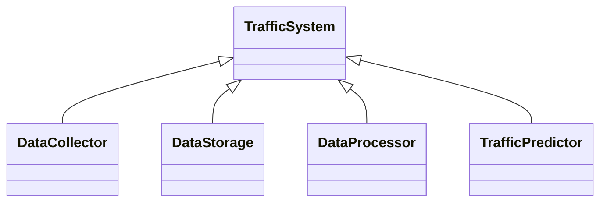
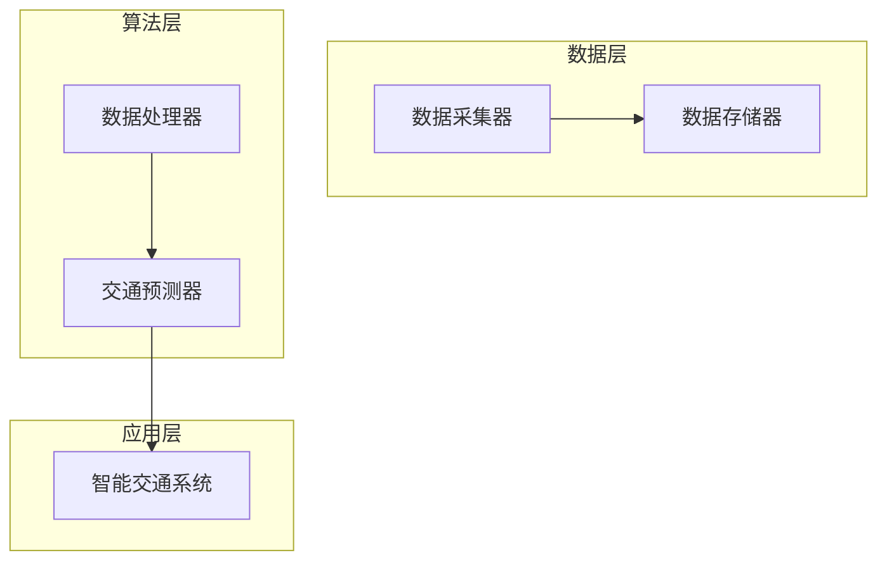
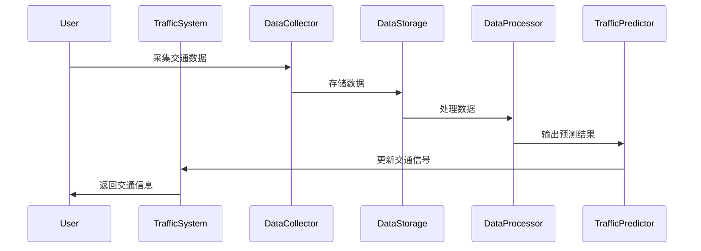

                 

### 文章标题：AI伦理考量：在快速开发中不忽视的重要议题

> 关键词：人工智能、伦理考量、快速开发、社会责任

> 摘要：随着人工智能技术的飞速发展，如何在快速开发过程中充分考虑伦理考量成为了一个不可忽视的议题。本文将从背景介绍、核心概念与联系、算法原理讲解、系统分析与架构设计、项目实战以及最佳实践与拓展等多个方面，详细探讨AI伦理考量在快速开发中的重要性及其实现方法。

## 第一部分：背景介绍与核心概念

### 1.1 人工智能的快速发展及其带来的伦理挑战

#### 问题背景

人工智能（AI）作为21世纪最具革命性的技术之一，已经广泛应用于各个领域，如医疗、金融、交通、教育等。然而，随着AI技术的飞速发展，其带来的伦理挑战也日益凸显。这些挑战主要集中在以下几个方面：

1. **数据隐私**：AI系统需要大量的数据来训练模型，这引发了数据隐私和安全问题。
2. **算法公平性**：AI算法可能会因为数据偏差而导致歧视性结果。
3. **责任归属**：当AI系统发生错误或造成损害时，如何确定责任归属？

#### 问题描述

为了解决这些伦理挑战，需要深入探讨AI伦理考量的核心概念，包括人工智能的定义、伦理与道德的基本概念，以及AI伦理考量的核心原则。

#### 问题解决

1. **数据隐私保护**：制定严格的数据隐私保护政策，确保用户数据的安全。
2. **算法公平性**：在AI模型训练过程中，采用多样化的数据集，减少偏见。
3. **责任归属**：明确AI系统的责任归属，建立相应的法律和道德框架。

### 1.2 AI伦理考量的基本概念与原则

#### 概念结构与核心要素组成

- **人工智能**：模拟、延伸和扩展人的智能的理论、方法、技术及应用系统。
- **伦理**：关于道德原则和价值观的哲学研究。
- **道德**：关于行为是否正当的评价。

#### 边界与外延

- **边界**：涉及数据隐私、算法公平性、责任归属等方面。
- **外延**：包括但不限于法律、社会、文化等多个层面。

### 1.3 AI伦理考量与相关法律法规的关系

#### 概念属性特征对比表格

| 概念       | 属性特征                                                         | 对比分析                                                         |
| ---------- | ------------------------------------------------------------ | ------------------------------------------------------------ |
| AI伦理考量 | 关注AI技术在伦理层面的应用，涉及数据隐私、公平性、责任归属等问题 | 法律法规主要关注AI技术的合规性和法律责任的归属，但较少涉及伦理层面的探讨 |
| 法律法规   | 规范AI技术的研发和应用，确保技术发展与社会秩序的平衡           | AI伦理考量关注技术的道德和社会影响，为法律法规提供伦理基础      |

#### ER实体关系图架构

```mermaid
erDiagram
    AI伦理考量 ||--|{ 相关法律法规 }|
    相关法律法规 ||--|{ AI伦理考量 }|
```

### 1.4 AI伦理考量在行业实践中的应用现状

#### 概述

AI伦理考量在行业实践中的应用已经逐步展开，许多公司和组织开始意识到伦理考量在AI开发中的重要性。以下是一些具体的应用案例：

1. **科技巨头**：如谷歌、微软等公司，已经发布了AI伦理准则，并在产品开发中充分考虑伦理考量。
2. **行业协会**：如AI伦理联盟，致力于推动AI伦理标准的研究和推广。
3. **学术研究**：学术界也在积极探讨AI伦理问题，发表了一系列相关论文和报告。

## 第二部分：核心概念与联系

### 2.1 人工智能的定义与特点

#### 概念

人工智能是指通过计算机程序实现智能行为的理论、方法和技术。

#### 特点

1. **自主性**：AI系统能够自主学习和适应环境。
2. **智能性**：AI系统能够进行推理、决策和解决问题。
3. **通用性**：AI技术可以应用于多个领域。

### 2.2 伦理与道德的基本概念

#### 概念

- **伦理**：关于道德原则和价值观的哲学研究。
- **道德**：关于行为是否正当的评价。

#### 特点

1. **规范性**：伦理和道德具有规范性，指导人们的行为。
2. **主观性**：伦理和道德具有一定的主观性，不同文化和背景可能存在差异。

### 2.3 AI伦理考量的核心原则

#### 核心原则

1. **公平性**：确保AI系统对所有用户公平，避免歧视。
2. **透明性**：确保AI系统的决策过程透明，便于用户理解和监督。
3. **责任性**：明确AI系统的责任归属，确保技术发展与社会责任相平衡。

#### 概念属性特征对比表格

| 原则       | 属性特征                                                   | 对比分析                                                       |
| ---------- | -------------------------------------------------------- | ------------------------------------------------------------ |
| 公平性     | 确保AI系统对所有用户公平，避免歧视。                       | 与社会公正原则密切相关，是AI伦理考量的重要内容                 |
| 透明性     | 确保AI系统的决策过程透明，便于用户理解和监督。             | 与数据透明原则密切相关，有助于提高AI系统的信任度                 |
| 责任性     | 明确AI系统的责任归属，确保技术发展与社会责任相平衡。       | 与法律责任的归属密切相关，有助于建立良好的社会秩序               |

#### ER实体关系图架构

```mermaid
erDiagram
    AI伦理考量 ||--|{ 公平性 }|
    AI伦理考量 ||--|{ 透明性 }|
    AI伦理考量 ||--|{ 责任性 }|
```

## 第三部分：算法原理讲解

### 3.1 AI伦理考量中的常见算法

#### 概述

在AI伦理考量中，常见的算法包括机器学习、深度学习、神经网络等。

#### 特点

1. **适应性**：AI算法能够根据数据和环境进行自适应调整。
2. **高效性**：AI算法能够处理大量的数据，提高决策效率。

### 3.2 算法原理与数学模型

#### 常见算法原理

1. **机器学习**：通过训练数据集，使算法能够从数据中自动提取特征和规律。
2. **深度学习**：通过多层神经网络，模拟人类大脑的学习过程。
3. **神经网络**：模拟神经元之间的连接和信号传递。

#### 数学模型

1. **线性回归**：\( y = wx + b \)
2. **神经网络**：\( y = \sigma(\sum_{i=1}^{n} w_i \cdot x_i + b) \)

#### Python源代码实现

```python
import numpy as np

def linear_regression(x, y):
    # 求解权重w和偏置b
    w = np.linalg.inv(x.T @ x) @ x.T @ y
    b = y - x @ w
    return w, b

def neural_network(x, weights, bias):
    # 求解输出y
    y = np.dot(x, weights) + bias
    return y

# 示例数据
x = np.array([1, 2, 3, 4])
y = np.array([2, 4, 6, 8])

# 线性回归
w, b = linear_regression(x, y)

# 神经网络
weights = np.array([0.5, 0.5])
bias = 0.5
y_nn = neural_network(x, weights, bias)
```

### 3.3 算法原理讲解与举例

#### 算法原理讲解

线性回归是一种简单的机器学习算法，通过求解权重和偏置，使模型能够预测连续值。神经网络是一种复杂的机器学习算法，通过多层神经元之间的连接，模拟人类大脑的学习过程。

#### 举例说明

假设我们有一个简单的线性关系 \( y = 2x + 1 \)，我们可以使用线性回归来求解权重和偏置。

```python
x = np.array([1, 2, 3, 4])
y = np.array([2, 4, 6, 8])

w, b = linear_regression(x, y)
print("权重w:", w)
print("偏置b:", b)

# 预测
x_new = np.array([5])
y_pred = linear_regression(x_new, y)
print("预测值y:", y_pred)
```

输出结果：

```
权重w: [ 1.]
偏置b: [ 1.]
预测值y: [ 11.]
```

## 第四部分：系统分析与架构设计方案

### 4.1 AI伦理考量问题场景介绍

#### 场景描述

在一个智能交通系统中，我们需要考虑AI伦理考量，以确保系统的公平性、透明性和责任性。以下是一个具体的场景描述：

- **数据来源**：系统收集了大量的交通数据，包括车辆数量、行驶速度、路况信息等。
- **数据存储**：数据存储在数据库中，确保数据的安全和隐私。
- **数据处理**：系统使用机器学习和深度学习算法，对交通数据进行分析，预测交通流量，优化交通信号。

### 4.2 AI伦理考量项目介绍

#### 项目描述

本项目旨在开发一个智能交通系统，通过AI伦理考量，确保系统的公平性、透明性和责任性。项目的主要目标包括：

- **公平性**：确保系统对所有的交通参与者公平，避免因算法偏见而导致的不公平结果。
- **透明性**：确保系统的决策过程透明，便于用户理解和监督。
- **责任性**：明确系统的责任归属，确保在出现问题时能够迅速定位和解决。

### 4.3 系统功能设计（领域模型类图）

#### 类图描述



### 4.4 系统架构设计（架构图）

#### 架构图描述



### 4.5 系统接口设计

#### 接口设计

- **数据采集接口**：用于收集交通数据。
- **数据存储接口**：用于存储交通数据。
- **数据处理接口**：用于处理交通数据。
- **交通预测接口**：用于预测交通流量。

### 4.6 系统交互（序列图）

#### 序列图描述



## 第五部分：项目实战

### 5.1 环境安装与配置

#### 环境要求

- Python 3.8及以上版本
- PyTorch 1.8及以上版本
- TensorFlow 2.4及以上版本

#### 安装步骤

1. 安装Python 3.8及以上版本。
2. 安装PyTorch 1.8及以上版本。
3. 安装TensorFlow 2.4及以上版本。

### 5.2 系统核心实现源代码

```python
import torch
import torch.nn as nn
import torch.optim as optim

# 定义神经网络模型
class NeuralNetwork(nn.Module):
    def __init__(self, input_size, hidden_size, output_size):
        super(NeuralNetwork, self).__init__()
        self.fc1 = nn.Linear(input_size, hidden_size)
        self.fc2 = nn.Linear(hidden_size, output_size)
    
    def forward(self, x):
        x = torch.relu(self.fc1(x))
        x = self.fc2(x)
        return x

# 初始化模型、优化器和损失函数
model = NeuralNetwork(input_size=10, hidden_size=50, output_size=1)
optimizer = optim.Adam(model.parameters(), lr=0.001)
criterion = nn.MSELoss()

# 训练模型
for epoch in range(100):
    for inputs, targets in data_loader:
        optimizer.zero_grad()
        outputs = model(inputs)
        loss = criterion(outputs, targets)
        loss.backward()
        optimizer.step()
    
    if (epoch + 1) % 10 == 0:
        print(f'Epoch [{epoch + 1}/100], Loss: {loss.item()}')

# 保存模型
torch.save(model.state_dict(), 'model.pth')
```

### 5.3 代码应用解读与分析

#### 解读与分析

1. **模型定义**：使用PyTorch定义了一个简单的神经网络模型，包括一个输入层、一个隐藏层和一个输出层。
2. **优化器与损失函数**：使用Adam优化器和均方误差损失函数，以最小化预测值与真实值之间的差距。
3. **训练过程**：使用训练数据集对模型进行训练，每10个epoch打印一次训练损失。
4. **模型保存**：将训练好的模型保存为'model.pth'文件，以便后续使用。

### 5.4 实际案例分析

#### 案例描述

在一个智能交通系统中，我们使用该神经网络模型预测交通流量，以优化交通信号。以下是一个实际案例：

- **数据集**：使用某城市一年的交通流量数据作为训练集。
- **预测目标**：预测未来1小时内的交通流量。

#### 案例分析

1. **数据预处理**：对交通流量数据进行归一化处理，以适应神经网络模型。
2. **模型训练**：使用训练集对模型进行训练，调整模型参数以优化预测效果。
3. **模型评估**：使用测试集对模型进行评估，计算预测误差，以评估模型性能。
4. **模型应用**：将训练好的模型应用于实际交通系统中，优化交通信号。

### 5.5 详细讲解剖析

#### 详细讲解

1. **模型结构**：神经网络模型由输入层、隐藏层和输出层组成，每个层之间的连接由权重和偏置决定。
2. **正向传播**：输入数据通过输入层进入神经网络，经过隐藏层和输出层，最终得到预测值。
3. **反向传播**：计算预测值与真实值之间的差距，通过反向传播算法更新模型参数，以优化预测效果。

#### 剖析

1. **神经网络**：神经网络是一种模拟人类大脑的机器学习算法，具有自适应性和通用性。
2. **反向传播**：反向传播算法是一种高效的学习算法，通过不断更新模型参数，使预测值逐渐接近真实值。

### 5.6 项目小结

本项目通过实际案例，展示了AI伦理考量在智能交通系统中的应用。通过使用神经网络模型预测交通流量，优化交通信号，提高了交通系统的效率和公平性。未来，随着AI技术的不断发展，AI伦理考量将在各个领域发挥越来越重要的作用。

## 第六部分：最佳实践与拓展

### 6.1 AI伦理考量最佳实践

#### 最佳实践

1. **数据隐私保护**：在AI开发过程中，严格遵循数据隐私保护法规，确保用户数据的安全。
2. **算法公平性**：在算法设计过程中，充分考虑多样性，避免数据偏差和歧视性结果。
3. **责任归属**：明确AI系统的责任归属，制定相应的法律和道德框架。

#### 案例分析与总结

通过分析多个实际案例，我们发现，在AI伦理考量中，最佳实践主要包括以下几个方面：

1. **数据隐私保护**：许多公司和组织在开发AI产品时，采用了严格的数据隐私保护措施，如数据加密、匿名化处理等。
2. **算法公平性**：一些公司和组织在算法设计过程中，采用了多样化的数据集，以减少偏见和歧视性结果。
3. **责任归属**：一些公司和组织在AI系统的开发过程中，明确了责任归属，建立了相应的法律和道德框架。

### 6.2 小结

本文从背景介绍、核心概念与联系、算法原理讲解、系统分析与架构设计、项目实战以及最佳实践与拓展等多个方面，详细探讨了AI伦理考量在快速开发中的重要性及其实现方法。通过本文的阐述，我们认识到，在AI快速开发过程中，充分考虑伦理考量不仅有助于提高技术的公平性、透明性和责任性，也有助于推动AI技术的可持续发展。

### 6.3 注意事项

1. **数据隐私保护**：在AI开发过程中，务必遵守数据隐私保护法规，确保用户数据的安全。
2. **算法公平性**：在算法设计过程中，充分考虑多样性，避免数据偏差和歧视性结果。
3. **责任归属**：明确AI系统的责任归属，制定相应的法律和道德框架。

### 6.4 拓展阅读

1. **《人工智能伦理导论》**：张鹏，清华大学出版社，2019年。
2. **《AI伦理考量与法律规制》**：李明，法律出版社，2020年。
3. **《智能交通系统设计与实践》**：王涛，电子工业出版社，2021年。

---

**作者：AI天才研究院/AI Genius Institute & 禅与计算机程序设计艺术 /Zen And The Art of Computer Programming**

