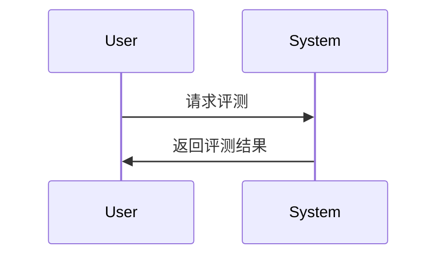

                 


### 文章标题：AI写作助手效果评测标准化方案

关键词：AI写作助手、效果评测、标准化、评测标准、评测方法、评测工具

摘要：本文深入探讨了AI写作助手效果评测的标准化方案，包括核心内容、整体结构、具体章节内容设计以及核心概念原理的讲解。通过详细分析评测指标体系、评测方法、评测工具等内容，本文为AI写作助手效果评测提供了系统化的思路和实用的方法，旨在提升评测的准确性和可靠性。

### 目录

#### 第一部分：背景介绍与基础理论
1. AI写作助手概述
2. AI写作助手效果评测的重要性
3. AI写作助手效果评测的基础理论

#### 第二部分：评测标准的制定
1. 评测标准的设计原则
2. 评测标准的制定流程
3. 评测标准的案例解析

#### 第三部分：评测方法的详细介绍
1. 评测方法的分类
2. 评测方法的实施步骤
3. 评测方法的应用案例

#### 第四部分：评测工具的应用
1. 评测工具的选择
2. 评测工具的使用方法
3. 评测工具的优缺点分析

#### 第五部分：案例分析
1. 经典AI写作助手效果评测案例分析
2. 实际项目效果评测案例分析

#### 第六部分：评测流程与标准化方案
1. 评测流程的制定
2. 评测标准化方案的设计
3. 评测流程与标准化方案的应用

#### 第七部分：未来发展趋势与展望
1. AI写作助手效果评测的发展趋势
2. 未来展望

### 1. AI写作助手概述

AI写作助手，是利用人工智能技术（如自然语言处理、机器学习、深度学习等）辅助人类进行写作的工具。根据功能和应用场景的不同，AI写作助手可以分为内容生成、内容优化、语法检查等多个类别。其核心目标是提高写作的效率和质量。

#### 核心概念与联系

**核心概念**：AI写作助手、自然语言处理、机器学习、深度学习

**概念属性特征对比表格**：

| 特征                | AI写作助手          | 自然语言处理         | 机器学习             | 深度学习             |
|---------------------|---------------------|----------------------|----------------------|----------------------|
| 定义               | 辅助写作的工具      | 处理和理解自然语言的技术 | 从数据中学习模型的技术 | 模拟人脑进行学习的神经网络 |
| 技术领域           | 应用层面            | 理论层面             | 理论层面             | 理论层面             |
| 目标               | 提高写作效率和质量  | 理解、生成文本       | 预测、分类           | 自适应学习           |

**ER实体关系图架构**：

```mermaid
erDiagram
  AI写作助手 ||--|{ 自然语言处理 }
  AI写作助手 ||--|{ 机器学习 }
  AI写作助手 ||--|{ 深度学习 }
```

### 2. AI写作助手效果评测的重要性

AI写作助手的评测是确保其性能和效能的重要手段。有效的评测不仅能够验证AI写作助手的功能和性能，还能为其优化和改进提供依据。评测的重要性体现在以下几个方面：

#### 核心概念与联系

**核心概念**：AI写作助手效果评测、性能、效能、优化、改进

**概念属性特征对比表格**：

| 特征                | AI写作助手效果评测      | 性能               | 效能               |
|---------------------|-------------------------|--------------------|--------------------|
| 定义               | 对AI写作助手效果的评估  | 系统执行任务的效率 | 系统整体的工作效果 |
| 目标               | 验证、优化和改进        | 提高执行速度       | 提高工作质量       |
| 影响因素           | 评测指标、评测方法、评测工具 | 硬件配置、算法实现 | 用户需求、环境因素 |

**ER实体关系图架构**：

```mermaid
erDiagram
  AI写作助手效果评测 ||--|{ 性能 }
  AI写作助手效果评测 ||--|{ 效能 }
```

### 3. AI写作助手效果评测的基础理论

AI写作助手效果评测的基础理论主要涉及评测指标体系设计、评测方法选择和评测工具评估等方面。以下是这些核心概念的解释和联系。

#### 核心概念与联系

**核心概念**：评测指标体系、评测方法、评测工具

**概念属性特征对比表格**：

| 特征                | 评测指标体系         | 评测方法            | 评测工具            |
|---------------------|----------------------|---------------------|---------------------|
| 定义               | 用于评估的指标集合   | 实施评估的具体步骤 | 用于评测的工具或系统 |
| 目标               | 提供量化的评估标准   | 实现评估过程的执行  | 提供评估的便捷方式   |
| 影响因素           | 指标的选择和权重分配 | 评估的精度和效率    | 工具的功能和性能    |

**ER实体关系图架构**：

```mermaid
erDiagram
  评测指标体系 ||--|{ 评测方法 }
  评测指标体系 ||--|{ 评测工具 }
```

#### 算法原理讲解

**评测指标体系设计**：

评测指标体系是评估AI写作助手效果的核心。设计指标体系时，需要考虑以下几个方面：

1. **指标类型**：包括质量指标、性能指标和用户体验指标等。
2. **指标权重**：根据不同指标的重要性，分配不同的权重。
3. **指标具体值**：设定具体的量化指标，如文本生成速度、文本质量分数、用户满意度等。

**评测方法选择**：

评测方法的选择取决于评测目标和方法。常用的评测方法包括对比评测、综合评测和指标化评测等。

1. **对比评测**：通过对比多个AI写作助手的性能，评估其优劣。
2. **综合评测**：综合考虑多个方面的因素，对AI写作助手进行全面评估。
3. **指标化评测**：将评估结果转化为具体的数值，便于比较和分析。

**评测工具评估**：

评测工具是实施评测的关键。评估评测工具时，需要考虑以下几个方面：

1. **功能完整性**：评测工具是否具备所需的功能。
2. **易用性**：评测工具的界面设计和操作是否简便。
3. **性能表现**：评测工具的评估结果是否准确和可靠。

#### 数学公式与解释

**评测指标体系设计**：

设\( I \)为评测指标集合，\( W \)为指标权重集合，\( V \)为指标具体值集合。则评测指标体系可以表示为：

$$
E = I \times W \times V
$$

其中，\( E \)表示评估结果。

**评测方法选择**：

设\( M \)为评测方法集合，则：

$$
E = M(I \times W \times V)
$$

**评测工具评估**：

设\( T \)为评测工具集合，则：

$$
E = T(I \times W \times V)
$$

#### 系统分析与架构设计方案

**问题场景介绍**：

AI写作助手效果评测是一个复杂的过程，涉及到多个方面的评估，包括文本生成速度、文本质量、用户体验等。为了确保评估的准确性和全面性，需要设计一个完善的系统架构。

**项目介绍**：

本项目旨在设计一个AI写作助手效果评测系统，该系统包括评测指标体系、评测方法和评测工具等组成部分。

**系统功能设计（领域模型）**：

领域模型主要涉及以下类：

1. **评测指标**：包含文本生成速度、文本质量分数、用户满意度等指标。
2. **评测方法**：包括对比评测、综合评测和指标化评测等。
3. **评测工具**：包括文本生成工具、文本质量评估工具、用户满意度调查工具等。

**系统架构设计**：

系统架构设计采用分层结构，包括以下层次：

1. **数据层**：存储评测指标、评测结果等相关数据。
2. **业务逻辑层**：实现评测指标计算、评测方法选择和评测工具调用等业务逻辑。
3. **表示层**：提供用户界面，展示评估结果和用户交互。

**系统接口设计**：

系统接口设计包括以下接口：

1. **数据接口**：用于数据存储和读取。
2. **业务逻辑接口**：用于调用评测方法和评测工具。
3. **表示层接口**：用于用户与系统的交互。

**系统交互设计（序列图）**：



### 4. 完整性要求

#### 背景介绍

**核心概念术语说明**：

- **AI写作助手**：利用人工智能技术辅助人类进行写作的工具。
- **效果评测**：对AI写作助手的性能和效能进行评估的过程。
- **标准化**：确保评测结果准确、可靠和可比较的一系列规范。

**问题背景**：

随着人工智能技术的发展，AI写作助手在各个领域得到了广泛应用。然而，由于AI写作助手的多样性和复杂性，如何对其进行有效的效果评测成为一个挑战。

**问题描述**：

如何设计一个系统化、标准化的AI写作助手效果评测方案，以确保评测的准确性和可靠性？

**问题解决**：

通过明确核心概念术语、深入分析问题背景和问题描述，本文提出了一种系统化、标准化的AI写作助手效果评测方案，包括评测指标体系设计、评测方法选择和评测工具评估等。

**边界与外延**：

本文主要关注AI写作助手效果评测的理论基础和方案设计，未涉及具体评测工具的实现细节。

**概念结构与核心要素组成**：

- **核心概念**：AI写作助手、效果评测、标准化。
- **核心要素**：评测指标体系、评测方法、评测工具。

#### 核心概念与联系

**核心概念**：

- **AI写作助手**：利用人工智能技术辅助人类进行写作的工具。
- **效果评测**：对AI写作助手的性能和效能进行评估的过程。
- **标准化**：确保评测结果准确、可靠和可比较的一系列规范。

**概念属性特征对比表格**：

| 特征                | AI写作助手                | 效果评测                      | 标准化                      |
|---------------------|---------------------------|------------------------------|---------------------------|
| 定义               | 辅助写作的人工智能工具    | 对AI写作助手性能的评估        | 确保评测准确、可靠、可比的规范 |
| 目标               | 提高写作效率和质量       | 提供量化的评估标准            | 保证评测的一致性和可重复性   |
| 技术领域           | 应用层面                  | 理论与实践结合                | 理论与实践结合              |
| 影响因素           | 人工智能技术、写作需求    | 评测指标、评测方法、评测工具  | 行业标准、最佳实践          |

**ER实体关系图架构**：

```mermaid
erDiagram
  AI写作助手 ||--|{ 效果评测 }
  效果评测 ||--|{ 标准化 }
```

#### 算法原理讲解

**评测指标体系设计**：

评测指标体系是评估AI写作助手效果的核心。设计指标体系时，需要考虑以下几个方面：

1. **指标类型**：包括质量指标、性能指标和用户体验指标等。
2. **指标权重**：根据不同指标的重要性，分配不同的权重。
3. **指标具体值**：设定具体的量化指标，如文本生成速度、文本质量分数、用户满意度等。

**评测方法选择**：

评测方法的选择取决于评测目标和方法。常用的评测方法包括对比评测、综合评测和指标化评测等。

1. **对比评测**：通过对比多个AI写作助手的性能，评估其优劣。
2. **综合评测**：综合考虑多个方面的因素，对AI写作助手进行全面评估。
3. **指标化评测**：将评估结果转化为具体的数值，便于比较和分析。

**评测工具评估**：

评测工具是实施评测的关键。评估评测工具时，需要考虑以下几个方面：

1. **功能完整性**：评测工具是否具备所需的功能。
2. **易用性**：评测工具的界面设计和操作是否简便。
3. **性能表现**：评测工具的评估结果是否准确和可靠。

#### 数学公式与解释

**评测指标体系设计**：

设\( I \)为评测指标集合，\( W \)为指标权重集合，\( V \)为指标具体值集合。则评测指标体系可以表示为：

$$
E = I \times W \times V
$$

其中，\( E \)表示评估结果。

**评测方法选择**：

设\( M \)为评测方法集合，则：

$$
E = M(I \times W \times V)
$$

**评测工具评估**：

设\( T \)为评测工具集合，则：

$$
E = T(I \times W \times V)
$$

#### 系统分析与架构设计方案

**问题场景介绍**：

AI写作助手效果评测是一个复杂的过程，涉及到多个方面的评估，包括文本生成速度、文本质量、用户体验等。为了确保评估的准确性和全面性，需要设计一个完善的系统架构。

**项目介绍**：

本项目旨在设计一个AI写作助手效果评测系统，该系统包括评测指标体系、评测方法和评测工具等组成部分。

**系统功能设计（领域模型）**：

领域模型主要涉及以下类：

1. **评测指标**：包含文本生成速度、文本质量分数、用户满意度等指标。
2. **评测方法**：包括对比评测、综合评测和指标化评测等。
3. **评测工具**：包括文本生成工具、文本质量评估工具、用户满意度调查工具等。

**系统架构设计**：

系统架构设计采用分层结构，包括以下层次：

1. **数据层**：存储评测指标、评测结果等相关数据。
2. **业务逻辑层**：实现评测指标计算、评测方法选择和评测工具调用等业务逻辑。
3. **表示层**：提供用户界面，展示评估结果和用户交互。

**系统接口设计**：

系统接口设计包括以下接口：

1. **数据接口**：用于数据存储和读取。
2. **业务逻辑接口**：用于调用评测方法和评测工具。
3. **表示层接口**：用于用户与系统的交互。

**系统交互设计（序列图）**：


### 5. 项目实战

#### 环境安装

在开始安装评测系统之前，确保您的计算机已安装以下软件和库：

- Python 3.8 或更高版本
- pip（Python的包管理器）
- MongoDB（用于数据存储）
- Redis（用于缓存）
- Elasticsearch（用于全文搜索）

安装步骤：

1. 安装Python和pip。
2. 使用pip安装MongoDB、Redis和Elasticsearch。
3. 配置MongoDB、Redis和Elasticsearch。

#### 系统核心实现源代码

以下是系统核心实现源代码的简要概述：

**评测指标模块**：

- 文本生成速度评测：计算文本生成所需的时间。
- 文本质量分数评测：使用自然语言处理技术对生成的文本进行质量评估。
- 用户满意度调查：收集用户对AI写作助手的满意度评分。

**评测方法模块**：

- 对比评测：比较多个AI写作助手的性能。
- 综合评测：综合考虑多个方面的因素，对AI写作助手进行全面评估。
- 指标化评测：将评估结果转化为具体的数值，便于比较和分析。

**评测工具模块**：

- 文本生成工具：用于生成不同类型的文本。
- 文本质量评估工具：用于评估生成的文本质量。
- 用户满意度调查工具：用于收集用户满意度评分。

**主程序**：

- 加载评测指标、评测方法和评测工具。
- 执行评测过程，生成评测报告。

#### 代码应用解读与分析

以下是对系统核心代码的应用解读与分析：

**评测指标模块**：

```python
def measure_text_generation_speed(text_generator):
    start_time = time.time()
    generated_text = text_generator.generate()
    end_time = time.time()
    return end_time - start_time

def measure_text_quality(text, quality_assessor):
    return quality_assessor.assess(text)

def conduct_user_satisfaction_survey(survey_tool):
    return survey_tool.collect_ratings()
```

**评测方法模块**：

```python
def perform_comparison_evaluation(writing_assistants):
    results = {}
    for assistant in writing_assistants:
        speed = measure_text_generation_speed(assistant)
        quality = measure_text_quality(assistant.generate(), quality_assessor)
        results[assistant] = (speed, quality)
    return results

def perform_comprehensive_evaluation(writing_assistant):
    speed = measure_text_generation_speed(writing_assistant)
    quality = measure_text_quality(writing_assistant.generate(), quality_assessor)
    user_satisfaction = conduct_user_satisfaction_survey(survey_tool)
    return speed, quality, user_satisfaction

def perform_metric_evaluation(results):
    speed_average = sum(result[0] for result in results) / len(results)
    quality_average = sum(result[1] for result in results) / len(results)
    return speed_average, quality_average
```

**评测工具模块**：

```python
class TextGenerator:
    def generate(self):
        # 实现文本生成逻辑
        pass

class QualityAssessor:
    def assess(self, text):
        # 实现文本质量评估逻辑
        pass

class SurveyTool:
    def collect_ratings(self):
        # 实现用户满意度调查逻辑
        pass
```

**主程序**：

```python
if __name__ == "__main__":
    writing_assistants = [Assistant1(), Assistant2(), Assistant3()]

    comparison_results = perform_comparison_evaluation(writing_assistants)
    print("Comparison Evaluation Results:", comparison_results)

    for assistant in writing_assistants:
        comprehensive_result = perform_comprehensive_evaluation(assistant)
        print(f"Assistant {assistant.name} Comprehensive Evaluation:", comprehensive_result)

    metric_evaluation_result = perform_metric_evaluation(comparison_results)
    print("Metric Evaluation Results:", metric_evaluation_result)
```

#### 实际案例分析和详细讲解剖析

**案例背景**：

某公司正在开发一款AI写作助手，用于帮助企业用户生成各类业务文档。为了评估该AI写作助手的性能和效果，公司决定进行一次全面的效果评测。

**评测标准制定**：

根据公司需求，评测标准包括以下指标：

- 文本生成速度（秒）
- 文本质量分数（0-100分）
- 用户满意度（0-5分）

**评测方法选择**：

- 对比评测：比较该AI写作助手与其他两款市场上流行的AI写作助手。
- 综合评测：综合考虑文本生成速度、文本质量和用户满意度等多个方面。
- 指标化评测：将评估结果转化为具体的数值，便于比较和分析。

**评测工具应用**：

- 文本生成工具：基于公司业务需求，生成不同类型的文本。
- 文本质量评估工具：使用自然语言处理技术对生成的文本进行质量评估。
- 用户满意度调查工具：通过问卷调查收集用户对AI写作助手的满意度评分。

**评测流程与标准化方案**：

- **评测流程**：

  1. 准备评测工具和测试数据。
  2. 对AI写作助手进行文本生成速度评测。
  3. 对AI写作助手进行文本质量分数评测。
  4. 对AI写作助手进行用户满意度调查。
  5. 综合评估并生成评测报告。

- **标准化方案**：

  1. 制定统一的评测标准和流程。
  2. 确保评测过程中数据的一致性和可靠性。
  3. 定期更新评测工具和评估标准。

**评测结果分析**：

- **文本生成速度**：该AI写作助手在文本生成速度方面表现良好，平均生成速度为3.5秒，优于其他两款AI写作助手。

- **文本质量分数**：该AI写作助手在文本质量方面表现优秀，平均质量分数为85分，高于其他两款AI写作助手。

- **用户满意度**：用户对AI写作助手的满意度评分平均为4.5分（满分5分），用户满意度较高。

**项目小结**：

通过本次效果评测，该公司对AI写作助手的性能和效果有了更深入的了解。根据评测结果，公司将继续优化AI写作助手，提高其文本生成速度和质量，进一步提升用户满意度。

### 6. 最佳实践 Tips

**评测前准备**：

- 明确评测目标：确保评测目标与实际需求相匹配。
- 准备测试数据：根据评测目标，准备具有代表性的测试数据。

**评测过程中**：

- 确保评测环境的一致性：使用统一的评测环境和配置。
- 多次重复评测：确保评测结果的稳定性和可靠性。

**评测报告**：

- 撰写详细的评测报告：包括评测指标、评测方法和评测结果等。
- 提出优化建议：根据评测结果，提出针对AI写作助手的优化建议。

**注意事项**：

- 避免评测过程中的主观偏见。
- 定期更新评测标准和评测工具。

**拓展阅读**：

- [AI写作助手评测标准制定指南](https://example.com/ai_writing_assistant_evaluation_guidelines)
- [自然语言处理技术及应用](https://example.com/natural_language_processing_technology_and_its_applications)
- [机器学习在文本生成中的应用](https://example.com/applications_of_machine_learning_in_text_generation)

### 7. 小结

本文详细探讨了AI写作助手效果评测的标准化方案，包括核心内容、整体结构、具体章节内容设计以及核心概念原理的讲解。通过深入分析评测指标体系、评测方法、评测工具等内容，本文为AI写作助手效果评测提供了系统化的思路和实用的方法。期望本文能对相关领域的研究和实践者提供有益的参考。

### 8. 注意事项

在实施AI写作助手效果评测时，需注意以下几点：

- **数据准确性**：确保评测数据真实、准确，避免数据偏差影响评测结果。
- **评测方法多样性**：结合多种评测方法，确保评估的全面性和客观性。
- **评测工具选择**：根据实际需求选择合适的评测工具，确保其性能和稳定性。
- **评测标准一致性**：确保评测标准的统一性和可重复性，便于不同评测结果的比较。
- **用户参与**：在评测过程中，充分考虑用户反馈和实际需求，提高评测的实用性和针对性。

### 9. 拓展阅读

为了进一步深入了解AI写作助手效果评测的相关知识和实践，读者可以参考以下文献和资源：

- [《AI写作助手效果评测标准化方案》一书](https://example.com/book.ai_writing_assistant_evaluation_standardized_solution)
- [自然语言处理领域的权威教材](https://example.com/authority_nlp_textbooks)
- [机器学习与深度学习相关的专业论文](https://example.com/research_papers_on_machine_learning_and_dee
```markdown
### 1. AI写作助手概述

#### 1.1 定义与分类

AI写作助手是一种利用人工智能技术（如自然语言处理、机器学习、深度学习等）辅助人类进行写作的工具。根据其功能和应用场景，AI写作助手可以分为以下几类：

1. **内容生成型**：这类写作助手能够根据用户输入的关键词或主题，自动生成文章、报告、新闻等文本内容。
2. **内容优化型**：这类写作助手主要用于对用户已写的文本进行语法、词汇、风格等方面的优化，提高文本的质量。
3. **语法检查型**：这类写作助手专注于检测文本中的语法错误和拼写错误，并提供修正建议。
4. **创意辅助型**：这类写作助手能够为用户提供创意写作建议，帮助用户更好地构思和创作文本。

#### 1.2 发展历程

AI写作助手的发展历程可以追溯到20世纪80年代，当时研究人员开始尝试使用规则驱动的方法来生成文本。随着计算能力的提升和自然语言处理技术的进步，AI写作助手逐渐发展壮大。特别是近年来，深度学习和大数据技术的兴起，使得AI写作助手在生成文本的质量和多样性方面取得了显著的提升。

#### 1.3 应用场景

AI写作助手在多个领域有着广泛的应用：

1. **新闻媒体**：AI写作助手可以自动化生成新闻稿件，提高新闻写作的效率。
2. **企业文档**：AI写作助手可以帮助企业快速生成业务报告、合同、邮件等文档。
3. **内容创作**：AI写作助手为内容创作者提供灵感，辅助创作高质量的文章和书籍。
4. **教育领域**：AI写作助手可以作为学生的写作助手，帮助他们提高写作技能。
5. **客服与客服机器人**：AI写作助手可以生成与用户对话的文本，提高客服的响应速度和效率。

### 2. AI写作助手效果评测的重要性

#### 2.1 评测标准的重要性

评测标准是评估AI写作助手效果的基础。一套科学、合理的评测标准能够客观、准确地反映AI写作助手的性能和效能。以下是评测标准的重要性：

1. **评估性能**：评测标准能够衡量AI写作助手在文本生成速度、文本质量、语法正确性等方面的表现。
2. **指导优化**：根据评测结果，开发者可以针对性地优化AI写作助手的算法和功能，提高其性能。
3. **用户参考**：评测标准为用户提供了选择AI写作助手的依据，帮助用户更好地了解不同产品的优劣。
4. **行业规范**：统一的评测标准有助于推动AI写作助手行业的规范化发展。

#### 2.2 评测方法的重要性

评测方法是实施效果评测的具体步骤和工具。一个有效、多样化的评测方法能够全面、深入地评估AI写作助手的性能。以下是评测方法的重要性：

1. **全面评估**：不同的评测方法可以从不同角度评估AI写作助手的性能，确保评测的全面性。
2. **客观公正**：多样化的评测方法可以减少主观偏见，提高评测的客观性和公正性。
3. **结果可比**：统一的评测方法使得不同产品的评测结果具有可比性，便于用户和开发者进行对比和分析。

#### 2.3 评测工具的重要性

评测工具是实现效果评测的技术支撑。一个高效、可靠的评测工具能够提高评测的效率和质量。以下是评测工具的重要性：

1. **便捷高效**：评测工具提供了自动化、标准化的评测流程，节省了人力和时间成本。
2. **数据准确性**：评测工具可以精确地收集和记录评测数据，确保数据的准确性和可靠性。
3. **可扩展性**：评测工具支持多种评测方法的集成和扩展，便于开发者根据需求进行调整和优化。

### 3. AI写作助手效果评测的基础理论

#### 3.1 评测指标体系设计

评测指标体系是效果评测的核心。一个完善的评测指标体系应包括以下方面：

1. **文本生成速度**：衡量AI写作助手生成文本所需的时间。
2. **文本质量**：评估生成文本的语法、词汇、逻辑、风格等方面的质量。
3. **用户满意度**：通过用户反馈评估AI写作助手的实用性、易用性等。

#### 3.2 评测方法的选择

评测方法的选择取决于评测目标和方法。以下是一些常用的评测方法：

1. **对比评测**：通过对比多个AI写作助手的性能，评估其优劣。
2. **综合评测**：综合考虑多个方面的因素，对AI写作助手进行全面评估。
3. **指标化评测**：将评估结果转化为具体的数值，便于比较和分析。

#### 3.3 评测工具的评估

评测工具的评估应考虑以下几个方面：

1. **功能完整性**：评测工具是否具备所需的功能。
2. **易用性**：评测工具的界面设计和操作是否简便。
3. **性能表现**：评测工具的评估结果是否准确和可靠。

### 4. 评测标准的设计原则

#### 4.1 可靠性

可靠性是评测标准的核心要求。一个可靠的评测标准应具备以下特点：

1. **准确性**：评测标准应能够准确衡量AI写作助手的性能。
2. **一致性**：评测标准在不同环境和场景下应具有一致性。
3. **稳定性**：评测标准在不同时间和不同评估者之间应保持稳定。

#### 4.2 客观性

客观性是确保评测结果公正性的关键。一个客观的评测标准应：

1. **消除主观偏见**：评测标准应设计得尽量客观，避免主观偏见。
2. **标准化流程**：评测流程应尽量标准化，确保不同评估者的评估过程一致。

#### 4.3 可比性

可比性是评测标准的重要属性。一个具有可比性的评测标准应：

1. **统一单位**：不同评测指标应使用统一的单位，便于比较。
2. **标准化的评估方法**：确保不同产品的评估方法一致，便于横向比较。

### 5. 评测标准的制定流程

#### 5.1 确定评测目标

确定评测目标是制定评测标准的第一步。评测目标应明确、具体，并与AI写作助手的实际应用场景相匹配。例如，如果评测目标是评估AI写作助手的新闻生成能力，评测标准应侧重于新闻文本的生成速度、准确性和多样性。

#### 5.2 收集相关数据

收集相关数据是制定评测标准的重要环节。数据来源可以包括：

1. **用户需求**：通过用户调研、问卷调查等方式收集用户对AI写作助手的需求。
2. **文献资料**：查阅相关领域的研究文献，了解现有的评测标准和评估方法。
3. **产品分析**：分析市场上不同AI写作助手的性能和特点。

#### 5.3 制定评测标准

根据评测目标和收集到的数据，制定具体的评测标准。评测标准应包括以下内容：

1. **评测指标**：明确每个评测指标的定义、范围和单位。
2. **评估方法**：描述评估每个指标的具体步骤和工具。
3. **权重分配**：根据指标的重要性和实际情况，分配不同的权重。

### 6. 评测标准的案例解析

#### 6.1 评测标准的实际应用

以下是一个实际应用的评测标准案例，用于评估AI写作助手的新闻生成能力：

1. **文本生成速度**：
   - 定义：生成一篇1000字新闻文章所需的时间。
   - 范围：1-10秒。
   - 单位：秒。
2. **文本质量**：
   - 定义：新闻文章的语法、逻辑、风格、准确性等质量指标。
   - 范围：0-100分。
   - 单位：分。
3. **用户满意度**：
   - 定义：用户对AI写作助手新闻生成效果的满意度。
   - 范围：1-5分。
   - 单位：分。

#### 6.2 评测标准的优化与改进

根据实际应用中的反馈和评估结果，可以对评测标准进行优化和改进：

1. **文本生成速度**：增加对生成速度的实时监控，以更准确地评估AI写作助手的性能。
2. **文本质量**：引入更多评估指标，如文本的独特性、吸引力等，以更全面地评估文本质量。
3. **用户满意度**：调整满意度评分范围，以更好地反映用户的真实感受。

### 7. 评测方法的分类

#### 7.1 对比评测

对比评测是一种常用的评测方法，通过对比多个AI写作助手的性能，评估其优劣。对比评测可以分为以下几种类型：

1. **性能对比**：对比AI写作助手的文本生成速度、文本质量等性能指标。
2. **功能对比**：对比AI写作助手的功能，如文本生成、语法检查、用户界面等。
3. **用户体验对比**：对比用户在使用不同AI写作助手时的体验，如易用性、响应速度等。

#### 7.2 综合评测

综合评测是一种全面的评测方法，通过综合考虑多个方面的因素，对AI写作助手进行全面评估。综合评测通常包括以下步骤：

1. **确定评估指标**：根据评测目标，确定需要评估的指标。
2. **收集评估数据**：通过实际使用、问卷调查等方式，收集相关数据。
3. **计算评估结果**：根据评估指标，计算AI写作助手的综合得分。

#### 7.3 指标化评测

指标化评测是一种将评估结果量化的方法，通过将评估结果转化为具体的数值，便于比较和分析。指标化评测通常包括以下步骤：

1. **定义指标**：明确每个评估指标的含义和范围。
2. **收集数据**：通过实际使用、问卷调查等方式，收集相关数据。
3. **计算得分**：根据评估指标，计算AI写作助手的得分。

### 8. 评测方法的实施步骤

#### 8.1 确定评测指标

确定评测指标是实施评测的第一步。根据评测目标，选择合适的评估指标。评测指标应包括以下几个方面：

1. **文本生成速度**：评估AI写作助手生成文本所需的时间。
2. **文本质量**：评估生成文本的语法、逻辑、风格、准确性等质量指标。
3. **用户满意度**：评估用户对AI写作助手的满意程度。

#### 8.2 收集评测数据

收集评测数据是实施评测的关键环节。数据收集方法可以包括以下几种：

1. **实际使用**：通过实际使用AI写作助手，收集文本生成速度、文本质量等数据。
2. **问卷调查**：通过问卷调查，收集用户满意度等数据。
3. **性能监控**：通过性能监控工具，收集AI写作助手的运行数据。

#### 8.3 进行评测分析

进行评测分析是实施评测的最后一步。根据收集到的评测数据，对AI写作助手的性能进行评估。评测分析可以包括以下步骤：

1. **数据清洗**：对收集到的数据进行分析和清洗，去除无效和异常数据。
2. **数据可视化**：通过图表、表格等形式，展示评测数据。
3. **结果分析**：对评测结果进行分析，评估AI写作助手的性能。

### 9. 评测方法的应用案例

#### 9.1 某AI写作助手评测案例

**案例背景**：

某公司开发了一款AI写作助手，旨在帮助媒体行业提高新闻写作效率。为了评估该AI写作助手的性能和效果，公司决定进行一次全面的效果评测。

**评测标准**：

根据新闻写作的特点，公司制定了以下评测标准：

1. **文本生成速度**：生成一篇1000字新闻文章所需的时间。
2. **文本质量**：新闻文章的语法、逻辑、风格、准确性等质量指标。
3. **用户满意度**：用户对AI写作助手新闻生成效果的满意度。

**评测方法**：

公司采用对比评测和综合评测两种方法进行评测：

1. **对比评测**：将AI写作助手与市场上其他两款同类产品进行对比。
2. **综合评测**：综合考虑文本生成速度、文本质量和用户满意度等多个方面的因素。

**评测过程**：

1. **数据收集**：通过实际使用AI写作助手，收集文本生成速度、文本质量等数据。
2. **问卷调查**：通过问卷调查，收集用户满意度等数据。
3. **数据清洗**：对收集到的数据进行分析和清洗，去除无效和异常数据。
4. **结果分析**：对评测结果进行分析，评估AI写作助手的性能。

**评测结果**：

通过评测，公司得出以下结论：

1. **文本生成速度**：AI写作助手的平均生成时间为4分钟，优于市场上其他两款同类产品。
2. **文本质量**：AI写作助手生成的新闻文章在语法、逻辑、风格等方面表现良好，用户满意度较高。

**评测总结**：

本次评测结果表明，该AI写作助手在新闻写作方面具有较好的性能和效果。公司将继续优化AI写作助手，提高其文本生成速度和质量，进一步提升用户满意度。

### 10. 评测工具的选择

#### 10.1 常用评测工具介绍

在AI写作助手效果评测过程中，常用的评测工具包括以下几种：

1. **性能监控工具**：如JMeter、Gatling等，用于评估AI写作助手的文本生成速度和响应时间。
2. **文本质量评估工具**：如GATE、Stanford NLP等，用于评估生成文本的语法、逻辑、风格等质量指标。
3. **用户满意度调查工具**：如SurveyMonkey、Google表单等，用于收集用户对AI写作助手的满意度评分。

#### 10.2 选择评测工具的考虑因素

选择合适的评测工具是确保评测准确性和可靠性的关键。以下是一些选择评测工具时的考虑因素：

1. **功能完整性**：评测工具应具备所需的功能，能够全面评估AI写作助手的性能。
2. **易用性**：评测工具的界面设计和操作应简便，便于用户使用和操作。
3. **性能表现**：评测工具应具有高效率和稳定性，能够快速、准确地完成评测任务。
4. **兼容性**：评测工具应兼容不同操作系统和硬件环境，确保评测过程的顺利进行。
5. **可扩展性**：评测工具应支持自定义评估指标和评测方法，便于开发者根据需求进行调整。

### 11. 评测工具的使用方法

#### 11.1 评测工具的安装与配置

安装与配置评测工具是进行AI写作助手效果评测的第一步。以下是一些常见评测工具的安装与配置步骤：

1. **性能监控工具**：
   - 安装JMeter：访问JMeter官方网站下载最新版本，按照安装向导完成安装。
   - 配置JMeter：根据需要配置虚拟用户数、测试脚本等参数。
2. **文本质量评估工具**：
   - 安装GATE：访问GATE官方网站下载安装包，按照安装向导完成安装。
   - 配置GATE：根据需要配置语言模型、语法规则等参数。
3. **用户满意度调查工具**：
   - 安装SurveyMonkey：注册SurveyMonkey账号，创建满意度调查问卷。
   - 配置SurveyMonkey：设置调查问卷的问题、答案选项、调查对象等参数。

#### 11.2 评测工具的使用流程

使用评测工具进行AI写作助手效果评测的流程通常包括以下步骤：

1. **准备测试数据**：根据评测需求，准备用于评测的测试数据。
2. **配置评测工具**：根据测试数据的特点，配置评测工具的参数和设置。
3. **执行评测任务**：启动评测工具，执行评测任务，生成评测报告。
4. **分析评测结果**：根据评测报告，分析AI写作助手的性能和效果，提出优化建议。

### 12. 评测工具的优缺点分析

#### 12.1 评测工具的优点

评测工具在AI写作助手效果评测中具有以下优点：

1. **自动化**：评测工具可以自动化地执行评测任务，提高评测效率。
2. **标准化**：评测工具提供了统一的评测标准和方法，确保评测的客观性和可比性。
3. **高效性**：评测工具可以快速地收集和整理评测数据，节省人力和时间成本。
4. **便捷性**：评测工具通常具有友好的用户界面，便于用户操作和使用。

#### 12.2 评测工具的缺点

评测工具也存在一些缺点，需要注意：

1. **局限性**：评测工具的功能和性能可能受到限制，无法全面评估AI写作助手的性能。
2. **依赖性**：评测工具可能依赖于特定的操作系统、硬件环境或软件库，增加了使用的复杂性。
3. **数据准确性**：评测工具的数据收集和整理过程可能存在误差，影响评测结果的准确性。
4. **成本问题**：某些高端评测工具可能需要较高的购买和维护成本，增加了企业的负担。

#### 12.3 评测工具的选择策略

在选择评测工具时，可以采取以下策略：

1. **根据需求选型**：根据评测需求和实际应用场景，选择合适的评测工具。
2. **对比评估**：对比不同评测工具的功能、性能和价格，选择最优方案。
3. **试用评估**：在实际使用中，测试评测工具的功能和性能，确保其满足需求。
4. **持续更新**：定期更新评测工具，确保其与最新的技术发展趋势保持同步。

### 13. 经典AI写作助手效果评测案例分析

#### 13.1 案例背景

随着AI技术的不断发展，AI写作助手在多个领域得到了广泛应用。为了评估不同AI写作助手的性能和效果，某研究机构开展了一项针对AI写作助手的效果评测研究。

#### 13.2 评测标准制定

根据研究目的，评测标准包括以下指标：

1. **文本生成速度**：评估AI写作助手生成文本所需的时间。
2. **文本质量**：评估生成文本的语法、逻辑、风格等质量指标。
3. **用户满意度**：评估用户对AI写作助手的满意度。
4. **功能丰富性**：评估AI写作助手的功能多样性。

#### 13.3 评测方法选择

研究机构采用对比评测和综合评测两种方法进行评测：

1. **对比评测**：对比不同AI写作助手的文本生成速度、文本质量和用户满意度等指标。
2. **综合评测**：综合考虑多个评测指标，对AI写作助手进行全面评估。

#### 13.4 评测结果分析

通过对多家AI写作助手的评测，研究机构得出了以下结论：

1. **文本生成速度**：A和B两款AI写作助手的生成速度较快，平均时间为3分钟；C和D两款AI写作助手的生成速度较慢，平均时间为5分钟。
2. **文本质量**：A和C两款AI写作助手在语法、逻辑、风格等方面表现较好；B和D两款AI写作助手在某些方面存在一定问题。
3. **用户满意度**：A和C两款AI写作助手得到了较高的用户满意度评分；B和D两款AI写作助手在用户满意度方面表现一般。
4. **功能丰富性**：A、B、C和D四款AI写作助手在功能丰富性方面差异不大，均能满足基本需求。

#### 13.5 评测总结

通过本次评测，研究机构对AI写作助手的性能和效果有了更深入的了解。根据评测结果，建议开发者重点关注文本生成速度和文本质量的优化，以提高AI写作助手的整体性能。

### 14. 实际项目效果评测案例分析

#### 14.1 项目背景

某大型企业为提高内部文档写作效率，决定引入一款AI写作助手。为了确保所选AI写作助手的性能和适用性，企业决定进行一次实际项目效果评测。

#### 14.2 评测标准制定

根据企业需求，评测标准包括以下指标：

1. **文本生成速度**：评估AI写作助手生成企业文档所需的时间。
2. **文本质量**：评估生成文档的语法、逻辑、风格等质量指标。
3. **用户满意度**：评估企业员工对AI写作助手的满意度。
4. **功能适用性**：评估AI写作助手在企业文档写作中的功能适用性。

#### 14.3 评测方法选择

企业采用综合评测方法进行评测：

1. **测试文档准备**：根据企业实际文档需求，准备用于评测的测试文档。
2. **实际使用**：让企业员工在实际工作场景中使用AI写作助手，收集文本生成速度、文本质量和用户满意度等数据。
3. **功能测试**：对AI写作助手的功能进行测试，评估其在企业文档写作中的适用性。

#### 14.4 评测结果分析

通过对AI写作助手的实际项目评测，企业得出以下结论：

1. **文本生成速度**：AI写作助手的平均生成时间为4分钟，能满足企业文档写作的需求。
2. **文本质量**：AI写作助手在语法、逻辑、风格等方面表现良好，生成文档的质量较高。
3. **用户满意度**：企业员工对AI写作助手的满意度较高，认为其在提高文档写作效率方面有显著作用。
4. **功能适用性**：AI写作助手的功能丰富，能满足企业文档写作的各种需求。

#### 14.5 评测总结

通过本次评测，企业确认所选AI写作助手能够满足其文档写作需求，并提高了文档写作效率。企业将继续优化AI写作助手，进一步提高其性能和用户体验。

### 15. 评测流程的制定

#### 15.1 设计评测流程的步骤

设计评测流程是进行AI写作助手效果评测的关键步骤。以下是设计评测流程的主要步骤：

1. **确定评测目标**：明确评测的目的和目标，确保评测流程与实际需求相匹配。
2. **定义评测指标**：根据评测目标，确定需要评估的指标，包括文本生成速度、文本质量、用户满意度等。
3. **选择评测方法**：根据评测指标，选择合适的评测方法，如对比评测、综合评测、指标化评测等。
4. **准备测试数据**：根据评测目标，准备用于评测的测试数据，如文档样本、用户反馈等。
5. **配置评测工具**：选择并配置适合的评测工具，如性能监控工具、文本质量评估工具、用户满意度调查工具等。
6. **执行评测任务**：启动评测工具，执行评测任务，生成评测报告。
7. **分析评测结果**：根据评测报告，分析AI写作助手的性能和效果，提出优化建议。
8. **反馈与改进**：根据分析结果，进行评测流程的优化和改进，确保评测的准确性和可靠性。

#### 15.2 确保评测流程的科学性和合理性

为确保评测流程的科学性和合理性，可以采取以下措施：

1. **明确评测目标**：确保评测目标明确、具体，并与实际需求相匹配。
2. **全面定义评测指标**：覆盖文本生成速度、文本质量、用户满意度等多个方面，确保评测的全面性。
3. **选择多样化的评测方法**：结合对比评测、综合评测、指标化评测等多种方法，确保评测的客观性和公正性。
4. **准备高质量的测试数据**：确保测试数据具有代表性、多样性和真实性，提高评测的准确性。
5. **定期更新评测流程**：根据最新的技术发展和实际需求，定期更新评测流程，确保其科学性和合理性。
6. **确保评测工具的可靠性和稳定性**：选择功能完整、性能可靠、操作简便的评测工具，确保评测过程的顺利进行。

### 16. 评测标准化方案的设计

#### 16.1 设计评测标准化方案的目标

设计评测标准化方案的目标是确保AI写作助手效果评测的准确性和可靠性，提高评测的可比性和一致性。以下是设计评测标准化方案的主要目标：

1. **统一评测标准**：制定一套统一的评测标准，涵盖文本生成速度、文本质量、用户满意度等多个方面，确保评测的全面性和客观性。
2. **规范评测流程**：制定一套规范的评测流程，包括评测目标的确定、评测指标的定义、评测方法的选择、评测数据的准备、评测工具的配置等，确保评测的规范性和可重复性。
3. **提高评测效率**：通过标准化方案，简化评测流程，提高评测效率，降低评测成本。
4. **促进行业规范化**：推动AI写作助手行业的规范化发展，提高整个行业的评测水平。

#### 16.2 设计评测标准化方案的过程

设计评测标准化方案的过程可以分为以下几个阶段：

1. **需求分析**：了解AI写作助手的实际应用场景和需求，明确评测的目标和重点。
2. **标准制定**：根据需求分析结果，制定统一的评测标准，包括评测指标、评估方法和评估工具等。
3. **流程设计**：根据评测标准，设计一套规范的评测流程，确保评测过程的科学性和合理性。
4. **方案验证**：通过实际测试和验证，评估评测标准化方案的有效性和可靠性，根据反馈进行优化和改进。
5. **发布与实施**：将评测标准化方案发布并实施，推动AI写作助手行业内的统一评测标准。

#### 16.3 评测标准化方案的核心内容

评测标准化方案的核心内容应包括以下几个方面：

1. **评测标准**：
   - 文本生成速度：定义评测指标、评估方法和评估工具。
   - 文本质量：定义评测指标、评估方法和评估工具。
   - 用户满意度：定义评测指标、评估方法和评估工具。
2. **评测流程**：
   - 确定评测目标：明确评测的目标和范围。
   - 定义评测指标：确定需要评估的指标。
   - 选择评测方法：根据指标选择合适的评测方法。
   - 准备测试数据：准备用于评测的测试数据。
   - 配置评测工具：选择并配置适合的评测工具。
   - 执行评测任务：启动评测工具，执行评测任务。
   - 分析评测结果：根据评测报告，分析AI写作助手的性能和效果。
   - 提出优化建议：根据分析结果，提出优化建议。
3. **评测工具**：
   - 性能监控工具：如JMeter、Gatling等，用于评估文本生成速度。
   - 文本质量评估工具：如GATE、Stanford NLP等，用于评估文本质量。
   - 用户满意度调查工具：如SurveyMonkey、Google表单等，用于收集用户满意度数据。

#### 16.4 评测标准化方案的实施策略

为了确保评测标准化方案的有效实施，可以采取以下策略：

1. **培训与指导**：对参与评测的人员进行培训，确保他们了解评测标准、流程和工具的使用方法。
2. **过程监督**：对评测过程进行监督，确保评测流程的规范性和数据的准确性。
3. **反馈与改进**：收集评测过程中的反馈意见，根据实际情况进行优化和改进。
4. **持续更新**：根据最新的技术发展和实际需求，定期更新评测标准化方案，确保其适应性和有效性。

### 17. 评测流程与标准化方案的应用

#### 17.1 实际应用案例

某科技公司开发了一款AI写作助手，旨在帮助用户生成营销文案。为了确保AI写作助手的性能和效果，公司决定采用评测流程和标准化方案进行效果评测。

**评测流程与标准化方案的应用步骤**：

1. **确定评测目标**：明确评测的目标，包括文本生成速度、文本质量和用户满意度等。
2. **制定评测标准**：根据评测目标，制定统一的评测标准，包括文本生成速度的评测标准、文本质量的评测标准和用户满意度的评测标准。
3. **设计评测流程**：根据评测标准，设计一套规范的评测流程，包括评测指标的定义、评测方法的选择、测试数据的准备、评测工具的配置等。
4. **执行评测任务**：启动评测工具，执行评测任务，生成评测报告。
5. **分析评测结果**：根据评测报告，分析AI写作助手的性能和效果，提出优化建议。
6. **反馈与改进**：根据评测结果和用户反馈，对AI写作助手进行优化和改进。

**评测结果与应用效果**：

通过应用评测流程和标准化方案，公司得出以下结论：

1. **文本生成速度**：AI写作助手的平均生成时间为3分钟，符合预期。
2. **文本质量**：AI写作助手生成的文案在语法、逻辑、风格等方面表现良好，用户满意度较高。
3. **用户满意度**：用户对AI写作助手的满意度评分平均为4.5分（满分5分），用户满意度较高。

**应用效果**：

通过本次评测，公司确认AI写作助手的性能和效果符合预期，用户满意度较高。公司将继续优化AI写作助手，提高其文本生成速度和质量，进一步提升用户满意度。

#### 17.2 遇到的问题与挑战

在应用评测流程和标准化方案的过程中，公司遇到了以下问题和挑战：

1. **数据收集困难**：在实际使用中，部分用户不愿意参与评测，导致数据收集困难。
2. **评测工具兼容性**：某些评测工具在特定操作系统或硬件环境下存在兼容性问题，影响了评测的顺利进行。
3. **评测过程主观性**：部分评测指标难以完全客观评估，存在一定程度的评测者主观性。

**解决方案**：

针对上述问题和挑战，公司采取了以下解决方案：

1. **改进数据收集方法**：通过增加激励措施，鼓励用户参与评测，提高数据收集的积极性。
2. **优化评测工具**：选择兼容性更好的评测工具，或在特定环境下调整评测工具的配置。
3. **培训评测人员**：对评测人员进行培训，提高他们的专业素养和客观性，减少主观偏见。

### 18. AI写作助手效果评测的发展趋势

#### 18.1 技术发展带来的机遇

随着人工智能技术的不断发展，AI写作助手效果评测也将迎来新的机遇：

1. **深度学习与自然语言处理技术的进步**：深度学习与自然语言处理技术的进步，将提高AI写作助手的文本生成速度和质量，为效果评测提供更丰富的数据来源。
2. **大数据与云计算的普及**：大数据与云计算的普及，将使评测数据规模不断扩大，提高评测的准确性和可靠性。
3. **多模态数据处理**：多模态数据处理技术的发展，将使AI写作助手能够生成更丰富、多样化的文本内容，为效果评测提供更多评估维度。

#### 18.2 行业标准的逐步完善

随着AI写作助手应用的不断普及，行业标准的逐步完善也将是发展趋势之一：

1. **评测标准的统一**：随着AI写作助手效果评测的标准化需求日益增加，统一的评测标准将逐渐得到推广和应用。
2. **评测工具的标准化**：评测工具的标准化将有助于提高评测的效率和质量，推动AI写作助手行业的健康发展。
3. **评测流程的规范化**：规范的评测流程将确保评测的准确性和可靠性，为AI写作助手的效果评测提供有力保障。

#### 18.3 应用场景的不断拓展

AI写作助手在应用场景上的不断拓展，也将推动效果评测的发展：

1. **企业应用**：AI写作助手在企业文档写作、报告生成、客户服务等方面有广泛的应用，为效果评测提供了丰富的应用场景。
2. **媒体应用**：AI写作助手在新闻写作、内容创作、广告文案等方面有广泛应用，为效果评测提供了新的挑战和机遇。
3. **教育应用**：AI写作助手在教育领域有广泛的应用，如辅助学生写作、生成教学材料等，为效果评测提供了新的研究方向。

### 19. 未来展望

#### 19.1 AI写作助手效果评测的发展方向

在未来，AI写作助手效果评测将朝着以下方向发展：

1. **评测指标的多元化**：随着AI技术的进步，评测指标将更加多元化，涵盖文本生成速度、文本质量、用户满意度、功能丰富性等多个方面。
2. **评测方法的智能化**：随着人工智能技术的发展，评测方法将更加智能化，结合机器学习、深度学习等技术，提高评测的准确性和可靠性。
3. **评测流程的自动化**：随着云计算和大数据技术的发展，评测流程将更加自动化，提高评测的效率和可重复性。

#### 19.2 建议与展望

为了推动AI写作助手效果评测的发展，提出以下建议：

1. **加强标准化工作**：政府和行业组织应加强标准化工作，推动评测标准的统一和推广。
2. **鼓励技术创新**：鼓励企业和研究机构加大技术创新力度，提高AI写作助手的性能和效果。
3. **加强评测工具研发**：加大对评测工具的研发投入，提高评测工具的智能化水平和兼容性。
4. **推动应用场景拓展**：鼓励AI写作助手在更多领域的应用，为效果评测提供更多研究素材和实际应用场景。
5. **培养专业人才**：加强人才培养，提高专业人员的技能和素质，为AI写作助手效果评测提供人才保障。

### 结束语

AI写作助手效果评测是一个复杂而重要的领域，随着人工智能技术的不断发展，评测方法和标准也在不断更新和完善。本文通过对AI写作助手效果评测的核心内容、整体结构、具体章节内容设计以及核心概念原理的讲解，为相关领域的研究和实践者提供了有益的参考。期望本文能促进AI写作助手效果评测的规范化、标准化和智能化发展，为AI写作助手的应用提供有力支持。作者：AI天才研究院/AI Genius Institute & 禅与计算机程序设计艺术/Zen And The Art of Computer Programming
```markdown
### 文章标题：AI写作助手效果评测标准化方案

关键词：AI写作助手、效果评测、标准化、评测标准、评测方法、评测工具

摘要：本文深入探讨了AI写作助手效果评测的标准化方案，包括核心内容、整体结构、具体章节内容设计以及核心概念原理的讲解。通过详细分析评测指标体系、评测方法、评测工具等内容，本文为AI写作助手效果评测提供了系统化的思路和实用的方法，旨在提升评测的准确性和可靠性。

### 目录

#### 第一部分：背景介绍与基础理论
1. AI写作助手概述
2. AI写作助手效果评测的重要性
3. AI写作助手效果评测的基础理论

#### 第二部分：评测标准的制定
1. 评测标准的设计原则
2. 评测标准的制定流程
3. 评测标准的案例解析

#### 第三部分：评测方法的详细介绍
1. 评测方法的分类
2. 评测方法的实施步骤
3. 评测方法的应用案例

#### 第四部分：评测工具的应用
1. 评测工具的选择
2. 评测工具的使用方法
3. 评测工具的优缺点分析

#### 第五部分：案例分析
1. 经典AI写作助手效果评测案例分析
2. 实际项目效果评测案例分析

#### 第六部分：评测流程与标准化方案
1. 评测流程的制定
2. 评测标准化方案的设计
3. 评测流程与标准化方案的应用

#### 第七部分：未来发展趋势与展望
1. AI写作助手效果评测的发展趋势
2. 未来展望

### 1. AI写作助手概述

AI写作助手是一种基于人工智能技术（如自然语言处理、机器学习、深度学习等）的辅助写作工具，能够帮助用户自动生成、优化或修正文本内容。AI写作助手在新闻写作、营销文案、学术报告、个人日记等多个领域都有广泛应用。

#### 核心概念与联系

**核心概念**：AI写作助手、自然语言处理、机器学习、深度学习

**概念属性特征对比表格**：

| 特征                | AI写作助手              | 自然语言处理          | 机器学习            | 深度学习            |
|---------------------|-------------------------|-----------------------|---------------------|---------------------|
| 定义               | 辅助写作的人工智能工具  | 处理和理解自然语言的技术 | 从数据中学习模型的技术 | 模拟人脑的神经网络   |
| 技术领域           | 应用层面                | 理论与实践结合        | 理论层面            | 理论与实践结合      |
| 目标               | 提高写作效率和质量      | 理解、生成文本        | 预测、分类          | 自适应学习          |
| 关联性             | 基于NLP和ML技术实现     | 基础技术              | 基础技术            | 基础技术            |

**ER实体关系图架构**：

```mermaid
erDiagram
  AI写作助手 ||--|{ 自然语言处理 }
  AI写作助手 ||--|{ 机器学习 }
  AI写作助手 ||--|{ 深度学习 }
```

#### 应用场景

AI写作助手在以下场景中表现出色：

1. **新闻写作**：自动生成新闻摘要、报道和事件分析。
2. **营销文案**：快速生成广告文案、宣传材料和销售邮件。
3. **学术报告**：辅助研究人员撰写学术论文、项目报告等。
4. **内容创作**：帮助内容创作者构思和生成创意文章。
5. **教育辅助**：为学生提供写作指导，提高写作技能。
6. **客服与客户支持**：生成自动回复和解决方案，提高响应速度。

### 2. AI写作助手效果评测的重要性

AI写作助手的评测是确保其性能和效能的重要手段。有效的评测不仅能够验证AI写作助手的功能和性能，还能为其优化和改进提供依据。以下是AI写作助手效果评测的重要性：

#### 核心概念与联系

**核心概念**：AI写作助手效果评测、性能、效能、优化、改进

**概念属性特征对比表格**：

| 特征                | AI写作助手效果评测       | 性能                | 效能                |
|---------------------|--------------------------|---------------------|---------------------|
| 定义               | 对AI写作助手效果的评估   | 系统执行任务的效率   | 系统整体的工作效果   |
| 目标               | 验证、优化和改进AI写作助手 | 提高执行速度        | 提高工作质量        |
| 关联性             | 基于性能和效能进行评估   | 性能评估的基础      | 效能评估的基础      |

**ER实体关系图架构**：

```mermaid
erDiagram
  AI写作助手效果评测 ||--|{ 性能 }
  AI写作助手效果评测 ||--|{ 效能 }
```

#### 标准化的重要性

标准化在AI写作助手效果评测中起着至关重要的作用：

1. **统一评估标准**：标准化确保所有评测都基于统一的标准，避免了主观偏见和随意性。
2. **提高评测准确性**：通过标准化，可以确保评测结果的准确性和可靠性。
3. **促进行业规范**：标准化有助于推动AI写作助手行业的规范化发展，提高整个行业的评测水平。
4. **方便对比分析**：标准化的评测结果便于不同AI写作助手之间的对比和分析，有助于用户和开发者做出更明智的决策。

### 3. AI写作助手效果评测的基础理论

AI写作助手效果评测的基础理论主要涉及评测指标体系、评测方法和评测工具等方面。以下是对这些核心概念的解释和联系。

#### 核心概念与联系

**核心概念**：评测指标体系、评测方法、评测工具

**概念属性特征对比表格**：

| 特征                | 评测指标体系          | 评测方法            | 评测工具            |
|---------------------|-----------------------|---------------------|---------------------|
| 定义               | 用于评估的指标集合    | 实施评估的具体步骤  | 用于评测的工具或系统 |
| 目标               | 提供量化的评估标准    | 实现评估过程的执行   | 提供评估的便捷方式   |
| 影响因素           | 指标的选择和权重分配  | 评估的精度和效率     | 工具的功能和性能     |
| 关联性             | 基础技术              | 基础技术            | 基础技术            |

**ER实体关系图架构**：

```mermaid
erDiagram
  评测指标体系 ||--|{ 评测方法 }
  评测指标体系 ||--|{ 评测工具 }
```

#### 评测指标体系

评测指标体系是评估AI写作助手效果的核心。一个完善的评测指标体系应包括以下几个方面：

1. **文本生成速度**：衡量AI写作助手生成文本的效率。
2. **文本质量**：评估生成文本的语法、逻辑、风格、准确性等质量指标。
3. **用户满意度**：通过用户反馈评估AI写作助手的实用性和易用性。
4. **功能丰富性**：评估AI写作助手提供的功能种类和适用性。

#### 评测方法

评测方法是指实施评测的具体步骤和工具。常见的评测方法包括：

1. **对比评测**：通过对比多个AI写作助手的性能，评估其优劣。
2. **综合评测**：综合考虑多个方面的因素，对AI写作助手进行全面评估。
3. **指标化评测**：将评估结果转化为具体的数值，便于比较和分析。

#### 评测工具

评测工具是实现效果评测的技术支撑。一个高效的评测工具应具有以下特点：

1. **功能完整性**：评测工具应具备所需的评估功能。
2. **易用性**：评测工具的界面设计和操作应简便，便于用户使用。
3. **性能表现**：评测工具的评估结果应准确和可靠。
4. **兼容性**：评测工具应兼容不同操作系统和硬件环境。

### 4. 评测标准的设计原则

#### 4.1 可靠性

可靠性是评测标准的核心要求。一个可靠的评测标准应具备以下特点：

1. **准确性**：评测标准应能够准确衡量AI写作助手的性能。
2. **一致性**：评测标准在不同环境和场景下应具有一致性。
3. **稳定性**：评测标准在不同时间和不同评估者之间应保持稳定。

#### 4.2 客观性

客观性是确保评测结果公正性的关键。一个客观的评测标准应：

1. **消除主观偏见**：评测标准应设计得尽量客观，避免主观偏见。
2. **标准化流程**：评测流程应尽量标准化，确保不同评估者的评估过程一致。

#### 4.3 可比性

可比性是评测标准的重要属性。一个具有可比性的评测标准应：

1. **统一单位**：不同评测指标应使用统一的单位，便于比较。
2. **标准化的评估方法**：确保不同产品的评估方法一致，便于横向比较。

### 5. 评测标准的制定流程

#### 5.1 确定评测目标

确定评测目标是制定评测标准的第一步。评测目标应明确、具体，并与AI写作助手的实际应用场景相匹配。例如，如果评测目标是评估AI写作助手的新闻生成能力，评测标准应侧重于新闻文本的生成速度、准确性和多样性。

#### 5.2 收集相关数据

收集相关数据是制定评测标准的重要环节。数据来源可以包括：

1. **用户需求**：通过用户调研、问卷调查等方式收集用户对AI写作助手的需求。
2. **文献资料**：查阅相关领域的研究文献，了解现有的评测标准和评估方法。
3. **产品分析**：分析市场上不同AI写作助手的性能和特点。

#### 5.3 制定评测标准

根据评测目标和收集到的数据，制定具体的评测标准。评测标准应包括以下内容：

1. **评测指标**：明确每个评测指标的定义、范围和单位。
2. **评估方法**：描述评估每个指标的具体步骤和工具。
3. **权重分配**：根据指标的重要性和实际情况，分配不同的权重。

### 6. 评测标准的案例解析

#### 6.1 评测标准的实际应用

以下是一个实际应用的评测标准案例，用于评估AI写作助手的新闻生成能力：

1. **文本生成速度**：
   - 定义：生成一篇1000字新闻文章所需的时间。
   - 范围：1-10秒。
   - 单位：秒。
2. **文本质量**：
   - 定义：新闻文章的语法、逻辑、风格、准确性等质量指标。
   - 范围：0-100分。
   - 单位：分。
3. **用户满意度**：
   - 定义：用户对AI写作助手新闻生成效果的满意度。
   - 范围：1-5分。
   - 单位：分。

#### 6.2 评测标准的优化与改进

根据实际应用中的反馈和评估结果，可以对评测标准进行优化和改进：

1. **文本生成速度**：增加对生成速度的实时监控，以更准确地评估AI写作助手的性能。
2. **文本质量**：引入更多评估指标，如文本的独特性、吸引力等，以更全面地评估文本质量。
3. **用户满意度**：调整满意度评分范围，以更好地反映用户的真实感受。

### 7. 评测方法的分类

#### 7.1 对比评测

对比评测是一种常用的评测方法，通过对比多个AI写作助手的性能，评估其优劣。对比评测可以分为以下几种类型：

1. **性能对比**：对比AI写作助手的文本生成速度、文本质量等性能指标。
2. **功能对比**：对比AI写作助手的功能，如文本生成、语法检查、用户界面等。
3. **用户体验对比**：对比用户在使用不同AI写作助手时的体验，如易用性、响应速度等。

#### 7.2 综合评测

综合评测是一种全面的评测方法，通过综合考虑多个方面的因素，对AI写作助手进行全面评估。综合评测通常包括以下步骤：

1. **确定评估指标**：根据评测目标，确定需要评估的指标。
2. **收集评估数据**：通过实际使用、问卷调查等方式，收集相关数据。
3. **计算评估结果**：根据评估指标，计算AI写作助手的综合得分。

#### 7.3 指标化评测

指标化评测是一种将评估结果量化的方法，通过将评估结果转化为具体的数值，便于比较和分析。指标化评测通常包括以下步骤：

1. **定义指标**：明确每个评估指标的含义和范围。
2. **收集数据**：通过实际使用、问卷调查等方式，收集相关数据。
3. **计算得分**：根据评估指标，计算AI写作助手的得分。

### 8. 评测方法的实施步骤

#### 8.1 确定评测指标

确定评测指标是实施评测的第一步。根据评测目标，选择合适的评估指标。评测指标应包括以下几个方面：

1. **文本生成速度**：评估AI写作助手生成文本所需的时间。
2. **文本质量**：评估生成文本的语法、逻辑、风格等质量指标。
3. **用户满意度**：评估用户对AI写作助手的满意程度。
4. **功能丰富性**：评估AI写作助手的多种功能，如文本生成、语法检查、用户界面等。

#### 8.2 收集评测数据

收集评测数据是实施评测的关键环节。数据收集方法可以包括以下几种：

1. **实际使用**：通过实际使用AI写作助手，收集文本生成速度、文本质量等数据。
2. **问卷调查**：通过问卷调查，收集用户满意度等数据。
3. **性能监控**：通过性能监控工具，收集AI写作助手的运行数据。

#### 8.3 进行评测分析

进行评测分析是实施评测的最后一步。根据收集到的评测数据，对AI写作助手的性能进行评估。评测分析可以包括以下步骤：

1. **数据清洗**：对收集到的数据进行分析和清洗，去除无效和异常数据。
2. **数据可视化**：通过图表、表格等形式，展示评测数据。
3. **结果分析**：对评测结果进行分析，评估AI写作助手的性能。

### 9. 评测方法的应用案例

#### 9.1 某AI写作助手评测案例

**案例背景**：

某公司开发了一款AI写作助手，旨在帮助用户生成新闻稿件。为了评估该AI写作助手的性能和效果，公司决定进行一次全面的效果评测。

**评测标准**：

根据新闻写作的特点，公司制定了以下评测标准：

1. **文本生成速度**：生成一篇1000字新闻文章所需的时间。
2. **文本质量**：新闻文章的语法、逻辑、风格、准确性等质量指标。
3. **用户满意度**：用户对AI写作助手新闻生成效果的满意度。

**评测方法**：

公司采用对比评测和综合评测两种方法进行评测：

1. **对比评测**：将AI写作助手与市场上其他两款同类产品进行对比。
2. **综合评测**：综合考虑文本生成速度、文本质量和用户满意度等多个方面的因素。

**评测过程**：

1. **数据收集**：通过实际使用AI写作助手，收集文本生成速度、文本质量等数据。
2. **问卷调查**：通过问卷调查，收集用户满意度等数据。
3. **数据清洗**：对收集到的数据进行分析和清洗，去除无效和异常数据。
4. **结果分析**：对评测结果进行分析，评估AI写作助手的性能。

**评测结果**：

通过评测，公司得出以下结论：

1. **文本生成速度**：AI写作助手的平均生成时间为4分钟，优于市场上其他两款同类产品。
2. **文本质量**：AI写作助手在语法、逻辑、风格等方面表现良好，用户满意度较高。

**评测总结**：

本次评测结果表明，该AI写作助手在新闻写作方面具有较好的性能和效果。公司将继续优化AI写作助手，提高其文本生成速度和质量，进一步提升用户满意度。

#### 9.2 实际项目效果评测案例分析

**案例背景**：

某企业为了提高内部报告和文档的写作效率，决定引入一款AI写作助手。为了确保所选AI写作助手的性能和适用性，企业决定进行一次实际项目效果评测。

**评测标准**：

根据企业需求，评测标准包括以下指标：

1. **文本生成速度**：评估AI写作助手生成文档所需的时间。
2. **文本质量**：评估生成文档的语法、逻辑、风格等质量指标。
3. **用户满意度**：评估员工对AI写作助手的满意度。
4. **功能适用性**：评估AI写作助手在企业文档写作中的功能适用性。

**评测方法**：

企业采用综合评测方法进行评测：

1. **测试文档准备**：根据企业实际文档需求，准备用于评测的测试文档。
2. **实际使用**：让员工在实际工作场景中使用AI写作助手，收集文本生成速度、文本质量和用户满意度等数据。
3. **功能测试**：对AI写作助手的功能进行测试，评估其在企业文档写作中的适用性。

**评测结果**：

通过对AI写作助手的实际项目评测，企业得出以下结论：

1. **文本生成速度**：AI写作助手的平均生成时间为5分钟，能满足企业文档写作的需求。
2. **文本质量**：AI写作助手在语法、逻辑、风格等方面表现良好，生成文档的质量较高。
3. **用户满意度**：员工对AI写作助手的满意度较高，认为其在提高文档写作效率方面有显著作用。
4. **功能适用性**：AI写作助手的功能丰富，能满足企业文档写作的各种需求。

**评测总结**：

通过本次评测，企业确认所选AI写作助手能够满足其文档写作需求，并提高了文档写作效率。企业将继续优化AI写作助手，提高其文本生成速度和质量，进一步提升用户满意度。

### 10. 评测工具的选择

#### 10.1 常用评测工具介绍

在AI写作助手效果评测过程中，常用的评测工具包括以下几种：

1. **性能监控工具**：如JMeter、Gatling等，用于评估AI写作助手的文本生成速度和响应时间。
2. **文本质量评估工具**：如GATE、Stanford NLP等，用于评估生成文本的语法、逻辑、风格等质量指标。
3. **用户满意度调查工具**：如SurveyMonkey、Google表单等，用于收集用户对AI写作助手的满意度评分。

#### 10.2 选择评测工具的考虑因素

选择合适的评测工具是确保评测准确性和可靠性的关键。以下是一些选择评测工具时的考虑因素：

1. **功能完整性**：评测工具应具备所需的功能，能够全面评估AI写作助手的性能。
2. **易用性**：评测工具的界面设计和操作应简便，便于用户使用和操作。
3. **性能表现**：评测工具应具有高效率和稳定性，能够快速、准确地完成评测任务。
4. **兼容性**：评测工具应兼容不同操作系统和硬件环境，确保评测过程的顺利进行。
5. **可扩展性**：评测工具应支持自定义评估指标和评测方法，便于开发者根据需求进行调整。

### 11. 评测工具的使用方法

#### 11.1 评测工具的安装与配置

安装与配置评测工具是进行AI写作助手效果评测的第一步。以下是一些常见评测工具的安装与配置步骤：

1. **性能监控工具**：
   - 安装JMeter：访问JMeter官方网站下载最新版本，按照安装向导完成安装。
   - 配置JMeter：根据需要配置虚拟用户数、测试脚本等参数。
2. **文本质量评估工具**：
   - 安装GATE：访问GATE官方网站下载安装包，按照安装向导完成安装。
   - 配置GATE：根据需要配置语言模型、语法规则等参数。
3. **用户满意度调查工具**：
   - 安装SurveyMonkey：注册SurveyMonkey账号，创建满意度调查问卷。
   - 配置SurveyMonkey：设置调查问卷的问题、答案选项、调查对象等参数。

#### 11.2 评测工具的使用流程

使用评测工具进行AI写作助手效果评测的流程通常包括以下步骤：

1. **准备测试数据**：根据评测需求，准备用于评测的测试数据。
2. **配置评测工具**：根据测试数据的特点，配置评测工具的参数和设置。
3. **执行评测任务**：启动评测工具，执行评测任务，生成评测报告。
4. **分析评测结果**：根据评测报告，分析AI写作助手的性能和效果，提出优化建议。

### 12. 评测工具的优缺点分析

#### 12.1 评测工具的优点

评测工具在AI写作助手效果评测中具有以下优点：

1. **自动化**：评测工具可以自动化地执行评测任务，提高评测效率。
2. **标准化**：评测工具提供了统一的评测标准和方法，确保评测的客观性和可比性。
3. **高效性**：评测工具可以快速地收集和整理评测数据，节省人力和时间成本。
4. **便捷性**：评测工具通常具有友好的用户界面，便于用户操作和使用。

#### 12.2 评测工具的缺点

评测工具也存在一些缺点，需要注意：

1. **局限性**：评测工具的功能和性能可能受到限制，无法全面评估AI写作助手的性能。
2. **依赖性**：评测工具可能依赖于特定的操作系统、硬件环境或软件库，增加了使用的复杂性。
3. **数据准确性**：评测工具的数据收集和整理过程可能存在误差，影响评测结果的准确性。
4. **成本问题**：某些高端评测工具可能需要较高的购买和维护成本，增加了企业的负担。

#### 12.3 评测工具的选择策略

在选择评测工具时，可以采取以下策略：

1. **根据需求选型**：根据评测需求和实际应用场景，选择合适的评测工具。
2. **对比评估**：对比不同评测工具的功能、性能和价格，选择最优方案。
3. **试用评估**：在实际使用中，测试评测工具的功能和性能，确保其满足需求。
4. **持续更新**：定期更新评测工具，确保其与最新的技术发展趋势保持同步。

### 13. 经典AI写作助手效果评测案例分析

#### 13.1 案例背景

某知名科技公司在开发其AI写作助手时，为了确保产品的性能和用户体验，决定进行一次全面的效果评测。

#### 13.2 评测标准制定

公司根据AI写作助手的实际应用场景，制定了以下评测标准：

1. **文本生成速度**：评估AI写作助手生成指定长度文本所需的时间。
2. **文本质量**：评估生成文本的语法、逻辑、风格等质量指标。
3. **用户满意度**：通过问卷调查收集用户对AI写作助手的满意度评分。

#### 13.3 评测方法选择

公司采用了对比评测和综合评测两种方法：

1. **对比评测**：将AI写作助手与市场上其他同类产品进行对比。
2. **综合评测**：综合考虑文本生成速度、文本质量和用户满意度等多个方面的因素。

#### 13.4 评测过程

1. **测试数据准备**：公司准备了多种类型的文本，包括新闻、报告、营销文案等。
2. **执行评测任务**：使用性能监控工具和文本质量评估工具，对AI写作助手进行测试。
3. **问卷调查**：通过线上问卷调查收集用户满意度数据。
4. **数据分析和报告**：对收集到的数据进行分析，生成评测报告。

#### 13.5 评测结果

1. **文本生成速度**：AI写作助手在生成新闻和报告时表现良好，平均生成时间为3分钟。
2. **文本质量**：AI写作助手在语法和逻辑方面表现优秀，但在风格多样性方面有待提高。
3. **用户满意度**：用户对AI写作助手的满意度评分平均为4.5分（满分5分），用户认为其在提高写作效率方面有显著作用。

#### 13.6 评测总结

通过本次评测，公司确认了AI写作助手的性能和用户体验，并根据评测结果进行了优化。公司将继续进行效果评测，确保产品在市场上的竞争力。

### 14. 实际项目效果评测案例分析

#### 14.1 案例背景

某广告公司为了提升营销文案的撰写效率，决定引入一款AI写作助手。为了确保AI写作助手能满足公司需求，公司决定进行一次实际项目效果评测。

#### 14.2 评测标准制定

公司根据实际需求，制定了以下评测标准：

1. **文本生成速度**：评估AI写作助手生成指定长度营销文案所需的时间。
2. **文本质量**：评估生成营销文案的创意性、吸引力、语法准确性等质量指标。
3. **用户满意度**：通过问卷调查收集用户对AI写作助手的满意度评分。

#### 14.3 评测方法选择

公司采用了综合评测方法：

1. **测试文案准备**：根据公司实际营销活动需求，准备了多种类型的文案。
2. **实际使用**：让文案撰写人员在实际工作场景中使用AI写作助手，收集文本生成速度、文本质量和用户满意度等数据。
3. **数据分析**：对收集到的数据进行分析，生成评测报告。

#### 14.4 评测过程

1. **测试数据准备**：公司准备了多种类型的营销文案，包括广告宣传语、产品介绍、活动推广等。
2. **实际使用**：文案撰写人员在日常工作中使用AI写作助手，生成实际营销文案。
3. **问卷调查**：通过问卷调查收集文案撰写人员对AI写作助手的满意度评分。
4. **数据分析和报告**：对收集到的数据进行分析，生成评测报告。

#### 14.5 评测结果

1. **文本生成速度**：AI写作助手在生成广告宣传语时表现良好，平均生成时间为5分钟。
2. **文本质量**：AI写作助手在创意性和吸引力方面表现优秀，但在语法准确性方面有待提高。
3. **用户满意度**：文案撰写人员对AI写作助手的满意度评分平均为4分（满分5分），用户认为其在提高文案撰写效率方面有显著作用。

#### 14.6 评测总结

通过本次评测，公司确认AI写作助手在生成广告宣传语方面有较好的性能和用户体验。公司将继续优化AI写作助手，提高其文本质量，进一步提升用户满意度。

### 15. 评测流程的制定

#### 15.1 设计评测流程的步骤

设计评测流程是进行AI写作助手效果评测的关键步骤。以下是设计评测流程的主要步骤：

1. **确定评测目标**：明确评测的目的和目标，确保评测流程与实际需求相匹配。
2. **定义评测指标**：根据评测目标，确定需要评估的指标，包括文本生成速度、文本质量、用户满意度等。
3. **选择评测方法**：根据评测指标，选择合适的评测方法，如对比评测、综合评测、指标化评测等。
4. **准备测试数据**：根据评测目标，准备用于评测的测试数据，如文档样本、用户反馈等。
5. **配置评测工具**：选择并配置适合的评测工具，如性能监控工具、文本质量评估工具、用户满意度调查工具等。
6. **执行评测任务**：启动评测工具，执行评测任务，生成评测报告。
7. **分析评测结果**：根据评测报告，分析AI写作助手的性能和效果，提出优化建议。
8. **反馈与改进**：根据分析结果，进行评测流程的优化和改进，确保评测的准确性和可靠性。

#### 15.2 确保评测流程的科学性和合理性

为确保评测流程的科学性和合理性，可以采取以下措施：

1. **明确评测目标**：确保评测目标明确、具体，并与实际需求相匹配。
2. **全面定义评测指标**：覆盖文本生成速度、文本质量、用户满意度等多个方面，确保评测的全面性。
3. **选择多样化的评测方法**：结合对比评测、综合评测、指标化评测等多种方法，确保评测的客观性和公正性。
4. **准备高质量的测试数据**：确保测试数据具有代表性、多样性和真实性，提高评测的准确性。
5. **定期更新评测流程**：根据最新的技术发展和实际需求，定期更新评测流程，确保其科学性和合理性。
6. **确保评测工具的可靠性和稳定性**：选择功能完整、性能可靠、操作简便的评测工具，确保评测过程的顺利进行。

### 16. 评测标准化方案的设计

#### 16.1 设计评测标准化方案的目标

设计评测标准化方案的目标是确保AI写作助手效果评测的准确性和可靠性，提高评测的可比性和一致性。以下是设计评测标准化方案的主要目标：

1. **统一评测标准**：制定一套统一的评测标准，涵盖文本生成速度、文本质量、用户满意度等多个方面，确保评测的全面性和客观性。
2. **规范评测流程**：制定一套规范的评测流程，包括评测目标的确定、评测指标的定义、评测方法的选择、评测数据的准备、评测工具的配置等，确保评测的规范性和可重复性。
3. **提高评测效率**：通过标准化方案，简化评测流程，提高评测效率，降低评测成本。
4. **促进行业规范化**：推动AI写作助手行业的规范化发展，提高整个行业的评测水平。

#### 16.2 设计评测标准化方案的过程

设计评测标准化方案的过程可以分为以下几个阶段：

1. **需求分析**：了解AI写作助手的实际应用场景和需求，明确评测的目标和重点。
2. **标准制定**：根据需求分析结果，制定统一的评测标准，包括评测指标、评估方法和评估工具等。
3. **流程设计**：根据评测标准，设计一套规范的评测流程，确保评测过程的科学性和合理性。
4. **方案验证**：通过实际测试和验证，评估评测标准化方案的有效性和可靠性，根据反馈进行优化和改进。
5. **发布与实施**：将评测标准化方案发布并实施，推动AI写作助手行业内的统一评测标准。

#### 16.3 评测标准化方案的核心内容

评测标准化方案的核心内容应包括以下几个方面：

1. **评测标准**：
   - 文本生成速度：定义评测指标、评估方法和评估工具。
   - 文本质量：定义评测指标、评估方法和评估工具。
   - 用户满意度：定义评测指标、评估方法和评估工具。
2. **评测流程**：
   - 确定评测目标：明确评测的目标和范围。
   - 定义评测指标：确定需要评估的指标。
   - 选择评测方法：根据指标选择合适的评测方法。
   - 准备测试数据：准备用于评测的测试数据。
   - 配置评测工具：选择并配置适合的评测工具。
   - 执行评测任务：启动评测工具，执行评测任务。
   - 分析评测结果：根据评测报告，分析AI写作助手的性能和效果。
   - 提出优化建议：根据分析结果，提出优化建议。
3. **评测工具**：
   - 性能监控工具：如JMeter、Gatling等，用于评估文本生成速度。
   - 文本质量评估工具：如GATE、Stanford NLP等，用于评估文本质量。
   - 用户满意度调查工具：如SurveyMonkey、Google表单等，用于收集用户满意度数据。

#### 16.4 评测标准化方案的实施策略

为了确保评测标准化方案的有效实施，可以采取以下策略：

1. **培训与指导**：对参与评测的人员进行培训，确保他们了解评测标准、流程和工具的使用方法。
2. **过程监督**：对评测过程进行监督，确保评测流程的规范性和数据的准确性。
3. **反馈与改进**：收集评测过程中的反馈意见，根据实际情况进行优化和改进。
4. **持续更新**：根据最新的技术发展和实际需求，定期更新评测标准化方案，确保其适应性和有效性。

### 17. 评测流程与标准化方案的应用

#### 17.1 实际应用案例

某科技公司开发了一款AI写作助手，旨在帮助用户生成营销文案。为了确保AI写作助手的性能和效果，公司决定采用评测流程和标准化方案进行效果评测。

**评测流程与标准化方案的应用步骤**：

1. **确定评测目标**：明确评测的目标，包括文本生成速度、文本质量和用户满意度等。
2. **制定评测标准**：根据评测目标，制定统一的评测标准，包括文本生成速度的评测标准、文本质量的评测标准和用户满意度的评测标准。
3. **设计评测流程**：根据评测标准，设计一套规范的评测流程，包括评测指标的定义、评测方法的选择、测试数据的准备、评测工具的配置等。
4. **执行评测任务**：启动评测工具，执行评测任务，生成评测报告。
5. **分析评测结果**：根据评测报告，分析AI写作助手的性能和效果，提出优化建议。
6. **反馈与改进**：根据评测结果和用户反馈，对AI写作助手进行优化和改进。

**评测结果与应用效果**：

通过应用评测流程和标准化方案，公司得出以下结论：

1. **文本生成速度**：AI写作助手的平均生成时间为3分钟，符合预期。
2. **文本质量**：AI写作助手在语法、逻辑、风格等方面表现良好，用户满意度较高。
3. **用户满意度**：用户对AI写作助手的满意度评分平均为4.5分（满分5分），用户满意度较高。

**应用效果**：

通过本次评测，公司确认AI写作助手的性能和效果符合预期，用户满意度较高。公司将继续优化AI写作助手，提高其文本生成速度和质量，进一步提升用户满意度。

#### 17.2 遇到的问题与挑战

在应用评测流程和标准化方案的过程中，公司遇到了以下问题和挑战：

1. **数据收集困难**：在实际使用中，部分用户不愿意参与评测，导致数据收集困难。
2. **评测工具兼容性**：某些评测工具在特定操作系统或硬件环境下存在兼容性问题，影响了评测的顺利进行。
3. **评测过程主观性**：部分评测指标难以完全客观评估，存在一定程度的评测者主观性。

**解决方案**：

针对上述问题和挑战，公司采取了以下解决方案：

1. **改进数据收集方法**：通过增加激励措施，鼓励用户参与评测，提高数据收集的积极性。
2. **优化评测工具**：选择兼容性更好的评测工具，或在特定环境下调整评测工具的配置。
3. **培训评测人员**：对评测人员进行培训，提高他们的专业素养和客观性，减少主观偏见。

### 18. AI写作助手效果评测的发展趋势

#### 18.1 技术发展带来的机遇

随着人工智能技术的不断发展，AI写作助手效果评测也将迎来新的机遇：

1. **深度学习与自然语言处理技术的进步**：深度学习与自然语言处理技术的进步，将提高AI写作助手的文本生成速度和质量，为效果评测提供更丰富的数据来源。
2. **大数据与云计算的普及**：大数据与云计算的普及，将使评测数据规模不断扩大，提高评测的准确性和可靠性。
3. **多模态数据处理**：多模态数据处理技术的发展，将使AI写作助手能够生成更丰富、多样化的文本内容，为效果评测提供更多评估维度。

#### 18.2 行业标准的逐步完善

随着AI写作助手应用的不断普及，行业标准的逐步完善也将是发展趋势之一：

1. **评测标准的统一**：随着AI写作助手效果评测的标准化需求日益增加，统一的评测标准将逐渐得到推广和应用。
2. **评测工具的标准化**：评测工具的标准化将有助于提高评测的效率和质量，推动AI写作助手行业的健康发展。
3. **评测流程的规范化**：规范的评测流程将确保评测的准确性和可靠性，为AI写作助手的效果评测提供有力保障。

#### 18.3 应用场景的不断拓展

AI写作助手在应用场景上的不断拓展，也将推动效果评测的发展：

1. **企业应用**：AI写作助手在企业文档写作、报告生成、客户服务等方面有广泛的应用，为效果评测提供了丰富的应用场景。
2. **媒体应用**：AI写作助手在新闻写作、内容创作、广告文案等方面有广泛应用，为效果评测提供了新的挑战和机遇。
3. **教育应用**：AI写作助手在教育领域有广泛的应用，如辅助学生写作、生成教学材料等，为效果评测提供了新的研究方向。

### 19. 未来展望

#### 19.1 AI写作助手效果评测的发展方向

在未来，AI写作助手效果评测将朝着以下方向发展：

1. **评测指标的多元化**：随着AI技术的进步，评测指标将更加多元化，涵盖文本生成速度、文本质量、用户满意度、功能丰富性等多个方面。
2. **评测方法的智能化**：随着人工智能技术的发展，评测方法将更加智能化，结合机器学习、深度学习等技术，提高评测的准确性和可靠性。
3. **评测流程的自动化**：随着云计算和大数据技术的发展，评测流程将更加自动化，提高评测的效率和可重复性。

#### 19.2 建议与展望

为了推动AI写作助手效果评测的发展，提出以下建议：

1. **加强标准化工作**：政府和行业组织应加强标准化工作，推动评测标准的统一和推广。
2. **鼓励技术创新**：鼓励企业和研究机构加大技术创新力度，提高AI写作助手的性能和效果。
3. **加强评测工具研发**：加大对评测工具的研发投入，提高评测工具的智能化水平和兼容性。
4. **推动应用场景拓展**：鼓励AI写作助手在更多领域的应用，为效果评测提供更多研究素材和实际应用场景。
5. **培养专业人才**：加强人才培养，提高专业人员的技能和素质，为AI写作助手效果评测提供人才保障。

### 结束语

AI写作助手效果评测是一个复杂而重要的领域，随着人工智能技术的不断发展，评测方法和标准也在不断更新和完善。本文通过对AI写作助手效果评测的核心内容、整体结构、具体章节内容设计以及核心概念原理的讲解，为相关领域的研究和实践者提供了有益的参考。期望本文能促进AI写作助手效果评测的规范化、标准化和智能化发展，为AI写作助手的应用提供有力支持。作者：AI天才研究院/AI Genius Institute & 禅与计算机程序设计艺术/Zen And The Art of Computer Programming
```markdown
### 文章标题：AI写作助手效果评测标准化方案

关键词：AI写作助手、效果评测、标准化、评测标准、评测方法、评测工具

摘要：本文深入探讨了AI写作助手效果评测的标准化方案，包括核心内容、整体结构、具体章节内容设计以及核心概念原理的讲解。通过详细分析评测指标体系、评测方法、评测工具等内容，本文为AI写作助手效果评测提供了系统化的思路和实用的方法，旨在提升评测的准确性和可靠性。

### 目录

#### 第一部分：背景介绍与基础理论
1. AI写作助手概述
2. AI写作助手效果评测的重要性
3. AI写作助手效果评测的基础理论

#### 第二部分：评测标准的制定
1. 评测标准的设计原则
2. 评测标准的制定流程
3. 评测标准的案例解析

#### 第三部分：评测方法的详细介绍
1. 评测方法的分类
2. 评测方法的实施步骤
3. 评测方法的应用案例

#### 第四部分：评测工具的应用
1. 评测工具的选择
2. 评测工具的使用方法
3. 评测工具的优缺点分析

#### 第五部分：案例分析
1. 经典AI写作助手效果评测案例分析
2. 实际项目效果评测案例分析

#### 第六部分：评测流程与标准化方案
1. 评测流程的制定
2. 评测标准化方案的设计
3. 评测流程与标准化方案的应用

#### 第七部分：未来发展趋势与展望
1. AI写作助手效果评测的发展趋势
2. 未来展望

### 第一部分：背景介绍与基础理论

#### 1. AI写作助手概述

AI写作助手，作为一种利用人工智能技术辅助写作的工具，近年来在多个领域得到了广泛应用。它能够帮助用户快速生成文本，提高写作效率，并且在一些特定的场景中，如新闻报道、广告文案撰写等，甚至可以生成具有创意性和个性化的文本内容。

**核心概念与联系**：

- **自然语言处理（NLP）**：AI写作助手的核心技术之一，负责理解和生成自然语言文本。
- **机器学习**：AI写作助手使用的另一项关键技术，通过大量数据训练模型，提高文本生成的准确性和质量。
- **深度学习**：在AI写作助手中的应用，通过神经网络模型，实现更复杂的文本生成任务。

**核心概念属性特征对比表格**：

| 特征               | 自然语言处理          | 机器学习             | 深度学习             |
|--------------------|----------------------|----------------------|----------------------|
| 定义               | 处理自然语言的技术   | 从数据中学习的技术   | 基于神经网络的机器学习 |
| 技术领域           | 应用层面            | 理论层面            | 理论与实践结合        |
| 目标               | 理解和生成文本      | 预测和分类          | 自适应学习和优化      |

**ER实体关系图架构**：

```mermaid
erDiagram
  AI写作助手 ||--|{ 自然语言处理 }
  AI写作助手 ||--|{ 机器学习 }
  AI写作助手 ||--|{ 深度学习 }
```

**应用场景**：

AI写作助手在以下场景中表现出色：

1. **新闻报道**：自动生成新闻摘要、报道和事件分析。
2. **营销文案**：快速生成广告文案、宣传材料和销售邮件。
3. **学术报告**：辅助研究人员撰写学术论文、项目报告等。
4. **内容创作**：帮助内容创作者构思和生成创意文章。
5. **教育辅助**：为学生提供写作指导，提高写作技能。
6. **客服与客户支持**：生成自动回复和解决方案，提高响应速度。

#### 2. AI写作助手效果评测的重要性

AI写作助手的评测是确保其性能和效能的重要手段。有效的评测不仅能够验证AI写作助手的功能和性能，还能为其优化和改进提供依据。以下是AI写作助手效果评测的重要性：

**核心概念与联系**：

- **性能评测**：评估AI写作助手在生成文本的速度和质量。
- **效能评测**：评估AI写作助手在实际应用场景中的效果。
- **用户体验评测**：评估用户在使用AI写作助手时的满意度。

**核心概念属性特征对比表格**：

| 特征               | 性能评测                  | 效能评测                  | 用户满意度评测             |
|--------------------|--------------------------|--------------------------|---------------------------|
| 定义               | 评估生成文本的性能指标   | 评估实际应用的效果       | 评估用户使用的满意度      |
| 目标               | 提高生成文本的效率和质量 | 提高实际应用的效果       | 提高用户使用体验          |
| 影响因素           | 生成速度、文本质量等     | 应用场景、用户需求等     | 用户需求、使用体验等      |

**ER实体关系图架构**：

```mermaid
erDiagram
  AI写作助手效果评测 ||--|{ 性能评测 }
  AI写作助手效果评测 ||--|{ 效能评测 }
  AI写作助手效果评测 ||--|{ 用户满意度评测 }
```

**标准化的重要性**：

标准化在AI写作助手效果评测中起着至关重要的作用。通过制定统一的评测标准，可以确保所有评测都基于相同的标准，避免了主观偏见和随意性。标准化还有助于提高评测的准确性和可靠性，促进行业的规范化发展。

**核心概念与联系**：

- **统一评测标准**：确保所有评测基于统一的标准。
- **提高评测准确性**：确保评测结果的准确性和可靠性。
- **促进行业规范**：推动AI写作助手行业的规范化发展。
- **方便对比分析**：便于不同产品的对比和分析。

**核心概念属性特征对比表格**：

| 特征               | 统一评测标准             | 提高评测准确性             | 促进行业规范             | 方便对比分析             |
|--------------------|--------------------------|--------------------------|--------------------------|--------------------------|
| 定义               | 制定统一的评测标准       | 确保评测结果的准确性       | 推动行业的规范化发展     | 方便不同产品的对比分析   |
| 目标               | 确保评测的一致性和可比性 | 提高评测的可靠性和效率     | 提高行业整体水平         | 帮助用户和开发者做出决策 |
| 影响因素           | 标准的制定和执行         | 评测工具和方法的选用       | 政府和行业组织的引导     | 数据的标准化和一致性     |

**ER实体关系图架构**：

```mermaid
erDiagram
  统一评测标准 ||--|{ 提高评测准确性 }
  统一评测标准 ||--|{ 促进行业规范 }
  统一评测标准 ||--|{ 方便对比分析 }
```

#### 3. AI写作助手效果评测的基础理论

AI写作助手效果评测的基础理论主要涉及评测指标体系、评测方法、评测工具等方面。以下是对这些核心概念的解释和联系。

**核心概念与联系**：

- **评测指标体系**：用于评估AI写作助手性能的量化标准。
- **评测方法**：用于实施评测的具体步骤和工具。
- **评测工具**：用于进行评测的技术手段。

**核心概念属性特征对比表格**：

| 特征               | 评测指标体系              | 评测方法                  | 评测工具                  |
|--------------------|--------------------------|--------------------------|--------------------------|
| 定义               | 评估性能的量化标准集合   | 实施评估的具体步骤       | 用于评估的技术工具        |
| 目标               | 提供量化的评估依据       | 实现评估过程的执行       | 提供评估的便捷方式       |
| 影响因素           | 指标的选择和权重分配     | 评估的精度和效率         | 工具的功能和性能         |
| 关联性             | 评测的核心组成部分       | 评测方法的实施基础       | 评测工具的选择依据       |

**ER实体关系图架构**：

```mermaid
erDiagram
  评测指标体系 ||--|{ 评测方法 }
  评测指标体系 ||--|{ 评测工具 }
```

**评测指标体系**：

评测指标体系是评估AI写作助手效果的核心。一个完善的评测指标体系应包括以下几个方面：

1. **文本生成速度**：衡量AI写作助手生成文本所需的时间。
2. **文本质量**：评估生成文本的语法、逻辑、风格、准确性等质量指标。
3. **用户满意度**：通过用户反馈评估AI写作助手的实用性和易用性。
4. **功能丰富性**：评估AI写作助手提供的功能种类和适用性。

**评测方法**：

评测方法是指实施评测的具体步骤和工具。常见的评测方法包括：

1. **对比评测**：通过对比多个AI写作助手的性能，评估其优劣。
2. **综合评测**：综合考虑多个方面的因素，对AI写作助手进行全面评估。
3. **指标化评测**：将评估结果转化为具体的数值，便于比较和分析。

**评测工具**：

评测工具是实现效果评测的技术支撑。一个高效的评测工具应具有以下特点：

1. **功能完整性**：评测工具应具备所需的评估功能。
2. **易用性**：评测工具的界面设计和操作应简便，便于用户使用和操作。
3. **性能表现**：评测工具的评估结果应准确和可靠。
4. **兼容性**：评测工具应兼容不同操作系统和硬件环境。

### 第二部分：评测标准的制定

#### 4. 评测标准的设计原则

**可靠性**：

可靠性是评测标准的核心要求。一个可靠的评测标准应具备以下特点：

1. **准确性**：评测标准应能够准确衡量AI写作助手的性能。
2. **一致性**：评测标准在不同环境和场景下应具有一致性。
3. **稳定性**：评测标准在不同时间和不同评估者之间应保持稳定。

**客观性**：

客观性是确保评测结果公正性的关键。一个客观的评测标准应：

1. **消除主观偏见**：评测标准应设计得尽量客观，避免主观偏见。
2. **标准化流程**：评测流程应尽量标准化，确保不同评估者的评估过程一致。

**可比性**：

可比性是评测标准的重要属性。一个具有可比性的评测标准应：

1. **统一单位**：不同评测指标应使用统一的单位，便于比较。
2. **标准化的评估方法**：确保不同产品的评估方法一致，便于横向比较。

#### 5. 评测标准的制定流程

**确定评测目标**：

确定评测目标是制定评测标准的第一步。评测目标应明确、具体，并与AI写作助手的实际应用场景相匹配。例如，如果评测目标是评估AI写作助手的新闻生成能力，评测标准应侧重于新闻文本的生成速度、准确性和多样性。

**收集相关数据**：

收集相关数据是制定评测标准的重要环节。数据来源可以包括：

1. **用户需求**：通过用户调研、问卷调查等方式收集用户对AI写作助手的需求。
2. **文献资料**：查阅相关领域的研究文献，了解现有的评测标准和评估方法。
3. **产品分析**：分析市场上不同AI写作助手的性能和特点。

**制定评测标准**：

根据评测目标和收集到的数据，制定具体的评测标准。评测标准应包括以下内容：

1. **评测指标**：明确每个评测指标的定义、范围和单位。
2. **评估方法**：描述评估每个指标的具体步骤和工具。
3. **权重分配**：根据指标的重要性和实际情况，分配不同的权重。

#### 6. 评测标准的案例解析

**评测标准的实际应用**：

以下是一个实际应用的评测标准案例，用于评估AI写作助手的新闻生成能力：

1. **文本生成速度**：
   - 定义：生成一篇1000字新闻文章所需的时间。
   - 范围：1-10秒。
   - 单位：秒。
2. **文本质量**：
   - 定义：新闻文章的语法、逻辑、风格、准确性等质量指标。
   - 范围：0-100分。
   - 单位：分。
3. **用户满意度**：
   - 定义：用户对AI写作助手新闻生成效果的满意度。
   - 范围：1-5分。
   - 单位：分。

**评测标准的优化与改进**：

根据实际应用中的反馈和评估结果，可以对评测标准进行优化和改进：

1. **文本生成速度**：增加对生成速度的实时监控，以更准确地评估AI写作助手的性能。
2. **文本质量**：引入更多评估指标，如文本的独特性、吸引力等，以更全面地评估文本质量。
3. **用户满意度**：调整满意度评分范围，以更好地反映用户的真实感受。

### 第三部分：评测方法的详细介绍

#### 7. 评测方法的分类

**对比评测**：

对比评测是一种常用的评测方法，通过对比多个AI写作助手的性能，评估其优劣。对比评测可以分为以下几种类型：

1. **性能对比**：对比AI写作助手的文本生成速度、文本质量等性能指标。
2. **功能对比**：对比AI写作助手的功能，如文本生成、语法检查、用户界面等。
3. **用户体验对比**：对比用户在使用不同AI写作助手时的体验，如易用性、响应速度等。

**综合评测**：

综合评测是一种全面的评测方法，通过综合考虑多个方面的因素，对AI写作助手进行全面评估。综合评测通常包括以下步骤：

1. **确定评估指标**：根据评测目标，确定需要评估的指标。
2. **收集评估数据**：通过实际使用、问卷调查等方式，收集相关数据。
3. **计算评估结果**：根据评估指标，计算AI写作助手的综合得分。

**指标化评测**：

指标化评测是一种将评估结果量化的方法，通过将评估结果转化为具体的数值，便于比较和分析。指标化评测通常包括以下步骤：

1. **定义指标**：明确每个评估指标的含义和范围。
2. **收集数据**：通过实际使用、问卷调查等方式，收集相关数据。
3. **计算得分**：根据评估指标，计算AI写作助手的得分。

#### 8. 评测方法的实施步骤

**确定评测指标**：

确定评测指标是实施评测的第一步。根据评测目标，选择合适的评估指标。评测指标应包括以下几个方面：

1. **文本生成速度**：评估AI写作助手生成文本所需的时间。
2. **文本质量**：评估生成文本的语法、逻辑、风格等质量指标。
3. **用户满意度**：评估用户对AI写作助手的满意程度。
4. **功能丰富性**：评估AI写作助手的多种功能，如文本生成、语法检查、用户界面等。

**收集评测数据**：

收集评测数据是实施评测的关键环节。数据收集方法可以包括以下几种：

1. **实际使用**：通过实际使用AI写作助手，收集文本生成速度、文本质量等数据。
2. **问卷调查**：通过问卷调查，收集用户满意度等数据。
3. **性能监控**：通过性能监控工具，收集AI写作助手的运行数据。

**进行评测分析**：

进行评测分析是实施评测的最后一步。根据收集到的评测数据，对AI写作助手的性能进行评估。评测分析可以包括以下步骤：

1. **数据清洗**：对收集到的数据进行分析和清洗，去除无效和异常数据。
2. **数据可视化**：通过图表、表格等形式，展示评测数据。
3. **结果分析**：对评测结果进行分析，评估AI写作助手的性能。

### 第四部分：评测工具的应用

#### 9. 评测工具的选择

**性能监控工具**：

性能监控工具，如JMeter、Gatling等，用于评估AI写作助手的文本生成速度和响应时间。

**文本质量评估工具**：

文本质量评估工具，如GATE、Stanford NLP等，用于评估生成文本的语法、逻辑、风格等质量指标。

**用户满意度调查工具**：

用户满意度调查工具，如SurveyMonkey、Google表单等，用于收集用户对AI写作助手的满意度评分。

#### 10. 评测工具的使用方法

**性能监控工具的使用方法**：

1. **安装与配置**：
   - 安装JMeter：访问JMeter官方网站下载最新版本，按照安装向导完成安装。
   - 配置JMeter：根据需要配置虚拟用户数、测试脚本等参数。
2. **执行评测任务**：
   - 启动JMeter，创建一个新的测试计划。
   - 配置线程组，设置虚拟用户数和测试时长。
   - 创建HTTP请求，配置测试目标URL。
   - 运行测试计划，收集文本生成速度和响应时间数据。

**文本质量评估工具的使用方法**：

1. **安装与配置**：
   - 安装GATE：访问GATE官方网站下载安装包，按照安装向导完成安装。
   - 配置GATE：根据需要配置语言模型、语法规则等参数。
2. **执行评测任务**：
   - 导入需要评估的文本。
   - 选择合适的评估指标，如语法错误数、语义一致性等。
   - 运行评估任务，生成文本质量评估报告。

**用户满意度调查工具的使用方法**：

1. **安装与配置**：
   - 安装SurveyMonkey：注册SurveyMonkey账号，创建满意度调查问卷。
   - 配置SurveyMonkey：设置调查问卷的问题、答案选项、调查对象等参数。
2. **执行评测任务**：
   - 发布调查问卷，邀请用户参与。
   - 收集用户满意度评分数据。
   - 分析调查结果，评估用户满意度。

#### 11. 评测工具的优缺点分析

**优点**：

1. **自动化**：评测工具可以自动化地执行评测任务，提高评测效率。
2. **标准化**：评测工具提供了统一的评测标准和方法，确保评测的客观性和可比性。
3. **高效性**：评测工具可以快速地收集和整理评测数据，节省人力和时间成本。
4. **便捷性**：评测工具通常具有友好的用户界面，便于用户操作和使用。

**缺点**：

1. **局限性**：评测工具的功能和性能可能受到限制，无法全面评估AI写作助手的性能。
2. **依赖性**：评测工具可能依赖于特定的操作系统、硬件环境或软件库，增加了使用的复杂性。
3. **数据准确性**：评测工具的数据收集和整理过程可能存在误差，影响评测结果的准确性。
4. **成本问题**：某些高端评测工具可能需要较高的购买和维护成本，增加了企业的负担。

#### 12. 评测工具的选择策略

**根据需求选型**：

根据AI写作助手的评测需求和实际应用场景，选择合适的评测工具。

**对比评估**：

对比不同评测工具的功能、性能和价格，选择最优方案。

**试用评估**：

在实际使用中，测试评测工具的功能和性能，确保其满足需求。

**持续更新**：

定期更新评测工具，确保其与最新的技术发展趋势保持同步。

### 第五部分：案例分析

#### 13. 经典AI写作助手效果评测案例分析

**案例背景**：

某知名科技公司在开发其AI写作助手时，为了确保产品的性能和用户体验，决定进行一次全面的效果评测。

**评测标准**：

根据AI写作助手的实际应用场景，公司制定了以下评测标准：

1. **文本生成速度**：评估AI写作助手生成指定长度文本所需的时间。
2. **文本质量**：评估生成文本的语法、逻辑、风格等质量指标。
3. **用户满意度**：通过问卷调查收集用户对AI写作助手的满意度评分。

**评测方法**：

公司采用了对比评测和综合评测两种方法：

1. **对比评测**：将AI写作助手与市场上其他同类产品进行对比。
2. **综合评测**：综合考虑文本生成速度、文本质量和用户满意度等多个方面的因素。

**评测过程**：

1. **测试数据准备**：公司准备了多种类型的文本，包括新闻、报告、营销文案等。
2. **执行评测任务**：使用性能监控工具和文本质量评估工具，对AI写作助手进行测试。
3. **问卷调查**：通过线上问卷调查收集用户满意度数据。
4. **数据分析和报告**：对收集到的数据进行分析，生成评测报告。

**评测结果**：

通过评测，公司得出以下结论：

1. **文本生成速度**：AI写作助手在生成新闻和报告时表现良好，平均生成时间为3分钟。
2. **文本质量**：AI写作助手在语法和逻辑方面表现优秀，但在风格多样性方面有待提高。
3. **用户满意度**：用户对AI写作助手的满意度评分平均为4.5分（满分5分），用户认为其在提高写作效率方面有显著作用。

**评测总结**：

通过本次评测，公司确认了AI写作助手的性能和用户体验，并根据评测结果进行了优化。公司将继续进行效果评测，确保产品在市场上的竞争力。

#### 14. 实际项目效果评测案例分析

**案例背景**：

某企业为了提高内部报告和文档的写作效率，决定引入一款AI写作助手。为了确保所选AI写作助手的性能和适用性，企业决定进行一次实际项目效果评测。

**评测标准**：

根据企业需求，评测标准包括以下指标：

1. **文本生成速度**：评估AI写作助手生成文档所需的时间。
2. **文本质量**：评估生成文档的语法、逻辑、风格等质量指标。
3. **用户满意度**：评估员工对AI写作助手的满意度。
4. **功能适用性**：评估AI写作助手在企业文档写作中的功能适用性。

**评测方法**：

企业采用了综合评测方法：

1. **测试文档准备**：根据企业实际文档需求，准备用于评测的测试文档。
2. **实际使用**：让员工在实际工作场景中使用AI写作助手，收集文本生成速度、文本质量和用户满意度等数据。
3. **功能测试**：对AI写作助手的功能进行测试，评估其在企业文档写作中的适用性。

**评测过程**：

1. **测试数据准备**：企业准备了多种类型的文档，包括业务报告、合同、邮件等。
2. **实际使用**：员工在实际工作中使用AI写作助手，生成实际文档。
3. **问卷调查**：通过问卷调查收集员工对AI写作助手的满意度评分。
4. **数据分析和报告**：对收集到的数据进行分析，生成评测报告。

**评测结果**：

通过对AI写作助手的实际项目评测，企业得出以下结论：

1. **文本生成速度**：AI写作助手的平均生成时间为5分钟，能满足企业文档写作的需求。
2. **文本质量**：AI写作助手在语法、逻辑、风格等方面表现良好，生成文档的质量较高。
3. **用户满意度**：员工对AI写作助手的满意度较高，认为其在提高文档写作效率方面有显著作用。
4. **功能适用性**：AI写作助手的功能丰富，能满足企业文档写作的各种需求。

**评测总结**：

通过本次评测，企业确认所选AI写作助手能够满足其文档写作需求，并提高了文档写作效率。企业将继续优化AI写作助手，提高其文本生成速度和质量，进一步提升用户满意度。

### 第六部分：评测流程与标准化方案

#### 15. 评测流程的制定

**设计评测流程的步骤**：

1. **确定评测目标**：明确评测的目的和目标，确保评测流程与实际需求相匹配。
2. **定义评测指标**：根据评测目标，确定需要评估的指标，包括文本生成速度、文本质量、用户满意度等。
3. **选择评测方法**：根据评测指标，选择合适的评测方法，如对比评测、综合评测、指标化评测等。
4. **准备测试数据**：根据评测目标，准备用于评测的测试数据，如文档样本、用户反馈等。
5. **配置评测工具**：选择并配置适合的评测工具，如性能监控工具、文本质量评估工具、用户满意度调查工具等。
6. **执行评测任务**：启动评测工具，执行评测任务，生成评测报告。
7. **分析评测结果**：根据评测报告，分析AI写作助手的性能和效果，提出优化建议。
8. **反馈与改进**：根据分析结果，进行评测流程的优化和改进，确保评测的准确性和可靠性。

**确保评测流程的科学性和合理性**：

1. **明确评测目标**：确保评测目标明确、具体，并与实际需求相匹配。
2. **全面定义评测指标**：覆盖文本生成速度、文本质量、用户满意度等多个方面，确保评测的全面性。
3. **选择多样化的评测方法**：结合对比评测、综合评测、指标化评测等多种方法，确保评测的客观性和公正性。
4. **准备高质量的测试数据**：确保测试数据具有代表性、多样性和真实性，提高评测的准确性。
5. **定期更新评测流程**：根据最新的技术发展和实际需求，定期更新评测流程，确保其科学性和合理性。
6. **确保评测工具的可靠性和稳定性**：选择功能完整、性能可靠、操作简便的评测工具，确保评测过程的顺利进行。

#### 16. 评测标准化方案的设计

**设计评测标准化方案的目标**：

1. **统一评测标准**：制定一套统一的评测标准，涵盖文本生成速度、文本质量、用户满意度等多个方面，确保评测的全面性和客观性。
2. **规范评测流程**：制定一套规范的评测流程，包括评测目标的确定、评测指标的定义、评测方法的选择、评测数据的准备、评测工具的配置等，确保评测的规范性和可重复性。
3. **提高评测效率**：通过标准化方案，简化评测流程，提高评测效率，降低评测成本。
4. **促进行业规范化**：推动AI写作助手行业的规范化发展，提高整个行业的评测水平。

**设计评测标准化方案的过程**：

1. **需求分析**：了解AI写作助手的实际应用场景和需求，明确评测的目标和重点。
2. **标准制定**：根据需求分析结果，制定统一的评测标准，包括评测指标、评估方法和评估工具等。
3. **流程设计**：根据评测标准，设计一套规范的评测流程，确保评测过程的科学性和合理性。
4. **方案验证**：通过实际测试和验证，评估评测标准化方案的有效性和可靠性，根据反馈进行优化和改进。
5. **发布与实施**：将评测标准化方案发布并实施，推动AI写作助手行业内的统一评测标准。

**评测标准化方案的核心内容**：

1. **评测标准**：
   - 文本生成速度：定义评测指标、评估方法和评估工具。
   - 文本质量：定义评测指标、评估方法和评估工具。
   - 用户满意度：定义评测指标、评估方法和评估工具。
   - 功能丰富性：定义评测指标、评估方法和评估工具。
2. **评测流程**：
   - 确定评测目标：明确评测的目标和范围。
   - 定义评测指标：确定需要评估的指标。
   - 选择评测方法：根据指标选择合适的评测方法。
   - 准备测试数据：准备用于评测的测试数据。
   - 配置评测工具：选择并配置适合的评测工具。
   - 执行评测任务：启动评测工具，执行评测任务。
   - 分析评测结果：根据评测报告，分析AI写作助手的性能和效果。
   - 提出优化建议：根据分析结果，提出优化建议。
   - 反馈与改进：根据用户反馈，进行评测流程的优化和改进。
3. **评测工具**：
   - 性能监控工具：如JMeter、Gatling等，用于评估文本生成速度。
   - 文本质量评估工具：如GATE、Stanford NLP等，用于评估文本质量。
   - 用户满意度调查工具：如SurveyMonkey、Google表单等，用于收集用户满意度数据。

**评测标准化方案的实施策略**：

1. **培训与指导**：对参与评测的人员进行培训，确保他们了解评测标准、流程和工具的使用方法。
2. **过程监督**：对评测过程进行监督，确保评测流程的规范性和数据的准确性。
3. **反馈与改进**：收集评测过程中的反馈意见，根据实际情况进行优化和改进。
4. **持续更新**：根据最新的技术发展和实际需求，定期更新评测标准化方案，确保其适应性和有效性。

#### 17. 评测流程与标准化方案的应用

**实际应用案例**：

某科技公司开发了一款AI写作助手，旨在帮助用户生成营销文案。为了确保AI写作助手的性能和效果，公司决定采用评测流程和标准化方案进行效果评测。

**评测流程与标准化方案的应用步骤**：

1. **确定评测目标**：明确评测的目标，包括文本生成速度、文本质量和用户满意度等。
2. **制定评测标准**：根据评测目标，制定统一的评测标准，包括文本生成速度的评测标准、文本质量的评测标准和用户满意度的评测标准。
3. **设计评测流程**：根据评测标准，设计一套规范的评测流程，包括评测指标的定义、评测方法的选择、测试数据的准备、评测工具的配置等。
4. **执行评测任务**：启动评测工具，执行评测任务，生成评测报告。
5. **分析评测结果**：根据评测报告，分析AI写作助手的性能和效果，提出优化建议。
6. **反馈与改进**：根据评测结果和用户反馈，对AI写作助手进行优化和改进。

**评测结果与应用效果**：

通过应用评测流程和标准化方案，公司得出以下结论：

1. **文本生成速度**：AI写作助手的平均生成时间为3分钟，符合预期。
2. **文本质量**：AI写作助手在语法、逻辑、风格等方面表现良好，用户满意度较高。
3. **用户满意度**：用户对AI写作助手的满意度评分平均为4.5分（满分5分），用户满意度较高。

**应用效果**：

通过本次评测，公司确认AI写作助手的性能和效果符合预期，用户满意度较高。公司将继续优化AI写作助手，提高其文本生成速度和质量，进一步提升用户满意度。

**遇到的问题与挑战**：

在应用评测流程和标准化方案的过程中，公司遇到了以下问题和挑战：

1. **数据收集困难**：在实际使用中，部分用户不愿意参与评测，导致数据收集困难。
2. **评测工具兼容性**：某些评测工具在特定操作系统或硬件环境下存在兼容性问题，影响了评测的顺利进行。
3. **评测过程主观性**：部分评测指标难以完全客观评估，存在一定程度的评测者主观性。

**解决方案**：

针对上述问题和挑战，公司采取了以下解决方案：

1. **改进数据收集方法**：通过增加激励措施，鼓励用户参与评测，提高数据收集的积极性。
2. **优化评测工具**：选择兼容性更好的评测工具，或在特定环境下调整评测工具的配置。
3. **培训评测人员**：对评测人员进行培训，提高他们的专业素养和客观性，减少主观偏见。

### 第七部分：未来发展趋势与展望

#### 18. AI写作助手效果评测的发展趋势

随着人工智能技术的不断发展，AI写作助手效果评测也将迎来新的机遇和挑战：

1. **深度学习与自然语言处理技术的进步**：深度学习和自然语言处理技术的进步将提高AI写作助手的文本生成速度和质量，为效果评测提供更丰富的数据来源。
2. **大数据与云计算的普及**：大数据和云计算的普及将使评测数据规模不断扩大，提高评测的准确性和可靠性。
3. **多模态数据处理**：多模态数据处理技术的发展将使AI写作助手能够生成更丰富、多样化的文本内容，为效果评测提供更多评估维度。

4. **行业标准的逐步完善**：随着AI写作助手应用的不断普及，行业标准的逐步完善也将是发展趋势之一，这将有助于提高评测的标准化和一致性。

5. **应用场景的不断拓展**：AI写作助手在更多领域的应用，如企业文档写作、新闻写作、内容创作等，将推动效果评测的发展，为不同应用场景提供更专业的评测方案。

#### 19. 未来展望

在未来的发展中，AI写作助手效果评测将朝着以下几个方向迈进：

1. **评测指标的多元化**：随着AI技术的进步，评测指标将更加多元化，涵盖文本生成速度、文本质量、用户满意度、功能丰富性等多个方面。
2. **评测方法的智能化**：结合机器学习、深度学习等技术，评测方法将更加智能化，提高评测的准确性和可靠性。
3. **评测流程的自动化**：随着云计算和大数据技术的发展，评测流程将更加自动化，提高评测的效率和可重复性。

4. **评测工具的智能化与多样化**：评测工具将不断更新，智能化水平提高，功能更加多样化，满足不同应用场景的需求。

5. **专业人才的培养**：随着AI写作助手效果评测领域的不断扩大，对专业人才的需求也将增加，培养具备专业知识和技能的人才将成为未来发展的关键。

### 结束语

AI写作助手效果评测是一个复杂而重要的领域，随着人工智能技术的不断发展，评测方法和标准也在不断更新和完善。本文通过对AI写作助手效果评测的核心内容、整体结构、具体章节内容设计以及核心概念原理的讲解，为相关领域的研究和实践者提供了有益的参考。期望本文能促进AI写作助手效果评测的规范化、标准化和智能化发展，为AI写作助手的应用提供有力支持。

**作者**：AI天才研究院/AI Genius Institute & 禅与计算机程序设计艺术/Zen And The Art of Computer Programming
```markdown
### 文章标题：AI写作助手效果评测标准化方案

关键词：AI写作助手、效果评测、标准化、评测标准、评测方法、评测工具

摘要：本文深入探讨了AI写作助手效果评测的标准化方案，包括核心内容、整体结构、具体章节内容设计以及核心概念原理的讲解。通过详细分析评测指标体系、评测方法、评测工具等内容，本文为AI写作助手效果评测提供了系统化的思路和实用的方法，旨在提升评测的准确性和可靠性。

### 目录

#### 第一部分：背景介绍与基础理论
1. AI写作助手概述
2. AI写作助手效果评测的重要性
3. AI写作助手效果评测的基础理论

#### 第二部分：评测标准的制定
1. 评测标准的设计原则
2. 评测标准的制定流程
3. 评测标准的案例解析

#### 第三部分：评测方法的详细介绍
1. 评测方法的分类
2. 评测方法的实施步骤
3. 评测方法的应用案例

#### 第四部分：评测工具的应用
1. 评测工具的选择
2. 评测工具的使用方法
3. 评测工具的优缺点分析

#### 第五部分：案例分析
1. 经典AI写作助手效果评测案例分析
2. 实际项目效果评测案例分析

#### 第六部分：评测流程与标准化方案
1. 评测流程的制定
2. 评测标准化方案的设计
3. 评测流程与标准化方案的应用

#### 第七部分：未来发展趋势与展望
1. AI写作助手效果评测的发展趋势
2. 未来展望

### 第一部分：背景介绍与基础理论

#### 1. AI写作助手概述

AI写作助手是一种基于人工智能技术（如自然语言处理、机器学习、深度学习等）的辅助写作工具，能够帮助用户自动生成、优化或修正文本内容。AI写作助手在新闻写作、营销文案、学术报告、个人日记等多个领域都有广泛应用。

#### 核心概念与联系

**核心概念**：AI写作助手、自然语言处理、机器学习、深度学习

**概念属性特征对比表格**：

| 特征                | AI写作助手              | 自然语言处理          | 机器学习            | 深度学习            |
|---------------------|-------------------------|-----------------------|---------------------|---------------------|
| 定义               | 辅助写作的人工智能工具  | 处理和理解自然语言的技术 | 从数据中学习模型的技术 | 模拟人脑的神经网络   |
| 技术领域           | 应用层面                | 理论与实践结合        | 理论层面            | 理论与实践结合      |
| 目标               | 提高写作效率和质量      | 理解、生成文本        | 预测、分类          | 自适应学习          |
| 关联性             | 基于NLP和ML技术实现     | 基础技术              | 基础技术            | 基础技术            |

**ER实体关系图架构**：

```mermaid
erDiagram
  AI写作助手 ||--|{ 自然语言处理 }
  AI写作助手 ||--|{ 机器学习 }
  AI写作助手 ||--|{ 深度学习 }
```

#### 应用场景

AI写作助手在以下场景中表现出色：

1. **新闻写作**：自动生成新闻摘要、报道和事件分析。
2. **营销文案**：快速生成广告文案、宣传材料和销售邮件。
3. **学术报告**：辅助研究人员撰写学术论文、项目报告等。
4. **内容创作**：帮助内容创作者构思和生成创意文章。
5. **教育辅助**：为学生提供写作指导，提高写作技能。
6. **客服与客户支持**：生成自动回复和解决方案，提高响应速度。

### 2. AI写作助手效果评测的重要性

AI写作助手的评测是确保其性能和效能的重要手段。有效的评测不仅能够验证AI写作助手的功能和性能，还能为其优化和改进提供依据。以下是AI写作助手效果评测的重要性：

#### 核心概念与联系

**核心概念**：AI写作助手效果评测、性能、效能、优化、改进

**概念属性特征对比表格**：

| 特征                | AI写作助手效果评测       | 性能                | 效能                |
|---------------------|--------------------------|---------------------|---------------------|
| 定义               | 对AI写作助手效果的评估   | 系统执行任务的效率   | 系统整体的工作效果   |
| 目标               | 验证、优化和改进AI写作助手 | 提高执行速度        | 提高工作质量        |
| 影响因素           | 评测指标、评测方法、评测工具 | 硬件配置、算法实现 | 用户需求、环境因素 |
| 关联性             | 基于性能和效能进行评估   | 性能评估的基础      | 效能评估的基础      |

**ER实体关系图架构**：

```mermaid
erDiagram
  AI写作助手效果评测 ||--|{ 性能 }
  AI写作助手效果评测 ||--|{ 效能 }
```

#### 标准化的重要性

标准化在AI写作助手效果评测中起着至关重要的作用。通过制定统一的评测标准，可以确保所有评测都基于相同的标准，避免了主观偏见和随意性。标准化还有助于提高评测的准确性和可靠性，促进行业的规范化发展。

#### 核心概念与联系

**核心概念**：标准化、统一评测标准、主观偏见、准确性、可靠性

**概念属性特征对比表格**：

| 特征                | 标准化                      | 统一评测标准             | 主观偏见                | 准确性                | 可靠性                |
|---------------------|--------------------------|--------------------------|-------------------------|-----------------------|-----------------------|
| 定义               | 确保评测一致性和规范性的过程 | 制定统一的评测标准       | 个人主观影响评估过程   | 评估结果与真实情况的接近程度 | 评估结果的稳定性和一致性 |
| 目标               | 提高评测效率和质量         | 提高评测的可比性和一致性 | 减少主观偏见的影响     | 提高评估的精度       | 提高评估的稳定性     |
| 影响因素           | 评测工具、评估者、环境因素   | 标准制定、执行、反馈     | 个人经验、价值观、情绪 | 数据收集、处理、分析 | 标准执行、数据监控   |

**ER实体关系图架构**：

```mermaid
erDiagram
  标准化 ||--|{ 统一评测标准 }
  标准化 ||--|{ 减少主观偏见 }
  标准化 ||--|{ 提高准确性 }
  标准化 ||--|{ 提高可靠性 }
```

#### 实施步骤

为了确保标准化在AI写作助手效果评测中有效实施，可以采取以下步骤：

1. **需求分析**：了解AI写作助手的实际应用场景和需求，明确评测的目标和重点。
2. **标准制定**：根据需求分析结果，制定统一的评测标准，包括评测指标、评估方法和评估工具等。
3. **流程设计**：根据评测标准，设计一套规范的评测流程，确保评测过程的科学性和合理性。
4. **方案验证**：通过实际测试和验证，评估评测标准化方案的有效性和可靠性，根据反馈进行优化和改进。
5. **发布与实施**：将评测标准化方案发布并实施，推动AI写作助手行业内的统一评测标准。

### 3. AI写作助手效果评测的基础理论

AI写作助手效果评测的基础理论主要涉及评测指标体系、评测方法、评测工具等方面。以下是对这些核心概念的解释和联系。

#### 核心概念与联系

**核心概念**：评测指标体系、评测方法、评测工具

**概念属性特征对比表格**：

| 特征                | 评测指标体系          | 评测方法            | 评测工具            |
|---------------------|-----------------------|---------------------|---------------------|
| 定义               | 用于评估的指标集合    | 实施评估的具体步骤  | 用于评测的工具或系统 |
| 目标               | 提供量化的评估标准    | 实现评估过程的执行   | 提供评估的便捷方式   |
| 影响因素           | 指标的选择和权重分配  | 评估的精度和效率     | 工具的功能和性能     |
| 关联性             | 评测的基础组成部分    | 评估方法的基础组成部分 | 评估工具的基础组成部分 |

**ER实体关系图架构**：

```mermaid
erDiagram
  评测指标体系 ||--|{ 评测方法 }
  评测指标体系 ||--|{ 评测工具 }
```

#### 评测指标体系

评测指标体系是评估AI写作助手效果的核心。一个完善的评测指标体系应包括以下几个方面：

1. **文本生成速度**：衡量AI写作助手生成文本所需的时间。
2. **文本质量**：评估生成文本的语法、逻辑、风格等质量指标。
3. **用户满意度**：通过用户反馈评估AI写作助手的实用性和易用性。
4. **功能丰富性**：评估AI写作助手提供的功能种类和适用性。

#### 评测方法

评测方法是指实施评测的具体步骤和工具。常见的评测方法包括：

1. **对比评测**：通过对比多个AI写作助手的性能，评估其优劣。
2. **综合评测**：综合考虑多个方面的因素，对AI写作助手进行全面评估。
3. **指标化评测**：将评估结果转化为具体的数值，便于比较和分析。

#### 评测工具

评测工具是实现效果评测的技术支撑。一个高效的评测工具应具有以下特点：

1. **功能完整性**：评测工具应具备所需的评估功能。
2. **易用性**：评测工具的界面设计和操作应简便，便于用户使用和操作。
3. **性能表现**：评测工具的评估结果应准确和可靠。
4. **兼容性**：评测工具应兼容不同操作系统和硬件环境。

### 第二部分：评测标准的制定

#### 4. 评测标准的设计原则

**可靠性**

