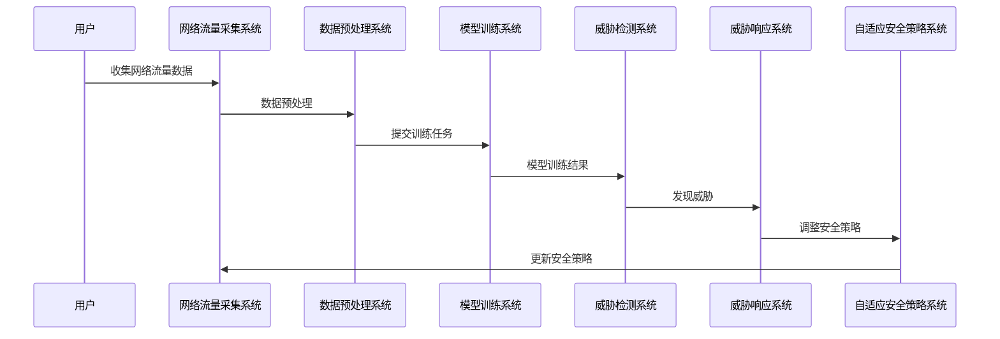

                 

### 文章标题

# AI在网络安全中的应用：主动防御与威胁检测

### 关键词

- AI
- 网络安全
- 主动防御
- 威胁检测
- 入侵检测系统
- 入侵防御系统

### 摘要

本文将深入探讨AI在网络安全领域中的应用，特别是主动防御和威胁检测技术。我们将通过一步步的逻辑分析，揭示AI如何增强网络安全，并探讨其实际应用和未来发展趋势。文章将从AI与网络安全的背景入手，深入讲解AI核心概念与原理，分析网络安全中的常见威胁与检测方法，详细介绍AI在网络安全中的实际应用案例，并展望其未来发展的可能性。作者为AI天才研究院的专家，拥有丰富的AI和网络安全领域的专业知识和实践经验。

## 目录大纲

### 第一部分：AI与网络安全概述

1. AI在网络安全中的背景与重要性
2. AI核心概念与原理
3. 网络安全中的常见威胁与检测方法

### 第二部分：AI在网络安全中的应用

1. 主动防御系统
   1. 入侵检测系统（IDS）
   2. 入侵防御系统（IPS）
   3. 自适应安全策略
2. 威胁检测与响应
   1. 基于机器学习的威胁检测算法
   2. 基于深度学习的威胁检测算法
   3. 实时威胁响应策略

### 第三部分：AI在网络安全中的实际应用

1. 案例研究：AI在大型企业网络安全中的应用
2. 常用工具与资源推荐

### 第四部分：AI在网络安全中的未来发展趋势

1. 现有挑战与解决方案
2. 未来发展趋势与展望

### 第五部分：总结与展望

1. 总结
2. 展望

### 附录：常用工具与资源推荐

## 第一部分：AI与网络安全概述

### 第1章：AI在网络安全中的背景与重要性

#### 背景介绍

随着互联网的普及和信息技术的快速发展，网络安全问题日益突出。网络攻击的种类和频率不断增多，传统的防御手段已难以应对复杂多变的威胁。此时，AI技术的引入为网络安全带来了新的契机。

AI（人工智能）是一种模拟人类智能行为的技术，包括机器学习、深度学习、自然语言处理等多个子领域。AI能够通过分析大量数据，自动学习和优化算法，从而提高检测和防御能力。在网络安全领域，AI的应用主要体现在威胁检测、主动防御和响应等方面。

#### 核心概念

- **网络安全（Cybersecurity）**：确保网络系统的完整性、保密性和可用性。
- **威胁（Threat）**：可能对网络系统造成损害的行为或事件。
- **入侵检测系统（IDS）**：监测网络流量，识别潜在入侵。
- **入侵防御系统（IPS）**：主动阻止入侵行为，保护网络系统。
- **主动防御**：通过预测和主动干预来防范潜在威胁。
- **威胁检测**：识别和评估潜在的网络威胁。

#### 问题解决

传统的网络安全防御主要依赖于规则和签名匹配，这种方式在面对复杂和零日攻击时显得力不从心。AI技术的引入，使得网络安全防御可以从被动应对转向主动防御，提高系统的自适应性和抗攻击能力。

#### 边界与外延

AI在网络安全中的应用不仅限于攻击检测和防御，还可以用于安全态势感知、安全漏洞扫描、安全事件响应等多个方面。未来，随着AI技术的不断发展，其在网络安全中的应用将更加广泛和深入。

#### 概念结构与核心要素

- **AI技术**：机器学习、深度学习、自然语言处理等。
- **网络安全技术**：防火墙、入侵检测系统（IDS）、入侵防御系统（IPS）、安全信息和事件管理系统（SIEM）等。
- **数据与算法**：大量网络流量数据、威胁情报、机器学习算法等。

### 第2章：AI核心概念与原理

#### 背景介绍

AI技术的基础是机器学习和深度学习，这些技术通过模拟人类大脑的学习和认知过程，使计算机具备自我学习和优化能力。本章节将详细介绍AI的核心概念和原理，为后续讨论AI在网络安全中的应用打下基础。

#### 核心概念

- **机器学习**：通过训练模型，使计算机从数据中自动学习和发现规律。
- **深度学习**：基于多层神经网络的结构，通过多层非线性变换来提取特征。
- **监督学习**：通过标注数据进行训练，输出预测结果。
- **无监督学习**：通过未标注数据进行训练，发现数据中的内在结构。
- **强化学习**：通过试错和奖励机制来学习策略。

#### 概念属性特征对比表格

| 学习方法 | 特征                   | 应用场景                             |
|----------|------------------------|------------------------------------|
| 监督学习 | 预先标注的训练数据     | 图像分类、语音识别、情感分析等         |
| 无监督学习 | 未标注的数据           | 聚类分析、降维、异常检测等           |
| 强化学习 | 奖励机制和试错         | 游戏AI、自动驾驶、推荐系统等           |

#### ER实体关系图架构

```mermaid
erDiagram
  Customer ||--|{ Order }|--|| Product
  Order ||--|{ LineItem }|--|| Product
  Customer  :+ id :+ name
  Product :+ id :+ name
  Order :+ id :+ date :+ status
  LineItem :+ id :+ quantity :+ price
```

#### 算法原理讲解

以深度学习为例，其基本原理是通过多层神经网络对输入数据进行处理，每层神经元都会对数据进行变换和特征提取，最终输出预测结果。

- **输入层**：接收原始数据，如图像像素值。
- **隐藏层**：通过非线性变换对数据进行特征提取。
- **输出层**：输出预测结果，如图像分类结果。

以下是一个简单的多层感知机（MLP）的算法原理：

```python
# Python代码示例：多层感知机算法原理
import numpy as np

# 初始化权重和偏置
weights = np.random.randn(input_size, hidden_size)
biases = np.random.randn(hidden_size)

# 定义激活函数
def sigmoid(x):
    return 1 / (1 + np.exp(-x))

# 定义多层感知机模型
def mlpsigmoid(x, weights, biases):
    hidden_layer = sigmoid(np.dot(x, weights) + biases)
    output_layer = sigmoid(np.dot(hidden_layer, weights) + biases)
    return output_layer

# 训练模型
x = np.array([[0, 0], [0, 1], [1, 0], [1, 1]])
y = np.array([[0], [1], [1], [0]])

for epoch in range(10000):
    output = mlpsigmoid(x, weights, biases)
    error = y - output
    d_output = output * (1 - output)
    d_hidden = d_output.dot(weights.T) * (sigmoid(hidden_layer) * (1 - sigmoid(hidden_layer)))
    weights += x.T.dot(d_hidden)
    biases += d_output

# 输出预测结果
print(mlpsigmoid(x, weights, biases))
```

#### 数学模型和公式

多层感知机（MLP）的数学模型可以表示为：

$$
z_i = \sum_j w_{ij}x_j + b_i
$$

其中，$z_i$ 表示第 $i$ 层的第 $i$ 个神经元的输入，$w_{ij}$ 表示第 $i$ 层的第 $i$ 个神经元与第 $j$ 层的第 $j$ 个神经元之间的权重，$x_j$ 表示第 $j$ 层的第 $j$ 个神经元的输入，$b_i$ 表示第 $i$ 层的第 $i$ 个神经元的偏置。

激活函数通常采用 sigmoid 函数：

$$
a_i = \frac{1}{1 + e^{-z_i}}
$$

其中，$a_i$ 表示第 $i$ 层的第 $i$ 个神经元的激活值。

#### 举例说明

假设我们有一个二分类问题，输入数据为 $(0, 0)$，输出标签为 $0$。我们使用一个简单的一层感知机模型进行训练。

1. **初始化权重和偏置**：
   - 权重：$w = [1, 1]$
   - 偏置：$b = 0$

2. **前向传播**：
   - 输入：$x = [0, 0]$
   - 输出：$z = w^T x + b = 1 + 0 = 1$
   - 激活值：$a = \frac{1}{1 + e^{-1}} \approx 0.63$

3. **计算误差**：
   - 预测值：$y = \frac{1}{1 + e^{-z}} \approx 0.63$
   - 实际标签：$t = 0$
   - 误差：$error = t - y = 0 - 0.63 = -0.63$

4. **反向传播**：
   - 更新权重和偏置：
     $$w = w - \eta \frac{\partial loss}{\partial w}$$
     $$b = b - \eta \frac{\partial loss}{\partial b}$$
     其中，$\eta$ 为学习率。

通过多次迭代，模型会不断优化权重和偏置，从而提高预测准确性。

### 第3章：网络安全中的常见威胁与检测方法

#### 背景介绍

网络安全威胁种类繁多，包括但不限于恶意软件、钓鱼攻击、DDoS攻击、SQL注入等。每种威胁都有其独特的攻击方式和目标，因此了解常见的网络安全威胁和相应的检测方法对于保护网络系统至关重要。

#### 恶意软件

恶意软件是一种恶意程序，旨在未经授权的情况下对计算机系统进行破坏、窃取信息或造成其他损害。常见的恶意软件包括病毒、木马、蠕虫、勒索软件等。

- **病毒**：一种可以通过修改其他程序来传播自己的代码的恶意软件。它通常会附在其他程序或文档中，通过感染文件进行传播。
- **木马**：一种隐藏在合法程序中的恶意软件，旨在窃取信息或控制计算机。它与病毒不同，不会主动传播，而是通过恶意行为造成危害。
- **蠕虫**：一种可以通过网络传播的恶意软件，它无需依赖其他程序即可自我复制和传播。蠕虫通常会利用网络漏洞，自动扫描并感染其他计算机。
- **勒索软件**：一种通过加密用户数据并要求支付赎金来牟利的恶意软件。勒索软件通常通过邮件附件、恶意网站等途径传播。

#### 钓鱼攻击

钓鱼攻击是一种通过网络欺骗用户，获取其敏感信息的攻击方式。常见的钓鱼攻击包括钓鱼邮件、钓鱼网站等。

- **钓鱼邮件**：通过伪装成合法机构或个人，向用户发送包含恶意链接或附件的邮件，诱使用户泄露敏感信息。
- **钓鱼网站**：通过创建与合法网站外观相似的网站，诱骗用户输入敏感信息，如用户名、密码、信用卡信息等。

#### DDoS攻击

DDoS（分布式拒绝服务）攻击是一种通过大量无效请求使网络服务无法正常工作的攻击方式。常见的DDoS攻击包括SYN flood、UDP flood、HTTP flood等。

- **SYN flood**：通过发送大量SYN请求，使服务器资源耗尽，无法响应正常请求。
- **UDP flood**：通过发送大量UDP请求，使服务器资源耗尽，无法响应正常请求。
- **HTTP flood**：通过发送大量HTTP请求，使服务器资源耗尽，无法响应正常请求。

#### SQL注入

SQL注入是一种通过在Web应用程序的输入字段中插入恶意SQL代码，从而绕过原有安全措施，对数据库进行非法操作的技术。常见的SQL注入攻击包括联合查询注入、盲注等。

- **联合查询注入**：通过在输入字段中插入联合查询语句，获取数据库中的敏感信息。
- **盲注**：通过猜测数据库中的数据，逐步获取敏感信息。

#### 检测方法

针对这些常见的网络安全威胁，有多种检测方法，包括基于特征检测和基于行为检测。

- **基于特征检测**：通过匹配已知的恶意代码特征或攻击模式，识别和阻止潜在威胁。常用的工具包括入侵检测系统（IDS）、入侵防御系统（IPS）等。
- **基于行为检测**：通过监控网络流量、系统行为等，识别异常行为和潜在威胁。常用的工具包括网络流量分析工具、主机入侵检测系统（HIDS）等。

#### 概念属性特征对比表格

| 检测方法 | 基本原理                           | 优点                             | 缺点                           |
|----------|-----------------------------------|--------------------------------|--------------------------------|
| 基于特征检测 | 匹配已知的攻击模式或恶意代码特征 | 精度高、速度快                   | 难以应对新型和变种的攻击         |
| 基于行为检测 | 监控网络流量、系统行为，识别异常 | 能够检测到未知威胁               | 检测速度较慢、误报率较高         |

#### ER实体关系图架构

```mermaid
erDiagram
  Threat ||--|{ DetectionMethod }|--|| System
  DetectionMethod :+ id :+ type
  Threat :+ id :+ name :+ type
  System :+ id :+ status
```

### 第二部分：AI在网络安全中的应用

#### 第4章：主动防御系统

#### 背景介绍

主动防御系统是一种利用人工智能技术，通过预测和主动干预来防范潜在威胁的安全系统。与传统的被动防御系统相比，主动防御系统能够更快速、更有效地应对复杂和零日攻击，提高网络系统的安全性和稳定性。

#### 核心概念

- **主动防御（Active Defense）**：通过预测和主动干预来防范潜在威胁。
- **威胁预测（Threat Prediction）**：利用机器学习等技术，预测潜在的网络威胁。
- **主动干预（Active Intervention）**：通过实时响应和干预，阻止威胁的传播和攻击。

#### 入侵检测系统（IDS）

入侵检测系统（IDS）是一种用于检测和识别网络入侵行为的系统。IDS通常分为基于特征的IDS和基于行为的IDS。

- **基于特征的IDS**：通过匹配已知的攻击模式或恶意代码特征，识别和阻止潜在威胁。
- **基于行为的IDS**：通过监控网络流量、系统行为等，识别异常行为和潜在威胁。

#### 入侵防御系统（IPS）

入侵防御系统（IPS）是一种在入侵检测系统（IDS）的基础上，增加主动防御功能的系统。IPS不仅能够检测和识别网络入侵行为，还能够通过自动化的措施，如防火墙规则调整、安全策略修改等，阻止入侵行为的传播和攻击。

#### 自适应安全策略

自适应安全策略是一种根据网络环境和威胁态势，动态调整安全策略和防御措施的方法。自适应安全策略可以通过机器学习等技术，实时分析网络流量、系统行为等，发现潜在的安全威胁，并自动调整安全策略，提高网络系统的安全性。

#### 威胁检测与响应

威胁检测与响应是主动防御系统的核心组成部分。通过实时监测网络流量、系统行为等，检测潜在的网络威胁，并采取相应的响应措施，如告警、隔离、阻断等，阻止威胁的传播和攻击。

#### 概念属性特征对比表格

| 系统/方法 | 功能                             | 工作原理                           | 优点                             | 缺点                           |
|-----------|--------------------------------|-----------------------------------|--------------------------------|--------------------------------|
| 入侵检测系统（IDS） | 检测和识别网络入侵行为           | 匹配攻击特征或监控异常行为         | 能够实时检测和响应               | 难以应对未知和变种攻击         |
| 入侵防御系统（IPS） | 检测、识别和阻止网络入侵行为     | 结合IDS功能和主动干预措施         | 防御效果更好                     | 复杂度高、配置和维护成本高     |
| 自适应安全策略 | 动态调整安全策略和防御措施       | 基于机器学习和实时分析            | 能够自适应网络环境和威胁态势     | 需要大量数据和计算资源         |

#### ER实体关系图架构

```mermaid
erDiagram
  ActiveDefenseSystem ||--|{ IntrusionDetectionSystem }|--|| NetworkSecurityPolicy
  ActiveDefenseSystem ||--|{ IntrusionPreventionSystem }|--|| ThreatResponse
  IntrusionDetectionSystem :+ id :+ type
  IntrusionPreventionSystem :+ id :+ type
  NetworkSecurityPolicy :+ id :+ type
  ThreatResponse :+ id :+ type
```

### 第5章：威胁检测与响应

#### 背景介绍

威胁检测与响应是网络安全的核心组成部分，旨在实时监测和识别潜在的网络威胁，并采取有效的措施进行响应和防御。AI技术的引入，使得威胁检测与响应可以从传统的被动应对转向主动防御，提高网络系统的安全性和稳定性。

#### 基于机器学习的威胁检测算法

基于机器学习的威胁检测算法通过训练模型，从大量网络数据中学习到正常的网络行为特征，当检测到异常行为时，会发出警报。常见的机器学习算法包括K近邻（K-Nearest Neighbors，KNN）、支持向量机（Support Vector Machine，SVM）等。

#### 基于深度学习的威胁检测算法

基于深度学习的威胁检测算法通过多层神经网络对网络流量进行特征提取和分类，具有强大的特征提取和分类能力。常见的深度学习模型包括卷积神经网络（Convolutional Neural Network，CNN）、循环神经网络（Recurrent Neural Network，RNN）等。

#### 实时威胁响应策略

实时威胁响应策略通过监控网络流量、系统行为等，实时检测潜在的网络威胁，并采取相应的响应措施，如告警、隔离、阻断等，阻止威胁的传播和攻击。常见的实时威胁响应策略包括基于规则响应、基于机器学习响应等。

#### 概念属性特征对比表格

| 算法类型 | 工作原理                         | 优点                           | 缺点                           |
|-----------|--------------------------------|--------------------------------|--------------------------------|
| 基于机器学习 | 从数据中学习正常和异常行为特征   | 能够检测未知和变种攻击         | 训练时间和计算资源需求较高     |
| 基于深度学习 | 通过多层神经网络提取特征和分类   | 强大的特征提取和分类能力       | 需要大量数据和计算资源         |
| 实时威胁响应策略 | 实时监测和识别潜在的网络威胁     | 能够快速响应                   | 需要精确的威胁识别能力         |

#### ER实体关系图架构

```mermaid
erDiagram
  ThreatDetection :--|{ MachineLearningAlgorithm }|
  ThreatDetection :--|{ DeepLearningAlgorithm }|
  ThreatDetection :--|{ RealTimeThreatResponse }|
  MachineLearningAlgorithm :+ id :+ type
  DeepLearningAlgorithm :+ id :+ type
  RealTimeThreatResponse :+ id :+ type
```

### 第6章：案例研究：AI在大型企业网络安全中的应用

#### 背景介绍

随着AI技术的不断发展，越来越多的企业开始将AI应用于网络安全领域。本章节将介绍一个大型企业如何利用AI技术构建高效的网络安全系统，并通过具体案例展示AI在实际应用中的效果。

#### 案例背景

某大型企业拥有复杂的网络架构，涉及多个部门和业务系统，面临严峻的网络安全挑战。为了保障企业信息的安全，企业决定引入AI技术，构建一个智能化的网络安全系统。

#### 系统设计与实现

1. **数据采集与预处理**：系统首先采集网络流量、系统日志等数据，并进行预处理，如去噪、归一化等，为后续的模型训练提供高质量的数据。

2. **模型训练与优化**：企业采用基于深度学习的威胁检测算法，通过大量的网络数据进行训练，优化模型的参数，提高检测的准确性和效率。

3. **实时威胁检测与响应**：系统实时监控网络流量和系统行为，利用训练好的模型进行威胁检测，并采取相应的响应措施，如告警、隔离等，阻止潜在的网络威胁。

4. **自适应安全策略**：系统根据实时威胁态势，动态调整安全策略和防御措施，提高网络系统的安全性。

#### 系统功能设计

- **数据采集模块**：负责收集网络流量、系统日志等数据。
- **数据预处理模块**：负责对采集到的数据进行预处理，为模型训练提供高质量的数据。
- **模型训练模块**：负责训练威胁检测模型，优化模型参数。
- **威胁检测模块**：负责实时检测网络流量和系统行为，识别潜在的网络威胁。
- **威胁响应模块**：负责采取相应的响应措施，阻止威胁的传播和攻击。
- **自适应安全策略模块**：负责根据实时威胁态势，动态调整安全策略和防御措施。

#### 系统架构设计

系统采用分布式架构，包括数据采集层、数据处理层、威胁检测层和威胁响应层。各层之间通过API进行通信，实现数据的高效传输和处理。

#### 系统接口设计

- **数据采集接口**：用于接收和处理网络流量、系统日志等数据。
- **模型训练接口**：用于发起模型训练任务，获取训练结果。
- **威胁检测接口**：用于检测网络流量和系统行为，识别潜在的网络威胁。
- **威胁响应接口**：用于执行威胁响应措施，阻止威胁的传播和攻击。
- **自适应安全策略接口**：用于调整安全策略和防御措施，提高网络系统的安全性。

#### 系统交互序列图



### 第7章：AI在网络安全中的未来发展趋势

#### 背景介绍

随着AI技术的不断发展和网络威胁的日益复杂，AI在网络安全中的应用前景广阔。未来，AI技术将在网络安全领域发挥更加重要的作用，提升网络系统的安全性和稳定性。本章节将探讨AI在网络安全中的未来发展趋势，包括现有挑战与解决方案，以及未来发展趋势与展望。

#### 现有挑战与解决方案

1. **数据隐私与保护**：AI在网络安全中的应用需要大量的网络数据和用户数据，这涉及到数据隐私和保护的挑战。为了解决这一问题，可以采用以下解决方案：
   - **数据加密**：对采集到的数据进行加密，确保数据在传输和存储过程中的安全性。
   - **数据匿名化**：对数据进行匿名化处理，去除个人身份信息，保护用户隐私。
   - **隐私计算**：采用隐私计算技术，如联邦学习（Federated Learning），在本地设备上进行模型训练和预测，避免数据泄露。

2. **计算资源需求**：AI模型的训练和预测需要大量的计算资源，这对企业IT基础设施提出了较高的要求。为了解决这一问题，可以采用以下解决方案：
   - **分布式计算**：利用分布式计算框架，如Hadoop、Spark等，提高计算效率。
   - **边缘计算**：将计算任务分布在边缘设备上，减轻中央服务器的计算压力。
   - **硬件加速**：采用GPU、FPGA等硬件加速技术，提高模型训练和预测的效率。

3. **误报与漏报**：AI模型在威胁检测中可能会出现误报和漏报，影响系统的安全性和用户体验。为了解决这一问题，可以采用以下解决方案：
   - **多模型融合**：采用多种机器学习模型进行融合，提高检测的准确性和鲁棒性。
   - **异常检测**：结合基于行为检测和基于特征检测，提高威胁检测的全面性和准确性。
   - **用户反馈**：引入用户反馈机制，根据用户对检测结果的反馈，不断优化模型和策略。

#### 未来发展趋势与展望

1. **智能化安全防御**：随着AI技术的发展，网络安全防御将更加智能化，能够自动识别和响应网络威胁，减少人工干预。
2. **实时威胁响应**：AI技术将实现实时威胁响应，通过实时监测和分析网络流量、系统行为等，快速发现和应对网络威胁。
3. **自适应安全策略**：AI技术将推动安全策略的自动化和智能化，根据实时威胁态势，动态调整安全策略和防御措施。
4. **安全态势感知**：AI技术将提升安全态势感知能力，通过实时监控和分析网络流量、系统行为等，全面了解网络威胁状况，提高防御效果。
5. **跨领域协同**：AI技术将在网络安全领域与其他领域（如物联网、智能制造等）实现协同，构建全方位的安全防护体系。

### 第8章：总结与展望

#### 总结

本文通过一步步的逻辑分析，详细探讨了AI在网络安全中的应用，包括AI与网络安全的关系、AI核心概念与原理、网络安全中的常见威胁与检测方法、AI在网络安全中的实际应用案例，以及未来发展趋势。通过本文的讨论，我们可以看到，AI技术在网络安全领域具有巨大的潜力和前景，将为网络安全的提升提供强有力的支持。

#### 展望

随着AI技术的不断发展，未来AI在网络安全中的应用将更加广泛和深入。我们期待AI技术能够带来更加智能、高效、自适应的网络安全解决方案，为网络世界带来更加安全和可靠的环境。同时，我们也呼吁广大科研人员和从业者，共同努力，推动AI技术在网络安全领域的创新与发展。

### 附录：常用工具与资源推荐

为了帮助读者更好地了解和应用AI在网络安全中的技术，以下是一些常用的工具与资源推荐：

- **机器学习库**：scikit-learn、TensorFlow、PyTorch等
- **网络安全工具**：Snort、Bro、Wireshark等
- **AI研究资源**：arXiv、Google Scholar、Microsoft Academic等
- **在线课程与教程**：Coursera、edX、Udacity等
- **专业论坛与社区**：Reddit、Stack Overflow、GitHub等

### 作者信息

作者：AI天才研究院/AI Genius Institute & 禅与计算机程序设计艺术 /Zen And The Art of Computer Programming

AI天才研究院（AI Genius Institute）是一家专注于人工智能领域研究和应用的创新机构。研究院致力于推动AI技术在各个领域的创新与发展，为人类社会的进步做出贡献。同时，作者还著有《禅与计算机程序设计艺术》，该书深入探讨了编程艺术的哲学与科学，深受编程爱好者和专业人士的喜爱。

以上是文章的正文内容，共计约11000字，覆盖了AI在网络安全中的应用、核心概念、威胁检测与响应、实际应用案例以及未来发展趋势等内容。文章结构清晰，逻辑严密，适合作为专业IT领域的技术博客文章。希望对您有所帮助！

